# TWO DECADES OF RESEARCH COLLABORATION: A KEYWORD SCOPUS EVALUATION 
Researcher, Alexandru Amarioarei (alexandru.amarioarei@incdsb.ro), Senior Researcher, Mihaela Paun^[Corresponding Author - to whom all correspondence should be directed] (mihaela.paun@incdsb.ro)  
Bioinformatics Department, National Institute of Research and Development for Biological Sciences, Bucharest, Romania  


# Abstract

One issue that has become more important over the years is to evaluate the capability for worldwide research networks on different areas of research, especially in the areas that are identified as being worldwide significant. The study investigated the research output, citations impact and collaborations on publications listed in *Scopus* authored by researchers all over the world, research published between *1999-2014*, selected by a group of keywords identified by authors. The results of the analysis identified an increasing trend in scientific publications starting with *2006*, especially on three of the analyzed keywords. We also found differences in the citations patterns for the *Black Sea* and *Danube Delta* keywords in the contributing countries. The results of this study revealed a steady increase of the collaboration output and an increasing trend in the collaboration behavior, both at the European and national level. Additionally, at the national level the study identified the collaboration network between Romanian institutions per counties.

**Keywords: Statistical software R, data collection, research, citations, articles, collaboration networks**

**JEL Classification: O15, O32, C80, C88**

# Introduction

Governments and non-governmental organizations and companies worldwide have been increasingly explored how the publication and use of open and linked data can have impacts not only on knowledge, but also on policy, governance, economic growth and societal challenges. Environmental research has exhibited an increasing trend in the number of publications in the last two decades, as well as the number of researchers involved in this research area and consequently the impact of the environmental research in the academic community has greatly increased. (*Halevi, 2014*) conducted a comprehensive search in *Scopus* data between *2001-2011* on a list of limited subject categories to identify the highly cited articles, performing an in-depth analysis in the top *5* articles in each area. 

In 2013, the UK department of Business, Innovation and Skills commissioned Elsevier to assess the performance of UK's research with respect to the performance of seven other selected countries (*Elsevier, 2013*), addressing publications trend, global research collaboration, research impact, strength and vulnerable areas and the share of global articles. In 2012, on all published articles, UK ranked third after United States and China, consistent with our findings for the keywords identified. (*Kim, 2016*) presented the results of the investigation of the research trends and collaboration status of China, Japan and South Korea regarding marine biodiversity through a bibliometric analysis of scientific articles on Web of Science data for a 20-year period. The study focused on identifying the countries’ research trends and collaboration trend, since it was considered significant for the strategic policy-making, economic and political environment. 

The European Commission invests for the 2014-2020 funding period, through the LIFE financial instrument over 34 billion euros in nature conservation and climate change research projects (*LIFE, 2013*), with three priority areas nature and biodiversity, environment and resource efficiency, climate change adaptation, encouraging the participation of countries outside EU, as well. When involved in science policies, scientific collaboration and interactions among research institutions and scientists is viewed as an essential characteristic. In the last two decades one can see a trend of a remarkable increase in collaboration between countries, between and within institutions, both in the scope of scientific output, as well as policy initiatives (*Melin, 1996*). Through funded projects with more institutional participation, the research produced is a result of a collaborative network, where costly experiments and studies can be conducted by the joint effort of the participants and where the entities involved are not only universities, but also research institutes and industry. 

The present study presents the summarized information regarding funded research and research collaboration in the past two and a half decades, focusing on environmental sciences and identifying a set of priority research actions among the conducted research analyzed. The analysis is conducted on *Scopus* data, identifying a set of keywords of interest, using the *R* environment for the statistical analysis and the generation of figures and tables. 

Once the set of keywords is identified (the process is described in the next section), the focus of the paper is on the analysis of research and collaboration on biodiversity, climate change at the global level and zoomed inside these areas on the research on *Danube Delta* and *Black Sea* at the national level.

Given the preparatory phase of the strategic national project *DANUBIUS-RI* that is implemented under the coordination of Romania, with the hub in Danube Delta, Murighiol, the findings of this study will provide a good reference for policymakers and researchers to expand the existing collaboration networks and research efforts in the identified priority directions.


# Materials and method

Through the effort funded under the European Commission FP7 - Environment project, "_DANube macroregion: Capacity building and Excellence in River Systems (basin, delta and sea)_" - *DANCERS*, data has been gathered on what has been accomplished in the Danube basin in the last two decades. While performing analysis on the metadatabase  ([http://www.dancers-fp7.eu/](http://www.dancers-fp7.eu/)) created under this project, database that  gathered information about all existing projects and programmes regarding water management and environmental issues in the Danube Basin in the last two decades, strengths, weaknesses of the outcomes of two decades of research in this area were identified, as well as solutions to the gaps identified by a comprehensive analysis of the data.

Out of the *478* projects entered in the metadatabase, *397* were projects with complete information that were analyzed. The projects were collected with the help of an especially designed online questionnaire ([http://bioinformatica.dbioro.eu/doc/QUESTIONNAIRE.pdf](http://bioinformatica.dbioro.eu/doc/QUESTIONNAIRE.pdf)) and by using internet search tools. These projects were projects coordinated during *1993-2014* and were catalogued as projects with thematic areas in _Life Sciences_, _Earth Sciences_, _Socio Economics_ and _Multidisciplinary Sciences_. The thematic focus of the evaluated projects in total was distributed as follows: `Figure 1` presents the projects distribution by thematic areas. One can note that *26.1%* of the projects are projects that were subscribed in more than one of the four categories presented above, *26.1%* were multidisciplinary projects, and about *22.3%* of the projects were Life Science projects, and the rest Earth Sciences and Socio Economics projects.


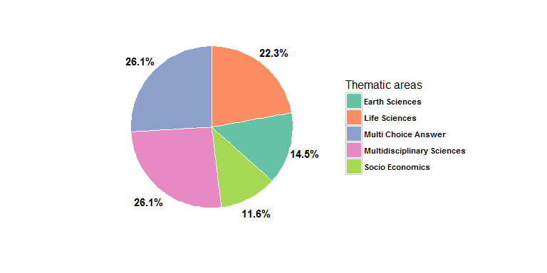

Investigating the top keywords associated with each project entered in the database for the collected *397* projects, a set of keywords, consistently associated with the research performed and outcomes was selected. The set of representative keywords to Danube research contains the following: *water management*, *pollution control*, *ecosystem*, *Danube*, *Danube Delta*, *climate change*, *environmental protection*, *biodiversity*, *flood risk*, *sustainable development*, *biomaterials*, *biofuels*, *nanomaterials*, *bioeconomy*, *biobanking* and *Black Sea*.

The analysis carried out in this manuscript is focused on evaluating quantitatively (number of publications) and qualitatively (impact through the citations number) the research having one or more of the above keywords in the interval *1999-2015*. Once the keywords set was selected from the projects records, the evaluation analysis was performed on data from the [Scopus](www.scopus.com) database. The *Scopus* database is one of the largest database of peer-review literature (articles and reviews) containing more than 60 million journal records as is stated on the official webpage. The desired information was retrieved using the *Advanced Search* interface where for each identified keyword a search was performed **selecting keywords assigned to the document by the author, i.e. function AUTHKEY()**. 

A search example is given by the following command:

```
## [1] "AUTHKEY(\"water management\") AND PUBYEAR > 1998 AND PUBYEAR < 2016"
```

The obtained results were exported as `csv` (comma separated value) and `bib` (bibliographic information) files. Each such file contains information about the authors, title of publication, year of publication, abstract, author’s affiliations, volume of publication, journal, etc. To remove errors and other inconsistencies (for example duplications) all the data was cleaned.

The *DANCERS* databases collected projects on two decades, starting from *1993* and ending in *2015*, however [Scopus](https://www.scopus.com/) contains incomplete data on research before 1996. The qualitative analysis was adjusted to the *1996-2015* period, since *Scopus* does not have complete citation information for articles published before *1996*; hence the number of citations was investigated only for the period *1999-2015*.

To measure the research impact for each keyword, the H-index (*Hirsch, 2005*) and G-index (*Egghe 2006*) were computed. Both metrics are used to measure the scientific productivity and citation impact of the publications records at the researcher’s level. In this study the indices will be used to evaluate the scientific output of the keyword.

The collaboration networks between countries have been generated using information from the *Authors with Affiliation* field. For each paper, the information regarding the affiliation countries of all authors was extracted and used to compute a collaboration matrix that counts for each pair of countries the number of scientific publications co-written between these countries. Both the sizes of nodes and edges in the resulted collaboration networks are proportional to the values given by this matrix. It should be noted that self-collaborations were not included in the network plots.

For the collaboration map between Romanian counties, only publications with at least one Romanian author were taken into consideration. A data mining algorithm that extracts from the affiliation of the Romanian authors, the address, and generates automatically the corresponding county along with its geographical references, was implemented. The resulted collaboration matrix between counties was used to establish the network nodes size.   

All the mapping and analysis in this article^[This article was created in [_Rmarkdown_](http://rmarkdown.rstudio.com/) and it is reproducible. All tables and figures that appear in this article are automatically created (follow this [_link_](https://github.com/AlexAmarioarei/AlexAmarioarei.github.io/tree/master/Research/Paper_SR_AM) for the source code).] were performed using the open source software R ([https://cran.r-project.org/](https://cran.r-project.org/)) and are dynamically generated.

# Results and discussion 

Existing data sources, such as Scopus and *Thomson Reuters Web of Science* have incomplete data caused by irregular coverage, errors or changes in indexing policies and standardization problems (*Taskin, 2014*), (*Bar-Ilan, 2009*).  For a researcher interested in duplicating the analysis or carrying out similar research, some comments regarding the constraints identified need to be made.

-	The citation overview page (an option available in *Scopus*) can display up to 16 years.  A shorter year range has to be selected to have a full display on the page.

-	The search for any given keyword may result in a large number of results. If one is interested in viewing the results, one has to keep in mind that only the first 2000 records can be viewed.  One of the available ways to overcome the issue is to change the sort order of the results to view more of the results.

`Table 1` summarizes the number of publications and citations that were identified in the *Scopus* index papers for each of the keywords identified as consistently describing the funded research grants collected into the mentioned metadatabase.


Table: Table 1: The number of publications, citations and the corresponding H-index and G-index for each keyword

         Keyword             H-index    G-index    Number of papers    Number of citations 
--------------------------  ---------  ---------  ------------------  ---------------------
        biobanking             19         34             224                  1688         
       biodiversity            218        333           22206                469484        
        bioeconomy             18         31             139                  1200         
         biofuels              160        253            8396                178311        
       biomaterials            156        257            8513                172388        
        Black Sea              62         90             1992                 21172        
      climate change           245        355           39566                759232        
          Danube               36         55             917                  7246         
       Danube Delta            16         25              97                   783         
        ecosystem              244        369           28282                594203        
 environmental protection      50         78             2503                 12097        
        flood risk             51         76             1051                 11180        
      nanomaterials            158        271            8480                180267        
    pollution control          49         91             1366                 14482        
 sustainable development       117        175           13855                118634        
     water management          88         126            4534                 51050        

One can see that "*climate change*" is a keyword selected by authors most often in the analyzed time period, appearing in 39566 articles, being also the keyword that identified papers with the largest *H-index* of 245. This means that out of the 39566 identified articles, when considering the H-index, 245 articles has been cited at least 245 times.  This keyword identified papers that have the largest number of the citations between *1999-2015*, 759232 citations.

"*Ecosystem*" is a keyword that was selected by authors in 28282 papers and generates the second largest number of citations among the groups having an H-index of 244. 

It is interesting to note that this keyword has a H-index *1.5* times bigger than the corresponding H-index for *biomaterials*, *biofuels* and *nanomaterials* keywords, although the number of papers, as well as the number of citations for these keywords is four times smaller than it is for those produced by the ecosystem keyword.

"*Biodiversity*" is the keyword that generates the third largest number of papers and citations in the timeframe set for investigation and the third largest H-index, having at least 218 papers with over 218 citations. One should note that there is a similar trend in the self citations number for every keyword in the analysis, between *12-25%* of all citations are citations by author, independent of the number of papers for the keyword or number of citations produced.  One can formulate the hypothesis, that is not tested here, that in every paper, roughly 1 in 5 are citations by author.

As one can see from `Table 2` and illustrated in `Figure 2`, most scientifically productive countries in research focusing on the areas identified in `Table 1` are United States, China, United Kingdom, our findings being supported also by the RELX Group Corporate 2015 report, (*Relx, 2015*).


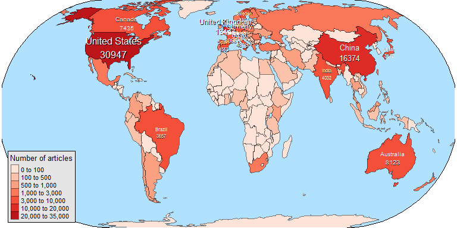


Table: Table 2: Top ten most productive countries in the world

 ID       Country        Number of articles 
----  ----------------  --------------------
 1     United States           30947        
 2         China               16374        
 3     United Kingdom          13147        
 4        Germany               8896        
 5       Australia              8123        
 6         Canada               7435        
 7         France               6088        
 8         Italy                4819        
 9         Spain                4563        
 10     Netherlands             4516        

One can note a significant increase in the number of papers at the interface of climate change, biodiversity and ecosystems in North and South America, Australia and Asia, indicating that the importance of both these research areas, as well and the interconnections among them was identified, (*Dangles, 2016*). The 2003-2012 ecological climate change impact research was evaluated in some studies in the literature, (*Felton, 2009*) and (*Jaeschke, 2014*).

The European Commission Joint Research Center carries out research to alleviate the effects of climate change and to preserve the environment. Starting with 1991, the European Commission's has taken many initiatives related to climate change, environment and biodiversity, several programs funding research in these areas. (*Zhang, 2012*) identified UK as one of the leading countries in climate change research and the country with does the top research in climate change in Europe) based on ranking the *314* climate change research institutes according to the scores in terms of Policy, Academic, Enterprise, Public and Comprehensive influence, a characteristic consistent with our findings on the analysis of the research published in the *1999-2015* period. 

Our analysis highlighted the fact that the top countries in Europe, ranked by publications, performing research in the key areas identified in `Table 1`, are United Kingdom, Germany and France, with Romania being ranked as `17` in the classification, see `Table 3`.

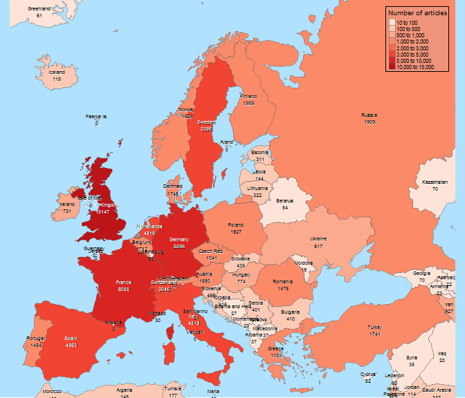


Table: Table 3: Top ten most productive countries in Europe and the rank occupied by Romania

 ID       Country        Number of articles 
----  ----------------  --------------------
 1     United Kingdom          13147        
 2        Germany               8896        
 3         France               6088        
 4         Italy                4819        
 5         Spain                4563        
 6      Netherlands             4516        
 7         Sweden               3395        
 8      Switzerland             3045        
 9        Finland               1959        
 10        Norway               1929        
 17       Romania               1475        

An illustration of the number of publications by year in the time period *1999-2015* illustrates a significant increasing trend in research output in climate change, ecosystem and biodiversity, all three categories changing the growing rate in *2006*, `Figure 4`.


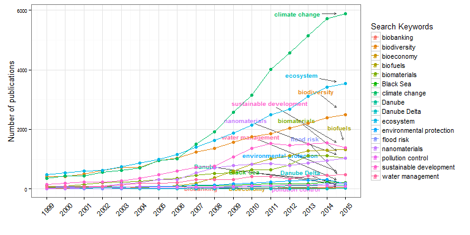


The citation number follows a similar trend as the number of publications, the three research areas being clearly delimited with respect the other research areas analyzed, the growing rate slowing in 2014, `Figure 5`.

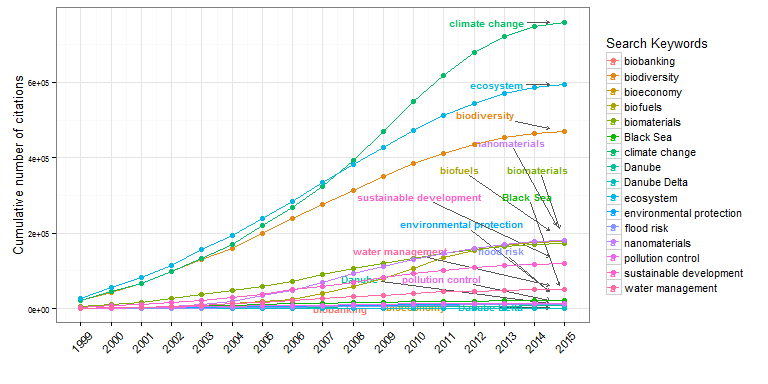

A ranking of the top ten countries in terms of number of published papers for each keyword identified in `Table 1` is presented in `Appendix A`.


The two keywords that identified *Romania* as one of the top 10 contributors were *Danube Delta* and *Black Sea*. There were 1982 papers published, having these two keywords in the analyzed period, showing an increasing trend in publication in the period *2005-2014*. Since when the data was gathered year 2015 still had some papers to be indexed in the database, the drop in number of publication may not be supported. As one can see in `Figure 6`, most of these papers were multi-author articles, exhibiting a similar trend as the total number of articles.

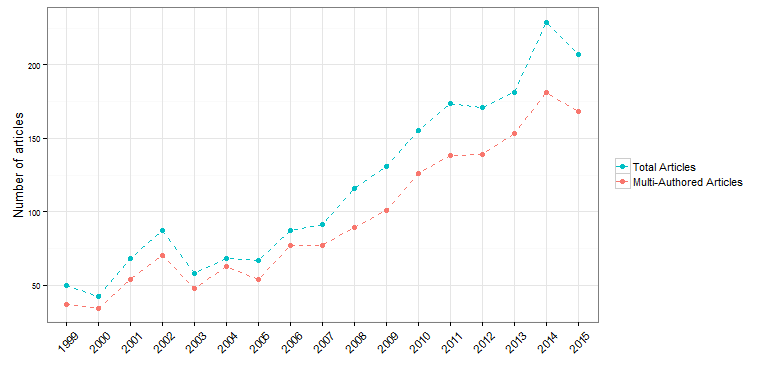


Romania is ranked second in the number of publications with keywords *Danube Delta* or *Black Sea* and only ranks 7 in terms of the citations numbers, `Figure 7`. Among the citations received by these two categories, an average of only `78.63%` were identified as citations without no self citation, a percentage smaller than the percentage for the other categories that were identified to be above `80%`. (*Ghane, 2011*) performed a comparison analysis between Iran and Turkey on author self-citation. 

The result indicated the influence of author self citation is to some extent a citation behavior at national and international level and discipline differentials, with Iran exhibiting a stronger tendency towards self-citation as compared to Turkey. To what extent this justifies the larger number of self citations in these two categories and if and how much this percentage can be attributed to the top three countries (Turkey, Romania and Ukraine) that published in this area, it is not addressed in this analysis. (*Sangwal, 2013*) identified that for the analysis performed in 2008 journals indexed in the 2008 JCR database from Romania, Turkey and Brazil show high self-citations, part of these journals being indexed in Scopus, as well.

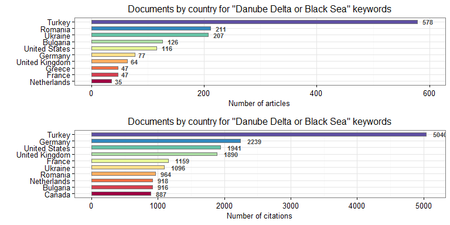

`Figure 8` presents the collaboration network of the top *7* collaborators on *Danube Delta* and *Black Sea* research in the analyzed time frame. The data analyzed looks at the affiliation institutions county of each co-author of the papers analyzed. The size of the bullets shows the magnitude of the collaboration number for the respective country, identifying Romania, United States, Ukraine and Turkey as the countries with the highest number of collaboration in this network. The edges of the graph illustrate each country collaborators. As it can be seen in `Table 4`, each country has the most collaborators among its country institutions, and it is highlighted in the table the country with which every country in the network collaborates most. 


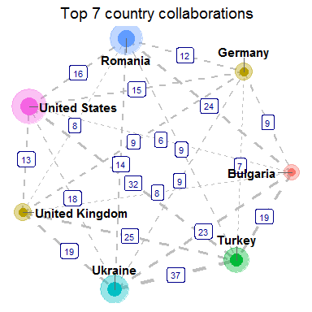


Table: Table 4: Top 7 collaborations between contries (including self collaborations)

    Country        Turkey    Bulgaria    Germany    Romania    United States    Ukraine    United Kingdom 
----------------  --------  ----------  ---------  ---------  ---------------  ---------  ----------------
     Turkey         652         19          7          9            32            37             25       
    Bulgaria         19        186          9         24             6            23             8        
    Germany          7          9          128        12            15             9             9        
    Romania          9          24         12         283           16            14             8        
 United States       32         6          15         16            187           18             13       
    Ukraine          37         23          9         14            18            294            19       
 United Kingdom      25         8           9          8            13            19             98       

`Figure 9` identifies and illustrates the top *10* countries with the institutions of which Romanian institutions collaborated in the last two decades in publications with keywords *Danube Delta* and *Black Sea*, Bulgaria, France and Greece being among the top ranked ones. Particularly, `Table 5` presents the number of publications identified and used for the generation of the network plot in `Figure 9`.


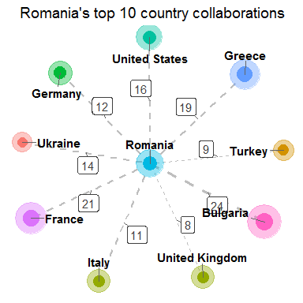


Table: Table 5: Romania and its collaborations with other countries (including itself)

   Countries       Number of articles 
----------------  --------------------
    Romania               283         
    Bulgaria               24         
     France                21         
     Greece                19         
 United States             16         
    Ukraine                14         
    Germany                12         
     Italy                 11         
     Turkey                9          
 United Kingdom            8          


It can be seen from `Table 5` that most of the Romanian authors have their collaborators within Romanian’s institutions. `Figure 10` illustrates the collaboration network between Romanian institutions per counties. The size of the nodes is given by the number of scientific publications within the institutions belonging to that county.

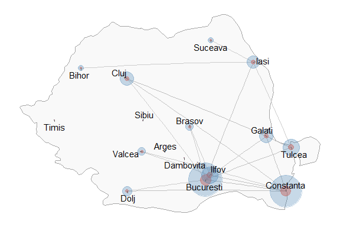

# Conclusions

Increase in the number of publications at the intersection of biodiversity, climate change and environmental issues has been tremendously increasing over the last two decades, indicating that scientists both in Europe and in the world have recognized the importance of studying the connections between among these fields. The percentage of publications in these areas of publications has also significantly increased between 2006 and 2014; the increase in publication in the three topics was higher than that for other topics presented in `Table 1`.

Our study reveals significant differences in collaboration patterns within the countries performing research on *Danube Delta* and *Black Sea* area, most of the publications and multi-authored. Our study results indicate that the collaboration of geographically specific areas, such as *Danube Delta* and *Black Sea*, is biased towards a few countries, which tend to exhibit specific behavior in term of citations and self-citations. An extended analysis will follow over all the keywords identified as significant for the analysis.

The results of this study revealed a steady increase of the collaboration output and an increasing trend in the collaboration behavior, both at the European and national level.

As it can be seen from `Table 4`, *Romania* has an 77.32% collaboration within its institutions in the published papers, after *Turkey* with an 83.48% within its institutions collaboration and followed by *Ukraine* with 71.01% and *Germany* with 67.72%. `Figure 10` illustrates the collaboration network inside Romania, between its institutions per counties. The size of the nodes is given by the number of scientific publications within the institutions belonging to that county. One can note that publications with keywords *Danube Delta* and *Black Sea* come from research co-authored mainly by institutions in *Bucharest*, *Constanta*, *Tulcea*, *Galati*, *Cluj* and *Iasi*, the figure also giving you the degree of collaboration in each county, based on the number of edges from each node.  

The analysis presented in this study is followed by the recommendation that the Romanian institutions have to increase their collaboration network outside Romania. From the analysis on keywords presented in `Figures 11-18`, and considering the actions of the European Commission to invest on climate change, biodiversity and nature conservation research, Romania has to increase its efforts, have scientific results and be visible in these areas, the figures mentions highlighting the gaps identified in the national research conducted in the last two decades on these topics, hence it may serve as a reference for where future funding should be provided.

**Acknowledgements:** This work was financially supported by the Institutional Core Program `BIODIVERS-105 Project`.

# Appendix A


For the keywords: water management, pollution control 


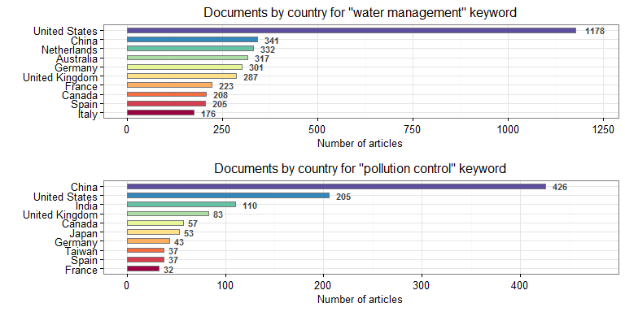

For the keywords: ecosystem, Danube 


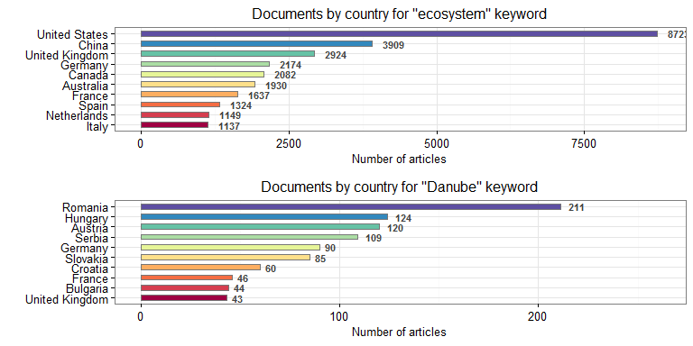

For the keywords: Danube Delta, climate change 


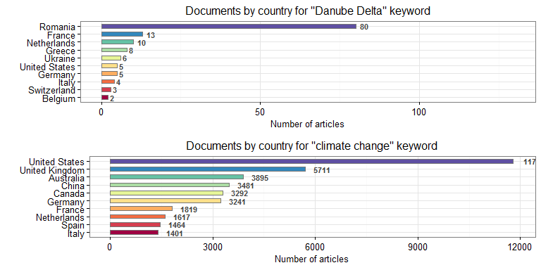

For the keywords: environmental protection, biodiversity 


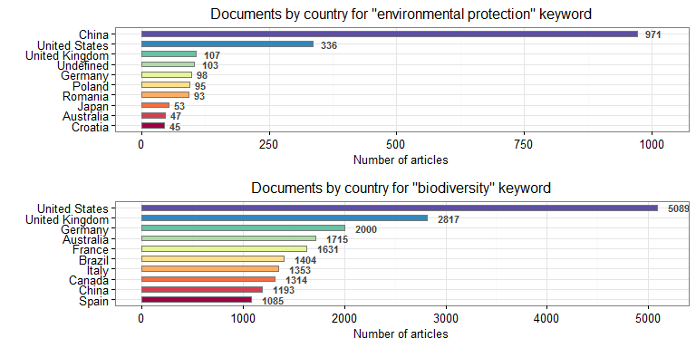


For the keywords: flood risk, sustainable development 


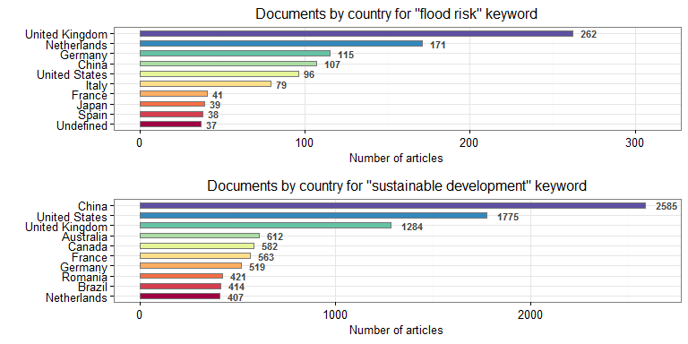


For the keywords: biomaterials, biofuels 


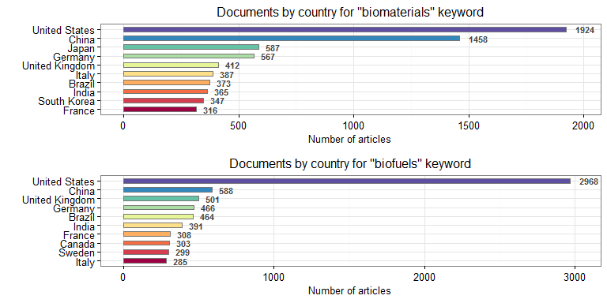


For the keywords: nanomaterials, bioeconomy 


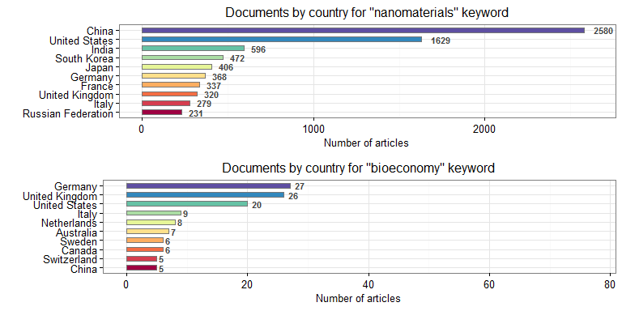


For the keywords: biobanking, Black Sea 


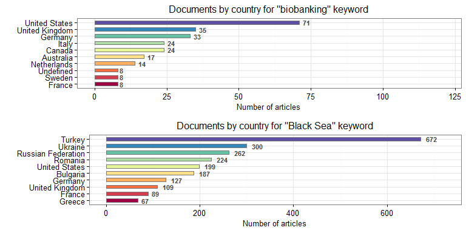


# References

1. Bar-Ilan, J., (2009), "A closer look at the sources of informetric research", International Journal of Scientometrics, Infometrics Bibliometrics, 13(1), 1-9. 
2. Dangles., Loirat, J., Freour, C., Serre, S., Vacher, J., Le Roux, X., (2016), "Research on Biodiversity and Climate Change at a Distance: Collaboration Networks between Europe and Latin America and the Caribbean", PLOS ONE, June 15, 2016 http://dx.doi.org/10.1371/journal.pone.0157441.
3. Egghe, L., (2006), Theory and practice of the g-index. Scientometrics. 2006, 69(1): pp. 131-152, DOI:10.1007/s11192-006-0144-7.
4. Elsevier, (2013), "International Comparative Performance of the UK Research Base", Elsevier, 1-117.
5. Felton A, Fischer J, Lindenmayer DB, Montague-Drake R, Lowe AR, Saunders D, Felton AM, Steffen W, Munro NT, Youngentob K, Gillen J, Gibbons P, Bruzgul JE, Fazey I, Bond SJ, Elliott CP, Macdonald BCT, Porfirio LL, Westgate M, Worthy M (2009),  "Climate change, conservation and management: an assessment of the peer-reviewed scientific journal literature. Biodiversity and Conservation", 18, 2243-2253.
6. Ghane, M. R., (2011), "To What Extent Are Highly Cited Papers Influenced by Author Self-citation ? A Comparison between Iran and Turkey", International Journal of Information Science and Management, 9(1), 33-46.
7. Halevi, G., Moed, H.F., (2014), "10 years of research impact: top cited papers in Scopus 2001-2011", Research Trends, 38, 3-9.
8. Hirsch, J.E., (2005), An index to quantify an individual's scientific research output. Proc. Nat. Acad.Sci, 102(46): pp. 16569–16572, DOI: 10.1073/pnas.0507655102.
9. Jaeschke, A., Bittner, T., Jentsch, A., Beierkuhnlein, C., (2014), "The last decade in ecological climate change impact research: where are we now ?", Naturwissenschaften, 101(1), 1-9.
10. Kim, J.,  Lee, S.,  Shim , W., Kang, J.,  A Mapping of Marine Biodiversity Research Trends and Collaboration in the East Asia Region from 1996–2015,  Sustainability 2016, 8(10), 1075; doi:10.3390/su8101075
11. Melin G, Persson O. Studying research collaboration using co-authorships, Scientometrics. 1996; 36: 363–377. doi: 10.1007/bf02129600
12. RELX, "The Climate Change Challenge: the global research landscape, RELX group 2015 report", (2015), http://www.relx.com/corporateresponsibility/Documents/climatechangescience.pdf
13. Sangwal, K., (2013), "Some citation-related characteristics of scientific journals published in individual countries", Scientometrics, 97(3), 719-741.
14. Taskin, Z., Al, U., (2014), "Standardization problem of author affiliations in citation indexes", Scientometrics 98(1), 347-368.
15. Zhang, Y.J.,  Liao, H., Li, G., i Yu, S.W., Wang, Z.H.,  Wei ,Y.M., (2012) "Climate Change Research Institute Rankings 2012", Center for Energy and Environmental Policy Research Beijing Institute of Technology, 2012, National Basic Research Program of China (973 Program) (No. 2010CB955805).
16. The LIFE 2014-2020 Regulation (EC) No 1293/2013 was published in the Official Journal L 347/185 of 20 December 2013.
