# Curs Biostatistica 2017 - Laborator 1 & 2
<style type="text/css">
.table {
    margin: auto;
    width: 40%;

}

.tocify{
  border: 0px solid;
}

.list-group-item.active{
  background-color: rgba(64, 64, 64, 0.72);
}

.list-group-item.active:hover{
  background-color: rgba(64, 64, 64, 0.72);
}
</style>

# Intervale de încredere
***

## Densitatea normală


```r
par(bty="n")
x <- seq(-4,4,length=501)
plot(x,dnorm(x),type="l",xaxt="n",yaxt="n",xlab="",ylab="",lwd=2)
abline(h=0)
x <- c(-2,-1,1,2)
segments(x,0,x,-0.01,xpd=TRUE)
segments(0,0,0,-0.01,xpd=TRUE,col="darkgray")
text(0,-0.04,expression(mu),xpd=TRUE,cex=1.3,col="darkgray")
segments(c(0,0,1),c(0.04,0.03,0.03),c(1,0,1),c(0.04,0.05,0.05),lwd=2,col="brown3")
text(0.5,0.07,expression(sigma/sqrt(n)),cex=1.3,col="brown3")
```

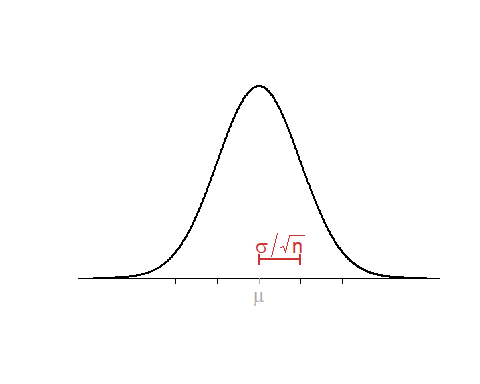<!-- -->

## Intervale de încredere pentru medie

Generarea intervalelor de încredere:


```r
p <- 5
n <- 20

lo3 <- hi3 <- lo2 <- hi2 <- lo <- hi <- vector("list",p)

for(i in 1:p) {
  dat <- matrix(rnorm(n*10,3.5,sd=1.5),ncol=10)
  
  m <- apply(dat,1,mean)
  s <- apply(dat,1,sd)
  
  lo[[i]] <- m-qnorm(0.975)*1.5/sqrt(10)
  hi[[i]] <- m+qnorm(0.975)*1.5/sqrt(10)
  
  lo2[[i]] <- m-qnorm(0.975)*s/sqrt(10)
  hi2[[i]] <- m+qnorm(0.975)*s/sqrt(10)
  
  lo3[[i]] <- m-qt(0.975,9)*s/sqrt(10)
  hi3[[i]] <- m+qt(0.975,9)*s/sqrt(10)
}
```

Intervale de încredere atunci când $\sigma$ este cunoscut: 


```r
r <- range(unlist(c(lo,hi,lo2,hi2,lo3,hi3)))

par(mfrow=c(1,5), las=1, mar=c(5.1,2.1,6.1,2.1))

for(i in 1:p) {
  plot(0,0,type="n",ylim=0.5+c(0,n),xlim=r,ylab="",xlab="",yaxt="n")
  
  abline(v=3.5,lty=2,col="brown3",lwd=2)
  
  segments(lo[[i]],1:n,hi[[i]],1:n,lwd=2)
  
  o <- (1:n)[lo[[i]] > 3.5 | hi[[i]] < 3.5]
  
  segments(lo[[i]][o],o,hi[[i]][o],o,lwd=2,col="orange")
}

par(mfrow=c(1,1))

mtext(expression(paste("100 intervale de încredere pentru ",mu)),
      side=3,cex=1.5,xpd=TRUE,line=4)
mtext(expression(paste("(",sigma," cunoscut)")),side=3,cex=1.3,
      xpd=TRUE,line=2.7)
```

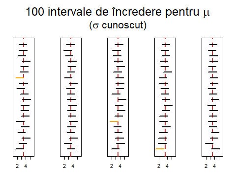<!-- -->

Intervale de încredere **incorecte** atunci când $\sigma$ nu este cunoscut: 


```r
par(mfrow=c(1,5), las=1, mar=c(5.1,2.1,6.1,2.1))
for(i in 1:p) {
  plot(0,0,type="n",ylim=0.5+c(0,n),xlim=r,ylab="",xlab="",yaxt="n")
  abline(v=3.5,lty=2,col="brown3",lwd=2)
  segments(lo2[[i]],1:n,hi2[[i]],1:n,lwd=2)
  o <- (1:n)[lo2[[i]] > 3.5 | hi2[[i]] < 3.5]
  segments(lo2[[i]][o],o,hi2[[i]][o],o,lwd=2,col="orange")
}
par(mfrow=c(1,1))
mtext(expression(paste("100 intervale de încredere incorecte pentru ",mu)),side=3,cex=1.5,xpd=TRUE,line=4)
mtext(expression(paste("(",sigma," necunoscut)")),
      side=3,cex=1.3,xpd=TRUE,line=2.7)
```

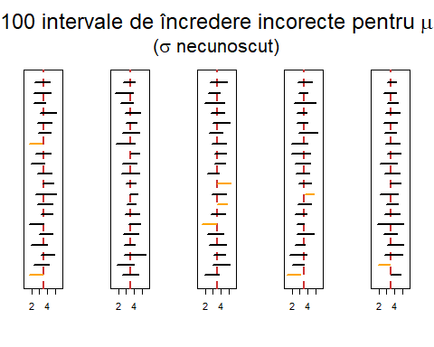<!-- -->

Intervale de încredere **corecte** atunci când $\sigma$ nu este cunoscut: 


```r
par(mfrow=c(1,5), las=1, mar=c(5.1,2.1,6.1,2.1))
for(i in 1:p) {
  plot(0,0,type="n",ylim=0.5+c(0,n),xlim=r,ylab="",xlab="",yaxt="n")
  abline(v=3.5,lty=2,col="brown3",lwd=2)
  segments(lo3[[i]],1:n,hi3[[i]],1:n,lwd=2)
  o <- (1:n)[lo3[[i]] > 3.5 | hi3[[i]] < 3.5]
  segments(lo3[[i]][o],o,hi3[[i]][o],o,lwd=2,col="orange")
}
par(mfrow=c(1,1))
mtext(expression(paste("100 intervale de încredere pentru ",mu)),
      side=3,cex=1.5,xpd=TRUE,line=4)
mtext(expression(paste("(",sigma," necunoscut)")),
      side=3,cex=1.3,xpd=TRUE,line=2.7)
```

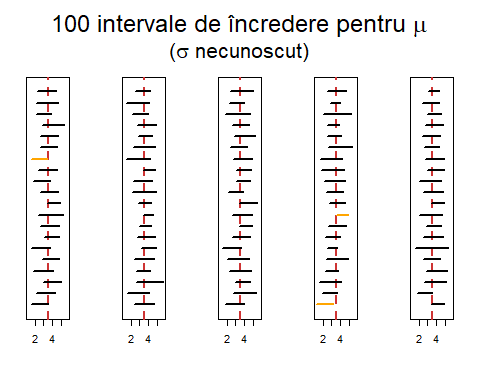<!-- -->


# Testarea ipotezelor statistice: inferență asupra unui eșantion 
***

## Exemplul 1

> Care este temperatura normală a corpului uman ? ([vezi articol](readings/BodyTemp.pdf)) Ne dorim să testăm din punct de vedere statistic dacă temperatura medie a corpului uman este de $37^\circ C$ plecând de la următorul set de date [descarcă](data/normtemp.txt) (sursa originală a datelor este *Mackowiak, P. A., Wasserman, S. S., and Levine, M. M. (1992). A Critical Appraisal of 98.6 Degrees F, the Upper Limit of the Normal Body Temperature, and Other Legacies of Carl Reinhold August Wunderlich. Journal of the American Medical Association, 268, 1578-1580*).

Pentru a citi datele putem folosi două metode: sau să le citim direct din pagina de internet (prin comanda `read.table`)


```r
file = "https://alexamarioarei.github.io/Teaching/Biostatistics/labs/data/normtemp.txt"
normtemp = read.table(file, header=F, col.names=c("temp","sex","hr"))

head(normtemp)
```

```
##   temp sex hr
## 1 96.3   1 70
## 2 96.7   1 71
## 3 96.9   1 74
## 4 97.0   1 80
## 5 97.1   1 73
## 6 97.1   1 75
```

sau descărcând local fișierul cu date și înlocuind adresa de internet din `file` cu cea locală.

Temperatura apare în grade Fahrenheit și am dori să transformăm în grade Celsius folosind formula:

$$
  T_C = 5(T_F-32)/9
$$


```r
normtemp$tempC = (normtemp$temp - 32)*5/9 
degreesC = normtemp$tempC
```

Testul t-student presupune că eșantionul (independent) a provenit dintr-o populație normală și pentru aceasta putem verifica ipoteza de normalitate (`QQ plot`):


```r
qqnorm(degreesC)
qqline(degreesC)
```

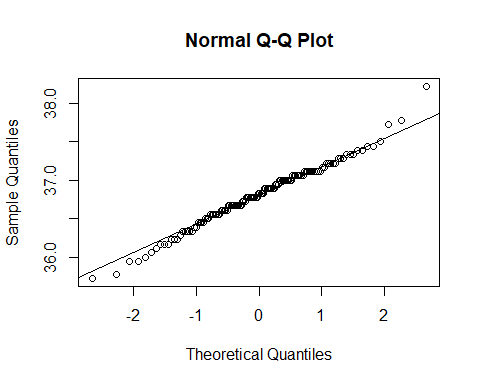<!-- -->

Trasăm histograma:


```r
hist(degreesC, probability = T)
degM = mean(degreesC)
degSD = sd(degreesC)
curve(dnorm(x, degM, degSD), add = T, col = "brown3")
```

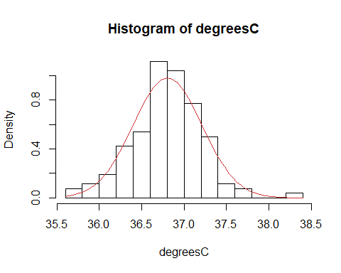<!-- -->

Trasăm densitatea:


```r
plot(density(degreesC))
curve(dnorm(x, degM, degSD), add = T, col = "brown3")
```

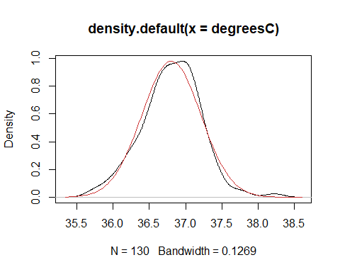<!-- -->

Testăm ipoteza de normalitate (folosind testul `Shapiro-Wilk`):


```r
shapiro.test(degreesC)# distributia pare sa fie aproape de normala si testul nu detecteaza 
```

```
## 
## 	Shapiro-Wilk normality test
## 
## data:  degreesC
## W = 0.98658, p-value = 0.2332
```

```r
                      # o abatere semnificativa fata de normala
```

Distribuția pare să fie aproape de normală, testul Shapiro-Wilk nu detectează o deviație semnificantă de la normalitate.


```r
t.test(degreesC, mu = 37, alternative = "two.sided") # respingem H0
```

```
## 
## 	One Sample t-test
## 
## data:  degreesC
## t = -5.4548, df = 129, p-value = 2.411e-07
## alternative hypothesis: true mean is not equal to 37
## 95 percent confidence interval:
##  36.73445 36.87581
## sample estimates:
## mean of x 
##  36.80513
```


```r
ttest_deg = t.test(degreesC, mu = 37)

ttest_deg$statistic
```

```
##         t 
## -5.454823
```

```r
ttest_deg$p.value
```

```
## [1] 2.410632e-07
```

```r
ttest_deg$conf.int
```

```
## [1] 36.73445 36.87581
## attr(,"conf.level")
## [1] 0.95
```

Dacă nu avem datele și avem o problemă de tipul: un eșantion de 130 de persoane a fost selectionat și temperatura corpului a fost masurată. Media eșantionului a fost `36.805` iar abaterea standard `0.4073`. Testati ipoteza nulă că media temperaturii corpului uman este de `37` grade Celsius.

În acest caz avem:


```r
t.obt = (36.805 - 37)/(0.4073/sqrt(130))
t.obt
```

```
## [1] -5.458733
```

```r
qt(c(0.25, 0.975), df = 129) # valorile critice pentru alpha = 0.05
```

```
## [1] -0.6763963  1.9785245
```

```r
2*pt(t.obt, df = 129) # p valoarea pentru testul two-tailed
```

```
## [1] 2.367923e-07
```

Ca să automatizăm aceste calcule putem crea o funcție:


```r
t.single = function(obs.mean, mu, SD, n) {
  t.obt = (obs.mean - mu) / (SD / sqrt(n))
  p.value = pt(abs(t.obt), df=n-1, lower.tail=F)
  print(c(t.obt = t.obt, p.value = p.value))
  warning("P-value pentru one-sided. Dubleaza pentru two-sided.")
}

t.single(36.805, mu = 37, SD = 0.4073, n = 130)
```

```
##         t.obt       p.value 
## -5.458733e+00  1.183961e-07
```

```
## Warning in t.single(36.805, mu = 37, SD = 0.4073, n = 130): P-value pentru
## one-sided. Dubleaza pentru two-sided.
```

# Testarea ipotezelor statistice: inferență asupra a două eșantioane
***

## Exemplul 1

În contextul exemplului anterior, să presupunem că vrem să vedem dacă există vreo diferență între temperatura medie la bărbați și temperatura medie la femei. 


```r
str(normtemp)
```

```
## 'data.frame':	130 obs. of  4 variables:
##  $ temp : num  96.3 96.7 96.9 97 97.1 97.1 97.1 97.2 97.3 97.4 ...
##  $ sex  : int  1 1 1 1 1 1 1 1 1 1 ...
##  $ hr   : int  70 71 74 80 73 75 82 64 69 70 ...
##  $ tempC: num  35.7 35.9 36.1 36.1 36.2 ...
```

```r
tempB = normtemp$tempC[which(normtemp$sex == 1)]
tempF = normtemp$tempC[which(normtemp$sex == 2)]
```

Ilustrare a temperaturii bărbaților și a femeilor:


```r
par(mfrow=c(1,2))
plot(density(tempB), main="Temperatura Barbatilor")
plot(density(tempF), main="Temperatura Femeilor")
```

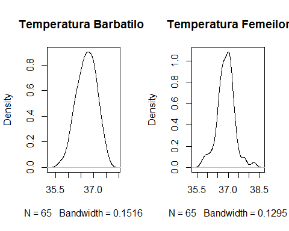<!-- -->

Sub formă de `boxplot`:


```r
par(mfrow = c(1,1))
boxplot(tempB, tempF, ylab="Temperatura",     # plot and label y-axis
                names=c("Barbati","Femei"),   # group names on x-axis
                main="Temperatura in functie de sex")   # main title
```

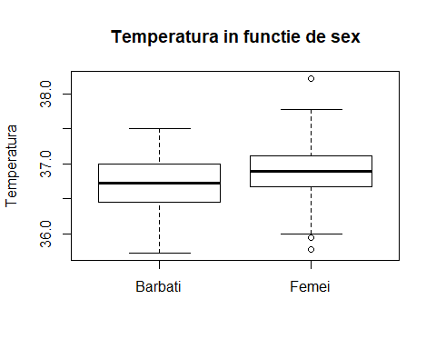<!-- -->

Trasarea datelor împreună cu intervalele de încredere:


```r
source("functions/dotplot.R")

dotplot(tempB, tempF, labels=c("Barbati","Femei"))
```

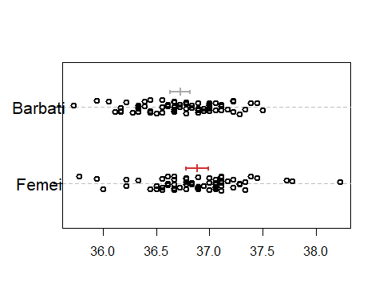<!-- -->

Testarea ipotezelor statistice cu ajutorul testului t-student (corecția lui `Welch`):


```r
t.test(tempB, tempF) # Welch correction 
```

```
## 
## 	Welch Two Sample t-test
## 
## data:  tempB and tempF
## t = -2.2854, df = 127.51, p-value = 0.02394
## alternative hypothesis: true difference in means is not equal to 0
## 95 percent confidence interval:
##  -0.29980476 -0.02156277
## sample estimates:
## mean of x mean of y 
##  36.72479  36.88547
```

Verificăm dacă cele două eșantioane au varianțe egale (folosim testul lui `Fisher`):


```r
var.test(tempB, tempF)
```

```
## 
## 	F test to compare two variances
## 
## data:  tempB and tempF
## F = 0.88329, num df = 64, denom df = 64, p-value = 0.6211
## alternative hypothesis: true ratio of variances is not equal to 1
## 95 percent confidence interval:
##  0.5387604 1.4481404
## sample estimates:
## ratio of variances 
##          0.8832897
```

Aplicăm acum testul t-student cu opțiunea de varianțe egale (`pooled variance`):


```r
t.test(tempB, tempF, var.equal = T) # without Welch correction 
```

```
## 
## 	Two Sample t-test
## 
## data:  tempB and tempF
## t = -2.2854, df = 128, p-value = 0.02393
## alternative hypothesis: true difference in means is not equal to 0
## 95 percent confidence interval:
##  -0.29979966 -0.02156786
## sample estimates:
## mean of x mean of y 
##  36.72479  36.88547
```

## Exemplul 2


```r
# Example data
x <- c(102.5, 106.6,  99.8, 106.5, 103.7, 105.5, 98.2, 104.1,  85.6, 105.5, 114.0, 112.2)
y <- c( 93.7,  90.9, 100.4,  92.0, 100.2, 104.6, 95.4,  96.6,  99.2)

# Two-sided t-test allowing un-equal population SDs
t.test(x,y)
```

```
## 
## 	Welch Two Sample t-test
## 
## data:  x and y
## t = 2.6041, df = 18.475, p-value = 0.01769
## alternative hypothesis: true difference in means is not equal to 0
## 95 percent confidence interval:
##   1.30124 12.06543
## sample estimates:
## mean of x mean of y 
##  103.6833   97.0000
```

```r
dotplot(x,y)
```

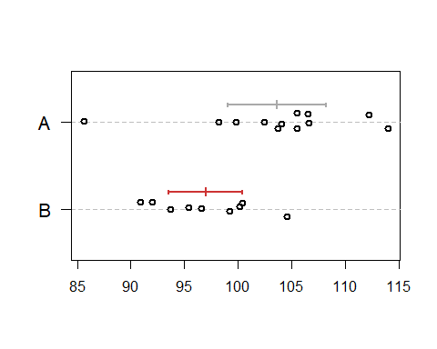<!-- -->

## Exemplul 3


```r
# One-tailed test example
x <- c(59.4, 52.3, 42.6, 45.1, 65.9, 40.8)
y <- c(82.7, 56.7, 46.9, 67.8, 74.8, 85.7)

# One-tailed t-test
t.test(x,y,alt="less")
```

```
## 
## 	Welch Two Sample t-test
## 
## data:  x and y
## t = -2.4421, df = 8.6937, p-value = 0.01907
## alternative hypothesis: true difference in means is less than 0
## 95 percent confidence interval:
##       -Inf -4.454703
## sample estimates:
## mean of x mean of y 
##  51.01667  69.10000
```

```r
# The dotplot
dotplot(x,y)
```

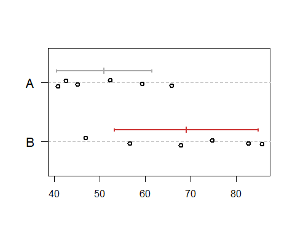<!-- -->

## Exemplul 4


```r
# another one-tailed test example
x <- c(63.3, 58.6, 59.0, 60.5, 56.3, 57.4)
y <- c(75.6, 65.9, 72.3, 58.0, 64.4, 66.2)
t.test(x,y,alt="less")
```

```
## 
## 	Welch Two Sample t-test
## 
## data:  x and y
## t = -2.8968, df = 6.5546, p-value = 0.01242
## alternative hypothesis: true difference in means is less than 0
## 95 percent confidence interval:
##       -Inf -2.674212
## sample estimates:
## mean of x mean of y 
##  59.18333  67.06667
```

```r
dotplot(x,y)
```

<!-- -->

## Grafic recomandat


```r
x <- c(15.1, 13.1, 21.5)
y <- c(35.1, 39.5, 58.8)

par(mar=c(4,4,2,1),mfrow=c(1,2),las=1)

barplot(c(mean(x),mean(y)),width=1,space=c(0.5,0.5),
        col=c("white","gray40"),xlim=c(0,3),names=c("A","B"),
        ylim=c(0,76))
segments(1,mean(x),1,mean(x)+sd(x),lwd=2)
segments(0.8,mean(x)+sd(x),1.2,mean(x)+sd(x),lwd=2)
segments(2.5,mean(y),2.5,mean(y)+sd(y),lwd=2)
segments(2.3,mean(y)+sd(y),2.7,mean(y)+sd(y),lwd=2)
mtext("Grafic nepotrivit",cex=1.5,line=0.5)

plot(rep(0:1,c(3,3)),c(x,y),xaxt="n",ylim=c(0,76),
     xlim=c(-0.5,1.5),ylab="",xlab="")
abline(v=0:1,col="gray40",lty=2)
points(rep(0:1,c(3,3)),c(x,y),lwd=2)
mtext("Grafic recomandat",cex=1.5,line=0.5)
xci <- t.test(x)$conf.int
yci <- t.test(y)$conf.int
segments(0.25,xci[1],0.25,xci[2],lwd=2,col="darkgray")
segments(c(0.23,0.23,0.2),c(xci,mean(x)),c(0.27,0.27,0.3),
         c(xci,mean(x)),lwd=2,col="darkgray")
segments(1-0.25,yci[1],1-0.25,yci[2],lwd=2,col="brown3")
segments(1-c(0.23,0.23,0.2),c(yci,mean(y)),1-c(0.27,0.27,0.3),
         c(yci,mean(y)),lwd=2,col="brown3")
u <- par("usr")
segments(0:1,u[3],0:1,u[3]-diff(u[3:4])*0.03,xpd=TRUE)
text(0:1,u[3]-diff(u[3:4])*0.08,c("A","B"),xpd=TRUE)
```

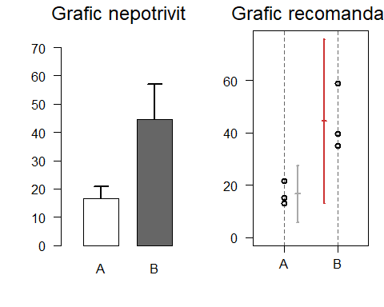<!-- -->

# Testarea ipotezelor statistice: inferență asupra a două eșantioane dependente (perechi)
***
  
Considerăm următorul set de date din pachetul `MASS` (luarea in greutate de catre femei anorexice):


```r
data(anorexia, package="MASS")      
attach(anorexia)
str(anorexia)
```

```
## 'data.frame':	72 obs. of  3 variables:
##  $ Treat : Factor w/ 3 levels "CBT","Cont","FT": 2 2 2 2 2 2 2 2 2 2 ...
##  $ Prewt : num  80.7 89.4 91.8 74 78.1 88.3 87.3 75.1 80.6 78.4 ...
##  $ Postwt: num  80.2 80.1 86.4 86.3 76.1 78.1 75.1 86.7 73.5 84.6 ...
```

```r
ft=subset(anorexia,Treat="FT") # family treatment
```

Testăm dacă există diferențe între luarea în greutate înainte de tratament și după tratament:


```r
with(ft, t.test(Postwt-Prewt, mu=0, alternative="greater"))
```

```
## 
## 	One Sample t-test
## 
## data:  Postwt - Prewt
## t = 2.9376, df = 71, p-value = 0.002229
## alternative hypothesis: true mean is greater than 0
## 95 percent confidence interval:
##  1.195825      Inf
## sample estimates:
## mean of x 
##  2.763889
```

sau


```r
with(ft, t.test(Postwt, Prewt, paired=T, alternative="greater"))
```

```
## 
## 	Paired t-test
## 
## data:  Postwt and Prewt
## t = 2.9376, df = 71, p-value = 0.002229
## alternative hypothesis: true difference in means is greater than 0
## 95 percent confidence interval:
##  1.195825      Inf
## sample estimates:
## mean of the differences 
##                2.763889
```
