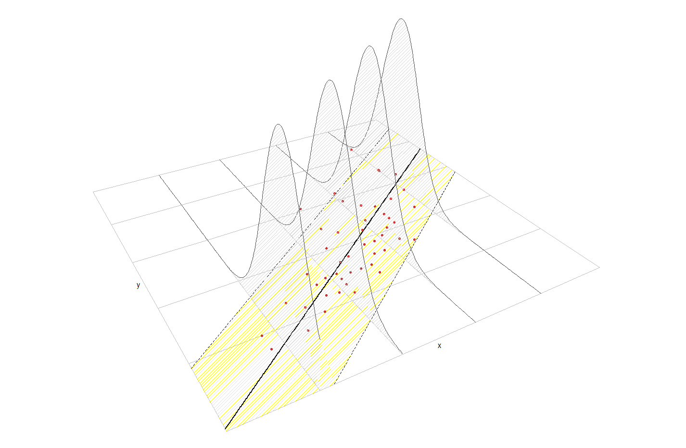
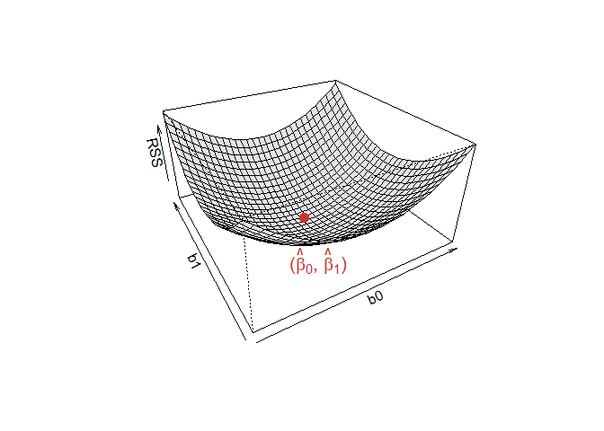
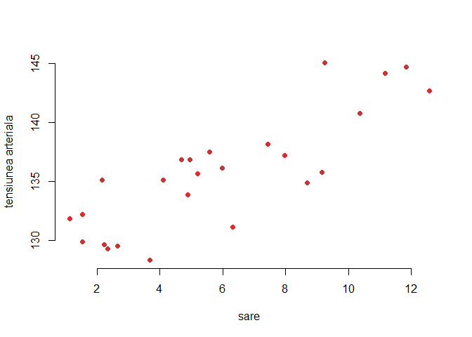
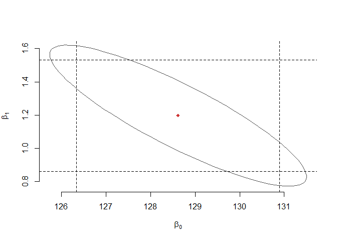
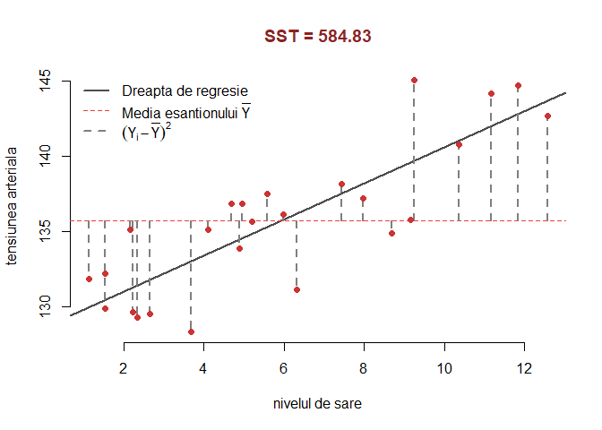
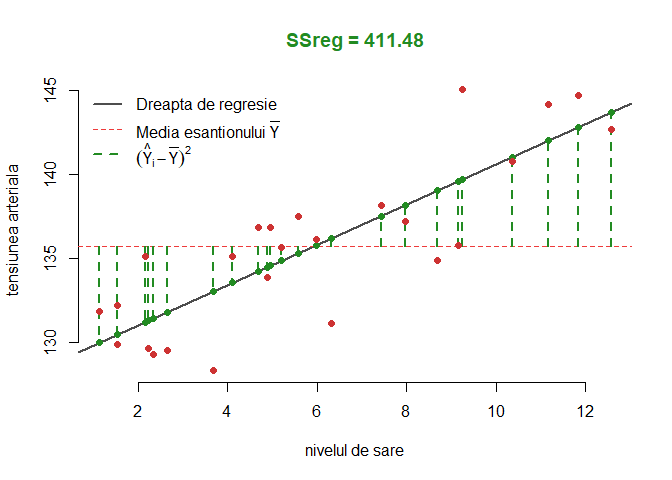
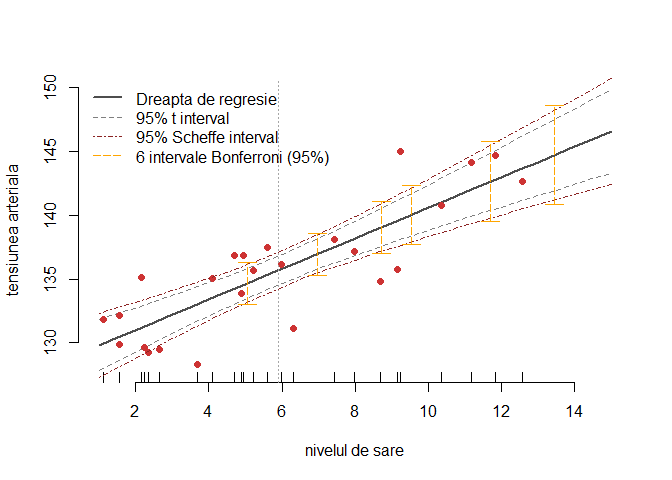
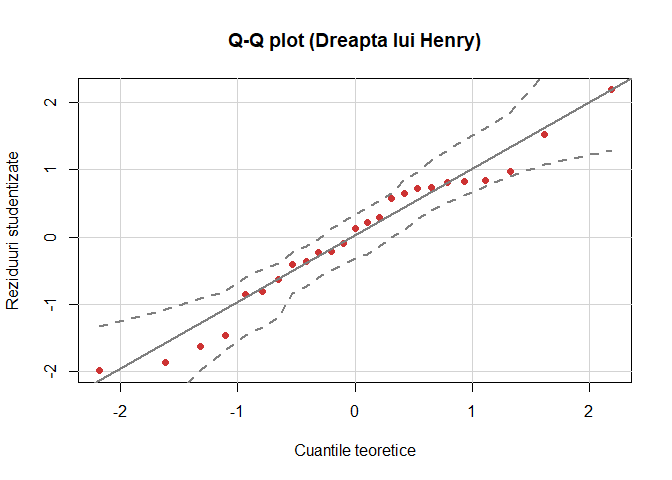
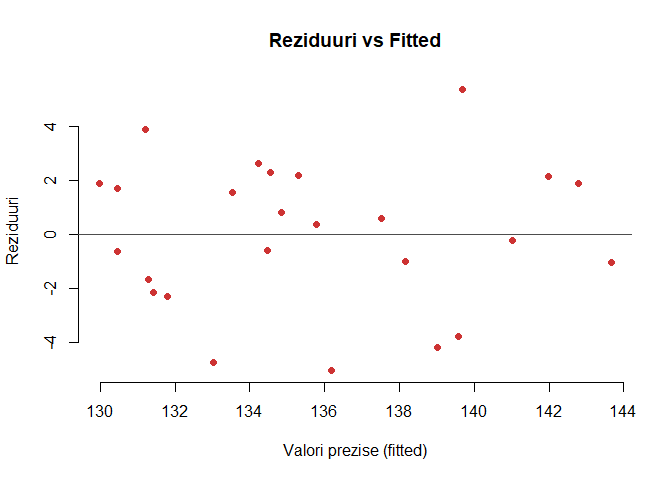

# Curs Biostatistica 2017 - Laborator 7 & 8
<style type="text/css">
.table {
    margin: auto;
    width: 40%;

}

.tocify{
  border: 0px solid;
}

.list-group-item.active{
  background-color: rgba(64, 64, 64, 0.72);
}

.list-group-item.active:hover{
  background-color: rgba(64, 64, 64, 0.72);
}
</style>

# Regresie liniară simplă
***
***

## Introducere 


Regresia liniară simplă (sau *modelul liniar simplu*) este un instrument statistic utilizat pentru a descrie relația dintre două variabile aleatoare, $X$ (variabilă *cauză*, *predictor* sau *covariabilă*) și $Y$ (variabilă *răspuns* sau *efect*) și este definit prin 

$$
\mathbb{E}[Y|X=x]=\beta_0+\beta_1x 
$$

sau altfel spus 

$$
Y = \beta_0 + \beta_1 X + \varepsilon.
$$

În relațiile de mai sus, $\beta_0$ și $\beta_1$ sunt cunoscute ca ordonata la origine (*intercept*) și respectiv panta (*slope*) dreptei de regresie.

Ipotezele modelului sunt: 

i. **Linearitatea**: $\mathbb{E}[Y|X=x]=\beta_0+\beta_1x$
ii. **Homoscedasticitatea**: $\mathbb{V}\text{ar}(\varepsilon_i)=\sigma^2$, cu $\sigma^2$ constantă pentru $i=1,\ldots,n$
iii. **Normalitatea**: $\varepsilon_i\sim\mathcal{N}(0,\sigma^2)$ pentru $i=1,\ldots,n$
iv. **Independența erorilor**: $\varepsilon_1,\ldots,\varepsilon_n$ sunt independente (sau necorelate, $\mathbb{E}[\varepsilon_i\varepsilon_j]=0$, $i\neq j$, deoarece sunt presupuse normale)

Altfel spus 

$$
Y|X=x\sim \mathcal{N}(\beta_0+\beta_1x,\sigma^2)
$$

<div class="rmdinsight">
<ul>
<li><p>Nicio ipoteză nu a fost făcută asupra repartiției lui <span class="math inline"><em>X</em></span> (poate fi sau deterministă asu aleatoare)</p></li>
<li><p>Modelul de regresie presupune că <strong><span class="math inline"><em>Y</em></span> este continuă</strong> datorită normalității erorilor. În orice caz, <strong><span class="math inline"><em>X</em></span> poate fi o variabilă discretă</strong>!</p></li>
</ul>
</div>

<div class="figure" style="text-align: center">

<p class="caption">Regresia liniara simpla</p>
</div>

Dat fiind un eșantion $(X_1,Y_1),\ldots,(X_n,Y_n)$ pentru variabilele $X$ și $Y$ putem estima coeficienții necunoscuți $\beta_0$ și $\beta_1$ minimizând *suma abaterilor pătratice reziduale* (*Residual Sum of Squares* - RSS)

$$
\text{RSS}(\beta_0,\beta_1)=\sum_{i=1}^n(Y_i-\beta_0-\beta_1X_i)^2
$$

ceea ce conduce la 

$$
\hat\beta_0=\bar{Y}-\hat\beta_1\bar{X},\quad \hat\beta_1=\frac{s_{xy}}{s_x^2}=\frac{\sum_{i=1}^{n}{(X_i-\bar{X})}Y_i}{\sum_{i=1}^{n}{(X_i-\bar{X})^2}}
$$

unde

- $\bar{X}=\frac{1}{n}\sum_{i=1}^nX_i$ este *media eșantionului*
- $s_x^2=\frac{1}{n}\sum_{i=1}^n(X_i-\bar{X})^2$ este *varianța eșantionului*
- $s_{xy}=\frac{1}{n}\sum_{i=1}^n(X_i-\bar{X})(Y_i-\bar{Y})$ este *covarianța eșantionului*


<div class="figure" style="text-align: center">

<p class="caption">Graficul functiei RSS pentru modelul $y = -0.5 + 1.5x + e$.</p>
</div>

Odată ce avem estimatorii $(\hat\beta_0,\hat\beta_1)$ , putem defini:

- *valorile prognozate* (*fitted values*) $\hat Y_1,\ldots,\hat Y_n$ (valorile verticale pe dreapta de regresie), unde

$$
\hat Y_i=\hat\beta_0+\hat\beta_1X_i,\quad i=1,\ldots,n
$$

- *reziduurile estimate* (*estimated residuals*) $\hat \varepsilon_1,\ldots,\hat \varepsilon_n$ (distanțele verticale dintre punctele actuale $(X_i,Y_i)$ și cele prognozate $(X_i,\hat Y_i)$), unde

$$
\hat\varepsilon_i=Y_i-\hat Y_i,\quad i=1,\ldots,n
$$

Estimatorul pentru $\sigma^2$ este 
$$
\hat{\sigma}^2 = \frac{RSS(\hat{\beta}_0,\hat{\beta}_1)}{n-2} = \frac{\sum_{i=1}^{n}\hat{\varepsilon}_i^2}{n-2}.
$$

## Exemplul 1

> În acest exercițiu vrem să investigăm relația dintre consumul de clorură de sodiu (sarea de bucătărie) și tensiunea arterială la persoanele trecute de 65 de ani. Pentru aceasta vom folosi setul de date [`saltBP`](data/saltBP.txt) care conține informații despre tensiunea arterială a 25 de pacienți. 

Începem prin a înregistra setul de date


```r
saltBP = read.table("data/saltBP.txt", header = T)

plot(saltBP$salt, saltBP$BP, 
     xlab = "sare", 
     ylab = "tensiunea arteriala", 
     col = "brown3", 
     pch = 16, 
     bty="n")
```

<div class="figure" style="text-align: center">

<p class="caption">Diagrama de imprastiere</p>
</div>


```r
summary(saltBP)
```

```
##        BP             salt          saltLevel  
##  Min.   :128.3   Min.   : 1.130   Min.   :0.0  
##  1st Qu.:131.8   1st Qu.: 2.650   1st Qu.:0.0  
##  Median :135.7   Median : 5.210   Median :0.0  
##  Mean   :135.7   Mean   : 5.898   Mean   :0.4  
##  3rd Qu.:137.5   3rd Qu.: 8.680   3rd Qu.:1.0  
##  Max.   :145.0   Max.   :12.570   Max.   :1.0
```


### Estimarea parametrilor

Considerăm modelul de regresie $Y = \beta_0 + \beta_1 X + \varepsilon$ (unde $X=$`saltBP$salt` iar $Y=$`saltBP$BP`), $\varepsilon\sim \mathcal{N}(0,\sigma^2)$, a cărui parametrii sunt $\beta_0$, $\beta_1$ și $\sigma^2$.

  -  estimatorii parametrilor $\beta_0$ și $\beta_1$


```r
# pentru b1

b1 = cov(saltBP$salt, saltBP$BP)/var(saltBP$salt)
cat("b1 = ", b1)
```

```
## b1 =  1.196894
```

```r
# sau 

sum((saltBP$salt-mean(saltBP$salt))*(saltBP$BP))/sum((saltBP$salt-mean(saltBP$salt))^2)
```

```
## [1] 1.196894
```

```r
# pentru b0

b0 = mean(saltBP$BP) - b1*mean(saltBP$salt)
cat("b0 = ", b0)
```

```
## b0 =  128.6164
```

sau folosind funcția `lm`:


```r
saltBP_model = lm(BP~salt, data = saltBP)
names(saltBP_model)
```

```
##  [1] "coefficients"  "residuals"     "effects"       "rank"         
##  [5] "fitted.values" "assign"        "qr"            "df.residual"  
##  [9] "xlevels"       "call"          "terms"         "model"
```


```r
saltBP_model$coefficients
```

```
## (Intercept)        salt 
##  128.616397    1.196894
```

Dreapta de regresie este:


```r
plot(saltBP$salt, saltBP$BP, 
     xlab = "nivelul de sare", 
     ylab = "tensiunea arteriala", 
     col = "brown3", 
     pch = 16, 
     bty="n", 
     main = paste("y = ", format(b0, digits = 4), " + ", format(b1, digits = 4), " x"))

abline(a = b0, b = b1, col = "grey", lwd = 2)
points(mean(saltBP$salt), mean(saltBP$BP), pch = 16, col = "dark green", cex = 1.2)
text(mean(saltBP$salt), mean(saltBP$BP)-1.3, col = "dark green", cex = 1.2, 
     labels = expression(paste("(", bar(x), ",", bar(y),")")))
```

<div class="figure" style="text-align: center">

<p class="caption">Dreapta de regresie</p>
</div>

  - estimatorul lui $\sigma$ ($\hat{\sigma}$)
  

```r
n = length(saltBP$BP)
e_hat = saltBP$BP - (b0+b1*saltBP$salt)

rss = sum(e_hat^2)

sigma_hat = sqrt(rss/(n-2))
sigma_hat
```

```
## [1] 2.745374
```

sau cu ajutorul funcției `lm`


```r
sqrt(deviance(saltBP_model)/df.residual(saltBP_model))
```

```
## [1] 2.745374
```

sau încă 


```r
saltBP_model_summary = summary(saltBP_model)
# names(saltBP_model_summary)
saltBP_model_summary$sigma
```

```
## [1] 2.745374
```

### Intervale de încredere pentru parametrii

Repartițiile lui $\hat\beta_0$ și $\hat\beta_1$ sunt 

$$
\hat\beta_0\sim\mathcal{N}\left(\beta_0,\mathrm{SE}(\hat\beta_0)^2\right),\quad\hat\beta_1\sim\mathcal{N}\left(\beta_1,\mathrm{SE}(\hat\beta_1)^2\right)
$$

unde 

$$
\mathrm{SE}(\hat\beta_0)^2=\frac{\sigma^2}{n}\left[1+\frac{\bar X^2}{s_x^2}\right],\quad \mathrm{SE}(\hat\beta_1)^2=\frac{\sigma^2}{ns_x^2}.
$$

Folosind estimatorul $\hat\sigma^2$ pentru $\sigma^2$ obținem că 

$$
\frac{\hat\beta_0-\beta_0}{\hat{\mathrm{SE}}(\hat\beta_0)}\sim t_{n-2},\quad\frac{\hat\beta_1-\beta_1}{\hat{\mathrm{SE}}(\hat\beta_1)}\sim t_{n-2}
$$

unde

$$
\hat{\mathrm{SE}}(\hat\beta_0)^2=\frac{\hat\sigma^2}{n}\left[1+\frac{\bar X^2}{s_x^2}\right],\quad \hat{\mathrm{SE}}(\hat\beta_1)^2=\frac{\hat\sigma^2}{ns_x^2}
$$

prin urmare, intervalele de încredere de nivel $1-\alpha$ pentru $\beta_0$ și $\beta_1$ sunt 

$$
IC = \left(\hat\beta_j\pm\hat{\mathrm{SE}}(\hat\beta_j)t_{n-2;\alpha/2}\right),\quad j=0,1.
$$


```r
alpha = 0.05

# trebuie avut grija ca functia var si sd calculeaza impartind la (n-1) si nu la n !!!
se_b0 = sqrt(sigma_hat^2*(1/n+mean(saltBP$salt)^2/((n-1)*var(saltBP$salt))))
se_b1 = sqrt(sigma_hat^2/((n-1)*var(saltBP$salt)))

lw_b0 = b0 - qt(1-alpha/2, n-2)*se_b0
up_b0 = b0 + qt(1-alpha/2, n-2)*se_b0

cat("CI pentru b0 este (", lw_b0, ", ", up_b0, ")\n")
```

```
## CI pentru b0 este ( 126.337 ,  130.8958 )
```

```r
lw_b1 = b1 - qt(1-alpha/2, n-2)*se_b1
up_b1 = b1 + qt(1-alpha/2, n-2)*se_b1
  
cat("CI pentru b1 este (", lw_b1, ", ", up_b1, ")")
```

```
## CI pentru b1 este ( 0.8617951 ,  1.531993 )
```

Același rezultat se obține apelând funcția `confint` :


```r
confint(saltBP_model)
```

```
##                   2.5 %     97.5 %
## (Intercept) 126.3369606 130.895834
## salt          0.8617951   1.531993
```

Putem construi și o regiune de încredere pentru perechea $(\beta_0, \beta_1)$:


```r
plot(ellipse(saltBP_model, c(1,2)), type = "l", col = "grey30", 
     xlab = expression(beta[0]), 
     ylab = expression(beta[1]), 
     bty = "n")
points(coef(saltBP_model)[1], coef(saltBP_model)[2], pch = 18, col = "brown3")
abline(v = confint(saltBP_model)[1,], lty = 2)
abline(h = confint(saltBP_model)[2,], lty = 2)
```

<div class="figure" style="text-align: center">

<p class="caption">Regiune de incredere</p>
</div>

### ANOVA pentru regresie

Este predictorul $X$ folositor în prezicerea răspunsului $Y$ ? Vrem să testăm ipoteza nulă $H_0:\;\beta_1=0$. 

Introducem următoarele *sume de abateri pătratice*:

- $SS_T=\sum_{i=1}^n\left(Y_i-\bar Y\right)^2$, **suma abaterilor pătratice totală** (variația totală a lui $Y_1,\ldots,Y_n$).
- $SS_{reg}=\sum_{i=1}^n\left(\hat Y_i-\bar Y\right)^2$, **suma abaterilor pătratice de regresie** (variabilitatea explicată de dreapta de regresie)
- $RSS=\sum_{i=1}^n\left(Y_i-\hat Y_i\right)^2$, **suma abaterilor pătratice reziduale**

Avem următoarea descompunere ANOVA

$$
\underbrace{SS_T}_{\text{Variația lui }Y_i} = \underbrace{SS_{reg}}_{\text{Variația lui }\hat Y_i} + \underbrace{RSS}_{\text{Variația lui }\hat \varepsilon_i} 
$$

și tabelul ANOVA corespunzător


|  | Df | SS | MS | $F$ | $p$-value |
|--|------------|--------|---------|----------------|----------------|
| Predictor | $1$ | $SS_{reg}$ | $\frac{SS_{reg}}{1}$ | $\frac{SS_{reg}/1}{RSS/(n-2)}$ | $p$ |
| Residuuri | $n - 2$ | $RSS$ | $\frac{RSS}{n-2}$ | | |

Descompunerea ANOVA pentru problema noastră poate fi ilustrată astfel:

  - *suma abaterilor pătratice totală*:


```r
plot(saltBP$salt, saltBP$BP, pch = 16, type = "n",
     main = paste("SST =", round(sum((saltBP$BP - mean(saltBP$BP))^2), 2)), 
     col.main = "brown4", 
     xlab = "nivelul de sare", 
     ylab = "tensiunea arteriala", 
     bty = "n")

abline(saltBP_model$coefficients, col = "grey30", lwd = 2)
abline(h = mean(saltBP$BP), col = "brown2", lty = 2)

segments(x0 = saltBP$salt, y0 = mean(saltBP$BP), x1 = saltBP$salt, y1 = saltBP$BP, 
         col = "grey50", lwd = 2, lty = 2)

legend("topleft", 
       legend = expression("Dreapta de regresie", "Media esantionului " * bar(Y),
                                      (Y[i] - bar(Y))^2), 
       lwd = c(2, 1, 2),
       col = c("grey30", "brown2", "grey50"), 
       lty = c(1, 2, 2), 
       bty = "n")

points(saltBP$salt, saltBP$BP, pch = 16, col = "brown3")
```



  - *suma abaterilor pătratice de regresie*


```r
plot(saltBP$salt, saltBP$BP, pch = 16, type = "n",
     main = paste("SSreg =", 
                  round(sum((saltBP_model$fitted.values - mean(saltBP$BP))^2), 2)), 
     col.main = "forestgreen", 
     xlab = "nivelul de sare", 
     ylab = "tensiunea arteriala", 
     bty = "n")

abline(saltBP_model$coefficients, col = "grey30", lwd = 2)
abline(h = mean(saltBP$BP), col = "brown2", lty = 2)

segments(x0 = saltBP$salt, y0 = mean(saltBP$BP), x1 = saltBP$salt, y1 = saltBP_model$fitted.values, 
         col = "forestgreen", lwd = 2, lty = 2)

points(saltBP$salt, saltBP_model$fitted.values, pch = 16, col = "forestgreen")

legend("topleft", 
       legend = expression("Dreapta de regresie", "Media esantionului " * bar(Y),
                                      (hat(Y)[i] - bar(Y))^2), 
       lwd = c(2, 1, 2),
       col = c("grey30", "brown2", "forestgreen"), 
       lty = c(1, 2, 2), 
       bty = "n")

points(saltBP$salt, saltBP$BP, pch = 16, col = "brown3")
```



  - *suma abaterilor pătratice reziduale*
  

```r
plot(saltBP$salt, saltBP$BP, pch = 16, type = "n",
     main = paste("RSS =", 
                  round(sum((saltBP$BP - saltBP_model$fitted.values)^2), 2)), 
     col.main = "orange", 
     xlab = "nivelul de sare", 
     ylab = "tensiunea arteriala", 
     bty = "n")

abline(saltBP_model$coefficients, col = "grey30", lwd = 2)

segments(x0 = saltBP$salt, y0 = saltBP$BP, 
         x1 = saltBP$salt, y1 = saltBP_model$fitted.values, 
         col = "orange", lwd = 2, lty = 2)

points(saltBP$salt, saltBP_model$fitted.values, pch = 16, col = "orange")

legend("topleft", 
       legend = expression("Dreapta de regresie", (hat(Y)[i] - Y[i])^2), 
       lwd = c(2, 2),
       col = c("grey30", "orange"), 
       lty = c(1, 2), 
       bty = "n")

points(saltBP$salt, saltBP$BP, pch = 16, col = "brown3")
```


Tabelul ANOVA se obține prin 


```r
# tabel ANOVA 
anova(saltBP_model)
```

```
## Analysis of Variance Table
## 
## Response: BP
##           Df Sum Sq Mean Sq F value    Pr(>F)    
## salt       1 411.48  411.48  54.594 1.631e-07 ***
## Residuals 23 173.35    7.54                      
## ---
## Signif. codes:  0 '***' 0.001 '**' 0.01 '*' 0.05 '.' 0.1 ' ' 1
```

Definiția *coeficientului de determinare* $R^2$ este strâns legată de descompunerea ANOVA:

$$
R^2 = \frac{SS_{reg}}{SS_T}=\frac{SS_T-RSS}{SS_T} = 1 - \frac{RSS}{SS_T}
$$

$R^2$ măsoară **proporția din variația** variabilei răspuns $Y$ **explicată** de variabila predictor $X$ prin regresie. Proporția din variația totală a lui $Y$ care nu este explicată este $1-R^2 = \frac{RSS}{SS_T}$. Intuitiv, $R^2$ măsoară cât de bine modelul de regresie este în concordanță cu datele (cât de strâns este norul de puncte în jurul dreptei de regresie). Observăm că dacă datele concordă *perfect* cu modelul (adică $RSS=0$) atunci $R^2=1$.

Putem vedea că $R^2=r_{xy}^2$, unde $r_{xy}$ este *coeficientul de corelație* empiric:

$$
r_{xy}=\frac{s_{xy}}{s_xs_y}=\frac{\sum_{i=1}^n \left(X_i-\bar X \right)\left(Y_i-\bar Y \right)}{\sqrt{\sum_{i=1}^n \left(X_i-\bar X \right)^2}\sqrt{\sum_{i=1}^n \left(Y_i-\bar Y \right)^2}}
$$

Mai mult se poate verifica și că $R^2=r^2_{y\hat y}$, adică *coeficientul de determinare este egal cu pătratul coeficientului de corelație empirică dintre $Y_1,\ldots,Y_n$ și $\hat Y_1,\ldots,\hat Y_n$*.

Verificăm relația $R^2=r^2_{xy}=r^2_{y\hat y}$ numeric:


```r
yHat = saltBP_model$fitted.values

saltBP_model_summary$r.squared # R^2
```

```
## [1] 0.7035842
```

```r
cor(saltBP$salt, saltBP$BP)^2 # corelatia^2 dintre x si y
```

```
## [1] 0.7035842
```

```r
cor(saltBP$BP, yHat)^2 # corelatia^2 dintre y si yHat
```

```
## [1] 0.7035842
```


### Inferență asupra parametrilor

Este predictorul $X$ folositor în prezicerea răspunsului $Y$ ? Vrem să testăm ipoteza nulă $H_0:\;\beta_j=0$ (pentru $j=1$ spunem că predictorul `nivel de sare` nu are un efect *liniar* semnificativ asupra `tensiunii arteriale`). Pentru aceasta vom folosi statistica de test 

$$
t_j = \frac{\hat{\beta}_j}{\hat{SE}(\hat{\beta_j})}\sim_{H_0} t_{n-2}.
$$

Funcția `summary` ne întoarce $p$-valoarea corespunzătoare a acestor teste:


```r
summary(saltBP_model)
```

```
## 
## Call:
## lm(formula = BP ~ salt, data = saltBP)
## 
## Residuals:
##     Min      1Q  Median      3Q     Max 
## -5.0388 -1.6755  0.3662  1.8824  5.3443 
## 
## Coefficients:
##             Estimate Std. Error t value Pr(>|t|)    
## (Intercept)  128.616      1.102 116.723  < 2e-16 ***
## salt           1.197      0.162   7.389 1.63e-07 ***
## ---
## Signif. codes:  0 '***' 0.001 '**' 0.01 '*' 0.05 '.' 0.1 ' ' 1
## 
## Residual standard error: 2.745 on 23 degrees of freedom
## Multiple R-squared:  0.7036,	Adjusted R-squared:  0.6907 
## F-statistic: 54.59 on 1 and 23 DF,  p-value: 1.631e-07
```

Observăm că ambele ipoteze sunt respinse în favoarea alternativelor bilaterale (la aceeași concluzie am ajuns și utitându-ne la intervalele de încredere - nu conțineau valoarea $0$). Putem observa că $t_1^2$ este exact valoarea $F$ statisticii, deci cele două abordări ne dau aceleași rezultate numerice. 

### Predicții

Pentru un nou set de predictori, $x_0$, răspunsul prognozat este $\hat{y} = \hat{\beta}_0+\hat{\beta}_1 x_0$ și vrem să investigăm incertitudinea din această predicție. Putem face distincția între două tipuri de predicție: predicție asupra răspunsului viitor mediu (inferență asupra mediei condiționate $\mathbb{E}[Y|X=x_0]$) sau predicție asupra observațiilor viitoare (inferență asupra răspunsului condiționat $Y|X=x_0$). 

Un interval de încredere pentru răspunsul viitor mediu este:

$$
\left(\hat y \pm t_{n-2:\alpha/2}\sqrt{\frac{\hat\sigma^2}{n}\left(1+\frac{(x_0-\bar x)^2}{s_x^2}\right)}\right)
$$

Un interval de încredere pentru valoarea prezisă (interval de predicție) este:

$$
\left(\hat y \pm t_{n-2:\alpha/2}\sqrt{\hat\sigma^2+\frac{\hat\sigma^2}{n}\left(1+\frac{(x_0-\bar x)^2}{s_x^2}\right)}\right)
$$

Pentru a găsi aceste intervale vom folosi funcția `predict`:


```r
newData = data.frame(salt = 14)
newData2 = data.frame(salt = c(13, 14, 15))

# Predictie
predict(saltBP_model, newdata = newData)
```

```
##        1 
## 145.3729
```

```r
# Predictie pentru valoarea raspunsului mediu
predict(saltBP_model, newdata = newData, interval = "confidence")
```

```
##        fit      lwr     upr
## 1 145.3729 142.4298 148.316
```

```r
predict(saltBP_model, newdata = newData2, interval = "confidence")
```

```
##        fit      lwr      upr
## 1 144.1760 141.5389 146.8132
## 2 145.3729 142.4298 148.3160
## 3 146.5698 143.3150 149.8246
```

```r
# Predictie asupra observatiilor viitoare
predict(saltBP_model, newdata = newData, interval = "prediction")
```

```
##        fit      lwr      upr
## 1 145.3729 138.9764 151.7695
```

```r
predict(saltBP_model, newdata = newData2, interval = "prediction")
```

```
##        fit      lwr      upr
## 1 144.1760 137.9144 150.4377
## 2 145.3729 138.9764 151.7695
## 3 146.5698 140.0240 153.1156
```


```r
g = seq(1,15,0.5)

p = predict(saltBP_model, data.frame(salt = g), se = T, interval = "confidence")
matplot(g, p$fit, type = "l", lty = c(1,2,2), 
        lwd = c(2,1,1),
        col = c("grey30", "grey50", "grey50"),
        xlab = "nivelul de sare",
        ylab = "tensiunea arteriala",
        bty = "n")
rug(saltBP$salt)
points(saltBP$salt, saltBP$BP, col = "brown3", pch = 16)
abline(v = mean(saltBP$salt), lty = 3, col = "grey65")

# Scheffe's bounds
M = sqrt(2*qf(1-alpha, 2, n-2))

s_xx = (n-1)*var(saltBP$salt)
lw_scheffe = b0 + b1*g - M*sigma_hat*sqrt(1/n+(g-mean(saltBP$salt))^2/s_xx)
up_scheffe = b0 + b1*g + M*sigma_hat*sqrt(1/n+(g-mean(saltBP$salt))^2/s_xx)

lines(g, lw_scheffe, lty = 4, col = "brown4")
lines(g, up_scheffe, lty = 4, col = "brown4")

# Bonferroni bounds
# x0 = c(7, 8, 13, 14)
x0 = 1 + 14*runif(6)
m = length(x0)

t_bonf = qt(1-alpha/(2*m), n-2)

lw_bonf = b0 + b1*x0 - t_bonf*sigma_hat*sqrt(1/n+(x0-mean(saltBP$salt))^2/s_xx)
up_bonf = b0 + b1*x0 + t_bonf*sigma_hat*sqrt(1/n+(x0-mean(saltBP$salt))^2/s_xx)

segments(x0 = x0, y0 = lw_bonf, x1 = x0, y1 = up_bonf, col = "orange", lty = 5)
segments(x0 = x0-0.25, y0 = lw_bonf, x1 = x0+0.25, y1 = lw_bonf, 
         col = "orange", lty = 1)
segments(x0 = x0-0.25, y0 = up_bonf, x1 = x0+0.25, y1 = up_bonf, 
         col = "orange", lty = 1)

legend("topleft", legend = c("Dreapta de regresie", "95% t interval", 
                                      "95% Scheffe interval", 
                             paste0(m, " intervale Bonferroni (95%)")), 
       lwd = c(2, 1, 1, 1),
       col = c("grey30", "grey50", "brown4", "orange"), 
       lty = c(1, 2, 4, 5), 
       bty = "n")
```

<div class="figure" style="text-align: center">

<p class="caption">Nivelul de sare prezis impreuna cu intervalul de incredere de nivel 95% pentru raspunsul mediu</p>
</div>

### Diagnostic

În această secțiune vom vedea dacă setul nostru de date verifică ipotezele modelului de regresie liniară. 

  - *Independența*
  
Ipoteza de independență a variabilei răspuns (prin urmare și a erorilor) reiese, de cele mai multe ori, din modalitatea în care s-a desfășurat experimentul.

  - *Normalitatea*
  
Pentru a verifica dacă ipoteza de normalitate a erorilor este satisfăcută vom trasa dreapta lui Henry (sau Q-Q plot-ul):


```r
library(car)
```

```
## 
## Attaching package: 'car'
```

```
## The following object is masked from 'package:ellipse':
## 
##     ellipse
```

```r
qqPlot(saltBP_model, col = "brown3", col.lines = "grey50", pch = 16,
       simulate = TRUE,
       xlab = "Cuantile teoretice",
       ylab = "Reziduuri studentizate", 
       main = "Q-Q plot (Dreapta lui Henry)")
```

<div class="figure" style="text-align: center">

<p class="caption">Q-Q plot</p>
</div>

Putem folosi și testul `Shapiro-Wilk`:


```r
shapiro.test(residuals(saltBP_model))
```

```
## 
## 	Shapiro-Wilk normality test
## 
## data:  residuals(saltBP_model)
## W = 0.96871, p-value = 0.6125
```


  - *Homoscedasticitatea*
  
Pentru a verifica proprietatea de homoscedasticitate a erorilor vom trasa un grafic al reziduurilor versus valorile prezise (fitted), i.e. $\hat{\varepsilon}$ vs $\hat{y}$. Dacă avem homoscedasticitate a erorilor atunci ar trebui să vedem o variație constantă pe verticală ($\hat{\varepsilon}$).


```r
plot(residuals(saltBP_model)~fitted(saltBP_model),  col = "brown3", pch = 16, 
     xlab = "Valori prezise (fitted)",
     ylab = "Reziduuri", 
     main = "Reziduuri vs Fitted",
     bty = "n")

abline(h = 0, col = "grey30")
```

<div class="figure" style="text-align: center">

<p class="caption">Reziduuri vs Valori prezise (Fitted)</p>
</div>

Tot în acest grafic putem observa dacă ipoteza de liniaritate este verificată (în caz de liniaritate între variabila răspuns și variabila cauză nu are trebui să vedem o relație sistematică între reziduuri și valorile prezise - ceea ce se și întâmplă în cazul nostru) ori dacă există o altă legătură structurală între variabila dependentă (răspuns) și cea independentă (predictor).


