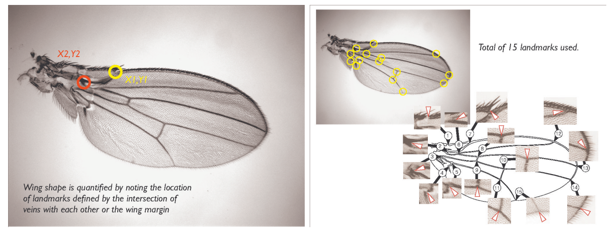

```{r setup, include=FALSE}
knitr::opts_chunk$set(echo = TRUE)
```

### Problema 1^[Raportul poate fi scris in *Word* sau \LaTeX (pentru u\c surin\c t\u a recomand folosirea pachetului *rmarkdown* din *R* - mai multe informa\c tii g\u asi\c ti pe site la sec\c tiune *Link-uri utile*). Toate simul\u arile, figurile \c si codurile folosite trebuie incluse in raport. Se va folosi doar limbajul *R*.]

Populațiile diverselor specii de [*Drosophila melanogaster*](https://en.wikipedia.org/wiki/Drosophila_melanogaster) (musculița de vin/oțet sau a fructelor) prezintă variații ale formei aripilor. Forma aripilor este cuantificată prin măsurarea locațiilor unde nervurile se intersectează între ele sau se intersectează cu marginile acestora (vezi Figura 1). Se obține un total de 15 astfel de puncte de intersecție, fiecare având două coordonate, prin urmare forma aripii este caracterizată de un vector din $\RR^{30}$. 



Ne propunem să investigăm dacă forma aripilor poate diferenția următoarele trei specii de musculițe: *D. Mauritiana*, *D. Sechellia* și *D. Simulans*. Pentru aceasta considerăm setul de date [`wing.dat`](Data/wing.dat) care conține cuantificarea formei aripilor a 138 de musculițe de oțet diferite, fiecare făcând parte dintr-una din cele 3 specii enumerate mai sus astfel: de la 1 la 42 din specia *D. Mauritiana*, de la 43 la 90 din specia *D. Sechellia* iar restul din specia *D. Simulans*. Fie $\bf{Y}$ matricea observațiilor și $\bf{X}$ matricea *centrată* obținută prin 
$$
\bf{X}_{i,j} = \bf{Y}_{i,j}-\bar{\bf{Y}}_{\cdot, j}
$$

  1. Calculați matricea $\bf{C}=\frac{1}{137}\bf{X}^\intercal\bf{X}$. Ce reprezintă această matrice ?
  
  2. Calculați $\l_{max}$ și $\bf{v}_{max}$ cea mai mare valoare proprie a matricii $\bf{C}$ și vectorul propriu corespunzător (folosiți funcția `eigen`). 
  
  3. Pentru fiecare musculiță $i$, calculați proiecția pe direcția $\bf{v}_{max}$ a vectorului centrat $X_i$ (linia $i$ din matricea $\bf{X}$) care cuantifică forma aripii acesteia, $l_i = <X_i, \bf{v}_{max}>$. Acest scalar va fi folosit ca un cuantificator al formei aripii pentru musculița $i$.
  
  4. Verificați grafic și printr-un test adecvat dacă descriptorii $l_i$ sunt repartizați normal pentru fiecare din cele trei specii în parte.
  
  5. Folosiți un test adecvat pentru a verifica dacă mediile $\mu_{Mauritiana}$ și $\mu_{Sechellia}$ sunt egale, unde $\mu_{Mauritiana}$ reprezintă media descriptorilor $l_i$ pentru specia Mauritiana și respectiv $\mu_{Sechellia}$ este media lui $l_i$ pentru specia Sechellia. Repetați procedura și pentru celelalte două perechi.
  
  6. Verificați dacă cele trei medii sunt egale între ele.

Să presupunem că vrem să studiem efectul raportului dintre mărimea aripii pe mărimea corpului pentru musculița de oțet și abilitatea acesteia de a scăpa de un păianjen. Testăm ipoteza că musculițele cu un corp mai greu relativ la mărimea aripilor sunt mai vulnerabile. Mai multe musculițe cu un raport scăzut între mărimea aripilor și a corpului (clasificate ca și *ușoare*) au fost închise într-o cutie împreună cu 2 păianjeni pentru o perioadă de 8 zile. Un experiment similar a avut loc pentru musculițe cu un raport ridicat (clasificate ca *grele*). Numărul de musculițe care au fost consumate de păianjeni este prezentat în Tabelul 1:


\begin{table}[ht]
\caption {numarul de musculite consumate}
  \begin{center}

    \begin{tabular}{c|c|c|c}
        & Usoare & Grele & Total\\
        \hline
      $\leq$ 48h & 16 & 27 & 43\\
      48-96h & 6 & 10 & 16 \\
      96-144h & 7 & 6 & 13 \\
      144-192h 5 & 7 & 12 \\
      \hline
      Supravietuit dupa 192h & 71 & 55 & 126\\
      \hline
      Total & 105 & 105 & 210
    \end{tabular}
  \end{center}
\end{table}


  7. Verificați dacă rata de incidență a consumului rămâne constantă de-a lungul timpului. Calculați p-valoarea prin trei teste diferite.

