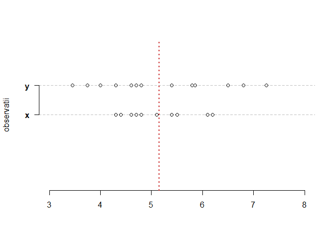
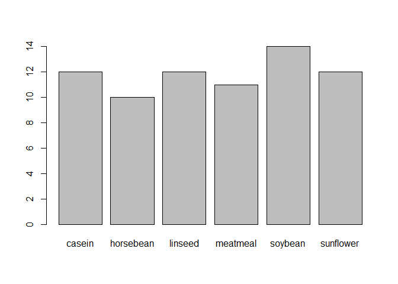
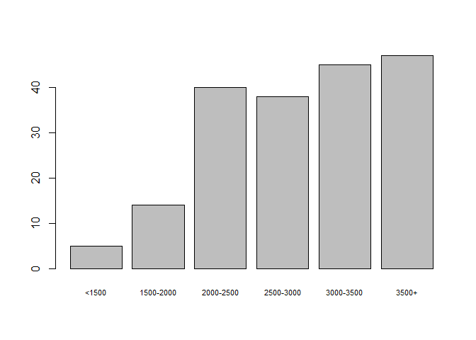
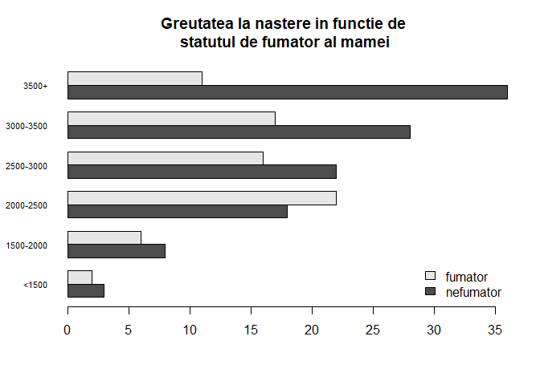
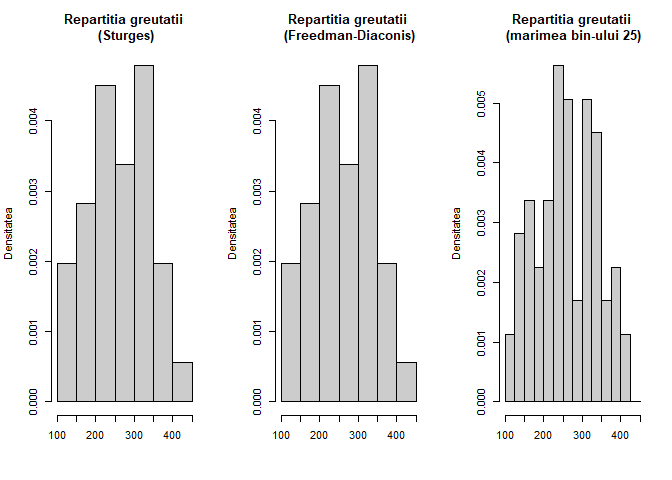
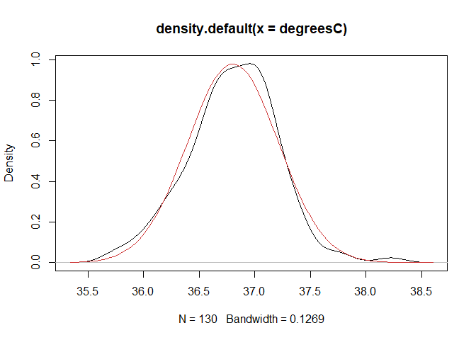
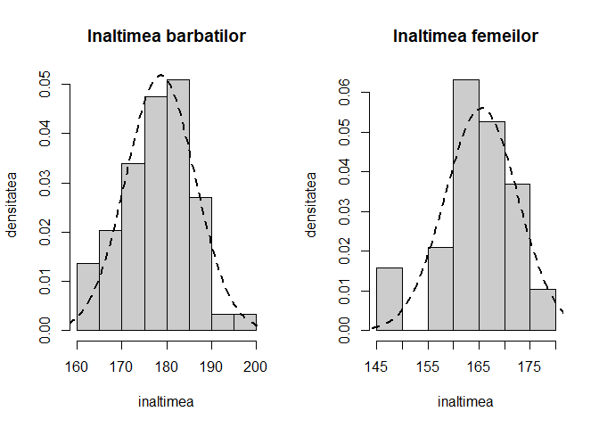
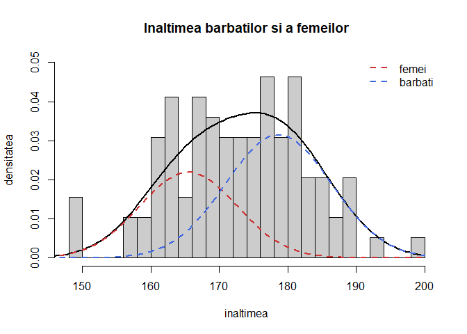
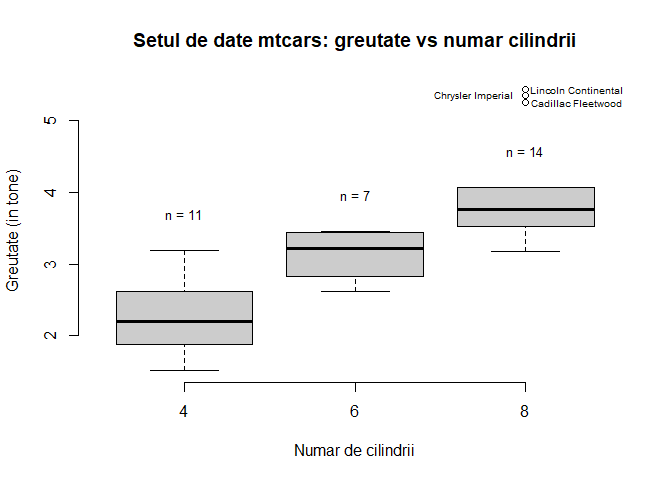
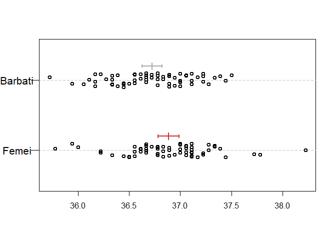

<script>
$(document).ready(function ()  {

    // move toc-ignore selectors from section div to header
    $('div.section.toc-ignore')
        .removeClass('toc-ignore')
        .children('h1,h2,h3,h4,h5').addClass('toc-ignore');

    // establish options
    var options = {
      selectors: "h1,h2,h3",
      theme: "bootstrap3",
      context: '.toc-content',
      hashGenerator: function (text) {
        return text.replace(/[.\\/?&!#<>]/g, '').replace(/\s/g, '_').toLowerCase();
      },
      ignoreSelector: ".toc-ignore",
      scrollTo: 60
    };
    options.showAndHide = false;
    options.smoothScroll = true;

    // tocify
    var toc = $("#TOC").tocify(options).data("toc-tocify");
});
</script>

Obiectivul acestui laborator este de a prezenta câteva elemnte de statistică descriptivă și exploratorie. 


# Descrierea datelor 

De cele mai multe ori într-o analiză statistică ne confruntăm cu un set de date în formă brută. Prima etapă a analizei este de a înțelege proveniența, conținutul (ce reprezintă) și structura datelor și, în funcție de natura analizei pe care dorim să o efectuăm, de a le aduce la forma dorită pentru analiză (această etapă se numește etapa de preprocesare și de obicei ocupă o parte semnificativă din analiză). De cele mai multe ori ne dorim ca datele să fie stocate sub forma unui tablou bidimensional (`data.frame`) cu variabilele pe coloane și observațiile pe linii (acest tip de dată se numește `tidy data`). 

- variabile cantitative: continue (vârsta, greutateam, înălțimea, etc.) și discrete (pot lua un număr limitat de valori: număr de persoane care au participat la test, etc.)
- variabile categorice: nominale (culoarea ochilor, a părului, etc.) și ordinale (dificultatea examenului: scăzută, medie, ridicată)

Să considerăm setul de date `chickwts` (prin apelarea funcției `data()` puteți vedea care sunt seturile de date disponibile în sesiunea curentă). Acest set de date include informații despre greutatea a 71 de găini în funcție de diferite tipuri de hrănire.


```r
# structura 
str(chickwts)
'data.frame':	71 obs. of  2 variables:
 $ weight: num  179 160 136 227 217 168 108 124 143 140 ...
 $ feed  : Factor w/ 6 levels "casein","horsebean",..: 2 2 2 2 2 2 2 2 2 2 ...

# primele si ultimele observatii
head(chickwts)
  weight      feed
1    179 horsebean
2    160 horsebean
3    136 horsebean
4    227 horsebean
5    217 horsebean
6    168 horsebean
tail(chickwts)
   weight   feed
66    352 casein
67    359 casein
68    216 casein
69    222 casein
70    283 casein
71    332 casein
```

# Măsuri de centralitate: media, mediana și modul 

## Media 

Media eșantionului este considerată ca fiind punctul central care balansează colecția de observații și se calculează după formula

$$
  \bar{X}_n = \frac{X_1+X_2+\cdots +X_n}{n}
$$


```r
x.bar = mean(chickwts$weight)
x.bar.horsebean = mean(chickwts$weight[chickwts$feed == "horsebean"])

mean(chickwts$weight[chickwts$feed=="casein"])
[1] 323.5833
mean(chickwts$weight[chickwts$feed=="linseed"])
[1] 218.75
mean(chickwts$weight[chickwts$feed=="meatmeal"])
[1] 276.9091
mean(chickwts$weight[chickwts$feed=="soybean"])
[1] 246.4286
mean(chickwts$weight[chickwts$feed=="sunflower"])
[1] 328.9167
```

## Mediana

Mediana este acea valoare pentru care aproximativ $50\%$ dintre observații sunt mai mici și $50\%$ dintre observații sunt mai mari, se mai numește și magnitudinea de mijloc a obsevațiilor. Mediana (empirică) se găsește cu ajutorul formulei

$$
  M_n = \left\{\begin{array}{ll}
      X_{\left(\frac{n+1}{2}\right)}, & \text{$n$ este impar}\\
      \frac{X_{\left(\frac{n}{2}\right)} + X_{\left(\frac{n}{2}+1\right)}}{2}, & \text{$n$ este par}
  \end{array}\right.
$$

unde $X_{(i)}$ este a $i$-a cea mai mică observație a eșantionului $X_1, X_2, \ldots, X_n$ (statistica de ordine de rang $i$). A se vedea sectiunea [Cuantile teoretice](#sec:cuantile).


```r
M.bar = median(chickwts$weight)
M.bar.horsebean = median(chickwts$weight[chickwts$feed == "horsebean"])
```

## Modul 

Modul este valoarea cea mai frecventă din setul de date. Un set de date poate să nu aibă mod (de exemplu dacă frecvența de apariție a observațiilor este 1 - toate apar o singură dată), să aibă un mod, două moduri (set bimodal) sau mai multe. 


```r
xtab = table(chickwts$weight)
xtab[xtab == max(xtab)]

248 257 260 271 318 
  2   2   2   2   2 
```

## Valoarea minimă (Min), valoarea maximă (Max) și intervalul de valori (Range)

Pentru a determina valoarea minimă și valoarea maximă a setului de date putem folosi funcțiile predefinite `min` și `max`. De asemenea pentru a vedea care este intervalul de valori pe care o variabilă de interes este definită putem aplica funcția `range`. 


```r
min(chickwts$weight)
[1] 108
max(chickwts$weight)
[1] 423
range(chickwts$weight)
[1] 108 423
```

# Cuantile teoretice și empirice {#sec:cuantile}

Reamintim că dată fiind o funcție de repartiție $F$, funcția *cuantilă* (inversa generalizată) asociată lui $F$, $F^{-1}:(0,1)\to\mathbb{R}$ este definită prin 

$$
  F^{-1}(u) = \inf\{x\in\mathbb{R}\,|\,F(x)\geq u\}, \quad \forall u\in(0,1)
$$

unde folosim convențiile $\inf\mathbb{R} = -\infty$ și $\inf\emptyset = +\infty$.

\BeginKnitrBlock{rmdinsight}<div class="rmdinsight">Funcția cuantilă $F^{-1}$ verifică următoarele proprietăți:

  1) Valoarea în $0$: $F^{-1}(0) = -\infty$
  2) Monotonie: $F^{-1}$ este crescătoare
  3) Continuitate: $F^{-1}$ este continuă la stânga
  4) Echivalență: pentru $\forall u\in[0,1]$ avem $F(x)\geq u \iff x\geq F^{-1}(u)$
  5) Inversabilitate: $\forall u\in[0,1]$ avem $(F\circ F^{-1})(u)\geq u$. În plus
    a) dacă $F$ este continuă atunci $F\circ F^{-1} = Id$ dar dacă nu este injectivă atunci există $x_0$ așa încât $(F^{-1}\circ F)(x_0)<x_0$
    b) dacă $F$ este injectivă atunci $F^{-1}\circ F = Id$ dar dacă nu este continuă atunci există $u_0$ astfel că $(F\circ F^{-1})(u_0)>u_0$

</div>\EndKnitrBlock{rmdinsight}

Pentru a exemplifica punctul 5a, putem considera variabila aleatoare $X\sim\mathcal{U}[0,1]$ a cărei funcție de repartiție $F$ este continuă dar nu injectivă și în plus $(F^{-1}\circ F)(2) = F^{-1}(1) = 1 < 2$. Pentru punctul 5b să considerăm variabilele aleatoare $Y\sim\mathcal{N}(0,1)$ și $B\sim\mathcal{B}(0.5)$ independente și să definim $X = BY$. Atunci funcția de repartiție a lui $X$ verifică $F(0-) = \frac{1}{4}$ și $F(0) = \frac{3}{4}$, este injectivă dar nu și continuă în $0$ și în plus avem $(F\circ F^{-1})(1/2) = F(0) = \frac{3}{4}>\frac{1}{2}$.

Se numește *cuantilă* de ordin $p\in(0,1)$ (sau $p$-cuantilă) asociată lui $F$ valoarea

$$
  x_p = F^{-1}(p) = \inf\{x\in\mathbb{R}\,|\,F(x)\geq p\}.
$$

Cuantila de ordin $0.5$, $x_{\frac{1}{2}}$ se numește mediana lui $F$ și se notează cu $M$^[Se poate arăta că mediana unei v.a. $X$, cu $\mathbb{E}[X^2]<\infty$, verifică $x_{\frac{1}{2}} = \arg\min_{t\in\mathbb{R}}\mathbb{E}[|X-t|]$.] sau $Q_2$, iar cuantilele de ordin $\frac{1}{4}$ și respectiv $\frac{3}{4}$ se numesc prima și respectiv a treia cuartilă și se notează cu $Q_1$ și respectiv $Q_3$.

Pentru a calcula cuantilele teoretice în R vom folosi funcțiile de tipul `qnume_partiție` unde `nume_repartiție` este abrevierea numelui repartiției $F$ (e.g. `unif` pentru uniformă, `norm` pentru normală, etc.):


```r
# din repartitia normala
qnorm(c(0.1, 0.25, 0.5, 0.75))
[1] -1.2815516 -0.6744898  0.0000000  0.6744898

# din repartitia student cu 5 grade de libertate
qt(c(0.1, 0.25, 0.5, 0.75), df = 5)
[1] -1.4758840 -0.7266868  0.0000000  0.7266868
```

Fie acum $X_1,X_2,\ldots,X_n$ un eșantion de talie $n$ dintr-o populație a cărei funcție de repartiție este $F$ și fie $\hat{F}_n$ funcția de repartiție empirică asociată. Reamintim că funcția de repartiție empirică este definită, pentru toate valorile $x\in\mathbb{R}$, prin 

$$
  \hat{F}_n(x) = \frac{1}{n}\sum_{i = 1}^{n}\mathbf{1}_{(-\infty, x]}(X_i) = \frac{1}{n}\sum_{i = 1}^{n}\mathbf{1}_{(-\infty, x]}(X_{(i)})
$$

unde $X_{(1)}, X_{(2)}, \ldots, X_{(n)}$ reprezintă statisticile de ordine. Observăm că, notând $X_{(n+1)} = +\infty$, avem

$$
  \hat{F}_n(x) = \sum_{i = 1}^{n}\frac{i}{n}\mathbf{1}_{\left[X_{(i)}, X_{(i+1)}\right)}(x).
$$

Pentru $p\in(0,1)$ definim cuantila empirică de ordin $p$ și o notăm $\hat{x}_p = \hat{x}_p(n)$ valoarea

$$
  \hat{x}_p = \hat{F}_n^{-1}(p) = \inf\{x\in\mathbb{R}\,|\,\hat{F}_n(x)\geq p\}.
$$

Folosind convenția $X_{(0)}=-\infty$, cunatila empirică de ordin $p$ coincide cu una dintre statisticile de ordine:

$$
  \hat{x}_p = X_{(i)} \iff np\leq i< np+1 \iff \hat{x}_p = X_{(\lceil np \rceil)},
$$

unde $\lceil x \rceil$ reprezintă cea mai mică valoare întreagă mai mare sau egală cu $x$.

Pentru calculul cuantilelor empirice vom folosi funcția `quantile()`. Articolul [@Hyndman1996] prezintă și compară o serie de algoritmi folosiți în soft-urile de profil pentru calcularea cuantilelor empirice. De exemplu pentru a calcula cuantila de ordin 0.25 și respectiv 0.75 a greutății găinilor din setul de date `chickwts` vom scrie


```r
quantile(chickwts$weight, prob=c(0.25,0.75))
  25%   75% 
204.5 323.5 
```

Aplicând funcția `fivenum()` (five number summary) variabilei `x` obținem cuantilele de ordin 0 (valoarea minimă), 0.25, 0.5 (mediana), 0.75 și respectiv 1 (valoarea maximă) pentru `x`.


```r
fivenum(chickwts$weight)
[1] 108.0 204.5 258.0 323.5 423.0
```

# Măsuri de variabilitate

Măsurile de centralitate descrise anterior (media, mediana și modul) oferă o indicație asupra locației în care sunt centrate datele dar nu descriu și care este gradul de împrăștiere a acestora. De exemplu următoarele seturi de date au acceași medie dar gradul de împrăștiere în raport cu aceasta este diferit. 


```r
x = c(4.4, 4.8, 6.1, 5.1, 5.1, 6.2, 5.5, 4.7, 4.3, 
      4.6, 6.2, 5.4, 5.4, 5.1, 4.4)
mean(x)
[1] 5.153333

y = c(6.8, 5.8, 3.45, 5.85, 4.7, 5.4, 4.8, 4.0, 4.3,
      4.6, 3.75, 5.8, 7.25, 4.3, 6.5)
mean(y)
[1] 5.153333
```



## Varianța și abaterea standard

Varianța eșantionului se calculează cu ajutorul formulei

$$
  S_n^2 = \frac{1}{n-1}\sum_{i=1}^{n}\left(X_i - \bar{X}_n\right)^2
$$

iar abaterea standard a eșantionului este $s_d = \sqrt{S_n^2}$ (măsurată în aceleași unități de măsură ca și datele inițiale).


```r
# varianta 
var(chickwts$weight[chickwts$feed == "soybean"])
[1] 2929.956

# abaterea standard
sd(chickwts$weight[chickwts$feed == "soybean"])
[1] 54.12907
```

## Intervalul dintre cuartile

Intervalul dintre cuartile măsoară distanța dintre a treia cuartilă și prima curtilă

$$
  IQR = Q_3 - Q_1
$$
precizând care este lungimea intervalului pe care se regăsesc aproximativ jumătate dintre obserevații (observațiile de mijloc). 


```r
IQR(chickwts$weight)
[1] 119
IQR(chickwts$weight[chickwts$feed == "horsebean"])
[1] 39.25
```

# Metode grafice

## Diagrama cu bare (barplot)

Diagrama cu batoane sau bare (*barplot*) este o metodă grafică folosită cu precădere atunci când datele sunt calitative (sau discrete). O diagramă de tip barplot trasează bare verticale sau orizontale, în general separate de un spațiu alb, pentru a evidenția frecevențele de apariție a observațiilor după categoriile corespunzătoare. 

Să presupunem că $X$ este o variabilă aleatoare discretă cu funcția de masă dată de $p(x)=\mathbb{P}(X = x)$ și $X_1, X_2, \ldots, X_n$ un eșantion de talie $n$ din populația $p(x)$. Dacă $X$ ia un număr finit de valori, $X\in\mathcal{A}$ cu $\mathcal{A} = \{a_1, \ldots, a_m\}$, atunci un estimator al lui $p(a_j)$ este 

$$
  \hat{p}(a_j) = \frac{1}{n}\sum_{i = 1}^{n}\mathbf{1}_{\left\{X_i = a_j\right\}}.
$$

Dacă $X$ ia un număr infinit de valori, $X\in\mathcal{A}$ cu $\mathcal{A} = \{a_1, a_2, \ldots\}$, atunci formăm grupurile 

$$
  \{a_1\}, \;\{a_2\},\cdots, \{a_m\},\; \tilde{a}_{m+1} = \{a_{m+1}, a_{m+2}, \ldots\}
$$

și considerăm 

$$
  \hat{p}(\tilde{a}_{m+1}) = \frac{1}{n}\sum_{i = 1}^{n}\mathbf{1}_{\left\{X_i \geq a_{m+1}\right\}}.
$$
În practică, alegerea lui $m$ se face așa încât $\hat{p}(a_m)\geq 2\hat{p}(\tilde{a}_{m+1})$. O diagramă cu bare este o ilustrare a lui $a_j$ versus $\hat{p}(a_j)$. 

În R se folosește funcția `barplot()`:


```r
barplot(table(chickwts$feed))
```



Setul de date `birthwt` din pachetul `MASS` este descris de:

| Variabila | Scurtă descriere |
|:--------------------------|:------------------------|
| low | indică dacă greutatea la naștere este mai mică decât 2.5Kg |
| age | vârsta mamei în ani |
| lwt | greutatea mamei înainet de naștere |
| rage | rasa mamei (1 = alb, 2 = negru, 3 = altele) |
| smoke | statutul de fumător al mamei pe parcursul sarcinii |
| ptl | numărul de sarcini premature anterioare |
| ht | istoricul de hipertensiune a mamei |
| ui | prezența iretabilității uterine |
| ftv | numărul de vizite la doctor din primul trimestru de sarcină |
| bwt | greutatea la naștere a copilului în grame|


```r
library(MASS)
head(birthwt)
   low age lwt race smoke ptl ht ui ftv  bwt
85   0  19 182    2     0   0  0  1   0 2523
86   0  33 155    3     0   0  0  0   3 2551
87   0  20 105    1     1   0  0  0   1 2557
88   0  21 108    1     1   0  0  1   2 2594
89   0  18 107    1     1   0  0  1   0 2600
91   0  21 124    3     0   0  0  0   0 2622
```

Ne propunem să ilustrăm distribuția greutății la naștere a copiilor după categoriile: "<1500", "1500-2000", "2000-2500", "2500-3000", "3000-3500", "3500+".


```r
dat.birthwt = birthwt 
dat.birthwt$wtcut = cut(dat.birthwt$bwt, 
                        breaks = c(0, 1500, 2000, 2500, 3000, 3500, 
                                   max(dat.birthwt$bwt)),
                        labels = c("<1500", "1500-2000", 
                                   "2000-2500", "2500-3000",
                                   "3000-3500", "3500+"))

barplot(table(dat.birthwt$wtcut),
        cex.names = 0.7)
```



și în funcție de statutul de fumător al mamei


```r
barplot(table(dat.birthwt$smoke, dat.birthwt$wtcut),
        beside = TRUE, 
        horiz = TRUE, las = 1,
        main = "Greutatea la nastere in functie de \nstatutul de fumator al mamei",
        legend.text=c("nefumator","fumator"),
        args.legend=list(x="bottomright", bty = "n"),
        cex.names = 0.7)
```




## Histograma

*Histograma* este un exemplu de metodă neparametrică de estimare a densității de probabilitate. Fie $X_1, X_2, \ldots, X_n$ un eșantion de talie $n$ dintr-o populație cu densitate de probabilitate $f$. Fără a restrânge generalitatea putem să presupunem că $X_i\in[0,1]$ (în caz contrar putem scala observațiile la acest interval).

Fie $m$ un număr natural și să considerăm diviziunea intervalului $[0,1]$ (fiecare subinterval din diviziune se numește *bin*):

$$
  B_1 = \left[0, \frac{1}{m}\right), \, B_2 = \left[\frac{1}{m}, \frac{2}{m}\right),\cdots,\, B_m = \left[\frac{m-1}{m}, 1\right].
$$

Notăm cu $h = \frac{1}{m}$ lungimea bin-urilor, $p_j = \mathbb{P}(X_i\in B_j) = \int_{B_j}f(t)\,dt$ probabilitatea ca o observație să pice în subintervalul $B_j$ și $\hat{p}_j = \frac{1}{n}\sum_{i = 1}^{n}\mathbf{1}_{\left\{X_i \in B_j\right\}}$ numărul de observații, din cele $n$, care se află în intervalul $B_j$. Atunci estimatorul *histogramă* este dat de 

$$
  \hat{f}_n(x) = \left\{\begin{array}{llll}
            \frac{\hat{p}_1}{h}, & x\in B_1\\
            \frac{\hat{p}_2}{h}, & x\in B_2\\
            \vdots, & \vdots\\
            \frac{\hat{p}_m}{h}, & x\in B_m
  \end{array}\right.
$$

care scris sub formă compactă devine 

$$
  \hat{f}_n(x) = \sum_{i=1}^{m} \frac{\hat{p}_i}{h} \mathbf{1}_{B_i}(x).
$$
Se poate observa că pentru $m$ suficient de mare ($h$ mic) și $x\in B_j$ avem 

$$
  \mathbb{E}\left[\hat{f}_n(x)\right] = \mathbb{E}\left[\sum_{i=1}^{m} \frac{\hat{p}_i}{h} \mathbf{1}_{B_i}(x)\right]= \frac{\mathbb{E}\left[\hat{p}_j\right]}{h} = \frac{p_j}{h} = \frac{\int_{B_j}f(x)\,dx}{h}\approx \frac{f(x)h}{h} = f(x).
$$
Alegerea numărului de bin-uri și a mărimii acestora nu este o problemă trivială. De exemplu, D. Scott propune o variantă de alegere a lui $k$ în articolul [@Scott1979]. Un rezultat similar, dar mai robust, a fost obținut de D. Freedman și P. Diaconis în [@FreedmanDiaconis1981]. Câteva dintre metodele de alegere a mărimii bin-ului sunt prezentate în următoarea pagină de [Wikipedia](https://en.wikipedia.org/wiki/Histogram#Number_of_bins_and_width). 

În R, funcția `hist()` este folosită pentru trasarea unei histograme. Această funcție utilizează ca metodă predefinită de alegere a mărimii bin-urilor, metoda lui Sturges (a se vedea articolul [@Sturges1926]). 

\BeginKnitrBlock{rmdexercise}<div class="rmdexercise">Considerați setul de date `chickwts`. Investigați cu ajutorul unei histograme cum este repartizată greutatea găinilor, variabila `weight`. Dar în funcție de tipul de alimentație `feed` ?.</div>\EndKnitrBlock{rmdexercise}


```r
par(mfrow = c(1,3))

hist(chickwts$weight, 
     probability = TRUE, 
     col = "grey80",
     main = "Repartitia greutatii\n (Sturges)",
     xlab = "",
     ylab = "Densitatea")

hist(chickwts$weight, 
     probability = TRUE, 
     breaks = "FD",
     col = "grey80",
     main = "Repartitia greutatii\n (Freedman-Diaconis)",
     xlab = "",
     ylab = "Densitatea")

hist(chickwts$weight, 
     probability = TRUE, 
     breaks = seq(100, 450, 25),
     col = "grey80",
     main = "Repartitia greutatii\n (marimea bin-ului 25)",
     xlab = "",
     ylab = "Densitatea")
```



\BeginKnitrBlock{rmdexercise}<div class="rmdexercise">Considerați setul de date `mtcars`. Investigați cu ajutorul unei histograme cum este repartizată variabila `hp`. Trasați prin drepte verticale de culori diferite media și respectiv mediana datelor.</div>\EndKnitrBlock{rmdexercise}


```r
par(mfrow = c(1,2))

hist(mtcars$hp, freq = FALSE,
     main = "Horepower - HP\n (default)", 
     xlab="HP")

hist(mtcars$hp, freq = FALSE,
     breaks=seq(0,400,25),
     col="gray",
     main="Horsepower - HP\n (marimea bin-ului 25)",
     xlab="HP")

abline(v=c(mean(mtcars$hp), median(mtcars$hp)), 
       lty=c(2,3), lwd=2)
legend("topright", legend=c("media HP","mediana HP"),
       lty=c(2,3), lwd=2,
       bty = "n")
```



\BeginKnitrBlock{rmdexercise}<div class="rmdexercise">Să presupunem că în fișierul [studFMI.txt]("dataIn/studFMI.txt") am stocat date privind sexul (f/h), înălțimea (în cm) și greutatea (în kg) a studenților de master de la Facultatea de Matematică și Informatică. Vrem să investigăm, trasând pe același grafic, cum este repartizată înălțimea și respectiv greutatea studenților în funcție de sex.</div>\EndKnitrBlock{rmdexercise}

Începem prin a citi datele din fișier:


```r
stud = read.table("dataIn/studFMI.txt", header = TRUE)
str(stud)
'data.frame':	97 obs. of  3 variables:
 $ sex   : Factor w/ 2 levels "f","h": 2 2 1 1 2 1 2 2 2 2 ...
 $ height: int  168 177 164 166 165 150 186 185 181 188 ...
 $ weight: int  69 73 53 57 60 42 74 83 77 72 ...
head(stud)
  sex height weight
1   h    168     69
2   h    177     73
3   f    164     53
4   f    166     57
5   h    165     60
6   f    150     42
```

Separăm înălțimea (greutatea este exercițiu!) bărbaților și a femeilor:


```r
# h vine de la hommes iar f de la femmes
hm = stud$height[stud$sex == "h"]
hf = stud$height[stud$sex == "f"]

par(mfrow = c(1,2))

hist(hm, freq = FALSE, col = grey(0.8),
     main = "Inaltimea barbatilor", 
     xlab = "inaltimea",
     ylab = "densitatea")
tm = seq(min(hm)-5, max(hm)+5, length.out = 100)
lines(tm, dnorm(tm, mean(hm), sd(hm)), 
      lty = 2, lwd = 2)

hist(hf, freq = FALSE, col = grey(0.8),
     main = "Inaltimea femeilor", 
     xlab = "inaltimea",
     ylab = "densitatea")
tf = seq(min(hf)-5, max(hf)+5, length.out = 100)
lines(tf, dnorm(tf, mean(hf), sd(hf)), 
      lty = 2, lwd = 2)
```



Reprezentăm repartiția înălțimilor luate împreună și evidențiem mixtura celor două repartiții după sex:


```r
height = stud$height

hist(height, proba = TRUE, 
     breaks=25, 
     col = grey(0.8), 
     main = "Inaltimea barbatilor si a femeilor",
     xlab = "inaltimea",
     ylab = "densitatea",
     ylim = c(0, 0.05))

t <- seq(145,200,length=100)

x1 <- dnorm(t,mean(hf),sd(hf))
x2 <- dnorm(t,mean(hm),sd(hm))

# proportia de femei (din nr de studenti)
pf <- length(hf)/length(height)

# mixtura dintre rep inaltimilor f si h
x3 <- pf*x1 + (1-pf)*x2

lines(t, x3, lwd = 2)

lines(t, pf*x1, col = "brown3", 
      lty = 2, lwd = 2)
lines(t, (1-pf)*x2, col = "royalblue", 
      lty = 2, lwd = 2)

legend("topright", c("femei","barbati"), 
       col = c("brown3","royalblue"), 
       lty = 2, lwd = 2, 
       bty = "n")
```




## Boxplot

Una dintre metodele grafice des întâlnite în vizualizarea datelor (cantitative) unidimensionale este *boxplot*-ul (eng. *box and whisker plot* - cutia cu mustăți). Această metodă grafică descriptivă este folosită în principal pentru a investiga forma repartiției (simetrică sau asimetrică) datelor dar și variabilitatea acestora precum și pentru detectarea și ilustrarea schimbărilor de locație și variație între diferitele grupuri de date. 

După cum putem vedea și în figura de mai jos, cutia este definită, de la stânga la dreapta (sau de jos în sus în funcție de cum este reprezentat boxplot-ul: orizontal sau vertical), de prima cuartilă $Q_1$ și de a treia curatilă $Q_3$ ceea ce înseamnă că $50\%$ dintre observații se află în interiorul cutiei. Linia din interiorul cutiei este determinată de mediană sau a doua cuartilă $Q_2$. 

Mustățile care pornesc de o parte și de alta a cutiei sunt determinate astfel (vom folosi conveția folosită de John Tukey în [@Tukey1977, pag. 40-56]): mustața din stânga este determinată de cea mai mică observație mai mare decât $Q_1-1.5 IQR$ iar cea din dreapta de cea mai mare observație din setul de date mai mică decât $Q_3+1.5IQR$, unde $IQR = Q_3-Q_1$ este distanța dintre cuartile (*interquartile range*). 

Valorile observațiilor din setul de date care sunt sau prea mici sau prea mari se numesc valori aberante (*outliers*) și conform lui Tukey sunt definite astfel: *valori strict aberante* care se află la $3IQR$ deasupra celei de-a treia curtilă $Q_3$ sau la $3IQR$ sub prima cuartilă ($x<Q_1-3IQR$ sau $x>Q_3+3IQR$) și *valori potențial aberante* care se află la $1.5IQR$ deasupra celei de-a treia curtilă $Q_3$ sau la $1.5IQR$ sub prima cuartilă ($x<Q_1-1.5IQR$ sau $x>Q_3+1.5IQR$). 


În R metoda grafică boxplot se poate trasa cu ajutorul funcției `boxplot()`. Aceasta primește ca argumente sau un vector de observații numerice `x` atunci când dorim să ilustrăm repartiția unei variabile sau o formulă de tipul `y~grup`, unde `y` este un vector numeric care va fi împărțit în funcție de variabila discretă `grup`, atunci când vrem să comparăm aceeași variabilă numerică în funcție de una discretă (calitatăvă). Pentru mai multe informații tastați `?boxplot`.

\BeginKnitrBlock{rmdexercise}<div class="rmdexercise">Considerați setul de date `mtcars`. Investigați cu ajutorul unui boxplot cum variază greutatea mașinilor, variabila `wt`, în funcție de numărul de cilindrii `cyl`. Afișați numele mașinilor care prezintă potențiale valori aberante. Aceeași cerință pentru perechile `mpg` - `cyl`, `hp` - `cyl` și `hp` - `am`. </div>\EndKnitrBlock{rmdexercise}


```r
par(bty = "n")
bp = boxplot(mtcars$wt ~ mtcars$cyl,
             xlab = "Numar de cilindrii", 
             ylab = "Greutate (in tone)",
             col = "grey80",
             main = "Setul de date mtcars: greutate vs numar cilindrii")

cars = mtcars[mtcars$cyl == 8, ]
cars.names = rownames(cars)[which(cars$wt %in% bp$out)]

text(c(3,3,2.4)+0.3, bp$out, cars.names, cex = 0.6)
text( c(1:length(unique(mtcars$cyl))) , 
      bp$stats[nrow(bp$stats) , ] + 0.5 , 
      paste("n = ", table(mtcars$cyl),sep=""),
      cex = 0.8)
```



Numele mașinilor care au o greutate potențial aberantă este Cadillac Fleetwood, Lincoln Continental, Chrysler Imperial.

\BeginKnitrBlock{rmdexercise}<div class="rmdexercise">Considerați setul de date `chickwts`. Investigați cu ajutorul unui boxplot cum variază greutatea găinilor, variabila `weight`, în funcție de tipul de alimentație `feed`. </div>\EndKnitrBlock{rmdexercise}




# Referințe

