<script>
$(document).ready(function ()  {

    // move toc-ignore selectors from section div to header
    $('div.section.toc-ignore')
        .removeClass('toc-ignore')
        .children('h1,h2,h3,h4,h5').addClass('toc-ignore');

    // establish options
    var options = {
      selectors: "h1,h2,h3",
      theme: "bootstrap3",
      context: '.toc-content',
      hashGenerator: function (text) {
        return text.replace(/[.\\/?&!#<>]/g, '').replace(/\s/g, '_').toLowerCase();
      },
      ignoreSelector: ".toc-ignore",
      scrollTo: 60
    };
    options.showAndHide = false;
    options.smoothScroll = true;

    // tocify
    var toc = $("#TOC").tocify(options).data("toc-tocify");
});
</script>

Obiectivul acestui laborator este de a ilustra noțiunea de interval de încredere și de a prezenta o parte din testele statistice clasice pentru o populație normală. 


# Ilustrarea intervalelor de încredere pentru o populație normală

Generarea intervalelor de încredere:


```r
# cate panouri sa avem 
p = 5

# nr de intervale de incredere per panou
n = 20

# talia esantionului
m = 50 

# coeficient de incredere
alpha = 0.05 

# media si sd populatia normala
mu = 3.5
sd = 1.5

lo3 <- hi3 <- lo2 <- hi2 <- lo <- hi <- vector("list", p)

for(i in 1:p) {
  dat = matrix(rnorm(n*m, mean = mu, sd = sd), ncol = m)
  
  # media si vaianta esantionului 
  me = apply(dat,1,mean)
  se = apply(dat,1,sd)
  
  # calcul intervale de incredere
  lo[[i]] = me - qnorm(1-alpha/2)*sd/sqrt(m)
  hi[[i]] = me + qnorm(1-alpha/2)*sd/sqrt(m)
  
  lo2[[i]] = me - qnorm(1-alpha/2)*se/sqrt(m)
  hi2[[i]] = me + qnorm(1-alpha/2)*se/sqrt(m)
  
  lo3[[i]] = me - qt(1-alpha/2, m-1)*se/sqrt(m)
  hi3[[i]] = me + qt(1-alpha/2, m-1)*se/sqrt(m)
}
```

Intervale de încredere atunci când $\sigma$ este cunoscut: 


```r
r = range(unlist(c(lo,hi,lo2,hi2,lo3,hi3)))

par(mfrow=c(1,5), las=1, mar=c(5.1,2.1,6.1,2.1))

for(i in 1:p) {
  plot(0, 0, type="n", 
       ylim = 0.5+c(0,n), 
       xlim = r, 
       ylab = "", 
       xlab = "", 
       yaxt = "n")
  
  abline(v = mu, lty=2, col="brown3", lwd=2)
  
  segments(lo[[i]], 1:n,
           hi[[i]], 1:n,
           lwd=2)
  
  o = (1:n)[lo[[i]] > 3.5 | hi[[i]] < 3.5]
  
  segments(lo[[i]][o], o,
           hi[[i]][o], o,
           lwd=2,col="orange")
}

par(mfrow=c(1,1))

mtext(expression(paste("100 intervale de încredere pentru ", mu)), 
      side=3, cex=1.5, xpd=TRUE, line=4)
mtext(expression(paste("(",sigma," cunoscut)")), side=3, cex=1.3, 
      xpd=TRUE,line=2.7)
```

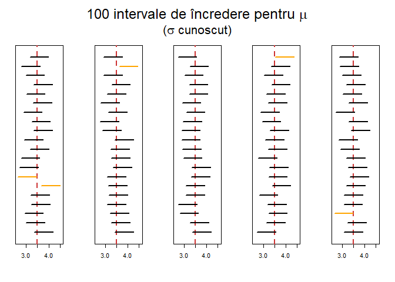

Intervale de încredere **incorecte** atunci când $\sigma$ nu este cunoscut: 


```r
par(mfrow=c(1,5), las=1, mar=c(5.1,2.1,6.1,2.1))

for(i in 1:p) {
  plot(0, 0,
       type="n",
       ylim=0.5+c(0,n),
       xlim=r,
       ylab="",
       xlab="",
       yaxt="n")
  
  abline(v = mu,lty = 2, col="brown3", lwd=2)
  
  segments(lo2[[i]], 1:n,
           hi2[[i]], 1:n,
           lwd=2)
  
  o = (1:n)[lo2[[i]] > 3.5 | hi2[[i]] < 3.5]
  
  segments(lo2[[i]][o],o,
           hi2[[i]][o],o,
           lwd=2, col="orange")
}

par(mfrow=c(1,1))
mtext(expression(paste("100 intervale de încredere incorecte pentru ", mu)), 
      side=3, cex=1.5, xpd=TRUE, line=4)
mtext(expression(paste("(",sigma," necunoscut)")),
      side=3,cex=1.3,xpd=TRUE,line=2.7)
```

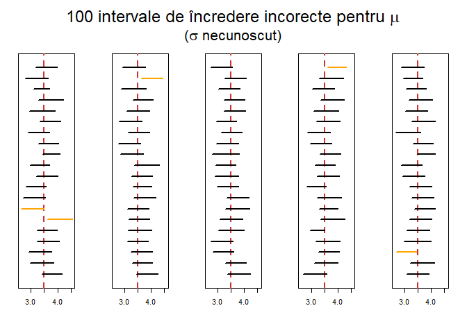

Intervale de încredere **corecte** atunci când $\sigma$ nu este cunoscut: 


```r
par(mfrow=c(1,5), las=1, mar=c(5.1,2.1,6.1,2.1))

for(i in 1:p) {
  plot(0,0,
       type="n",
       ylim=0.5+c(0,n),
       xlim=r,
       ylab="",
       xlab="",
       yaxt="n")
  
  abline(v = mu, lty=2, col="brown3", lwd=2)
  
  segments(lo3[[i]],1:n,
           hi3[[i]],1:n,
           lwd=2)
  
  o = (1:n)[lo3[[i]] > 3.5 | hi3[[i]] < 3.5]
  
  segments(lo3[[i]][o],o,
           hi3[[i]][o],o,
           lwd=2, col="orange")
}
par(mfrow=c(1,1))

mtext(expression(paste("100 intervale de încredere pentru ", mu)),
      side=3, cex=1.5, xpd=TRUE, line=4)

mtext(expression(paste("(",sigma," necunoscut)")),
      side=3, cex=1.3, xpd=TRUE, line=2.7)
```

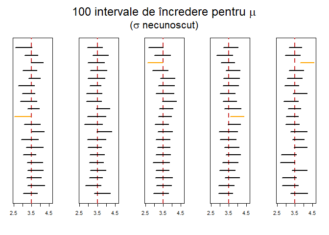

# Ilustrarea probabilității de acoperire

## Intervale de încredere de tip Wald

\BeginKnitrBlock{rmdexercise}<div class="rmdexercise">Fie $X_1,X_2,\ldots,X_n$ un eșantion de talie $n$ dintr-o populație Bernoulli de medie $\theta$. Determinați un interval de încredere asimptotic pentru $\theta$ cu un coeficient de încredere $1-\alpha$. 

Ilustrați grafic *probabilitatea de acoperire* $\mathbb{P}_{\theta}\left(IC^{1-\alpha}(\theta)\ni \theta\right)$ ca funcție de $\theta$ pentru diferite valori ale lui $n\in \{50, 100\}$ și $\alpha = 0.05$. Ce observați?
</div>\EndKnitrBlock{rmdexercise}

Știm că $\hat{\theta}_n = \bar{X}_n$ este estimatorul de verosimilitate maximă pentru $\theta$ și folosind proprietatea asimptotică a estimatorilor de verosimilitate maximă găsim că un interval de încredere asimptotic pentru $\theta$ este (folosid o înlocuire de tip Wald)

$$
  IC^{1-\alpha}(\theta) = \bar{X}_n \pm z_{1-\frac{\alpha}{2}}\sqrt{\frac{\bar{X}_n(1-\bar{X}_n)}{n}}.
$$

Probabilitatea de acoperire este:


```r
binom.wald.cvg = function(theta, n, alpha) {
  z = qnorm(1 - alpha / 2)
  
  f = function(p) {
    t = 0:n

    s = sqrt(t * (n - t) / n)
    o = (t - z * s <= n * p & t + z * s >= n * p)
  
    return(sum(o * dbinom(t, size = n, prob = p)))
  }
  
  out = sapply(theta, f)
  return(out)
}
```


```r
# date intrare
par(mfrow = c(1,2))

n = 50
alpha = 0.05

theta = seq(0.01, 0.99, len=200)

plot(theta, binom.wald.cvg(theta, n, alpha), 
     ylim=c(0.5, 1), type="l", lwd=1,
     bty = "n",
     col = "forestgreen", 
     main = paste0("n = ", n),
     xlab = expression(theta), 
     ylab = "Probabilitatea de acoperire")

abline(h = 1-alpha, lty=3, lwd=2,
       col = "brown3")

# al doilea grafic
n = 100

plot(theta, binom.wald.cvg(theta, n, alpha), 
     ylim=c(0.5, 1), type="l", lwd=1,
     bty = "n",
     col = "forestgreen", 
     main = paste0("n = ", n),
     xlab = expression(theta), 
     ylab = "Probabilitatea de acoperire")

abline(h = 1-alpha, lty=3, lwd=2,
       col = "brown3")
```

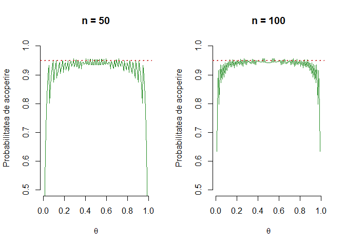

Observăm că probabilitatea de acoperire tinde să fie mai scăzută decât pragul $1-\alpha = 0.95$ ales pentru majoritatea valorilor lui $\theta$.


\BeginKnitrBlock{rmdexercise}<div class="rmdexercise">Fie $X_1,X_2,\ldots,X_n$ un eșantion de talie $n$ dintr-o populație Exponențială de parametru $\theta$. Determinați un interval de încredere asimptotic pentru $\theta$ cu un coeficient de încredere $1-\alpha$. 

Ilustrați grafic *probabilitatea de acoperire* $\mathbb{P}_{\theta}\left(IC^{1-\alpha}(\theta)\ni \theta\right)$ ca funcție de $n$ pentru diferite valori ale lui $\theta\in \{1, 3\}$ și $\alpha = 0.05$. Ce observați?
</div>\EndKnitrBlock{rmdexercise}

Știm că $\hat{\theta}_n = \bar{X}_n$ este estimatorul de verosimilitate maximă pentru $\theta$ și folosind proprietatea asimptotică a estimatorilor de verosimilitate maximă găsim că un interval de încredere asimptotic pentru $\theta$ este (folosid o înlocuire de tip Wald)

$$
  IC^{1-\alpha}(\theta) = \bar{X}_n \pm z_{1-\frac{\alpha}{2}}\frac{\bar{X}_n}{\sqrt{n}}.
$$

```r
expo.wald.cvg = function(N, theta, alpha) {
    z = qnorm(1 - alpha / 2)
    
  f = function(n) {
    f1 = 1 - pgamma(n * theta / (1 - z / sqrt(n)), 
                    shape=n, rate=1/theta)
    f2 = pgamma(n * theta / (1 + z / sqrt(n)), 
                shape=n, rate=1/theta)
    return(1 - f1 - f2)
  }
  
  out = sapply(N, f)
  return(out)
}
```


```r
alpha = 0.05
n = seq(100, 1500, by=50)

par(mfrow = c(1,2))

plot(n, expo.wald.cvg(n, 1, alpha), 
     ylim=c(0.945, 0.95), type="l", lwd=2,
     bty = "n", col = "forestgreen",
     main = TeX("$\\theta = 1$"),
     xlab="n", ylab="Probabilitatea de acoperire")

abline(h=1-alpha, lty=3, lwd=2,
       col = "brown3")

plot(n, expo.wald.cvg(n, 3, alpha), 
     ylim=c(0.945, 0.95), type="l", lwd=2,
     bty = "n", col = "forestgreen",
     main = TeX("$\\theta = 3$"),
     xlab="n", ylab="Probabilitatea de acoperire")

abline(h=1-alpha, lty=3, lwd=2,
       col = "brown3")
```

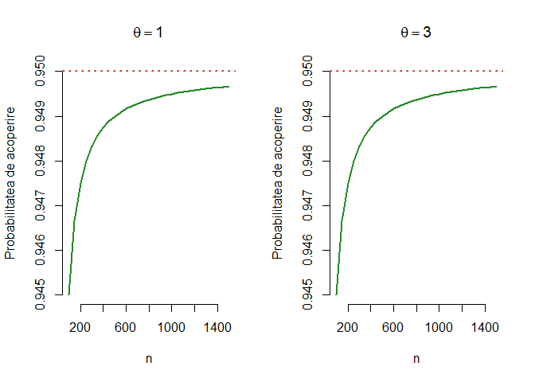

## Intervale de încredere folosid transformări stabilizatoare de varianță 

\BeginKnitrBlock{rmdinsight}<div class="rmdinsight">Spune că o funcție $g$ este stabilizatoare de varianță dacă verifică ecuația diferențială:
  
$$
  \left[g'(\theta)\right]^{2} = c^2 I_1(\theta), \quad c>0
$$

unde $I_1(\theta)$ este informația lui Fisher.</div>\EndKnitrBlock{rmdinsight}

\BeginKnitrBlock{rmdexercise}<div class="rmdexercise">Fie $X_1,X_2,\ldots,X_n$ un eșantion de talie $n$ dintr-o populație Bernoulli de medie $\theta$. Determinați o funcție stabilizatoare de varianță și găsiâi un interval de încredere asimptotic pentru $\theta$ cu un coeficient de încredere $1-\alpha$. 

Ilustrați grafic *probabilitatea de acoperire* $\mathbb{P}_{\theta}\left(IC^{1-\alpha}(\theta)\ni \theta\right)$ ca funcție de $\theta$ pentru diferite valori ale lui $n\in \{50, 100\}$ și $\alpha = 0.05$. Ce observați acum?
</div>\EndKnitrBlock{rmdexercise}

Observăm că pentru $g(\theta) = \arcsin{\sqrt{\theta}}$ avem 

$$
  g'(\theta) = \frac{1}{2}\frac{1}{\sqrt{\theta(1-\theta)}}
$$
deci 

$$
\left[g'(\theta)\right]^{2} = \frac{1}{4} I_1(\theta)
$$

și găsim un interval de încredere de tipul 

$$
  IC^{1-\alpha}(\theta) = \sin^2\left(\arcsin{\sqrt{\bar{X}_n}} \pm z_{1-\frac{\alpha}{2}}\frac{1}{16n^2}\right)
$$


```r
binom.vst.cvg = function(theta, n, alpha) {
  z = qnorm(1 - alpha / 2)
  
  f = function(p) {
    t = 0:n
    a = asin(sqrt(t / n))
    s = z / 2 / sqrt(n)
    
    o = (a - s <= asin(sqrt(p)) & a + s >= asin(sqrt(p)))
    
    return(sum(o * dbinom(t, size=n, prob=p)))
  }
  
  out = sapply(theta, f)
  return(out)
}
```


```r
# date intrare
par(mfrow = c(1,2))

n = 50
alpha = 0.05

theta = seq(0.01, 0.99, len=200)

plot(theta, binom.vst.cvg(theta, n, alpha), 
     ylim=c(0.5, 1), type="l", lwd=1,
     bty = "n",
     col = "forestgreen", 
     main = paste0("n = ", n),
     xlab = expression(theta), 
     ylab = "Probabilitatea de acoperire")

abline(h = 1-alpha, lty=3, lwd=2,
       col = "brown3")

# al doilea grafic
n = 100

plot(theta, binom.vst.cvg(theta, n, alpha), 
     ylim=c(0.5, 1), type="l", lwd=1,
     bty = "n",
     col = "forestgreen", 
     main = paste0("n = ", n),
     xlab = expression(theta), 
     ylab = "Probabilitatea de acoperire")

abline(h = 1-alpha, lty=3, lwd=2,
       col = "brown3")
```

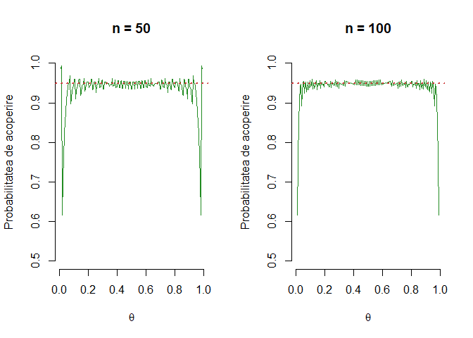

Observăm că probabilitatea de acoperire în acest caz este mai aproape de ținta de $1-\alpha = 0.95$ comparativ cu exemplul anterior.


# Testarea ipotezelor statistice: inferență asupra unui eșantion 

## Exemplul 1

\BeginKnitrBlock{rmdexercise}<div class="rmdexercise">Care este temperatura normală a corpului uman ? ([vezi articol](readings/BodyTemp.pdf)) Ne dorim să testăm din punct de vedere statistic dacă temperatura medie a corpului uman este de $37^\circ C$ plecând de la următorul set de date [descarcă](dataIn/normtemp.txt) (sursa originală a datelor este *Mackowiak, P. A., Wasserman, S. S., and Levine, M. M. (1992). A Critical Appraisal of 98.6 Degrees F, the Upper Limit of the Normal Body Temperature, and Other Legacies of Carl Reinhold August Wunderlich. Journal of the American Medical Association, 268, 1578-1580*).
</div>\EndKnitrBlock{rmdexercise}

Pentru a citi datele putem folosi două metode: sau să le citim direct din pagina de internet (prin comanda `read.table`)


```r
file = "https://alexamarioarei.github.io/Teaching/Biostat web page/labs/dataIn/normtemp.txt"
```

sau descărcând local fișierul cu date și înlocuind adresa de internet din `file` cu cea locală


```r
file = "dataIn/normtemp.txt"
normtemp = read.table(file, header=F, col.names=c("temp","sex","hr"))

head(normtemp)
  temp sex hr
1 96.3   1 70
2 96.7   1 71
3 96.9   1 74
4 97.0   1 80
5 97.1   1 73
6 97.1   1 75
```

Temperatura apare în grade Fahrenheit și am dori să transformăm în grade Celsius folosind formula:

$$
  T_C = 5(T_F-32)/9
$$


```r
normtemp$tempC = (normtemp$temp - 32)*5/9 
degreesC = normtemp$tempC
```

Testul t-student presupune că eșantionul (independent) a provenit dintr-o populație normală și pentru aceasta putem verifica ipoteza de normalitate (`QQ plot`):


```r
qqnorm(degreesC)
qqline(degreesC)
```

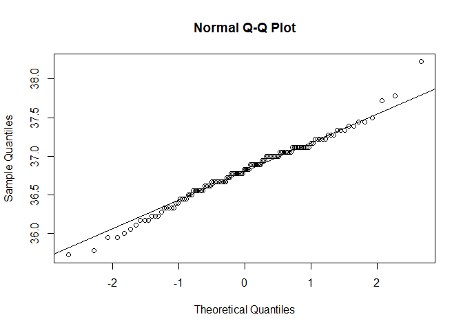

Trasăm histograma:


```r
hist(degreesC, probability = T)
degM = mean(degreesC)
degSD = sd(degreesC)
curve(dnorm(x, degM, degSD), add = T, col = "brown3")
```

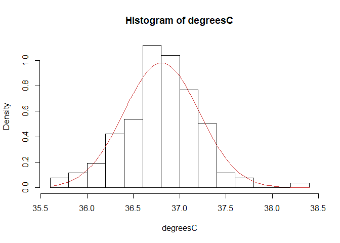

Trasăm densitatea:


```r
plot(density(degreesC))
curve(dnorm(x, degM, degSD), add = T, col = "brown3")
```


Testăm ipoteza de normalitate (folosind testul `Shapiro-Wilk`):


```r
shapiro.test(degreesC)# distributia pare sa fie aproape de normala si testul nu detecteaza 

	Shapiro-Wilk normality test

data:  degreesC
W = 0.98658, p-value = 0.2332
                      # o abatere semnificativa fata de normala
```

Distribuția pare să fie aproape de normală, testul Shapiro-Wilk nu detectează o deviație semnificantă de la normalitate.


```r
t.test(degreesC, mu = 37, alternative = "two.sided") # respingem H0

	One Sample t-test

data:  degreesC
t = -5.4548, df = 129, p-value = 2.411e-07
alternative hypothesis: true mean is not equal to 37
95 percent confidence interval:
 36.73445 36.87581
sample estimates:
mean of x 
 36.80513 
```


```r
ttest_deg = t.test(degreesC, mu = 37)

ttest_deg$statistic
        t 
-5.454823 
ttest_deg$p.value
[1] 2.410632e-07
ttest_deg$conf.int
[1] 36.73445 36.87581
attr(,"conf.level")
[1] 0.95
```

Dacă nu avem datele și avem o problemă de tipul: un eșantion de 130 de persoane a fost selectionat și temperatura corpului a fost masurată. Media eșantionului a fost `36.805` iar abaterea standard `0.4073`. Testati ipoteza nulă că media temperaturii corpului uman este de `37` grade Celsius.

În acest caz avem:


```r
t.obt = (36.805 - 37)/(0.4073/sqrt(130))
t.obt
[1] -5.458733

qt(c(0.25, 0.975), df = 129) # valorile critice pentru alpha = 0.05
[1] -0.6763963  1.9785245
2*pt(t.obt, df = 129) # p valoarea pentru testul two-tailed
[1] 2.367923e-07
```

Ca să automatizăm aceste calcule putem crea o funcție:


```r
t.single = function(obs.mean, mu, SD, n) {
  t.obt = (obs.mean - mu) / (SD / sqrt(n))
  p.value = pt(abs(t.obt), df=n-1, lower.tail=F)
  print(c(t.obt = t.obt, p.value = p.value))
  warning("P-value pentru one-sided. Dubleaza pentru two-sided.")
}

t.single(36.805, mu = 37, SD = 0.4073, n = 130)
        t.obt       p.value 
-5.458733e+00  1.183961e-07 
Warning in t.single(36.805, mu = 37, SD = 0.4073, n = 130): P-value pentru
one-sided. Dubleaza pentru two-sided.
```


# Testarea ipotezelor statistice: inferență asupra a două eșantioane

## Exemplul 1

În contextul exemplului anterior, să presupunem că vrem să vedem dacă există vreo diferență între temperatura medie la bărbați și temperatura medie la femei. 


```r
str(normtemp)
'data.frame':	130 obs. of  4 variables:
 $ temp : num  96.3 96.7 96.9 97 97.1 97.1 97.1 97.2 97.3 97.4 ...
 $ sex  : int  1 1 1 1 1 1 1 1 1 1 ...
 $ hr   : int  70 71 74 80 73 75 82 64 69 70 ...
 $ tempC: num  35.7 35.9 36.1 36.1 36.2 ...

tempB = normtemp$tempC[which(normtemp$sex == 1)]
tempF = normtemp$tempC[which(normtemp$sex == 2)]
```

Ilustrare a temperaturii bărbaților și a femeilor:


```r
par(mfrow=c(1,2))
plot(density(tempB), main="Temperatura Barbatilor")
plot(density(tempF), main="Temperatura Femeilor")
```

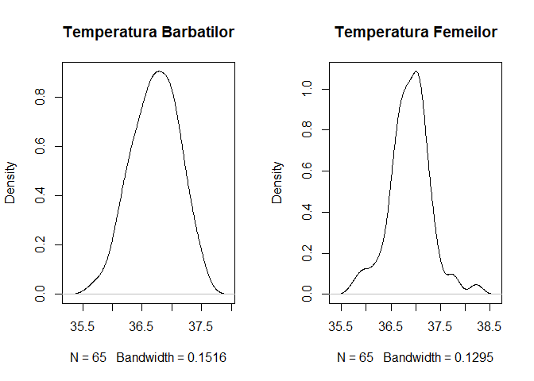

Sub formă de `boxplot`:


```r
par(mfrow = c(1,1))
boxplot(tempB, tempF, ylab="Temperatura",     # plot and label y-axis
                names=c("Barbati","Femei"),   # group names on x-axis
                main="Temperatura in functie de sex")   # main title
```

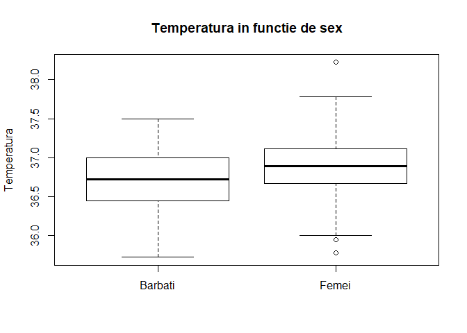

Trasarea datelor împreună cu intervalele de încredere:


```r
source("lab_functions/dotplot.R")

dotplot(tempB, tempF, labels=c("Barbati","Femei"))
```

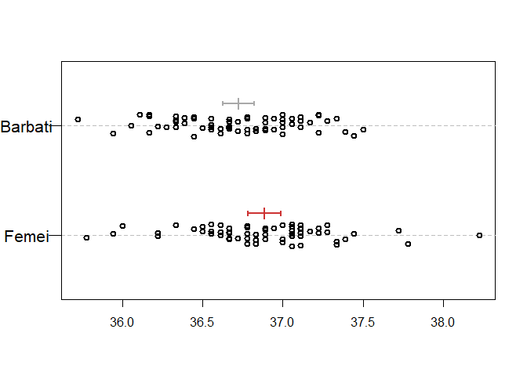

Testarea ipotezelor statistice cu ajutorul testului t-student (corecția lui `Welch`):


```r
t.test(tempB, tempF) # Welch correction 

	Welch Two Sample t-test

data:  tempB and tempF
t = -2.2854, df = 127.51, p-value = 0.02394
alternative hypothesis: true difference in means is not equal to 0
95 percent confidence interval:
 -0.29980476 -0.02156277
sample estimates:
mean of x mean of y 
 36.72479  36.88547 
```

Verificăm dacă cele două eșantioane au varianțe egale (folosim testul lui `Fisher`):


```r
var.test(tempB, tempF)

	F test to compare two variances

data:  tempB and tempF
F = 0.88329, num df = 64, denom df = 64, p-value = 0.6211
alternative hypothesis: true ratio of variances is not equal to 1
95 percent confidence interval:
 0.5387604 1.4481404
sample estimates:
ratio of variances 
         0.8832897 
```

Aplicăm acum testul t-student cu opțiunea de varianțe egale (`pooled variance`):


```r
t.test(tempB, tempF, var.equal = T) # without Welch correction 

	Two Sample t-test

data:  tempB and tempF
t = -2.2854, df = 128, p-value = 0.02393
alternative hypothesis: true difference in means is not equal to 0
95 percent confidence interval:
 -0.29979966 -0.02156786
sample estimates:
mean of x mean of y 
 36.72479  36.88547 
```

## Exemplul 2


```r
# Example data
x <- c(102.5, 106.6,  99.8, 106.5, 103.7, 105.5, 98.2, 104.1,  85.6, 105.5, 114.0, 112.2)
y <- c( 93.7,  90.9, 100.4,  92.0, 100.2, 104.6, 95.4,  96.6,  99.2)

# Two-sided t-test allowing un-equal population SDs
t.test(x,y)

	Welch Two Sample t-test

data:  x and y
t = 2.6041, df = 18.475, p-value = 0.01769
alternative hypothesis: true difference in means is not equal to 0
95 percent confidence interval:
  1.30124 12.06543
sample estimates:
mean of x mean of y 
 103.6833   97.0000 

dotplot(x,y)
```

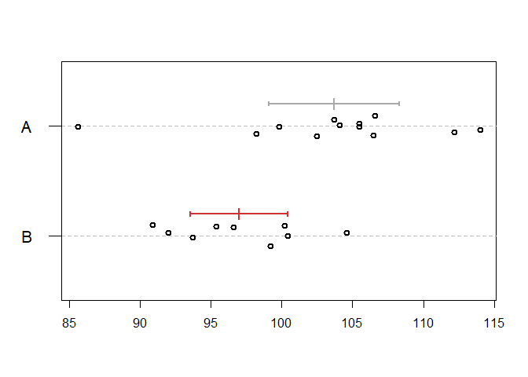

## Exemplul 3


```r
# One-tailed test example
x <- c(59.4, 52.3, 42.6, 45.1, 65.9, 40.8)
y <- c(82.7, 56.7, 46.9, 67.8, 74.8, 85.7)

# One-tailed t-test
t.test(x,y,alt="less")

	Welch Two Sample t-test

data:  x and y
t = -2.4421, df = 8.6937, p-value = 0.01907
alternative hypothesis: true difference in means is less than 0
95 percent confidence interval:
      -Inf -4.454703
sample estimates:
mean of x mean of y 
 51.01667  69.10000 

# The dotplot
dotplot(x,y)
```

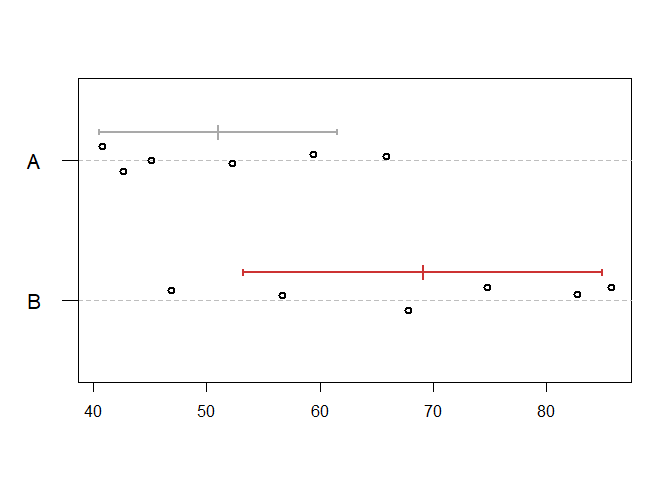

## Exemplul 4


```r
# another one-tailed test example
x <- c(63.3, 58.6, 59.0, 60.5, 56.3, 57.4)
y <- c(75.6, 65.9, 72.3, 58.0, 64.4, 66.2)
t.test(x,y,alt="less")

	Welch Two Sample t-test

data:  x and y
t = -2.8968, df = 6.5546, p-value = 0.01242
alternative hypothesis: true difference in means is less than 0
95 percent confidence interval:
      -Inf -2.674212
sample estimates:
mean of x mean of y 
 59.18333  67.06667 
dotplot(x,y)
```

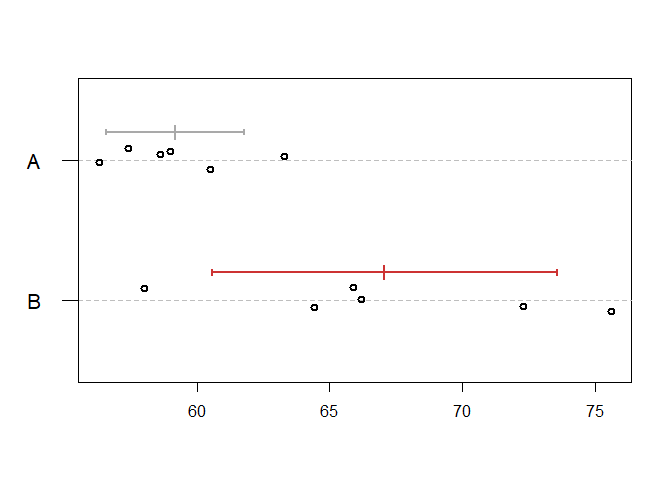

## Un model de grafic


```r
x <- c(15.1, 13.1, 21.5)
y <- c(35.1, 39.5, 58.8)

par(mar=c(4,4,2,1),mfrow=c(1,2),las=1)

barplot(c(mean(x),mean(y)),width=1,space=c(0.5,0.5),
        col=c("white","gray40"),xlim=c(0,3),names=c("A","B"),
        ylim=c(0,76))
segments(1,mean(x),1,mean(x)+sd(x),lwd=2)
segments(0.8,mean(x)+sd(x),1.2,mean(x)+sd(x),lwd=2)
segments(2.5,mean(y),2.5,mean(y)+sd(y),lwd=2)
segments(2.3,mean(y)+sd(y),2.7,mean(y)+sd(y),lwd=2)
mtext("Grafic nepotrivit",cex=1.5,line=0.5)

plot(rep(0:1,c(3,3)),c(x,y),xaxt="n",ylim=c(0,76),
     xlim=c(-0.5,1.5),ylab="",xlab="")
abline(v=0:1,col="gray40",lty=2)
points(rep(0:1,c(3,3)),c(x,y),lwd=2)
mtext("Grafic recomandat",cex=1.5,line=0.5)
xci <- t.test(x)$conf.int
yci <- t.test(y)$conf.int
segments(0.25,xci[1],0.25,xci[2],lwd=2,col="darkgray")
segments(c(0.23,0.23,0.2),c(xci,mean(x)),c(0.27,0.27,0.3),
         c(xci,mean(x)),lwd=2,col="darkgray")
segments(1-0.25,yci[1],1-0.25,yci[2],lwd=2,col="brown3")
segments(1-c(0.23,0.23,0.2),c(yci,mean(y)),1-c(0.27,0.27,0.3),
         c(yci,mean(y)),lwd=2,col="brown3")
u <- par("usr")
segments(0:1,u[3],0:1,u[3]-diff(u[3:4])*0.03,xpd=TRUE)
text(0:1,u[3]-diff(u[3:4])*0.08,c("A","B"),xpd=TRUE)
```

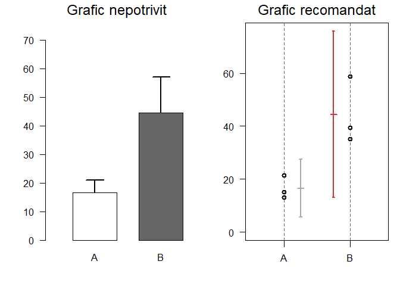

# Testarea ipotezelor statistice: inferență asupra a două eșantioane dependente (perechi)
  
Considerăm următorul set de date din pachetul `MASS` (luarea in greutate de catre femei anorexice):


```r
data(anorexia, package="MASS")      
attach(anorexia)
str(anorexia)
'data.frame':	72 obs. of  3 variables:
 $ Treat : Factor w/ 3 levels "CBT","Cont","FT": 2 2 2 2 2 2 2 2 2 2 ...
 $ Prewt : num  80.7 89.4 91.8 74 78.1 88.3 87.3 75.1 80.6 78.4 ...
 $ Postwt: num  80.2 80.1 86.4 86.3 76.1 78.1 75.1 86.7 73.5 84.6 ...

ft=subset(anorexia,Treat="FT") # family treatment
```

Testăm dacă există diferențe între luarea în greutate înainte de tratament și după tratament:


```r
with(ft, t.test(Postwt-Prewt, mu=0, alternative="greater"))

	One Sample t-test

data:  Postwt - Prewt
t = 2.9376, df = 71, p-value = 0.002229
alternative hypothesis: true mean is greater than 0
95 percent confidence interval:
 1.195825      Inf
sample estimates:
mean of x 
 2.763889 
```

sau


```r
with(ft, t.test(Postwt, Prewt, paired=T, alternative="greater"))

	Paired t-test

data:  Postwt and Prewt
t = 2.9376, df = 71, p-value = 0.002229
alternative hypothesis: true difference in means is greater than 0
95 percent confidence interval:
 1.195825      Inf
sample estimates:
mean of the differences 
               2.763889 
```


