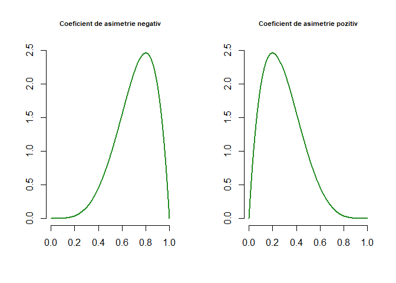
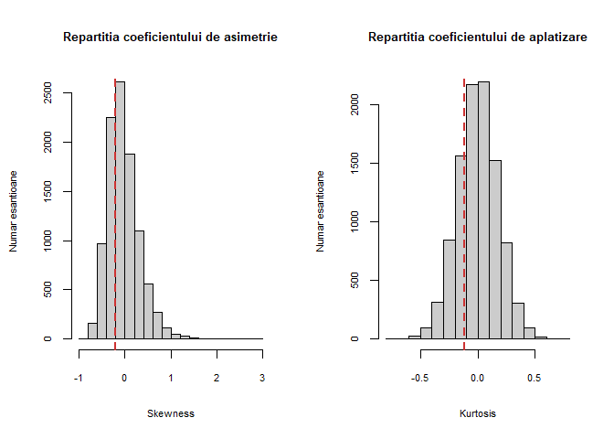
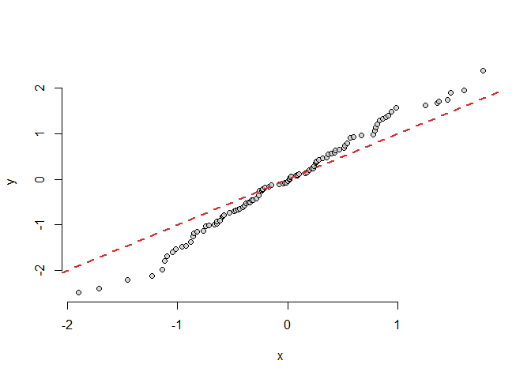
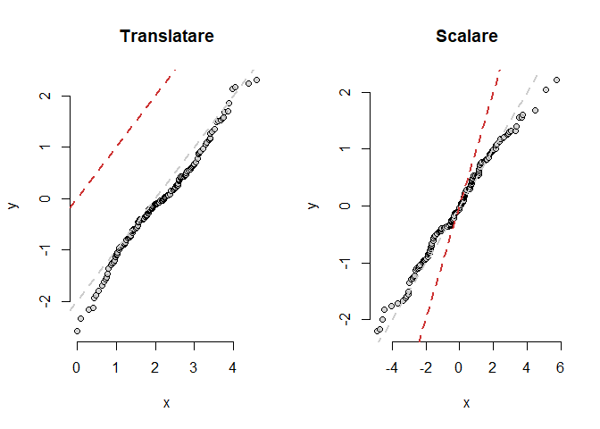
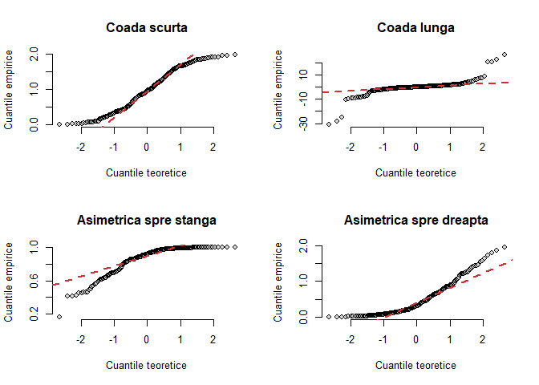
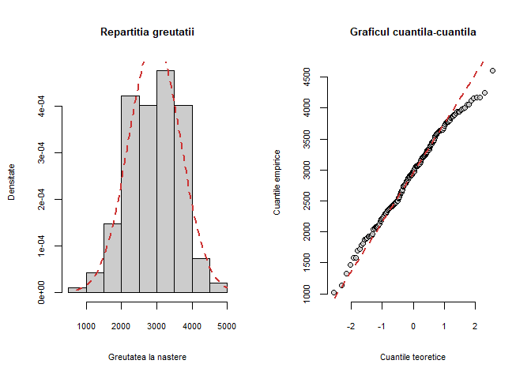
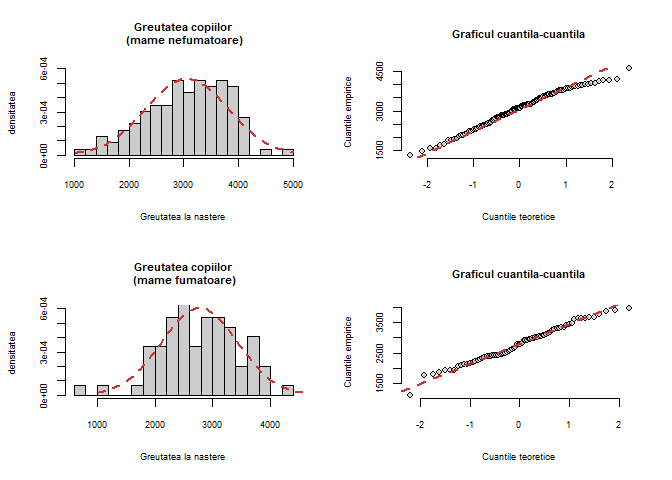
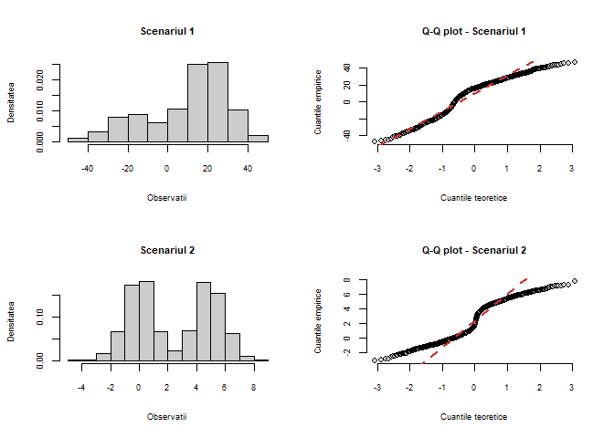

<script>
$(document).ready(function ()  {

    // move toc-ignore selectors from section div to header
    $('div.section.toc-ignore')
        .removeClass('toc-ignore')
        .children('h1,h2,h3,h4,h5').addClass('toc-ignore');

    // establish options
    var options = {
      selectors: "h1,h2,h3",
      theme: "bootstrap3",
      context: '.toc-content',
      hashGenerator: function (text) {
        return text.replace(/[.\\/?&!#<>]/g, '').replace(/\s/g, '_').toLowerCase();
      },
      ignoreSelector: ".toc-ignore",
      scrollTo: 60
    };
    options.showAndHide = false;
    options.smoothScroll = true;

    // tocify
    var toc = $("#TOC").tocify(options).data("toc-tocify");
});
</script>

Obiectivul acestui laborator este de a prezenta câteva metode utile atunci când vrem să verificăm dacă eșantionul provine ditnr-o populație normală.


Sunt multe metode și modele statistice (e.g. testul student, ANOVA, etc.) pentru care ipoteza de normalitate a datelor joacă un rol important și prin urmare verificarea unei astfel de ipoteze este esențială.  

# Coeficientul de asimetrie și de aplatizare

Coeficientul de asimetrie (*skewness*) este o măsură a simetriei (sau mai bine a lipsei simetriei) unei repartiții. Fiind dată o variabilă aleatoare $X$ cu $\mathbb{E}[|X|^3]<\infty$, $\mathbb{E}[X]=\mu$ și $Var(X)=\sigma^2>0$ coeficientul de asimetrie este definit prin relația 

$$
  \gamma_1(X) = \mathbb{E}\left[\frac{(X-\mu)^3}{\sigma^3}\right].
$$

Cum repartiția normală este simetrică față de media sa $\mu$ atunci coeficientul de asimetrie este 0. În general o repartiție unimodală are coerficientul de asimetrie negativ dacă are o coadă mai lungă spre stânga (masa este concentrată mai spre dreapta) și pozitiv dacă are coada mai lungă spre dreapta (masa este concentrată mai spre stânga). 



Coeficientul de asimetrie pentru un eșantion $X_1, X_2, \ldots, X_n$ este 

$$
  b_1 = \frac{\frac{1}{n}\sum_{i = 1}^{n} (X_i - \bar{X}_n)^3}{\left(\frac{1}{n}\sum_{i = 1}^{n} (X_i - \bar{X}_n)^2\right)^{\frac{3}{2}}}.
$$

Coeficientul de aplatizare (*kurtosis*) măsoară dacă datele au coadă mai lungă sau mai scurtă în raport cu repartiția normală. Fiind dată o variabilă aleatoare $X$ cu $\mathbb{E}[X^4]<\infty$, $\mathbb{E}[X]=\mu$ și $Var(X)=\sigma^2>0$ coeficientul de aplatizare este definit prin relația 

$$
  \gamma_2(X) = \mathbb{E}\left[\frac{(X-\mu)^4}{\sigma^4}\right] - 3.
$$

Pentru o variabilă aleatoare repartizată normal, $Z\sim \mathcal{N}(\mu, \sigma^2)$, avem că $\gamma_2(Z) = 0$.

Coeficientul de aplatizare pentru un eșantion $X_1, X_2, \ldots, X_n$ este 

$$
  b_2 = \frac{\frac{1}{n}\sum_{i = 1}^{n} (X_i - \bar{X}_n)^4}{\left(\frac{1}{n}\sum_{i = 1}^{n} (X_i - \bar{X}_n)^2\right)^{2}} - 3.
$$
Articolul [@Joanes1998] prezintă diferite metode de calcul pentru coeficientul de aplatizare și cel de asimetrie într-un eșantion. 

\BeginKnitrBlock{rmdexercise}<div class="rmdexercise">Construiți în R două funcții, `skewness_coef()` și `kurtosis_coef()`, care să permită calculul coeficientului de asimetrie și respectiv a coeficientului de aplatizare pentru un eșantion dat.  </div>\EndKnitrBlock{rmdexercise}


Deplasarea față de valoarea $0$, atât pentru coeficientul de asimetrie cât și pentru cel de aplatizare indică o deplasare față de repartiția normală. Pentru a decide dacă o anumită deplasare față de $0$ este mare sau mică se poate folosi un studiu de simulare. De exemplu, coeficientul de asimetrie calculat pentru greutatea la naștere a celor 189 de copii din setul de date `birthwt` (din pachetul `MASS`) este -0.207 iar coeficientul de aplatizare este -0.113. Pentru a vedea dacă -0.207 și respectiv dacă -0.113 sunt valori tipice pentru coeficientul de asimetrie și respectiv de aplatizare dintr-un eșantion de 189 de observații dintr-o populație normală, repetăm următorul proces de un număr mare de ori (de exemplu $10000$): generăm aletor 189 de observații dintr-o repartiție normală și calculăm cei doi coeficienți. 


```r
library(MASS)
weight = birthwt$bwt

n_wt = length(weight)
m_wt = mean(weight)
sd_wt = sd(weight)

skew_bwt = skewness_coef(weight)
kurt_bwt = kurtosis_coef(weight)

# functia de simulare
skew_kurt_sim = function(fun = function(n) rnorm(n), n = 100){
  x = fun(n)
  kurt = kurtosis_coef(x)
  skew = skewness_coef(x)
  
  return(c(kurtosis = kurt, skewness = skew))
}

# replicam de 10000 de ori procesul 
out1 <- replicate(10000, 
         skew_kurt_sim(fun = function(n) rnorm(n), 
                       n = n_wt))
```

Figurile de mai jos reprezintă histogramele a $10000$ de valori ale coeficientului de asimetrie și respectiv de aplatizare, calculate pentru $10000$ de eșantioane de talie 189 dintr-o repartiție normală standard. 



# Metoda grafică: Q-Q plot 

Graficul cuantilă-cuantilă (*quantile-quantile plot* sau *q-q plot* pe scurt) este o metodă grafică introdusă în [@Wilk1968] și folosită pentru a determina dacă două eșantioane provin din populații cu repartiție comună. Un *q-q plot* ilustrează grafic cuantilele empirice ale primului eșantion față de cuantilele empirice (sau teoretice) ale celui de-al doilea eșantion.    

Fiind date două eșantioane, $X_1,X_2,\ldots,X_n\sim F$ și respectiv $Y_1, Y_2, \ldots, Y_m\sim G$, fie $\hat{x}_p(n) = \hat{F}_n^{-1}(p)$ și $\hat{y}_p(m) = \hat{G}_m^{-1}(p)$ cuantilele empirice de ordin $p$ asociate celor două eșantioane. Metoda *q-q plot* implică trasarea pe același grafic al punctelor de coordonate $(\hat{x}_p(n), \hat{y}_p(m))$ pentru diverse valori ale lui $p\in(0,1)$. După cum am văzut în [Laboratorul 2](https://alexamarioarei.github.io/Teaching/2017-2018/Biostat%20web%20page/labs/Lab_2.html), cunatila empirică de ordin $p$ coincide cu una dintre statisticile de ordine $\hat{x}_p = X_{(i)} \iff \hat{x}_p = X_{(\lceil np \rceil)}$ (deci $X_{(k)}$ este cuantila de ordin $\frac{k}{n}$) și prin urmare putem considera că 

  $$
    p\in \left\{\begin{array}{ll}
      \left\{\frac{i}{n}\,|\,1\leq i\leq n\right\}, & n\leq m\\
      \left\{\frac{i}{m}\,|\,1\leq i\leq m\right\}, & n\geq m.
    \end{array}\right.
  $$
În practică, pentru a avea $p<1$ vom considera că $X_{(k)}$ este cuantila de ordin $\frac{k}{n+1}$ (unii autori consideră că $X_{(k)}$ este cuantila de ordin $\frac{k-0.5}{n}$ sau încă de ordin $\frac{k-3/8}{n+1/4}$), astfel 

  $$
    p\in \left\{\begin{array}{ll}
      \left\{\frac{i}{n+1}\,|\,1\leq i\leq n\right\}, & n\leq m\\
      \left\{\frac{i}{m+1}\,|\,1\leq i\leq m\right\}, & n\geq m.
    \end{array}\right.
  $$
  
În R putem folosi funcția `qqplot()` pentru a trasa graficul cuantilă-cuantilă (tastați `?qqplot` pentru a vedea documentația acestei funcții).  

\BeginKnitrBlock{rmdexercise}<div class="rmdexercise">Construiți în R o funcție `qqgraf()` care să traseze graficul cuantilă-cuantilă pentru două eșantioane.</div>\EndKnitrBlock{rmdexercise}


Observăm că dacă cele două eșantioane ar proveni de la aceeași populație ($F = G$) atunci punctele ar fi aliniate aproximativ pe o dreaptă (prima bisectoare $y=x$). 


```r
x = rnorm(100)
y= rnorm(150)

qqgraf(x, y)
```



O deviere de la prima bisectoare indică o diferență între formele celor două distribuții din care au provenit datele. Atunci când cele două repartiții au aceeași formă dar au medii și respectiv abateri standard diferite atunci graficul rămâne liniar numai că ordonata la origine și panta dreptei nu vor mai fi $0$ și respectiv $1$. O ordonată la origine diferită de $0$ arată o translatare în repartiții (schimbare de locație) iar o pantă neunitară indică o schimbare de scală. 


```r
par(mfrow = c(1,2))

x = rnorm(200, 2, 1)
y= rnorm(150)
qqgraf(x, y, main = "Translatare")
abline(a = -2, b = 1, 
       col = "grey80", 
       lty = 2, lwd = 2)

x = rnorm(200, 0, 2)
y= rnorm(150)
qqgraf(x, y, main = "Scalare")
abline(a = 0, b = 1/2, 
       col = "grey80",
       lty = 2, lwd = 2)
```



Graficul cuantilă-cuantilă poate fi folosit și pentru a verifica dacă un eșantion provine dintr-o repartiție specificată, astfel dat fiind $(X_1, X_2, \ldots, X_n)(\omega) = (x_1, x_2, \ldots, x_n)$ un eșantion de talie $n$ vrem să verificăm dacă acesta provine dintr-o populație (specificată) $F$. Dacă $\hat{x}_p(n)$ este cuantila empirică de ordin $p$ și $x_p = F^{-1}(p)$ este cuantila teoretică de ordin $p$ asociată lui $F$, atunci graficul cuantilă-cuantilă este determinat de punctele $\left(x_p,\hat{x}_p(n)\right)$, $p\in(0,1)$. Folosind alegerea lui $p$ de mai sus (care evită singularitățile $F^{-1}(1) = \infty$) și ținând cont că $\hat{x}_{\frac{i}{n+1}}(n) = X_{(i)}$ avem că graficul cuantilă-cuantilă este determinat de mulțimea de puncte

$$
  \mathcal{G} = \left\{\left(F^{-1}\left(\frac{i}{n+1}\right), X_{(i)}\right)\,|\, 1\leq i\leq n\right\}. 
$$

Pentru a verifica dacă datele provin dintr-o repartiție normală este suficient să alegem $F = \Phi$, cu $\Phi(x)$ funcția de repartiție a normalei standard (acest grafic se mai numește și *normal probability plot* sau *normal-quantile plot*). Dacă punctele se află (aproximativ) pe o dreaptă atunci putem spune că datele provin dintr-o repartiție (aproximativ) normală. Deplasarea față de normalitate este indicată prin deplasarea față de o dreaptă. Un grafic în formă de *U* arată că repartiția este asimetrică iar un grafic în formă de *S* ne spune că avem diferențe între coada repartiției normale și cea care a generat setul de date.

În R putem trasa graficul cuantilă-cuantilă pentru o populașie normală cu ajutorul funcției `qqnorm()` iar dreapta de referință cu ajutorul funcției `qqline()`. Pentru mai multe detalii privind aceste funcții tastați `?qqnorm` și `?qqline`.

\BeginKnitrBlock{rmdexercise}<div class="rmdexercise">Construiți în R o funcție `qq_norm()` care să traseze graficul cuantilă-cuantilă (*normal-quantile plot*) pentru a verifica dacă un eșantion provine dintr-o populație normală.</div>\EndKnitrBlock{rmdexercise}


```r
par(mfrow = c(2,2))
n = 250
# coada scurta 
x_st = runif(n, min=0, max=2)
qq_norm(x_st, main = "Coada scurta")

# coada lunga 
x_ht = rcauchy(n, location=0, scale=1)
qq_norm(x_ht, main = "Coada lunga")

# asimetrica spre stanga 
x_sn = rbeta(n, 2, 0.5, ncp = 2)
qq_norm(x_sn, main = "Asimetrica spre stanga")

# asimetrica spre dreapta 
x_sp = rexp(n, 2)
qq_norm(x_sp, main = "Asimetrica spre dreapta")
```



\BeginKnitrBlock{rmdexercise}<div class="rmdexercise">Considerați setul de date `birthwt` din pachetul `MASS`. Trasați histograma greutății la naștere a copiilor (variabila `bwt`) și graficul cuantilă-cuantilă pentru o populație normală. Comparați grafic dacă repartiția greutății copiilor la naștere diferă în funcție de statutul de fumător al mamei. </div>\EndKnitrBlock{rmdexercise}


```r
par(mfrow = c(1,2), 
    cex.main = 0.8,
    cex.axis = 0.7,
    cex.lab = 0.7)

hist(birthwt$bwt, 
     probability = TRUE, 
     col = "grey80",
     main = "Repartitia greutatii",
     xlab = "Greutatea la nastere",
     ylab = "Densitate")

t = seq(min(birthwt$bwt), max(birthwt$bwt), 
        length.out = 100)
x = dnorm(t, mean(birthwt$bwt), sd(birthwt$bwt))

lines(t, x, lwd = 2, lty = 2,
      col = "brown3")

qq_norm(birthwt$bwt, 
        main = "Graficul cuantila-cuantila")
```




```r
par(mfrow = c(2,2),
     cex.main = 0.8,
     cex.axis = 0.7,
     cex.lab = 0.7)

bwt_nf = birthwt$bwt[birthwt$smoke == 0]
bwt_f = birthwt$bwt[birthwt$smoke == 1]
bwt = birthwt$bwt

# nefumatoare
hist(bwt_nf, proba = TRUE,
      breaks=25,
      col = grey(0.8),
      main = "Greutatea copiilor\n (mame nefumatoare)",
      xlab = "Greutatea la nastere",
      ylab = "densitatea",
      ylim = c(0, 6e-4))

t_nf = seq(min(bwt_nf), max(bwt_nf), 
        length.out = 100)

x_nf = dnorm(t_nf, mean(bwt_nf), sd(bwt_nf))

lines(t_nf, x_nf, col = "brown3",
      lty = 2, lwd = 2)

qq_norm(bwt_nf,
        main = "Graficul cuantila-cuantila")

# fumatoare
hist(bwt_f, proba = TRUE,
      breaks=25,
      col = grey(0.8),
      main = "Greutatea copiilor\n (mame fumatoare)",
      xlab = "Greutatea la nastere",
      ylab = "densitatea",
      ylim = c(0, 6e-4))

t_f = seq(min(bwt_nf), max(bwt_nf), 
        length.out = 100)

x_f = dnorm(t_f, mean(bwt_f), sd(bwt_f))

lines(t_f, x_f, col = "brown3",
      lty = 2, lwd = 2)

qq_norm(bwt_f,
        main = "Graficul cuantila-cuantila")
```



Ce se întâmplă atunci când avem o mixtură de repartiții? Următoarea funcție permite generarea unui eșantion dintr-o mixtură de două repartiții normale:

$$
  f(x) = p\frac{1}{\sqrt{2\pi\sigma_1^2}}e^{-\frac{1}{2}\left(\frac{x-\mu_1}{\sigma_1}\right)^2} + (1-p)\frac{1}{\sqrt{2\pi\sigma_2^2}}e^{-\frac{1}{2}\left(\frac{x-\mu_2}{\sigma_2}\right)^2}, \; p\in (0,1)
$$


```r
mix_norm_sim = function(n = 100, p = 0.5, m1 = -1, sd1 = 1, m2 = 2, sd2 = 2){
  n1 = rbinom(1,n,p)
  x1 = rnorm(n1, m = m1, sd = sd1)
  x2 = rnorm(n-n1, m = m2, sd = sd2)
  c(x1, x2)
}
```

Ilustrăm grafic metoda cuantilă-cuantilă pentru diferite scenarii:


```r
par(mfrow=c(2,2),
     cex.main = 0.8,
     cex.axis = 0.7,
     cex.lab = 0.7)
#----------
w0 = mix_norm_sim(1000,0.25,-20,10,20,10)
hist(w0, col = grey(0.8),
     probability = TRUE,
     main = "Scenariul 1", 
     xlab = "Observatii", 
     ylab = "Densitatea")
qq_norm(w0, main = "Q-Q plot - Scenariul 1")
#----------
w1 = mix_norm_sim(1000,0.5,0,1,5,1)
hist(w1, col = grey(0.8),
     probability = TRUE,
     main = "Scenariul 2", 
     xlab = "Observatii", 
     ylab = "Densitatea")
qq_norm(w1, main = "Q-Q plot - Scenariul 2")
```



# Teste statistice

Chiar dacă metodele grafice (e.g. histograma sau graficul cuantilă-cuantilă) pot conduce la ipoteza de normalitate, acestea nu sunt suficiente. Pentru a putea folosi modelul de normalitate a datelor este necesar să efectuăm un test statistic care să respingă sau să nu respingă ipoteza de normalitate a populației din care a provenit eșantionul. În cele ce urmează vom prezenta mai multe teste statistice folosite pentru testarea ipotezei de normalitate:

$$
\begin{array}{ll}
  H_0:\,\text{eșantionul nu este semnificativ diferit de o populație normală}\\
  H_1:\,\text{eșantionul este semnificativ diferit de o populație normală}
\end{array}
$$

Literatura de specialitate este foarte vastă în ceea ce privește testele statistice folosite pentru testarea ipotezei de normalitate, de exemplu articolul [@Romao2010] compară peste 30 astfel de teste (și cartea [@Thode2002] prezintă o colecție de astfel de teste). 


## Testul lui Jarque-Bera

Plecând de la coeficientul de asimetrie și coeficientul de aplatizare a unui eșantion, C. Jarque și A. Bera au propus în [@JarqueBera1987] următoarea statistică de test pentru testarea ipotezei de normalitate a datelor

$$
  JB = \frac{n}{6}\left(b_1^2 + \frac{b_2^2}{4}\right).
$$

Autorii au arătat că dacă datele sunt normale și $n$ este suficient de mare atunci $JB\overset{d}{\to}\chi^2(2)$. 

\BeginKnitrBlock{rmdexercise}<div class="rmdexercise">Construiți în R o funcție `JBtest()` care să implementeze testul Jarque-Bera. Aplicați testul pentru o serie de exemple. </div>\EndKnitrBlock{rmdexercise}


```r
# pentru esantion normal 
x = rnorm(1000)
JBtest(x)

	Jarque Bera Test

data:  x
= 1.0779, df = 2, p-value = 0.5834

# pentru esantion exponential  
x = rexp(100, 0.2)
JBtest(x)

	Jarque Bera Test

data:  x
= 31.434, df = 2, p-value = 1.493e-07
```

## Testul lui Shapiro-Wilk și varianta lui Shapiro-Francia

Fie $X_1, X_2, \ldots, X_n$ un eșantion de talie $n$ dintr-o populație $F$. Am văzut că $\bar{X}_n$, $S_n^2$ împreună cu coeficienții de asimetrie și de aplatizare, $b_1$ și $b_2$, ne furnizează informații utile despre parametrii de locație, de scală și despre forma repartiției din care provin datele dar nu le caracterizează în totalitate (putem avea diferite eșantioane pentru care cei patru parametrii să rămână constanți). 

Dacă în schimb dacă facem referire la statisticile de ordine $X_{(1)}\leq X_{(2)}\leq \cdots\leq X_{(n)}$ atunci nu pierdem informație. Fie $Z_1, Z_2, \ldots, Z_n\sim \mathcal{N}(0,1)$ și să notăm cu $m_j = \mathbb{E}[Z_{(j)}]$, cu $Z_{(j)}$ statistica de ordine de rang $j$. Ne întrebăm dacă statisticile de ordine $X_{(1)}, X_{(2)}, \ldots, X_{(n)}$ sunt corelate cu valorile medii ale statisticilor de ordine pentru repartiția normală (deci cu $m_1, m_2, \ldots, m_n$), unde un coeficient de corelație aproape de 1 ar sugera că datele provin dintr-o populație normală pe când o corelație mică arată deplasarea față de normalitate. 

Shapiro și Wilk au propus în [@ShapiroWilk1965] următoarea statistică de test 

$$
  SW = \frac{\left(\sum_{i = 1}^{n}a_iX_{(i)}\right)^2}{\left(\sum_{i = 1}^{n}(X_i - \bar{X}_n)^2\right)}
$$

unde $\mathbf{a} = (a_1, \ldots, a_n) = \frac{\mathbf{m}^\intercal \mathbf{V}^{-1}}{\left(\mathbf{m}^\intercal \mathbf{V}^{-1}\mathbf{V}^{-1}\mathbf{m}\right)^\frac{1}{2}}$, $\mathbf{m} = (m_1, m_2, \ldots, m_n)$ iar $\mathbf{V}$ este matricea de varianță-covarianță pentru $Z_{(1)}, Z_{(2)}, \ldots, Z_{(n)}$ (deci $V_{ij} = Cov(Z_{(i)}, Z_{(j)})$). Autorii au arătat că statistica de test rămâne invariabilă atunci când avem o schimbare în locație ($SW(X_1, X_2, \ldots, X_n) = SW(X_1+b, X_2+b, \ldots, X_n+b)$ pentru o constantă $b$) sau în scală ($SW(X_1, X_2, \ldots, X_n) = SW(cX_1, cX_2, \ldots, cX_n)$ pentru o constantă $c>0$), proprietate dorită deoarece parametrii nu modifică forma repartiției. 

Deoarece pentru eșantioane de talie mare ($n>1000$) matricea de varianță-covarianță $\mathbf{V}$ a statisticilor de ordine pentru repartiția normală standard nu sunt ușor de calculat, [@ShapiroFrancia1972] o variantă modificată statisticii de test în care au considerat că $\mathbf{V}^{-1} = \mathbf{I}_n$ 

$$
  SF = \frac{\left(\sum_{i = 1}^{n}m_iX_{(i)}\right)^2}{\left(\sum_{i =1}^{n}m_i^2\right)\left[\sum_{i = 1}^{n}(X_i - \bar{X}_n)^2\right]}.
$$

Statistica $SF$ reprezintă pătratul corelației dintre $X_{(1)}, X_{(2)}, \ldots, X_{(n)}$ și $m_1, m_2, \ldots, m_n$.

În R, testul Shapiro-Wilk poate fi aplicat apelând funcția `shapiro.test()`. 


```r
# esantion normal repartizat 
x = rnorm(100, 5, 2)
shapiro.test(x)

	Shapiro-Wilk normality test

data:  x
W = 0.98236, p-value = 0.2023

# esantion repartizat t-student
xt = rt(100, df = 2)
shapiro.test(xt)

	Shapiro-Wilk normality test

data:  xt
W = 0.95682, p-value = 0.002403
```

Pentru testul Shapiro-Francia, pachetul [nortest](https://cran.r-project.org/web/packages/nortest/) prezintă o implementare a acestuia (numită `sf.test()` - pentru instalarea pachetului apelați `install.packages("nortest")`). Codul acestei funcții este redat mai jos (calculul p-valorii este conform articolului [@RoystonSF1993])


```r
sf.test <- function (x) 
{
    DNAME <- deparse(substitute(x))
    x <- sort(x[complete.cases(x)])
    n <- length(x)
    if ((n < 5 || n > 5000)) 
        stop("sample size must be between 5 and 5000")
    y <- qnorm(ppoints(n, a = 3/8))
    
    # statistica de test
    W <- cor(x, y)^2
    
    # calculul p valorii bazat pe articolul lui Royston 1993
    u <- log(n)
    v <- log(u)
    mu <- -1.2725 + 1.0521 * (v - u)
    sig <- 1.0308 - 0.26758 * (v + 2/u)
    z <- (log(1 - W) - mu)/sig
    pval <- pnorm(z, lower.tail = FALSE)
    RVAL <- list(statistic = c(W = W), p.value = pval, 
                 method = "Shapiro-Francia normality test", 
        data.name = DNAME)
    class(RVAL) <- "htest"
    return(RVAL)
}
```

Putem verifica acest test pentru seturile de date:


```r
# esantion normal repartizat 
x = rnorm(100, 5, 2)
sf.test(x)

	Shapiro-Francia normality test

data:  x
W = 0.99073, p-value = 0.6313

# esantion repartizat t-student
xt = rt(100, df = 2)
sf.test(xt)

	Shapiro-Francia normality test

data:  xt
W = 0.75246, p-value = 3.728e-10
```


## Testul lui Chen-Shapiro

O alternativă a testului Shapiro-Wilk este testul dezvoltat de Chen și Shapiro în [@ChenShapiro1995]. Statistica de test este bazată pe diferențele dintre statisticile de ordine $X_{(i+1)} - X_{(i)}$ (se numesc *spacings* în literatura de specialitate) și este dată de 

$$
  CS = \frac{1}{(n-1)S_n}\sum_{i = 1}^{n}\frac{X_{(i+1)} - X_{(i)}}{z_{p_{i+1}} - z_{p_i}}
$$

unde $z_{p_i}$ este cuantila de ordin $p_i = \frac{i - 3/8}{n + 1/4}$ asociată funcției de repartiție $\Phi$ a normalei standard, iar $S_n^2$ este dispersia eșantionului $X_1, X_2, \ldots, X_n$. Conform [@ChenShapiro1995] ipoteza de normalitate este respinsă pentru valori mici ale lui $CS$. 

## Testul lui Kolmogorov-Smirnov și varianta lui Lilliefors

Unul dintre cele mai cunoscute teste (chiar dacă nu cel mai bun) pentru verificarea ipotezei de normalitate este testul lui Kolmogorov-Smirnov. Fie $X_1, X_2, \ldots, X_n$ un eșantion de talie $n$ dintr-o populație $F$ și fie $\hat{F}_n$ funcția de repartiție empirică asociată. Testul lui Kolmogorov-Smirnov este folosit pentru a testa dacă eșantionul provine dintr-o populație specificată $F^*$ calculând cât de departe de funcția de repartiție $F^*$ se află funcția de repartiție empirică $\hat{F}_n$.

Ipoteza nulă și ipoteza alternativă a testului sunt date de:

$$
\begin{array}{ll}
  H_0:\, F(x) = F^*(x), \forall x\; \text{(eșantionul provine din $F^*$)}\\
  H_1:\, \exists x \text{ a.i. } F(x) \neq F^*(x) \; \text{(eșantionul nu provine din $F^*$)}
\end{array}
$$

Testul lui Kolmogorov-Smirnov se bazează pe următoarea teoremă (a lui Kolmogorov-Smirnov):

\BeginKnitrBlock{rmdinsight}<div class="rmdinsight">Fie $(X_n)_n$ un șir de variabile aleatoare independente și indentic repartizate cu repartiția comună $\mathbb{P}\circ X^{-1}$ și a cărei funcție de repartiție $F$, este continuă. Atunci șirul funcțiilor de repartiții empirice $(\hat{F}_n)_n$ asociate lui $(X_n)_n$ verifică

$$
  \sqrt{n}\sup_{x\in\mathbb{R}}\left(\hat{F}_n(x) - F(x)\right) \overset{d}{\underset{n\to\infty}{\longrightarrow}} K_1 \quad \text{si} \quad \sqrt{n}\sup_{x\in\mathbb{R}}\left|\hat{F}_n(x) - F(x)\right| \overset{d}{\underset{n\to\infty}{\longrightarrow}} K_2
$$
  
unde $K_1$ și $K_2$ sunt repartiții pe $\mathbb{R}_+$ numite repartițiile Kolmogorov-Smirnov și a căror funcție de repartiție sunt, pentru $u>0$, date de  
  
$$
  K_1((-\infty, u]) = 1 - e^{-2u^2} \quad \text{si} \quad  K_2((-\infty, u]) = 1+2\sum_{k=1}^{\infty}(-1)^ke^{-2k^2u^2}. 
$$

</div>\EndKnitrBlock{rmdinsight}

Statistica de test este 

$$
  D_n = \sqrt{n}\max_{1\leq i\leq n}\left|\hat{F}_n(x_{(i)}) - F(x_{(i)})\right|.
$$

În cazul ipotezei de normalitate avem $F(\cdot) = \Phi(\cdot, \mu, \sigma^2)$ ($\Phi(\cdot, \mu, \sigma^2)$ este funcția de repartiție a $\mathcal{N}(\mu, \sigma^2)$) iar $D_n$ se scrie (ținem cont că $\hat{F}_n(x_{(i)}) = \frac{i}{n}$ și evităm mărginirea)

$$
  D_n = \sqrt{n}\max_{1\leq i\leq n}\left\{\Phi(x_{(i)})-\frac{i-1}{n}, \frac{i}{n} - \Phi(x_{(i)})\right\}.
$$

Ipoteza de normalitate este respinsă dacă statistica de test $D_n$ ia valori mari. În cazul în care media și varianța sunt necunoscute atunci [@Lilliefors1967] a propus următoarea variantă a testului Kolmogorov-Smirnov (Lilliefors)

$$
  D_n' = \sqrt{n}\max_{1\leq i\leq n}\left\{\Phi(x_{(i)}, \bar{x}_n, s_n^2)-\frac{i-1}{n}, \frac{i}{n} - \Phi(x_{(i)}, \bar{x}_n, s_n^2)\right\}.
$$

În R testul Kolmogorov-Smirnov poate fi aplicat apelând funcția `ks.test()`. Pentru varianta lui Lilliefors, pachetul `nortest` propune funcția `lillie.test()`. 


```r
library(nortest)

Attaching package: 'nortest'
The following object is masked _by_ '.GlobalEnv':

    sf.test

# esantion normal repartizat 
x = rnorm(100, 5, 2)
ks.test(x, "pnorm", mean = 5, sd = 2)

	One-sample Kolmogorov-Smirnov test

data:  x
D = 0.11099, p-value = 0.1701
alternative hypothesis: two-sided
lillie.test(x)

	Lilliefors (Kolmogorov-Smirnov) normality test

data:  x
D = 0.051526, p-value = 0.74

# esantion repartizat t-student
xt = rt(100, df = 2)
ks.test(xt, "pnorm")

	One-sample Kolmogorov-Smirnov test

data:  xt
D = 0.11257, p-value = 0.1585
alternative hypothesis: two-sided
lillie.test(xt)

	Lilliefors (Kolmogorov-Smirnov) normality test

data:  xt
D = 0.26786, p-value < 2.2e-16
```

Trebuie observat că testul lui Kolmogorov-Smirnov poate fi folosit și pentru a testa dacă două eșantioane provin din aceeași populație. Fie $X_1, X_2, \ldots, X_n$ un eșantion de talie $n$ dintr-o populație $F$ și $Y1, Y_2, \ldots, Y_m$ un eșantion de talie $m$ dintr-o populație $G$ și vrem să testăm 

$$
  H_0: F = G \quad vs\quad H_1: F\neq G
$$

Dacă $\hat{F}_n$ și respectiv $\hat{G}_m$ sunt funcțiile de repartiție empirice asociate celor două eșantioane atunci statistica 

$$
  D_{nm} = \sqrt{\frac{nm}{n+m}}\sup_{x\in\mathbb{R}}\left|\hat{F}_n(x) - \hat{G}_m(x)\right|
$$

verifică rezultatul teoremei lui Kolmogorov-Smirnov și putem folosi această statistică pentru a testa ipotezele $H_0\,\, vs\,\, H_1$. 

Funcția `ks.test()` permite și compararea a două eșantioane:


```r
# datele provin din aceeasi populatie
x = rnorm(150, 10, 1)
y = rnorm(200, 10, 1)

ks.test(x, y)

	Two-sample Kolmogorov-Smirnov test

data:  x and y
D = 0.11, p-value = 0.2508
alternative hypothesis: two-sided

# datele nu provin din aceeasi populatie
xt = rnorm(1500, 0, 2)
yt = rt(2000, df = 4)

ks.test(xt, yt)

	Two-sample Kolmogorov-Smirnov test

data:  xt and yt
D = 0.1365, p-value = 2.687e-14
alternative hypothesis: two-sided
```

## Studiu comparativ de putere 

În cele ce urmează vom compara puterea testelor Jarque-Bera, Shapiro-Wilk, Shapiro-Francia și Lilliefors pentru diverse alternative:


```r
library(nortest)

 simfun_tests = function(fun = function(n) rnorm(n), n = 250) {
   x = fun(n)
   c(jb = JBtest(x)$p.value,
     sw = shapiro.test(x)$p.value, 
     sf = sf.test(x)$p.value,  
     lillie=lillie.test(x)$p.value)
 }
 
```


- în cazul în care eșantionul provine dintr-o repartiție cu coadă lungă (t-student cu 3 grade de libertate):


```r
## repartitie cu coada lunga, t(3)
rt3 = function(n) rt(n, df=3)
out_rt3 = replicate(10000, simfun_tests(fun = rt3, n = 75))

round(apply(out_rt3, 1, function(x) mean(x<=0.05, na.rm=TRUE)), 3)

```

<table class="table table-striped table-hover" style="margin-left: auto; margin-right: auto;">
 <thead>
  <tr>
   <th style="text-align:right;"> Jarque-Bera </th>
   <th style="text-align:right;"> Shapiro-Wilk </th>
   <th style="text-align:right;"> Shapiro-Francia </th>
   <th style="text-align:right;"> Lilliefors </th>
  </tr>
 </thead>
<tbody>
  <tr>
   <td style="text-align:right;"> 0.81 </td>
   <td style="text-align:right;"> 0.786 </td>
   <td style="text-align:right;"> 0.83 </td>
   <td style="text-align:right;"> 0.626 </td>
  </tr>
</tbody>
</table>


- în cazul în care eșantionul provine dintr-o repartiție cu coadă scurtă (uniormă pe $\mathcal{U}[0,1]$):


```r
## repartitie cu coada scurta, uniform
u = function(n) runif(n)

out_u = replicate(10000, simfun_tests(fun = u, n = 65))

round(apply(out_u, 1, function(x) mean(x<=0.05, na.rm=TRUE)), 3)

```

<table class="table table-striped table-hover" style="margin-left: auto; margin-right: auto;">
 <thead>
  <tr>
   <th style="text-align:right;"> Jarque-Bera </th>
   <th style="text-align:right;"> Shapiro-Wilk </th>
   <th style="text-align:right;"> Shapiro-Francia </th>
   <th style="text-align:right;"> Lilliefors </th>
  </tr>
 </thead>
<tbody>
  <tr>
   <td style="text-align:right;"> 0.014 </td>
   <td style="text-align:right;"> 0.906 </td>
   <td style="text-align:right;"> 0.699 </td>
   <td style="text-align:right;"> 0.361 </td>
  </tr>
</tbody>
</table>


- în cazul în care eșantionul provine dintr-o repartiție asimetrică (gama $\Gamma(2,2)$):


```r
## repartitie asimetrica gamma(2,2)
g22 = function(n) rgamma(n,2,2)

out_g22 <- replicate(10000, simfun_tests(fun = g22, n = 50))

round(apply(out_g22, 1, function(x) mean(x<=0.05, na.rm=TRUE)), 3)

```

<table class="table table-striped table-hover" style="margin-left: auto; margin-right: auto;">
 <thead>
  <tr>
   <th style="text-align:right;"> Jarque-Bera </th>
   <th style="text-align:right;"> Shapiro-Wilk </th>
   <th style="text-align:right;"> Shapiro-Francia </th>
   <th style="text-align:right;"> Lilliefors </th>
  </tr>
 </thead>
<tbody>
  <tr>
   <td style="text-align:right;"> 0.765 </td>
   <td style="text-align:right;"> 0.95 </td>
   <td style="text-align:right;"> 0.927 </td>
   <td style="text-align:right;"> 0.698 </td>
  </tr>
</tbody>
</table>


# Referințe
