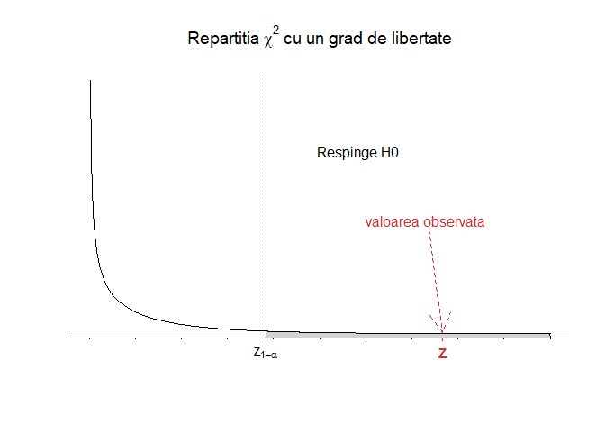
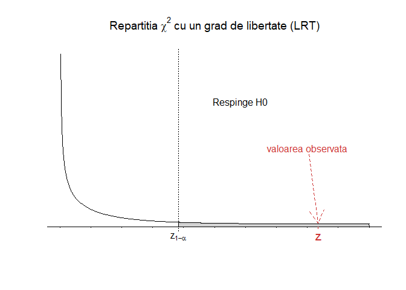
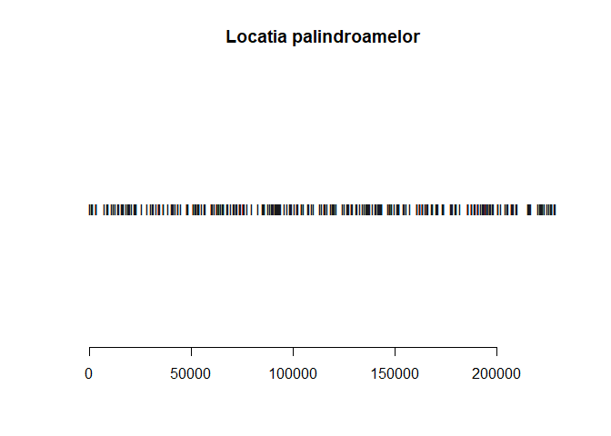
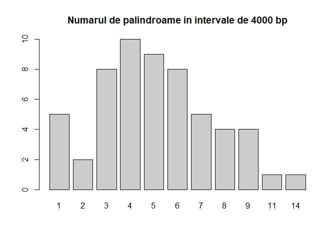
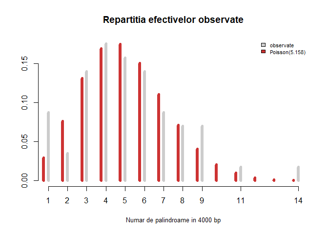
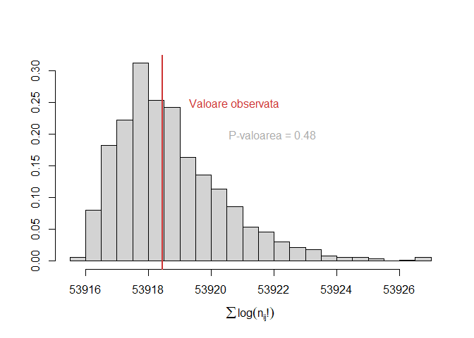

<script>
$(document).ready(function ()  {

    // move toc-ignore selectors from section div to header
    $('div.section.toc-ignore')
        .removeClass('toc-ignore')
        .children('h1,h2,h3,h4,h5').addClass('toc-ignore');

    // establish options
    var options = {
      selectors: "h1,h2,h3",
      theme: "bootstrap3",
      context: '.toc-content',
      hashGenerator: function (text) {
        return text.replace(/[.\\/?&!#<>]/g, '').replace(/\s/g, '_').toLowerCase();
      },
      ignoreSelector: ".toc-ignore",
      scrollTo: 60
    };
    options.showAndHide = false;
    options.smoothScroll = true;

    // tocify
    var toc = $("#TOC").tocify(options).data("toc-tocify");
});
</script>

Obiectivul acestui laborator este de a prezenta câteva teste statistice folosite pentru testarea ipotezelor statistice atunci când datele sunt de tip categoric.


# Compararea proporțiilor și tabele de contingență $2\times 2$

Considerăm următorul exemplu:

\BeginKnitrBlock{rmdexercise}<div class="rmdexercise">Un studiu clinic a investigat efectele metodelor contraceptive orale (OC) asupra bolilor de inimă la femeile cu vârste între 40 și 44 de ani. Cercetătorii au găsit că printre 5000 de femei care utilizau metode contraceptive orale la momentul studiului (cazuri), 13 dintre acestea au dezvoltat un infarct miocardic (MI) (pe o perioadă de 3 ani) pe când printre 10000 de femei care nu au folosit niciodată OC (grupul de control) doar 7 au dezvoltat MI (pe aceeași perioadă). Vrem să vedem dacă există vreo asociere între consumul de anticoncepționale pe cale orală și incidența infarctului miocardic (pe această perioadă).</div>\EndKnitrBlock{rmdexercise}

Fie $\pi_1=\mathbb{P}(MI\,|\,OC)$, probabilitatea ca femeile să dezvolte infarct miocardic (MI) în cazul grupului care a consumat contraceptive orale (OC) și $\pi_2=\mathbb{P}(MI\,|\,non-OC)$, probabilitatea ca femeile să dezvolte infarct miocardic (MI) în cazul grupului care nu a consumat contraceptive orale (OC). Întrebarea este dacă probabilitatea de a face infarct miocardic diferă între cele două grupuri (cazuri vs control). Cu alte cuvinte vrem să testăm ipotezele statistice:

$$
  \begin{array}{ll}
    H_0:\,\,\pi_1=\pi_2\\
    H_1:\,\,\pi_1\neq \pi_2
  \end{array}
$$

## Compararea proporțiilor prin aproximarea normală

Putem modela problema astfel: considerăm $X_1, X_2, \ldots, X_{n_1}\in\{0,1\}$ ($0$ - nu a dezvoltat infarct miocardic, $1$ - a dezvoltat infarct miocardic pe perioada studiului) un eșantion de talie $n_1$ ($n_1 = 5000$) dintr-o populație Bernoulli $\mathcal{B}(\pi_1)$ care să reprezinte populația femeilor cu vârste între 40 și 44 de ani care au consumat contraceptive orale (cazuri) și respectiv un eșantion $Y_1, Y_2, \ldots, Y_{n_2}\in\{0,1\}$ un eșantion de talie $n_2$ ($n_2 = 10000$) dintr-o populație Bernoulli $\mathcal{B}(\pi_2)$ care să reprezinte populația femeilor cu vârste între 40 și 44 de ani care nu au consumat contraceptive orale (control). Vom presupune că eșantioanele sunt suficient de mari pentru a putea aplica aproximarea normală a binomialei (e.g. vezi [aici](https://alexamarioarei.github.io/Teaching/2017-2018/PS%20web%20page/labs/Lab_4.html#3_aproximarea_poisson_%C8%99i_normal%C4%83_a_binomialei)).

Se poate verifica cu ușurință că sub $H_0:\,\pi_1=\pi_2=\pi$ are loc 

$$
  \hat{\pi}_1 - \hat{\pi}_2\sim\mathcal{N}\left(\underbrace{\pi_1-\pi_2}_{=0}, \pi(1-\pi)\left(\frac{1}{n_1} + \frac{1}{n_2}\right)\right)
$$

unde $\hat{\pi}_1 = \bar{X}_{n_1}$ iar $\hat{\pi}_2 = \bar{Y}_{n_2}$. Astfel, sub $H_0$, avem 

$$
  Z = \frac{\hat{\pi}_1 - \hat{\pi}_2}{\sqrt{\pi(1-\pi)\left(\frac{1}{n_1} + \frac{1}{n_2}\right)}} \sim \mathcal{N}(0,1)
$$

și cum $\pi$ este necunoscut putem să-l aproximăm din cele două eșantioane luate împreună (estimatorul *pooled*) 

$$
  \hat{\pi} = \frac{\sum_{i = 1}^{n_1}X_i + \sum_{j = 1}^{n_2}Y_j}{n_1+n_2} = \frac{n_1\hat{\pi}_1 + n_2\hat{\pi}_2}{n_1+n_2}.
$$

Dacă luăm în calcul corecția de continuitate a aproximării normale a binomialei atunci regiunea critică a testului bilateral de nivel $\alpha$ (acest test se numește *testul de scor* și este recomandat atunci când vrem să comparîăm proporții în locul *testului lui Wald*), cu ipotezele statistice $H_0:\,\pi_1=\pi_2\,\,vs\,\,H_1:\,\pi_1\neq \pi_2$, este 

$$
  C = \left\{(x_1,\ldots,x_{n_1},y_1,\ldots,y_{n_2})\,|\,\frac{|\hat{\pi}_1 - \hat{\pi}_2| - \frac{1}{2}\left(\frac{1}{n_1} + \frac{1}{n_2}\right)}{\sqrt{\hat{\pi}(1-\hat{\pi})\left(\frac{1}{n_1} + \frac{1}{n_2}\right)}}>z_{1-\frac{\alpha}{2}}\right\}
$$

iar p-valoarea aproximativă a testului este

$$
  p-val = 2(1-\Phi(z_{\text{obs}})).
$$

De regulă, în practică, putem folosi aproximarea normală a binomialei și testul de comparare a proporțiilor cu regiunea critică $C$ atunci când sunt îndeplinite condițiile $n_1\hat{\pi}(1-\hat{\pi})\geq 5$ și $n_2\hat{\pi}(1-\hat{\pi})\geq 5$.

În R avem 


```r
n1 = 5000 # nr total cazuri OC
n11 = 13 # nr cazuri cu MI

n2 = 10000 # nr total control non-OC
n21 = 7 # nr control cu MI

p1 = n11/n1
p2 = n21/n2

p = (n11+n21)/(n1+n2) # proportia comuna - pooled p
```

și putem verifica cele două condiții de aplicabilitate a aproximării normale


```r
# Verificam daca putem aplica aproximarea normala 
n1*p*(1-p)>5
[1] TRUE
n2*p*(1-p)>5
[1] TRUE
```

Calculul statisticii de test și a p-valorii testului, pentru exemplul nostru, sunt 


```r
# Calculam statistica de test cu corectia de continuitate
z = (abs(p1-p2)-0.5*(1/n1+1/n2))/sqrt(p*(1-p)*(1/n1+1/n2))
z
[1] 2.768839

# Calcul de p-valoare: test bilateral
pval = min(2*(1-pnorm(z)), 1)
pval
[1] 0.005625635
```

Observăm că același răspuns se obține și dacă folosim funcția `prop.test()` din R:


```r
prop.test(c(13, 7), c(5000, 10000))

	2-sample test for equality of proportions with continuity
	correction

data:  c(13, 7) out of c(5000, 10000)
X-squared = 7.6665, df = 1, p-value = 0.005626
alternative hypothesis: two.sided
95 percent confidence interval:
 0.0002463116 0.0035536884
sample estimates:
prop 1 prop 2 
0.0026 0.0007 
```

De asemenea putem construi și intervalul de încredere de nivel $1-\alpha$, corespunzător


```
IC pentru pi1-pi2 la pragul de semnificatie 95% este 
 IC = [ 0.0006612366 , 0.003138763 ]
```

precum și intervalul de încredere clasic pentru diferența proporțiilor, obținut prin aproximarea lui Wald 

$$
  \hat{\pi}_1 - \hat{\pi}_2 \pm z_{1-\frac{\alpha}{2}}\sqrt{\frac{\hat{\pi}_1(1-\hat{\pi}_1)}{n_1} + \frac{\hat{\pi}_2(1-\hat{\pi}_2)}{n_2}}
$$


```
IC pentru pi1-pi2 la pragul de semnificatie 95% este 
 IC = [ 0.0003963116 , 0.003403688 ]
```

În articolul [@Agresti2000], autorii prezintă un alt interval de încredere (ajustat prin adăugarea a două observații la fiecare eșantion, un $1$ și un $0$) pentru diferența proporțiilor 

$$
  \bar{\pi}_1 - \bar{\pi}_2 \pm z_{1-\frac{\alpha}{2}}\sqrt{\frac{\bar{\pi}_1(1-\bar{\pi}_1)}{n_1+2} + \frac{\bar{\pi}_2(1-\bar{\pi}_2)}{n_2+2}}
$$

unde $\bar{\pi}_1 = \frac{\sum_{i = 1}^{n_1}X_i + 1}{n_1+2}$ iar $\bar{\pi}_2 = \frac{\sum_{j = 1}^{n_1}Y_j + 1}{n_2+2}$


```
IC (Agresti-Caffo) pentru pi1-pi2 la pragul de semnificatie 95% este 
 IC = [ 0.0006853283 , 0.003312753 ]
```


Concluzionăm că folosirea de anticoncepționale pe cale orală este semnificativ asociată cu incidența crescută de cazuri de MI la femeile cu vârste între 40 și 44 de ani pe perioada de 3 ani a studiului.

\BeginKnitrBlock{rmdexercise}<div class="rmdexercise">Puteți crea o funcție care să automatizeze procesul ?

</div>\EndKnitrBlock{rmdexercise}

## Metoda tabelelor de contingență și testul $\chi^2$ al lui Pearson

Rescriem problema de mai sus sub formă de tabel de contingență $2\times2$ (un tabel în care datele apar clasificate după valorile a două variabile categorice, cu două clase fiecare) pentru vectorul aleator $(X,Y)\in\{a_1, a_2\}\times\{b_1,b_2\} = \{\text{OC}, \text{non-OC}\}\times\{\text{MI},\text{non-MI}\}$:

$$
  \begin{array}{c|c|c|c}
    X/Y & b_1 & b_2 & \text{Total}\\
    \hline
    a_1 & n_{11} & n_{12} & n_{1\cdot} = n_{11} + n_{12}\\
    \hline
    a_2 & n_{21} & n_{22} & n_{2\cdot} = n_{21} + n_{22}\\
    \hline
    \text{Total} & n_{\cdot 1} = n_{11} + n_{21} & n_{\cdot 2} = n_{12} + n_{22} & n = \sum_{i,j = 1}^{2}n_{ij}\\
  \end{array}
$$
care în cazul problemei noastre este 

<table class="table table-striped table-hover" style="margin-left: auto; margin-right: auto;">
 <thead>
  <tr>
   <th style="text-align:left;">   </th>
   <th style="text-align:center;"> MI </th>
   <th style="text-align:center;"> non-MI </th>
   <th style="text-align:center;"> Total </th>
  </tr>
 </thead>
<tbody>
  <tr>
   <td style="text-align:left;"> OC </td>
   <td style="text-align:center;"> 13 </td>
   <td style="text-align:center;"> 4987 </td>
   <td style="text-align:center;"> 5000 </td>
  </tr>
  <tr>
   <td style="text-align:left;"> non-OC </td>
   <td style="text-align:center;"> 7 </td>
   <td style="text-align:center;"> 9993 </td>
   <td style="text-align:center;"> 10000 </td>
  </tr>
  <tr>
   <td style="text-align:left;"> Total </td>
   <td style="text-align:center;"> 20 </td>
   <td style="text-align:center;"> 14980 </td>
   <td style="text-align:center;"> 15000 </td>
  </tr>
</tbody>
</table>

Acesta se mai numește și tabelul observat 

$$
  \text{Tabel}_{obs} = \begin{array}{c|c}
      O_{11} & O_{12}\\
      \hline
      O_{21} & O_{22}
  \end{array} = \begin{array}{c|c}
      n_{11} & n_{12}\\
      \hline
      n_{21} & n_{22}
  \end{array}
$$
Repartiția vectorului $(X,Y)$ este dată de $\mathbb{P}\circ (X,Y)^{-1} = \sum_{i = 1}^{2}\sum_{j = 1}^{2}p_{ij}\delta_{(a_i,b_j)}$, unde $\mathbb{P}((X,Y) = (a_i, b_j)) = p_{ij}$

$$
  \begin{array}{c|c|c|c}
    X/Y & b_1 & b_2 & \sum\\
    \hline
    a_1 & p_{11} & p_{12} & p_1 = p_{11} + p_{12}\\
    \hline
    a_2 & p_{21} & p_{22} & p_2 = p_{21} + p_{22}\\
    \hline
    \sum & q_1 = p_{11} + p_{21} & q_2 = p_{12} + p_{22} & 1\\
  \end{array}
$$

iar repartițiile marginale sunt $\mathbb{P}\circ X^{-1} = \sum_{i = 1}^{2}p_{i}\delta_{a_i}$, $\mathbb{P}\circ Y^{-1} = \sum_{j = 1}^{2}q_{j}\delta_{b_j}$ cu $\mathbb{P}(X = a_i) = p_i$ și respectiv $\mathbb{P}(Y = b_j) = q_j$.

Suntem interesați în testarea ipotezelor 

$$
H_0:\, \pi_1 = \pi_2\,\, vs \,\, H_1:\,\pi_1 \neq \pi_2
$$

unde $\pi_1=\mathbb{P}(MI\,|\,OC) = \mathbb{P}(Y = b_1\,|\,X = a_1)$ iar $\pi_2=\mathbb{P}(MI\,|\,non-OC) = \mathbb{P}(Y = b_1\,|\,X = a_2)$. Observăm că 

$$
  \pi_1 = \pi_2 \iff \frac{p_{11}}{p_1} = \frac{p_{21}}{p_2} \iff \frac{p_{11}}{p_1} = \frac{q_1 - p_{11}}{p_2} \iff p_{11} = p_1q_1
$$
și, în mod similar, se poate verifica că $p_{ij} = p_iq_j$, $\forall i,j\in\{1,2\}$. Cu alte cuvinte, ipoteza nulă se mai scrie și sub forma

$$
  H_0:\, \{\pi_1 = \pi_2\} = \left\{p_{ij} = p_iq_j,\,\forall i,j\in\{1,2\}\right\}
$$
Fie $(X_1, Y_1), (X_2, Y_2),\ldots,(X_n, Y_n)$ un eșantion de talie $n$ din populația $\mathbb{P}\circ (X,Y)^{-1}$ și avem că $n_{ij} = \sum_{k = 1}^n\mathbf{1}_{(a_i, b_j)}(X_k, Y_k)$ (numărul de observații din celula $(i,j)$) iar $n_{i\cdot} = \sum_{j = 1}^{2}n_{ij}$, $n_{\cdot j} = \sum_{i = 1}^{2}n_{ij}$ și respectiv $n = \sum_{i,j = 1}^{2}n_{ij}$.

Sub ipoteza nulă, $H_0$, avem că estimatorii de verosimilitate maximă pentru $p_i$ și $q_j$ sunt 

$$
  \hat{p}_i = \frac{n_{i\cdot}}{n},\,\, \hat{q}_j = \frac{n_{\cdot j}}{n}
$$

iar numărul de observații pe care ne așteptăm să-l observăm (sub $H_0$) în fiecare celulă este 

$$
  E_{ij} = n \hat{p}_{ij} \overset{H_0}{=} n \hat{p}_i \hat{q}_j = \frac{n_{i\cdot}n_{\cdot j}}{n}.
$$
Astfel tabelul pe care ne așteptăm să-l observăm sub ipoteza nulă este 

$$
  \text{Tabel}_{exp} = \begin{array}{c|c}
      E_{11} & E_{12}\\
      \hline
      E_{21} & E_{22}
  \end{array} = \begin{array}{c|c}
      \frac{n_{1\cdot}n_{\cdot 1}}{n} & \frac{n_{1\cdot}n_{\cdot 2}}{n}\\
      \hline
      \frac{n_{2\cdot}n_{\cdot 1}}{n} & \frac{n_{2\cdot}n_{\cdot 2}}{n}
  \end{array}
$$

Calculul tabelului pe care ne așteptăm să-l observăm:


```r
# Observat
n11 = 13
n1o = 5000
n12 = n1o-n11

n21 = 7
n2o = 10000
n22 = n2o-n21

no1 = n11+n21
no2 = n12+n22

n = n1o+n2o

#Asteptat
e11 = n1o*no1/n
e12 = n1o*no2/n
e21 = n2o*no1/n
e22 = n2o*no2/n

Mobs = matrix(c(n11,n12,n21,n22),ncol = 2, byrow = T, 
              dimnames = list(c("OC","non-OC"), c("MI", "non-MI")))

Mexp = matrix(c(e11,e12,e21,e22),ncol = 2, byrow = T, 
              dimnames = list(c("OC","non-OC"), c("MI", "non-MI")))
```

<table class="table table-striped table-hover" style="margin-left: auto; margin-right: auto;">
 <thead>
  <tr>
   <th style="text-align:left;">   </th>
   <th style="text-align:center;"> MI </th>
   <th style="text-align:center;"> non-MI </th>
  </tr>
 </thead>
<tbody>
  <tr>
   <td style="text-align:left;"> OC </td>
   <td style="text-align:center;"> 6.666667 </td>
   <td style="text-align:center;"> 4993.333 </td>
  </tr>
  <tr>
   <td style="text-align:left;"> non-OC </td>
   <td style="text-align:center;"> 13.333333 </td>
   <td style="text-align:center;"> 9986.667 </td>
  </tr>
</tbody>
</table>

Statistica de test a lui Pearson este:

$$
  X^2 = \sum_{i=1}^{2}\sum_{j=1}^{2}\frac{\left(O_{ij}-E_{ij}\right)^2}{E_{ij}}\underset{H_0}{\sim}\chi_1^2
$$

iar în cazul problemei noastre devine


```r
X2 = (n11-e11)^2/e11 + (n12-e12)^2/e12 + 
  (n21-e21)^2/e21 + (n22-e22)^2/e22
X2
[1] 9.037049

pval = 1-pchisq(X2,1) #df = 1
pval
[1] 0.002645623
```

sau folosind funcția `chisq.test()` din R:


```r
chisq.test(Mobs, correct = FALSE)

	Pearson's Chi-squared test

data:  Mobs
X-squared = 9.037, df = 1, p-value = 0.002646
```

În cazul tabelelor $2\times 2$, Yates a propus în [@Yates1934] o modificare a calculului statisticii de test a lui Pearson (motivul este că testul $\chi^2$ este bazat pe aproximarea normală a binomialei, prin urmare aproximăm repartiția discretă a lui $X^2$ cu cea continuă $\chi^2$), cunoscută sub denumirea *corecția lui Yates*:

$$
  X^2 = \sum_{i=1}^{2}\sum_{j=1}^{2}\frac{\left(|O_{ij}-E_{ij}|-0.5\right)^2}{E_{ij}}\underset{H_0}{\sim}\chi_1^2
$$


```r
X2 = (abs(n11-e11)-0.5)^2/e11 + (abs(n12-e12)-0.5)^2/e12 + 
  (abs(n21-e21)-0.5)^2/e21 + (abs(n22-e22)-0.5)^2/e22
X2
[1] 7.666472

pval = 1-pchisq(X2,1) #df = 1
pval
[1] 0.005625635
```

Sau folosind testul lui Pearson cu corecția lui Yates `chisq.test` avem:


```r
chisq.test(Mobs)

	Pearson's Chi-squared test with Yates' continuity correction

data:  Mobs
X-squared = 7.6665, df = 1, p-value = 0.005626
```



Același rezultat se obține și dacă folosim testul `prop.test`, acesta fiind un caz particular al testului hi-pătrat: 


```r
prop.test(Mobs)

	2-sample test for equality of proportions with continuity
	correction

data:  Mobs
X-squared = 7.6665, df = 1, p-value = 0.005626
alternative hypothesis: two.sided
95 percent confidence interval:
 0.0002463116 0.0035536884
sample estimates:
prop 1 prop 2 
0.0026 0.0007 
```

## Metoda testului bazat pe raportul de verosimilități

În contextul exemplului de mai sus vrem să vedem testul bazat pe raportul de verosimilitate. Considerând modelul multinomial $(n_{11},n_{12},n_{21},n_{22})\sim \mathcal{M}(n;p_{11},p_{12},p_{21},p_{22})$, obținem raportul de verosimilitate

$$
  \Lambda(x)=\frac{\sup_{\theta\in\Theta_0}L(\theta|x)}{\sup_{\theta\in\Theta}L(\theta|x)}=\prod_{i=1}^{2}\prod_{j=1}^{2}\left(\frac{n_{i\cdot}\times n_{\cdot j}}{n\times n_{ij}}\right)^{n_{ij}}
$$

și din teorema lui Wilks (cazul multidimensional) avem $-2\log\Lambda\to\chi^2(d-d_0)$ unde $d=\dim(\Theta)$ și $d_0=\dim(\Theta_0)$. În cazul nostru

$$
  \begin{array}{ll}
    \Theta = \left\{(p_{11},p_{12},p_{21},p_{22})\,|\,p_{ij}\in(0,1),\,\sum_{i=1}^{2}\sum_{j=1}^{2}p_{ij}=1\right\}\\
    \Theta_0 = \left\{(p_{1}q_1,p_{1}q_2,p_{2}q_1,p_{2}q_2)\,|\,p_{i},q_j\in(0,1),\,\sum_{i=1}^{2}p_{i}=1,\,\sum_{j=1}^{2}q_j=1\right\}
  \end{array}
$$

unde $p_i$ și $q_j$ sunt repartițiile marginale. Obținem că $\dim(\Theta)=4-1$ iar $\dim(\Theta_0)=4-2$, deci $-2\log\Lambda\to\chi^2(1)$.


```r
# Observat
n11 = 13
n1o = 5000
n12 = n1o-n11

n21 = 7
n2o = 10000
n22 = n2o-n21

no1 = n11+n21
no2 = n12+n22

LRT = n11*log((n1o*no1)/(n*n11)) + n12*log((n1o*no2)/(n*n12)) + 
  n21*log((n2o*no1)/(n*n21)) + n22*log((n2o*no2)/(n*n22))
LRT = -2*LRT
LRT
[1] 8.354617

pval = 1-pchisq(LRT,1) #df = 1
pval
[1] 0.003847085
```



Să creăm o funcție care automatizează procesul:


```r
LRT1 = function(dat){
  # dat este sub forma de matrice 
  rs = rowSums(dat) # apply(dat, 1, sum)
  cs = colSums(dat) # apply(dat, 2, sum)
  
  n = sum(dat)
  
  expected <- outer(rs,cs,"*")/n
  
  lrt <- -2*sum(dat * log(expected/dat)) 
  
  dm = dim(dat) # dimensiunea tabloului pentru a calcula gradele de libertate
  pval = 1-pchisq(lrt,(dm[1]-1)*(dm[2]-1))
  
  cat("Statistica LRT este ", lrt, "\n")
  cat("P-valoarea testului bazat pe raportul de verosimilitate este ", pval)
  
  return(list(statistic = lrt, pvalue = pval))
}

Mobs = matrix(c(n11,n12,n21,n22),ncol = 2, byrow = T, 
              dimnames = list(c("OC","non-OC"), c("MI", "non-MI")))

LRT1(Mobs) 
Statistica LRT este  8.354617 
P-valoarea testului bazat pe raportul de verosimilitate este  0.003847085
$statistic
[1] 8.354617

$pvalue
[1] 0.003847085
```

# Testul exact al lui Fisher 

\BeginKnitrBlock{rmdexercise}<div class="rmdexercise">Să presupunem că vrem să investigăm legătura dintre regimul bogat în sare și decesul datorat unei boli cardiovasculare (CVD). Să presupunem că suntem în contextul unui studiu retrospectiv efectuat pe un grup de bărbați cu vârste cuprinse între 50 și 54 de ani dintr-o anumită regiune geografică care au decedat pe parcursul unui luni. S-a încercat introducerea în studiu a unui grup cât mai omogen (s-a încercat includerea în studiu a unui număr egal de persoane care au decedat din cauză de CVD și care au decedat din alte cauze). 

</div>\EndKnitrBlock{rmdexercise}

S-a obținut următorul tabel:

<table class="table table-striped table-hover" style="margin-left: auto; margin-right: auto;">
 <thead>
  <tr>
   <th style="text-align:left;">   </th>
   <th style="text-align:center;"> Ridicat Sare </th>
   <th style="text-align:center;"> Scazut Sare </th>
   <th style="text-align:center;"> Total </th>
  </tr>
 </thead>
<tbody>
  <tr>
   <td style="text-align:left;"> non-CVD </td>
   <td style="text-align:center;"> 2 </td>
   <td style="text-align:center;"> 23 </td>
   <td style="text-align:center;"> 25 </td>
  </tr>
  <tr>
   <td style="text-align:left;"> CVD </td>
   <td style="text-align:center;"> 5 </td>
   <td style="text-align:center;"> 30 </td>
   <td style="text-align:center;"> 35 </td>
  </tr>
  <tr>
   <td style="text-align:left;"> Total </td>
   <td style="text-align:center;"> 7 </td>
   <td style="text-align:center;"> 53 </td>
   <td style="text-align:center;"> 60 </td>
  </tr>
</tbody>
</table>

Tabelul pe care ne așteptam să-l obținem ($H_0$) este:


```r
# Observat
n11 = 2
n1o = 25
n12 = n1o-n11

n21 = 5
n2o = 35
n22 = n2o-n21

no1 = n11+n21
no2 = n12+n22

n = n1o+n2o

#Asteptat
e11 = n1o*no1/n
e12 = n1o*no2/n
e21 = n2o*no1/n
e22 = n2o*no2/n

MobsF = matrix(c(n11,n12,n21,n22),ncol = 2, byrow = T, 
               dimnames = list(c("non-CVD", "CVD"), 
                               c("Ridicat Sare", "Scazut Sare")))

MexpF = matrix(c(e11,e12,e21,e22),ncol = 2, byrow = T, 
               dimnames = list(c("non-CVD", "CVD"), 
                               c("Ridicat Sare", "Scazut Sare")))
```

<table class="table table-striped table-hover" style="margin-left: auto; margin-right: auto;">
 <thead>
  <tr>
   <th style="text-align:left;">   </th>
   <th style="text-align:center;"> Ridicat Sare </th>
   <th style="text-align:center;"> Scazut Sare </th>
  </tr>
 </thead>
<tbody>
  <tr>
   <td style="text-align:left;"> non-CVD </td>
   <td style="text-align:center;"> 2.916667 </td>
   <td style="text-align:center;"> 22.08333 </td>
  </tr>
  <tr>
   <td style="text-align:left;"> CVD </td>
   <td style="text-align:center;"> 4.083333 </td>
   <td style="text-align:center;"> 30.91667 </td>
  </tr>
</tbody>
</table>

Observăm că avem două celule în tabelul așteptat care conțin mai puțin de 5 observații prin urmare nu putem folosi metodele de mai sus (aproximarea normală, testul lui Pearson sau testul bazat pe raportul de verosimilitate). Dacă am încerca am obține:


```r
# Testul lui Pearson (Hi patrat)

chisq.test(MobsF)

	Pearson's Chi-squared test with Yates' continuity correction

data:  MobsF
X-squared = 0.11552, df = 1, p-value = 0.7339

# Testul bazat pe raportul de verosimilitate

LRT1(MobsF)
Statistica LRT este  0.5810517 
P-valoarea testului bazat pe raportul de verosimilitate este  0.4459004
$statistic
[1] 0.5810517

$pvalue
[1] 0.4459004
```

Enumerăm tabelele și probabilitățile lor de apariție:


```r
# Fixez marginalele

n1o = 25
n2o = 35
  
no1 = 7
no2 = 53

for (i in 0:7){
  cat("-------------------------------------\n")
  cat("Tabelul ", i+1, " :\n")
  
  # calculez valorile din tabel
  n11 = i
  n12 = n1o - n11
  n21 = no1 - n11
  n22 = no2 - n12
  
  MobsF1 = matrix(c(n11,n12,n21,n22),ncol = 2, byrow = T, 
                  dimnames = list(c("non-CVD", "CVD"), 
                                  c("Ridicat Sare", "Scazut Sare")))
  
  print(MobsF1)
  
  cat("Probabilitatea de a obtine tabelul ", i+1, " este ", 
      dhyper(i, no1, no2, n1o), "\n")
  cat("-------------------------------------\n")
}
-------------------------------------
Tabelul  1  :
        Ridicat Sare Scazut Sare
non-CVD            0          25
CVD                7          28
Probabilitatea de a obtine tabelul  1  este  0.0174117 
-------------------------------------
-------------------------------------
Tabelul  2  :
        Ridicat Sare Scazut Sare
non-CVD            1          24
CVD                6          29
Probabilitatea de a obtine tabelul  2  este  0.1050706 
-------------------------------------
-------------------------------------
Tabelul  3  :
        Ridicat Sare Scazut Sare
non-CVD            2          23
CVD                5          30
Probabilitatea de a obtine tabelul  3  este  0.2521695 
-------------------------------------
-------------------------------------
Tabelul  4  :
        Ridicat Sare Scazut Sare
non-CVD            3          22
CVD                4          31
Probabilitatea de a obtine tabelul  4  este  0.3118225 
-------------------------------------
-------------------------------------
Tabelul  5  :
        Ridicat Sare Scazut Sare
non-CVD            4          21
CVD                3          32
Probabilitatea de a obtine tabelul  5  este  0.214378 
-------------------------------------
-------------------------------------
Tabelul  6  :
        Ridicat Sare Scazut Sare
non-CVD            5          20
CVD                2          33
Probabilitatea de a obtine tabelul  6  este  0.0818534 
-------------------------------------
-------------------------------------
Tabelul  7  :
        Ridicat Sare Scazut Sare
non-CVD            6          19
CVD                1          34
Probabilitatea de a obtine tabelul  7  este  0.01604969 
-------------------------------------
-------------------------------------
Tabelul  8  :
        Ridicat Sare Scazut Sare
non-CVD            7          18
CVD                0          35
Probabilitatea de a obtine tabelul  8  este  0.00124467 
-------------------------------------
```

Aplicăm testul exact al lui Fisher `fisher.test`:


```r
fisher.test(MobsF)

	Fisher's Exact Test for Count Data

data:  MobsF
p-value = 0.6882
alternative hypothesis: true odds ratio is not equal to 1
95 percent confidence interval:
 0.04625243 3.58478157
sample estimates:
odds ratio 
  0.527113 
```

P-valoarea în `R` este calculată după formula:

$$
  p_{value} = \sum_{\{i:\mathbb{P}(i)\leq \mathbb{P}(obs)\}}\mathbb{P}(i)
$$
care în cazul nostru devine 


```r
n1o = 25
n2o = 35
  
no1 = 7
no2 = 53

n11 = 2
  
ps = dhyper(0:no1, no1, no2, n1o)
pobs = dhyper(n11, no1, no2, n1o)

pval = sum(ps[ps<=pobs])
pval
[1] 0.6881775
```

# Date pereche - Testul lui McNemar


\BeginKnitrBlock{rmdexercise}<div class="rmdexercise">Ne propunem să comparăm două regimuri de chimioterapie pentru pacienții cu cancer la sân care au efectuat operația de mastectomie. Cele două grupuri de tratament investigate ar trebui să fie cât mai comparabile din punct de vedere al celorlalți factori. Presupunem că un studiu de potrivire (matched study) a fost pregătit așa încât din fiecare pereche (potrivită din punct de vedere al vârstei și a condițiilor clinice) s-a selectat aleator un membru căruia i-a fost administrat tratamentul A iar celuilalt membru tratamentul B. Pacienții au fost urmăriți pe o perioadă de 5 ani, iar variabila de interes a fost supraviețuirea în această perioadă. 

</div>\EndKnitrBlock{rmdexercise}

S-au obținut următoarele date: 

<table class="table table-striped table-hover" style="margin-left: auto; margin-right: auto;">
 <thead>
  <tr>
   <th style="text-align:left;">   </th>
   <th style="text-align:center;"> Supravietuit </th>
   <th style="text-align:center;"> Decedat </th>
   <th style="text-align:center;"> Total </th>
  </tr>
 </thead>
<tbody>
  <tr>
   <td style="text-align:left;"> A </td>
   <td style="text-align:center;"> 526 </td>
   <td style="text-align:center;"> 95 </td>
   <td style="text-align:center;"> 621 </td>
  </tr>
  <tr>
   <td style="text-align:left;"> B </td>
   <td style="text-align:center;"> 515 </td>
   <td style="text-align:center;"> 106 </td>
   <td style="text-align:center;"> 621 </td>
  </tr>
  <tr>
   <td style="text-align:left;"> Total </td>
   <td style="text-align:center;"> 1041 </td>
   <td style="text-align:center;"> 201 </td>
   <td style="text-align:center;"> 1242 </td>
  </tr>
</tbody>
</table>

Observăm că nu putem folosi testul lui Pearson (cu corecția lui Yates) deoarece datele nu sunt *independente*. Dacă am folosi am obține:


```r
M1csq = matrix(c(526,95,515,106),ncol = 2, byrow = T)
chisq.test(M1csq)

	Pearson's Chi-squared test with Yates' continuity correction

data:  M1csq
X-squared = 0.59357, df = 1, p-value = 0.441
```

Construim următorul tabel, în care unitatea de analiză nu mai este *pacientul* ci *perechea* iar perechile sunt clasificate după cum membrii acelei perechi au supraviețuit sau nu o perioadă post-operatorie de 5 ani (liniile tabelului sunt rezultatele pacientului care a urmat tratamentul A iar coloanele sunt rezultatele pacientului care a urmat tratamentul B):

<table class="table table-striped table-hover" style="margin-left: auto; margin-right: auto;">
 <thead>
  <tr>
   <th style="text-align:left;">   </th>
   <th style="text-align:center;"> Supravietuit </th>
   <th style="text-align:center;"> Decedat </th>
   <th style="text-align:center;"> Total </th>
  </tr>
 </thead>
<tbody>
  <tr>
   <td style="text-align:left;"> Supravietuit </td>
   <td style="text-align:center;"> 510 </td>
   <td style="text-align:center;"> 16 </td>
   <td style="text-align:center;"> 526 </td>
  </tr>
  <tr>
   <td style="text-align:left;"> Decedat </td>
   <td style="text-align:center;"> 5 </td>
   <td style="text-align:center;"> 90 </td>
   <td style="text-align:center;"> 95 </td>
  </tr>
  <tr>
   <td style="text-align:left;"> Total </td>
   <td style="text-align:center;"> 515 </td>
   <td style="text-align:center;"> 106 </td>
   <td style="text-align:center;"> 621 </td>
  </tr>
</tbody>
</table>

Observăm că 600 (510+90) de perechi au avut același rezultat (perechi concordante) și doar 21 de perechi au avut rezultate diferite (perechi neconcordante).

Aplicăm testul lui McNemar `mcnemar.test` :


```r
M1 = matrix(c(510,16,5,90),ncol = 2, byrow = T, 
           dimnames = list(c("Supravietuit", "Decedat"), 
                           c("Supravietuit", "Decedat")))
mcnemar.test(M1)

	McNemar's Chi-squared test with continuity correction

data:  M1
McNemar's chi-squared = 4.7619, df = 1, p-value = 0.0291
```

# Testul $\chi^2$ de concordanță

Vom începe prin construirea unui test statistic pentru testarea parametrilor unei repartiții multinomiale și apoi vom aplica rezultatele pentru testarea unei ipoteze de concordanță (*goodness-of-fit*)^[A se vedea și testul Kolmogorov-Smirnov din [Laboratorul 4](https://alexamarioarei.github.io/Teaching/2017-2018/Biostat%20web%20page/labs/Lab_4.pdf)].

## Test pentru parametrii unei repartiții multinomiale

Presupunem că $Y$ este o variabilă aleatoare care ia valori în mulțimea $\{y_1,y_2,\ldots,y_c\}$ iar repartiția ei este dată de 

$$
\mathbb{P}\circ Y^{-1} = \sum_{j = 1}^{c}p_j\delta_{y_j},
$$

unde $\mathbb{P}(Y = y_j) = p_{j},\, j\in\{1,2,\ldots,c\}$. 

Fie $Y_1, Y_2,\ldots, Y_n$ un eșantion de talie $n$ din populația $\mathbb{P}\circ Y^{-1}$ și 

$$
  N_i = \sum_{k = 1}^{n}\mathbf{1}_{y_i}(Y_k)
$$

numărul de observații care categoria $y_i$. Observăm că variabilele aleatoare $N_1, N_2, \ldots, N_c$ verifică 

$$
  N_1 + N_2 +\cdots+ N_c = n.
$$

Putem modela o observație $Y_k$ dintr-o variabilă discretă cu $c$ categorii cu ajutorul unui vector elemente de $\{0,1\}$, $(X_1^{(k)}, X_2^{(k)}, \ldots, X_c^{(k)})$, pentru care componenta $j$ ia valoarea $1$ dacă $Y_k = y_j$ și $0$ altfel. Funcția de masă a $c$-uplului este 

$$
\mathbb{P}((X_1^{(k)}, X_2^{(k)}, \ldots, X_c^{(k)}) = (x_1,x_2,\ldots,x_c)) = p_1^{x_1}p_2^{x_2}\cdots p_c^{x_c}
$$
unde $x_j\in\{0,1\}$ cu $\sum_{j = 1}^{c}x_j = 1$. Pentru un eșantion de talie $n$, $\{(X_1^{(k)}, X_2^{(k)}, \ldots, X_c^{(k)}),\, k = 1,2,\ldots, n\}$ avem 

$$
\mathbb{P}\left((X_1^{(k)}, X_2^{(k)}, \ldots, X_c^{(k)}) = (x_1^{(k)},x_2^{(k)},\ldots,x_c^{(k)}), \,k = 1,2,\ldots,n\right) = \prod_{k=1}^{n}p_1^{x_1^{(k)}}p_2^{x_2^{(k)}}\cdots p_c^{x_c^{(k)}} = p_1^{n_1}p_2^{n_2}\cdots p_c^{n_c}
$$

unde $n_j$ reprezintă numărul de observații din categoria $y_j$ iar $\sum_{j = 1}^{c}n_j = n$.

În următorul exercițiu ne propunem să aplicăm testul bazat pe raportul de verosimilități pentru efectuarea unui test asupra parametrilor unei repartiții multinomiale. 

\BeginKnitrBlock{rmdexercise}<div class="rmdexercise">Spunem că vectorul $(N_1, N_2,\ldots, N_c)$ este repartizat multinomial $\mathcal{M}(n;p_1,p_2,\ldots,p_c)$ dacă 

$$
  \mathbb{P}(N_1 = n_1, N_2 = n_2, \ldots, N_c = n_c) = \frac{n!}{n_1!n_2!\cdots n_c!}p_1^{n_1}p_2^{n_2}\cdots p_c^{n_c}
$$
  
unde $n_1 + n_2 +\cdots+n_c = n$. 

Determinați repartiția marginală a lui $N_i$.

</div>\EndKnitrBlock{rmdexercise}

Observăm că 

\scriptsize
\begin{align*}
  \mathbb{P}(N_i = n_i) &= \sum_{n_1}\cdots\sum_{n_{i-1}}\sum_{n_{i+1}}\cdots\sum_{n_{c}}\mathbb{P}(N_1 = n_1, \ldots, N_{i-1} = n_{i-1}, N_i = n_i, N_{i+1} = n_{i+1}, \ldots, N_c = n_c),  \; n_1 + \cdots + n_c = n - n_i\\
    &= \sum_{n_1}\cdots\sum_{n_{i-1}}\sum_{n_{i+1}}\cdots\sum_{n_{c}}\frac{n!}{n_1!\cdots n_c!}p_1^{n_1}\cdots p_{c}^{n_c},  \; n_1 + \cdots + n_c = n - n_i\\
    &= \frac{n!p_i^{n_i}}{n_i!(n-n_i)!}\sum_{n_1}\cdots\sum_{n_{i-1}}\sum_{n_{i+1}}\cdots\sum_{n_{c}}\frac{(n-n_i)!}{n_1!\cdots n_{i-1}!n_{i+1}!\cdots n_c!}p_1^{n_1}\cdots p_{i-1}^{n_{i-1}}p_{i+1}^{n_{i+1}}\cdots p_{c}^{n_c},  \; n_1 + \cdots + n_c = n - n_i\\
    &= \binom{n}{n_i}p_i^{n_i}(1-p_i)^{n-n_i}\underbrace{\sum_{n_1}\cdots\sum_{n_{i-1}}\sum_{n_{i+1}}\cdots\sum_{n_{c}}\binom{n-n_i}{n_1,\ldots,n_c}\left(\frac{p_1}{1-p_i}\right)^{n_1}\cdots \left(\frac{p_{i-1}}{1-p_i}\right)^{n_{i-1}}\left(\frac{p_{i+1}}{1-p_i}\right)^{n_{i+1}}\cdots \left(\frac{p_c}{1-p_i}\right)^{n_c}}_{=1}\\
    &= \binom{n}{n_i}p_i^{n_i}(1-p_i)^{n-n_i}
\end{align*}
\normalsize

prin urmare $N\sim\mathcal{B}(n, p_i)$.

\BeginKnitrBlock{rmdexercise}<div class="rmdexercise">Considerăm ipotezele 

\begin{align*}
  H_0: & \{(p_1,p_2,\ldots, p_c) = (\pi_1,\pi_2,\ldots, \pi_c)\}\\
  H_1: & \{\exists i \text{ astfel incat } p_i\neq \pi_i\}
\end{align*}
  
unde $(\pi_1,\pi_2,\ldots, \pi_c)$ sunt probabilități specificate în avans. Construiți testul bazat pe raportul de verosimilități corespunzător. 

</div>\EndKnitrBlock{rmdexercise}

Testul bazat pe raportul de verosimilitate este

$$
  \Lambda(\mathbf{x})=\frac{\sup_{\theta\in\Theta_0}L(\theta|\mathbf{x})}{\sup_{\theta\in\Theta}L(\theta|\mathbf{x})},
$$

unde $\Theta$ este spațiul parametrilor modelului, $\Theta_0$ este spațiul parametrilor corespunzător ipotezei nule iar $L(\theta|\mathbf{x})$ este funcția de verosimilitate.

Observăm că spațiul parametrilor corespunzător modelului este 

$$
\Theta = \left\{p_1, p_2, \ldots, p_c\,|\,p_{j}\in(0,1),\,\sum_{j = 1}^{c}p_{j} = 1\right\},
$$

cu $\dim{\Theta} = c-1$, cel corespunzător ipotezei nule este 

$$
\Theta_0 = \left\{(p_1,p_2,\ldots, p_c) = (\pi_1,\pi_2,\ldots, \pi_c)\right\}
$$

cu $\dim{\Theta_0} = 0$ iar funcția de verosimilitate este 

$$
  L(p_{j},\,j = 1,\ldots,c\,;\,\mathbf{x}) = \mathbb{P}(N_{j} = n_{j}, \,j = 1,\ldots,c) = \frac{n!}{\prod_{j = 1}^{c} n_{j}!}\prod_{j = 1}^{c} p_{j}^{n_{j}}.
$$

Observăm că 

$$
  \sup_{\theta\in\Theta_0}L(\theta|\mathbf{x}) = \mathbb{P}_{H_0}(N_1 = n_1, N_2 = n_2, \ldots, N_c = n_c) = \frac{n!}{\prod_{j = 1}^{c} n_{j}!}\prod_{j = 1}^{c} \pi_{j}^{n_{j}}.
$$ 


Pentru a determina estimatorul de verosimilitate maximă pe $\Theta$ trebuie să rezolvăm problema de optimizare:

$$
  \left\{\begin{array}{ll}
    \max_{\theta\in\Theta} \log L(\theta|\mathbf{x}) = \max \log{\left(\frac{n!}{\prod_{j = 1}^{c} n_{j}!}\prod_{j = 1}^{c} p_{j}^{n_{j}}\right)}\\
    \sum_{j = 1}^{c}p_{j} = 1
  \end{array}\right.
$$

Cum logaritmul funcției de verosimilitate este 

$$
\log{\left(\frac{n!}{\prod_{j = 1}^{c} n_{j}!}\prod_{j = 1}^{c} p_{j}^{n_{j}}\right)} = \log\left(\frac{n!}{\prod_{j = 1}^{c} n_{j}!}\right) + \sum_{j = 1}^{c}n_{j}\log{p_j}
$$

iar $p_c = 1 - p_1 -\cdots p_{c-1}$, rezolvând ecuația de verosimilitate $\frac{\partial\log{L}}{\partial p_j} = 0$ deducem 

$$
\left\{\begin{array}{llll}
  \frac{n_1}{p_1} - \frac{n_c}{1 - p_1 - p_2 -\cdots -p_{c-1}} = 0\\
  \frac{n_2}{p_2} - \frac{n_c}{1 - p_1 - p_2 -\cdots -p_{c-1}} = 0\\
  \cdots\cdots\cdots\cdots\cdots\cdots\cdots\cdots\\
  \frac{n_{c-1}}{p_{c-1}} - \frac{n_c}{1 - p_1 - p_2 -\cdots -p_{c-1}} = 0\\
\end{array}\right.
$$

de unde 

$$
  \frac{n_1}{p_1} = \frac{n_2}{p_2} = \cdots = \frac{n_c}{p_c} = \frac{\sum_{j = 1}^{c}n_j}{\sum_{j = 1}^{c}p_j} = n,
$$

deci $\hat{p}_{j} = \frac{n_j}{n}$.


Raportul de verosimilitate devine 

$$
\Lambda(\mathbf{x})=\frac{\sup_{\theta\in\Theta_0}L(\theta|\mathbf{x})}{\sup_{\theta\in\Theta}L(\theta|\mathbf{x})} = \frac{\prod_{j = 1}^{c} \pi_{j}^{n_{j}}}{\prod_{j = 1}^{c} \left(\frac{n_{j}}{n}\right)^{n_{j}}} = \prod_{j = 1}^{c}\left(\frac{n\pi_{j}}{n_j}\right)^{n_{j}}
$$

și aplicând [Teorema lui Wilks](https://en.wikipedia.org/wiki/Likelihood-ratio_test) găsim

$$
  -2\log \Lambda(\mathbf{x}) = 2\sum_{j = 1}^{c} n_{j}\log\left(\frac{n_{j}}{n\times \pi_{j}}\right) \underset{n\to\infty}{\overset{d}{\longrightarrow}}\chi^2(\underbrace{\dim{\Theta} - \dim{\Theta_0}}_{(c-1)-0}) = \chi^2(c-1).
$$


Prin urmare, regiunea critică a testului asimptotic de nivel $\alpha$ bazat pe raportul de verosimilitate este 

$$
  C = \left\{\mathbf{x} \,|\, -2\log \Lambda(\mathbf{x}) > \chi^2_{1-\alpha}(c-1)\right\}.
$$

O metodă alternativă este bazată pe statistica $\chi^2$ a lui Pearson, [@Pearson1900], care este dată de 

$$
  X^2 = \sum_{j = 1}^{c}\frac{(O_{j} - E_{j})^2}{E_{j}}
$$

unde $O_{j} = n_{j}$ sunt efectivele observate iar $E_{j}$ sunt efectivele pe care ne așteptăm să le observăm dacă ipoteza nulă ar fi adevărată (sub $H_0$, repartiția condiționată a lui $N_{j}$ la $\sum_{j = 1}^{c}N_{j} = n$ este $\mathcal{B}(n,p_{j})$),

$$
  E_{j} = \mathbb{E}_{H_0}[N_{j}] = n \pi_j
$$

ceea ce implică 

$$
  X^2 = \sum_{j = 1}^{c}\frac{\left(N_{j} - n \pi_j\right)^2}{n \pi_j}.
$$

Karl Pearson a arătat că această statistică este asimptotic repartizată 

$$
  X^2 = \sum_{j = 1}^{c}\frac{\left(N_{j} - n \pi_j\right)^2}{n \pi_j} \underset{n\to\infty}{\overset{d}{\longrightarrow}} \chi^2(c-1)
$$

prin urmare testul $\chi^2$ a lui Pearson de nivel $\alpha$, pentru ipotezele $H_0\,vs\,H_1$ conduce la aceeași regiune critică ca și testul bazat pe raportul de verosimilitate. În practică, testul $\chi^2$ a lui Pearson se folosește atunci când efectivele observate verifică $E_j\geq 5$, $j = 1,\ldots, c$.

## Test de concordanță 

Fie $x_1,X_2,\ldots,X_n$ un eșantion de talie $n$ dintr-o populație (necunoscută) $F$ și ne propunem să testăm ipotezele 

$$
  H_0:\, \{F = F_0\}\quad vs\quad H_1:\,\{F\neq F_0\}
$$

unde $F_0$ este o repartiție fixată sau face parte dintr-o familie de repartiții $\{F_0(x;\theta)|\theta\in\Theta\}$. Pentru a aplica testul $\chi^2$ pentru parametrii unei repartiții multinomiale trebuie să partiționăm mulțimea valorilor $\mathcal{X}$ într-o serie de subintervale $I_1, I_2,\ldots,I_c$ astfel ca efectivele pe care ne așteptăm să le observăm $E_j = n\pi_j(\theta)\geq 5$, unde ipoteza nulă $H_0$ implică $F_0(I_j;\theta) = \pi_j(\theta)$. O variantă este să construim intervalele astfel ca ele să aibă aceeași probabilitate $\frac{1}{c}$ și să alegem $c$ pentru care $\frac{n}{c}\geq 5$.

Observăm că pentru ipoteza nulă $H_0:\, \{F = F_0\}$, cu $F_0$ fixată, putem folosi testul bazat pe statistica de test $\chi^2$ a lui Pearson

$$
  X^2 = \sum_{j = 1}^{c}\frac{\left(N_{j} - n \pi_j\right)^2}{n \pi_j}\underset{n\to\infty}{\overset{d}{\longrightarrow}} \chi^2(c-1)
$$
cu $\pi_j = F_0(I_j)$ iar $N_j$ sunt efectivele din intervalele $I_j$.

În cazul ipotezei nule compuse

$$
H_0:\, \{F = F_0(\theta)|\theta\in\Theta\},
$$

unde presupunem că $\dim(\Theta) = r\leq c-2$, putem determina estimatorul de verosimilitate maximă a lui $\pi_{j}(\theta)$ pe baza estimatorului de verosimilitate maximă a lui $\theta$, $\bar{\theta}$ (să ne reamintim din proprietatea de invarianță că dacă $\bar{\theta}$ este EVM pentru $\theta$ atunci $\pi_{j}(\bar{\theta})$ este EVM pentru $\pi_{j}(\theta)$). Estimatorul $\bar{\theta}$ maximizează funcția de verosimilitate 

$$
L(\theta;x) = \frac{n!}{\prod_{j = 1}^{c} n_{j}!}\prod_{j = 1}^{c} \pi_{j}(\theta)^{n_{j}}
$$

cu restricția $\sum_{j = 1}^{c} \pi_{j}(\theta)^{n_{j}} = 1$, unde $n_1,\ldots, n_c$ sunt efectivele observate în intervalele $I_1,\ldots, I_c$. [@Cramer1946] a arătat că statistica 

$$
  X^2 = \sum_{j = 1}^{c}\frac{\left(N_{j} - n \pi_j(\bar{\theta})\right)^2}{n \pi_j(\bar{\theta})}\underset{n\to\infty}{\overset{d}{\longrightarrow}} \chi^2(c-r-1).
$$

În practică, se folosește de multe ori estimatorul de verosimilitate maximă $\hat{\theta}$ a lui $\theta$ sub modelul $F_0(\theta)$. Cu toate acestea, [@Lehmann1954] a arătat că repartiția asimptotică a lui $X^2 = \sum_{j = 1}^{c}\frac{\left(N_{j} - n \pi_j(\hat{\theta})\right)^2}{n \pi_j(\hat{\theta})}$ nu mai este $\chi^2$ dar este cuprinsă între $\chi^2(c-r-1)$ și $\chi^2(c-1)$.


\BeginKnitrBlock{rmdexercise}<div class="rmdexercise">Un exercițiu constă în extragerea la întâmplare, de către o persoană, a unei cărți de joc dintr-un pachet amestecat în prealabil, notarea culorii acesteia (inimă roșie, inimă neagră, romb și treflă) și cărții în pachet tot aleator. Să presupunem că în urma efectuării exercițiului pe $200$ de persoane s-au obținut următoarele rezultate: 35 cărți de treflă, 51 cărți de romb, 64 cărți de inimă roșie și respectiv 50 cărți de inimă neagră. Ne propunem să testăm ipotezele 

\begin{align*}
  H_0&:\,\{\text{Cele patru culori sunt egal probabile}\}\\
  H_1&:\,\{\text{Cel putin una din cele patru culori este diferita de 0.25}\}
\end{align*}

</div>\EndKnitrBlock{rmdexercise}

Observăm că dacă notăm cu $Y$ variabila discretă care ia valori în mulțimea $\{y_1,y_2,y_3,y_4\} = \{\clubsuit, \diamondsuit, \heartsuit, \spadesuit\}$ și cu $p_j = \mathbb{P}(Y = y_j)$ atunci ipotezele se scriu

\begin{align*}
  H_0&:\,\{\text{Cele patru culori sunt egal probabile}\} = \{(p_1,p_2,p_3,p_4) = (\pi_1, \pi_2, \pi_3, \pi_4) \,|\, \pi_j = 0.25\}\\
  H_1&:\,\{\text{Cel putin una din cele patru culori este diferita de 0.25}\} = \{\exists j, \text{ astfel ca } p_j\neq 0.25\}
\end{align*}

Avem că tabelul efectivelor observate este 

$$
\begin{array}{c|c|c|c}
  \clubsuit & \diamondsuit & \heartsuit & \spadesuit \\
  \hline
  O_1 & O_2 & O_3 & O_4
\end{array} 
=
\begin{array}{c|c|c|c}
  \clubsuit & \diamondsuit & \heartsuit & \spadesuit \\
  \hline
  35 & 51 & 64 & 50
\end{array}
$$

care in R este 


```r
tab_observed = c(35, 51, 64, 50)
```

iar tabelul efectivelor pe care ne așteptăm să le observăm dacă ipoteza nulă este adevărată este 

$$
\begin{array}{c|c|c|c}
  \clubsuit & \diamondsuit & \heartsuit & \spadesuit \\
  \hline
  E_1 = n\pi_1 & E_2 = n\pi_2 & E_3 = n\pi_3 & E_4 = n\pi_4
\end{array} 
=
\begin{array}{c|c|c|c}
  \clubsuit & \diamondsuit & \heartsuit & \spadesuit \\
  \hline
  50 & 50 & 50 & 50
\end{array}
$$

care în R se scrie 


```r
n = 200
prob = rep(0.25, 4)

tab_expected = n*prob
```

Putem calcula acum statistica lui Pearson 

$$
  X^2 = \sum_{j = 1}^{c}\frac{(O_{j} - E_{j})^2}{E_{j}} = \sum_{j = 1}^{c}\frac{\left(n_{j} - n \pi_j\right)^2}{n \pi_j}
$$


care devine 


```r
alpha = 0.05
X2 = sum((tab_observed - tab_expected)^2/tab_expected)

# p - valoarea
1 - pchisq(X2, df = 3)
[1] 0.03774185
```

Acelați rezultat îl obținem și dacă aplicăm funcția `chisq.test()`


```r
chisq.test(tab_observed, p = prob)

	Chi-squared test for given probabilities

data:  tab_observed
X-squared = 8.44, df = 3, p-value = 0.03774
```

Pentru testul bazat pe raportul de verosimilitate maximă avem 

$$
  -2\log \Lambda(\mathbf{x}) = -2\sum_{j = 1}^{c} n_{j}\log\left(\frac{n_{j}}{n\times \pi_{j}}\right)
$$

care devine 


```r
LRT = 2*sum(tab_observed*log(tab_observed/tab_expected))

# p - valoarea
1 - pchisq(LRT, df = 3)
[1] 0.03431406
```

Ambele proceduri conduc la respingerea ipotezei nule pentru un prag de semnificație $\alpha = 0.05$.

\BeginKnitrBlock{rmdexercise}<div class="rmdexercise">Citomegalovirusul uman (CVM) este o boală care poate pune viața în pericol pentru oamenii cu un sistem imunitar slăbit. Pentru combaterea virusului, oamenii de știință au studiat genomul CVM pentru a identifica modul în care se multiplică acesta, observând că o potențială origine de replicare este dată de aglomerarea de palindroame de ADN (o secvență de nucleotide care se citesc invers față de complementul secvenței directe: GGGCATGCCC). Împărțim secvența ADN în 57 de segmente care nu se suprapun, fiecare având o lungime de 4000 de perechi de bază (lungimea de 4000 de perechi de bază a fost aleasă pentru a obține un număr rezonabil de observații), și determinăm pentru fiecare interval numărul de palindroame care se află în acest interval (setul de date [hcmv.data](dataIn/hcmv.data) conține locațiile în care se află palindroamele). Ne propunem să investigăm dacă numărul de palindroame este repartizat după o repartiție Poisson. 

</div>\EndKnitrBlock{rmdexercise}

Pentru mai multe detalii despre contextul acestui exercițiu se poate consulta [@Nolan1999]. Începem prin citirea setului de date în care sunt date locațiile palindroamelor în cele 229354 de perechi de bază


```r
palindromes = read.table("dataIn/hcmv.data", header = TRUE)
str(palindromes)
'data.frame':	296 obs. of  1 variable:
 $ location: int  177 1321 1433 1477 3248 3255 3286 7263 9023 9084 ...
```

Putem observa locația palindroamenlor în secvența ADN în figura următoare



Ne propunem să ilustrăm cum sunt repartizate efectivele observate pe intervalele de lungime 4000 perechi de bază:


```r
loc = palindromes$location

# capetele intervalelor de lungime 4000
intervals = seq(0, 229354, by = 4000)

# numarul de intervale
n.int = length(intervals) - 1

# calculam efectivele observate
count.int = function(i){
  sum(loc > intervals[i] & loc <= intervals[i+1])
}

counts = sapply(1:n.int, count.int)
counts
 [1]  7  1  5  3  8  6  1  4  5  3  6  2  5  8  2  9  6  4  9  4  1  7  7
[24] 14  4  4  4  3  5  5  3  6  5  3  9  9  4  5  6  1  7  6  7  5  3  4
[47]  4  8 11  5  3  6  3  1  4  8  6
```

Observăm că în primul segment ADN de lungime 4000 avem 7 palindroame iar în al doilea segment avem 1. Repartiția numărului de palindroame este 



Din figura de mai sus observăm că din cele 57 de segmente de ADN de 4000 de perechi de bază, 7 conțin cel mult 2 palindroame, 8 conțin 3 palindroame iar 10 conțin 4 palindroame. De asemenea 6 conțin cel puțin 9 palindroame. Aceste segmente acoperă primele 228000 perechi de bază, ultimele 1354 fiind excluse din construcția intervalelor (acestea mai conțin 2 palindroame). Prin urmare considerăm doar 294 palindroame. 

Estimatorul de verosimilitate maximă pentru parametrul $\lambda$ a repartiției Poisson este $\hat{\lambda} = \bar{X}_n$ și putem să-l calculăm plecând de la numărul de palindroame pe intervalele de lungime 4000 de perechi de bază:


```r
lambda = mean(counts)
lambda
[1] 5.157895
```



Pentru a calcula statistica de test $\chi^2$ a lui Pearson avem 

$$
X^2 = \sum_{j = 1}^{c}\frac{(O_{j} - E_{j})^2}{E_{j}} = \sum_{j = 1}^{c}\frac{\left(n_{j} - n \pi_j(\bar{\theta})\right)^2}{n \pi_j(\bar{\theta})}
$$

unde tabelul efectivelor observate și respectiv așteptate este 
<table class="table table-striped table-hover" style="margin-left: auto; margin-right: auto;">
 <thead>
  <tr>
   <th style="text-align:center;"> Interval </th>
   <th style="text-align:center;"> Efective observate </th>
   <th style="text-align:center;"> Efective asteptate </th>
  </tr>
 </thead>
<tbody>
  <tr>
   <td style="text-align:center;"> &lt;=2 </td>
   <td style="text-align:center;"> 7 </td>
   <td style="text-align:center;"> 6.382176 </td>
  </tr>
  <tr>
   <td style="text-align:center;"> 3 </td>
   <td style="text-align:center;"> 8 </td>
   <td style="text-align:center;"> 7.500597 </td>
  </tr>
  <tr>
   <td style="text-align:center;"> 4 </td>
   <td style="text-align:center;"> 10 </td>
   <td style="text-align:center;"> 9.671822 </td>
  </tr>
  <tr>
   <td style="text-align:center;"> 5 </td>
   <td style="text-align:center;"> 9 </td>
   <td style="text-align:center;"> 9.977248 </td>
  </tr>
  <tr>
   <td style="text-align:center;"> 6 </td>
   <td style="text-align:center;"> 8 </td>
   <td style="text-align:center;"> 8.576932 </td>
  </tr>
  <tr>
   <td style="text-align:center;"> 7 </td>
   <td style="text-align:center;"> 5 </td>
   <td style="text-align:center;"> 6.319845 </td>
  </tr>
  <tr>
   <td style="text-align:center;"> 8 </td>
   <td style="text-align:center;"> 4 </td>
   <td style="text-align:center;"> 4.074637 </td>
  </tr>
  <tr>
   <td style="text-align:center;"> &gt;=9 </td>
   <td style="text-align:center;"> 6 </td>
   <td style="text-align:center;"> 4.496744 </td>
  </tr>
</tbody>
</table>

iar statistica de test devine $X^2=$ 1.0182639. 

P-valoarea testului este 


```r
observed = c(sum(counts %in% c(1,2)),
             sum(counts == 3), 
             sum(counts == 4),
             sum(counts == 5),
             sum(counts == 6),
             sum(counts == 7),
             sum(counts == 8),
             sum(counts >= 9))
expected = n.int*c(ppois(2, lambda), 
                      dpois(3:8, lambda),
                      1 - ppois(8, lambda))

X2 = sum((observed - expected)^2/expected)

# p-valoarea
1-pchisq(X2, length(observed) - 2)
[1] 0.9849105
```

și prin urmare nu putem respinge ipoteza nulă prin care repartiția numărului de palindroame pe intervale de lungime 4000 de perechi de bază este Poisson de medie $\lambda=$ 5.158.


# Tabele de contingență $r\times c$

## Modelul multinomial 

În acest model, presupunem că vectorul aleator $(X,Y)$ ia valori în $\{x_1,\ldots, x_r\}\times\{y_1,\ldots, y_c\}$ și numărul total de observații $n$ (talia eșantionului) este fixat. Repartiția vectorului $(X,Y)$ este 

$$
  \mathbb{P}\circ(X,Y)^{-1} = \sum_{i = 1}^{r}\sum_{j = 1}^{c}p_{ij}\delta_{(x_i,y_j)},
$$

unde $\mathbb{P}(X = x_i, Y = y_j) = p_{ij}$, iar repartițiile marginale sunt

\begin{align*}
  \mathbb{P}\circ X^{-1} &= \sum_{i = 1}^{r}p_i\delta_{x_i},\quad \mathbb{P}(X = x_i) = p_{i},\, i\in\{1,2,\ldots,r\} \\
  \mathbb{P}\circ Y^{-1} &= \sum_{j = 1}^{c}q_j\delta_{y_j},\quad \mathbb{P}(Y = y_j) = q_{j},\, j\in\{1,2,\ldots,c\}.
\end{align*}

Tabelul de contingență se scrie 

$$
\begin{array}{c|ccccc|c}
  X / Y  &  y_1      & \cdots &  y_j     & \cdots &  y_c     & \mathbb{P}\circ X^{-1}\\
  \hline
  x_1      &  p_{11} & \cdots & p_{1j} & \cdots & p_{1c} & p_{1}\\
  \vdots & \vdots  & \vdots & \vdots & \vdots & \vdots & \vdots  \\
  x_i      &  p_{i1} & \cdots & p_{ij} & \cdots & p_{ic} & p_{i}\\
  \vdots & \vdots  & \vdots & \vdots & \vdots & \vdots & \vdots  \\
  x_r      &  p_{r1} & \cdots & p_{rj} & \cdots & p_{rc} & p_{r}\\
  \hline
  \mathbb{P}\circ Y^{-1}&  q_{1} & \cdots & q_{j} & \cdots & q_{c} & 1\\
\end{array}
$$

Fie $(X_1,Y_1), \ldots, (X_n,Y_n)$ un eșantion de talie $n$ din populația $\mathbb{P}\circ(X,Y)^{-1}$. Tabelul de contingență a efectivelor observate este 

$$
\begin{array}{c|ccccc|c}
  X / Y  &  y_1      & \cdots &  y_j     & \cdots &  y_c     & \sum\\
  \hline
  x_1      &  N_{11} & \cdots & N_{1j} & \cdots & N_{1c} & N_{1\cdot}\\
  \vdots & \vdots  & \vdots & \vdots & \vdots & \vdots & \vdots  \\
  x_i      &  N_{i1} & \cdots & N_{ij} & \cdots & N_{ic} & N_{i\cdot}\\
  \vdots & \vdots  & \vdots & \vdots & \vdots & \vdots & \vdots  \\
  x_r      &  N_{r1} & \cdots & N_{rj} & \cdots & N_{rc} & N_{r\cdot}\\
  \hline
  \sum   &  N_{\cdot 1} & \cdots & N_{\cdot j} & \cdots & N_{\cdot c} & n\\
\end{array}
$$

unde $N_{ij} = \sum_{k = 1}^{n}\mathbf{1}_{(x_i, y_j)}(X_k,Y_k)$ reprezintă numărul de observații din celula $(i,j)$. Notăm de asemenea cu $N_{i\cdot} = \sum_{j = 1}^{c}N_{ij}$, $N_{\cdot j} = \sum_{i = 1}^{r}N_{ij}$ și respectiv $n = \sum_{i = 1}^{r}\sum_{j = 1}^{c}N_{ij}$ (în acest model este fixat). Pentru datele statistice (eșantionul observat) $(x_1,y_1), \ldots, (x_n,y_n)$ vom folosi litere mici, i.e. $n{ij} = N_{ij}(\omega) = \sum_{k = 1}^{n}\mathbf{1}_{(x_i, y_j)}(X_k(\omega),Y_k(\omega))$.

În acest model, vrem să testăm independența variabilelor discrete (calitative) $X$ și $Y$ (că nu există asociere între cele două variabile):

\begin{align*}
  H_0: & \{\text{$X$ și $Y$ sunt independente}\} = \{\mathbb{P}(X = x_i, Y = y_j) = \mathbb{P}(X = x_i)\mathbb{P}(Y = y_j),\,\forall i,j\}\\
    & = \{p_{ij} = p_i q_j, \forall i,j\}\\
  H_1: & \{\text{$X$ și $Y$ nu sunt independente}\} = \{\exists i,j \; \mathbb{P}(X = x_i, Y = y_j) \neq \mathbb{P}(X = x_i)\mathbb{P}(Y = y_j)\}\\
    & = \{\exists i,j \; p_{ij} \neq p_i q_j\}
\end{align*}

Pentru aceasta vom folosi testul bazat pe raportul de verosimilitate

$$
  \Lambda(\mathbf{x})=\frac{\sup_{\theta\in\Theta_0}L(\theta|\mathbf{x})}{\sup_{\theta\in\Theta}L(\theta|\mathbf{x})},
$$

unde $\Theta$ este spațiul parametrilor modelului, $\Theta_0$ este spațiul parametrilor corespunzător ipotezei nule iar $L(\theta|\mathbf{x})$ este funcția de verosimilitate.

Observăm că spațiul parametrilor corespunzător modelului este 

$$
\Theta = \left\{(p_{11},\ldots, p_{1c},\ldots, p_{r1},\ldots,p_{rc}\,|\,p_{ij}\in(0,1),\,\sum_{i = 1}^{r}\sum_{j = 1}^{c}p_{ij} = 1\right\},
$$

cu $\dim{\Theta} = rc-1$, cel corespunzător ipotezei nule este 

$$
\Theta_0 = \left\{(p_{1}q_{1},\ldots, p_{1}q_{c},\ldots, p_{r}q_{1},\ldots,p_{r}q_{c}\,|\,p_{i}, q_{j}\in(0,1),\,\sum_{i = 1}^{r}p_{i} = 1,\, \sum_{j = 1}^{c}q_j = 1\right\}
$$

cu $\dim{\Theta_0} = r+c-2$ iar funcția de verosimilitate (probabilitatea să observăm tabelul $\mathbb{P}_{\theta}(\text{tabel})$) este 

\begin{align*}
  L(p_{ij},\,i = 1,\ldots, r,\, j = 1,\ldots,c\,;\,\mathbf{x}) &= \mathbb{P}(N_{ij} = n_{ij}, \,i = 1,\ldots, r,\, j = 1,\ldots,c) \\
    &= \frac{n!}{\prod_{i = 1}^{r}\prod_{j = 1}^{c} n_{ij}!}\prod_{i = 1}^{r}\prod_{j = 1}^{c} p_{ij}^{n_{ij}}\propto \prod_{i = 1}^{r}\prod_{j = 1}^{c} p_{ij}^{n_{ij}}.
\end{align*}

Pentru a determina estimatorul de verosimilitate maximă pe $\Theta$ trebuie să rezolvăm problema de optimizare:

$$
  \left\{\begin{array}{ll}
    \max_{\theta\in\Theta} \log L(\theta|\mathbf{x}) = \max \sum_{i = 1}^{r}\sum_{j = 1}^{c}n_{ij}\log{p_{ij}}\\
    \sum_{i = 1}^{r}\sum_{j = 1}^{c}p_{ij} = 1
  \end{array}\right.
$$

Aplicând metoda [multiplicatorilor lui Lagrange](https://en.wikipedia.org/wiki/Lagrange_multiplier) avem funcția lui Lagrange

$$
\mathcal{L}(p_{ij},\,i = 1,\ldots, r,\, j = 1,\ldots,c\,;\lambda) = \sum_{i = 1}^{r}\sum_{j = 1}^{c}n_{ij}\log{p_{ij}} - \lambda\left(\sum_{i = 1}^{r}\sum_{j = 1}^{c}p_{ij} - 1\right)
$$

și rezolvând ecuația $\frac{\partial \mathcal{L}(p_{ij},\,i = 1,\ldots, r,\, j = 1,\ldots,c\,;\lambda)}{\partial p_{ij}} = 0$ găsim 

$$
\frac{\partial \mathcal{L}}{\partial p_{ij}} = 0 \iff \frac{n_{ij}}{p_{ij}} - \lambda = 0 \iff p_{ij} = \frac{n_{ij}}{\lambda},\forall i,j
$$

și din restricția $\sum_{i = 1}^{r}\sum_{j = 1}^{c}p_{ij} = 1$ deducem că $\sum_{i = 1}^{r}\sum_{j = 1}^{c}\frac{n_{ij}}{\lambda} = 1$ de unde $\hat{\lambda} = n$, ceea ce conduce la soluția

$$
  \boxed{\hat{p}_{ij} = \frac{n_{ij}}{n}}.
$$

Sub ipoteza nulă, funcția de verosimilitate se scrie 

$$
L(p_{i}, q_{j},\,i = 1,\ldots, r,\, j = 1,\ldots,c\,;\,\mathbf{x}) = \frac{n!}{\prod_{i = 1}^{r}\prod_{j = 1}^{c} n_{ij}!}\prod_{i = 1}^{r}\prod_{j = 1}^{c} (p_{i}q_{j})^{n_{ij}}\propto \prod_{i = 1}^{r}\prod_{j = 1}^{c} (p_{i}q_{j})^{n_{ij}}
$$

iar estimatorul de verosimilitate maximă sub $\Theta_0$ impune rezolvarea problemei de optimizare cu restricții

$$
  \left\{\begin{array}{ll}
    \max_{\theta\in\Theta_0} \log L(\theta|\mathbf{x}) = \max \sum_{i = 1}^{r}\sum_{j = 1}^{c}n_{ij}\log(p_{i}q_{j})\\
    \sum_{i = 1}^{r}p_{i} = 1,\\
    \sum_{j = 1}^{c}q_{j} = 1.
  \end{array}\right.
$$

Funcția lui Lagrange din metoda multiplicatorilor lui Lagrange se scrie 

$$
\mathcal{L}(p_{i}, q_{j},\,i = 1,\ldots, r,\, j = 1,\ldots,c\,;\lambda_1, \lambda_2) = \sum_{i = 1}^{r}\sum_{j = 1}^{c}n_{ij}\log{p_{i}q_{j}} - \lambda_1\left(\sum_{i = 1}^{r}p_{i} - 1\right) - \lambda_2\left(\sum_{j = 1}^{c}q_{j} - 1\right)
$$

Observăm că ecuația $\frac{\partial \mathcal{L}}{\partial p_{i}} = 0$ este echivalentă cu 

$$
\frac{\partial \mathcal{L}}{\partial p_{i}} = 0 \iff \sum_{i = 1}^{r}\frac{n_{ij}}{p_i} - \lambda_1 = 0 \iff p_{i} = \frac{n_{i\cdot}}{\lambda_1}
$$

și din restricția $\sum_{i = 1}^{r}p_{i} = 1$ deducem că $\hat{\lambda}_1 = \sum_{i = 1}^{r}n_{i\cdot} = n$ iar $\boxed{\hat{p}_i = \frac{n_{i\cdot}}{n}}$. 

În mod similar, din ecuația $\frac{\partial \mathcal{L}}{q_{j}} = 0$ și restricția $\sum_{j = 1}^{c}q_{j} = 1$ găsim $\hat{\lambda}_2 = \sum_{j = 1}^{c}n_{\cdot j} = n$ iar $\boxed{\hat{q}_j = \frac{n_{\cdot j}}{n}}$.

Raportul de verosimilitate devine 

\begin{align*}
  \Lambda(\mathbf{x})&=\frac{\sup_{\theta\in\Theta_0}L(\theta|\mathbf{x})}{\sup_{\theta\in\Theta}L(\theta|\mathbf{x})} = \frac{L(\hat{p}_i, \hat{q}_{j},,\,i = 1,\ldots, r,\, j = 1,\ldots,c)}{L(\hat{p}_{ij},\,i = 1,\ldots, r,\, j = 1,\ldots,c)}= \prod_{i = 1}^{r}\prod_{j = 1}^{c} \left(\frac{\hat{p}_{i}\hat{q}_{j}}{\hat{p}_{ij}}\right)^{n_{ij}} \\
  &= \prod_{i = 1}^{r}\prod_{j = 1}^{c} \left(\frac{n_{i\cdot}\times n_{\cdot j}}{n\times n_{ij}}\right)^{n_{ij}}
\end{align*}

și aplicând [Teorema lui Wilks](https://en.wikipedia.org/wiki/Likelihood-ratio_test) avem

$$
  -2\log \Lambda(\mathbf{x}) = -2\sum_{i = 1}^{r}\sum_{j = 1}^{c} n_{ij}\log\left(\frac{n_{i\cdot}\times n_{\cdot j}}{n\times n_{ij}}\right) \underset{n\to\infty}{\overset{d}{\longrightarrow}}\chi^2(\underbrace{\dim{\Theta} - \dim{\Theta_0}}_{(rc-1)-(r+c-2)}) = \chi^2((r-1)(c-1))
$$

Prin urmare, regiunea critică a testului asimptotic de nivel $\alpha$ bazat pe raportul de verosimilitate este 

$$
  C = \left\{\mathbf{x} \,|\, -2\log \Lambda(\mathbf{x}) > \chi^2_{1-\alpha}((r-1)(c-1))\right\}.
$$

Statistica testului $\chi^2$ a lui Pearson este 

$$
  X^2 = \sum_{i = 1}^{r}\sum_{j = 1}^{c}\frac{(O_{ij} - E_{ij})^2}{E_{ij}}
$$

unde $O_{ij} = N_{ij}$ sunt efectivele observate iar $E_{ij}$ sunt efectivele pe care ne așteptăm să le observăm dacă ipoteza nulă ar fi adevărată (sub $H_0$, repartiția condiționată a lui $N_{ij}$ la $\sum_{i = 1}^{r}\sum_{j = 1}^{c}N_{ij} = n$ este $\mathcal{B}(n,p_{ij})$),

$$
  E_{ij} = \mathbb{E}_{H_0}[N_{ij}] = n \hat{p}_i \hat{q}_j = n \frac{N_{i\cdot}}{n}\frac{N_{\cdot j}}{n} = \frac{N_{i\cdot}N_{\cdot j}}{n}
$$

ceea ce implică 

$$
  X^2 = \sum_{i = 1}^{r}\sum_{j = 1}^{c}\frac{\left(N_{ij} - \frac{N_{i\cdot}N_{\cdot j}}{n}\right)^2}{\frac{N_{i\cdot}N_{\cdot j}}{n}}.
$$

Această statistică este asimptotic repartizată 

$$
  X^2 = \sum_{i = 1}^{r}\sum_{j = 1}^{c}\frac{\left(N_{ij} - \frac{N_{i\cdot}N_{\cdot j}}{n}\right)^2}{\frac{N_{i\cdot}N_{\cdot j}}{n}} \underset{n\to\infty}{\overset{d}{\longrightarrow}} \chi^2((r-1)(c-1))
$$

prin urmare testul $\chi^2$ a lui Pearson de nivel $\alpha$, pentru ipotezele $H_0\,vs\,H_1$ conduce la aceeași regiune critică ca și testul bazat pe raportul de verosimilitate (cu toate acestea se poate arăta că statistica lui Pearson $X^2$ converge mai repede decât statistica $-2\log \Lambda(\mathbf{x})$, [@Agresti2012]).


## Modelul multinomial independent 

În acest model considerăm că $Y$ este variabila răspuns iar $X$ este fixată (nu este o variabilă aleatoare), astfel încât fiecare categorie a lui $X$, $\{X = x_i\}$ descrie populația $i$. 

Dată fiind o observație clasificată în categoria $i$ a lui $X$ (pe rândul $i$) notăm cu $p_{j|i}$ probabilitatea ca observația să se afle în categoria $j$ a lui $Y$, cu alte cuvinte putem interpreta probabilitățile $\{p_{1|i}, p_{2|i}, \ldots, p_{c|i}\}$ ca repartiția condiționată a lui $Y$ la $X = x_i$ ($p_{j|i} = \mathbb{P}(Y = y_j|X = x_i)$).

Modelul multinomial independent (sau produs) presupune compararea mai multor populații în care un număr predeterminat de observații este eșantionat independent din fiecare populație, cu alte cuvinte compararea repartițiilor condiționate ale lui $Y$ pentru diverse categorii ale lui $X$. 

Tabelul de contingență se scrie 

$$
\begin{array}{c|ccccc|c}
  X / Y  &  y_1      & \cdots &  y_j     & \cdots &  y_c     & \sum\\
  \hline
  x_1      &  p_{1|1} & \cdots & p_{j|1} & \cdots & p_{c|1} & 1\\
  \vdots & \vdots  & \vdots & \vdots & \vdots & \vdots & \vdots  \\
  x_i      &  p_{1|i} & \cdots & p_{j|i} & \cdots & p_{c|i} & 1\\
  \vdots & \vdots  & \vdots & \vdots & \vdots & \vdots & \vdots  \\
  x_r      &  p_{1|r} & \cdots & p_{j|r} & \cdots & p_{c|r} & 1\\
  \hline
  \sum&  q_{1} & \cdots & q_{j} & \cdots & q_{c} & \\
\end{array}
$$

O observație din populația $i$ poate fi modelată cu ajutorul vectorului aleator $\mathbf{X}^{(i)} = (X_1^{(i)}, X_2^{(i)}, \ldots, X_c^{(i)})$ care este repartizat $\mathcal{M}(1;p_{1|i},p_{2|i},\ldots,,p_{c|i})$ (fiecare observație este clasificată într-o singură categorie $y_j$, $j\in\{1,2,\ldots,c\}$). Fie eșantioanele independente $\mathbf{X}^{(1)}_1, \ldots, \mathbf{X}^{(1)}_{n_{1\cdot}}$, $\mathbf{X}^{(2)}_1, \ldots, \mathbf{X}^{(2)}_{n_{2\cdot}}$, $\cdots$, $\mathbf{X}^{(r)}_1, \ldots, \mathbf{X}^{(r)}_{n_{r\cdot}}$ de talie $n_{1\cdot}, n_{2\cdots}, \ldots, n_{r\cdot}$ din populațiile $X = x_1, X = x_2, \ldots, X = x_r$. Atunci tabelul de contingență a efectivelor observate este 

$$
\begin{array}{c|ccccc|c}
  X / Y  &  y_1      & \cdots &  y_j     & \cdots &  y_c     & \sum\\
  \hline
  x_1      &  N_{11} & \cdots & N_{1j} & \cdots & N_{1c} & n_{1\cdot}\\
  \vdots & \vdots  & \vdots & \vdots & \vdots & \vdots & \vdots  \\
  x_i      &  N_{i1} & \cdots & N_{ij} & \cdots & N_{ic} & n_{i\cdot}\\
  \vdots & \vdots  & \vdots & \vdots & \vdots & \vdots & \vdots  \\
  x_r      &  N_{r1} & \cdots & N_{rj} & \cdots & N_{rc} & n_{r\cdot}\\
  \hline
  \sum   &  N_{\cdot 1} & \cdots & N_{\cdot j} & \cdots & N_{\cdot c} & n\\
\end{array}
$$

unde $N_{ij} = = \sum_{k = 1}^{n_{i\cdot}}\mathbf{1}_{(0,\ldots, \underbrace{1}_{y_j},\ldots, 0)}(\mathbf{X}^{(i)}_k)$ reprezintă numărul de observații din populația $i$ care se află în categoria $Y = y_j$. Observăm că în acest model efectivele totale pe linii, $n_{i\cdot}$ sunt fixate.

În acest model vrem să testăm ipoteza de *omogenitate* a populațiilor și anume

\begin{align*}
  H_0: & \{\forall j = 1,2,\ldots, c \text{ avem } p_{j|i} = q_j, \forall i = 1,2,\ldots,r\}\\
    & = \left\{\begin{array}{llll}
      p_{1|1} = p_{2|1} = \cdots = p_{c|1} = q_1\\
      p_{1|2} = p_{2|2} = \cdots = p_{c|2} = q_2\\
      \cdots \cdots \cdots \cdots \cdots \\
      p_{1|r} = p_{2|r} = \cdots = p_{c|r} = q_r\\
    \end{array}\right.\\
  H_1: & \{\exists j, \exists i_1\neq i_2 \text{ astfel ca } p_{j|i_1}\neq p_{j|i_2}\} 
\end{align*}

unde $(q_1,\ldots, q_r)$ este repartiția comună a celor $r$ populații. 

Ca și în modelul anterior vom folosi testul bazat pe raportul de verosimilitate

$$
  \Lambda(\mathbf{x})=\frac{\sup_{\theta\in\Theta_0}L(\theta|\mathbf{x})}{\sup_{\theta\in\Theta}L(\theta|\mathbf{x})},
$$

unde $\Theta$ este spațiul parametrilor modelului, $\Theta_0$ este spațiul parametrilor corespunzător ipotezei nule iar $L(\theta|\mathbf{x})$ este funcția de verosimilitate.


Observăm că spațiul parametrilor corespunzător modelului este 

$$
\Theta = \left\{(p_{1|1},\ldots, p_{c|1},\ldots, p_{1|r},\ldots,p_{c|r}\,|\,p_{j|i}\in(0,1),\,\sum_{j = 1}^{c}p_{j|i} = 1, \forall i = 1,\ldots,r\right\},
$$

cu $\dim{\Theta} = rc-r$, cel corespunzător ipotezei nule este 

$$
\Theta_0 = \left\{(q_{1},\ldots, q_{c},\ldots, q_{1},\ldots,q_{c}\,|\,q_{j}\in(0,1),\,\sum_{j = 1}^{c}q_j = 1\right\}
$$

cu $\dim{\Theta_0} = c-1$ iar funcția de verosimilitate (probabilitatea să observăm tabelul $\mathbb{P}_{\theta}(\text{tabel})$) este 

\begin{align*}
  L(p_{j|i},\,i = 1,\ldots, r,\, j = 1,\ldots,c\,;\,\mathbf{x}) &= \mathbb{P}(\forall i = 1,\ldots, r,\, N_{ij} = n_{ij},\forall j = 1,\ldots,c) \\
    &= \prod_{i = 1}^{r}\mathbb{P}(N_{ij} = n_{ij},\, j = 1,\ldots,c) = \prod_{i = 1}^{r}\left[\frac{n_{i\cdot}!}{\prod_{j = 1}^{c}n_{ij}!}\prod_{j = 1}^{c} p_{j|i}^{n_{ij}}\right]\\
    & = \frac{\prod_{i = 1}^{r}n_{i\cdot}!}{\prod_{i = 1}^{r}\prod_{j = 1}^{c} n_{ij}!}\prod_{i = 1}^{r}\prod_{j = 1}^{c} p_{j|i}^{n_{ij}}\propto
    \prod_{i = 1}^{r}\prod_{j = 1}^{c} p_{j|i}^{n_{ij}}.
\end{align*}

Pentru a determina $\sup_{\theta\in\Theta}L(\theta|\mathbf{x})$ trebuie să determinăm estimatorul de verosimilitate maximă pe $\Theta$, deci ne propunem să rezolvăm problema de optimizare:

$$
  \left\{\begin{array}{ll}
    \max_{\theta\in\Theta} \log L(\theta|\mathbf{x}) = \max \sum_{i = 1}^{r}\sum_{j = 1}^{c}n_{ij}\log{p_{j|i}}\\
    \sum_{j = 1}^{c}p_{ij} = 1, \, i = 1,\ldots,r
  \end{array}\right.
$$

Ca și în problemele de optimizare din modelul multinomial vom folosi metoda [multiplicatorilor lui Lagrange](https://en.wikipedia.org/wiki/Lagrange_multiplier). Avem funcția lui Lagrange

$$
\mathcal{L}(p_{1|i},\ldots, p_{c|i},\,i = 1,\ldots, r\,;\lambda_1,\ldots,\lambda_r) = \sum_{i = 1}^{r}\sum_{j = 1}^{c}n_{ij}\log{p_{j|i}} - \sum_{i = 1}^{r}\lambda_i\left(\sum_{j = 1}^{c}p_{j|i} - 1\right)
$$

și rezolvând ecuațiile $\frac{\partial \mathcal{L}}{\partial p_{j|i}} = 0$, pentru $i = 1,2,\ldots,r$, găsim 

$$
\frac{\partial \mathcal{L}}{\partial p_{j|i}} = 0 \iff \frac{n_{ij}}{p_{j|i}} - \lambda_i = 0 \iff p_{j|i} = \frac{n_{ij}}{\lambda_i},\forall j = 1,2,\ldots,c
$$

Folosind cele $r$ restricții $\sum_{j = 1}^{c}p_{j|i} = 1$ deducem că $\sum_{j = 1}^{c}\frac{n_{ij}}{\lambda_i} = 1$ de unde $\hat{\lambda}_i = n_{i\cdot}$, ceea ce conduce la soluția

$$
  \boxed{\hat{p}_{j|i} = \frac{n_{ij}}{n_{i\cdot}}}.
$$

În mod similar, pentru a determina $\sup_{\theta\in\Theta_0}L(\theta|\mathbf{x})$ trebuie să găsim estimatorul de verosimilitate maximă pe $\Theta_0$. Sub ipoteza nulă, funcția de verosimilitate se scrie 

$$
L(q_{j},\, j = 1,\ldots,c\,;\,\mathbf{x}) = \frac{\prod_{i = 1}^{r}n_{i\cdot}!}{\prod_{i = 1}^{r}\prod_{j = 1}^{c} n_{ij}!}\prod_{i = 1}^{r}\prod_{j = 1}^{c} q_{j}^{n_{ij}} = \frac{\prod_{i = 1}^{r}n_{i\cdot}!}{\prod_{i = 1}^{r}\prod_{j = 1}^{c} n_{ij}!}\prod_{j = 1}^{c} q_{j}^{n_{\cdot j}}\propto \prod_{j = 1}^{c} q_{j}^{n_{\cdot j}}
$$

iar estimatorul de verosimilitate maximă sub $\Theta_0$ impune rezolvarea problemei de optimizare cu restricții

$$
  \left\{\begin{array}{ll}
    \max_{\theta\in\Theta_0} \log L(\theta|\mathbf{x}) = \max \sum_{j = 1}^{c}n_{\cdot j}\log{q_{j}}\\
    \sum_{j = 1}^{c}q_{j} = 1
  \end{array}\right.
$$

Funcția lui Lagrange din metoda multiplicatorilor lui Lagrange se scrie 

$$
\mathcal{L}(q_{j},\, j = 1,\ldots,c\,;\lambda) = \sum_{j = 1}^{c}n_{\cdot j}\log{q_{j}} - \lambda\left(\sum_{j = 1}^{c}q_{j} - 1\right)
$$


Observăm că ecuația $\frac{\partial \mathcal{L}}{\partial q_{j}} = 0$ este echivalentă cu 

$$
\frac{\partial \mathcal{L}}{\partial q_{j}} = 0 \iff \frac{n_{\cdot j}}{q_j} - \lambda = 0 \iff q_{j} = \frac{n_{\cdot j}}{\lambda}, \, j =1,2,\ldots,c
$$

și din restricția $\sum_{j = 1}^{c}q_{j} = 1$ deducem că $\hat{\lambda} = \sum_{j = 1}^{c}n_{\cdot j} = n$ iar $\boxed{\hat{q}_j = \frac{n_{\cdot j}}{n}}$. 

Raportul de verosimilitate devine 

\begin{align*}
  \Lambda(\mathbf{x})&=\frac{\sup_{\theta\in\Theta_0}L(\theta|\mathbf{x})}{\sup_{\theta\in\Theta}L(\theta|\mathbf{x})} = \frac{L(\hat{p}_{1|i},\ldots, \hat{p}_{c|i},\,i = 1,\ldots, r)}{L(\hat{q}_{j},\, j = 1,\ldots,c)}= \prod_{i = 1}^{r}\prod_{j = 1}^{c} \left(\frac{\hat{q}_{j}}{\hat{p}_{j|i}}\right)^{n_{ij}} \\
  &= \prod_{i = 1}^{r}\prod_{j = 1}^{c} \left(\frac{n_{i\cdot}\times n_{\cdot j}}{n\times n_{ij}}\right)^{n_{ij}}
\end{align*}

și aplicând [Teorema lui Wilks](https://en.wikipedia.org/wiki/Likelihood-ratio_test) avem

$$
  -2\log \Lambda(\mathbf{x}) = -2\sum_{i = 1}^{r}\sum_{j = 1}^{c} n_{ij}\log\left(\frac{n_{i\cdot}\times n_{\cdot j}}{n\times n_{ij}}\right) \underset{n\to\infty}{\overset{d}{\longrightarrow}}\chi^2(\underbrace{\dim{\Theta} - \dim{\Theta_0}}_{(rc-r)-(c-1)}) = \chi^2((r-1)(c-1))
$$
Prin urmare, regiunea critică a testului asimptotic de nivel $\alpha$ bazat pe raportul de verosimilitate este 

$$
  C = \left\{\mathbf{x} \,|\, -2\log \Lambda(\mathbf{x}) > \chi^2_{1-\alpha}((r-1)(c-1))\right\}.
$$

Statistica testului $\chi^2$ a lui Pearson este 

$$
  X^2 = \sum_{i = 1}^{r}\sum_{j = 1}^{c}\frac{(O_{ij} - E_{ij})^2}{E_{ij}}
$$

unde $O_{ij} = N_{ij}$ sunt efectivele observate iar $E_{ij}$ sunt efectivele pe care ne așteptăm să le observăm dacă ipoteza nulă ar fi adevărată (sub $H_0$, repartiția condiționată a lui $N_{ij}$ la $\sum_{j = 1}^{c}N_{ij} = n_{i\cdot}$ este $\mathcal{B}(n_{i\cdot},q_{j})$),

$$
  E_{ij} = \mathbb{E}_{H_0}[N_{ij}] = n_{i\cdot} \hat{q}_j = n_{i\cdot}\frac{N_{\cdot j}}{n} = \frac{n_{i\cdot}N_{\cdot j}}{n}
$$

ceea ce implică 

$$
  X^2 = \sum_{i = 1}^{r}\sum_{j = 1}^{c}\frac{\left(N_{ij} - \frac{n_{i\cdot}N_{\cdot j}}{n}\right)^2}{\frac{n_{i\cdot}N_{\cdot j}}{n}}.
$$

Sub $H_0$ avem că $X^2\underset{n\to\infty}{\overset{d}{\longrightarrow}} \chi^2((r-1)(c-1))$ ceea ce arată că testul $\chi^2$ a lui Pearson de nivel $\alpha$, pentru ipotezele $H_0\,vs\,H_1$ are aceeași regiune critică ca și testul bazat pe raportul de verosimilitate.

## Modelul Poisson

În acest model considerăm că numărul de observații din fiecare celulă $(i,j)$ este modelat cu ajutorul unor variabile aleatoare independente $N_{ij}$ repartizate Poisson $Pois(\mu_{ij})$ de medie $\mu_{ij}$. 

Tabelul de contingență a efectivelor observate este 

$$
\begin{array}{c|ccccc|c}
  X / Y  &  y_1      & \cdots &  y_j     & \cdots &  y_c     & \sum\\
  \hline
  x_1      &  N_{11} & \cdots & N_{1j} & \cdots & N_{1c} & N_{1\cdot}\\
  \vdots & \vdots  & \vdots & \vdots & \vdots & \vdots & \vdots  \\
  x_i      &  N_{i1} & \cdots & N_{ij} & \cdots & N_{ic} & N_{i\cdot}\\
  \vdots & \vdots  & \vdots & \vdots & \vdots & \vdots & \vdots  \\
  x_r      &  N_{r1} & \cdots & N_{rj} & \cdots & N_{rc} & N_{r\cdot}\\
  \hline
  \sum   &  N_{\cdot 1} & \cdots & N_{\cdot j} & \cdots & N_{\cdot c} & N\\
\end{array}
$$

și cum $N_{ij}$ sunt independente deducem că $\sum_{i = 1}^{r}\sum_{j = 1}^{c}N_{ij}\sim Pois(\sum_{i = 1}^{r}\sum_{j = 1}^{c}\mu_{ij})$ iar 

\scriptsize
\begin{align*}
  \mathbb{P}(N_{ij} = n_{ij},\,i = 1,\ldots, r,\, j = 1,\ldots,c\,|\,\sum_{i = 1}^{r}\sum_{j = 1}^{c}N_{ij} = n) &= \frac{\mathbb{P}(N_{ij} = n_{ij},\,i = 1,\ldots, r,\, j = 1,\ldots,c,\,\sum_{i = 1}^{r}\sum_{j = 1}^{c}n_{ij} = n)}{\mathbb{P}(\sum_{i = 1}^{r}\sum_{j = 1}^{c}N_{ij} = n)}\\
  &= \frac{\prod_{i = 1}^{r}\prod_{j = 1}^{c}\mathbb{P}(N_{ij} = n_{ij})}{\mathbb{P}(\sum_{i = 1}^{r}\sum_{j = 1}^{c}N_{ij} = n)} = \frac{\prod_{i = 1}^{r}\prod_{j = 1}^{c}e^{-\mu_{ij}}\frac{\mu_{ij}^{n_{ij}}}{n_{ij}!}}{e^{-\sum_{i = 1}^{r}\sum_{j = 1}^{c}\mu_{ij}}\frac{\left(\sum_{i = 1}^{r}\sum_{j = 1}^{c}\mu_{ij}\right)^{n}}{n!}}\\
  &= \frac{n!}{\prod_{i = 1}^{r}\prod_{j = 1}^{c}n_{ij}!}\prod_{i = 1}^{r}\prod_{j = 1}^{c}\left(\frac{\mu_{ij}}{\sum_{i = 1}^{r}\sum_{j = 1}^{c}\mu_{ij}}\right)^{n_{ij}}.
\end{align*}
\normalsize

Dacă notăm cu $\mu = \sum_{i = 1}^{r}\sum_{j = 1}^{c}\mu_{ij}$, $\mu_{i\cdot}=\sum_{j = 1}^{c}\mu_{ij}$ și respectiv $\mu_{\cdot j} = \sum_{i = 1}^{r}\mu_{ij}$ atunci putem considera $p_{ij} = \frac{\mu_{ij}}{\mu}$, $p_{i} = \frac{\mu_{i\cdot}}{\mu}$ și respectiv $q_{j} = \frac{\mu_{\cdot j}}{\mu}$. În acest caz condiția $p_{ij} = p_{i}q_{j}$ se traduce în $\mu_{ij} = \frac{\mu_{i\cdot}\times \mu_{\cdot j}}{\mu}$, prin urmare în acest model vrem să testăm ipotezele

\begin{align*}
  H_0: & \{\mu_{ij} = \frac{\mu_{i\cdot}\times \mu_{\cdot j}}{\mu}, \forall i = 1,2,\ldots,r,\,\forall j = 1,2,\ldots, c\}\\
  H_1: & \{\exists i, j \text{ astfel ca } \mu_{ij} \neq \frac{\mu_{i\cdot}\times \mu_{\cdot j}}{\mu}\} 
\end{align*}

și pentru aceasta, ca și în cazul modelelor anterioare, vom folosi testul bazat pe raportul de verosimilitate

$$
  \Lambda(\mathbf{x})=\frac{\sup_{\theta\in\Theta_0}L(\theta|\mathbf{x})}{\sup_{\theta\in\Theta}L(\theta|\mathbf{x})},
$$


unde $\Theta$ este spațiul parametrilor modelului, $\Theta_0$ este spațiul parametrilor corespunzător ipotezei nule iar $L(\theta|\mathbf{x})$ este funcția de verosimilitate.

Din definiția modelului observăm că spațiul parametrilor este 

$$
\Theta = \left\{\mu_{ij},\,i = 1,\ldots,r,\,j = 1,\ldots,c\right\},
$$


cu $\dim{\Theta} = rc$, cel corespunzător ipotezei nule este 

$$
\Theta_0 = \left\{\frac{\mu_{i\cdot}\times \mu_{\cdot j}}{\mu},\, i = 1,2,\ldots,r,\,j = 1,2,\ldots, c\,|\,\sum_{i = 1}^{r}\mu_{i\cdot} = \mu,\,\sum_{j = 1}^{c}\mu_{\cdot j} = \mu\right\}
$$

cu $\dim{\Theta_0} = r+c+1-2$ iar funcția de verosimilitate (probabilitatea să observăm tabelul $\mathbb{P}_{\theta}(\text{tabel})$) este 

\begin{align*}
  L(\mu_{ij},\,i = 1,\ldots, r,\, j = 1,\ldots,c\,;\,\mathbf{x}) &= \mathbb{P}(N_{ij} = n_{ij},\forall j = 1,\ldots,c,\, \forall i = 1,\ldots, r) \\
    &= \prod_{i = 1}^{r}\prod_{j = 1}^{c}\mathbb{P}(N_{ij} = n_{ij}) = \prod_{i = 1}^{r}\prod_{j = 1}^{c}e^{-\mu_{ij}}\frac{\mu_{ij}^{n_{ij}}}{n_{ij}!}\\
    &\propto \prod_{i = 1}^{r}\prod_{j = 1}^{c}e^{-\mu_{ij}}\mu_{ij}^{n_{ij}}.
\end{align*}

Observăm că estimatorul de verosimilitate maximă pe $\Theta$ presupune maximizarea logaritmului funcției de verosimilitate 

$$
\log L(\theta|\mathbf{x}) = \sum_{i = 1}^{r}\sum_{j = 1}^{c}(n_{ij}\log{\mu_{ij}} - \mu_{ij})
$$ 

iar ecuația de verosimilitate conduce la 

$$
\frac{\partial \log{L}}{\partial \mu_{ij}} = 0 \iff \frac{n_{ij}}{\mu_{ij}} - 1 = 0 \iff \boxed{\hat{\mu}_{ij} = n_{ij}}.
$$

Pentru a determina $\sup_{\theta\in\Theta_0}L(\theta|\mathbf{x})$ trebuie să găsim estimatorul de verosimilitate maximă pe $\Theta_0$. Sub ipoteza nulă, funcția de verosimilitate se scrie 

$$
L\left(\frac{\mu_{i\cdot}\times \mu_{\cdot j}}{\mu},\, i = 1,\ldots,r,\,j = 1,\ldots, c\,;\,\mathbf{x}\right) = \prod_{i = 1}^{r}\prod_{j = 1}^{c}e^{-\frac{\mu_{i\cdot}\times \mu_{\cdot j}}{\mu}}\frac{\left(\frac{\mu_{i\cdot}\times \mu_{\cdot j}}{\mu}\right)^{n_{ij}}}{n_{ij}!}\propto \prod_{i = 1}^{r}\prod_{j = 1}^{c}e^{-\frac{\mu_{i\cdot}\times \mu_{\cdot j}}{\mu}}\left(\frac{\mu_{i\cdot}\times \mu_{\cdot j}}{\mu}\right)^{n_{ij}}
$$

iar estimatorul de verosimilitate maximă sub $\Theta_0$ impune rezolvarea problemei de optimizare cu restricții

$$
  \left\{\begin{array}{lll}
    \max_{\theta\in\Theta_0} \log L(\theta|\mathbf{x}) = \max \sum_{i = 1}^{r}\sum_{j = 1}^{c}\left(n_{ij}\log{\frac{\mu_{i\cdot}\times \mu_{\cdot j}}{\mu}} - \frac{\mu_{i\cdot}\times \mu_{\cdot j}}{\mu}\right)\\
    \sum_{i = 1}^{r}\mu_{i\cdot} = \mu,\\
    \sum_{j = 1}^{c}\mu_{\cdot j} = \mu
  \end{array}\right.
$$

Ținând cont de restricții, observăm că ecuația $\frac{\partial \log{L}}{\partial \mu_{i\cdot}} = 0$ implică

$$
\frac{\partial \log{L}}{\partial \mu_{i\cdot}} = 0 \iff \sum_{j = 1}^{c}\left(\frac{n_{ij}}{\mu_{i\cdot}} - \frac{\mu_{\cdot j}}{\mu}\right) = 0 \iff \frac{n_{i\cdot}}{\mu_{i\cdot}} - 1 = 0 \iff \boxed{\hat{\mu}_{i\cdot} = n_{i\cdot}},
$$

iar ecuația $\frac{\partial \log{L}}{\partial \mu_{\cdot j}} = 0$ conduce la 

$$
\frac{\partial \log{L}}{\partial \mu_{\cdot j}} = 0 \iff \sum_{i = 1}^{r}\left(\frac{n_{ij}}{\mu_{\cdot j}} - \frac{\mu_{i\cdot}}{\mu}\right) = 0 \iff \frac{n_{\cdot j}}{\mu_{\cdot j}} - 1 = 0 \iff \boxed{\hat{\mu}_{\cdot j} = n_{\cdot j}}.
$$

De asemenea, observăm că rezolvarea ecuației $\frac{\partial \log{L}}{\partial \mu} = 0$ implică 

$$
\frac{\partial \log{L}}{\partial \mu} = 0 \iff -\sum_{i = 1}^{r}\sum_{j = 1}^{c}\frac{n_{ij}}{\mu} + \sum_{i = 1}^{r}\sum_{j = 1}^{c}\frac{\mu_{i\cdot}\times \mu_{\cdot j}}{\mu^2} = 0 \iff -\frac{n}{\mu} + 1 = 0 \iff \boxed{\hat{\mu} = n}
$$ 

iar $\boxed{\hat{\mu}_{ij} = \frac{\hat{\mu}_{i\cdot}\times \hat{\mu}_{\cdot j}}{\hat{\mu}} = \frac{n_{i\cdot}\times n_{\cdot j}}{n}}$. 

Astfel, raportul de verosimilitate devine 

\begin{align*}
  \Lambda(\mathbf{x})&=\frac{\sup_{\theta\in\Theta_0}L(\theta|\mathbf{x})}{\sup_{\theta\in\Theta}L(\theta|\mathbf{x})} = \frac{L(\hat{\mu}_{ij},\,i = 1,\ldots,r,\,j = 1,\ldots,c)}{L\left(\frac{\hat{\mu}_{i\cdot}\times \hat{\mu}_{\cdot j}}{\hat{\mu}},\, i = 1,2,\ldots,r,\,j = 1,2,\ldots, c\,;\,\mathbf{x}\right)}\\
  &= \frac{\prod_{i = 1}^{r}\prod_{j = 1}^{c}e^{-\frac{n_{i\cdot}\times n_{\cdot j}}{n}}\frac{1}{n_{ij}!}\left(\frac{n_{i\cdot}\times n_{\cdot j}}{n}\right)^{n_{ij}}}{\prod_{i = 1}^{r}\prod_{j = 1}^{c}e^{-n_{ij}}\frac{\mu_{ij}^{n_{ij}}}{n_{ij}!}}\\
  &= \prod_{i = 1}^{r}\prod_{j = 1}^{c}\left(\frac{\frac{n_{i\cdot}\times n_{\cdot j}}{n}}{n_{ij}}\right)^{n_{ij}} = \prod_{i = 1}^{r}\prod_{j = 1}^{c}\left(\frac{n_{i\cdot}\times n_{\cdot j}}{n\times n_{ij}}\right)^{n_{ij}}
\end{align*}

unde am folosit faptul că $\sum_{i = 1}^{r}\sum_{j = 1}^{c}\left(n_{ij} - \frac{n_{i\cdot}\times n_{\cdot j}}{n}\right) = 0$. Aplicând [Teorema lui Wilks](https://en.wikipedia.org/wiki/Likelihood-ratio_test) găsim că

$$
  -2\log \Lambda(\mathbf{x}) = -2\sum_{i = 1}^{r}\sum_{j = 1}^{c} n_{ij}\log\left(\frac{n_{i\cdot}\times n_{\cdot j}}{n\times n_{ij}}\right) \underset{n\to\infty}{\overset{d}{\longrightarrow}}\chi^2(\underbrace{\dim{\Theta} - \dim{\Theta_0}}_{(rc)-(r+c+1-2)}) = \chi^2((r-1)(c-1))
$$
Prin urmare, regiunea critică a testului asimptotic de nivel $\alpha$ bazat pe raportul de verosimilitate este 

$$
  C = \left\{\mathbf{x} \,|\, -2\log \Lambda(\mathbf{x}) > \chi^2_{1-\alpha}((r-1)(c-1))\right\}.
$$

## Aplicație

\BeginKnitrBlock{rmdexercise}<div class="rmdexercise">Următorul tabel prezintă repartiția grupelor de sânge (A, B, AB și O) în trei eșantioane de cetățeni afro-americani care trăiesc în trei state diferite (Florida, Iowa și Missouri). Vrem să testăm la un nivel de semnificație $\alpha = 0.05$ dacă repartiția grupelor de sânge pentru cetățenii afro-americani diferă de-a lungul celor trei state. 

</div>\EndKnitrBlock{rmdexercise}

Suntem în cazul modelului multinomial independent și tabelul de contingență este: 

<table class="table table-striped table-hover" style="margin-left: auto; margin-right: auto;">
 <thead>
  <tr>
   <th style="text-align:left;">   </th>
   <th style="text-align:center;"> A </th>
   <th style="text-align:center;"> B </th>
   <th style="text-align:center;"> AB </th>
   <th style="text-align:center;"> O </th>
   <th style="text-align:center;"> Total </th>
  </tr>
 </thead>
<tbody>
  <tr>
   <td style="text-align:left;"> Florida </td>
   <td style="text-align:center;"> 122 </td>
   <td style="text-align:center;"> 117 </td>
   <td style="text-align:center;"> 19 </td>
   <td style="text-align:center;"> 244 </td>
   <td style="text-align:center;"> 502 </td>
  </tr>
  <tr>
   <td style="text-align:left;"> Iowa </td>
   <td style="text-align:center;"> 1781 </td>
   <td style="text-align:center;"> 1351 </td>
   <td style="text-align:center;"> 288 </td>
   <td style="text-align:center;"> 3301 </td>
   <td style="text-align:center;"> 6721 </td>
  </tr>
  <tr>
   <td style="text-align:left;"> Missouri </td>
   <td style="text-align:center;"> 353 </td>
   <td style="text-align:center;"> 269 </td>
   <td style="text-align:center;"> 60 </td>
   <td style="text-align:center;"> 713 </td>
   <td style="text-align:center;"> 1395 </td>
  </tr>
  <tr>
   <td style="text-align:left;"> Total </td>
   <td style="text-align:center;"> 2256 </td>
   <td style="text-align:center;"> 1737 </td>
   <td style="text-align:center;"> 367 </td>
   <td style="text-align:center;"> 4258 </td>
   <td style="text-align:center;"> 8618 </td>
  </tr>
</tbody>
</table>

### Testul $\chi^2$ al lui Pearson 

Tabelul pe care ne așteptăm să-l observăm atunci când ipoteza nulă este adevărată este:


```r
  matAA_observed = rbind(c(122, 117, 19, 244),
           c(1781, 1351, 288, 3301),
           c(353, 269, 60, 713))

  rs = rowSums(matAA_observed) 
  cs = colSums(matAA_observed) 
  
  n = sum(matAA_observed)
  
  matAA_expected <- outer(rs,cs,"*")/n
```

<table class="table table-striped table-hover" style="margin-left: auto; margin-right: auto;">
 <thead>
  <tr>
   <th style="text-align:left;">   </th>
   <th style="text-align:center;"> A </th>
   <th style="text-align:center;"> B </th>
   <th style="text-align:center;"> AB </th>
   <th style="text-align:center;"> O </th>
   <th style="text-align:center;"> Total </th>
  </tr>
 </thead>
<tbody>
  <tr>
   <td style="text-align:left;"> Florida </td>
   <td style="text-align:center;"> 131.4124 </td>
   <td style="text-align:center;"> 101.1806 </td>
   <td style="text-align:center;"> 21.37781 </td>
   <td style="text-align:center;"> 248.0292 </td>
   <td style="text-align:center;"> 502 </td>
  </tr>
  <tr>
   <td style="text-align:left;"> Iowa </td>
   <td style="text-align:center;"> 1759.4078 </td>
   <td style="text-align:center;"> 1354.6504 </td>
   <td style="text-align:center;"> 286.21571 </td>
   <td style="text-align:center;"> 3320.7262 </td>
   <td style="text-align:center;"> 6721 </td>
  </tr>
  <tr>
   <td style="text-align:left;"> Missouri </td>
   <td style="text-align:center;"> 365.1799 </td>
   <td style="text-align:center;"> 281.1691 </td>
   <td style="text-align:center;"> 59.40647 </td>
   <td style="text-align:center;"> 689.2446 </td>
   <td style="text-align:center;"> 1395 </td>
  </tr>
  <tr>
   <td style="text-align:left;"> Total </td>
   <td style="text-align:center;"> 2256.0000 </td>
   <td style="text-align:center;"> 1737.0000 </td>
   <td style="text-align:center;"> 367.00000 </td>
   <td style="text-align:center;"> 4258.0000 </td>
   <td style="text-align:center;"> 8618 </td>
  </tr>
</tbody>
</table>

Aplicând funcția `chisq.test` obținem:


```r
chisq.test(matAA_observed)

	Pearson's Chi-squared test

data:  matAA_observed
X-squared = 5.6382, df = 6, p-value = 0.4649
```

### Testul bazat pe raportul de verosimilități

Aplicând funcția `LRT1` construită anterior


```r
LRT1 = function(dat){
  # dat este sub forma de matrice 
  rs = rowSums(dat) # apply(dat, 1, sum)
  cs = colSums(dat) # apply(dat, 2, sum)
  
  n = sum(dat)
  
  expected <- outer(rs,cs,"*")/n
  
  lrt <- -2*sum(dat * log(expected/dat)) 
  
  dm = dim(dat) # dimensiunea tabloului pentru a calcula gradele de libertate
  pval = 1-pchisq(lrt,(dm[1]-1)*(dm[2]-1))
  
  cat("Statistica LRT este ", lrt, "\n")
  cat("P-valoarea testului bazat pe raportul de verosimilitate este ", pval)
  
  return(list(statistic = lrt, pvalue = pval))
}
```

obținem p-valoarea testului bazat pe raportul de verosimilitate: 


```r
LRT1(matAA_observed)
Statistica LRT este  5.548169 
P-valoarea testului bazat pe raportul de verosimilitate este  0.475654
$statistic
[1] 5.548169

$pvalue
[1] 0.475654
```

### Testul aproximat al lui Fisher 

Testul exact al lui Fisher poate fi aplicat și în cazul tabelelor de tip $r\times c$ (pentru o generalizare a testului prezentat la curs puteți consulta [http://mathworld.wolfram.com/FishersExactTest.html](http://mathworld.wolfram.com/FishersExactTest.html)) numai că numărul de tabele pe care trebuie să le generăm devine prohibitiv. În acest caz putem aproxima p-valoarea testului cu ajutorul metodelor de tip Monte-Carlo. Mai multe informații despre testul lui Fisher (exact) aproximat dar și despre alte teste exacte se găsesc în monografia [@Mehta1995].

Generalizând raționamentul din cazul $2 \times 2$ obținem că probabilitatea (condiționată) de a observa un tabel dat fiind marginalele (pe rânduri și pe coloane) este dată de:

$$
  \mathbb{P}(\,tabel\,) = \frac{\prod_{i=1}^{r}n_{i\cdot}!\prod_{j=1}^{c}n_{\cdot j}!}{n!\prod_{i=1}^{r}\prod_{j=1}^{c}n_{ij}!}\propto\frac{1}{\prod_{i=1}^{r}\prod_{j=1}^{c}n_{ij}!}
$$
Pentru început să observăm că 

$$
  \log(\mathbb{P}(\,tabel\,))\propto - \sum_{i=1}^{r}\sum_{j=1}^{c}\log(n_{ij}!) = - \sum_{i=1}^{r}\sum_{j=1}^{c}\log(\Gamma(n_{ij} + 1))
$$

iar pentru a calcula în R această probabilitate putem să folosim funcția `lgamma()`. Ne punem acum întrebarea cum generăm aleator un tabel cu $r$ linii și $c$ coloane care să aibă intrări numere naturale, a căror sumă pe linii este $n_{i\cdot}$ iar pe coloane este $n_{\cdot j}$. 

O idee ar fi să ne uităm la indicii liniilor și a coloanelor (folosim funcțiile `row()` și respectiv `col()`) și apoi să le permutăm aleator (folosim `sample()`). Să presupunem că avem tabelul $2\times 2$

$$
  \begin{array}{c|c|c|c}
     & 1 & 2 &\\
    \hline
    1 & n_{11} & n_{12} & n_{1\cdot}\\
    \hline
    2 & n_{21} & n_{22} & n_{2\cdot}\\
    \hline
     & n_{\cdot 1} & n_{\cdot 2} & n 
  \end{array}
$$

care mai poate fi scris, ținând seama doar de inidicii liniilor și coloanelor pe care se află elementele, sub forma următoare

$$
  \underbrace{(1,1), (1,1), \ldots, (1,1)}_{n_{11}},\underbrace{(2,1), (2,1), \ldots, (2,1)}_{n_{21}},\underbrace{(1,2), (1,2), \ldots, (1,2)}_{n_{12}},\underbrace{(2,2), (2,2), \ldots, (2,2)}_{n_{22}}
$$

iar în R avem:


```r
tab = matrix(c(10, 3, 5, 7), nrow = 2, byrow = TRUE)
tab
     [,1] [,2]
[1,]   10    3
[2,]    5    7

# liniile si coloanele pe care se afla elementele
row(tab)
     [,1] [,2]
[1,]    1    1
[2,]    2    2
col(tab)
     [,1] [,2]
[1,]    1    2
[2,]    1    2

# cream o lista cu doua componente
# prima corespunde indicilor liniilor
# a doua corespunde indicilor coloanelor
# cu nr de indici conform cu datele initiale
a = list(rep(row(tab),tab), rep(col(tab),tab))
a
[[1]]
 [1] 1 1 1 1 1 1 1 1 1 1 2 2 2 2 2 1 1 1 2 2 2 2 2 2 2

[[2]]
 [1] 1 1 1 1 1 1 1 1 1 1 1 1 1 1 1 2 2 2 2 2 2 2 2 2 2
```

Vom afișa funcția care calculează p-valoarea testului lui Fisher prin metoda Monte-Carlo:


```r
fisher = function(tab, n.sim=1000, return.all=FALSE, prnt=FALSE){
  bot0 = sum(lgamma(tab+1))# lgamma: logaritm natural din gamma 
                            #- logaritm din factorial

  bot = 1:n.sim
  a = list(rep(row(tab),tab), rep(col(tab),tab))
  
  for(i in 1:n.sim) {
    a[[1]] = sample(a[[1]])
    bot[i] = sum(lgamma(table(a)+1))
    if(prnt) { if(i == round(i/10)*10) cat(i,"\n") }
  }
  if(return.all) return(list(bot0, bot, mean(bot0 <= bot)))
  cat("P-valoarea aproximata cu Monte Carlo este", mean(bot0 <= bot))
}

set.seed(1234)
fisher(matAA_observed)
P-valoarea aproximata cu Monte Carlo este 0.48
```



Același rezultat îl obținem și dacă folosim funcția `fisher.test()` din R (care este mai rapidă):


```r
fisher.test(matAA_observed, simulate.p.value = TRUE, B = 1000)

	Fisher's Exact Test for Count Data with simulated p-value (based
	on 1000 replicates)

data:  matAA_observed
p-value = 0.4835
alternative hypothesis: two.sided
```

# Referințe 
