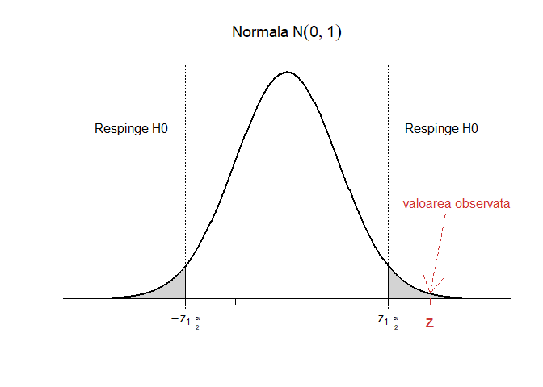
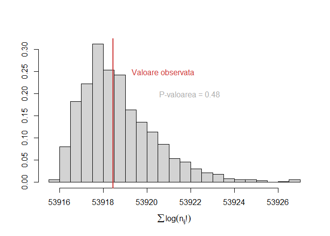

<script>
$(document).ready(function ()  {

    // move toc-ignore selectors from section div to header
    $('div.section.toc-ignore')
        .removeClass('toc-ignore')
        .children('h1,h2,h3,h4,h5').addClass('toc-ignore');

    // establish options
    var options = {
      selectors: "h1,h2,h3",
      theme: "bootstrap3",
      context: '.toc-content',
      hashGenerator: function (text) {
        return text.replace(/[.\\/?&!#<>]/g, '').replace(/\s/g, '_').toLowerCase();
      },
      ignoreSelector: ".toc-ignore",
      scrollTo: 60
    };
    options.showAndHide = false;
    options.smoothScroll = true;

    // tocify
    var toc = $("#TOC").tocify(options).data("toc-tocify");
});
</script>

Obiectivul acestui laborator este de a prezenta câteva teste statistice folosite pentru testarea ipotezelor statistice atunci când datele sunt de tip categoric.


# Compararea proporțiilor și tabele de contingență $2\times 2$

Considerăm următorul exemplu:

\BeginKnitrBlock{rmdexercise}<div class="rmdexercise">Un studiu clinic a investigat efectele metodelor contraceptive orale (OC) asupra bolilor de inimă la femeile cu vârste între 40 și 44 de ani. Cercetătorii au găsit că printre 5000 de femei care utilizau metode contraceptive orale la momentul studiului (cazuri), 13 dintre acestea au dezvoltat un infarct miocardic (MI) (pe o perioadă de 3 ani) pe când printre 10000 de femei care nu au folosit niciodată OC (grupul de control) doar 7 au dezvoltat MI (pe aceeași perioadă). Vrem să vedem dacă există vreo asociere între consumul de anticoncepționale pe cale orală și incidența infarctului miocardic (pe această perioadă).</div>\EndKnitrBlock{rmdexercise}

Fie $\pi_1=\mathbb{P}(MI\,|\,OC)$, probabilitatea ca femeile să dezvolte infarct miocardic (MI) în cazul grupului care a consumat contraceptive orale (OC) și $\pi_2=\mathbb{P}(MI\,|\,non-OC)$, probabilitatea ca femeile să dezvolte infarct miocardic (MI) în cazul grupului care nu a consumat contraceptive orale (OC). Întrebarea este dacă probabilitatea de a face infarct miocardic diferă între cele două grupuri (cazuri vs control). Cu alte cuvinte vrem să testăm ipotezele statistice:

$$
  \begin{array}{ll}
    H_0:\,\,\pi_1=\pi_2\\
    H_1:\,\,\pi_1\neq \pi_2
  \end{array}
$$

## Compararea proporțiilor prin aproximarea normală

Putem modela problema astfel: considerăm $X_1, X_2, \ldots, X_{n_1}\in\{0,1\}$ ($0$ - nu a dezvoltat infarct miocardic, $1$ - a dezvoltat infarct miocardic pe perioada studiului) un eșantion de talie $n_1$ ($n_1 = 5000$) dintr-o populație Bernoulli $\mathcal{B}(\pi_1)$ care să reprezinte populația femeilor cu vârste între 40 și 44 de ani care au consumat contraceptive orale (cazuri) și respectiv un eșantion $Y_1, Y_2, \ldots, Y_{n_2}\in\{0,1\}$ un eșantion de talie $n_2$ ($n_2 = 10000$) dintr-o populație Bernoulli $\mathcal{B}(\pi_2)$ care să reprezinte populația femeilor cu vârste între 40 și 44 de ani care nu au consumat contraceptive orale (control). Vom presupune că eșantioanele sunt suficient de mari pentru a putea aplica aproximarea normală a binomialei (e.g. vezi [aici](https://alexamarioarei.github.io/Teaching/2017-2018/PS%20web%20page/labs/Lab_4.html#3_aproximarea_poisson_%C8%99i_normal%C4%83_a_binomialei)).

Se poate verifica cu ușurință că sub $H_0:\,\pi_1=\pi_2=\pi$ are loc 

$$
  \hat{\pi}_1 - \hat{\pi}_2\sim\mathcal{N}\left(\underbrace{\pi_1-\pi_2}_{=0}, \pi(1-\pi)\left(\frac{1}{n_1} + \frac{1}{n_2}\right)\right)
$$

unde $\hat{\pi}_1 = \bar{X}_{n_1}$ iar $\hat{\pi}_2 = \bar{Y}_{n_2}$. Astfel, sub $H_0$, avem 

$$
  Z = \frac{\hat{\pi}_1 - \hat{\pi}_2}{\sqrt{\pi(1-\pi)\left(\frac{1}{n_1} + \frac{1}{n_2}\right)}} \sim \mathcal{N}(0,1)
$$

și cum $\pi$ este necunoscut putem să-l aproximăm din cele două eșantioane luate împreună (estimatorul *pooled*) 

$$
  \hat{\pi} = \frac{\sum_{i = 1}^{n_1}X_i + \sum_{j = 1}^{n_2}Y_j}{n_1+n_2} = \frac{n_1\hat{\pi}_1 + n_2\hat{\pi}_2}{n_1+n_2}.
$$

Dacă luăm în calcul corecția de continuitate a aproximării normale a binomialei atunci regiunea critică a testului bilateral de nivel $\alpha$ (acest test se numește *testul de scor* și este recomandat atunci când vrem să comparîăm proporții în locul *testului lui Wald*), cu ipotezele statistice $H_0:\,\pi_1=\pi_2\,\,vs\,\,H_1:\,\pi_1\neq \pi_2$, este 

$$
  C = \left\{(x_1,\ldots,x_{n_1},y_1,\ldots,y_{n_2})\,|\,\frac{|\hat{\pi}_1 - \hat{\pi}_2| - \frac{1}{2}\left(\frac{1}{n_1} + \frac{1}{n_2}\right)}{\sqrt{\hat{\pi}(1-\hat{\pi})\left(\frac{1}{n_1} + \frac{1}{n_2}\right)}}>z_{1-\frac{\alpha}{2}}\right\}
$$

iar p-valoarea aproximativă a testului este

$$
  p-val = 2(1-\Phi(z_{\text{obs}})).
$$

De regulă, în practică, putem folosi aproximarea normală a binomialei și testul de comparare a proporțiilor cu regiunea critică $C$ atunci când sunt îndeplinite condițiile $n_1\hat{\pi}(1-\hat{\pi})\geq 5$ și $n_2\hat{\pi}(1-\hat{\pi})\geq 5$.

În R avem 


```r
n1 = 5000 # nr total cazuri OC
n11 = 13 # nr cazuri cu MI

n2 = 10000 # nr total control non-OC
n21 = 7 # nr control cu MI

p1 = n11/n1
p2 = n21/n2

p = (n11+n21)/(n1+n2) # proportia comuna - pooled p
```

și putem verifica cele două condiții de aplicabilitate a aproximării normale


```r
# Verificam daca putem aplica aproximarea normala 
n1*p*(1-p)>5
[1] TRUE
n2*p*(1-p)>5
[1] TRUE
```

Calculul statisticii de test și a p-valorii testului, pentru exemplul nostru, sunt 


```r
# Calculam statistica de test cu corectia de continuitate
z = (abs(p1-p2)-0.5*(1/n1+1/n2))/sqrt(p*(1-p)*(1/n1+1/n2))
z
[1] 2.768839

# Calcul de p-valoare: test bilateral
pval = min(2*(1-pnorm(z)), 1)
pval
[1] 0.005625635
```

Observăm că același răspuns se obține și dacă folosim funcția `prop.test()` din R:


```r
prop.test(c(13, 7), c(5000, 10000))

	2-sample test for equality of proportions with continuity
	correction

data:  c(13, 7) out of c(5000, 10000)
X-squared = 7.6665, df = 1, p-value = 0.005626
alternative hypothesis: two.sided
95 percent confidence interval:
 0.0002463116 0.0035536884
sample estimates:
prop 1 prop 2 
0.0026 0.0007 
```

De asemenea putem construi și intervalul de încredere de nivel $1-\alpha$, corespunzător


```
IC pentru pi1-pi2 la pragul de semnificatie 95% este 
 IC = [ 0.0006612366 , 0.003138763 ]
```

precum și intervalul de încredere clasic pentru diferența proporțiilor, obținut prin aproximarea lui Wald 

$$
  \hat{\pi}_1 - \hat{\pi}_2 \pm z_{1-\frac{\alpha}{2}}\sqrt{\frac{\hat{\pi}_1(1-\hat{\pi}_1)}{n_1} + \frac{\hat{\pi}_2(1-\hat{\pi}_2)}{n_2}}
$$


```
IC pentru pi1-pi2 la pragul de semnificatie 95% este 
 IC = [ 0.0003963116 , 0.003403688 ]
```

În articolul [@Agresti2000], autorii prezintă un alt interval de încredere (ajustat prin adăugarea a două observații la fiecare eșantion, un $1$ și un $0$) pentru diferența proporțiilor 

$$
  \bar{\pi}_1 - \bar{\pi}_2 \pm z_{1-\frac{\alpha}{2}}\sqrt{\frac{\bar{\pi}_1(1-\bar{\pi}_1)}{n_1+2} + \frac{\bar{\pi}_2(1-\bar{\pi}_2)}{n_2+2}}
$$

unde $\bar{\pi}_1 = \frac{\sum_{i = 1}^{n_1}X_i + 1}{n_1+2}$ iar $\bar{\pi}_2 = \frac{\sum_{j = 1}^{n_1}Y_j + 1}{n_2+2}$


```
IC (Agresti-Caffo) pentru pi1-pi2 la pragul de semnificatie 95% este 
 IC = [ 0.0006853283 , 0.003312753 ]
```



Concluzionăm că folosirea de anticoncepționale pe cale orală este semnificativ asociată cu incidența crescută de cazuri de MI la femeile cu vârste între 40 și 44 de ani pe perioada de 3 ani a studiului.

\BeginKnitrBlock{rmdexercise}<div class="rmdexercise">Puteți crea o funcție care să automatizeze procesul ?

</div>\EndKnitrBlock{rmdexercise}

## Metoda tabelelor de contingență și testul $\chi^2$ al lui Pearson

Rescriem problema de mai sus sub formă de tabel de contingență $2\times2$ (un tabel în care datele apar clasificate după valorile a două variabile categorice, cu două clase fiecare) pentru vectorul aleator $(X,Y)\in\{a_1, a_2\}\times\{b_1,b_2\} = \{\text{OC}, \text{non-OC}\}\times\{\text{MI},\text{non-MI}\}$:

$$
  \begin{array}{c|c|c|c}
    X/Y & b_1 & b_2 & \text{Total}\\
    \hline
    a_1 & n_{11} & n_{12} & n_{1\cdot} = n_{11} + n_{12}\\
    \hline
    a_2 & n_{21} & n_{22} & n_{2\cdot} = n_{21} + n_{22}\\
    \hline
    \text{Total} & n_{\cdot 1} = n_{11} + n_{21} & n_{\cdot 2} = n_{12} + n_{22} & n = \sum_{i,j = 1}^{2}n_{ij}\\
  \end{array}
$$
care în cazul problemei noastre este 

<table class="table table-striped table-hover" style="margin-left: auto; margin-right: auto;">
 <thead>
  <tr>
   <th style="text-align:left;">   </th>
   <th style="text-align:center;"> MI </th>
   <th style="text-align:center;"> non-MI </th>
   <th style="text-align:center;"> Total </th>
  </tr>
 </thead>
<tbody>
  <tr>
   <td style="text-align:left;"> OC </td>
   <td style="text-align:center;"> 13 </td>
   <td style="text-align:center;"> 4987 </td>
   <td style="text-align:center;"> 5000 </td>
  </tr>
  <tr>
   <td style="text-align:left;"> non-OC </td>
   <td style="text-align:center;"> 7 </td>
   <td style="text-align:center;"> 9993 </td>
   <td style="text-align:center;"> 10000 </td>
  </tr>
  <tr>
   <td style="text-align:left;"> Total </td>
   <td style="text-align:center;"> 20 </td>
   <td style="text-align:center;"> 14980 </td>
   <td style="text-align:center;"> 15000 </td>
  </tr>
</tbody>
</table>

Acesta se mai numește și tabelul observat 

$$
  \text{Tabel}_{obs} = \begin{array}{c|c}
      O_{11} & O_{12}\\
      \hline
      O_{21} & O_{22}
  \end{array} = \begin{array}{c|c}
      n_{11} & n_{12}\\
      \hline
      n_{21} & n_{22}
  \end{array}
$$
Repartiția vectorului $(X,Y)$ este dată de $\mathbb{P}\circ (X,Y)^{-1} = \sum_{i = 1}^{2}\sum_{j = 1}^{2}p_{ij}\delta_{(a_i,b_j)}$, unde $\mathbb{P}((X,Y) = (a_i, b_j)) = p_{ij}$

$$
  \begin{array}{c|c|c|c}
    X/Y & b_1 & b_2 & \sum\\
    \hline
    a_1 & p_{11} & p_{12} & p_1 = p_{11} + p_{12}\\
    \hline
    a_2 & p_{21} & p_{22} & p_2 = p_{21} + p_{22}\\
    \hline
    \sum & q_1 = p_{11} + p_{21} & q_2 = p_{12} + p_{22} & 1\\
  \end{array}
$$

iar repartițiile marginale sunt $\mathbb{P}\circ X^{-1} = \sum_{i = 1}^{2}p_{i}\delta_{a_i}$, $\mathbb{P}\circ Y^{-1} = \sum_{j = 1}^{2}q_{j}\delta_{b_j}$ cu $\mathbb{P}(X = a_i) = p_i$ și respectiv $\mathbb{P}(Y = b_j) = q_j$.

Suntem interesați în testarea ipotezelor 

$$
H_0:\, \pi_1 = \pi_2\,\, vs \,\, H_1:\,\pi_1 \neq \pi_2
$$

unde $\pi_1=\mathbb{P}(MI\,|\,OC) = \mathbb{P}(Y = b_1\,|\,X = a_1)$ iar $\pi_2=\mathbb{P}(MI\,|\,non-OC) = \mathbb{P}(Y = b_1\,|\,X = a_2)$. Observăm că 

$$
  \pi_1 = \pi_2 \iff \frac{p_{11}}{p_1} = \frac{p_{21}}{p_2} \iff \frac{p_{11}}{p_1} = \frac{q_1 - p_{11}}{p_2} \iff p_{11} = p_1q_1
$$
și, în mod similar, se poate verifica că $p_{ij} = p_iq_j$, $\forall i,j\in\{1,2\}$. Cu alte cuvinte, ipoteza nulă se mai scrie și sub forma

$$
  H_0:\, \{\pi_1 = \pi_2\} = \left\{p_{ij} = p_iq_j,\,\forall i,j\in\{1,2\}\right\}
$$
Fie $(X_1, Y_1), (X_2, Y_2),\ldots,(X_n, Y_n)$ un eșantion de talie $n$ din populația $\mathbb{P}\circ (X,Y)^{-1}$ și avem că $n_{ij} = \sum_{k = 1}^n\mathbf{1}_{(a_i, b_j)}(X_k, Y_k)$ (numărul de observații din celula $(i,j)$) iar $n_{i\cdot} = \sum_{j = 1}^{2}n_{ij}$, $n_{\cdot j} = \sum_{i = 1}^{2}n_{ij}$ și respectiv $n = \sum_{i,j = 1}^{2}n_{ij}$.

Sub ipoteza nulă, $H_0$, avem că estimatorii de verosimilitate maximă pentru $p_i$ și $q_j$ sunt 

$$
  \hat{p}_i = \frac{n_{i\cdot}}{n},\,\, \hat{q}_j = \frac{n_{\cdot j}}{n}
$$

iar numărul de observații pe care ne așteptăm să-l observăm (sub $H_0$) în fiecare celulă este 

$$
  E_{ij} = n \hat{p}_{ij} \overset{H_0}{=} n \hat{p}_i \hat{q}_j = \frac{n_{i\cdot}n_{\cdot j}}{n}.
$$
Astfel tabelul pe care ne așteptăm să-l observăm sub ipoteza nulă este 

$$
  \text{Tabel}_{exp} = \begin{array}{c|c}
      E_{11} & E_{12}\\
      \hline
      E_{21} & E_{22}
  \end{array} = \begin{array}{c|c}
      \frac{n_{1\cdot}n_{\cdot 1}}{n} & \frac{n_{1\cdot}n_{\cdot 2}}{n}\\
      \hline
      \frac{n_{2\cdot}n_{\cdot 1}}{n} & \frac{n_{2\cdot}n_{\cdot 2}}{n}
  \end{array}
$$

Calculul tabelului pe care ne așteptăm să-l observăm:


```r
# Observat
n11 = 13
n1o = 5000
n12 = n1o-n11

n21 = 7
n2o = 10000
n22 = n2o-n21

no1 = n11+n21
no2 = n12+n22

n = n1o+n2o

#Asteptat
e11 = n1o*no1/n
e12 = n1o*no2/n
e21 = n2o*no1/n
e22 = n2o*no2/n

Mobs = matrix(c(n11,n12,n21,n22),ncol = 2, byrow = T, 
              dimnames = list(c("OC","non-OC"), c("MI", "non-MI")))

Mexp = matrix(c(e11,e12,e21,e22),ncol = 2, byrow = T, 
              dimnames = list(c("OC","non-OC"), c("MI", "non-MI")))
```

<table class="table table-striped table-hover" style="margin-left: auto; margin-right: auto;">
 <thead>
  <tr>
   <th style="text-align:left;">   </th>
   <th style="text-align:center;"> MI </th>
   <th style="text-align:center;"> non-MI </th>
  </tr>
 </thead>
<tbody>
  <tr>
   <td style="text-align:left;"> OC </td>
   <td style="text-align:center;"> 6.666667 </td>
   <td style="text-align:center;"> 4993.333 </td>
  </tr>
  <tr>
   <td style="text-align:left;"> non-OC </td>
   <td style="text-align:center;"> 13.333333 </td>
   <td style="text-align:center;"> 9986.667 </td>
  </tr>
</tbody>
</table>

Calculul statisticii de test cu corecția lui Yates:

$$
  X^2 = \sum_{i=1}^{2}\sum_{j=1}^{2}\frac{\left(|O_{ij}-E_{ij}|-0.5\right)^2}{E_{ij}}\underset{H_0}{\sim}\chi_1^2
$$


```r
X2 = (abs(n11-e11)-0.5)^2/e11 + (abs(n12-e12)-0.5)^2/e12 + 
  (abs(n21-e21)-0.5)^2/e21 + (abs(n22-e22)-0.5)^2/e22
X2
[1] 7.666472

pval = 1-pchisq(X2,1) #df = 1
pval
[1] 0.005625635
```

Sau folosind testul lui Pearson cu corecția lui Yates `chisq.test` avem:


```r
chisq.test(Mobs)

	Pearson's Chi-squared test with Yates' continuity correction

data:  Mobs
X-squared = 7.6665, df = 1, p-value = 0.005626
```


Același rezultat se obține și dacă folosim testul `prop.test`, acesta fiind un caz particular al testului hi-pătrat: 


```r
prop.test(Mobs)

	2-sample test for equality of proportions with continuity
	correction

data:  Mobs
X-squared = 7.6665, df = 1, p-value = 0.005626
alternative hypothesis: two.sided
95 percent confidence interval:
 0.0002463116 0.0035536884
sample estimates:
prop 1 prop 2 
0.0026 0.0007 
```

## Metoda testului bazat pe raportul de verosimilități

În contextul exemplului de mai sus vrem să vedem testul bazat pe raportul de verosimilitate. Considerând modelul multinomial $(n_{11},n_{12},n_{21},n_{22})\sim \mathcal{M}(n;p_{11},p_{12},p_{21},p_{22})$, obținem raportul de verosimilitate

$$
  \Lambda(x)=\frac{\sup_{\theta\in\Theta_0}L(\theta|x)}{\sup_{\theta\in\Theta}L(\theta|x)}=\prod_{i=1}^{2}\prod_{j=1}^{2}\left(\frac{n_{i\cdot}\times n_{\cdot j}}{n\times n_{ij}}\right)^{n_{ij}}
$$

și din teorema lui Wilks (cazul multidimensional) avem $-2\log\Lambda\to\chi^2(d-d_0)$ unde $d=\dim(\Theta)$ și $d_0=\dim(\Theta_0)$. În cazul nostru

$$
  \begin{array}{ll}
    \Theta = \left\{(p_{11},p_{12},p_{21},p_{22})\,|\,p_{ij}\in(0,1),\,\sum_{i=1}^{2}\sum_{j=1}^{2}p_{ij}=1\right\}\\
    \Theta_0 = \left\{(p_{1}q_1,p_{1}q_2,p_{2}q_1,p_{2}q_2)\,|\,p_{i},q_j\in(0,1),\,\sum_{i=1}^{2}p_{i}=1,\,\sum_{j=1}^{2}q_j=1\right\}
  \end{array}
$$

unde $p_i$ și $q_j$ sunt repartițiile marginale. Obținem că $\dim(\Theta)=4-1$ iar $\dim(\Theta_0)=4-2$, deci $-2\log\Lambda\to\chi^2(1)$.


```r
# Observat
n11 = 13
n1o = 5000
n12 = n1o-n11

n21 = 7
n2o = 10000
n22 = n2o-n21

no1 = n11+n21
no2 = n12+n22

LRT = n11*log((n1o*no1)/(n*n11)) + n12*log((n1o*no2)/(n*n12)) + 
  n21*log((n2o*no1)/(n*n21)) + n22*log((n2o*no2)/(n*n22))
LRT = -2*LRT
LRT
[1] 8.354617

pval = 1-pchisq(LRT,1) #df = 1
pval
[1] 0.003847085
```


Să creăm o funcție care automatizează procesul:


```r
LRT1 = function(dat){
  # dat este sub forma de matrice 
  rs = rowSums(dat) # apply(dat, 1, sum)
  cs = colSums(dat) # apply(dat, 2, sum)
  
  n = sum(dat)
  
  expected <- outer(rs,cs,"*")/n
  
  lrt <- -2*sum(dat * log(expected/dat)) 
  
  dm = dim(dat) # dimensiunea tabloului pentru a calcula gradele de libertate
  pval = 1-pchisq(lrt,(dm[1]-1)*(dm[2]-1))
  
  cat("Statistica LRT este ", lrt, "\n")
  cat("P-valoarea testului bazat pe raportul de verosimilitate este ", pval)
  
  return(list(statistic = lrt, pvalue = pval))
}

Mobs = matrix(c(n11,n12,n21,n22),ncol = 2, byrow = T, 
              dimnames = list(c("OC","non-OC"), c("MI", "non-MI")))

LRT1(Mobs) 
Statistica LRT este  8.354617 
P-valoarea testului bazat pe raportul de verosimilitate este  0.003847085
$statistic
[1] 8.354617

$pvalue
[1] 0.003847085
```

# Testul exact al lui Fisher 

\BeginKnitrBlock{rmdexercise}<div class="rmdexercise">Să presupunem că vrem să investigăm legătura dintre regimul bogat în sare și decesul datorat unei boli cardiovasculare (CVD). Să presupunem că suntem în contextul unui studiu retrospectiv efectuat pe un grup de bărbați cu vârste cuprinse între 50 și 54 de ani dintr-o anumită regiune geografică care au decedat pe parcursul unui luni. S-a încercat introducerea în studiu a unui grup cât mai omogen (s-a încercat includerea în studiu a unui număr egal de persoane care au decedat din cauză de CVD și care au decedat din alte cauze). 

</div>\EndKnitrBlock{rmdexercise}

S-a obținut următorul tabel:

<table class="table table-striped table-hover" style="margin-left: auto; margin-right: auto;">
 <thead>
  <tr>
   <th style="text-align:left;">   </th>
   <th style="text-align:center;"> Ridicat Sare </th>
   <th style="text-align:center;"> Scazut Sare </th>
   <th style="text-align:center;"> Total </th>
  </tr>
 </thead>
<tbody>
  <tr>
   <td style="text-align:left;"> non-CVD </td>
   <td style="text-align:center;"> 2 </td>
   <td style="text-align:center;"> 23 </td>
   <td style="text-align:center;"> 25 </td>
  </tr>
  <tr>
   <td style="text-align:left;"> CVD </td>
   <td style="text-align:center;"> 5 </td>
   <td style="text-align:center;"> 30 </td>
   <td style="text-align:center;"> 35 </td>
  </tr>
  <tr>
   <td style="text-align:left;"> Total </td>
   <td style="text-align:center;"> 7 </td>
   <td style="text-align:center;"> 53 </td>
   <td style="text-align:center;"> 60 </td>
  </tr>
</tbody>
</table>

Tabelul pe care ne așteptam să-l obținem ($H_0$) este:


```r
# Observat
n11 = 2
n1o = 25
n12 = n1o-n11

n21 = 5
n2o = 35
n22 = n2o-n21

no1 = n11+n21
no2 = n12+n22

n = n1o+n2o

#Asteptat
e11 = n1o*no1/n
e12 = n1o*no2/n
e21 = n2o*no1/n
e22 = n2o*no2/n

MobsF = matrix(c(n11,n12,n21,n22),ncol = 2, byrow = T, 
               dimnames = list(c("non-CVD", "CVD"), 
                               c("Ridicat Sare", "Scazut Sare")))

MexpF = matrix(c(e11,e12,e21,e22),ncol = 2, byrow = T, 
               dimnames = list(c("non-CVD", "CVD"), 
                               c("Ridicat Sare", "Scazut Sare")))
```

<table class="table table-striped table-hover" style="margin-left: auto; margin-right: auto;">
 <thead>
  <tr>
   <th style="text-align:left;">   </th>
   <th style="text-align:center;"> Ridicat Sare </th>
   <th style="text-align:center;"> Scazut Sare </th>
  </tr>
 </thead>
<tbody>
  <tr>
   <td style="text-align:left;"> non-CVD </td>
   <td style="text-align:center;"> 2.916667 </td>
   <td style="text-align:center;"> 22.08333 </td>
  </tr>
  <tr>
   <td style="text-align:left;"> CVD </td>
   <td style="text-align:center;"> 4.083333 </td>
   <td style="text-align:center;"> 30.91667 </td>
  </tr>
</tbody>
</table>

Observăm că avem două celule în tabelul așteptat care conțin mai puțin de 5 observații prin urmare nu putem folosi metodele de mai sus (aproximarea normală, testul lui Pearson sau testul bazat pe raportul de verosimilitate). Dacă am încerca am obține:


```r
# Testul lui Pearson (Hi patrat)

chisq.test(MobsF)

	Pearson's Chi-squared test with Yates' continuity correction

data:  MobsF
X-squared = 0.11552, df = 1, p-value = 0.7339

# Testul bazat pe raportul de verosimilitate

LRT1(MobsF)
Statistica LRT este  0.5810517 
P-valoarea testului bazat pe raportul de verosimilitate este  0.4459004
$statistic
[1] 0.5810517

$pvalue
[1] 0.4459004
```

Enumerăm tabelele și probabilitățile lor de apariție:


```r
# Fixez marginalele

n1o = 25
n2o = 35
  
no1 = 7
no2 = 53

for (i in 0:7){
  cat("-------------------------------------\n")
  cat("Tabelul ", i+1, " :\n")
  
  # calculez valorile din tabel
  n11 = i
  n12 = n1o - n11
  n21 = no1 - n11
  n22 = no2 - n12
  
  MobsF1 = matrix(c(n11,n12,n21,n22),ncol = 2, byrow = T, 
                  dimnames = list(c("non-CVD", "CVD"), 
                                  c("Ridicat Sare", "Scazut Sare")))
  
  print(MobsF1)
  
  cat("Probabilitatea de a obtine tabelul ", i+1, " este ", 
      dhyper(i, no1, no2, n1o), "\n")
  cat("-------------------------------------\n")
}
-------------------------------------
Tabelul  1  :
        Ridicat Sare Scazut Sare
non-CVD            0          25
CVD                7          28
Probabilitatea de a obtine tabelul  1  este  0.0174117 
-------------------------------------
-------------------------------------
Tabelul  2  :
        Ridicat Sare Scazut Sare
non-CVD            1          24
CVD                6          29
Probabilitatea de a obtine tabelul  2  este  0.1050706 
-------------------------------------
-------------------------------------
Tabelul  3  :
        Ridicat Sare Scazut Sare
non-CVD            2          23
CVD                5          30
Probabilitatea de a obtine tabelul  3  este  0.2521695 
-------------------------------------
-------------------------------------
Tabelul  4  :
        Ridicat Sare Scazut Sare
non-CVD            3          22
CVD                4          31
Probabilitatea de a obtine tabelul  4  este  0.3118225 
-------------------------------------
-------------------------------------
Tabelul  5  :
        Ridicat Sare Scazut Sare
non-CVD            4          21
CVD                3          32
Probabilitatea de a obtine tabelul  5  este  0.214378 
-------------------------------------
-------------------------------------
Tabelul  6  :
        Ridicat Sare Scazut Sare
non-CVD            5          20
CVD                2          33
Probabilitatea de a obtine tabelul  6  este  0.0818534 
-------------------------------------
-------------------------------------
Tabelul  7  :
        Ridicat Sare Scazut Sare
non-CVD            6          19
CVD                1          34
Probabilitatea de a obtine tabelul  7  este  0.01604969 
-------------------------------------
-------------------------------------
Tabelul  8  :
        Ridicat Sare Scazut Sare
non-CVD            7          18
CVD                0          35
Probabilitatea de a obtine tabelul  8  este  0.00124467 
-------------------------------------
```

Aplicăm testul exact al lui Fisher `fisher.test`:


```r
fisher.test(MobsF)

	Fisher's Exact Test for Count Data

data:  MobsF
p-value = 0.6882
alternative hypothesis: true odds ratio is not equal to 1
95 percent confidence interval:
 0.04625243 3.58478157
sample estimates:
odds ratio 
  0.527113 
```

P-valoarea în `R` este calculată după formula:

$$
  p_{value} = \sum_{\{i:\mathbb{P}(i)\leq \mathbb{P}(obs)\}}\mathbb{P}(i)
$$
care în cazul nostru devine 


```r
n1o = 25
n2o = 35
  
no1 = 7
no2 = 53

n11 = 2
  
ps = dhyper(0:no1, no1, no2, n1o)
pobs = dhyper(n11, no1, no2, n1o)

pval = sum(ps[ps<=pobs])
pval
[1] 0.6881775
```

# Date pereche - Testul lui McNemar


\BeginKnitrBlock{rmdexercise}<div class="rmdexercise">Ne propunem să comparăm două regimuri de chimioterapie pentru pacienții cu cancer la sân care au efectuat operația de mastectomie. Cele două grupuri de tratament investigate ar trebui să fie cât mai comparabile din punct de vedere al celorlalți factori. Presupunem că un studiu de potrivire (matched study) a fost pregătit așa încât din fiecare pereche (potrivită din punct de vedere al vârstei și a condițiilor clinice) s-a selectat aleator un membru căruia i-a fost administrat tratamentul A iar celuilalt membru tratamentul B. Pacienții au fost urmăriți pe o perioadă de 5 ani, iar variabila de interes a fost supraviețuirea în această perioadă. 

</div>\EndKnitrBlock{rmdexercise}

S-au obținut următoarele date: 

<table class="table table-striped table-hover" style="margin-left: auto; margin-right: auto;">
 <thead>
  <tr>
   <th style="text-align:left;">   </th>
   <th style="text-align:center;"> Supravietuit </th>
   <th style="text-align:center;"> Decedat </th>
   <th style="text-align:center;"> Total </th>
  </tr>
 </thead>
<tbody>
  <tr>
   <td style="text-align:left;"> A </td>
   <td style="text-align:center;"> 526 </td>
   <td style="text-align:center;"> 95 </td>
   <td style="text-align:center;"> 621 </td>
  </tr>
  <tr>
   <td style="text-align:left;"> B </td>
   <td style="text-align:center;"> 515 </td>
   <td style="text-align:center;"> 106 </td>
   <td style="text-align:center;"> 621 </td>
  </tr>
  <tr>
   <td style="text-align:left;"> Total </td>
   <td style="text-align:center;"> 1041 </td>
   <td style="text-align:center;"> 201 </td>
   <td style="text-align:center;"> 1242 </td>
  </tr>
</tbody>
</table>

Observăm că nu putem folosi testul lui Pearson (cu corecția lui Yates) deoarece datele nu sunt *independente*. Dacă am folosi am obține:


```r
M1csq = matrix(c(526,95,515,106),ncol = 2, byrow = T)
chisq.test(M1csq)

	Pearson's Chi-squared test with Yates' continuity correction

data:  M1csq
X-squared = 0.59357, df = 1, p-value = 0.441
```

Construim următorul tabel, în care unitatea de analiză nu mai este *pacientul* ci *perechea* iar perechile sunt clasificate după cum membrii acelei perechi au supraviețuit sau nu o perioadă post-operatorie de 5 ani (liniile tabelului sunt rezultatele pacientului care a urmat tratamentul A iar coloanele sunt rezultatele pacientului care a urmat tratamentul B):

<table class="table table-striped table-hover" style="margin-left: auto; margin-right: auto;">
 <thead>
  <tr>
   <th style="text-align:left;">   </th>
   <th style="text-align:center;"> Supravietuit </th>
   <th style="text-align:center;"> Decedat </th>
   <th style="text-align:center;"> Total </th>
  </tr>
 </thead>
<tbody>
  <tr>
   <td style="text-align:left;"> Supravietuit </td>
   <td style="text-align:center;"> 510 </td>
   <td style="text-align:center;"> 16 </td>
   <td style="text-align:center;"> 526 </td>
  </tr>
  <tr>
   <td style="text-align:left;"> Decedat </td>
   <td style="text-align:center;"> 5 </td>
   <td style="text-align:center;"> 90 </td>
   <td style="text-align:center;"> 95 </td>
  </tr>
  <tr>
   <td style="text-align:left;"> Total </td>
   <td style="text-align:center;"> 515 </td>
   <td style="text-align:center;"> 106 </td>
   <td style="text-align:center;"> 621 </td>
  </tr>
</tbody>
</table>

Observăm că 600 (510+90) de perechi au avut același rezultat (perechi concordante) și doar 21 de perechi au avut rezultate diferite (perechi neconcordante).

Aplicăm testul lui McNemar `mcnemar.test` :


```r
M1 = matrix(c(510,16,5,90),ncol = 2, byrow = T, 
           dimnames = list(c("Supravietuit", "Decedat"), 
                           c("Supravietuit", "Decedat")))
mcnemar.test(M1)

	McNemar's Chi-squared test with continuity correction

data:  M1
McNemar's chi-squared = 4.7619, df = 1, p-value = 0.0291
```

# Tabele de contingență $r\times c$


\BeginKnitrBlock{rmdexercise}<div class="rmdexercise">Următorul tabel prezintă repartiția grupelor de sânge (A, B, AB și O) în trei eșantioane de cetățeni afro-americani care trăiesc în trei state diferite (Florida, Iowa și Missouri). Vrem să testăm la un nivel de semnificație $\alpha = 0.05$ dacă repartiția grupelor de sânge pentru cetățenii afro-americani diferă de-a lungul celor trei state. 

</div>\EndKnitrBlock{rmdexercise}


<table class="table table-striped table-hover" style="margin-left: auto; margin-right: auto;">
 <thead>
  <tr>
   <th style="text-align:left;">   </th>
   <th style="text-align:center;"> A </th>
   <th style="text-align:center;"> B </th>
   <th style="text-align:center;"> AB </th>
   <th style="text-align:center;"> O </th>
   <th style="text-align:center;"> Total </th>
  </tr>
 </thead>
<tbody>
  <tr>
   <td style="text-align:left;"> Florida </td>
   <td style="text-align:center;"> 122 </td>
   <td style="text-align:center;"> 117 </td>
   <td style="text-align:center;"> 19 </td>
   <td style="text-align:center;"> 244 </td>
   <td style="text-align:center;"> 502 </td>
  </tr>
  <tr>
   <td style="text-align:left;"> Iowa </td>
   <td style="text-align:center;"> 1781 </td>
   <td style="text-align:center;"> 1351 </td>
   <td style="text-align:center;"> 288 </td>
   <td style="text-align:center;"> 3301 </td>
   <td style="text-align:center;"> 6721 </td>
  </tr>
  <tr>
   <td style="text-align:left;"> Missouri </td>
   <td style="text-align:center;"> 353 </td>
   <td style="text-align:center;"> 269 </td>
   <td style="text-align:center;"> 60 </td>
   <td style="text-align:center;"> 713 </td>
   <td style="text-align:center;"> 1395 </td>
  </tr>
  <tr>
   <td style="text-align:left;"> Total </td>
   <td style="text-align:center;"> 2256 </td>
   <td style="text-align:center;"> 1737 </td>
   <td style="text-align:center;"> 367 </td>
   <td style="text-align:center;"> 4258 </td>
   <td style="text-align:center;"> 8618 </td>
  </tr>
</tbody>
</table>

## Testul $\chi^2$ al lui Pearson 

Tabelul pe care ne așteptăm să-l observat atunci când ipoteza nulă este adevărată:


```r
  matAA_observed = rbind(c(122, 117, 19, 244),
           c(1781, 1351, 288, 3301),
           c(353, 269, 60, 713))

  rs = rowSums(matAA_observed) 
  cs = colSums(matAA_observed) 
  
  n = sum(matAA_observed)
  
  matAA_expected <- outer(rs,cs,"*")/n
```

<table class="table table-striped table-hover" style="margin-left: auto; margin-right: auto;">
 <thead>
  <tr>
   <th style="text-align:left;">   </th>
   <th style="text-align:center;"> A </th>
   <th style="text-align:center;"> B </th>
   <th style="text-align:center;"> AB </th>
   <th style="text-align:center;"> O </th>
   <th style="text-align:center;"> Total </th>
  </tr>
 </thead>
<tbody>
  <tr>
   <td style="text-align:left;"> Florida </td>
   <td style="text-align:center;"> 131.4124 </td>
   <td style="text-align:center;"> 101.1806 </td>
   <td style="text-align:center;"> 21.37781 </td>
   <td style="text-align:center;"> 248.0292 </td>
   <td style="text-align:center;"> 502 </td>
  </tr>
  <tr>
   <td style="text-align:left;"> Iowa </td>
   <td style="text-align:center;"> 1759.4078 </td>
   <td style="text-align:center;"> 1354.6504 </td>
   <td style="text-align:center;"> 286.21571 </td>
   <td style="text-align:center;"> 3320.7262 </td>
   <td style="text-align:center;"> 6721 </td>
  </tr>
  <tr>
   <td style="text-align:left;"> Missouri </td>
   <td style="text-align:center;"> 365.1799 </td>
   <td style="text-align:center;"> 281.1691 </td>
   <td style="text-align:center;"> 59.40647 </td>
   <td style="text-align:center;"> 689.2446 </td>
   <td style="text-align:center;"> 1395 </td>
  </tr>
  <tr>
   <td style="text-align:left;"> Total </td>
   <td style="text-align:center;"> 2256.0000 </td>
   <td style="text-align:center;"> 1737.0000 </td>
   <td style="text-align:center;"> 367.00000 </td>
   <td style="text-align:center;"> 4258.0000 </td>
   <td style="text-align:center;"> 8618 </td>
  </tr>
</tbody>
</table>

Aplicând funcția `chisq.test` obținem:


```r
chisq.test(matAA_observed)

	Pearson's Chi-squared test

data:  matAA_observed
X-squared = 5.6382, df = 6, p-value = 0.4649
```

## Testul bazat pe raportul de verosimilități

Aplicând funcția `LRT1` construită anterior obținem p-valoarea testului bazat pe raportul de verosimilitate: 


```r
LRT1(matAA_observed)
Statistica LRT este  5.548169 
P-valoarea testului bazat pe raportul de verosimilitate este  0.475654
$statistic
[1] 5.548169

$pvalue
[1] 0.475654
```

## Testul aproximat al lui Fisher 

Testul exact al lui Fisher poate fi aplicat și în cazul tabelelor de tip $r\times c$ (pentru o generalizare a testului prezentat la curs puteți consulta [http://mathworld.wolfram.com/FishersExactTest.html](http://mathworld.wolfram.com/FishersExactTest.html)) numai că numărul de tabele pe care trebuie să le generăm devine prohibitiv. În acest caz putem aproxima p-valoarea testului cu ajutorul metodelor de tip Monte-Carlo. Mai multe informații despre testul lui Fisher (exact) aproximat dar și despre alte teste exacte se găsesc în monografia [@Mehta1995].

Generalizând raționamentul din cazul $2 \times 2$ obținem că probabilitatea (condiționată) de a observa un tabel dat fiind marginalele (pe rânduri și pe coloane) este dată de:

$$
  \mathbb{P}(\,tabel\,) = \frac{\prod_{i=1}^{r}n_{i\cdot}!\prod_{j=1}^{c}n_{\cdot j}!}{n!\prod_{i=1}^{r}\prod_{j=1}^{c}n_{ij}!}\propto\frac{1}{\prod_{i=1}^{r}\prod_{j=1}^{c}n_{ij}!}
$$
Pentru început să observăm că 

$$
  \log(\mathbb{P}(\,tabel\,))\propto - \sum_{i=1}^{r}\sum_{j=1}^{c}\log(n_{ij}!) = - \sum_{i=1}^{r}\sum_{j=1}^{c}\log(\Gamma(n_{ij} + 1))
$$

iar pentru a calcula în R această probabilitate putem să folosim funcția `lgamma()`. Ne punem acum întrebarea cum generăm aleator un tabel cu $r$ linii și $c$ coloane care să aibă intrări numere naturale, a căror sumă pe linii este $n_{i\cdot}$ iar pe coloane este $n_{\cdot j}$. 

O idee ar fi să ne uităm la indicii liniilor și a coloanelor (folosim funcțiile `row()` și respectiv `col()`) și apoi să le permutăm aleator (folosim `sample()`). Să presupunem că avem tabelul $2\times 2$

$$
  \begin{array}{c|c|c|c}
     & 1 & 2 &\\
    \hline
    1 & n_{11} & n_{12} & n_{1\cdot}\\
    \hline
    2 & n_{21} & n_{22} & n_{2\cdot}\\
    \hline
     & n_{\cdot 1} & n_{\cdot 2} & n 
  \end{array}
$$

care mai poate fi scris, ținând seama doar de inidicii liniilor și coloanelor pe care se află elementele, sub forma următoare

$$
  \underbrace{(1,1), (1,1), \ldots, (1,1)}_{n_{11}},\underbrace{(2,1), (2,1), \ldots, (2,1)}_{n_{21}},\underbrace{(1,2), (1,2), \ldots, (1,2)}_{n_{12}},\underbrace{(2,2), (2,2), \ldots, (2,2)}_{n_{22}}
$$

iar în R avem:


```r
tab = matrix(c(10, 3, 5, 7), nrow = 2, byrow = TRUE)
tab
     [,1] [,2]
[1,]   10    3
[2,]    5    7

# liniile si coloanele pe care se afla elementele
row(tab)
     [,1] [,2]
[1,]    1    1
[2,]    2    2
col(tab)
     [,1] [,2]
[1,]    1    2
[2,]    1    2

# cream o lista cu doua componente
# prima corespunde indicilor liniilor
# a doua corespunde indicilor coloanelor
# cu nr de indici conform cu datele initiale
a = list(rep(row(tab),tab), rep(col(tab),tab))
a
[[1]]
 [1] 1 1 1 1 1 1 1 1 1 1 2 2 2 2 2 1 1 1 2 2 2 2 2 2 2

[[2]]
 [1] 1 1 1 1 1 1 1 1 1 1 1 1 1 1 1 2 2 2 2 2 2 2 2 2 2
```

Vom afișa funcția care calculează p-valoarea testului lui Fisher prin metoda Monte-Carlo:


```r
fisher = function(tab, n.sim=1000, return.all=FALSE, prnt=FALSE){
  bot0 = sum(lgamma(tab+1))# lgamma: logaritm natural din gamma 
                            #- logaritm din factorial

  bot = 1:n.sim
  a = list(rep(row(tab),tab), rep(col(tab),tab))
  
  for(i in 1:n.sim) {
    a[[1]] = sample(a[[1]])
    bot[i] = sum(lgamma(table(a)+1))
    if(prnt) { if(i == round(i/10)*10) cat(i,"\n") }
  }
  if(return.all) return(list(bot0, bot, mean(bot0 <= bot)))
  cat("P-valoarea aproximata cu Monte Carlo este", mean(bot0 <= bot))
}

set.seed(1234)
fisher(matAA_observed)
P-valoarea aproximata cu Monte Carlo este 0.48
```



Același rezultat îl obținem și dacă folosim funcția `fisher.test()` din R (care este mai rapidă):


```r
fisher.test(matAA_observed, simulate.p.value = TRUE, B = 1000)

	Fisher's Exact Test for Count Data with simulated p-value (based
	on 1000 replicates)

data:  matAA_observed
p-value = 0.4835
alternative hypothesis: two.sided
```

# Referințe 
