<script>
$(document).ready(function ()  {

    // move toc-ignore selectors from section div to header
    $('div.section.toc-ignore')
        .removeClass('toc-ignore')
        .children('h1,h2,h3,h4,h5').addClass('toc-ignore');

    // establish options
    var options = {
      selectors: "h1,h2,h3",
      theme: "bootstrap3",
      context: '.toc-content',
      hashGenerator: function (text) {
        return text.replace(/[.\\/?&!#<>]/g, '').replace(/\s/g, '_').toLowerCase();
      },
      ignoreSelector: ".toc-ignore",
      scrollTo: 60
    };
    options.showAndHide = false;
    options.smoothScroll = true;

    // tocify
    var toc = $("#TOC").tocify(options).data("toc-tocify");
});
</script>

Obiectivul acestui laborator este de a prezenta câteva noțiuni legate de problema de regresie.


# Regresie liniară simplă


Regresia liniară simplă (sau *modelul liniar simplu*) este un instrument statistic utilizat pentru a descrie relația dintre două variabile aleatoare, $X$ (variabilă *cauză*, *predictor* sau *covariabilă*) și $Y$ (variabilă *răspuns* sau *efect*) și este definit prin 

$$
\mathbb{E}[Y|X=x]=\beta_0+\beta_1x 
$$

sau altfel spus 

$$
Y = \beta_0 + \beta_1 X + \varepsilon.
$$

În relațiile de mai sus, $\beta_0$ și $\beta_1$ sunt cunoscute ca ordonata la origine (*intercept*) și respectiv panta (*slope*) dreptei de regresie.

Ipotezele modelului sunt: 

i. **Linearitatea**: $\mathbb{E}[Y|X=x]=\beta_0+\beta_1x$
ii. **Homoscedasticitatea**: $\mathbb{V}\text{ar}(\varepsilon_i)=\sigma^2$, cu $\sigma^2$ constantă pentru $i=1,\ldots,n$
iii. **Normalitatea**: $\varepsilon_i\sim\mathcal{N}(0,\sigma^2)$ pentru $i=1,\ldots,n$
iv. **Independența erorilor**: $\varepsilon_1,\ldots,\varepsilon_n$ sunt independente (sau necorelate, $\mathbb{E}[\varepsilon_i\varepsilon_j]=0$, $i\neq j$, deoarece sunt presupuse normale)

Altfel spus 

$$
Y|X=x\sim \mathcal{N}(\beta_0+\beta_1x,\sigma^2)
$$


\BeginKnitrBlock{rmdinsight}<div class="rmdinsight">- Nicio ipoteză nu a fost făcută asupra repartiției lui $X$ (poate fi sau deterministă sau aleatoare)

- Modelul de regresie presupune că **$Y$ este continuă** datorită normalității erorilor. În orice caz, **$X$ poate fi o variabilă discretă**!

</div>\EndKnitrBlock{rmdinsight}


Dat fiind un eșantion $(X_1,Y_1),\ldots,(X_n,Y_n)$ pentru variabilele $X$ și $Y$ putem estima coeficienții necunoscuți $\beta_0$ și $\beta_1$ minimizând *suma abaterilor pătratice reziduale* (*Residual Sum of Squares* - RSS)

$$
\text{RSS}(\beta_0,\beta_1)=\sum_{i=1}^n(Y_i-\beta_0-\beta_1X_i)^2
$$

ceea ce conduce la 

$$
\hat\beta_0=\bar{Y}-\hat\beta_1\bar{X},\quad \hat\beta_1=\frac{s_{xy}}{s_x^2}=\frac{\sum_{i=1}^{n}{(X_i-\bar{X})}Y_i}{\sum_{i=1}^{n}{(X_i-\bar{X})^2}}
$$

unde

- $\bar{X}=\frac{1}{n}\sum_{i=1}^nX_i$ este *media eșantionului*
- $s_x^2=\frac{1}{n}\sum_{i=1}^n(X_i-\bar{X})^2$ este *varianța eșantionului*
- $s_{xy}=\frac{1}{n}\sum_{i=1}^n(X_i-\bar{X})(Y_i-\bar{Y})$ este *covarianța eșantionului*

Graficul functiei RSS pentru modelul $y = -0.5 + 1.5x + e$:

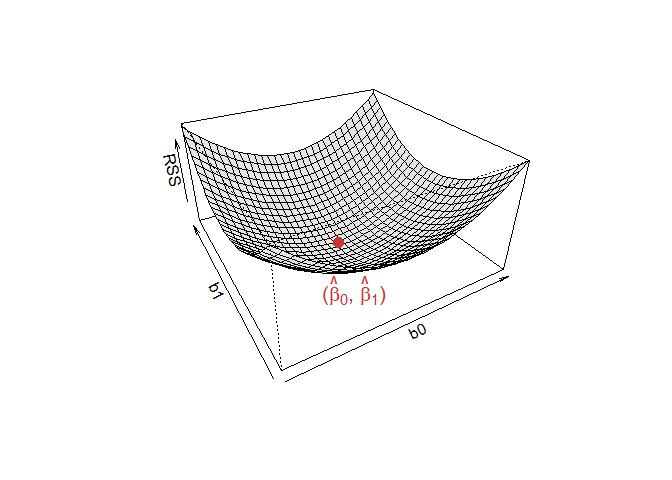

Odată ce avem estimatorii $(\hat\beta_0,\hat\beta_1)$ , putem defini:

- *valorile prognozate* (*fitted values*) $\hat Y_1,\ldots,\hat Y_n$ (valorile verticale pe dreapta de regresie), unde

$$
\hat Y_i=\hat\beta_0+\hat\beta_1X_i,\quad i=1,\ldots,n
$$

- *reziduurile estimate* (*estimated residuals*) $\hat \varepsilon_1,\ldots,\hat \varepsilon_n$ (distanțele verticale dintre punctele actuale $(X_i,Y_i)$ și cele prognozate $(X_i,\hat Y_i)$), unde

$$
\hat\varepsilon_i=Y_i-\hat Y_i,\quad i=1,\ldots,n
$$

Estimatorul pentru $\sigma^2$ este 

$$
\hat{\sigma}^2 = \frac{RSS(\hat{\beta}_0,\hat{\beta}_1)}{n-2} = \frac{\sum_{i=1}^{n}\hat{\varepsilon}_i^2}{n-2}.
$$

## Aplicație

\BeginKnitrBlock{rmdexercise}<div class="rmdexercise">Ne propunem să investigăm relația dintre consumul de clorură de sodiu (sarea de bucătărie) și tensiunea arterială la persoanele trecute de 65 de ani. Pentru aceasta vom folosi setul de date [saltBP](dataIn/saltBP.txt) care conține informații despre tensiunea arterială a 25 de pacienți.

</div>\EndKnitrBlock{rmdexercise}

Începem prin a înregistra setul de date


```r
saltBP = read.table("dataIn/saltBP.txt", header = T)

summary(saltBP)
       BP             salt          saltLevel  
 Min.   :128.3   Min.   : 1.130   Min.   :0.0  
 1st Qu.:131.8   1st Qu.: 2.650   1st Qu.:0.0  
 Median :135.7   Median : 5.210   Median :0.0  
 Mean   :135.7   Mean   : 5.898   Mean   :0.4  
 3rd Qu.:137.5   3rd Qu.: 8.680   3rd Qu.:1.0  
 Max.   :145.0   Max.   :12.570   Max.   :1.0  
```

și a ilustra grafic diagrama de împrăștiere


```r
plot(saltBP$salt, saltBP$BP, 
     xlab = "sare", 
     ylab = "tensiunea arteriala", 
     col = "brown3", 
     pch = 16, 
     bty="n")
```


### Estimarea parametrilor

Considerăm modelul de regresie $Y = \beta_0 + \beta_1 X + \varepsilon$ (unde $X=$`saltBP$salt` iar $Y=$`saltBP$BP`), $\varepsilon\sim \mathcal{N}(0,\sigma^2)$, a cărui parametrii sunt $\beta_0$, $\beta_1$ și $\sigma^2$.

Observăm că estimatorii parametrilor $\beta_0$ și $\beta_1$ sunt 


```r
# pentru b1

b1 = cov(saltBP$salt, saltBP$BP)/var(saltBP$salt)
cat("b1 = ", b1, "\n")
b1 =  1.196894 

# sau 

sum((saltBP$salt-mean(saltBP$salt))*(saltBP$BP))/sum((saltBP$salt-mean(saltBP$salt))^2)
[1] 1.196894

# pentru b0

b0 = mean(saltBP$BP) - b1*mean(saltBP$salt)
cat("b0 = ", b0)
b0 =  128.6164
```

sau folosind funcția `lm()`:


```r
saltBP_model = lm(BP~salt, data = saltBP)
names(saltBP_model)
 [1] "coefficients"  "residuals"     "effects"       "rank"         
 [5] "fitted.values" "assign"        "qr"            "df.residual"  
 [9] "xlevels"       "call"          "terms"         "model"        
```


```r
saltBP_model$coefficients
(Intercept)        salt 
 128.616397    1.196894 
```

Dreapta de regresie este:


```r
plot(saltBP$salt, saltBP$BP, 
     xlab = "nivelul de sare", 
     ylab = "tensiunea arteriala", 
     col = "brown3", 
     pch = 16, 
     bty="n", 
     main = paste("y = ", format(b0, digits = 4), " + ", format(b1, digits = 4), " x"))

abline(a = b0, b = b1, col = "grey", lwd = 2)
points(mean(saltBP$salt), mean(saltBP$BP), pch = 16, col = "dark green", cex = 1.2)
text(mean(saltBP$salt), mean(saltBP$BP)-1.3, col = "dark green", cex = 1.2, 
     labels = expression(paste("(", bar(x), ",", bar(y),")")))
```

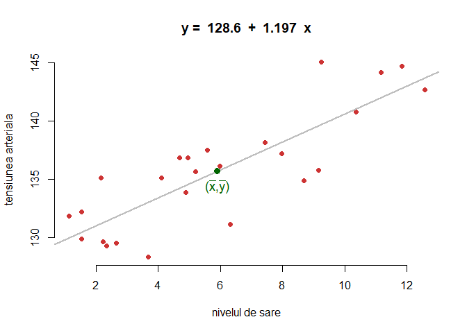

De asemenea pentru calculul estimatorului lui $\sigma$ ($\hat{\sigma}$) avem
  

```r
n = length(saltBP$BP)
e_hat = saltBP$BP - (b0+b1*saltBP$salt)

rss = sum(e_hat^2)

sigma_hat = sqrt(rss/(n-2))
sigma_hat
[1] 2.745374
```

sau cu ajutorul funcției `lm()`


```r
sqrt(deviance(saltBP_model)/df.residual(saltBP_model))
[1] 2.745374
```

sau încă 


```r
saltBP_model_summary = summary(saltBP_model)

saltBP_model_summary$sigma
[1] 2.745374
```


### Intervale de încredere pentru parametrii

Repartițiile lui $\hat\beta_0$ și $\hat\beta_1$ sunt 

$$
\hat\beta_0\sim\mathcal{N}\left(\beta_0,\mathrm{SE}(\hat\beta_0)^2\right),\quad\hat\beta_1\sim\mathcal{N}\left(\beta_1,\mathrm{SE}(\hat\beta_1)^2\right)
$$

unde 

$$
\mathrm{SE}(\hat\beta_0)^2=\frac{\sigma^2}{n}\left[1+\frac{\bar X^2}{s_x^2}\right],\quad \mathrm{SE}(\hat\beta_1)^2=\frac{\sigma^2}{ns_x^2}.
$$

Folosind estimatorul $\hat\sigma^2$ pentru $\sigma^2$ obținem că 

$$
\frac{\hat\beta_0-\beta_0}{\hat{\mathrm{SE}}(\hat\beta_0)}\sim t_{n-2},\quad\frac{\hat\beta_1-\beta_1}{\hat{\mathrm{SE}}(\hat\beta_1)}\sim t_{n-2}
$$

unde

$$
\hat{\mathrm{SE}}(\hat\beta_0)^2=\frac{\hat\sigma^2}{n}\left[1+\frac{\bar X^2}{s_x^2}\right],\quad \hat{\mathrm{SE}}(\hat\beta_1)^2=\frac{\hat\sigma^2}{ns_x^2}
$$

prin urmare, intervalele de încredere de nivel $1-\alpha$ pentru $\beta_0$ și $\beta_1$ sunt 

$$
IC = \left(\hat\beta_j\pm\hat{\mathrm{SE}}(\hat\beta_j)t_{n-2;1-\alpha/2}\right),\quad j=0,1.
$$

În R avem 


```r
alpha = 0.05

# trebuie avut grija ca functia var si sd se calculeaza 
# impartind la (n-1) si nu la n !!!

se_b0 = sqrt(sigma_hat^2*(1/n+mean(saltBP$salt)^2/((n-1)*var(saltBP$salt))))
se_b1 = sqrt(sigma_hat^2/((n-1)*var(saltBP$salt)))

lw_b0 = b0 - qt(1-alpha/2, n-2)*se_b0
up_b0 = b0 + qt(1-alpha/2, n-2)*se_b0

cat("CI pentru b0 este (", lw_b0, ", ", up_b0, ")\n")
CI pentru b0 este ( 126.337 ,  130.8958 )

lw_b1 = b1 - qt(1-alpha/2, n-2)*se_b1
up_b1 = b1 + qt(1-alpha/2, n-2)*se_b1
  
cat("CI pentru b1 este (", lw_b1, ", ", up_b1, ")")
CI pentru b1 este ( 0.8617951 ,  1.531993 )
```

Același rezultat se obține apelând funcția `confint()` :


```r
confint(saltBP_model)
                  2.5 %     97.5 %
(Intercept) 126.3369606 130.895834
salt          0.8617951   1.531993
```

Putem construi și o regiune de încredere pentru perechea $(\beta_0, \beta_1)$:


```r
# library(ellipse)

par(bty = "n")
confidenceEllipse(saltBP_model,
                  xlab = expression(beta[0]), 
                  ylab = expression(beta[1]),
                  col = "grey30") 
points(coef(saltBP_model)[1], coef(saltBP_model)[2], 
       pch = 18, col = "brown3",
       cex = 2)
abline(v = confint(saltBP_model)[1,], lty = 2)
abline(h = confint(saltBP_model)[2,], lty = 2)
```

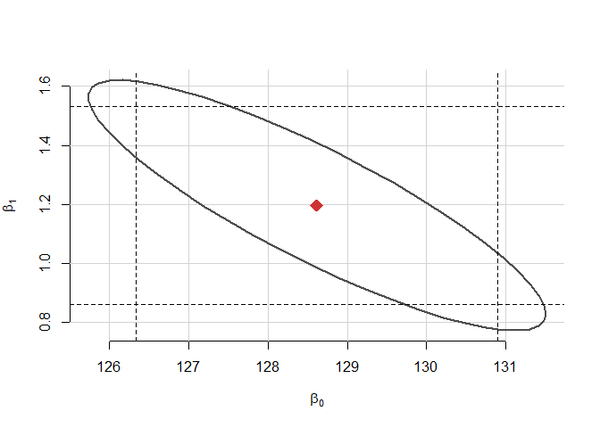

### ANOVA pentru regresie

Este predictorul $X$ folositor în prezicerea răspunsului $Y$ ? Vrem să testăm ipoteza nulă $H_0:\;\beta_1=0$. 

Introducem următoarele *sume de abateri pătratice*:

- $SS_T=\sum_{i=1}^n\left(Y_i-\bar Y\right)^2$, **suma abaterilor pătratice totală** (variația totală a lui $Y_1,\ldots,Y_n$).
- $SS_{reg}=\sum_{i=1}^n\left(\hat Y_i-\bar Y\right)^2$, **suma abaterilor pătratice de regresie** (variabilitatea explicată de dreapta de regresie)
- $RSS=\sum_{i=1}^n\left(Y_i-\hat Y_i\right)^2$, **suma abaterilor pătratice reziduale**

Avem următoarea descompunere ANOVA

$$
\underbrace{SS_T}_{\text{Variația lui }Y_i} = \underbrace{SS_{reg}}_{\text{Variația lui }\hat Y_i} + \underbrace{RSS}_{\text{Variația lui }\hat \varepsilon_i} 
$$

și tabelul ANOVA corespunzător


|  | Df | SS | MS | $F$ | $p$-value |
|--|------------|--------|---------|----------------|----------------|
| Predictor | $1$ | $SS_{reg}$ | $\frac{SS_{reg}}{1}$ | $\frac{SS_{reg}/1}{RSS/(n-2)}$ | $p$ |
| Residuuri | $n - 2$ | $RSS$ | $\frac{RSS}{n-2}$ | | |

Descompunerea ANOVA pentru problema noastră poate fi ilustrată astfel:

  a) *suma abaterilor pătratice totală*:


```r
plot(saltBP$salt, saltBP$BP, pch = 16, type = "n",
     main = paste("SST =", round(sum((saltBP$BP - mean(saltBP$BP))^2), 2)), 
     col.main = "brown4", 
     xlab = "nivelul de sare", 
     ylab = "tensiunea arteriala", 
     bty = "n")

abline(saltBP_model$coefficients, col = "grey30", lwd = 2)
abline(h = mean(saltBP$BP), col = "brown2", lty = 2)

segments(x0 = saltBP$salt, y0 = mean(saltBP$BP), 
         x1 = saltBP$salt, y1 = saltBP$BP, 
         col = "grey50", lwd = 2, lty = 2)

legend("topleft", 
       legend = expression("Dreapta de regresie", "Media esantionului " * bar(Y),
                                      (Y[i] - bar(Y))^2), 
       lwd = c(2, 1, 2),
       col = c("grey30", "brown2", "grey50"), 
       lty = c(1, 2, 2), 
       bty = "n")

points(saltBP$salt, saltBP$BP, pch = 16, col = "brown3")
```

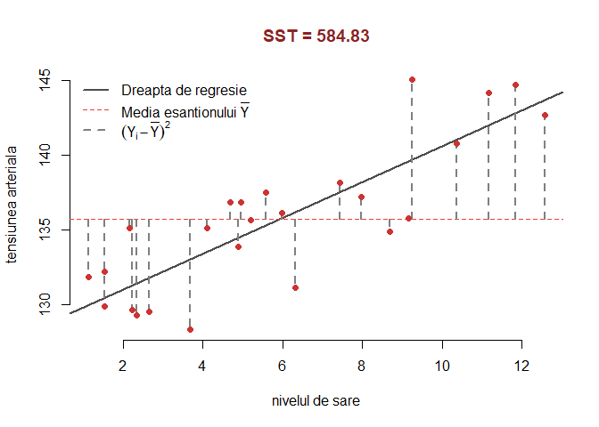

  b) *suma abaterilor pătratice de regresie*


```r
plot(saltBP$salt, saltBP$BP, pch = 16, type = "n",
     main = paste("SSreg =", 
                  round(sum((saltBP_model$fitted.values - mean(saltBP$BP))^2), 2)), 
     col.main = "forestgreen", 
     xlab = "nivelul de sare", 
     ylab = "tensiunea arteriala", 
     bty = "n")

abline(saltBP_model$coefficients, col = "grey30", lwd = 2)
abline(h = mean(saltBP$BP), col = "brown2", lty = 2)

segments(x0 = saltBP$salt, y0 = mean(saltBP$BP), 
         x1 = saltBP$salt, y1 = saltBP_model$fitted.values, 
         col = "forestgreen", lwd = 2, lty = 2)

points(saltBP$salt, saltBP_model$fitted.values, pch = 16, col = "forestgreen")

legend("topleft", 
       legend = expression("Dreapta de regresie", "Media esantionului " * bar(Y),
                                      (hat(Y)[i] - bar(Y))^2), 
       lwd = c(2, 1, 2),
       col = c("grey30", "brown2", "forestgreen"), 
       lty = c(1, 2, 2), 
       bty = "n")

points(saltBP$salt, saltBP$BP, pch = 16, col = "brown3")
```

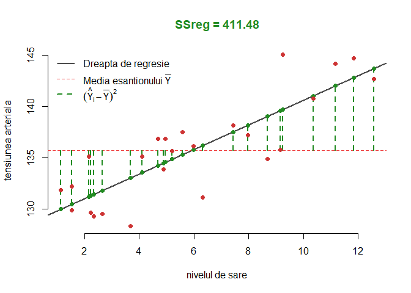

  c) *suma abaterilor pătratice reziduale*
  

```r
plot(saltBP$salt, saltBP$BP, pch = 16, type = "n",
     main = paste("RSS =", 
                  round(sum((saltBP$BP - saltBP_model$fitted.values)^2), 2)), 
     col.main = "orange", 
     xlab = "nivelul de sare", 
     ylab = "tensiunea arteriala", 
     bty = "n")

abline(saltBP_model$coefficients, col = "grey30", lwd = 2)

segments(x0 = saltBP$salt, y0 = saltBP$BP, 
         x1 = saltBP$salt, y1 = saltBP_model$fitted.values, 
         col = "orange", lwd = 2, lty = 2)

points(saltBP$salt, saltBP_model$fitted.values, pch = 16, col = "orange")

legend("topleft", 
       legend = expression("Dreapta de regresie", (hat(Y)[i] - Y[i])^2), 
       lwd = c(2, 2),
       col = c("grey30", "orange"), 
       lty = c(1, 2), 
       bty = "n")

points(saltBP$salt, saltBP$BP, pch = 16, col = "brown3")
```

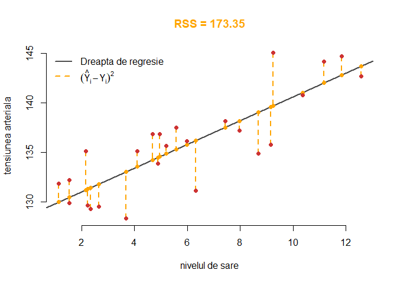

Tabelul ANOVA se obține prin 


```r
# tabel ANOVA 
anova(saltBP_model)
Analysis of Variance Table

Response: BP
          Df Sum Sq Mean Sq F value    Pr(>F)    
salt       1 411.48  411.48  54.594 1.631e-07 ***
Residuals 23 173.35    7.54                      
---
Signif. codes:  0 '***' 0.001 '**' 0.01 '*' 0.05 '.' 0.1 ' ' 1
```

Definiția *coeficientului de determinare* $R^2$ este strâns legată de descompunerea ANOVA:

$$
R^2 = \frac{SS_{reg}}{SS_T}=\frac{SS_T-RSS}{SS_T} = 1 - \frac{RSS}{SS_T}
$$

$R^2$ măsoară **proporția din variația** variabilei răspuns $Y$ **explicată** de variabila predictor $X$ prin regresie. Proporția din variația totală a lui $Y$ care nu este explicată este $1-R^2 = \frac{RSS}{SS_T}$. Intuitiv, $R^2$ măsoară cât de bine modelul de regresie este în concordanță cu datele (cât de strâns este norul de puncte în jurul dreptei de regresie). Observăm că dacă datele concordă *perfect* cu modelul (adică $RSS=0$) atunci $R^2=1$.

Putem vedea că $R^2=r_{xy}^2$, unde $r_{xy}$ este *coeficientul de corelație* empiric:

$$
r_{xy}=\frac{s_{xy}}{s_xs_y}=\frac{\sum_{i=1}^n \left(X_i-\bar X \right)\left(Y_i-\bar Y \right)}{\sqrt{\sum_{i=1}^n \left(X_i-\bar X \right)^2}\sqrt{\sum_{i=1}^n \left(Y_i-\bar Y \right)^2}}
$$

Mai mult se poate verifica și că $R^2=r^2_{y\hat y}$, adică *coeficientul de determinare este egal cu pătratul coeficientului de corelație empirică dintre $Y_1,\ldots,Y_n$ și $\hat Y_1,\ldots,\hat Y_n$*.

Verificăm relația $R^2=r^2_{xy}=r^2_{y\hat y}$ numeric:


```r
yHat = saltBP_model$fitted.values

saltBP_model_summary$r.squared # R^2
[1] 0.7035842
cor(saltBP$salt, saltBP$BP)^2 # corelatia^2 dintre x si y
[1] 0.7035842
cor(saltBP$BP, yHat)^2 # corelatia^2 dintre y si yHat
[1] 0.7035842
```


### Inferență asupra parametrilor

Este predictorul $X$ folositor în prezicerea răspunsului $Y$ ? Vrem să testăm ipoteza nulă $H_0:\;\beta_j=0$ (pentru $j=1$ spunem că predictorul `nivel de sare` nu are un efect *liniar* semnificativ asupra `tensiunii arteriale`). Pentru aceasta vom folosi statistica de test 

$$
t_j = \frac{\hat{\beta}_j}{\hat{SE}(\hat{\beta_j})}\sim_{H_0} t_{n-2}.
$$

Funcția `summary` ne întoarce $p$-valoarea corespunzătoare a acestor teste:


```r
summary(saltBP_model)

Call:
lm(formula = BP ~ salt, data = saltBP)

Residuals:
    Min      1Q  Median      3Q     Max 
-5.0388 -1.6755  0.3662  1.8824  5.3443 

Coefficients:
            Estimate Std. Error t value Pr(>|t|)    
(Intercept)  128.616      1.102 116.723  < 2e-16 ***
salt           1.197      0.162   7.389 1.63e-07 ***
---
Signif. codes:  0 '***' 0.001 '**' 0.01 '*' 0.05 '.' 0.1 ' ' 1

Residual standard error: 2.745 on 23 degrees of freedom
Multiple R-squared:  0.7036,	Adjusted R-squared:  0.6907 
F-statistic: 54.59 on 1 and 23 DF,  p-value: 1.631e-07
```

Observăm că ambele ipoteze sunt respinse în favoarea alternativelor bilaterale (la aceeași concluzie am ajuns și utitându-ne la intervalele de încredere - nu conțineau valoarea $0$). Putem observa că $t_1^2$ este exact valoarea $F$ statisticii, deci cele două abordări ne dau aceleași rezultate numerice. 

### Predicție

Pentru un nou set de predictori, $x_0$, răspunsul prognozat este $\hat{y} = \hat{\beta}_0+\hat{\beta}_1 x_0$ și vrem să investigăm incertitudinea din această predicție. Putem face distincția între două tipuri de predicție: predicție asupra răspunsului viitor mediu (inferență asupra mediei condiționate $\mathbb{E}[Y|X=x_0]$) sau predicție asupra observațiilor viitoare (inferență asupra răspunsului condiționat $Y|X=x_0$). 

Un interval de încredere pentru răspunsul viitor mediu este:

$$
\left(\hat y \pm t_{n-2;1-\alpha/2}\sqrt{\frac{\hat\sigma^2}{n}\left(1+\frac{(x_0-\bar x)^2}{s_x^2}\right)}\right)
$$

Un interval de încredere pentru valoarea prezisă (interval de predicție) este:

$$
\left(\hat y \pm t_{n-2;1-\alpha/2}\sqrt{\hat\sigma^2+\frac{\hat\sigma^2}{n}\left(1+\frac{(x_0-\bar x)^2}{s_x^2}\right)}\right)
$$

Pentru a găsi aceste intervale vom folosi funcția `predict()`:


```r
newData = data.frame(salt = 14)
newData2 = data.frame(salt = c(13, 14, 15))

# Predictie
predict(saltBP_model, newdata = newData)
       1 
145.3729 

# Predictie pentru valoarea raspunsului mediu
predict(saltBP_model, newdata = newData, interval = "confidence")
       fit      lwr     upr
1 145.3729 142.4298 148.316
predict(saltBP_model, newdata = newData2, interval = "confidence")
       fit      lwr      upr
1 144.1760 141.5389 146.8132
2 145.3729 142.4298 148.3160
3 146.5698 143.3150 149.8246

# Predictie asupra observatiilor viitoare
predict(saltBP_model, newdata = newData, interval = "prediction")
       fit      lwr      upr
1 145.3729 138.9764 151.7695
predict(saltBP_model, newdata = newData2, interval = "prediction")
       fit      lwr      upr
1 144.1760 137.9144 150.4377
2 145.3729 138.9764 151.7695
3 146.5698 140.0240 153.1156
```

Nivelul de sare prezis impreună cu intervalul de încredere de nivel 95% pentru răspunsul mediu este ilustrat în figura următoare


```r
g = seq(1,15,0.5)

p = predict(saltBP_model, data.frame(salt = g), se = T, interval = "confidence")
matplot(g, p$fit, type = "l", lty = c(1,2,2), 
        lwd = c(2,1,1),
        col = c("grey30", "grey50", "grey50"),
        xlab = "nivelul de sare",
        ylab = "tensiunea arteriala",
        bty = "n")
rug(saltBP$salt)
points(saltBP$salt, saltBP$BP, col = "brown3", pch = 16)
abline(v = mean(saltBP$salt), lty = 3, col = "grey65")

# Scheffe's bounds
M = sqrt(2*qf(1-alpha, 2, n-2))

s_xx = (n-1)*var(saltBP$salt)
lw_scheffe = b0 + b1*g - M*sigma_hat*sqrt(1/n+(g-mean(saltBP$salt))^2/s_xx)
up_scheffe = b0 + b1*g + M*sigma_hat*sqrt(1/n+(g-mean(saltBP$salt))^2/s_xx)

lines(g, lw_scheffe, lty = 4, col = "brown4")
lines(g, up_scheffe, lty = 4, col = "brown4")

# Bonferroni bounds
# x0 = c(7, 8, 13, 14)
x0 = 1 + 14*runif(6)
m = length(x0)

t_bonf = qt(1-alpha/(2*m), n-2)

lw_bonf = b0 + b1*x0 - t_bonf*sigma_hat*sqrt(1/n+(x0-mean(saltBP$salt))^2/s_xx)
up_bonf = b0 + b1*x0 + t_bonf*sigma_hat*sqrt(1/n+(x0-mean(saltBP$salt))^2/s_xx)

segments(x0 = x0, y0 = lw_bonf, x1 = x0, y1 = up_bonf, col = "orange", lty = 5)
segments(x0 = x0-0.25, y0 = lw_bonf, x1 = x0+0.25, y1 = lw_bonf, 
         col = "orange", lty = 1)
segments(x0 = x0-0.25, y0 = up_bonf, x1 = x0+0.25, y1 = up_bonf, 
         col = "orange", lty = 1)

legend("topleft", legend = c("Dreapta de regresie", "95% t interval", 
                                      "95% Scheffe interval", 
                             paste0(m, " intervale Bonferroni (95%)")), 
       lwd = c(2, 1, 1, 1),
       col = c("grey30", "grey50", "brown4", "orange"), 
       lty = c(1, 2, 4, 5), 
       bty = "n")
```


### Diagnostic

În această secțiune vom vedea dacă setul nostru de date verifică ipotezele modelului de regresie liniară. 

  a) *Independența*
  
Ipoteza de independență a variabilei răspuns (prin urmare și a erorilor) reiese, de cele mai multe ori, din modalitatea în care s-a desfășurat experimentul.

  b) *Normalitatea*
  
Pentru a verifica dacă ipoteza de normalitate a erorilor este satisfăcută vom trasa dreapta lui Henry (sau Q-Q plot-ul):


```r
# library(car)
par(bty = "n")
qqPlot(saltBP_model, col = "brown3", col.lines = "grey50", pch = 16,
       simulate = TRUE,
       xlab = "Cuantile teoretice",
       ylab = "Reziduuri studentizate", 
       main = "Q-Q plot (Dreapta lui Henry)",
       bty = "n")
```

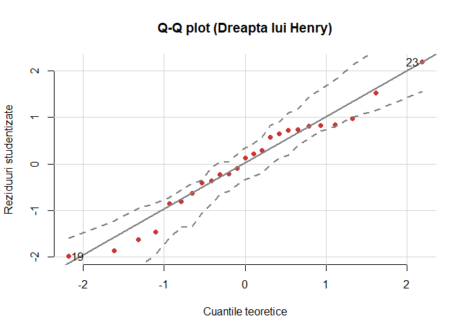

```
[1] 19 23
```

Putem folosi și testul `Shapiro-Wilk`:


```r
shapiro.test(residuals(saltBP_model))

	Shapiro-Wilk normality test

data:  residuals(saltBP_model)
W = 0.96871, p-value = 0.6125
```


  c) *Homoscedasticitatea*
  
Pentru a verifica proprietatea de homoscedasticitate a erorilor vom trasa un grafic al reziduurilor versus valorile prezise (fitted), i.e. $\hat{\varepsilon}$ vs $\hat{y}$. Dacă avem homoscedasticitate a erorilor atunci ar trebui să vedem o variație constantă pe verticală ($\hat{\varepsilon}$).


```r
plot(residuals(saltBP_model)~fitted(saltBP_model),  col = "brown3", pch = 16, 
     xlab = "Valori prezise (fitted)",
     ylab = "Reziduuri", 
     main = "Reziduuri vs Valori prezise",
     bty = "n")

abline(h = 0, col = "grey30")
```

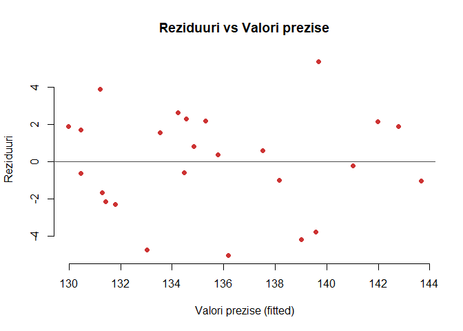

Tot în acest grafic putem observa dacă ipoteza de liniaritate este verificată (în caz de liniaritate între variabila răspuns și variabila cauză nu are trebui să vedem o relație sistematică între reziduuri și valorile prezise - ceea ce se și întâmplă în cazul nostru) ori dacă există o altă legătură structurală între variabila dependentă (răspuns) și cea independentă (predictor).


# Regresie liniară multiplă


Modelul de regresie liniară multiplă reprezintă o generalizare a modelului de regresie simplă. Dacă în regresia liniară simplă se folosea o singură variabilă predictor $X$ ca să explice variabila răspuns $Y$, în modelul de regresie liniară multiplă se folosesc mai multe variabile predictor $X_1,\ldots,X_k$ pentru a explica răspunsul $Y$:

$$
\mathbb{E}[Y|X_1 = x_1, \ldots, X_k=x_x]=\beta_0+\beta_1x_1+\beta_2x_2+\ldots+\beta_kx_k
$$
sau altfel scris

$$
Y = \beta_0 + \beta_1 X_1 + \ldots + \beta_k X_k + \varepsilon.
$$

Date fiind observațiile actuale, cu alte cuvinte dat fiind un eșantion $(X_{11},\ldots,X_{1k},Y_1),\ldots,(X_{n1},\ldots,X_{nk},Y_n)$ al lui $(X_1,\ldots,X_k,Y)$, unde $X_{ij}$ reprezintă a $i$-a observație a predictorului $X_j$, modelul se poate scrie 

$$
y_i = \beta_0+\beta_1x_{i1}+\beta_2x_{i2}+\ldots+\beta_kx_{ik}+\varepsilon_i, \quad i = 1,\ldots,n
$$

a cărui formă compactă (matriceală) este

$$
\mathbf{Y}=\mathbf{X}\boldsymbol\beta+\boldsymbol\varepsilon
$$

  - $\mathbf{X}$ este *matricea de design*
  
$$
\mathbf{X}=\begin{pmatrix}
1 & X_{11} & \cdots & X_{1k}\\
\vdots & \vdots & \ddots & \vdots\\
1 & X_{n1} & \cdots & X_{nk}
\end{pmatrix}_{n\times(k+1)}
$$

  - $\mathbf{Y}$ este *vectorul răspuns*, $\boldsymbol\beta$ este *vectorul coeficienților* iar $\boldsymbol\varepsilon$ este *vectorul eroare*
  
$$
\mathbf{Y}=\begin{pmatrix}
Y_1 \\
\vdots \\
Y_n
\end{pmatrix}_{n\times 1},\quad\boldsymbol\beta=\begin{pmatrix}
\beta_0 \\
\beta_1 \\
\vdots \\
\beta_k
\end{pmatrix}_{(k+1)\times 1}\text{ și }\quad
\boldsymbol\varepsilon=\begin{pmatrix}
\varepsilon_1 \\
\vdots \\
\varepsilon_n
\end{pmatrix}_{n\times 1}.
$$

\BeginKnitrBlock{rmdinsight}<div class="rmdinsight">Să observăm că pentru $k=1$ modelul se reduce la regresia liniară simplă. În acest caz:

$$
\mathbf{X}=\begin{pmatrix}
1 & X_{11}\\
\vdots & \vdots\\
1 & X_{n1}
\end{pmatrix}_{n\times2}\text{ și }\quad \beta=\begin{pmatrix}
\beta_0 \\
\beta_1 
\end{pmatrix}_{2\times 1}
$$</div>\EndKnitrBlock{rmdinsight}

*Suma abaterilor pătratice reziduale* pentru modelul de regresie liniară multiplă este 

$$
RSS(\boldsymbol\beta)=\sum_{i=1}^n(Y_i-\beta_0-\beta_1X_{i1}-\ldots-\beta_kX_{ik})^2=(\mathbf{Y}-\mathbf{X}\boldsymbol{\beta})^T(\mathbf{Y}-\mathbf{X}\boldsymbol{\beta})
$$

ceea ce conduce la *sistemul de ecuații normale* 

$$
\mathbf{X}^\intercal\mathbf{X}\hat{\boldsymbol{\beta}}=\mathbf{X}^\intercal\mathbf{Y}
$$

a cărui soluție, dat fiind că $\mathbf{X}^\intercal\mathbf{X}$ este inversabilă, este 

$$
\hat{\boldsymbol{\beta}}=(\mathbf{X}^\intercal\mathbf{X})^{-1}\mathbf{X}^\intercal\mathbf{Y}
$$

Odată ce avem estimatorul $\hat{\boldsymbol{\beta}}$, putem defini:

- *valorile prognozate* (*fitted values*) $\hat Y_1,\ldots,\hat Y_n$ (valorile verticale pe hiperplanul de regresie), unde

$$
\hat Y_i=\hat\beta_0+\hat\beta_1X_{i1}+\cdots+\hat\beta_kX_{ik},\quad i=1,\ldots,n
$$

și sub formă matriceală 

$$
\hat{\mathbf{Y}}=\mathbf{X}\hat{\boldsymbol{\beta}}=\mathbf{X}(\mathbf{X}^\intercal\mathbf{X})^{-1}\mathbf{X}^\intercal\mathbf{Y}=\mathbf{H}\mathbf{Y}
$$

unde $\mathbf{H}=\mathbf{X}(\mathbf{X}^\intercal\mathbf{X})^{-1}\mathbf{X}^\intercal$ se numește *matricea căciulă* (*hat matrix*) și reprezintă proiecția ortogonală a lui $\mathbf{Y}$ în spațiul generat de $\mathbf{X}$.

- *reziduurile estimate* (*estimated residuals*) $\hat \varepsilon_1,\ldots,\hat \varepsilon_n$, unde

$$
\hat\varepsilon_i=Y_i-\hat Y_i,\quad i=1,\ldots,n
$$

și sub formă matriceală 

$$
\hat{\boldsymbol\varepsilon} = \boldsymbol Y - \hat{\boldsymbol Y} = (\boldsymbol I-\boldsymbol H)\boldsymbol Y
$$

În figura de mai jos ilustrăm planul de regresie (albastru) și relația cu regresiile liniare simple (liniile verzi). Punctele roșii reprezintă un eșantion pentru $(X_1,X_2,Y)$ iar punctele negre sunt subeșantioane pentru $(X_1,X_2)$ (la bază), $(X_1,Y)$ (stânga) și $(X_2,Y)$ (dreapta).

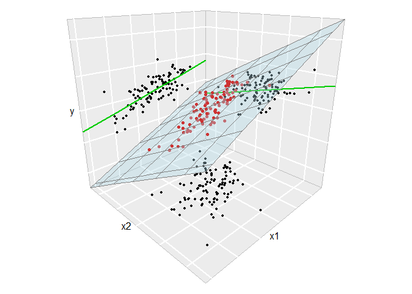

Ipotezele modelului sunt: 

i. **Linearitatea**: $\mathbb{E}[Y|X_1=x_1,\ldots,X_k=x_k]=\beta_0+\beta_1x_1+\ldots+\beta_kx_k$
ii. **Homoscedasticitatea**: $\mathbb{V}\text{ar}(\varepsilon_i)=\sigma^2$, cu $\sigma^2$ constantă pentru $i=1,\ldots,n$
iii. **Normalitatea**: $\varepsilon_i\sim\mathcal{N}(0,\sigma^2)$ pentru $i=1,\ldots,n$
iv. **Independența erorilor**: $\varepsilon_1,\ldots,\varepsilon_n$ sunt independente (sau necorelate, $\mathbb{E}[\varepsilon_i\varepsilon_j]=0$, $i\neq j$, deoarece sunt presupuse normale)

Altfel spus 

$$
Y|(X_1=x_1,\ldots,X_k=x_k)\sim \mathcal{N}(\beta_0+\beta_1x_1+\ldots+\beta_kx_k,\sigma^2)
$$

În figura de mai jos afișam planul de regresie. Spațiul dintre cele două plane galbene arată unde se află 95% din observații (după modelul ales).

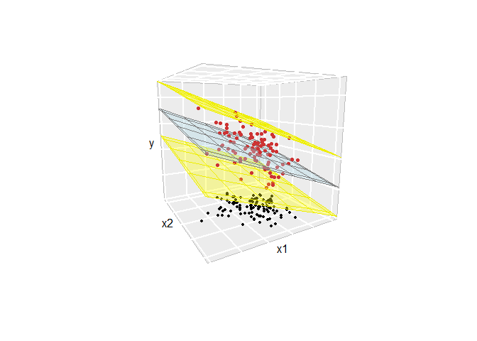

Estimatorul pentru $\sigma^2$ este 

$$
\hat{\sigma}^2 = \frac{RSS(\hat{\beta}_0,\hat{\beta}_1,\ldots, \hat{\beta}_k))}{n-(k+1)} = \frac{\hat{\boldsymbol \varepsilon}^\intercal\hat{\boldsymbol \varepsilon}}{n-(k+1)} = \frac{\sum_{i=1}^{n}\hat{\varepsilon}_i^2}{n-(k+1)}.
$$

## Aplicație

Această aplicație este bazată pe articolul [@Johnson1973]. 

\BeginKnitrBlock{rmdexercise}<div class="rmdexercise">Considerăm setul de date [galapagos](dataIn/galapagos.csv) care conține informații despre numărul de specii de broaște țestoase din diferite insule din arhipelagul Galapagos. Setul conține date din 30 de insule despre numărul de specii de țestoase (`Species`), numărul de specii endemice (`Endemics`), suprafața insulei (`Area`), înălțimea maximă a insulei (``Elevation`), distanța la cea mai apropiată insulă (`Nearest`), distanța față de insula Snata Cruz (`Scruz`) și suprafața insulei adiacente (`Adjacent`). Vrem să investigăm relația liniară dintre numărul de specii și celelalte variabile.

</div>\EndKnitrBlock{rmdexercise}

Începem prin a citi datele 


```r
# gala = read.csv("data/galapagos.csv", row.names = 1)

data("gala") # este nevoie de libraria faraway
head(gala)
             Species Endemics  Area Elevation Nearest Scruz Adjacent
Baltra            58       23 25.09       346     0.6   0.6     1.84
Bartolome         31       21  1.24       109     0.6  26.3   572.33
Caldwell           3        3  0.21       114     2.8  58.7     0.78
Champion          25        9  0.10        46     1.9  47.4     0.18
Coamano            2        1  0.05        77     1.9   1.9   903.82
Daphne.Major      18       11  0.34       119     8.0   8.0     1.84
```

Considerăm modelul de regresie liniară multiplă cu 5 predictori:


```r
gala_model = lm(Species ~ Area + Elevation + Nearest + Scruz + Adjacent, data=gala)

gala_model_summary = summary(gala_model)
gala_model_summary

Call:
lm(formula = Species ~ Area + Elevation + Nearest + Scruz + Adjacent, 
    data = gala)

Residuals:
     Min       1Q   Median       3Q      Max 
-111.679  -34.898   -7.862   33.460  182.584 

Coefficients:
             Estimate Std. Error t value Pr(>|t|)    
(Intercept)  7.068221  19.154198   0.369 0.715351    
Area        -0.023938   0.022422  -1.068 0.296318    
Elevation    0.319465   0.053663   5.953 3.82e-06 ***
Nearest      0.009144   1.054136   0.009 0.993151    
Scruz       -0.240524   0.215402  -1.117 0.275208    
Adjacent    -0.074805   0.017700  -4.226 0.000297 ***
---
Signif. codes:  0 '***' 0.001 '**' 0.01 '*' 0.05 '.' 0.1 ' ' 1

Residual standard error: 60.98 on 24 degrees of freedom
Multiple R-squared:  0.7658,	Adjusted R-squared:  0.7171 
F-statistic:  15.7 on 5 and 24 DF,  p-value: 6.838e-07
```

### Estimarea parametrilor

Pentru început extragem matricea de design $X$


```r
X = model.matrix( ~ Area + Elevation + Nearest + Scruz + Adjacent, 
    data = gala)

head(X)
             (Intercept)  Area Elevation Nearest Scruz Adjacent
Baltra                 1 25.09       346     0.6   0.6     1.84
Bartolome              1  1.24       109     0.6  26.3   572.33
Caldwell               1  0.21       114     2.8  58.7     0.78
Champion               1  0.10        46     1.9  47.4     0.18
Coamano                1  0.05        77     1.9   1.9   903.82
Daphne.Major           1  0.34       119     8.0   8.0     1.84
```

și răspunsul $y$


```r
y = gala$Species
```

Vrem să găsim $\hat{\boldsymbol{\beta}}=(\mathbf{X}^\intercal\mathbf{X})^{-1}\mathbf{X}^\intercal\mathbf{Y}$


```r
# determinam (\mathbf{X}^\intercal\mathbf{X})^{-1}

xtxi = solve(t(X) %*% X) # t() - este transpusa
                         # %*% - produsul matriceal
                         # solve() - calculeaza pseudoinversa

bHat = xtxi %*% t(X) %*% y
bHat
                    [,1]
(Intercept)  7.068220709
Area        -0.023938338
Elevation    0.319464761
Nearest      0.009143961
Scruz       -0.240524230
Adjacent    -0.074804832
```

sau alternativ folosind ecuațiile normalw


```r
solve(crossprod(X,X), crossprod(X,y)) # crossprod calculeaza X^Ty
                    [,1]
(Intercept)  7.068220709
Area        -0.023938338
Elevation    0.319464761
Nearest      0.009143961
Scruz       -0.240524230
Adjacent    -0.074804832
```

Estimatorul pentru $\sigma^2$ este dat de 


```r
sHat = sqrt(deviance(gala_model)/df.residual(gala_model))
sHat
[1] 60.97519
```


sau încă de 


```r
gala_model_summary$sigma
[1] 60.97519
```

Dacă vrem să determinăm erorile standard ale coeficienților, i.e. $\hat{\mathrm{SE}}(\hat\beta_i)$, să observăm pentru început că acestea sunt date de următoarea formulă 

$$
\hat{\mathrm{SE}}(\hat\beta_{i-1}) = \hat{\sigma}\sqrt{(\mathbf{X}^\intercal\mathbf{X})^{-1}_{ii}}
$$

unde $(\mathbf{X}^\intercal\mathbf{X})^{-1}_{ii}$ reprezintă elementul $i$ de pe diagonala matricii $(\mathbf{X}^\intercal\mathbf{X})^{-1}$. Avem


```r
seBHat = sHat*sqrt(diag(xtxi))
seBHat
(Intercept)        Area   Elevation     Nearest       Scruz    Adjacent 
19.15419782  0.02242235  0.05366280  1.05413595  0.21540225  0.01770019 
```

sau folosind modelul sumarizat 


```r
gala_model_summary$coefficients[, 2]
(Intercept)        Area   Elevation     Nearest       Scruz    Adjacent 
19.15419782  0.02242235  0.05366280  1.05413595  0.21540225  0.01770019 
```

### Inferență asupra parametrilor 

Având mai mulți predictori pentru o variabilă răspuns, ne întrebăm dacă avem nevoie de toți. Fie $\Theta$ spațiul parametrilor pentru un model mai mare și $\Theta_0$ spațiul parametrilor pentru un model mai mic ($\Theta_0\subset \Theta$). Dacă nu avem o diferență prea mare între concordanța celor două modele atunci îl preferăm pe cel mai simplu. Testul bazat pe raportul de verosimilități ($H_0: \theta\in \Theta_0$ vs $H_1: \theta\in\Theta$) conduce la respingerea ipotezei nule în cazul în care raportul 

$$
\frac{RSS_{\Theta_0}-RSS_{\Theta}}{RSS_{\Theta}}
$$

este suficient de mare. Dacă spațiul parametrilor $\Theta$ are dimensiunea $p$ (la noi $k+1$) iar spațiul parametrilor modelului redus $\Theta_0$ are dimensiunea $q$ atunci 

$$
F = \frac{\frac{RSS_{\Theta_0}-RSS_{\Theta}}{(p-q)}}{\frac{RSS_{\Theta}}{n-p}} = \frac{\frac{RSS_{\Theta_0}-RSS_{\Theta}}{(df_{\Theta_0}-df_{\Theta})}}{\frac{RSS_{\Theta}}{df_{\Theta}}} \sim F_{p-q,n-p}.
$$

unde $df_{\Theta_0}=n-q$ iar $df_{\Theta} = n-p$ (gradele de libertate sunt în general numărul de observații minus numărul de parametrii ai modelului).

  a) Test asupra tuturor predictorilor
  
Să presupunem că vrem să testăm ipoteza nulă 

$$
H_0: \beta_1 = \cdots = \beta_k = 0
$$

cu alte cuvinte vrem să răspundem la întrebarea dacă vreuna din variabilele explicative este folositoare în prezicerea răspunsului. În această situație modelul (complet $\Theta$) este $\boldsymbol y = \boldsymbol X\boldsymbol \beta+\boldsymbol\varepsilon$ și are $k+1$ parametrii ($k+1$ coeficienți $\beta_i$) iar modelul redus ($\Theta_0$) este $\boldsymbol y = \boldsymbol \mu+\boldsymbol\varepsilon$ și are $1$ parametru ($\beta_0$). Prin urmare avem statistica $F$ 

$$
F = \frac{\frac{RSS_{\Theta_0}-RSS_{\Theta}}{(k+1-1)}}{\frac{RSS_{\Theta}}{n-(k+1)}} = \frac{\frac{SS_{T}-RSS}{k}}{\frac{RSS}{n-(k+1)}}= \frac{\frac{SS_{reg}}{k}}{\frac{RSS}{n-(k+1)}}\sim F_{k,n-(k+1)}
$$

unde $RSS$ este suma abaterilor pătratice reziduale, $SS_T=(\boldsymbol y - \bar{\boldsymbol y})^\intercal(\boldsymbol y - \bar{\boldsymbol y})$ este suma abaterilor pătratice totale iar $SS_{reg}=SS_{T}-RSS$ este suma abaterilor de regresie, ceea ce conduce la tabelul ANOVA 

|  | Df | SS | MS | $F$ | $p$-value |
|--|------------|--------|---------|----------------|----------------|
| Regresie | $k$ | $SS_{reg}$ | $\frac{SS_{reg}}{k}$ | $F=\frac{SS_{reg}/k}{RSS/(n-(k+1))}$ | $p$ |
| Residuuri | $n - (k+1)$ | $RSS$ | $\frac{RSS}{n-(k+1)}$ | | |
| Total | $n-1$ | $SS_{T}$ | | | |

Chiar dacă ipoteza nulă a fost respinsă asta nu înseamnă că modelul dat de alternativă este cel mai bun (nu știm dacă toți predictorii sunt necesari în model sau doar o parte dintre ei). 

Pentru setul nostru de date să considerăm modelul nul (cel ce corespunde lui $\Theta_0$)


```r
gala_null_model = lm(Species ~ 1, data = gala)
```

Tabelul ANOVA este dat de 


```r
anova(gala_model, gala_null_model)
Analysis of Variance Table

Model 1: Species ~ Area + Elevation + Nearest + Scruz + Adjacent
Model 2: Species ~ 1
  Res.Df    RSS Df Sum of Sq      F    Pr(>F)    
1     24  89231                                  
2     29 381081 -5   -291850 15.699 6.838e-07 ***
---
Signif. codes:  0 '***' 0.001 '**' 0.01 '*' 0.05 '.' 0.1 ' ' 1
```

Observăm că ipoteza nulă este respinsă în acest caz în favoarea alternativei (p valoarea este aproximativ $6.8\times 10^{-7}$).

Putem calcula această p-valoare și fără a apela la ajutorul funcției `anova`:


```r
# pentru modelul redus 
RSS0 = deviance(gala_null_model)
df0 = df.residual(gala_null_model)

# pentru modelul intreg
RSS = deviance(gala_model)
df = df.residual(gala_model)

# statistica F

Fstat = ((RSS0 - RSS)/(df0 - df))/(RSS/df)

1-pf(Fstat, df0-df, df)
[1] 6.837893e-07
```

  b) Test asupra unui predictor
  
Să presupunem acum că vrem să testăm dacă putem exclude din model un anumit predictor $i$ (fixat). Prin urmare vrem să testăm ipoteza nulă 

$$
H_0:\beta_i=0
$$

Considerăm modelul întreg $\Theta$ în care avem toți predictorii și modelul redus $\Theta_0$ în care avem toți predictorii mai puțin predictorul $i$ (în cazul problemei noastre o să testăm să vedem dacă putem exclude sau nu variabila explicativă `Area`):


```r
gala_Area_model = lm(Species ~ Elevation + Nearest + Scruz + Adjacent, 
    data = gala)

anova(gala_model, gala_Area_model)
Analysis of Variance Table

Model 1: Species ~ Area + Elevation + Nearest + Scruz + Adjacent
Model 2: Species ~ Elevation + Nearest + Scruz + Adjacent
  Res.Df   RSS Df Sum of Sq      F Pr(>F)
1     24 89231                           
2     25 93469 -1   -4237.7 1.1398 0.2963
```

Observăm că nu putem respinge ipoteza nulă (p valoarea $>0.05$).

O abordare alternativă constă în folosirea statisticii de test 

$$
t_i = \frac{\hat\beta_i}{\hat{\mathrm{SE}}(\hat\beta_j)}\sim_{H_0} t_{n-k-1}
$$

care verifică relația $t_i^2 = F$. Putem vedea statistica student în output-ul funcției `summary`:


```r
gala_model_summary$coefficients
                Estimate  Std. Error      t value     Pr(>|t|)
(Intercept)  7.068220709 19.15419782  0.369016796 7.153508e-01
Area        -0.023938338  0.02242235 -1.067610554 2.963180e-01
Elevation    0.319464761  0.05366280  5.953187968 3.823409e-06
Nearest      0.009143961  1.05413595  0.008674366 9.931506e-01
Scruz       -0.240524230  0.21540225 -1.116628222 2.752082e-01
Adjacent    -0.074804832  0.01770019 -4.226216850 2.970655e-04
```

  c) Test pentru o pereche de predictori
  
Să presupunem că vrem să testăm dacă suprafața insulei curente sau a insulei adiacente au vreo relație relativ la variabila răspuns. Prin urmare vrem să testăm ipoteza nulă (**să ținem cont că trebuie să specificăm care sunt toți predictorii !**)

$$
H_0:\beta_i=\beta_j=0\quad(\beta_{Area}=\beta_{Adjacent}=0)
$$

Putem testa această ipoteză folosind procedura descrisă anterior:


```r
gala_Area_Adjacent_model = lm(Species ~ Elevation + Nearest + Scruz, 
    data = gala)

anova(gala_Area_Adjacent_model, gala_model)
Analysis of Variance Table

Model 1: Species ~ Elevation + Nearest + Scruz
Model 2: Species ~ Area + Elevation + Nearest + Scruz + Adjacent
  Res.Df    RSS Df Sum of Sq      F  Pr(>F)   
1     26 158292                               
2     24  89231  2     69060 9.2874 0.00103 **
---
Signif. codes:  0 '***' 0.001 '**' 0.01 '*' 0.05 '.' 0.1 ' ' 1
```

Observăm că ipoteza nulă este respinsă deoarece p-valoarea este mică (prin urmare excluderea celor doi predictori nu este justificată).

### Intervale de încredere pentru parametrii

Cum repartiția lui $\hat{\boldsymbol{\beta}}$ este:

$$
\hat{\boldsymbol{\beta}}\sim\mathcal{N}_{k+1}\left(\boldsymbol\beta,\sigma^2(\mathbf{X}^T\mathbf{X})^{-1}\right)
$$

atunci estimatorul $\hat\sigma^2$ pentru $\sigma^2$ obținem că

$$
\frac{\hat\beta_j-\beta_j}{\hat{\mathrm{SE}}(\hat\beta_j)}\sim t_{n-(k+1)}
$$

iar un interval de încredere de nivel $1-\alpha$ pentru parametrul $\beta_j$ este

$$
IC = \left(\hat\beta_j\pm\hat{\mathrm{SE}}(\hat\beta_j)t_{n-2;1-\alpha/2}\right)
$$

Putem construi intervale de încredere pentru parametrii folosind funcția `confint`:


```r
confint(gala_model)
                  2.5 %      97.5 %
(Intercept) -32.4641006 46.60054205
Area         -0.0702158  0.02233912
Elevation     0.2087102  0.43021935
Nearest      -2.1664857  2.18477363
Scruz        -0.6850926  0.20404416
Adjacent     -0.1113362 -0.03827344
```

Dacă vrem să construim o regiune de încredere pentru mai mult de un parametru atunci putem să folosim relația:

$$
(\hat{\boldsymbol \beta} - \boldsymbol \beta)^\intercal\boldsymbol X^\intercal \boldsymbol X (\hat{\boldsymbol \beta} - \boldsymbol \beta)\leq (k+1)\hat{\boldsymbol \sigma}^2F_{k+1, n-(k+1)}^{1-\alpha}
$$

care reprezintă o regiune de încredere pentru $\boldsymbol \beta$.

De exemplu vrem să construim o regiune de încredere pentru perechea $(\beta_{Area},\beta_{Adjacent})$:


```r
par(bty = "n")
confidenceEllipse(gala_model, which.coef = c(2,6),
                  xlab = "Area", 
                  ylab = "Adjacent",
                  col = "grey30",
                  ylim = c(-0.15,0.005)) 
points(0, 0, pch = 18, col = "brown3",
       cex = 2)
abline(v = confint(gala_model)[2,], lty = 2)
abline(h = confint(gala_model)[6,], lty = 2)
```

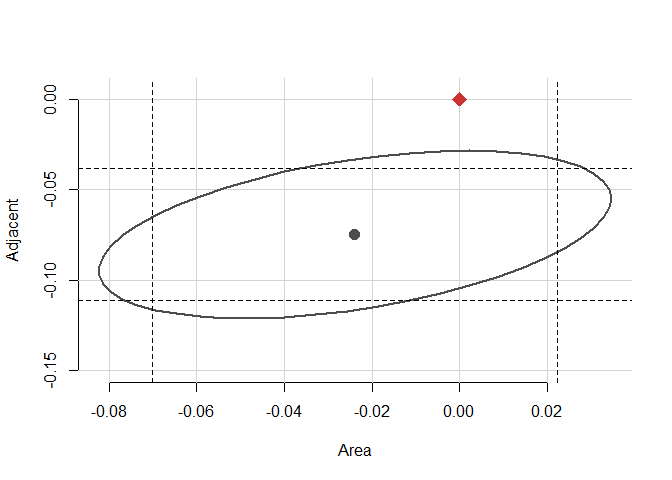

Cum punctul $(0,0)$ nu aparține regiunii elipsoidale atunci putem respinge ipoteza nulă $H_0:\beta_{Area}=\beta_{Adjacent}=0$.


# Referințe

