<script>
$(document).ready(function ()  {

    // move toc-ignore selectors from section div to header
    $('div.section.toc-ignore')
        .removeClass('toc-ignore')
        .children('h1,h2,h3,h4,h5').addClass('toc-ignore');

    // establish options
    var options = {
      selectors: "h1,h2,h3",
      theme: "bootstrap3",
      context: '.toc-content',
      hashGenerator: function (text) {
        return text.replace(/[.\\/?&!#<>]/g, '').replace(/\s/g, '_').toLowerCase();
      },
      ignoreSelector: ".toc-ignore",
      scrollTo: 60
    };
    options.showAndHide = false;
    options.smoothScroll = true;

    // tocify
    var toc = $("#TOC").tocify(options).data("toc-tocify");
});
</script>

Obiectivul acestui laborator este de a prezenta o scurtă introducere în programul [R](https://cran.r-project.org/) (cu ajutorul interfeței grafice [RStudio](https://www.rstudio.com/)). O descriere detaliată a acestui program precum și versiunile disponibile pentru descărcat se găsesc pe site-ul [`www.r-project.org`](http://www.r-project.org).


# Introducere 

Programul `R` este un program **gratuit** destinat, cu precădere, analizei statistice și prezintă o serie de avantaje:

  * rulează aproape pe toate platformele și sistemele de operare 
  * permite folosirea metodelor statistice clasice cu ajutorul unor funcții predefinite
  * este adoptat ca limbaj de analiză statistică în majoritatea domeniilor aplicate
  * prezintă capabilități grafice deosebite
  * permite utilizarea tehnicilor statistice de ultimă oră prin intermediul pachetelor dezvoltate de comunitate (în prezent sunt mai mult de 10000 de pachete) 
  * are o comunitate foarte activă și în continuă creștere 
  
<div class="figure" style="text-align: center">
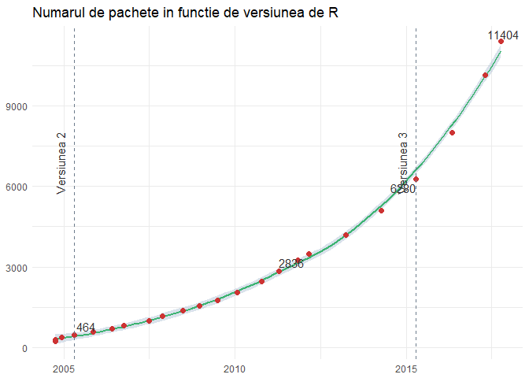
<p class="caption">Figura 1. Numarul de pachete din R</p>
</div>

## Interfața `RStudio`

Interfața RStudio (vezi Figura 1) este compusă din patru ferestre:

  - *Fereastra de editare* (stânga sus): în această fereastră apar fișierele, de tip `script`, în care utilizatorul dezvoltă propriile funcții ori script-uri.  
  - *Fereastra de comandă* sau *consola* (stânga jos): în această fereastră sunt executate comenzile R
  - *Fereastra cu spațiul de lucru/istoricul* (dreapta sus): conține obiectele definite în memorie și istoricul comenzilor folosite
  - *Fereastra de explorare* (dreapta jos): în această fereastră ne putem deplasa în interiorul repertoriului (tab-ul *Files*), putem vedea graficele trasate (tab-ul *Plots*) dar și pachetele instalate (tab-ul *Packages*). De asemenea, tot în această fereastră putem să și căutăm documentația despre diferite funcții, folosind fereastra de ajutor (tab-ul *Help*).
  
<div class="figure" style="text-align: center">

<p class="caption">Figura 2. Interfata RStudio</p>
</div>

## Pachetele ajutătoare

Pe lângă diferitele pachete conținute în versiunea de bază a programului `R` se mai pot instala și pachete suplimentare. Pentru a instala un pachet suplimentar se apelează comanda:


```r
install.packages("nume pachet")
```

Odată ce pachetul este instalat, pentru a încărca pachetul, și prin urmare funcțiile disponibile în acesta, se apelează comanda:


```r
library("nume pachet")
```

Instalarea unui pachet se face o singură dată dar încărcarea acestuia trebuie făcută de fiecare dată când lansăm o sesiune nouă.

# Primele comenzi în `R`

## Calcul elementar 

Programul `R` poate fi folosit și pe post de calculator (mai avansat). De exemplu putem face calcule elementare 


```r
5 - 1 + 10
[1] 14
7 * 10 / 2
[1] 35
exp(-2.19)
[1] 0.1119167
pi
[1] 3.141593
sin(2 * pi/3)
[1] 0.8660254
```

De asemenea, rezultatele pot fi stocate într-o variabilă 


```r
a = (1+sqrt(5)/2)/2
```

păstrată în memorie (`a` apare în fereastra de lucru -  `Environment`) și care poate fi reutilizată ulterior


```r
asq = sqrt(a)
asq
[1] 1.029086
```

Pentru a șterge toate variabilele din memorie trebuie să folosim comanda următoare (funcția `ls()` listează numele obiectelor din memorie iar comanda `rm()` șterge obiectele; de asemenea se poate folosi și comanda `ls.str()` pentru a lista obiectele împreună cu o scurtă descriere a lor)


```r
ls.str()
rm(list = ls())
```

## Folosirea documentației

Funcția `help()` și operatorul de ajutor `?` ne permite accesul la paginile de documentația pentru funcțiile, seturile de date și alte obiecte din R. Pentru a accesa documentația pentru funcția standard `mean()` putem să folosim comanda `help(mean)` sau `?mean` în consolă. Pentru a accesa documentația unei funcții dintr-un pachet care nu este în prezent încărcat (dar este instalat) trebuie să adăugăm în plus numele pachetului, de exemplu `help(rlm, package = "MASS")` iar pentru a accesa documentația întregului pachet putem folosi comanda `help(package = "MASS")`. 

O altă funcție de căutare des utilizată, în special în situația în care nu știm cu exactitate numele obiectului pe care îl căutăm, este funcția `apropos()`. Aceasta permite căutarea obiectelor (inclusiv funcții), disponibile în pachetele încărcate în sesiunea curentă, după un șir de caractere specificat (se pot folosi și expresii regulate). De exemplu dacă apelăm `apropos("mean")` vom obține toate funcțiile care conțin șirul de caractere *mean*. 


```r
apropos("mean") # functii care contin mean
 [1] ".colMeans"      ".rowMeans"      "colMeans"       "kmeans"        
 [5] "mean"           "mean.Date"      "mean.default"   "mean.difftime" 
 [9] "mean.POSIXct"   "mean.POSIXlt"   "mean_cl_boot"   "mean_cl_normal"
[13] "mean_sdl"       "mean_se"        "rowMeans"       "weighted.mean" 

apropos("^mean") # functii care incep cu mean
 [1] "mean"           "mean.Date"      "mean.default"   "mean.difftime" 
 [5] "mean.POSIXct"   "mean.POSIXlt"   "mean_cl_boot"   "mean_cl_normal"
 [9] "mean_sdl"       "mean_se"       
```

Următorul tabel prezintă funcțiile de ajutor, cel mai des utilizate:

| Funcție | Acțiune |
|:-------------------|:------------------------|
| `help.start()`     | Modul de ajutor general |
| `help("nume")` sau `?nume` | Documentație privind funcția *nume* (ghilimelele sunt opționale) |
| `help.search(nume)` sau `??nume` | Caută sistemul de documentație pentru instanțe în care apare șirul de caractere *nume* |
| `example("nume")` | Exemple de utilizare ale funcției *nume* |
| `RSiteSearch("nume")` | Caută șirul de caractere *nume* în manualele online și în arhivă |
| `apropos("nume", mode = "functions")` | Listează toate funcțiile care conțin șirul *nume* în numele lor |
| `data()` | Listează toate seturile de date disponibile în pachetele încărcate |
| `vignette()` | Listează toate vinietele disponibile |
| `vignette("nume")` | Afișează vinietele corespunzătoare topicului *nume* |

Table: Tabelul 1. Functii folosite pentru ajutor

# Tipuri și structuri de date 

`R` are cinci tipuri de date principale (atomi), după cum urmează:

* **character**: `"a"`, `"swc"`
* **numeric**: `2`, `15.5`
* **integer**: `2L` (sufix-ul `L` îi spune R-ului să stocheze numărul ca pe un întreg)
* **logical**: `TRUE`, `FALSE`
* **complex**: `1+4i` (numere complexe)

R pune la dispoziție mai multe funcții cu ajutorul cărora se pot examina trăsăturile vectorilor sau a altor obiecte, cum ar fi de exemplu

* `class()` - ce tip de obiect este 
* `typeof()` - care este tipul de date al obiectului 
* `length()` - care este lungimea obiectului 
* `attributes()` - care sunt atributele obiectului (metadata)


```r
# Exemplu
x <- "curs probabilitati si statistica"
typeof(x)
[1] "character"
attributes(x)
NULL

y <- 1:10
y
 [1]  1  2  3  4  5  6  7  8  9 10
typeof(y)
[1] "integer"
length(y)
[1] 10

z <- as.numeric(y)
z
 [1]  1  2  3  4  5  6  7  8  9 10
typeof(z)
[1] "double"
```

În limbajul `R` regăsim mai multe __structuri de date__. Printre acestea enumerăm

* vectorii (structuri atomice)
* listele
* matricele
* data frame
* factori

## Scalari și vectori 

Cel mai de bază tip de obiect în R este vectorul. Una dintre regulile principale ale vectorilor este că aceștia pot conține numai obiecte de același tip, cu alte cuvinte putem avea doar vectori de tip caracter, numeric, logic, etc.. În cazul în care încercăm să combinăm diferite tipuri de date, acestea vor fi forțate la tipul cel mai flexibil. Tipurile de la cel mai puțin la cele mai flexibile sunt: logice, întregi, numerice și caractere.

### Metode de construcție a vectorilor

Putem crea vectori fără elemente (empty) cu ajutorul funcției `vector()`, modul default este *logical* dar acesta se poate schimba în funcție de necesitate.


```r
vector() # vector logic gol
logical(0)
vector("character", length = 5) # vector de caractere cu 5 elemente
[1] "" "" "" "" ""
character(5) # acelasi lucru dar in mod direct
[1] "" "" "" "" ""
numeric(5)   # vector numeric cu 5 elemente
[1] 0 0 0 0 0
logical(5)   # vector logic cu 5 elemente
[1] FALSE FALSE FALSE FALSE FALSE
```

Putem crea vectori specificând în mod direct conținutul acestora. Pentru aceasta folosim funcția `c()` de concatenare:


```r
x <- c(0.5, 0.6)       ## numeric
x <- c(TRUE, FALSE)    ## logical
x <- c(T, F)           ## logical
x <- c("a", "b", "c")  ## character
x <- 9:29              ## integer
x <- c(1+0i, 2+4i)     ## complex
```

Funcția poate fi folosită de asemenea și pentru (combinarea) adăugarea de elemente la un vector 


```r
z <- c("Sandra", "Traian", "Ionel")
z <- c(z, "Ana")
z
[1] "Sandra" "Traian" "Ionel"  "Ana"   
z <- c("George", z)
z
[1] "George" "Sandra" "Traian" "Ionel"  "Ana"   
```

O altă funcție des folosită în crearea vectorilor, în special a celor care au repetiții, este funcția `rep()`. Pentru a vedea documentația acestei funcții apelați `help(rep)`. De exemplu, pentru a crea un vector de lungime `5` cu elemente de `0` este suficient să scriem 


```r
rep(0, 5)
[1] 0 0 0 0 0
```

Dacă în plus vrem să creăm vectorul 1, 2, 3, 1, 2, 3, 1, 2, 3, 1, 2, 3, 1, 2, 3 sau 1, 1, 1, 1, 1, 2, 2, 2, 2, 2, 3, 3, 3, 3, 3 atunci 


```r
rep(c(1,2,3), 5)
 [1] 1 2 3 1 2 3 1 2 3 1 2 3 1 2 3

rep(c(1,2,3), each = 5)
 [1] 1 1 1 1 1 2 2 2 2 2 3 3 3 3 3
```

Ce se întâmplă dacă apelăm `rep(c(1,2,3), 1:3)` ?

În cazul în care vrem să creăm un vector care are elementele egal depărtate între ele, de exemplu 1.3, 2.3, 3.3, 4.3, 5.3, atunci putem folosi funcția `seq()`:


```r
seq(1, 10, 1)
 [1]  1  2  3  4  5  6  7  8  9 10
1:10 # acelasi rezultat
 [1]  1  2  3  4  5  6  7  8  9 10

seq(1, 10, length.out = 15)
 [1]  1.000000  1.642857  2.285714  2.928571  3.571429  4.214286  4.857143
 [8]  5.500000  6.142857  6.785714  7.428571  8.071429  8.714286  9.357143
[15] 10.000000
```

### Operații cu vectori 

Operațiile elementare pe care le puteam face cu scalari (adunarea `+`, scăderea `-`, înmulțirea `*`, împărțirea `/` și ridicarea la putere `^`) putem să le facem și cu vectori (între vectori sau între vectori și scalari).  


```r
a = 1:4
b = c(5,5,6,7)

a+b  # adunarea 
[1]  6  7  9 11
a+10 # adunarea cu scalari
[1] 11 12 13 14

a-b  # scaderea
[1] -4 -3 -3 -3
a-15 # scaderea cu scalari
[1] -14 -13 -12 -11

a*b # inmultirea
[1]  5 10 18 28
a*3 # inmultirea cu scalari
[1]  3  6  9 12

a/b # impartirea
[1] 0.2000000 0.4000000 0.5000000 0.5714286
a/100 # impartirea la scalari
[1] 0.01 0.02 0.03 0.04

a^b # ridicarea la putere
[1]     1    32   729 16384
a^7 # ridicarea la putere cu scalari
[1]     1   128  2187 16384
```

Observăm că atunci când facem o operație cu scalar, se aplică scalarul la fiecare element al vectorului. 

Funcțiile elementare, `exp()`, `log()`, `sin()`, `cos()`, `tan()`, `asin()`, `acos()`, `atan()`, etc. sunt funcții vectoriale în R, prin urmare pot fi aplicate unor vectori.


```r
x = seq(0, 2*pi, length.out = 20)

exp(x)
 [1]   1.000000   1.391934   1.937480   2.696843   3.753827   5.225078
 [7]   7.272963  10.123483  14.091217  19.614041  27.301445  38.001803
[13]  52.895992  73.627716 102.484902 142.652193 198.562402 276.385707
[19] 384.710592 535.491656
sin(x)
 [1]  0.000000e+00  3.246995e-01  6.142127e-01  8.371665e-01  9.694003e-01
 [6]  9.965845e-01  9.157733e-01  7.357239e-01  4.759474e-01  1.645946e-01
[11] -1.645946e-01 -4.759474e-01 -7.357239e-01 -9.157733e-01 -9.965845e-01
[16] -9.694003e-01 -8.371665e-01 -6.142127e-01 -3.246995e-01 -2.449213e-16
tan(x)
 [1]  0.000000e+00  3.433004e-01  7.783312e-01  1.530614e+00  3.948911e+00
 [6] -1.206821e+01 -2.279770e+00 -1.086290e+00 -5.411729e-01 -1.668705e-01
[11]  1.668705e-01  5.411729e-01  1.086290e+00  2.279770e+00  1.206821e+01
[16] -3.948911e+00 -1.530614e+00 -7.783312e-01 -3.433004e-01 -2.449294e-16
atan(x)
 [1] 0.0000000 0.3193732 0.5843392 0.7814234 0.9234752 1.0268631 1.1039613
 [8] 1.1630183 1.2094043 1.2466533 1.2771443 1.3025194 1.3239406 1.3422495
[15] 1.3580684 1.3718664 1.3840031 1.3947585 1.4043537 1.4129651
```

Alte funcții utile des întâlnite în manipularea vectorilor numerici sunt: `min()`, `max()`, `sum()`, `mean()`, `sd()`, `length()`, `round()`, `ceiling()`, `floor()`, `%%` (operația modulo), `%/%` (div), `table()`, `unique()`. Pentru mai multe informații privind modul lor de întrebuințare apelați `help(nume_functie)` sau `?nume_functie`.


```r
length(x)
[1] 20
min(x)
[1] 0
sum(x)
[1] 62.83185
mean(x)
[1] 3.141593

round(x, digits = 4)
 [1] 0.0000 0.3307 0.6614 0.9921 1.3228 1.6535 1.9842 2.3149 2.6456 2.9762
[11] 3.3069 3.6376 3.9683 4.2990 4.6297 4.9604 5.2911 5.6218 5.9525 6.2832

y =  c("M", "M", "F", "F", "F", "M", "F", "M", "F")
unique(y)
[1] "M" "F"
table(y)
y
F M 
5 4 
```

### Metode de indexare a vectorilor

Sunt multe situațiile în care nu vrem să efectuăm operații pe întreg vectorul ci pe o submulțime de valori ale lui selecționate în funcție de anumite proprietăți. Putem, de exemplu, să ne dorim să accesăm al 2-lea element al vectorului sau toate elementele mai mari decât o anumită valoare. Pentru aceasta vom folosi operația de *indexare* folosind parantezele pătrate `[]`. 

În general, sunt două tehnici principale de indexare: indexarea numerică și indexarea logică. 

Atunci când folosim indexarea numerică, inserăm între parantezele pătrate un vector numeric ce corespunde elementelor pe care vrem să le accesăm sub forma `x[index]` (`x` este vectorul inițial iar `index` este vectorul de indici):  


```r
x = seq(1, 10, length.out = 21) # vectorul initial 

x[1] # accesam primul element
[1] 1
x[c(2,5,9)] # accesam elementul de pe pozitia 2, 5 si 9
[1] 1.45 2.80 4.60
x[4:10] # accesam toate elementele deintre pozitiile 4 si 9
[1] 2.35 2.80 3.25 3.70 4.15 4.60 5.05
```

Putem folosi orice vector de indici atât timp cât el conține numere întregi. Putem să accesăm elementele vectorului `x` și de mai multe ori:


```r
x[c(1,1,2,2)]
[1] 1.00 1.00 1.45 1.45
```

De asemenea dacă vrem să afișăm toate elementele mai puțin elementul de pe poziția `i` atunci putem folosi indexare cu numere negative (această metodă este folositoare și în cazul în care vrem să ștergem un element al vectorului):


```r
x[-5] # toate elementele mai putin cel de pe pozitia 5 
 [1]  1.00  1.45  1.90  2.35  3.25  3.70  4.15  4.60  5.05  5.50  5.95
[12]  6.40  6.85  7.30  7.75  8.20  8.65  9.10  9.55 10.00
x[-(1:3)] # toate elementele mai putin primele 3
 [1]  2.35  2.80  3.25  3.70  4.15  4.60  5.05  5.50  5.95  6.40  6.85
[12]  7.30  7.75  8.20  8.65  9.10  9.55 10.00
x = x[-10] # vectorul x fara elementul de pe pozitia a 10-a
```

A doua modilitate de indexare este cu ajutorul vectorilor logici. Atunci când indexăm cu un vector logic acesta trebuie să aibă aceeași lungime ca și vectorul pe care vrem să îl indexăm. 

Să presupunem că vrem să extragem din vectorul `x` doar elementele care verifică o anumită proprietate, spre exemplu sunt mai mari decât 3, atunci:


```r
x>3 # un vector logic care ne arata care elemente sunt mai mari decat 3
 [1] FALSE FALSE FALSE FALSE FALSE  TRUE  TRUE  TRUE  TRUE  TRUE  TRUE
[12]  TRUE  TRUE  TRUE  TRUE  TRUE  TRUE  TRUE  TRUE  TRUE
x[x>3] # elementele din x care sunt mai mari decat 3
 [1]  3.25  3.70  4.15  4.60  5.50  5.95  6.40  6.85  7.30  7.75  8.20
[12]  8.65  9.10  9.55 10.00
```

Pentru a determina care sunt toate elementele din `x` cuprinse între 5 și 19 putem să folosim operații cu operatori logici:


```r
x[(x>5)&(x<19)]
 [1]  5.50  5.95  6.40  6.85  7.30  7.75  8.20  8.65  9.10  9.55 10.00
```

O listă a operatorilor logici din R se găsește în tabelul următor:

| Operator | Descriere |
|:----------------|:----------------|
| `==` | Egal  |
| `!=` | Diferit |
| `<` | Mai mic |
| `<=` | Mai mic sau egal  |
| `>` | Mai mare |
| `>=` | Mai mare sau egal |
| `|` sau `||` | Sau (primul are valori vectoriale al doilea scalare) |
| `&` sau `&&` | Și (primul are valori vectoriale al doilea scalare) |
| `!` | Negație |
| `%in%` |  În mulțimea |

Table: Tabelul 2. Operatori logici


```r
x = seq(1,10,length.out = 8)
x == 3
[1] FALSE FALSE FALSE FALSE FALSE FALSE FALSE FALSE
x != 3
[1] TRUE TRUE TRUE TRUE TRUE TRUE TRUE TRUE
x <= 8.6
[1]  TRUE  TRUE  TRUE  TRUE  TRUE  TRUE FALSE FALSE
(x<8) & (x>2)
[1] FALSE  TRUE  TRUE  TRUE  TRUE  TRUE FALSE FALSE
(x<8) && (x>2)
[1] FALSE
(x<7) | (x>3)
[1] TRUE TRUE TRUE TRUE TRUE TRUE TRUE TRUE
(x<7) || (x>3)
[1] TRUE
x %in% c(1,9)
[1]  TRUE FALSE FALSE FALSE FALSE FALSE FALSE FALSE
```


\BeginKnitrBlock{rmdexercise}<div class="rmdexercise">Să presupunem că am înregistrat în fiecare zi, pe parcursul a 4 săptămâni (de Luni până Duminică), numărul de minute petrecute la telefonul mobil (convorbiri + utilizare) și am obținut următoarele valori: 106, 123, 123, 111, 125, 113, 130, 113, 114, 100, 120, 130, 118, 114, 127, 112, 121, 114, 120, 119, 127, 114, 108, 127, 131, 157, 102, 133. Ne întrebăm: care sunt zilele din săptămână în care am vorbit cel mai mult? dar cel mai puțin? dar zilele în care am vorbit mai mult de 120 de minute?
</div>\EndKnitrBlock{rmdexercise}


## Matrice

Matricele sunt structuri de date care extind vectorii și sunt folosite la representarea datelor de același tip în două dimensiuni. Matricele sunt similare tablourilor din Excel și pot fi văzute ca vectori cu două atribute suplimentare: numărul de linii (*rows*) și numărul de coloane (*columns*).


<div class="figure" style="text-align: center">
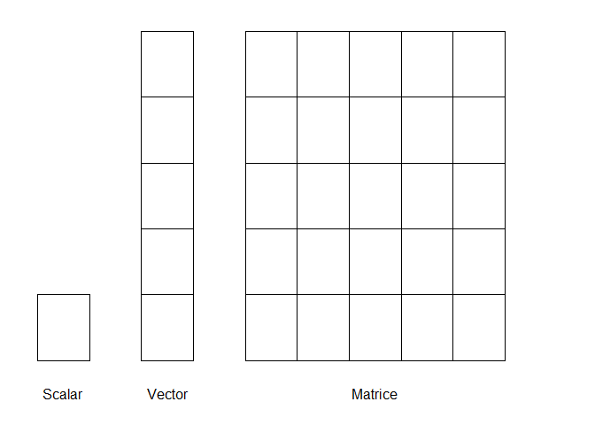
<p class="caption">Figura 3. Scalari, Vectori, Matrice</p>
</div>

Indexarea liniilor și a coloanelor pentru o matrice începe cu 1. De exemplu, elementul din colțul din stânga sus al unei matrice este notat cu `x[1,1]`. De asemenea este important de menționat că stocarea (internă) a metricelor se face pe coloane în sensul că prima oară este stocată coloana 1, apoi coloana 2, etc..

Există mai multe moduri de creare a unei matrici în R. Funcțiile cele mai uzuale sunt prezentate în tabelul de mai jos. Cum matricele sunt combinații de vectori, fiecare funcție primește ca argument unul sau mai mulți vectori (toți de același tip) și ne întoarce o matrice.

| Funcție| Descriere| Exemple |
|:-------------|:-------------------|:------------------------------|
|     `cbind(a, b, c)`| Combină vectorii ca și coloane într-o matrice |`cbind(1:5, 6:10, 11:15)`     |
|     `rbind(a, b, c)`| Combină vectorii ca și linii într-o matrice|`rbind(1:5, 6:10, 11:15)`    |
|     `matrix(x, nrow, ncol, byrow)`| Crează o matrice dintr-un vector `x`   | `matrix(x = 1:12, nrow = 3, ncol = 4)` |

Table: Tabelul 3. Functii care permit crearea matricelor

Pentru a vedea ce obținem atunci când folosim funcțiile `cbind()` și `rbind()` să considerăm exemplele următoare:


```r
x <- 1:5
y <- 6:10
z <- 11:15

# Cream o matrice cu x, y si z ca si coloane
cbind(x, y, z)
     x  y  z
[1,] 1  6 11
[2,] 2  7 12
[3,] 3  8 13
[4,] 4  9 14
[5,] 5 10 15

# Cream o matrice in care x, y si z sunt linii
rbind(x, y, z)
  [,1] [,2] [,3] [,4] [,5]
x    1    2    3    4    5
y    6    7    8    9   10
z   11   12   13   14   15
```


Funcția `matrix()` crează o matrice plecând de la un singur vector. Funcția are patru valori de intrare: `data` -- un vector cu date, `nrow` -- numărul de linii pe care le vrem în matrice, `ncol` -- numărul de coloane pe care să le aibe matricea și `byrow` -- o valoare logică care permite crearea matricei pe linii (nu pe coloane cum este default-ul).


```r
# matrice cu 5 linii si 2 coloane
matrix(data = 1:10,
       nrow = 5,
       ncol = 2)
     [,1] [,2]
[1,]    1    6
[2,]    2    7
[3,]    3    8
[4,]    4    9
[5,]    5   10

# matrice cu 2 linii si 5 coloane
matrix(data = 1:10,
       nrow = 2,
       ncol = 5)
     [,1] [,2] [,3] [,4] [,5]
[1,]    1    3    5    7    9
[2,]    2    4    6    8   10

# aceeasi matrice cu 2 linii si 5 coloane, umpluta pe linii 
matrix(data = 1:10,
       nrow = 2,
       ncol = 5,
       byrow = TRUE)
     [,1] [,2] [,3] [,4] [,5]
[1,]    1    2    3    4    5
[2,]    6    7    8    9   10
```

Operațiile uzuale cu vectori se aplică și matricelor. Pe lângă acestea avem la dispoziție și operații de algebră liniară clasice, cum ar fi determinarea dimensiunii acestora, transpunerea matricelor sau înmulțirea lor: 


```r
m = matrix(data = 1:10,
       nrow = 2,
       ncol = 5)
m
     [,1] [,2] [,3] [,4] [,5]
[1,]    1    3    5    7    9
[2,]    2    4    6    8   10

dim(m) # dimensiunea matricei
[1] 2 5
nrow(m) # numarul de linii
[1] 2
ncol(m) # numarul de coloane
[1] 5

tpm = t(m) # transpusa
tpm
     [,1] [,2]
[1,]    1    2
[2,]    3    4
[3,]    5    6
[4,]    7    8
[5,]    9   10

m %*% tpm # inmultirea matricelor
     [,1] [,2]
[1,]  165  190
[2,]  190  220
```

Metodele de indexare discutate pentru vectori se aplică și în cazul matricelor (`[,]`) numai că acum în loc să folosim un vector să indexăm putem să folosim doi vectori. Sintaxa are structura generală `m[linii, coloane]` unde `linii` și `coloane` sunt vectori cu valori întregi.


```r
m = matrix(1:20, nrow = 4, byrow = TRUE)

# Linia 1
m[1, ]
[1] 1 2 3 4 5

# Coloana 5
m[, 5]
[1]  5 10 15 20

# Liniile 2, 3 si coloanele 3, 4
m[2:3, 3:4]
     [,1] [,2]
[1,]    8    9
[2,]   13   14

# Elementele din coloana 3 care corespund liniilor pentru care elementele 
# de pe prima coloana sunt > 3
m[m[,1]>3, 3]
[1]  8 13 18
```

## Liste 

Spre deosebire de vectori în care toate elementele trebuie să aibă același tip de dată, structura de dată din R de tip listă (*list*) permite combinarea obiectelor de mai multe tipuri. Cu alte cuvinte, o listă poate avea primul element un scalar, al doilea un vector, al treilea o matrice iar cel de-al patrulea element poate fi o altă listă. Tehnic listele sunt tot vectori, vectorii pe care i-am văzut anterior se numesc *vectori atomici*, deoarece elementele lor nu se pot diviza, pe când listele se numesc *vectori recursivi*. 

Ca un prim exemplu să considerăm cazul unei baze de date de angajați. Pentru fiecare angajat, ne dorim să stocăm numele angajatului (șir de caractere), salariul (valoare numerică) și o valoare de tip logic care poate reprezenta apartenența într-o asociație. Pentru crearea listei folosim funcția `list()`:


```r
a = list(nume = "Ionel", salariu = 1500, apartenenta = T)
a
$nume
[1] "Ionel"

$salariu
[1] 1500

$apartenenta
[1] TRUE
str(a) # structura listei
List of 3
 $ nume       : chr "Ionel"
 $ salariu    : num 1500
 $ apartenenta: logi TRUE
names(a) # numele listei
[1] "nume"        "salariu"     "apartenenta"
```

Numele componentelor listei `a` (nume, salariu, apartenenta) nu sunt obligatorii dar cu toate acestea pentru claritate sunt indicate:


```r
a2 = list("Ionel", 1500, T)
a2
[[1]]
[1] "Ionel"

[[2]]
[1] 1500

[[3]]
[1] TRUE
```

Deoarece listele sunt vectori ele pot fi create și prin intermediul funcției `vector()`:


```r
z <- vector(mode="list")
z
list()
z[["a"]] = 3
z
$a
[1] 3
```

### Indexarea listelor 

Elementele unei liste pot fi accesate în diferite moduri. Dacă dorim să extragem primul element al listei atunci vom folosi indexarea care folosește o singură pereche de paranteze pătrate `[]`


```r
a[1]
$nume
[1] "Ionel"
a[2]
$salariu
[1] 1500

# ce obtinem cand extragem un element al listei a ?
str(a[1]) 
List of 1
 $ nume: chr "Ionel"
```

În cazul în care vrem să accesăm structura de date corespunzătoare elementului i al listei vom folosi două perechi de paranteze pătrate `[[]]` sau în cazul în care lista are nume operatorul `$` urmat de numele elementului i.


```r
a[[1]]
[1] "Ionel"
a[[2]]
[1] 1500

a$nume
[1] "Ionel"
a[["nume"]]
[1] "Ionel"
```

Operațiile de adăugare, respectiv ștergere, a elementelor unei liste sunt des întâlnite. 

Putem adăuga elemente după ce o listă a fost creată folosind numele componentei


```r
z = list(a = "abc", b = 111, c = c(TRUE, FALSE))
z
$a
[1] "abc"

$b
[1] 111

$c
[1]  TRUE FALSE
z$d = "un nou element"
z
$a
[1] "abc"

$b
[1] 111

$c
[1]  TRUE FALSE

$d
[1] "un nou element"
```

sau indexare vectorială


```r
z[[5]] = 200
z[6:7] = c("unu", "doi")
z
$a
[1] "abc"

$b
[1] 111

$c
[1]  TRUE FALSE

$d
[1] "un nou element"

[[5]]
[1] 200

[[6]]
[1] "unu"

[[7]]
[1] "doi"
```

Putem șterge o componentă a listei atribuindu-i valoarea `NULL`:


```r
z[4] = NULL
z
$a
[1] "abc"

$b
[1] 111

$c
[1]  TRUE FALSE

[[4]]
[1] 200

[[5]]
[1] "unu"

[[6]]
[1] "doi"
```

Putem de asemenea să concatenăm două liste folosind funcția `c()` și să determinăm lungimea noii liste cu funcția `length()`.


```r
l1 = list(1:10, matrix(1:6, ncol = 3), c(T, F))
l2 = list(c("Ionel", "Maria"), seq(1,10,2))

l3 = c(l1, l2)
length(l3)
[1] 5
str(l3)
List of 5
 $ : int [1:10] 1 2 3 4 5 6 7 8 9 10
 $ : int [1:2, 1:3] 1 2 3 4 5 6
 $ : logi [1:2] TRUE FALSE
 $ : chr [1:2] "Ionel" "Maria"
 $ : num [1:5] 1 3 5 7 9
```

## Data frame-uri

La nivel intuitiv, o structură de date de tip *data frame* este ca o matrice, având o structură bidimensională cu linii și coloane. Cu toate acestea ea diferă de structura de date de tip matrice prin faptul că fiecare coloană poate avea tipuri de date diferite. Spre exemplu, o coloană poate să conțină valori numerice pe când o alta, valori de tip caracter sau logic. Din punct de vedere tehnic, o structură de tip data frame este o listă a cărei componente sunt vectori (atomici) de lungimi egale.

Pentru a crea un dataframe din vectori putem folosi funcția `data.frame()`. Această funcție funcționează similar cu funcția `list()` sau `cbind()`, diferența față de `cbind()` este că avem posibilitatea să dăm nume coloanelor atunci când le unim. Dată fiind flexibilitatea acestei structuri de date, majoritatea seturilor de date din R sunt stocate sub formă de dataframe (această structură de date este și cea mai des întâlnită în analiza statistică). 

Să creăm un dataframe simplu numit `survey` folosind funcția `data.frame()`:


```r
survey <- data.frame("index" = c(1, 2, 3, 4, 5),
                     "sex" = c("m", "m", "m", "f", "f"),
                     "age" = c(99, 46, 23, 54, 23))
survey
  index sex age
1     1   m  99
2     2   m  46
3     3   m  23
4     4   f  54
5     5   f  23
```

Funcția `data.frame()` prezintă un argument specific numit `stringsAsFactors` care permite convertirea coloanelor ce conțin elemente de tip caracter într-un tip de obiect numit **factor**. Un factor este o variabilă nominală care poate lua un număr bine definit de valori. De exemplu, putem crea o variabilă de tip factor *sex* care poate lua doar două valori: *masculin* și *feminin*. Comportamentul implicit al funcției `data.frame()` (`stringAsFactors = TRUE`) transformă automat coloanele de tip caracter în factor, motiv pentru care trebuie să includem argumentul `stringsAsFactors = FALSE`.


```r
# Structura initiala
str(survey)
'data.frame':	5 obs. of  3 variables:
 $ index: num  1 2 3 4 5
 $ sex  : Factor w/ 2 levels "f","m": 2 2 2 1 1
 $ age  : num  99 46 23 54 23

survey <- data.frame("index" = c(1, 2, 3, 4, 5),
                     "sex" = c("m", "m", "m", "f", "f"),
                     "age" = c(99, 46, 23, 54, 23),
                     stringsAsFactors = FALSE)

# Structura de dupa 
str(survey)
'data.frame':	5 obs. of  3 variables:
 $ index: num  1 2 3 4 5
 $ sex  : chr  "m" "m" "m" "f" ...
 $ age  : num  99 46 23 54 23
```

R are mai multe funcții care permit vizualizarea structurilor de tip dataframe. Table de mai jos include câteva astfel de funcții:

| Funcție | Descriere | 
|:------------------------|:-----------------------------------------|
| `head(x), tail(x)` | Printarea primelor linii (sau ultimelor linii). | 
| `View(x)` | Vizualizarea obiectului într-o fereastră nouă, tabelară. | 
| `nrow(x), ncol(x), dim(x)` | Numărul de linii și de coloane.  | 
| `rownames(), colnames(), names()` | Numele liniilor sau coloanelor.  | 
| `str(x)` | Structura dataframe-ului | 

Table: Tabelul 4. Exemple de functii necesare pentru intelegerea structurii dataframe-ului


```r
data() # vedem ce seturi de date exista

# Alegem setul de date mtcars
?mtcars
starting httpd help server ... done
str(mtcars) # structura setului de date
'data.frame':	32 obs. of  11 variables:
 $ mpg : num  21 21 22.8 21.4 18.7 18.1 14.3 24.4 22.8 19.2 ...
 $ cyl : num  6 6 4 6 8 6 8 4 4 6 ...
 $ disp: num  160 160 108 258 360 ...
 $ hp  : num  110 110 93 110 175 105 245 62 95 123 ...
 $ drat: num  3.9 3.9 3.85 3.08 3.15 2.76 3.21 3.69 3.92 3.92 ...
 $ wt  : num  2.62 2.88 2.32 3.21 3.44 ...
 $ qsec: num  16.5 17 18.6 19.4 17 ...
 $ vs  : num  0 0 1 1 0 1 0 1 1 1 ...
 $ am  : num  1 1 1 0 0 0 0 0 0 0 ...
 $ gear: num  4 4 4 3 3 3 3 4 4 4 ...
 $ carb: num  4 4 1 1 2 1 4 2 2 4 ...
head(mtcars)
                   mpg cyl disp  hp drat    wt  qsec vs am gear carb
Mazda RX4         21.0   6  160 110 3.90 2.620 16.46  0  1    4    4
Mazda RX4 Wag     21.0   6  160 110 3.90 2.875 17.02  0  1    4    4
Datsun 710        22.8   4  108  93 3.85 2.320 18.61  1  1    4    1
Hornet 4 Drive    21.4   6  258 110 3.08 3.215 19.44  1  0    3    1
Hornet Sportabout 18.7   8  360 175 3.15 3.440 17.02  0  0    3    2
Valiant           18.1   6  225 105 2.76 3.460 20.22  1  0    3    1
tail(mtcars)
                mpg cyl  disp  hp drat    wt qsec vs am gear carb
Porsche 914-2  26.0   4 120.3  91 4.43 2.140 16.7  0  1    5    2
Lotus Europa   30.4   4  95.1 113 3.77 1.513 16.9  1  1    5    2
Ford Pantera L 15.8   8 351.0 264 4.22 3.170 14.5  0  1    5    4
Ferrari Dino   19.7   6 145.0 175 3.62 2.770 15.5  0  1    5    6
Maserati Bora  15.0   8 301.0 335 3.54 3.570 14.6  0  1    5    8
Volvo 142E     21.4   4 121.0 109 4.11 2.780 18.6  1  1    4    2

rownames(mtcars)
 [1] "Mazda RX4"           "Mazda RX4 Wag"       "Datsun 710"         
 [4] "Hornet 4 Drive"      "Hornet Sportabout"   "Valiant"            
 [7] "Duster 360"          "Merc 240D"           "Merc 230"           
[10] "Merc 280"            "Merc 280C"           "Merc 450SE"         
[13] "Merc 450SL"          "Merc 450SLC"         "Cadillac Fleetwood" 
[16] "Lincoln Continental" "Chrysler Imperial"   "Fiat 128"           
[19] "Honda Civic"         "Toyota Corolla"      "Toyota Corona"      
[22] "Dodge Challenger"    "AMC Javelin"         "Camaro Z28"         
[25] "Pontiac Firebird"    "Fiat X1-9"           "Porsche 914-2"      
[28] "Lotus Europa"        "Ford Pantera L"      "Ferrari Dino"       
[31] "Maserati Bora"       "Volvo 142E"         
names(mtcars)
 [1] "mpg"  "cyl"  "disp" "hp"   "drat" "wt"   "qsec" "vs"   "am"   "gear"
[11] "carb"

View(mtcars) 
```


### Metode de indexare 

Indexarea structurilor de tip dataframe se face la fel ca și indexarea listelor.


```r
mtcars[1,1:4]
          mpg cyl disp  hp
Mazda RX4  21   6  160 110
mtcars[c(1,2),2]
[1] 6 6
mtcars$mpg
 [1] 21.0 21.0 22.8 21.4 18.7 18.1 14.3 24.4 22.8 19.2 17.8 16.4 17.3 15.2
[15] 10.4 10.4 14.7 32.4 30.4 33.9 21.5 15.5 15.2 13.3 19.2 27.3 26.0 30.4
[29] 15.8 19.7 15.0 21.4
```

La fel ca vectorii, dataframe-urile (dar și listele) pot fi indexate logic


```r
mtcars[mtcars$mpg > 25, ]
                mpg cyl  disp  hp drat    wt  qsec vs am gear carb
Fiat 128       32.4   4  78.7  66 4.08 2.200 19.47  1  1    4    1
Honda Civic    30.4   4  75.7  52 4.93 1.615 18.52  1  1    4    2
Toyota Corolla 33.9   4  71.1  65 4.22 1.835 19.90  1  1    4    1
Fiat X1-9      27.3   4  79.0  66 4.08 1.935 18.90  1  1    4    1
Porsche 914-2  26.0   4 120.3  91 4.43 2.140 16.70  0  1    5    2
Lotus Europa   30.4   4  95.1 113 3.77 1.513 16.90  1  1    5    2
mtcars[(mtcars$mpg > 25) & (mtcars$wt < 1.8), ]
              mpg cyl disp  hp drat    wt  qsec vs am gear carb
Honda Civic  30.4   4 75.7  52 4.93 1.615 18.52  1  1    4    2
Lotus Europa 30.4   4 95.1 113 3.77 1.513 16.90  1  1    5    2
```

O altă metodă de indexare este prin folosirea funcției `subset()`.

| Argument| Descriere| 
|:------------------------|:-----------------------------|
|     `x`| Un dataframe| 
|     `subset`| Un vector logic care indică liniile pe care le vrem  | 
|     `select`| Coloanele pe care vrem să le păstrăm | 

Table: Tabelul 5. Principalele argumente ale functiei subset()


```r
subset(x = mtcars,
      subset = mpg < 12 &
               cyl > 6,
      select = c(disp, wt))
                    disp    wt
Cadillac Fleetwood   472 5.250
Lincoln Continental  460 5.424
```


### Metode de manipulare 

În această secțiune vom prezenta câteva metode mai avansate de manipulare a seturilor de date (a data frame-urilor). 

Vom începe prin introducerea comenzii `order()` care permite sortarea liniilor unui data.frame în funcție de valorile coloanei de interes. De exemplu să considerăm cazul setului de date `mtcars`. Vrem să afisăm primele 10 mașini în funcție de greutatea lor (crescător și descrescător):


```r
cars_increasing = rownames(mtcars[order(mtcars$wt),])
# afisarea celor mai usoare 10 masini
cars_increasing[1:10]
 [1] "Lotus Europa"   "Honda Civic"    "Toyota Corolla" "Fiat X1-9"     
 [5] "Porsche 914-2"  "Fiat 128"       "Datsun 710"     "Toyota Corona" 
 [9] "Mazda RX4"      "Ferrari Dino"  

cars_decreasing = rownames(mtcars[order(mtcars$wt, decreasing = TRUE),])
# afisarea celor mai grele 10 masini
cars_decreasing[1:10]
 [1] "Lincoln Continental" "Chrysler Imperial"   "Cadillac Fleetwood" 
 [4] "Merc 450SE"          "Pontiac Firebird"    "Camaro Z28"         
 [7] "Merc 450SLC"         "Merc 450SL"          "Duster 360"         
[10] "Maserati Bora"      
```

Funcția `order()` permite ordonarea după mai mult de o coloană, de exemplu dacă vrem să ordonăm mașinile după numărul de cilindrii și după greutate atunci apelăm 


```r
mtcars[order(mtcars$cyl, mtcars$wt), 1:6]
                     mpg cyl  disp  hp drat    wt
Lotus Europa        30.4   4  95.1 113 3.77 1.513
Honda Civic         30.4   4  75.7  52 4.93 1.615
Toyota Corolla      33.9   4  71.1  65 4.22 1.835
Fiat X1-9           27.3   4  79.0  66 4.08 1.935
Porsche 914-2       26.0   4 120.3  91 4.43 2.140
Fiat 128            32.4   4  78.7  66 4.08 2.200
Datsun 710          22.8   4 108.0  93 3.85 2.320
Toyota Corona       21.5   4 120.1  97 3.70 2.465
Volvo 142E          21.4   4 121.0 109 4.11 2.780
Merc 230            22.8   4 140.8  95 3.92 3.150
Merc 240D           24.4   4 146.7  62 3.69 3.190
Mazda RX4           21.0   6 160.0 110 3.90 2.620
Ferrari Dino        19.7   6 145.0 175 3.62 2.770
Mazda RX4 Wag       21.0   6 160.0 110 3.90 2.875
Hornet 4 Drive      21.4   6 258.0 110 3.08 3.215
Merc 280            19.2   6 167.6 123 3.92 3.440
Merc 280C           17.8   6 167.6 123 3.92 3.440
Valiant             18.1   6 225.0 105 2.76 3.460
Ford Pantera L      15.8   8 351.0 264 4.22 3.170
AMC Javelin         15.2   8 304.0 150 3.15 3.435
Hornet Sportabout   18.7   8 360.0 175 3.15 3.440
Dodge Challenger    15.5   8 318.0 150 2.76 3.520
Duster 360          14.3   8 360.0 245 3.21 3.570
Maserati Bora       15.0   8 301.0 335 3.54 3.570
Merc 450SL          17.3   8 275.8 180 3.07 3.730
Merc 450SLC         15.2   8 275.8 180 3.07 3.780
Camaro Z28          13.3   8 350.0 245 3.73 3.840
Pontiac Firebird    19.2   8 400.0 175 3.08 3.845
Merc 450SE          16.4   8 275.8 180 3.07 4.070
Cadillac Fleetwood  10.4   8 472.0 205 2.93 5.250
Chrysler Imperial   14.7   8 440.0 230 3.23 5.345
Lincoln Continental 10.4   8 460.0 215 3.00 5.424
```

Sunt multe situațiile în care avem la dispoziție două sau mai multe seturi de date și am vrea să construim un nou set de date care să combine informațiile din acestea. Pentru aceasta vom folosi funcția `merge()`. Principalele argumente ale acestei funcții se regăsesc în tabelul de mai jos:

| Argument| Descriere| 
|:------------|:-------------------------------------------------|
|`x, y`| Două data frame-uri ce urmează a fi unite|
|`by`| Un vector de caractere ce reprezintă una sau mai multe coloane după care se va face lipirea. De exemplu `by = "id"` va combina coloanele care au valori care se potrivesc într-o coloană care se numește `"id"`. `by = c("last.name", "first.name")` va combina coloanele care au valori care se potrivesc în ambele coloane `"last.name"` și `"first.name"`|
|`all`| Un vector logic care indică dacă vrem să includem sau nu liniile care nu se potrivesc conform argumentului `by`. |

Table: Tabelul 6. Argumentele functiei merge

Să presupunem că avem la dispoziție un set de date în care apar 5 studenți și notele pe care le-au obținut la examenul de statistică:


```r
stat_course = data.frame(student = c("Ionel", "Maria", "Gigel", "Vasile", "Ana"),
                         note_stat = c(9, 8, 5, 7, 9)) 
```

și să presupunem că avem notele acestor studenți la examenul de algebră


```r
alg_course = data.frame(student = c("Maria", "Ana" , "Gigel", "Ionel", "Vasile"),
                         note_alg = c(10, 8, 9, 7, 9)) 
```

Scopul nostru este să creăm un singur tabel în care să regăsim notele la ambele materii:


```r
combined_courses = merge(x = stat_course, 
                         y = alg_course,
                         by = "student")
combined_courses
  student note_stat note_alg
1     Ana         9        8
2   Gigel         5        9
3   Ionel         9        7
4   Maria         8       10
5  Vasile         7        9
```

O a treia funcție care joacă un rol important în manipularea data frame-urilor este funcția `aggregate()` care, după cum îi spune și numele, permite calcularea de funcții pe grupe de date din setul initial. Argumentele principale ale acestei funcții sunt date în tabelul de mai jos:

| Argument| Descriere| 
|:------------|:-------------------------------------------------|
|`formula`| O formulă de tipul `y ~ x1 + x2 + ...` unde y este variabila dependentă iar x1, x2, ... sunt variabilele independente. De exemplu, `salary ~ sex + age` va agrega o coloană `salary` la fiecare combinație unică de `sex` și `age`|
|`FUN`| O funcție pe care vrem să o aplicăm lui y la fiecare nivel al variabilelor independente. E.g. `mean` sau `max`.|
|`data`| Data frame-ul care conține variabilele din `formula`|
|`subset`| O submulțime din `data` pe care vrem să le analizăm. De exemplu, `subset(sex == "f" & age > 20)` va restrânge analiza la femei mai învârstă de 20 de ani.|

Table: Tabelul 7. Argumentele functiei aggregate

Structura generală a funcției `aggregate()` este 


```r
aggregate(formula = dv ~ iv, # dv este data, iv este grupul 
          FUN = fun, # Functia pe care vrem sa o aplicam
          data = df) # setul de date care contine coloanele dv si iv
```

Să considerăm setul de date `ChickWeight` și să ne propunem să calculăm pentru fiecare tip de dietă greutatea medie:


```r
# Fara functia aggregate
mean(ChickWeight$weight[ChickWeight$Diet == 2])
[1] 122.6167
mean(ChickWeight$weight[ChickWeight$Diet == 3])
[1] 142.95
mean(ChickWeight$weight[ChickWeight$Diet == 4])
[1] 135.2627

# Cu ajutorul functiei aggregate
aggregate(formula = weight ~ Diet,  # DV este weight, IV este Diet
          FUN = mean,               # calculeaza media pentru fiecare grup
          data = ChickWeight)       # dataframe este ChickWeight
  Diet   weight
1    1 102.6455
2    2 122.6167
3    3 142.9500
4    4 135.2627
```

Funcția `aggregate()` a întors un data.frame cu o coloană pentru variabila independentă `Diet` și o coloană pentru greutatea medie.

Dacă vrem să calculăm greutățile medii în funcție de dietă pentru găinile care au mai puțin de 10 săptămâni de viață atunci folosim opțiunea `subset`:


```r
aggregate(formula = weight ~ Diet,  # DV este weight, IV este Diet
          FUN = mean,               # calculeaza media pentru fiecare grup
          subset = Time < 10,       # gainile care au mai putin de 10 saptamani
          data = ChickWeight)       # dataframe este ChickWeight
  Diet   weight
1    1 58.03093
2    2 63.40000
3    3 65.94000
4    4 69.36000
```

Putem să includem de asemenea mai multe variabile independente în formula funcției `aggregate()`. De exemplu putem să calculăm greutatea medie a găinilor atât pentru fiecare tip de dietă cât și pentru numărul de săptămâni de la naștere:


```r
aggregate(formula = weight ~ Diet + Time,  # DV este weight, IV sunt Diet și Time
          FUN = mean,               # calculeaza media pentru fiecare grup
          data = ChickWeight)       # dataframe este ChickWeight
   Diet Time    weight
1     1    0  41.40000
2     2    0  40.70000
3     3    0  40.80000
4     4    0  41.00000
5     1    2  47.25000
6     2    2  49.40000
7     3    2  50.40000
8     4    2  51.80000
9     1    4  56.47368
10    2    4  59.80000
11    3    4  62.20000
12    4    4  64.50000
13    1    6  66.78947
14    2    6  75.40000
15    3    6  77.90000
16    4    6  83.90000
17    1    8  79.68421
18    2    8  91.70000
19    3    8  98.40000
20    4    8 105.60000
21    1   10  93.05263
22    2   10 108.50000
23    3   10 117.10000
24    4   10 126.00000
25    1   12 108.52632
26    2   12 131.30000
27    3   12 144.40000
28    4   12 151.40000
29    1   14 123.38889
30    2   14 141.90000
31    3   14 164.50000
32    4   14 161.80000
33    1   16 144.64706
34    2   16 164.70000
35    3   16 197.40000
36    4   16 182.00000
37    1   18 158.94118
38    2   18 187.70000
39    3   18 233.10000
40    4   18 202.90000
41    1   20 170.41176
42    2   20 205.60000
43    3   20 258.90000
44    4   20 233.88889
45    1   21 177.75000
46    2   21 214.70000
47    3   21 270.30000
48    4   21 238.55556
```

\BeginKnitrBlock{rmdexercise}<div class="rmdexercise">Considerați setul de date `mtcars`. Calculați:

  a) Greutatea medie în funcție de tipul de transmisie
  
  b) Greutatea medie în funcție de numărul de cilindrii
  
  c) Consumul mediu în funcție de numărul de cilindrii și tipul de transmisie
</div>\EndKnitrBlock{rmdexercise}

# Elemente de programare în R

## Funcții

O *funcție* este un obiect în R care primește câteva obiecte de intrare (care se numesc *argumentele funcției*) și întoarce un obiect de ieșire. Structura unei funcții va avea următoarele patru părți:

  - *Nume*: Care este numele funcției? Aveți grijă să nu folosiți nume ale funcțiilor deja existente în R! 
  
  - *Argumente*: Care sunt datele de intrare pentru funcție? Puteți specifica oricâte date de intrare doriți!
  
  - *Corp sau acțiune*: Ce vreți să facă această funcție? Să traseze un grafic? Să calculeze o statistică? 
  
  - *Rezultat*: Ce vreți să vă întoarcă funcția? Un scalar? Un vector? Un data.frame?
  

```r
# Structura de baza a unei functii
NUME <- function(ARGUMENTE) {

  ACTIUNI

  return(REZULTAT)

}
```

Funcțiile în R sunt *obiecte de primă clasă* (first class objects), ceea ce înseamnă că ele pot fi tratate ca orice alt obiect din R. Este important de reținut că, în R, 

  - funcțiile pot fi date ca argumente pentru alte funcții (de exemplu familia de funcții `apply()`)
  
  - funcțiile pot fi imbricate (nested), cu alte cuvinte puteți crea funcții în interiorul altor funcții  

Mai jos avem un exemplu de funcție care nu are niciun argument și nu întoarce nicio valoare:


```r
f <- function() {
        ## Aceasta este o functie goala
}
## Functiile au clasa lor speciala 
class(f)  
[1] "function"

f()       
NULL
```

Următoarea funcție întoarce numărul de caractere al textului dat ca argument:


```r
f <- function(mesaj){
  chars = nchar(mesaj)
  chars
}

mes = f("curs de statistica si probabilitati")
mes
[1] 35
```

În fucția de mai sus nu am indicat nimic special pentru ca funcția să ne întoarcă numărul de caractere. În R, rezulatul unei funcții este întotdeauna ultima expresie evaluată. De asemenea există funcția `return()` care poate fi folosită pentru a întoarce o valoare explicită, dar de multe ori această funcție este omisă. 

Dacă utilizatorul nu specifică valoarea argumentului `mesaj` în funcția de mai sus atunci R-ul întoarce o eroare:


```r
f()
Error in nchar(mesaj): argument "mesaj" is missing, with no default
```

Acest comportament al funcției poate fi modificat prin definirea unei valori implicite (de default). Orice argument al funcției poate avea o valoare de default. 


```r
f <- function(mesaj = "Valoare de default"){
  chars = nchar(mesaj)
  chars
}

# Folosim valoarea implicita 
f()
[1] 18
# Folosim o valoare specificata
f("curs de statistica si probabilitati")
[1] 35
```

\BeginKnitrBlock{rmdexercise}<div class="rmdexercise">Să presupunem că Jack Sparrow este convins că poate prezice cât aur va găsi pe o insulă folosind următoarea ecuație: $ab - 324c + \log(a)$, unde a este aria insulei (în $m^2$), b este numărul de copaci de pe insulă iar c reprezintă cât de beat este pe o scală de la 1 la 10. Creați o funcție numită `Jacks.Money` care primește ca argumente a, b și c și întoarce valoare prezisă. </div>\EndKnitrBlock{rmdexercise}

Un exemplu ar fi 


```r
Jacks.Money(a = 1000, b = 30, c = 7)
[1] 27738.91
```

Argumentele funcțiilor în R pot fi potrivite după poziția lor sau după numele lor. Potrivirea după poziție înseamnă că R atribuie prima valoare primului argument, a doua valoare celui de-al doilea argument, etc. De exemplu atunci când folosim funcție `rnorm()`,


```r
str(rnorm)
function (n, mean = 0, sd = 1)  
set.seed(1234) # pentru repetabilitate
mydata <- rnorm(10, 3, 1) 
mydata
 [1] 1.7929343 3.2774292 4.0844412 0.6543023 3.4291247 3.5060559 2.4252600
 [8] 2.4533681 2.4355480 2.1099622
```

valoarea 10 este atribuită argumentului `n`, valoarea 3 argumentului `mean` iar valoarea 1 argumentului `sd`, toate prin potrivire după poziție.

Atunci când specificăm argumentele funcției după nume, ordinea acestora nu contează. De exemplu


```r
set.seed(1234)
rnorm(mean = 3, n = 10, sd = 1)
 [1] 1.7929343 3.2774292 4.0844412 0.6543023 3.4291247 3.5060559 2.4252600
 [8] 2.4533681 2.4355480 2.1099622
```

întoarce același rezultat cu cel obținut mai sus. 

De cele mai multe ori, argumentele cu nume sunt folositoare atunci când funcția are un șir lung de argumente și ne dorim să folosim valorile implicite pentru majoritatea dintre ele. De asemenea aceste argumente pot fi folositoare și atunci când știm numele argumentului dar nu și poziția în lista de argumente. Un exemplu de astfel de funcție este funcția `plot()`, care are multe argumente folosite în special pentru customizare:


```r
args(plot.default)
function (x, y = NULL, type = "p", xlim = NULL, ylim = NULL, 
    log = "", main = NULL, sub = NULL, xlab = NULL, ylab = NULL, 
    ann = par("ann"), axes = TRUE, frame.plot = axes, panel.first = NULL, 
    panel.last = NULL, asp = NA, ...) 
NULL
```

În R există un argument special notat `...`, care indică un număr arbitrar de argumente care sunt atribuite altor funcții din corpul funcției. Acest argument este folosit în special atunci când vrem să extindem o altă funcție și nu vrem să copiem întreaga listă de argumente a acesteia. De exemplu, putem crea o funcție de plotare în care specificăm tipul în prealabil   

```r
myplot <- function(x, y, type = "l", ...) {
        plot(x, y, type = type, ...)         ## Atribuie '...' functiei 'plot'
}
```

Argumentul `...` poate fi folosit (și este necesar) și atunci când numărul de argumente pe care îl ia funcția nu este cunoscut în prealabil. De exemplu să considerăm funcțiile `paste()` și `cat()`


```r
args(paste)
function (..., sep = " ", collapse = NULL) 
NULL
args(cat)
function (..., file = "", sep = " ", fill = FALSE, labels = NULL, 
    append = FALSE) 
NULL
```

Deoarece ambele funcții printează text în consolă combinând mai mulți vectori de caractere împreună, este imposibil ca acestea să cunoască în prealabil câți vectori de caractere vor fi dați ca date de intrare de către utilizator, deci primul argument pentru fiecare funcție este `...`.

Este important de menționat că toate argumentele care apar după argumentul `...` trebuie explicitate după nume. 


```r
paste("Curs", "Probabilitati si Statistica", sep = ":")
[1] "Curs:Probabilitati si Statistica"
```

## Structuri de control (`if-else`, `for`, etc.)

Structurile de control, în R, permit structurarea logică și controlul fluxului de execuție al unei serii de comenzi. Cele mai folosite structuri de control sunt:

- `if` și`else`: testează o condiție și acționează asupra ei

- `switch`: compară mai multe opțiuni și execută opțiunea pentru care avem potrivire

- `for`: execută o acțiune repetitivă de un număr fix de ori

- `while`: execută o acțiune repetitivă _cât timp_ o condiție este adevărată

- `repeat`: execută o acțiune repetitivă de o infinitate de ori (trebuie să folosim `break` pentru a ieși din ea)

- `break`: întrerupe execuția unei acțiuni repetitive

- `next`: sare peste un pas în executarea unei acțiuni repetitive

### `if-else`

Structura `if-else` este una dintre cele mai folosite structuri de control în R permițând testarea unei condiții și acționând în funcție de valoarea de adevăr a acesteia. 

Forma de bază a acestei structuri este

```r
if(<conditie>) {
        ## executa instructiuni atunci cand conditia este adevarata
} 
else {
        ## executa instructiuni atunci cand conditia este falsa
}
```
dar putem să avem și o serie de teste, de tipul 

```r
if(<conditie1>) {
        ## executa instructiuni
} else if(<conditie2>)  {
        ## executa instructiuni
} else {
        ## executa instructiuni
}
```

Avem următorul exemplu


```r
## Generam un numar uniform in [0,1]
x <- runif(1, 0, 10)  

if(x > 3) {
        y <- 10
} else {
        y <- 0
}
```

### Comanda `switch`

Comanda `switch` este folosită cu precădere atunci când avem mai multe alternative dintre care vrem să alegem. Structura generală a aceste comenzi este 

```r
switch (Expresie, "Optiune 1", "Optiune 2", "Optiune 3", ....., "Optiune N")
```
sau într-o manieră extinsă 

```r
switch (Expresie,
        "Optiune 1" = Executa aceste expresii atunci cand expresia se 
                      potriveste cu Optiunea 1,
        "Optiune 2" = Executa aceste expresii atunci cand expresia se 
                      potriveste cu Optiunea 2,
        "Optiune 3" = Atunci cand expresia se potriveste cu Optiunea 3, 
                      executa aceste comenzi,
        ....
        "Optiune N" = Atunci cand expresia se potriveste cu Optiunea N, 
                      executa aceste comenzi
)
```

Considerăm următorul exemplu


```r
number1 <- 30
number2 <- 20
# operator <- readline(prompt="Insereaza OPERATORUL ARITMETIC: ")
 
operator = "*"

switch(operator,
       "+" = print(paste("Suma celor doua numere este: ", 
                         number1 + number2)),
       "-" = print(paste("Diferenta celor doua numere este: ", 
                         number1 - number2)),
       "*" = print(paste("Inmultirea celor doua numere este: ", 
                         number1 * number2)),
       "^" = print(paste("Ridicarea la putere a celor doua numere este: ", 
                         number1 ^ number2)),
       "/" = print(paste("Impartirea celor doua numere este: ", 
                         number1 / number2)),
       "%/%" = print(paste("Catul impartirii celor doua numere este: ", 
                           number1 %/% number2)),
       "%%" = print(paste("Restul impartirii celor doua numere este: ", 
                          number1 %% number2))
)
[1] "Inmultirea celor doua numere este:  600"
```

### Bucle `for`

În R, buclele `for` iau o variabilă care se iterează și îi atribuie valori succesive dintr-un șir sau un vector. Buclele `for` au următoarea structură de bază 

```r
for (<i> in <vector>) {
        ## executa instructiuni
} 
```
de exemplu 


```r
for(i in 1:10) {
        print(i)
}
[1] 1
[1] 2
[1] 3
[1] 4
[1] 5
[1] 6
[1] 7
[1] 8
[1] 9
[1] 10
```

Următoarele trei bucle prezintă același comportament


```r
x <- c("a", "b", "c", "d")

for(i in 1:4) {
        ## Afiseaza fiecare elemnt din 'x'
        print(x[i])  
}
[1] "a"
[1] "b"
[1] "c"
[1] "d"
```

Funcția `seq_along()` este des întâlnită atunci când folosim bucle `for` deoarece crează un șir întreg folosind lungimea obiectului (în acest caz al lui `x`)


```r
## Genereaza un sir folosind lungimea lui 'x'
for(i in seq_along(x)) {   
        print(x[i])
}
[1] "a"
[1] "b"
[1] "c"
[1] "d"
```

De asemeanea putem folosi chiar pe `x` ca vector de indexare 


```r
for(letter in x) {
        print(letter)
}
[1] "a"
[1] "b"
[1] "c"
[1] "d"
```

Atunci când folosim comenzile din buclele `for` pe o singură linie nu este necesară folosirea parantezelor `{}`


```r
for(i in 1:4) print(x[i])
[1] "a"
[1] "b"
[1] "c"
[1] "d"
```

Putem folosi buclele `for` și imbricat (nested)

```r
x <- matrix(1:6, 2, 3)

for(i in seq_len(nrow(x))) {
        for(j in seq_len(ncol(x))) {
                print(x[i, j])
        }   
}
```

\BeginKnitrBlock{rmdexercise}<div class="rmdexercise">Construiți următoarele matrice de dimensiune $10 \times 10$: $M_{i,j} = \frac{1}{\sqrt{|i-j|+1}}$ și $N_{i,j} = \frac{i}{j^2}$. Puteți construi matricea $M$ și matricea $N$ fără a folosi bucle `for`? (*Hint:* ce face comanda `outer`?) </div>\EndKnitrBlock{rmdexercise}

### Bucle de tip `while`

Acțiunile repetitive de tip `while` încep prin testarea unei condiții și în cazul în care aceasta este adevărată atunci se execută corpul comenzii. Odată ce corpul buclei este executat, condiția este testată din nou până când devine falsă (se poate ca bucla `while` să rezulte într-o repetiție infinită !). Structura generală a acestei bucle este 

```r
while(<conditie>) {
        ## executa instructiuni
} 
```

Considerăm următorul exemplu 


```r
count <- 0
while(count < 4) {
        print(count)
        count <- count + 1
}
[1] 0
[1] 1
[1] 2
[1] 3
```

Uneori putem testa mai multe condiții (acestea sunt întotdeauna evaluate de la stânga la dreapta)


```r
z <- 5
set.seed(123)

while(z >= 3 && z <= 10) {
        coin <- rbinom(1, 1, 0.5) # arunc cu banul
        
        if(coin == 1) {  ## random walk
                z <- z + 1
        } else {
                z <- z - 1
        } 
}
print(z)
[1] 11
```

### Bucle de tip `repeat`

Acest tip de acțiuni repetitive nu sunt foarte des întâlnite, cel puțin în statistică sau analiză de date. O situație în care ar putea să apară este atunci când avem un algoritm iterativ în care căutăm o soluție și nu vrem să oprim algoritmul până când soluția nu este suficient de bună. 


```r
x0 <- 1
tol <- 1e-8

repeat {
        x1 <- o_functie_definita()
        
        if(abs(x1 - x0) < tol) {  ## este suficient de buna solutia 
                break
        } else {
                x0 <- x1
        } 
}
```

### Comezile `break` și `next`

Comanda `next` este folosită pentru a sării un pas într-o buclă 


```r
for(i in 1:10) {
        if(i <= 5) {
                ## sari peste primele 5 iteratii
                next                 
        }
  print(i)
        
}
[1] 6
[1] 7
[1] 8
[1] 9
[1] 10
```

Comanda `break` este folosită pentru a părăsi o buclă imediat


```r
for(i in 1:10) {
      print(i)

      if(i > 5) {
              ## opreste dupa 5 iteratii
              break  
      }		
}
[1] 1
[1] 2
[1] 3
[1] 4
[1] 5
[1] 6
```

# Elemente de grafică în R

Graficele reprezintă, în general, un instrument folositor pentru vizualizarea rezultatelor unei analize dar și un mod prin care se poate verifica dacă am obținut ce ni s-a cerut. Este important să folosim opțiunile corecte atunci când trasăm un grafic, de multe ori valorile predefinite putând conduce la figuri eronate. În tabelul de mai jos avem listate principalele instrucțiuni grafice

| Funcția | Scurtă descriere |
|:--------------------------|:------------------------|
| `plot` | O funcție generică folosită pentru plotarea unui obiect (puncte, curbe, etc.) |
| `barplot` | Trasează un grafic de bare orizontale sau verticale (folosit pentru variabile discrete) |
| `hist` | Desenează histograme cu frecvanțe sau probabilități |
| `boxplot` | Desenează una sau mai multe boxplot-uri în paralel |
| `pie` | Desenează o diagramă de tip plăcintă |

Table: Tabelul 8. Functii grafice uzuale in R

Metodele grafice din R nu se limitează la cele din tabelul de mai sus. De exemplu, pachetul `ggplot2`^[Vizitați pagina [http://ggplot2.tidyverse.org/reference/](http://ggplot2.tidyverse.org/reference/) pentru mai multe detalii] este foarte răspândit la ora actuală deoarece pune la dispoziție o serie de instrumente grafice (folosind o gramatică de grafice) cu ajutorul cărora se pot produce figuri de calitate deosebită (ce se folosesc în special pentru publicații științifice).

În continuare vom prezenta o parte din funcțiile cel mai des folosite pentru trasarea graficelor în R împreună cu proprietățile de bază ale acestora.

## Funcția `plot`

Cea mai folosită funcție (high-level) de plotare în R este funcția `plot()`. Aceasta permite trasarea unei diagrame de împrăștiere (*scatterplot*) între doi vectori `x` și `y`, unde vectorul `x` indică valorile pe axa abscisei iar `y` pe axa ordonatelor. 

Argumentele principale ale funcției `plot()` se găsesc în tabelul următor.

| Argument | Descriere | 
|:------------|:-------------------------------------------------|
|`x, y`| Vectori de aceeași lungime care specifică valorile coordonatelor de pe x și de pe y|
|`type`| Tipul de grafic: `"l"` reprezintă linii, `"p"` reprezintă puncte, `"b"` reprezintă și linii și puncte, `"n"` înseamnă că nu trasează nimic|
|`main`, `xlab`, `ylab`| String-uri folosite pentru titlul graficului și etichetarea axelor x și y|
|`xlim`, `ylim`| Limitele pe axa x și y. De exemplu, `xlim = c(0, 100)` va seta valoarea minimă și maximă de pe axa x la 0 și respectiv 100.|
|`pch` | Un număr întreg care denotă tipul de simbol folosit pentru trasarea punctelor (vezi `?points`), sau un șir de caractere care specifică simbolurile ca text. De exemplu, `pch = 21` va crea un cerc colorat cu 2 culori, iar `pch = "P"` va trasa caracterul `"P"` pentru fiecare punct. |
|`col`| Culoarea principală a simbolurilor desenate. De exemplu `col = "blue"` va trasa simbolurile în culoarea albastră. |
|`lty`| Tipul de linie folosit. De exemplu `lty = 1` reprezintă o linie solidă pe când `lty = 2` reprezintă o linie întreruptă. |
|`lwd`| Grosimea liniei folosite, valoare prestabilită este `lwd = 1`. |
|`cex`| Un vector numeric folosit pentru a specifica mărimea simbolurilor trasate. Valoarea prestabilită este 1. De exemplu `cex = 4` va face punctele foarte mari pe când `cex = .5` le va face mai mici. |

Table: Tabelul 9. Argumentele principale ale functiei plot()


```r
plot(x = 1:10,                         # x-coordonate
     y = 1:10,                         # y-coordinate
     type = "p",                       # puncte (nu linii)
     main = "Primul grafic",
     xlab = "Axa x",
     ylab = "Axa y",
     xlim = c(0, 11),                  # Valorile min si max pe axa x 
     ylim = c(0, 11),                  # Valorile min si max pe axa y
     col = "blue",                     # Culoarea punctelor
     pch = 16,                         # Tipul simbolului 
     cex = 1)                           # Marimea simbolului 
```


În afară de vectorii `x` și `y` toate celelalte argumente sunt opționale, dacă nu sunt specificate atunci R-ul folosește valorile prestabilite. De exemplu dacă nu specificăm limitele `xlim` și `ylim`, R-ul calculează aceste limite astfel încât toate punctele să fie încadrați în interiorul graficului.

\BeginKnitrBlock{rmdexercise}<div class="rmdexercise">Trasați următoarele diagrame de împrăștiere:

`
  x <- seq(0, 1, 0.1); plot(x, x - x * x + 2)
`
`
  plot(x, x - x * x + 2, type = "l"); plot(x, x - x * x + 2, type = "b", pch = 19)
`</div>\EndKnitrBlock{rmdexercise}

Tipul de simbol pe care vrem să-l folosim atunci când trasăm un grafic este specificat prin argumentul `pch`. Figura de mai jos ne prezintă tipurile simboluri pe care atunci când atribuim argumentului `pch` o valoare întreagă.   


<div class="figure" style="text-align: center">
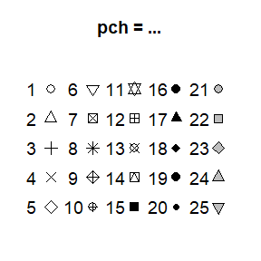
<p class="caption">Figura 4. Tipurile de simboluri asociate parametrului pch.</p>
</div>

Următorul exemplu ilustrează câteva tipuri de simboluri:


\BeginKnitrBlock{rmdexercise}<div class="rmdexercise">Considerăm următoarea funcție $g:\mathbb{R}\to\mathbb{R}$, 

$$
  g(x) = \left\{\begin{array}{ll}
              \sin^2(x)\log(x), & x>0\\
              \sin^2(x)x, & x\leq 0
  \end{array}\right.
$$

  a) Definiți funcția folosind comenzile `if-else` și `Vectorize` iar apoi folosind comanda `ifelse`.
  
  b) Trasați graficul curbei pe intervalul $[-\pi, \pi]$.

</div>\EndKnitrBlock{rmdexercise}

## Culori

Majoritatea funcțiilor de desenare au un argument în care pot specifica culoarea elementelor pe care vrem să le trasăm, de cele mai multe ori acesta este `col`. Cel mai ușor mod de a introduce o culoare este prin specificarea numelui acesteia, de exemplu `col = 'red'` este culoarea roșie. Figura 1 prezintă 144 de culori alese la întâmplare din totalul de 657 câte există în R. 

<div class="figure" style="text-align: center">
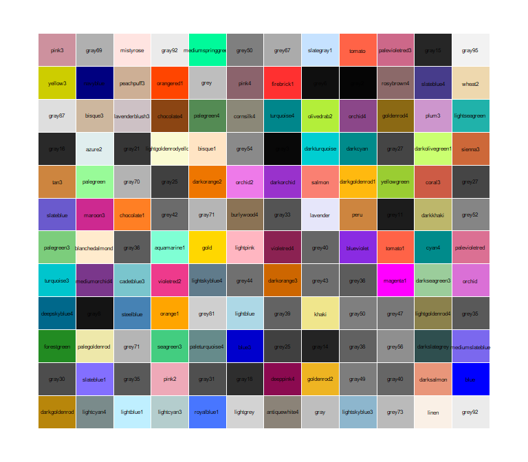
<p class="caption">Figura 5. 144 de culori din totalul de 657 din R</p>
</div>

Pentru a vedea toate culorile din R putem rula comanda `colors()`.

## Funcția `hist`

Histograma^[Histograma este un estimator neparametric al densității.] reprezintă metoda grafică, cea mai comună, de reprezentare a repartiției unui vector numeric. Pentru a crea o histogramă în R folosim funcția `hist()` în care argumentul principal este un vector numeric. Tabelul de mai jos prezintă argumentele principale ale funcției `hist`.

| Argument| Descriere| 
|:------------|:-------------------------------------------------|
|`x`| Vector de valori|
|`breaks`| Cum să calculăm mărimea bin-urilor (vezi `?hist`)|
|`freq`| Opțiune pentru trasarea histogramei de frecvență și de probabilități, `freq = TRUE` arată frecvențele, `freq = FALSE` arată probabilitățile.|
|`col`, `border`| Culoarea interioară a bin-urilor (`col`) și culoarea conturului lor (`border`)|

Table: Argumentele funcției `hist()`

Putem crea o histogramă folosind setul de date `ChickWeight` (`?ChickWeight`)


```r
hist(x = ChickWeight$weight,
     main = "Histograma greutatii gainilor",
     xlab = "Greutate",
     ylab = "Frecventa",
     xlim = c(0, 500))
```


Putem modifica histograma de mai sus, schimbând numărul de bin-uri și culoarea acestora:


```r
hist(x = ChickWeight$weight,
     main = "O histograma mai colorata",
     xlab = "Greutate",
     ylab = "Frecventa",
     breaks = 20, # 20 Bins
     xlim = c(0, 500),
     col = "skyblue", # Culoarea de umplere
     border = "royalblue3") # Culoarea conturului
```

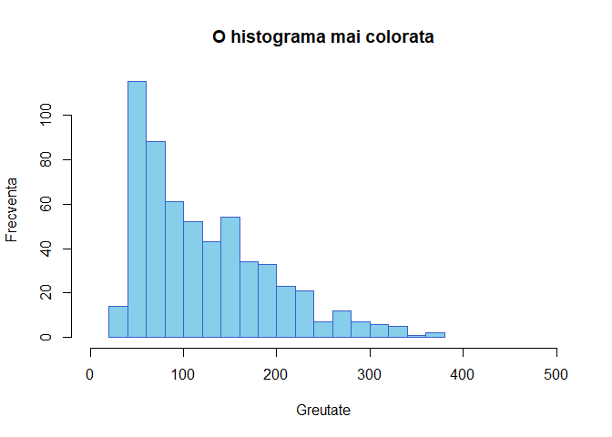

Dacă vrem să ilustrăm două histograme pe aceeași figură, pentru a evidenția repartiția după două clase, putem folosi argumentul `add = TRUE` la cel de-al doilea plot:


```r
hist(x = ChickWeight$weight[ChickWeight$Diet == 1],
     main = "Doua histograme pe acelasi grafic",
     xlab = "Greutate",
     ylab = "Frecventa",
     breaks = 20,
     xlim = c(0, 500),
     col = gray(0, .5))

hist(x = ChickWeight$weight[ChickWeight$Diet == 2],
     breaks = 30,
     add = TRUE, # Adauga graficul la cel de dinainte
     col = gray(1, .8))
```

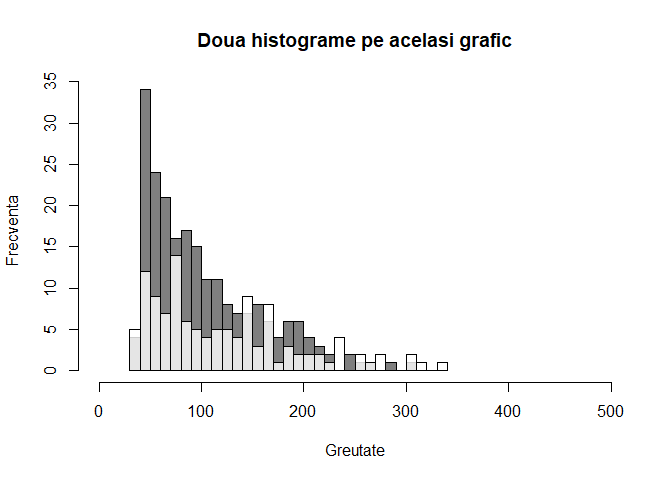

## Funcția `barplot`

Funcția `barplot` este folosită în special atunci când avem de-a face cu o variabilă discretă. Argumentul principal al funcției este `height`, un vector numeric care va genera înălțimea fiecărei bare. Pentru a adăuga nume sub fiecare bară putem folosi argumentul `names.arg`. 

De exemplu, folosind setul de date `mtcars` putem să afișăm greutatea medie a mașinilor în funcție de numărul de cilindrii:


```r
par(mfrow = c(1, 2))

weight_cars = aggregate(wt ~ cyl, 
                        data = mtcars, 
                        FUN = mean)

barplot(height = weight_cars$wt,
        names.arg = weight_cars$cyl,
        xlab = "Numar de cilindrii",
        ylab = "Greutatea medie",
        main = "Greutatea medie dupa numarul de cilindrii\n Barplot vertical",
        col = "grey80", 
        cex.main = 0.7)

barplot(height = weight_cars$wt,
        names.arg = weight_cars$cyl,
        horiz = TRUE,
        ylab = "Numar de cilindrii",
        xlab = "Greutatea medie",
        main = "Greutatea medie dupa numarul de cilindrii\n Barplot orizontal",
        col = "grey80", 
        cex.main = 0.7)
```

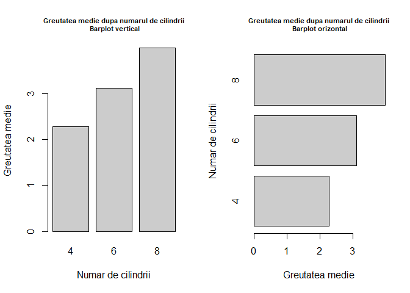

\BeginKnitrBlock{rmdexercise}<div class="rmdexercise">Folosind setul de date `ChickWeight` afișați, cu ajutorul funcției `barplot`, greutatea medie a găinilor în raport cu numărul de zile de la naștere.
 </div>\EndKnitrBlock{rmdexercise}

De asemenea putem crea un barplot clusterizat în funcție de mai multe grupuri de date. De exemplu să presupunem că vrem să vedem dacă există diferențe între greutatea medie a mașinilor (din setul de date `mtcars`) care au transmisie manuală sau automată și numărul de cilindrii. 


```r
# calculam greutatea medie dupa numarul de cilindrii si transmisie 
carWeight_cyl_am = aggregate(mtcars$wt, by = list(mtcars$cyl, mtcars$am), FUN = mean) 

# transformam rezultatul sub forma de matrice
carWeight_cyl_am = as.matrix(carWeight_cyl_am)
carWeight_cyl_am
     Group.1 Group.2        x
[1,]       4       0 2.935000
[2,]       6       0 3.388750
[3,]       8       0 4.104083
[4,]       4       1 2.042250
[5,]       6       1 2.755000
[6,]       8       1 3.370000

# aducem la forma necesara pentru barplot
carWeight = matrix(carWeight_cyl_am[,3], nrow = 3)
colnames(carWeight) = unique(carWeight_cyl_am[,2])
rownames(carWeight) = unique(carWeight_cyl_am[, 1])

carWeight = t(carWeight)

barplot(carWeight, 
        beside = TRUE,
        legend.text = TRUE, 
        col = c("royalblue3", "brown3"),
        main = "Greutatea medie a masinilor dupa numarul de cilindrii si transmisie",
        xlab = "Numar de cilindrii",
        ylab = "Greutatea medie")
```

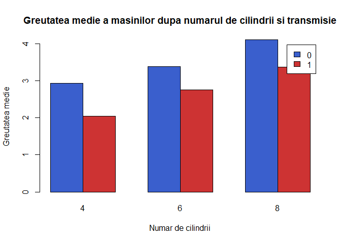

## Funcția `boxplot`

Pentru a vedea cât de bine sunt repartizate datele în setul de date putem folosi funcția `boxplot` (box and whisker plot - cutie cu mustăți). Această funcție prezintă într-o manieră compactă modul în care este repartizată o variabilă. Această metodă grafică prezintă principalii indicatori de poziție ai variabilei studiate: cuartilele de ordin 1 și 3 ($Q_1$, $Q_3$) care delimitează cutia ($IQR = Q_3-Q_1$) și cuartila de ordin 2 sau mediana (linia din interiorul cutiei). Mustățile sunt calculate în modul următor: mustața superioară este determinată de valoarea celei mai mari observații care este mai mică sau egală cu $Q_3 + 1.5 IQR$ iar mustața inferioară este valoarea celei mai mici observații mai mari sau egale cu $Q_1-1.5IQR$. Valorile din afara cutiei cu mustăți se numesc valori aberante.

Principalele argumente ale funcției `boxplot` se regăsesc în tabelul următor, pentru mai multe detalii apelați `?boxplot`.

| Argument| Descriere| 
|:------------|:-------------------------------------------------|
| `formula` | O formulă de tip `y ~ grp`, unde `y` este variabila investigată iar `grp` este variabila care descrie grupurile după care vrem să trasăm grafiul |
| `data` | Un data frame (sau listă) în care variabilele din formulă sunt definite |
| `subset` | Un vector care specifică o submulțime a observațiilor |
| `x` | Un vector care specifică valorile ce urmează să fie trasate |
| `horizontal` | O valoare logică care indică dacă trasăm boxplot-urile vertical (`FALSE`) sau orizontal (`TRUE`) |
| `add` | O valoare logică prin care se permite adăugarea graficului la unul deja existent |

Table: Tabelul 10. Principalele argumente ale functiei boxplot.

Următorul exemplu ne prezintă relația dintre consum (`mpg`) și numărul de cilindrii (`cyl`) în cazul mașinilor din setul de date `mtcars`.


```r
boxplot(mpg ~ cyl, 
        data = mtcars, 
        xlab = "Numar de cilindrii",
        ylab = "Mile pe galon", 
        main = "Consumul in functie de numarul de cilindrii")
```

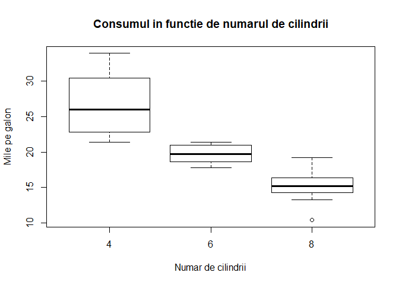

Putem să vedem această relație și în raport cu tipul de transmisie.


```r
boxplot(mpg ~ cyl, 
        data = mtcars, 
        subset = am == 0,
        boxwex = 0.25, 
        at = 1:3 - 0.2,
        col = "darkgrey",
        xlab = "Numar de cilindrii",
        ylab = "Mile pe galon", 
        main = "Consumul dupa de numarul de cilindrii si transmisie",
        xlim = c(0.5, 3.5), 
        ylim = c(0, 35),
        yaxs = "i")

boxplot(mpg ~ cyl, 
        data = mtcars, 
        subset = am == 1,
        add = TRUE,
        boxwex = 0.25, 
        at = 1:3 + 0.2,
        col = "brown3")

legend("bottomright" ,c("Manuala", "Automata"),
       fill = c("lightgray", "brown3"), bty = "n")
```

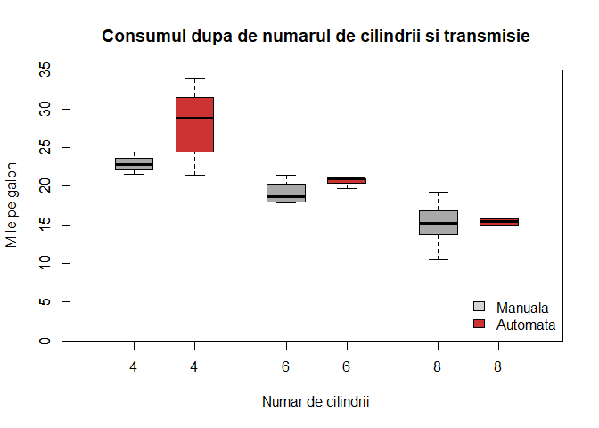

## Funcții pentru adăugarea unor elemente la un grafic 

Funcțiile (low-level) din această secțiune sunt folosite pentru a adăuga elemente, de tipul linii, puncte, text la un grafic deja existent.

|Funcția               |rezultatul                   |
|:---------------------|:---------------------------|
|`points(x, y)`      |Adaugă puncte la un grafic.               |
|`abline()`, `segments()`      |Adaugă linii sau segmente la un grafic existent.               |
|`arrows()`      |Adaugă săgeți.             |
|`curve()`      |Adaugă o curbă care reprezintă graficul unei funcții.              |
|`rect()`,`polygon()`      |Adaugă un dreptunghi sau un poligon oarecare.            |
|`text()`, `mtext()`      |Adaugă text la o figură.               |
|`legend()`      |Adaugă legenda.           |
|`axis()`      |Adaugă o axă.            |

Table: Tabelul 11. Functii low-level uzuale

Pentru a adăuga noi puncte la un grafic deja existent putem folosi funcție `points()`. Pentru a vedea toate argumentele acestei funcții apelați `?points`. 

Să considerăm următorul exemplu în care trasăm diagrama de împrăștiere după consum (`mpg`) și putere (`hp`) pentru mașinile din setul de date `mtcars` în raport cu tipul de transmisie. 


```r
plot(x = mtcars$mpg[mtcars$am == 0], 
     y = mtcars$hp[mtcars$am == 0], 
     xlab = "Mile pe galon",
     ylab = "Cai putere", 
     main = "Consum vs Cai putere dupa transmisie",
     pch = 16, 
     col = "darkgrey")

points(x = mtcars$mpg[mtcars$am == 1], 
      y = mtcars$hp[mtcars$am == 1], 
      pch = 16, 
      col = "brown3")
```

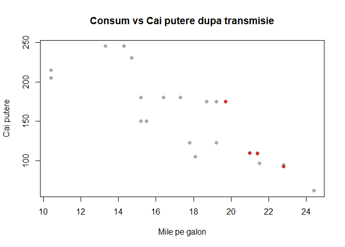

Dacă vrem să adăugăm linii drepte la un grafic putem folosi comanda `abline()` sau `segments()`. De exemplu în figura de mai sus vrem să adăugăm o linie verticală și una orizontală care să marcheze media variabilelor de pe axa x și y.


```r
plot(x = mtcars$mpg, 
     y = mtcars$hp, 
     xlab = "Mile pe galon",
     ylab = "Cai putere", 
     main = "Consum vs Cai putere",
     pch = 16, 
     col = "darkgrey")

abline(h = mean(mtcars$hp), lty = 2)
abline(v = mean(mtcars$mpg), lty = 2)
```

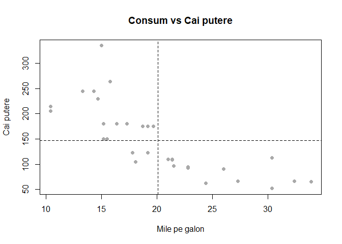

Pentru a adăuga numele mașinilor cu transmisie automată în fiecare punct putem folosi comanda `text()`. Argumentele principale ale acestei funcții sunt `x`, `y` care descriu coordonatele etichetelor și `labels` care reprezintă etichetele.


```r
plot(x = mtcars$mpg, 
     y = mtcars$hp, 
     xlab = "Mile pe galon",
     ylab = "Cai putere", 
     main = "Consum vs Cai putere",
     pch = 16, 
     col = "darkgrey")

abline(h = mean(mtcars$hp), lty = 2)
abline(v = mean(mtcars$mpg), lty = 2)

text(x = mtcars$mpg[mtcars$am == 1], 
     y = mtcars$hp[mtcars$am == 1],
     labels = rownames(mtcars[mtcars$am == 1, ]), 
     pos = 3, 
     cex = 0.5)
```

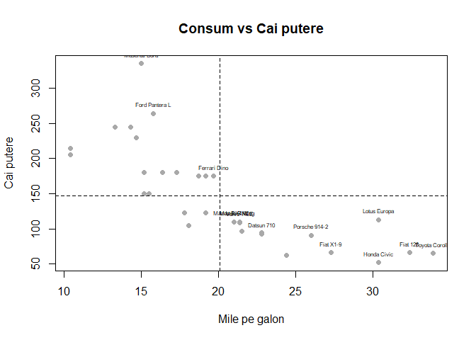

Funcția `curve()` permite trasarea/adăugarea unei linii care descrie o funcție. Printre argumentele funcției regăsim `expr` care reprezintă expresia funcției care depinde de `x` (se pot folosi și funcții customizate), `from, to` care reprezintă intervalul de valori pentru `x` și `add` care permite adăugarea unei curbe la un grafic existent.


```r
curve(expr = sin(x),
      from = 0,
      to = 2*pi, 
      ylab = "", 
      main = "Graficul functiei sin si cos",
      col = "red")

curve(expr = cos(x),
      from = 0,
      to = 2*pi,
      add = TRUE,
      col = "blue", 
      lty = 2)
```

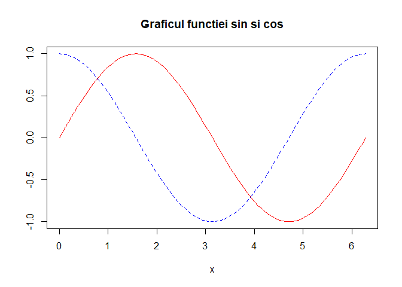

Atunci când vrem să adăugăm o legendă la un grafic folosim funcția `legend()`. Argumentele acestei funcții se regăsesc în tabelul de mai jos.

|Argument               |Rezultat                   |
|:---------|:----------------------------------------------------|
|`x, y`      |Coordonatele legendei - de exemplu, `x = 0, y = 0` va pune legenda la coordonatele (0, 0). Alternativ, putem indica poziția unde vrem legenda (i.e. `"topright"`, `"topleft"`). |
|`legend`      |Un vector de caractere care precizează textul care vrem să apară în legendă.|
|`pch, lty, lwd, col, pt.bg, ...`      |Argumente grafice adiționale (pentru detalii apelați `?legend`).|

Table: Tabelul 12. Argumentele functiei legend()

Ca exemplu să considerăm graficele de funcții de mai sus la care vrem să specificăm care grafic corespunde funcției $sin$ și care funcției $cos$:


```r
curve(expr = sin(x),
      from = 0,
      to = 2*pi, 
      ylab = "", 
      main = "Graficul functiei sin si cos",
      col = "red")

curve(expr = cos(x),
      from = 0,
      to = 2*pi,
      add = TRUE,
      col = "blue", 
      lty = 2)

legend("bottomright", 
       legend = c("sin(x)", "cos(x)"), 
       col = c("red", "blue"),
       lty = c(1, 2),
       bty = "n")
```

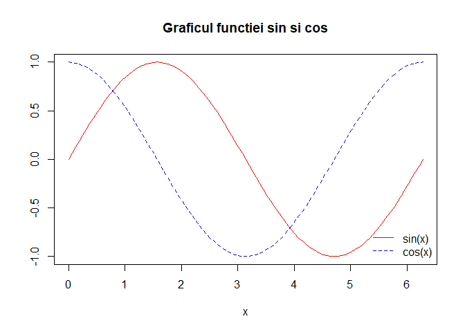

## Salvarea figurilor 

Odată ce am creat un grafic putem să-l salvăm într-un fișier extern. Pentru aceasta folosim funcțiile `pdf()`, `png()` sau `jpeg()`. Aceste funcții vor salva figura ca fișier de tip .pdf, .png sau .jpeg.

|Argument               |Rezultat                   |
|:---------|:----------------------------------------------------|
|`file`      | Directorul și numele fișierului sub formă de șir de caractere. De exemplu, pentru a salva un grafic pe desktop scriem `file = "/Users/.../Desktop/plot.pdf"` pentru un fișier pdf.|
|`width, height`      | Dimensiunea graficului final în inchi.   |
|`dev.off()`      | Acesta nu este un argument al funcțiilor `pdf()` și `jpeg()`. Trebuie executat acest cod după ce trasarea graficului a fost efectuată pentru a finaliza crearea imaginii.|

Table: Tabelul 13. Argumente pentru functiile pdf, jpeg si png

Pentru a salva o imagine avem de parcurs următorii pași:

1. Execută funcțiile `pdf()` sau `jpeg()` cu argumentele `file, width, height`.
2. Execută codul care generează figura (e.g. `plot(x = 1:10, y = 1:10)`)
3. Completează scrierea fișierului prin execuția comenzii `dev.off()`. Această comandă spune R-ului că am finalizat crearea fișierului.


```r
# Pasul 1
pdf(file = "/Users/.../Desktop/MyPlot.pdf",   # directorul cu fisierul 
    width = 4, # latimea in inchi
    height = 4) # inaltimea in inchi

# Pasul 2
plot(x = 1:10, 
     y = 1:10)
abline(v = 0) 
text(x = 0, y = 1, labels = "Ceva text aleator")

# Pasul 3
dev.off()
```

# Familia de funcții `apply`


Pe lângă buclele `for` și `while`, în R există și un set de funcții care permit scrierea și rularea într-o manieră mai compactă a codului dar și aplicarea de funcții unor grupuri de date.  

- `lapply()`: Evaluează o funcție pentru fiecare element al unei liste

- `sapply()`: La fel ca `lapply` numai că încearcă să simplifice rezultatul

- `apply()`: Aplică o funcție după fiecare dimensiune a unui `array`

- `tapply()`: Aplică o funcție pe submulțimi ale unui vector

- `mapply()`: Varianta multivariată a funcției `lapply`

- `split`: Împarte un vector în grupuri definite de o variabilă de tip factor. 

## `lapply()`

Funcția `lapply()` efectuează următoarele operații:

1. buclează după o listă, iterând după fiecare element din acea listă
2. aplică o *funcție* fiecărui element al listei (o funcție pe care o specificăm)
3. întoarce ca rezultat tot o listă (prefixul `l` vine de la listă). 

Această funcție primește următoarele trei argument: (1) o listă `X`; (2) o funcție `FUN`; (3) alte argumente via `...`. Dacă `X` nu este o listă atunci aceasta va fi transformată într-una folosind comanda `as.list()`.

Considerăm următorul exemplu în care vrem să aplicăm funcția `mean()` tuturor elementelor unei liste


```r
set.seed(222)
x <- list(a = 1:5, b = rnorm(10), c = rnorm(20, 1), d = rnorm(100, 5))
lapply(x, mean)
$a
[1] 3

$b
[1] 0.1996044

$c
[1] 0.7881026

$d
[1] 5.064188
```

Putem să folosim funcția `lapply()` pentru a evalua o funcție în moduri repetate. Mai jos avem un exemplu în care folosim funcția `runif()` (permite generarea observațiilor uniform repartizate) de patru ori, de fiecare dată generăm un număr diferit de valori aleatoare. Mai mult, argumentele $min=0$ și $max=3$ sunt atribuite, prin intermediul argumentului `...`, funcției `runif`.  


```r
x <- 1:4
lapply(x, runif, min = 0, max = 3)
[[1]]
[1] 0.03443616

[[2]]
[1] 1.267361 1.365441

[[3]]
[1] 1.8084700 2.1902665 0.4139585

[[4]]
[1] 1.5924650 0.7355067 2.1483841 1.6082945
```

## `sapply()`

Funcția `sapply()` are un comportament similar cu `lapply()` prin faptul că funcția `sapply()` apelează intern `lapply()` pentru valorile de input, după care evaluează:

- dacă rezultatul este o listă în care fiecare element este de lungime 1, atunci întoarce un vector

- dacă rezultatul este o listă în care fiecare element este un vector de aceeași lungime (>1), se întoarce o matrice

- în caz contrar se întoarce o listă.

Considerăm exemplul de mai sus


```r
set.seed(222)
x <- list(a = 1:4, b = rnorm(10), c = rnorm(20, 1), d = rnorm(100, 5))
sapply(x, mean)
        a         b         c         d 
2.5000000 0.1996044 0.7881026 5.0641876 
```


## `split()`

Funcția `split()` primește ca argument un vector sau o listă (sau un data.frame) și împarte datele în grupuri determinate de o variabilă de tip factor (sau o listă de factor).

Argumentele aceste funcții sunt 


```r
str(split)
function (x, f, drop = FALSE, ...)  
```

unde

- `x` este un vector, o listă sau un data.frame
- `f` este un factor sau o listă de factori

Considerăm următorul exemplu în care generăm un vector de date și îl împărțim după o variabilă de tip factor creată cu ajutorul funcției `gl()` (*generate levels*).


```r
x <- c(rnorm(10), runif(10), rnorm(10, 1))
f <- gl(3, 10)
split(x, f)
$`1`
 [1] -2.27414224 -0.11266780  0.61308167  0.07733545  0.57137727
 [6]  0.11672493 -0.95685256 -1.90008460 -1.48972089  0.55925676

$`2`
 [1] 0.91159086 0.03291829 0.78368939 0.11852882 0.64443831 0.78790988
 [7] 0.82451477 0.05642366 0.65075027 0.95426854

$`3`
 [1]  2.6666242  2.6634334  1.8106280 -0.7837308  1.6575684  0.1546575
 [7]  0.4930056 -0.9031544  2.4042311  1.4106863
```

Putem folosi funcția `split` și în conjuncție cu funcția `lapply` (atunci când vrem să aplicăm o funcție `FUN` pe grupuri de date).


```r
lapply(split(x, f), mean)
$`1`
[1] -0.4795692

$`2`
[1] 0.5765033

$`3`
[1] 1.157395
```

## `tapply()`

Funcția `tapply()` este folosită pentru aplicarea unei funcții `FUN` pe submulțimile unui vector și poate fi văzută ca o combinație între `split()` și `sapply()`, dar doar pentru vectori. 


```r
str(tapply)
function (X, INDEX, FUN = NULL, ..., default = NA, simplify = TRUE)  
```

Argumentele acestei funcții sunt date de următorul tabel:

| Argument | Descriere |
|:------------------|:---------------------|
| `X` | un vector |
| `INDEX` | este o variabilă de tip factor sau o listă de factori |
| `FUN` | o funcție ce urmează să fie aplicată |
| `...` | argumente ce vor fi atribuite funcției `FUN` |
| `simplify` | dacă vrem să simplificăm rezultatul |

Table: Tabelul 14. Argumentele functiei tapply

Următorul exemplu calculează media după fiecare grupă determinată de o variabilă de tip factor a unui vector numeric.


```r
x <- c(rnorm(10), runif(10), rnorm(10, 1))
f <- gl(3, 10)   
f
 [1] 1 1 1 1 1 1 1 1 1 1 2 2 2 2 2 2 2 2 2 2 3 3 3 3 3 3 3 3 3 3
Levels: 1 2 3
tapply(x, f, mean)
            1             2             3 
-0.0007774025  0.3736457792  0.5789436983 
```

Putem să aplicăm și funcții care întorc mai mult de un rezultat. În această situație rezultatul nu poate fi simplificat:


```r
tapply(x, f, range)
$`1`
[1] -2.1904113  0.9249901

$`2`
[1] 0.004445296 0.998309704

$`3`
[1] -0.3379675  1.9327099
```

## `apply()`


Funcția `apply()` este folosită cu precădere pentru a aplica o funcție liniilor și coloanelor unei matrice (care este un `array` bidimensional). Cu toate acestea poate fi folosită pe tablouri multidimensionale (`array`) în general. Folosirea funcției `apply()` nu este mai rapidă decât scrierea unei bucle `for`, dar este mai compactă.


```r
str(apply)
function (X, MARGIN, FUN, ...)  
```

Argumentele funcției `apply()` sunt

- `X` un tablou multidimensional
- `MARGIN` este un vector numeric care indică dimensiunea sau dimensiunile după care se va aplica funcția 
- `FUN` este o funcție ce urmează să fie aplicată
- `...` alte argumente penru funcția`FUN`

Considerăm următorul exemplu în care calculăm media pe coloane într-o matrice


```r
x <- matrix(rnorm(200), 20, 10)
apply(x, 2, mean)  ## media fiecarei coloane
 [1]  3.745002e-02  1.857656e-01 -2.413659e-01 -2.093141e-01 -2.562272e-01
 [6]  8.986712e-05  7.444137e-02 -7.460941e-03  6.275282e-02  9.801550e-02
```

precum și media după fiecare linie


```r
apply(x, 1, sum)   ## media fiecarei linii
 [1]  2.76179139  2.53107681  0.87923177  1.80480589  0.98225832
 [6] -3.06148753 -1.40358820 -0.65969812 -1.63717046 -0.29330726
[11] -2.41486442 -3.15698523  2.27126822 -3.88290287 -3.15595194
[16]  5.41211963  2.32985530 -3.05330574 -0.02110926 -1.34909559
```

# Repartiții și elemente aleatoare în R

R pune la disploziție majoritatea repartițiilor uzuale. Tabelul de mai jos prezintă numele și parametrii acestora:

| Repartiția | Nume | Parametrii | Valori prestabilite |
|:--------------------------|:------------------------|:----------------------|:-----------------------------|
| Beta | `beta` | `shape1`, `shape2` |  |
| Binomial | `binom` | `size`, `prob` |  |
| Cauchy | `cauchy` | `location`, `scale` | `location = 0`, `scale = 1` |
| Chi-Squared | `chisq` | `df` |  |
| Exponential | `exp`  | `rate` (=1/mean) |  `rate = 1`  |
| Fisher | `f`  | `df1`, `df2` |  |
| Gamma | `gamma` | `shape`, `rate` (=1/scale) | `rate = 1` |
| Hypergeometric | `hyper` | `m`, `n`, `k` |  |
| Log-Normal | `lnorm` | `mean`, `sd` | `mean = 0`, `sd = 1` | 
| Logistic | `logis` | `location`, `scale` | `location = 0`, `scale = 1` |
| Normal | `norm` | `mean`, `sd` | `mean = 0`, `sd = 1` | 
| Poisson | `pois` | `lambda` |  |
| Student | `t` | `df` |  |
| Uniform | `unif` | `min`, `max` | `min = 0`, `max = 1` |
| Weibull | `weibull` | `shape` |  |

Table: Tabelul 15. Numele si parametrii repartitiilor uzuale in R

Pentru fiecare repartiție, există patru comenzi în R prefixate cu literele `d`, `p`, `q` și `r` și urmate de numele repartiției (coloana a 2-a). De exemplu `dnorm`, `pnorm`, `qnorm` și `rnorm` sunt comenzile corespunzătoare repartiției normale pe când `dunif`, `punif`, `qunif` și `runif` sunt cele corespunzătoare repartiției uniforme.

  * `dname`: calculează densitatea atunci când vorbim de o variabilă continue sau funcția de masă atunci când avem o repartiție discretă ($\mathbb{P}(X=k)$)
  
  * `pname`: calculează funcția de repartiție, i.e. $F(x)=\mathbb{P}(X\leq x)$
  
  * `qname`: reprezintă funcția cuantilă, cu alte cuvinte valoarea pentru care funcția de repartiție are o anumită probabilitate; în cazul continuu, dacă `pname(x) = p` atunci `qname(p) = x` iar în cazul discret întoarce cel mai mic întreg $u$ pentru care $\mathbb{P}(X\leq u)\geq p$. 
  
  * `rname`: generează observații independente din repartiția dată 
  
O parte din cele mai cunoscute repartiții continue^[Pentru mai multe informații, se poate consulta monografia Johnson, N., Kotz, S. și Balakrishnan, N. *Continuous Univariate Distributions*, (Volumul 1, Ediția a 2-a), John Wiley & Sons, New York (1994),  756 pp., ISBN 0-471-58495-9] sunt prezentate mai jos:


## Repartiția Uniformă

O variabilă aleatoare $X$ repartizată *uniform* pe intervalul $[a,b]$, notată $X\sim \mathcal{U}[a,b]$, are densitatea dată de

$$
  f_X(x) = \left\{\begin{array}{ll}
    \frac{1}{b-a}, & x\in[a,b]\\
    0, & \text{altfel}
  \end{array}\right.
$$

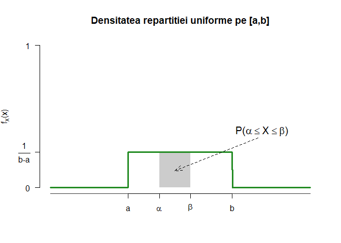

Funcția de repartiție a repartiției uniforme este 

$$
  F_X(x) =\int_{-\infty}^{x}f_X(t)\,dt = \left\{\begin{array}{ll}
    0, & x\leq a\\
    \frac{x-a}{b-a}, & x\in(a,b)\\
    1, & x\geq b
  \end{array}\right.
$$

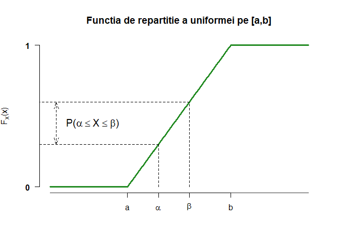

Media și varianța variabilei aleatoare $X$ repartizate uniform pe $[a,b]$ sunt egale cu 

$$
  \mathbb{E}[X] = \frac{a+b}{2},\qquad Var(X) = \frac{(a-b)^2}{12}. 
$$

Variabilele aleatoare repartizate uniform joacă un rol important în teoria simulării variabilelor aleatoare datorită următorului rezultat datorat lui Paul Levy și numit *teorema de universalitate a repartiției uniforme*:

\BeginKnitrBlock{rmdinsight}<div class="rmdinsight">Fie $X$ o variabilă aleatoare reală cu funcția de repartiție $F$, $U$ o variabilă aleatoare repartizată uniform pe $[0,1]$ și fie funcția *cuantilă* (inversa generalizată) asociată lui $F$, $F^{-1}:(0,1)\to\mathbb{R}$ definită prin 

$$
  F^{-1}(u) = \inf\{x\in\mathbb{R}\,|\,F(x)\geq u\}, \quad \forall u\in(0,1).
$$
Atunci $X$ și $F^{-1}(U)$ sunt repartizate la fel.

</div>\EndKnitrBlock{rmdinsight}

În R putem să

  - generăm observații independente din repartiția $\mathcal{U}([a, b])$ (e.g. $a = 3$ și $b = 5$)
  

```r
runif(10, 3, 5)
 [1] 4.333149 3.781585 4.599373 4.075318 4.949425 4.817059 4.894950
 [8] 3.030199 4.964791 4.941631
```

  - calculăm densitatea unei variabile aleatoare repartizate uniform pe $[a, b]$ în diferite puncte
  

```r
dunif(c(3.1, 3.7, 3.95, 4.86), 3, 5)
[1] 0.5 0.5 0.5 0.5
```

  - calculăm funcția de repartiție a unei variabile repartizate uniform pe $[a,b]$ pentru diferite valori
  

```r
punif(c(3.1, 3.7, 3.95, 4.86), 3, 5)
[1] 0.050 0.350 0.475 0.930
```

<div class="rmdexercise">
<p>Fie <span class="math inline">\(X\)</span> o variabilă aleatoare repartizată uniform pe <span class="math inline">\([2,7]\)</span>. Determinați:</p>
<ol style="list-style-type: lower-alpha">
<li><span class="math inline">\(\mathbb{P}(X\in\{1,2,3,4,5,6,7\})\)</span></li>
<li><span class="math inline">\(\mathbb{P}(X&lt;3)\)</span> și <span class="math inline">\(\mathbb{P}(X\leq 3)\)</span></li>
<li><span class="math inline">\(\mathbb{P}(X\leq 3 \cup X&gt;4)\)</span></li>
<li>Generați <span class="math inline">\(250\)</span> de observații din repartiția dată, trasați histograma acestora și suprapuneți densitatea repartiției date (vezi figura de mai jos).</li>
</ol>
</div>

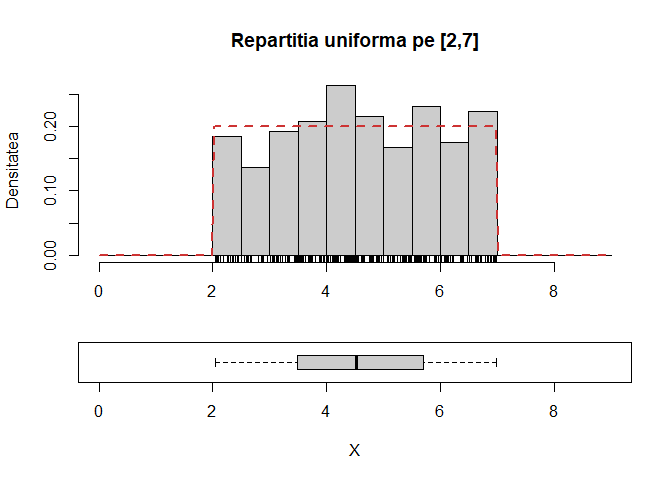

<div class="rmdexercise">
<p>Dacă <span class="math inline">\(X\)</span> o variabilă aleatoare repartizată uniform pe <span class="math inline">\([a,b]\)</span> și <span class="math inline">\([c,d]\subset [a,b]\)</span> este un subinterval, atunci repartiția condiționată a lui <span class="math inline">\(X\)</span> la <span class="math inline">\(X\in [c,d]\)</span> este <span class="math inline">\(\mathcal{U}[c,d]\)</span>.</p>
</div>

## Repartiția Normală

Spunem că o variabilă aleatoare $X$ este repartizată *normal* sau *Gaussian* de medie $\mu$ și varianță $\sigma^2$, și se notează cu $X\sim\mathcal{N}(\mu, \sigma^2)$, dacă densitatea ei are forma 

$$
  f_X(x) \left(\overset{not}{=} \varphi(x)\right) = \frac{1}{\sqrt{2\pi}\sigma}e^{-\frac{(x-\mu)^2}{2\sigma^2}}, \quad x\in\mathbb{R}.
$$

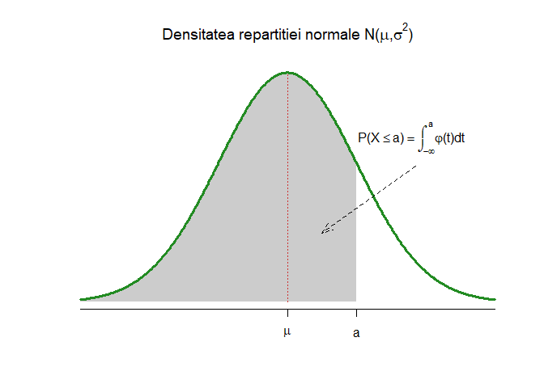

Funcția de repartiție a unei variabile $X\sim\mathcal{N}(\mu, \sigma^2)$ este dată de 

$$
  F_X(x) \left(\overset{not}{=} \Phi(x)\right) = \int_{-\infty}^{x}\varphi(t)\,dt = \frac{1}{\sqrt{2\pi}\sigma}\int_{-\infty}^{x}e^{-\frac{(t-\mu)^2}{2\sigma^2}}\,dt.
$$

Pentru funcția de repartiție nu avem o formulă explicită de calcul, ea poate fi aproximată cu ajutorul descompunerii în serie. În cazul variabilelor *normale standard* ($X\sim\mathcal{N}(0,1)$) avem proprietățile

  a) $\Phi(x) = 1-\Phi(-x)$ pentru toate valorile $x\in\mathbb{R}$
  b) $1-\Phi(a)\leq\frac{1}{2}e^{-\frac{a^2}{2}}$ pentru $a>0$^[Pentru mai multe astfel de inegalități se poate consulta cartea (capitolul 2): Lin, Z. și Bai, Z. *Probability Inequalities*, Springer, 2010.]


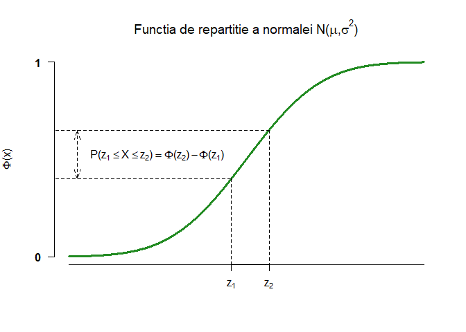

Media și varianța variabilei aleatoare $X$ repartizate normal de parametrii $\mathcal{N}(\mu, \sigma^2)$ sunt egale cu 

$$
  \mathbb{E}[X] = \mu,\quad Var(X) = \sigma^2. 
$$
Mai mult, momentele de ordin se pot calcula cu ușurință și avem că 

$$
  \mathbb{E}[X^k] = \left\{\begin{array}{ll}
      \sigma^k (k-1)!!, & \text{$k$ este par} \\
      0, & \text{$k$ este impar}.
  \end{array}\right.
$$

Pentru o variabilă aleatoare repartizată normal, avem următoarea regulă numită și regula $68-95-99.7\%$:

\BeginKnitrBlock{rmdinsight}<div class="rmdinsight">Fie $X$ o variabilă aleatoare repartizată $\mathcal{N}(\mu, \sigma^2)$. Atunci 

\begin{align*}
  \mathbb{P}(|X-\mu|<\sigma) &\approx 0.68\\
  \mathbb{P}(|X-\mu|<2\sigma) &\approx 0.95\\
  \mathbb{P}(|X-\mu|<3\sigma) &\approx 0.997
\end{align*}

</div>\EndKnitrBlock{rmdinsight}

În R putem să

  - generăm observații independente din repartiția $\mathcal{N}(\mu, \sigma^2)$ (e.g. $\mu = 0$ și $\sigma^2 = 2$ - în R funcțiile `rnorm`, `dnorm`, `pnorm` și `qnorm` primesc ca parametrii media și abaterea standard, $\sigma$ **nu** varianța $\sigma^2$)
  

```r
rnorm(10, mean = 0, sd = sqrt(2))
 [1]  3.24538640  2.72962533  2.63876613 -3.68120130 -0.80807440
 [6]  0.06325232 -1.67041553 -2.71001645 -2.08833178 -0.74799126
```

  - calculăm densitatea unei variabile aleatoare repartizate normal $\mathcal{N}(\mu, \sigma^2)$ în diferite puncte
  

```r
dnorm(seq(-2, 2, length.out = 15), mean = 3, sd = 5)
 [1] 0.04839414 0.05115647 0.05390019 0.05660592 0.05925368 0.06182308
 [7] 0.06429362 0.06664492 0.06885700 0.07091058 0.07278734 0.07447021
[13] 0.07594361 0.07719368 0.07820854
```

  - calculăm funcția de repartiție a unei variabile repartizate normal $\mathcal{N}(\mu, \sigma^2)$ pentru diferite valori
  

```r
pnorm(seq(-1, 1, length.out = 15), mean = 3, sd = 1)
 [1] 3.167124e-05 5.736006e-05 1.018892e-04 1.775197e-04 3.033834e-04
 [6] 5.086207e-04 8.365374e-04 1.349898e-03 2.137367e-03 3.320943e-03
[11] 5.063995e-03 7.579219e-03 1.113549e-02 1.606229e-02 2.275013e-02
```

  - calculăm cuantilele de ordin $\alpha\in(0,1)$ (i.e. valoarea $z_{\alpha}$ pentru care $\Phi(z_{\alpha}) = \alpha$ sau altfel spus $z_{\alpha} = \Phi^{-1}(\alpha)$)
  

```r
qnorm(c(0.01, 0.025, 0.05, 0.25, 0.5, 0.75, 0.95, 0.975, 0.99), mean = 0, sd = 1)
[1] -2.3263479 -1.9599640 -1.6448536 -0.6744898  0.0000000  0.6744898
[7]  1.6448536  1.9599640  2.3263479
```

\BeginKnitrBlock{rmdexercise}<div class="rmdexercise">Fie $X$ o variabilă aleatoare repartizată $\mathcal{N}(\mu, \sigma^2)$. Atunci pentru $\mu = 1$ și $\sigma = 3$ calculați:
  
  1) $\mathbb{P}(\text{$X$ este par})$
  2) $\mathbb{P}(X<3.4)$ și $\mathbb{P}(X>1.3)$
  3) $\mathbb{P}(1<X<4)$ 
  4) $\mathbb{P}(X\in [2,3]\cup[3.5,5])$
  5) $\mathbb{P}(|X-3|>6)$

</div>\EndKnitrBlock{rmdexercise}

\BeginKnitrBlock{rmdexercise}<div class="rmdexercise">Fie $X$ o variabilă aleatoare repartizată $\mathcal{N}(\mu, \sigma^2)$. Pentru $\mu = 0$ și $\sigma^2 \in \{0.2, 0.5, 1.5, 5\}$ trasați pe același grafic densitățile repartițiilor normale cu parametrii $\mathcal{N}(\mu, \sigma^2)$. Adăugați legendele corespunzătoare. Aceeași cerință pentru funcțiile de repartiție.

</div>\EndKnitrBlock{rmdexercise}

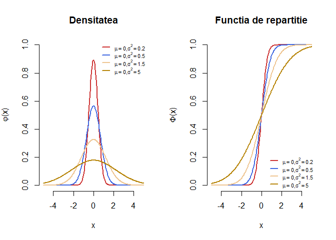


\BeginKnitrBlock{rmdexercise}<div class="rmdexercise">Generați $250$ de observații din repartiția $\mathcal{N}(0, 2)$, trasați histograma acestora și suprapuneți densitatea repartiției date (vezi figura de mai jos).

</div>\EndKnitrBlock{rmdexercise}

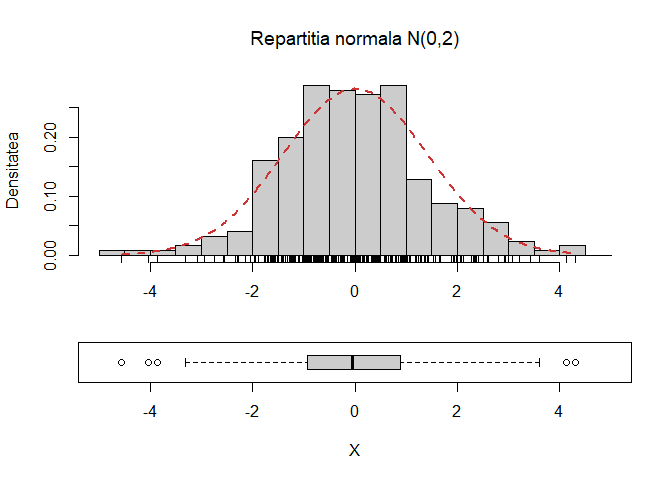

\BeginKnitrBlock{rmdexercise}<div class="rmdexercise">Fie $X$ o variabilă aleatoare repartizată normal de parametrii $\mu$ și $\sigma^2$. Ilustrați grafic pentru $\mu = 0$ și $\sigma = 1$ că are loc următoarea inegalitate: 

$$
  \left(\frac{1}{x}-\frac{1}{x^3}\right)\phi(x)<1-\Phi(x)<\frac{1}{x}\phi(x), \quad x>0.
$$
</div>\EndKnitrBlock{rmdexercise}

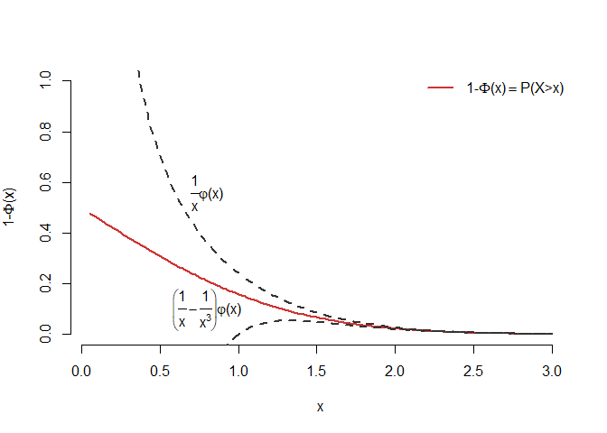


## Repartiția Log-Normală

Spune că o variabilă aleatoare $X$ este repartizată log-normal de parametrii $\mu$ și $\sigma^2$, și notăm $X\sim LN(\mu, \sigma^2)$, dacă $\ln(X)$ este repartizată normal de parametrii $\mu$ și $\sigma^2$. Cu alte cuvinte dacă $Y\sim \mathcal{N}(\mu, \sigma^2)$ atunci $X=e^Y\sim LN(\mu, \sigma^2)$. Densitatea repartiției log-normale $LN(\mu, \sigma^2)$ este 

$$
    f_X(x) = \frac{1}{x\sigma\sqrt{2\pi}}e^{-\frac{(\ln(x)-\mu)^2}{2\sigma^2}}, \quad x\in (0, +\infty).
$$

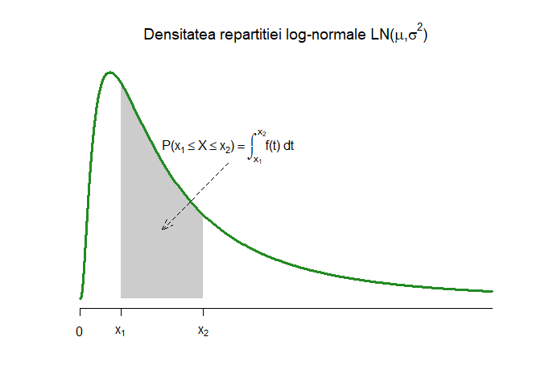

Funcția de repartiție a unei variabile aleatoare $X\sim LN(\mu, \sigma^2)$ este dată de 

$$
  F_{X}(x) = \int_{-\infty}^{x}f_X(t)\,dt = \frac{1}{\sqrt{2\pi}\sigma}\int_{-\infty}^{x}\frac{1}{t}e^{-\frac{(\ln(t)-\mu)^2}{2\sigma^2}}\,dt
$$

și, ca și în cazul repartiției normale, nu are o formulă explicită de calcul. 


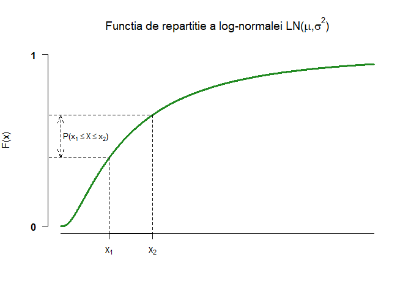

Media și varianța variabilei aleatoare $X$ repartizate log-normal de parametrii $LN(\mu, \sigma^2)$ sunt egale cu

$$
  \mathbb{E}[X] = e^{\mu+\frac{\sigma^2}{2}},\quad Var(X) = \left(e^{\sigma^2}-1\right)e^{2\mu+\sigma^2}. 
$$

\BeginKnitrBlock{rmdexercise}<div class="rmdexercise">Arătați că media și varianța unei variabile aleatoare repartizate log-normal de parametrii $\mu$ și $\sigma^2$ sunt egale cu

$$
  \mathbb{E}[X] = e^{\mu+\frac{\sigma^2}{2}},\quad Var(X) = \left(e^{\sigma^2}-1\right)e^{2\mu+\sigma^2}. 
$$

</div>\EndKnitrBlock{rmdexercise}

În R putem să

  - generăm observații independente din repartiția $LN(\mu, \sigma^2)$ (e.g. $\mu = 0$ și $\sigma^2 = 3$ - ca și în cazul repartiției normale, funcțiile `rlnorm`, `dlnorm`, `plnorm` și `qlnorm` primesc ca parametrii media și abaterea standard, $\sigma$ pentru $\ln(X)$ - variabila normală)
  

```r
rlnorm(15, meanlog = 0, sdlog = sqrt(3))
 [1]  2.13141475  6.27258447  2.18850080  3.15407005  0.13970018
 [6]  0.52638598 12.91237780  0.12004802  1.56359485  2.01674623
[11]  5.42024453  0.54647199  1.31619806  0.04716763  1.79762358
```

  - calculăm densitatea unei variabile aleatoare repartizate log-normal $LN(\mu, \sigma^2)$ în diferite puncte
  

```r
dlnorm(seq(0, 5, length.out = 20), meanlog = 3, sdlog = 5)
 [1] 0.00000000 0.20820751 0.11627647 0.08196427 0.06370023 0.05226715
 [7] 0.04440086 0.03864103 0.03423291 0.03074580 0.02791546 0.02557044
[13] 0.02359456 0.02190618 0.02044622 0.01917084 0.01804680 0.01704845
[19] 0.01615564 0.01535234
```

  - calculăm funcția de repartiție a unei variabile repartizate log-normal $LN(\mu, \sigma^2)$ pentru diferite valori
  

```r
plnorm(seq(0, 15, length.out = 25), meanlog = 3, sdlog = 1)
 [1] 0.0000000000 0.0002602257 0.0027443707 0.0088606283 0.0185933103
 [6] 0.0314027650 0.0466497221 0.0637426806 0.0821791298 0.1015482283
[11] 0.1215206945 0.1418356830 0.1622882185 0.1827183180 0.2030019832
[16] 0.2230439002 0.2427715876 0.2621307274 0.2810814477 0.2995953616
[21] 0.3176532076 0.3352429649 0.3523583472 0.3689975944 0.3851625036
```

  - calculăm cuantilele de ordin $\alpha\in(0,1)$ 
  

```r
qlnorm(c(0.01, 0.025, 0.05, 0.25, 0.5, 0.75, 0.95, 0.975, 0.99), meanlog = 0, sdlog = 1)
[1]  0.09765173  0.14086349  0.19304082  0.50941628  1.00000000  1.96303108
[7]  5.18025160  7.09907138 10.24047366
```


\BeginKnitrBlock{rmdexercise}<div class="rmdexercise">Fie $X$ o variabilă aleatoare repartizată $LN(\mu, \sigma^2)$. Pentru $\mu = 0$ și $\sigma \in \{0.25, 0.5, 1.5, 5\}$ trasați pe același grafic densitățile repartițiilor log-normale cu parametrii $LN(\mu, \sigma^2)$. Adăugați legendele corespunzătoare. Aceeași cerință pentru funcțiile de repartiție.

</div>\EndKnitrBlock{rmdexercise}

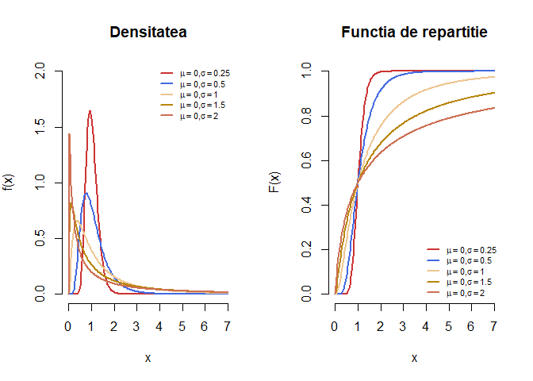


\BeginKnitrBlock{rmdexercise}<div class="rmdexercise">Generați $500$ de observații din repartiția $LN(0, 2)$, trasați histograma acestora și suprapuneți densitatea repartiției date (vezi figura de mai jos).

</div>\EndKnitrBlock{rmdexercise}

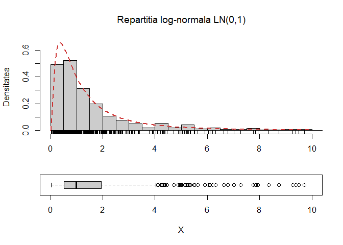

Printre fenomenele care pot fi modelate cu ajutorul repartiției log-normale se numără: cantitatea de lapte produsă de vaci, cantitatea de ploaie dintr-o perioadă dată, repartiția mărimii picăturilor de ploaie, volumul de gaz dintr-o rezervă petrolieră, etc. Pentru mai multe aplicații se poate consulta lucrarea lui Limpert, E., Stajel, W. și Abbt, M. [Log-normal Distributions across the Sciences: Keys and Clues](http://stat.ethz.ch/~stahel/lognormal/bioscience.pdf), *BioScience*, Vol. 51, Nr. 5, 2001. 

## Repartiția Exponențială

Spunem că o variabilă aleatoare $X$ este repartizată *exponențial* de parametru $\lambda$, și se notează cu $X\sim\mathcal{E}(\lambda)$, dacă densitatea ei are forma 

$$
  f_X(x) = \lambda e^{-\lambda x}\mathbb{1}_{\mathbb{R}_+}(x),\quad \forall x\in\mathbb{R}.
$$

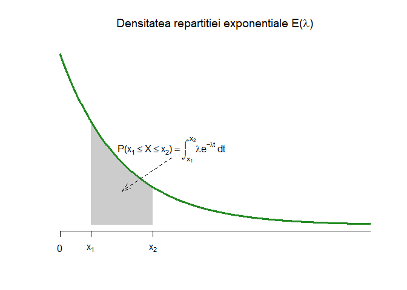

Funcția de repartiție a unei variabile aleatoare $X\sim \mathcal{E}(\lambda)$ este dată de 

$$
  F_{X}(x) = 1 - e^{-\lambda x}\mathbb{1}_{\mathbb{R}_+}(x), \quad x\in \mathbb{R}.
$$

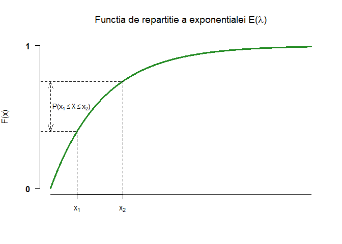

Media și varianța variabilei aleatoare $X$ repartizate exponențial de parametru $\lambda$ sunt egale cu

$$
  \mathbb{E}[X] = \frac{1}{\lambda},\quad Var(X) =  \frac{1}{\lambda^2}. 
$$

\BeginKnitrBlock{rmdexercise}<div class="rmdexercise">Arătați că momentul de ordin $k$, $k\geq 1$, al unei variabile aleatoare repartizate exponențial $X\sim\mathcal{E}(\lambda)$ este egal cu

$$
  \mathbb{E}[X^k] = \frac{k!}{\lambda^k}. 
$$

</div>\EndKnitrBlock{rmdexercise}

\BeginKnitrBlock{rmdinsight}<div class="rmdinsight">Fie $X$ o variabilă repartizată exponențial de parametru $\lambda$. Atunci are loc următoarea proprietate numită și *lipsa de memorie*: 

$$
      \mathbb{P}(X>s+t|X>s) = \mathbb{P}(X>t),\quad \forall s,t \geq 0. 
$$
  
Mai mult, dacă o variabilă aleatoare continuă^[Pentru cazul discret avem variabila repartizată Geometric.] $X$ verifică proprietatea de mai sus atunci ea este repartizată exponențial.


</div>\EndKnitrBlock{rmdinsight}

Variabilele aleatoare repartizate exponențial sunt utilizate în modelarea fenomenelor care se desfășoară în timp continuu și care satisfac (aproximativ) proprietatea lipsei de memorie: de exemplu timpul de așteptare la un ghișeu, durata de viață a unui bec sau timpul până la următoarea convorbire telefonică.

În R putem să

  - generăm observații independente din repartiția $\mathcal{E}(\lambda)$ (e.g. $\lambda = 5$)
  

```r
rexp(15, rate = 5)
 [1] 0.13505357 0.15392539 0.25036131 0.15351051 0.00878456 0.07362396
 [7] 0.07543271 0.18981181 0.05540771 0.05649451 0.15878039 0.39847262
[13] 0.05191221 0.07776034 0.22483594
```

  - calculăm densitatea unei variabile aleatoare repartizate exponențial $\mathcal{E}(\lambda)$ în diferite puncte
  

```r
dexp(seq(0, 5, length.out = 20), rate = 5)
 [1] 5.000000e+00 1.341312e+00 3.598237e-01 9.652719e-02 2.589462e-02
 [6] 6.946555e-03 1.863500e-03 4.999070e-04 1.341063e-04 3.597568e-05
[11] 9.650925e-06 2.588981e-06 6.945263e-07 1.863153e-07 4.998141e-08
[16] 1.340814e-08 3.596899e-09 9.649130e-10 2.588499e-10 6.943972e-11
```

  - calculăm funcția de repartiție a unei variabile repartizate exponențial $\mathcal{E}(\lambda)$ pentru diferite valori
  

```r
pexp(seq(0, 5, length.out = 15), rate = 5)
 [1] 0.0000000 0.8323228 0.9718843 0.9952856 0.9992095 0.9998675 0.9999778
 [8] 0.9999963 0.9999994 0.9999999 1.0000000 1.0000000 1.0000000 1.0000000
[15] 1.0000000
```

  - calculăm cuantilele de ordin $\alpha\in(0,1)$ 
  

```r
qexp(c(0.01, 0.025, 0.05, 0.25, 0.5, 0.75, 0.95, 0.975, 0.99), rate = 5)
[1] 0.002010067 0.005063562 0.010258659 0.057536414 0.138629436 0.277258872
[7] 0.599146455 0.737775891 0.921034037
```

\BeginKnitrBlock{rmdexercise}<div class="rmdexercise">Fie $X$ o variabilă aleatoare repartizată $\mathcal{E}(\lambda)$. Pentru $\lambda \in \{0.5, 1.5, 5\}$ trasați pe același grafic densitățile repartițiilor exponențiale de parametru $\lambda$. Adăugați legendele corespunzătoare. Aceeași cerință pentru funcțiile de repartiție.

</div>\EndKnitrBlock{rmdexercise}

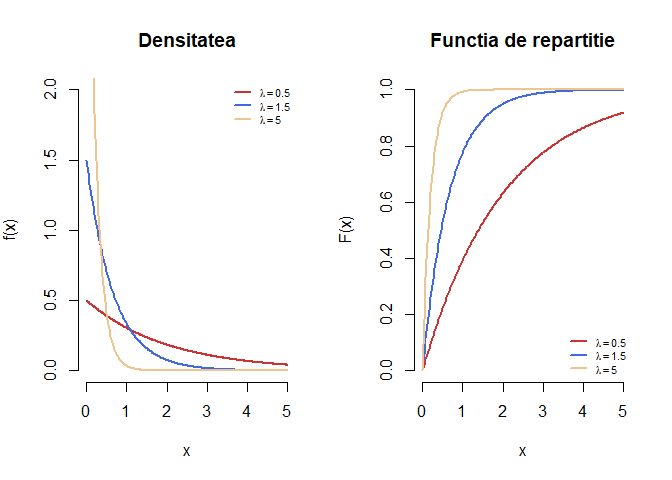

\BeginKnitrBlock{rmdexercise}<div class="rmdexercise">Folosind rezultatul de universalitate de la repartiția uniformă, descrieți o procedură prin care puteți simula o variabilă aleatoare repartizată exponențial $\mathcal{E}(\lambda)$ și construiți o funcție care permite generarea de $n$ observații independente dintr-o variabilă repartizată $X\sim \mathcal{E}(\lambda)$. 
</div>\EndKnitrBlock{rmdexercise}


\BeginKnitrBlock{rmdexercise}<div class="rmdexercise">Generați $250$ de observații din repartiția $\mathcal{E}(3)$, trasați histograma acestora și suprapuneți densitatea repartiției date (vezi figura de mai jos).

</div>\EndKnitrBlock{rmdexercise}

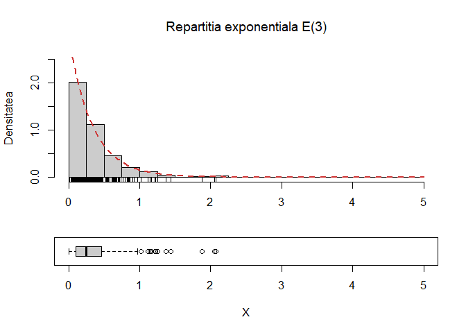


## Repartiția Cauchy

Spunem că o variabilă aleatoare $X$ este repartizată *Cauchy* de parametrii $(0, 1)$, și se notează cu $X\sim C(0,1)$, dacă densitatea ei are forma 

$$
  f_X(x) = \frac{1}{\pi} \frac{1}{1+x^2},\quad \forall x\in\mathbb{R}.
$$

Observăm că graficul densității repartiției Cauchy este asemănător cu cel al repartiției normale. Parametrul $M = 0$ reprezintă mediana (de fapt $\mathbb{P}(X\leq 0) = \mathbb{P}(X\geq 0) = \frac{1}{2}$) variabilei aleatoare $X$ și nu media iar prima și a treia cuartilă sunt $Q_1 = -1$ și respectiv $Q_3=1$ (avem $\mathbb{P}(X\leq -1) = \mathbb{P}(X\geq 1) = \frac{1}{4}$).  

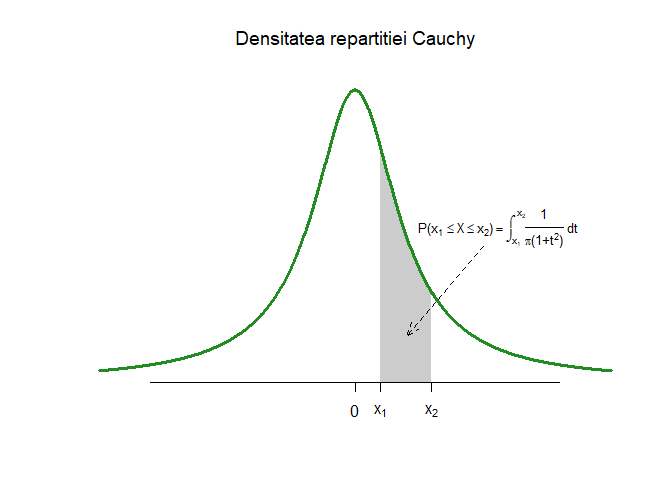

Funcția de repartiție a unei variabile aleatoare $X\sim C(0,1)$ este dată de 

$$
  F_{X}(x) = \frac{1}{2} + \frac{1}{\pi}\arctan(x), \quad x\in \mathbb{R}.
$$

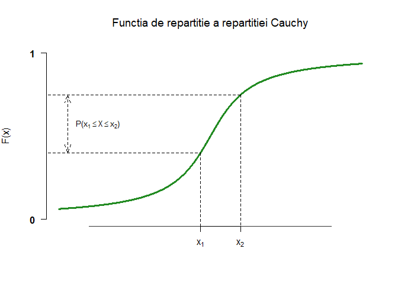

Media și varianța variabilei aleatoare $X\sim C(0,1)$ **nu există**. 

\BeginKnitrBlock{rmdexercise}<div class="rmdexercise">Arătați că o variabilă aleatoare repartizată Cauchy $C(0,1)$ nu are medie.  

</div>\EndKnitrBlock{rmdexercise}

Fie $Y\sim C(0,1)$ și $\alpha, \beta\in\mathbb{R}$ cu $\beta>0$. Spunem că variabila aleatoare $X = \alpha + \beta Y$ este repartizată Cauchy de parametrii $(\alpha, \beta)$, $X\sim C(\alpha, \beta)$. Densitatea ei este 

$$
  f_X(x) = \frac{1}{\pi\beta} \frac{1}{1+\left(\frac{x-\alpha}{\beta}\right)^2},\quad \forall x\in\mathbb{R}.
$$

Parametrii $\alpha$ și $\beta$ se interpretează în modul următor: $M = \alpha$ este mediana lui $X$ iar $Q_1 = \alpha-\beta$ și $Q_3 = \alpha + \beta$ reprezintă prima și a treia cuartilă.  

În R putem să

  - generăm observații independente din repartiția Cauchy $C(\alpha, \beta)$ (e.g. $\alpha = 0$, $\beta = 2$)
  

```r
rcauchy(15, location = 0, scale = 2)
 [1] -0.5966228  3.7627987  0.6864597 -0.4316018  1.4524446  0.3427032
 [7]  8.4285326  3.6056089  2.3506764 -3.5453329 -1.6137218 10.4304800
[13] -0.4449169  2.3005176 -3.6644199
```

  - calculăm densitatea unei variabile aleatoare repartizate Cauchy $C(\alpha, \beta)$ în diferite puncte
  

```r
dcauchy(seq(-5, 5, length.out = 20), location = 1, scale = 3)
 [1] 0.02122066 0.02450975 0.02852541 0.03345265 0.03951056 0.04693392
 [7] 0.05591721 0.06648594 0.07825871 0.09012539 0.10006665 0.10558334
[13] 0.10494052 0.09835367 0.08782920 0.07584810 0.06425529 0.05399054
[19] 0.04532934 0.03819719
```

  - calculăm funcția de repartiție a unei variabile repartizate Cauchy $C(\alpha, \beta)$ pentru diferite valori
  

```r
pcauchy(seq(-5, 5, length.out = 15), location = 1, scale = 3)
 [1] 0.1475836 0.1643213 0.1848605 0.2104166 0.2425988 0.2833834 0.3347507
 [8] 0.3975836 0.4697759 0.5451672 0.6158581 0.6764416 0.7255627 0.7644587
[15] 0.7951672
```

  - calculăm cuantilele de ordin $p\in(0,1)$ 
  

```r
qcauchy(c(0.01, 0.025, 0.05, 0.25, 0.5, 0.75, 0.95, 0.975, 0.99), location = 1, scale = 3)
[1] -94.46155 -37.11861 -17.94125  -2.00000   1.00000   4.00000  19.94125
[8]  39.11861  96.46155
```

\BeginKnitrBlock{rmdexercise}<div class="rmdexercise">Generați $2500$ de observații din repartiția Cauchy, trasați histograma acestora și suprapuneți densitatea repartiției date pentru intervalul $[-5,5]$ (vezi figura de mai jos).

</div>\EndKnitrBlock{rmdexercise}

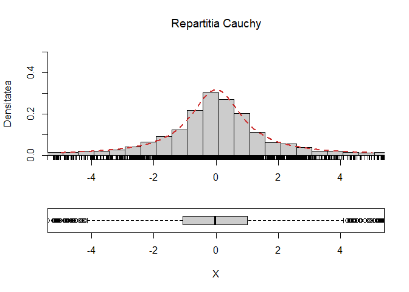

\BeginKnitrBlock{rmdexercise}<div class="rmdexercise">Fie $X$ și $Y$ două variabile aleatoare independente repartizate $\mathcal{N}(0,1)$. Arătați că variabila aleatoare $\frac{X}{Y}$ este repartizată Cauchy $C(0,1)$.

</div>\EndKnitrBlock{rmdexercise}

\BeginKnitrBlock{rmdexercise}<div class="rmdexercise">Fie $X$ o variabilă aleatoare repartizată Cauchy $C(\alpha, \beta)$. Pentru fiecare pereche de parametrii $(\alpha, \beta)$ din mulțimea $\{(0,0.5), (0, 1), (0, 2), (-1, 1.5), (-2, 1)\}$ trasați pe același grafic densitățile repartițiilor Cauchy cu parametrii $(\alpha, \beta)$. Adăugați legendele corespunzătoare. Aceeași cerință pentru funcțiile de repartiție.

</div>\EndKnitrBlock{rmdexercise}

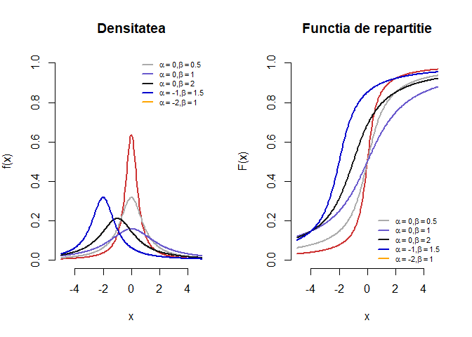

\BeginKnitrBlock{rmdexercise}<div class="rmdexercise">Folosind rezultatul de universalitate de la repartiția uniformă, descrieți o procedură prin care puteți simula o variabilă aleatoare repartizată Cauchy $C(0,1)$ și construiți o funcție care permite generarea de $n$ observații independente dintr-o variabilă repartizată $X\sim C(\alpha, \beta)$. Verificați pentru parametrii $\alpha = 3$ și $\beta = 5$ (a se vedea figura de mai jos).

</div>\EndKnitrBlock{rmdexercise}


```
Warning in rug(x): some values will be clipped
```

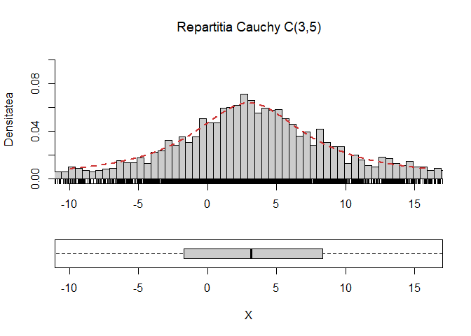

## Repartiția Gama

Spunem că o variabilă aleatoare $X$ este repartizată *Gama* de parametrii $(\alpha, \beta)$, cu $\alpha, \beta > 0$, și se notează cu $X\sim \Gamma(\alpha,\beta)$, dacă densitatea ei are forma 

$$
  f_X(x) = \frac{\beta^{\alpha}}{\Gamma(\alpha)} x^{\alpha-1} e^{-\beta x},\quad \forall x>0.
$$

unde $\Gamma(\alpha)$ este funcția (Gama, numită și integrală Euler de al doilea tip) definită prin 

$$
  \Gamma(\alpha) = \int_{0}^{\infty}x^{\alpha-1} e^{- x}\,dx,\quad \forall \alpha>0.
$$

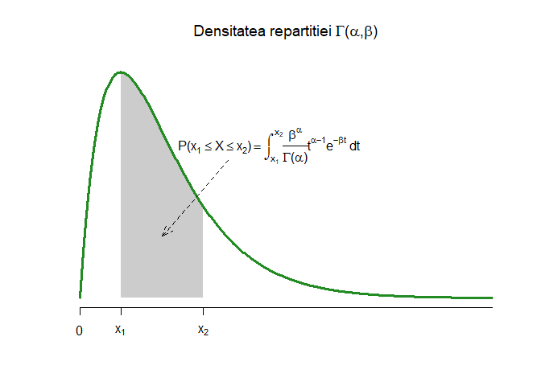


\BeginKnitrBlock{rmdexercise}<div class="rmdexercise">Arătați că funcția $\Gamma(\alpha)$ verifică^[Pentru mai multe proprietăți puteți consulta lucrarea lui E. Artin [The Gamma Function](http://plouffe.fr/simon/math/Artin%20E.%20The%20Gamma%20Function%20(1931)(23s).pdf)]:
  
  1) $\Gamma(1)=1$
  2) $\Gamma(\alpha+1) = \alpha\Gamma(\alpha), \quad \forall \alpha>0$
  3) $\Gamma(\alpha) = \beta^{\alpha}\int_{0}^{\infty}x^{\alpha-1} e^{- \beta x}\,dx,\quad \forall \alpha, \beta>0$
  4) $\Gamma(n) = (n-1)!,\quad n = 1,2,\cdots$
  5) $\Gamma(1/2) = \sqrt{\pi}$

</div>\EndKnitrBlock{rmdexercise}

Funcția de repartiție a unei variabile aleatoare $X\sim \Gamma(\alpha, \beta)$ este dată de 

$$
  F_{X}(x) = \int_{-\infty}^{x}f_X(t)\,dt = \frac{\beta^{\alpha}}{\Gamma(\alpha)}\int_{-\infty}^{x} t^{\alpha-1} e^{-\beta t}\,dt
$$

și nu are o formulă explicită de calcul. 

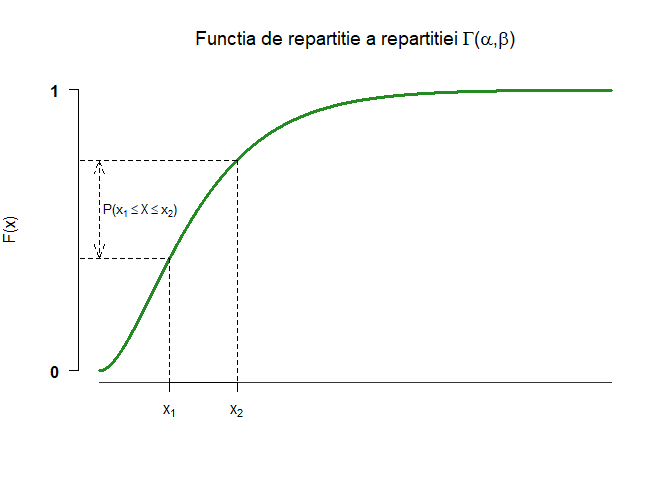

Observăm că repartiția $\Gamma(1, \lambda)$ coincide cu repartiția $\mathcal{E}(\lambda)$. 

Media și varianța variabilei aleatoare $X$ repartizate Gama de parametrii $\Gamma(\alpha, \beta)$ sunt egale cu

$$
  \mathbb{E}[X] = \frac{\alpha}{\beta},\quad Var(X) = \frac{\alpha}{\beta^2}.
$$


\BeginKnitrBlock{rmdexercise}<div class="rmdexercise">Arătați că media și varianța unei variabile aleatoare repartizate Gama de parametrii $\alpha$ și $\beta$ sunt egale cu

$$
  \mathbb{E}[X] = \frac{\alpha}{\beta},\quad Var(X) = \frac{\alpha}{\beta^2}. 
$$

</div>\EndKnitrBlock{rmdexercise}

În R putem să

  - generăm observații independente din repartiția $\Gamma(\alpha, \beta)$ (e.g. $\alpha = 2$, $\beta = 2$)
  

```r
rgamma(15, shape = 2, rate = 2)
 [1] 0.2739606 1.0172288 1.6546379 0.4210210 0.8476985 0.2928765 0.6798413
 [8] 1.1393160 1.0763898 1.4411221 0.9500644 0.7387296 0.4159926 0.8942659
[15] 0.8366199
```

  - calculăm densitatea unei variabile aleatoare repartizate $\Gamma(\alpha, \beta)$ în diferite puncte
  

```r
dgamma(seq(0, 5, length.out = 20), shape = 1, rate = 3)
 [1] 3.000000e+00 1.362251e+00 6.185761e-01 2.808853e-01 1.275455e-01
 [6] 5.791632e-02 2.629886e-02 1.194188e-02 5.422615e-03 2.462321e-03
[11] 1.118100e-03 5.077110e-04 2.305433e-04 1.046860e-04 4.753619e-05
[16] 2.158541e-05 9.801583e-06 4.450739e-06 2.021008e-06 9.177070e-07
```

  - calculăm funcția de repartiție a unei variabile repartizate $\Gamma(\alpha, \beta)$ pentru diferite valori
  

```r
pgamma(seq(0, 5, length.out = 15), shape = 1, rate = 3)
 [1] 0.0000000 0.6574811 0.8826808 0.9598160 0.9862362 0.9952856 0.9983852
 [8] 0.9994469 0.9998106 0.9999351 0.9999778 0.9999924 0.9999974 0.9999991
[15] 0.9999997
```

  - calculăm cuantilele de ordin $p\in(0,1)$ 
  

```r
qgamma(c(0.01, 0.025, 0.05, 0.25, 0.5, 0.75, 0.95, 0.975, 0.99), shape = 1, rate = 3)
[1] 0.003350112 0.008439269 0.017097765 0.095894024 0.231049060 0.462098120
[7] 0.998577425 1.229626485 1.535056729
```

\BeginKnitrBlock{rmdexercise}<div class="rmdexercise">Fie $X$ o variabilă aleatoare repartizată $\Gamma(\alpha, \beta)$. Pentru fiecare pereche de parametrii $(\alpha, \beta)$ din mulțimea $\{(1,0.5), (2, 0.5), (3, 0.5), (5, 1), (9, 0.5), (7.5, 1), (0.5, 1) \}$ trasați pe același grafic densitățile repartițiilor Gama cu parametrii $(\alpha, \beta)$. Adăugați legendele corespunzătoare. Aceeași cerință pentru funcțiile de repartiție.

</div>\EndKnitrBlock{rmdexercise}


\BeginKnitrBlock{rmdexercise}<div class="rmdexercise">Generați $250$ de observații din repartiția $\Gamma(9,2)$, trasați histograma acestora și suprapuneți densitatea repartiției date (vezi figura de mai jos).

</div>\EndKnitrBlock{rmdexercise}

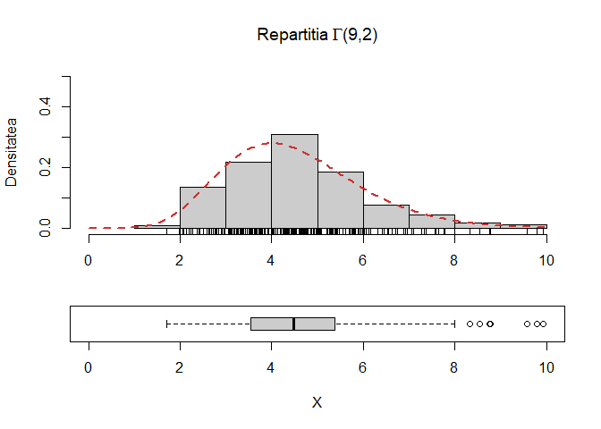

## Repartiția Beta

Spunem că o variabilă aleatoare $X$ este repartizată *Beta* de parametrii $(\alpha, \beta)$, cu $\alpha, \beta > 0$, și se notează cu $X\sim B(\alpha,\beta)$, dacă densitatea ei are forma 

$$
  f_X(x) = \frac{1}{B(\alpha, \beta)} x^{\alpha-1} (1-x)^{\beta-1},\quad 0\leq x\leq 1.
$$
unde $B(\alpha, \beta)$ este funcția (Beta, numită și integrală Euler de primul tip) definită prin 

$$
  B(\alpha, \beta) = \int_{0}^{\infty}x^{\alpha-1} (1-x)^{\beta-1}\,dx,\quad \forall \alpha, \beta >0.
$$

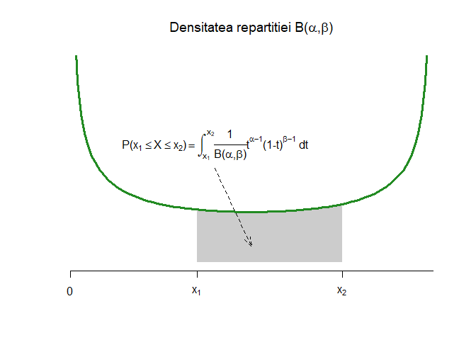

\BeginKnitrBlock{rmdexercise}<div class="rmdexercise">Arătați că funcția Beta $B(\alpha, \beta)$ verifică următoarele proprietăți:
  
  1) $B(\alpha, \beta) = \frac{\Gamma(\alpha)\Gamma(\beta)}{\Gamma(\alpha+\beta)}$
  2) $B(\alpha, \beta) = B(\beta, \alpha)$
  3) $B(\alpha, \beta) = B(\alpha, \beta+1) + B(\alpha+1, \beta)$
  4) $B(\alpha + 1, \beta) = B(\alpha, \beta) \frac{\alpha}{\alpha+\beta}$ și $B(\alpha, \beta + 1) = B(\alpha, \beta) \frac{\beta}{\alpha+\beta}$.

</div>\EndKnitrBlock{rmdexercise}

Funcția de repartiție a unei variabile aleatoare $X\sim B(\alpha, \beta)$ este dată de 

$$
  F_{X}(x) = \int_{-\infty}^{x}f_X(t)\,dt = \frac{1}{B(\alpha, \beta)} \int_{-\infty}^{x} t^{\alpha-1} (1-t)^{\beta-1}\,dt
$$

și nu are o formulă explicită de calcul. 

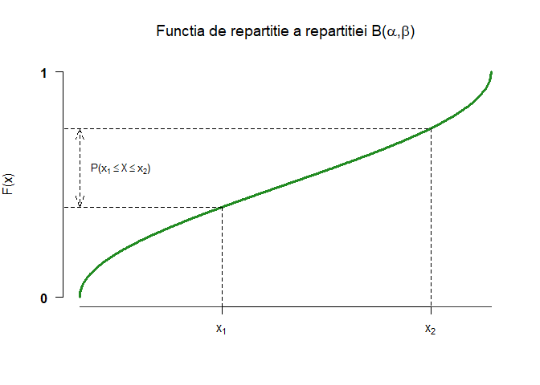

Observăm că repartiția $B(1, 1)$ coincide cu repartiția $\mathcal{U}([0,1])$. 

Media și varianța variabilei aleatoare $X$ repartizate Gamma de parametrii $B(\alpha, \beta)$ sunt egale cu

$$
  \mathbb{E}[X] = \frac{\alpha}{\alpha+\beta},\quad Var(X) = \frac{\alpha\beta}{(\alpha+\beta)^2(\alpha+\beta+1)}.
$$

Observăm că $Var(X)\leq\mathbb{E}[X](1-\mathbb{E}[X])$.

\BeginKnitrBlock{rmdexercise}<div class="rmdexercise">Arătați că media și varianța unei variabile aleatoare repartizate Beta de parametrii $\alpha$ și $\beta$ sunt egale cu

$$
  \mathbb{E}[X] = \frac{\alpha}{\alpha+\beta},\quad Var(X) = \frac{\alpha\beta}{(\alpha+\beta)^2(\alpha+\beta+1)}. 
$$

</div>\EndKnitrBlock{rmdexercise}

În R putem să

  - generăm observații independente din repartiția $B(\alpha, \beta)$ (e.g. $\alpha = 2.5$, $\beta = 1$)
  

```r
rbeta(15, shape1 = 2.5, shape2 = 1)
 [1] 0.7945436 0.7609136 0.9265073 0.9309420 0.5621874 0.3664261 0.9694945
 [8] 0.5804873 0.9504669 0.9115169 0.8457509 0.6717780 0.7213322 0.9738473
[15] 0.9791769
```

  - calculăm densitatea unei variabile aleatoare repartizate $B(\alpha, \beta)$ în diferite puncte
  

```r
dbeta(seq(0, 1, length.out = 20), shape1 = 1, shape2 = 3)
 [1] 3.000000000 2.692520776 2.401662050 2.127423823 1.869806094
 [6] 1.628808864 1.404432133 1.196675900 1.005540166 0.831024931
[11] 0.673130194 0.531855956 0.407202216 0.299168975 0.207756233
[16] 0.132963989 0.074792244 0.033240997 0.008310249 0.000000000
```

  - calculăm funcția de repartiție a unei variabile repartizate $B(\alpha, \beta)$ pentru diferite valori
  

```r
pbeta(seq(0, 1, length.out = 15), shape1 = 1, shape2 = 3)
 [1] 0.0000000 0.1993440 0.3702624 0.5149417 0.6355685 0.7343294 0.8134111
 [8] 0.8750000 0.9212828 0.9544461 0.9766764 0.9901603 0.9970845 0.9996356
[15] 1.0000000
```

  - calculăm cuantilele de ordin $p\in(0,1)$ 
  

```r
qbeta(c(0.01, 0.025, 0.05, 0.25, 0.5, 0.75, 0.95, 0.975, 0.99), shape1 = 1, shape2 = 3)
[1] 0.003344507 0.008403759 0.016952428 0.091439704 0.206299474 0.370039475
[7] 0.631596850 0.707598226 0.784556531
```

\BeginKnitrBlock{rmdexercise}<div class="rmdexercise">Fie $X$ o variabilă aleatoare repartizată $B(\alpha, \beta)$. Pentru fiecare pereche de parametrii $(\alpha, \beta)$ din mulțimea $\{(0.5,0.5), (1, 3), (5, 1), (2, 2), (2, 5)\}$ trasați pe același grafic densitățile repartițiilor Beta cu parametrii $(\alpha, \beta)$. Adăugați legendele corespunzătoare. Aceeași cerință pentru funcțiile de repartiție.

</div>\EndKnitrBlock{rmdexercise}

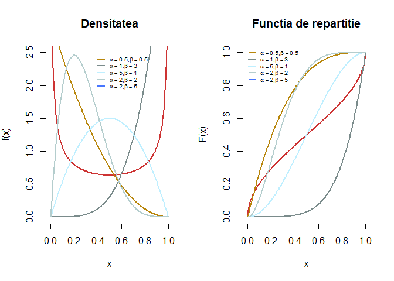

\BeginKnitrBlock{rmdexercise}<div class="rmdexercise">Generați $250$ de observații din repartiția $B(3,3)$, trasați histograma acestora și suprapuneți densitatea repartiției date (vezi figura de mai jos).

</div>\EndKnitrBlock{rmdexercise}

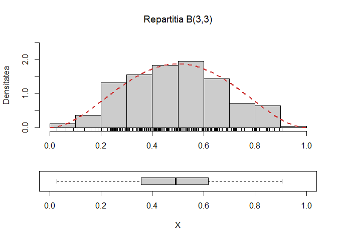

