<script>
$(document).ready(function ()  {

    // move toc-ignore selectors from section div to header
    $('div.section.toc-ignore')
        .removeClass('toc-ignore')
        .children('h1,h2,h3,h4,h5').addClass('toc-ignore');

    // establish options
    var options = {
      selectors: "h1,h2,h3",
      theme: "bootstrap3",
      context: '.toc-content',
      hashGenerator: function (text) {
        return text.replace(/[.\\/?&!#<>]/g, '').replace(/\s/g, '_').toLowerCase();
      },
      ignoreSelector: ".toc-ignore",
      scrollTo: 60
    };
    options.showAndHide = false;
    options.smoothScroll = true;

    // tocify
    var toc = $("#TOC").tocify(options).data("toc-tocify");
});
</script>

Obiectivul acestui laborator este de a prezenta câteva elemente (numerice și grafice) de statistică descriptivă/exploratorie pentru studiul rentabilității zilnice (*daily returns*) a unui număr de active reprezentative (assets). 


# Importarea datelor 

Înainte de a analiza datele trebuie să le descărcăm și să le punem într-un format ușor de utilizat pentru analiză. Datele pot fi obținute de pe diferite platforme online precum [Yahoo!Finance](https://finance.yahoo.com/) sau [Google Finance](https://finance.google.com/finance). Mai jos este ilustrat codul funcției `google_stocks` care permite extragerea datelor de pe platforma [Google Finance](https://finance.google.com/finance): 


```r
google_stocks <- function(sym, current = TRUE, sy = 2007, sm = 1, sd = 1, ey, em, ed)
{
  # sy, sm, sd, ey, em, ed corespund la
  # start year, start month, start day, end year, end month, si end day
  
  # Daca este TRUE folosim data curenta
  if(current){
    system_time <- as.character(Sys.time())
    ey <- as.numeric(substr(system_time, start = 1, stop = 4))
    em <- as.numeric(substr(system_time, start = 6, stop = 7))
    ed <- as.numeric(substr(system_time, start = 9, stop = 10))
  }

  tmp <- tempfile()
  
  # cat("downloading ", sym, ".....\n\n")
  google.URL = "http://finance.google.com/finance/historical?"
  download.file(paste(google.URL, "q=", sym, "&startdate=", 
                      month.abb[sm], "+", sprintf("%.2d", sd), 
                      ",+", sy, "&enddate=", month.abb[em], "+", 
                      sprintf("%.2d", ed), ",+", ey, "&output=csv", 
                      sep = ""), destfile = tmp, quiet = FALSE)
  google_out <- read.csv(tmp)

  # Redenumim prima coloana
  if(!is.null(google_out)){
    names(google_out)[1] = "Date"
  }
  
  # transformam coloana timp 
  google_out$Date = as.Date(strptime(google_out$Date, "%d-%B-%y"), 
                            origin = "1970-01-01")
  
  google_out = google_out[order(google_out$Date), ]
  
  return(google_out)
}
```

Pachetul R, [quantmod](https://cran.r-project.org/web/packages/quantmod/index.html) pune la dispoziție o serie de funcții care permit atât accesul la datele din [Yahoo!Finance](https://finance.yahoo.com/) sau [Google Finance](https://finance.google.com/finance), dar și din alte surse, cât și utilizarea unor tehnici specifice modelării financiare. De exemplu, funcția de mai sus are echivalentul (mult mai complez) `getSymbols()` din pachetul *quantmod*.

Să presupunem că suntem interesați de stoc-urile (*stock*) firmelor Apple, Microsoft și Google din perioada `01-01-2000` până în prezent. Pentru a extrage aceste date va trebui să folosim simbolul/abrevierea ([ticker symbol](https://en.wikipedia.org/wiki/Ticker_symbol) - search pe Goole după *ticker symbol*) fiecărei firme separat. Vom accesa aceste date cu ajutorul funcției `google_stocks`: 


```r
# data de start
sy = 2005
sm = 1
sd = 1

# datele
apple_data = google_stocks("AAPL", sy = sy, sm = sm, sd = sd)
msft_data = google_stocks("MSFT", sy = sy, sm = sm, sd = sd)
google_data = google_stocks("GOOG", sy = sy, sm = sm, sd = sd)
```

sau citind din fisier


```r
# Google data
google_data = read.csv("dataIn/google_data.csv", 
                       col.names = c("Date", "Open", "High", "Low",
                                     "Close", "Volume", "Adjusted"))

google_data$Date = as.Date(strptime(as.character(google_data$Date), "%Y-%m-%d"), 
                            origin = "1970-01-01")
  
google_data = google_data[order(google_data$Date), ]

# Apple data
apple_data = read.csv("dataIn/apple_data.csv",
                      col.names = c("Date", "Open", "High", "Low",
                                     "Close", "Volume", "Adjusted"))
apple_data$Date = as.Date(strptime(as.character(apple_data$Date), "%Y-%m-%d"), 
                            origin = "1970-01-01")
  
apple_data = apple_data[order(apple_data$Date), ]

# Microsoft data
msft_data = read.csv("dataIn/msft_data.csv",
                     col.names = c("Date", "Open", "High", "Low",
                                     "Close", "Volume", "Adjusted"))

msft_data$Date = as.Date(strptime(as.character(msft_data$Date), "%Y-%m-%d"), 
                            origin = "1970-01-01")
  
msft_data = msft_data[order(msft_data$Date), ]
```

Același lucru poate fi obținut cu ajutorul funcției `getSymbols` (descărcate de pe [Yahoo!Finance](https://finance.yahoo.com/)): 


```r
# pt a utiliza pachetul trebuie incarcat
if (!require("quantmod")) {
    install.packages("quantmod")
    library(quantmod)
}

# data de start
start <- as.Date("2005-01-01")

# datele din Yahoo finance
apple_data_yh = data.frame(getSymbols("AAPL", from = start, auto.assign = F))
msft_data_yh = data.frame(getSymbols("MSFT", from = start, auto.assign = F))
google_data_yh = data.frame(getSymbols("GOOG", from = start, auto.assign = F))
```

Vom folosi în cele ce urmează datele obținute cu funcția `google_stocks`. [Google Finance](https://finance.google.com/finance) oferă 5 serii pentru fiecare bun/activ. *Open* corespunde prețului stoc-ului la începutul zilei de tranzacționare și nu trebuie să fie neapărat egal cu prețul cu care s-a închis ziua precedentă, *High* și respectiv *Low* este prețul cel mai mare și respectiv cel mai mic din ziua de tranzacționare, iar *Close* este prețul stoc-ului la închiderea zilei de tranzacționare. Coloana *Volume* arată câte stoc-uri au fost tranzacționate în ziua respectivă.   


```r
head(apple_data, n = 5)
        Date     Open     High      Low    Close    Volume Adjusted
1 2005-01-03 4.627143 4.650714 4.471428 4.520714 172998000 3.060327
2 2005-01-04 4.556428 4.676429 4.497857 4.567143 274202600 3.091757
3 2005-01-05 4.604286 4.660714 4.575000 4.607143 170108400 3.118836
4 2005-01-06 4.619286 4.636428 4.523571 4.610714 176388800 3.121253
5 2005-01-07 4.642857 4.973571 4.625000 4.946429 556862600 3.348517
head(msft_data, n = 5)
        Date  Open  High   Low Close    Volume Adjusted
1 2005-01-03 26.80 26.95 26.65 26.74  65002900 19.93452
2 2005-01-04 26.87 27.10 26.66 26.84 109442100 20.00907
3 2005-01-05 26.84 27.10 26.76 26.78  72463500 19.96435
4 2005-01-06 26.85 27.06 26.64 26.75  76890500 19.94198
5 2005-01-07 26.82 26.89 26.62 26.67  68723300 19.88235
head(google_data, n = 5)
        Date      Open      High      Low     Close   Volume  Adjusted
1 2005-01-03  98.06220 101.16204 97.09847 100.70004 31894300 100.70004
2 2005-01-04 100.04928 100.80933 96.11487  96.62157 27690700  96.62157
3 2005-01-05  96.09996  97.81381 95.49390  96.12977 16580200  96.12977
4 2005-01-06  96.90970  97.31705 93.25348  93.66579 20909100  93.66579
5 2005-01-07  94.70404  96.49738 93.78005  96.29867 19451500  96.29867
```

Pentru a vizualiza evoluția prețului stoc-ului la închidere avem următoarele grafice:


```r
plot(google_data$Date, google_data$Close, 
     type = "l", 
     col = "royalblue",
     bty = "n",
     ylim = c(min(c(google_data$Close, apple_data$Close, msft_data$Close), na.rm = TRUE),
              max(c(google_data$Close, apple_data$Close, msft_data$Close), na.rm = TRUE)),
     xlab = "Perioada", 
     ylab = "Pretul")

lines(apple_data$Date, apple_data$Close,
      col = "brown3")
lines(msft_data$Date, msft_data$Close, 
      col = "forestgreen")

legend("topleft", 
       legend = c("Google", "Apple", "Microsoft"), 
       col = c("royalblue", "brown3", "forestgreen"), 
       lty = 1,
       bty = "n")
```

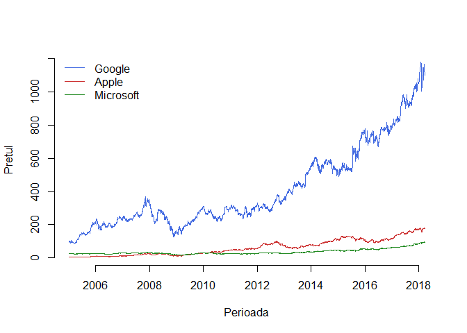

# Rentabilitate (Returns)

Scopul unei investiții este acela de a face profit, prin urmare investitorii sunt interesași în a face investiții care produc venituri mari relativ la mărimea investiției. Rentabilitatea / Rata de rentabilitate (returns) măsoară modificarea prețului unui bun exprimat ca o fracție din prețul inițial. 

## Rentabilitate netă și brută (net and gross return)

Să presupunem că achiziționăm un bun (activ, stock, etc.) la momentul $t_0$ cu prețul $P_{t_0}$ și îl vindem la momentul $t_1$ cu prețul $P_{t_1}$. Dacă între $t_0$ și $t_1$ nu avem schimbări de preț atunci rata de rentabilitate pe perioada $t_0$ - $t_1$ este 

$$
  R(t_0,t_1) = \frac{P_{t_1} - P_{t_0}}{P_{t_0}}.
$$

Perioada dintre $t_0$ și $t_1$ se numește perioada de retenție a bunului (*holding period*), perioada dintre achiziția și vânzarea unui bun (activ, etc.), și poate fi măsurată în secunde, minute, ore, zile, luni, etc. Dacă $P_t$ este prețul unui activ la momentul $t$ (să zicem la sfârșitul lunii $t$) și $P_{t-1}$ este prețul activului la momentul $t-1$ atunci rentabilitatea netă (*net return*) în perioada de la $t-1$ la $t$ este 

$$
  R_t = \frac{P_{t} - P_{t-1}}{P_{t-1}}
$$

și putem spune că 

$$
  \text{venitul } = \text{ investitia initiala } \times \text{ rentabilitatea neta}.
$$

Rentabilitatea brută (*gross return*) este definită prin 

$$
  \frac{P_{t}}{P_{t-1}} = 1 + R_t.
$$

Spre exemplu să considerăm o investiție de o lună într-un stock Microsoft. Să presupunem că achiziționăm stock-ul în luna $t-1$ cu prețul $P_{t-1} = 85\, u.m.$ și îl vindem în luna următoare cu $P_{t} = 90\, u.m.$. Atunci rentabilitatea netă și brută pe perioada de 1 lună sunt: $R_t = \frac{90-85}{85} = 0.058$ iar $1+R_t = 1.058$ ceea ce înseamnă că investiția a condus la o rentabiltate de $5.8\%$ sau altfel spus $1\,u.m.$ investită în stock-ul Microsoft în luna $t-1$ a crescut la $1.058\,u.m.$ în luna $t$ (creșterea a fost de $105.8\%$). 

Să presupunem că vrem să calculăm rentabilitatea zilnică (netă și brută) a stock-urilor Apple, Google și Microsoft: 


```r
# Rentabilitatea zilnica 
google_ret_s_daily = google_data$Close[-1] / google_data$Close[-length(google_data$Close)] - 1 
apple_ret_s_daily = apple_data$Close[-1] / apple_data$Close[-length(apple_data$Close)] - 1 
msft_ret_s_daily = msft_data$Close[-1] / msft_data$Close[-length(msft_data$Close)] - 1 

head(cbind(google_ret_s_daily, apple_ret_s_daily, msft_ret_s_daily))
     google_ret_s_daily apple_ret_s_daily msft_ret_s_daily
[1,]       -0.040501234      0.0102702803      0.003739716
[2,]       -0.005089951      0.0087582105     -0.002235432
[3,]       -0.025631748      0.0007751008     -0.001120276
[4,]        0.028109237      0.0728119332     -0.002990654
[5,]        0.006241924     -0.0041878697      0.004874353
[6,]       -0.007792465     -0.0638049631     -0.002611903
```

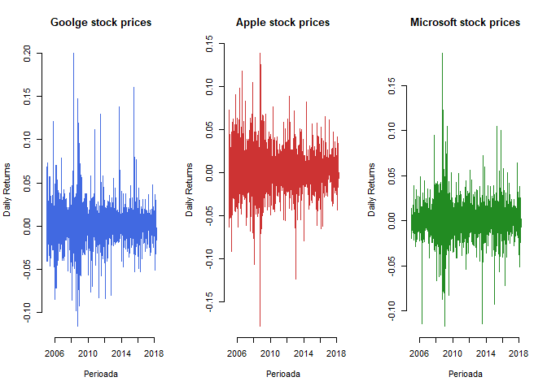

și rentabilitatea lunară:


```r
# Rentabilitatea lunara
returnMonth = function(dat){
  dat$Day = as.numeric(strftime(dat$Date, "%d"))
  dat$Month = as.numeric(strftime(dat$Date, "%m"))
  dat$Year = as.numeric(strftime(dat$Date, "%Y"))
  
  dat_month_diff = diff(dat$Month)
  dat_month = dat[dat_month_diff >= 1, ]
  
  month_ret = dat_month$Close[-1] / dat_month$Close[-length(dat_month$Close)] - 1 
  return(data.frame(date = dat_month$Date[-1], ret = month_ret))
}

google_ret_s_monthly = returnMonth(google_data)
apple_ret_s_monthly = returnMonth(apple_data)
msft_ret_s_monthly = returnMonth(msft_data)

head(cbind(google_ret_s_monthly$ret, apple_ret_s_monthly$ret, 
           msft_ret_s_monthly$ret))
            [,1]        [,2]        [,3]
[1,] -0.03900416  0.16670997 -0.04261800
[2,] -0.03978939 -0.07111008 -0.03934817
[3,]  0.21876907 -0.13462914  0.04675213
[4,]  0.26031817  0.10260667  0.01976285
[5,]  0.06087933 -0.07419507 -0.03720927
[6,] -0.02172367  0.15865239  0.03099843
```

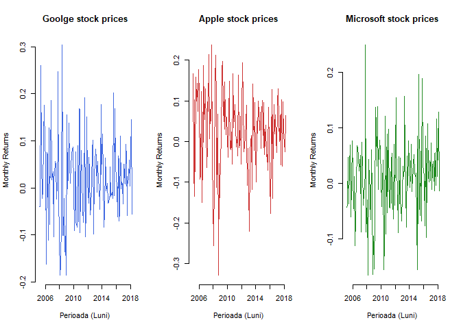

Rentabilitatea brută pe o $k$-perioadă (dacă $k=2$ și perioada este o lună atunci avem rentabilitatea brută pentru 2 luni) este dată de formula 

$$
  1+R_{t}(k) = \frac{P_t}{P_{t-k}} = \frac{P_{t}}{P_{t-1}}\frac{P_{t-1}}{P_{t-2}}\cdots \frac{P_{t-k+1}}{P_{t-k}} = \prod_{j=0}^{k-1}(1+R_{t-j}).
$$

## Rentabilitate compusă / logaritmică (log returns)

Dacă luăm prețurile în scară logaritmică, $p_t = \log(P_t)$, atunci definim logaritmul rentabilității - *log returns* (sau *continuously compounded returns*) prin 

$$
  r_t = \log(1+R_t) = p_t-p_{t-1}.
$$

Deoarece, pentru $x$ suficient de mic putem folosi aproximarea $\log(1+x)\approx x$, putem spune că $r_t\approx R_t$ în special pentru rentabilități calculate pe perioade scurte de timp (e.g. zilnice). 

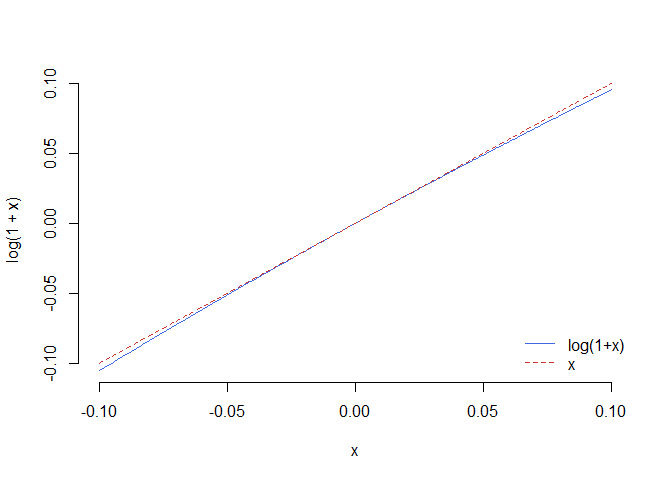

De asemenea avem că 

$$
  r_t(k) = \log(1+R_t(k)) = \log\left(\prod_{j=0}^{k-1}(1+R_{t-j})\right) = \sum_{j = 0}^{k-1}r_{t-j}.
$$

Pentru datele noastre avem 


```r
# log returns 
google_ret_s_monthly$cret = log(1+google_ret_s_monthly$ret)
apple_ret_s_monthly$cret = log(1+apple_ret_s_monthly$ret)
msft_ret_s_monthly$cret = log(1+msft_ret_s_monthly$ret)

# ilustrare grafica
plot(google_ret_s_monthly$date, google_ret_s_monthly$cret,
     type = "l", 
     col = "royalblue",
     main = "Goolge - Apple - Microsoft log returns",
     xlab = "Perioada (Luni)",
     ylab = "Log Returns",
     bty = "n")

lines(apple_ret_s_monthly$date, apple_ret_s_monthly$cret,
      col = "brown3",
      lty = 2)

lines(msft_ret_s_monthly$date, msft_ret_s_monthly$cret,
      col = "forestgreen",
      lty = 3)

legend("bottomright", 
       legend = c("Google", "Apple", "Microsoft"), 
       col = c("royalblue", "brown3", "forestgreen"), 
       lty = c(1,2,3),
       bty = "n")
```

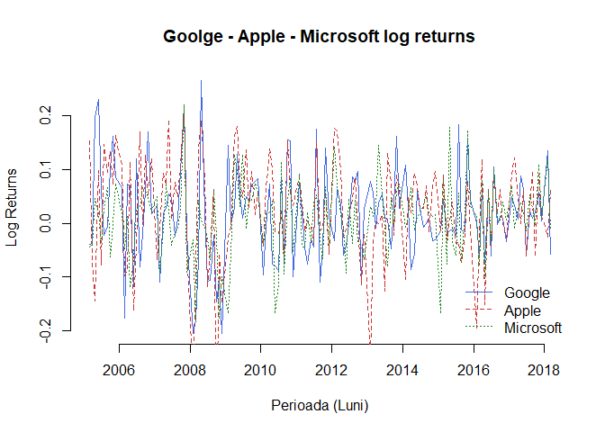

## Ajustarea pentru dividende

Dacă un activ plătește un [dividend](https://ro.wikipedia.org/wiki/Dividend) $D_t$ undeva între momentul de timp $t-1$ și $t$ atunci rentabilitatea brută la momentul $t$ se calculează după formula 

$$
  1+R_t = \frac{P_t+D_t}{P_{t-1}}
$$
iar rentabilitatea netă este $R_t = \frac{P_t+D_t-P_{t-1}}{P_{t-1}} = \frac{P_t-P_{t-1}}{P_{t-1}} + \frac{D_t}{P_{t-1}}$ unde $\frac{P_t-P_{t-1}}{P_{t-1}}$ se numește câștigul de capital (*capital gain*) iar $\frac{D_t}{P_{t-1}}$ se numește randamentul dividendului (*dividend yield*). Avem astfel că 

$$
  1+R_{t}(k) = \prod_{j=0}^{k-1}\frac{P_{t-j}+D_{t-j}}{P_{t-j-1}} = \prod_{j=0}^{k-1}(1+R_{t-j})
$$

iar 

$$
  r_t(k) = \log(1+R_t(k)) = \sum_{j=0}^{k-1}\log\left(\frac{P_{t-j}+D_{t-j}}{P_{t-j-1}}\right).
$$
Pentru a calcula rentabilitățile ajustate vom folosi coloana `Adjusted` (care apare doar la datele de pe Yahoo Finance !):


```r
# Rentabilitatea lunara ajustata pentru dividende 
returnMonthAdjusted = function(dat){
  dat$Day = as.numeric(strftime(dat$Date, "%d"))
  dat$Month = as.numeric(strftime(dat$Date, "%m"))
  dat$Year = as.numeric(strftime(dat$Date, "%Y"))
  
  dat_month_diff = diff(dat$Month)
  dat_month = dat[dat_month_diff == 1, ]
  
  month_ret = dat_month$Adjusted[-1] / dat_month$Adjusted[-length(dat_month$Adjusted)] - 1 
  return(data.frame(date = dat_month$Date[-1], ret = month_ret))
}

google_ret_adj_monthly = returnMonthAdjusted(google_data)
apple_ret_adj_monthly = returnMonthAdjusted(apple_data)
msft_ret_adj_monthly = returnMonthAdjusted(msft_data)

head(cbind(google_ret_adj_monthly$ret, apple_ret_adj_monthly$ret, 
           msft_ret_adj_monthly$ret))
            [,1]        [,2]        [,3]
[1,] -0.03900416  0.16670979 -0.03966420
[2,] -0.03978939 -0.07110995 -0.03934825
[3,]  0.21876907 -0.13462939  0.04675180
[4,]  0.26031817  0.10260652  0.02299797
[5,]  0.06087933 -0.07419498 -0.03720931
[6,] -0.02172367  0.15865307  0.03099854

# log returns 
google_ret_adj_monthly$cret = log(1+google_ret_adj_monthly$ret)
apple_ret_adj_monthly$cret = log(1+apple_ret_adj_monthly$ret)
msft_ret_adj_monthly$cret = log(1+msft_ret_adj_monthly$ret)
```

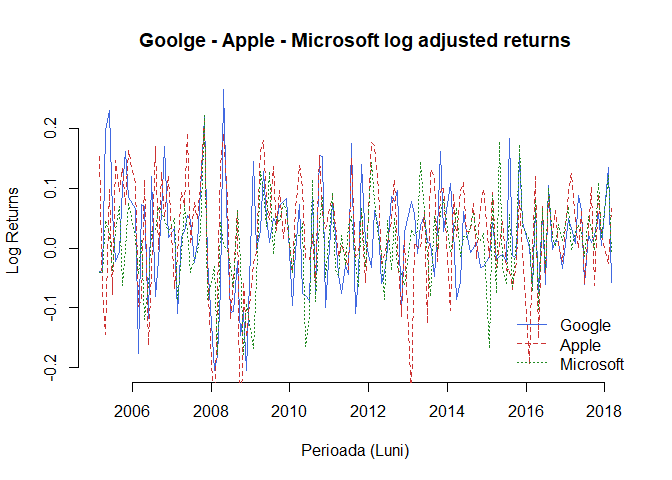

## Modelul mersului la întâmplare geometric

Fie $Z_1, Z_2, \ldots$ un șir de variabile aleatoare independente și identic repartizate de medie $\mu$ și dispersie $\sigma^2$. Fie $S_0$ este un punct de pornire și $S_t$ poziția după $t$ pași atunci când am plecat din $S_0$

$$
  S_t = S_0 + Z_1 + Z_2 + \cdots + Z_t, \; t\geq 1.
$$

Procesul $S_0, S_1, \ldots$ se numește mers la întâmplare iar $Z_1, Z_2, \ldots$ sunt pașii. Se poate observa că $\mathbb{E}[S_t|S_0] = S_0 + \mu t$ iar $Var(S_t|S_0) = \sigma^2 t$, $\mu$ se numește parametru de *drift* și determină direcția de deplasare iar $\sigma$ se numește *volatilitate* și determină cât de mult fluctuează mersul la întâmplare în jurul mediei condiționare.  

Am văzut că rentabilitatea pentru o $k$-perioadă verifică 

\begin{align*}
  1+R_t(k) &= \left(1+R_{t}\right)\left(1+R_{t+1}\right) \cdots \left(1+R_{t-k+1}\right) = e^{r_t}e^{r_{t+1}}\cdots e^{r_{t-k+1}}\\
           &= e^{r_t+r_{t+1}+\cdots+r_{t-k+1}}
\end{align*}

de unde $r_t(k) = \log(1+R_t(k)) = r_t+r_{t+1}+\cdots+r_{t-k+1}$. 

Ipoteza *mersului la întâmplare* presupune că rentabilitățile compuse (log-return-urile) $r_t$ sunt variabile aleatoare independente și identic repartizate. De asemenea avem că

$$
  \frac{P_{t}}{P_{t-k}} = 1+R_t(k) = e^{r_t+r_{t+1}+\cdots+r_{t-k+1}}
$$

ceea ce conduce la $P_t = P_0e^{r_t+r_{t+1}+\cdots+r_{t-k+1}}$ (mers la întâmplare exponențial). În cazul în care $r_t\sim\mathcal{N}(\mu, \sigma^2)$ atunci $P_t$ este o variabilă aleatoare repartizată log-normal iar procesul $P_0, P_1, \ldots$ se numește mers la întâmplare geometric. 

Să presupunem că vrem să simulăm în R evoluția prețurilor unui stock atunci când rentabilitățile compuse (log-return-urile) sunt repartizare normal, deci prețurile descriu un mers la întâmplare geometric. Vom simula evoluția prețurilor pe parcursul unui an (în medie sunt $n = 253$ de zile de tranzacționare pentru un an) și vom presupune că prețul inițial a fost de $120$ u.m.. 


```r
set.seed(2018)
n = 253

P0 = 120
mu = 0.05/n
sigma = 0.2/sqrt(n)

par(mfrow=c(2,2), bty = "n")
for (i in 1:4)
{
  logr = rnorm(n, mu, sigma)
  price = c(P0, P0*exp(cumsum(logr)))
  
  plot(price, type="l",
       xlab = "Index zile",
       ylab = "Pret", 
       col = "forestgreen")
}
```

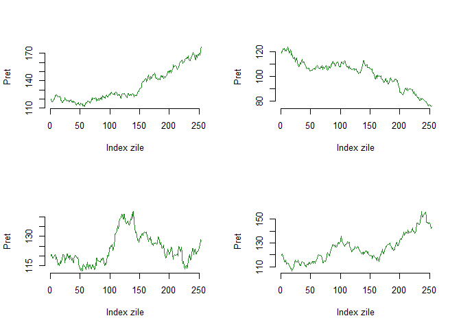


```r
# Simularea unui proces gausian

library(MASS)
 
gaussprocess <- function(from = 0, to = 1, 
                         K = function(s, t) {min(s, t)},
                         start = NULL, m = 1000) {
  # Simuleaza un proces Gausian cu functia nucleu K
  #
  # args:
  #   from: Punct de plecare
  #   to: Punct final 
  #   K: functie nucleu; default proces Wiener
  #   start: pozitie de start
  #   m: nr de puncte simulate 
  #
  # return:
  #   un data.frame in care primul arg este timpul iar 
  #   al doilea este xt procesul 
   
  t = seq(from = from, to = to, length.out = m)
  
  Sigma = sapply(t, function(s1) {
    sapply(t, function(s2) {
      K(s1, s2)
    })
  })
   
  path = mvrnorm(mu = rep(0, times = m), Sigma = Sigma)
  
  if (!is.null(start)) {
    path <- path - path[1] + start  
  }
   
  return(data.frame("t" = t, "xt" = path))
}

```

# Măsuri de centralitate: media, mediana și modul 

## Media 

Media eșantionului este considerată ca fiind punctul central care balansează colecția de observații și se calculează după formula

$$
  \bar{X}_n = \frac{X_1+X_2+\cdots +X_n}{n}
$$

De exemplu prețul mediu la închidere pentru stoc-urile Apple, Microsoft și respectiv Google sunt 


```r
x.bar.apple = mean(apple_data$Close)
x.bar.msft = mean(msft_data$Close)
x.bar.google = mean(google_data$Close)

x.bar.apple
[1] 62.01289
x.bar.msft
[1] 36.59903
x.bar.google
[1] 410.8778
```

iar prețul mediu la închidere din anul 2017 pentru cele 3 stoc-uri a fost 


```r
mean(apple_data$Close[strftime(apple_data$Date, "%Y") == "2017"])
[1] 150.5511
mean(msft_data$Close[strftime(msft_data$Date, "%Y") == "2017"])
[1] 71.98402
mean(google_data$Close[strftime(google_data$Date, "%Y") == "2017"])
[1] 921.7808
```

## Mediana

Mediana este acea valoare pentru care aproximativ $50\%$ dintre observații sunt mai mici și $50\%$ dintre observații sunt mai mari, se mai numește și magnitudinea de mijloc a obsevațiilor. Mediana (empirică) se găsește cu ajutorul formulei

$$
  M_n = \left\{\begin{array}{ll}
      X_{\left(\frac{n+1}{2}\right)}, & \text{$n$ este impar}\\
      \frac{X_{\left(\frac{n}{2}\right)} + X_{\left(\frac{n}{2}+1\right)}}{2}, & \text{$n$ este par}
  \end{array}\right.
$$

unde $X_{(i)}$ este a $i$-a cea mai mică observație a eșantionului $X_1, X_2, \ldots, X_n$ (statistica de ordine de rang $i$). A se vedea secțiunea [Cuantile teoretice](#sec:cuantile).

În R mediana se calculează cu ajutorul funcției `median()`. Prețul median de închidere pentru cele 3 stoc-uri a fost 


```r
M.bar.apple = median(apple_data$Close)
M.bar.msft = median(msft_data$Close)
M.bar.google = median(google_data$Close)
```

iar pentru anii $2008-2009$ a fost 


```r
median(apple_data$Close[strftime(apple_data$Date, "%Y") %in% c("2008", "2009")])
[1] 20.53429
median(msft_data$Close[strftime(msft_data$Date, "%Y")  %in% c("2008", "2009")])
[1] 25.3
median(google_data$Close[strftime(google_data$Date, "%Y") %in% c("2008", "2009")])
[1] 224.1124
```

## Modul 

Modul este valoarea cea mai frecventă din setul de date. Un set de date poate să nu aibă mod (de exemplu dacă frecvența de apariție a observațiilor este 1 - toate apar o singură dată), să aibă un mod, două moduri (set bimodal) sau mai multe. 

Care au fost lunile cu cele mai multe tranzacții pentru cele 3 stoc-uri: 


```r
# Apple
xtab.apple = table(strftime(apple_data$Date, "%b"))
xtab.apple[xtab.apple == max(xtab.apple)]
Mar 
299 

# Microsoft
xtab.msft = table(strftime(msft_data$Date, "%b"))
xtab.msft[xtab.msft == max(xtab.msft)]
Mar 
299 

# Google
xtab.google = table(strftime(google_data$Date, "%b"))
xtab.google[xtab.google == max(xtab.google)]
Mar 
299 
```

## Valoarea minimă (Min), valoarea maximă (Max) și intervalul de valori (Range)

Pentru a determina valoarea minimă și valoarea maximă a setului de date putem folosi funcțiile predefinite `min` și `max`. De asemenea pentru a vedea care este intervalul de valori pe care o variabilă de interes este definită putem aplica funcția `range`.

De exemplu pentru stoc-ul Apple avem 


```r
min(apple_data$Close)
[1] 4.520714
max(apple_data$Close)
[1] 181.72
range(apple_data$Close)
[1]   4.520714 181.720001
```

# Cuantile teoretice și empirice {#sec:cuantile}

Reamintim că dată fiind o funcție de repartiție $F$, funcția *cuantilă* (inversa generalizată) asociată lui $F$, $F^{-1}:(0,1)\to\mathbb{R}$ este definită prin 

$$
  F^{-1}(u) = \inf\{x\in\mathbb{R}\,|\,F(x)\geq u\}, \quad \forall u\in(0,1)
$$

unde folosim convențiile $\inf\mathbb{R} = -\infty$ și $\inf\emptyset = +\infty$.

\BeginKnitrBlock{rmdinsight}<div class="rmdinsight">Funcția cuantilă $F^{-1}$ verifică următoarele proprietăți:

  1) Valoarea în $0$: $F^{-1}(0) = -\infty$
  2) Monotonie: $F^{-1}$ este crescătoare
  3) Continuitate: $F^{-1}$ este continuă la stânga
  4) Echivalență: pentru $\forall u\in[0,1]$ avem $F(x)\geq u \iff x\geq F^{-1}(u)$
  5) Inversabilitate: $\forall u\in[0,1]$ avem $(F\circ F^{-1})(u)\geq u$. În plus
    a) dacă $F$ este continuă atunci $F\circ F^{-1} = Id$ dar dacă nu este injectivă atunci există $x_0$ așa încât $(F^{-1}\circ F)(x_0)<x_0$
    b) dacă $F$ este injectivă atunci $F^{-1}\circ F = Id$ dar dacă nu este continuă atunci există $u_0$ astfel că $(F\circ F^{-1})(u_0)>u_0$

</div>\EndKnitrBlock{rmdinsight}

Pentru a exemplifica punctul 5a, putem considera variabila aleatoare $X\sim\mathcal{U}[0,1]$ a cărei funcție de repartiție $F$ este continuă dar nu injectivă și în plus $(F^{-1}\circ F)(2) = F^{-1}(1) = 1 < 2$. Pentru punctul 5b să considerăm variabilele aleatoare $Y\sim\mathcal{N}(0,1)$ și $B\sim\mathcal{B}(0.5)$ independente și să definim $X = BY$. Atunci funcția de repartiție a lui $X$ verifică $F(0-) = \frac{1}{4}$ și $F(0) = \frac{3}{4}$, este injectivă dar nu și continuă în $0$ și în plus avem $(F\circ F^{-1})(1/2) = F(0) = \frac{3}{4}>\frac{1}{2}$.

Se numește *cuantilă* de ordin $p\in(0,1)$ (sau $p$-cuantilă) asociată lui $F$ valoarea

$$
  x_p = F^{-1}(p) = \inf\{x\in\mathbb{R}\,|\,F(x)\geq p\}.
$$

Cuantila de ordin $0.5$, $x_{\frac{1}{2}}$ se numește mediana lui $F$ și se notează cu $M$^[Se poate arăta că mediana unei v.a. $X$, cu $\mathbb{E}[X^2]<\infty$, verifică $x_{\frac{1}{2}} = \arg\min_{t\in\mathbb{R}}\mathbb{E}[|X-t|]$.] sau $Q_2$, iar cuantilele de ordin $\frac{1}{4}$ și respectiv $\frac{3}{4}$ se numesc prima și respectiv a treia cuartilă și se notează cu $Q_1$ și respectiv $Q_3$.

Pentru a calcula cuantilele teoretice în R vom folosi funcțiile de tipul `qnume_partiție` unde `nume_repartiție` este abrevierea numelui repartiției $F$ (e.g. `unif` pentru uniformă, `norm` pentru normală, etc.):


```r
# din repartitia normala
qnorm(c(0.1, 0.25, 0.5, 0.75))
[1] -1.2815516 -0.6744898  0.0000000  0.6744898

# din repartitia student cu 5 grade de libertate
qt(c(0.1, 0.25, 0.5, 0.75), df = 5)
[1] -1.4758840 -0.7266868  0.0000000  0.7266868
```

Fie acum $X_1,X_2,\ldots,X_n$ un eșantion de talie $n$ dintr-o populație a cărei funcție de repartiție este $F$ și fie $\hat{F}_n$ funcția de repartiție empirică asociată. Reamintim că funcția de repartiție empirică este definită, pentru toate valorile $x\in\mathbb{R}$, prin 

$$
  \hat{F}_n(x) = \frac{1}{n}\sum_{i = 1}^{n}\mathbf{1}_{(-\infty, x]}(X_i) = \frac{1}{n}\sum_{i = 1}^{n}\mathbf{1}_{(-\infty, x]}(X_{(i)})
$$

unde $X_{(1)}, X_{(2)}, \ldots, X_{(n)}$ reprezintă statisticile de ordine. Observăm că, notând $X_{(n+1)} = +\infty$, avem

$$
  \hat{F}_n(x) = \sum_{i = 1}^{n}\frac{i}{n}\mathbf{1}_{\left[X_{(i)}, X_{(i+1)}\right)}(x).
$$

Pentru $p\in(0,1)$ definim cuantila empirică de ordin $p$ și o notăm $\hat{x}_p = \hat{x}_p(n)$ valoarea

$$
  \hat{x}_p = \hat{F}_n^{-1}(p) = \inf\{x\in\mathbb{R}\,|\,\hat{F}_n(x)\geq p\}.
$$

Folosind convenția $X_{(0)}=-\infty$, cunatila empirică de ordin $p$ coincide cu una dintre statisticile de ordine:

$$
  \hat{x}_p = X_{(i)} \iff np\leq i< np+1 \iff \hat{x}_p = X_{(\lceil np \rceil)},
$$

unde $\lceil x \rceil$ reprezintă cea mai mică valoare întreagă mai mare sau egală cu $x$.

Pentru calculul cuantilelor empirice vom folosi funcția `quantile()`. Articolul [@Hyndman1996] prezintă și compară o serie de algoritmi folosiți în soft-urile de profil pentru calcularea cuantilelor empirice. De exemplu pentru a calcula cuantilele de ordin 0.25, 0.5 și respectiv 0.75 a prețurilor la închidere a celor trei stoc-uri avem  


```r
quantile(apple_data$Close, prob=c(0.25, 0.5, 0.75))
     25%      50%      75% 
18.51357 53.43286 98.14250 
quantile(msft_data$Close, prob=c(0.25, 0.5, 0.75))
    25%     50%     75% 
26.2725 29.5600 43.9375 
quantile(google_data$Close, prob=c(0.25, 0.5, 0.75))
     25%      50%      75% 
233.6727 301.0867 555.7454 
```

Aplicând funcția `fivenum()` (five number summary) variabilei `x` obținem cuantilele de ordin 0 (valoarea minimă), 0.25, 0.5 (mediana), 0.75 și respectiv 1 (valoarea maximă) pentru `x`.


```r
fivenum(apple_data$Close)
[1]   4.520714  18.510000  53.432857  98.150002 181.720001
```

O funcție similară care înclude și media observațiilor este funcția `summary()`


```r
summary(apple_data$Close)
   Min. 1st Qu.  Median    Mean 3rd Qu.    Max. 
  4.521  18.514  53.433  62.013  98.142 181.720 
summary(msft_data$Close)
   Min. 1st Qu.  Median    Mean 3rd Qu.    Max. 
  15.15   26.27   29.56   36.60   43.94   96.77 
summary(google_data$Close)
   Min. 1st Qu.  Median    Mean 3rd Qu.    Max. 
  86.93  233.67  301.09  410.88  555.75 1175.84 
```

# Măsuri de variabilitate

Măsurile de centralitate descrise anterior (media, mediana și modul) oferă o indicație asupra locației în care sunt centrate datele dar nu descriu și care este gradul de împrăștiere a acestora. De exemplu următoarele seturi de date au acceași medie dar gradul de împrăștiere în raport cu aceasta este diferit. 


```r
x = c(4.4, 4.8, 6.1, 5.1, 5.1, 6.2, 5.5, 4.7, 4.3, 
      4.6, 6.2, 5.4, 5.4, 5.1, 4.4)
mean(x)
[1] 5.153333

y = c(6.8, 5.8, 3.45, 5.85, 4.7, 5.4, 4.8, 4.0, 4.3,
      4.6, 3.75, 5.8, 7.25, 4.3, 6.5)
mean(y)
[1] 5.153333
```

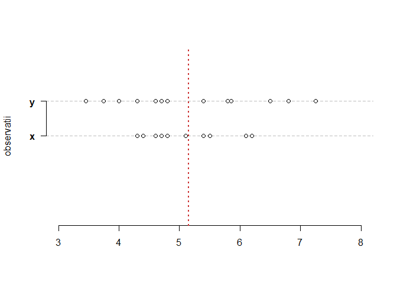

## Varianța și abaterea standard

Varianța eșantionului se calculează cu ajutorul formulei

$$
  S_n^2 = \frac{1}{n-1}\sum_{i=1}^{n}\left(X_i - \bar{X}_n\right)^2
$$

iar abaterea standard a eșantionului este $s_d = \sqrt{S_n^2}$ (măsurată în aceleași unități de măsură ca și datele inițiale).


```r
# varianta 
var(apple_data$Close[strftime(apple_data$Date, "%Y") %in% c("2008", "2009")])
[1] 27.83872
var(msft_data$Close[strftime(msft_data$Date, "%Y") %in% c("2008", "2009")])
[1] 19.75297
var(google_data$Close[strftime(goole_data$Date, "%Y") %in% c("2008", "2009")])
Error in as.POSIXlt(x, tz = tz): object 'goole_data' not found

# abaterea standard
sd(apple_data$Close[strftime(apple_data$Date, "%Y") %in% c("2008", "2009")])
[1] 5.276241
sd(msft_data$Close[strftime(msft_data$Date, "%Y") %in% c("2008", "2009")])
[1] 4.444431
sd(google_data$Close[strftime(goole_data$Date, "%Y") %in% c("2008", "2009")])
Error in as.POSIXlt(x, tz = tz): object 'goole_data' not found
```

## Abaterea mediană absolută

Abaterea mediană absolută (*MAD* - *median absolute deviation*) este definită prin 

$$
  MAD = median(X_i - median(X_i))
$$

și se poate calcula în R cu ajutorul funcției `mad()`. Este o măsură de variabilitate mai robustă decât dispersia. 


```r
# mad
mad(apple_data$Close[strftime(apple_data$Date, "%Y") %in% c("2008", "2009")])
[1] 6.678054
mad(msft_data$Close[strftime(msft_data$Date, "%Y") %in% c("2008", "2009")])
[1] 4.937058
mad(google_data$Close[strftime(goole_data$Date, "%Y") %in% c("2008", "2009")])
Error in as.POSIXlt(x, tz = tz): object 'goole_data' not found
```

## Intervalul dintre cuartile

Intervalul dintre cuartile măsoară distanța dintre a treia cuartilă și prima curtilă

$$
  IQR = Q_3 - Q_1
$$
precizând care este lungimea intervalului pe care se regăsesc aproximativ jumătate dintre obserevații (observațiile de mijloc). 


```r
IQR(apple_data$Close)
[1] 79.62893
IQR(apple_data$Close[strftime(apple_data$Date, "%Y") %in% c("2008", "2009")])
[1] 9.160001
```

# Metode grafice

## Diagrama cu bare (barplot)

Diagrama cu batoane sau bare (*barplot*) este o metodă grafică folosită cu precădere atunci când datele sunt calitative (sau discrete). O diagramă de tip barplot trasează bare verticale sau orizontale, în general separate de un spațiu alb, pentru a evidenția frecevențele de apariție a observațiilor după categoriile corespunzătoare. 

Să presupunem că $X$ este o variabilă aleatoare discretă cu funcția de masă dată de $p(x)=\mathbb{P}(X = x)$ și $X_1, X_2, \ldots, X_n$ un eșantion de talie $n$ din populația $p(x)$. Dacă $X$ ia un număr finit de valori, $X\in\mathcal{A}$ cu $\mathcal{A} = \{a_1, \ldots, a_m\}$, atunci un estimator al lui $p(a_j)$ este 

$$
  \hat{p}(a_j) = \frac{1}{n}\sum_{i = 1}^{n}\mathbf{1}_{\left\{X_i = a_j\right\}}.
$$

Dacă $X$ ia un număr infinit de valori, $X\in\mathcal{A}$ cu $\mathcal{A} = \{a_1, a_2, \ldots\}$, atunci formăm grupurile 

$$
  \{a_1\}, \;\{a_2\},\cdots, \{a_m\},\; \tilde{a}_{m+1} = \{a_{m+1}, a_{m+2}, \ldots\}
$$

și considerăm 

$$
  \hat{p}(\tilde{a}_{m+1}) = \frac{1}{n}\sum_{i = 1}^{n}\mathbf{1}_{\left\{X_i \geq a_{m+1}\right\}}.
$$
În practică, alegerea lui $m$ se face așa încât $\hat{p}(a_m)\geq 2\hat{p}(\tilde{a}_{m+1})$. O diagramă cu bare este o ilustrare a lui $a_j$ versus $\hat{p}(a_j)$. 

În R se folosește funcția `barplot()`:


```r
barplot(table(strftime(apple_data$Date, "%b")), 
        main = "Apple")
```

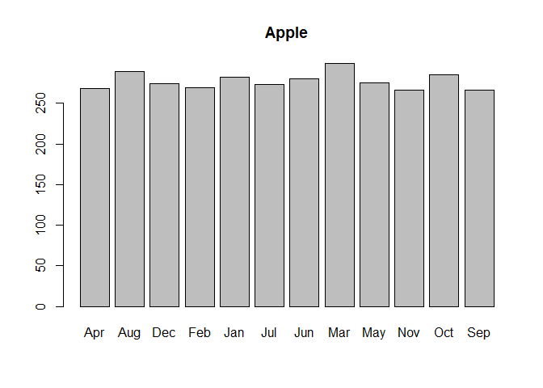


```r
x.apple = table(strftime(apple_data$Date, "%b"))
x.msft = table(strftime(msft_data$Date, "%b"))
x.google = table(strftime(google_data$Date, "%b"))

dat.stoc.month = rbind(x.apple, x.msft, x.google)
row.names(dat.stoc.month) = c("Apple", "Microsoft", "Google")
  
barplot(dat.stoc.month,
        beside = TRUE,
        main = "Numarul de tranzactii lunare",
        col = c("brown3", "forestgreen", "royalblue"), 
        legend.text=c("Apple", "Microsoft", "Google"),
        args.legend=list(x="bottomright", bty = "n"),
        xlim = c(0, 58),
        cex.names = 0.7, 
        cex.axis = 0.7)
```

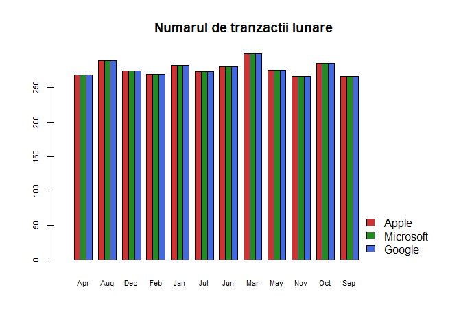


## Histograma

*Histograma* este un exemplu de metodă neparametrică de estimare a densității de probabilitate. Fie $X_1, X_2, \ldots, X_n$ un eșantion de talie $n$ dintr-o populație cu densitate de probabilitate $f$. Fără a restrânge generalitatea putem să presupunem că $X_i\in[0,1]$ (în caz contrar putem scala observațiile la acest interval).

Fie $m$ un număr natural și să considerăm diviziunea intervalului $[0,1]$ (fiecare subinterval din diviziune se numește *bin*):

$$
  B_1 = \left[0, \frac{1}{m}\right), \, B_2 = \left[\frac{1}{m}, \frac{2}{m}\right),\cdots,\, B_m = \left[\frac{m-1}{m}, 1\right].
$$

Notăm cu $h = \frac{1}{m}$ lungimea bin-urilor, $p_j = \mathbb{P}(X_i\in B_j) = \int_{B_j}f(t)\,dt$ probabilitatea ca o observație să pice în subintervalul $B_j$ și $\hat{p}_j = \frac{1}{n}\sum_{i = 1}^{n}\mathbf{1}_{\left\{X_i \in B_j\right\}}$ numărul de observații, din cele $n$, care se află în intervalul $B_j$. Atunci estimatorul *histogramă* este dat de 

$$
  \hat{f}_n(x) = \left\{\begin{array}{llll}
            \frac{\hat{p}_1}{h}, & x\in B_1\\
            \frac{\hat{p}_2}{h}, & x\in B_2\\
            \vdots, & \vdots\\
            \frac{\hat{p}_m}{h}, & x\in B_m
  \end{array}\right.
$$

care scris sub formă compactă devine 

$$
  \hat{f}_n(x) = \sum_{i=1}^{m} \frac{\hat{p}_i}{h} \mathbf{1}_{B_i}(x).
$$

Se poate observa că pentru $m$ suficient de mare ($h$ mic) și $x\in B_j$ avem 

$$
  \mathbb{E}\left[\hat{f}_n(x)\right] = \mathbb{E}\left[\sum_{i=1}^{m} \frac{\hat{p}_i}{h} \mathbf{1}_{B_i}(x)\right]= \frac{\mathbb{E}\left[\hat{p}_j\right]}{h} = \frac{p_j}{h} = \frac{\int_{B_j}f(x)\,dx}{h}\approx \frac{f(x)h}{h} = f(x).
$$

Alegerea numărului de bin-uri și a mărimii acestora nu este o problemă trivială. De exemplu, D. Scott propune o variantă de alegere a lui $k$ în articolul [@Scott1979]. Un rezultat similar, dar mai robust, a fost obținut de D. Freedman și P. Diaconis în [@FreedmanDiaconis1981]. Câteva dintre metodele de alegere a mărimii bin-ului sunt prezentate în următoarea pagină de [Wikipedia](https://en.wikipedia.org/wiki/Histogram#Number_of_bins_and_width). 

În R, funcția `hist()` este folosită pentru trasarea unei histograme. Această funcție utilizează ca metodă predefinită de alegere a mărimii bin-urilor, metoda lui Sturges (a se vedea articolul [@Sturges1926]). 

\BeginKnitrBlock{rmdexercise}<div class="rmdexercise">Investigați cu ajutorul unei histograme cum este repartizat prețul zilnic al celor trei stoc-uri în perioada 2008-2009.</div>\EndKnitrBlock{rmdexercise}


```r
par(mfrow = c(1,3))

hist(apple_data$Close[strftime(apple_data$Date, "%Y") %in% c("2008", "2009")], 
     probability = TRUE, 
     col = "grey80",
     main = "Repartitia pretului zilnic\n Apple",
     xlab = "Pret",
     ylab = "Densitatea", 
     cex.main = 0.8)

hist(msft_data$Close[strftime(msft_data$Date, "%Y") %in% c("2008", "2009")], 
     probability = TRUE, 
     breaks = "FD",
     col = "grey80",
     main = "Repartitia pretului zilnic\n Microsoft",
     xlab = "Pret",
     ylab = "Densitatea", 
     cex.main = 0.8)

hist(google_data$Close[strftime(google_data$Date, "%Y") %in% c("2008", "2009")], 
     probability = TRUE, 
     breaks = seq(100, 450, 25),
     col = "grey80",
     main = "Repartitia pretului zilnic\n Google",
     xlab = "Pret",
     ylab = "Densitatea", 
     cex.main = 0.8)
```

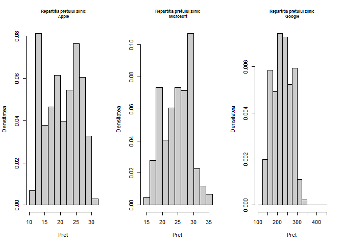

\BeginKnitrBlock{rmdexercise}<div class="rmdexercise">Investigați cu ajutorul unei histograme cum este repartizată rentabilitatea zilnică și respectiv lunară al celor trei stoc-uri pentru perioada 2008-2009.</div>\EndKnitrBlock{rmdexercise}

\BeginKnitrBlock{rmdexercise}<div class="rmdexercise">Considerați setul de date `mtcars`. Investigați cu ajutorul unei histograme cum este repartizată variabila `hp`. Trasați prin drepte verticale de culori diferite media și respectiv mediana datelor.</div>\EndKnitrBlock{rmdexercise}


```r
par(mfrow = c(1,2))

hist(mtcars$hp, freq = FALSE,
     main = "Horepower - HP\n (default)", 
     xlab="HP")

hist(mtcars$hp, freq = FALSE,
     breaks=seq(0,400,25),
     col="gray",
     main="Horsepower - HP\n (marimea bin-ului 25)",
     xlab="HP")

abline(v=c(mean(mtcars$hp), median(mtcars$hp)), 
       lty=c(2,3), lwd=2)
legend("topright", legend=c("media HP","mediana HP"),
       lty=c(2,3), lwd=2,
       bty = "n")
```

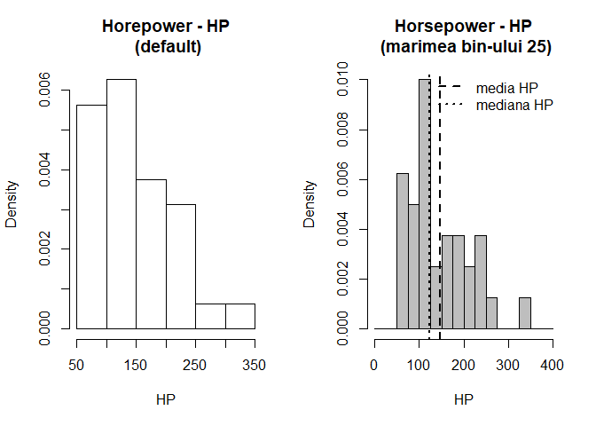

\BeginKnitrBlock{rmdexercise}<div class="rmdexercise">Să presupunem că în fișierul [studFMI.txt]("dataIn/studFMI.txt") am stocat date privind sexul (f/h), înălțimea (în cm) și greutatea (în kg) a studenților de master de la Facultatea de Matematică și Informatică. Vrem să investigăm, trasând pe același grafic, cum este repartizată înălțimea și respectiv greutatea studenților în funcție de sex.</div>\EndKnitrBlock{rmdexercise}

Începem prin a citi datele din fișier:


```r
stud = read.table("dataIn/studFMI.txt", header = TRUE)
str(stud)
'data.frame':	97 obs. of  3 variables:
 $ sex   : Factor w/ 2 levels "f","h": 2 2 1 1 2 1 2 2 2 2 ...
 $ height: int  168 177 164 166 165 150 186 185 181 188 ...
 $ weight: int  69 73 53 57 60 42 74 83 77 72 ...
head(stud)
  sex height weight
1   h    168     69
2   h    177     73
3   f    164     53
4   f    166     57
5   h    165     60
6   f    150     42
```

Separăm înălțimea (greutatea este exercițiu!) bărbaților și a femeilor:


```r
# h vine de la hommes iar f de la femmes
hm = stud$height[stud$sex == "h"]
hf = stud$height[stud$sex == "f"]

par(mfrow = c(1,2))

hist(hm, freq = FALSE, col = grey(0.8),
     main = "Inaltimea barbatilor", 
     xlab = "inaltimea",
     ylab = "densitatea")
tm = seq(min(hm)-5, max(hm)+5, length.out = 100)
lines(tm, dnorm(tm, mean(hm), sd(hm)), 
      lty = 2, lwd = 2)

hist(hf, freq = FALSE, col = grey(0.8),
     main = "Inaltimea femeilor", 
     xlab = "inaltimea",
     ylab = "densitatea")
tf = seq(min(hf)-5, max(hf)+5, length.out = 100)
lines(tf, dnorm(tf, mean(hf), sd(hf)), 
      lty = 2, lwd = 2)
```

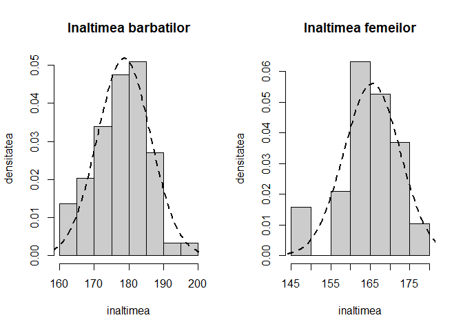

Reprezentăm repartiția înălțimilor luate împreună și evidențiem mixtura celor două repartiții după sex:


```r
height = stud$height

hist(height, proba = TRUE, 
     breaks=25, 
     col = grey(0.8), 
     main = "Inaltimea barbatilor si a femeilor",
     xlab = "inaltimea",
     ylab = "densitatea",
     ylim = c(0, 0.05))

t <- seq(145,200,length=100)

x1 <- dnorm(t,mean(hf),sd(hf))
x2 <- dnorm(t,mean(hm),sd(hm))

# proportia de femei (din nr de studenti)
pf <- length(hf)/length(height)

# mixtura dintre rep inaltimilor f si h
x3 <- pf*x1 + (1-pf)*x2

lines(t, x3, lwd = 2)

lines(t, pf*x1, col = "brown3", 
      lty = 2, lwd = 2)
lines(t, (1-pf)*x2, col = "royalblue", 
      lty = 2, lwd = 2)

legend("topright", c("femei","barbati"), 
       col = c("brown3","royalblue"), 
       lty = 2, lwd = 2, 
       bty = "n")
```

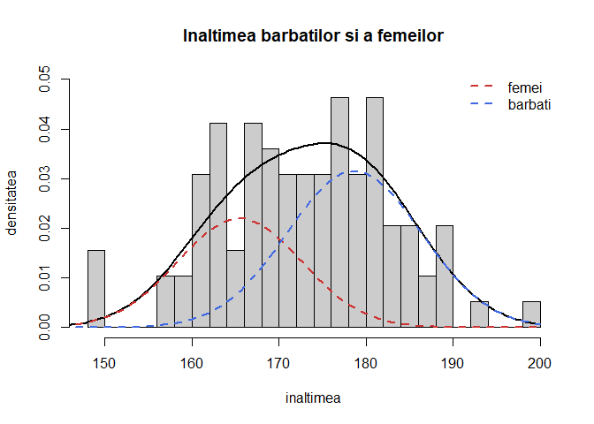


## Boxplot

Una dintre metodele grafice des întâlnite în vizualizarea datelor (cantitative) unidimensionale este *boxplot*-ul (eng. *box and whisker plot* - cutia cu mustăți). Această metodă grafică descriptivă este folosită în principal pentru a investiga forma repartiției (simetrică sau asimetrică) datelor dar și variabilitatea acestora precum și pentru detectarea și ilustrarea schimbărilor de locație și variație între diferitele grupuri de date. 

După cum putem vedea și în figura de mai jos, cutia este definită, de la stânga la dreapta (sau de jos în sus în funcție de cum este reprezentat boxplot-ul: orizontal sau vertical), de prima cuartilă $Q_1$ și de a treia curatilă $Q_3$ ceea ce înseamnă că $50\%$ dintre observații se află în interiorul cutiei. Linia din interiorul cutiei este determinată de mediană sau a doua cuartilă $Q_2$. 

Mustățile care pornesc de o parte și de alta a cutiei sunt determinate astfel (vom folosi conveția folosită de John Tukey în [@Tukey1977, pag. 40-56]): mustața din stânga este determinată de cea mai mică observație mai mare decât $Q_1-1.5 IQR$ iar cea din dreapta de cea mai mare observație din setul de date mai mică decât $Q_3+1.5IQR$, unde $IQR = Q_3-Q_1$ este distanța dintre cuartile (*interquartile range*). 

Valorile observațiilor din setul de date care sunt sau prea mici sau prea mari se numesc valori aberante (*outliers*) și conform lui Tukey sunt definite astfel: *valori strict aberante* care se află la $3IQR$ deasupra celei de-a treia curtilă $Q_3$ sau la $3IQR$ sub prima cuartilă ($x<Q_1-3IQR$ sau $x>Q_3+3IQR$) și *valori potențial aberante* care se află la $1.5IQR$ deasupra celei de-a treia curtilă $Q_3$ sau la $1.5IQR$ sub prima cuartilă ($x<Q_1-1.5IQR$ sau $x>Q_3+1.5IQR$). 


În R metoda grafică boxplot se poate trasa cu ajutorul funcției `boxplot()`. Aceasta primește ca argumente sau un vector de observații numerice `x` atunci când dorim să ilustrăm repartiția unei variabile sau o formulă de tipul `y~grup`, unde `y` este un vector numeric care va fi împărțit în funcție de variabila discretă `grup`, atunci când vrem să comparăm aceeași variabilă numerică în funcție de una discretă (calitatăvă). Pentru mai multe informații tastați `?boxplot`.

\BeginKnitrBlock{rmdexercise}<div class="rmdexercise">Considerați setul de date `mtcars`. Investigați cu ajutorul unui boxplot cum variază greutatea mașinilor, variabila `wt`, în funcție de numărul de cilindrii `cyl`. Afișați numele mașinilor care prezintă potențiale valori aberante. Aceeași cerință pentru perechile `mpg` - `cyl`, `hp` - `cyl` și `hp` - `am`. </div>\EndKnitrBlock{rmdexercise}


```r
par(bty = "n")
bp = boxplot(mtcars$wt ~ mtcars$cyl,
             xlab = "Numar de cilindrii", 
             ylab = "Greutate (in tone)",
             col = "grey80",
             main = "Setul de date mtcars: greutate vs numar cilindrii")

cars = mtcars[mtcars$cyl == 8, ]
cars.names = rownames(cars)[which(cars$wt %in% bp$out)]

text(c(3,3,2.4)+0.3, bp$out, cars.names, cex = 0.6)
text( c(1:length(unique(mtcars$cyl))) , 
      bp$stats[nrow(bp$stats) , ] + 0.5 , 
      paste("n = ", table(mtcars$cyl),sep=""),
      cex = 0.8)
```

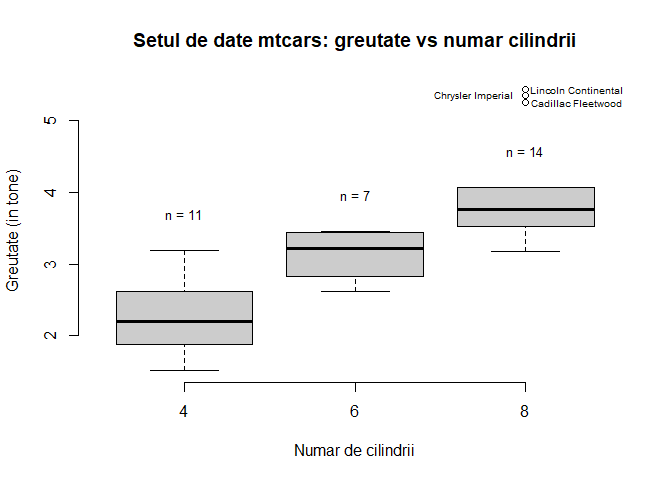

Numele mașinilor care au o greutate potențial aberantă este Cadillac Fleetwood, Lincoln Continental, Chrysler Imperial.

\BeginKnitrBlock{rmdexercise}<div class="rmdexercise">Considerați stoc-urile firmelor Apple, Microsoft și Google. Investigați cu ajutorul unui boxplot cum variază rentabilitatea zilnică a stoc-urilor pentru fiecare firmă. Dar rentabilitatea lunară ajustată ?</div>\EndKnitrBlock{rmdexercise}


```r
dat.stoc.daily = data.frame(stock = rep(c("Apple", "Microsoft", "Google"), 
                                        each = c(length(apple_ret_s_daily), 
                                                 length(msft_ret_s_daily),
                                                 length(google_ret_s_daily))),
                            ret.day = c(apple_ret_s_daily, 
                                        msft_ret_s_daily, 
                                        google_ret_s_daily))

par(bty = "n")
bp = boxplot(dat.stoc.daily$ret.day ~ dat.stoc.daily$stock,
             xlab = "", 
             ylab = "Rentabilitatea zilnica",
             col = c("brown3", "royalblue", "forestgreen"),
             main = "Rentabilitatea zilnica pentru cele trei stoc-uri",
             cex.main = 0.8)
```

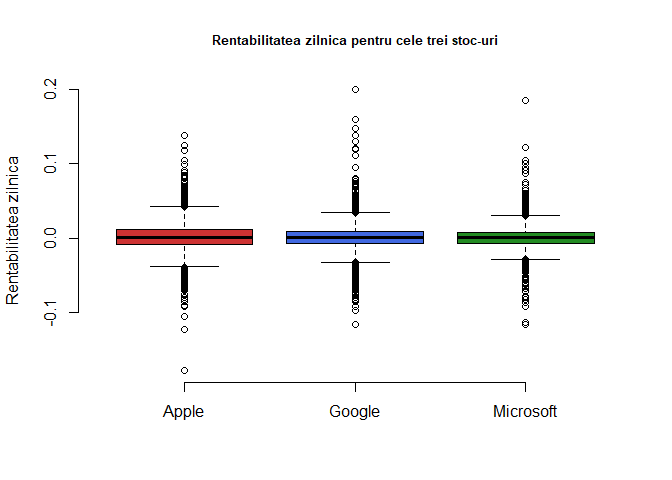


```r
dat.stoc.monthly = data.frame(stock = rep(c("Apple", "Microsoft", "Google"), 
                                        each = c(length(apple_ret_adj_monthly$ret), 
                                                 length(msft_ret_adj_monthly$ret),
                                                 length(google_ret_adj_monthly$ret))),
                            ret.month.adj = c(apple_ret_adj_monthly$ret, 
                                        msft_ret_adj_monthly$ret, 
                                        google_ret_adj_monthly$ret))

par(bty = "n")
bp = boxplot(dat.stoc.monthly$ret.month.adj ~ dat.stoc.monthly$stock,
             xlab = "", 
             ylab = "Rentabilitatea lunara",
             col = c("brown3", "royalblue", "forestgreen"),
             main = "Rentabilitatea lunara pentru cele trei stoc-uri",
             cex.main = 0.8)
```

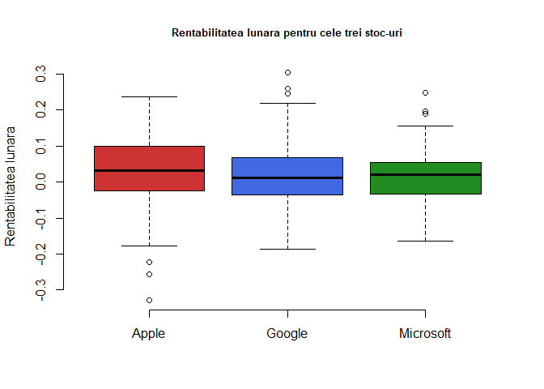

# Referințe

