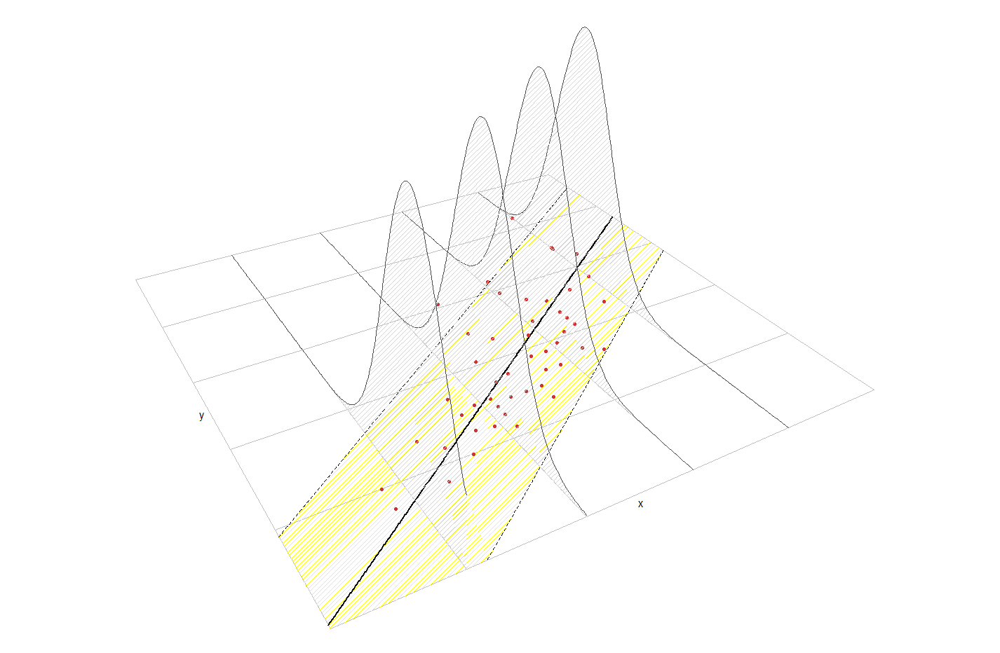

<script>
$(document).ready(function ()  {

    // move toc-ignore selectors from section div to header
    $('div.section.toc-ignore')
        .removeClass('toc-ignore')
        .children('h1,h2,h3,h4,h5').addClass('toc-ignore');

    // establish options
    var options = {
      selectors: "h1,h2,h3",
      theme: "bootstrap3",
      context: '.toc-content',
      hashGenerator: function (text) {
        return text.replace(/[.\\/?&!#<>]/g, '').replace(/\s/g, '_').toLowerCase();
      },
      ignoreSelector: ".toc-ignore",
      scrollTo: 60
    };
    options.showAndHide = false;
    options.smoothScroll = true;

    // tocify
    var toc = $("#TOC").tocify(options).data("toc-tocify");
});
</script>

Obiectivul acestui laborator este de a prezenta câteva exemple legate de problema de regresie liniară simplă.

```{r, echo=FALSE, warning=FALSE, message=FALSE}
library(knitr)
library(kableExtra) # new table styles
library(latex2exp)
library(car)
library(ellipse)
library(faraway)
# library(ExtDist) # pentru repartitia Laplace

knitr::opts_chunk$set(comment = NA, prompt = FALSE, collapse = TRUE, error = TRUE, fig.align = 'center',
                      warning = FALSE, message = FALSE)

source("functions/getOutputFormat.R")

if (getOutputFormat() == "pdf_document"){
  source("functions/figureNumber_tex.R")
  source("functions/tableNumber_tex.R")
  options(knitr.table.format = "latex") # add format latex 
  dimplot = "70%"
  dimplot2 = "80%"
  dimplot3 = "60%"
  engine_block = "block"
}else{
  source("functions/figureNumber.R")
  source("functions/tableNumber.R")
  options(knitr.table.format = "html") # add format html 
  dimplot = "80%"
  dimplot2 = "90%"
  dimplot3 = "90%"
  engine_block = "block2"
}

```

# Introducere 

```{r, echo=FALSE, warning=FALSE}
require(ellipse)
source("lab_functions/visualizeFitLm.R")
```

Regresia liniară simplă (sau *modelul liniar simplu*) este un instrument statistic utilizat pentru a descrie relația dintre două variabile aleatoare, $X$ (variabilă *cauză*, *predictor* sau *covariabilă*) și $Y$ (variabilă *răspuns* sau *efect*) și este definit prin 

$$
\mathbb{E}[Y|X=x]=\beta_0+\beta_1x 
$$

sau altfel spus 

$$
Y = \beta_0 + \beta_1 X + \varepsilon.
$$

În relațiile de mai sus, $\beta_0$ și $\beta_1$ sunt cunoscute ca ordonata la origine (*intercept*) și respectiv panta (*slope*) dreptei de regresie.

Ipotezele modelului sunt: 

i. **Linearitatea**: $\mathbb{E}[Y|X=x]=\beta_0+\beta_1x$

ii. **Homoscedasticitatea**: $\mathbb{V}\text{ar}(\varepsilon_i)=\sigma^2$, cu $\sigma^2$ constantă pentru $i=1,\ldots,n$

iii. **Normalitatea**: $\varepsilon_i\sim\mathcal{N}(0,\sigma^2)$ pentru $i=1,\ldots,n$

iv. **Independența erorilor**: $\varepsilon_1,\ldots,\varepsilon_n$ sunt independente (sau necorelate, $\mathbb{E}[\varepsilon_i\varepsilon_j]=0$, $i\neq j$, deoarece sunt presupuse normale)

Altfel spus 

$$
Y|X=x\sim \mathcal{N}(\beta_0+\beta_1x,\sigma^2)
$$


```{r, echo=FALSE, out.width = dimplot3, fig.align = 'center'}
data(cars)

names(cars) = c("X", "Y")

par(mar = rep(0,4))
visualizeFitLm(data = cars, zTop = 0.05)

# 
```

```{r, type = 'rmdinsight',  engine = engine_block}
- Nicio ipoteză nu a fost făcută asupra repartiției lui $X$ (poate fi sau deterministă sau aleatoare)

- Modelul de regresie presupune că **$Y$ este continuă** datorită normalității erorilor. În orice caz, **$X$ poate fi o variabilă discretă**!


```

Dat fiind un eșantion $(X_1,Y_1),\ldots,(X_n,Y_n)$ pentru variabilele $X$ și $Y$ putem estima coeficienții necunoscuți $\beta_0$ și $\beta_1$ minimizând *suma abaterilor pătratice reziduale* (*Residual Sum of Squares* - RSS)

$$
\text{RSS}(\beta_0,\beta_1)=\sum_{i=1}^n(Y_i-\beta_0-\beta_1x_i)^2
$$

ceea ce conduce la 

$$
\hat\beta_0=\bar{Y}-\hat\beta_1\bar{x},\quad \hat\beta_1=\frac{S_{xy}}{S_{xx}}=\frac{\sum_{i=1}^{n}{(x_i-\bar{x})}Y_i}{\sum_{i=1}^{n}{(x_i-\bar{x})^2}}
$$

unde folosim notațiile

- $\bar{X}=\frac{1}{n}\sum_{i=1}^nX_i$ este *media eșantionului*

- $S_{xx}=\sum_{i=1}^n(X_i-\bar{X})^2$ este *suma abaterilor pătratice pentru $X$*

- $S_{yy}=\sum_{i=1}^n(Y_i-\bar{Y})^2$ este *suma abaterilor pătratice pentru $Y$*

- $S_{xy}=\sum_{i=1}^n(X_i-\bar{X})(Y_i-\bar{Y})$ este *suma produselor încrucișate*

Graficul functiei RSS pentru modelul $y = -0.5 + 1.5x + e$:

```{r, echo=FALSE,  out.width = dimplot, fig.align = 'center'}
# Generates 50 points from a N(0, 1): predictor and error
set.seed(34567) # Fixes the seed for the random generator
x <- rnorm(n = 50) 
eps <- rnorm(n = 50) 

# Responses
yLin <- -0.5 + 1.5 * x + eps

leastSquares <- data.frame(x = x, yLin = yLin)

slm = summary(lm(yLin~x, data = leastSquares))

f_RSS = function(b0, b1, data = leastSquares){
  n = length(data[[1]])
  x = data[[1]]
  y = data[[2]]
  
  mx = mean(x)
  my = mean(y)
  
  mxsq = mean(x^2)
  mysq = mean(y^2)
  
  mxy = mean(x*y)
  
  return(n*(my+b0^2+b1^2*mxsq-2*b0*my-2*b1*mxy+2*b0*b1*mx))
  
}

b0 = seq(-150, 150, length= 30)
b1 = seq(-150, 150, length= 30)

z = outer(b0, b1, f_RSS)
z[is.na(z)] <- 1

res = persp(b0, b1, z, theta = -30, phi = 30, expand = 0.5, col = "lightblue", 
      zlab = "RSS")

xc = slm$coefficients[1,1]
yc = slm$coefficients[2,1]
points(trans3d(xc, yc, 6, pmat = res), col = "brown3", pch = 16, cex = 1.2)
text(trans3d(xc-30, yc-90, 6, pmat = res), col = "brown3", cex = 1.3, 
     labels = expression(paste("(", hat(beta)[0],", ", hat(beta)[1], ")")))

# contour(b0, b1, z, nlevels = 6)
```

Odată ce avem estimatorii $(\hat\beta_0,\hat\beta_1)$ , putem defini:

- *valorile prognozate* (*fitted values*) $\hat Y_1,\ldots,\hat Y_n$ (valorile verticale pe dreapta de regresie), unde

$$
\hat Y_i=\hat\beta_0+\hat\beta_1x_i,\quad i=1,\ldots,n
$$

- *reziduurile estimate* (*estimated residuals*) $\hat \varepsilon_1,\ldots,\hat \varepsilon_n$ (distanțele verticale dintre punctele actuale $(X_i,Y_i)$ și cele prognozate $(X_i,\hat Y_i)$), unde

$$
\hat\varepsilon_i=Y_i-\hat Y_i,\quad i=1,\ldots,n
$$

Estimatorul pentru $\sigma^2$ este 

$$
\hat{\sigma}^2 = \frac{RSS(\hat{\beta}_0,\hat{\beta}_1)}{n-2} = \frac{\sum_{i=1}^{n}\hat{\varepsilon}_i^2}{n-2}.
$$

## Funcția *lm()* din R

Pentru a rula modelul de regresie liniară simplă în R se folosește funcția `lm()` (*linear model*). Funcția `lm()` are două argumente esențiale: `formula` și `data`.

| Argument| Descriere| 
|:------------|:-------------------------------------------------|
|`formula`| O formulă de forma $y \sim x_1 + x_2 + \ldots$, unde $y$ este variabila răspuns (dependentă) iar $x_1,x_2,\ldots$ sunt variabilele explicative (independente). Dacă vrem să includem toate coloanele (cu excepția lui $y$) ca variabile explicative putem folosi $y \sim .$|
|`data`|Este setul de date în format `data.frame` care conține coloanele specificate de formulă.|

Următorul tabel conține corespondențe între codul `R` și conceptele statistice asociate modelului de regresie:


|              `R`                       |        Concepte statistice          |
|:---------------------------------------|:------------------------------------|
| `x` | Variabilele predictor $X_1,\ldots,X_n$    |
| `y` | Răspunsul $Y_1,\ldots,Y_n$    |
| `data <- data.frame(x = x, y = y)` | Eșantionul $(X_1,Y_1),\ldots,(X_n,Y_n)$    |
| `model <- lm(y ~ x, data = data)` | Modelul de regresie liniară simplă |
| `model$coefficients` | Coeficienții $\hat\beta_0,\hat\beta_1$ |
| `model$residuals` | Valorile reziduale $\hat\varepsilon_1,\ldots,\hat\varepsilon_n$ |
| `model$fitted.values` | Valorile fitate $\hat Y_1,\ldots,\hat Y_n$ |
| `model$df.residual` | Gradele de libertate $n-2$ |
| `summaryModel <- summary(model)` | Sumarul modelului de regresie liniară |
| `summaryModel$sigma` | Estimatorul $\hat\sigma$ |
| `summaryModel$r.squared` | Coeficientul de determinare $R^2$ |
| `summaryModel$fstatistic` | Testul lui Fisher $F$ |
| `anova(model)` | Tabelul ANOVA |

# Aplicație

```{r, type = "rmdexercise", engine = engine_block}
Ne propunem să investigăm relația dintre volumul vânzărilor dintr-un anumit produs (calculate în mii de unități) și bugetul (în milioane RON) alocat pentru publicitatea la televizor. Pentru aceasta vom folosi setul de date [advertising](dataIn/advertising.csv) care conține informații despre volumul vânzărilor și bugetul alocat publicității TV în 200 de piețe de desfacere.


```

Începem prin a înregistra setul de date

```{r}
advertise = read.csv("dataIn/advertising.csv", row.names = 1)

summary(advertise)
```

și a ilustra grafic diagrama de împrăștiere

```{r,  out.width = dimplot2, fig.align = 'center'}
plot(advertise$TV, advertise$sales, 
     xlab = "Publicitate TV", 
     ylab = "Volum vanzari", 
     col = "brown3", 
     pch = 16, 
     bty="n")
```


## Estimarea parametrilor

Considerăm modelul de regresie $Y = \beta_0 + \beta_1 X + \varepsilon$ (unde $X=$`advertise$TV` iar $Y=$`advertise$sales`), $\varepsilon\sim \mathcal{N}(0,\sigma^2)$, a cărui parametrii sunt $\beta_0$, $\beta_1$ și $\sigma^2$.

Observăm că estimatorii parametrilor $\beta_0$ și $\beta_1$ sunt dați de 

```{r}
# pentru b1

b1 = cov(advertise$TV, advertise$sales)/var(advertise$TV)
cat("b1 = ", b1, "\n")

# sau 

sum((advertise$TV-mean(advertise$TV))*(advertise$sales))/
  sum((advertise$TV-mean(advertise$TV))^2)

# pentru b0

b0 = mean(advertise$sales) - b1*mean(advertise$TV)
cat("b0 = ", b0)
```

sau folosind funcția `lm()`:

```{r}
advertise_TV_model = lm(sales~TV, data = advertise)
names(advertise_TV_model)
```

```{r}
advertise_TV_model$coefficients
```

Graficul sumei abaterilor pătratice reziduale $RSS$ este 

```{r, echo=FALSE,  out.width = dimplot2, fig.align = 'center'}

leastSquares <- advertise[, c("TV", "sales")]

slm = summary(advertise_TV_model)

f_RSS = function(b0, b1, data = leastSquares){
  n = length(data[[1]])
  x = data[[1]]
  y = data[[2]]
  
  mx = mean(x)
  my = mean(y)
  
  mxsq = mean(x^2)
  mysq = mean(y^2)
  
  mxy = mean(x*y)
  
  return(n*(mysq+b0^2+b1^2*mxsq-2*b0*my-2*b1*mxy+2*b0*b1*mx))
}

bb0 = seq(slm$coefficients[1,1] - 2, slm$coefficients[1,1] + 2, length= 30)
bb1 = seq(slm$coefficients[2,1] - 0.02, slm$coefficients[2,1] + 0.02, length= 30)

z = outer(bb0, bb1, f_RSS)
# z[is.na(z)] <- 1

xc = slm$coefficients[1,1]
yc = slm$coefficients[2,1]

par(mfrow = c(1,2))

# left 
contour(bb0, bb1, z, nlevels = 5,
        col = "steelblue",
        xlab = expression(hat(beta)[0]),
        ylab = expression(hat(beta)[1]),
        bty = "n",
        cex.axis = 0.7,
        cex.lab = 0.9)

points(xc, yc,
       col = "brown3", pch = 16, cex = 1)

# right
res = persp(bb0, bb1, z, theta = -45, phi = 45, 
            expand = 0.5, 
            col = "steelblue", 
            border = "white",
            zlab = "RSS",
            xlab = "b0",
            ylab = "b1",
            r = sqrt(2),
            oma=c(0, 0, 0, 0),
            mar=c(0, 0, 0, 0),
            plt = c(0,1,0,1))


points(trans3d(xc, yc, 6, pmat = res), col = "brown3", pch = 16, cex = 1)

text(trans3d(xc-0.5, yc-0.014, 6, pmat = res), col = "brown3", cex = 0.8, 
     labels = expression(paste("(", hat(beta)[0],", ", hat(beta)[1], ")")))

```

Dreapta de regresie (observăm că aceasta trece prin punctul de coordonate $(\bar{x}, \bar{y})$) este:

```{r, out.width = dimplot2, fig.align = 'center'}
plot(advertise$TV, advertise$sales, 
     xlab = "Publicitate TV", 
     ylab = "Volumul vanzarilor", 
     col = "brown3", 
     pch = 20, 
     bty="n", 
     main = paste("y = ", format(b0, digits = 4), " + ", 
                  format(b1, digits = 4), " x"))

abline(a = b0, b = b1, col = "royalblue", lwd = 2)
points(mean(advertise$TV), mean(advertise$sales), 
       pch = 16, 
       col = "dark green", 
       cex = 1.2)
text(mean(advertise$TV), mean(advertise$sales)-1.3, 
     col = "dark green", cex = 1.2, 
     labels = expression(paste("(", bar(x), ",", bar(y),")")))
```

De asemenea pentru calculul estimatorului lui $\sigma$ ($\hat{\sigma}$) avem
  
```{r}
n = length(advertise$sales)
e_hat = advertise$sales - (b0+b1*advertise$TV)

rss = sum(e_hat^2)
# sau folosind comanda deviance(advertise_TV_model)

sigma_hat = sqrt(rss/(n-2))
sigma_hat
```

sau cu ajutorul funcției `lm()`

```{r}
sqrt(deviance(advertise_TV_model)/df.residual(advertise_TV_model))
```

sau încă aplicând funcția `summary()`

```{r}
advertise_TV_model_summary = summary(advertise_TV_model)

advertise_TV_model_summary$sigma
```


## Intervale de încredere pentru parametrii

Repartițiile lui $\hat\beta_0$ și $\hat\beta_1$ sunt 

$$
\hat\beta_0\sim\mathcal{N}\left(\beta_0,\mathrm{SE}(\hat\beta_0)^2\right),\quad\hat\beta_1\sim\mathcal{N}\left(\beta_1,\mathrm{SE}(\hat\beta_1)^2\right)
$$

unde 

$$
\mathrm{SE}(\hat\beta_0)^2=\sigma^2\left[\frac{1}{n}+\frac{\bar x^2}{\sum_{i=1}^{n}(x_i-\bar{x})^2}\right]=\sigma^2\left[\frac{1}{n}+\frac{\bar x^2}{S_{xx}}\right],\quad  \mathrm{SE}(\hat\beta_1)^2= \frac{\sigma^2}{\sum_{i=1}^{n}(x_i-\bar{x})^2} = \frac{\sigma^2}{S_{xx}}.
$$

Folosind estimatorul $\hat\sigma^2$ pentru $\sigma^2$ obținem că 

$$
\frac{\hat\beta_0-\beta_0}{\hat{\mathrm{SE}}(\hat\beta_0)}\sim t_{n-2},\quad\frac{\hat\beta_1-\beta_1}{\hat{\mathrm{SE}}(\hat\beta_1)}\sim t_{n-2}
$$

unde

$$
\hat{\mathrm{SE}}(\hat\beta_0)^2=\hat \sigma^2\left[\frac{1}{n}+\frac{\bar x^2}{\sum_{i=1}^{n}(x_i-\bar{x})^2}\right]=\hat \sigma^2\left[\frac{1}{n}+\frac{\bar x^2}{S_{xx}}\right],\quad \hat{\mathrm{SE}}(\hat\beta_1)^2=\frac{\hat \sigma^2}{\sum_{i=1}^{n}(x_i-\bar{x})^2} = \frac{\hat \sigma^2}{S_{xx}}
$$

prin urmare, intervalele de încredere de nivel $1-\alpha$ pentru $\beta_0$ și $\beta_1$ sunt 

$$
IC = \left(\hat\beta_j\pm\hat{\mathrm{SE}}(\hat\beta_j)t_{n-2;1-\alpha/2}\right),\quad j=0,1.
$$

În R putem calcula aceste intervale de încredere folosind comenzile 

```{r}
alpha = 0.05

# trebuie avut grija ca functia var si sd se calculeaza 
# impartind la (n-1) si nu la n !!!

se_b0 = sqrt(sigma_hat^2*(1/n+mean(advertise$TV)^2/((n-1)*var(advertise$TV))))
se_b1 = sqrt(sigma_hat^2/((n-1)*var(advertise$TV)))

lw_b0 = b0 - qt(1-alpha/2, n-2)*se_b0
up_b0 = b0 + qt(1-alpha/2, n-2)*se_b0

cat("CI pentru b0 este (", lw_b0, ", ", up_b0, ")\n")

lw_b1 = b1 - qt(1-alpha/2, n-2)*se_b1
up_b1 = b1 + qt(1-alpha/2, n-2)*se_b1
  
cat("CI pentru b1 este (", lw_b1, ", ", up_b1, ")")
```

Același rezultat se obține apelând funcția `confint()` :

```{r}
confint(advertise_TV_model)
```

Observăm că în absența unui buget de publicitate TV, volumul vânzărilor se încadrează în medie între $6130$ și $7940$ de unități. Mai mult, pentru fiecare creștere a bugetului pentru publicitatea TV cu $1000$ de RON obținem o creștere, în medie, a vânzărilor între $42$ și $53$ de unități. 

Putem construi și o regiune de încredere de nivel de încredere $1-\alpha$ pentru vectorul $\boldsymbol{\beta} = (\beta_0, \beta_1)$ plecând de la repartiția bidimensională a vectorului $\boldsymbol{\hat \beta} = (\hat \beta_0, \hat \beta_1)^\intercal$. În cazul modelului condițional normal avem că $\boldsymbol{\hat \beta}\sim\mathcal{N}(\boldsymbol{\beta}, \sigma^2 V)$ unde 

$$
  V = \frac{1}{\sigma^2}\begin{pmatrix}Var(\hat \beta_0) & Cov(\hat \beta_0, \hat \beta_1)\\ Cov(\hat \beta_0, \hat \beta_1) & Var(\hat \beta_1)\end{pmatrix} = \frac{1}{\sum_{i = 1}^{n}(x_i - \bar x)}\begin{pmatrix}\frac{\sum_{i = 1}^{n}x_i^2}{n} & -\bar x\\ -\bar x & 1\end{pmatrix}
$$

și cum 

$$
\frac{1}{2\hat \sigma^2}\left(\boldsymbol{\hat \beta} - \boldsymbol{\beta}\right)^\intercal V^{-1} \left(\boldsymbol{\hat \beta} - \boldsymbol{\beta}\right) \sim F_{2, n-2}
$$

găsim că regiunea de încredere este 


$$
  RC(\beta_0, \beta_1) = \left\{\frac{1}{2\hat\sigma^2}\left[n(\hat\beta_0 - \beta_0)^2 + 2n\bar x(\hat\beta_0 - \beta_0)(\hat\beta_1 - \beta_1) + (\hat\beta_1 - \beta_1)^2\sum_{i=1}^{n}x_i^2\right]\leq f^{1-\alpha}_{2,n-2}\right\}
$$

```{r, out.width = dimplot2, fig.align = 'center'}
library(ellipse)
library(car)

par(bty = "n")

# trasam regiunea de incredere
confidenceEllipse(advertise_TV_model,
                  xlab = expression(hat(beta[0])), 
                  ylab = expression(hat(beta[1])),
                  col = "grey30") 

points(coef(advertise_TV_model)[1], coef(advertise_TV_model)[2], 
       pch = 18, col = "brown3",
       cex = 2)

# trasam intervalele de incredere
abline(v = confint(advertise_TV_model)[1,], lty = 2)
abline(h = confint(advertise_TV_model)[2,], lty = 2)
```


## ANOVA pentru regresie

Este predictorul $X$ folositor în prezicerea răspunsului $Y$ ? Vrem să testăm ipoteza nulă $H_0:\;\beta_1=0$. 

Introducem următoarele *sume de abateri pătratice*:

- $SS_T=\sum_{i=1}^n\left(Y_i-\bar Y\right)^2$, **suma totală a abaterilor pătratice** (variația totală a lui $Y_1,\ldots,Y_n$).

- $SS_{reg}=\sum_{i=1}^n\left(\hat Y_i-\bar Y\right)^2$, **suma abaterilor pătratice de regresie** (variabilitatea explicată de dreapta de regresie)

- $RSS=\sum_{i=1}^n\left(Y_i-\hat Y_i\right)^2$, **suma abaterilor pătratice reziduale**

Avem următoarea descompunere ANOVA

$$
\underbrace{SS_T}_{\text{Variația lui }Y_i} = \underbrace{SS_{reg}}_{\text{Variația lui }\hat Y_i} + \underbrace{RSS}_{\text{Variația lui }\hat \varepsilon_i} 
$$

și tabelul ANOVA corespunzător


|  | Df | SS | MS | $F$ | $p$-value |
|--|------------|--------|---------|----------------|----------------|
| Predictor | $1$ | $SS_{reg}$ | $\frac{SS_{reg}}{1}$ | $\frac{SS_{reg}/1}{RSS/(n-2)}$ | $p$ |
| Residuuri | $n - 2$ | $RSS$ | $\frac{RSS}{n-2}$ | | |

Descompunerea ANOVA pentru problema noastră poate fi ilustrată astfel:

  a) *suma abaterilor pătratice totală*:

```{r,  out.width = dimplot2, fig.align = 'center'}
plot(advertise$TV, advertise$sales, pch = 20, type = "n",
     main = paste("SST =", round(sum((advertise$sales - 
                                        mean(advertise$sales))^2), 2)), 
     col.main = "brown4", 
     xlab = "Publicitate TV", 
     ylab = "Volumul vanzarilor", 
     bty = "n")

abline(advertise_TV_model$coefficients, col = "royalblue", lwd = 2)
abline(h = mean(advertise$sales), col = "brown2", lty = 2, lwd = 2)

segments(x0 = advertise$TV, y0 = mean(advertise$sales), 
         x1 = advertise$TV, y1 = advertise$sales, 
         col = "grey50", lwd = 1, lty = 2)

legend("topleft", 
       legend = expression("Dreapta de regresie", "Media esantionului " * bar(Y),
                                      (Y[i] - bar(Y))^2), 
       lwd = c(2, 2, 2),
       col = c("royalblue", "brown2", "grey50"), 
       lty = c(1, 2, 2), 
       bty = "n")

points(advertise$TV, advertise$sales, pch = 20, col = "brown3")
```

  b) *suma abaterilor pătratice de regresie*

```{r,  out.width = dimplot2, fig.align = 'center'}
plot(advertise$TV, advertise$sales, pch = 20, type = "n",
     main = paste("SSreg =", 
                  round(sum((advertise_TV_model$fitted.values - 
                               mean(advertise$sales))^2), 2)), 
     col.main = "forestgreen", 
     xlab = "Publicitate TV", 
     ylab = "Volumul vanzarilor", 
     bty = "n")

abline(advertise_TV_model$coefficients, col = "royalblue", lwd = 2)
abline(h = mean(advertise$sales), col = "brown2", lty = 2, lwd = 2)

segments(x0 = advertise$TV, y0 = mean(advertise$sales), 
         x1 = advertise$TV, y1 = advertise_TV_model$fitted.values, 
         col = "forestgreen", lwd = 1, lty = 2)

points(advertise$TV, advertise_TV_model$fitted.values, pch = 20, col = "forestgreen")

legend("topleft", 
       legend = expression("Dreapta de regresie", "Media esantionului " * bar(Y),
                                      (hat(Y)[i] - bar(Y))^2), 
       lwd = c(2, 2, 2),
       col = c("royalblue", "brown2", "forestgreen"), 
       lty = c(1, 2, 2), 
       bty = "n")

points(advertise$TV, advertise$sales, pch = 20, col = "brown3")
```

  c) *suma abaterilor pătratice reziduale*
  
```{r,  out.width = dimplot2, fig.align = 'center'}
plot(advertise$TV, advertise$sales, pch = 20, type = "n",
     main = paste("RSS =", 
                  round(sum((advertise$sales - advertise_TV_model$fitted.values)^2), 2)), 
     col.main = "orange", 
     xlab = "Publicitate TV", 
     ylab = "Volumul vanzarilor", 
     bty = "n")

abline(advertise_TV_model$coefficients, col = "royalblue", lwd = 2)

segments(x0 = advertise$TV, y0 = advertise$sales, 
         x1 = advertise$TV, y1 = advertise_TV_model$fitted.values, 
         col = "orange", lwd = 1, lty = 2)

points(advertise$TV, advertise_TV_model$fitted.values, pch = 20, col = "orange")

legend("topleft", 
       legend = expression("Dreapta de regresie", (hat(Y)[i] - Y[i])^2), 
       lwd = c(2, 2),
       col = c("royalblue", "orange"), 
       lty = c(1, 2), 
       bty = "n")

points(advertise$TV, advertise$sales, pch = 20, col = "brown3")
```

Tabelul ANOVA se obține prin 

```{r}
# tabel ANOVA 
anova(advertise_TV_model)
```

Definiția *coeficientului de determinare* $R^2$ este strâns legată de descompunerea ANOVA:

$$
R^2 = \frac{SS_{reg}}{SS_T}=\frac{SS_T-RSS}{SS_T} = 1 - \frac{RSS}{SS_T}
$$

$R^2$ măsoară **proporția din variația** variabilei răspuns $Y$ **explicată** de variabila predictor $X$ prin regresie. Proporția din variația totală a lui $Y$ care nu este explicată este $1-R^2 = \frac{RSS}{SS_T}$. Intuitiv, $R^2$ măsoară cât de bine modelul de regresie este în concordanță cu datele (cât de strâns este norul de puncte în jurul dreptei de regresie). Observăm că dacă datele concordă *perfect* cu modelul (adică $RSS=0$) atunci $R^2=1$.

În cazul problemei noastre avem $R^2 =$`r round(slm$r.squared, 3)` prin urmare aproximativ `r paste0(round(100*slm$r.squared, 2),"%")` din variabilitatea volumului vânzărilor este explicată de bugetul alocat publicității TV. 

Putem vedea că $R^2=r_{xy}^2$, unde $r_{xy}$ este *coeficientul de corelație* empiric:

$$
r_{xy}=\frac{S_{xy}}{\sqrt{S_{xx}S_{yy}}}=\frac{\sum_{i=1}^n \left(X_i-\bar X \right)\left(Y_i-\bar Y \right)}{\sqrt{\sum_{i=1}^n \left(X_i-\bar X \right)^2}\sqrt{\sum_{i=1}^n \left(Y_i-\bar Y \right)^2}}
$$

```{r}
cor(advertise$TV, advertise$sales)^2
```

Mai mult se poate verifica și că $R^2=r^2_{y\hat y}$, adică *coeficientul de determinare este egal cu pătratul coeficientului de corelație empirică dintre $Y_1,\ldots,Y_n$ și $\hat Y_1,\ldots,\hat Y_n$*.

Verificăm relația $R^2=r^2_{xy}=r^2_{y\hat y}$ numeric:

```{r}
yHat = advertise_TV_model$fitted.values

advertise_TV_model_summary$r.squared # R^2
cor(advertise$TV, advertise$sales)^2 # corelatia^2 dintre x si y
cor(advertise$sales, yHat)^2 # corelatia^2 dintre y si yHat
```


## Inferență asupra parametrilor

Este predictorul $X$ folositor în prezicerea răspunsului $Y$ ? Vrem să testăm ipoteza nulă $H_0:\;\beta_j=0$ (pentru $j=1$ spunem că predictorul `nivel de sare` nu are un efect *liniar* semnificativ asupra `tensiunii arteriale`). Pentru aceasta vom folosi statistica de test 

$$
t_j = \frac{\hat{\beta}_j}{\hat{SE}(\hat{\beta_j})}\sim_{H_0} t_{n-2}.
$$

Funcția `summary` ne întoarce $p$-valoarea corespunzătoare a acestor teste:

```{r}
summary(advertise_TV_model)
```

Observăm că ambele ipoteze sunt respinse în favoarea alternativelor bilaterale (la aceeași concluzie am ajuns și utitându-ne la intervalele de încredere - nu conțineau valoarea $0$). Putem observa că $t_1^2$ este exact valoarea $F$ statisticii, deci cele două abordări ne dau aceleași rezultate numerice. 

### Predicție

Pentru un nou set de predictori, $x_0$, răspunsul prognozat este $\hat{y} = \hat{\beta}_0+\hat{\beta}_1 x_0$ și vrem să investigăm incertitudinea din această predicție. Putem face distincția între două tipuri de predicție: predicție asupra răspunsului viitor mediu (inferență asupra mediei condiționate $\mathbb{E}[Y|X=x_0]$) sau predicție asupra observațiilor viitoare (inferență asupra răspunsului condiționat $Y|X=x_0$). 

Un interval de încredere pentru răspunsul viitor mediu este:

$$
\left(\hat y \pm t_{n-2;1-\alpha/2}\sqrt{\hat\sigma^2\left(\frac{1}{n}+\frac{(x_0-\bar x)^2}{S_{xx}}\right)}\right)
$$

Un interval de încredere pentru valoarea prezisă (interval de predicție) este:

$$
\left(\hat y \pm t_{n-2;1-\alpha/2}\sqrt{\hat\sigma^2\left(1+\frac{1}{n}+\frac{(x_0-\bar x)^2}{S_{xx}}\right)}\right)
$$

Pentru a găsi aceste intervale vom folosi funcția `predict()`:

```{r}
newData = data.frame(TV = 150)
newData2 = data.frame(TV = c(130, 140, 150))

# Predictie
predict(advertise_TV_model, newdata = newData)

# Predictie pentru valoarea raspunsului mediu
predict(advertise_TV_model, newdata = newData, interval = "confidence")
predict(advertise_TV_model, newdata = newData2, interval = "confidence")

# Predictie asupra observatiilor viitoare
predict(advertise_TV_model, newdata = newData, interval = "prediction")
predict(advertise_TV_model, newdata = newData2, interval = "prediction")

```

Volumul de vânzări prezis pentru o anumită valoare $x_0$ impreună cu intervalul de încredere de nivel 95% pentru răspunsul mediu și cu intervalul de predicție, sunt ilustrate în figura următoare

```{r, out.width = dimplot2, fig.align = 'center'}
alpha = 0.05
x0 = c(155, 294)

p.conf = predict(advertise_TV_model, data.frame(TV = x0), se = T, interval = "confidence")
p.pred = predict(advertise_TV_model, data.frame(TV = x0), se = T, interval = "prediction")

# diagrama de imprastiesre
plot(advertise$TV, advertise$sales,
     col = "grey70", pch = 20,
     xlab = "Publicitate TV",
     ylab = "Volumul vanzarilor",
     bty = "n")

# dreapta de regresie
abline(advertise_TV_model$coefficients, col = "royalblue", lwd = 2)

#intervalele de incredere
segments(x0 = x0, y0 = p.conf$fit[,2], x1 = x0, y1 = p.conf$fit[,3], 
         col = "orange", lty = 1, lwd = 2)
segments(x0 = x0-2.5, y0 = p.conf$fit[,2], x1 = x0+2.5, y1 = p.conf$fit[,2], 
         col = "orange", lty = 1, lwd = 2)
segments(x0 = x0-2.5, y0 = p.conf$fit[,3], x1 = x0+2.5, y1 = p.conf$fit[,3], 
         col = "orange", lty = 1, lwd = 2)

#intervalele de predictie
segments(x0 = x0, y0 = p.pred$fit[,2], x1 = x0, y1 = p.pred$fit[,3], 
         col = "magenta", lty = 2, lwd = 2)
segments(x0 = x0-2.5, y0 = p.pred$fit[,2], x1 = x0+2.5, y1 = p.pred$fit[,2], 
         col = "magenta", lty = 2, lwd = 2)
segments(x0 = x0-2.5, y0 = p.pred$fit[,3], x1 = x0+2.5, y1 = p.pred$fit[,3], 
         col = "magenta", lty = 2, lwd = 2)

# valoarea prezisa
points(x0, p.conf$fit[,1], 
       col = "brown3", 
       pch = 20)

legend("topleft", 
       legend = c("Dreapta de regresie", 
                  "interval de incredere",
                  "interval de predictie"), 
       lwd = c(2, 2, 2),
       col = c("royalblue", "orange", "magenta"), 
       lty = c(1, 2, 2), 
       bty = "n")

```

Sunt circumstanțe în care am dori să avem intervalele de încredere pentru răspunsul mediu în mai mult de un punct, prin urmare ne aflăm în cadrul unei probleme de inferență simultană. O soluție la această problemă, în cazul în care avem $m$ puncte, este dată de inegalitatea lui Bonferroni care conduce la marginea 

$$
  \hat \beta_0 + \hat\beta_1 x_{0i} - t_{n-2, \frac{\alpha}{2m}}RSS\sqrt{\frac{1}{n}+\frac{(x_{0i} - \bar{x})^2}{S_{xx}}} < \beta_0 + \beta_1 x_{0i} < \hat \beta_0 + \hat\beta_1 x_{0i} + t_{n-2, \frac{\alpha}{2m}}RSS\sqrt{\frac{1}{n}+\frac{(x_{0i} - \bar{x})^2}{S_{xx}}}.
$$

Scheffe (a se vedea [@Casella2001, pag. 559 - 562]) a arătat, pentru problema de regresie, că există un interval care este adevărat pentru orice $x$

$$
  \hat \beta_0 + \hat\beta_1 x - M_{\alpha}RSS\sqrt{\frac{1}{n}+\frac{(x - \bar{x})^2}{S_{xx}}} < \beta_0 + \beta_1 x < \hat \beta_0 + \hat\beta_1 x + M_{\alpha}RSS\sqrt{\frac{1}{n}+\frac{(x - \bar{x})^2}{S_{xx}}}, \forall x
$$

unde $M_{\alpha} = \sqrt{2f_{2, n-2}^{\alpha}}$.

În figura de mai jos am ilustrat volumul de vânzări prezis împreună cu intervalul de încredere de nivel 95% pentru răspunsul mediu folosind 6 intervale de tip Bonferroni precum și banda lui Scheffe:


```{r, out.width = dimplot2, fig.align = 'center'}
alpha = 0.05
g = seq(5,300,0.5)

p = predict(advertise_TV_model, data.frame(TV = g), se = T, interval = "confidence")

matplot(g, p$fit, type = "l", lty = c(1,2,2), 
        lwd = c(2,1,1),
        col = c("royalblue", "grey50", "grey50"),
        xlab = "Publicitate TV",
        ylab = "Volumul vanzarilor",
        bty = "n")

# rug(advertise$TV)

points(advertise$TV, advertise$sales, 
       col = "grey70", pch = 20)
abline(v = mean(advertise$TV), lty = 3, col = "grey65")

# Scheffe's bounds
M = sqrt(2*qf(1-alpha, 2, n-2))

s_xx = (n-1)*var(advertise$TV)
lw_scheffe = b0 + b1*g - M*sigma_hat*sqrt(1/n+(g-mean(advertise$TV))^2/s_xx)
up_scheffe = b0 + b1*g + M*sigma_hat*sqrt(1/n+(g-mean(advertise$TV))^2/s_xx)

lines(g, lw_scheffe, 
      lty = 4, 
      lwd = 2,
      col = "brown4")
lines(g, up_scheffe, 
      lty = 4, 
      lwd = 2,
      col = "brown4")

# Bonferroni bounds

x0 = runif(6, min = 10, max = 290)
m = length(x0)

t_bonf = qt(1-alpha/(2*m), n-2)

lw_bonf = b0 + b1*x0 - t_bonf*sigma_hat*sqrt(1/n+(x0-mean(advertise$TV))^2/s_xx)
up_bonf = b0 + b1*x0 + t_bonf*sigma_hat*sqrt(1/n+(x0-mean(advertise$TV))^2/s_xx)

segments(x0 = x0, y0 = lw_bonf, x1 = x0, y1 = up_bonf, 
         col = "orange", lty = 1, lwd = 2)
segments(x0 = x0-1.25, y0 = lw_bonf, x1 = x0+1.25, y1 = lw_bonf, 
         col = "orange", lty = 1, lwd = 2)
segments(x0 = x0-1.25, y0 = up_bonf, x1 = x0+1.25, y1 = up_bonf, 
         col = "orange", lty = 1, lwd = 2)

legend("topleft", legend = c("Dreapta de regresie", "95% t interval", 
                                      "95% Scheffe interval", 
                             paste0(m, " intervale Bonferroni (95%)")), 
       lwd = c(2, 2, 2, 2),
       col = c("royalblue", "grey50", "brown4", "orange"), 
       lty = c(1, 2, 4, 1), 
       bty = "n")

```


## Diagnostic

În această secțiune vom vedea dacă setul nostru de date verifică ipotezele modelului de regresie liniară. 

  a) *Independența*
  
Ipoteza de independență a variabilei răspuns (prin urmare și a erorilor) reiese, de cele mai multe ori, din modalitatea în care s-a desfășurat experimentul.

  b) *Normalitatea*
  
Pentru a verifica dacă ipoteza de normalitate a erorilor este satisfăcută vom trasa dreapta lui Henry (sau Q-Q plot-ul):

```{r, out.width = dimplot2, fig.align = 'center', message=FALSE}
# library(car)
par(bty = "n")
qqPlot(advertise_TV_model, col = "brown3", col.lines = "grey50", pch = 16,
       simulate = TRUE,
       xlab = "Cuantile teoretice",
       ylab = "Reziduuri studentizate", 
       main = "Q-Q plot (Dreapta lui Henry)",
       bty = "n")
```

Putem folosi și testul `Shapiro-Wilk`:

```{r}
shapiro.test(residuals(advertise_TV_model))
```

```{r, eval=FALSE, echo=FALSE}
residplot <- function(fit, nbreaks=30) {
    z <- rstudent(fit)
    
    hist(z, breaks=nbreaks, 
         freq=FALSE,
         xlab="Reziduuri",
         main="Repartitia erorilor",
         ylab = "Densitate",
         col = "grey80")
    
    rug(jitter(z), col="brown")
    
    curve(dnorm(x, mean=mean(z), sd=sd(z)),
    add=TRUE, col="forestgreen", lwd=2)
    lines(density(z)$x, density(z)$y,
    col="red", lwd=2, lty=2)
    legend("topright",
    legend = c( "Normal Curve", "Kernel Density Curve"),
    lty=1:2, col=c("forestgreen","red"), cex=.7,
    bty = "n")
}

residplot(advertise_TV_model)
```

  c) *Homoscedasticitatea*
  
Pentru a verifica proprietatea de homoscedasticitate a erorilor vom trasa un grafic al reziduurilor versus valorile prezise (fitted), i.e. $\hat{\varepsilon}$ vs $\hat{y}$. Dacă avem homoscedasticitate a erorilor atunci ar trebui să vedem o variație constantă pe verticală ($\hat{\varepsilon}$).

Tot în acest grafic putem observa dacă ipoteza de liniaritate este verificată (în caz de liniaritate între variabila răspuns și variabila explicativă nu are trebui să vedem o relație sistematică între reziduuri și valorile prezise - ceea ce nu se întâmplă în cazul nostru) ori dacă există o altă legătură structurală între variabila dependentă (răspuns) și cea independentă (predictor).

În cazul aplicației noastre avem următoarea figură:

```{r, out.width = dimplot2, fig.align = 'center'}
plot(residuals(advertise_TV_model)~fitted(advertise_TV_model),  
     col = "grey70", pch = 16, 
     xlab = "Valori prezise (fitted)",
     ylab = "Reziduuri", 
     main = "Reziduuri vs Valori prezise",
     bty = "n")

abline(h = 0, col = "grey30")
```

Se poate observa că magnitudinea valorilor reziduale crește odată cu magnitudinea valorilor prezise (graficul are o formă de pâlnie) prin urmare ipoteza de homoscedasticitate nu este satisfăcută. O soluție în acest caz este de a transforma variabila răspuns $Y$ cu ajutorul unei funcții concave, i.e. $\log{Y}$ sau $\sqrt{Y}$.

```{r, out.width = dimplot2, fig.align = 'center'}

advertise_TV_model_log = lm(log(sales) ~ TV, data = advertise)
advertise_TV_model_sqrt = lm(sqrt(sales) ~ TV, data = advertise)

par(mfrow = c(1, 2))

plot(residuals(advertise_TV_model_log)~fitted(advertise_TV_model_log),  
     col = "grey70", pch = 20, 
     xlab = "Valori prezise (fitted)",
     ylab = "Reziduuri", 
     main = "Reziduuri vs Valori prezise \n(logaritm)",
     bty = "n")

abline(h = 0, col = "grey30", lty = 2)

plot(residuals(advertise_TV_model_sqrt)~fitted(advertise_TV_model_sqrt),  
     col = "grey70", pch = 20, 
     xlab = "Valori prezise (fitted)",
     ylab = "Reziduuri", 
     main = "Reziduuri vs Valori prezise \n(radical)",
     bty = "n")

abline(h = 0, col = "grey30", lty = 2)
```

Observăm că în cazul transformării logaritmice ($\log{Y}\approx \beta_0 + \beta_1 x + \varepsilon$) reziduurile par să îndeplinească ipoteza de homoscedasticitate (au varianță constantă). Cu toate acestea, graficul prezintă dovezi ale unei relații neliniare între volumul vânzărilor și bugetul alocat publicității TV.

# Referințe

