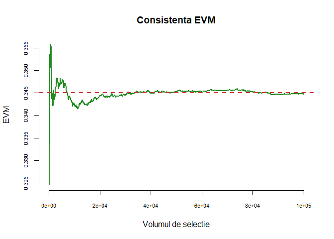
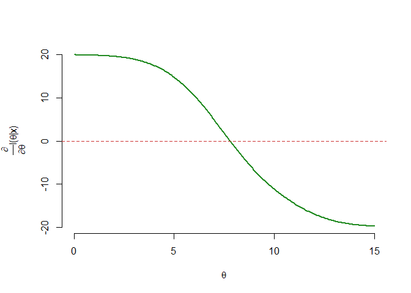
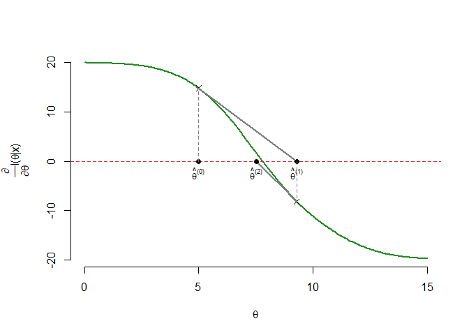
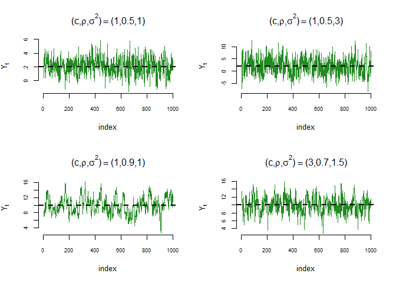
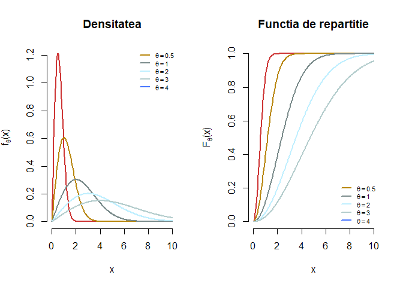
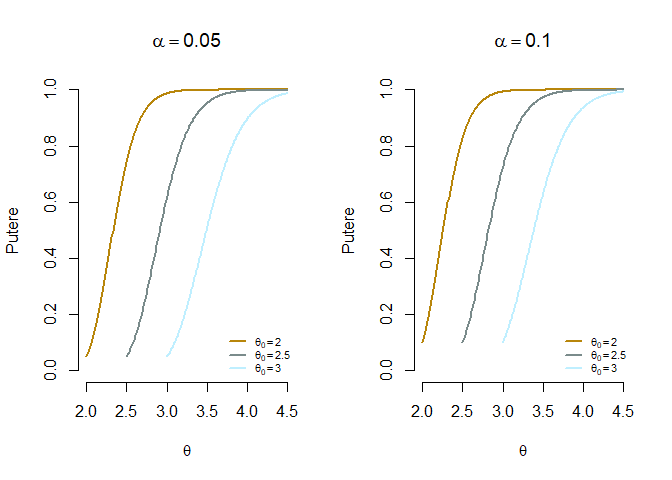
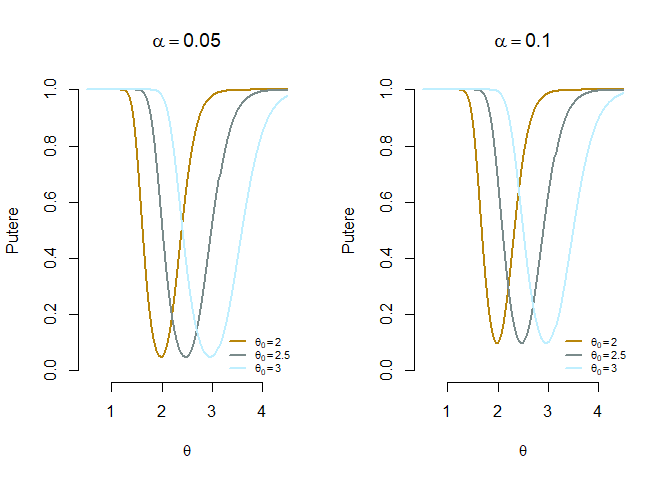

<script>
$(document).ready(function ()  {

    // move toc-ignore selectors from section div to header
    $('div.section.toc-ignore')
        .removeClass('toc-ignore')
        .children('h1,h2,h3,h4,h5').addClass('toc-ignore');

    // establish options
    var options = {
      selectors: "h1,h2,h3",
      theme: "bootstrap3",
      context: '.toc-content',
      hashGenerator: function (text) {
        return text.replace(/[.\\/?&!#<>]/g, '').replace(/\s/g, '_').toLowerCase();
      },
      ignoreSelector: ".toc-ignore",
      scrollTo: 60
    };
    options.showAndHide = false;
    options.smoothScroll = true;

    // tocify
    var toc = $("#TOC").tocify(options).data("toc-tocify");
});
</script>

Obiectivul acestui seminar este de a prezenta câteva exerciții de calcul cu metode utile atunci când vrem să verificăm dacă eșantionul provine ditnr-o populație normală.


# Estimare prin metoda verosimilității maxime 

## Metoda verosimilității maxime și repartiția Geometrică

\BeginKnitrBlock{rmdexercise}<div class="rmdexercise">Fie $X_1,X_2,\ldots,X_n$ un eșantion de talie $n$ dintr-o populație Geometrică a cărei funcție de masă este dată de

$$
  f_{\theta}(x) = \mathbb{P}_{\theta}(X = x) = \theta (1-\theta)^{x-1}, \quad \forall x\in\{1,2,3,\ldots\}  
$$

unde $\theta\in(0,1)$ este necunoscut. Presupunem că 

$$
  \mathbb{E}[X] = \frac{1}{\theta}, \quad Var(X) = \frac{1-\theta}{\theta^2}
$$

  a) Scrieți logaritmul funcției de verosimilitate pentru eșantionul dat.
  b) Determinați estimatorul de verosimilitate maximă $\hat{\theta}_n$ pentru $\theta$.
  c) Arătați că estimatorul de verosimilitate maximă este consistent.
  d) Folosind proprietățile asimptotice ale estimatorilor de verisimilitate maximă, derivați repartiția asimptotică a lui $\hat{\theta}_n$.
  e) Folosind *Teorema Limită Centrală* și *metoda Delta*, derivați repartiția asimptotică a lui $\hat{\theta}_n$.
  f) Determinați marginea Rao-Cramer. 
  g) Generați un eșantion de talie $n=1000$ dintr-o populație Geometrică de parametru $\theta = 0.345$. Estimați parametrul $\theta$ prin metoda verosimilității maxime folosind funcția `optim()` (sau `optimize()`).

</div>\EndKnitrBlock{rmdexercise}

  a) Din definiția funcției de verosimilitate avem 

$$
  L(\theta|\mathbf{x}) = \prod_{i=1}^{n}f_{\theta}(x_i) = \prod_{i=1}^{n}\theta (1-\theta)^{x_i-1} = \theta^n(1-\theta)^{\sum_{i=1}^n x_i - n}
$$
de unde logaritmul funcției de verosimilitate este 

$$
  l(\theta|\mathbf{x}) = \sum_{i=1}^{n}\log{f_{\theta}(x_i)} = n\log \theta + \left(\sum_{i=1}^n x_i - n\right)\log(1-\theta).
$$

  b) Estimatorul de verosimilitate maximă pentru $\theta$ este definit prin 

$$
  \hat{\theta}_n = \underset{0<\theta<1}{\arg\max} \,L(\theta|\mathbf{x}) = \underset{0<\theta<1}{\arg\max}\, l(\theta|\mathbf{x})
$$
iar pentru determinarea acestuia (sub anumite condiții de regularitate) trebuie să rezolvăm ecuația de verosimilitate $\frac{\partial l(\theta|\mathbf{x})}{\partial\theta} = 0$ (condiție de ordin unu). Trebuie remarcat că în cazul în care $\theta = (\theta_1, \theta_2, \ldots, \theta_k)$ condiția se scrie sub forma 

$$
\nabla L(\theta|\mathbf{x}) = \frac{\partial L(\theta|\mathbf{x})}{\partial\theta} = \begin{pmatrix}
        \frac{\partial L(\theta|\mathbf{x})}{\partial\theta_1}\\
        \cdots\\
        \frac{\partial L(\theta|\mathbf{x})}{\partial\theta_k}
        \end{pmatrix} = \begin{pmatrix}
        0\\ 
        \cdots\\ 
        0
        \end{pmatrix}.
$$
Soluțiile acestei ecuații ne dau punctele critice (din interiorul domeniului) iar pentru determinarea maximului este necesară verificarea unor condiții de ordin doi: matricea Hessiană 

$$
  \frac{\partial^2 L(\theta|\mathbf{x})}{\partial\theta \partial\theta^\intercal} = \begin{pmatrix}
              \frac{\partial^2 L(\theta|\mathbf{x})}{\partial\theta_1^2} & \frac{\partial^2 L(\theta|\mathbf{x})}{\partial\theta_1\partial\theta_2} & \cdots & \frac{\partial^2 L(\theta|\mathbf{x})}{\partial\theta_1\partial\theta_k}\\
              \frac{\partial^2 L(\theta|\mathbf{x})}{\partial\theta_2\partial\theta_1} & \frac{\partial^2 L(\theta|\mathbf{x})}{\partial\theta_2^2} & \cdots & \frac{\partial^2 L(\theta|\mathbf{x})}{\partial\theta_2\partial\theta_k}\\
              \cdots & \cdots & \cdots & \cdots \\
              \frac{\partial^2 L(\theta|\mathbf{x})}{\partial\theta_k\partial\theta_1} & \frac{\partial^2 L(\theta|\mathbf{x})}{\partial\theta_k\partial\theta_2} & \cdots & \frac{\partial^2 L(\theta|\mathbf{x})}{\partial\theta_k^2}\\
              \end{pmatrix}
$$

evaluată în $\hat{\theta}_n$ trebuie să fie negativ definită, adică

$$
  \mathbf{x}^\intercal\frac{\partial^2 L(\theta|\mathbf{x})}{\partial\theta \partial\theta^\intercal}\mathbf{x}<0, \quad \forall \mathbf{x}\in\mathbb{R}^n	\setminus\{0\}.
$$

În cazul problemei noastre obținem

$$
  \frac{\partial l(\theta|\mathbf{x})}{\partial\theta} = \frac{n}{\theta} - \left(\sum_{i=1}^n x_i - n\right)\frac{1}{1-\theta}
$$
și rezolvând ecuația $\frac{\partial l(\theta|\mathbf{x})}{\partial\theta} = 0$ găsim că 

$$
  \frac{n}{\theta} - \left(\sum_{i=1}^n x_i - n\right)\frac{1}{1-\theta} \iff \frac{1-\theta}{\theta} = \frac{1}{n}\sum_{i=1}^n x_i - 1 \iff \frac{1}{\theta} = \frac{1}{n}\sum_{i=1}^n x_i
$$

de unde $\hat{\theta}_n = \frac{1}{\bar{X}_n}$. Pentru a vedea că $\hat{\theta}_n$ este într-adevăr valoarea care maximizează funcția de verosimilitate, avem 

$$
  \left. \frac{\partial^2 l(\theta|\mathbf{x})}{\partial\theta^2}\right\vert_{\hat{\theta}_n} = -\frac{n}{\hat{\theta}_n^2} - \left(\frac{1}{1-\hat{\theta}_n}\right)^2\left(\sum_{i=1}^n x_i - n\right)
$$

și cum $\hat{\theta}_n = \frac{1}{\bar{x}_n}$ deducem că $\sum_{i=1}^n x_i - n = n\left(\frac{1}{\hat{\theta}_n} - 1\right)$ iar
 
\begin{align*}
  \left. \frac{\partial^2 l(\theta|\mathbf{x})}{\partial\theta^2}\right\vert_{\hat{\theta}_n} &= -\frac{n}{\hat{\theta}_n^2} - \left(\frac{1}{1-\hat{\theta}_n}\right)^2n\left(\frac{1}{\hat{\theta}_n} - 1\right) = -n\left(\frac{1}{\hat{\theta}_n^2} + \frac{1}{\hat{\theta}_n(1-\hat{\theta}_n)}\right)\\
    & = -\frac{n}{\hat{\theta}_n^2(1-\hat{\theta}_n)}<0
\end{align*}

ceea ce arată că $\hat{\theta}_n = \frac{1}{\bar{X}_n}$ este estimatorul de verosimilitate maximă. 

  c) Aplicând *Legea numerelor mari* (varianta slabă) avem că 
  
$$
  \bar{X}_n \overset{\mathbb{P}}{\to} \mathbb{E}[X_1] = \frac{1}{\theta}
$$

Cum $\hat{\theta}_n = \frac{1}{\bar{X}_n}$ putem aplica *Teorema aplicațiilor continue* pentru funcția $g(x) = \frac{1}{x}$, $0<x<1$ și găsim că 

$$
  \hat{\theta}_n = g(\bar{X}_n) \overset{\mathbb{P}}{\to} g\left(\frac{1}{\theta}\right) = \theta
$$

ceea ce arată că $\hat{\theta}_n$ este consistent. 

  d) Observăm că funcția de masă verifică condițiile de regularitate^[e.g. Suportul $\{x\,|\,f_{\theta}(x)>0\}$ nu depinde de $\theta$; $f_{\theta}(x)$ este de cel puțin 3 ori derivabilă în raport cu $\theta$ și derivatele sunt continue; Valoarea adevărată $\theta$ se află într-o mulțime compactă.] prin urmare are loc 
  
$$
  \sqrt{n}\left(\hat{\theta}_n - \theta_0\right) \underset{n\to\infty}{\overset{d}{\longrightarrow}} \mathcal{N}(0,I_1^{-1}(\theta_0))
$$
unde $\theta_0$ este valoarea adevărată a parametrului iar $I_1^{-1}(\theta_0)$ este informația lui Fisher pentru o observație. În general *Informația lui Fisher* pentru eșantion este 

\begin{align*}
  I_n(\theta) &= Var_{\theta}\left(\nabla l(\theta|\mathbf{X})\right) = Var_{\theta}\left(\frac{\partial \log f_{\theta}(\mathbf{X})}{\partial\theta}\right)\\
        &= \mathbb{E}_{\theta}\left[\frac{\partial \log f_{\theta}(\mathbf{X})}{\partial\theta} \times \frac{\partial \log f_{\theta}(\mathbf{X})}{\partial\theta}^\intercal\right]\\
        &= \mathbb{E}_{\theta}\left[-\frac{\partial^2 \log f_{\theta}(\mathbf{X})}{\partial\theta\partial\theta^\intercal}\right].
\end{align*}

Pentru cazul nostru găsim că informația lui Fisher este 

$$
  I_1(\theta) = \mathbb{E}_{\theta}\left[-\frac{\partial^2 \log f_{\theta}(X_i)}{\partial \theta^2}\right] = \mathbb{E}_{\theta}\left[\frac{1}{\theta^2} - \left(\frac{1}{1-\theta}\right)^2 (X_i-1)\right] = \frac{1}{\theta^2(1-\theta)}
$$

și astfel 

$$
  \sqrt{n}\left(\hat{\theta}_n - \theta_0\right) \underset{n\to\infty}{\overset{d}{\longrightarrow}} \mathcal{N}(0, \theta_0^2(1-\theta_0))
$$

sau echivalent $\hat{\theta}_n \approx \mathcal{N}\left(\theta_0, \frac{\theta_0^2(1-\theta_0)}{n}\right)$. 

  e) Știind că $\mathbb{E}[X] = \frac{1}{\theta_0}$ și $Var(X) = \frac{1-\theta_0}{\theta_0^2}$ și aplicând *Teorema Limită Centrală* avem că 
  
$$
  \sqrt{n}\left(\bar{X}_n - \frac{1}{\theta_0}\right) \underset{n\to\infty}{\overset{d}{\longrightarrow}} \mathcal{N}\left(0, \frac{1-\theta_0}{\theta_0^2}\right).
$$

Estimatorul de verosimilitate maximă este $\hat{\theta}_n = \frac{1}{\bar{X}_n}$ și considerând $g(x) = \frac{1}{x}$, $x\in(0,1)$ ($g$ este derivabilă cu derivata continuă) putem aplica metoda Delta care conduce la 

$$
  \sqrt{n}\left(g(\bar{X}_n) - g\left(\frac{1}{\theta_0}\right)\right) \underset{n\to\infty}{\overset{d}{\longrightarrow}} \mathcal{N}\left(0, g'\left(\frac{1}{\theta_0}\right)^2\frac{1-\theta_0}{\theta_0^2}\right)
$$

și cum $g'(x) = -\frac{1}{x^2}$ obținem același rezultat ca și în cazul punctului anterior

$$
  \sqrt{n}\left(\hat{\theta}_n - \theta_0\right) \underset{n\to\infty}{\overset{d}{\longrightarrow}} \mathcal{N}(0, \theta_0^2(1-\theta_0)).
$$

  f) Marginea inegalității Rao-Cramer ($MIRC$) este $I_n^{-1}(\theta_0)$ și cum 
  
$$
  I_n(\theta_0) = \mathbb{E}_{\theta}\left[-\left.\frac{\partial^2 \log f_{\theta}(\mathbf{X})}{\partial\theta\partial\theta^\intercal}\right\rvert_{\theta_0}\right] = nI_1(\theta_0) = \frac{n}{\theta_0^2(1-\theta_0)}
$$

găsim 

$$
  MIRC = I_n^{-1}(\theta_0) = \frac{\theta_0^2(1-\theta_0)}{n}.
$$

  g) Pentru a genera eșantionul $X_1, X_2, \ldots, X_n$ vom folosi funcția `rgeom()`. Atenție, această funcție permite generarea de observații repartizate Geometric de parametru $\theta$, cu funcția de masă
  

$$
 \mathbb{P}_{\theta}(X = x) = \theta (1-\theta)^{x}, \quad \forall x\in\{0,1,2,3,\ldots\}  
$$

deci trebuie să adăugăm $1$ la fiecare observație pentru a fi în contextul din exercițiu. 


```r
theta = 0.345
n = 1000

x = rgeom(n, theta) + 1

# EVM gasit este 
EVM = 1/mean(x)
EVM
[1] 0.3435246
```

Vom crea o funcție care să calculeze estimatorul de verosimilitate maximă plecând de la logaritmul funcției de verosimilitate (îi determinăm maximul cu ajutorul funcției `optimize()`):


```r
EVM_geom = function(theta, n, init = 0.5, seed = NULL){
  
  if (!is.null(seed)){
    set.seed(seed)
  }
  
  x = rgeom(n, theta)+1
  
  loglik_geom = function(param){
    
    l = n*log(param) + (sum(x) - n)*log(1-param)
    # intoarcem -l pentru ca vrem maximul
    return(-l)
  }
  # folosim functia optimize
  # a se vedea ?optimize
  return(optimize(loglik_geom, c(0,1))[[1]])
}

# exemple
EVM_geom(0.345, 1000)
[1] 0.3363523
EVM_geom(0.478, 1000)
[1] 0.4805382
EVM_geom(0.222, 1000)
[1] 0.2317444
```

În figura de mai jos este ilustrată proprietatea de consistență a estimatorului de verosimilitate maximă, pentru $\theta = 0.345$:


```r
theta = 0.345
t = seq(100, 100000, 100)

y = sapply(t, function(x){
 r = EVM_geom(theta, x, seed = 2018)
 return(r)
})

plot(t, y, type = "l", 
     col = "forestgreen", 
     xlab = "Volumul de selectie",
     ylab = "EVM", 
     main = "Consistenta EVM", 
     bty = "n", 
     cex.axis = 0.7,
     lwd = 2)

abline(h = theta, col = "brown3", 
       lty = 2, lwd = 2)
```




## Exemplu de EVM determinat prin soluții numerice

\BeginKnitrBlock{rmdexercise}<div class="rmdexercise">Fie $X_1,X_2,\ldots,X_n$ un eșantion de talie $n$ dintr-o populație logistică a cărei densitate este dată de formula 

$$
  f_{\theta}(x) = \frac{e^{-(x-\theta)}}{\left(1+e^{-(x-\theta)}\right)^2}, \quad x\in\mathbb{R},\, \theta\in\mathbb{R} 
$$
  
Determinați estimatorul de verosimilitate maximă $\hat{\theta}_n$ pentru $\theta$.
</div>\EndKnitrBlock{rmdexercise}

Densitatea de repartiție și funcția de repartiție a repartiției logistice sunt ilustrate mai jos (în R se folosesc funcțiile: `rlogis`, `dlogis`, `plogis` și respectiv `qlogis`):


```r
# Generam graficele 
pars = c(2, 4, 6, 9)

x = seq(-8, 15, length.out = 250)

set.seed(1234)
cols = sample(colors(), length(pars))

par(mfrow = c(1, 2))
# densitatile
plot(x, dlogis(x, location = pars[1]),
     xlab = "x",
     ylab = TeX("$f_{\\theta}(x)$"),
     # ylim = c(0,1),
     col = "brown3", 
     lwd = 2, type = "l",
     bty = "n",
     main = "Densitatea")

for (i in seq(length(pars)-1)){
  location = pars[i+1]
    
  y = dlogis(x, location = location)
  
  lines(x, y, lwd = 2, 
        col = cols[i])
}

legend("topright", 
       legend = TeX(paste0("$\\theta = ", pars, "$")),
       col = cols,
       lwd = rep(2, length(pars)),
       bty = "n",
       cex = 0.7,
       seg.len = 1.5)

# functiile de repartitie
plot(x, plogis(x, location = pars[1]),
     xlab = "x",
     ylab = TeX("$F_{\\theta}(x)$"),
     ylim = c(0,1),
     col = "brown3", 
     lwd = 2, type = "l",
     bty = "n",
     main = "Functia de repartitie")

for (i in seq(length(pars)-1)){
  location = pars[i+1]
  
  y = plogis(x, location = location)
  
  lines(x, y, lwd = 2, 
        col = cols[i])
}

legend("bottomright", 
       legend = TeX(paste0("$\\theta = ", pars, "$")),
       col = cols,
       lwd = rep(2, length(pars)),
       bty = "n",
       cex = 0.7,
       seg.len = 1.5)
```


Observăm că funcția de verosimilitate este dată de 

$$
L(\theta|\mathbf{x}) = \prod_{i=1}^{n}f_{\theta}(x_i) = \prod_{i=1}^{n}\frac{e^{-(x_i-\theta)}}{\left(1+e^{-(x_i-\theta)}\right)^2}
$$

iar logaritmul funcției de verosimilitate este 

$$
l(\theta|\mathbf{x}) = \sum_{i=1}^{n}\log{f_{\theta}(x_i)} = n\theta - n\bar{x}_n - 2\sum_{i=1}^{n}\log{\left(1+e^{-(x_i-\theta)}\right)}.
$$

Pentru a găsi valoarea lui $\theta$ care maximizează logaritmul funcției de verosimilitate și prin urmare a funcției de verosimilitate trebuie să rezolvăm ecuația $l'(\theta|\mathbf{x}) = 0$, unde derivata lui $l(\theta|\mathbf{x})$ este

$$
l'(\theta|\mathbf{x}) = n - 2\sum_{i = 1}^{n}\frac{e^{-(x_i-\theta)}}{1+e^{-(x_i-\theta)}}
$$

ceea ce conduce la ecuația 

$$
  \sum_{i = 1}^{n}\frac{e^{-(x_i-\theta)}}{1+e^{-(x_i-\theta)}} = \frac{n}{2} \tag{$\star$}
$$

Chiar dacă această ecuație nu se simplifică, se poate arăta că această ecuația admite soluție unică. Observăm că derivata parțiala a membrului drept în ($\star$) devine 

$$
\frac{\partial }{\partial \theta}\sum_{i = 1}^{n}\frac{e^{-(x_i-\theta)}}{1+e^{-(x_i-\theta)}} = \sum_{i = 1}^{n}\frac{e^{-(x_i-\theta)}}{\left(1+e^{-(x_i-\theta)}\right)^2}>0
$$

ceea ce arată că membrul stâng este o funcție strict crescătoare în $\theta$. Cum membrul stâng în ($\star$) tinde spre $0$ atunci când $\theta\to-\infty$ și spre $n$ pentru $\theta\to\infty$ deducem că ecuația ($\star$) admite soluție unică (vezi graficul de mai jos).


```r
set.seed(112)
n = 20
x = rlogis(n, location = 7.5)

# derivata logaritmului functiei de verosimilitate
dLogLogistic = function(n, x, theta){
  sapply(theta, function(t){
    y = exp(-(x - t))
    n - 2*sum(y/(1+y))
  })
}

theta = seq(0, 15, length.out = 250)

mar.default <- c(5,4,4,2) + 0.1
par(mar = mar.default + c(0, 1.2, 0, 0))

plot(theta, dLogLogistic(n, x, theta), type = "l",
     col = "forestgreen", lwd = 2,
     bty = "n",
     xlab = TeX("$\\theta$"),
     ylab = TeX("$\\frac{\\partial}{\\partial \\theta} l(\\theta | x)$"))

abline(h = 0, col = "brown3",
       lty = 2)
```



Cum nu putem găsi o soluție a ecuației $l'(\theta|\mathbf{x}) = 0$ sub formă compactă, este necesar să apelăm la metode numerice. O astfel de metodă numerică este binecunoscuta [metodă a lui Newton-Raphson](https://en.wikipedia.org/wiki/Newton%27s_method). Metoda presupune să începem cu o valoare (soluție) inițială $\hat{\theta}^{(0)}$ și să alegem, plecând de la aceasta, o nouă valoare $\hat{\theta}^{(1)}$ definită prin 

$$
  \hat{\theta}^{(1)} = \hat{\theta}^{(0)} - \frac{l'\left(\hat{\theta}^{(0)}\right)}{l''\left(\hat{\theta}^{(0)}\right)},
$$

adică $\hat{\theta}^{(1)}$ este intersecția cu axa absciselor a tangentei în punctul $\left(\hat{\theta}^{(0)}, l'\left(\hat{\theta}^{(0)}\right)\right)$ la graficul funcției $l'(\theta)$. Ideea este de a itera procesul până când soluția converge, cu alte cuvinte pornind de la o valoare *rezonabilă* de start $\hat{\theta}^{(0)}$ la pasul $k+1$ avem 

$$
  \hat{\theta}^{(k+1)} = \hat{\theta}^{(k)} - \frac{l'\left(\hat{\theta}^{(k)}\right)}{l''\left(\hat{\theta}^{(k)}\right)}
$$

și oprim procesul atunco când $k$ este suficient de mare și/sau $\left|\hat{\theta}^{(k+1)} - \hat{\theta}^{(k)}\right|$ este suficient de mic. Următorul grafic ilustrează grafic algoritmul lui Newton:


```r
set.seed(112)
n = 20
x = rlogis(n, location = 7.5)

# derivata logaritmului functiei de verosimilitate
dLogLogistic = function(n, x, theta){
  sapply(theta, function(t){
    y = exp(-(x - t))
    n - 2*sum(y/(1+y))
  })
}

theta = seq(0, 15, length.out = 250)

mar.default <- c(5,4,4,2) + 0.1
par(mar = mar.default + c(0, 1.2, 0, 0))

plot(theta, dLogLogistic(n, x, theta), type = "l",
     col = "forestgreen", lwd = 2,
     bty = "n",
     xlab = TeX("$\\theta$"),
     ylab = TeX("$\\frac{\\partial}{\\partial \\theta} l(\\theta | x)$"))

abline(h = 0, col = "brown3",
       lty = 2)

# ilustrarea metodei Newton

dl = function(theta) n - 2 * sum(exp(theta - x) / (1 + exp(theta - x)))
ddl = function(theta) {-2 * sum(exp(theta - x) / (1 + exp(theta - x))^2)}

x0 = 5 # punctul de start

points(x0, 0, pch = 16, col = "black")
text(x0, 0, labels = TeX("$\\hat{\\theta}^{(0)}$"), pos = 1, cex = 0.8)
segments(x0, 0, x0, dl(x0), lty = 2, col = "grey50")
points(x0, dl(x0), pch = 4)

x1 = x0 - dl(x0)/ddl(x0)

segments(x0, dl(x0), x1, 0, lty = 1, lwd = 2, col = "grey50")
points(x1, 0, pch = 16, col = "black")
text(x1, 0, labels = TeX("$\\hat{\\theta}^{(1)}$"), pos = 1, cex = 0.8)
segments(x1, 0, x1, dl(x1), lty = 2, col = "grey50")
points(x1, dl(x1), pch = 4)

x2 = x1 - dl(x1)/ddl(x1)

segments(x1, dl(x1), x2, 0, lty = 1, lwd = 2, col = "grey50")
points(x2, 0, pch = 16, col = "black")
text(x2, 0, labels = TeX("$\\hat{\\theta}^{(2)}$"), pos = 1, cex = 0.8)
```



**Obs:** Singurul lucru care se schimbă atunci când trecem de la scalar la vector, este funcția $l(\theta)$ care acum este o funcție de $p>1$ variabile, $\theta = (\theta_1, \theta_2, \ldots, \theta_p)^{\intercal}\in\mathbb{R}^p$. În acest context $l'(\theta)$ este un vector de derivate parțiale iar $l''(\theta)$ este o matrice de derivate parțiale de ordin doi. Prin urmare itarațiile din metoda lui Newton sunt 

$$
  \hat{\theta}^{(k+1)} = \hat{\theta}^{(k)} - \left[l''\left(\hat{\theta}^{(k)}\right)\right]^{-1}l'\left(\hat{\theta}^{(k)}\right)
$$
unde $[\cdot]^{-1}$ este [pseudoinversa](https://en.wikipedia.org/wiki/Moore%E2%80%93Penrose_inverse) unei matrici. 

Funcția de mai jos implementează metoada lui Newton pentru cazul multidimensional:


```r
# Metoda lui Newton

newton <- function(f, df, x0, eps=1e-08, maxiter=1000, ...) {
  # in caz ca nu e incarcat pachetul sa putem accesa pseudoinversa
  if(!exists("ginv")) library(MASS) 
  
  x <- x0
  k <- 0
  
  repeat {
    k <- k + 1
    
    x.new <- x - as.numeric(ginv(df(x, ...)) %*% f(x, ...))
    
    if(mean(abs(x.new - x)) < eps | k >= maxiter) {
      if(k >= maxiter) warning("S-a atins numarul maxim de iteratii!")
      break
    }
    x <- x.new
  }
  out <- list(solution = x.new, value = f(x.new, ...), iter = k)
  
  return(out)
}
```

Să presupunem că am observat următorul eșantion de talie $20$ din repartiția logistică:


```
 [1]  6.996304  9.970107 12.304991 11.259549  6.326912  5.378941  4.299639
 [8]  8.484635  5.601117  7.094335  6.324731  6.868456  9.753360  8.042095
[15]  8.227830 10.977982  7.743096  7.722159  8.562884  6.968356
```


```r
set.seed(112)
x = rlogis(20, location = 7.5)

n = length(x)
dl = function(theta) n - 2 * sum(exp(theta - x) / (1 + exp(theta - x)))
ddl = function(theta) {-2 * sum(exp(theta - x) / (1 + exp(theta - x))^2)}

logis.newton = newton(dl, ddl, median(x))
```

și aplicănd metoda lui Newton găsim estimatorul de verosimilitate maximă $\hat{\theta}_n=$ 7.7933 după numai 3 iterații (datele au fost simulate folosind $\theta = 7.5$). 

## Metoda verosimilității maxime și procese autoregresive $AR(r)$

\BeginKnitrBlock{rmdexercise}<div class="rmdexercise">Se numește proces autoregresiv de ordin 1 $AR(1)$, un proces Gaussian staționar definit prin 

$$
  Y_t = c + \rho Y_{t-1} + \epsilon_{t}
$$
  
cu $\epsilon_{t}$ variabile aleatoare i.i.d. repartizate $\mathcal{N}(0,\sigma^2)$ și $|\rho|<1$. 

  </div>\EndKnitrBlock{rmdexercise}

Observăm că din condiția de staționaritate^[Aici ne referim la proprietatea de staționaritate în sens larg (wide-sense stationary) care presupune că $\forall t_1,t_2\in\mathbb{N}$ și $\forall \tau\in\mathbb{N}$ avem $\mathbb{E}[Y_{t_1}] = \mathbb{E}[Y_{t_2}]$ și $\mathbb{E}[Y_{t_1}Y_{t_2}] = \mathbb{E}[Y_{t_1+\tau}Y_{t_2+\tau}]$.] rezultă că 

$$
  \mathbb{E}[Y_t] = \frac{c}{1-\rho} ,\quad Var[Y_t] = \frac{\sigma^2}{1-\rho^2}.
$$

\BeginKnitrBlock{rmdexercise}<div class="rmdexercise">Fie $\mathbf{\theta} = (c, \rho, \sigma^2)^\intercal$ vectorul parametrilor modelului. Scrieți funcția de verosimilitate și logaritmul funcției de verosimilitae pentru o observație, $y_1$.

</div>\EndKnitrBlock{rmdexercise}

Cum variabila aleatoare $Y_1$ are media și varianța date de 

$$
  \mathbb{E}[Y_1] = \frac{c}{1-\rho} ,\quad Var[Y_1] = \frac{\sigma^2}{1-\rho^2}.
$$

iar $\epsilon_t$ sunt i.i.d. repartizate $\mathcal{N}(0,\sigma^2)$, deducem că $Y_1$ este repartizată tot normal, cu $Y_1\sim\mathcal{N}\left(\frac{c}{1-\rho}, \frac{\sigma^2}{1-\rho^2}\right)$. Astfel funcția de verosimilitate pentru $y_1$ este 

$$
  L(\mathbf{\theta};y_1) = \frac{1}{\sqrt{2\pi}\sqrt{\frac{\sigma^2}{1-\rho^2}}}e^{-\frac{1}{2}\frac{\left(y_1 - \frac{c}{1-\rho}\right)^2}{\frac{\sigma^2}{1-\rho^2}}}
$$

iar logaritmul funcției de verosimilitate pentru $y_1$ este 

$$
  l(\mathbf{\theta};y_1) = -\frac{1}{2}\log(2\pi) - \frac{1}{2}\log\left(\frac{\sigma^2}{1-\rho^2}\right) -\frac{1}{2}\frac{\left(y_1 - \frac{c}{1-\rho}\right)^2}{\frac{\sigma^2}{1-\rho^2}}.
$$

\BeginKnitrBlock{rmdexercise}<div class="rmdexercise">Care este repartiția condiționată a lui $Y_2$ la $Y_1 = y_1$? Scrieți funcția de verosimilitate și logaritmul funcției de verosimilitate (condiționată) pentru a doua observație $y_2$. 

</div>\EndKnitrBlock{rmdexercise}

Observăm că pentru $t=2$ avem 

$$
  Y_2 = c + \rho Y_1 + \epsilon_2,
$$

unde $\epsilon_2\sim\mathcal{N}(0,\sigma^2)$. Prin urmare repartiția condiționată a lui $Y_2$ dat fiind $Y_1 = y_1$ este 

$$
  Y_2|Y_1=y_1\sim\mathcal{N}(c+\rho y_1,\sigma^2)
$$

de unde funcția de verosimilitate (condiționată) pentru $y_2$ este

$$
  L(\mathbf{\theta};y_2|y_1) = f_{Y_2|Y_1}(y_2|y_1;\mathbf{\theta}) = \frac{1}{\sigma\sqrt{2\pi}}e^{-\frac{1}{2}\frac{\left(y_2 - c-\rho y_1\right)^2}{\sigma^2}}
$$

iar logaritmul funcției de verosimilitate (condiționată) pentru $y_2$ este

$$
  l(\mathbf{\theta};y_2|y_1) = \log f_{Y_2|Y_1}(y_2|y_1;\mathbf{\theta}) = -\frac{1}{2}\log(2\pi) - \frac{1}{2}\log\left(\sigma^2\right)-\frac{1}{2}\frac{\left(y_2 - c-\rho y_1\right)^2}{\sigma^2}.
$$


\BeginKnitrBlock{rmdexercise}<div class="rmdexercise">Considerați eșantionul $\{y_1, y_2\}$ de talie $2$. Scrieți funcția de verosimilitate (completă) și logaritmul funcției de verosimilitate a modelului $AR(1)$ pentru acest eșantion. Extindeți rezultatul pentru un eșantion $y_1,y_2,\ldots,y_T$ de talie $T$. 

</div>\EndKnitrBlock{rmdexercise}

Reamintim că dacă avem două variabile aleatoare continue (absolut continue) $X$ și $Y$ atunci densitatea cuplului $(X,Y)$ este 

$$
  f_{(X,Y)}(x,y) = f_{Y|X}(y|x)f_{X}(x),
$$

prin urmare funcția de verosimilitate (completă) pentru eșantionul $\{y_1, y_2\}$ este 

$$
  L(\mathbf{\theta};y_1,y_2) = f_{(Y_1,Y_2)}(y_1,y_2;\mathbf{\theta}) = f_{Y_2|Y_1}(y_2|y_1;\mathbf{\theta})f_{Y_1}(y_1;\mathbf{\theta})
$$

sau echivalent

$$
  L(\mathbf{\theta};y_1,y_2) = L(\mathbf{\theta};y_2|y_1)L(\mathbf{\theta};y_1) = \frac{\sqrt{1-\rho^2}}{2 \pi\sigma^2}e^{-\frac{1}{2}\frac{(1-\rho^2)\left(y_1 - \frac{c}{1-\rho}\right)^2}{\sigma^2}-\frac{1}{2}\frac{\left(y_2 - c-\rho y_1\right)^2}{\sigma^2}}.
$$

În mod similar, logaritmul funcției de verosimilitate este 

$$
  l(\mathbf{\theta};y_1,y_2) = l(\mathbf{\theta};y_2|y_1)+ l(\mathbf{\theta};y_1) = \frac{1}{2}\log(1-\rho^2) - \log(2 \pi\sigma^2) -\frac{1}{2}\frac{(1-\rho^2)\left(y_1 - \frac{c}{1-\rho}\right)^2}{\sigma^2}-\frac{1}{2}\frac{\left(y_2 - c-\rho y_1\right)^2}{\sigma^2}.
$$
Observăm că densitatea lui $Y_3$ condiționată la primele două variabile este 

$$
  f_{Y_3|Y_2,Y_1}(y_3|y_2, y_1;\mathbf{\theta}) = \frac{1}{\sigma\sqrt{2\pi}}e^{-\frac{1}{2}\frac{(y_3 - c -\rho y_2)^2}{\sigma^2}}
$$

de unde 

\begin{align*}
  f_{Y_3, Y_2, Y_1}(y_3, y_2, y_1;\mathbf{\theta}) &= f_{Y_3|Y_2,Y_1}(y_3|y_2, y_1;\mathbf{\theta})f_{Y_2,Y_1}(y_2, y_1;\mathbf{\theta})\\
  &= f_{Y_3|Y_2,Y_1}(y_3|y_2, y_1;\mathbf{\theta})f_{Y_2|Y_1}(y_2|y_1;\mathbf{\theta})f_{Y_1}(y_1;\mathbf{\theta}).
\end{align*}

În general, valoarea lui $Y_1, Y_2, \ldots, Y_{t-1}$ influențează valoarea lui $Y_{t}$ doar prin valoarea lui $Y_{t-1}$ ceea ce arată că densitatea lui $Y_{t}$ condiționată la celelalte $t-1$ variabile este 

$$
  f_{Y_t|Y_{t-1}, Y_{t-2},\ldots, Y_1}(y_t|y_{t-1}, y_{t-2},\ldots, y_1;\mathbf{\theta}) = f_{Y_t|Y_{t-1}}(y_t|y_{t-1};\mathbf{\theta}) = \frac{1}{\sigma\sqrt{2\pi}}e^{-\frac{1}{2}\frac{(y_t - c -\rho y_{t-1})^2}{\sigma^2}}.
$$


Astfel, pentru un eșantion $y_1,y_2,\ldots,y_T$ de talie $T$ avem 

\begin{align*}
 L(\mathbf{\theta};y_1,y_2,\ldots,y_T) &= L(\mathbf{\theta};y_1)\times\prod_{t = 2}^{T}L(\mathbf{\theta};y_t|y_{t-1})\\
 l(\mathbf{\theta};y_1,y_2,\ldots,y_T) &= l(\mathbf{\theta};y_1)+\sum_{t = 2}^{T}l(\mathbf{\theta};y_t|y_{t-1})
\end{align*}

ceea ce conduce la 

\begin{align*}
 L(\mathbf{\theta};y_1,y_2,\ldots,y_T) &= \frac{1}{\sqrt{2\pi}\sqrt{\frac{\sigma^2}{1-\rho^2}}}e^{-\frac{1}{2}\frac{\left(y_1 - \frac{c}{1-\rho}\right)^2}{\frac{\sigma^2}{1-\rho^2}}}\times\prod_{t = 2}^{T}\frac{1}{\sigma\sqrt{2\pi}}e^{-\frac{1}{2}\frac{\left(y_t - c-\rho y_{t-1}\right)^2}{\sigma^2}}
\end{align*} 

și respectiv la 

\begin{align*}
 l(\mathbf{\theta};y_1,y_2,\ldots,y_T) &= -\frac{1}{2}\log(2\pi) - \frac{1}{2}\log\left(\frac{\sigma^2}{1-\rho^2}\right) -\frac{1}{2}\frac{\left(y_1 - \frac{c}{1-\rho}\right)^2}{\frac{\sigma^2}{1-\rho^2}}\\
       &\quad +\sum_{t = 2}^{T}\left(-\frac{1}{2}\log(2\pi) - \frac{1}{2}\log\left(\sigma^2\right)-\frac{1}{2}\frac{\left(y_t - c-\rho y_{t-1}\right)^2}{\sigma^2}\right)\\
       &= -\frac{T}{2}\log(2\pi) -\frac{T}{2}\log(\sigma^2) + \frac{1}{2}\log(1-\rho^2) +\\
       &\quad+\frac{1}{2\sigma^2}\left[(1-\rho^2)\left(y_1 - \frac{c}{1-\rho}\right)^2 + \sum_{t = 2}^{T}\left(y_t - c-\rho y_{t-1}\right)^2\right]
\end{align*}


\BeginKnitrBlock{rmdexercise}<div class="rmdexercise">Funcția de verosimilitate este o funcție neliniară în parametrii $\mathbf{\theta}$, prin urmare estimatorul de verosimilitate maximă $\hat{\mathbf{\theta}} = (\hat{c}, \hat{\rho}, \hat{\sigma}^2)^\intercal$ va fi determinat prin metode numerice. Scrieți o funcție în R care să permită generarea unui eșantion dintr-un proces $AR(1)$. Pentru $c = 1$, $\rho = 0.5$ și $\sigma^2 = 1$ generați un eșantion de talie $T = 1000$ și calculați estimatorul de verosimilitate maximă.

</div>\EndKnitrBlock{rmdexercise}

Avem următoarea funcție care generează procesul autoregresiv $AR(1)$:


```r
genAR1 = function(n, c, rho, sigma){
  # n - marimea esantionului
  # c - termenul constant
  # rho - parametrul autoregresiv
  # sigma - abaterea standard a erorii
  
  # generam Y_1 repartizat normal
  y1 = rnorm(1, mean = c/(1-rho), sd = sqrt(sigma^2/(1-rho^2)))
  
  # nitializam
  y = rep(1, n)*y1
  
  # vectorul de erori
  epsilon = rnorm(n-1, 0, sigma)
  
  for (i in 2:n){
    y[i] = c + rho*y[i-1] + epsilon[i-1]
  }
  
  return(y)
}
```

Ilustrăm grafic traiectorile procesului $AR(1)$ pentru diverse seturi de parametrii $(c, \rho, \sigma^2)$:



Considerăm setul de parametrii $(c, \rho, \sigma^2) = (1, 0.5, 1)$ și calculăm estimatorul de verosimilitate maximă plecând de la logaritmul funcției de verosimilitate (utilizăm funcția `optim()`):


```r
y = genAR1(1000, 1, 0.5, 1)
  
loglik_AR1 = function(param){
  # pentru a folosi functia optim trebuie sa avem un singur argument
  # parametrii
  c = param[1]
  rho = param[2]
  sigma = param[3]
  
  # esantionul
  ly = length(y) # talia esantionului
  
  # prima observatie
  l1 = log(dnorm(y[1], mean = c/(1-rho), sd = sqrt(sigma^2/(1-rho^2))))
  
  # celelalte observatii
  dif = y[2:ly] - c - rho*y[1:(ly-1)]
  l2 = log(dnorm(dif, 0, sigma))
  
  # logaritmul verosimilitatii
  l = l1 + sum(l2)
  
  # intoarcem -l pentru ca vrem maximul
  return(-l)
}
 
# determinam MLE 
param = c(0.6, 0.6, 0.6)
MLE = optim(param, loglik_AR1)$par
```

Obținem următoarele rezultate

<table class="table table-striped table-hover" style="margin-left: auto; margin-right: auto;">
 <thead>
  <tr>
   <th style="text-align:left;">   </th>
   <th style="text-align:right;"> Theta </th>
   <th style="text-align:right;"> MLE </th>
  </tr>
 </thead>
<tbody>
  <tr>
   <td style="text-align:left;"> c </td>
   <td style="text-align:right;"> 1.0 </td>
   <td style="text-align:right;"> 0.9261046 </td>
  </tr>
  <tr>
   <td style="text-align:left;"> rho </td>
   <td style="text-align:right;"> 0.5 </td>
   <td style="text-align:right;"> 0.5211693 </td>
  </tr>
  <tr>
   <td style="text-align:left;"> sigma </td>
   <td style="text-align:right;"> 1.0 </td>
   <td style="text-align:right;"> 1.0104216 </td>
  </tr>
</tbody>
</table>

care sunt apropiate de valorile reale. 

\BeginKnitrBlock{rmdexercise}<div class="rmdexercise">Acum considerăm că prima observație $y_1$ este dată (deterministă) și avem $f_{Y_1}(y_1;\mathbf{\theta})$. Scrieți logaritmul funcției de verosimilitate a modelului $AR(1)$ pentru eșantionul $y_1,y_2,\ldots,y_T$.

</div>\EndKnitrBlock{rmdexercise}

Funcția de verosimilitate condiționată este definită prin 

$$
  L(\mathbf{\theta};y_2,\ldots, y_T|y_1) = \prod_{t = 2}^{T}f_{Y_t|Y_{t-1}, Y_1 = y_1}(y_t|y_{t-1}, y_1;\mathbf{\theta})\times \underbrace{f_{Y_1}(y_1;\mathbf{\theta})}_{ = 1} = \prod_{t = 2}^{T}f_{Y_t|Y_{t-1}}(y_t|y_{t-1};\mathbf{\theta})
$$

iar logaritmul funcției de verosimilitate condiționtă devine 

$$
  l(\mathbf{\theta};y_2,\ldots, y_T|y_1) = \sum_{t = 2}^{T}l_t(\mathbf{\theta};y_t|y_{t-1})
$$

cu $l_t(\mathbf{\theta};y_t|y_{t-1}) = \log(f_{Y_t|Y_{t-1}}(y_t|y_{t-1};\mathbf{\theta}))$. Găsim că 

$$
  l(\mathbf{\theta};y_2,\ldots, y_T|y_1) = -\frac{T-1}{2}\log(2\pi\sigma^2) - \frac{1}{2\sigma^2}\sum_{t = 2}^{T}(y_t - c - \rho y_{t-1})^2.
$$


# Testarea ipotezelor statistice

## Teste parametrice și Lema Neyman-Pearson

Să presupunem că ne aflăm în contextul următoarei probleme:

\BeginKnitrBlock{rmdexercise}<div class="rmdexercise">Fie $U$ și $V$ două variablie aleatoare independente și repartizate $\mathcal{N}(0, \theta)$. Variabila aleatoare $X$ definită prin

$$
    X = \sqrt{U^2 + V^2}
$$
  
este repartizată *Rayleigh* de parametru $\theta$, $X\sim \text{Rayleigh}(\theta)$, și are densitatea 

$$
  f_{\theta}(x) = \frac{x}{\theta}e^{-\frac{x^2}{2\theta}},\quad \forall x\in[0,\infty]
$$

</div>\EndKnitrBlock{rmdexercise}

Pentru mai multe detalii privind repartiția Rayleigh se poate consulta pagina [https://en.wikipedia.org/wiki/Rayleigh_distribution](https://en.wikipedia.org/wiki/Rayleigh_distribution) sau monografia [@Evans2000]. Densitatea de repartiție și funcția de repartiție a repartiției Rayleigh sunt ilustrate mai jos (pentru a folosi în R funcțiile: `rrayleigh`, `drayleigh`, `prayleigh` și respectiv `qrayleigh` trebuie instalat pachetul `VGAM`):



În cele ce urmează, ne propunem să răspundem la o serie de întrebări:

\BeginKnitrBlock{rmdexercise}<div class="rmdexercise">Fie $X_1, X_2, \ldots, X_n$ un eșantion de talie $n$ dintr-o populație Rayleigh de parametru $\theta$. Determinați estimatorul de verosimilitate maximă pentru $\theta$.

</div>\EndKnitrBlock{rmdexercise}

Logaritmul funcției de verosimilitate este dat de 

$$
  l(\theta|\mathbf{x}) = \sum_{i=1}^{n}\log{f_{\theta}(x_i)} = \sum_{i = 1}^{n}\log(x_i) - n\log(\theta) + \frac{1}{2\theta}\sum_{i = 1}^{n}x_i^2
$$

iar estimatorul de verosimilitate verifică

$$
  \hat{\theta}_n = \underset{\theta>0}{\arg\max}\, l(\theta|\mathbf{x}) = \underset{\theta>0}{\arg\max}\, \sum_{i = 1}^{n}\log(x_i) - n\log(\theta) + \frac{1}{2\theta}\sum_{i = 1}^{n}x_i^2.
$$

Rezolvând ecuația de verosimilitatea (condiția de ordin 1) 

$$
  \left. \frac{\partial l(\theta|\mathbf{x})}{\partial\theta}\right\vert_{\hat{\theta}_n} = -\frac{n}{\hat{\theta}_n} + \frac{1}{2\hat{\theta}_n^2}\sum_{i = 1}^{n}x_i^2 = 0
$$

găsim că  

$$
  \hat{\theta}_n = \frac{1}{2n}\sum_{i = 1}^{n} X_i^2.
$$

Pentru a vedea că într-adevăr $\hat{\theta}_n$ este estimatorul de verosimilitate maximă trebuie să verificăm condiția de ordin 2

$$
  \left. \frac{\partial^2 l(\theta|\mathbf{x})}{\partial\theta^2}\right\vert_{\hat{\theta}_n} = \frac{n}{\hat{\theta}_n^2} - \frac{1}{\hat{\theta}_n^3}\sum_{i = 1}^{n}x_i^2 = \frac{n}{\hat{\theta}_n^2} - \frac{2n\hat{\theta}_n}{\hat{\theta}_n^3} = - \frac{n}{\hat{\theta}_n^2}<0 
$$

unde am folosit faptul că $\sum_{i = 1}^{n}x_i^2 = 2n\hat{\theta}_n$. Prin urmare $\hat{\theta}_n$ este estimatorul de verosimilitate maximă.

\BeginKnitrBlock{rmdexercise}<div class="rmdexercise">Determinați repartiția asimptotică a EVM $\hat{\theta}_n$ a lui $\theta$.

</div>\EndKnitrBlock{rmdexercise}

Știm că dacă $\hat{\theta}_n$ este estimatorul de verosimilitate maximă pentru $\theta$ și $f_{\theta}(x)$ verifică o serie de condiții de regularitatea atunci are loc 
  
$$
  \sqrt{n}\left(\hat{\theta}_n - \theta_0\right) \underset{n\to\infty}{\overset{d}{\longrightarrow}} \mathcal{N}(0,I_1^{-1}(\theta_0))
$$

unde $\theta_0$ este valoarea adevărată a parametrului iar $I_1^{-1}(\theta_0)$ este informația lui Fisher pentru o observație. În cazul problemei noastre, informația lui Fisher este 

$$
  I_n(\theta) = \mathbb{E}_{\theta}\left[-\frac{\partial^2 \log f_{\theta}(\mathbf{X})}{\partial\theta^2}\right] = \mathbb{E}_{\theta}\left[-\frac{n}{\theta^2} + \frac{1}{\theta^3}\sum_{i = 1}^{n}X_i^2\right] = -\frac{n}{\theta^2} + \frac{1}{\theta^2}\sum_{i = 1}^{n}\mathbb{E}_{\theta}\left[\frac{X_i^2}{\theta}\right]
$$

Cum $\frac{X^2}{\theta} = \frac{U^2}{\theta} + \frac{V^2}{\theta}$ iar $\frac{U}{\sqrt{\theta}}$ și $\frac{V}{\sqrt{\theta}}$ sunt variabile aleatoare independente repartizate $\mathcal{N}(0,1)$ deducem că $\frac{X^2}{\theta}$ este repartizată $\chi^2(2)$ prin urmare 

$$
  \mathbb{E}_{\theta}\left[\frac{X_i^2}{\theta}\right] = 2.
$$

Astfel $I_n(\theta) = -\frac{n}{\theta^2} + \frac{2n}{\theta^2} = \frac{n}{\theta^2}$ de unde $I_1(\theta) = \frac{n1}{\theta^2}$. Avem 

$$
  \sqrt{n}\left(\hat{\theta}_n - \theta\right) \underset{n\to\infty}{\overset{d}{\longrightarrow}} \mathcal{N}(0,I_1^{-1}(\theta)) 
$$

sau echivalent 

$$
  \sqrt{n}\left(\hat{\theta}_n - \theta\right) \underset{n\to\infty}{\overset{d}{\longrightarrow}} \mathcal{N}(0,\theta^2). 
$$

\BeginKnitrBlock{rmdexercise}<div class="rmdexercise">Considerăm testul pentru ipotezele 

$$
  H_0:\, \theta = \theta_0 \quad \text{vs}\quad H_1:\, \theta = \theta_1
$$
  
unde $\theta_1>\theta_0$. Determinați regiunea critică pentru UMP test de mărime $\alpha$ pentru ipotezele $H_0$ și $H_1$.

</div>\EndKnitrBlock{rmdexercise}

Din lema Neyman-Pearson avem că regiunea critică a testului UMP este dată de 

$$
  C = \left\{(x_1,x_2,\ldots,x_n)\,|\,\frac{L_{\theta_0}(x_1,x_2,\ldots,x_n)}{L_{\theta_1}(x_1,x_2,\ldots,x_n)}<k\right\}
$$

unde constatnta $k$ se determină din mărimea testului $\alpha$

$$
  \mathbb{P}_{H_0}((x_1,x_2,\ldots,x_n)\in C) = \alpha.
$$

Prin logaritmare avem 

\begin{align*}
   & l(\theta_0|\mathbf{x}) -  l(\theta_1|\mathbf{x}) < \log(k)\\
   \iff & n\left(\log(\theta_1) - \log(\theta_0)\right) + \frac{1}{2}\left(\frac{1}{\theta_1} - \frac{1}{\theta_0}\right)\sum_{i = 1}^{n}x_i^2 < \log(k)\\
   \iff & \frac{1}{2}\left(\frac{1}{\theta_1} - \frac{1}{\theta_0}\right)\sum_{i = 1}^{n}x_i^2 < k_1 = \log(k) - n\left(\log(\theta_1) - \log(\theta_0)\right)
\end{align*}

sau echivalent, ținând cont de faptul că $\theta_1>\theta_0$, avem  

$$
  \frac{1}{2n}\sum_{i = 1}^{n}x_i^2 > c
$$

unde $c = \frac{k_1 \theta_0 \theta_1}{n(\theta_0 - \theta_1)}$.

Regiunea critică pentru testul UMP de mărime $\alpha$ cu ipotezele 

$$
  H_0:\, \theta = \theta_0 \quad \text{vs}\quad H_1:\, \theta = \theta_1
$$
  
unde $\theta_1>\theta_0$ este 

$$
  C = \left\{(x_1,x_2,\ldots,x_n)\,|\,\hat{\theta}_n = \frac{1}{2n}\sum_{i = 1}^{n}x_i^2 > c\right\}.
$$

Constanta $c$ se determină din condiția 

$$
  \alpha = \mathbb{P}_{H_0}(C) = \mathbb{P}_{H_0}(\hat{\theta}_n > c).
$$
Sub ipoteza nulă, dacă $n$ este suficient de mare, am văzut că 

$$
  \hat{\theta}_n \underset{H_0}{\approx} \mathcal{N}\left(\theta_0, \frac{\theta_0^2}{n}\right)
$$

prin urmare 

$$
  1-\alpha = \mathbb{P}_{H_0}\left(\sqrt{n}\frac{\hat{\theta}_n - \theta_0}{\theta_0}<\sqrt{n}\frac{c - \theta_0}{\theta_0}\right)
$$

de unde $c = \theta_0 + \frac{\theta_0}{\sqrt{n}}z_{1-\alpha}$ cu $z_{1-\alpha} = \Phi^{-1}(1-\alpha)$. 

Regiunea critică a testului UMP cu ipotezele $H_0\,\,vs\,\,H_1$ devine 

$$
  C = \left\{\mathbf{x}\,|\,\hat{\theta}_n(\mathbf{x}) > \theta_0 + \frac{\theta_0}{\sqrt{n}}z_{1-\alpha}\right\}.
$$


\BeginKnitrBlock{rmdexercise}<div class="rmdexercise">Considerăm testul pentru ipotezele 

$$
  H_0:\, \theta = 2 \quad \text{vs}\quad H_1:\, \theta > 2
$$
  
Știind că pentru un eșantion de talie $n = 100$ avem $\sum_{i = 1}^{n}x_i^2 = 470$ care este concluzia testului pentru un prag de semnificație de $10\%$?

</div>\EndKnitrBlock{rmdexercise}

Considerăm testul cu ipotezele 

$$
  H_0:\, \theta = \theta_0 \quad \text{vs}\quad H_1:\, \theta = \theta_1
$$
  
unde $\theta_1>\theta_0$. Am văzut că regiunea critică a testului UMP de mărime $\alpha$ este 

$$
  C = \left\{\mathbf{x}\,|\,\hat{\theta}_n(\mathbf{x}) > \theta_0 + \frac{\theta_0}{\sqrt{n}}z_{1-\alpha}\right\}.
$$

Cum regiunea critică nu depinde de $\theta_1$ (în plus raportul de verosimilitate verifică proprietatea de monotonie), ea corespunde și la testul unilateral UMP de mărime $\alpha$:

$$
  H_0:\, \theta = \theta_0 \quad \text{vs}\quad H_1:\, \theta > \theta_0
$$

Pentru $\theta_0 = 2$, $n = 100$ și $\alpha = 0.1$ obținem

$$
  C = \left\{\mathbf{x}\,|\,\hat{\theta}_n(\mathbf{x}) > 2 + \frac{2}{10}z_{0.9}\right\} = \left\{\mathbf{x}\,|\,\hat{\theta}_n(\mathbf{x}) > 2.2563\right\}
$$

Cum, din ipoteză avem că $\sum_{i = 1}^{n}x_i^2 = 470$, pentru $n = 100$ deducem că 

$$
  \hat{\theta}_n(\mathbf{x}) = \frac{1}{2n}\sum_{i = 1}^{n}x_i^2 = \frac{470}{200} = 2.35
$$

ceea ce arată că pentru pragul de semnificație de $\alpha = 10\%$ respingem ipoteza nulă $H_0:\, \theta = 2$.

\BeginKnitrBlock{rmdexercise}<div class="rmdexercise">Determinați puterea testului unilateral UMP de mărime $\alpha$ pentru ipotezele

$$
   H_0:\, \theta = \theta_0 \quad \text{vs}\quad H_1:\, \theta > \theta_0
$$
  
Ilustrați grafic în R pentru $n = 100$, $\theta_0 = 2$ și $\alpha = 0.1$.

</div>\EndKnitrBlock{rmdexercise}

Am văzut că regiunea critică este dată de 

$$
 C = \left\{\mathbf{x}\,|\,\hat{\theta}_n(\mathbf{x}) > \theta_0 + \frac{\theta_0}{\sqrt{n}}z_{1-\alpha}\right\}
$$

iar din definiția funcției putere avem că 

$$
 pow(\theta) = \mathbb{P}_{H_1}(\mathbf{x}\in C) = \mathbb{P}_{H_1}(\hat{\theta}_n(\mathbf{x}) > a)
$$

cu $a = \theta_0 + \frac{\theta_0}{\sqrt{n}}z_{1-\alpha}$.

Sub ipoteza alternativă avem că 

$$
  \hat{\theta}_n \underset{H_1}{\approx} \mathcal{N}\left(\theta, \frac{\theta^2}{n}\right),\quad \theta>\theta_0
$$

prin urmare puterea este 

$$
  pow(\theta) = 1 - \mathbb{P}_{H_1}\left(\sqrt{n}\frac{\hat{\theta}_n - \theta}{\theta}<\sqrt{n}\frac{a - \theta}{\theta}\right) = 1 - \Phi\left(\sqrt{n}\frac{a - \theta}{\theta}\right) = 1 - \Phi\left(\sqrt{n}\frac{\theta_0 - \theta}{\theta} + \frac{\theta_0}{\theta}z_{1-\alpha}\right),\, \theta>\theta_0.
$$

Particularizând, pentru $\theta_0 = 2$, $n = 100$ și $\alpha = 0.1$ obținem

$$
  pow(\theta) = 1 - \Phi\left(10\frac{2 - \theta}{\theta} + \frac{2.5631}{\theta}\right),\, \theta>2.
$$

Ilustrăm în R funcția putere a testului pentru ipotezele $H_0:\, \theta = \theta_0 \quad \text{vs}\quad H_1:\, \theta > \theta_0$:


```r
pow_graf = function(theta, theta0, alpha, n){
  z = qnorm(1-alpha)
  pow = 1 - pnorm(sqrt(n)*(theta0 - theta)/theta + theta0/theta*z)
  
  return(pow)
}
```




\BeginKnitrBlock{rmdexercise}<div class="rmdexercise">Considerăm testul bilateral pentru ipotezele 

$$
  H_0:\, \theta = \theta_0 \quad \text{vs}\quad H_1:\, \theta \neq \theta_0
$$
  
Care este regiunea critică a testului de mărime $\alpha$?

  </div>\EndKnitrBlock{rmdexercise}

Considerăm testele unilaterale 

$$
\begin{array}{ll}
  \text{Testul A} & H_0:\, \theta = \theta_0 \quad \text{vs}\quad H_1:\, \theta < \theta_0\\
  \text{Testul B} & H_0:\, \theta = \theta_0 \quad \text{vs}\quad H_1:\, \theta > \theta_0\\
\end{array}
$$

Regiunile critice ale celor două teste unilaterale UMP de mărime $\frac{\alpha}{2}$ sunt, după cum am văzut la întrebările precedente, date de 

\begin{align*}
  C_A &= \left\{\mathbf{x}\,|\,\hat{\theta}_n(\mathbf{x}) < \theta_0 + \frac{\theta_0}{\sqrt{n}}z_{\frac{\alpha}{2}}\right\}\\
  C_B &= \left\{\mathbf{x}\,|\,\hat{\theta}_n(\mathbf{x}) > \theta_0 + \frac{\theta_0}{\sqrt{n}}z_{1-\frac{\alpha}{2}}\right\}
\end{align*}

iar regiunea critică a testului bilateral este dată de reuniunea acestora

$$
  C = C_A\cup C_B = \left\{\mathbf{x}\,|\,\hat{\theta}_n(\mathbf{x}) < \theta_0 + \frac{\theta_0}{\sqrt{n}}z_{\frac{\alpha}{2}}\right\} \bigcup \left\{\mathbf{x}\,|\,\hat{\theta}_n(\mathbf{x}) > \theta_0 + \frac{\theta_0}{\sqrt{n}}z_{1-\frac{\alpha}{2}}\right\}.
$$

Știind că $z_{\frac{\alpha}{2}} = -z_{1-\frac{\alpha}{2}}$ această regiune critică se poate scrie sub forma

$$
  C = \left\{\mathbf{x}\,|\,\left|\hat{\theta}_n(\mathbf{x}) - \theta_0\right| > \frac{\theta_0}{\sqrt{n}}z_{1-\frac{\alpha}{2}}\right\}.
$$

\BeginKnitrBlock{rmdexercise}<div class="rmdexercise">Determinați puterea testului bilateral de mărime $\alpha$ pentru ipotezele

$$
   H_0:\, \theta = \theta_0 \quad \text{vs}\quad H_1:\, \theta \neq \theta_0
$$
  
Ilustrați grafic în R pentru $n = 100$, $\theta_0 = 2$ și $\alpha = 0.1$.

</div>\EndKnitrBlock{rmdexercise}

Pentru a determina puterea testului avem, conform definiției, că 

$$
   pow(\theta) = \mathbb{P}_{H_1}(\mathbf{x}\in C) = 1 - \mathbb{P}_{H_1}(\mathbf{x}\in C^c).
$$

Regiunea de acceptare $C^c$ este dată de 

$$
  C^c = \left\{\mathbf{x}\,|\, \theta_0 - \frac{\theta_0}{\sqrt{n}}z_{1-\frac{\alpha}{2}}<\hat{\theta}_n(\mathbf{x}) < \theta_0 + \frac{\theta_0}{\sqrt{n}}z_{1-\frac{\alpha}{2}}\right\}
$$

de unde funcția putere devine 

$$
  pow(\theta) = 1 - \mathbb{P}_{H_1}\left(\hat{\theta}_n(\mathbf{x}) < \theta_0 + \frac{\theta_0}{\sqrt{n}}z_{1-\frac{\alpha}{2}}\right) + \mathbb{P}_{H_1}\left(\hat{\theta}_n(\mathbf{x}) < \theta_0 - \frac{\theta_0}{\sqrt{n}}z_{1-\frac{\alpha}{2}}\right).
$$

Sub ipoteza alternativă, $H_1$, am văzut că estimatorul de verosimilitate maximă $\hat{\theta}_n(\mathbf{x})$ este repartizat asimptotic 

$$
  \hat{\theta}_n \underset{H_1}{\approx} \mathcal{N}\left(\theta, \frac{\theta^2}{n}\right),\quad \theta \neq \theta_0
$$

prin urmare funcția putere se scrie

$$
  pow(\theta) \approx 1 - \Phi\left(\sqrt{n}\frac{\theta_0 - \theta}{\theta} + \frac{\theta_0}{\theta}z_{1-\frac{\alpha}{2}}\right) + \Phi\left(\sqrt{n}\frac{\theta_0 - \theta}{\theta} - \frac{\theta_0}{\theta}z_{1-\frac{\alpha}{2}}\right),\,\theta\neq \theta_0
$$

Particularizând, pentru $\theta_0 = 2$, $n = 100$ și $\alpha = 0.1$ obținem

$$
  pow(\theta) = 1 - \Phi\left(10\frac{2 - \theta}{\theta} + \frac{2.5631}{\theta}\right) + \Phi\left(10\frac{2 - \theta}{\theta} - \frac{2.5631}{\theta}\right),\, \theta\neq 2.
$$


Ilustrăm în R funcția putere a testului bilateral pentru ipotezele $H_0:\, \theta = \theta_0 \quad \text{vs}\quad H_1:\, \theta \neq \theta_0$:


```r
pow_graf_bilateral = function(theta, theta0, alpha, n){
  z = qnorm(1-alpha/2)
  pow = 1 - pnorm(sqrt(n)*(theta0 - theta)/theta + theta0/theta*z) +
    pnorm(sqrt(n)*(theta0 - theta)/theta - theta0/theta*z)
  
  return(pow)
}
```



\BeginKnitrBlock{rmdexercise}<div class="rmdexercise">Arătați că testul bilateral este nedeplasat și consistent.

</div>\EndKnitrBlock{rmdexercise}

Am văzut că puterea testului bilateral este dată de 

$$
  pow(\theta) \approx 1 - \Phi\left(\sqrt{n}\frac{\theta_0 - \theta}{\theta} + \frac{\theta_0}{\theta}z_{1-\frac{\alpha}{2}}\right) + \Phi\left(\sqrt{n}\frac{\theta_0 - \theta}{\theta} - \frac{\theta_0}{\theta}z_{1-\frac{\alpha}{2}}\right),\,\theta\neq \theta_0
$$

Pentru $\theta<\theta_0$ obținem 

$$
 \lim_{n\to\infty}pow(\theta) = 1 - \Phi(\infty) + \Phi(\infty) = 1 - 1 + 1 = 1
$$

iar pentru $\theta>\theta_0$


$$
 \lim_{n\to\infty}pow(\theta) = 1 - \Phi(-\infty) + \Phi(-\infty) = 1 - 0 + 0 = 1
$$

deci testul este consistent. 

Pentru a vedea dacă testul este nedeplasat trebuie să calculăm minimul funcției putere. Se poate observa că acest minim se atinge pentru $\theta\to \theta_0$, și cum 

$$
  \lim_{\theta\to\theta_0} pow(\theta) = 1 - \Phi\left(z_{1-\frac{\alpha}{2}}\right) + \Phi\left(-z_{1-\frac{\alpha}{2}}\right) = 1 - \left(1-\frac{\alpha}{2}\right) + \frac{\alpha}{2} = \alpha
$$

deducem că testul este nedeplasat.

## Teste bazate pe raportul de verosimilități 

\BeginKnitrBlock{rmdexercise}<div class="rmdexercise">Va urma !</div>\EndKnitrBlock{rmdexercise}


# Referințe


