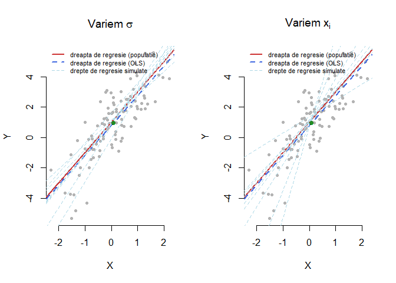
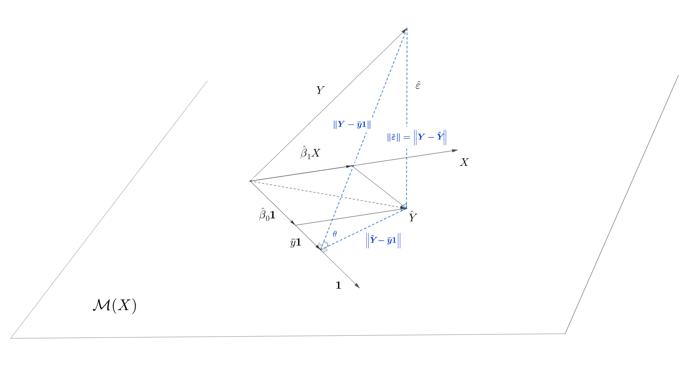
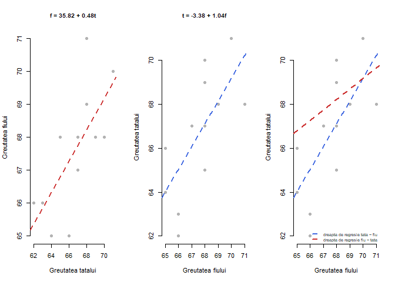
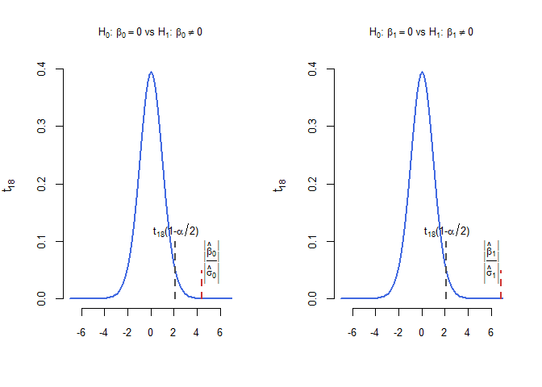
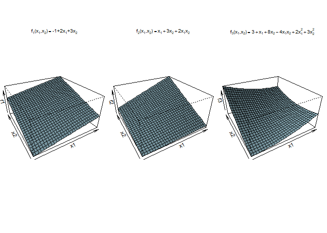
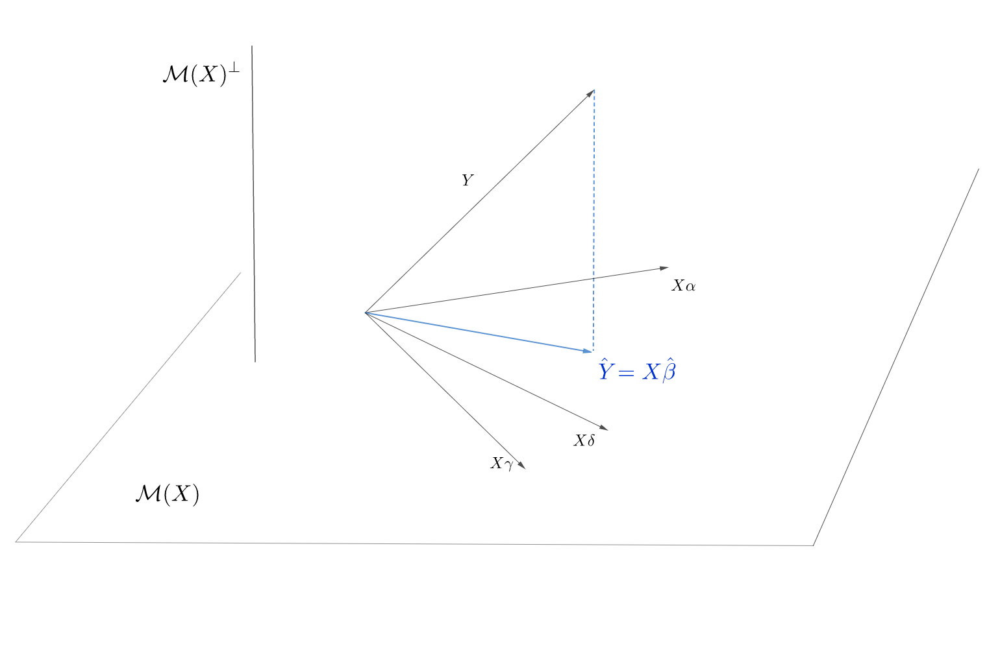
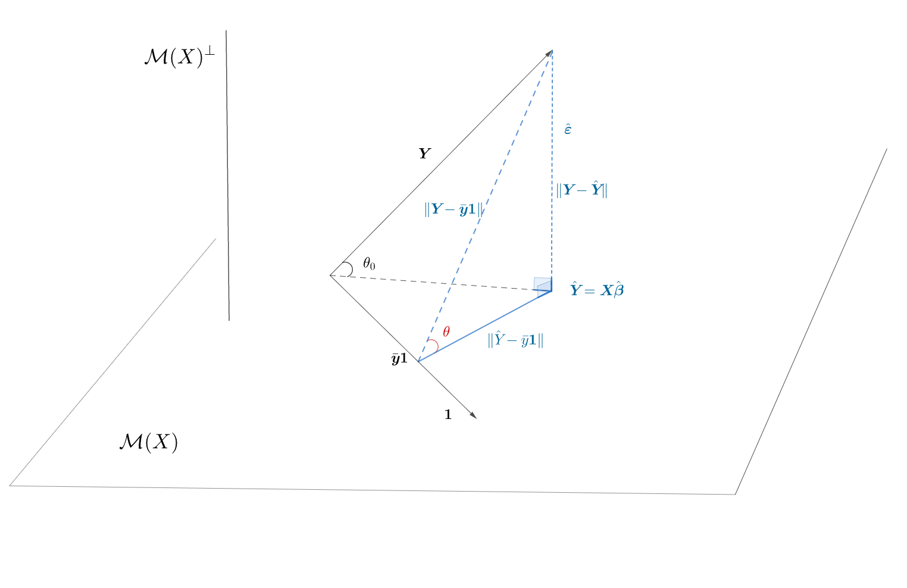
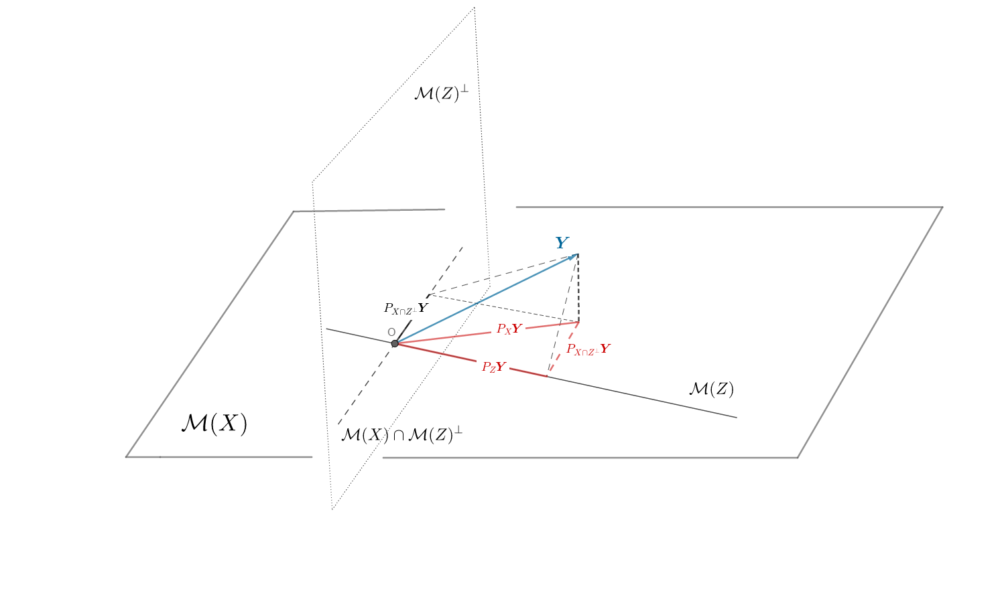
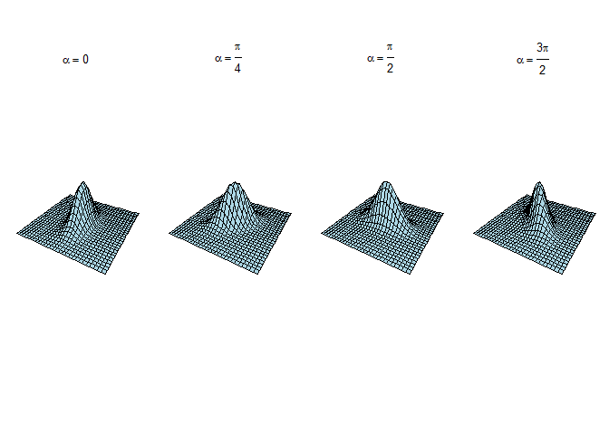
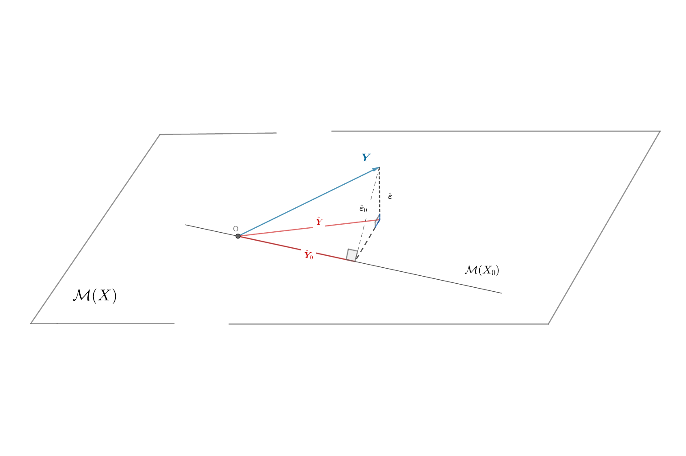

Obiectivul acestui seminar este de a prezenta câteva exerciții de regresie liniară.

# Regresie liniară simplă

## Metoada celor mai mici pătrate

\BeginKnitrBlock{rmdexercise}

\marginnote{\enonce{12001}{}}\vspace{-7mm}

Arătați că estimatorii $\hat{\beta}_0$ și $\hat{\beta}_1$ obținuți prin metoda celor mai mici pătrate, adică valorile coeficienților $\beta_0$ și $\beta_1$ care minimizează funcția 

$$
  S(\beta_0, \beta_1) = \sum_{i = 1}^{n}(y_i - \beta_0 - \beta_1 x_i)^2
$$

sunt dați de expresiile

$$
  \hat\beta_0 = \bar y - \hat\beta_1 \bar x \quad \text{și} \quad \hat\beta_1 = \frac{\sum_{i = 1}^{n}(x_i - \bar x)(y_i - \bar y)}{\sum_{i = 1}^{n}(x_i - \bar x)^2}.
$$

\EndKnitrBlock{rmdexercise}

Trebuie să determinăm 

$$
  (\hat{\beta}_0, \hat{\beta}_1) = \underset{(\beta_0,\beta_1)\in\mathbb{R}\times\mathbb{R}}{\arg\min} S(\beta_0, \beta_1)
$$

și observând că funcția $S(\beta_0, \beta_1)$ este convexă ea admite un punct de minim. Acesta se obține ca soluție a sistemului $\nabla S = 0$ de ecuați normale, 

$$
\left\{\begin{array}{ll}
  \frac{\partial S}{\partial \beta_0} = -2\sum_{i = 1}^{n}(y_i - \beta_0 - \beta_1 x_i) = 0\\
  \frac{\partial S}{\partial \beta_1} = -2\sum_{i = 1}^{n}x_i(y_i - \beta_0 - \beta_1 x_i) = 0
\end{array}\right.
$$

Din prima ecuație obținem prin sumare $n\beta_0 + \beta_1\sum_{i=1}^{n}x_i = \sum_{i=1}^{n}y_i$ ceea ce conduce la $\hat\beta_0 = \bar y - \hat\beta_1 \bar x$.

A doua ecuație conduce la 

$$
  \beta_0\sum_{i=1}^{n}x_i + \beta_1\sum_{i=1}^{n}x_i^2 = \sum_{i=1}^{n}x_iy_i
$$

și înlocuind $\beta_0$ cu expresia obținută anterior, obținem soluția 

$$
\hat\beta_1 = \frac{\sum_{i = 1}^{n}x_i(y_i - \bar y)}{\sum_{i = 1}^{n}x_i(x_i - \bar x)} = \frac{\sum_{i = 1}^{n}(x_i - \bar x)(y_i - \bar y)}{\sum_{i = 1}^{n}(x_i - \bar x)^2}.
$$

De asemenea, se poate verifica că $S(\beta_0, \beta_1)$ se scrie sub forma 

\begin{align*}
  S(\beta_0, \beta_1) &= n\left[\beta_0 - (\bar y - \beta_1\bar x)\right]^2 + \left[\sum_{i = 1}^{n}(x_i - \bar x)^2\right]\left[\beta_1 - \frac{\sum_{i = 1}^{n}(x_i - \bar x)(y_i - \bar y)}{\sum_{i = 1}^{n}(x_i - \bar x)^2}\right]^2 \\
  &\quad + \left[\sum_{i = 1}^{n}(y_i - \bar y)^2\right]\left[1 - \frac{\left(\sum_{i = 1}^{n}(x_i - \bar x)(y_i - \bar y)\right)^2}{\sum_{i = 1}^{n}(x_i - \bar x)^2\sum_{i = 1}^{n}(y_i - \bar y)^2}\right]
\end{align*}

care justifică în egală măsură soluția obținută anterior. 

\BeginKnitrBlock{rmdexercise}
\marginnote{\enonce{12002}{}}\vspace{-7mm}

Arătați că estimatorii obținuți prin metoda celor mai mici pătrate, $\hat\beta_0$ și $\hat\beta_1$, sunt estimatori nedeplasați.

\EndKnitrBlock{rmdexercise}

Coeficienții $\hat\beta_0$ și $\hat\beta_1$ obținuți prin metoda celor mai mici pătrate sunt dați de $\hat\beta_0 = \bar y - \hat\beta_1 \bar x$ și $\hat\beta_1 = \frac{\sum_{i = 1}^{n}(x_i - \bar x)(y_i - \bar y)}{\sum_{i = 1}^{n}(x_i - \bar x)^2}$ (aceștia sunt variabile aleatoare deoarece sunt funcții de $Y_i$ care sunt variabile aleatoare). Înlocuind în expresia lui $\hat\beta_1$ pe $y_i$ cu $\beta_0+\beta_1 x_i + \varepsilon_i$ avem 

\begin{align*}
\hat\beta_1 &= \frac{\sum_{i = 1}^{n}(x_i - \bar x)(y_i - \bar y)}{\sum_{i = 1}^{n}(x_i - \bar x)^2} = \frac{\sum_{i = 1}^{n}(x_i - \bar x)y_i}{\sum_{i = 1}^{n}(x_i - \bar x)^2} = \frac{\sum_{i = 1}^{n}(x_i - \bar x)(\beta_0+\beta_1 x_i + \varepsilon_i)}{\sum_{i = 1}^{n}(x_i - \bar x)^2}\\
  &= \frac{\beta_0\overbrace{\sum_{i = 1}^{n}(x_i - \bar x)}^{ = 0} + \beta_1 \sum_{i = 1}^{n}(x_i - \bar x)x_i + \sum_{i = 1}^{n}(x_i - \bar x)\varepsilon_i}{\sum_{i = 1}^{n}(x_i - \bar x)^2} = \frac{\beta_1 \sum_{i = 1}^{n}(x_i - \bar x)^2 + \sum_{i = 1}^{n}(x_i - \bar x)\varepsilon_i}{\sum_{i = 1}^{n}(x_i - \bar x)^2}\\
  &= \beta_1 + \frac{\sum_{i = 1}^{n}(x_i - \bar x)\varepsilon_i}{\sum_{i = 1}^{n}(x_i - \bar x)^2}.
\end{align*}

Conform ipotezei modelului de regresie liniară simplă, $\mathbb{E}[\varepsilon_i] = 0$, prin urmare $\mathbb{E}[\hat\beta_1] = \beta_1$ ceea ce arată că $\hat\beta_1$ este un estimator nedeplasat pentru $\beta_1$.

În mod similar, 

$$
\mathbb{E}[\hat\beta_0] = \mathbb{E}[\bar y] - \bar x\mathbb{E}[\hat\beta_1] = \beta_0 + \bar x\beta_1 - \bar x\beta_1 = \beta_0
$$
ceea ce arată că $\hat\beta_0$ este un estimator nedeplasat pentru $\beta_0$.

\BeginKnitrBlock{rmdexercise}
\marginnote{\enonce{12003}{}}\vspace{-7mm}

Calculați matricea de varianță-covarianță a estimatorilor $\hat\beta_0$ și $\hat\beta_1$.

\EndKnitrBlock{rmdexercise}

Notăm cu $W = \begin{pmatrix}Var(\hat \beta_0) & Cov(\hat \beta_0, \hat \beta_1)\\ Cov(\hat \beta_0, \hat \beta_1) & Var(\hat \beta_1)\end{pmatrix}$ matricea de varianță-covarianță a estimatorilor $\hat\beta_0$ și $\hat\beta_1$.

Avem, folosind expresia lui $\hat\beta_1$ determinată la punctul anterior și homoscedasticitatea și necorelarea erorilor $Cov(\varepsilon_i, \varepsilon_j) = \delta_{ij}\sigma^2$, că 

\begin{align*}
  Var(\hat \beta_1) &= Var\left(\beta_1 + \frac{\sum_{i = 1}^{n}(x_i - \bar x)\varepsilon_i}{\sum_{i = 1}^{n}(x_i - \bar x)^2}\right) = Var\left(\frac{\sum_{i = 1}^{n}(x_i - \bar x)\varepsilon_i}{\sum_{i = 1}^{n}(x_i - \bar x)^2}\right)\\
  &= \frac{Var\left(\sum_{i = 1}^{n}(x_i - \bar x)\varepsilon_i\right)}{\left[\sum_{i = 1}^{n}(x_i - \bar x)^2\right]^2} = \frac{\sum_{i,j}(x_i - \bar x)(x_j - \bar x)Cov(\varepsilon_i, \varepsilon_j)}{\left[\sum_{i = 1}^{n}(x_i - \bar x)^2\right]^2}\\
  &= \frac{\sum_{i = 1}^{n}(x_i - \bar x)^2\sigma^2}{\left[\sum_{i = 1}^{n}(x_i - \bar x)^2\right]^2} = \frac{\sigma^2}{\sum_{i = 1}^{n}(x_i - \bar x)^2}.
\end{align*}

Din expresia $Var(\hat \beta_1)$ observăm că dacă $\sigma^2$ este mică (cu alte cuvinte $y_i$ sunt aproape de dreapta de regresie) atunci estimarea este mai precisă. De asemenea, se constată că pe măsură ce valorile $x_i$ sunt mai dispersate în jurul valorii medii $\bar x$ estimarea coeficientului $\hat \beta_1$ este mai precisă ($Var(\hat \beta_1)$ este mai mică). Acest fenomen se poate observa și în figura de mai jos în care am generat $100$ de valori aleatoare $X$ și $100$ de valori pentru $Y$ după modelul 

$$
  y = 1 + 2 x + \varepsilon
$$
cu $\varepsilon\sim \mathcal{N}(0, \sigma^2)$. Dreapta roșie descrie adevărata relație $f(x) = 1 + 2x$ în populație iar dreapta albastră reprezintă dreapta de regresie calculată cu ajutorul metodei celor mai mici pătrate (OLS). Dreptele albastru deschis au fost generate tot cu ajutorul metodei celor mai mici pătrate atunci când variem $\sigma^2$ (în figura din stânga) și respectiv pe $x_i$ în jurul lui $\bar x$ (în figura din dreapta).

Pentru a determina $Var(\hat \beta_0)$, vom folosi relația $\hat \beta_0 = \bar y - \hat \beta_1 \bar x$ ceea ce conduce la 

\begin{align*}
Var(\hat \beta_0) &= Var(\bar y - \hat \beta_1 \bar x) = Var(\bar y) - 2Cov(\bar y, \hat \beta_1 \bar x) + Var(\hat \beta_1 \bar x)\\
&= Var\left(\frac{1}{n}\sum_{i = 1}^{n}y_i\right) - 2\bar x Cov(\bar y, \hat \beta_1) + \bar x^2 Var(\hat \beta_1)\\
&= \frac{\sigma^2}{n} + \bar x^2 \frac{\sigma^2}{\sum_{i = 1}^{n}(x_i - \bar x)^2} - 2\bar x Cov(\bar y, \hat \beta_1).
\end{align*}

Pentru $Cov(\bar y, \hat \beta_1)$ avem (ținând cont de faptul că $\beta_0$, $\beta_1$ și $x_i$ sunt constante)

\begin{align*}
Cov(\bar y, \hat \beta_1) &= Cov\left(\frac{1}{n}\sum_{i = 1}^{n}y_i, \beta_1 + \frac{\sum_{j = 1}^{n}(x_j - \bar x)\varepsilon_j}{\sum_{j = 1}^{n}(x_j - \bar x)^2} \right) = \frac{1}{n}\sum_{i = 1}^{n}Cov\left(\beta_0 + \beta_1 x_i + \varepsilon_i, \beta_1 + \frac{\sum_{j = 1}^{n}(x_j - \bar x)\varepsilon_j}{\sum_{j = 1}^{n}(x_j - \bar x)^2}\right)\\
&= \frac{1}{n}\sum_{i = 1}^{n}Cov\left(\varepsilon_i, \frac{\sum_{j = 1}^{n}(x_j - \bar x)\varepsilon_j}{\sum_{j = 1}^{n}(x_j - \bar x)^2}\right) = \frac{1}{n}\sum_{i = 1}^{n}\frac{1}{\sum_{j = 1}^{n}(x_j - \bar x)^2}Cov\left(\varepsilon_i, \sum_{j = 1}^{n}(x_j - \bar x)\varepsilon_j\right)\\
&= \frac{1}{\sum_{j = 1}^{n}(x_j - \bar x)^2}\sum_{i = 1}^{n}\frac{1}{n}\sum_{j = 1}^{n}(x_j - \bar x)Cov(\varepsilon_i, \varepsilon_i=j) = \frac{1}{\sum_{j = 1}^{n}(x_j - \bar x)^2}\sum_{i = 1}^{n}\frac{1}{n}\sum_{j = 1}^{n}(x_j - \bar x)\delta_{ij}\sigma^2\\
&= \frac{\sigma^2}{\sum_{j = 1}^{n}(x_j - \bar x)^2}\frac{1}{n}\underbrace{\sum_{i = 1}^{n}(x_i - \bar x)}_{=0} = 0
\end{align*}

prin urmare 

$$
Var(\hat \beta_0) = \frac{\sigma^2}{n} + \bar x^2 \frac{\sigma^2}{\sum_{i = 1}^{n}(x_i - \bar x)^2} = \frac{\sigma^2\sum_{i = 1}^{n}x_i^2}{n\sum_{i = 1}^{n}(x_i - \bar x)^2}.
$$

Calculul covarianței dintre $\hat \beta_0$ și $\hat \beta_1$ rezultă aplicând relațiile de mai sus

$$
Cov(\hat \beta_0, \hat \beta_1) = Cov(\bar y - \hat \beta_1\bar x, \hat \beta_1) = Cov(\bar y, \hat \beta_1) - \bar x Var(\hat \beta_1) = -\frac{\sigma^2 \bar x}{\sum_{i = 1}^{n}(x_i - \bar x)^2}.
$$

Observăm că $Cov(\hat \beta_0, \hat \beta_1)\leq 0$ iar intuitiv, cum dreapta de regresie (bazată pe estimatorii obținuți prin metoda celor mai mici pătrate) $\bar y = \hat\beta_0 + \hat\beta_1 \bar x$ trece prin centrul de greutate al datelor $(\bar x, \bar y)$, dacă presupunem $\bar x > 0$ remarcăm că atunci când creștem panta (creștem $\hat\beta_1$) ordonata la origine scade (scade $\hat\beta_0$) și reciproc.  

Matricea de varianță-covarianță a estimatorilor $\hat\beta_0$ și $\hat\beta_1$ devine

$$
W = \begin{pmatrix}Var(\hat \beta_0) & Cov(\hat \beta_0, \hat \beta_1)\\ Cov(\hat \beta_0, \hat \beta_1) & Var(\hat \beta_1)\end{pmatrix} = \begin{pmatrix}\frac{\sigma^2\sum_{i = 1}^{n}x_i^2}{n\sum_{i = 1}^{n}(x_i - \bar x)^2} & -\frac{\sigma^2 \bar x}{\sum_{i = 1}^{n}(x_i - \bar x)^2}\\ -\frac{\sigma^2 \bar x}{\sum_{i = 1}^{n}(x_i - \bar x)^2} & \frac{\sigma^2}{\sum_{i = 1}^{n}(x_i - \bar x)^2}\end{pmatrix}.
$$

\BeginKnitrBlock{rmdexercise}
\marginnote{\enonce{12004}{}}\vspace{-7mm}

Arătați că în cadrul modelului de regresie liniară simplă, suma valorilor reziduale este nulă.

\EndKnitrBlock{rmdexercise}

Observăm, folosind definiția $\hat\varepsilon_i = y_i - \hat y_i$, că 

\begin{align*}
  \sum_{i = 1}^{n}\hat\varepsilon_i &= \sum_{i = 1}^{n}(y_i - \hat y_i) = \sum_{i = 1}^{n}(y_i - \hat \beta_0 - x_i\hat\beta_1)\\
    &= \sum_{i = 1}^{n}\left[y_i - \underbrace{(\bar y - \bar x\hat\beta_1)}_{= \hat \beta_0} - x_i\hat\beta_1\right] = \sum_{i = 1}^{n}(y_i - \bar y) -\hat\beta_1 \sum_{i = 1}^{n}(x_i - \bar x) = 0
\end{align*}

\BeginKnitrBlock{rmdexercise}
\marginnote{\enonce{12005}{}}\vspace{-7mm}

Arătați că în modelul de regresie liniară simplă statistica $\hat\sigma^2 = \frac{1}{n-2}\sum_{i = 1}^{n}\hat\varepsilon_i^2$ este un estimator nedeplasat pentru $\sigma^2$.

\EndKnitrBlock{rmdexercise}

Ținând cont de faptul că $\hat\beta_0 = \bar y - \hat\beta_1 \bar x$ și $\bar y = \beta_0 + \beta_1 \bar x + \bar \varepsilon$ (prin însumarea după $i$ a relațiilor $y_i = \beta_0 + \beta_1 x_i +\varepsilon_i$) găsim că 

\begin{align*}
\hat\varepsilon_i &= y_i - \hat y_i = (\beta_0 + \beta_1 x_i +\varepsilon_i) - (\hat\beta_0 + \hat\beta_1 x_i) \\
  &= (\underbrace{\bar y - \beta_1 \bar x - \bar \varepsilon}_{=\beta_0} + \beta_1 x_i +\varepsilon_i) - (\bar y - \hat\beta_1 \bar x + \hat\beta_1 x_i)\\
  &= (\beta_1 - \hat\beta_1)(x_i - \bar x) + (\varepsilon_i - \bar\varepsilon)
\end{align*}

și prin dezvoltarea binomului și utilizând relația $\hat\beta_1 = \beta_1 + \frac{\sum_{i = 1}^{n}(x_i - \bar x)\varepsilon_i}{\sum_{i = 1}^{n}(x_i - \bar x)^2}$ găsim

\begin{align*}
  \sum_{i = 1}^{n}\hat\varepsilon_i^2 &= (\beta_1 - \hat\beta_1)^2\sum_{i = 1}^{n}(x_i - \bar x) + \sum_{i = 1}^{n}(\varepsilon_i - \bar\varepsilon)^2 + 2(\beta_1 - \hat\beta_1)\sum_{i = 1}^{n}(x_i - \bar x)(\varepsilon_i - \bar\varepsilon)\\
    &= (\beta_1 - \hat\beta_1)^2\sum_{i = 1}^{n}(x_i - \bar x) + \sum_{i = 1}^{n}(\varepsilon_i - \bar\varepsilon)^2 + 2(\beta_1 - \hat\beta_1)\sum_{i = 1}^{n}(x_i - \bar x)\varepsilon_i - 2(\beta_1 - \hat\beta_1)\bar\varepsilon\sum_{i = 1}^{n}(x_i - \bar x)\\
    &= (\beta_1 - \hat\beta_1)^2\sum_{i = 1}^{n}(x_i - \bar x) + \sum_{i = 1}^{n}(\varepsilon_i - \bar\varepsilon)^2 - 2(\beta_1 - \hat\beta_1)^2\sum_{i = 1}^{n}(x_i - \bar x)^2\\
    &=\sum_{i = 1}^{n}(\varepsilon_i - \bar\varepsilon)^2 - (\beta_1 - \hat\beta_1)^2\sum_{i = 1}^{n}(x_i - \bar x)^2.
\end{align*}

Luând media găsim că

$$
\mathbb{E}\left(\sum_{i = 1}^{n}\hat\varepsilon_i^2\right) = \mathbb{E}\left(\sum_{i = 1}^{n}(\varepsilon_i - \bar\varepsilon)^2\right) - \sum_{i = 1}^{n}(x_i - \bar x)^2 Var(\hat\beta_1) = (n-1)\sigma^2 - \sigma^2 = (n-1)\sigma^2
$$

unde am folosit că $\mathbb{E}\left(\frac{1}{n-1}\sum_{i = 1}^{n}(\varepsilon_i - \bar\varepsilon)^2\right) = \sigma^2$ (deoarece $Var(\varepsilon_i) = \sigma^2$).

Concluzionăm că $\hat\sigma^2 = \frac{1}{n-2}\sum_{i = 1}^{n}\hat\varepsilon_i^2$ este un estimator nedeplasat pentru $\sigma^2$.

\BeginKnitrBlock{rmdexercise}
\marginnote{\enonce{12006}{}}\vspace{-7mm}

Fie $x_{n+1}$ o nouă valoare pentru variabila $X$ și ne propunem să prezicem valoarea $y_{n+1}$ conform modelului 

$$
  y_{n+1} = \beta_0 + \beta_1 x_{n+1} + \varepsilon_{n+1}
$$

cu $\mathbb{E}[\varepsilon_{n+1}] = 0$, $Var(\varepsilon_{n+1}) = \sigma^2$ și $Cov(\varepsilon_{n+1}, \varepsilon_i)=0$ pentru $i = 1,\ldots,n$. 

Arătați că varianța răspunsului mediu prezis este 

$$
  Var(\hat y_{n+1}) = \sigma^2\left[\frac{1}{n} + \frac{(x_{n+1} - \bar x)^2}{\sum_{i=1}^{n}(x_i - \bar x)^2}\right]
$$
  
iar varianța erorii de predicție $\hat\varepsilon_{n+1}$ satisface $\mathbb{E}[\hat\varepsilon_{n+1}] = 0$ și 

$$
  Var(\hat\varepsilon_{n+1}) = \sigma^2\left[1 + \frac{1}{n} + \frac{(x_{n+1} - \bar x)^2}{\sum_{i=1}^{n}(x_i - \bar x)^2}\right].
$$

\EndKnitrBlock{rmdexercise}

Cum $\hat y_{n+1} = \hat\beta_0 + \hat\beta_1 x_{n+1}$ avem 

\begin{align*}
  Var(\hat y_{n+1}) &= Var(\hat\beta_0 + \hat\beta_1 x_{n+1}) = Var(\hat\beta_0) + 2Cov(\hat\beta_0, \hat\beta_1) + x_{n+1}^2Var(\hat\beta_1)\\
  &= \frac{\sigma^2\sum_{i = 1}^{n}x_i^2}{n\sum_{i = 1}^{n}(x_i - \bar x)^2} - 2\frac{\sigma^2 \bar x}{\sum_{i = 1}^{n}(x_i - \bar x)^2} + \frac{\sigma^2x_{n+1}^2}{\sum_{i = 1}^{n}(x_i - \bar x)^2}\\
  &= \frac{\sigma^2}{\sum_{i = 1}^{n}(x_i - \bar x)^2}\left[\frac{1}{n}\sum_{i = 1}^{n}x_i^2 - 2x_{n+1}\bar x + x_{n+1}^2\right]\\
  &= \frac{\sigma^2}{\sum_{i = 1}^{n}(x_i - \bar x)^2}\left[\frac{1}{n}\sum_{i = 1}^{n}(x_i -\bar x)^2 + \bar x^2 - 2x_{n+1}\bar x + x_{n+1}^2\right]\\
  &= \sigma^2\left[\frac{1}{n} + \frac{(x_{n+1} - \bar x)^2}{\sum_{i=1}^{n}(x_i - \bar x)^2}\right].
\end{align*}

Constatăm că atunci când $x_{n+1}$ este departe de valoarea medie $\bar x$ răspunsul mediu are o variabilitate mai mare. 

Pentru a obține varianța erorii de predicție $\hat\varepsilon_{n+1} = y_{n+1} - \hat y_{n+1}$ să observăm că $y_{n+1}$ depinde doar de $\varepsilon_{n+1}$ pe când $\hat y_{n+1}$ depinde de $\varepsilon_i$, $i\in\{1,2,\ldots,n\}$. Din necorelarea erorilor deducem că

$$
  Var(\hat\varepsilon_{n+1}) = Var(y_{n+1} - \hat y_{n+1}) = Var(y_{n+1}) + Var(\hat y_{n+1}) = \sigma^2\left[1 + \frac{1}{n} + \frac{(x_{n+1} - \bar x)^2}{\sum_{i=1}^{n}(x_i - \bar x)^2}\right].
$$

## Coeficientul de determinare $R^2$ și coeficientul de corelație {#reg_sim_ex_2}

În această secțiune încercăm să abordăm problema de regresie liniară simplă într-un context geometric. Din punct de vedere vectorial dispunem de doi vectori: vectorul $X = (x_1, x_2, \ldots, x_n)^\intercal$ a celor $n$ observații ale variabilei explicative și vectorul $Y = (y_1, y_2, \ldots, y_n)^\intercal$ compus din cele $n$ observații ale variabilei răspuns, pe care vrem să o explicăm. Cei doi vectori aparțin spațiului $\mathbb{R}^n$. 

Fie $\mathbf{1} = (1,1,\ldots,1)^\intercal\in\mathbb{R}^n$ și $\mathcal{M}(X)$ subspațiul liniar din $\mathbb{R}^n$ de dimensiune $2$ generat de vectorii $\{\mathbf{1}, X\}$ (acești vectori nu sunt coliniari deoarece $X$ conține cel puțin două elemente distincte). Notăm cu $\hat Y$ proiecția ortogonală a lui $Y$ pe subspațiul $\mathcal{M}(X)$ și cum $\{\mathbf{1}, X\}$ formează o bază în $\mathcal{M}(X)$ deducem că există $\hat\beta_0, \hat\beta_1\in \mathbb{R}$ astfel ca $\hat Y = \hat\beta_0\mathbf{1} + \hat\beta_1 X$. Cum, din definiția priecției ortogonale, $\hat Y$ este unicul vector din $\mathcal{M}(X)$ care minimizează distanța euclidiană (deci și pătratul ei)

$$
\left\lVert Y - \hat Y \right\rVert = \sum_{i = 1}^{n}[y_i - (\hat\beta_0 + \hat \beta_1 x_i)]^2
$$ 

deducem că $\hat\beta_0, \hat\beta_1$ coincid cu valorile obținute prin metoda celor mai mici pătrate. Astfel coeficienții $\hat\beta_0$ și $\hat\beta_1$ se reprezintă coordonatele proiecției ortogonale a lui $Y$ pe subspațiul generat de vectorii $\{\mathbf{1}, X\}$ (a se vedea figura de mai jos). 

Observăm că, în general, vectorii $\{\mathbf{1}, X\}$ nu formează o bază ortogonală în $\mathcal{M}(X)$ (cu excepția cazului în care $\langle \mathbf{1}, X\rangle = n\bar x = 0$) prin urmare $\hat\beta_0\mathbf{1}$ nu este proiecția ortogonală a lui $Y$ pe $\mathbf{1}$ (aceasta este $\frac{\langle Y, \mathbf{1}\rangle}{\lVert \mathbf{1}\rVert^2}\mathbf{1} = \bar y\mathbf{1}$) iar $\hat\beta_1 X$ nu este proiecția ortogonală a lui $Y$ pe $X$ (aceasta fiind $\frac{\langle Y, X\rangle}{\lVert X\rVert^2}X$).

Fie $\hat\varepsilon = Y - \hat Y = (\hat\varepsilon_1, \hat\varepsilon_2, \ldots, \hat\varepsilon_n)^\intercal$ vectorul valorilor reziduale. Aplicând Teorema lui Pitagora (în triunghiul albastru) rezultă (descompunerea ANOVA pentru regresie) că 

\begin{align*}
  \left\lVert Y - \bar y \mathbf{1}\right\rVert^2 &= \left\lVert \hat Y - \bar y \mathbf{1}\right\rVert^2 + \left\lVert \underbrace{\hat\varepsilon}_{Y - \hat Y}\right\rVert^2\\
  \sum_{i = 1}^{n}(y_i - \bar y)^2 &= \sum_{i = 1}^{n}(\hat y_i - \bar y)^2 + \sum_{i = 1}^{n}(\underbrace{\hat\varepsilon_i}_{y_i - \hat y_i})^2\\
  SS_T &= SS_{reg} + RSS
\end{align*}

Din definiția coeficientului de determinare $R^2$ avem că 

$$
R^2 = \frac{SS_{reg}}{SS_T} = \frac{\left\lVert \hat Y - \bar y \mathbf{1}\right\rVert^2}{\left\lVert Y - \bar y \mathbf{1}\right\rVert^2} = 1 - \frac{\left\lVert \hat \varepsilon\right\rVert^2}{\left\lVert Y - \bar y \mathbf{1}\right\rVert^2}
$$

și conform figurii de mai sus $R^2 = \cos^2(\theta)$. Prin urmare dacă $R^2 = 1$, atunci $\theta = 0$ și $Y\in\mathcal{M}(X)$, deci $y_i = \beta_0 + \beta_1 x_i$, $i\in\{1,2,\ldots,n\}$ (punctele eșantionului sunt perfect aliniate) iar dacă $R^2 = 0$, deducem că $\sum_{i = 1}^{n}(\hat y_i - \bar y)^2 = 0$, deci $\hat y_i = \bar y$ (modelul liniar nu este adaptat în acest caz, nu putem explica mai bine decât media).

\BeginKnitrBlock{rmdexercise}
\marginnote{\enonce{13001}{}}\vspace{-7mm}

Arătați că

$$
  R^2 = r_{xy}^2 = r_{y\hat y}^2
$$
  
unde $r_{xy}$ este coeficientul de corelație empiric dintre $x$ și $y$.

\EndKnitrBlock{rmdexercise}

Din definiția coeficientului de determinare și folosind coeficienții $\hat\beta_0 = \bar y - \hat\beta_1 \bar x$ și $\hat\beta_1 = \frac{\sum_{i = 1}^{n}(x_i - \bar x)(y_i - \bar y)}{\sum_{i = 1}^{n}(x_i - \bar x)^2}$ obținuți prin metoda celor mai mici pătrate avem 

\begin{align*}
R^2 &= \frac{\left\lVert \hat Y - \bar y \mathbf{1}\right\rVert^2}{\left\lVert Y - \bar y \mathbf{1}\right\rVert^2} = \frac{\sum_{i = 1}^{n}(\hat\beta_0 + \hat\beta_1 x_i - \bar y)^2}{\sum_{i = 1}^{n}(y_i - \bar y)^2} = \frac{\sum_{i = 1}^{n}(\bar y - \hat\beta_1 \bar x + \hat\beta_1\bar x - \bar y)^2}{\sum_{i = 1}^{n}(y_i - \bar y)^2}\\
  &= \frac{\hat\beta_1^2\sum_{i = 1}^{n}(x_i - \bar x)^2}{\sum_{i = 1}^{n}(y_i - \bar y)^2} = \left(\frac{\sum_{i = 1}^{n}(x_i - \bar x)(y_i - \bar y)}{\sum_{i = 1}^{n}(x_i - \bar x)^2}\right)^2\frac{\sum_{i = 1}^{n}(x_i - \bar x)^2}{\sum_{i = 1}^{n}(y_i - \bar y)^2}\\
  & = \frac{\left[\sum_{i = 1}^{n}(x_i - \bar x)(y_i - \bar y)\right]^2}{\sum_{i = 1}^{n}(x_i - \bar x)^2\sum_{i = 1}^{n}(y_i - \bar y)^2} = r_{xy}^2.
\end{align*}

Pentru a verifica a doua parte, $R^2 = r_{y\hat y}^2$, să observăm că 

$$
r_{y\hat y}^2 = \frac{\left[\sum_{i = 1}^{n}(\hat y_i - \bar{\hat y})(y_i - \bar y)\right]^2}{\sum_{i = 1}^{n}(\hat y_i - \bar{\hat y})^2\sum_{i = 1}^{n}(y_i - \bar y)^2}
$$

iar $\bar{\hat y} = \frac{\sum_{i = 1}^{n}\hat y_i}{n} = \hat \beta_0 + \hat\beta_1 \bar x = \bar y$, prin urmare 

$$
r_{y\hat y}^2 = \frac{\left[\sum_{i = 1}^{n}(\hat y_i - \bar{y})(y_i - \bar y)\right]^2}{\sum_{i = 1}^{n}(\hat y_i - \bar{y})^2\sum_{i = 1}^{n}(y_i - \bar y)^2}.
$$

De asemenea 

\begin{align*}
\sum_{i = 1}^{n}(\hat y_i - \bar{y})(y_i - \bar y) &= \sum_{i = 1}^{n}(\hat y_i - \bar{y})(y_i - \hat y_i + \hat y_i - \bar y) \\
 &= \sum_{i = 1}^{n}(\hat y_i - \bar{y})(y_i - \hat y_i) + \sum_{i = 1}^{n}(\hat y_i - \bar{y})^2
\end{align*}

și cum 

\begin{align*}
\sum_{i = 1}^{n}(\hat y_i - \bar{y})(y_i - \hat y_i) &= \sum_{i = 1}^{n}(\hat \beta_0 + \hat\beta_1 x_i - \bar{y})(y_i - \hat \beta_0 - \hat\beta_1 x_i) \\
  &= \sum_{i = 1}^{n}(\bar y - \hat\beta_1 \bar x + \hat\beta_1 x_i - \bar{y})[(y_i - \bar y ) - \hat\beta_1 (x_i - \bar x)]\\
  &= \hat\beta_1 \sum_{i = 1}^{n}(x_i - \bar x)(y_i - \bar y) - \hat\beta_1^2 \sum_{i = 1}^{n}(x_i - \bar x)^2 \\
  &= \underbrace{\frac{S_{xy}}{S_{xx}}}_{\hat\beta_1}S_{xy} - \frac{S_{xy}^2}{S_{xx}^2}S_{xx} = 0
\end{align*}

deducem că $r_{y\hat y}^2 = \frac{\sum_{i = 1}^{n}(\hat y_i - \bar{y})^2}{\sum_{i = 1}^{n}(y_i - \bar y)^2} = R^2$.

## Aplicații numerice

\BeginKnitrBlock{rmdexercise}
\marginnote{\enonce{14001}{}}\vspace{-7mm}

Tabelul de mai prezintă o serie de date privind greutatea taților și respectiv a fiului lor cel mare 

$$
\begin{array}{lcccccccccccc}
  Tata: & 65 & 63 & 67 & 64 & 68 & 62 & 70 & 66 & 68 & 67 & 69 & 71\\
  Fiu: & 68 & 66 & 68 & 65 & 69 & 66 & 68 & 65 & 71 & 67 & 68 & 70
\end{array}
$$

Obținem următoarele rezultate numerice 

$$
  \sum_{i = 1}^{12}t_i = 800 \quad \sum_{i = 1}^{12}t_i^2 = 53418 \quad \sum_{i = 1}^{12}t_i f_i = 54107 \quad \sum_{i = 1}^{12}f_i = 811 \quad \sum_{i = 1}^{12}f_i^2 = 54849.
$$

  1. Determinați dreapta obținută prin metoda celor mai mici pătrate a greutății fiilor în funcie de greutatea taților. 

  2. Determinați dreapta obținută prin metoda celor mai mici pătrate a greutății taților în funcie de greutatea fiilor. 
  
  3. Arătați că produsul pantelor celor două drepte este egal cu pătratul coeficientului de corelație empirică dintre $t_i$ și $f_i$ (sau coeficientul de determinare).

\EndKnitrBlock{rmdexercise}

  1. Dreapta de regresie a greutății fiilor în funcție de greutatea taților este $f = \hat\alpha_0 + \hat\alpha_1 t$ unde coeficienții sunt dați de 
  
$$
  \hat\alpha_0 = \bar f - \hat\alpha_1 \bar t, \quad \hat\alpha_1 = \frac{\sum_{i = 1}^{12}(t_i - \bar t)(f_i - \bar f)}{\sum_{i = 1}^{12}(t_i - \bar t)^2}
$$

Pentru datele din problema noastră coeficienții sunt $\hat\alpha_0 = 35.8$ și $\hat\alpha_1 = 0.48$ iar dreapta de regresie este $f = 35.8 + 0.48 t$ (a se vedea figura din stânga).

  2. Dreapta de regresie a greutății taților în funcție de greutatea fiilor este $t = \hat\beta_0 + \hat\beta_1 f$ unde coeficienții sunt dați de 
  
$$
  \hat\beta_0 = \bar t - \hat\beta_1 \bar f, \quad \hat\beta_1 = \frac{\sum_{i = 1}^{12}(f_i - \bar f)(t_i - \bar t)}{\sum_{i = 1}^{12}(f_i - \bar f)^2}
$$

În cazul problemei, coeficienții sunt $\hat\beta_0 = -3.38$ și $\hat\beta_1 = 1.03$ iar dreapta de regresie este $t = -3.38 + 1.03 f$ (a se vedea figura din mijloc).

  3. Produsul pantelor celor două drepte este 
  
$$
\hat \alpha_1 \hat\beta_1 = \frac{\left[\sum_{i = 1}^{12}(f_i - \bar f)(t_i - \bar t)\right]^2}{\sum_{i = 1}^{12}(f_i - \bar f)^2\sum_{i = 1}^{12}(t_i - \bar t)^2}
$$

și conform [exercițiului 2](#reg_sim_ex_2) și a definiției coeficientului de determinare avem 

$$
\hat \alpha_1 \hat\beta_1 = r_{f,t}^2= R^2.
$$

\BeginKnitrBlock{rmdexercise}
\marginnote{\enonce{14002}{}}\vspace{-7mm}

Dorim să exprimăm înălțimea $y$ (măsurată în picioare) a unui arbore în funcție de diametrul său $x$ (exprimat în centimetri) la înălțimea de 1m30 de la sol. Pentru aceasta dispunem de 20 de măsurători $(x_i,y_i)=$(diametru, înălțime) și în urma calculelor am obținut rezultatele următoare: $\bar x = 4.53$, $\bar y = 8.65$ și 

$$
\frac{1}{20}\sum_{i = 1}^{20}(x_i - \bar x)^2 = 10.97 \quad \frac{1}{20}\sum_{i = 1}^{20}(y_i - \bar y)^2 = 2.24 \quad \frac{1}{20}\sum_{i = 1}^{20}(x_i - \bar x)(y_i - \bar y) = 3.77.
$$

  1. Notăm cu $y = \hat \beta_0 + \hat \beta_1 x$ dreapta de regresie. Calculați coeficienții $\hat \beta_0$ și $\hat \beta_1$.

  2. Dați și calculați o măsură care descrie calitatea concordanței datelor cu modelul propus. 
  
  3. Să presupunem că abaterile standard pentru estimatorii $\hat \beta_0$ și $\hat \beta_1$ sunt $\hat \sigma_0 = 1.62$ și respectiv $\hat \sigma_1 = 0.05$. Presupunem că erorile $\varepsilon_i$ sunt variabile aleatoare independente repartizare normal de medie $0$ și varianțe egale. Vrem să testăm ipotezele $H_0:\, \beta_j = 0$ versus $H_1:\, \beta_j \neq 0$ pentru $j = 0,1$. De ce acest test este interesant în contextul problemei noastre?

\EndKnitrBlock{rmdexercise}

  1. Estimatorii coeficienților dreptei de regresie $y = \hat \beta_0 + \hat \beta_1 x$ sunt dați de 
  
$$
  \hat \beta_1 = \frac{\sum_{i = 1}^{n}(x_i - \bar x)(y_i - \bar y)}{\sum_{i = 1}^{n}(x_i - \bar x)^2} \approx 0.344
$$
  
și respectiv 

$$
  \hat \beta_0 = \bar y - \hat \beta_1 \bar x \approx 7.09
$$

  2. Pentru a măsura calitatea concordanței datelor la modelul de regresie vom folosi coeficientul de determinare $R^2$. Am văzut că acesta corespunde pătratului coeficientului de corelație empirică:
  
$$
  R^2 = r_{x,y}^2 = \left(\frac{\sum_{i = 1}^{n}(x_i - \bar x)(y_i - \bar y)}{\sqrt{\sum_{i = 1}^{n}(x_i - \bar x)^2}\sqrt{\sum_{i = 1}^{n}(y_i - \bar y)^2}}\right)^2 \approx 0.58.
$$

Observăm că modelul de regresie liniară simplă explică un pic mai mult de jumătate din variabilitatea datelor. 

  3. Sub ipoteza modelului condiționat normal (erorile $\varepsilon_i$ sunt variabile aleatoare independente repartizare normal de medie $0$ și varianțe egale) avem că $\hat\beta_j\sim\mathcal{N}(\beta_j, \sigma_{\hat\beta_j}^2)$ și înlocuind varianțele $\sigma_{\hat\beta_j}^2$ cu estimatorii $\hat\sigma_j^2$, deducem că $\frac{\hat\beta_j - \beta_j}{\hat\sigma_j}\sim t_{n-2}$.

Prin urmare, sub $H_0$ avem că 

$$
\frac{\hat\beta_0}{\hat\sigma_0}\sim t_{18},
$$

iar pentru un prag de semnificație $1-\alpha = 95\%$, ținând seama că $\left|\frac{\hat\beta_0}{\hat\sigma_0}\right|\approx 4.38$ și că $t_{18}(1-\alpha/2)\approx 2.1$, concluzionăm că respingem ipoteza nulă. 

În mod similar, pentru $\hat\beta_1$ găsim că 

$$
\left|\frac{\hat\beta_1}{\hat\sigma_1}\right|\approx 6.88 > 2.1
$$

de unde respingem ipoteza nulă $H_0:\, \beta_1 = 0$ în acest caz de asemenea. 

# Regresie liniară multiplă

Principiul problemei de regresie este de a modela o variabilă $y$, numită variabilă răspuns sau variabilă dependentă (cea pe care vrem să o explicăm), cu ajutorul unei funcții care depinde de un anumit număr de variabile $\boldsymbol x = (x_1,\ldots, x_p)^\intercal$, numite variabile explicative sau predictori sau independente (vom folosi în general primele două denumiri)

$$
  y\approx g(\boldsymbol x) = g(x_1,\ldots, x_p).
$$
Astfel având dat un eșantion de talie $n$ de $(p+1)$-upluri $(\boldsymbol x, y)$, $n>p$, ne propunem să determinăm $g$. Aproximarea, $\approx$, din relația anterioară se poate descrie matematic sub forma 

$$
  g = \underset{f\in\mathcal{G}}{\arg\min}\sum_{i = 1}^{n}L\left(y_i - f(\boldsymbol x_i)\right)
$$

unde $L(\cdot)$ se numește funcție de cost sau de pierdere iar $\mathcal{G}$ este o clasă de funcții dată. 

În general funcția de cost poate lua multe forme, e.g. [Loss function](https://en.wikipedia.org/wiki/Loss_function), dar de cele mai multe ori vom întâlni două: funcția de cost absolut $L(x) = |x|$ sau funcția de cost pătratic $L(x) = x^2$. 

În ceea ce privește clasa de funcții $\mathcal{G}$ vom considera funcțiile liniare 

$$
\mathcal{G} = \left\{f:\mathbb{R}^p\to \mathbb{R}\,|\, f(\boldsymbol x) = \begin{pmatrix}1 & \boldsymbol x\end{pmatrix} \boldsymbol \beta = \beta_0 + \beta_1 x_1 +\cdots + \beta_p x_p\right\}.
$$

Atunci când vorbim de regresie liniară ne referim la liniaritatea în parametrii $\beta_j$ și nu în variabilele explicative, e.g. $f_1(x_1,x_2) = \beta_0 + \beta_1 x_1 + \beta_2 x_2$, $f_2(x_1, x_2) = \beta_0 + \beta_1 x_1 + \beta_2 x_2 + \beta_3 \underbrace{x_1 x_2}_{x_3}$ sau $f_3(x_1, x_2) = \beta_0 + \beta_1 x_1 + \beta_2 x_2 + \beta_3 \underbrace{x_1 x_2}_{x_3}+ \beta_4 \underbrace{x_1^2}_{x_4}+ \beta_5 \underbrace{x_2^3}_{x_5}$ sunt toate funcții liniare în $\boldsymbol\beta$. 

## Modelare

Modelul de regresie liniară multiplă reprezintă o extensie a modelului de regresie liniară simplă atunci când numărul variabilelor explicative este finit (pentru mai multe detalii privind analiza de regresie se pot consulta monografiile [@Seber2003], [@Weisberg2014] sau [@Faraway2015]). Presupunem că datele verifică modelul 

$$
  y_i = \beta_0 + \beta_1 x_{i1} + \cdots + \beta_p x_{ip} + \varepsilon_i, \quad i = 1,2,\ldots,n
$$
unde 

  - $x_{ij}$ sunt valori cunoscute și nu sunt aleatoare
  
  - parametrii $\beta_j$ sunt necunoscuți și nu sunt aleatori
  
  - $\varepsilon_i$ sunt variabile aleatoare necunoscute
  
Scris sub formă compactă modelul devine 

$$
  \boldsymbol Y = \boldsymbol X\boldsymbol \beta + \boldsymbol \varepsilon
$$

unde 

  - $\mathbf{X}$ se numește *matricea de design*
  
$$
\mathbf{X}=\begin{pmatrix}
1 & x_{11} & \cdots & x_{1p}\\
\vdots & \vdots & \ddots & \vdots\\
1 & x_{n1} & \cdots & x_{np}
\end{pmatrix}_{n\times(p+1)}
$$

  - $\mathbf{Y}$ este *vectorul răspuns* și este un vector aleator, $\boldsymbol\beta$ este *vectorul parametrilor* sau coeficienților și este necunoscut iar $\boldsymbol\varepsilon$ este *vectorul erorilor* și este un vector aleator
  
$$
\mathbf{Y}=\begin{pmatrix}
Y_1 \\
\vdots \\
Y_n
\end{pmatrix}_{n\times 1},\quad\boldsymbol\beta=\begin{pmatrix}
\beta_0 \\
\beta_1 \\
\vdots \\
\beta_p
\end{pmatrix}_{(p+1)\times 1}\text{ și }\quad
\boldsymbol\varepsilon=\begin{pmatrix}
\varepsilon_1 \\
\vdots \\
\varepsilon_n
\end{pmatrix}_{n\times 1}.
$$

Ipotezele modelului de regresie liniară multiplă sunt: 

$$
  \begin{array}{ll}
    \mathcal{H}_1: \, rang(\boldsymbol X) = p+1\\
    \mathcal{H}_2: \, \mathbb{E}[\boldsymbol \varepsilon] = 0,\, Var(\boldsymbol \varepsilon) = \sigma^2 I_n
  \end{array}
$$

Prima ipoteză ne spune că matricea de design $\boldsymbol X$ are coloanele liniar independente iar a doua ipoteză se referă la centralitatea erorilor (medie nulă), homoscedasticitatea (aceeași varianță) și necorelarea acestora. 

## Metoda celor mai mici pătrate

În această secțiune vom prezenta estimatorul lui $\boldsymbol \beta$ obținut prin metoda celor mai mici pătrate, metodă care folosește ca funcție de cost $L$ funcția $L(x) = x^2$. Estimatorul $\hat{\boldsymbol \beta}$ obținut prin metoda celor mai mici pătrate este definit prin 

$$
  \hat{\boldsymbol \beta} = \underset{\boldsymbol\beta\in\mathbb{R}^{p+1}}{\arg\min}\sum_{i = 1}^{n}\left[y_i - \left(\beta_0 + \beta_1 x_{i1} + \cdots + \beta_p x_{ip}\right)\right]^2 = \underset{\boldsymbol\beta\in\mathbb{R}^{p+1}}{\arg\min}\sum_{i = 1}^{n}\left(y_i - \sum_{j= 0}^{p}\beta_j x_{ij}\right)^2 = \underset{\boldsymbol\beta\in\mathbb{R}^{p+1}}{\arg\min}\left\lVert \boldsymbol Y - \boldsymbol X \boldsymbol\beta\right\rVert^2
$$

unde am folosit convenția $x_{i0} = 1$, $i = 1,2,\ldots,n$.

\BeginKnitrBlock{rmdexercise}
\marginnote{\enonce{22001}{}}\vspace{-7mm}

Arătați că dacă ipoteza $\mathcal{H}_1$ este adevărată atunci estimatorul $\hat{\boldsymbol \beta}$ obținut prin metoda celor mai mici pătrate este

$$
  \hat{\boldsymbol \beta} = (\boldsymbol{X}^\intercal \boldsymbol X)^{-1}\boldsymbol{X}^\intercal \boldsymbol Y
$$

\EndKnitrBlock{rmdexercise}

Ne propunem să prezentăm mai multe metode de calcul pentru estimatorul $\hat{\boldsymbol \beta}$. 

  a) Metoda geometrică
  
Din punct de vedere geometric, ne plasăm în spațiul variabilelor $\mathbb{R}^n$ (am presupus că $n>p$)). Vectorul variabilelor răspuns $\boldsymbol Y\in \mathbb{R}^n$ iar matricea de design $\boldsymbol{X}$ poate fi văzută ca fiind formată din $p+1$ vectori coloană, $\boldsymbol{X} = \left[\underbrace{\boldsymbol X_0}_{\mathbf{1} = (1,\cdots,1)}|\boldsymbol X_1|\cdots|\boldsymbol X_p\right]$. 

Începem prin a reaminti câteva noțiuni de algebră liniară, pentru mai multe detalii se poate consulta monografia [@Turtoi2000]. Fiind dată matricea (de design) $\boldsymbol{X}\in\mathcal{M}_{n,p+1}(\mathbb{R})$ putem defini nucleul matricei 

$$
\ker(\boldsymbol{X}) = \left\{\boldsymbol u\in\mathbb{R}^{p+1}\,|\, \boldsymbol{X}\boldsymbol u = 0\right\}
$$

ca fiind subspațiul lui $\mathbb{R}^{p+1}$ care conține vectorii ortogonali pe liniile din matricea $\boldsymbol{X}$. De asemenea, imaginea matricei $\boldsymbol{X}$ este subspațiul vectorilor din $\mathbb{R}^n$ care se pot scrie ca o combinație liniară de coloanele matricei $\boldsymbol{X}$ și este definit prin 

$$
\mathrm{Im}(\boldsymbol{X}) = \left\{\boldsymbol v\in\mathbb{R}^{n}\,|\,\exists \boldsymbol u\in\mathbb{R}^{p+1} \text{ a.î. } \boldsymbol{X}\boldsymbol u = \boldsymbol v\right\}.
$$

Se poate arăta (a se vedea [@Turtoi2000, Capitolul 1]) că $\dim \ker(\boldsymbol{X}) = p + 1 - \mathrm{rang}(\boldsymbol{X})$ și că $\dim \mathrm{Im}(\boldsymbol{X}) = \mathrm{rang}(\boldsymbol{X})$ ceea ce conduce la $\dim \ker(\boldsymbol{X}) + \dim \mathrm{Im}(\boldsymbol{X}) = p+1$ (caz particular al *teoremei lui Grassman*).

Reamintim că doi vectori $\boldsymbol u$ și $\boldsymbol v$ sunt ortogonali dacă $\langle \boldsymbol u, \boldsymbol v\rangle = 0$, iar în acest caz scriem $\boldsymbol u \perp \boldsymbol v$, și că două subspații $V$ și $W$ sunt ortogonale dacă $\forall \boldsymbol v \in V$ și respectiv $\forall \boldsymbol w \in W$ avem $\boldsymbol v\perp \boldsymbol w$ și notăm $V\perp W$. De asemenea, spațiul ortogonal al lui $V$ este spațiul $V^{\perp}$ care conține toți vectorii ortogonali pe $V$ și are ca proprietăți: $V\cap V^{\perp} = \{0\}$ și $\left(V^{\perp}\right)^\perp = V$. Se poate arăta cu ușurință că dacă $V$ este un subspațiu a lui $W\subset\mathbb{R}^n$ atunci pentru orice vector $\boldsymbol w\in W$ avem că $\boldsymbol w = \boldsymbol v + \boldsymbol v^\perp$ unde $\boldsymbol v\in V$ și $\boldsymbol v^\perp\in V^\perp$ iar descompunerea se face în mod unic (acest rezultat se mai scrie și sub forma $W = V\oplus V^\perp$). Se numește *proiecție ortogonală*^[În general, numim *proiecție* un endomorfism $p: W\to W$ cu proprietatea că există o descompunere în sumă directă $W = V_1\oplus V_2$ (și spunem proiecție pe $V_1$ de-a lungul lui $V_2$) astfel încât $p(\boldsymbol w) = \boldsymbol v_1$, $\forall \boldsymbol w\in W$ cu $\boldsymbol w = \boldsymbol v_1 + \boldsymbol v_2$, $\boldsymbol v_1\in V_1$ și $\boldsymbol v_2\in V_2$.] a lui $\boldsymbol w$ pe $V$ de-a lungul lui $V^\perp$ endomorfismul $p_V: W\to W$ definit prin $p_V(\boldsymbol w) = \boldsymbol v$. Se poate arăta cu ușurință că dacă $V$ este un subspațiu vectorial al lui $W$ atunci au loc următoarele proprietăți: 

  i) pentru orice $\boldsymbol w\in W$ avem: $\boldsymbol w = p_V(\boldsymbol w) + p_{V^\perp}(\boldsymbol w)$, $\lVert p_V(\boldsymbol w)\rVert \leq \lVert \boldsymbol w\rVert$ iar $\boldsymbol w - p_{V}(\boldsymbol w) \perp \boldsymbol v$, $\forall \boldsymbol v \in V$
  
  ii) pentru orice  $\boldsymbol w\in W$ are loc $\lVert \boldsymbol w - p_V(\boldsymbol w)\rVert = \inf_{\boldsymbol v\in V}\lVert \boldsymbol w - \boldsymbol v\rVert$
  
  iii) dacă $p$ este o proiecție ortogonală atunci $p\circ p = p$
  
  iv) dacă $p$ este un endomorfism care verifică $p\circ p = p$ și în plus $\textrm{Im}(p)\perp \ker(p)$ atunci $p$ este proiecția ortogonală pe $\textrm{Im}(p)$ de-a lungul lui $\ker(p)$
  
  v) dacă $\{\boldsymbol e_1, \boldsymbol e_2, \ldots, \boldsymbol e_k\}$ este o bază ortonormală în $V$ atunci $p_V(\boldsymbol w) = \sum_{i = 1}^{k}\langle \boldsymbol w, \boldsymbol e_i\rangle \boldsymbol e_i$

Spunem că o matrice pătratică $P\in\mathcal{M}_{n}(\mathbb{R})$ este o matrice de proiecție dacă este idempotentă $P^2 = P$ (numele vine de la faptul că pentru $\boldsymbol x\in\mathbb{R}^n$ aplicația liniară $P\boldsymbol x$ este proiecția lui $\boldsymbol x$ pe $\mathrm{Im}(P)$ de-a lungul lui $\ker(P)$ - a se vedea [@Turtoi2000, Capitolul 1, Secțiunea 5.2] sau [@Yanai2011, Capitolul 2]). Dacă în plus matricea $P$ este simetrică, i.e. $P = P^\intercal$, atunci $P\boldsymbol x$ este proiecția ortogonală a lui $\boldsymbol x$ pe $V = \mathrm{Im}(P)$ de-a lungul lui $V^\perp = \ker(P)$, cu alte cuvinte în descompunerea $\boldsymbol x = P\boldsymbol x + (I - P)\boldsymbol x$ vectorii $P\boldsymbol x$ și respectiv $(I - P)\boldsymbol x$ sunt ortogonali [@Yanai2011, Capitolul 2, Secțiunea 2.2]. Prin urmare matricea $P$ este o matrice de proiecție ortogonală dacă are loc relația $\boldsymbol v\perp \boldsymbol v - P\boldsymbol v$ adică $\langle\boldsymbol v, \boldsymbol v - P\boldsymbol v\rangle = 0$ pentru toți $\boldsymbol v$.

Dacă $\boldsymbol{X}\in\mathcal{M}_{m,k}(\mathbb{R})$ este o matrice de $\mathrm{rang}(\boldsymbol{X}) = k$ ($m\geq k$), deci $\boldsymbol{X}^\intercal\boldsymbol{X}$ este inversabilă, atunci pentru a determina matricea de proiecție ortogonală $P_X$ pe subspațiul imagine $\mathrm{Im}(\boldsymbol{X})$ să observăm că dacă $\boldsymbol v\in \textrm{Im}(\boldsymbol X)$ atunci $\boldsymbol v = \boldsymbol X \boldsymbol \alpha$ și cum $P_X \boldsymbol v = \boldsymbol v$ deducem că $P_X \boldsymbol v = \boldsymbol{X}\underbrace{\left(\boldsymbol{X}^\intercal\boldsymbol{X}\right)^{-1}\boldsymbol{X}^\intercal \boldsymbol v}_{= \boldsymbol \alpha}$. În plus dacă $\boldsymbol v^\perp\in \textrm{Im}(\boldsymbol X)^\perp = \ker(\boldsymbol X^\intercal)$ atunci $\boldsymbol X^\intercal\boldsymbol v^\perp = 0$ prin urmare $\boldsymbol{X}\left(\boldsymbol{X}^\intercal\boldsymbol{X}\right)^{-1}\boldsymbol{X}^\intercal \boldsymbol v^\perp = 0$ și astfel, pentru $\boldsymbol w = \boldsymbol v + \boldsymbol v^\perp$ arbitrar, avem $P_{X}\boldsymbol w = \boldsymbol{X}\left(\boldsymbol{X}^\intercal\boldsymbol{X}\right)^{-1}\boldsymbol{X}^\intercal\boldsymbol w$ de unde găsim că

$$
  P_{X} = \boldsymbol{X}\left(\boldsymbol{X}^\intercal\boldsymbol{X}\right)^{-1}\boldsymbol{X}^\intercal.
$$

În mod similar se arată că matricea de proiecție ortogonală pe $\ker(\boldsymbol{X})$ este $P_{X\perp} = I - P_{X}$. Nu este dificil de văzut că cele două matrice, $P_{X}$ și respectiv $P_{X\perp}$, sunt idempotente. De asemenea, ținând seama că valorile proprii ale unei matrice idempotente sunt $0$ sau $1$ concluzionăm că $\mathrm{rang}(P_X) = \mathrm{Tr}(P_X)$. 

În cazul particular în care $\boldsymbol{X} = \boldsymbol{v}$ avem

$$
  P_v = \boldsymbol{v}\left(\boldsymbol{v}^\intercal\boldsymbol{v}\right)^{-1}\boldsymbol{v}^\intercal = \frac{\boldsymbol{v}\boldsymbol{v}^\intercal}{\lVert\boldsymbol{v}\rVert^2}
$$

prin urmare proiecția vectorului $\boldsymbol{u}$ pe $\boldsymbol{v}$ este $P_v\boldsymbol{u} = \frac{\boldsymbol{v}\boldsymbol{v}^\intercal}{\lVert\boldsymbol{v}\rVert^2}\boldsymbol{u} = \frac{\langle\boldsymbol{u}, \boldsymbol{v}\rangle}{\lVert\boldsymbol{v}\rVert^2}\boldsymbol{v}$.

Pentru problema noastră, notăm cu $\mathcal{M}(X) = \mathrm{Im}(\boldsymbol{X})$ subspațiul imagine și conform ipotezei $\mathcal{H}_1$ avem că $\mathrm{rang}(\boldsymbol{X}) = p+1$, deci $\dim \mathcal{M}(X) = p+1$. Din definiția spațiului imagine avem că toți vectorii din $\mathcal{M}(X)$ sunt de forma $\boldsymbol X \boldsymbol\alpha$, cu $\boldsymbol \alpha = (\alpha_0, \alpha_1,\ldots, \alpha_p)\in\mathbb{R}^{p+1}$

$$
  \boldsymbol X \boldsymbol\alpha = \sum_{i = 0}^{p}\alpha_i \boldsymbol X_i.
$$

Conform modelului de regresie, $\boldsymbol Y = \boldsymbol X\boldsymbol \beta + \boldsymbol \varepsilon$, vectorul răspuns $\boldsymbol Y$ este suma dintre un element din $\mathcal{M}(X)$ și un element din $\mathbb{R}^n$ care nu are niciun motiv să aparțină tot lui $\mathcal{M}(X)$. Astfel, problema minimizării funcției $S(\boldsymbol \beta) = \left\lVert \boldsymbol Y - \boldsymbol X \boldsymbol\beta\right\rVert^2$ revine la a găsi acel vector din $\mathcal{M}(X)$ care este cel mai aproape de $\boldsymbol Y$ în sensul distanței euclidiene, cu alte cuvinte de a determina vectorul proiecției ortogonale a lui $\boldsymbol Y$ pe $\mathcal{M}(X)$ (a se vedea figura de mai jos). 

Proiecția ortogonală a lui $\boldsymbol Y$ pe $\mathcal{M}(X)$ se notează cu $\hat{\boldsymbol Y} = P_X \boldsymbol Y$, unde $P_X$ este matricea de proiecție ortogonală pe $\mathcal{M}(X)$, iar spațiul ortogonal $\mathcal{M}(X)^\perp$ se mai numește și spațiul reziduurilor și are dimensiunea $\dim \mathcal{M}(X)^\perp = n - (p+1)$ (*teorema lui Grassman*). Să remarcăm că $\hat{\boldsymbol Y}\in\mathcal{M}(X)$ deci putem scrie $\hat{\boldsymbol Y} = \boldsymbol X\hat{\boldsymbol \beta}$ unde $\hat{\boldsymbol \beta}$ reprezintă estimatorul obținut prin metoda celor mai mici pătrate iar elementele lui $\hat{\boldsymbol \beta}$ sunt coordonatele vectorului $\hat{\boldsymbol Y}$ în baza $\{\boldsymbol X_0, \boldsymbol X_1,\ldots, \boldsymbol X_p\}$ a spațiului $\mathcal{M}(X)$. Cum reperul $\{\boldsymbol X_0, \boldsymbol X_1,\ldots, \boldsymbol X_p\}$ nu este neapărat ortogonal, elementele $\hat{\beta_j}$ nu sunt neapărat coordonatele proiecției lui $\boldsymbol Y$ pe $\boldsymbol X_j$, aceasta din urmă fiind dată de 

\begin{align*}
  P_{X_j}\boldsymbol Y &= P_{X_j}P_X \boldsymbol Y = P_{X_j}\sum_{i = 0}^{p} \hat{\beta_i}\boldsymbol X_i\\
    &= \sum_{i = 0}^{p}\hat{\beta_i} P_{X_j}\boldsymbol X_i = \hat{\beta_j} \boldsymbol X_j + \sum_{i \neq j}\hat{\beta_i} P_{X_j}\boldsymbol X_i
\end{align*}

În cazul în care $\boldsymbol X_j$ este ortogonal pe $\boldsymbol X_i$, $i\neq j$, atunci $P_{X_j}\boldsymbol Y = \hat{\beta_j} \boldsymbol X_j$ iar dacă $\langle\boldsymbol X_i, \boldsymbol X_j\rangle = 0$ pentru toți $i\neq j$ atunci matricea $\boldsymbol X^\intercal\boldsymbol X = \mathrm{diag}\left(\lVert\boldsymbol X_0\rVert^2, \lVert\boldsymbol X_1\rVert^2, \ldots, \lVert\boldsymbol X_p\rVert^2\right)$.

O altă metodă (tot prin proiecții) de a arăta că $\hat{\boldsymbol \beta} = (\boldsymbol{X}^\intercal \boldsymbol X)^{-1}\boldsymbol{X}^\intercal \boldsymbol Y$ se bazează pe observația că proiecția ortogonală $\hat{\boldsymbol Y} = \boldsymbol X\hat{\boldsymbol \beta}$ este definită ca fiind unicul vector pentru care $\boldsymbol Y - \hat{\boldsymbol Y}$ este ortogonal pe $\mathcal{M}(X)$. Cum $\mathcal{M}(X)$ este generat de $\{\boldsymbol X_0, \boldsymbol X_1,\ldots, \boldsymbol X_p\}$ putem spune că $\boldsymbol Y - \hat{\boldsymbol Y}$ este ortogonal pe fiecare $\boldsymbol X_i$:

$$
\left\{\begin{array}{lll}
  \langle \boldsymbol X_0, \boldsymbol Y - \hat{\boldsymbol Y}\rangle = 0\\
  \langle \boldsymbol X_1, \boldsymbol Y - \hat{\boldsymbol Y}\rangle = 0\\
  \vdots\\
  \langle \boldsymbol X_p, \boldsymbol Y - \hat{\boldsymbol Y}\rangle = 0
\end{array}\right. \iff \left\{\begin{array}{lll}
  \langle \boldsymbol X_0, \boldsymbol Y - \boldsymbol X\hat{\boldsymbol \beta}\rangle = 0\\
  \langle \boldsymbol X_1, \boldsymbol Y - \boldsymbol X\hat{\boldsymbol \beta}\rangle = 0\\
  \vdots\\
  \langle \boldsymbol X_p, \boldsymbol Y - \boldsymbol X\hat{\boldsymbol \beta}\rangle = 0
\end{array}\right. \iff \boldsymbol X^\intercal \left(\boldsymbol Y - \boldsymbol X\hat{\boldsymbol \beta}\right) = 0
$$

de unde găsim *sistemul de ecuații normale* 

$$
\boldsymbol X^\intercal\boldsymbol X\hat{\boldsymbol \beta} = \boldsymbol X^\intercal\boldsymbol Y
$$ 

care, atunci când ipoteza $\mathcal{H}_1$ este adevărată - matricea $\boldsymbol X^\intercal \boldsymbol X$ este inversabilă, revine la 

$$
\hat{\boldsymbol \beta} = (\boldsymbol X^\intercal \boldsymbol X)^{-1} \boldsymbol X^\intercal \boldsymbol Y.
$$ 

Notând cu $P_{X^\perp} = I_n - P_X$ matricea de proiecție ortogonală pe $\mathcal{M}^\perp(X)$, unde $P_X = \boldsymbol X(\boldsymbol X^\intercal \boldsymbol X)^{-1} \boldsymbol X^\intercal$ este matricea de proiecție ortogonală pe $\mathcal{M}(X)$, observăm că descompunerea 

$$
  \boldsymbol Y = \hat{\boldsymbol Y} + \left(\boldsymbol Y - \hat{\boldsymbol Y}\right) = P_X\boldsymbol Y + (I - P_X)\boldsymbol Y = P_X\boldsymbol Y + P_{X^\perp}\boldsymbol Y
$$

nu este altceva decât descompunerea ortogonală a lui $\boldsymbol Y$ pe $\mathcal{M}(X)$ și respectiv $\mathcal{M}^\perp(X)$. De asemenea este de remarcat faptul că în ceea ce privește notația folosită în literatura de statistică de specialitate, matricea de proiecție ortogonală $P_X$ se mai notează și cu $H$ (care vine de la *hat*, $\hat{\boldsymbol Y} = H\boldsymbol Y$).

  b) Metoda analitică

O a doua metodă este metoda analitică. Problema noastră cere să căutăm vectorul $\boldsymbol \beta\in\mathbb{R}^{p+1}$ care minimizează funcția 

\begin{align*}
S(\boldsymbol \beta) &= \left\lVert \boldsymbol Y - \boldsymbol X \boldsymbol\beta\right\rVert^2 = \left(\boldsymbol Y - \boldsymbol X \boldsymbol\beta\right)^\intercal\left(\boldsymbol Y - \boldsymbol X \boldsymbol\beta\right) = \boldsymbol Y^\intercal \boldsymbol Y - \boldsymbol Y^\intercal \boldsymbol X \boldsymbol\beta - \boldsymbol \beta^\intercal \boldsymbol X^\intercal \boldsymbol Y + \boldsymbol \beta^\intercal \boldsymbol X^\intercal \boldsymbol X \boldsymbol\beta \\
  & = \boldsymbol \beta^\intercal \boldsymbol X^\intercal \boldsymbol X \boldsymbol\beta - 2 \boldsymbol Y^\intercal \boldsymbol X \boldsymbol\beta + \lVert  \boldsymbol Y \rVert^2
\end{align*}  

unde am folosit faptul că $\boldsymbol Y^\intercal \boldsymbol X \boldsymbol\beta = \left(\boldsymbol Y^\intercal \boldsymbol X \boldsymbol\beta\right)^\intercal = \boldsymbol \beta^\intercal \boldsymbol X^\intercal \boldsymbol Y$ (sunt elemente de dimensiune $1\times 1$). Pentru aceasta trebuie să rezolvăm ecuația $\nabla S(\boldsymbol \beta) = 0$ și să verificăm că soluția este într-adevăr punct de minim. 

Reamintim că dacă $f:\mathbb{R}^k\to\mathbb{R}$ atunci 

$$
\nabla f = \frac{\partial f}{\partial \boldsymbol x^\intercal} = \begin{pmatrix}\frac{\partial f}{\partial x_1} & \frac{\partial f}{\partial x_2} & \cdots & \frac{\partial f}{\partial x_k}\end{pmatrix}.
$$

În particular, pentru $f(\boldsymbol x) = \boldsymbol a^\intercal \boldsymbol x$ (formă liniară) avem

$$
  \nabla f = \frac{\partial \boldsymbol a^\intercal \boldsymbol x}{\partial \boldsymbol x^\intercal} = \begin{pmatrix}\frac{\partial \sum_{i=1}^{k}a_i x_i}{\partial x_1} & \frac{\partial \sum_{i=1}^{k}a_i x_i}{\partial x_2} & \cdots & \frac{\partial \sum_{i=1}^{k}a_i x_i}{\partial x_k}\end{pmatrix} = \boldsymbol a^\intercal
$$

iar $\frac{\partial \boldsymbol a^\intercal \boldsymbol x}{\partial \boldsymbol x} = \boldsymbol a$. 

În cazul în care $f$ este o aplicație liniară, $f(\boldsymbol x) = A \boldsymbol x$ unde $A\in\mathcal{M}_{m,k}(\mathbb{R})$, atunci 

$$
  A \boldsymbol x = \begin{pmatrix}\sum_{j=1}^{k}a_{1j} x_j\\
  \sum_{j=1}^{k}a_{2j} x_j\\
  \vdots\\
  \sum_{j=1}^{k}a_{mj} x_j\end{pmatrix}, \qquad \frac{\partial A \boldsymbol x}{\partial x_j} = \begin{pmatrix}a_{1j}\\
  a_{2j}\\
  \vdots\\
  a_{mj}\end{pmatrix}
$$

și 

$$
  \frac{\partial A \boldsymbol x}{\partial \boldsymbol x^\intercal} = \begin{pmatrix}\begin{pmatrix}a_{11}\\
  a_{21}\\
  \vdots\\
  a_{m1}\end{pmatrix}, \ldots, \begin{pmatrix}a_{1j}\\
  a_{2j}\\
  \vdots\\
  a_{mj}\end{pmatrix}, \ldots, \begin{pmatrix}a_{1k}\\
  a_{2k}\\
  \vdots\\
  a_{mk}\end{pmatrix}\end{pmatrix} = \begin{pmatrix}a_{11} & \cdots & a_{1j} & \cdots & a_{1k}\\
  \vdots & \ddots & \vdots & \ddots & \vdots\\
  a_{i1} & \cdots & a_{ij} & \cdots & a_{ik}\\
  \vdots & \ddots & \vdots & \ddots & \vdots\\
  a_{m1} & \cdots & a_{mj} & \cdots & a_{mk}
  \end{pmatrix} = A.
$$

În mod similar se poate verifica și relația $\frac{\partial \boldsymbol x^\intercal A^\intercal}{\partial \boldsymbol x} = A^\intercal$. 

Dacă $f$ este o formă pătratică $f(\boldsymbol x) = \boldsymbol x^\intercal A \boldsymbol x$ cu $A\in\mathcal{M}_{k}(\mathbb{R})$ (matrice pătratică de ordin $k$), atunci 

$$
  \boldsymbol x^\intercal  A \boldsymbol x = \sum_{i = 1}^{k}\sum_{j = 1}^{k}a_{ij}x_ix_j = \sum_{i = 1}^{k}a_{ii}x_i^2 + \sum_{i = 1}^{k}\sum_{\substack{j = 1\\ j\neq i}}^{k}a_{ij}x_ix_j 
$$

de unde 

$$
  \frac{\partial \boldsymbol x^\intercal  A \boldsymbol x}{\partial x_r} = 2 a_{rr}x_r + \sum_{j\neq r}a_{rj}x_j + \sum_{i\neq r}a_{ir}x_i = \sum_{j = 1}^{k}a_{rj}x_j + \sum_{i = 1}^{k}a_{ir}x_i
$$

prin urmare 

$$
  \frac{\partial \boldsymbol x^\intercal  A \boldsymbol x}{\partial \boldsymbol x} = \begin{pmatrix}\frac{\partial \boldsymbol x^\intercal  A \boldsymbol x}{\partial x_1}\\
  \vdots\\
  \frac{\partial \boldsymbol x^\intercal  A \boldsymbol x}{\partial x_k}\end{pmatrix} = \begin{pmatrix}\sum_{j = 1}^{k}a_{1j}x_j + \sum_{i = 1}^{k}a_{i1}x_i\\
  \vdots\\
  \sum_{j = 1}^{k}a_{kj}x_j + \sum_{i = 1}^{k}a_{ik}x_i\end{pmatrix} = A\boldsymbol x + A^\intercal \boldsymbol x.
$$

De asemenea putem observa că $\frac{\partial \boldsymbol x^\intercal  A \boldsymbol x}{\partial \boldsymbol x^\intercal} = \left(A\boldsymbol x + A^\intercal \boldsymbol x\right)^\intercal = \boldsymbol x^\intercal A^\intercal + \boldsymbol x^\intercal A$.

În plus, dacă $A\in\mathcal{M}_{k}(\mathbb{R})$ este o matrice simetrică ($A^\intercal = A$) atunci 

$$
  \frac{\partial \boldsymbol x^\intercal  A \boldsymbol x}{\partial \boldsymbol x} = 2A\boldsymbol x, \quad \frac{\partial \boldsymbol x^\intercal  A \boldsymbol x}{\partial \boldsymbol x^\intercal} = 2\boldsymbol x^\intercal A^\intercal.
$$

Revenind la problema noastră observăm că $S(\boldsymbol \beta)$ este pătratică în $\boldsymbol \beta$ iar matricea $\boldsymbol X^\intercal \boldsymbol X$ este simetrică, prin urmare

$$
\nabla S(\boldsymbol \beta) = \frac{\partial S(\boldsymbol \beta)}{\partial \boldsymbol \beta^\intercal} = \frac{\partial }{\partial \boldsymbol \beta^\intercal}\left(\boldsymbol \beta^\intercal \boldsymbol X^\intercal \boldsymbol X \boldsymbol\beta - 2 \boldsymbol Y^\intercal \boldsymbol X \boldsymbol\beta + \lVert  \boldsymbol Y \rVert^2\right) = 2 \boldsymbol \beta^\intercal (\boldsymbol X^\intercal \boldsymbol X)  - 2 \boldsymbol Y^\intercal \boldsymbol X = 0 
$$

este echivalentă cu *sistem de ecuații normale* (prin trecerea la transpusă)

$$
(\boldsymbol X^\intercal \boldsymbol X)\boldsymbol \beta = \boldsymbol X^\intercal\boldsymbol Y
$$

care atunci când ipoteza $\mathcal{H}_1$ este adevărată, ceea ce conduce la inversabilitatea matricei $\boldsymbol X^\intercal \boldsymbol X$ (are valori proprii nenule), revine la 

$$
\hat{\boldsymbol \beta} = (\boldsymbol X^\intercal \boldsymbol X)^{-1} \boldsymbol X^\intercal \boldsymbol Y.
$$

Pentru a arăta că $\hat{\boldsymbol \beta}$ este într-adevăr un punct de minim pentru $S(\boldsymbol \beta)$ trebuie să arătăm că matricea hessiană este pozitiv definită. Matricea hessiană, ținând cont de simetria matricii $\boldsymbol X^\intercal \boldsymbol X$,  este

$$
  \frac{\partial^2 S(\boldsymbol \beta)}{\partial \boldsymbol \beta\partial \boldsymbol \beta^\intercal} = \frac{\partial}{\partial \boldsymbol \beta}\left(\frac{\partial S(\boldsymbol \beta)}{\partial \boldsymbol \beta^\intercal}\right) = \frac{\partial}{\partial \boldsymbol \beta}\left(2 \boldsymbol \beta^\intercal (\boldsymbol X^\intercal \boldsymbol X)  - 2 \boldsymbol Y^\intercal \boldsymbol X\right) =  2 \boldsymbol X^\intercal \boldsymbol X
$$

iar pentru $\boldsymbol u\in\mathbb{R}^{p+1}\backslash\{0\}$ avem 

$$
  \boldsymbol u^\intercal \frac{\partial^2 S(\boldsymbol \beta)}{\partial \boldsymbol \beta\partial \boldsymbol \beta^\intercal} \boldsymbol u = \boldsymbol u^\intercal \left(2 \boldsymbol X^\intercal \boldsymbol X\right) \boldsymbol u  = \langle \boldsymbol X\boldsymbol u, \boldsymbol X\boldsymbol u\rangle = 2\lVert \boldsymbol X\boldsymbol u\rVert^2 > 0
$$

deci $\boldsymbol X^\intercal \boldsymbol X$ este pozitiv definită prin urmare și $\frac{\partial^2 S(\boldsymbol \beta)}{\partial \boldsymbol \beta\partial \boldsymbol \beta^\intercal}$ este pozitiv definită. 

\BeginKnitrBlock{rmdexercise}
\marginnote{\enonce{22002}{}}\vspace{-7mm}

Arătați că dacă ipotezele $\mathcal{H}_1$ și $\mathcal{H}_2$ sunt adevărate atunci estimatorul $\hat{\boldsymbol \beta}$ obținut prin metoda celor mai mici pătrate este nedeplasat, i.e. $\mathbb{E}[\hat{\boldsymbol \beta}] = \boldsymbol \beta$ iar matricea de varianță-covarianță $Var\left(\hat{\boldsymbol \beta}\right)$ este  

$$
  Var\left(\hat{\boldsymbol \beta}\right) = \sigma^2 \left(\boldsymbol X^\intercal\boldsymbol X\right)^{-1}.
$$

\EndKnitrBlock{rmdexercise}

Pentru început, deoarece vorbim de operații cu vectori aleatori sau matrice aleatoare, vom reaminti câteva proprietăți de calcul a acestora (acestea generalizează noțiunile corespunzătoare din cazul variabilelor aleatoare). Reamintim că fiind dată matricea $\boldsymbol Z = \left(Z_{ij}\right)_{i,j}$ unde $Z_{ij}$, $1\leq i\leq m$, $1\leq j\leq k$ sunt variabile aleatoare de medie $\mathbb{E}[Z_{ij}]$, media matricei $\mathbb{E}[\boldsymbol Z]$ este definită ca matricea mediilor $\left(\mathbb{E}[Z_{ij}]\right)_{i,j}$. În plus dacă $\boldsymbol A\in\mathcal{M}_{l,m}(\mathbb{R})$, $\boldsymbol B\in\mathcal{M}_{k,q}(\mathbb{R})$ și $\boldsymbol C\in\mathcal{M}_{l,q}(\mathbb{R})$ sunt trei matrice cu coeficienți constanți atunci 

$$
  \mathbb{E}\left[\boldsymbol A\boldsymbol Z\boldsymbol B + \boldsymbol C\right] = \boldsymbol A\mathbb{E}[\boldsymbol Z]\boldsymbol B + \boldsymbol C.
$$

În mod similar, dacă $\boldsymbol Z$ și $\boldsymbol T$ sunt doi vectori aleatori de dimensiune $m\times 1$ și respectiv $k\times 1$ atunci covarianța acestora este definită prin $Cov(\boldsymbol Z, \boldsymbol T) = \left(Cov(Z_i, T_j)\right)_{i,j}$ și se poate verifica relația 

$$
  Cov(\boldsymbol Z, \boldsymbol T) = \mathbb{E}\left[\left(\boldsymbol Z - \mathbb{E}[\boldsymbol Z]\right)\left(\boldsymbol T - \mathbb{E}[\boldsymbol T]\right)^\intercal\right] = \mathbb{E}\left[\boldsymbol Z\boldsymbol T^\intercal\right] - \mathbb{E}\left[\boldsymbol Z\right]\mathbb{E}\left[\boldsymbol T\right]^\intercal = Cov(\boldsymbol T, \boldsymbol Z)^\intercal.
$$

În particular pentru $\boldsymbol T = \boldsymbol Z$ avem matricea de varianță-covarianță $Var(\boldsymbol Z) = Cov(\boldsymbol Z, \boldsymbol Z)$ care, în conformitate cu relația de mai sus, este egală cu 

$$
  Var(\boldsymbol Z) = \mathbb{E}\left[\left(\boldsymbol Z - \mathbb{E}[\boldsymbol Z]\right)\left(\boldsymbol Z - \mathbb{E}[\boldsymbol Z]\right)^\intercal\right] = \mathbb{E}\left[\boldsymbol Z\boldsymbol Z^\intercal\right] - \mathbb{E}\left[\boldsymbol Z\right]\mathbb{E}\left[\boldsymbol Z\right]^\intercal.
$$

Un calcul direct arată că dacă $\boldsymbol A\in\mathcal{M}_{l,m}(\mathbb{R})$ și $\boldsymbol B\in\mathcal{M}_{q, k}(\mathbb{R})$ sunt două matrice cu coeficienți constanți atunci 

$$
  Cov\left(\boldsymbol A\boldsymbol Z, \boldsymbol B\boldsymbol T\right) = \boldsymbol A Cov\left(\boldsymbol Z, \boldsymbol T\right)\boldsymbol B^\intercal
$$

iar atunci când $\boldsymbol T = \boldsymbol Z$ și $\boldsymbol A = \boldsymbol B$ găsim că $Var(\boldsymbol A\boldsymbol Z) = \boldsymbol A Var(\boldsymbol Z)\boldsymbol A^\intercal$. De asemenea, dacă $\boldsymbol Z$, $\boldsymbol T$, $\boldsymbol U$ și $\boldsymbol V$ sunt vectori aleatori de dimensiune $m\times 1$ iar $a,b,c,d\in\mathbb{R}$ sunt constante reale atunci 

$$
  Cov(a\boldsymbol Z + b\boldsymbol T, c\boldsymbol U + d\boldsymbol V) = ac Cov(\boldsymbol Z, \boldsymbol U) + ad Cov(\boldsymbol Z, \boldsymbol V) + bc Cov(\boldsymbol T, \boldsymbol U) + bd Cov(\boldsymbol T, \boldsymbol V)
$$

și respectiv 

$$
  Var(a\boldsymbol Z + b\boldsymbol T) = a^2 Var(\boldsymbol Z) + ab\left(Cov(\boldsymbol Z, \boldsymbol T) + Cov(\boldsymbol T, \boldsymbol Z)\right) + b^2 Var(\boldsymbol T).
$$

Pentru a verifica nedeplasarea estimatorului $\hat{\boldsymbol \beta}$ obținut prin metoda celor mai mici pătrate să notăm că, în contextul ipotezei $\mathcal{H}_1$, acesta este $\hat{\boldsymbol \beta} = (\boldsymbol X^\intercal \boldsymbol X)^{-1} \boldsymbol X^\intercal \boldsymbol Y$. Astfel putem scrie 

$$
  \mathbb{E}[\hat{\boldsymbol \beta}] = \mathbb{E}\left[(\boldsymbol X^\intercal \boldsymbol X)^{-1} \boldsymbol X^\intercal \boldsymbol Y\right] = (\boldsymbol X^\intercal \boldsymbol X)^{-1} \boldsymbol X^\intercal \mathbb{E}[\boldsymbol Y] = (\boldsymbol X^\intercal \boldsymbol X)^{-1} \boldsymbol X^\intercal \mathbb{E}[\boldsymbol X\boldsymbol \beta + \boldsymbol \varepsilon]
$$

și cum $\mathbb{E}[\boldsymbol \varepsilon] = 0$ conform $\mathcal{H}_2$ deducem că 

$$
  \mathbb{E}[\hat{\boldsymbol \beta}] = \underbrace{(\boldsymbol X^\intercal \boldsymbol X)^{-1} \boldsymbol X^\intercal \boldsymbol X}_{ = I_{p+1}}\boldsymbol \beta + \underbrace{\mathbb{E}[\boldsymbol \varepsilon]}_{=0} = \boldsymbol \beta.
$$

Pentru matricea de varianță-covarianță avem 

\begin{align*}
  Var(\hat{\boldsymbol \beta}) &= Var\left((\boldsymbol X^\intercal \boldsymbol X)^{-1} \boldsymbol X^\intercal \boldsymbol Y\right) = (\boldsymbol X^\intercal \boldsymbol X)^{-1} \boldsymbol X^\intercal Var\left(\boldsymbol Y\right) \left((\boldsymbol X^\intercal \boldsymbol X)^{-1} \boldsymbol X^\intercal\right)^\intercal \\
  &= (\boldsymbol X^\intercal \boldsymbol X)^{-1} \boldsymbol X^\intercal Var\left(\boldsymbol Y\right) \boldsymbol X (\boldsymbol X^\intercal \boldsymbol X)^{-1}
\end{align*}

unde în ultima egalitate am ținut cont de simetria matricei $\boldsymbol X^\intercal \boldsymbol X$: $\left((\boldsymbol X^\intercal \boldsymbol X)^{-1}\right)^\intercal = (\boldsymbol X^\intercal \boldsymbol X)^{-1}$. Din modelul de regresie avem că $Var\left(\boldsymbol Y\right) = Var\left(\boldsymbol X\boldsymbol \beta + \boldsymbol\varepsilon\right) = Var(\boldsymbol\varepsilon)$ și din ipoteza $\mathcal{H}_2$ avem $Var(\boldsymbol\varepsilon) = \sigma^2 I_n$ prin urmare 

$$
  Var(\hat{\boldsymbol \beta}) = (\boldsymbol X^\intercal \boldsymbol X)^{-1} \boldsymbol X^\intercal \underbrace{Var\left(\boldsymbol Y\right)}_{= \sigma^2 I_n} \boldsymbol X (\boldsymbol X^\intercal \boldsymbol X)^{-1} = \sigma^2 \underbrace{(\boldsymbol X^\intercal \boldsymbol X)^{-1} \boldsymbol X^\intercal \boldsymbol X}_{= I_{p+1}} (\boldsymbol X^\intercal \boldsymbol X)^{-1} = \sigma^2 (\boldsymbol X^\intercal \boldsymbol X)^{-1}.
$$

\BeginKnitrBlock{rmdexercise}
\marginnote{\enonce{22003}{}}\vspace{-7mm}

Estimatorul $\hat{\boldsymbol \beta}$ obținut prin metoda celor mai mici pătrate este estimatorul liniar, nedeplasat de varianță minimală ([BLUE](https://en.wikipedia.org/wiki/Gauss%E2%80%93Markov_theorem)). 

\EndKnitrBlock{rmdexercise}

Rezultatul acestui exercițiu este cunoscut și sub denumirea de [Teorema Gauss-Markov](https://en.wikipedia.org/wiki/Gauss%E2%80%93Markov_theorem) (a se vedea [@Faraway2015, Capitolul 2]). Pentru a putea soluționa acest exercițiu trebuie pentru început să remarcăm câteva aspecte: în primul rând, *liniaritatea* estimatorului se referă la *liniaritatea în raport cu $\boldsymbol Y$*, adică vorbim de clasa estimatorilor de forma $\boldsymbol A\boldsymbol Y$ unde $\boldsymbol A\in\mathcal{M}_{p+1, n}(\mathbb{R]})$; în al doilea rând pentru a determina *varianța minimală* avem nevoie de o relație parțială de ordine pe mulțimea matricelor simetrice, ori o asemenea relație există și spune că $\boldsymbol S_1\leq \boldsymbol S_2$ atunci când $\boldsymbol S = \boldsymbol S_2 - \boldsymbol S_1$ este pozitiv definită (valorile proprii ale lui $\boldsymbol S$ sunt $\geq 0$), cu alte cuvinte $\boldsymbol S_1\leq \boldsymbol S_2$ dacă $\boldsymbol x^\intercal\boldsymbol S_1\boldsymbol x\leq \boldsymbol x^\intercal\boldsymbol S_2\boldsymbol x$ pentru orice $\boldsymbol x$. 

În acest context, cum $\hat{\boldsymbol \beta}$ este un estimator nedeplasat (conform exercițiului anterior) și liniar deoarece $\hat{\boldsymbol \beta} = \underbrace{(\boldsymbol X^\intercal \boldsymbol X)^{-1} \boldsymbol X^\intercal}_{A} \boldsymbol Y$, considerând $\tilde{\boldsymbol \beta}$ un alt estimator liniar și nedeplasat pentru $\boldsymbol \beta$ vrem să arătăm că $Var(\tilde{\boldsymbol \beta})\geq Var(\hat{\boldsymbol \beta})$. Avem, conform proprietăților matricei de varianță-covarianță de mai sus, descompunerea

$$
  Var(\tilde{\boldsymbol \beta}) = Var(\tilde{\boldsymbol \beta} - \hat{\boldsymbol \beta} + \hat{\boldsymbol \beta}) = Var(\tilde{\boldsymbol \beta} - \hat{\boldsymbol \beta}) + Var(\hat{\boldsymbol \beta}) + Cov(\tilde{\boldsymbol \beta} - \hat{\boldsymbol \beta}, \hat{\boldsymbol \beta}) + Cov(\hat{\boldsymbol \beta}, \tilde{\boldsymbol \beta} - \hat{\boldsymbol \beta}).
$$

Cum matricele de varianță-covarianță sunt pozitiv semidefinite (pentru $\boldsymbol a\in\mathbb{R}^{p+1}$ avem $\boldsymbol a^\intercal Var(\tilde{\boldsymbol \beta})\boldsymbol a = Var(\boldsymbol a^\intercal\tilde{\boldsymbol \beta})\geq 0$, deoarece varianța este pozitivă) este suficient să arătăm că $Cov(\tilde{\boldsymbol \beta} - \hat{\boldsymbol \beta}, \hat{\boldsymbol \beta}) = 0$. Liniaritatea estimatorului $\tilde{\boldsymbol \beta}$ implică $\tilde{\boldsymbol \beta} = \boldsymbol A\boldsymbol Y$ iar nedeplasarea acestuia, $\mathbb{E}[\tilde{\boldsymbol \beta}] = \boldsymbol \beta$ pentru orice $\boldsymbol \beta$, conduce la $\mathbb{E}[\boldsymbol A\boldsymbol Y] =  \boldsymbol A\boldsymbol X\boldsymbol \beta = \boldsymbol \beta$ pentru orice $\boldsymbol \beta$ de unde $\boldsymbol A\boldsymbol X = I_{p+1}$.

În final avem 

\begin{align*}
  Cov(\tilde{\boldsymbol \beta} - \hat{\boldsymbol \beta}, \hat{\boldsymbol \beta}) &= Cov(\tilde{\boldsymbol \beta}, \hat{\boldsymbol \beta}) - Var(\hat{\boldsymbol \beta}) = Cov\left(\boldsymbol A\boldsymbol Y, (\boldsymbol X^\intercal \boldsymbol X)^{-1} \boldsymbol X^\intercal \boldsymbol Y\right) - Var(\hat{\boldsymbol \beta})\\
  &= \boldsymbol A Cov\left(\boldsymbol Y, \boldsymbol Y\right) \left((\boldsymbol X^\intercal \boldsymbol X)^{-1} \boldsymbol X^\intercal\right)^\intercal - Var(\hat{\boldsymbol \beta}) = \boldsymbol A \underbrace{Var\left(\boldsymbol Y\right)}_{=\sigma^2 I_n}\boldsymbol X (\boldsymbol X^\intercal \boldsymbol X)^{-1} - \underbrace{Var(\hat{\boldsymbol \beta})}_{=\sigma^2 (\boldsymbol X^\intercal \boldsymbol X)^{-1}}\\
  &=  \sigma^2\underbrace{\boldsymbol A \boldsymbol X}_{= I_{p+1}} (\boldsymbol X^\intercal \boldsymbol X)^{-1} - \sigma^2 (\boldsymbol X^\intercal \boldsymbol X)^{-1} = 0.
\end{align*}

\BeginKnitrBlock{rmdexercise}
\marginnote{\enonce{22004}{}}\vspace{-7mm}

Fie $\hat{\boldsymbol \varepsilon} = \boldsymbol Y - \hat{\boldsymbol Y}$ vectorul valorilor reziduale. Arătați că sub ipotezele $\mathcal{H}_1$ și $\mathcal{H}_2$ au loc relațiile 

  1. $\mathbb{E}[\hat{\boldsymbol \varepsilon}] = 0$ și $Var(\hat{\boldsymbol \varepsilon}) = \sigma^2 P_{X^\perp}$
  2. $\mathbb{E}[\hat{\boldsymbol Y}] = \boldsymbol X \boldsymbol\beta$ și $Var(\hat{\boldsymbol Y}) = \sigma^2 P_{X}$
  3. $Cov(\hat{\boldsymbol \varepsilon}, \hat{\boldsymbol Y}) = 0$

\EndKnitrBlock{rmdexercise}

  1. Am văzut că $\hat{\boldsymbol Y} = P_X\boldsymbol Y$ prin urmare 
  
$$
  \hat{\boldsymbol \varepsilon} = (\hat{\varepsilon}_1,\ldots, \hat{\varepsilon}_n)^\intercal = \boldsymbol Y - \hat{\boldsymbol Y} = (I - P_X)\boldsymbol Y = P_{X^\perp}\boldsymbol Y = P_{X^\perp}(\boldsymbol X\boldsymbol\beta + \boldsymbol\varepsilon) = P_{X^\perp} \boldsymbol\varepsilon 
$$

deoarece $\boldsymbol X\boldsymbol\beta\in\mathcal{M}(X)$, deci $P_{X^\perp}\boldsymbol X\boldsymbol\beta = 0$. Astfel 

$$
  \mathbb{E}[\hat{\boldsymbol \varepsilon}] = \mathbb{E}[P_{X^\perp} \boldsymbol\varepsilon] = P_{X^\perp} \mathbb{E}[\boldsymbol\varepsilon] = 0
$$
iar, ținând seama de proprietatea de simetrie $P_{X^\perp}^\intercal = P_{X^\perp}$ și idempotență $P_{X^\perp}^2 = P_{X^\perp}$ a matricei de proiecție,  

$$
Var(\hat{\boldsymbol \varepsilon}) = Var(P_{X^\perp} \boldsymbol\varepsilon) = P_{X^\perp} Var(\boldsymbol\varepsilon) P_{X^\perp}^\intercal = P_{X^\perp} \underbrace{Var(\boldsymbol\varepsilon)}_{=\sigma^2 I_n} P_{X^\perp} = \sigma^2  P_{X^\perp}^2 = \sigma^2  P_{X^\perp}. 
$$

  2. Din nedeplasarea lui $\hat{\boldsymbol\beta}$ și definiția lui $\hat{\boldsymbol Y} = \boldsymbol X\hat{\boldsymbol \beta}$ avem 
  
$$
  \mathbb{E}[\hat{\boldsymbol Y}] = \mathbb{E}[\boldsymbol X\hat{\boldsymbol \beta}] = \boldsymbol X\mathbb{E}[\hat{\boldsymbol \beta}] = \boldsymbol X\boldsymbol \beta. 
$$

În mod similar 

$$
  Var(\hat{\boldsymbol Y}) = Var(\boldsymbol X\hat{\boldsymbol \beta}) = \boldsymbol X \underbrace{Var(\hat{\boldsymbol \beta})}_{=\sigma^2 (\boldsymbol X^\intercal \boldsymbol X)^{-1}}\boldsymbol X^\intercal = \sigma^2\underbrace{\boldsymbol X(\boldsymbol X^\intercal \boldsymbol X)^{-1}\boldsymbol X^\intercal}_{=P_X} = \sigma^2 P_X.
$$

  3. Pentru a calcula $Cov(\hat{\boldsymbol \varepsilon}, \hat{\boldsymbol Y})$ folosim $Var(\hat{\boldsymbol \varepsilon}) = \sigma^2 P_{X^\perp}$ și $Var(\boldsymbol Y) = Var(\boldsymbol \varepsilon) = \sigma^2 I_n$ și avem 
  
\begin{align*}
Cov(\hat{\boldsymbol \varepsilon}, \hat{\boldsymbol Y}) &= Cov(\hat{\boldsymbol \varepsilon}, \boldsymbol Y - \hat{\boldsymbol \varepsilon}) = Cov(\hat{\boldsymbol \varepsilon}, \boldsymbol Y) - Var(\hat{\boldsymbol \varepsilon}) = Cov(P_{X^\perp} \boldsymbol Y, \boldsymbol Y) - \sigma^2 P_{X^\perp} \\
&= P_{X^\perp}Var(\boldsymbol Y) P_{X^\perp}^\intercal - \sigma^2 P_{X^\perp} = \sigma^2 P_{X^\perp} - \sigma^2 P_{X^\perp} = 0.
\end{align*}

\BeginKnitrBlock{rmdexercise}
\marginnote{\enonce{22005}{}}\vspace{-7mm}

Statistica $\hat{\sigma}^2 = \frac{\lVert\hat{\boldsymbol \varepsilon}\rVert^2}{n-(p+1)}$ este un estimator nedeplasat pentru $\sigma^2$.

\EndKnitrBlock{rmdexercise}

Ca să arătăm că $\hat{\sigma}^2 = \frac{\lVert\hat{\boldsymbol \varepsilon}\rVert^2}{n-(p+1)}$ este un estimator nedeplasat pentru $\sigma^2$ trebuie să calculăm $\mathbb{E}\left[\lVert\hat{\boldsymbol \varepsilon}\rVert^2\right]$. Cum $\lVert\hat{\boldsymbol \varepsilon}\rVert^2$ este un scalar atunci $\lVert\hat{\boldsymbol \varepsilon}\rVert^2 = \mathrm{Tr}(\lVert\hat{\boldsymbol \varepsilon}\rVert^2)$ (este egal cu urma sa) prin urmare 

$$
  \mathbb{E}\left[\lVert\hat{\boldsymbol \varepsilon}\rVert^2\right] = \mathbb{E}\left[\mathrm{Tr}\left(\lVert\hat{\boldsymbol \varepsilon}\rVert^2\right)\right] = \mathbb{E}\left[\mathrm{Tr}\left(\hat{\boldsymbol \varepsilon}^\intercal \hat{\boldsymbol \varepsilon}\right)\right]
$$

și cum pentru orice matrice $\boldsymbol A$ urma verifică $\mathrm{Tr}(\boldsymbol A^\intercal \boldsymbol A) = \mathrm{Tr}(\boldsymbol A\boldsymbol A^\intercal) = \sum_{i,j}a_{ij}^2$ avem ($\mathbb{E}\left[\hat{\boldsymbol \varepsilon}\right] = 0$)

\begin{align*}
  \mathbb{E}\left[\lVert\hat{\boldsymbol \varepsilon}\rVert^2\right] &= \mathbb{E}\left[\mathrm{Tr}\left(\hat{\boldsymbol \varepsilon}^\intercal \hat{\boldsymbol \varepsilon}\right)\right] = \mathbb{E}\left[\mathrm{Tr}\left(\hat{\boldsymbol \varepsilon} \hat{\boldsymbol \varepsilon}^\intercal\right)\right] = \mathrm{Tr}\left(\mathbb{E}\left[\hat{\boldsymbol \varepsilon} \hat{\boldsymbol \varepsilon}^\intercal\right]\right) = \mathrm{Tr}\left(\mathbb{E}\left[\hat{\boldsymbol \varepsilon} \hat{\boldsymbol \varepsilon}^\intercal\right] - \mathbb{E}\left[\hat{\boldsymbol \varepsilon}\right]\mathbb{E}\left[\hat{\boldsymbol \varepsilon}\right]^\intercal\right) \\
  &= \mathrm{Tr}\left(Var(\hat{\boldsymbol \varepsilon})\right) = \mathrm{Tr}\left(\sigma^2 P_{X^\perp}\right) = \sigma^2 \mathrm{Tr}\left( P_{X^\perp}\right). 
\end{align*}

Cum $P_{X^\perp} = I - P_{X}$ este matrice de proiecție avem că $\mathrm{Tr}\left( P_{X^\perp}\right) = \textrm{rang}\left( P_{X^\perp}\right) = n - (p+1)$ (urma matricei de proiecție este egală cu dimensiunea spațiului pe care proiectăm) prin urmare 

$$
  \mathbb{E}\left[\lVert\hat{\boldsymbol \varepsilon}\rVert^2\right] = \sigma^2 \left[n - (p+1)\right]
$$

de unde $\mathbb{E}\left[\hat{\sigma}^2\right] = \mathbb{E}\left[\frac{\lVert\hat{\boldsymbol \varepsilon}\rVert^2}{n-(p+1)}\right] = \sigma^2$. 

Folosind estimatorul $\hat{\sigma}^2$ pentru $\sigma^2$ putem construi un estimator $\hat{\sigma}_{\hat{\boldsymbol\beta}}^2$ pentru varianța $Var(\hat{\boldsymbol\beta}) = \sigma^2 (\boldsymbol X^\intercal \boldsymbol X)^{-1}$:

$$
  \hat{\sigma}_{\hat{\boldsymbol\beta}}^2 = \hat{\sigma}^2(\boldsymbol X^\intercal \boldsymbol X)^{-1} = \frac{\lVert\hat{\boldsymbol \varepsilon}\rVert^2}{n-(p+1)}(\boldsymbol X^\intercal \boldsymbol X)^{-1}.
$$

În particular, un estimator pentru abaterea standard a estimatorului coeficientului $\beta_j$, $\hat{\beta}_j$, este dat de elementul $j+1$ de pe diagonala matricii $(\boldsymbol X^\intercal \boldsymbol X)^{-1}$: 

$$
  \hat{\sigma}_{\hat{\beta}_j} = \hat{\sigma}\sqrt{\left[(\boldsymbol X^\intercal \boldsymbol X)^{-1}\right]_{j+1,j+1}},\quad j = 0,1,\ldots,p.
$$

\BeginKnitrBlock{rmdexercise}
\marginnote{\enonce{22006}{}}\vspace{-7mm}

Fie $(x_{n+1,1}, \ldots, x_{n+1,p})$ o nouă observație și considerăm $\boldsymbol x_{n+1}^\intercal = (1, x_{n+1,1}, \ldots, x_{n+1,p})$. Ne propunem să prezicem valoarea $y_{n+1}$ conform modelului 

$$
  y_{n+1} = \boldsymbol x_{n+1}^\intercal\boldsymbol \beta + \varepsilon_{n+1}
$$

cu $\mathbb{E}[\varepsilon_{n+1}] = 0$, $Var(\varepsilon_{n+1}) = \sigma^2$ și $Cov(\varepsilon_{n+1}, \varepsilon_i)=0$ pentru $i = 1,\ldots,n$. 

Arătați că eroare de predicție $\hat{\varepsilon}_{n+1} = y_{n+1} - \hat{y}_{n+1}$ verifică proprietățile 

  1. $\mathbb{E}[\hat{\varepsilon}_{n+1}] = 0$
    
  2. $Var(\hat{\varepsilon}_{n+1}) = \sigma^2\left(1 + \boldsymbol x_{n+1}^\intercal(\boldsymbol X^\intercal \boldsymbol X)^{-1}\boldsymbol x_{n+1}\right)$

\EndKnitrBlock{rmdexercise}

  1. Cum $\mathbb{E}[\varepsilon_{n+1}] = 0$ și ținând cont de nedeplasarea estimatorului $\hat{\boldsymbol \beta}$ avem 
  
$$
  \mathbb{E}[\hat{\varepsilon}_{n+1}] = \mathbb{E}[ y_{n+1} - \hat{y}_{n+1}] = \mathbb{E}\left[\underbrace{\boldsymbol x_{n+1}^\intercal \boldsymbol \beta + \varepsilon_{n+1}}_{y_{n+1}} - \underbrace{\boldsymbol x_{n+1}^\intercal\hat{\boldsymbol \beta}}_{\hat{y}_{n+1}}\right]
$$

de unde $\mathbb{E}[\hat{\varepsilon}_{n+1}] = \boldsymbol x_{n+1}^\intercal\left(\boldsymbol \beta - \mathbb{E}[\hat{\boldsymbol \beta}]\right) + \mathbb{E}[\varepsilon_{n+1}] = 0$.

Cum $\hat{\boldsymbol \beta}$ depinde doar de variabilele $\{\varepsilon_1,\ldots,\varepsilon_n\}$ iar $Cov(\varepsilon_{n+1}, \varepsilon_i)=0$ pentru $i = 1,\ldots,n$ deducem că 

\begin{align*}
  Var(\hat{\varepsilon}_{n+1}) &= Var\left(y_{n+1} - \hat{y}_{n+1}\right) = Var\left(\boldsymbol x_{n+1}^\intercal\left(\boldsymbol \beta - \hat{\boldsymbol \beta}\right) + \varepsilon_{n+1}\right) \\
  &= Var\left(\boldsymbol x_{n+1}^\intercal\left(\boldsymbol \beta - \hat{\boldsymbol \beta}\right)\right) + Var(\varepsilon_{n+1}) = \boldsymbol x_{n+1}^\intercal Var(\boldsymbol \beta - \hat{\boldsymbol \beta}) \boldsymbol x_{n+1} + \sigma^2\\
  &= \boldsymbol x_{n+1}^\intercal Var(\hat{\boldsymbol \beta}) \boldsymbol x_{n+1} + \sigma^2 = \boldsymbol x_{n+1}^\intercal \sigma^2(\boldsymbol X^\intercal \boldsymbol X)^{-1}  \boldsymbol x_{n+1} + \sigma^2\\
  &= \sigma^2\left(1 + \boldsymbol x_{n+1}^\intercal(\boldsymbol X^\intercal \boldsymbol X)^{-1}\boldsymbol x_{n+1}\right).
\end{align*}

\BeginKnitrBlock{rmdexercise}
\marginnote{\enonce{22007}{}}\vspace{-7mm}

Fie modelul de regresie $\boldsymbol Y = \boldsymbol X\boldsymbol \beta + \boldsymbol \varepsilon$ unde matricea de design se scrie

$$
\boldsymbol {X}=\begin{pmatrix}
1 & x_{11} & \cdots & x_{1p}\\
\vdots & \vdots & \ddots & \vdots\\
1 & x_{n1} & \cdots & x_{np}
\end{pmatrix}_{n\times(p+1)} = \left[\underbrace{\boldsymbol X_0}_{\mathbf{1} = (1,\cdots,1)}|\boldsymbol X_1|\cdots|\boldsymbol X_p\right] = \left[\mathbf{1}|\boldsymbol Z\right]
$$
  
cu $\boldsymbol Z$ matricea de dimensiune $n\times p$ formată din coloanele $\{\boldsymbol X_1,\ldots,\boldsymbol X_p\}$. În contextul exercițiului anterior, fie $\boldsymbol z_{n+1}^\intercal = (x_{n+1,1}, \ldots, x_{n+1,p})$ o nouă observație și considerăm $\boldsymbol x_{n+1}^\intercal = (1, \boldsymbol z_{n+1}^\intercal)$. Arătați că varianța erorii de predicție este 

$$
  Var(\hat{\varepsilon}_{n+1}) = \sigma^2\left[1 + \frac{1}{n} + \frac{1}{n}(\boldsymbol z_{n+1} - \bar{\boldsymbol x})^\intercal \boldsymbol \Gamma^{-1}(\boldsymbol z_{n+1} - \bar{\boldsymbol x})\right]
$$
  
unde $\boldsymbol \Gamma = \frac{1}{n}\boldsymbol Z^\intercal \boldsymbol Z - \bar{\boldsymbol x}\bar{\boldsymbol x}^\intercal$ este o matrice simetrică și pozitiv definită atunci când $\boldsymbol X^\intercal \boldsymbol X$ este inversabilă iar $\bar{\boldsymbol x}^\intercal = (\bar{\boldsymbol x}_1, \ldots, \bar{\boldsymbol x}_p)$ cu $\bar{\boldsymbol x}_j = \frac{1}{n}\sum_{i = 1}^{n}x_{ij}$. 

\EndKnitrBlock{rmdexercise}

Pentru început să observăm că matricea $\boldsymbol X^\intercal \boldsymbol X$ se scrie sub forma 

\begin{align*}
  \boldsymbol X^\intercal \boldsymbol X &= \begin{bmatrix}\mathbf{1}^\intercal \\ \boldsymbol X_1^\intercal \\ \vdots \\ \boldsymbol X_p^\intercal\end{bmatrix}\begin{bmatrix}\mathbf{1} & \boldsymbol X_1 & \cdots &\boldsymbol X_p\end{bmatrix} = \begin{pmatrix}\underbrace{\mathbf{1}^\intercal\mathbf{1}}_{=n} & \underbrace{\mathbf{1}^\intercal\boldsymbol X_1}_{=n\bar{\boldsymbol x}_1} & \cdots & \underbrace{\mathbf{1}^\intercal\boldsymbol X_p}_{=n\bar{\boldsymbol x}_p}\\
  \boldsymbol X_1^\intercal\mathbf{1} & \boldsymbol X_1^\intercal\boldsymbol X_1 & \cdots & \boldsymbol X_1^\intercal \boldsymbol X_p\\
  \cdots & \cdots & \cdots & \cdots \\
  \boldsymbol X_p^\intercal\mathbf{1} & \boldsymbol X_p^\intercal\boldsymbol X_1 & \cdots & \boldsymbol X_p^\intercal \boldsymbol X_p\end{pmatrix} = \begin{pmatrix}n & n\bar{\boldsymbol x}_1 & \cdots & n\bar{\boldsymbol x}_p\\
  n\bar{\boldsymbol x}_1 & \boldsymbol X_1^\intercal\boldsymbol X_1 & \cdots & \boldsymbol X_1^\intercal \boldsymbol X_p\\ 
  \cdots & \cdots & \cdots & \cdots\\
  n\bar{\boldsymbol x}_p & \boldsymbol X_p^\intercal\boldsymbol X_1 & \cdots & \boldsymbol X_p^\intercal \boldsymbol X_p\end{pmatrix}\\
  &= \begin{pmatrix}n & n\bar{\boldsymbol x}^\intercal\\
  n\bar{\boldsymbol x} & \boldsymbol Z^\intercal \boldsymbol Z\end{pmatrix} = n\begin{pmatrix}1 & \bar{\boldsymbol x}^\intercal\\ \bar{\boldsymbol x} & \frac{1}{n}\boldsymbol Z^\intercal \boldsymbol Z\end{pmatrix}.
\end{align*}

Reamintim, e.g. [@Searle1981], că dacă $\boldsymbol F$ este o matrice pătrată inversabilă care se scrie sub formă de bloc de patru submatrice 

$$
  \boldsymbol F = \begin{pmatrix}\boldsymbol A & \boldsymbol B\\ \boldsymbol C & \boldsymbol D\end{pmatrix}
$$

cu $\boldsymbol A$ inversabilă atunci matricea $\boldsymbol Q = \boldsymbol D - \boldsymbol C \boldsymbol A^{-1}\boldsymbol B$ este inversabilă iar inversa matricii $\boldsymbol F$ este 

$$
  \boldsymbol F^{-1} = \begin{pmatrix}\boldsymbol A^{-1} + \boldsymbol A^{-1}\boldsymbol B \boldsymbol Q\boldsymbol C\boldsymbol A^{-1} & -\boldsymbol A^{-1}\boldsymbol B\boldsymbol Q\\
  -\boldsymbol Q\boldsymbol C\boldsymbol A^{-1} & \boldsymbol Q\end{pmatrix}.
$$

În cazul problemei noastre avem $\boldsymbol A = 1$, $\boldsymbol B = \bar{\boldsymbol x}^\intercal$, $\boldsymbol C = \bar{\boldsymbol x}$ și $\boldsymbol D = \frac{1}{n}\boldsymbol Z^\intercal\boldsymbol Z$ prin urmare 

$$
\boldsymbol Q = \boldsymbol D - \boldsymbol C \boldsymbol A^{-1}\boldsymbol B = \frac{1}{n}\boldsymbol Z^\intercal\boldsymbol Z - \bar{\boldsymbol x}\bar{\boldsymbol x}^\intercal = \boldsymbol \Gamma
$$

iar 

$$
  \left(\boldsymbol X^\intercal \boldsymbol X\right)^{-1} = \frac{1}{n}\begin{pmatrix}1 & \bar{\boldsymbol x}^\intercal\\ \bar{\boldsymbol x} & \frac{1}{n}\boldsymbol Z^\intercal \boldsymbol Z\end{pmatrix}^{-1} = \frac{1}{n}\begin{pmatrix}1 + \bar{\boldsymbol x}^\intercal\boldsymbol \Gamma^{-1}\bar{\boldsymbol x} & -\bar{\boldsymbol x}^\intercal\boldsymbol \Gamma^{-1}\\ -\boldsymbol \Gamma^{-1}\bar{\boldsymbol x} & \boldsymbol \Gamma^{-1}\end{pmatrix}.
$$
Dat fiind $\boldsymbol x_{n+1}^\intercal = (1, \boldsymbol z_{n+1}^\intercal)$ am văzut în exercițiul precedent că varianța erorii de predicție este dată de formula 

$$
  Var(\hat{\varepsilon}_{n+1}) = \sigma^2\left(1 + \boldsymbol x_{n+1}^\intercal(\boldsymbol X^\intercal \boldsymbol X)^{-1}\boldsymbol x_{n+1}\right).
$$

Ținând cont de scrierea sub formă de blocuri a matricei $\left(\boldsymbol X^\intercal \boldsymbol X\right)^{-1}$ găsim că 

\begin{align*}
\boldsymbol x_{n+1}^\intercal(\boldsymbol X^\intercal \boldsymbol X)^{-1}\boldsymbol x_{n+1} &= \begin{pmatrix}1 & \boldsymbol z_{n+1}^\intercal\end{pmatrix} \frac{1}{n}\begin{pmatrix}1 + \bar{\boldsymbol x}^\intercal\boldsymbol \Gamma^{-1}\bar{\boldsymbol x} & -\bar{\boldsymbol x}^\intercal\boldsymbol \Gamma^{-1}\\ -\boldsymbol \Gamma^{-1}\bar{\boldsymbol x} & \boldsymbol \Gamma^{-1}\end{pmatrix} \begin{pmatrix}1\\ \boldsymbol z_{n+1}\end{pmatrix} \\
&= \frac{1}{n}\left(1 + \bar{\boldsymbol x}^\intercal\boldsymbol\Gamma^{-1}\bar{\boldsymbol x} - \boldsymbol z_{n+1}^\intercal \boldsymbol\Gamma^{-1}\bar{\boldsymbol x} - \bar{\boldsymbol x}^\intercal\boldsymbol\Gamma^{-1}\boldsymbol z_{n+1} + \boldsymbol z_{n+1}^\intercal\boldsymbol\Gamma^{-1}\boldsymbol z_{n+1}\right).  
\end{align*}

Notând cu $\boldsymbol Z_c$ matricea (centrată) cu coloanele $\boldsymbol X_j - \bar{\boldsymbol x}_j\mathbf{1}$, $j = 1,\ldots,p$ putem observa că 

$$
  \boldsymbol \Gamma = \frac{1}{n}\boldsymbol Z^\intercal\boldsymbol Z - \bar{\boldsymbol x}\bar{\boldsymbol x}^\intercal = \frac{1}{n}\boldsymbol Z_c^\intercal\boldsymbol Z_c
$$

prin urmare $\boldsymbol \Gamma = \boldsymbol \Gamma^\intercal$, deci $\boldsymbol \Gamma$ este simetrică. Astfel, folosind faptul că un scalar este egal cu transpusul său, avem 

$$
\boldsymbol z_{n+1}^\intercal \boldsymbol\Gamma^{-1}\bar{\boldsymbol x} = \left(\boldsymbol z_{n+1}^\intercal \boldsymbol\Gamma^{-1}\bar{\boldsymbol x}\right)^\intercal = \bar{\boldsymbol x}^\intercal\boldsymbol\Gamma^{-1}\boldsymbol z_{n+1}
$$

ceea ce conduce la 

\begin{align*}
\boldsymbol x_{n+1}^\intercal(\boldsymbol X^\intercal \boldsymbol X)^{-1}\boldsymbol x_{n+1} &= \frac{1}{n}\left(1 + \bar{\boldsymbol x}^\intercal\boldsymbol\Gamma^{-1}\bar{\boldsymbol x} - 2\bar{\boldsymbol x}^\intercal\boldsymbol\Gamma^{-1}\boldsymbol z_{n+1} + \boldsymbol z_{n+1}^\intercal\boldsymbol\Gamma^{-1}\boldsymbol z_{n+1}\right) \\
&= \frac{1}{n}\left[1 + (\boldsymbol z_{n+1} - \bar{\boldsymbol x})^\intercal \boldsymbol \Gamma^{-1}(\boldsymbol z_{n+1} - \bar{\boldsymbol x})\right]
\end{align*}

de unde găsim 

$$
  Var(\hat{\varepsilon}_{n+1}) = \sigma^2\left[1 + \frac{1}{n} + \frac{1}{n}(\boldsymbol z_{n+1} - \bar{\boldsymbol x})^\intercal \boldsymbol \Gamma^{-1}(\boldsymbol z_{n+1} - \bar{\boldsymbol x})\right].
$$

Mai mult, să remarcăm că dacă $\boldsymbol X^\intercal \boldsymbol X$ este inversabilă atunci matricea $\boldsymbol \Gamma$ este pozitiv definită. Într-adevăr am văzut că $\boldsymbol \Gamma = \frac{1}{n}\boldsymbol Z_c^\intercal\boldsymbol Z_c$ iar pentru $\boldsymbol u \in\mathbb{R}^p$ putem scrie 

$$
  \boldsymbol u^\intercal \boldsymbol \Gamma\boldsymbol u = \frac{1}{n}\boldsymbol u^\intercal \boldsymbol Z_c^\intercal\boldsymbol Z_c \boldsymbol u = \frac{1}{n}\lVert\boldsymbol Z_c \boldsymbol u\rVert^2 \geq 0
$$

deci $\boldsymbol \Gamma$ este pozitiv semidefinită. Avem egalitate $\frac{1}{n}\lVert\boldsymbol Z_c \boldsymbol u\rVert^2 = 0$ atunci când $\boldsymbol Z_c \boldsymbol u = 0$ sau, altfel spus, atunci când

$$
  u_1(\boldsymbol X_1 - \bar{\boldsymbol x}_1\mathbf{1}) + \cdots + u_p(\boldsymbol X_p - \bar{\boldsymbol x}_p\mathbf{1}) = 0 \iff \sum_{j=1}^{n}u_j\boldsymbol X_j = \left(\sum_{j=1}^{n}u_j\bar{\boldsymbol x}_j\right)\mathbf{1}.
$$

Această ultimă relație ne spune că prima coloană a lui $\boldsymbol X$ se scrie ca o combinație liniară de celelalte, ceea ce înseamnă că $\mathrm{rang}(\boldsymbol X)\leq p$ de unde concluzionăm că matricea $\boldsymbol X^\intercal \boldsymbol X$ nu este inversabilă.

Cum $\boldsymbol \Gamma$ este simetrică și pozitiv definită deducem că $(\boldsymbol z_{n+1} - \bar{\boldsymbol x})^\intercal \boldsymbol \Gamma^{-1}(\boldsymbol z_{n+1} - \bar{\boldsymbol x})\geq 0$, cu egalitate dacă și numai dacă $\boldsymbol z_{n+1} = \bar{\boldsymbol x}$, adică $\boldsymbol x_{n+1}^\intercal = (1, \boldsymbol z_{n+1}^\intercal) = (1, \bar{\boldsymbol x}^\intercal)$. În acest caz $Var(\hat{\varepsilon}_{n+1}) = \sigma^2\left(1+\frac{1}{n}\right)$, rezultat care generalizează rezultatul corespunzător de la regresia liniară simplă: trebuie să ne plasăm în centrul norului de puncte ale variabilelor explicative pentru a prezice variabila răspuns cu mai multă precizie.  

## Interpretări geometrice - coeficientul de determinare

Fie modelul de regresie $\boldsymbol Y = \boldsymbol X\boldsymbol \beta + \boldsymbol \varepsilon$ în care $\boldsymbol Y\in\mathbb{R}^n$ este vectorul răspuns, $\boldsymbol X = \left[\mathbf{1}|\boldsymbol X_1|\cdots|\boldsymbol X_p\right]\in\mathcal{M}_{n, p+1}(\mathbb{R})$ este matricea de design ($\mathrm{rang}(\boldsymbol X) = p+1$), $\boldsymbol \beta\in\mathbb{R}^{p+1}$ este vectorul parametrilor și $\boldsymbol \varepsilon\in\mathbb{R}^n$ este vectorul erorilor. Notăm cu $\mathcal{M}(X)$ subspațiul generat de coloanele matricii $\boldsymbol X$, cu $\mathcal{M}(X)^\perp$ subspațiul ortogonal, cu $\hat{\boldsymbol Y} = \boldsymbol X\hat{\boldsymbol\beta}$ proiecția ortogonală a lui $\boldsymbol Y$ pe $\mathcal{M}(X)$ și cu $\hat{\boldsymbol\varepsilon} = \boldsymbol Y - \hat{\boldsymbol Y}\in\mathcal{M}(X)^\perp$ vectorul reziduurilor. 

Conform figurii de mai sus observăm că putem aplica *Teorema lui Pitagora* în triunghiul albastru și obținem descompunerea 

$$
  \lVert \boldsymbol Y - \bar{\boldsymbol y}\mathbf{1}\rVert^2 = \lVert \hat{\boldsymbol Y} - \bar{\boldsymbol y}\mathbf{1}\rVert^2 + \lVert\hat{\boldsymbol\varepsilon}\rVert^2
$$

unde 

  - $SS_{T} = \lVert \boldsymbol Y - \bar{\boldsymbol y}\mathbf{1}\rVert^2$ se numește **suma abaterilor pătratice totale** (variația totală)
  
  - $SS_{reg} = \lVert \hat{\boldsymbol Y} - \bar{\boldsymbol y}\mathbf{1}\rVert^2$ se numește **suma abaterilor pătratice de regresie** (variația explicată de model)
  
  - $RSS = \lVert \boldsymbol Y - \hat{\boldsymbol Y}\rVert^2 = \lVert\hat{\boldsymbol\varepsilon}\rVert^2$ se numește **suma abaterilor pătratice reziduale** (variația reziduală)
  
*Coeficientul de determinare* $R^2$ (în `R` are denumirea de $\texttt{Multiple R-Squared}$) este definit prin 

$$
  R^2 = \cos^2(\theta) = \frac{\text{Variația explicată de model}}{\text{Variația totală}} = \frac{\lVert \hat{\boldsymbol Y} - \bar{\boldsymbol y}\mathbf{1}\rVert^2}{\lVert \boldsymbol Y - \bar{\boldsymbol y}\mathbf{1}\rVert^2} = 1 - \frac{\lVert\hat{\boldsymbol\varepsilon}\rVert^2}{\lVert \boldsymbol Y - \bar{\boldsymbol y}\mathbf{1}\rVert^2}
$$
și ne dă proporția din variabilitatea lui $\boldsymbol Y$ explicată prin modelul de regresie. Cum $R^2$ nu ține cont de dimensiunea spațiului $\mathcal{M}(X)$ se definește *coeficientul de determinare ajustat* $R_a^2$ (în `R` are denumirea de $\texttt{Adjusted R-Squared}$) prin 

$$
  R_a^2 = 1 - \frac{\frac{\lVert\hat{\boldsymbol\varepsilon}\rVert^2}{n-(p+1)}}{\frac{\lVert \boldsymbol Y - \bar{\boldsymbol y}\mathbf{1}\rVert^2}{n-1}} = 1 - \frac{n-1}{n-(p+1)}\frac{\lVert\hat{\boldsymbol\varepsilon}\rVert^2}{\lVert \boldsymbol Y - \bar{\boldsymbol y}\mathbf{1}\rVert^2}.
$$

Ajustarea corespunde la împărțirea normelor la pătrat cu dimensiunea subspațiului din care fac parte vectorii. 

\BeginKnitrBlock{rmdexercise}
\marginnote{\enonce{23001}{}}\vspace{-7mm}

Ne propunem să determinăm evoluția unei variabile răspuns $y_i$ în funcție de două variabile explicative $x_i$ și $z_i$. Fie $\boldsymbol X = (\mathbf{1}, \boldsymbol x, \boldsymbol z)$ matricea de design. 

  1. Am obținut rezultatele următoare
  
$$
  \boldsymbol X^\intercal\boldsymbol X = \begin{pmatrix}25 & 0 & 0\\
  ? & 9.3 & 5.4\\
  ? & ? & 12.7\end{pmatrix}
$$

  a) Determinați valorile care lipsesc (`?`).

  b) Cât este $n$ ?
  
  c) Calculați coeficientul de corelație dintre $\boldsymbol x$ și $\boldsymbol z$.

  2. Modelul de regresie liniară a lui $\boldsymbol Y$ în funcție de $\mathbf{1}, \boldsymbol x, \boldsymbol z$ este 
  
$$
  \boldsymbol Y = -1.6\boldsymbol 1 + 0.61 \boldsymbol x + 0.46 \boldsymbol z + \hat{\boldsymbol \varepsilon}, \quad \lVert\hat{\boldsymbol \varepsilon}\rVert^2 = 0.3
$$

  a) Determinați $\bar{\boldsymbol y}$. 

  b) Calculați suma abaterilor pătratice de regresie $SS_{reg}$, suma abaterilor pătratice totale $SS_T$, coeficientul de determinare și coeficientul de determinare ajustat.

\EndKnitrBlock{rmdexercise}

  1. a) Pentru a determina cele trei valori care lipsesc să notăm că matricea $\boldsymbol X^\intercal\boldsymbol X$ este simetrică, prin urmare $\boldsymbol X^\intercal\boldsymbol X = \left(\boldsymbol X^\intercal\boldsymbol X\right)^\intercal$ de unde 
  
$$
  \begin{pmatrix}25 & 0 & 0\\
  ? & 9.3 & 5.4\\
  ? & ? & 12.7\end{pmatrix} = \begin{pmatrix}25 & ? & ?\\
  0 & 9.3 & ?\\
  0 & 5.4 & 12.7\end{pmatrix}
$$

ceea ce conduce la valorile $0, 0, 5.4$. 

  b) Pentru a determina valoarea lui $n$ să observăm că 
    
$$
  \boldsymbol X^\intercal\boldsymbol X = \begin{pmatrix}\mathbf{1}^\intercal \\
  \boldsymbol x^\intercal\\
  \boldsymbol z^\intercal\end{pmatrix}\begin{pmatrix}\mathbf{1} &
  \boldsymbol x &
  \boldsymbol z\end{pmatrix} = \begin{pmatrix}\mathbf{1}^\intercal \mathbf{1} & \mathbf{1}^\intercal\boldsymbol x & \mathbf{1}^\intercal\boldsymbol z \\
  \boldsymbol x^\intercal\mathbf{1} & \boldsymbol x^\intercal\boldsymbol x & \boldsymbol x^\intercal\boldsymbol z\\
  \boldsymbol z^\intercal\mathbf{1} & \boldsymbol z^\intercal\boldsymbol x & \boldsymbol z^\intercal\boldsymbol z\end{pmatrix} = \begin{pmatrix}n & n\bar x & n\bar z \\
  n\bar x & \boldsymbol x^\intercal\boldsymbol x & \boldsymbol x^\intercal\boldsymbol z\\
  n\bar z & \boldsymbol z^\intercal\boldsymbol x & \boldsymbol z^\intercal\boldsymbol z\end{pmatrix}
$$

ceea ce arată că $n = \left(\boldsymbol X^\intercal\boldsymbol X\right)_{1,1} = 25$. 

  c) Coeficientul de corelație dintre $\boldsymbol x$ și $\boldsymbol z$ este dat de 
    
$$
  r_{\boldsymbol x,\boldsymbol z} = \frac{\sum_{i=1}^{n}(x_i - \bar x)(z_i - \bar z)}{\sqrt{\sum_{i = 1}^{n}(x_i - \bar x)^2}\sqrt{\sum_{i = 1}^{n}(z_i - \bar z)^2}}
$$

și cum, din punctul anterior, $\bar x = \frac{\left(\boldsymbol X^\intercal\boldsymbol X\right)_{1,2}}{n} = 0$ și $\bar z = \frac{\left(\boldsymbol X^\intercal\boldsymbol X\right)_{1,3}}{n} = 0$ deci 

$$
  r_{\boldsymbol x,\boldsymbol z} = \frac{\sum_{i=1}^{n}x_iz_i}{\sqrt{\sum_{i = 1}^{n}x_i^2}\sqrt{\sum_{i = 1}^{n}z_i^2}} = \frac{\boldsymbol x^\intercal\boldsymbol z}{\sqrt{\boldsymbol x^\intercal\boldsymbol x}\sqrt{\boldsymbol z^\intercal\boldsymbol z}} = \frac{\left(\boldsymbol X^\intercal\boldsymbol X\right)_{2,3}}{\sqrt{\left(\boldsymbol X^\intercal\boldsymbol X\right)_{2,2}}\sqrt{\left(\boldsymbol X^\intercal\boldsymbol X\right)_{3,3}}} = \frac{5.4}{\sqrt{9.3}\sqrt{12.7}}\approx 0.5
$$

  2. a) Avem modelul
  
$$
  y_i = -1.6 + 0.61 x_i + 0.46 z_i + \hat{\varepsilon}_i
$$

care prin sumare devine 

$$
  \bar y = -1.6 + 0.61 \bar x + 0.46 \bar z + \frac{1}{n}\sum_{i=1}^{n}\hat{\varepsilon}_i.
$$

Cum $\mathbf{1}$ aparține modelului, deci $\mathbf{1}\in\mathcal{M}(\boldsymbol X)$ și ținând cont de faptul că $\hat{\boldsymbol \varepsilon}\in\mathcal{M}(X)^\perp$ deducem că $\langle\mathbf{1}, \hat{\boldsymbol \varepsilon}\rangle = 0$ sau $\frac{1}{n}\sum_{i=1}^{n}\hat{\varepsilon}_i = 0$. Astfel 

$$
  \bar y = -1.6 + 0.61 \underbrace{\bar x}_{=0} + 0.46 \underbrace{\bar z}_{= 0} + \underbrace{\frac{1}{n}\sum_{i=1}^{n}\hat{\varepsilon}_i}_{=0} = -1.6.
$$

  b) Avem că suma abaterilor pătratice explicate de model este dată de 
    
$$
  SS_{reg} = \lVert\hat{\boldsymbol Y} - \bar y\mathbf{1}\rVert^2 = \sum_{i=1}^{n}(\hat{y}_i - \bar y)^2 = \sum_{i=1}^{n}(0.61 x_i + 0.46 z_i)^2
$$

adică 

\begin{align*}
  SS_{reg} &= \lVert\hat{\boldsymbol Y} - \bar y\mathbf{1}\rVert^2 = 0.61^2\sum_{i=1}^{n}x_i^2 + 2\times 0.61\times 0.46\sum_{i=1}^{n}x_iz_i + 0.46^2\sum_{i=1}^{n}z_i^2\\
  &= 0.61^2\left(\boldsymbol X^\intercal\boldsymbol X\right)_{2,2} + 2\times 0.61\times 0.46\left(\boldsymbol X^\intercal\boldsymbol X\right)_{2,3} + 0.46^2\left(\boldsymbol X^\intercal\boldsymbol X\right)_{3,3} = 9.18.
\end{align*}

Suma abaterilor pătratice totale se determină folosind formula de descompunere a varianței:

$$
\underbrace{SS_T}_{\lVert\boldsymbol Y - \bar y\mathbf{1}\rVert^2} = \underbrace{SS_{reg}}_{\lVert\hat{\boldsymbol Y} - \bar y\mathbf{1}\rVert^2} + \underbrace{RSS}_{\lVert\hat{\boldsymbol \varepsilon}\rVert^2} = 9.18 + 0.3 = 9.48.
$$

Coeficientul de determinare $R^2$ este 

$$
  R^2 = \frac{SS_{reg}}{SS_T} = \frac{9.18}{9.48}\approx 0.968
$$

ceea ce arată că aproximativ $97\%$ din variabilitatea datelor este explicată de modelul de regresie iar coeficientul de determinare ajustat este 

$$
  R_1^2 = 1 - \frac{n-1}{n-(p+1)}\frac{\lVert\hat{\boldsymbol\varepsilon}\rVert^2}{\lVert \boldsymbol Y - \bar{\boldsymbol y}\mathbf{1}\rVert^2} = 1 - \frac{n-1}{n-(p+1)}\left(1 - R^2\right) = 1 - \frac{25 - 1}{25 - (2 + 1)}(1-0.968)\approx 0.965
$$

ceea ce verifică relația generală $R_a^2<R^2$. 

\BeginKnitrBlock{rmdexercise}
\marginnote{\enonce{23002}{}}\vspace{-7mm}

Fie $\boldsymbol Z\in\mathcal{M}_{n,q}(\mathbb{R})$ o matrice de rang $q$ și $\boldsymbol X\in\mathcal{M}_{n,p}(\mathbb{R})$ o matrice de rang $p$, $p>q$, compusă din cei $q$ vectori coloană ai lui $\boldsymbol Z$ și din alți $p-q$ vectori liniar independenți. Considerăm modelele următoare:
  
\begin{align*}
  \boldsymbol Y &= \boldsymbol Z\boldsymbol \beta + \boldsymbol\varepsilon,\\
  \boldsymbol Y &= \boldsymbol X\boldsymbol \gamma + \boldsymbol\eta
\end{align*}

Presupunem, pentru simplitate, că niciun model nu conține termenul liber (constanta). Notăm cu $P_X$ și $P_Z$ matricele de proiecție ortogonală pe subspațiile $\mathcal{M}(X)$ și respectiv $\mathcal{M}(Z)$, generate de coloanele lui $\boldsymbol X$ și $\boldsymbol Z$. De asemenea notăm cu $P_{X\cap Z^\perp}$ matricea de proiecție ortogonală pe $\mathcal{M}(X)\cap \mathcal{M}(Z)^\perp$, subspațiul ortogonal al lui $\mathcal{M}(Z)$ din $\mathcal{M}(X)$, astfel 

$$
  \mathbb{R}^n = \mathcal{M}(X) \oplus \mathcal{M}(X)^\perp = \left(\mathcal{M}(Z) \oplus \left(\mathcal{M}(X)\cap \mathcal{M}(Z)^\perp\right) \right) \oplus \mathcal{M}(X)^\perp
$$
  
  1. Exprimați $\lVert P_X\boldsymbol Y\rVert^2$ în funcție de $\lVert P_Z\boldsymbol Y\rVert^2$ și de $\lVert P_{X\cap Z^\perp}\boldsymbol Y\rVert^2$.

  2. Comparați coeficienții de determinare a celor două modele, $R_Z^2$ și $R_X^2$.

\EndKnitrBlock{rmdexercise}

Acest exercițiu face referire la modele imbricate - *nested models*.

  1. Deoarece $\mathcal{M}(\boldsymbol Z)\subset\mathcal{M}(\boldsymbol X)$ și aplicând *teorema celor trei perpendiculare*^[*Teorema celor trei perpendiculare* spune că dacă $\boldsymbol V$ și $\boldsymbol W$ sunt două subspații vectoriale astfel încât $\boldsymbol V\subset \boldsymbol W$ atunci $P_V P_W = P_W P_V = P_V$.] avem, vezi figura de mai jos, 
  
\begin{align*}
  \hat{\boldsymbol Y}_p &= P_X\boldsymbol Y = (\underbrace{P_Z + P_{Z^\perp}}_{I}) P_X\boldsymbol Y = P_Z P_X \boldsymbol Y + P_{Z^\perp}P_X\boldsymbol Y\\
  &= P_X\boldsymbol Y + P_{X\cap Z^\perp} \boldsymbol Y = \hat{\boldsymbol Y}_q + P_{X\cap Z^\perp} \boldsymbol Y
\end{align*}

și din Teorema lui Pitagora (vezi triunghiul roșu) deducem că 

$$
  \lVert P_X\boldsymbol Y\rVert^2 = \lVert P_Z\boldsymbol Y\rVert^2 + \lVert P_{X\cap Z^\perp}\boldsymbol Y\rVert^2.
$$

  2. Dacă modelul nu are termenul liber (constanta) atunci coeficientul de determinare este definit prin $R_X^2 = \frac{\lVert P_{X}\boldsymbol Y\rVert^2}{\lVert\boldsymbol Y\rVert^2}$ prin urmare 
  
$$
  R_X^2 = \frac{\lVert P_{X}\boldsymbol Y\rVert^2}{\lVert\boldsymbol Y\rVert^2} = \frac{\lVert P_Z\boldsymbol Y\rVert^2 + \lVert P_{X\cap Z^\perp}\boldsymbol Y\rVert^2}{\lVert\boldsymbol Y\rVert^2} = R_Z^2 + \frac{\lVert P_{X\cap Z^\perp}\boldsymbol Y\rVert^2}{\lVert\boldsymbol Y\rVert^2}\geq R_Z^2.
$$

Rezultatul de mai sus se generalizează și în cazul modelelor imbricate care conțin termenul constant și ne spune arată că modelul mai mare are un coeficient de determinare superior modelului mai mic. Altfel spus, dacă la un model dat adăugăm una sau mai multe variabile explicative ameliorăm variabilitatea explicată de model, chiar dacă variabilele explicative suplimentare nu sunt pertinente! În acest caz este de preferat coeficientul de determinare ajustat.

\BeginKnitrBlock{rmdexercise}
\marginnote{\enonce{23003}{}}\vspace{-7mm}

Considerăm modelul de regresie liniară 

$$
  \boldsymbol Y = \boldsymbol X\boldsymbol \beta + \boldsymbol\varepsilon
$$
  
unde $\boldsymbol Y\in\mathbb{R}^n$, $\boldsymbol X \in\mathcal{M}_{n, p}(\mathbb{R})$ este o matrice compusă din $p$ vectori ortogonali, $\boldsymbol \beta\in\mathbb{R}^{p}$ iar $\boldsymbol \varepsilon\in\mathbb{R}^n$. Fie $\boldsymbol Z$ matricea formată din primele $q$ coloane ale lui $\boldsymbol X$ și $\boldsymbol U$ matricea formată din ultimele $p-q$ coloane ale lui $\boldsymbol X$. Prin metoda celor mai mici pătrate obținem 

\begin{align*}
  \hat{\boldsymbol Y}_X &= \hat{\beta}_1^X \boldsymbol X_1 + \cdots + \hat{\beta}_p^X \boldsymbol X_p\\
  \hat{\boldsymbol Y}_Z &= \hat{\beta}_1^Z \boldsymbol X_1 + \cdots + \hat{\beta}_q^Z \boldsymbol X_q\\
  \hat{\boldsymbol Y}_U &= \hat{\beta}_{q+1}^U \boldsymbol X_{q+1} + \cdots + \hat{\beta}_p^U \boldsymbol X_p
\end{align*}

  1. Arătați că $\lVert P_X\boldsymbol Y\rVert^2 = \lVert P_Z\boldsymbol Y\rVert^2 + \lVert P_U\boldsymbol Y\rVert^2$.
  2. Pentru $i\in\{1,2,\ldots,p\}$ dat, arătați că $\hat{\beta}_i^X = \hat{\beta}_i^Z$ dacă $i\leq q$ și $\hat{\beta}_i^X = \hat{\beta}_i^U$ altfel.

\EndKnitrBlock{rmdexercise}

  1. Cum $P_Z + P_{Z^\perp} = I$ putem scrie
  
$$
  \hat{\boldsymbol Y}_X = P_X\boldsymbol Y = (P_Z + P_{Z^\perp})P_X\boldsymbol Y = P_ZP_X\boldsymbol Y + P_{Z^\perp}P_X\boldsymbol Y,
$$

și din $P_ZP_X = P_{Z\cap X} = P_Z$ găsim că $\hat{\boldsymbol Y}_X = P_Z\boldsymbol Y + P_{Z^\perp}P_X\boldsymbol Y$. De asemenea, să notăm că $P_{Z^\perp}P_X = P_{Z^\perp\cap X}$ și ținând cont de faptul că matricea $\boldsymbol X$ are coloanele ortogonale avem $P_{Z^\perp\cap X} = P_U$ (în fapt ortogonalitatea coloanelor lui $\boldsymbol X$ implică $\mathcal{M}(X) = \mathcal{M}(Z)\overset{\perp}{\oplus}\mathcal{M}(U)$, sumă directă de spații ortogonale). Prin urmare obținem descompunerea ortogonală 

$$
  \hat{\boldsymbol Y}_X = P_Z\boldsymbol Y + P_U\boldsymbol Y = \hat{\boldsymbol Y}_Z + \hat{\boldsymbol Y}_U
$$

și din Teorema lui Pitagora avem 

$$
  \lVert P_X\boldsymbol Y\rVert^2 = \lVert P_Z\boldsymbol Y\rVert^2 + \lVert P_U\boldsymbol Y\rVert^2. 
$$

  2. Vom arăta relația pentru $i\leq q$, cazul general fiind analog. Din formula generală avem că $\hat{\boldsymbol\beta}^X$ este 
  
$$
  \hat{\boldsymbol\beta}^X = \left(\boldsymbol X^\intercal \boldsymbol X\right)^{-1}\boldsymbol X^\intercal\boldsymbol Y
$$

și cum coloanele lui $\boldsymbol X$ sunt ortogonale deducem că matricea $\boldsymbol X^\intercal\boldsymbol X$ este o matrice diagonală, $\boldsymbol X^\intercal\boldsymbol X = \mathrm{diag}\left(\lVert\boldsymbol X_1\rVert^2, \ldots, \lVert\boldsymbol X_p\rVert^2\right)$. Notând de asemenea că $\boldsymbol X^\intercal\boldsymbol Y$ este un vector coloană cu elemente de tipul $\langle\boldsymbol X_i, \boldsymbol Y\rangle$, deducem că

$$
  \hat{\boldsymbol\beta}^X = \begin{pmatrix}\frac{\langle\boldsymbol X_1, \boldsymbol Y\rangle}{\lVert\boldsymbol X_1\rVert^2} & \cdots & \frac{\langle\boldsymbol X_p, \boldsymbol Y\rangle}{\lVert\boldsymbol X_p\rVert^2}\end{pmatrix}^\intercal,
$$
prin urmare $\hat{\boldsymbol\beta}_i^X = \frac{\langle\boldsymbol X_i, \boldsymbol Y\rangle}{\lVert\boldsymbol X_i\rVert^2}$. Pentru $i\leq q$, coloana $i$ a matricei $\boldsymbol Z$ este $\boldsymbol Z_i = \boldsymbol X_i$ și aplicând raționamentul anterior găsim că 

$$
\hat{\boldsymbol\beta}_i^Z = \frac{\langle\boldsymbol Z_i, \boldsymbol Y\rangle}{\lVert\boldsymbol Z_i\rVert^2} = \frac{\langle\boldsymbol X_i, \boldsymbol Y\rangle}{\lVert\boldsymbol X_i\rVert^2} = \hat{\boldsymbol\beta}_i^X.
$$

Rezultatul exercițiului ne spune că în cazul în care variabilele explicative sunt ortogonale, a efectua o regresie multiplă revine la a efectua $p$ regresii simple. 

## Modelul (condiționat) normal

Considerăm modelul de regresie $\boldsymbol Y = \boldsymbol X\boldsymbol \beta + \boldsymbol \varepsilon$ în care $\boldsymbol Y\in\mathbb{R}^n$ este vectorul răspuns, $\boldsymbol X = \left[\mathbf{1}|\boldsymbol X_1|\cdots|\boldsymbol X_p\right]\in\mathcal{M}_{n, p+1}(\mathbb{R})$ este matricea de design, $\boldsymbol \beta\in\mathbb{R}^{p+1}$ este vectorul parametrilor și $\boldsymbol \varepsilon\in\mathbb{R}^n$ este vectorul erorilor.  Până acum, ipotezele modelului erau  

$$
  \begin{array}{ll}
    \mathcal{H}_1: \, rang(\boldsymbol X) = p+1\\
    \mathcal{H}_2: \, \mathbb{E}[\boldsymbol \varepsilon] = 0,\, Var(\boldsymbol \varepsilon) = \sigma^2 I_n
  \end{array}
$$

În această secțiune ne propunem să studiem proprietățile statistice ale modelului de regresie liniară plasându-ne într-un context parametric și anume în contextul modelului gaussian:

$$
  \begin{array}{ll}
    \mathcal{H}_1: \, rang(\boldsymbol X) = p+1\\
    \mathcal{H}_2': \, \boldsymbol \varepsilon \sim\mathcal{N}(0, \sigma^2 I_n)
  \end{array}
$$

Observăm că ipoteza $\mathcal{H}_2'$ este un caz particular al ipotezei $\mathcal{H}_2$ și în plus implică faptul că reziduurile sunt independente și identic repartizate. Ipoteza de normalitate a erorilor ne permite să scriem funcția de verosimilitate, să deducem repartițiile estimatorilor propuși, să construim intervale de încredere și să testăm ipoteze statistice.

\BeginKnitrBlock{rmdexercise}
\marginnote{\enonce{24001}{}}\vspace{-7mm}

Considerăm modelul de regresie liniară 

$$
  \boldsymbol Y = \boldsymbol X\boldsymbol \beta + \boldsymbol\varepsilon
$$
  
sub ipotezele $\mathcal{H}_1$ și $\mathcal{H}_2'$ de mai sus. Determinați estimatorii de verosimilitate maximă pentru $\boldsymbol \beta$ și $\boldsymbol\varepsilon$.

\EndKnitrBlock{rmdexercise}

Începem prin a observa că din modelul de regresie

$$
  y_i = \boldsymbol x_i^\intercal\boldsymbol\beta + \varepsilon_i
$$

și conform ipotezei $\mathcal{H}_2'$ avem $\varepsilon_i\sim\mathcal{N}(0, \sigma^2)$ prin urmare $y_i\sim\mathcal{N}(\boldsymbol x_i^\intercal\boldsymbol\beta, \sigma^2)$ și în plus $y_i$ sunt variabile aleatoare independete deoarece $\varepsilon_i$ sunt independente. Astfel funcția de verosimilitate se scrie 

\begin{align*}
  L(\boldsymbol\beta, \sigma^2;\boldsymbol Y) &= \prod_{i = 1}^{n}f_{Y}(y_i) = \left(\frac{1}{\sqrt{2\pi\sigma^2}}\right)^n e^{-\frac{1}{2\sigma^2}\sum_{i = 1}^{n}(y_i - \boldsymbol x_i^\intercal\boldsymbol\beta)^2} \\
  &= \left(\frac{1}{\sqrt{2\pi\sigma^2}}\right)^n e^{-\frac{1}{2\sigma^2}\lVert\boldsymbol Y - \boldsymbol X\boldsymbol\beta\rVert^2}
\end{align*}

ceea ce conduce la logaritmul funcției de verosimilitate

$$
  l(\boldsymbol\beta, \sigma^2;\boldsymbol Y) = \log  L(\boldsymbol\beta, \sigma^2;\boldsymbol Y) = -\frac{n}{2}\log{2\pi\sigma^2} -\frac{1}{2\sigma^2}\lVert\boldsymbol Y - \boldsymbol X\boldsymbol\beta\rVert^2.
$$

Vrem să determinăm 

$$
  (\hat{\boldsymbol\beta}_{VM}, \hat{\sigma}_{VM}^2) = \underset{(\boldsymbol\beta, \sigma^2)\in\mathbb{R}^{p+1}\times(0,\infty)}{\arg\max} l(\boldsymbol\beta, \sigma^2;\boldsymbol Y)
$$

și observăm că pentru $\sigma^2$ fixat, a maximiza funcția $l(\boldsymbol\beta, \sigma^2;\boldsymbol Y)$ revine la a determina valoarea lui $\boldsymbol\beta$ care minimizează $\lVert\boldsymbol Y - \boldsymbol X\boldsymbol\beta\rVert^2$, aceasta ne fiind alta decât $\hat{\boldsymbol\beta}$ obținut prin metoda celor mai mici pătrate. Astfel găsim că 

$$
  \hat{\boldsymbol\beta}_{VM} = \hat{\boldsymbol\beta} = (\boldsymbol{X}^\intercal \boldsymbol X)^{-1}\boldsymbol{X}^\intercal \boldsymbol Y.
$$

Pentru a determina $\hat{\sigma}_{VM}^2$ să observăm că problema revine la a determina soluția ecuației 

$$
  \frac{\partial l(\hat{\boldsymbol\beta}_{VM}, \sigma^2;\boldsymbol Y)}{\partial \sigma^2} = -\frac{n}{2\sigma^2} + \frac{1}{2\sigma^4}\lVert\boldsymbol Y - \boldsymbol X\hat{\boldsymbol\beta}_{VM}\rVert^2 = 0
$$

care este $\hat{\sigma}_{VM}^2 = \frac{\lVert\boldsymbol Y - \boldsymbol X\hat{\boldsymbol\beta}_{VM}\rVert^2}{n}=\frac{\lVert\boldsymbol Y - \boldsymbol X\hat{\boldsymbol\beta}\rVert^2}{n}$. Comparând acest rezultat cu cel obținut prin metoda celor mai mici pătrate observăm că 

$$
  \hat{\sigma}_{VM}^2 = \frac{n - (p+1)}{n}\hat{\sigma}^2, 
$$

deci estimatorul de verosimilitate maximă $\hat{\sigma}_{VM}^2$ a lui $\sigma^2$ est un estimator deplasat. În cele ce urmează vom considera estimatorul nedeplasat $\hat{\sigma}^2 = \frac{\lVert\boldsymbol Y - \boldsymbol X\hat{\boldsymbol\beta}\rVert^2}{n - (p+1)} = \frac{\sum_{i=1}^{n}\hat{\varepsilon}_i}{n - (p+1)}$ ca estimator al lui $\sigma^2$. 

### Repartițiile estimatorilor, intervale și regiuni de încredere

Înainte de a investiga repartițiile estimatorilor $\hat{\boldsymbol\beta}$ și $\hat{\sigma}^2$ pentru modelul de regresie liniară sub ipoteza de normalitate, să reamintim câteva noțiuni legate de vectorii gaussieni (pentru mai multe detalii se poate consulta [@Seber2003, Capitolul 2] sau [@Jacod2003, Capitolul 16]). 

Spunem că un vector $\boldsymbol Y = (Y_1,\ldots,Y_n)\in\mathbb{R}^n$ este un vector gaussian dacă toate combinațiile liniare $\sum_{i=1}^{n}a_iY_i$ sunt repartizate normal (posibil degenerat dacă toți coeficienții sunt nuli). Acest vector admite o medie $\boldsymbol\mu = \mathbb{E}[\boldsymbol Y]$ și o matrice de varianță-covarianță $\Sigma_{\boldsymbol Y} = \mathbb{E}[(\boldsymbol Y - \boldsymbol\mu)(\boldsymbol Y - \boldsymbol\mu)^\intercal]$ care caracterizează complet repartiția lui $\boldsymbol Y$. În acest caz notăm $\boldsymbol Y \sim\mathcal{N}(\boldsymbol\mu, \Sigma_{\boldsymbol Y})$. Un vector gaussian $\boldsymbol Y$ admite o densitate de repartiție $f_{\boldsymbol Y}$ pe $\mathbb{R}^n$ dacă și numai dacă matricea sa de varianță-covarianță $\Sigma_{\boldsymbol Y}$ este inversabilă și în acest caz 

$$
  f_{\boldsymbol Y}(\boldsymbol y) = \frac{1}{(2\pi)^{\frac{n}{2}}\sqrt{\det{\Sigma_{\boldsymbol Y}}}} e^{-\frac{1}{2}(\boldsymbol y - \boldsymbol \mu)^\intercal \Sigma_{\boldsymbol Y}^{-1}(\boldsymbol y - \boldsymbol \mu)}
$$

În cazul în care matricea $\Sigma_{\boldsymbol Y}$ nu este inversabilă înseamnă că $\boldsymbol Y$ ia valori într-un subspațiu de dimensiune $n_0<n$ unde este repartizat ca un vector gaussian de dimensiune $n_0$. 

Figura de mai jos prezintă patru repartiții normale bivariate ($n=2$) $\boldsymbol Y \sim\mathcal{N}(\boldsymbol\mu, \Sigma_{\boldsymbol Y})$, cu $\boldsymbol\mu = (\mu_1, \mu_2)^\intercal$ iar $\Sigma_{\boldsymbol Y} = \begin{pmatrix}\sigma_{11} & \sigma_{12}\\ \sigma_{21} & \sigma_{22}\end{pmatrix}= \begin{pmatrix}\sigma_{1}^2 & \sigma_{12}\\ \sigma_{12} & \sigma_{2}^2\end{pmatrix}$, rotite cu unghiul $\alpha$. În acest caz densitatea de repartiție este 

$$
f_{\boldsymbol Y}(y_1,y_2) = \frac{1}{2\pi\sigma_1\sigma_2\sqrt{1-\rho^2}}e^{-\frac{1}{2(1-\rho^2)}\left[\left(\frac{y_1 - \mu_1}{\sigma_1}\right)^2 - 2\rho\left(\frac{y_1 - \mu_1}{\sigma_1}\right)\left(\frac{y_2 - \mu_2}{\sigma_2}\right) + \left(\frac{y_2 - \mu_2}{\sigma_2}\right)^2\right]}
$$

unde $\rho = \frac{\sigma_{12}}{\sigma_1\sigma_2}$ este coeficientul de corelație.

Una dintre proprietățile importante ale vectorilor gaussieni este stabilitatea prin transformări afine: dacă $\boldsymbol A\in\mathcal{M}_{m,n}(\mathbb{R})$ și $\boldsymbol b\in\mathcal{M}_{m,1}(\mathbb{R})$ sunt respectiv o matrice și un vector de scalari atunci 

$$
  \boldsymbol Y \sim\mathcal{N}(\boldsymbol\mu, \Sigma_{\boldsymbol Y}) \Longrightarrow \boldsymbol A\boldsymbol Y + \boldsymbol b \sim\mathcal{N}(\boldsymbol A\boldsymbol\mu + \boldsymbol b, \boldsymbol A\Sigma_{\boldsymbol Y}\boldsymbol A^\intercal)
$$

De asemenea, plecând de la funcția caracteristică, se poate verifica proprietatea de independență a componentelor unui vector gaussian care ne spune că acestea sunt independente dacă și numai dacă matricea de varianță-covarianță este o matrice diagonală. 

Avem următorul rezultat care face legătura dintre repartiția normală și repartiția $\chi^2$:

\BeginKnitrBlock{rmdinsight}
Fie $\boldsymbol Y \sim\mathcal{N}(\boldsymbol\mu, \Sigma_{\boldsymbol Y})$ un vector gaussian în $\mathbb{R}^n$. Dacă $\Sigma_{\boldsymbol Y}$ este o matrice inversabilă atunci 

$$
  (\boldsymbol Y - \boldsymbol \mu)^\intercal \Sigma_{\boldsymbol Y}^{-1}(\boldsymbol Y - \boldsymbol \mu) \sim \chi_n^2
$$
  
repartiția $\chi^2$ cu $n$ grade de libertate.

\EndKnitrBlock{rmdinsight}

Deoarece matricea de varianță-covarianță $\Sigma_{\boldsymbol Y}$ este o matrice simetrică și pozitiv definită atunci din [Teorema de descompunere spectrală](https://en.wikipedia.org/wiki/Eigendecomposition_of_a_matrix) ea se poate descompune sub forma $\Sigma_{\boldsymbol Y} = \boldsymbol Q\boldsymbol\Delta \boldsymbol Q^\intercal$ unde $\boldsymbol Q = [\boldsymbol v_1,\ldots,\boldsymbol v_n]$ este o matrice ortogonală ($\boldsymbol Q^\intercal = \boldsymbol Q^{-1}$) formată din vectorii proprii $\boldsymbol v_1,\ldots,\boldsymbol v_n$ corespunzători valorilor proprii $\lambda_1,\ldots,\lambda_n$, iar $\boldsymbol \Delta$ este matricea diagonală $\mathrm{diag}(\lambda_1,\ldots,\lambda_n)$. Dacă notăm cu $\boldsymbol \Delta^{-\frac{1}{2}}$ matricea diagonală de coeficienți diagonali $\frac{1}{\sqrt{\lambda_1}},\ldots,\frac{1}{\sqrt{\lambda_n}}$ (aceste fracții există deoarece pozitiv definirea matricei $\Sigma_{\boldsymbol Y}$ implică faptul că valorile proprii $\lambda_i>0$, $i = 1,\ldots,n$) atunci 

$$
\Sigma_{\boldsymbol Y} = \boldsymbol Q\boldsymbol\Delta \boldsymbol Q^\intercal \Longrightarrow \Sigma_{\boldsymbol Y}^{-1} = \boldsymbol Q\boldsymbol\Delta^{-1} \boldsymbol Q^\intercal = \left(\boldsymbol Q\boldsymbol\Delta^{-\frac{1}{2}} \boldsymbol Q^\intercal\right)\left(\boldsymbol Q\boldsymbol\Delta^{-\frac{1}{2}} \boldsymbol Q^\intercal\right) = \Sigma_{\boldsymbol Y}^{-\frac{1}{2}}\Sigma_{\boldsymbol Y}^{-\frac{1}{2}}.
$$

Prin urmare găsim că 

$$
(\boldsymbol Y - \boldsymbol \mu)^\intercal \Sigma_{\boldsymbol Y}^{-1}(\boldsymbol Y - \boldsymbol \mu) = \left(\Sigma_{\boldsymbol Y}^{-\frac{1}{2}}(\boldsymbol Y - \boldsymbol \mu)\right)^\intercal\left(\Sigma_{\boldsymbol Y}^{-\frac{1}{2}}(\boldsymbol Y - \boldsymbol \mu)\right) 
$$

și cum vectorii gaussieni rămân gaussieni și prin aplicarea unor transformări afine (vezi rezultatul de mai sus) avem că 

$$
\boldsymbol Y \sim\mathcal{N}(\boldsymbol\mu, \Sigma_{\boldsymbol Y}) \Longrightarrow \Sigma_{\boldsymbol Y}^{-\frac{1}{2}}(\boldsymbol Y - \boldsymbol \mu) \sim\mathcal{N}(0, I_n).
$$

Astfel vectorul $\boldsymbol V = [\boldsymbol V_1,\ldots,\boldsymbol V_n]^\intercal = \Sigma_{\boldsymbol Y}^{-\frac{1}{2}}(\boldsymbol Y - \boldsymbol \mu)$, care nu este altceva decât vectorul $\boldsymbol Y$ centrat și redus, este gaussian standard ($\boldsymbol V_j\sim\mathcal{N}(0,1)$ și $\boldsymbol V_i$ și $\boldsymbol V_j$ sunt independente) și 

$$
(\boldsymbol Y - \boldsymbol \mu)^\intercal \Sigma_{\boldsymbol Y}^{-1}(\boldsymbol Y - \boldsymbol \mu) = \lVert \boldsymbol V\rVert^2 = \boldsymbol V_1^2 + \cdots + \boldsymbol V_n^2\sim\chi^2_n.
$$

Următorul rezultat, cunoscut sub denumirea de [Teorema lui Cochran](https://en.wikipedia.org/wiki/Cochran%27s_theorem), asigură că descompunerea unui vector gaussian în componente independente pe subspații ortogonale ne dă vectori independenți a căror repartiție o putem explicita. Această teoremă poate fi văzută și ca o generalizare a Teoremei lui Pitagora:

\BeginKnitrBlock{rmdinsight}
Fie $\boldsymbol Y \sim\mathcal{N}(\boldsymbol\mu, \sigma^2 I_n)$, $\mathcal{M}\subset\mathbb{R}^n$ un subspațiu de dimensiune $p$, $P$ matricea de proiecție ortogonală pe $\mathcal{M}$ și $P_\perp = I_n - P$ matricea de proiecție ortogonală pe $\mathcal{M}^\perp$. Au loc următoarele proprietăți:
  
  1. $P\boldsymbol Y\sim\mathcal{N}(P\boldsymbol\mu, \sigma^2 P)$ și $P_\perp\boldsymbol Y\sim\mathcal{N}(P_\perp\boldsymbol\mu, \sigma^2 P_\perp)$
  
  2. vectorii $P\boldsymbol Y$ și $P_\perp\boldsymbol Y = \boldsymbol Y - P\boldsymbol Y$ sunt independenți

  3. $\frac{\lVert P(\boldsymbol Y - \boldsymbol\mu)\rVert^2}{\sigma^2}\sim\chi_p^2$ și $\frac{\lVert P_\perp(\boldsymbol Y - \boldsymbol\mu)\rVert^2}{\sigma^2}\sim\chi_{n-p}^2$.

\EndKnitrBlock{rmdinsight}

Acum avem instrumentele necesare pentru a deduce repartițiile estimatorilor în modelul gaussian de regresie liniară.

\BeginKnitrBlock{rmdexercise}
\marginnote{\enonce{24002}{}}\vspace{-7mm}

Considerăm modelul de regresie liniară $\boldsymbol Y = \boldsymbol X\boldsymbol \beta + \boldsymbol \varepsilon$, sub ipotezele $\mathcal{H}_1$ și $\mathcal{H}_2'$. Dacă presupunem că varianța $\sigma^2$ este cunoscută atunci au loc proprietățile 

  1. Vectorul $\hat{\boldsymbol \beta}$ este un vector gaussian de medie $\boldsymbol \beta$ și matrice de varianță-covarianță $\sigma^2(\boldsymbol X^\intercal\boldsymbol X)^{-1}$, i.e. $\hat{\boldsymbol \beta}\sim\mathcal{N}(\boldsymbol \beta, \sigma^2(\boldsymbol X^\intercal\boldsymbol X)^{-1})$

  2. $\hat{\boldsymbol \beta}$ și $\hat{\sigma}^2$ sunt independenți

  3. $[n-(p+1)]\frac{\hat{\sigma}^2}{\sigma^2}\sim\chi^2_{n-(p+1)}$

\EndKnitrBlock{rmdexercise}

  1. Pentru a arăta că vectorul $\hat{\boldsymbol \beta}$ este un vector gaussian vom folosi expresia acestuia obținută prin metoda celor mai mici pătrate 
  
$$
\hat{\boldsymbol \beta} = (\boldsymbol X^\intercal\boldsymbol X)^{-1}\boldsymbol X^\intercal\boldsymbol Y = (\boldsymbol X^\intercal\boldsymbol X)^{-1}\boldsymbol X^\intercal(\boldsymbol X\boldsymbol \beta + \boldsymbol \varepsilon) = \boldsymbol \beta + (\boldsymbol X^\intercal\boldsymbol X)^{-1}\boldsymbol X^\intercal \boldsymbol \varepsilon.
$$

Conform ipotezei $\mathcal{H}_2'$, $\boldsymbol \varepsilon\sim\mathcal{N}(0,\sigma^2 I_n)$ este un vector gaussian prin urmare și $\hat{\boldsymbol \beta} = \boldsymbol \beta + \underbrace{(\boldsymbol X^\intercal\boldsymbol X)^{-1}\boldsymbol X^\intercal}_{\boldsymbol A} \boldsymbol \varepsilon$ este tot un vector gaussian repartizat 

$$
\hat{\boldsymbol \beta} = \boldsymbol \beta + \underbrace{(\boldsymbol X^\intercal\boldsymbol X)^{-1}\boldsymbol X^\intercal}_{\boldsymbol A} \boldsymbol \varepsilon = \boldsymbol \beta + \boldsymbol A\boldsymbol \varepsilon \sim \mathcal{N}\left(\boldsymbol \beta, \boldsymbol A \sigma^2 I_n\boldsymbol A^\intercal\right) = \mathcal{N}\left(\boldsymbol \beta, \sigma^2(\boldsymbol X^\intercal\boldsymbol X)^{-1}\right) 
$$
deoarece $\boldsymbol A \sigma^2 I_n\boldsymbol A^\intercal = (\boldsymbol X^\intercal\boldsymbol X)^{-1}\boldsymbol X^\intercal \sigma^2 I_n \boldsymbol X(\boldsymbol X^\intercal\boldsymbol X)^{-1} = \sigma^2(\boldsymbol X^\intercal\boldsymbol X)^{-1}$.

  2. Fie $\mathcal{M}(X)$ subspațiul lui $\mathbb{R}^n$ generat de coloanele matricei $\boldsymbol X$ și fie $P_{X} = \boldsymbol X(\boldsymbol X^\intercal\boldsymbol X)^{-1}\boldsymbol X^\intercal$ matricea de proiecție ortogonală pe $\mathcal{M}(X)$. Avem 
  
$$
\hat{\boldsymbol \beta} = (\boldsymbol X^\intercal\boldsymbol X)^{-1}\boldsymbol X^\intercal\boldsymbol Y = (\boldsymbol X^\intercal\boldsymbol X)^{-1}\boldsymbol X^\intercal\left(\underbrace{\boldsymbol X(\boldsymbol X^\intercal\boldsymbol X)^{-1}\boldsymbol X^\intercal}_{=P_X}\right)\boldsymbol Y = (\boldsymbol X^\intercal\boldsymbol X)^{-1}\boldsymbol X^\intercal P_X\boldsymbol Y
$$

prin urmare $\hat{\boldsymbol \beta}$ este un vector aleator ce depinde de $P_X\boldsymbol Y$. Observăm de asemenea că din definiția lui $\hat{\sigma}^2$,

$$
\hat{\sigma}^2 = \frac{\lVert\hat{\boldsymbol\varepsilon}\rVert^2}{n - (p+1)} = \frac{\lVert \boldsymbol Y - P_X\boldsymbol Y\rVert^2}{n - (p+1)}
$$
acesta este o funcție de $\boldsymbol Y - P_X\boldsymbol Y$. Aplicând Teorema lui Cochran (de mai sus) observăm că vectorii $P_X\boldsymbol Y$ și $\boldsymbol Y - P_X\boldsymbol Y$ sunt independenți prin urmare și $\hat{\boldsymbol \beta}$ și $\hat{\sigma}^2$ sunt independenți ca funcții de vectori independenți.

  3. Notând cu $P_{X^\perp}$ proiecția ortogonală pe subspațiul ortogonal $\mathcal{M}(X)^\perp$, subspațiu de dimensiune $n-(p+1)$, avem 
  
$$
\hat{\boldsymbol\varepsilon} = \boldsymbol Y - P_X\boldsymbol Y = P_{X^\perp}\boldsymbol Y = P_{X^\perp}(\underbrace{\boldsymbol X\boldsymbol \beta}_{\in\mathcal{M}(X)} + \boldsymbol \varepsilon) = P_{X^\perp}\boldsymbol \varepsilon,
$$

unde $\boldsymbol \varepsilon\sim\mathcal{N}(0,\sigma^2 I_n)$.

Din Teorema lui Cochran găsim că 

$$
(n-(p+1))\frac{\hat{\sigma}^2}{\sigma^2} = \frac{\lVert P_{X^\perp}\boldsymbol \varepsilon\rVert^2}{\sigma^2} = \frac{\lVert P_{X^\perp}\left(\boldsymbol \varepsilon - \mathbb{E}[\boldsymbol \varepsilon]\right)\rVert^2}{\sigma^2}\sim \chi^2_{n - (p+1)}.
$$

\BeginKnitrBlock{rmdexercise}
\marginnote{\enonce{24003}{}}\vspace{-7mm}

Considerăm modelul de regresie liniară $\boldsymbol Y = \boldsymbol X\boldsymbol \beta + \boldsymbol \varepsilon$, sub ipotezele $\mathcal{H}_1$ și $\mathcal{H}_2'$ și presupunem că varianța $\sigma^2$ nu este cunoscută. Atunci au loc proprietățile 

  1. pentru $j\in\{0,1,\ldots, p\}$, notând cu $\left[(\boldsymbol X^\intercal\boldsymbol X)^{-1}\right]_{j+1,j+1}$ elementul $j+1$ de pe diagonala matricei $(\boldsymbol X^\intercal\boldsymbol X)^{-1}$, avem 

$$
  \hat{\beta}_j\sim \mathcal{N}(\beta_j, \sigma^2\left[(\boldsymbol X^\intercal\boldsymbol X)^{-1}\right]_{j+1,j+1}), \quad T_j = \frac{\hat{\beta}_j - \beta_j}{\hat{\sigma}\sqrt{\left[(\boldsymbol X^\intercal\boldsymbol X)^{-1}\right]_{j+1,j+1}}} = \frac{\hat{\beta}_j - \beta_j}{\hat{\sigma}_{\hat{\beta}_j}}\sim t_{n-(p+1)}
$$

  2. fie $R\in\mathcal{M}_{q,p+1}(\mathbb{R})$ o matrice de rang $q$ ($q\leq p+1$) atunci

$$
  \frac{1}{q\hat{\sigma}^2}\left(R(\hat{\boldsymbol\beta} - \boldsymbol\beta)\right)^\intercal\left[R(\boldsymbol X^\intercal\boldsymbol X)^{-1}R^\intercal\right]^{-1}R(\hat{\boldsymbol\beta} - \boldsymbol\beta) \sim F_{q, n - (p+1)}
$$

\EndKnitrBlock{rmdexercise}

  1. Din exercițiul \ref{exo:24002} am văzut că $\hat{\boldsymbol \beta}\sim\mathcal{N}(\boldsymbol \beta, \sigma^2(\boldsymbol X^\intercal\boldsymbol X)^{-1})$ prin urmare 
  
$$
\hat{\beta}_j\sim \mathcal{N}(\beta_j, \sigma^2\left[(\boldsymbol X^\intercal\boldsymbol X)^{-1}\right]_{j+1,j+1})
$$

ceea ce implică $\frac{\hat{\beta}_j - \beta_j}{\sigma\sqrt{\left[(\boldsymbol X^\intercal\boldsymbol X)^{-1}\right]_{j+1,j+1}}}\sim\mathcal{N}(0,1)$.

Scriind 

$$
T_j = \frac{\frac{\hat{\beta}_j - \beta_j}{\sigma\sqrt{\left[(\boldsymbol X^\intercal\boldsymbol X)^{-1}\right]_{j+1,j+1}}}}{\frac{\hat{\sigma}}{\sigma}} = \frac{\frac{\hat{\beta}_j - \beta_j}{\sigma\sqrt{\left[(\boldsymbol X^\intercal\boldsymbol X)^{-1}\right]_{j+1,j+1}}}}{\sqrt{\frac{(n - (p+1))\frac{\hat{\sigma}^2}{\sigma^2}}{n-(p+1)}}}
$$

și ținând cont de faptul că $(n-(p+1))\frac{\hat{\sigma}^2}{\sigma^2}\sim\chi^2_{n-(p+1)}$ iar $\hat{\beta}_j$ și $\hat{\sigma}^2$ sunt independente, deducem că $T_j \sim t_{n-(p+1)}$. 

  2. Să remarcăm că matricea $R(\boldsymbol X^\intercal\boldsymbol X)^{-1}R^\intercal$ pătratică de ordin $q$ este inversabilă deoarece matricea $(\boldsymbol X^\intercal\boldsymbol X)^{-1}$ este de rang $p+1$, $p+1\geq q$. Cum $\hat{\boldsymbol \beta}$ este un vector gaussian deducem că și $R\hat{\boldsymbol \beta}$ este un vector gaussian de medie și matrice de covarianță 
  
$$
R\hat{\boldsymbol \beta}\sim\mathcal{N}\left(R\boldsymbol \beta, \sigma^2 R(\boldsymbol X^\intercal\boldsymbol X)^{-1} R^\intercal\right)
$$

Astfel (a se vedea rezultatul privind legătura dintre repartiția normală și repartiția $\chi^2$ de mai sus)

$$
\frac{1}{\sigma^2}\left(R(\hat{\boldsymbol\beta} - \boldsymbol\beta)\right)^\intercal\left[R(\boldsymbol X^\intercal\boldsymbol X)^{-1}R^\intercal\right]^{-1}R(\hat{\boldsymbol\beta} - \boldsymbol\beta)\sim \chi^2_q
$$

În expresia de mai sus, înlocuim pe $\sigma^2$ cu $\hat{\sigma}^2$ și ținând cont că $\hat{\boldsymbol\beta}$ și $\hat{\sigma}^2$ sunt independente iar $(n-(p+1))\frac{\hat{\sigma}^2}{\sigma^2}\sim\chi^2_{n-(p+1)}$ concluzionăm că 

$$
\frac{1}{q\hat{\sigma}^2}\left(R(\hat{\boldsymbol\beta} - \boldsymbol\beta)\right)^\intercal\left[R(\boldsymbol X^\intercal\boldsymbol X)^{-1}R^\intercal\right]^{-1}R(\hat{\boldsymbol\beta} - \boldsymbol\beta) = \frac{\frac{\frac{1}{\sigma^2}\left(R(\hat{\boldsymbol\beta} - \boldsymbol\beta)\right)^\intercal\left[R(\boldsymbol X^\intercal\boldsymbol X)^{-1}R^\intercal\right]^{-1}R(\hat{\boldsymbol\beta} - \boldsymbol\beta)}{q}}{\frac{(n-(p+1))\frac{\hat{\sigma}^2}{\sigma^2}}{n-(p+1)}} \sim\frac{\frac{\chi^2_q}{q}}{\frac{\chi^2_{n - (p+1)}}{n-(p+1)}} = F_{q, n - (p+1)}.
$$

Rezultatele din exercițiile anterioare conduc la următoarele intervale (atunci când parametrii sunt considerați separat) și regiuni de încredere (atunci când luăm în calcul mai mulți parametrii simultan prin urmare ținem cont și de dependența dintre ei) pentru parametrii modelului de regresie liniară: 

  1) Un interval de încredere bilateral de nivel de încredere $1-\alpha$ pentru parametrul $\beta_j$, $j\in\{0,1,\ldots,p\}$ este dat de 
  
$$
  I_{\beta_j} = \left[\hat{\beta}_j - t_{n-(p+1)}\left(1-\frac{\alpha}{2}\right)\hat{\sigma}\sqrt{\left[(\boldsymbol X^\intercal\boldsymbol X)^{-1}\right]_{j+1,j+1}}, \hat{\beta}_j + t_{n-(p+1)}\left(1-\frac{\alpha}{2}\right)\hat{\sigma}\sqrt{\left[(\boldsymbol X^\intercal\boldsymbol X)^{-1}\right]_{j+1,j+1}}\right]
$$
unde $t_{n-(p+1)}\left(1-\frac{\alpha}{2}\right)$ este cuantila de ordin $1-\frac{\alpha}{2}$ a repartiției Student $t_{n-(p+1)}$.

  2) Un interval de încredere bilateral de nivel de încredere $1-\alpha$ pentru $\sigma^2$ este dat de 
  
$$
  I_{\sigma^2} = \left[\frac{[n - (p+1)]\hat{\sigma}^2}{\chi^2_{n - (p+1)}\left(1-\frac{\alpha}{2}\right)}, \frac{[n - (p+1)]\hat{\sigma}^2}{\chi^2_{n - (p+1)}\left(\frac{\alpha}{2}\right)}\right]
$$

unde $\chi^2_{n - (p+1)}\left(1-\frac{\alpha}{2}\right)$ și $\chi^2_{n - (p+1)}\left(\frac{\alpha}{2}\right)$ sunt cuantilele de ordin $1-\frac{\alpha}{2}$ și respectiv $\frac{\alpha}{2}$ a repartiției $\chi^2_{n - (p+1)}$. 

  3) O regiune de încredere de nivel de încredere $1-\alpha$ pentru $q$ ($q\leq p+1$) parametrii $\beta_j$, notați $(\beta_{j_1},\ldots,\beta_{j_q})$, este dată de 
  
  - atunci când $\sigma$ este cunoscută, de 
    
$$
  RC^{1-\alpha}(R\boldsymbol \beta) = \left\{R\boldsymbol \beta\in\mathbb{R}^q\,|\, \frac{1}{\sigma^2}\left(R(\hat{\boldsymbol\beta} - \boldsymbol\beta)\right)^\intercal\left[R(\boldsymbol X^\intercal\boldsymbol X)^{-1}R^\intercal\right]^{-1}R(\hat{\boldsymbol\beta} - \boldsymbol\beta) \leq \chi^2_q(1-\alpha)\right\}
$$

  - atunci când $\sigma$ este necunoscută, de
    
$$
  RC^{1-\alpha}(R\boldsymbol \beta) = \left\{R\boldsymbol \beta\in\mathbb{R}^q\,|\, \frac{1}{q\hat{\sigma}^2}\left(R(\hat{\boldsymbol\beta} - \boldsymbol\beta)\right)^\intercal\left[R(\boldsymbol X^\intercal\boldsymbol X)^{-1}R^\intercal\right]^{-1}R(\hat{\boldsymbol\beta} - \boldsymbol\beta) \leq F_{q, n - (p+1)}(1-\alpha)\right\}
$$

unde $R$ este o matrice de dimensiune $q\times(p+1)$ cu toate elementele nule exceptând elementele $R_{i,j_i}$ care sunt egale cu $1$.

Ca ilustrare a regiunii de încredere de mai sus, să presupunem că $p\geq 2$ și $q = 2$ iar matricea $R$ este 

$$
  R = \begin{pmatrix}1 & 0 & 0 & \cdots & 0\\
  0 & 1 & 0 & \cdots & 0\end{pmatrix}
$$

ceea ce conduce la $R(\hat{\boldsymbol\beta} - \boldsymbol\beta) = \begin{pmatrix}\hat{\beta}_0 - \beta_0\\ \hat{\beta}_1 - \beta_1\end{pmatrix}$. Dacă presupunem că $\sigma^2$ este necunoscut atunci regiunea de încredere pentru $(\beta_0,\beta_1)$ este dată de 

$$
\small
RC^{1-\alpha}(\beta_0,\beta_1) = \left\{(\beta_0,\beta_1)\in\mathbb{R}^2\,|\, \frac{1}{2\hat{\sigma}^2}\begin{pmatrix}\hat{\beta}_0 - \beta_0 & \hat{\beta}_1 - \beta_1\end{pmatrix}\left[R(\boldsymbol X^\intercal\boldsymbol X)^{-1}R^\intercal\right]^{-1}\begin{pmatrix}\hat{\beta}_0 - \beta_0\\ \hat{\beta}_1 - \beta_1\end{pmatrix} \leq F_{2, n - (p+1)}(1-\alpha)\right\}
\normalsize
$$

și notând cu $c_{ij}$ elementul de pe linia $i$ coloana $j$ a matricei $(\boldsymbol X^\intercal\boldsymbol X)^{-1}$, găsim că 

$$
\scriptsize
RC^{1-\alpha}(\beta_0,\beta_1) = \left\{(\beta_0,\beta_1)\in\mathbb{R}^2\,|\,\frac{c_{22}(\hat{\beta}_0 - \beta_0)^2 - 2c_{12}(\hat{\beta}_0 - \beta_0)(\hat{\beta}_1 - \beta_1) + c_{11}(\hat{\beta}_1 - \beta_1)^2}{2\hat{\sigma}^2(c_{11}c_{22} - c_{12}^2)}\leq F_{2, n - (p+1)}(1-\alpha)\right\}
\normalsize
$$

ceea ce arată că regiunea are formă de elipsă (vezi [@Turtoi2000, Capitolul 2, Secțiunea 16]).

\BeginKnitrBlock{rmdexercise}
\marginnote{\enonce{24004}{}}\vspace{-7mm}

Fie $(x_{n+1,1}, \ldots, x_{n+1,p})$ o nouă observație și considerăm $\boldsymbol x_{n+1}^\intercal = (1, x_{n+1,1}, \ldots, x_{n+1,p})$. Ne propunem să prezicem valoarea $y_{n+1}$ conform modelului 

$$
  y_{n+1} = \boldsymbol x_{n+1}^\intercal\boldsymbol \beta + \varepsilon_{n+1}
$$

cu $\varepsilon_{n+1}\sim\mathcal{N}(0,\sigma^2)$ independentă de $\varepsilon_i$, $1\leq i\leq n$. 

Arătați că un interval de încredere de nivel de încredere $1-\alpha$ pentru $y_{n+1}$ este dat de 

$$
\scriptsize
  \left[\boldsymbol x_{n+1}^\intercal \hat{\boldsymbol \beta} - t_{n-(p+1)}\left(1-\frac{\alpha}{2}\right)\hat{\sigma}\sqrt{1 + \boldsymbol x_{n+1}^\intercal(\boldsymbol X^\intercal\boldsymbol X)^{-1}\boldsymbol x_{n+1}}, \boldsymbol x_{n+1}^\intercal \hat{\boldsymbol \beta} + t_{n-(p+1)}\left(1-\frac{\alpha}{2}\right)\hat{\sigma}\sqrt{1 + \boldsymbol x_{n+1}^\intercal(\boldsymbol X^\intercal\boldsymbol X)^{-1}\boldsymbol x_{n+1}}\right]
\normalsize
$$

\EndKnitrBlock{rmdexercise}

Plecând de la un eșantion de talie $n$, $(\boldsymbol x_1, y_1), \ldots, (\boldsymbol x_n, y_n)$, găsim estimatorul de verosimilitate maximă (același cu cel obținut prin metoda celor mai mici pătrate) $\hat{\boldsymbol\beta}$ a lui $\boldsymbol\beta$ cu ajutorul căruia putem prezice valoarea $\hat{y}_{n+1}$ după relația 

$$
\hat{y}_{n+1} = \boldsymbol x_{n+1}^\intercal\hat{\boldsymbol \beta}.
$$

Pentru a cuantifica eroarea de predicție $y_{n+1} - \hat{y}_{n+1}$ folosim următoarea descompunere

$$
y_{n+1} - \hat{y}_{n+1} = \boldsymbol x_{n+1}^\intercal\left(\boldsymbol \beta - \hat{\boldsymbol \beta}\right) + \varepsilon_{n+1},
$$

care este o sumă de două variabile gaussiene independente, $\varepsilon_{n+1}$ și $\hat{\boldsymbol \beta}$ care este un vector gaussian care depinde de $\varepsilon_i$, $1\leq i\leq n$. Prin urmare $y_{n+1} - \hat{y}_{n+1}$ este un vector gaussian și ținând cont că matricea de varianță-covarianță $Var(\hat{\varepsilon}_{n+1}) = \sigma^2\left(1 + \boldsymbol x_{n+1}^\intercal(\boldsymbol X^\intercal \boldsymbol X)^{-1}\boldsymbol x_{n+1}\right)$ avem 

$$
y_{n+1} - \hat{y}_{n+1} \sim \mathcal{N}\left(0, \sigma^2\left(1 + \boldsymbol x_{n+1}^\intercal(\boldsymbol X^\intercal \boldsymbol X)^{-1}\boldsymbol x_{n+1}\right)\right).
$$
Această relație se rescrie sub forma  

$$
\frac{y_{n+1} - \hat{y}_{n+1}}{\sigma\sqrt{(1 + \boldsymbol x_{n+1}^\intercal(\boldsymbol X^\intercal \boldsymbol X)^{-1}\boldsymbol x_{n+1}}} \sim \mathcal{N}(0, 1)
$$

și înlocuind $\sigma$ cu estimatorul său $\hat{\sigma}$ obținem 

$$
\frac{y_{n+1} - \hat{y}_{n+1}}{\hat{\sigma}\sqrt{(1 + \boldsymbol x_{n+1}^\intercal(\boldsymbol X^\intercal \boldsymbol X)^{-1}\boldsymbol x_{n+1}}} = \frac{\frac{y_{n+1} - \hat{y}_{n+1}}{\sigma\sqrt{(1 + \boldsymbol x_{n+1}^\intercal(\boldsymbol X^\intercal \boldsymbol X)^{-1}\boldsymbol x_{n+1}}}}{\frac{\sigma}{\hat{\sigma}}} = \frac{\frac{y_{n+1} - \hat{y}_{n+1}}{\sigma\sqrt{(1 + \boldsymbol x_{n+1}^\intercal(\boldsymbol X^\intercal \boldsymbol X)^{-1}\boldsymbol x_{n+1}}}}{\sqrt{\frac{\frac{[n - (p+1)]\sigma}{\hat{\sigma}}}{n - (p+1)}}} \sim \frac{\mathcal{N}(0,1)}{\sqrt{\frac{\chi^2_{n-(p+1)}}{n - (p+1)}}}.
$$

Remarcăm că numărătorul și numitorul sunt variabile aleatoare independente deoarece $y_{n+1} - \hat{y}_{n+1} = \boldsymbol x_{n+1}^\intercal\left(\boldsymbol \beta - \hat{\boldsymbol \beta}\right) + \varepsilon_{n+1}$ este independentă de $\hat{\sigma}$ pentru că $\hat{\sigma}$ este independentă de $\hat{\boldsymbol \beta}$ și de $\varepsilon_{n+1}$ (estimatorul $\hat{\sigma}$ nu depinde decât de $\varepsilon_i$, $1\leq i\leq n$). Prin urmare găsim că

$$
\frac{y_{n+1} - \hat{y}_{n+1}}{\hat{\sigma}\sqrt{(1 + \boldsymbol x_{n+1}^\intercal(\boldsymbol X^\intercal \boldsymbol X)^{-1}\boldsymbol x_{n+1}}} \sim t_{n-(p+1)}
$$

de unde rezultă intervalul de încredere dorit. 

### Testare de ipoteze statistice

Considerăm modelul de regresie liniară 

$$
  \boldsymbol Y = \boldsymbol X\boldsymbol \beta + \boldsymbol \varepsilon
$$

sub ipotezele $\mathcal{H}_1: \, rang(\boldsymbol X) = p+1$ și $\mathcal{H}_2': \, \boldsymbol \varepsilon \sim\mathcal{N}(0, \sigma^2 I_n)$. În particula, acest model ne spune că $\mathbb{E}[\boldsymbol Y] = \boldsymbol X\boldsymbol \beta\in\mathcal{M}(X)$ unde $\mathcal{M}(X)$ este subspațiul de dimensiune $p+1$ a lui $\mathbb{R}^n$ generat de coloanele matricei de design $\boldsymbol X$.

Pentru început, în această secțiune ne propunem să testăm dacă ultimii $q$ coeficienți, $q = p + 1 - p_0\leq p+1$, sunt nuli, altfel spus vrem să testăm ipotezele

$$
H_0:\, \beta_{p_0+1} = \cdots = \beta_p = 0 \quad \text{versus}\quad H_1:\,\exists j\in\{p_0+1,\ldots,p\}\, \beta_j\neq 0
$$

În termeni de model, ipoteza $H_0$ ne spune că modelul revine la 

$$
  \boldsymbol Y = \boldsymbol X_0\boldsymbol \beta_0 + \boldsymbol \varepsilon_0
$$

sub ipotezele $\mathcal{H}_1: \, rang(\boldsymbol X_0) = p_0$ și $\mathcal{H}_2': \, \boldsymbol \varepsilon_0 \sim\mathcal{N}(0, \sigma^2 I_n)$, unde matricea $\boldsymbol X_0\in\mathcal{M}_{n,p_0}(\mathbb{R})$ este compusă din primele $p_0$ coloane ale lui $\boldsymbol X$ iar $\boldsymbol \beta_0\in\mathcal{M}_{p_0,1}(\mathbb{R})$. Fie $\mathcal{M}(X_0)$ subspațiul lui $\mathcal{M}(X)$ de dimensiune $p_0$ generat de coloanele lui $\boldsymbol X_0$ (deoarece $\mathrm{rang}(\boldsymbol X) = p+1$ deducem că $\mathrm{rang}(\boldsymbol X_0) = p_0$). Sub ipoteza $H_0$ avem că $\mathbb{E}[\boldsymbol Y] = \boldsymbol X_0\boldsymbol \beta_0\in\mathcal{M}(X_0)$.

\BeginKnitrBlock{rmdexercise}
\marginnote{\enonce{24005}{}}\vspace{-7mm}

Sub ipoteza $H_0$ statistica de test 

$$
  F = \frac{n - (p+1)}{q}\frac{\lVert\hat{\boldsymbol Y} - \hat{\boldsymbol Y}_0\rVert^2}{\lVert\boldsymbol Y - \hat{\boldsymbol Y}\rVert^2} = \frac{n - (p+1)}{q}\frac{RSS_0 - RSS}{RSS} \sim F_{q, n - (p+1)}
$$
  
unde $F_{q, n - (p+1)}$ este repartiția lui Fisher cu $(q, n - (p+1))$ grade de libertate. 

\EndKnitrBlock{rmdexercise}

  a) Abordarea geometrică
  
Vom prezenta mai jos o abordare din punct de vedere geometric a problemei de testare. Considerăm spațiul $\mathcal{M}(X_0)\subset\mathcal{M}(X)$ și am văzut că sub ipoteza nulă avem $\mathbb{E}[\boldsymbol Y] = \boldsymbol X_0\boldsymbol \beta_0\in\mathcal{M}(X_0)$. În această situație, metoda celor mai mici pătrate consistă în proiectarea lui $\boldsymbol Y$ pe $\mathcal{M}(X_0)$ pentru a obține $\hat{\boldsymbol Y}_0$ (vezi figura de mai jos). 

Ideea procedurii de testare, și prin urmare a deciziei de a respinge sau nu ipoteza nulă, este următoarea: dacă proiecția $\hat{\boldsymbol Y}_0$ a lui $\boldsymbol Y$ pe $\mathcal{M}(X_0)$ este *aproape* de proiecția $\hat{\boldsymbol Y}$ a lui $\boldsymbol Y$ pe $\mathcal{M}(X)$ atunci nu respingem ipoteza nulă, în caz contrar o respingem în favoarea alternativei $H_1$. De fapt, dacă informația adusă de cele două modele nu diferă foarte mult atunci este recomandat să păstrăm modelul mai simplu (principiul parcimoniei).

Pentru a cuantifica *apropierea* dintre cele două proiecții putem considera distanța euclidiană $\lVert\hat{\boldsymbol Y} - \hat{\boldsymbol Y}_0\rVert^2$ dintre acestea. Această distanță variază în funcție de datele și de unitățile de măsură a acestora și pentru a evita această problemă de scară se recomandă *standardizarea* acestei distanțe prin împărțirea ei la pătratul normei erorii reziduale $\lVert\hat{\boldsymbol \varepsilon}\rVert^2 = \lVert\boldsymbol Y - \hat{\boldsymbol Y}\rVert^2 = [n - (p+1)]\hat{\sigma}^2$. Cum vectorii aleatori $\hat{\boldsymbol Y} - \hat{\boldsymbol Y}_0$ și $\hat{\boldsymbol \varepsilon}$ nu aparțin în subspații de aceeași dimensiune trebuie să îi împărțim și prin gradele de libertate corespunzătoare, respectiv $q = p+1 - p_0$ și $n - (p+1)$. Obținem astfel statistica de test

$$
  F = \frac{\frac{\lVert\hat{\boldsymbol Y} - \hat{\boldsymbol Y}_0\rVert^2}{p+1-p_0}}{\frac{\lVert\boldsymbol Y - \hat{\boldsymbol Y}\rVert^2}{n - (p+1)}} = \frac{n - (p+1)}{(p+1) - p_0}\frac{\lVert\hat{\boldsymbol Y} - \hat{\boldsymbol Y}_0\rVert^2}{\lVert\boldsymbol Y - \hat{\boldsymbol Y}\rVert^2}.
$$

Pentru a putea utiliza această statistică de test este necesar să determinăm repartiția sa sub ipoteza nulă. Notând cu $P_X$ și respectiv $P_{X_0}$ matricele de proiecție ortogonală pe $\mathcal{M}(X)$ și $\mathcal{M}(X_0)$, știm că 

$$
  \hat{\boldsymbol Y} - \hat{\boldsymbol Y}_0 = P_X\boldsymbol Y - P_{X_0}\boldsymbol Y
$$

și cum $\mathcal{M}(X_0)\subset \mathcal{M}(X)$, deci $P_{X_0}\boldsymbol Y = P_{X_0}P_{X}\boldsymbol Y$ și 

$$
  \hat{\boldsymbol Y} - \hat{\boldsymbol Y}_0 = P_{X}\boldsymbol Y -  P_{X_0}\boldsymbol Y =  (I_n - P_{X_0})P_X\boldsymbol Y = P_{X_0}^\perp P_{X}\boldsymbol Y.
$$

Astfel am găsit că $\hat{\boldsymbol Y} - \hat{\boldsymbol Y}_0\in\mathcal{M}(X_0)^\perp\cap \mathcal{M}(X)$ și cum $\boldsymbol Y - \hat{\boldsymbol Y}\in\mathcal{M}(X)^\perp$ găsim că $\hat{\boldsymbol Y} - \hat{\boldsymbol Y}_0 \perp \boldsymbol Y - \hat{\boldsymbol Y}$. Vectorii $\hat{\boldsymbol Y} - \hat{\boldsymbol Y}_0$ și $\boldsymbol Y - \hat{\boldsymbol Y}$ sunt elemente din spații ortogonale ceea ce implică $Cov(\hat{\boldsymbol Y} - \hat{\boldsymbol Y}_0, \boldsymbol Y - \hat{\boldsymbol Y}) - 0$ și cum sunt și vectori gaussieni (conform ipotezei $\mathcal{H}_2'$) deducem că sunt și independenți ceea ce arată că numărătorul și numitorul lui $F$ sunt independente.

Conform Teoremei lui Cochran avem pentru numitor

$$ 
  \frac{1}{\sigma^2}\lVert\boldsymbol Y - \hat{\boldsymbol Y}\rVert^2 = \frac{1}{\sigma^2}\lVert P_{X^\perp}\boldsymbol Y\rVert^2 = \frac{1}{\sigma^2}\lVert P_{X^\perp}(\boldsymbol X\boldsymbol\beta + \boldsymbol\varepsilon)\rVert^2 = \frac{1}{\sigma^2}\lVert P_{X^\perp}\boldsymbol\varepsilon\rVert^2\sim\chi^2_{n - (p+1)}
$$ 

iar pentru numărător 

$$
\frac{1}{\sigma^2}\lVert\hat{\boldsymbol Y} - \hat{\boldsymbol Y}_0\rVert^2 = \frac{1}{\sigma^2}\lVert P_{X_0}^\perp P_{X}\boldsymbol Y\rVert^2 = \frac{1}{\sigma^2}\lVert P_{X_0}^\perp P_{X}(\boldsymbol Y - \boldsymbol X\boldsymbol\beta)\rVert^2 \sim \chi^2_{q}
$$

Sub $H_0$, parametrul $\lVert P_{X_0}^\perp P_{X}\boldsymbol X\boldsymbol\beta\rVert^2$ este nul deoarece $\boldsymbol X\boldsymbol\beta\in\mathcal{M}(X_0)$ ceea ce conduce la 

$$
F\overset{H_0}{\sim} F_{q, n - (p+1)}.
$$
 
Putem observa de asemenea că aplicând Teorema lui Pitagora 

\begin{align*}
  \lVert\boldsymbol Y - \hat{\boldsymbol Y}_0\rVert^2 &= \lVert\boldsymbol Y - P_X\boldsymbol Y + P_X\boldsymbol Y - P_{X_0}\boldsymbol Y\rVert^2 = \lVert (I_n - P_X)\boldsymbol Y + P_{X_0}P_X\boldsymbol Y - P_{X_0}\boldsymbol Y\rVert^2 \\
  &= \lVert P_{X^\perp}\boldsymbol Y + (I_n - P_{X_0})P_X\boldsymbol Y \rVert^2 = \lVert P_{X^\perp}\boldsymbol Y + P_{{X_0}^\perp}P_X\boldsymbol Y \rVert^2\\
  &= \lVert P_{X^\perp}\boldsymbol Y\rVert^2 + \lVert P_{{X_0}^\perp}P_X\boldsymbol Y\rVert^2 = \lVert\boldsymbol Y - \hat{\boldsymbol Y}\rVert^2 + \lVert\hat{\boldsymbol Y} - \hat{\boldsymbol Y}_0\rVert^2
\end{align*}

altfel spus 

$$
\lVert\hat{\boldsymbol Y} - \hat{\boldsymbol Y}_0\rVert^2 =  \lVert\boldsymbol Y - \hat{\boldsymbol Y}_0\rVert^2 - \lVert\boldsymbol Y - \hat{\boldsymbol Y}\rVert^2 = RSS_0 - RSS.
$$

\BeginKnitrBlock{rmdexercise}
\marginnote{\enonce{24006}{}}\vspace{-7mm}

Ne propunem să testăm ipoteza nulă $H_0:\, \beta_j = 0$ versus ipoteza alternativă $H_1:\, \beta_j \neq 0$. Propuneți o procedură de testare pentru cele două ipoteze.

\EndKnitrBlock{rmdexercise}

Această problemă este un caz particular al rezultatului obținut anterior pentru $q = 1$. Avem statistica de test 

$$
  F = \frac{n - (p+1)}{1}\frac{\lVert\hat{\boldsymbol Y} - \hat{\boldsymbol Y}_0\rVert^2}{\lVert\boldsymbol Y - \hat{\boldsymbol Y}\rVert^2} = \frac{\lVert\hat{\boldsymbol Y} - \hat{\boldsymbol Y}_0\rVert^2}{\hat{\sigma}^2}
$$

cu ajutorul căreia putem construi regiunea critică 

$$
  C = \{\omega\,|\,F(\omega)>F_{1, n - (p+1)}(1-\alpha)\}.
$$

Acest test este echivalent cu testul bazat pe statistica de test repartizată student cu $n - (p+1)$ grade de libertate (mai exact $F^2 = T_j$)

$$
  T_j = \frac{\hat{\beta}_j}{\hat{\sigma}_{\hat{\beta}_j}} = \frac{\hat{\beta}_j}{\hat{\sigma}\sqrt{\left[(\boldsymbol X^\intercal\boldsymbol X)^{-1}\right]_{j+1,j+1}}}.
$$

Regiunea critică a testului este 

$$
  C = \left\{\omega\,|\,T_j(\omega)>t_{n - (p+1)}\left(1-\frac{\alpha}{2}\right)\right\}.
$$

Aceasta este forma sub care testul de semnificativitate pentru un coeficient apare în `R`.

\BeginKnitrBlock{rmdexercise}
\marginnote{\enonce{24007}{}}\vspace{-7mm}

Propuneți o procedură de testare pentru ipotezele 

$$
  H_0:\, \beta_1 = \ldots = \beta_p = 0 \quad \text{versus}\quad H_1:\,\exists j\in\{1,\ldots,p\}\, \beta_j\neq 0
$$

\EndKnitrBlock{rmdexercise}

Vrem să testăm dacă variabilele explicative au sau nu influență asupra variabilei răspuns, cu alte cuvinte vrem să testăm dacă toți coeficienții sunt nuli exceptînd constanta ($\beta_0$) - acesta este testul care apare ca rezultat atunci când efectuăm sumarul modelului liniar în `R` (comanda `summary(model)`). Suntem în cazul particular în care $\hat{\boldsymbol Y}_0 = \bar{y}\mathbf{1}$ și obținem statistica de test a lui Fisher (*testul global al lui Fisher*)

$$
  F = \frac{n - (p+1)}{p}\frac{\lVert\hat{\boldsymbol Y} - \hat{\boldsymbol Y}_0\rVert^2}{\lVert\boldsymbol Y - \hat{\boldsymbol Y}\rVert^2} \sim F_{p, n - (p+1)}
$$
sau exprimată în termeni de coeficient de determinare 

$$
  F = \frac{n - (p+1)}{p}\frac{R^2}{1 - R^2} \sim F_{p, n - (p+1)}.
$$

\BeginKnitrBlock{rmdexercise}
\marginnote{\enonce{24008}{}}\vspace{-7mm}

Vrem să testăm ipotezele 

$$
H_0:\, \beta_{p_0+1} = \cdots = \beta_p = 0 \quad \text{versus}\quad H_1:\,\exists j\in\{p_0+1,\ldots,p\}\, \beta_j\neq 0
$$
  
cu ajutorul testului bazat pe raportul de verosimilități. Arătați că acest test este echivalent cu testul $F$ al lui Fisher.

\EndKnitrBlock{rmdexercise}

Testul bazat pe raportul de verosimilitate este

$$
  \Lambda(\mathbf{y})=\frac{\sup_{\theta\in\Theta_0}L(\theta|\mathbf{y})}{\sup_{\theta\in\Theta}L(\theta|\mathbf{y})},
$$

unde $\Theta$ este spațiul parametrilor modelului, $\Theta_0$ este spațiul parametrilor corespunzător ipotezei nule iar $L(\theta|\mathbf{x})$ este funcția de verosimilitate.

Observăm că spațiul parametrilor modelului este 

$$
\Theta = \left\{(\boldsymbol \beta, \sigma^2)|\,\boldsymbol \beta\in\mathbb{R}^{p+1}, \sigma^2\in (0,\infty)\right\},
$$

cel corespunzător ipotezei nule este 

$$
\Theta_0 = \left\{(\boldsymbol \beta_0, \sigma^2)|\,\boldsymbol \beta_0\in\mathbb{R}^{p_0}, \sigma^2\in (0,\infty)\right\}
$$

iar funcția de verosimilitate este 

$$
 L(\boldsymbol\beta, \sigma^2;\boldsymbol Y) = \prod_{i = 1}^{n}f_{Y}(y_i) = \left(\frac{1}{\sqrt{2\pi\sigma^2}}\right)^n e^{-\frac{1}{2\sigma^2}\sum_{i = 1}^{n}(y_i - \boldsymbol x_i^\intercal\boldsymbol\beta)^2} = \left(\frac{1}{\sqrt{2\pi\sigma^2}}\right)^n e^{-\frac{1}{2\sigma^2}\lVert\boldsymbol Y - \boldsymbol X\boldsymbol\beta\rVert^2}.
$$

Observăm că 

$$
\sup_{\theta\in\Theta}L(\theta|\mathbf{y}) = \sup_{\boldsymbol\beta, \sigma^2} L(\boldsymbol\beta, \sigma^2;\boldsymbol Y) = L(\hat{\boldsymbol\beta}_{VM}, \hat{\sigma}^2_{VM};\boldsymbol Y)
$$

unde $\hat{\boldsymbol\beta}_{VM}=\hat{\boldsymbol\beta}$ este estimatorul obținut prin metoda celor mai mici pătrate iar $\hat{\sigma}^2_{VM} = \frac{\lVert\boldsymbol Y - \boldsymbol X\hat{\boldsymbol\beta}\rVert^2}{n} = \frac{RSS}{n}$. Astfel găsim 

$$
\sup_{\theta\in\Theta}L(\theta|\mathbf{y}) = \sup_{\boldsymbol\beta, \sigma^2} L(\boldsymbol\beta, \sigma^2;\boldsymbol Y) = \left(\frac{n}{2\pi\lVert\boldsymbol Y - \boldsymbol X\hat{\boldsymbol\beta}\rVert^2}\right)^{\frac{n}{2}}e^{-\frac{n}{2}} = \left(\frac{n}{2\pi RSS}\right)^{\frac{n}{2}}e^{-\frac{n}{2}}.
$$

Sub $H_0$ avem 

$$
sup_{\theta\in\Theta_0}L(\theta|\mathbf{y}) = \sup_{\boldsymbol\beta_0, \sigma^2\in\Theta_0} L(\boldsymbol\beta_0, \sigma^2;\boldsymbol Y) = L(\hat{\boldsymbol\beta}_{0}, \hat{\sigma}^2_{0};\boldsymbol Y) = \left(\frac{n}{2\pi RSS_{0}}\right)^{\frac{n}{2}}e^{-\frac{n}{2}}
$$

unde $RSS_0 = \lVert\boldsymbol Y - \boldsymbol X_0\hat{\boldsymbol\beta}_0\rVert^2$ iar $\hat{\sigma}^2_{0} = \frac{\lVert\boldsymbol Y - \boldsymbol X_0\hat{\boldsymbol\beta}_0\rVert^2}{n} = \frac{RSS_0}{n}$.

Prin urmare raportul de verosimilitate devine 

$$
\Lambda(\mathbf{y})=\frac{\sup_{\theta\in\Theta_0}L(\theta|\mathbf{y})}{\sup_{\theta\in\Theta}L(\theta|\mathbf{y})} = \frac{\left(\frac{n}{2\pi RSS_{0}}\right)^{\frac{n}{2}}e^{-\frac{n}{2}}}{\left(\frac{n}{2\pi RSS}\right)^{\frac{n}{2}}e^{-\frac{n}{2}}} = \left(\frac{RSS_0}{RSS}\right)^{-\frac{n}{2}}
$$

iar regiunea critică a testului se scrie (testul respinge ipoteza nulă atunci când statistica $\Lambda$ este suficient de mică)

$$
C = \left\{\boldsymbol Y\in\mathbb{R}^n\,|\, \Lambda(\boldsymbol Y)< \lambda_0 \right\}.
$$
Observăm că pentru $\lambda>0$, funcția $h(\lambda) = \lambda^{-\frac{2}{n}}-1$ este descrescătoare, adică $\lambda<\lambda_0$ implică $h(\lambda)>h(\lambda_0)$. Avem 

$$
h(\lambda)>h(\lambda_0) \iff \frac{RSS_0 - RSS}{RSS}>h(\lambda_0) \iff \frac{n - (p+1)}{(p+1) - p_0}\frac{RSS_0 - RSS}{RSS}>f_0
$$

unde $f_0$ se determină din condiția 

$$
\mathbb{P}_{H_0}\left(\frac{n - (p+1)}{(p+1) - p_0}\frac{RSS_0 - RSS}{RSS}>f_0\right) = \alpha
$$

și cum $\frac{n - (p+1)}{(p+1) - p_0}\frac{RSS_0 - RSS}{RSS}\sim F_{(p+1) - p_0, n - (p+1)}$ conform exercițiului \ref{exo:24005} deducem că $f_0 = f_{(p+1) - p_0, n - (p+1)}(1-\alpha)$. Am găsit că regiunea critică a testului bazat pe raportul de verosimilitate este identică cu cea a testului $F$ a lui Fisher (vezi exercițiul \ref{exo:24005}).

# Referințe

