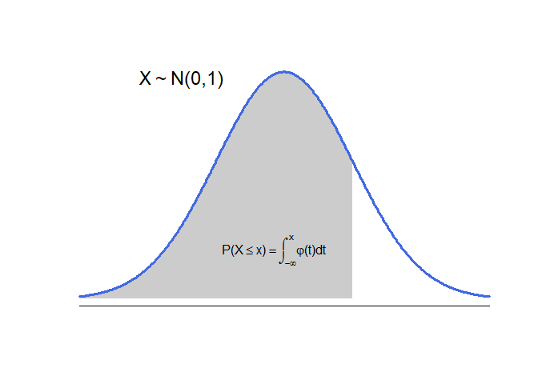
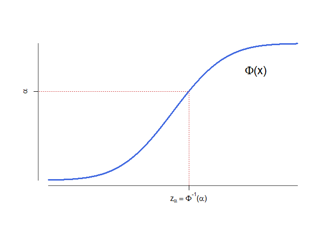
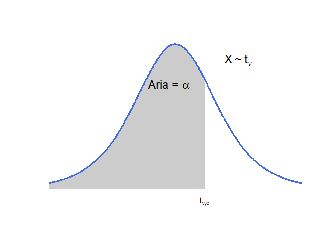
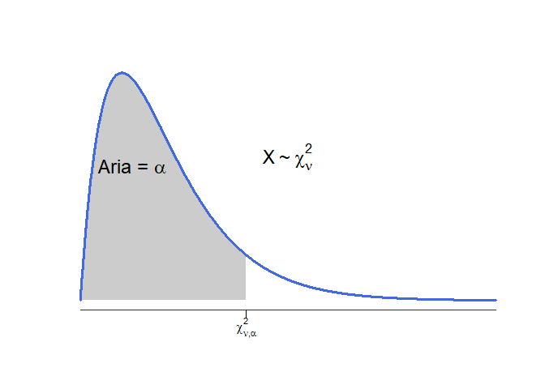
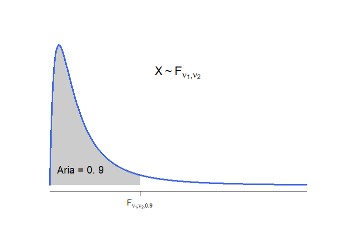
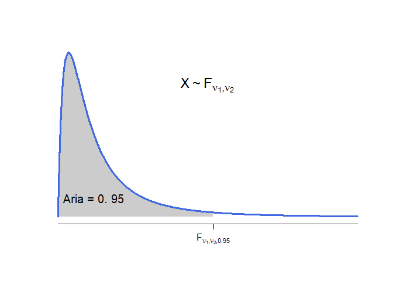
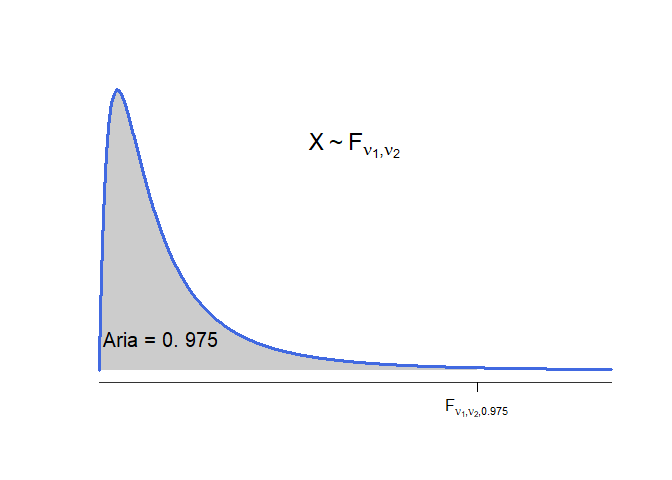

În acest document ne propunem să prezentăm mai multe tabele statistice utile pentru rezolvarea problemelor de probabilități și statistică.  

# Tabele pentru repartiția normală standard

## Valorile funcției de repartiție

În tabelul următor descriem valorile **funcției de repartiție**, $\Phi(x)=\mathbb{P}(X\leq x)$ cu $x = x_1 + x_2$, pentru o variabilă aleatoare $X$ repartizată normal de medie $0$ și varianță $1$. Pentru valori negative putem folosi relația $\Phi(x) = 1-\Phi(-x)$.

<table class="table table-striped table-hover" style="margin-left: auto; margin-right: auto;">
<thead><tr>
<th style="text-align:right;"> $x_{1} / x_{2}$ </th>
   <th style="text-align:right;"> 0 </th>
   <th style="text-align:right;"> 0.01 </th>
   <th style="text-align:right;"> 0.02 </th>
   <th style="text-align:right;"> 0.03 </th>
   <th style="text-align:right;"> 0.04 </th>
   <th style="text-align:right;"> 0.05 </th>
   <th style="text-align:right;"> 0.06 </th>
   <th style="text-align:right;"> 0.07 </th>
   <th style="text-align:right;"> 0.08 </th>
   <th style="text-align:right;"> 0.09 </th>
  </tr></thead>
<tbody>
<tr>
<td style="text-align:right;font-weight: bold;border-right:1px solid;"> 0.0 </td>
   <td style="text-align:right;"> 0.5000 </td>
   <td style="text-align:right;"> 0.5040 </td>
   <td style="text-align:right;"> 0.5080 </td>
   <td style="text-align:right;"> 0.5120 </td>
   <td style="text-align:right;"> 0.5160 </td>
   <td style="text-align:right;"> 0.5199 </td>
   <td style="text-align:right;"> 0.5239 </td>
   <td style="text-align:right;"> 0.5279 </td>
   <td style="text-align:right;"> 0.5319 </td>
   <td style="text-align:right;"> 0.5359 </td>
  </tr>
<tr>
<td style="text-align:right;font-weight: bold;border-right:1px solid;"> 0.1 </td>
   <td style="text-align:right;"> 0.5398 </td>
   <td style="text-align:right;"> 0.5438 </td>
   <td style="text-align:right;"> 0.5478 </td>
   <td style="text-align:right;"> 0.5517 </td>
   <td style="text-align:right;"> 0.5557 </td>
   <td style="text-align:right;"> 0.5596 </td>
   <td style="text-align:right;"> 0.5636 </td>
   <td style="text-align:right;"> 0.5675 </td>
   <td style="text-align:right;"> 0.5714 </td>
   <td style="text-align:right;"> 0.5753 </td>
  </tr>
<tr>
<td style="text-align:right;font-weight: bold;border-right:1px solid;"> 0.2 </td>
   <td style="text-align:right;"> 0.5793 </td>
   <td style="text-align:right;"> 0.5832 </td>
   <td style="text-align:right;"> 0.5871 </td>
   <td style="text-align:right;"> 0.5910 </td>
   <td style="text-align:right;"> 0.5948 </td>
   <td style="text-align:right;"> 0.5987 </td>
   <td style="text-align:right;"> 0.6026 </td>
   <td style="text-align:right;"> 0.6064 </td>
   <td style="text-align:right;"> 0.6103 </td>
   <td style="text-align:right;"> 0.6141 </td>
  </tr>
<tr>
<td style="text-align:right;font-weight: bold;border-right:1px solid;"> 0.3 </td>
   <td style="text-align:right;"> 0.6179 </td>
   <td style="text-align:right;"> 0.6217 </td>
   <td style="text-align:right;"> 0.6255 </td>
   <td style="text-align:right;"> 0.6293 </td>
   <td style="text-align:right;"> 0.6331 </td>
   <td style="text-align:right;"> 0.6368 </td>
   <td style="text-align:right;"> 0.6406 </td>
   <td style="text-align:right;"> 0.6443 </td>
   <td style="text-align:right;"> 0.6480 </td>
   <td style="text-align:right;"> 0.6517 </td>
  </tr>
<tr>
<td style="text-align:right;font-weight: bold;border-right:1px solid;"> 0.4 </td>
   <td style="text-align:right;"> 0.6554 </td>
   <td style="text-align:right;"> 0.6591 </td>
   <td style="text-align:right;"> 0.6628 </td>
   <td style="text-align:right;"> 0.6664 </td>
   <td style="text-align:right;"> 0.6700 </td>
   <td style="text-align:right;"> 0.6736 </td>
   <td style="text-align:right;"> 0.6772 </td>
   <td style="text-align:right;"> 0.6808 </td>
   <td style="text-align:right;"> 0.6844 </td>
   <td style="text-align:right;"> 0.6879 </td>
  </tr>
<tr>
<td style="text-align:right;font-weight: bold;border-right:1px solid;"> 0.5 </td>
   <td style="text-align:right;"> 0.6915 </td>
   <td style="text-align:right;"> 0.6950 </td>
   <td style="text-align:right;"> 0.6985 </td>
   <td style="text-align:right;"> 0.7019 </td>
   <td style="text-align:right;"> 0.7054 </td>
   <td style="text-align:right;"> 0.7088 </td>
   <td style="text-align:right;"> 0.7123 </td>
   <td style="text-align:right;"> 0.7157 </td>
   <td style="text-align:right;"> 0.7190 </td>
   <td style="text-align:right;"> 0.7224 </td>
  </tr>
<tr>
<td style="text-align:right;font-weight: bold;border-right:1px solid;"> 0.6 </td>
   <td style="text-align:right;"> 0.7257 </td>
   <td style="text-align:right;"> 0.7291 </td>
   <td style="text-align:right;"> 0.7324 </td>
   <td style="text-align:right;"> 0.7357 </td>
   <td style="text-align:right;"> 0.7389 </td>
   <td style="text-align:right;"> 0.7422 </td>
   <td style="text-align:right;"> 0.7454 </td>
   <td style="text-align:right;"> 0.7486 </td>
   <td style="text-align:right;"> 0.7517 </td>
   <td style="text-align:right;"> 0.7549 </td>
  </tr>
<tr>
<td style="text-align:right;font-weight: bold;border-right:1px solid;"> 0.7 </td>
   <td style="text-align:right;"> 0.7580 </td>
   <td style="text-align:right;"> 0.7611 </td>
   <td style="text-align:right;"> 0.7642 </td>
   <td style="text-align:right;"> 0.7673 </td>
   <td style="text-align:right;"> 0.7704 </td>
   <td style="text-align:right;"> 0.7734 </td>
   <td style="text-align:right;"> 0.7764 </td>
   <td style="text-align:right;"> 0.7794 </td>
   <td style="text-align:right;"> 0.7823 </td>
   <td style="text-align:right;"> 0.7852 </td>
  </tr>
<tr>
<td style="text-align:right;font-weight: bold;border-right:1px solid;"> 0.8 </td>
   <td style="text-align:right;"> 0.7881 </td>
   <td style="text-align:right;"> 0.7910 </td>
   <td style="text-align:right;"> 0.7939 </td>
   <td style="text-align:right;"> 0.7967 </td>
   <td style="text-align:right;"> 0.7995 </td>
   <td style="text-align:right;"> 0.8023 </td>
   <td style="text-align:right;"> 0.8051 </td>
   <td style="text-align:right;"> 0.8078 </td>
   <td style="text-align:right;"> 0.8106 </td>
   <td style="text-align:right;"> 0.8133 </td>
  </tr>
<tr>
<td style="text-align:right;font-weight: bold;border-right:1px solid;"> 0.9 </td>
   <td style="text-align:right;"> 0.8159 </td>
   <td style="text-align:right;"> 0.8186 </td>
   <td style="text-align:right;"> 0.8212 </td>
   <td style="text-align:right;"> 0.8238 </td>
   <td style="text-align:right;"> 0.8264 </td>
   <td style="text-align:right;"> 0.8289 </td>
   <td style="text-align:right;"> 0.8315 </td>
   <td style="text-align:right;"> 0.8340 </td>
   <td style="text-align:right;"> 0.8365 </td>
   <td style="text-align:right;"> 0.8389 </td>
  </tr>
<tr>
<td style="text-align:right;font-weight: bold;border-right:1px solid;"> 1.0 </td>
   <td style="text-align:right;"> 0.8413 </td>
   <td style="text-align:right;"> 0.8438 </td>
   <td style="text-align:right;"> 0.8461 </td>
   <td style="text-align:right;"> 0.8485 </td>
   <td style="text-align:right;"> 0.8508 </td>
   <td style="text-align:right;"> 0.8531 </td>
   <td style="text-align:right;"> 0.8554 </td>
   <td style="text-align:right;"> 0.8577 </td>
   <td style="text-align:right;"> 0.8599 </td>
   <td style="text-align:right;"> 0.8621 </td>
  </tr>
<tr>
<td style="text-align:right;font-weight: bold;border-right:1px solid;"> 1.1 </td>
   <td style="text-align:right;"> 0.8643 </td>
   <td style="text-align:right;"> 0.8665 </td>
   <td style="text-align:right;"> 0.8686 </td>
   <td style="text-align:right;"> 0.8708 </td>
   <td style="text-align:right;"> 0.8729 </td>
   <td style="text-align:right;"> 0.8749 </td>
   <td style="text-align:right;"> 0.8770 </td>
   <td style="text-align:right;"> 0.8790 </td>
   <td style="text-align:right;"> 0.8810 </td>
   <td style="text-align:right;"> 0.8830 </td>
  </tr>
<tr>
<td style="text-align:right;font-weight: bold;border-right:1px solid;"> 1.2 </td>
   <td style="text-align:right;"> 0.8849 </td>
   <td style="text-align:right;"> 0.8869 </td>
   <td style="text-align:right;"> 0.8888 </td>
   <td style="text-align:right;"> 0.8907 </td>
   <td style="text-align:right;"> 0.8925 </td>
   <td style="text-align:right;"> 0.8944 </td>
   <td style="text-align:right;"> 0.8962 </td>
   <td style="text-align:right;"> 0.8980 </td>
   <td style="text-align:right;"> 0.8997 </td>
   <td style="text-align:right;"> 0.9015 </td>
  </tr>
<tr>
<td style="text-align:right;font-weight: bold;border-right:1px solid;"> 1.3 </td>
   <td style="text-align:right;"> 0.9032 </td>
   <td style="text-align:right;"> 0.9049 </td>
   <td style="text-align:right;"> 0.9066 </td>
   <td style="text-align:right;"> 0.9082 </td>
   <td style="text-align:right;"> 0.9099 </td>
   <td style="text-align:right;"> 0.9115 </td>
   <td style="text-align:right;"> 0.9131 </td>
   <td style="text-align:right;"> 0.9147 </td>
   <td style="text-align:right;"> 0.9162 </td>
   <td style="text-align:right;"> 0.9177 </td>
  </tr>
<tr>
<td style="text-align:right;font-weight: bold;border-right:1px solid;"> 1.4 </td>
   <td style="text-align:right;"> 0.9192 </td>
   <td style="text-align:right;"> 0.9207 </td>
   <td style="text-align:right;"> 0.9222 </td>
   <td style="text-align:right;"> 0.9236 </td>
   <td style="text-align:right;"> 0.9251 </td>
   <td style="text-align:right;"> 0.9265 </td>
   <td style="text-align:right;"> 0.9279 </td>
   <td style="text-align:right;"> 0.9292 </td>
   <td style="text-align:right;"> 0.9306 </td>
   <td style="text-align:right;"> 0.9319 </td>
  </tr>
<tr>
<td style="text-align:right;font-weight: bold;border-right:1px solid;"> 1.5 </td>
   <td style="text-align:right;"> 0.9332 </td>
   <td style="text-align:right;"> 0.9345 </td>
   <td style="text-align:right;"> 0.9357 </td>
   <td style="text-align:right;"> 0.9370 </td>
   <td style="text-align:right;"> 0.9382 </td>
   <td style="text-align:right;"> 0.9394 </td>
   <td style="text-align:right;"> 0.9406 </td>
   <td style="text-align:right;"> 0.9418 </td>
   <td style="text-align:right;"> 0.9429 </td>
   <td style="text-align:right;"> 0.9441 </td>
  </tr>
<tr>
<td style="text-align:right;font-weight: bold;border-right:1px solid;"> 1.6 </td>
   <td style="text-align:right;"> 0.9452 </td>
   <td style="text-align:right;"> 0.9463 </td>
   <td style="text-align:right;"> 0.9474 </td>
   <td style="text-align:right;"> 0.9484 </td>
   <td style="text-align:right;"> 0.9495 </td>
   <td style="text-align:right;"> 0.9505 </td>
   <td style="text-align:right;"> 0.9515 </td>
   <td style="text-align:right;"> 0.9525 </td>
   <td style="text-align:right;"> 0.9535 </td>
   <td style="text-align:right;"> 0.9545 </td>
  </tr>
<tr>
<td style="text-align:right;font-weight: bold;border-right:1px solid;"> 1.7 </td>
   <td style="text-align:right;"> 0.9554 </td>
   <td style="text-align:right;"> 0.9564 </td>
   <td style="text-align:right;"> 0.9573 </td>
   <td style="text-align:right;"> 0.9582 </td>
   <td style="text-align:right;"> 0.9591 </td>
   <td style="text-align:right;"> 0.9599 </td>
   <td style="text-align:right;"> 0.9608 </td>
   <td style="text-align:right;"> 0.9616 </td>
   <td style="text-align:right;"> 0.9625 </td>
   <td style="text-align:right;"> 0.9633 </td>
  </tr>
<tr>
<td style="text-align:right;font-weight: bold;border-right:1px solid;"> 1.8 </td>
   <td style="text-align:right;"> 0.9641 </td>
   <td style="text-align:right;"> 0.9649 </td>
   <td style="text-align:right;"> 0.9656 </td>
   <td style="text-align:right;"> 0.9664 </td>
   <td style="text-align:right;"> 0.9671 </td>
   <td style="text-align:right;"> 0.9678 </td>
   <td style="text-align:right;"> 0.9686 </td>
   <td style="text-align:right;"> 0.9693 </td>
   <td style="text-align:right;"> 0.9699 </td>
   <td style="text-align:right;"> 0.9706 </td>
  </tr>
<tr>
<td style="text-align:right;font-weight: bold;border-right:1px solid;"> 1.9 </td>
   <td style="text-align:right;"> 0.9713 </td>
   <td style="text-align:right;"> 0.9719 </td>
   <td style="text-align:right;"> 0.9726 </td>
   <td style="text-align:right;"> 0.9732 </td>
   <td style="text-align:right;"> 0.9738 </td>
   <td style="text-align:right;"> 0.9744 </td>
   <td style="text-align:right;"> 0.9750 </td>
   <td style="text-align:right;"> 0.9756 </td>
   <td style="text-align:right;"> 0.9761 </td>
   <td style="text-align:right;"> 0.9767 </td>
  </tr>
<tr>
<td style="text-align:right;font-weight: bold;border-right:1px solid;"> 2.0 </td>
   <td style="text-align:right;"> 0.9772 </td>
   <td style="text-align:right;"> 0.9778 </td>
   <td style="text-align:right;"> 0.9783 </td>
   <td style="text-align:right;"> 0.9788 </td>
   <td style="text-align:right;"> 0.9793 </td>
   <td style="text-align:right;"> 0.9798 </td>
   <td style="text-align:right;"> 0.9803 </td>
   <td style="text-align:right;"> 0.9808 </td>
   <td style="text-align:right;"> 0.9812 </td>
   <td style="text-align:right;"> 0.9817 </td>
  </tr>
<tr>
<td style="text-align:right;font-weight: bold;border-right:1px solid;"> 2.1 </td>
   <td style="text-align:right;"> 0.9821 </td>
   <td style="text-align:right;"> 0.9826 </td>
   <td style="text-align:right;"> 0.9830 </td>
   <td style="text-align:right;"> 0.9834 </td>
   <td style="text-align:right;"> 0.9838 </td>
   <td style="text-align:right;"> 0.9842 </td>
   <td style="text-align:right;"> 0.9846 </td>
   <td style="text-align:right;"> 0.9850 </td>
   <td style="text-align:right;"> 0.9854 </td>
   <td style="text-align:right;"> 0.9857 </td>
  </tr>
<tr>
<td style="text-align:right;font-weight: bold;border-right:1px solid;"> 2.2 </td>
   <td style="text-align:right;"> 0.9861 </td>
   <td style="text-align:right;"> 0.9864 </td>
   <td style="text-align:right;"> 0.9868 </td>
   <td style="text-align:right;"> 0.9871 </td>
   <td style="text-align:right;"> 0.9875 </td>
   <td style="text-align:right;"> 0.9878 </td>
   <td style="text-align:right;"> 0.9881 </td>
   <td style="text-align:right;"> 0.9884 </td>
   <td style="text-align:right;"> 0.9887 </td>
   <td style="text-align:right;"> 0.9890 </td>
  </tr>
<tr>
<td style="text-align:right;font-weight: bold;border-right:1px solid;"> 2.3 </td>
   <td style="text-align:right;"> 0.9893 </td>
   <td style="text-align:right;"> 0.9896 </td>
   <td style="text-align:right;"> 0.9898 </td>
   <td style="text-align:right;"> 0.9901 </td>
   <td style="text-align:right;"> 0.9904 </td>
   <td style="text-align:right;"> 0.9906 </td>
   <td style="text-align:right;"> 0.9909 </td>
   <td style="text-align:right;"> 0.9911 </td>
   <td style="text-align:right;"> 0.9913 </td>
   <td style="text-align:right;"> 0.9916 </td>
  </tr>
<tr>
<td style="text-align:right;font-weight: bold;border-right:1px solid;"> 2.4 </td>
   <td style="text-align:right;"> 0.9918 </td>
   <td style="text-align:right;"> 0.9920 </td>
   <td style="text-align:right;"> 0.9922 </td>
   <td style="text-align:right;"> 0.9925 </td>
   <td style="text-align:right;"> 0.9927 </td>
   <td style="text-align:right;"> 0.9929 </td>
   <td style="text-align:right;"> 0.9931 </td>
   <td style="text-align:right;"> 0.9932 </td>
   <td style="text-align:right;"> 0.9934 </td>
   <td style="text-align:right;"> 0.9936 </td>
  </tr>
<tr>
<td style="text-align:right;font-weight: bold;border-right:1px solid;"> 2.5 </td>
   <td style="text-align:right;"> 0.9938 </td>
   <td style="text-align:right;"> 0.9940 </td>
   <td style="text-align:right;"> 0.9941 </td>
   <td style="text-align:right;"> 0.9943 </td>
   <td style="text-align:right;"> 0.9945 </td>
   <td style="text-align:right;"> 0.9946 </td>
   <td style="text-align:right;"> 0.9948 </td>
   <td style="text-align:right;"> 0.9949 </td>
   <td style="text-align:right;"> 0.9951 </td>
   <td style="text-align:right;"> 0.9952 </td>
  </tr>
<tr>
<td style="text-align:right;font-weight: bold;border-right:1px solid;"> 2.6 </td>
   <td style="text-align:right;"> 0.9953 </td>
   <td style="text-align:right;"> 0.9955 </td>
   <td style="text-align:right;"> 0.9956 </td>
   <td style="text-align:right;"> 0.9957 </td>
   <td style="text-align:right;"> 0.9959 </td>
   <td style="text-align:right;"> 0.9960 </td>
   <td style="text-align:right;"> 0.9961 </td>
   <td style="text-align:right;"> 0.9962 </td>
   <td style="text-align:right;"> 0.9963 </td>
   <td style="text-align:right;"> 0.9964 </td>
  </tr>
<tr>
<td style="text-align:right;font-weight: bold;border-right:1px solid;"> 2.7 </td>
   <td style="text-align:right;"> 0.9965 </td>
   <td style="text-align:right;"> 0.9966 </td>
   <td style="text-align:right;"> 0.9967 </td>
   <td style="text-align:right;"> 0.9968 </td>
   <td style="text-align:right;"> 0.9969 </td>
   <td style="text-align:right;"> 0.9970 </td>
   <td style="text-align:right;"> 0.9971 </td>
   <td style="text-align:right;"> 0.9972 </td>
   <td style="text-align:right;"> 0.9973 </td>
   <td style="text-align:right;"> 0.9974 </td>
  </tr>
<tr>
<td style="text-align:right;font-weight: bold;border-right:1px solid;"> 2.8 </td>
   <td style="text-align:right;"> 0.9974 </td>
   <td style="text-align:right;"> 0.9975 </td>
   <td style="text-align:right;"> 0.9976 </td>
   <td style="text-align:right;"> 0.9977 </td>
   <td style="text-align:right;"> 0.9977 </td>
   <td style="text-align:right;"> 0.9978 </td>
   <td style="text-align:right;"> 0.9979 </td>
   <td style="text-align:right;"> 0.9979 </td>
   <td style="text-align:right;"> 0.9980 </td>
   <td style="text-align:right;"> 0.9981 </td>
  </tr>
<tr>
<td style="text-align:right;font-weight: bold;border-right:1px solid;"> 2.9 </td>
   <td style="text-align:right;"> 0.9981 </td>
   <td style="text-align:right;"> 0.9982 </td>
   <td style="text-align:right;"> 0.9982 </td>
   <td style="text-align:right;"> 0.9983 </td>
   <td style="text-align:right;"> 0.9984 </td>
   <td style="text-align:right;"> 0.9984 </td>
   <td style="text-align:right;"> 0.9985 </td>
   <td style="text-align:right;"> 0.9985 </td>
   <td style="text-align:right;"> 0.9986 </td>
   <td style="text-align:right;"> 0.9986 </td>
  </tr>
<tr>
<td style="text-align:right;font-weight: bold;border-right:1px solid;"> 3.0 </td>
   <td style="text-align:right;"> 0.9987 </td>
   <td style="text-align:right;"> 0.9987 </td>
   <td style="text-align:right;"> 0.9987 </td>
   <td style="text-align:right;"> 0.9988 </td>
   <td style="text-align:right;"> 0.9988 </td>
   <td style="text-align:right;"> 0.9989 </td>
   <td style="text-align:right;"> 0.9989 </td>
   <td style="text-align:right;"> 0.9989 </td>
   <td style="text-align:right;"> 0.9990 </td>
   <td style="text-align:right;"> 0.9990 </td>
  </tr>
</tbody>
</table>

## Cuantilele pentru $\mathcal{N}(0,1)$

În tabelul următor descriem **cuantilele** de ordin $\alpha$ pentru repartiția normală standard, i.e. $z_{\alpha}=\Phi^{-1}(\alpha)$ cu $\alpha = \alpha_1 + \alpha_2$. În cazul în care $\alpha<0.5$ vom folosi relația $z_{\alpha} = -z_{1-\alpha}$.

<table class="table table-striped table-hover" style="margin-left: auto; margin-right: auto;">
<thead><tr>
<th style="text-align:right;"> $\alpha_{1} / \alpha_{2}$ </th>
   <th style="text-align:right;"> 0 </th>
   <th style="text-align:right;"> 0.001 </th>
   <th style="text-align:right;"> 0.002 </th>
   <th style="text-align:right;"> 0.003 </th>
   <th style="text-align:right;"> 0.004 </th>
   <th style="text-align:right;"> 0.005 </th>
   <th style="text-align:right;"> 0.006 </th>
   <th style="text-align:right;"> 0.007 </th>
   <th style="text-align:right;"> 0.008 </th>
   <th style="text-align:right;"> 0.009 </th>
  </tr></thead>
<tbody>
<tr>
<td style="text-align:right;font-weight: bold;border-right:1px solid;"> 0.50 </td>
   <td style="text-align:right;"> 0.0000 </td>
   <td style="text-align:right;"> 0.0025 </td>
   <td style="text-align:right;"> 0.0050 </td>
   <td style="text-align:right;"> 0.0075 </td>
   <td style="text-align:right;"> 0.0100 </td>
   <td style="text-align:right;"> 0.0125 </td>
   <td style="text-align:right;"> 0.0150 </td>
   <td style="text-align:right;"> 0.0175 </td>
   <td style="text-align:right;"> 0.0201 </td>
   <td style="text-align:right;"> 0.0226 </td>
  </tr>
<tr>
<td style="text-align:right;font-weight: bold;border-right:1px solid;"> 0.51 </td>
   <td style="text-align:right;"> 0.0251 </td>
   <td style="text-align:right;"> 0.0276 </td>
   <td style="text-align:right;"> 0.0301 </td>
   <td style="text-align:right;"> 0.0326 </td>
   <td style="text-align:right;"> 0.0351 </td>
   <td style="text-align:right;"> 0.0376 </td>
   <td style="text-align:right;"> 0.0401 </td>
   <td style="text-align:right;"> 0.0426 </td>
   <td style="text-align:right;"> 0.0451 </td>
   <td style="text-align:right;"> 0.0476 </td>
  </tr>
<tr>
<td style="text-align:right;font-weight: bold;border-right:1px solid;"> 0.52 </td>
   <td style="text-align:right;"> 0.0502 </td>
   <td style="text-align:right;"> 0.0527 </td>
   <td style="text-align:right;"> 0.0552 </td>
   <td style="text-align:right;"> 0.0577 </td>
   <td style="text-align:right;"> 0.0602 </td>
   <td style="text-align:right;"> 0.0627 </td>
   <td style="text-align:right;"> 0.0652 </td>
   <td style="text-align:right;"> 0.0677 </td>
   <td style="text-align:right;"> 0.0702 </td>
   <td style="text-align:right;"> 0.0728 </td>
  </tr>
<tr>
<td style="text-align:right;font-weight: bold;border-right:1px solid;"> 0.53 </td>
   <td style="text-align:right;"> 0.0753 </td>
   <td style="text-align:right;"> 0.0778 </td>
   <td style="text-align:right;"> 0.0803 </td>
   <td style="text-align:right;"> 0.0828 </td>
   <td style="text-align:right;"> 0.0853 </td>
   <td style="text-align:right;"> 0.0878 </td>
   <td style="text-align:right;"> 0.0904 </td>
   <td style="text-align:right;"> 0.0929 </td>
   <td style="text-align:right;"> 0.0954 </td>
   <td style="text-align:right;"> 0.0979 </td>
  </tr>
<tr>
<td style="text-align:right;font-weight: bold;border-right:1px solid;"> 0.54 </td>
   <td style="text-align:right;"> 0.1004 </td>
   <td style="text-align:right;"> 0.1030 </td>
   <td style="text-align:right;"> 0.1055 </td>
   <td style="text-align:right;"> 0.1080 </td>
   <td style="text-align:right;"> 0.1105 </td>
   <td style="text-align:right;"> 0.1130 </td>
   <td style="text-align:right;"> 0.1156 </td>
   <td style="text-align:right;"> 0.1181 </td>
   <td style="text-align:right;"> 0.1206 </td>
   <td style="text-align:right;"> 0.1231 </td>
  </tr>
<tr>
<td style="text-align:right;font-weight: bold;border-right:1px solid;"> 0.55 </td>
   <td style="text-align:right;"> 0.1257 </td>
   <td style="text-align:right;"> 0.1282 </td>
   <td style="text-align:right;"> 0.1307 </td>
   <td style="text-align:right;"> 0.1332 </td>
   <td style="text-align:right;"> 0.1358 </td>
   <td style="text-align:right;"> 0.1383 </td>
   <td style="text-align:right;"> 0.1408 </td>
   <td style="text-align:right;"> 0.1434 </td>
   <td style="text-align:right;"> 0.1459 </td>
   <td style="text-align:right;"> 0.1484 </td>
  </tr>
<tr>
<td style="text-align:right;font-weight: bold;border-right:1px solid;"> 0.56 </td>
   <td style="text-align:right;"> 0.1510 </td>
   <td style="text-align:right;"> 0.1535 </td>
   <td style="text-align:right;"> 0.1560 </td>
   <td style="text-align:right;"> 0.1586 </td>
   <td style="text-align:right;"> 0.1611 </td>
   <td style="text-align:right;"> 0.1637 </td>
   <td style="text-align:right;"> 0.1662 </td>
   <td style="text-align:right;"> 0.1687 </td>
   <td style="text-align:right;"> 0.1713 </td>
   <td style="text-align:right;"> 0.1738 </td>
  </tr>
<tr>
<td style="text-align:right;font-weight: bold;border-right:1px solid;"> 0.57 </td>
   <td style="text-align:right;"> 0.1764 </td>
   <td style="text-align:right;"> 0.1789 </td>
   <td style="text-align:right;"> 0.1815 </td>
   <td style="text-align:right;"> 0.1840 </td>
   <td style="text-align:right;"> 0.1866 </td>
   <td style="text-align:right;"> 0.1891 </td>
   <td style="text-align:right;"> 0.1917 </td>
   <td style="text-align:right;"> 0.1942 </td>
   <td style="text-align:right;"> 0.1968 </td>
   <td style="text-align:right;"> 0.1993 </td>
  </tr>
<tr>
<td style="text-align:right;font-weight: bold;border-right:1px solid;"> 0.58 </td>
   <td style="text-align:right;"> 0.2019 </td>
   <td style="text-align:right;"> 0.2045 </td>
   <td style="text-align:right;"> 0.2070 </td>
   <td style="text-align:right;"> 0.2096 </td>
   <td style="text-align:right;"> 0.2121 </td>
   <td style="text-align:right;"> 0.2147 </td>
   <td style="text-align:right;"> 0.2173 </td>
   <td style="text-align:right;"> 0.2198 </td>
   <td style="text-align:right;"> 0.2224 </td>
   <td style="text-align:right;"> 0.2250 </td>
  </tr>
<tr>
<td style="text-align:right;font-weight: bold;border-right:1px solid;"> 0.59 </td>
   <td style="text-align:right;"> 0.2275 </td>
   <td style="text-align:right;"> 0.2301 </td>
   <td style="text-align:right;"> 0.2327 </td>
   <td style="text-align:right;"> 0.2353 </td>
   <td style="text-align:right;"> 0.2378 </td>
   <td style="text-align:right;"> 0.2404 </td>
   <td style="text-align:right;"> 0.2430 </td>
   <td style="text-align:right;"> 0.2456 </td>
   <td style="text-align:right;"> 0.2482 </td>
   <td style="text-align:right;"> 0.2508 </td>
  </tr>
<tr>
<td style="text-align:right;font-weight: bold;border-right:1px solid;"> 0.60 </td>
   <td style="text-align:right;"> 0.2533 </td>
   <td style="text-align:right;"> 0.2559 </td>
   <td style="text-align:right;"> 0.2585 </td>
   <td style="text-align:right;"> 0.2611 </td>
   <td style="text-align:right;"> 0.2637 </td>
   <td style="text-align:right;"> 0.2663 </td>
   <td style="text-align:right;"> 0.2689 </td>
   <td style="text-align:right;"> 0.2715 </td>
   <td style="text-align:right;"> 0.2741 </td>
   <td style="text-align:right;"> 0.2767 </td>
  </tr>
<tr>
<td style="text-align:right;font-weight: bold;border-right:1px solid;"> 0.61 </td>
   <td style="text-align:right;"> 0.2793 </td>
   <td style="text-align:right;"> 0.2819 </td>
   <td style="text-align:right;"> 0.2845 </td>
   <td style="text-align:right;"> 0.2871 </td>
   <td style="text-align:right;"> 0.2898 </td>
   <td style="text-align:right;"> 0.2924 </td>
   <td style="text-align:right;"> 0.2950 </td>
   <td style="text-align:right;"> 0.2976 </td>
   <td style="text-align:right;"> 0.3002 </td>
   <td style="text-align:right;"> 0.3029 </td>
  </tr>
<tr>
<td style="text-align:right;font-weight: bold;border-right:1px solid;"> 0.62 </td>
   <td style="text-align:right;"> 0.3055 </td>
   <td style="text-align:right;"> 0.3081 </td>
   <td style="text-align:right;"> 0.3107 </td>
   <td style="text-align:right;"> 0.3134 </td>
   <td style="text-align:right;"> 0.3160 </td>
   <td style="text-align:right;"> 0.3186 </td>
   <td style="text-align:right;"> 0.3213 </td>
   <td style="text-align:right;"> 0.3239 </td>
   <td style="text-align:right;"> 0.3266 </td>
   <td style="text-align:right;"> 0.3292 </td>
  </tr>
<tr>
<td style="text-align:right;font-weight: bold;border-right:1px solid;"> 0.63 </td>
   <td style="text-align:right;"> 0.3319 </td>
   <td style="text-align:right;"> 0.3345 </td>
   <td style="text-align:right;"> 0.3372 </td>
   <td style="text-align:right;"> 0.3398 </td>
   <td style="text-align:right;"> 0.3425 </td>
   <td style="text-align:right;"> 0.3451 </td>
   <td style="text-align:right;"> 0.3478 </td>
   <td style="text-align:right;"> 0.3505 </td>
   <td style="text-align:right;"> 0.3531 </td>
   <td style="text-align:right;"> 0.3558 </td>
  </tr>
<tr>
<td style="text-align:right;font-weight: bold;border-right:1px solid;"> 0.64 </td>
   <td style="text-align:right;"> 0.3585 </td>
   <td style="text-align:right;"> 0.3611 </td>
   <td style="text-align:right;"> 0.3638 </td>
   <td style="text-align:right;"> 0.3665 </td>
   <td style="text-align:right;"> 0.3692 </td>
   <td style="text-align:right;"> 0.3719 </td>
   <td style="text-align:right;"> 0.3745 </td>
   <td style="text-align:right;"> 0.3772 </td>
   <td style="text-align:right;"> 0.3799 </td>
   <td style="text-align:right;"> 0.3826 </td>
  </tr>
<tr>
<td style="text-align:right;font-weight: bold;border-right:1px solid;"> 0.65 </td>
   <td style="text-align:right;"> 0.3853 </td>
   <td style="text-align:right;"> 0.3880 </td>
   <td style="text-align:right;"> 0.3907 </td>
   <td style="text-align:right;"> 0.3934 </td>
   <td style="text-align:right;"> 0.3961 </td>
   <td style="text-align:right;"> 0.3989 </td>
   <td style="text-align:right;"> 0.4016 </td>
   <td style="text-align:right;"> 0.4043 </td>
   <td style="text-align:right;"> 0.4070 </td>
   <td style="text-align:right;"> 0.4097 </td>
  </tr>
<tr>
<td style="text-align:right;font-weight: bold;border-right:1px solid;"> 0.66 </td>
   <td style="text-align:right;"> 0.4125 </td>
   <td style="text-align:right;"> 0.4152 </td>
   <td style="text-align:right;"> 0.4179 </td>
   <td style="text-align:right;"> 0.4207 </td>
   <td style="text-align:right;"> 0.4234 </td>
   <td style="text-align:right;"> 0.4261 </td>
   <td style="text-align:right;"> 0.4289 </td>
   <td style="text-align:right;"> 0.4316 </td>
   <td style="text-align:right;"> 0.4344 </td>
   <td style="text-align:right;"> 0.4372 </td>
  </tr>
<tr>
<td style="text-align:right;font-weight: bold;border-right:1px solid;"> 0.67 </td>
   <td style="text-align:right;"> 0.4399 </td>
   <td style="text-align:right;"> 0.4427 </td>
   <td style="text-align:right;"> 0.4454 </td>
   <td style="text-align:right;"> 0.4482 </td>
   <td style="text-align:right;"> 0.4510 </td>
   <td style="text-align:right;"> 0.4538 </td>
   <td style="text-align:right;"> 0.4565 </td>
   <td style="text-align:right;"> 0.4593 </td>
   <td style="text-align:right;"> 0.4621 </td>
   <td style="text-align:right;"> 0.4649 </td>
  </tr>
<tr>
<td style="text-align:right;font-weight: bold;border-right:1px solid;"> 0.68 </td>
   <td style="text-align:right;"> 0.4677 </td>
   <td style="text-align:right;"> 0.4705 </td>
   <td style="text-align:right;"> 0.4733 </td>
   <td style="text-align:right;"> 0.4761 </td>
   <td style="text-align:right;"> 0.4789 </td>
   <td style="text-align:right;"> 0.4817 </td>
   <td style="text-align:right;"> 0.4845 </td>
   <td style="text-align:right;"> 0.4874 </td>
   <td style="text-align:right;"> 0.4902 </td>
   <td style="text-align:right;"> 0.4930 </td>
  </tr>
<tr>
<td style="text-align:right;font-weight: bold;border-right:1px solid;"> 0.69 </td>
   <td style="text-align:right;"> 0.4959 </td>
   <td style="text-align:right;"> 0.4987 </td>
   <td style="text-align:right;"> 0.5015 </td>
   <td style="text-align:right;"> 0.5044 </td>
   <td style="text-align:right;"> 0.5072 </td>
   <td style="text-align:right;"> 0.5101 </td>
   <td style="text-align:right;"> 0.5129 </td>
   <td style="text-align:right;"> 0.5158 </td>
   <td style="text-align:right;"> 0.5187 </td>
   <td style="text-align:right;"> 0.5215 </td>
  </tr>
<tr>
<td style="text-align:right;font-weight: bold;border-right:1px solid;"> 0.70 </td>
   <td style="text-align:right;"> 0.5244 </td>
   <td style="text-align:right;"> 0.5273 </td>
   <td style="text-align:right;"> 0.5302 </td>
   <td style="text-align:right;"> 0.5330 </td>
   <td style="text-align:right;"> 0.5359 </td>
   <td style="text-align:right;"> 0.5388 </td>
   <td style="text-align:right;"> 0.5417 </td>
   <td style="text-align:right;"> 0.5446 </td>
   <td style="text-align:right;"> 0.5476 </td>
   <td style="text-align:right;"> 0.5505 </td>
  </tr>
<tr>
<td style="text-align:right;font-weight: bold;border-right:1px solid;"> 0.71 </td>
   <td style="text-align:right;"> 0.5534 </td>
   <td style="text-align:right;"> 0.5563 </td>
   <td style="text-align:right;"> 0.5592 </td>
   <td style="text-align:right;"> 0.5622 </td>
   <td style="text-align:right;"> 0.5651 </td>
   <td style="text-align:right;"> 0.5681 </td>
   <td style="text-align:right;"> 0.5710 </td>
   <td style="text-align:right;"> 0.5740 </td>
   <td style="text-align:right;"> 0.5769 </td>
   <td style="text-align:right;"> 0.5799 </td>
  </tr>
<tr>
<td style="text-align:right;font-weight: bold;border-right:1px solid;"> 0.72 </td>
   <td style="text-align:right;"> 0.5828 </td>
   <td style="text-align:right;"> 0.5858 </td>
   <td style="text-align:right;"> 0.5888 </td>
   <td style="text-align:right;"> 0.5918 </td>
   <td style="text-align:right;"> 0.5948 </td>
   <td style="text-align:right;"> 0.5978 </td>
   <td style="text-align:right;"> 0.6008 </td>
   <td style="text-align:right;"> 0.6038 </td>
   <td style="text-align:right;"> 0.6068 </td>
   <td style="text-align:right;"> 0.6098 </td>
  </tr>
<tr>
<td style="text-align:right;font-weight: bold;border-right:1px solid;"> 0.73 </td>
   <td style="text-align:right;"> 0.6128 </td>
   <td style="text-align:right;"> 0.6158 </td>
   <td style="text-align:right;"> 0.6189 </td>
   <td style="text-align:right;"> 0.6219 </td>
   <td style="text-align:right;"> 0.6250 </td>
   <td style="text-align:right;"> 0.6280 </td>
   <td style="text-align:right;"> 0.6311 </td>
   <td style="text-align:right;"> 0.6341 </td>
   <td style="text-align:right;"> 0.6372 </td>
   <td style="text-align:right;"> 0.6403 </td>
  </tr>
<tr>
<td style="text-align:right;font-weight: bold;border-right:1px solid;"> 0.74 </td>
   <td style="text-align:right;"> 0.6433 </td>
   <td style="text-align:right;"> 0.6464 </td>
   <td style="text-align:right;"> 0.6495 </td>
   <td style="text-align:right;"> 0.6526 </td>
   <td style="text-align:right;"> 0.6557 </td>
   <td style="text-align:right;"> 0.6588 </td>
   <td style="text-align:right;"> 0.6620 </td>
   <td style="text-align:right;"> 0.6651 </td>
   <td style="text-align:right;"> 0.6682 </td>
   <td style="text-align:right;"> 0.6713 </td>
  </tr>
<tr>
<td style="text-align:right;font-weight: bold;border-right:1px solid;"> 0.75 </td>
   <td style="text-align:right;"> 0.6745 </td>
   <td style="text-align:right;"> 0.6776 </td>
   <td style="text-align:right;"> 0.6808 </td>
   <td style="text-align:right;"> 0.6840 </td>
   <td style="text-align:right;"> 0.6871 </td>
   <td style="text-align:right;"> 0.6903 </td>
   <td style="text-align:right;"> 0.6935 </td>
   <td style="text-align:right;"> 0.6967 </td>
   <td style="text-align:right;"> 0.6999 </td>
   <td style="text-align:right;"> 0.7031 </td>
  </tr>
<tr>
<td style="text-align:right;font-weight: bold;border-right:1px solid;"> 0.76 </td>
   <td style="text-align:right;"> 0.7063 </td>
   <td style="text-align:right;"> 0.7095 </td>
   <td style="text-align:right;"> 0.7128 </td>
   <td style="text-align:right;"> 0.7160 </td>
   <td style="text-align:right;"> 0.7192 </td>
   <td style="text-align:right;"> 0.7225 </td>
   <td style="text-align:right;"> 0.7257 </td>
   <td style="text-align:right;"> 0.7290 </td>
   <td style="text-align:right;"> 0.7323 </td>
   <td style="text-align:right;"> 0.7356 </td>
  </tr>
<tr>
<td style="text-align:right;font-weight: bold;border-right:1px solid;"> 0.77 </td>
   <td style="text-align:right;"> 0.7388 </td>
   <td style="text-align:right;"> 0.7421 </td>
   <td style="text-align:right;"> 0.7454 </td>
   <td style="text-align:right;"> 0.7488 </td>
   <td style="text-align:right;"> 0.7521 </td>
   <td style="text-align:right;"> 0.7554 </td>
   <td style="text-align:right;"> 0.7588 </td>
   <td style="text-align:right;"> 0.7621 </td>
   <td style="text-align:right;"> 0.7655 </td>
   <td style="text-align:right;"> 0.7688 </td>
  </tr>
<tr>
<td style="text-align:right;font-weight: bold;border-right:1px solid;"> 0.78 </td>
   <td style="text-align:right;"> 0.7722 </td>
   <td style="text-align:right;"> 0.7756 </td>
   <td style="text-align:right;"> 0.7790 </td>
   <td style="text-align:right;"> 0.7824 </td>
   <td style="text-align:right;"> 0.7858 </td>
   <td style="text-align:right;"> 0.7892 </td>
   <td style="text-align:right;"> 0.7926 </td>
   <td style="text-align:right;"> 0.7961 </td>
   <td style="text-align:right;"> 0.7995 </td>
   <td style="text-align:right;"> 0.8030 </td>
  </tr>
<tr>
<td style="text-align:right;font-weight: bold;border-right:1px solid;"> 0.79 </td>
   <td style="text-align:right;"> 0.8064 </td>
   <td style="text-align:right;"> 0.8099 </td>
   <td style="text-align:right;"> 0.8134 </td>
   <td style="text-align:right;"> 0.8169 </td>
   <td style="text-align:right;"> 0.8204 </td>
   <td style="text-align:right;"> 0.8239 </td>
   <td style="text-align:right;"> 0.8274 </td>
   <td style="text-align:right;"> 0.8310 </td>
   <td style="text-align:right;"> 0.8345 </td>
   <td style="text-align:right;"> 0.8381 </td>
  </tr>
<tr>
<td style="text-align:right;font-weight: bold;border-right:1px solid;"> 0.80 </td>
   <td style="text-align:right;"> 0.8416 </td>
   <td style="text-align:right;"> 0.8452 </td>
   <td style="text-align:right;"> 0.8488 </td>
   <td style="text-align:right;"> 0.8524 </td>
   <td style="text-align:right;"> 0.8560 </td>
   <td style="text-align:right;"> 0.8596 </td>
   <td style="text-align:right;"> 0.8633 </td>
   <td style="text-align:right;"> 0.8669 </td>
   <td style="text-align:right;"> 0.8705 </td>
   <td style="text-align:right;"> 0.8742 </td>
  </tr>
<tr>
<td style="text-align:right;font-weight: bold;border-right:1px solid;"> 0.81 </td>
   <td style="text-align:right;"> 0.8779 </td>
   <td style="text-align:right;"> 0.8816 </td>
   <td style="text-align:right;"> 0.8853 </td>
   <td style="text-align:right;"> 0.8890 </td>
   <td style="text-align:right;"> 0.8927 </td>
   <td style="text-align:right;"> 0.8965 </td>
   <td style="text-align:right;"> 0.9002 </td>
   <td style="text-align:right;"> 0.9040 </td>
   <td style="text-align:right;"> 0.9078 </td>
   <td style="text-align:right;"> 0.9116 </td>
  </tr>
<tr>
<td style="text-align:right;font-weight: bold;border-right:1px solid;"> 0.82 </td>
   <td style="text-align:right;"> 0.9154 </td>
   <td style="text-align:right;"> 0.9192 </td>
   <td style="text-align:right;"> 0.9230 </td>
   <td style="text-align:right;"> 0.9269 </td>
   <td style="text-align:right;"> 0.9307 </td>
   <td style="text-align:right;"> 0.9346 </td>
   <td style="text-align:right;"> 0.9385 </td>
   <td style="text-align:right;"> 0.9424 </td>
   <td style="text-align:right;"> 0.9463 </td>
   <td style="text-align:right;"> 0.9502 </td>
  </tr>
<tr>
<td style="text-align:right;font-weight: bold;border-right:1px solid;"> 0.83 </td>
   <td style="text-align:right;"> 0.9542 </td>
   <td style="text-align:right;"> 0.9581 </td>
   <td style="text-align:right;"> 0.9621 </td>
   <td style="text-align:right;"> 0.9661 </td>
   <td style="text-align:right;"> 0.9701 </td>
   <td style="text-align:right;"> 0.9741 </td>
   <td style="text-align:right;"> 0.9782 </td>
   <td style="text-align:right;"> 0.9822 </td>
   <td style="text-align:right;"> 0.9863 </td>
   <td style="text-align:right;"> 0.9904 </td>
  </tr>
<tr>
<td style="text-align:right;font-weight: bold;border-right:1px solid;"> 0.84 </td>
   <td style="text-align:right;"> 0.9945 </td>
   <td style="text-align:right;"> 0.9986 </td>
   <td style="text-align:right;"> 1.0027 </td>
   <td style="text-align:right;"> 1.0069 </td>
   <td style="text-align:right;"> 1.0110 </td>
   <td style="text-align:right;"> 1.0152 </td>
   <td style="text-align:right;"> 1.0194 </td>
   <td style="text-align:right;"> 1.0237 </td>
   <td style="text-align:right;"> 1.0279 </td>
   <td style="text-align:right;"> 1.0322 </td>
  </tr>
<tr>
<td style="text-align:right;font-weight: bold;border-right:1px solid;"> 0.85 </td>
   <td style="text-align:right;"> 1.0364 </td>
   <td style="text-align:right;"> 1.0407 </td>
   <td style="text-align:right;"> 1.0450 </td>
   <td style="text-align:right;"> 1.0494 </td>
   <td style="text-align:right;"> 1.0537 </td>
   <td style="text-align:right;"> 1.0581 </td>
   <td style="text-align:right;"> 1.0625 </td>
   <td style="text-align:right;"> 1.0669 </td>
   <td style="text-align:right;"> 1.0714 </td>
   <td style="text-align:right;"> 1.0758 </td>
  </tr>
<tr>
<td style="text-align:right;font-weight: bold;border-right:1px solid;"> 0.86 </td>
   <td style="text-align:right;"> 1.0803 </td>
   <td style="text-align:right;"> 1.0848 </td>
   <td style="text-align:right;"> 1.0893 </td>
   <td style="text-align:right;"> 1.0939 </td>
   <td style="text-align:right;"> 1.0985 </td>
   <td style="text-align:right;"> 1.1031 </td>
   <td style="text-align:right;"> 1.1077 </td>
   <td style="text-align:right;"> 1.1123 </td>
   <td style="text-align:right;"> 1.1170 </td>
   <td style="text-align:right;"> 1.1217 </td>
  </tr>
<tr>
<td style="text-align:right;font-weight: bold;border-right:1px solid;"> 0.87 </td>
   <td style="text-align:right;"> 1.1264 </td>
   <td style="text-align:right;"> 1.1311 </td>
   <td style="text-align:right;"> 1.1359 </td>
   <td style="text-align:right;"> 1.1407 </td>
   <td style="text-align:right;"> 1.1455 </td>
   <td style="text-align:right;"> 1.1503 </td>
   <td style="text-align:right;"> 1.1552 </td>
   <td style="text-align:right;"> 1.1601 </td>
   <td style="text-align:right;"> 1.1650 </td>
   <td style="text-align:right;"> 1.1700 </td>
  </tr>
<tr>
<td style="text-align:right;font-weight: bold;border-right:1px solid;"> 0.88 </td>
   <td style="text-align:right;"> 1.1750 </td>
   <td style="text-align:right;"> 1.1800 </td>
   <td style="text-align:right;"> 1.1850 </td>
   <td style="text-align:right;"> 1.1901 </td>
   <td style="text-align:right;"> 1.1952 </td>
   <td style="text-align:right;"> 1.2004 </td>
   <td style="text-align:right;"> 1.2055 </td>
   <td style="text-align:right;"> 1.2107 </td>
   <td style="text-align:right;"> 1.2160 </td>
   <td style="text-align:right;"> 1.2212 </td>
  </tr>
<tr>
<td style="text-align:right;font-weight: bold;border-right:1px solid;"> 0.89 </td>
   <td style="text-align:right;"> 1.2265 </td>
   <td style="text-align:right;"> 1.2319 </td>
   <td style="text-align:right;"> 1.2372 </td>
   <td style="text-align:right;"> 1.2426 </td>
   <td style="text-align:right;"> 1.2481 </td>
   <td style="text-align:right;"> 1.2536 </td>
   <td style="text-align:right;"> 1.2591 </td>
   <td style="text-align:right;"> 1.2646 </td>
   <td style="text-align:right;"> 1.2702 </td>
   <td style="text-align:right;"> 1.2759 </td>
  </tr>
<tr>
<td style="text-align:right;font-weight: bold;border-right:1px solid;"> 0.90 </td>
   <td style="text-align:right;"> 1.2816 </td>
   <td style="text-align:right;"> 1.2873 </td>
   <td style="text-align:right;"> 1.2930 </td>
   <td style="text-align:right;"> 1.2988 </td>
   <td style="text-align:right;"> 1.3047 </td>
   <td style="text-align:right;"> 1.3106 </td>
   <td style="text-align:right;"> 1.3165 </td>
   <td style="text-align:right;"> 1.3225 </td>
   <td style="text-align:right;"> 1.3285 </td>
   <td style="text-align:right;"> 1.3346 </td>
  </tr>
<tr>
<td style="text-align:right;font-weight: bold;border-right:1px solid;"> 0.91 </td>
   <td style="text-align:right;"> 1.3408 </td>
   <td style="text-align:right;"> 1.3469 </td>
   <td style="text-align:right;"> 1.3532 </td>
   <td style="text-align:right;"> 1.3595 </td>
   <td style="text-align:right;"> 1.3658 </td>
   <td style="text-align:right;"> 1.3722 </td>
   <td style="text-align:right;"> 1.3787 </td>
   <td style="text-align:right;"> 1.3852 </td>
   <td style="text-align:right;"> 1.3917 </td>
   <td style="text-align:right;"> 1.3984 </td>
  </tr>
<tr>
<td style="text-align:right;font-weight: bold;border-right:1px solid;"> 0.92 </td>
   <td style="text-align:right;"> 1.4051 </td>
   <td style="text-align:right;"> 1.4118 </td>
   <td style="text-align:right;"> 1.4187 </td>
   <td style="text-align:right;"> 1.4255 </td>
   <td style="text-align:right;"> 1.4325 </td>
   <td style="text-align:right;"> 1.4395 </td>
   <td style="text-align:right;"> 1.4466 </td>
   <td style="text-align:right;"> 1.4538 </td>
   <td style="text-align:right;"> 1.4611 </td>
   <td style="text-align:right;"> 1.4684 </td>
  </tr>
<tr>
<td style="text-align:right;font-weight: bold;border-right:1px solid;"> 0.93 </td>
   <td style="text-align:right;"> 1.4758 </td>
   <td style="text-align:right;"> 1.4833 </td>
   <td style="text-align:right;"> 1.4909 </td>
   <td style="text-align:right;"> 1.4985 </td>
   <td style="text-align:right;"> 1.5063 </td>
   <td style="text-align:right;"> 1.5141 </td>
   <td style="text-align:right;"> 1.5220 </td>
   <td style="text-align:right;"> 1.5301 </td>
   <td style="text-align:right;"> 1.5382 </td>
   <td style="text-align:right;"> 1.5464 </td>
  </tr>
<tr>
<td style="text-align:right;font-weight: bold;border-right:1px solid;"> 0.94 </td>
   <td style="text-align:right;"> 1.5548 </td>
   <td style="text-align:right;"> 1.5632 </td>
   <td style="text-align:right;"> 1.5718 </td>
   <td style="text-align:right;"> 1.5805 </td>
   <td style="text-align:right;"> 1.5893 </td>
   <td style="text-align:right;"> 1.5982 </td>
   <td style="text-align:right;"> 1.6072 </td>
   <td style="text-align:right;"> 1.6164 </td>
   <td style="text-align:right;"> 1.6258 </td>
   <td style="text-align:right;"> 1.6352 </td>
  </tr>
<tr>
<td style="text-align:right;font-weight: bold;border-right:1px solid;"> 0.95 </td>
   <td style="text-align:right;"> 1.6449 </td>
   <td style="text-align:right;"> 1.6546 </td>
   <td style="text-align:right;"> 1.6646 </td>
   <td style="text-align:right;"> 1.6747 </td>
   <td style="text-align:right;"> 1.6849 </td>
   <td style="text-align:right;"> 1.6954 </td>
   <td style="text-align:right;"> 1.7060 </td>
   <td style="text-align:right;"> 1.7169 </td>
   <td style="text-align:right;"> 1.7279 </td>
   <td style="text-align:right;"> 1.7392 </td>
  </tr>
<tr>
<td style="text-align:right;font-weight: bold;border-right:1px solid;"> 0.96 </td>
   <td style="text-align:right;"> 1.7507 </td>
   <td style="text-align:right;"> 1.7624 </td>
   <td style="text-align:right;"> 1.7744 </td>
   <td style="text-align:right;"> 1.7866 </td>
   <td style="text-align:right;"> 1.7991 </td>
   <td style="text-align:right;"> 1.8119 </td>
   <td style="text-align:right;"> 1.8250 </td>
   <td style="text-align:right;"> 1.8384 </td>
   <td style="text-align:right;"> 1.8522 </td>
   <td style="text-align:right;"> 1.8663 </td>
  </tr>
<tr>
<td style="text-align:right;font-weight: bold;border-right:1px solid;"> 0.97 </td>
   <td style="text-align:right;"> 1.8808 </td>
   <td style="text-align:right;"> 1.8957 </td>
   <td style="text-align:right;"> 1.9110 </td>
   <td style="text-align:right;"> 1.9268 </td>
   <td style="text-align:right;"> 1.9431 </td>
   <td style="text-align:right;"> 1.9600 </td>
   <td style="text-align:right;"> 1.9774 </td>
   <td style="text-align:right;"> 1.9954 </td>
   <td style="text-align:right;"> 2.0141 </td>
   <td style="text-align:right;"> 2.0335 </td>
  </tr>
<tr>
<td style="text-align:right;font-weight: bold;border-right:1px solid;"> 0.98 </td>
   <td style="text-align:right;"> 2.0537 </td>
   <td style="text-align:right;"> 2.0749 </td>
   <td style="text-align:right;"> 2.0969 </td>
   <td style="text-align:right;"> 2.1201 </td>
   <td style="text-align:right;"> 2.1444 </td>
   <td style="text-align:right;"> 2.1701 </td>
   <td style="text-align:right;"> 2.1973 </td>
   <td style="text-align:right;"> 2.2262 </td>
   <td style="text-align:right;"> 2.2571 </td>
   <td style="text-align:right;"> 2.2904 </td>
  </tr>
<tr>
<td style="text-align:right;font-weight: bold;border-right:1px solid;"> 0.99 </td>
   <td style="text-align:right;"> 2.3263 </td>
   <td style="text-align:right;"> 2.3656 </td>
   <td style="text-align:right;"> 2.4089 </td>
   <td style="text-align:right;"> 2.4573 </td>
   <td style="text-align:right;"> 2.5121 </td>
   <td style="text-align:right;"> 2.5758 </td>
   <td style="text-align:right;"> 2.6521 </td>
   <td style="text-align:right;"> 2.7478 </td>
   <td style="text-align:right;"> 2.8782 </td>
   <td style="text-align:right;"> 3.0902 </td>
  </tr>
</tbody>
</table>

# Tabel pentru repartiția t-Student

Tabelul următor prezintă cuantilele de ordin $\alpha$ pentru repatiția t-Student cu $\nu$ grade de libertate. Pentru valori ale lui $\alpha\leq 0.5$ se poate folosi relația următoare $t_{\nu,\alpha} = - t_{\nu,1-\alpha}$. 

<table class="table table-striped table-hover" style="margin-left: auto; margin-right: auto;">
<thead><tr>
<th style="text-align:right;"> $\nu / \alpha$ </th>
   <th style="text-align:right;"> 0.6 </th>
   <th style="text-align:right;"> 0.75 </th>
   <th style="text-align:right;"> 0.9 </th>
   <th style="text-align:right;"> 0.95 </th>
   <th style="text-align:right;"> 0.975 </th>
   <th style="text-align:right;"> 0.99 </th>
   <th style="text-align:right;"> 0.995 </th>
   <th style="text-align:right;"> 0.9995 </th>
  </tr></thead>
<tbody>
<tr>
<td style="text-align:right;font-weight: bold;border-right:1px solid;"> 1 </td>
   <td style="text-align:right;"> 0.3249 </td>
   <td style="text-align:right;"> 1.0000 </td>
   <td style="text-align:right;"> 3.078 </td>
   <td style="text-align:right;"> 6.314 </td>
   <td style="text-align:right;"> 12.706 </td>
   <td style="text-align:right;"> 31.820 </td>
   <td style="text-align:right;"> 63.657 </td>
   <td style="text-align:right;"> 636.619 </td>
  </tr>
<tr>
<td style="text-align:right;font-weight: bold;border-right:1px solid;"> 2 </td>
   <td style="text-align:right;"> 0.2887 </td>
   <td style="text-align:right;"> 0.8165 </td>
   <td style="text-align:right;"> 1.886 </td>
   <td style="text-align:right;"> 2.920 </td>
   <td style="text-align:right;"> 4.303 </td>
   <td style="text-align:right;"> 6.965 </td>
   <td style="text-align:right;"> 9.925 </td>
   <td style="text-align:right;"> 31.599 </td>
  </tr>
<tr>
<td style="text-align:right;font-weight: bold;border-right:1px solid;"> 3 </td>
   <td style="text-align:right;"> 0.2767 </td>
   <td style="text-align:right;"> 0.7649 </td>
   <td style="text-align:right;"> 1.638 </td>
   <td style="text-align:right;"> 2.353 </td>
   <td style="text-align:right;"> 3.182 </td>
   <td style="text-align:right;"> 4.541 </td>
   <td style="text-align:right;"> 5.841 </td>
   <td style="text-align:right;"> 12.924 </td>
  </tr>
<tr>
<td style="text-align:right;font-weight: bold;border-right:1px solid;"> 4 </td>
   <td style="text-align:right;"> 0.2707 </td>
   <td style="text-align:right;"> 0.7407 </td>
   <td style="text-align:right;"> 1.533 </td>
   <td style="text-align:right;"> 2.132 </td>
   <td style="text-align:right;"> 2.776 </td>
   <td style="text-align:right;"> 3.747 </td>
   <td style="text-align:right;"> 4.604 </td>
   <td style="text-align:right;"> 8.610 </td>
  </tr>
<tr>
<td style="text-align:right;font-weight: bold;border-right:1px solid;"> 5 </td>
   <td style="text-align:right;"> 0.2672 </td>
   <td style="text-align:right;"> 0.7267 </td>
   <td style="text-align:right;"> 1.476 </td>
   <td style="text-align:right;"> 2.015 </td>
   <td style="text-align:right;"> 2.571 </td>
   <td style="text-align:right;"> 3.365 </td>
   <td style="text-align:right;"> 4.032 </td>
   <td style="text-align:right;"> 6.869 </td>
  </tr>
<tr>
<td style="text-align:right;font-weight: bold;border-right:1px solid;"> 6 </td>
   <td style="text-align:right;"> 0.2648 </td>
   <td style="text-align:right;"> 0.7176 </td>
   <td style="text-align:right;"> 1.440 </td>
   <td style="text-align:right;"> 1.943 </td>
   <td style="text-align:right;"> 2.447 </td>
   <td style="text-align:right;"> 3.143 </td>
   <td style="text-align:right;"> 3.707 </td>
   <td style="text-align:right;"> 5.959 </td>
  </tr>
<tr>
<td style="text-align:right;font-weight: bold;border-right:1px solid;"> 7 </td>
   <td style="text-align:right;"> 0.2632 </td>
   <td style="text-align:right;"> 0.7111 </td>
   <td style="text-align:right;"> 1.415 </td>
   <td style="text-align:right;"> 1.895 </td>
   <td style="text-align:right;"> 2.365 </td>
   <td style="text-align:right;"> 2.998 </td>
   <td style="text-align:right;"> 3.499 </td>
   <td style="text-align:right;"> 5.408 </td>
  </tr>
<tr>
<td style="text-align:right;font-weight: bold;border-right:1px solid;"> 8 </td>
   <td style="text-align:right;"> 0.2619 </td>
   <td style="text-align:right;"> 0.7064 </td>
   <td style="text-align:right;"> 1.397 </td>
   <td style="text-align:right;"> 1.859 </td>
   <td style="text-align:right;"> 2.306 </td>
   <td style="text-align:right;"> 2.897 </td>
   <td style="text-align:right;"> 3.355 </td>
   <td style="text-align:right;"> 5.041 </td>
  </tr>
<tr>
<td style="text-align:right;font-weight: bold;border-right:1px solid;"> 9 </td>
   <td style="text-align:right;"> 0.2610 </td>
   <td style="text-align:right;"> 0.7027 </td>
   <td style="text-align:right;"> 1.383 </td>
   <td style="text-align:right;"> 1.833 </td>
   <td style="text-align:right;"> 2.262 </td>
   <td style="text-align:right;"> 2.821 </td>
   <td style="text-align:right;"> 3.250 </td>
   <td style="text-align:right;"> 4.781 </td>
  </tr>
<tr>
<td style="text-align:right;font-weight: bold;border-right:1px solid;"> 10 </td>
   <td style="text-align:right;"> 0.2602 </td>
   <td style="text-align:right;"> 0.6998 </td>
   <td style="text-align:right;"> 1.372 </td>
   <td style="text-align:right;"> 1.812 </td>
   <td style="text-align:right;"> 2.228 </td>
   <td style="text-align:right;"> 2.764 </td>
   <td style="text-align:right;"> 3.169 </td>
   <td style="text-align:right;"> 4.587 </td>
  </tr>
<tr>
<td style="text-align:right;font-weight: bold;border-right:1px solid;"> 11 </td>
   <td style="text-align:right;"> 0.2596 </td>
   <td style="text-align:right;"> 0.6974 </td>
   <td style="text-align:right;"> 1.363 </td>
   <td style="text-align:right;"> 1.796 </td>
   <td style="text-align:right;"> 2.201 </td>
   <td style="text-align:right;"> 2.718 </td>
   <td style="text-align:right;"> 3.106 </td>
   <td style="text-align:right;"> 4.437 </td>
  </tr>
<tr>
<td style="text-align:right;font-weight: bold;border-right:1px solid;"> 12 </td>
   <td style="text-align:right;"> 0.2590 </td>
   <td style="text-align:right;"> 0.6955 </td>
   <td style="text-align:right;"> 1.356 </td>
   <td style="text-align:right;"> 1.782 </td>
   <td style="text-align:right;"> 2.179 </td>
   <td style="text-align:right;"> 2.681 </td>
   <td style="text-align:right;"> 3.054 </td>
   <td style="text-align:right;"> 4.318 </td>
  </tr>
<tr>
<td style="text-align:right;font-weight: bold;border-right:1px solid;"> 13 </td>
   <td style="text-align:right;"> 0.2586 </td>
   <td style="text-align:right;"> 0.6938 </td>
   <td style="text-align:right;"> 1.350 </td>
   <td style="text-align:right;"> 1.771 </td>
   <td style="text-align:right;"> 2.160 </td>
   <td style="text-align:right;"> 2.650 </td>
   <td style="text-align:right;"> 3.012 </td>
   <td style="text-align:right;"> 4.221 </td>
  </tr>
<tr>
<td style="text-align:right;font-weight: bold;border-right:1px solid;"> 14 </td>
   <td style="text-align:right;"> 0.2582 </td>
   <td style="text-align:right;"> 0.6924 </td>
   <td style="text-align:right;"> 1.345 </td>
   <td style="text-align:right;"> 1.761 </td>
   <td style="text-align:right;"> 2.145 </td>
   <td style="text-align:right;"> 2.624 </td>
   <td style="text-align:right;"> 2.977 </td>
   <td style="text-align:right;"> 4.141 </td>
  </tr>
<tr>
<td style="text-align:right;font-weight: bold;border-right:1px solid;"> 15 </td>
   <td style="text-align:right;"> 0.2579 </td>
   <td style="text-align:right;"> 0.6912 </td>
   <td style="text-align:right;"> 1.341 </td>
   <td style="text-align:right;"> 1.753 </td>
   <td style="text-align:right;"> 2.131 </td>
   <td style="text-align:right;"> 2.603 </td>
   <td style="text-align:right;"> 2.947 </td>
   <td style="text-align:right;"> 4.073 </td>
  </tr>
<tr>
<td style="text-align:right;font-weight: bold;border-right:1px solid;"> 16 </td>
   <td style="text-align:right;"> 0.2576 </td>
   <td style="text-align:right;"> 0.6901 </td>
   <td style="text-align:right;"> 1.337 </td>
   <td style="text-align:right;"> 1.746 </td>
   <td style="text-align:right;"> 2.120 </td>
   <td style="text-align:right;"> 2.583 </td>
   <td style="text-align:right;"> 2.921 </td>
   <td style="text-align:right;"> 4.015 </td>
  </tr>
<tr>
<td style="text-align:right;font-weight: bold;border-right:1px solid;"> 17 </td>
   <td style="text-align:right;"> 0.2573 </td>
   <td style="text-align:right;"> 0.6892 </td>
   <td style="text-align:right;"> 1.333 </td>
   <td style="text-align:right;"> 1.740 </td>
   <td style="text-align:right;"> 2.110 </td>
   <td style="text-align:right;"> 2.567 </td>
   <td style="text-align:right;"> 2.898 </td>
   <td style="text-align:right;"> 3.965 </td>
  </tr>
<tr>
<td style="text-align:right;font-weight: bold;border-right:1px solid;"> 18 </td>
   <td style="text-align:right;"> 0.2571 </td>
   <td style="text-align:right;"> 0.6884 </td>
   <td style="text-align:right;"> 1.330 </td>
   <td style="text-align:right;"> 1.734 </td>
   <td style="text-align:right;"> 2.101 </td>
   <td style="text-align:right;"> 2.552 </td>
   <td style="text-align:right;"> 2.878 </td>
   <td style="text-align:right;"> 3.922 </td>
  </tr>
<tr>
<td style="text-align:right;font-weight: bold;border-right:1px solid;"> 19 </td>
   <td style="text-align:right;"> 0.2569 </td>
   <td style="text-align:right;"> 0.6876 </td>
   <td style="text-align:right;"> 1.328 </td>
   <td style="text-align:right;"> 1.729 </td>
   <td style="text-align:right;"> 2.093 </td>
   <td style="text-align:right;"> 2.539 </td>
   <td style="text-align:right;"> 2.861 </td>
   <td style="text-align:right;"> 3.883 </td>
  </tr>
<tr>
<td style="text-align:right;font-weight: bold;border-right:1px solid;"> 20 </td>
   <td style="text-align:right;"> 0.2567 </td>
   <td style="text-align:right;"> 0.6870 </td>
   <td style="text-align:right;"> 1.325 </td>
   <td style="text-align:right;"> 1.725 </td>
   <td style="text-align:right;"> 2.086 </td>
   <td style="text-align:right;"> 2.528 </td>
   <td style="text-align:right;"> 2.845 </td>
   <td style="text-align:right;"> 3.849 </td>
  </tr>
<tr>
<td style="text-align:right;font-weight: bold;border-right:1px solid;"> 21 </td>
   <td style="text-align:right;"> 0.2566 </td>
   <td style="text-align:right;"> 0.6864 </td>
   <td style="text-align:right;"> 1.323 </td>
   <td style="text-align:right;"> 1.721 </td>
   <td style="text-align:right;"> 2.080 </td>
   <td style="text-align:right;"> 2.518 </td>
   <td style="text-align:right;"> 2.831 </td>
   <td style="text-align:right;"> 3.819 </td>
  </tr>
<tr>
<td style="text-align:right;font-weight: bold;border-right:1px solid;"> 22 </td>
   <td style="text-align:right;"> 0.2564 </td>
   <td style="text-align:right;"> 0.6858 </td>
   <td style="text-align:right;"> 1.321 </td>
   <td style="text-align:right;"> 1.717 </td>
   <td style="text-align:right;"> 2.074 </td>
   <td style="text-align:right;"> 2.508 </td>
   <td style="text-align:right;"> 2.819 </td>
   <td style="text-align:right;"> 3.792 </td>
  </tr>
<tr>
<td style="text-align:right;font-weight: bold;border-right:1px solid;"> 23 </td>
   <td style="text-align:right;"> 0.2563 </td>
   <td style="text-align:right;"> 0.6853 </td>
   <td style="text-align:right;"> 1.319 </td>
   <td style="text-align:right;"> 1.714 </td>
   <td style="text-align:right;"> 2.069 </td>
   <td style="text-align:right;"> 2.500 </td>
   <td style="text-align:right;"> 2.807 </td>
   <td style="text-align:right;"> 3.768 </td>
  </tr>
<tr>
<td style="text-align:right;font-weight: bold;border-right:1px solid;"> 24 </td>
   <td style="text-align:right;"> 0.2562 </td>
   <td style="text-align:right;"> 0.6848 </td>
   <td style="text-align:right;"> 1.318 </td>
   <td style="text-align:right;"> 1.711 </td>
   <td style="text-align:right;"> 2.064 </td>
   <td style="text-align:right;"> 2.492 </td>
   <td style="text-align:right;"> 2.797 </td>
   <td style="text-align:right;"> 3.745 </td>
  </tr>
<tr>
<td style="text-align:right;font-weight: bold;border-right:1px solid;"> 25 </td>
   <td style="text-align:right;"> 0.2561 </td>
   <td style="text-align:right;"> 0.6844 </td>
   <td style="text-align:right;"> 1.316 </td>
   <td style="text-align:right;"> 1.708 </td>
   <td style="text-align:right;"> 2.059 </td>
   <td style="text-align:right;"> 2.485 </td>
   <td style="text-align:right;"> 2.787 </td>
   <td style="text-align:right;"> 3.725 </td>
  </tr>
<tr>
<td style="text-align:right;font-weight: bold;border-right:1px solid;"> 26 </td>
   <td style="text-align:right;"> 0.2560 </td>
   <td style="text-align:right;"> 0.6840 </td>
   <td style="text-align:right;"> 1.315 </td>
   <td style="text-align:right;"> 1.706 </td>
   <td style="text-align:right;"> 2.055 </td>
   <td style="text-align:right;"> 2.479 </td>
   <td style="text-align:right;"> 2.779 </td>
   <td style="text-align:right;"> 3.707 </td>
  </tr>
<tr>
<td style="text-align:right;font-weight: bold;border-right:1px solid;"> 27 </td>
   <td style="text-align:right;"> 0.2559 </td>
   <td style="text-align:right;"> 0.6837 </td>
   <td style="text-align:right;"> 1.314 </td>
   <td style="text-align:right;"> 1.703 </td>
   <td style="text-align:right;"> 2.052 </td>
   <td style="text-align:right;"> 2.473 </td>
   <td style="text-align:right;"> 2.771 </td>
   <td style="text-align:right;"> 3.690 </td>
  </tr>
<tr>
<td style="text-align:right;font-weight: bold;border-right:1px solid;"> 28 </td>
   <td style="text-align:right;"> 0.2558 </td>
   <td style="text-align:right;"> 0.6834 </td>
   <td style="text-align:right;"> 1.312 </td>
   <td style="text-align:right;"> 1.701 </td>
   <td style="text-align:right;"> 2.048 </td>
   <td style="text-align:right;"> 2.467 </td>
   <td style="text-align:right;"> 2.763 </td>
   <td style="text-align:right;"> 3.674 </td>
  </tr>
<tr>
<td style="text-align:right;font-weight: bold;border-right:1px solid;"> 29 </td>
   <td style="text-align:right;"> 0.2557 </td>
   <td style="text-align:right;"> 0.6830 </td>
   <td style="text-align:right;"> 1.311 </td>
   <td style="text-align:right;"> 1.699 </td>
   <td style="text-align:right;"> 2.045 </td>
   <td style="text-align:right;"> 2.462 </td>
   <td style="text-align:right;"> 2.756 </td>
   <td style="text-align:right;"> 3.659 </td>
  </tr>
<tr>
<td style="text-align:right;font-weight: bold;border-right:1px solid;"> 30 </td>
   <td style="text-align:right;"> 0.2556 </td>
   <td style="text-align:right;"> 0.6828 </td>
   <td style="text-align:right;"> 1.310 </td>
   <td style="text-align:right;"> 1.697 </td>
   <td style="text-align:right;"> 2.042 </td>
   <td style="text-align:right;"> 2.457 </td>
   <td style="text-align:right;"> 2.750 </td>
   <td style="text-align:right;"> 3.646 </td>
  </tr>
<tr>
<td style="text-align:right;font-weight: bold;border-right:1px solid;"> 40 </td>
   <td style="text-align:right;"> 0.2550 </td>
   <td style="text-align:right;"> 0.6807 </td>
   <td style="text-align:right;"> 1.303 </td>
   <td style="text-align:right;"> 1.684 </td>
   <td style="text-align:right;"> 2.021 </td>
   <td style="text-align:right;"> 2.423 </td>
   <td style="text-align:right;"> 2.704 </td>
   <td style="text-align:right;"> 3.551 </td>
  </tr>
<tr>
<td style="text-align:right;font-weight: bold;border-right:1px solid;"> 60 </td>
   <td style="text-align:right;"> 0.2545 </td>
   <td style="text-align:right;"> 0.6786 </td>
   <td style="text-align:right;"> 1.296 </td>
   <td style="text-align:right;"> 1.671 </td>
   <td style="text-align:right;"> 2.000 </td>
   <td style="text-align:right;"> 2.390 </td>
   <td style="text-align:right;"> 2.660 </td>
   <td style="text-align:right;"> 3.460 </td>
  </tr>
<tr>
<td style="text-align:right;font-weight: bold;border-right:1px solid;"> 120 </td>
   <td style="text-align:right;"> 0.2539 </td>
   <td style="text-align:right;"> 0.6765 </td>
   <td style="text-align:right;"> 1.289 </td>
   <td style="text-align:right;"> 1.658 </td>
   <td style="text-align:right;"> 1.980 </td>
   <td style="text-align:right;"> 2.358 </td>
   <td style="text-align:right;"> 2.617 </td>
   <td style="text-align:right;"> 3.373 </td>
  </tr>
<tr>
<td style="text-align:right;font-weight: bold;border-right:1px solid;"> 1000 </td>
   <td style="text-align:right;"> 0.2534 </td>
   <td style="text-align:right;"> 0.6747 </td>
   <td style="text-align:right;"> 1.282 </td>
   <td style="text-align:right;"> 1.646 </td>
   <td style="text-align:right;"> 1.962 </td>
   <td style="text-align:right;"> 2.330 </td>
   <td style="text-align:right;"> 2.581 </td>
   <td style="text-align:right;"> 3.300 </td>
  </tr>
</tbody>
</table>

# Tabel pentru repartiția $\chi^2$

Tabelul de mai jos prezintă cuantilele de ordin $\alpha$ ale repartiției $\chi^2_{\nu}$. Dacă $X\sim \chi^2_{\nu}$ atunci $\mathbb{E}[X]=\nu$ și $Var(X) = 2\nu$. Pentru valori $\nu>50$ vom folosi formula $\chi^2_{\nu,\alpha} \approx \frac{(z_{\alpha}+\sqrt{2\nu-1})^2}{2}$ pentru a aproxima cuantilele repartiției $\chi^2_{\nu}$, unde $z_{\alpha}$ este cuantila de ordin $\alpha$ a repartiției normale standard. 

<table class="table table-striped table-hover" style="font-size: 10px; margin-left: auto; margin-right: auto;">
<thead><tr>
<th style="text-align:right;"> $\nu / \alpha$ </th>
   <th style="text-align:right;"> 0.005 </th>
   <th style="text-align:right;"> 0.01 </th>
   <th style="text-align:right;"> 0.025 </th>
   <th style="text-align:right;"> 0.05 </th>
   <th style="text-align:right;"> 0.1 </th>
   <th style="text-align:right;"> 0.25 </th>
   <th style="text-align:right;"> 0.5 </th>
   <th style="text-align:right;"> 0.75 </th>
   <th style="text-align:right;"> 0.9 </th>
   <th style="text-align:right;"> 0.95 </th>
   <th style="text-align:right;"> 0.975 </th>
   <th style="text-align:right;"> 0.99 </th>
   <th style="text-align:right;"> 0.995 </th>
  </tr></thead>
<tbody>
<tr>
<td style="text-align:right;font-weight: bold;border-right:1px solid;"> 1 </td>
   <td style="text-align:right;"> 0.0000 </td>
   <td style="text-align:right;"> 0.0002 </td>
   <td style="text-align:right;"> 0.0010 </td>
   <td style="text-align:right;"> 0.0039 </td>
   <td style="text-align:right;"> 0.0158 </td>
   <td style="text-align:right;"> 0.1015 </td>
   <td style="text-align:right;"> 0.4549 </td>
   <td style="text-align:right;"> 1.323 </td>
   <td style="text-align:right;"> 2.705 </td>
   <td style="text-align:right;"> 3.841 </td>
   <td style="text-align:right;"> 5.024 </td>
   <td style="text-align:right;"> 6.635 </td>
   <td style="text-align:right;"> 7.879 </td>
  </tr>
<tr>
<td style="text-align:right;font-weight: bold;border-right:1px solid;"> 2 </td>
   <td style="text-align:right;"> 0.0100 </td>
   <td style="text-align:right;"> 0.0201 </td>
   <td style="text-align:right;"> 0.0506 </td>
   <td style="text-align:right;"> 0.1026 </td>
   <td style="text-align:right;"> 0.2107 </td>
   <td style="text-align:right;"> 0.5754 </td>
   <td style="text-align:right;"> 1.3863 </td>
   <td style="text-align:right;"> 2.773 </td>
   <td style="text-align:right;"> 4.605 </td>
   <td style="text-align:right;"> 5.992 </td>
   <td style="text-align:right;"> 7.378 </td>
   <td style="text-align:right;"> 9.210 </td>
   <td style="text-align:right;"> 10.597 </td>
  </tr>
<tr>
<td style="text-align:right;font-weight: bold;border-right:1px solid;"> 3 </td>
   <td style="text-align:right;"> 0.0717 </td>
   <td style="text-align:right;"> 0.1148 </td>
   <td style="text-align:right;"> 0.2158 </td>
   <td style="text-align:right;"> 0.3518 </td>
   <td style="text-align:right;"> 0.5844 </td>
   <td style="text-align:right;"> 1.2125 </td>
   <td style="text-align:right;"> 2.3660 </td>
   <td style="text-align:right;"> 4.108 </td>
   <td style="text-align:right;"> 6.251 </td>
   <td style="text-align:right;"> 7.815 </td>
   <td style="text-align:right;"> 9.348 </td>
   <td style="text-align:right;"> 11.345 </td>
   <td style="text-align:right;"> 12.838 </td>
  </tr>
<tr>
<td style="text-align:right;font-weight: bold;border-right:1px solid;"> 4 </td>
   <td style="text-align:right;"> 0.2070 </td>
   <td style="text-align:right;"> 0.2971 </td>
   <td style="text-align:right;"> 0.4844 </td>
   <td style="text-align:right;"> 0.7107 </td>
   <td style="text-align:right;"> 1.0636 </td>
   <td style="text-align:right;"> 1.9226 </td>
   <td style="text-align:right;"> 3.3567 </td>
   <td style="text-align:right;"> 5.385 </td>
   <td style="text-align:right;"> 7.779 </td>
   <td style="text-align:right;"> 9.488 </td>
   <td style="text-align:right;"> 11.143 </td>
   <td style="text-align:right;"> 13.277 </td>
   <td style="text-align:right;"> 14.860 </td>
  </tr>
<tr>
<td style="text-align:right;font-weight: bold;border-right:1px solid;"> 5 </td>
   <td style="text-align:right;"> 0.4117 </td>
   <td style="text-align:right;"> 0.5543 </td>
   <td style="text-align:right;"> 0.8312 </td>
   <td style="text-align:right;"> 1.1455 </td>
   <td style="text-align:right;"> 1.6103 </td>
   <td style="text-align:right;"> 2.6746 </td>
   <td style="text-align:right;"> 4.3515 </td>
   <td style="text-align:right;"> 6.626 </td>
   <td style="text-align:right;"> 9.236 </td>
   <td style="text-align:right;"> 11.070 </td>
   <td style="text-align:right;"> 12.832 </td>
   <td style="text-align:right;"> 15.086 </td>
   <td style="text-align:right;"> 16.750 </td>
  </tr>
<tr>
<td style="text-align:right;font-weight: bold;border-right:1px solid;"> 6 </td>
   <td style="text-align:right;"> 0.6757 </td>
   <td style="text-align:right;"> 0.8721 </td>
   <td style="text-align:right;"> 1.2373 </td>
   <td style="text-align:right;"> 1.6354 </td>
   <td style="text-align:right;"> 2.2041 </td>
   <td style="text-align:right;"> 3.4546 </td>
   <td style="text-align:right;"> 5.3481 </td>
   <td style="text-align:right;"> 7.841 </td>
   <td style="text-align:right;"> 10.645 </td>
   <td style="text-align:right;"> 12.592 </td>
   <td style="text-align:right;"> 14.449 </td>
   <td style="text-align:right;"> 16.812 </td>
   <td style="text-align:right;"> 18.548 </td>
  </tr>
<tr>
<td style="text-align:right;font-weight: bold;border-right:1px solid;"> 7 </td>
   <td style="text-align:right;"> 0.9893 </td>
   <td style="text-align:right;"> 1.2390 </td>
   <td style="text-align:right;"> 1.6899 </td>
   <td style="text-align:right;"> 2.1673 </td>
   <td style="text-align:right;"> 2.8331 </td>
   <td style="text-align:right;"> 4.2549 </td>
   <td style="text-align:right;"> 6.3458 </td>
   <td style="text-align:right;"> 9.037 </td>
   <td style="text-align:right;"> 12.017 </td>
   <td style="text-align:right;"> 14.067 </td>
   <td style="text-align:right;"> 16.013 </td>
   <td style="text-align:right;"> 18.475 </td>
   <td style="text-align:right;"> 20.278 </td>
  </tr>
<tr>
<td style="text-align:right;font-weight: bold;border-right:1px solid;"> 8 </td>
   <td style="text-align:right;"> 1.3444 </td>
   <td style="text-align:right;"> 1.6465 </td>
   <td style="text-align:right;"> 2.1797 </td>
   <td style="text-align:right;"> 2.7326 </td>
   <td style="text-align:right;"> 3.4895 </td>
   <td style="text-align:right;"> 5.0706 </td>
   <td style="text-align:right;"> 7.3441 </td>
   <td style="text-align:right;"> 10.219 </td>
   <td style="text-align:right;"> 13.362 </td>
   <td style="text-align:right;"> 15.507 </td>
   <td style="text-align:right;"> 17.535 </td>
   <td style="text-align:right;"> 20.090 </td>
   <td style="text-align:right;"> 21.955 </td>
  </tr>
<tr>
<td style="text-align:right;font-weight: bold;border-right:1px solid;"> 9 </td>
   <td style="text-align:right;"> 1.7349 </td>
   <td style="text-align:right;"> 2.0879 </td>
   <td style="text-align:right;"> 2.7004 </td>
   <td style="text-align:right;"> 3.3251 </td>
   <td style="text-align:right;"> 4.1682 </td>
   <td style="text-align:right;"> 5.8988 </td>
   <td style="text-align:right;"> 8.3428 </td>
   <td style="text-align:right;"> 11.389 </td>
   <td style="text-align:right;"> 14.684 </td>
   <td style="text-align:right;"> 16.919 </td>
   <td style="text-align:right;"> 19.023 </td>
   <td style="text-align:right;"> 21.666 </td>
   <td style="text-align:right;"> 23.589 </td>
  </tr>
<tr>
<td style="text-align:right;font-weight: bold;border-right:1px solid;"> 10 </td>
   <td style="text-align:right;"> 2.1559 </td>
   <td style="text-align:right;"> 2.5582 </td>
   <td style="text-align:right;"> 3.2470 </td>
   <td style="text-align:right;"> 3.9403 </td>
   <td style="text-align:right;"> 4.8652 </td>
   <td style="text-align:right;"> 6.7372 </td>
   <td style="text-align:right;"> 9.3418 </td>
   <td style="text-align:right;"> 12.549 </td>
   <td style="text-align:right;"> 15.987 </td>
   <td style="text-align:right;"> 18.307 </td>
   <td style="text-align:right;"> 20.483 </td>
   <td style="text-align:right;"> 23.209 </td>
   <td style="text-align:right;"> 25.188 </td>
  </tr>
<tr>
<td style="text-align:right;font-weight: bold;border-right:1px solid;"> 11 </td>
   <td style="text-align:right;"> 2.6032 </td>
   <td style="text-align:right;"> 3.0535 </td>
   <td style="text-align:right;"> 3.8157 </td>
   <td style="text-align:right;"> 4.5748 </td>
   <td style="text-align:right;"> 5.5778 </td>
   <td style="text-align:right;"> 7.5841 </td>
   <td style="text-align:right;"> 10.3410 </td>
   <td style="text-align:right;"> 13.701 </td>
   <td style="text-align:right;"> 17.275 </td>
   <td style="text-align:right;"> 19.675 </td>
   <td style="text-align:right;"> 21.920 </td>
   <td style="text-align:right;"> 24.725 </td>
   <td style="text-align:right;"> 26.757 </td>
  </tr>
<tr>
<td style="text-align:right;font-weight: bold;border-right:1px solid;"> 12 </td>
   <td style="text-align:right;"> 3.0738 </td>
   <td style="text-align:right;"> 3.5706 </td>
   <td style="text-align:right;"> 4.4038 </td>
   <td style="text-align:right;"> 5.2260 </td>
   <td style="text-align:right;"> 6.3038 </td>
   <td style="text-align:right;"> 8.4384 </td>
   <td style="text-align:right;"> 11.3403 </td>
   <td style="text-align:right;"> 14.845 </td>
   <td style="text-align:right;"> 18.549 </td>
   <td style="text-align:right;"> 21.026 </td>
   <td style="text-align:right;"> 23.337 </td>
   <td style="text-align:right;"> 26.217 </td>
   <td style="text-align:right;"> 28.299 </td>
  </tr>
<tr>
<td style="text-align:right;font-weight: bold;border-right:1px solid;"> 13 </td>
   <td style="text-align:right;"> 3.5650 </td>
   <td style="text-align:right;"> 4.1069 </td>
   <td style="text-align:right;"> 5.0088 </td>
   <td style="text-align:right;"> 5.8919 </td>
   <td style="text-align:right;"> 7.0415 </td>
   <td style="text-align:right;"> 9.2991 </td>
   <td style="text-align:right;"> 12.3398 </td>
   <td style="text-align:right;"> 15.984 </td>
   <td style="text-align:right;"> 19.812 </td>
   <td style="text-align:right;"> 22.362 </td>
   <td style="text-align:right;"> 24.736 </td>
   <td style="text-align:right;"> 27.688 </td>
   <td style="text-align:right;"> 29.820 </td>
  </tr>
<tr>
<td style="text-align:right;font-weight: bold;border-right:1px solid;"> 14 </td>
   <td style="text-align:right;"> 4.0747 </td>
   <td style="text-align:right;"> 4.6604 </td>
   <td style="text-align:right;"> 5.6287 </td>
   <td style="text-align:right;"> 6.5706 </td>
   <td style="text-align:right;"> 7.7895 </td>
   <td style="text-align:right;"> 10.1653 </td>
   <td style="text-align:right;"> 13.3393 </td>
   <td style="text-align:right;"> 17.117 </td>
   <td style="text-align:right;"> 21.064 </td>
   <td style="text-align:right;"> 23.685 </td>
   <td style="text-align:right;"> 26.119 </td>
   <td style="text-align:right;"> 29.141 </td>
   <td style="text-align:right;"> 31.319 </td>
  </tr>
<tr>
<td style="text-align:right;font-weight: bold;border-right:1px solid;"> 15 </td>
   <td style="text-align:right;"> 4.6009 </td>
   <td style="text-align:right;"> 5.2293 </td>
   <td style="text-align:right;"> 6.2621 </td>
   <td style="text-align:right;"> 7.2609 </td>
   <td style="text-align:right;"> 8.5468 </td>
   <td style="text-align:right;"> 11.0365 </td>
   <td style="text-align:right;"> 14.3389 </td>
   <td style="text-align:right;"> 18.245 </td>
   <td style="text-align:right;"> 22.307 </td>
   <td style="text-align:right;"> 24.996 </td>
   <td style="text-align:right;"> 27.488 </td>
   <td style="text-align:right;"> 30.578 </td>
   <td style="text-align:right;"> 32.801 </td>
  </tr>
<tr>
<td style="text-align:right;font-weight: bold;border-right:1px solid;"> 16 </td>
   <td style="text-align:right;"> 5.1422 </td>
   <td style="text-align:right;"> 5.8122 </td>
   <td style="text-align:right;"> 6.9077 </td>
   <td style="text-align:right;"> 7.9616 </td>
   <td style="text-align:right;"> 9.3122 </td>
   <td style="text-align:right;"> 11.9122 </td>
   <td style="text-align:right;"> 15.3385 </td>
   <td style="text-align:right;"> 19.369 </td>
   <td style="text-align:right;"> 23.542 </td>
   <td style="text-align:right;"> 26.296 </td>
   <td style="text-align:right;"> 28.845 </td>
   <td style="text-align:right;"> 32.000 </td>
   <td style="text-align:right;"> 34.267 </td>
  </tr>
<tr>
<td style="text-align:right;font-weight: bold;border-right:1px solid;"> 17 </td>
   <td style="text-align:right;"> 5.6972 </td>
   <td style="text-align:right;"> 6.4078 </td>
   <td style="text-align:right;"> 7.5642 </td>
   <td style="text-align:right;"> 8.6718 </td>
   <td style="text-align:right;"> 10.0852 </td>
   <td style="text-align:right;"> 12.7919 </td>
   <td style="text-align:right;"> 16.3382 </td>
   <td style="text-align:right;"> 20.489 </td>
   <td style="text-align:right;"> 24.769 </td>
   <td style="text-align:right;"> 27.587 </td>
   <td style="text-align:right;"> 30.191 </td>
   <td style="text-align:right;"> 33.409 </td>
   <td style="text-align:right;"> 35.718 </td>
  </tr>
<tr>
<td style="text-align:right;font-weight: bold;border-right:1px solid;"> 18 </td>
   <td style="text-align:right;"> 6.2648 </td>
   <td style="text-align:right;"> 7.0149 </td>
   <td style="text-align:right;"> 8.2307 </td>
   <td style="text-align:right;"> 9.3905 </td>
   <td style="text-align:right;"> 10.8649 </td>
   <td style="text-align:right;"> 13.6753 </td>
   <td style="text-align:right;"> 17.3379 </td>
   <td style="text-align:right;"> 21.605 </td>
   <td style="text-align:right;"> 25.989 </td>
   <td style="text-align:right;"> 28.869 </td>
   <td style="text-align:right;"> 31.526 </td>
   <td style="text-align:right;"> 34.805 </td>
   <td style="text-align:right;"> 37.157 </td>
  </tr>
<tr>
<td style="text-align:right;font-weight: bold;border-right:1px solid;"> 19 </td>
   <td style="text-align:right;"> 6.8440 </td>
   <td style="text-align:right;"> 7.6327 </td>
   <td style="text-align:right;"> 8.9065 </td>
   <td style="text-align:right;"> 10.1170 </td>
   <td style="text-align:right;"> 11.6509 </td>
   <td style="text-align:right;"> 14.5620 </td>
   <td style="text-align:right;"> 18.3377 </td>
   <td style="text-align:right;"> 22.718 </td>
   <td style="text-align:right;"> 27.204 </td>
   <td style="text-align:right;"> 30.143 </td>
   <td style="text-align:right;"> 32.852 </td>
   <td style="text-align:right;"> 36.191 </td>
   <td style="text-align:right;"> 38.582 </td>
  </tr>
<tr>
<td style="text-align:right;font-weight: bold;border-right:1px solid;"> 20 </td>
   <td style="text-align:right;"> 7.4338 </td>
   <td style="text-align:right;"> 8.2604 </td>
   <td style="text-align:right;"> 9.5908 </td>
   <td style="text-align:right;"> 10.8508 </td>
   <td style="text-align:right;"> 12.4426 </td>
   <td style="text-align:right;"> 15.4518 </td>
   <td style="text-align:right;"> 19.3374 </td>
   <td style="text-align:right;"> 23.828 </td>
   <td style="text-align:right;"> 28.412 </td>
   <td style="text-align:right;"> 31.410 </td>
   <td style="text-align:right;"> 34.170 </td>
   <td style="text-align:right;"> 37.566 </td>
   <td style="text-align:right;"> 39.997 </td>
  </tr>
<tr>
<td style="text-align:right;font-weight: bold;border-right:1px solid;"> 21 </td>
   <td style="text-align:right;"> 8.0337 </td>
   <td style="text-align:right;"> 8.8972 </td>
   <td style="text-align:right;"> 10.2829 </td>
   <td style="text-align:right;"> 11.5913 </td>
   <td style="text-align:right;"> 13.2396 </td>
   <td style="text-align:right;"> 16.3444 </td>
   <td style="text-align:right;"> 20.3372 </td>
   <td style="text-align:right;"> 24.935 </td>
   <td style="text-align:right;"> 29.615 </td>
   <td style="text-align:right;"> 32.671 </td>
   <td style="text-align:right;"> 35.479 </td>
   <td style="text-align:right;"> 38.932 </td>
   <td style="text-align:right;"> 41.401 </td>
  </tr>
<tr>
<td style="text-align:right;font-weight: bold;border-right:1px solid;"> 22 </td>
   <td style="text-align:right;"> 8.6427 </td>
   <td style="text-align:right;"> 9.5425 </td>
   <td style="text-align:right;"> 10.9823 </td>
   <td style="text-align:right;"> 12.3380 </td>
   <td style="text-align:right;"> 14.0415 </td>
   <td style="text-align:right;"> 17.2396 </td>
   <td style="text-align:right;"> 21.3370 </td>
   <td style="text-align:right;"> 26.039 </td>
   <td style="text-align:right;"> 30.813 </td>
   <td style="text-align:right;"> 33.924 </td>
   <td style="text-align:right;"> 36.781 </td>
   <td style="text-align:right;"> 40.289 </td>
   <td style="text-align:right;"> 42.796 </td>
  </tr>
<tr>
<td style="text-align:right;font-weight: bold;border-right:1px solid;"> 23 </td>
   <td style="text-align:right;"> 9.2604 </td>
   <td style="text-align:right;"> 10.1957 </td>
   <td style="text-align:right;"> 11.6886 </td>
   <td style="text-align:right;"> 13.0905 </td>
   <td style="text-align:right;"> 14.8480 </td>
   <td style="text-align:right;"> 18.1373 </td>
   <td style="text-align:right;"> 22.3369 </td>
   <td style="text-align:right;"> 27.141 </td>
   <td style="text-align:right;"> 32.007 </td>
   <td style="text-align:right;"> 35.172 </td>
   <td style="text-align:right;"> 38.076 </td>
   <td style="text-align:right;"> 41.638 </td>
   <td style="text-align:right;"> 44.181 </td>
  </tr>
<tr>
<td style="text-align:right;font-weight: bold;border-right:1px solid;"> 24 </td>
   <td style="text-align:right;"> 9.8862 </td>
   <td style="text-align:right;"> 10.8564 </td>
   <td style="text-align:right;"> 12.4012 </td>
   <td style="text-align:right;"> 13.8484 </td>
   <td style="text-align:right;"> 15.6587 </td>
   <td style="text-align:right;"> 19.0373 </td>
   <td style="text-align:right;"> 23.3367 </td>
   <td style="text-align:right;"> 28.241 </td>
   <td style="text-align:right;"> 33.196 </td>
   <td style="text-align:right;"> 36.415 </td>
   <td style="text-align:right;"> 39.364 </td>
   <td style="text-align:right;"> 42.980 </td>
   <td style="text-align:right;"> 45.559 </td>
  </tr>
<tr>
<td style="text-align:right;font-weight: bold;border-right:1px solid;"> 25 </td>
   <td style="text-align:right;"> 10.5197 </td>
   <td style="text-align:right;"> 11.5240 </td>
   <td style="text-align:right;"> 13.1197 </td>
   <td style="text-align:right;"> 14.6114 </td>
   <td style="text-align:right;"> 16.4734 </td>
   <td style="text-align:right;"> 19.9393 </td>
   <td style="text-align:right;"> 24.3366 </td>
   <td style="text-align:right;"> 29.339 </td>
   <td style="text-align:right;"> 34.382 </td>
   <td style="text-align:right;"> 37.653 </td>
   <td style="text-align:right;"> 40.647 </td>
   <td style="text-align:right;"> 44.314 </td>
   <td style="text-align:right;"> 46.928 </td>
  </tr>
<tr>
<td style="text-align:right;font-weight: bold;border-right:1px solid;"> 26 </td>
   <td style="text-align:right;"> 11.1602 </td>
   <td style="text-align:right;"> 12.1981 </td>
   <td style="text-align:right;"> 13.8439 </td>
   <td style="text-align:right;"> 15.3792 </td>
   <td style="text-align:right;"> 17.2919 </td>
   <td style="text-align:right;"> 20.8434 </td>
   <td style="text-align:right;"> 25.3365 </td>
   <td style="text-align:right;"> 30.435 </td>
   <td style="text-align:right;"> 35.563 </td>
   <td style="text-align:right;"> 38.885 </td>
   <td style="text-align:right;"> 41.923 </td>
   <td style="text-align:right;"> 45.642 </td>
   <td style="text-align:right;"> 48.290 </td>
  </tr>
<tr>
<td style="text-align:right;font-weight: bold;border-right:1px solid;"> 27 </td>
   <td style="text-align:right;"> 11.8076 </td>
   <td style="text-align:right;"> 12.8785 </td>
   <td style="text-align:right;"> 14.5734 </td>
   <td style="text-align:right;"> 16.1514 </td>
   <td style="text-align:right;"> 18.1139 </td>
   <td style="text-align:right;"> 21.7494 </td>
   <td style="text-align:right;"> 26.3363 </td>
   <td style="text-align:right;"> 31.528 </td>
   <td style="text-align:right;"> 36.741 </td>
   <td style="text-align:right;"> 40.113 </td>
   <td style="text-align:right;"> 43.194 </td>
   <td style="text-align:right;"> 46.963 </td>
   <td style="text-align:right;"> 49.645 </td>
  </tr>
<tr>
<td style="text-align:right;font-weight: bold;border-right:1px solid;"> 28 </td>
   <td style="text-align:right;"> 12.4613 </td>
   <td style="text-align:right;"> 13.5647 </td>
   <td style="text-align:right;"> 15.3079 </td>
   <td style="text-align:right;"> 16.9279 </td>
   <td style="text-align:right;"> 18.9392 </td>
   <td style="text-align:right;"> 22.6572 </td>
   <td style="text-align:right;"> 27.3362 </td>
   <td style="text-align:right;"> 32.620 </td>
   <td style="text-align:right;"> 37.916 </td>
   <td style="text-align:right;"> 41.337 </td>
   <td style="text-align:right;"> 44.461 </td>
   <td style="text-align:right;"> 48.278 </td>
   <td style="text-align:right;"> 50.993 </td>
  </tr>
<tr>
<td style="text-align:right;font-weight: bold;border-right:1px solid;"> 29 </td>
   <td style="text-align:right;"> 13.1211 </td>
   <td style="text-align:right;"> 14.2565 </td>
   <td style="text-align:right;"> 16.0471 </td>
   <td style="text-align:right;"> 17.7084 </td>
   <td style="text-align:right;"> 19.7677 </td>
   <td style="text-align:right;"> 23.5666 </td>
   <td style="text-align:right;"> 28.3361 </td>
   <td style="text-align:right;"> 33.711 </td>
   <td style="text-align:right;"> 39.087 </td>
   <td style="text-align:right;"> 42.557 </td>
   <td style="text-align:right;"> 45.722 </td>
   <td style="text-align:right;"> 49.588 </td>
   <td style="text-align:right;"> 52.336 </td>
  </tr>
<tr>
<td style="text-align:right;font-weight: bold;border-right:1px solid;"> 30 </td>
   <td style="text-align:right;"> 13.7867 </td>
   <td style="text-align:right;"> 14.9535 </td>
   <td style="text-align:right;"> 16.7908 </td>
   <td style="text-align:right;"> 18.4927 </td>
   <td style="text-align:right;"> 20.5992 </td>
   <td style="text-align:right;"> 24.4776 </td>
   <td style="text-align:right;"> 29.3360 </td>
   <td style="text-align:right;"> 34.800 </td>
   <td style="text-align:right;"> 40.256 </td>
   <td style="text-align:right;"> 43.773 </td>
   <td style="text-align:right;"> 46.979 </td>
   <td style="text-align:right;"> 50.892 </td>
   <td style="text-align:right;"> 53.672 </td>
  </tr>
<tr>
<td style="text-align:right;font-weight: bold;border-right:1px solid;"> 31 </td>
   <td style="text-align:right;"> 14.4578 </td>
   <td style="text-align:right;"> 15.6555 </td>
   <td style="text-align:right;"> 17.5387 </td>
   <td style="text-align:right;"> 19.2806 </td>
   <td style="text-align:right;"> 21.4336 </td>
   <td style="text-align:right;"> 25.3901 </td>
   <td style="text-align:right;"> 30.3359 </td>
   <td style="text-align:right;"> 35.887 </td>
   <td style="text-align:right;"> 41.422 </td>
   <td style="text-align:right;"> 44.985 </td>
   <td style="text-align:right;"> 48.232 </td>
   <td style="text-align:right;"> 52.191 </td>
   <td style="text-align:right;"> 55.003 </td>
  </tr>
<tr>
<td style="text-align:right;font-weight: bold;border-right:1px solid;"> 32 </td>
   <td style="text-align:right;"> 15.1340 </td>
   <td style="text-align:right;"> 16.3622 </td>
   <td style="text-align:right;"> 18.2908 </td>
   <td style="text-align:right;"> 20.0719 </td>
   <td style="text-align:right;"> 22.2706 </td>
   <td style="text-align:right;"> 26.3041 </td>
   <td style="text-align:right;"> 31.3359 </td>
   <td style="text-align:right;"> 36.973 </td>
   <td style="text-align:right;"> 42.585 </td>
   <td style="text-align:right;"> 46.194 </td>
   <td style="text-align:right;"> 49.480 </td>
   <td style="text-align:right;"> 53.486 </td>
   <td style="text-align:right;"> 56.328 </td>
  </tr>
<tr>
<td style="text-align:right;font-weight: bold;border-right:1px solid;"> 33 </td>
   <td style="text-align:right;"> 15.8153 </td>
   <td style="text-align:right;"> 17.0735 </td>
   <td style="text-align:right;"> 19.0467 </td>
   <td style="text-align:right;"> 20.8665 </td>
   <td style="text-align:right;"> 23.1102 </td>
   <td style="text-align:right;"> 27.2194 </td>
   <td style="text-align:right;"> 32.3358 </td>
   <td style="text-align:right;"> 38.057 </td>
   <td style="text-align:right;"> 43.745 </td>
   <td style="text-align:right;"> 47.400 </td>
   <td style="text-align:right;"> 50.725 </td>
   <td style="text-align:right;"> 54.776 </td>
   <td style="text-align:right;"> 57.648 </td>
  </tr>
<tr>
<td style="text-align:right;font-weight: bold;border-right:1px solid;"> 34 </td>
   <td style="text-align:right;"> 16.5013 </td>
   <td style="text-align:right;"> 17.7891 </td>
   <td style="text-align:right;"> 19.8063 </td>
   <td style="text-align:right;"> 21.6643 </td>
   <td style="text-align:right;"> 23.9523 </td>
   <td style="text-align:right;"> 28.1361 </td>
   <td style="text-align:right;"> 33.3357 </td>
   <td style="text-align:right;"> 39.141 </td>
   <td style="text-align:right;"> 44.903 </td>
   <td style="text-align:right;"> 48.602 </td>
   <td style="text-align:right;"> 51.966 </td>
   <td style="text-align:right;"> 56.061 </td>
   <td style="text-align:right;"> 58.964 </td>
  </tr>
<tr>
<td style="text-align:right;font-weight: bold;border-right:1px solid;"> 35 </td>
   <td style="text-align:right;"> 17.1918 </td>
   <td style="text-align:right;"> 18.5089 </td>
   <td style="text-align:right;"> 20.5694 </td>
   <td style="text-align:right;"> 22.4650 </td>
   <td style="text-align:right;"> 24.7967 </td>
   <td style="text-align:right;"> 29.0540 </td>
   <td style="text-align:right;"> 34.3356 </td>
   <td style="text-align:right;"> 40.223 </td>
   <td style="text-align:right;"> 46.059 </td>
   <td style="text-align:right;"> 49.802 </td>
   <td style="text-align:right;"> 53.203 </td>
   <td style="text-align:right;"> 57.342 </td>
   <td style="text-align:right;"> 60.275 </td>
  </tr>
<tr>
<td style="text-align:right;font-weight: bold;border-right:1px solid;"> 36 </td>
   <td style="text-align:right;"> 17.8867 </td>
   <td style="text-align:right;"> 19.2327 </td>
   <td style="text-align:right;"> 21.3359 </td>
   <td style="text-align:right;"> 23.2686 </td>
   <td style="text-align:right;"> 25.6433 </td>
   <td style="text-align:right;"> 29.9730 </td>
   <td style="text-align:right;"> 35.3356 </td>
   <td style="text-align:right;"> 41.304 </td>
   <td style="text-align:right;"> 47.212 </td>
   <td style="text-align:right;"> 50.998 </td>
   <td style="text-align:right;"> 54.437 </td>
   <td style="text-align:right;"> 58.619 </td>
   <td style="text-align:right;"> 61.581 </td>
  </tr>
<tr>
<td style="text-align:right;font-weight: bold;border-right:1px solid;"> 37 </td>
   <td style="text-align:right;"> 18.5858 </td>
   <td style="text-align:right;"> 19.9602 </td>
   <td style="text-align:right;"> 22.1056 </td>
   <td style="text-align:right;"> 24.0749 </td>
   <td style="text-align:right;"> 26.4921 </td>
   <td style="text-align:right;"> 30.8933 </td>
   <td style="text-align:right;"> 36.3355 </td>
   <td style="text-align:right;"> 42.383 </td>
   <td style="text-align:right;"> 48.363 </td>
   <td style="text-align:right;"> 52.192 </td>
   <td style="text-align:right;"> 55.668 </td>
   <td style="text-align:right;"> 59.892 </td>
   <td style="text-align:right;"> 62.883 </td>
  </tr>
<tr>
<td style="text-align:right;font-weight: bold;border-right:1px solid;"> 38 </td>
   <td style="text-align:right;"> 19.2889 </td>
   <td style="text-align:right;"> 20.6914 </td>
   <td style="text-align:right;"> 22.8785 </td>
   <td style="text-align:right;"> 24.8839 </td>
   <td style="text-align:right;"> 27.3430 </td>
   <td style="text-align:right;"> 31.8146 </td>
   <td style="text-align:right;"> 37.3355 </td>
   <td style="text-align:right;"> 43.462 </td>
   <td style="text-align:right;"> 49.513 </td>
   <td style="text-align:right;"> 53.383 </td>
   <td style="text-align:right;"> 56.895 </td>
   <td style="text-align:right;"> 61.162 </td>
   <td style="text-align:right;"> 64.181 </td>
  </tr>
<tr>
<td style="text-align:right;font-weight: bold;border-right:1px solid;"> 39 </td>
   <td style="text-align:right;"> 19.9959 </td>
   <td style="text-align:right;"> 21.4262 </td>
   <td style="text-align:right;"> 23.6543 </td>
   <td style="text-align:right;"> 25.6954 </td>
   <td style="text-align:right;"> 28.1958 </td>
   <td style="text-align:right;"> 32.7369 </td>
   <td style="text-align:right;"> 38.3354 </td>
   <td style="text-align:right;"> 44.539 </td>
   <td style="text-align:right;"> 50.660 </td>
   <td style="text-align:right;"> 54.572 </td>
   <td style="text-align:right;"> 58.120 </td>
   <td style="text-align:right;"> 62.428 </td>
   <td style="text-align:right;"> 65.476 </td>
  </tr>
<tr>
<td style="text-align:right;font-weight: bold;border-right:1px solid;"> 40 </td>
   <td style="text-align:right;"> 20.7065 </td>
   <td style="text-align:right;"> 22.1643 </td>
   <td style="text-align:right;"> 24.4330 </td>
   <td style="text-align:right;"> 26.5093 </td>
   <td style="text-align:right;"> 29.0505 </td>
   <td style="text-align:right;"> 33.6603 </td>
   <td style="text-align:right;"> 39.3353 </td>
   <td style="text-align:right;"> 45.616 </td>
   <td style="text-align:right;"> 51.805 </td>
   <td style="text-align:right;"> 55.758 </td>
   <td style="text-align:right;"> 59.342 </td>
   <td style="text-align:right;"> 63.691 </td>
   <td style="text-align:right;"> 66.766 </td>
  </tr>
<tr>
<td style="text-align:right;font-weight: bold;border-right:1px solid;"> 41 </td>
   <td style="text-align:right;"> 21.4208 </td>
   <td style="text-align:right;"> 22.9056 </td>
   <td style="text-align:right;"> 25.2145 </td>
   <td style="text-align:right;"> 27.3256 </td>
   <td style="text-align:right;"> 29.9071 </td>
   <td style="text-align:right;"> 34.5846 </td>
   <td style="text-align:right;"> 40.3353 </td>
   <td style="text-align:right;"> 46.692 </td>
   <td style="text-align:right;"> 52.949 </td>
   <td style="text-align:right;"> 56.942 </td>
   <td style="text-align:right;"> 60.561 </td>
   <td style="text-align:right;"> 64.950 </td>
   <td style="text-align:right;"> 68.053 </td>
  </tr>
<tr>
<td style="text-align:right;font-weight: bold;border-right:1px solid;"> 42 </td>
   <td style="text-align:right;"> 22.1385 </td>
   <td style="text-align:right;"> 23.6501 </td>
   <td style="text-align:right;"> 25.9987 </td>
   <td style="text-align:right;"> 28.1440 </td>
   <td style="text-align:right;"> 30.7654 </td>
   <td style="text-align:right;"> 35.5099 </td>
   <td style="text-align:right;"> 41.3352 </td>
   <td style="text-align:right;"> 47.766 </td>
   <td style="text-align:right;"> 54.090 </td>
   <td style="text-align:right;"> 58.124 </td>
   <td style="text-align:right;"> 61.777 </td>
   <td style="text-align:right;"> 66.206 </td>
   <td style="text-align:right;"> 69.336 </td>
  </tr>
<tr>
<td style="text-align:right;font-weight: bold;border-right:1px solid;"> 43 </td>
   <td style="text-align:right;"> 22.8595 </td>
   <td style="text-align:right;"> 24.3976 </td>
   <td style="text-align:right;"> 26.7854 </td>
   <td style="text-align:right;"> 28.9647 </td>
   <td style="text-align:right;"> 31.6255 </td>
   <td style="text-align:right;"> 36.4361 </td>
   <td style="text-align:right;"> 42.3352 </td>
   <td style="text-align:right;"> 48.840 </td>
   <td style="text-align:right;"> 55.230 </td>
   <td style="text-align:right;"> 59.303 </td>
   <td style="text-align:right;"> 62.990 </td>
   <td style="text-align:right;"> 67.459 </td>
   <td style="text-align:right;"> 70.616 </td>
  </tr>
<tr>
<td style="text-align:right;font-weight: bold;border-right:1px solid;"> 44 </td>
   <td style="text-align:right;"> 23.5837 </td>
   <td style="text-align:right;"> 25.1480 </td>
   <td style="text-align:right;"> 27.5746 </td>
   <td style="text-align:right;"> 29.7875 </td>
   <td style="text-align:right;"> 32.4871 </td>
   <td style="text-align:right;"> 37.3631 </td>
   <td style="text-align:right;"> 43.3352 </td>
   <td style="text-align:right;"> 49.913 </td>
   <td style="text-align:right;"> 56.368 </td>
   <td style="text-align:right;"> 60.481 </td>
   <td style="text-align:right;"> 64.201 </td>
   <td style="text-align:right;"> 68.710 </td>
   <td style="text-align:right;"> 71.893 </td>
  </tr>
<tr>
<td style="text-align:right;font-weight: bold;border-right:1px solid;"> 45 </td>
   <td style="text-align:right;"> 24.3110 </td>
   <td style="text-align:right;"> 25.9013 </td>
   <td style="text-align:right;"> 28.3662 </td>
   <td style="text-align:right;"> 30.6123 </td>
   <td style="text-align:right;"> 33.3504 </td>
   <td style="text-align:right;"> 38.2910 </td>
   <td style="text-align:right;"> 44.3351 </td>
   <td style="text-align:right;"> 50.985 </td>
   <td style="text-align:right;"> 57.505 </td>
   <td style="text-align:right;"> 61.656 </td>
   <td style="text-align:right;"> 65.410 </td>
   <td style="text-align:right;"> 69.957 </td>
   <td style="text-align:right;"> 73.166 </td>
  </tr>
<tr>
<td style="text-align:right;font-weight: bold;border-right:1px solid;"> 46 </td>
   <td style="text-align:right;"> 25.0413 </td>
   <td style="text-align:right;"> 26.6572 </td>
   <td style="text-align:right;"> 29.1601 </td>
   <td style="text-align:right;"> 31.4390 </td>
   <td style="text-align:right;"> 34.2152 </td>
   <td style="text-align:right;"> 39.2197 </td>
   <td style="text-align:right;"> 45.3351 </td>
   <td style="text-align:right;"> 52.056 </td>
   <td style="text-align:right;"> 58.641 </td>
   <td style="text-align:right;"> 62.830 </td>
   <td style="text-align:right;"> 66.617 </td>
   <td style="text-align:right;"> 71.201 </td>
   <td style="text-align:right;"> 74.436 </td>
  </tr>
<tr>
<td style="text-align:right;font-weight: bold;border-right:1px solid;"> 47 </td>
   <td style="text-align:right;"> 25.7746 </td>
   <td style="text-align:right;"> 27.4158 </td>
   <td style="text-align:right;"> 29.9562 </td>
   <td style="text-align:right;"> 32.2676 </td>
   <td style="text-align:right;"> 35.0814 </td>
   <td style="text-align:right;"> 40.1492 </td>
   <td style="text-align:right;"> 46.3350 </td>
   <td style="text-align:right;"> 53.127 </td>
   <td style="text-align:right;"> 59.774 </td>
   <td style="text-align:right;"> 64.001 </td>
   <td style="text-align:right;"> 67.821 </td>
   <td style="text-align:right;"> 72.443 </td>
   <td style="text-align:right;"> 75.704 </td>
  </tr>
<tr>
<td style="text-align:right;font-weight: bold;border-right:1px solid;"> 48 </td>
   <td style="text-align:right;"> 26.5106 </td>
   <td style="text-align:right;"> 28.1770 </td>
   <td style="text-align:right;"> 30.7545 </td>
   <td style="text-align:right;"> 33.0981 </td>
   <td style="text-align:right;"> 35.9491 </td>
   <td style="text-align:right;"> 41.0794 </td>
   <td style="text-align:right;"> 47.3350 </td>
   <td style="text-align:right;"> 54.196 </td>
   <td style="text-align:right;"> 60.907 </td>
   <td style="text-align:right;"> 65.171 </td>
   <td style="text-align:right;"> 69.023 </td>
   <td style="text-align:right;"> 73.683 </td>
   <td style="text-align:right;"> 76.969 </td>
  </tr>
<tr>
<td style="text-align:right;font-weight: bold;border-right:1px solid;"> 49 </td>
   <td style="text-align:right;"> 27.2493 </td>
   <td style="text-align:right;"> 28.9406 </td>
   <td style="text-align:right;"> 31.5549 </td>
   <td style="text-align:right;"> 33.9303 </td>
   <td style="text-align:right;"> 36.8182 </td>
   <td style="text-align:right;"> 42.0104 </td>
   <td style="text-align:right;"> 48.3350 </td>
   <td style="text-align:right;"> 55.265 </td>
   <td style="text-align:right;"> 62.038 </td>
   <td style="text-align:right;"> 66.339 </td>
   <td style="text-align:right;"> 70.222 </td>
   <td style="text-align:right;"> 74.919 </td>
   <td style="text-align:right;"> 78.231 </td>
  </tr>
<tr>
<td style="text-align:right;font-weight: bold;border-right:1px solid;"> 50 </td>
   <td style="text-align:right;"> 27.9907 </td>
   <td style="text-align:right;"> 29.7067 </td>
   <td style="text-align:right;"> 32.3574 </td>
   <td style="text-align:right;"> 34.7643 </td>
   <td style="text-align:right;"> 37.6886 </td>
   <td style="text-align:right;"> 42.9421 </td>
   <td style="text-align:right;"> 49.3349 </td>
   <td style="text-align:right;"> 56.334 </td>
   <td style="text-align:right;"> 63.167 </td>
   <td style="text-align:right;"> 67.505 </td>
   <td style="text-align:right;"> 71.420 </td>
   <td style="text-align:right;"> 76.154 </td>
   <td style="text-align:right;"> 79.490 </td>
  </tr>
</tbody>
</table>

# Tabel pentru repartiția Fischer-Snedecor

Tabelele care urmează prezintă cuantilele de ordin $\alpha\in\{0.9, 0.95, 0.975\}$ pentru repartiția Fischer-Snedecor cu $\nu_1$ grade de libertate la numărător și $\nu_2$ grade de libertate la numitor. Pentru valori ale lui $\alpha \leq 0.5$ se poate folosi relația $F_{\nu_1, \nu_2, \alpha} = \frac{1}{F_{\nu_2, \nu_1, 1-\alpha}}$. 

## Cunatile pentru $F_{\nu_1, \nu_2, 0.9}$

<table class="table table-striped table-hover" style="font-size: 7px; margin-left: auto; margin-right: auto;">
<thead><tr>
<th style="text-align:right;"> $\nu_2 / \nu_1$ </th>
   <th style="text-align:right;"> 1 </th>
   <th style="text-align:right;"> 2 </th>
   <th style="text-align:right;"> 3 </th>
   <th style="text-align:right;"> 4 </th>
   <th style="text-align:right;"> 5 </th>
   <th style="text-align:right;"> 6 </th>
   <th style="text-align:right;"> 7 </th>
   <th style="text-align:right;"> 8 </th>
   <th style="text-align:right;"> 9 </th>
   <th style="text-align:right;"> 10 </th>
   <th style="text-align:right;"> 12 </th>
   <th style="text-align:right;"> 15 </th>
   <th style="text-align:right;"> 20 </th>
   <th style="text-align:right;"> 24 </th>
   <th style="text-align:right;"> 30 </th>
   <th style="text-align:right;"> 40 </th>
   <th style="text-align:right;"> 60 </th>
   <th style="text-align:right;"> 120 </th>
   <th style="text-align:right;"> Inf </th>
  </tr></thead>
<tbody>
<tr>
<td style="text-align:right;font-weight: bold;border-right:1px solid;"> 1 </td>
   <td style="text-align:right;"> 39.864 </td>
   <td style="text-align:right;"> 49.500 </td>
   <td style="text-align:right;"> 53.593 </td>
   <td style="text-align:right;"> 55.833 </td>
   <td style="text-align:right;"> 57.240 </td>
   <td style="text-align:right;"> 58.204 </td>
   <td style="text-align:right;"> 58.906 </td>
   <td style="text-align:right;"> 59.439 </td>
   <td style="text-align:right;"> 59.858 </td>
   <td style="text-align:right;"> 60.195 </td>
   <td style="text-align:right;"> 60.705 </td>
   <td style="text-align:right;"> 61.220 </td>
   <td style="text-align:right;"> 61.740 </td>
   <td style="text-align:right;"> 62.002 </td>
   <td style="text-align:right;"> 62.265 </td>
   <td style="text-align:right;"> 62.529 </td>
   <td style="text-align:right;"> 62.794 </td>
   <td style="text-align:right;"> 63.061 </td>
   <td style="text-align:right;"> 63.328 </td>
  </tr>
<tr>
<td style="text-align:right;font-weight: bold;border-right:1px solid;"> 2 </td>
   <td style="text-align:right;"> 8.526 </td>
   <td style="text-align:right;"> 9.000 </td>
   <td style="text-align:right;"> 9.162 </td>
   <td style="text-align:right;"> 9.243 </td>
   <td style="text-align:right;"> 9.293 </td>
   <td style="text-align:right;"> 9.325 </td>
   <td style="text-align:right;"> 9.349 </td>
   <td style="text-align:right;"> 9.367 </td>
   <td style="text-align:right;"> 9.380 </td>
   <td style="text-align:right;"> 9.392 </td>
   <td style="text-align:right;"> 9.408 </td>
   <td style="text-align:right;"> 9.425 </td>
   <td style="text-align:right;"> 9.441 </td>
   <td style="text-align:right;"> 9.450 </td>
   <td style="text-align:right;"> 9.458 </td>
   <td style="text-align:right;"> 9.466 </td>
   <td style="text-align:right;"> 9.475 </td>
   <td style="text-align:right;"> 9.483 </td>
   <td style="text-align:right;"> 9.491 </td>
  </tr>
<tr>
<td style="text-align:right;font-weight: bold;border-right:1px solid;"> 3 </td>
   <td style="text-align:right;"> 5.538 </td>
   <td style="text-align:right;"> 5.462 </td>
   <td style="text-align:right;"> 5.391 </td>
   <td style="text-align:right;"> 5.343 </td>
   <td style="text-align:right;"> 5.309 </td>
   <td style="text-align:right;"> 5.285 </td>
   <td style="text-align:right;"> 5.266 </td>
   <td style="text-align:right;"> 5.252 </td>
   <td style="text-align:right;"> 5.240 </td>
   <td style="text-align:right;"> 5.230 </td>
   <td style="text-align:right;"> 5.216 </td>
   <td style="text-align:right;"> 5.200 </td>
   <td style="text-align:right;"> 5.184 </td>
   <td style="text-align:right;"> 5.176 </td>
   <td style="text-align:right;"> 5.168 </td>
   <td style="text-align:right;"> 5.160 </td>
   <td style="text-align:right;"> 5.151 </td>
   <td style="text-align:right;"> 5.143 </td>
   <td style="text-align:right;"> 5.134 </td>
  </tr>
<tr>
<td style="text-align:right;font-weight: bold;border-right:1px solid;"> 4 </td>
   <td style="text-align:right;"> 4.545 </td>
   <td style="text-align:right;"> 4.325 </td>
   <td style="text-align:right;"> 4.191 </td>
   <td style="text-align:right;"> 4.107 </td>
   <td style="text-align:right;"> 4.051 </td>
   <td style="text-align:right;"> 4.010 </td>
   <td style="text-align:right;"> 3.979 </td>
   <td style="text-align:right;"> 3.955 </td>
   <td style="text-align:right;"> 3.936 </td>
   <td style="text-align:right;"> 3.920 </td>
   <td style="text-align:right;"> 3.896 </td>
   <td style="text-align:right;"> 3.870 </td>
   <td style="text-align:right;"> 3.844 </td>
   <td style="text-align:right;"> 3.831 </td>
   <td style="text-align:right;"> 3.817 </td>
   <td style="text-align:right;"> 3.804 </td>
   <td style="text-align:right;"> 3.790 </td>
   <td style="text-align:right;"> 3.775 </td>
   <td style="text-align:right;"> 3.761 </td>
  </tr>
<tr>
<td style="text-align:right;font-weight: bold;border-right:1px solid;"> 5 </td>
   <td style="text-align:right;"> 4.060 </td>
   <td style="text-align:right;"> 3.780 </td>
   <td style="text-align:right;"> 3.619 </td>
   <td style="text-align:right;"> 3.520 </td>
   <td style="text-align:right;"> 3.453 </td>
   <td style="text-align:right;"> 3.405 </td>
   <td style="text-align:right;"> 3.368 </td>
   <td style="text-align:right;"> 3.339 </td>
   <td style="text-align:right;"> 3.316 </td>
   <td style="text-align:right;"> 3.297 </td>
   <td style="text-align:right;"> 3.268 </td>
   <td style="text-align:right;"> 3.238 </td>
   <td style="text-align:right;"> 3.207 </td>
   <td style="text-align:right;"> 3.191 </td>
   <td style="text-align:right;"> 3.174 </td>
   <td style="text-align:right;"> 3.157 </td>
   <td style="text-align:right;"> 3.140 </td>
   <td style="text-align:right;"> 3.123 </td>
   <td style="text-align:right;"> 3.105 </td>
  </tr>
<tr>
<td style="text-align:right;font-weight: bold;border-right:1px solid;"> 6 </td>
   <td style="text-align:right;"> 3.776 </td>
   <td style="text-align:right;"> 3.463 </td>
   <td style="text-align:right;"> 3.289 </td>
   <td style="text-align:right;"> 3.181 </td>
   <td style="text-align:right;"> 3.107 </td>
   <td style="text-align:right;"> 3.055 </td>
   <td style="text-align:right;"> 3.014 </td>
   <td style="text-align:right;"> 2.983 </td>
   <td style="text-align:right;"> 2.958 </td>
   <td style="text-align:right;"> 2.937 </td>
   <td style="text-align:right;"> 2.905 </td>
   <td style="text-align:right;"> 2.871 </td>
   <td style="text-align:right;"> 2.836 </td>
   <td style="text-align:right;"> 2.818 </td>
   <td style="text-align:right;"> 2.800 </td>
   <td style="text-align:right;"> 2.781 </td>
   <td style="text-align:right;"> 2.762 </td>
   <td style="text-align:right;"> 2.742 </td>
   <td style="text-align:right;"> 2.722 </td>
  </tr>
<tr>
<td style="text-align:right;font-weight: bold;border-right:1px solid;"> 7 </td>
   <td style="text-align:right;"> 3.589 </td>
   <td style="text-align:right;"> 3.257 </td>
   <td style="text-align:right;"> 3.074 </td>
   <td style="text-align:right;"> 2.961 </td>
   <td style="text-align:right;"> 2.883 </td>
   <td style="text-align:right;"> 2.827 </td>
   <td style="text-align:right;"> 2.785 </td>
   <td style="text-align:right;"> 2.752 </td>
   <td style="text-align:right;"> 2.725 </td>
   <td style="text-align:right;"> 2.703 </td>
   <td style="text-align:right;"> 2.668 </td>
   <td style="text-align:right;"> 2.632 </td>
   <td style="text-align:right;"> 2.595 </td>
   <td style="text-align:right;"> 2.575 </td>
   <td style="text-align:right;"> 2.555 </td>
   <td style="text-align:right;"> 2.535 </td>
   <td style="text-align:right;"> 2.514 </td>
   <td style="text-align:right;"> 2.493 </td>
   <td style="text-align:right;"> 2.471 </td>
  </tr>
<tr>
<td style="text-align:right;font-weight: bold;border-right:1px solid;"> 8 </td>
   <td style="text-align:right;"> 3.458 </td>
   <td style="text-align:right;"> 3.113 </td>
   <td style="text-align:right;"> 2.924 </td>
   <td style="text-align:right;"> 2.806 </td>
   <td style="text-align:right;"> 2.726 </td>
   <td style="text-align:right;"> 2.668 </td>
   <td style="text-align:right;"> 2.624 </td>
   <td style="text-align:right;"> 2.589 </td>
   <td style="text-align:right;"> 2.561 </td>
   <td style="text-align:right;"> 2.538 </td>
   <td style="text-align:right;"> 2.502 </td>
   <td style="text-align:right;"> 2.464 </td>
   <td style="text-align:right;"> 2.425 </td>
   <td style="text-align:right;"> 2.404 </td>
   <td style="text-align:right;"> 2.383 </td>
   <td style="text-align:right;"> 2.361 </td>
   <td style="text-align:right;"> 2.339 </td>
   <td style="text-align:right;"> 2.316 </td>
   <td style="text-align:right;"> 2.293 </td>
  </tr>
<tr>
<td style="text-align:right;font-weight: bold;border-right:1px solid;"> 9 </td>
   <td style="text-align:right;"> 3.360 </td>
   <td style="text-align:right;"> 3.006 </td>
   <td style="text-align:right;"> 2.813 </td>
   <td style="text-align:right;"> 2.693 </td>
   <td style="text-align:right;"> 2.611 </td>
   <td style="text-align:right;"> 2.551 </td>
   <td style="text-align:right;"> 2.505 </td>
   <td style="text-align:right;"> 2.469 </td>
   <td style="text-align:right;"> 2.440 </td>
   <td style="text-align:right;"> 2.416 </td>
   <td style="text-align:right;"> 2.379 </td>
   <td style="text-align:right;"> 2.340 </td>
   <td style="text-align:right;"> 2.298 </td>
   <td style="text-align:right;"> 2.277 </td>
   <td style="text-align:right;"> 2.255 </td>
   <td style="text-align:right;"> 2.232 </td>
   <td style="text-align:right;"> 2.208 </td>
   <td style="text-align:right;"> 2.184 </td>
   <td style="text-align:right;"> 2.159 </td>
  </tr>
<tr>
<td style="text-align:right;font-weight: bold;border-right:1px solid;"> 10 </td>
   <td style="text-align:right;"> 3.285 </td>
   <td style="text-align:right;"> 2.925 </td>
   <td style="text-align:right;"> 2.728 </td>
   <td style="text-align:right;"> 2.605 </td>
   <td style="text-align:right;"> 2.522 </td>
   <td style="text-align:right;"> 2.461 </td>
   <td style="text-align:right;"> 2.414 </td>
   <td style="text-align:right;"> 2.377 </td>
   <td style="text-align:right;"> 2.347 </td>
   <td style="text-align:right;"> 2.323 </td>
   <td style="text-align:right;"> 2.284 </td>
   <td style="text-align:right;"> 2.244 </td>
   <td style="text-align:right;"> 2.201 </td>
   <td style="text-align:right;"> 2.178 </td>
   <td style="text-align:right;"> 2.155 </td>
   <td style="text-align:right;"> 2.132 </td>
   <td style="text-align:right;"> 2.107 </td>
   <td style="text-align:right;"> 2.082 </td>
   <td style="text-align:right;"> 2.055 </td>
  </tr>
<tr>
<td style="text-align:right;font-weight: bold;border-right:1px solid;"> 11 </td>
   <td style="text-align:right;"> 3.225 </td>
   <td style="text-align:right;"> 2.860 </td>
   <td style="text-align:right;"> 2.660 </td>
   <td style="text-align:right;"> 2.536 </td>
   <td style="text-align:right;"> 2.451 </td>
   <td style="text-align:right;"> 2.389 </td>
   <td style="text-align:right;"> 2.342 </td>
   <td style="text-align:right;"> 2.304 </td>
   <td style="text-align:right;"> 2.273 </td>
   <td style="text-align:right;"> 2.248 </td>
   <td style="text-align:right;"> 2.209 </td>
   <td style="text-align:right;"> 2.167 </td>
   <td style="text-align:right;"> 2.123 </td>
   <td style="text-align:right;"> 2.100 </td>
   <td style="text-align:right;"> 2.076 </td>
   <td style="text-align:right;"> 2.052 </td>
   <td style="text-align:right;"> 2.026 </td>
   <td style="text-align:right;"> 2.000 </td>
   <td style="text-align:right;"> 1.972 </td>
  </tr>
<tr>
<td style="text-align:right;font-weight: bold;border-right:1px solid;"> 12 </td>
   <td style="text-align:right;"> 3.176 </td>
   <td style="text-align:right;"> 2.807 </td>
   <td style="text-align:right;"> 2.606 </td>
   <td style="text-align:right;"> 2.480 </td>
   <td style="text-align:right;"> 2.394 </td>
   <td style="text-align:right;"> 2.331 </td>
   <td style="text-align:right;"> 2.283 </td>
   <td style="text-align:right;"> 2.245 </td>
   <td style="text-align:right;"> 2.213 </td>
   <td style="text-align:right;"> 2.188 </td>
   <td style="text-align:right;"> 2.147 </td>
   <td style="text-align:right;"> 2.105 </td>
   <td style="text-align:right;"> 2.060 </td>
   <td style="text-align:right;"> 2.036 </td>
   <td style="text-align:right;"> 2.011 </td>
   <td style="text-align:right;"> 1.986 </td>
   <td style="text-align:right;"> 1.960 </td>
   <td style="text-align:right;"> 1.932 </td>
   <td style="text-align:right;"> 1.904 </td>
  </tr>
<tr>
<td style="text-align:right;font-weight: bold;border-right:1px solid;"> 13 </td>
   <td style="text-align:right;"> 3.136 </td>
   <td style="text-align:right;"> 2.763 </td>
   <td style="text-align:right;"> 2.560 </td>
   <td style="text-align:right;"> 2.434 </td>
   <td style="text-align:right;"> 2.347 </td>
   <td style="text-align:right;"> 2.283 </td>
   <td style="text-align:right;"> 2.234 </td>
   <td style="text-align:right;"> 2.195 </td>
   <td style="text-align:right;"> 2.164 </td>
   <td style="text-align:right;"> 2.138 </td>
   <td style="text-align:right;"> 2.097 </td>
   <td style="text-align:right;"> 2.053 </td>
   <td style="text-align:right;"> 2.007 </td>
   <td style="text-align:right;"> 1.983 </td>
   <td style="text-align:right;"> 1.958 </td>
   <td style="text-align:right;"> 1.931 </td>
   <td style="text-align:right;"> 1.904 </td>
   <td style="text-align:right;"> 1.876 </td>
   <td style="text-align:right;"> 1.846 </td>
  </tr>
<tr>
<td style="text-align:right;font-weight: bold;border-right:1px solid;"> 14 </td>
   <td style="text-align:right;"> 3.102 </td>
   <td style="text-align:right;"> 2.727 </td>
   <td style="text-align:right;"> 2.522 </td>
   <td style="text-align:right;"> 2.395 </td>
   <td style="text-align:right;"> 2.307 </td>
   <td style="text-align:right;"> 2.243 </td>
   <td style="text-align:right;"> 2.193 </td>
   <td style="text-align:right;"> 2.154 </td>
   <td style="text-align:right;"> 2.122 </td>
   <td style="text-align:right;"> 2.095 </td>
   <td style="text-align:right;"> 2.054 </td>
   <td style="text-align:right;"> 2.010 </td>
   <td style="text-align:right;"> 1.962 </td>
   <td style="text-align:right;"> 1.938 </td>
   <td style="text-align:right;"> 1.912 </td>
   <td style="text-align:right;"> 1.885 </td>
   <td style="text-align:right;"> 1.857 </td>
   <td style="text-align:right;"> 1.828 </td>
   <td style="text-align:right;"> 1.797 </td>
  </tr>
<tr>
<td style="text-align:right;font-weight: bold;border-right:1px solid;"> 15 </td>
   <td style="text-align:right;"> 3.073 </td>
   <td style="text-align:right;"> 2.695 </td>
   <td style="text-align:right;"> 2.490 </td>
   <td style="text-align:right;"> 2.361 </td>
   <td style="text-align:right;"> 2.273 </td>
   <td style="text-align:right;"> 2.208 </td>
   <td style="text-align:right;"> 2.158 </td>
   <td style="text-align:right;"> 2.119 </td>
   <td style="text-align:right;"> 2.086 </td>
   <td style="text-align:right;"> 2.059 </td>
   <td style="text-align:right;"> 2.017 </td>
   <td style="text-align:right;"> 1.972 </td>
   <td style="text-align:right;"> 1.924 </td>
   <td style="text-align:right;"> 1.899 </td>
   <td style="text-align:right;"> 1.873 </td>
   <td style="text-align:right;"> 1.845 </td>
   <td style="text-align:right;"> 1.817 </td>
   <td style="text-align:right;"> 1.787 </td>
   <td style="text-align:right;"> 1.755 </td>
  </tr>
<tr>
<td style="text-align:right;font-weight: bold;border-right:1px solid;"> 16 </td>
   <td style="text-align:right;"> 3.048 </td>
   <td style="text-align:right;"> 2.668 </td>
   <td style="text-align:right;"> 2.462 </td>
   <td style="text-align:right;"> 2.333 </td>
   <td style="text-align:right;"> 2.244 </td>
   <td style="text-align:right;"> 2.178 </td>
   <td style="text-align:right;"> 2.128 </td>
   <td style="text-align:right;"> 2.088 </td>
   <td style="text-align:right;"> 2.055 </td>
   <td style="text-align:right;"> 2.028 </td>
   <td style="text-align:right;"> 1.985 </td>
   <td style="text-align:right;"> 1.940 </td>
   <td style="text-align:right;"> 1.891 </td>
   <td style="text-align:right;"> 1.866 </td>
   <td style="text-align:right;"> 1.839 </td>
   <td style="text-align:right;"> 1.811 </td>
   <td style="text-align:right;"> 1.782 </td>
   <td style="text-align:right;"> 1.751 </td>
   <td style="text-align:right;"> 1.718 </td>
  </tr>
<tr>
<td style="text-align:right;font-weight: bold;border-right:1px solid;"> 17 </td>
   <td style="text-align:right;"> 3.026 </td>
   <td style="text-align:right;"> 2.645 </td>
   <td style="text-align:right;"> 2.437 </td>
   <td style="text-align:right;"> 2.308 </td>
   <td style="text-align:right;"> 2.218 </td>
   <td style="text-align:right;"> 2.152 </td>
   <td style="text-align:right;"> 2.102 </td>
   <td style="text-align:right;"> 2.061 </td>
   <td style="text-align:right;"> 2.028 </td>
   <td style="text-align:right;"> 2.001 </td>
   <td style="text-align:right;"> 1.958 </td>
   <td style="text-align:right;"> 1.912 </td>
   <td style="text-align:right;"> 1.862 </td>
   <td style="text-align:right;"> 1.836 </td>
   <td style="text-align:right;"> 1.809 </td>
   <td style="text-align:right;"> 1.780 </td>
   <td style="text-align:right;"> 1.751 </td>
   <td style="text-align:right;"> 1.719 </td>
   <td style="text-align:right;"> 1.686 </td>
  </tr>
<tr>
<td style="text-align:right;font-weight: bold;border-right:1px solid;"> 18 </td>
   <td style="text-align:right;"> 3.007 </td>
   <td style="text-align:right;"> 2.624 </td>
   <td style="text-align:right;"> 2.416 </td>
   <td style="text-align:right;"> 2.286 </td>
   <td style="text-align:right;"> 2.196 </td>
   <td style="text-align:right;"> 2.130 </td>
   <td style="text-align:right;"> 2.079 </td>
   <td style="text-align:right;"> 2.038 </td>
   <td style="text-align:right;"> 2.005 </td>
   <td style="text-align:right;"> 1.977 </td>
   <td style="text-align:right;"> 1.933 </td>
   <td style="text-align:right;"> 1.887 </td>
   <td style="text-align:right;"> 1.837 </td>
   <td style="text-align:right;"> 1.810 </td>
   <td style="text-align:right;"> 1.783 </td>
   <td style="text-align:right;"> 1.754 </td>
   <td style="text-align:right;"> 1.723 </td>
   <td style="text-align:right;"> 1.691 </td>
   <td style="text-align:right;"> 1.657 </td>
  </tr>
<tr>
<td style="text-align:right;font-weight: bold;border-right:1px solid;"> 19 </td>
   <td style="text-align:right;"> 2.990 </td>
   <td style="text-align:right;"> 2.606 </td>
   <td style="text-align:right;"> 2.397 </td>
   <td style="text-align:right;"> 2.266 </td>
   <td style="text-align:right;"> 2.176 </td>
   <td style="text-align:right;"> 2.109 </td>
   <td style="text-align:right;"> 2.058 </td>
   <td style="text-align:right;"> 2.017 </td>
   <td style="text-align:right;"> 1.984 </td>
   <td style="text-align:right;"> 1.956 </td>
   <td style="text-align:right;"> 1.912 </td>
   <td style="text-align:right;"> 1.865 </td>
   <td style="text-align:right;"> 1.814 </td>
   <td style="text-align:right;"> 1.787 </td>
   <td style="text-align:right;"> 1.759 </td>
   <td style="text-align:right;"> 1.730 </td>
   <td style="text-align:right;"> 1.699 </td>
   <td style="text-align:right;"> 1.666 </td>
   <td style="text-align:right;"> 1.631 </td>
  </tr>
<tr>
<td style="text-align:right;font-weight: bold;border-right:1px solid;"> 20 </td>
   <td style="text-align:right;"> 2.975 </td>
   <td style="text-align:right;"> 2.589 </td>
   <td style="text-align:right;"> 2.380 </td>
   <td style="text-align:right;"> 2.249 </td>
   <td style="text-align:right;"> 2.158 </td>
   <td style="text-align:right;"> 2.091 </td>
   <td style="text-align:right;"> 2.040 </td>
   <td style="text-align:right;"> 1.998 </td>
   <td style="text-align:right;"> 1.965 </td>
   <td style="text-align:right;"> 1.937 </td>
   <td style="text-align:right;"> 1.892 </td>
   <td style="text-align:right;"> 1.845 </td>
   <td style="text-align:right;"> 1.794 </td>
   <td style="text-align:right;"> 1.767 </td>
   <td style="text-align:right;"> 1.738 </td>
   <td style="text-align:right;"> 1.708 </td>
   <td style="text-align:right;"> 1.677 </td>
   <td style="text-align:right;"> 1.643 </td>
   <td style="text-align:right;"> 1.607 </td>
  </tr>
<tr>
<td style="text-align:right;font-weight: bold;border-right:1px solid;"> 21 </td>
   <td style="text-align:right;"> 2.961 </td>
   <td style="text-align:right;"> 2.575 </td>
   <td style="text-align:right;"> 2.365 </td>
   <td style="text-align:right;"> 2.233 </td>
   <td style="text-align:right;"> 2.142 </td>
   <td style="text-align:right;"> 2.075 </td>
   <td style="text-align:right;"> 2.023 </td>
   <td style="text-align:right;"> 1.982 </td>
   <td style="text-align:right;"> 1.948 </td>
   <td style="text-align:right;"> 1.920 </td>
   <td style="text-align:right;"> 1.875 </td>
   <td style="text-align:right;"> 1.827 </td>
   <td style="text-align:right;"> 1.776 </td>
   <td style="text-align:right;"> 1.748 </td>
   <td style="text-align:right;"> 1.719 </td>
   <td style="text-align:right;"> 1.689 </td>
   <td style="text-align:right;"> 1.657 </td>
   <td style="text-align:right;"> 1.623 </td>
   <td style="text-align:right;"> 1.586 </td>
  </tr>
<tr>
<td style="text-align:right;font-weight: bold;border-right:1px solid;"> 22 </td>
   <td style="text-align:right;"> 2.949 </td>
   <td style="text-align:right;"> 2.561 </td>
   <td style="text-align:right;"> 2.351 </td>
   <td style="text-align:right;"> 2.219 </td>
   <td style="text-align:right;"> 2.128 </td>
   <td style="text-align:right;"> 2.061 </td>
   <td style="text-align:right;"> 2.008 </td>
   <td style="text-align:right;"> 1.967 </td>
   <td style="text-align:right;"> 1.933 </td>
   <td style="text-align:right;"> 1.904 </td>
   <td style="text-align:right;"> 1.859 </td>
   <td style="text-align:right;"> 1.811 </td>
   <td style="text-align:right;"> 1.759 </td>
   <td style="text-align:right;"> 1.731 </td>
   <td style="text-align:right;"> 1.702 </td>
   <td style="text-align:right;"> 1.671 </td>
   <td style="text-align:right;"> 1.639 </td>
   <td style="text-align:right;"> 1.604 </td>
   <td style="text-align:right;"> 1.567 </td>
  </tr>
<tr>
<td style="text-align:right;font-weight: bold;border-right:1px solid;"> 23 </td>
   <td style="text-align:right;"> 2.937 </td>
   <td style="text-align:right;"> 2.549 </td>
   <td style="text-align:right;"> 2.339 </td>
   <td style="text-align:right;"> 2.207 </td>
   <td style="text-align:right;"> 2.115 </td>
   <td style="text-align:right;"> 2.047 </td>
   <td style="text-align:right;"> 1.995 </td>
   <td style="text-align:right;"> 1.953 </td>
   <td style="text-align:right;"> 1.919 </td>
   <td style="text-align:right;"> 1.890 </td>
   <td style="text-align:right;"> 1.845 </td>
   <td style="text-align:right;"> 1.796 </td>
   <td style="text-align:right;"> 1.744 </td>
   <td style="text-align:right;"> 1.716 </td>
   <td style="text-align:right;"> 1.686 </td>
   <td style="text-align:right;"> 1.655 </td>
   <td style="text-align:right;"> 1.622 </td>
   <td style="text-align:right;"> 1.587 </td>
   <td style="text-align:right;"> 1.549 </td>
  </tr>
<tr>
<td style="text-align:right;font-weight: bold;border-right:1px solid;"> 24 </td>
   <td style="text-align:right;"> 2.927 </td>
   <td style="text-align:right;"> 2.538 </td>
   <td style="text-align:right;"> 2.327 </td>
   <td style="text-align:right;"> 2.195 </td>
   <td style="text-align:right;"> 2.103 </td>
   <td style="text-align:right;"> 2.035 </td>
   <td style="text-align:right;"> 1.983 </td>
   <td style="text-align:right;"> 1.941 </td>
   <td style="text-align:right;"> 1.906 </td>
   <td style="text-align:right;"> 1.877 </td>
   <td style="text-align:right;"> 1.832 </td>
   <td style="text-align:right;"> 1.783 </td>
   <td style="text-align:right;"> 1.730 </td>
   <td style="text-align:right;"> 1.702 </td>
   <td style="text-align:right;"> 1.672 </td>
   <td style="text-align:right;"> 1.641 </td>
   <td style="text-align:right;"> 1.607 </td>
   <td style="text-align:right;"> 1.571 </td>
   <td style="text-align:right;"> 1.533 </td>
  </tr>
<tr>
<td style="text-align:right;font-weight: bold;border-right:1px solid;"> 25 </td>
   <td style="text-align:right;"> 2.918 </td>
   <td style="text-align:right;"> 2.528 </td>
   <td style="text-align:right;"> 2.317 </td>
   <td style="text-align:right;"> 2.184 </td>
   <td style="text-align:right;"> 2.092 </td>
   <td style="text-align:right;"> 2.024 </td>
   <td style="text-align:right;"> 1.971 </td>
   <td style="text-align:right;"> 1.929 </td>
   <td style="text-align:right;"> 1.895 </td>
   <td style="text-align:right;"> 1.866 </td>
   <td style="text-align:right;"> 1.820 </td>
   <td style="text-align:right;"> 1.771 </td>
   <td style="text-align:right;"> 1.718 </td>
   <td style="text-align:right;"> 1.689 </td>
   <td style="text-align:right;"> 1.659 </td>
   <td style="text-align:right;"> 1.627 </td>
   <td style="text-align:right;"> 1.593 </td>
   <td style="text-align:right;"> 1.557 </td>
   <td style="text-align:right;"> 1.518 </td>
  </tr>
<tr>
<td style="text-align:right;font-weight: bold;border-right:1px solid;"> 26 </td>
   <td style="text-align:right;"> 2.909 </td>
   <td style="text-align:right;"> 2.519 </td>
   <td style="text-align:right;"> 2.308 </td>
   <td style="text-align:right;"> 2.175 </td>
   <td style="text-align:right;"> 2.082 </td>
   <td style="text-align:right;"> 2.014 </td>
   <td style="text-align:right;"> 1.961 </td>
   <td style="text-align:right;"> 1.919 </td>
   <td style="text-align:right;"> 1.884 </td>
   <td style="text-align:right;"> 1.855 </td>
   <td style="text-align:right;"> 1.809 </td>
   <td style="text-align:right;"> 1.760 </td>
   <td style="text-align:right;"> 1.706 </td>
   <td style="text-align:right;"> 1.677 </td>
   <td style="text-align:right;"> 1.647 </td>
   <td style="text-align:right;"> 1.615 </td>
   <td style="text-align:right;"> 1.581 </td>
   <td style="text-align:right;"> 1.544 </td>
   <td style="text-align:right;"> 1.504 </td>
  </tr>
<tr>
<td style="text-align:right;font-weight: bold;border-right:1px solid;"> 27 </td>
   <td style="text-align:right;"> 2.901 </td>
   <td style="text-align:right;"> 2.511 </td>
   <td style="text-align:right;"> 2.299 </td>
   <td style="text-align:right;"> 2.166 </td>
   <td style="text-align:right;"> 2.073 </td>
   <td style="text-align:right;"> 2.005 </td>
   <td style="text-align:right;"> 1.952 </td>
   <td style="text-align:right;"> 1.909 </td>
   <td style="text-align:right;"> 1.874 </td>
   <td style="text-align:right;"> 1.845 </td>
   <td style="text-align:right;"> 1.799 </td>
   <td style="text-align:right;"> 1.749 </td>
   <td style="text-align:right;"> 1.695 </td>
   <td style="text-align:right;"> 1.666 </td>
   <td style="text-align:right;"> 1.636 </td>
   <td style="text-align:right;"> 1.603 </td>
   <td style="text-align:right;"> 1.569 </td>
   <td style="text-align:right;"> 1.531 </td>
   <td style="text-align:right;"> 1.491 </td>
  </tr>
<tr>
<td style="text-align:right;font-weight: bold;border-right:1px solid;"> 28 </td>
   <td style="text-align:right;"> 2.894 </td>
   <td style="text-align:right;"> 2.503 </td>
   <td style="text-align:right;"> 2.291 </td>
   <td style="text-align:right;"> 2.157 </td>
   <td style="text-align:right;"> 2.064 </td>
   <td style="text-align:right;"> 1.996 </td>
   <td style="text-align:right;"> 1.943 </td>
   <td style="text-align:right;"> 1.900 </td>
   <td style="text-align:right;"> 1.865 </td>
   <td style="text-align:right;"> 1.836 </td>
   <td style="text-align:right;"> 1.790 </td>
   <td style="text-align:right;"> 1.740 </td>
   <td style="text-align:right;"> 1.685 </td>
   <td style="text-align:right;"> 1.656 </td>
   <td style="text-align:right;"> 1.625 </td>
   <td style="text-align:right;"> 1.593 </td>
   <td style="text-align:right;"> 1.558 </td>
   <td style="text-align:right;"> 1.520 </td>
   <td style="text-align:right;"> 1.478 </td>
  </tr>
<tr>
<td style="text-align:right;font-weight: bold;border-right:1px solid;"> 29 </td>
   <td style="text-align:right;"> 2.887 </td>
   <td style="text-align:right;"> 2.495 </td>
   <td style="text-align:right;"> 2.283 </td>
   <td style="text-align:right;"> 2.149 </td>
   <td style="text-align:right;"> 2.057 </td>
   <td style="text-align:right;"> 1.988 </td>
   <td style="text-align:right;"> 1.935 </td>
   <td style="text-align:right;"> 1.892 </td>
   <td style="text-align:right;"> 1.857 </td>
   <td style="text-align:right;"> 1.827 </td>
   <td style="text-align:right;"> 1.781 </td>
   <td style="text-align:right;"> 1.731 </td>
   <td style="text-align:right;"> 1.676 </td>
   <td style="text-align:right;"> 1.647 </td>
   <td style="text-align:right;"> 1.615 </td>
   <td style="text-align:right;"> 1.583 </td>
   <td style="text-align:right;"> 1.547 </td>
   <td style="text-align:right;"> 1.509 </td>
   <td style="text-align:right;"> 1.467 </td>
  </tr>
<tr>
<td style="text-align:right;font-weight: bold;border-right:1px solid;"> 30 </td>
   <td style="text-align:right;"> 2.881 </td>
   <td style="text-align:right;"> 2.489 </td>
   <td style="text-align:right;"> 2.276 </td>
   <td style="text-align:right;"> 2.142 </td>
   <td style="text-align:right;"> 2.049 </td>
   <td style="text-align:right;"> 1.980 </td>
   <td style="text-align:right;"> 1.927 </td>
   <td style="text-align:right;"> 1.884 </td>
   <td style="text-align:right;"> 1.849 </td>
   <td style="text-align:right;"> 1.819 </td>
   <td style="text-align:right;"> 1.773 </td>
   <td style="text-align:right;"> 1.722 </td>
   <td style="text-align:right;"> 1.667 </td>
   <td style="text-align:right;"> 1.638 </td>
   <td style="text-align:right;"> 1.607 </td>
   <td style="text-align:right;"> 1.573 </td>
   <td style="text-align:right;"> 1.538 </td>
   <td style="text-align:right;"> 1.499 </td>
   <td style="text-align:right;"> 1.456 </td>
  </tr>
<tr>
<td style="text-align:right;font-weight: bold;border-right:1px solid;"> 40 </td>
   <td style="text-align:right;"> 2.835 </td>
   <td style="text-align:right;"> 2.440 </td>
   <td style="text-align:right;"> 2.226 </td>
   <td style="text-align:right;"> 2.091 </td>
   <td style="text-align:right;"> 1.997 </td>
   <td style="text-align:right;"> 1.927 </td>
   <td style="text-align:right;"> 1.873 </td>
   <td style="text-align:right;"> 1.829 </td>
   <td style="text-align:right;"> 1.793 </td>
   <td style="text-align:right;"> 1.763 </td>
   <td style="text-align:right;"> 1.715 </td>
   <td style="text-align:right;"> 1.662 </td>
   <td style="text-align:right;"> 1.605 </td>
   <td style="text-align:right;"> 1.574 </td>
   <td style="text-align:right;"> 1.541 </td>
   <td style="text-align:right;"> 1.506 </td>
   <td style="text-align:right;"> 1.467 </td>
   <td style="text-align:right;"> 1.425 </td>
   <td style="text-align:right;"> 1.377 </td>
  </tr>
<tr>
<td style="text-align:right;font-weight: bold;border-right:1px solid;"> 60 </td>
   <td style="text-align:right;"> 2.791 </td>
   <td style="text-align:right;"> 2.393 </td>
   <td style="text-align:right;"> 2.177 </td>
   <td style="text-align:right;"> 2.041 </td>
   <td style="text-align:right;"> 1.946 </td>
   <td style="text-align:right;"> 1.875 </td>
   <td style="text-align:right;"> 1.819 </td>
   <td style="text-align:right;"> 1.775 </td>
   <td style="text-align:right;"> 1.738 </td>
   <td style="text-align:right;"> 1.707 </td>
   <td style="text-align:right;"> 1.657 </td>
   <td style="text-align:right;"> 1.603 </td>
   <td style="text-align:right;"> 1.544 </td>
   <td style="text-align:right;"> 1.511 </td>
   <td style="text-align:right;"> 1.476 </td>
   <td style="text-align:right;"> 1.437 </td>
   <td style="text-align:right;"> 1.395 </td>
   <td style="text-align:right;"> 1.348 </td>
   <td style="text-align:right;"> 1.292 </td>
  </tr>
<tr>
<td style="text-align:right;font-weight: bold;border-right:1px solid;"> 120 </td>
   <td style="text-align:right;"> 2.748 </td>
   <td style="text-align:right;"> 2.347 </td>
   <td style="text-align:right;"> 2.130 </td>
   <td style="text-align:right;"> 1.992 </td>
   <td style="text-align:right;"> 1.896 </td>
   <td style="text-align:right;"> 1.824 </td>
   <td style="text-align:right;"> 1.768 </td>
   <td style="text-align:right;"> 1.722 </td>
   <td style="text-align:right;"> 1.684 </td>
   <td style="text-align:right;"> 1.652 </td>
   <td style="text-align:right;"> 1.601 </td>
   <td style="text-align:right;"> 1.545 </td>
   <td style="text-align:right;"> 1.482 </td>
   <td style="text-align:right;"> 1.447 </td>
   <td style="text-align:right;"> 1.409 </td>
   <td style="text-align:right;"> 1.368 </td>
   <td style="text-align:right;"> 1.320 </td>
   <td style="text-align:right;"> 1.265 </td>
   <td style="text-align:right;"> 1.193 </td>
  </tr>
<tr>
<td style="text-align:right;font-weight: bold;border-right:1px solid;"> Inf </td>
   <td style="text-align:right;"> 2.705 </td>
   <td style="text-align:right;"> 2.303 </td>
   <td style="text-align:right;"> 2.084 </td>
   <td style="text-align:right;"> 1.945 </td>
   <td style="text-align:right;"> 1.847 </td>
   <td style="text-align:right;"> 1.774 </td>
   <td style="text-align:right;"> 1.717 </td>
   <td style="text-align:right;"> 1.670 </td>
   <td style="text-align:right;"> 1.631 </td>
   <td style="text-align:right;"> 1.599 </td>
   <td style="text-align:right;"> 1.546 </td>
   <td style="text-align:right;"> 1.487 </td>
   <td style="text-align:right;"> 1.421 </td>
   <td style="text-align:right;"> 1.383 </td>
   <td style="text-align:right;"> 1.342 </td>
   <td style="text-align:right;"> 1.295 </td>
   <td style="text-align:right;"> 1.240 </td>
   <td style="text-align:right;"> 1.169 </td>
   <td style="text-align:right;"> 1.000 </td>
  </tr>
</tbody>
</table>

## Cunatile pentru $F_{\nu_1, \nu_2, 0.95}$

<table class="table table-striped table-hover" style="font-size: 7px; margin-left: auto; margin-right: auto;">
<thead><tr>
<th style="text-align:right;"> $\nu_2 / \nu_1$ </th>
   <th style="text-align:right;"> 1 </th>
   <th style="text-align:right;"> 2 </th>
   <th style="text-align:right;"> 3 </th>
   <th style="text-align:right;"> 4 </th>
   <th style="text-align:right;"> 5 </th>
   <th style="text-align:right;"> 6 </th>
   <th style="text-align:right;"> 7 </th>
   <th style="text-align:right;"> 8 </th>
   <th style="text-align:right;"> 9 </th>
   <th style="text-align:right;"> 10 </th>
   <th style="text-align:right;"> 12 </th>
   <th style="text-align:right;"> 15 </th>
   <th style="text-align:right;"> 20 </th>
   <th style="text-align:right;"> 24 </th>
   <th style="text-align:right;"> 30 </th>
   <th style="text-align:right;"> 40 </th>
   <th style="text-align:right;"> 60 </th>
   <th style="text-align:right;"> 120 </th>
   <th style="text-align:right;"> Inf </th>
  </tr></thead>
<tbody>
<tr>
<td style="text-align:right;font-weight: bold;border-right:1px solid;"> 1 </td>
   <td style="text-align:right;"> 161.45 </td>
   <td style="text-align:right;"> 199.50 </td>
   <td style="text-align:right;"> 215.71 </td>
   <td style="text-align:right;"> 224.58 </td>
   <td style="text-align:right;"> 230.16 </td>
   <td style="text-align:right;"> 233.99 </td>
   <td style="text-align:right;"> 236.77 </td>
   <td style="text-align:right;"> 238.88 </td>
   <td style="text-align:right;"> 240.54 </td>
   <td style="text-align:right;"> 241.88 </td>
   <td style="text-align:right;"> 243.91 </td>
   <td style="text-align:right;"> 245.95 </td>
   <td style="text-align:right;"> 248.01 </td>
   <td style="text-align:right;"> 249.05 </td>
   <td style="text-align:right;"> 250.09 </td>
   <td style="text-align:right;"> 251.14 </td>
   <td style="text-align:right;"> 252.20 </td>
   <td style="text-align:right;"> 253.25 </td>
   <td style="text-align:right;"> 254.31 </td>
  </tr>
<tr>
<td style="text-align:right;font-weight: bold;border-right:1px solid;"> 2 </td>
   <td style="text-align:right;"> 18.51 </td>
   <td style="text-align:right;"> 19.00 </td>
   <td style="text-align:right;"> 19.16 </td>
   <td style="text-align:right;"> 19.25 </td>
   <td style="text-align:right;"> 19.30 </td>
   <td style="text-align:right;"> 19.33 </td>
   <td style="text-align:right;"> 19.35 </td>
   <td style="text-align:right;"> 19.37 </td>
   <td style="text-align:right;"> 19.39 </td>
   <td style="text-align:right;"> 19.40 </td>
   <td style="text-align:right;"> 19.41 </td>
   <td style="text-align:right;"> 19.43 </td>
   <td style="text-align:right;"> 19.45 </td>
   <td style="text-align:right;"> 19.45 </td>
   <td style="text-align:right;"> 19.46 </td>
   <td style="text-align:right;"> 19.47 </td>
   <td style="text-align:right;"> 19.48 </td>
   <td style="text-align:right;"> 19.49 </td>
   <td style="text-align:right;"> 19.50 </td>
  </tr>
<tr>
<td style="text-align:right;font-weight: bold;border-right:1px solid;"> 3 </td>
   <td style="text-align:right;"> 10.13 </td>
   <td style="text-align:right;"> 9.55 </td>
   <td style="text-align:right;"> 9.28 </td>
   <td style="text-align:right;"> 9.12 </td>
   <td style="text-align:right;"> 9.01 </td>
   <td style="text-align:right;"> 8.94 </td>
   <td style="text-align:right;"> 8.89 </td>
   <td style="text-align:right;"> 8.85 </td>
   <td style="text-align:right;"> 8.81 </td>
   <td style="text-align:right;"> 8.79 </td>
   <td style="text-align:right;"> 8.74 </td>
   <td style="text-align:right;"> 8.70 </td>
   <td style="text-align:right;"> 8.66 </td>
   <td style="text-align:right;"> 8.64 </td>
   <td style="text-align:right;"> 8.62 </td>
   <td style="text-align:right;"> 8.59 </td>
   <td style="text-align:right;"> 8.57 </td>
   <td style="text-align:right;"> 8.55 </td>
   <td style="text-align:right;"> 8.53 </td>
  </tr>
<tr>
<td style="text-align:right;font-weight: bold;border-right:1px solid;"> 4 </td>
   <td style="text-align:right;"> 7.71 </td>
   <td style="text-align:right;"> 6.94 </td>
   <td style="text-align:right;"> 6.59 </td>
   <td style="text-align:right;"> 6.39 </td>
   <td style="text-align:right;"> 6.26 </td>
   <td style="text-align:right;"> 6.16 </td>
   <td style="text-align:right;"> 6.09 </td>
   <td style="text-align:right;"> 6.04 </td>
   <td style="text-align:right;"> 6.00 </td>
   <td style="text-align:right;"> 5.96 </td>
   <td style="text-align:right;"> 5.91 </td>
   <td style="text-align:right;"> 5.86 </td>
   <td style="text-align:right;"> 5.80 </td>
   <td style="text-align:right;"> 5.77 </td>
   <td style="text-align:right;"> 5.75 </td>
   <td style="text-align:right;"> 5.72 </td>
   <td style="text-align:right;"> 5.69 </td>
   <td style="text-align:right;"> 5.66 </td>
   <td style="text-align:right;"> 5.63 </td>
  </tr>
<tr>
<td style="text-align:right;font-weight: bold;border-right:1px solid;"> 5 </td>
   <td style="text-align:right;"> 6.61 </td>
   <td style="text-align:right;"> 5.79 </td>
   <td style="text-align:right;"> 5.41 </td>
   <td style="text-align:right;"> 5.19 </td>
   <td style="text-align:right;"> 5.05 </td>
   <td style="text-align:right;"> 4.95 </td>
   <td style="text-align:right;"> 4.88 </td>
   <td style="text-align:right;"> 4.82 </td>
   <td style="text-align:right;"> 4.77 </td>
   <td style="text-align:right;"> 4.74 </td>
   <td style="text-align:right;"> 4.68 </td>
   <td style="text-align:right;"> 4.62 </td>
   <td style="text-align:right;"> 4.56 </td>
   <td style="text-align:right;"> 4.53 </td>
   <td style="text-align:right;"> 4.50 </td>
   <td style="text-align:right;"> 4.46 </td>
   <td style="text-align:right;"> 4.43 </td>
   <td style="text-align:right;"> 4.40 </td>
   <td style="text-align:right;"> 4.37 </td>
  </tr>
<tr>
<td style="text-align:right;font-weight: bold;border-right:1px solid;"> 6 </td>
   <td style="text-align:right;"> 5.99 </td>
   <td style="text-align:right;"> 5.14 </td>
   <td style="text-align:right;"> 4.76 </td>
   <td style="text-align:right;"> 4.53 </td>
   <td style="text-align:right;"> 4.39 </td>
   <td style="text-align:right;"> 4.28 </td>
   <td style="text-align:right;"> 4.21 </td>
   <td style="text-align:right;"> 4.15 </td>
   <td style="text-align:right;"> 4.10 </td>
   <td style="text-align:right;"> 4.06 </td>
   <td style="text-align:right;"> 4.00 </td>
   <td style="text-align:right;"> 3.94 </td>
   <td style="text-align:right;"> 3.87 </td>
   <td style="text-align:right;"> 3.84 </td>
   <td style="text-align:right;"> 3.81 </td>
   <td style="text-align:right;"> 3.77 </td>
   <td style="text-align:right;"> 3.74 </td>
   <td style="text-align:right;"> 3.71 </td>
   <td style="text-align:right;"> 3.67 </td>
  </tr>
<tr>
<td style="text-align:right;font-weight: bold;border-right:1px solid;"> 7 </td>
   <td style="text-align:right;"> 5.59 </td>
   <td style="text-align:right;"> 4.74 </td>
   <td style="text-align:right;"> 4.35 </td>
   <td style="text-align:right;"> 4.12 </td>
   <td style="text-align:right;"> 3.97 </td>
   <td style="text-align:right;"> 3.87 </td>
   <td style="text-align:right;"> 3.79 </td>
   <td style="text-align:right;"> 3.73 </td>
   <td style="text-align:right;"> 3.68 </td>
   <td style="text-align:right;"> 3.64 </td>
   <td style="text-align:right;"> 3.58 </td>
   <td style="text-align:right;"> 3.51 </td>
   <td style="text-align:right;"> 3.44 </td>
   <td style="text-align:right;"> 3.41 </td>
   <td style="text-align:right;"> 3.38 </td>
   <td style="text-align:right;"> 3.34 </td>
   <td style="text-align:right;"> 3.30 </td>
   <td style="text-align:right;"> 3.27 </td>
   <td style="text-align:right;"> 3.23 </td>
  </tr>
<tr>
<td style="text-align:right;font-weight: bold;border-right:1px solid;"> 8 </td>
   <td style="text-align:right;"> 5.32 </td>
   <td style="text-align:right;"> 4.46 </td>
   <td style="text-align:right;"> 4.07 </td>
   <td style="text-align:right;"> 3.84 </td>
   <td style="text-align:right;"> 3.69 </td>
   <td style="text-align:right;"> 3.58 </td>
   <td style="text-align:right;"> 3.50 </td>
   <td style="text-align:right;"> 3.44 </td>
   <td style="text-align:right;"> 3.39 </td>
   <td style="text-align:right;"> 3.35 </td>
   <td style="text-align:right;"> 3.28 </td>
   <td style="text-align:right;"> 3.22 </td>
   <td style="text-align:right;"> 3.15 </td>
   <td style="text-align:right;"> 3.12 </td>
   <td style="text-align:right;"> 3.08 </td>
   <td style="text-align:right;"> 3.04 </td>
   <td style="text-align:right;"> 3.00 </td>
   <td style="text-align:right;"> 2.97 </td>
   <td style="text-align:right;"> 2.93 </td>
  </tr>
<tr>
<td style="text-align:right;font-weight: bold;border-right:1px solid;"> 9 </td>
   <td style="text-align:right;"> 5.12 </td>
   <td style="text-align:right;"> 4.26 </td>
   <td style="text-align:right;"> 3.86 </td>
   <td style="text-align:right;"> 3.63 </td>
   <td style="text-align:right;"> 3.48 </td>
   <td style="text-align:right;"> 3.37 </td>
   <td style="text-align:right;"> 3.29 </td>
   <td style="text-align:right;"> 3.23 </td>
   <td style="text-align:right;"> 3.18 </td>
   <td style="text-align:right;"> 3.14 </td>
   <td style="text-align:right;"> 3.07 </td>
   <td style="text-align:right;"> 3.01 </td>
   <td style="text-align:right;"> 2.94 </td>
   <td style="text-align:right;"> 2.90 </td>
   <td style="text-align:right;"> 2.86 </td>
   <td style="text-align:right;"> 2.83 </td>
   <td style="text-align:right;"> 2.79 </td>
   <td style="text-align:right;"> 2.75 </td>
   <td style="text-align:right;"> 2.71 </td>
  </tr>
<tr>
<td style="text-align:right;font-weight: bold;border-right:1px solid;"> 10 </td>
   <td style="text-align:right;"> 4.96 </td>
   <td style="text-align:right;"> 4.10 </td>
   <td style="text-align:right;"> 3.71 </td>
   <td style="text-align:right;"> 3.48 </td>
   <td style="text-align:right;"> 3.33 </td>
   <td style="text-align:right;"> 3.22 </td>
   <td style="text-align:right;"> 3.13 </td>
   <td style="text-align:right;"> 3.07 </td>
   <td style="text-align:right;"> 3.02 </td>
   <td style="text-align:right;"> 2.98 </td>
   <td style="text-align:right;"> 2.91 </td>
   <td style="text-align:right;"> 2.85 </td>
   <td style="text-align:right;"> 2.77 </td>
   <td style="text-align:right;"> 2.74 </td>
   <td style="text-align:right;"> 2.70 </td>
   <td style="text-align:right;"> 2.66 </td>
   <td style="text-align:right;"> 2.62 </td>
   <td style="text-align:right;"> 2.58 </td>
   <td style="text-align:right;"> 2.54 </td>
  </tr>
<tr>
<td style="text-align:right;font-weight: bold;border-right:1px solid;"> 11 </td>
   <td style="text-align:right;"> 4.84 </td>
   <td style="text-align:right;"> 3.98 </td>
   <td style="text-align:right;"> 3.59 </td>
   <td style="text-align:right;"> 3.36 </td>
   <td style="text-align:right;"> 3.20 </td>
   <td style="text-align:right;"> 3.10 </td>
   <td style="text-align:right;"> 3.01 </td>
   <td style="text-align:right;"> 2.95 </td>
   <td style="text-align:right;"> 2.90 </td>
   <td style="text-align:right;"> 2.85 </td>
   <td style="text-align:right;"> 2.79 </td>
   <td style="text-align:right;"> 2.72 </td>
   <td style="text-align:right;"> 2.65 </td>
   <td style="text-align:right;"> 2.61 </td>
   <td style="text-align:right;"> 2.57 </td>
   <td style="text-align:right;"> 2.53 </td>
   <td style="text-align:right;"> 2.49 </td>
   <td style="text-align:right;"> 2.45 </td>
   <td style="text-align:right;"> 2.40 </td>
  </tr>
<tr>
<td style="text-align:right;font-weight: bold;border-right:1px solid;"> 12 </td>
   <td style="text-align:right;"> 4.75 </td>
   <td style="text-align:right;"> 3.88 </td>
   <td style="text-align:right;"> 3.49 </td>
   <td style="text-align:right;"> 3.26 </td>
   <td style="text-align:right;"> 3.11 </td>
   <td style="text-align:right;"> 3.00 </td>
   <td style="text-align:right;"> 2.91 </td>
   <td style="text-align:right;"> 2.85 </td>
   <td style="text-align:right;"> 2.80 </td>
   <td style="text-align:right;"> 2.75 </td>
   <td style="text-align:right;"> 2.69 </td>
   <td style="text-align:right;"> 2.62 </td>
   <td style="text-align:right;"> 2.54 </td>
   <td style="text-align:right;"> 2.50 </td>
   <td style="text-align:right;"> 2.47 </td>
   <td style="text-align:right;"> 2.43 </td>
   <td style="text-align:right;"> 2.38 </td>
   <td style="text-align:right;"> 2.34 </td>
   <td style="text-align:right;"> 2.30 </td>
  </tr>
<tr>
<td style="text-align:right;font-weight: bold;border-right:1px solid;"> 13 </td>
   <td style="text-align:right;"> 4.67 </td>
   <td style="text-align:right;"> 3.81 </td>
   <td style="text-align:right;"> 3.41 </td>
   <td style="text-align:right;"> 3.18 </td>
   <td style="text-align:right;"> 3.02 </td>
   <td style="text-align:right;"> 2.92 </td>
   <td style="text-align:right;"> 2.83 </td>
   <td style="text-align:right;"> 2.77 </td>
   <td style="text-align:right;"> 2.71 </td>
   <td style="text-align:right;"> 2.67 </td>
   <td style="text-align:right;"> 2.60 </td>
   <td style="text-align:right;"> 2.53 </td>
   <td style="text-align:right;"> 2.46 </td>
   <td style="text-align:right;"> 2.42 </td>
   <td style="text-align:right;"> 2.38 </td>
   <td style="text-align:right;"> 2.34 </td>
   <td style="text-align:right;"> 2.30 </td>
   <td style="text-align:right;"> 2.25 </td>
   <td style="text-align:right;"> 2.21 </td>
  </tr>
<tr>
<td style="text-align:right;font-weight: bold;border-right:1px solid;"> 14 </td>
   <td style="text-align:right;"> 4.60 </td>
   <td style="text-align:right;"> 3.74 </td>
   <td style="text-align:right;"> 3.34 </td>
   <td style="text-align:right;"> 3.11 </td>
   <td style="text-align:right;"> 2.96 </td>
   <td style="text-align:right;"> 2.85 </td>
   <td style="text-align:right;"> 2.76 </td>
   <td style="text-align:right;"> 2.70 </td>
   <td style="text-align:right;"> 2.65 </td>
   <td style="text-align:right;"> 2.60 </td>
   <td style="text-align:right;"> 2.53 </td>
   <td style="text-align:right;"> 2.46 </td>
   <td style="text-align:right;"> 2.39 </td>
   <td style="text-align:right;"> 2.35 </td>
   <td style="text-align:right;"> 2.31 </td>
   <td style="text-align:right;"> 2.27 </td>
   <td style="text-align:right;"> 2.22 </td>
   <td style="text-align:right;"> 2.18 </td>
   <td style="text-align:right;"> 2.13 </td>
  </tr>
<tr>
<td style="text-align:right;font-weight: bold;border-right:1px solid;"> 15 </td>
   <td style="text-align:right;"> 4.54 </td>
   <td style="text-align:right;"> 3.68 </td>
   <td style="text-align:right;"> 3.29 </td>
   <td style="text-align:right;"> 3.06 </td>
   <td style="text-align:right;"> 2.90 </td>
   <td style="text-align:right;"> 2.79 </td>
   <td style="text-align:right;"> 2.71 </td>
   <td style="text-align:right;"> 2.64 </td>
   <td style="text-align:right;"> 2.59 </td>
   <td style="text-align:right;"> 2.54 </td>
   <td style="text-align:right;"> 2.48 </td>
   <td style="text-align:right;"> 2.40 </td>
   <td style="text-align:right;"> 2.33 </td>
   <td style="text-align:right;"> 2.29 </td>
   <td style="text-align:right;"> 2.25 </td>
   <td style="text-align:right;"> 2.20 </td>
   <td style="text-align:right;"> 2.16 </td>
   <td style="text-align:right;"> 2.11 </td>
   <td style="text-align:right;"> 2.07 </td>
  </tr>
<tr>
<td style="text-align:right;font-weight: bold;border-right:1px solid;"> 16 </td>
   <td style="text-align:right;"> 4.49 </td>
   <td style="text-align:right;"> 3.63 </td>
   <td style="text-align:right;"> 3.24 </td>
   <td style="text-align:right;"> 3.01 </td>
   <td style="text-align:right;"> 2.85 </td>
   <td style="text-align:right;"> 2.74 </td>
   <td style="text-align:right;"> 2.66 </td>
   <td style="text-align:right;"> 2.59 </td>
   <td style="text-align:right;"> 2.54 </td>
   <td style="text-align:right;"> 2.49 </td>
   <td style="text-align:right;"> 2.42 </td>
   <td style="text-align:right;"> 2.35 </td>
   <td style="text-align:right;"> 2.28 </td>
   <td style="text-align:right;"> 2.23 </td>
   <td style="text-align:right;"> 2.19 </td>
   <td style="text-align:right;"> 2.15 </td>
   <td style="text-align:right;"> 2.11 </td>
   <td style="text-align:right;"> 2.06 </td>
   <td style="text-align:right;"> 2.01 </td>
  </tr>
<tr>
<td style="text-align:right;font-weight: bold;border-right:1px solid;"> 17 </td>
   <td style="text-align:right;"> 4.45 </td>
   <td style="text-align:right;"> 3.59 </td>
   <td style="text-align:right;"> 3.20 </td>
   <td style="text-align:right;"> 2.96 </td>
   <td style="text-align:right;"> 2.81 </td>
   <td style="text-align:right;"> 2.70 </td>
   <td style="text-align:right;"> 2.61 </td>
   <td style="text-align:right;"> 2.55 </td>
   <td style="text-align:right;"> 2.49 </td>
   <td style="text-align:right;"> 2.45 </td>
   <td style="text-align:right;"> 2.38 </td>
   <td style="text-align:right;"> 2.31 </td>
   <td style="text-align:right;"> 2.23 </td>
   <td style="text-align:right;"> 2.19 </td>
   <td style="text-align:right;"> 2.15 </td>
   <td style="text-align:right;"> 2.10 </td>
   <td style="text-align:right;"> 2.06 </td>
   <td style="text-align:right;"> 2.01 </td>
   <td style="text-align:right;"> 1.96 </td>
  </tr>
<tr>
<td style="text-align:right;font-weight: bold;border-right:1px solid;"> 18 </td>
   <td style="text-align:right;"> 4.41 </td>
   <td style="text-align:right;"> 3.56 </td>
   <td style="text-align:right;"> 3.16 </td>
   <td style="text-align:right;"> 2.93 </td>
   <td style="text-align:right;"> 2.77 </td>
   <td style="text-align:right;"> 2.66 </td>
   <td style="text-align:right;"> 2.58 </td>
   <td style="text-align:right;"> 2.51 </td>
   <td style="text-align:right;"> 2.46 </td>
   <td style="text-align:right;"> 2.41 </td>
   <td style="text-align:right;"> 2.34 </td>
   <td style="text-align:right;"> 2.27 </td>
   <td style="text-align:right;"> 2.19 </td>
   <td style="text-align:right;"> 2.15 </td>
   <td style="text-align:right;"> 2.11 </td>
   <td style="text-align:right;"> 2.06 </td>
   <td style="text-align:right;"> 2.02 </td>
   <td style="text-align:right;"> 1.97 </td>
   <td style="text-align:right;"> 1.92 </td>
  </tr>
<tr>
<td style="text-align:right;font-weight: bold;border-right:1px solid;"> 19 </td>
   <td style="text-align:right;"> 4.38 </td>
   <td style="text-align:right;"> 3.52 </td>
   <td style="text-align:right;"> 3.13 </td>
   <td style="text-align:right;"> 2.90 </td>
   <td style="text-align:right;"> 2.74 </td>
   <td style="text-align:right;"> 2.63 </td>
   <td style="text-align:right;"> 2.54 </td>
   <td style="text-align:right;"> 2.48 </td>
   <td style="text-align:right;"> 2.42 </td>
   <td style="text-align:right;"> 2.38 </td>
   <td style="text-align:right;"> 2.31 </td>
   <td style="text-align:right;"> 2.23 </td>
   <td style="text-align:right;"> 2.15 </td>
   <td style="text-align:right;"> 2.11 </td>
   <td style="text-align:right;"> 2.07 </td>
   <td style="text-align:right;"> 2.03 </td>
   <td style="text-align:right;"> 1.98 </td>
   <td style="text-align:right;"> 1.93 </td>
   <td style="text-align:right;"> 1.88 </td>
  </tr>
<tr>
<td style="text-align:right;font-weight: bold;border-right:1px solid;"> 20 </td>
   <td style="text-align:right;"> 4.35 </td>
   <td style="text-align:right;"> 3.49 </td>
   <td style="text-align:right;"> 3.10 </td>
   <td style="text-align:right;"> 2.87 </td>
   <td style="text-align:right;"> 2.71 </td>
   <td style="text-align:right;"> 2.60 </td>
   <td style="text-align:right;"> 2.51 </td>
   <td style="text-align:right;"> 2.45 </td>
   <td style="text-align:right;"> 2.39 </td>
   <td style="text-align:right;"> 2.35 </td>
   <td style="text-align:right;"> 2.28 </td>
   <td style="text-align:right;"> 2.20 </td>
   <td style="text-align:right;"> 2.12 </td>
   <td style="text-align:right;"> 2.08 </td>
   <td style="text-align:right;"> 2.04 </td>
   <td style="text-align:right;"> 1.99 </td>
   <td style="text-align:right;"> 1.95 </td>
   <td style="text-align:right;"> 1.90 </td>
   <td style="text-align:right;"> 1.84 </td>
  </tr>
<tr>
<td style="text-align:right;font-weight: bold;border-right:1px solid;"> 21 </td>
   <td style="text-align:right;"> 4.33 </td>
   <td style="text-align:right;"> 3.47 </td>
   <td style="text-align:right;"> 3.07 </td>
   <td style="text-align:right;"> 2.84 </td>
   <td style="text-align:right;"> 2.68 </td>
   <td style="text-align:right;"> 2.57 </td>
   <td style="text-align:right;"> 2.49 </td>
   <td style="text-align:right;"> 2.42 </td>
   <td style="text-align:right;"> 2.37 </td>
   <td style="text-align:right;"> 2.32 </td>
   <td style="text-align:right;"> 2.25 </td>
   <td style="text-align:right;"> 2.18 </td>
   <td style="text-align:right;"> 2.10 </td>
   <td style="text-align:right;"> 2.05 </td>
   <td style="text-align:right;"> 2.01 </td>
   <td style="text-align:right;"> 1.97 </td>
   <td style="text-align:right;"> 1.92 </td>
   <td style="text-align:right;"> 1.87 </td>
   <td style="text-align:right;"> 1.81 </td>
  </tr>
<tr>
<td style="text-align:right;font-weight: bold;border-right:1px solid;"> 22 </td>
   <td style="text-align:right;"> 4.30 </td>
   <td style="text-align:right;"> 3.44 </td>
   <td style="text-align:right;"> 3.05 </td>
   <td style="text-align:right;"> 2.82 </td>
   <td style="text-align:right;"> 2.66 </td>
   <td style="text-align:right;"> 2.55 </td>
   <td style="text-align:right;"> 2.46 </td>
   <td style="text-align:right;"> 2.40 </td>
   <td style="text-align:right;"> 2.34 </td>
   <td style="text-align:right;"> 2.30 </td>
   <td style="text-align:right;"> 2.23 </td>
   <td style="text-align:right;"> 2.15 </td>
   <td style="text-align:right;"> 2.07 </td>
   <td style="text-align:right;"> 2.03 </td>
   <td style="text-align:right;"> 1.98 </td>
   <td style="text-align:right;"> 1.94 </td>
   <td style="text-align:right;"> 1.89 </td>
   <td style="text-align:right;"> 1.84 </td>
   <td style="text-align:right;"> 1.78 </td>
  </tr>
<tr>
<td style="text-align:right;font-weight: bold;border-right:1px solid;"> 23 </td>
   <td style="text-align:right;"> 4.28 </td>
   <td style="text-align:right;"> 3.42 </td>
   <td style="text-align:right;"> 3.03 </td>
   <td style="text-align:right;"> 2.80 </td>
   <td style="text-align:right;"> 2.64 </td>
   <td style="text-align:right;"> 2.53 </td>
   <td style="text-align:right;"> 2.44 </td>
   <td style="text-align:right;"> 2.38 </td>
   <td style="text-align:right;"> 2.32 </td>
   <td style="text-align:right;"> 2.27 </td>
   <td style="text-align:right;"> 2.20 </td>
   <td style="text-align:right;"> 2.13 </td>
   <td style="text-align:right;"> 2.05 </td>
   <td style="text-align:right;"> 2.00 </td>
   <td style="text-align:right;"> 1.96 </td>
   <td style="text-align:right;"> 1.91 </td>
   <td style="text-align:right;"> 1.86 </td>
   <td style="text-align:right;"> 1.81 </td>
   <td style="text-align:right;"> 1.76 </td>
  </tr>
<tr>
<td style="text-align:right;font-weight: bold;border-right:1px solid;"> 24 </td>
   <td style="text-align:right;"> 4.26 </td>
   <td style="text-align:right;"> 3.40 </td>
   <td style="text-align:right;"> 3.01 </td>
   <td style="text-align:right;"> 2.78 </td>
   <td style="text-align:right;"> 2.62 </td>
   <td style="text-align:right;"> 2.51 </td>
   <td style="text-align:right;"> 2.42 </td>
   <td style="text-align:right;"> 2.35 </td>
   <td style="text-align:right;"> 2.30 </td>
   <td style="text-align:right;"> 2.25 </td>
   <td style="text-align:right;"> 2.18 </td>
   <td style="text-align:right;"> 2.11 </td>
   <td style="text-align:right;"> 2.03 </td>
   <td style="text-align:right;"> 1.98 </td>
   <td style="text-align:right;"> 1.94 </td>
   <td style="text-align:right;"> 1.89 </td>
   <td style="text-align:right;"> 1.84 </td>
   <td style="text-align:right;"> 1.79 </td>
   <td style="text-align:right;"> 1.73 </td>
  </tr>
<tr>
<td style="text-align:right;font-weight: bold;border-right:1px solid;"> 25 </td>
   <td style="text-align:right;"> 4.24 </td>
   <td style="text-align:right;"> 3.38 </td>
   <td style="text-align:right;"> 2.99 </td>
   <td style="text-align:right;"> 2.76 </td>
   <td style="text-align:right;"> 2.60 </td>
   <td style="text-align:right;"> 2.49 </td>
   <td style="text-align:right;"> 2.40 </td>
   <td style="text-align:right;"> 2.34 </td>
   <td style="text-align:right;"> 2.28 </td>
   <td style="text-align:right;"> 2.24 </td>
   <td style="text-align:right;"> 2.16 </td>
   <td style="text-align:right;"> 2.09 </td>
   <td style="text-align:right;"> 2.01 </td>
   <td style="text-align:right;"> 1.96 </td>
   <td style="text-align:right;"> 1.92 </td>
   <td style="text-align:right;"> 1.87 </td>
   <td style="text-align:right;"> 1.82 </td>
   <td style="text-align:right;"> 1.77 </td>
   <td style="text-align:right;"> 1.71 </td>
  </tr>
<tr>
<td style="text-align:right;font-weight: bold;border-right:1px solid;"> 26 </td>
   <td style="text-align:right;"> 4.22 </td>
   <td style="text-align:right;"> 3.37 </td>
   <td style="text-align:right;"> 2.98 </td>
   <td style="text-align:right;"> 2.74 </td>
   <td style="text-align:right;"> 2.59 </td>
   <td style="text-align:right;"> 2.47 </td>
   <td style="text-align:right;"> 2.39 </td>
   <td style="text-align:right;"> 2.32 </td>
   <td style="text-align:right;"> 2.27 </td>
   <td style="text-align:right;"> 2.22 </td>
   <td style="text-align:right;"> 2.15 </td>
   <td style="text-align:right;"> 2.07 </td>
   <td style="text-align:right;"> 1.99 </td>
   <td style="text-align:right;"> 1.95 </td>
   <td style="text-align:right;"> 1.90 </td>
   <td style="text-align:right;"> 1.85 </td>
   <td style="text-align:right;"> 1.80 </td>
   <td style="text-align:right;"> 1.75 </td>
   <td style="text-align:right;"> 1.69 </td>
  </tr>
<tr>
<td style="text-align:right;font-weight: bold;border-right:1px solid;"> 27 </td>
   <td style="text-align:right;"> 4.21 </td>
   <td style="text-align:right;"> 3.35 </td>
   <td style="text-align:right;"> 2.96 </td>
   <td style="text-align:right;"> 2.73 </td>
   <td style="text-align:right;"> 2.57 </td>
   <td style="text-align:right;"> 2.46 </td>
   <td style="text-align:right;"> 2.37 </td>
   <td style="text-align:right;"> 2.31 </td>
   <td style="text-align:right;"> 2.25 </td>
   <td style="text-align:right;"> 2.20 </td>
   <td style="text-align:right;"> 2.13 </td>
   <td style="text-align:right;"> 2.06 </td>
   <td style="text-align:right;"> 1.97 </td>
   <td style="text-align:right;"> 1.93 </td>
   <td style="text-align:right;"> 1.88 </td>
   <td style="text-align:right;"> 1.84 </td>
   <td style="text-align:right;"> 1.78 </td>
   <td style="text-align:right;"> 1.73 </td>
   <td style="text-align:right;"> 1.67 </td>
  </tr>
<tr>
<td style="text-align:right;font-weight: bold;border-right:1px solid;"> 28 </td>
   <td style="text-align:right;"> 4.20 </td>
   <td style="text-align:right;"> 3.34 </td>
   <td style="text-align:right;"> 2.95 </td>
   <td style="text-align:right;"> 2.71 </td>
   <td style="text-align:right;"> 2.56 </td>
   <td style="text-align:right;"> 2.44 </td>
   <td style="text-align:right;"> 2.36 </td>
   <td style="text-align:right;"> 2.29 </td>
   <td style="text-align:right;"> 2.24 </td>
   <td style="text-align:right;"> 2.19 </td>
   <td style="text-align:right;"> 2.12 </td>
   <td style="text-align:right;"> 2.04 </td>
   <td style="text-align:right;"> 1.96 </td>
   <td style="text-align:right;"> 1.92 </td>
   <td style="text-align:right;"> 1.87 </td>
   <td style="text-align:right;"> 1.82 </td>
   <td style="text-align:right;"> 1.77 </td>
   <td style="text-align:right;"> 1.71 </td>
   <td style="text-align:right;"> 1.65 </td>
  </tr>
<tr>
<td style="text-align:right;font-weight: bold;border-right:1px solid;"> 29 </td>
   <td style="text-align:right;"> 4.18 </td>
   <td style="text-align:right;"> 3.33 </td>
   <td style="text-align:right;"> 2.93 </td>
   <td style="text-align:right;"> 2.70 </td>
   <td style="text-align:right;"> 2.54 </td>
   <td style="text-align:right;"> 2.43 </td>
   <td style="text-align:right;"> 2.35 </td>
   <td style="text-align:right;"> 2.28 </td>
   <td style="text-align:right;"> 2.22 </td>
   <td style="text-align:right;"> 2.18 </td>
   <td style="text-align:right;"> 2.10 </td>
   <td style="text-align:right;"> 2.03 </td>
   <td style="text-align:right;"> 1.95 </td>
   <td style="text-align:right;"> 1.90 </td>
   <td style="text-align:right;"> 1.85 </td>
   <td style="text-align:right;"> 1.81 </td>
   <td style="text-align:right;"> 1.75 </td>
   <td style="text-align:right;"> 1.70 </td>
   <td style="text-align:right;"> 1.64 </td>
  </tr>
<tr>
<td style="text-align:right;font-weight: bold;border-right:1px solid;"> 30 </td>
   <td style="text-align:right;"> 4.17 </td>
   <td style="text-align:right;"> 3.32 </td>
   <td style="text-align:right;"> 2.92 </td>
   <td style="text-align:right;"> 2.69 </td>
   <td style="text-align:right;"> 2.53 </td>
   <td style="text-align:right;"> 2.42 </td>
   <td style="text-align:right;"> 2.33 </td>
   <td style="text-align:right;"> 2.27 </td>
   <td style="text-align:right;"> 2.21 </td>
   <td style="text-align:right;"> 2.16 </td>
   <td style="text-align:right;"> 2.09 </td>
   <td style="text-align:right;"> 2.02 </td>
   <td style="text-align:right;"> 1.93 </td>
   <td style="text-align:right;"> 1.89 </td>
   <td style="text-align:right;"> 1.84 </td>
   <td style="text-align:right;"> 1.79 </td>
   <td style="text-align:right;"> 1.74 </td>
   <td style="text-align:right;"> 1.68 </td>
   <td style="text-align:right;"> 1.62 </td>
  </tr>
<tr>
<td style="text-align:right;font-weight: bold;border-right:1px solid;"> 40 </td>
   <td style="text-align:right;"> 4.08 </td>
   <td style="text-align:right;"> 3.23 </td>
   <td style="text-align:right;"> 2.84 </td>
   <td style="text-align:right;"> 2.61 </td>
   <td style="text-align:right;"> 2.45 </td>
   <td style="text-align:right;"> 2.34 </td>
   <td style="text-align:right;"> 2.25 </td>
   <td style="text-align:right;"> 2.18 </td>
   <td style="text-align:right;"> 2.12 </td>
   <td style="text-align:right;"> 2.08 </td>
   <td style="text-align:right;"> 2.00 </td>
   <td style="text-align:right;"> 1.92 </td>
   <td style="text-align:right;"> 1.84 </td>
   <td style="text-align:right;"> 1.79 </td>
   <td style="text-align:right;"> 1.74 </td>
   <td style="text-align:right;"> 1.69 </td>
   <td style="text-align:right;"> 1.64 </td>
   <td style="text-align:right;"> 1.58 </td>
   <td style="text-align:right;"> 1.51 </td>
  </tr>
<tr>
<td style="text-align:right;font-weight: bold;border-right:1px solid;"> 60 </td>
   <td style="text-align:right;"> 4.00 </td>
   <td style="text-align:right;"> 3.15 </td>
   <td style="text-align:right;"> 2.76 </td>
   <td style="text-align:right;"> 2.52 </td>
   <td style="text-align:right;"> 2.37 </td>
   <td style="text-align:right;"> 2.25 </td>
   <td style="text-align:right;"> 2.17 </td>
   <td style="text-align:right;"> 2.10 </td>
   <td style="text-align:right;"> 2.04 </td>
   <td style="text-align:right;"> 1.99 </td>
   <td style="text-align:right;"> 1.92 </td>
   <td style="text-align:right;"> 1.84 </td>
   <td style="text-align:right;"> 1.75 </td>
   <td style="text-align:right;"> 1.70 </td>
   <td style="text-align:right;"> 1.65 </td>
   <td style="text-align:right;"> 1.59 </td>
   <td style="text-align:right;"> 1.53 </td>
   <td style="text-align:right;"> 1.47 </td>
   <td style="text-align:right;"> 1.39 </td>
  </tr>
<tr>
<td style="text-align:right;font-weight: bold;border-right:1px solid;"> 120 </td>
   <td style="text-align:right;"> 3.92 </td>
   <td style="text-align:right;"> 3.07 </td>
   <td style="text-align:right;"> 2.68 </td>
   <td style="text-align:right;"> 2.45 </td>
   <td style="text-align:right;"> 2.29 </td>
   <td style="text-align:right;"> 2.17 </td>
   <td style="text-align:right;"> 2.09 </td>
   <td style="text-align:right;"> 2.02 </td>
   <td style="text-align:right;"> 1.96 </td>
   <td style="text-align:right;"> 1.91 </td>
   <td style="text-align:right;"> 1.83 </td>
   <td style="text-align:right;"> 1.75 </td>
   <td style="text-align:right;"> 1.66 </td>
   <td style="text-align:right;"> 1.61 </td>
   <td style="text-align:right;"> 1.55 </td>
   <td style="text-align:right;"> 1.50 </td>
   <td style="text-align:right;"> 1.43 </td>
   <td style="text-align:right;"> 1.35 </td>
   <td style="text-align:right;"> 1.25 </td>
  </tr>
<tr>
<td style="text-align:right;font-weight: bold;border-right:1px solid;"> Inf </td>
   <td style="text-align:right;"> 3.84 </td>
   <td style="text-align:right;"> 3.00 </td>
   <td style="text-align:right;"> 2.60 </td>
   <td style="text-align:right;"> 2.37 </td>
   <td style="text-align:right;"> 2.21 </td>
   <td style="text-align:right;"> 2.10 </td>
   <td style="text-align:right;"> 2.01 </td>
   <td style="text-align:right;"> 1.94 </td>
   <td style="text-align:right;"> 1.88 </td>
   <td style="text-align:right;"> 1.83 </td>
   <td style="text-align:right;"> 1.75 </td>
   <td style="text-align:right;"> 1.67 </td>
   <td style="text-align:right;"> 1.57 </td>
   <td style="text-align:right;"> 1.52 </td>
   <td style="text-align:right;"> 1.46 </td>
   <td style="text-align:right;"> 1.39 </td>
   <td style="text-align:right;"> 1.32 </td>
   <td style="text-align:right;"> 1.22 </td>
   <td style="text-align:right;"> 1.00 </td>
  </tr>
</tbody>
</table>

## Cunatile pentru $F_{\nu_1, \nu_2, 0.975}$

<table class="table table-striped table-hover" style="font-size: 7px; margin-left: auto; margin-right: auto;">
<thead><tr>
<th style="text-align:right;"> $\nu_2 / \nu_1$ </th>
   <th style="text-align:right;"> 1 </th>
   <th style="text-align:right;"> 2 </th>
   <th style="text-align:right;"> 3 </th>
   <th style="text-align:right;"> 4 </th>
   <th style="text-align:right;"> 5 </th>
   <th style="text-align:right;"> 6 </th>
   <th style="text-align:right;"> 7 </th>
   <th style="text-align:right;"> 8 </th>
   <th style="text-align:right;"> 9 </th>
   <th style="text-align:right;"> 10 </th>
   <th style="text-align:right;"> 12 </th>
   <th style="text-align:right;"> 15 </th>
   <th style="text-align:right;"> 20 </th>
   <th style="text-align:right;"> 24 </th>
   <th style="text-align:right;"> 30 </th>
   <th style="text-align:right;"> 40 </th>
   <th style="text-align:right;"> 60 </th>
   <th style="text-align:right;"> 120 </th>
   <th style="text-align:right;"> Inf </th>
  </tr></thead>
<tbody>
<tr>
<td style="text-align:right;font-weight: bold;border-right:1px solid;"> 1 </td>
   <td style="text-align:right;"> 647.79 </td>
   <td style="text-align:right;"> 799.50 </td>
   <td style="text-align:right;"> 864.16 </td>
   <td style="text-align:right;"> 899.58 </td>
   <td style="text-align:right;"> 921.85 </td>
   <td style="text-align:right;"> 937.11 </td>
   <td style="text-align:right;"> 948.22 </td>
   <td style="text-align:right;"> 956.66 </td>
   <td style="text-align:right;"> 963.28 </td>
   <td style="text-align:right;"> 968.63 </td>
   <td style="text-align:right;"> 976.71 </td>
   <td style="text-align:right;"> 984.87 </td>
   <td style="text-align:right;"> 993.10 </td>
   <td style="text-align:right;"> 997.25 </td>
   <td style="text-align:right;"> 1001.41 </td>
   <td style="text-align:right;"> 1005.60 </td>
   <td style="text-align:right;"> 1009.80 </td>
   <td style="text-align:right;"> 1014.02 </td>
   <td style="text-align:right;"> 1018.26 </td>
  </tr>
<tr>
<td style="text-align:right;font-weight: bold;border-right:1px solid;"> 2 </td>
   <td style="text-align:right;"> 38.51 </td>
   <td style="text-align:right;"> 39.00 </td>
   <td style="text-align:right;"> 39.16 </td>
   <td style="text-align:right;"> 39.25 </td>
   <td style="text-align:right;"> 39.30 </td>
   <td style="text-align:right;"> 39.33 </td>
   <td style="text-align:right;"> 39.35 </td>
   <td style="text-align:right;"> 39.37 </td>
   <td style="text-align:right;"> 39.39 </td>
   <td style="text-align:right;"> 39.40 </td>
   <td style="text-align:right;"> 39.41 </td>
   <td style="text-align:right;"> 39.43 </td>
   <td style="text-align:right;"> 39.45 </td>
   <td style="text-align:right;"> 39.46 </td>
   <td style="text-align:right;"> 39.47 </td>
   <td style="text-align:right;"> 39.47 </td>
   <td style="text-align:right;"> 39.48 </td>
   <td style="text-align:right;"> 39.49 </td>
   <td style="text-align:right;"> 39.50 </td>
  </tr>
<tr>
<td style="text-align:right;font-weight: bold;border-right:1px solid;"> 3 </td>
   <td style="text-align:right;"> 17.44 </td>
   <td style="text-align:right;"> 16.04 </td>
   <td style="text-align:right;"> 15.44 </td>
   <td style="text-align:right;"> 15.10 </td>
   <td style="text-align:right;"> 14.88 </td>
   <td style="text-align:right;"> 14.73 </td>
   <td style="text-align:right;"> 14.62 </td>
   <td style="text-align:right;"> 14.54 </td>
   <td style="text-align:right;"> 14.47 </td>
   <td style="text-align:right;"> 14.42 </td>
   <td style="text-align:right;"> 14.34 </td>
   <td style="text-align:right;"> 14.25 </td>
   <td style="text-align:right;"> 14.17 </td>
   <td style="text-align:right;"> 14.12 </td>
   <td style="text-align:right;"> 14.08 </td>
   <td style="text-align:right;"> 14.04 </td>
   <td style="text-align:right;"> 13.99 </td>
   <td style="text-align:right;"> 13.95 </td>
   <td style="text-align:right;"> 13.90 </td>
  </tr>
<tr>
<td style="text-align:right;font-weight: bold;border-right:1px solid;"> 4 </td>
   <td style="text-align:right;"> 12.22 </td>
   <td style="text-align:right;"> 10.65 </td>
   <td style="text-align:right;"> 9.98 </td>
   <td style="text-align:right;"> 9.61 </td>
   <td style="text-align:right;"> 9.36 </td>
   <td style="text-align:right;"> 9.20 </td>
   <td style="text-align:right;"> 9.07 </td>
   <td style="text-align:right;"> 8.98 </td>
   <td style="text-align:right;"> 8.90 </td>
   <td style="text-align:right;"> 8.84 </td>
   <td style="text-align:right;"> 8.75 </td>
   <td style="text-align:right;"> 8.66 </td>
   <td style="text-align:right;"> 8.56 </td>
   <td style="text-align:right;"> 8.51 </td>
   <td style="text-align:right;"> 8.46 </td>
   <td style="text-align:right;"> 8.41 </td>
   <td style="text-align:right;"> 8.36 </td>
   <td style="text-align:right;"> 8.31 </td>
   <td style="text-align:right;"> 8.26 </td>
  </tr>
<tr>
<td style="text-align:right;font-weight: bold;border-right:1px solid;"> 5 </td>
   <td style="text-align:right;"> 10.01 </td>
   <td style="text-align:right;"> 8.43 </td>
   <td style="text-align:right;"> 7.76 </td>
   <td style="text-align:right;"> 7.39 </td>
   <td style="text-align:right;"> 7.15 </td>
   <td style="text-align:right;"> 6.98 </td>
   <td style="text-align:right;"> 6.85 </td>
   <td style="text-align:right;"> 6.76 </td>
   <td style="text-align:right;"> 6.68 </td>
   <td style="text-align:right;"> 6.62 </td>
   <td style="text-align:right;"> 6.53 </td>
   <td style="text-align:right;"> 6.43 </td>
   <td style="text-align:right;"> 6.33 </td>
   <td style="text-align:right;"> 6.28 </td>
   <td style="text-align:right;"> 6.23 </td>
   <td style="text-align:right;"> 6.17 </td>
   <td style="text-align:right;"> 6.12 </td>
   <td style="text-align:right;"> 6.07 </td>
   <td style="text-align:right;"> 6.01 </td>
  </tr>
<tr>
<td style="text-align:right;font-weight: bold;border-right:1px solid;"> 6 </td>
   <td style="text-align:right;"> 8.81 </td>
   <td style="text-align:right;"> 7.26 </td>
   <td style="text-align:right;"> 6.60 </td>
   <td style="text-align:right;"> 6.23 </td>
   <td style="text-align:right;"> 5.99 </td>
   <td style="text-align:right;"> 5.82 </td>
   <td style="text-align:right;"> 5.70 </td>
   <td style="text-align:right;"> 5.60 </td>
   <td style="text-align:right;"> 5.52 </td>
   <td style="text-align:right;"> 5.46 </td>
   <td style="text-align:right;"> 5.37 </td>
   <td style="text-align:right;"> 5.27 </td>
   <td style="text-align:right;"> 5.17 </td>
   <td style="text-align:right;"> 5.12 </td>
   <td style="text-align:right;"> 5.07 </td>
   <td style="text-align:right;"> 5.01 </td>
   <td style="text-align:right;"> 4.96 </td>
   <td style="text-align:right;"> 4.90 </td>
   <td style="text-align:right;"> 4.85 </td>
  </tr>
<tr>
<td style="text-align:right;font-weight: bold;border-right:1px solid;"> 7 </td>
   <td style="text-align:right;"> 8.07 </td>
   <td style="text-align:right;"> 6.54 </td>
   <td style="text-align:right;"> 5.89 </td>
   <td style="text-align:right;"> 5.52 </td>
   <td style="text-align:right;"> 5.29 </td>
   <td style="text-align:right;"> 5.12 </td>
   <td style="text-align:right;"> 5.00 </td>
   <td style="text-align:right;"> 4.90 </td>
   <td style="text-align:right;"> 4.82 </td>
   <td style="text-align:right;"> 4.76 </td>
   <td style="text-align:right;"> 4.67 </td>
   <td style="text-align:right;"> 4.57 </td>
   <td style="text-align:right;"> 4.47 </td>
   <td style="text-align:right;"> 4.42 </td>
   <td style="text-align:right;"> 4.36 </td>
   <td style="text-align:right;"> 4.31 </td>
   <td style="text-align:right;"> 4.25 </td>
   <td style="text-align:right;"> 4.20 </td>
   <td style="text-align:right;"> 4.14 </td>
  </tr>
<tr>
<td style="text-align:right;font-weight: bold;border-right:1px solid;"> 8 </td>
   <td style="text-align:right;"> 7.57 </td>
   <td style="text-align:right;"> 6.06 </td>
   <td style="text-align:right;"> 5.42 </td>
   <td style="text-align:right;"> 5.05 </td>
   <td style="text-align:right;"> 4.82 </td>
   <td style="text-align:right;"> 4.65 </td>
   <td style="text-align:right;"> 4.53 </td>
   <td style="text-align:right;"> 4.43 </td>
   <td style="text-align:right;"> 4.36 </td>
   <td style="text-align:right;"> 4.29 </td>
   <td style="text-align:right;"> 4.20 </td>
   <td style="text-align:right;"> 4.10 </td>
   <td style="text-align:right;"> 4.00 </td>
   <td style="text-align:right;"> 3.95 </td>
   <td style="text-align:right;"> 3.89 </td>
   <td style="text-align:right;"> 3.84 </td>
   <td style="text-align:right;"> 3.78 </td>
   <td style="text-align:right;"> 3.73 </td>
   <td style="text-align:right;"> 3.67 </td>
  </tr>
<tr>
<td style="text-align:right;font-weight: bold;border-right:1px solid;"> 9 </td>
   <td style="text-align:right;"> 7.21 </td>
   <td style="text-align:right;"> 5.71 </td>
   <td style="text-align:right;"> 5.08 </td>
   <td style="text-align:right;"> 4.72 </td>
   <td style="text-align:right;"> 4.48 </td>
   <td style="text-align:right;"> 4.32 </td>
   <td style="text-align:right;"> 4.20 </td>
   <td style="text-align:right;"> 4.10 </td>
   <td style="text-align:right;"> 4.03 </td>
   <td style="text-align:right;"> 3.96 </td>
   <td style="text-align:right;"> 3.87 </td>
   <td style="text-align:right;"> 3.77 </td>
   <td style="text-align:right;"> 3.67 </td>
   <td style="text-align:right;"> 3.61 </td>
   <td style="text-align:right;"> 3.56 </td>
   <td style="text-align:right;"> 3.50 </td>
   <td style="text-align:right;"> 3.45 </td>
   <td style="text-align:right;"> 3.39 </td>
   <td style="text-align:right;"> 3.33 </td>
  </tr>
<tr>
<td style="text-align:right;font-weight: bold;border-right:1px solid;"> 10 </td>
   <td style="text-align:right;"> 6.94 </td>
   <td style="text-align:right;"> 5.46 </td>
   <td style="text-align:right;"> 4.83 </td>
   <td style="text-align:right;"> 4.47 </td>
   <td style="text-align:right;"> 4.24 </td>
   <td style="text-align:right;"> 4.07 </td>
   <td style="text-align:right;"> 3.95 </td>
   <td style="text-align:right;"> 3.85 </td>
   <td style="text-align:right;"> 3.78 </td>
   <td style="text-align:right;"> 3.72 </td>
   <td style="text-align:right;"> 3.62 </td>
   <td style="text-align:right;"> 3.52 </td>
   <td style="text-align:right;"> 3.42 </td>
   <td style="text-align:right;"> 3.37 </td>
   <td style="text-align:right;"> 3.31 </td>
   <td style="text-align:right;"> 3.25 </td>
   <td style="text-align:right;"> 3.20 </td>
   <td style="text-align:right;"> 3.14 </td>
   <td style="text-align:right;"> 3.08 </td>
  </tr>
<tr>
<td style="text-align:right;font-weight: bold;border-right:1px solid;"> 11 </td>
   <td style="text-align:right;"> 6.72 </td>
   <td style="text-align:right;"> 5.26 </td>
   <td style="text-align:right;"> 4.63 </td>
   <td style="text-align:right;"> 4.28 </td>
   <td style="text-align:right;"> 4.04 </td>
   <td style="text-align:right;"> 3.88 </td>
   <td style="text-align:right;"> 3.76 </td>
   <td style="text-align:right;"> 3.66 </td>
   <td style="text-align:right;"> 3.59 </td>
   <td style="text-align:right;"> 3.53 </td>
   <td style="text-align:right;"> 3.43 </td>
   <td style="text-align:right;"> 3.33 </td>
   <td style="text-align:right;"> 3.23 </td>
   <td style="text-align:right;"> 3.17 </td>
   <td style="text-align:right;"> 3.12 </td>
   <td style="text-align:right;"> 3.06 </td>
   <td style="text-align:right;"> 3.00 </td>
   <td style="text-align:right;"> 2.94 </td>
   <td style="text-align:right;"> 2.88 </td>
  </tr>
<tr>
<td style="text-align:right;font-weight: bold;border-right:1px solid;"> 12 </td>
   <td style="text-align:right;"> 6.55 </td>
   <td style="text-align:right;"> 5.10 </td>
   <td style="text-align:right;"> 4.47 </td>
   <td style="text-align:right;"> 4.12 </td>
   <td style="text-align:right;"> 3.89 </td>
   <td style="text-align:right;"> 3.73 </td>
   <td style="text-align:right;"> 3.61 </td>
   <td style="text-align:right;"> 3.51 </td>
   <td style="text-align:right;"> 3.44 </td>
   <td style="text-align:right;"> 3.37 </td>
   <td style="text-align:right;"> 3.28 </td>
   <td style="text-align:right;"> 3.18 </td>
   <td style="text-align:right;"> 3.07 </td>
   <td style="text-align:right;"> 3.02 </td>
   <td style="text-align:right;"> 2.96 </td>
   <td style="text-align:right;"> 2.91 </td>
   <td style="text-align:right;"> 2.85 </td>
   <td style="text-align:right;"> 2.79 </td>
   <td style="text-align:right;"> 2.73 </td>
  </tr>
<tr>
<td style="text-align:right;font-weight: bold;border-right:1px solid;"> 13 </td>
   <td style="text-align:right;"> 6.41 </td>
   <td style="text-align:right;"> 4.96 </td>
   <td style="text-align:right;"> 4.35 </td>
   <td style="text-align:right;"> 4.00 </td>
   <td style="text-align:right;"> 3.77 </td>
   <td style="text-align:right;"> 3.60 </td>
   <td style="text-align:right;"> 3.48 </td>
   <td style="text-align:right;"> 3.39 </td>
   <td style="text-align:right;"> 3.31 </td>
   <td style="text-align:right;"> 3.25 </td>
   <td style="text-align:right;"> 3.15 </td>
   <td style="text-align:right;"> 3.05 </td>
   <td style="text-align:right;"> 2.95 </td>
   <td style="text-align:right;"> 2.89 </td>
   <td style="text-align:right;"> 2.84 </td>
   <td style="text-align:right;"> 2.78 </td>
   <td style="text-align:right;"> 2.72 </td>
   <td style="text-align:right;"> 2.66 </td>
   <td style="text-align:right;"> 2.60 </td>
  </tr>
<tr>
<td style="text-align:right;font-weight: bold;border-right:1px solid;"> 14 </td>
   <td style="text-align:right;"> 6.30 </td>
   <td style="text-align:right;"> 4.86 </td>
   <td style="text-align:right;"> 4.24 </td>
   <td style="text-align:right;"> 3.89 </td>
   <td style="text-align:right;"> 3.66 </td>
   <td style="text-align:right;"> 3.50 </td>
   <td style="text-align:right;"> 3.38 </td>
   <td style="text-align:right;"> 3.29 </td>
   <td style="text-align:right;"> 3.21 </td>
   <td style="text-align:right;"> 3.15 </td>
   <td style="text-align:right;"> 3.05 </td>
   <td style="text-align:right;"> 2.95 </td>
   <td style="text-align:right;"> 2.84 </td>
   <td style="text-align:right;"> 2.79 </td>
   <td style="text-align:right;"> 2.73 </td>
   <td style="text-align:right;"> 2.67 </td>
   <td style="text-align:right;"> 2.61 </td>
   <td style="text-align:right;"> 2.55 </td>
   <td style="text-align:right;"> 2.49 </td>
  </tr>
<tr>
<td style="text-align:right;font-weight: bold;border-right:1px solid;"> 15 </td>
   <td style="text-align:right;"> 6.20 </td>
   <td style="text-align:right;"> 4.76 </td>
   <td style="text-align:right;"> 4.15 </td>
   <td style="text-align:right;"> 3.80 </td>
   <td style="text-align:right;"> 3.58 </td>
   <td style="text-align:right;"> 3.42 </td>
   <td style="text-align:right;"> 3.29 </td>
   <td style="text-align:right;"> 3.20 </td>
   <td style="text-align:right;"> 3.12 </td>
   <td style="text-align:right;"> 3.06 </td>
   <td style="text-align:right;"> 2.96 </td>
   <td style="text-align:right;"> 2.86 </td>
   <td style="text-align:right;"> 2.76 </td>
   <td style="text-align:right;"> 2.70 </td>
   <td style="text-align:right;"> 2.64 </td>
   <td style="text-align:right;"> 2.58 </td>
   <td style="text-align:right;"> 2.52 </td>
   <td style="text-align:right;"> 2.46 </td>
   <td style="text-align:right;"> 2.40 </td>
  </tr>
<tr>
<td style="text-align:right;font-weight: bold;border-right:1px solid;"> 16 </td>
   <td style="text-align:right;"> 6.12 </td>
   <td style="text-align:right;"> 4.69 </td>
   <td style="text-align:right;"> 4.08 </td>
   <td style="text-align:right;"> 3.73 </td>
   <td style="text-align:right;"> 3.50 </td>
   <td style="text-align:right;"> 3.34 </td>
   <td style="text-align:right;"> 3.22 </td>
   <td style="text-align:right;"> 3.12 </td>
   <td style="text-align:right;"> 3.05 </td>
   <td style="text-align:right;"> 2.99 </td>
   <td style="text-align:right;"> 2.89 </td>
   <td style="text-align:right;"> 2.79 </td>
   <td style="text-align:right;"> 2.68 </td>
   <td style="text-align:right;"> 2.62 </td>
   <td style="text-align:right;"> 2.57 </td>
   <td style="text-align:right;"> 2.51 </td>
   <td style="text-align:right;"> 2.45 </td>
   <td style="text-align:right;"> 2.38 </td>
   <td style="text-align:right;"> 2.32 </td>
  </tr>
<tr>
<td style="text-align:right;font-weight: bold;border-right:1px solid;"> 17 </td>
   <td style="text-align:right;"> 6.04 </td>
   <td style="text-align:right;"> 4.62 </td>
   <td style="text-align:right;"> 4.01 </td>
   <td style="text-align:right;"> 3.66 </td>
   <td style="text-align:right;"> 3.44 </td>
   <td style="text-align:right;"> 3.28 </td>
   <td style="text-align:right;"> 3.16 </td>
   <td style="text-align:right;"> 3.06 </td>
   <td style="text-align:right;"> 2.98 </td>
   <td style="text-align:right;"> 2.92 </td>
   <td style="text-align:right;"> 2.83 </td>
   <td style="text-align:right;"> 2.72 </td>
   <td style="text-align:right;"> 2.62 </td>
   <td style="text-align:right;"> 2.56 </td>
   <td style="text-align:right;"> 2.50 </td>
   <td style="text-align:right;"> 2.44 </td>
   <td style="text-align:right;"> 2.38 </td>
   <td style="text-align:right;"> 2.31 </td>
   <td style="text-align:right;"> 2.25 </td>
  </tr>
<tr>
<td style="text-align:right;font-weight: bold;border-right:1px solid;"> 18 </td>
   <td style="text-align:right;"> 5.98 </td>
   <td style="text-align:right;"> 4.56 </td>
   <td style="text-align:right;"> 3.95 </td>
   <td style="text-align:right;"> 3.61 </td>
   <td style="text-align:right;"> 3.38 </td>
   <td style="text-align:right;"> 3.22 </td>
   <td style="text-align:right;"> 3.10 </td>
   <td style="text-align:right;"> 3.00 </td>
   <td style="text-align:right;"> 2.93 </td>
   <td style="text-align:right;"> 2.87 </td>
   <td style="text-align:right;"> 2.77 </td>
   <td style="text-align:right;"> 2.67 </td>
   <td style="text-align:right;"> 2.56 </td>
   <td style="text-align:right;"> 2.50 </td>
   <td style="text-align:right;"> 2.44 </td>
   <td style="text-align:right;"> 2.38 </td>
   <td style="text-align:right;"> 2.32 </td>
   <td style="text-align:right;"> 2.26 </td>
   <td style="text-align:right;"> 2.19 </td>
  </tr>
<tr>
<td style="text-align:right;font-weight: bold;border-right:1px solid;"> 19 </td>
   <td style="text-align:right;"> 5.92 </td>
   <td style="text-align:right;"> 4.51 </td>
   <td style="text-align:right;"> 3.90 </td>
   <td style="text-align:right;"> 3.56 </td>
   <td style="text-align:right;"> 3.33 </td>
   <td style="text-align:right;"> 3.17 </td>
   <td style="text-align:right;"> 3.05 </td>
   <td style="text-align:right;"> 2.96 </td>
   <td style="text-align:right;"> 2.88 </td>
   <td style="text-align:right;"> 2.82 </td>
   <td style="text-align:right;"> 2.72 </td>
   <td style="text-align:right;"> 2.62 </td>
   <td style="text-align:right;"> 2.51 </td>
   <td style="text-align:right;"> 2.45 </td>
   <td style="text-align:right;"> 2.39 </td>
   <td style="text-align:right;"> 2.33 </td>
   <td style="text-align:right;"> 2.27 </td>
   <td style="text-align:right;"> 2.20 </td>
   <td style="text-align:right;"> 2.13 </td>
  </tr>
<tr>
<td style="text-align:right;font-weight: bold;border-right:1px solid;"> 20 </td>
   <td style="text-align:right;"> 5.87 </td>
   <td style="text-align:right;"> 4.46 </td>
   <td style="text-align:right;"> 3.86 </td>
   <td style="text-align:right;"> 3.52 </td>
   <td style="text-align:right;"> 3.29 </td>
   <td style="text-align:right;"> 3.13 </td>
   <td style="text-align:right;"> 3.01 </td>
   <td style="text-align:right;"> 2.91 </td>
   <td style="text-align:right;"> 2.84 </td>
   <td style="text-align:right;"> 2.77 </td>
   <td style="text-align:right;"> 2.68 </td>
   <td style="text-align:right;"> 2.57 </td>
   <td style="text-align:right;"> 2.46 </td>
   <td style="text-align:right;"> 2.41 </td>
   <td style="text-align:right;"> 2.35 </td>
   <td style="text-align:right;"> 2.29 </td>
   <td style="text-align:right;"> 2.22 </td>
   <td style="text-align:right;"> 2.16 </td>
   <td style="text-align:right;"> 2.08 </td>
  </tr>
<tr>
<td style="text-align:right;font-weight: bold;border-right:1px solid;"> 21 </td>
   <td style="text-align:right;"> 5.83 </td>
   <td style="text-align:right;"> 4.42 </td>
   <td style="text-align:right;"> 3.82 </td>
   <td style="text-align:right;"> 3.48 </td>
   <td style="text-align:right;"> 3.25 </td>
   <td style="text-align:right;"> 3.09 </td>
   <td style="text-align:right;"> 2.97 </td>
   <td style="text-align:right;"> 2.87 </td>
   <td style="text-align:right;"> 2.80 </td>
   <td style="text-align:right;"> 2.73 </td>
   <td style="text-align:right;"> 2.64 </td>
   <td style="text-align:right;"> 2.53 </td>
   <td style="text-align:right;"> 2.42 </td>
   <td style="text-align:right;"> 2.37 </td>
   <td style="text-align:right;"> 2.31 </td>
   <td style="text-align:right;"> 2.25 </td>
   <td style="text-align:right;"> 2.18 </td>
   <td style="text-align:right;"> 2.11 </td>
   <td style="text-align:right;"> 2.04 </td>
  </tr>
<tr>
<td style="text-align:right;font-weight: bold;border-right:1px solid;"> 22 </td>
   <td style="text-align:right;"> 5.79 </td>
   <td style="text-align:right;"> 4.38 </td>
   <td style="text-align:right;"> 3.78 </td>
   <td style="text-align:right;"> 3.44 </td>
   <td style="text-align:right;"> 3.21 </td>
   <td style="text-align:right;"> 3.06 </td>
   <td style="text-align:right;"> 2.93 </td>
   <td style="text-align:right;"> 2.84 </td>
   <td style="text-align:right;"> 2.76 </td>
   <td style="text-align:right;"> 2.70 </td>
   <td style="text-align:right;"> 2.60 </td>
   <td style="text-align:right;"> 2.50 </td>
   <td style="text-align:right;"> 2.39 </td>
   <td style="text-align:right;"> 2.33 </td>
   <td style="text-align:right;"> 2.27 </td>
   <td style="text-align:right;"> 2.21 </td>
   <td style="text-align:right;"> 2.14 </td>
   <td style="text-align:right;"> 2.08 </td>
   <td style="text-align:right;"> 2.00 </td>
  </tr>
<tr>
<td style="text-align:right;font-weight: bold;border-right:1px solid;"> 23 </td>
   <td style="text-align:right;"> 5.75 </td>
   <td style="text-align:right;"> 4.35 </td>
   <td style="text-align:right;"> 3.75 </td>
   <td style="text-align:right;"> 3.41 </td>
   <td style="text-align:right;"> 3.18 </td>
   <td style="text-align:right;"> 3.02 </td>
   <td style="text-align:right;"> 2.90 </td>
   <td style="text-align:right;"> 2.81 </td>
   <td style="text-align:right;"> 2.73 </td>
   <td style="text-align:right;"> 2.67 </td>
   <td style="text-align:right;"> 2.57 </td>
   <td style="text-align:right;"> 2.47 </td>
   <td style="text-align:right;"> 2.36 </td>
   <td style="text-align:right;"> 2.30 </td>
   <td style="text-align:right;"> 2.24 </td>
   <td style="text-align:right;"> 2.18 </td>
   <td style="text-align:right;"> 2.11 </td>
   <td style="text-align:right;"> 2.04 </td>
   <td style="text-align:right;"> 1.97 </td>
  </tr>
<tr>
<td style="text-align:right;font-weight: bold;border-right:1px solid;"> 24 </td>
   <td style="text-align:right;"> 5.72 </td>
   <td style="text-align:right;"> 4.32 </td>
   <td style="text-align:right;"> 3.72 </td>
   <td style="text-align:right;"> 3.38 </td>
   <td style="text-align:right;"> 3.15 </td>
   <td style="text-align:right;"> 3.00 </td>
   <td style="text-align:right;"> 2.87 </td>
   <td style="text-align:right;"> 2.78 </td>
   <td style="text-align:right;"> 2.70 </td>
   <td style="text-align:right;"> 2.64 </td>
   <td style="text-align:right;"> 2.54 </td>
   <td style="text-align:right;"> 2.44 </td>
   <td style="text-align:right;"> 2.33 </td>
   <td style="text-align:right;"> 2.27 </td>
   <td style="text-align:right;"> 2.21 </td>
   <td style="text-align:right;"> 2.15 </td>
   <td style="text-align:right;"> 2.08 </td>
   <td style="text-align:right;"> 2.01 </td>
   <td style="text-align:right;"> 1.94 </td>
  </tr>
<tr>
<td style="text-align:right;font-weight: bold;border-right:1px solid;"> 25 </td>
   <td style="text-align:right;"> 5.69 </td>
   <td style="text-align:right;"> 4.29 </td>
   <td style="text-align:right;"> 3.69 </td>
   <td style="text-align:right;"> 3.35 </td>
   <td style="text-align:right;"> 3.13 </td>
   <td style="text-align:right;"> 2.97 </td>
   <td style="text-align:right;"> 2.85 </td>
   <td style="text-align:right;"> 2.75 </td>
   <td style="text-align:right;"> 2.68 </td>
   <td style="text-align:right;"> 2.61 </td>
   <td style="text-align:right;"> 2.52 </td>
   <td style="text-align:right;"> 2.41 </td>
   <td style="text-align:right;"> 2.30 </td>
   <td style="text-align:right;"> 2.24 </td>
   <td style="text-align:right;"> 2.18 </td>
   <td style="text-align:right;"> 2.12 </td>
   <td style="text-align:right;"> 2.05 </td>
   <td style="text-align:right;"> 1.98 </td>
   <td style="text-align:right;"> 1.91 </td>
  </tr>
<tr>
<td style="text-align:right;font-weight: bold;border-right:1px solid;"> 26 </td>
   <td style="text-align:right;"> 5.66 </td>
   <td style="text-align:right;"> 4.26 </td>
   <td style="text-align:right;"> 3.67 </td>
   <td style="text-align:right;"> 3.33 </td>
   <td style="text-align:right;"> 3.10 </td>
   <td style="text-align:right;"> 2.94 </td>
   <td style="text-align:right;"> 2.82 </td>
   <td style="text-align:right;"> 2.73 </td>
   <td style="text-align:right;"> 2.65 </td>
   <td style="text-align:right;"> 2.59 </td>
   <td style="text-align:right;"> 2.49 </td>
   <td style="text-align:right;"> 2.39 </td>
   <td style="text-align:right;"> 2.28 </td>
   <td style="text-align:right;"> 2.22 </td>
   <td style="text-align:right;"> 2.16 </td>
   <td style="text-align:right;"> 2.09 </td>
   <td style="text-align:right;"> 2.03 </td>
   <td style="text-align:right;"> 1.95 </td>
   <td style="text-align:right;"> 1.88 </td>
  </tr>
<tr>
<td style="text-align:right;font-weight: bold;border-right:1px solid;"> 27 </td>
   <td style="text-align:right;"> 5.63 </td>
   <td style="text-align:right;"> 4.24 </td>
   <td style="text-align:right;"> 3.65 </td>
   <td style="text-align:right;"> 3.31 </td>
   <td style="text-align:right;"> 3.08 </td>
   <td style="text-align:right;"> 2.92 </td>
   <td style="text-align:right;"> 2.80 </td>
   <td style="text-align:right;"> 2.71 </td>
   <td style="text-align:right;"> 2.63 </td>
   <td style="text-align:right;"> 2.57 </td>
   <td style="text-align:right;"> 2.47 </td>
   <td style="text-align:right;"> 2.36 </td>
   <td style="text-align:right;"> 2.25 </td>
   <td style="text-align:right;"> 2.19 </td>
   <td style="text-align:right;"> 2.13 </td>
   <td style="text-align:right;"> 2.07 </td>
   <td style="text-align:right;"> 2.00 </td>
   <td style="text-align:right;"> 1.93 </td>
   <td style="text-align:right;"> 1.85 </td>
  </tr>
<tr>
<td style="text-align:right;font-weight: bold;border-right:1px solid;"> 28 </td>
   <td style="text-align:right;"> 5.61 </td>
   <td style="text-align:right;"> 4.22 </td>
   <td style="text-align:right;"> 3.63 </td>
   <td style="text-align:right;"> 3.29 </td>
   <td style="text-align:right;"> 3.06 </td>
   <td style="text-align:right;"> 2.90 </td>
   <td style="text-align:right;"> 2.78 </td>
   <td style="text-align:right;"> 2.69 </td>
   <td style="text-align:right;"> 2.61 </td>
   <td style="text-align:right;"> 2.55 </td>
   <td style="text-align:right;"> 2.45 </td>
   <td style="text-align:right;"> 2.34 </td>
   <td style="text-align:right;"> 2.23 </td>
   <td style="text-align:right;"> 2.17 </td>
   <td style="text-align:right;"> 2.11 </td>
   <td style="text-align:right;"> 2.05 </td>
   <td style="text-align:right;"> 1.98 </td>
   <td style="text-align:right;"> 1.91 </td>
   <td style="text-align:right;"> 1.83 </td>
  </tr>
<tr>
<td style="text-align:right;font-weight: bold;border-right:1px solid;"> 29 </td>
   <td style="text-align:right;"> 5.59 </td>
   <td style="text-align:right;"> 4.20 </td>
   <td style="text-align:right;"> 3.61 </td>
   <td style="text-align:right;"> 3.27 </td>
   <td style="text-align:right;"> 3.04 </td>
   <td style="text-align:right;"> 2.88 </td>
   <td style="text-align:right;"> 2.76 </td>
   <td style="text-align:right;"> 2.67 </td>
   <td style="text-align:right;"> 2.59 </td>
   <td style="text-align:right;"> 2.53 </td>
   <td style="text-align:right;"> 2.43 </td>
   <td style="text-align:right;"> 2.33 </td>
   <td style="text-align:right;"> 2.21 </td>
   <td style="text-align:right;"> 2.15 </td>
   <td style="text-align:right;"> 2.09 </td>
   <td style="text-align:right;"> 2.03 </td>
   <td style="text-align:right;"> 1.96 </td>
   <td style="text-align:right;"> 1.89 </td>
   <td style="text-align:right;"> 1.81 </td>
  </tr>
<tr>
<td style="text-align:right;font-weight: bold;border-right:1px solid;"> 30 </td>
   <td style="text-align:right;"> 5.57 </td>
   <td style="text-align:right;"> 4.18 </td>
   <td style="text-align:right;"> 3.59 </td>
   <td style="text-align:right;"> 3.25 </td>
   <td style="text-align:right;"> 3.03 </td>
   <td style="text-align:right;"> 2.87 </td>
   <td style="text-align:right;"> 2.75 </td>
   <td style="text-align:right;"> 2.65 </td>
   <td style="text-align:right;"> 2.58 </td>
   <td style="text-align:right;"> 2.51 </td>
   <td style="text-align:right;"> 2.41 </td>
   <td style="text-align:right;"> 2.31 </td>
   <td style="text-align:right;"> 2.19 </td>
   <td style="text-align:right;"> 2.14 </td>
   <td style="text-align:right;"> 2.07 </td>
   <td style="text-align:right;"> 2.01 </td>
   <td style="text-align:right;"> 1.94 </td>
   <td style="text-align:right;"> 1.87 </td>
   <td style="text-align:right;"> 1.79 </td>
  </tr>
<tr>
<td style="text-align:right;font-weight: bold;border-right:1px solid;"> 40 </td>
   <td style="text-align:right;"> 5.42 </td>
   <td style="text-align:right;"> 4.05 </td>
   <td style="text-align:right;"> 3.46 </td>
   <td style="text-align:right;"> 3.13 </td>
   <td style="text-align:right;"> 2.90 </td>
   <td style="text-align:right;"> 2.74 </td>
   <td style="text-align:right;"> 2.62 </td>
   <td style="text-align:right;"> 2.53 </td>
   <td style="text-align:right;"> 2.45 </td>
   <td style="text-align:right;"> 2.39 </td>
   <td style="text-align:right;"> 2.29 </td>
   <td style="text-align:right;"> 2.18 </td>
   <td style="text-align:right;"> 2.07 </td>
   <td style="text-align:right;"> 2.01 </td>
   <td style="text-align:right;"> 1.94 </td>
   <td style="text-align:right;"> 1.88 </td>
   <td style="text-align:right;"> 1.80 </td>
   <td style="text-align:right;"> 1.72 </td>
   <td style="text-align:right;"> 1.64 </td>
  </tr>
<tr>
<td style="text-align:right;font-weight: bold;border-right:1px solid;"> 60 </td>
   <td style="text-align:right;"> 5.29 </td>
   <td style="text-align:right;"> 3.92 </td>
   <td style="text-align:right;"> 3.34 </td>
   <td style="text-align:right;"> 3.01 </td>
   <td style="text-align:right;"> 2.79 </td>
   <td style="text-align:right;"> 2.63 </td>
   <td style="text-align:right;"> 2.51 </td>
   <td style="text-align:right;"> 2.41 </td>
   <td style="text-align:right;"> 2.33 </td>
   <td style="text-align:right;"> 2.27 </td>
   <td style="text-align:right;"> 2.17 </td>
   <td style="text-align:right;"> 2.06 </td>
   <td style="text-align:right;"> 1.94 </td>
   <td style="text-align:right;"> 1.88 </td>
   <td style="text-align:right;"> 1.81 </td>
   <td style="text-align:right;"> 1.74 </td>
   <td style="text-align:right;"> 1.67 </td>
   <td style="text-align:right;"> 1.58 </td>
   <td style="text-align:right;"> 1.48 </td>
  </tr>
<tr>
<td style="text-align:right;font-weight: bold;border-right:1px solid;"> 120 </td>
   <td style="text-align:right;"> 5.15 </td>
   <td style="text-align:right;"> 3.81 </td>
   <td style="text-align:right;"> 3.23 </td>
   <td style="text-align:right;"> 2.89 </td>
   <td style="text-align:right;"> 2.67 </td>
   <td style="text-align:right;"> 2.52 </td>
   <td style="text-align:right;"> 2.40 </td>
   <td style="text-align:right;"> 2.30 </td>
   <td style="text-align:right;"> 2.22 </td>
   <td style="text-align:right;"> 2.16 </td>
   <td style="text-align:right;"> 2.06 </td>
   <td style="text-align:right;"> 1.95 </td>
   <td style="text-align:right;"> 1.82 </td>
   <td style="text-align:right;"> 1.76 </td>
   <td style="text-align:right;"> 1.69 </td>
   <td style="text-align:right;"> 1.61 </td>
   <td style="text-align:right;"> 1.53 </td>
   <td style="text-align:right;"> 1.43 </td>
   <td style="text-align:right;"> 1.31 </td>
  </tr>
<tr>
<td style="text-align:right;font-weight: bold;border-right:1px solid;"> Inf </td>
   <td style="text-align:right;"> 5.02 </td>
   <td style="text-align:right;"> 3.69 </td>
   <td style="text-align:right;"> 3.12 </td>
   <td style="text-align:right;"> 2.79 </td>
   <td style="text-align:right;"> 2.57 </td>
   <td style="text-align:right;"> 2.41 </td>
   <td style="text-align:right;"> 2.29 </td>
   <td style="text-align:right;"> 2.19 </td>
   <td style="text-align:right;"> 2.11 </td>
   <td style="text-align:right;"> 2.05 </td>
   <td style="text-align:right;"> 1.95 </td>
   <td style="text-align:right;"> 1.83 </td>
   <td style="text-align:right;"> 1.71 </td>
   <td style="text-align:right;"> 1.64 </td>
   <td style="text-align:right;"> 1.57 </td>
   <td style="text-align:right;"> 1.48 </td>
   <td style="text-align:right;"> 1.39 </td>
   <td style="text-align:right;"> 1.27 </td>
   <td style="text-align:right;"> 1.00 </td>
  </tr>
</tbody>
</table>
