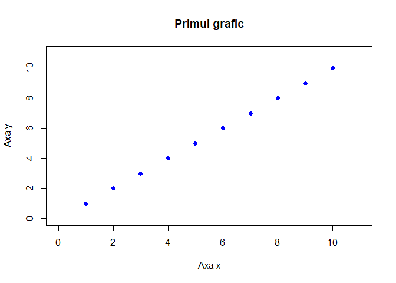
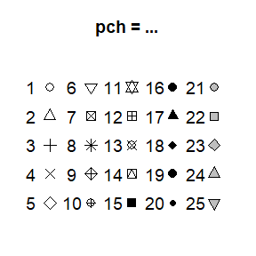
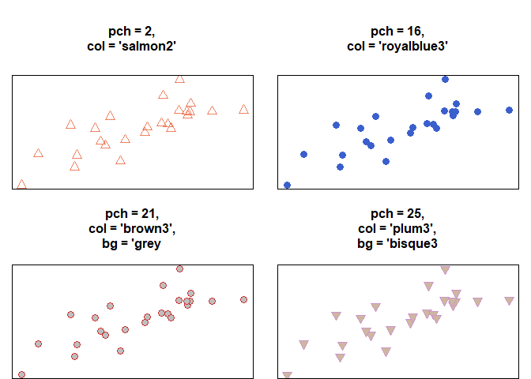
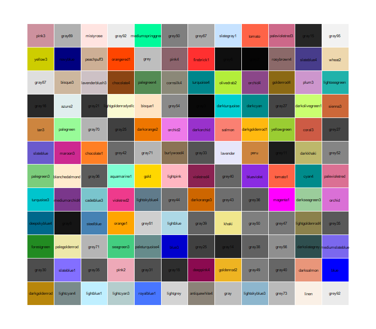
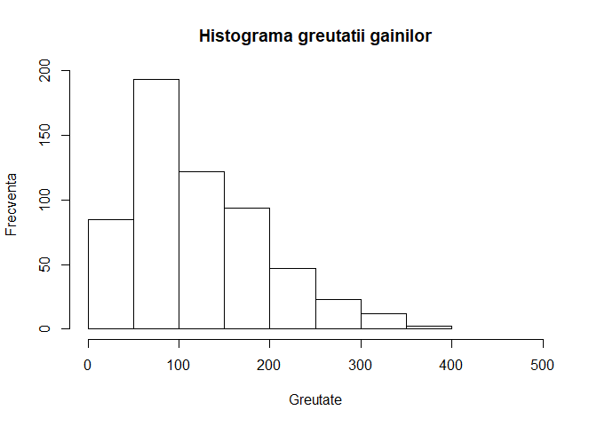
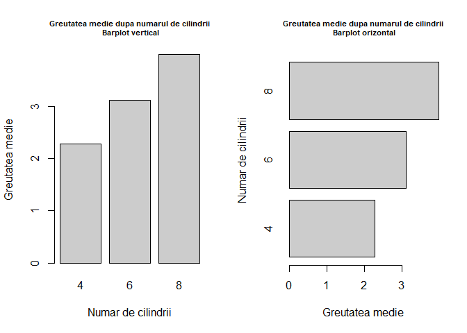
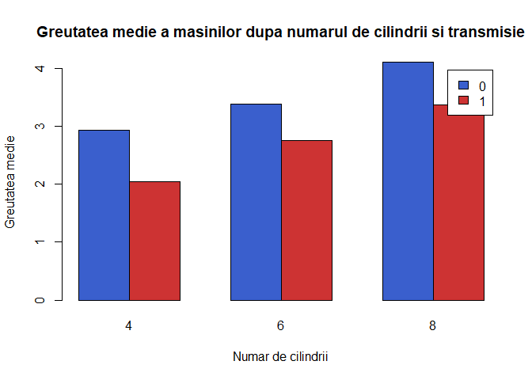
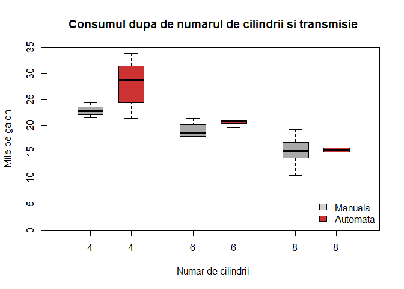
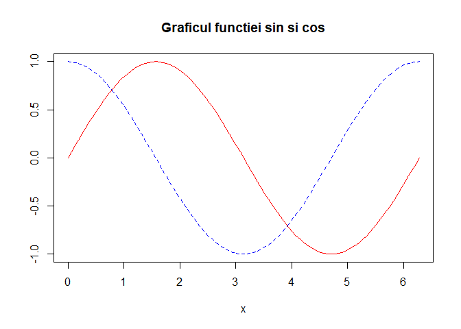
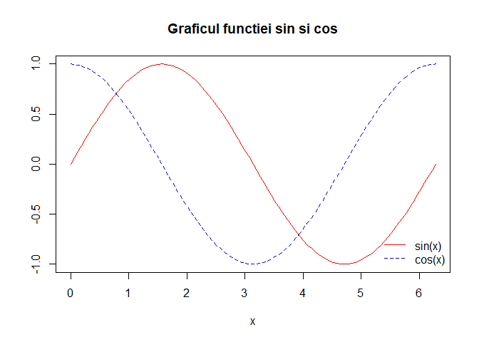

# Laborator 2

<script>
$(document).ready(function ()  {

    // move toc-ignore selectors from section div to header
    $('div.section.toc-ignore')
        .removeClass('toc-ignore')
        .children('h1,h2,h3,h4,h5').addClass('toc-ignore');

    // establish options
    var options = {
      selectors: "h1,h2,h3",
      theme: "bootstrap3",
      context: '.toc-content',
      hashGenerator: function (text) {
        return text.replace(/[.\\/?&!#<>]/g, '').replace(/\s/g, '_').toLowerCase();
      },
      ignoreSelector: ".toc-ignore",
      scrollTo: 60
    };
    options.showAndHide = false;
    options.smoothScroll = true;

    // tocify
    var toc = $("#TOC").tocify(options).data("toc-tocify");
});
</script>

Obiectivul acestui laborator este de a prezenta succint elementele de programare din programul [R](https://cran.r-project.org/), care este structura lor și cum le putem aplica. De asemenea, tot în acest laborator vom introduce și câteva elemente de grafică. 


# Elemente de programare în R

## Funcții

O *funcție* este un obiect în R care primește câteva obiecte de intrare (care se numesc *argumentele funcției*) și întoarce un obiect de ieșire. Structura unei funcții va avea următoarele patru părți:

  - *Nume*: Care este numele funcției? Aveți grijă să nu folosiți nume ale funcțiilor deja existente în R! 
  
  - *Argumente*: Care sunt datele de intrare pentru funcție? Puteți specifica oricâte date de intrare doriți!
  
  - *Corp sau acțiune*: Ce vreți să facă această funcție? Să traseze un grafic? Să calculeze o statistică? 
  
  - *Rezultat*: Ce vreți să vă întoarcă funcția? Un scalar? Un vector? Un data.frame?
  

```r
# Structura de baza a unei functii
NUME <- function(ARGUMENTE) {

  ACTIUNI

  return(REZULTAT)

}
```

Funcțiile în R sunt *obiecte de primă clasă* (first class objects), ceea ce înseamnă că ele pot fi tratate ca orice alt obiect din R. Este important de reținut că, în R, 

  - funcțiile pot fi date ca argumente pentru alte funcții (de exemplu familia de funcții `apply()`)
  
  - funcțiile pot fi imbricate (nested), cu alte cuvinte puteți crea funcții în interiorul altor funcții  

Mai jos avem un exemplu de funcție care nu are niciun argument și nu întoarce nicio valoare:


```r
f <- function() {
        ## Aceasta este o functie goala
}
## Functiile au clasa lor speciala 
class(f)  
[1] "function"

f()       
NULL
```

Următoarea funcție întoarce numărul de caractere al textului dat ca argument:


```r
f <- function(mesaj){
  chars = nchar(mesaj)
  chars
}

mes = f("curs de statistica si probabilitati")
mes
[1] 35
```

În fucția de mai sus nu am indicat nimic special pentru ca funcția să ne întoarcă numărul de caractere. În R, rezulatul unei funcții este întotdeauna ultima expresie evaluată. De asemenea există funcția `return()` care poate fi folosită pentru a întoarce o valoare explicită, dar de multe ori această funcție este omisă. 

Dacă utilizatorul nu specifică valoarea argumentului `mesaj` în funcția de mai sus atunci R-ul întoarce o eroare:


```r
f()
Error in nchar(mesaj): argument "mesaj" is missing, with no default
```

Acest comportament al funcției poate fi modificat prin definirea unei valori implicite (de default). Orice argument al funcției poate avea o valoare de default. 


```r
f <- function(mesaj = "Valoare de default"){
  chars = nchar(mesaj)
  chars
}

# Folosim valoarea implicita 
f()
[1] 18
# Folosim o valoare specificata
f("curs de statistica si probabilitati")
[1] 35
```

<div class="rmdexercise">
<p>Să presupunem că Jack Sparrow este convins că poate prezice cât aur va găsi pe o insulă folosind următoarea ecuație: <span class="math inline"><em>a</em><em>b</em> − 324<em>c</em> + log(<em>a</em>)</span>, unde a este aria insulei (în <span class="math inline"><em>m</em><sup>2</sup></span>), b este numărul de copaci de pe insulă iar c reprezintă cât de beat este pe o scală de la 1 la 10. Creați o funcție numită <code>Jacks.Money</code> care primește ca argumente a, b și c și întoarce valoare prezisă.</p>
</div>

Un exemplu ar fi 


```r
Jacks.Money(a = 1000, b = 30, c = 7)
[1] 27738.91
```

Argumentele funcțiilor în R pot fi potrivite după poziția lor sau după numele lor. Potrivirea după poziție înseamnă că R atribuie prima valoare primului argument, a doua valoare celui de-al doilea argument, etc. De exemplu atunci când folosim funcție `rnorm()`,


```r
str(rnorm)
function (n, mean = 0, sd = 1)  
set.seed(1234) # pentru repetabilitate
mydata <- rnorm(10, 3, 1) 
mydata
 [1] 1.7929343 3.2774292 4.0844412 0.6543023 3.4291247 3.5060559 2.4252600
 [8] 2.4533681 2.4355480 2.1099622
```

valoarea 10 este atribuită argumentului `n`, valoarea 3 argumentului `mean` iar valoarea 1 argumentului `sd`, toate prin potrivire după poziție.

Atunci când specificăm argumentele funcției după nume, ordinea acestora nu contează. De exemplu


```r
set.seed(1234)
rnorm(mean = 3, n = 10, sd = 1)
 [1] 1.7929343 3.2774292 4.0844412 0.6543023 3.4291247 3.5060559 2.4252600
 [8] 2.4533681 2.4355480 2.1099622
```

întoarce același rezultat cu cel obținut mai sus. 

De cele mai multe ori, argumentele cu nume sunt folositoare atunci când funcția are un șir lung de argumente și ne dorim să folosim valorile implicite pentru majoritatea dintre ele. De asemenea aceste argumente pot fi folositoare și atunci când știm numele argumentului dar nu și poziția în lista de argumente. Un exemplu de astfel de funcție este funcția `plot()`, care are multe argumente folosite în special pentru customizare:


```r
args(plot.default)
function (x, y = NULL, type = "p", xlim = NULL, ylim = NULL, 
    log = "", main = NULL, sub = NULL, xlab = NULL, ylab = NULL, 
    ann = par("ann"), axes = TRUE, frame.plot = axes, panel.first = NULL, 
    panel.last = NULL, asp = NA, ...) 
NULL
```

În R există un argument special notat `...`, care indică un număr arbitrar de argumente care sunt atribuite altor funcții din corpul funcției. Acest argument este folosit în special atunci când vrem să extindem o altă funcție și nu vrem să copiem întreaga listă de argumente a acesteia. De exemplu, putem crea o funcție de plotare în care specificăm tipul în prealabil   

```r
myplot <- function(x, y, type = "l", ...) {
        plot(x, y, type = type, ...)         ## Atribuie '...' functiei 'plot'
}
```

Argumentul `...` poate fi folosit (și este necesar) și atunci când numărul de argumente pe care îl ia funcția nu este cunoscut în prealabil. De exemplu să considerăm funcțiile `paste()` și `cat()`


```r
args(paste)
function (..., sep = " ", collapse = NULL) 
NULL
args(cat)
function (..., file = "", sep = " ", fill = FALSE, labels = NULL, 
    append = FALSE) 
NULL
```

Deoarece ambele funcții printează text în consolă combinând mai mulți vectori de caractere împreună, este imposibil ca acestea să cunoască în prealabil câți vectori de caractere vor fi dați ca date de intrare de către utilizator, deci primul argument pentru fiecare funcție este `...`.

Este important de menționat că toate argumentele care apar după argumentul `...` trebuie explicitate după nume. 


```r
paste("Curs", "Probabilitati si Statistica", sep = ":")
[1] "Curs:Probabilitati si Statistica"
```

## Structuri de control (`if-else`, `for`, etc.)

Structurile de control, în R, permit structurarea logică și controlul fluxului de execuție al unei serii de comenzi. Cele mai folosite structuri de control sunt:

- `if` și`else`: testează o condiție și acționează asupra ei

- `switch`: compară mai multe opțiuni și execută opțiunea pentru care avem potrivire

- `for`: execută o acțiune repetitivă de un număr fix de ori

- `while`: execută o acțiune repetitivă _cât timp_ o condiție este adevărată

- `repeat`: execută o acțiune repetitivă de o infinitate de ori (trebuie să folosim `break` pentru a ieși din ea)

- `break`: întrerupe execuția unei acțiuni repetitive

- `next`: sare peste un pas în executarea unei acțiuni repetitive

### `if-else`

Structura `if-else` este una dintre cele mai folosite structuri de control în R permițând testarea unei condiții și acționând în funcție de valoarea de adevăr a acesteia. 

Forma de bază a acestei structuri este

```r
if(<conditie>) {
        ## executa instructiuni atunci cand conditia este adevarata
} 
else {
        ## executa instructiuni atunci cand conditia este falsa
}
```
dar putem să avem și o serie de teste, de tipul 

```r
if(<conditie1>) {
        ## executa instructiuni
} else if(<conditie2>)  {
        ## executa instructiuni
} else {
        ## executa instructiuni
}
```

Avem următorul exemplu


```r
## Generam un numar uniform in [0,1]
x <- runif(1, 0, 10)  

if(x > 3) {
        y <- 10
} else {
        y <- 0
}
```

### Comanda `switch`

Comanda `switch` este folosită cu precădere atunci când avem mai multe alternative dintre care vrem să alegem. Structura generală a aceste comenzi este 

```r
switch (Expresie, "Optiune 1", "Optiune 2", "Optiune 3", ....., "Optiune N")
```
sau într-o manieră extinsă 

```r
switch (Expresie,
        "Optiune 1" = Executa aceste expresii atunci cand expresia se potriveste cu Optiunea 1,
        "Optiune 2" = Executa aceste expresii atunci cand expresia se potriveste cu Optiunea 2,
        "Optiune 3" = Atunci cand expresia se potriveste cu Optiunea 3, executa aceste comenzi,
        ....
        "Optiune N" = Atunci cand expresia se potriveste cu Optiunea N, executa aceste comenzi
)
```

Considerăm următorul exemplu


```r
number1 <- 30
number2 <- 20
# operator <- readline(prompt="Insereaza OPERATORUL ARITMETIC: ")
 
operator = "*"

switch(operator,
       "+" = print(paste("Suma celor doua numere este: ", number1 + number2)),
       "-" = print(paste("Diferenta celor doua numere este: ", number1 - number2)),
       "*" = print(paste("Inmultirea celor doua numere este: ", number1 * number2)),
       "^" = print(paste("Ridicarea la putere a celor doua numere este: ", number1 ^ number2)),
       "/" = print(paste("Impartirea celor doua numere este: ", number1 / number2)),
       "%/%" = print(paste("Catul impartirii celor doua numere este: ", number1 %/% number2)),
       "%%" = print(paste("Restul impartirii celor doua numere este: ", number1 %% number2))
)
[1] "Inmultirea celor doua numere este:  600"
```

### Bucle `for`

În R, buclele `for` iau o variabilă care se iterează și îi atribuie valori succesive dintr-un șir sau un vector. Buclele `for` au următoarea structură de bază 

```r
for (<i> in <vector>) {
        ## executa instructiuni
} 
```
de exemplu 


```r
for(i in 1:10) {
        print(i)
}
[1] 1
[1] 2
[1] 3
[1] 4
[1] 5
[1] 6
[1] 7
[1] 8
[1] 9
[1] 10
```

Următoarele trei bucle prezintă același comportament


```r
x <- c("a", "b", "c", "d")

for(i in 1:4) {
        ## Afiseaza fiecare elemnt din 'x'
        print(x[i])  
}
[1] "a"
[1] "b"
[1] "c"
[1] "d"
```

Funcția `seq_along()` este des întâlnită atunci când folosim bucle `for` deoarece crează un șir întreg folosind lungimea obiectului (în acest caz al lui `x`)


```r
## Genereaza un sir folosind lungimea lui 'x'
for(i in seq_along(x)) {   
        print(x[i])
}
[1] "a"
[1] "b"
[1] "c"
[1] "d"
```

De asemeanea putem folosi chiar pe `x` ca vector de indexare 


```r
for(letter in x) {
        print(letter)
}
[1] "a"
[1] "b"
[1] "c"
[1] "d"
```

Atunci când folosim comenzile din buclele `for` pe o singură linie nu este necesară folosirea parantezelor `{}`


```r
for(i in 1:4) print(x[i])
[1] "a"
[1] "b"
[1] "c"
[1] "d"
```

Putem folosi buclele `for` și imbricat (nested)

```r
x <- matrix(1:6, 2, 3)

for(i in seq_len(nrow(x))) {
        for(j in seq_len(ncol(x))) {
                print(x[i, j])
        }   
}
```

### Bucle de tip `while`

Acțiunile repetitive de tip `while` încep prin testarea unei condiții și în cazul în care aceasta este adevărată atunci se execută corpul comenzii. Odată ce corpul buclei este executat, condiția este testată din nou până când devine falsă (se poate ca bucla `while` să rezulte într-o repetiție infinită !). Structura generală a acestei bucle este 

```r
while(<conditie>) {
        ## executa instructiuni
} 
```

Considerăm următorul exemplu 


```r
count <- 0
while(count < 4) {
        print(count)
        count <- count + 1
}
[1] 0
[1] 1
[1] 2
[1] 3
```

Uneori putem testa mai multe condiții (acestea sunt întotdeauna evaluate de la stânga la dreapta)


```r
z <- 5
set.seed(123)

while(z >= 3 && z <= 10) {
        coin <- rbinom(1, 1, 0.5) # arunc cu banul
        
        if(coin == 1) {  ## random walk
                z <- z + 1
        } else {
                z <- z - 1
        } 
}
print(z)
[1] 11
```

### Bucle de tip `repeat`

Acest tip de acțiuni repetitive nu sunt foarte des întâlnite, cel puțin în statistică sau analiză de date. O situație în care ar putea să apară este atunci când avem un algoritm iterativ în care căutăm o soluție și nu vrem să oprim algoritmul până când soluția nu este suficient de bună. 


```r
x0 <- 1
tol <- 1e-8

repeat {
        x1 <- o_functie_definita()
        
        if(abs(x1 - x0) < tol) {  ## este suficient de buna solutia 
                break
        } else {
                x0 <- x1
        } 
}
```

### Comezile `break` și `next`

Comanda `next` este folosită pentru a sării un pas într-o buclă 


```r
for(i in 1:10) {
        if(i <= 5) {
                ## sari peste primele 5 iteratii
                next                 
        }
  print(i)
        
}
[1] 6
[1] 7
[1] 8
[1] 9
[1] 10
```

Comanda `break` este folosită pentru a părăsi o buclă imediat


```r
for(i in 1:10) {
      print(i)

      if(i > 5) {
              ## opreste dupa 5 iteratii
              break  
      }		
}
[1] 1
[1] 2
[1] 3
[1] 4
[1] 5
[1] 6
```

# Elemente de grafică în R

Graficele reprezintă, în general, un instrument folositor pentru vizualizarea rezultatelor unei analize dar și un mod prin care se poate verifica dacă am obținut ce ni s-a cerut. Este important să folosim opțiunile corecte atunci când trasăm un grafic, de multe ori valorile predefinite putând conduce la figuri eronate. În tabelul de mai jos avem listate principalele instrucțiuni grafice

| Funcția | Scurtă descriere |
|:--------------------------|:------------------------|
| `plot` | O funcție generică folosită pentru plotarea unui obiect (puncte, curbe, etc.) |
| `barplot` | Trasează un grafic de bare orizontale sau verticale (folosit pentru variabile discrete) |
| `hist` | Desenează histograme cu frecvanțe sau probabilități |
| `boxplot` | Desenează una sau mai multe boxplot-uri în paralel |
| `pie` | Desenează o diagramă de tip plăcintă |

Table: Tabelul 1. Functii grafice uzuale in R

Metodele grafice din R nu se limitează la cele din tabelul de mai sus. De exemplu, pachetul `ggplot2`^[Vizitați pagina [http://ggplot2.tidyverse.org/reference/](http://ggplot2.tidyverse.org/reference/) pentru mai multe detalii] este foarte răspândit la ora actuală deoarece pune la dispoziție o serie de instrumente grafice (folosind o gramatică de grafice) cu ajutorul cărora se pot produce figuri de calitate deosebită (ce se folosesc în special pentru publicații științifice).

În continuare vom prezenta o parte din funcțiile cel mai des folosite pentru trasarea graficelor în R împreună cu proprietățile de bază ale acestora.

## Funcția `plot`

Cea mai folosită funcție (high-level) de plotare în R este funcția `plot()`. Aceasta permite trasarea unei diagrame de împrăștiere (*scatterplot*) între doi vectori `x` și `y`, unde vectorul `x` indică valorile pe axa abscisei iar `y` pe axa ordonatelor. 

Argumentele principale ale funcției `plot()` se găsesc în tabelul următor.

| Argument | Descriere | 
|:------------|:-------------------------------------------------|
|`x, y`| Vectori de aceeași lungime care specifică valorile coordonatelor de pe x și de pe y|
|`type`| Tipul de grafic: `"l"` reprezintă linii, `"p"` reprezintă puncte, `"b"` reprezintă și linii și puncte, `"n"` înseamnă că nu trasează nimic|
|`main`, `xlab`, `ylab`| String-uri folosite pentru titlul graficului și etichetarea axelor x și y|
|`xlim`, `ylim`| Limitele pe axa x și y. De exemplu, `xlim = c(0, 100)` va seta valoarea minimă și maximă de pe axa x la 0 și respectiv 100.|
|`pch` | Un număr întreg care denotă tipul de simbol folosit pentru trasarea punctelor (vezi `?points`), sau un șir de caractere care specifică simbolurile ca text. De exemplu, `pch = 21` va crea un cerc colorat cu 2 culori, iar `pch = "P"` va trasa caracterul `"P"` pentru fiecare punct. |
|`col`| Culoarea principală a simbolurilor desenate. De exemplu `col = "blue"` va trasa simbolurile în culoarea albastră. |
|`lty`| Tipul de linie folosit. De exemplu `lty = 1` reprezintă o linie solidă pe când `lty = 2` reprezintă o linie întreruptă. |
|`lwd`| Grosimea liniei folosite, valoare prestabilită este `lwd = 1`. |
|`cex`| Un vector numeric folosit pentru a specifica mărimea simbolurilor trasate. Valoarea prestabilită este 1. De exemplu `cex = 4` va face punctele foarte mari pe când `cex = .5` le va face mai mici. |

Table: Tabelul 2. Argumentele principale ale functiei plot()


```r
plot(x = 1:10,                         # x-coordonate
     y = 1:10,                         # y-coordinate
     type = "p",                       # puncte (nu linii)
     main = "Primul grafic",
     xlab = "Axa x",
     ylab = "Axa y",
     xlim = c(0, 11),                  # Valorile min si max pe axa x 
     ylim = c(0, 11),                  # Valorile min si max pe axa y
     col = "blue",                     # Culoarea punctelor
     pch = 16,                         # Tipul simbolului 
     cex = 1)                           # Marimea simbolului 
```



În afară de vectorii `x` și `y` toate celelalte argumente sunt opționale, dacă nu sunt specificate atunci R-ul folosește valorile prestabilite. De exemplu dacă nu specificăm limitele `xlim` și `ylim`, R-ul calculează aceste limite astfel încât toate punctele să fie încadrați în interiorul graficului.

<div class="rmdexercise">
<p>Trasați următoarele diagrame de împrăștiere:</p>
<p><code>x &lt;- seq(0, 1, 0.1); plot(x, x - x * x + 2)</code> <code>plot(x, x - x * x + 2, type = &quot;l&quot;); plot(x, x - x * x + 2, type = &quot;b&quot;, pch = 19)</code></p>
</div>

Tipul de simbol pe care vrem să-l folosim atunci când trasăm un grafic este specificat prin argumentul `pch`. Figura de mai jos ne prezintă tipurile simboluri pe care atunci când atribuim argumentului `pch` o valoare întreagă.   


<div class="figure" style="text-align: center">

<p class="caption">Figura 1. Tipurile de simboluri asociate parametrului pch.</p>
</div>

Următorul exemplu ilustrează câteva tipuri de simboluri:




## Culori

Majoritatea funcțiilor de desenare au un argument în care pot specifica culoarea elementelor pe care vrem să le trasăm, de cele mai multe ori acesta este `col`. Cel mai ușor mod de a introduce o culoare este prin specificarea numelui acesteia, de exemplu `col = 'red'` este culoarea roșie. Figura 1 prezintă 144 de culori alese la întâmplare din totalul de 657 câte există în R. 

<div class="figure" style="text-align: center">

<p class="caption">Figura 2. 144 de culori din totalul de 657 din R</p>
</div>

Pentru a vedea toate culorile din R putem rula comanda `colors()`.

## Funcția `hist`

Histograma^[Histograma este un estimator neparametric al densității.] reprezintă metoda grafică, cea mai comună, de reprezentare a repartiției unui vector numeric. Pentru a crea o histogramă în R folosim funcția `hist()` în care argumentul principal este un vector numeric. Tabelul de mai jos prezintă argumentele principale ale funcției `hist`.

| Argument| Descriere| 
|:------------|:-------------------------------------------------|
|`x`| Vector de valori|
|`breaks`| Cum să calculăm mărimea bin-urilor (vezi `?hist`)|
|`freq`| Opțiune pentru trasarea histogramei de frecvență și de probabilități, `freq = TRUE` arată frecvențele, `freq = FALSE` arată probabilitățile.|
|`col`, `border`| Culoarea interioară a bin-urilor (`col`) și culoarea conturului lor (`border`)|

Table: Argumentele funcției `hist()`

Putem crea o histogramă folosind setul de date `ChickWeight` (`?ChickWeight`)


```r
hist(x = ChickWeight$weight,
     main = "Histograma greutatii gainilor",
     xlab = "Greutate",
     ylab = "Frecventa",
     xlim = c(0, 500))
```



Putem modifica histograma de mai sus, schimbând numărul de bin-uri și culoarea acestora:


```r
hist(x = ChickWeight$weight,
     main = "O histograma mai colorata",
     xlab = "Greutate",
     ylab = "Frecventa",
     breaks = 20, # 20 Bins
     xlim = c(0, 500),
     col = "skyblue", # Culoarea de umplere
     border = "royalblue3") # Culoarea conturului
```


Dacă vrem să ilustrăm două histograme pe aceeași figură, pentru a evidenția repartiția după două clase, putem folosi argumentul `add = TRUE` la cel de-al doilea plot:


```r
hist(x = ChickWeight$weight[ChickWeight$Diet == 1],
     main = "Doua histograme pe acelasi grafic",
     xlab = "Greutate",
     ylab = "Frecventa",
     breaks = 20,
     xlim = c(0, 500),
     col = gray(0, .5))

hist(x = ChickWeight$weight[ChickWeight$Diet == 2],
     breaks = 30,
     add = TRUE, # Adauga graficul la cel de dinainte
     col = gray(1, .8))
```


## Funcția `barplot`

Funcția `barplot` este folosită în special atunci când avem de-a face cu o variabilă discretă. Argumentul principal al funcției este `height`, un vector numeric care va genera înălțimea fiecărei bare. Pentru a adăuga nume sub fiecare bară putem folosi argumentul `names.arg`. 

De exemplu, folosind setul de date `mtcars` putem să afișăm greutatea medie a mașinilor în funcție de numărul de cilindrii:


```r
par(mfrow = c(1, 2))

weight_cars = aggregate(wt ~ cyl, 
                        data = mtcars, 
                        FUN = mean)

barplot(height = weight_cars$wt,
        names.arg = weight_cars$cyl,
        xlab = "Numar de cilindrii",
        ylab = "Greutatea medie",
        main = "Greutatea medie dupa numarul de cilindrii\n Barplot vertical",
        col = "grey80", 
        cex.main = 0.7)

barplot(height = weight_cars$wt,
        names.arg = weight_cars$cyl,
        horiz = TRUE,
        ylab = "Numar de cilindrii",
        xlab = "Greutatea medie",
        main = "Greutatea medie dupa numarul de cilindrii\n Barplot orizontal",
        col = "grey80", 
        cex.main = 0.7)
```



<div class="rmdexercise">
<p>Folosind setul de date <code>ChickWeight</code> afișați, cu ajutorul funcției <code>barplot</code>, greutatea medie a găinilor în raport cu numărul de zile de la naștere.</p>
</div>

De asemenea putem crea un barplot clusterizat în funcție de mai multe grupuri de date. De exemplu să presupunem că vrem să vedem dacă există diferențe între greutatea medie a mașinilor (din setul de date `mtcars`) care au transmisie manuală sau automată și numărul de cilindrii. 


```r
# calculam greutatea medie dupa numarul de cilindrii si transmisie 
carWeight_cyl_am = aggregate(mtcars$wt, by = list(mtcars$cyl, mtcars$am), FUN = mean) 

# transformam rezultatul sub forma de matrice
carWeight_cyl_am = as.matrix(carWeight_cyl_am)
carWeight_cyl_am
     Group.1 Group.2        x
[1,]       4       0 2.935000
[2,]       6       0 3.388750
[3,]       8       0 4.104083
[4,]       4       1 2.042250
[5,]       6       1 2.755000
[6,]       8       1 3.370000

# aducem la forma necesara pentru barplot
carWeight = matrix(carWeight_cyl_am[,3], nrow = 3)
colnames(carWeight) = unique(carWeight_cyl_am[,2])
rownames(carWeight) = unique(carWeight_cyl_am[, 1])

carWeight = t(carWeight)

barplot(carWeight, 
        beside = TRUE,
        legend.text = TRUE, 
        col = c("royalblue3", "brown3"),
        main = "Greutatea medie a masinilor dupa numarul de cilindrii si transmisie",
        xlab = "Numar de cilindrii",
        ylab = "Greutatea medie")
```



## Funcția `boxplot`

Pentru a vedea cât de bine sunt repartizate datele în setul de date putem folosi funcția `boxplot` (box and whisker plot - cutie cu mustăți). Această funcție prezintă într-o manieră compactă modul în care este repartizată o variabilă. Această metodă grafică prezintă principalii indicatori de poziție ai variabilei studiate: cuartilele de ordin 1 și 3 ($Q_1$, $Q_3$) care delimitează cutia ($IQR = Q_3-Q_1$) și cuartila de ordin 2 sau mediana (linia din interiorul cutiei). Mustățile sunt calculate în modul următor: mustața superioară este determinată de valoarea celei mai mari observații care este mai mică sau egală cu $Q_3 + 1.5 IQR$ iar mustața inferioară este valoarea celei mai mici observații mai mari sau egale cu $Q_1-1.5IQR$. Valorile din afara cutiei cu mustăți se numesc valori aberante.

Principalele argumente ale funcției `boxplot` se regăsesc în tabelul următor, pentru mai multe detalii apelați `?boxplot`.

| Argument| Descriere| 
|:------------|:-------------------------------------------------|
| `formula` | O formulă de tip `y ~ grp`, unde `y` este variabila investigată iar `grp` este variabila care descrie grupurile după care vrem să trasăm grafiul |
| `data` | Un data frame (sau listă) în care variabilele din formulă sunt definite |
| `subset` | Un vector care specifică o submulțime a observațiilor |
| `x` | Un vector care specifică valorile ce urmează să fie trasate |
| `horizontal` | O valoare logică care indică dacă trasăm boxplot-urile vertical (`FALSE`) sau orizontal (`TRUE`) |
| `add` | O valoare logică prin care se permite adăugarea graficului la unul deja existent |

Table: Tabelul 3. Principalele argumente ale functiei boxplot.

Următorul exemplu ne prezintă relația dintre consum (`mpg`) și numărul de cilindrii (`cyl`) în cazul mașinilor din setul de date `mtcars`.


```r
boxplot(mpg ~ cyl, 
        data = mtcars, 
        xlab = "Numar de cilindrii",
        ylab = "Mile pe galon", 
        main = "Consumul in functie de numarul de cilindrii")
```


Putem să vedem această relație și în raport cu tipul de transmisie.


```r
boxplot(mpg ~ cyl, 
        data = mtcars, 
        subset = am == 0,
        boxwex = 0.25, 
        at = 1:3 - 0.2,
        col = "darkgrey",
        xlab = "Numar de cilindrii",
        ylab = "Mile pe galon", 
        main = "Consumul dupa de numarul de cilindrii si transmisie",
        xlim = c(0.5, 3.5), 
        ylim = c(0, 35),
        yaxs = "i")

boxplot(mpg ~ cyl, 
        data = mtcars, 
        subset = am == 1,
        add = TRUE,
        boxwex = 0.25, 
        at = 1:3 + 0.2,
        col = "brown3")

legend("bottomright" ,c("Manuala", "Automata"),
       fill = c("lightgray", "brown3"), bty = "n")
```



## Funcții pentru adăugarea unor elemente la un grafic 

Funcțiile (low-level) din această secțiune sunt folosite pentru a adăuga elemente, de tipul linii, puncte, text la un grafic deja existent.

|Funcția               |rezultatul                   |
|:---------------------|:---------------------------|
|`points(x, y)`      |Adaugă puncte la un grafic.               |
|`abline()`, `segments()`      |Adaugă linii sau segmente la un grafic existent.               |
|`arrows()`      |Adaugă săgeți.             |
|`curve()`      |Adaugă o curbă care reprezintă graficul unei funcții.              |
|`rect()`,`polygon()`      |Adaugă un dreptunghi sau un poligon oarecare.            |
|`text()`, `mtext()`      |Adaugă text la o figură.               |
|`legend()`      |Adaugă legenda.           |
|`axis()`      |Adaugă o axă.            |

Table: Tabelul 4. Functii low-level uzuale

Pentru a adăuga noi puncte la un grafic deja existent putem folosi funcție `points()`. Pentru a vedea toate argumentele acestei funcții apelați `?points`. 

Să considerăm următorul exemplu în care trasăm diagrama de împrăștiere după consum (`mpg`) și putere (`hp`) pentru mașinile din setul de date `mtcars` în raport cu tipul de transmisie. 


```r
plot(x = mtcars$mpg[mtcars$am == 0], 
     y = mtcars$hp[mtcars$am == 0], 
     xlab = "Mile pe galon",
     ylab = "Cai putere", 
     main = "Consum vs Cai putere dupa transmisie",
     pch = 16, 
     col = "darkgrey")

points(x = mtcars$mpg[mtcars$am == 1], 
      y = mtcars$hp[mtcars$am == 1], 
      pch = 16, 
      col = "brown3")
```


Dacă vrem să adăugăm linii drepte la un grafic putem folosi comanda `abline()` sau `segments()`. De exemplu în figura de mai sus vrem să adăugăm o linie verticală și una orizontală care să marcheze media variabilelor de pe axa x și y.


```r
plot(x = mtcars$mpg, 
     y = mtcars$hp, 
     xlab = "Mile pe galon",
     ylab = "Cai putere", 
     main = "Consum vs Cai putere",
     pch = 16, 
     col = "darkgrey")

abline(h = mean(mtcars$hp), lty = 2)
abline(v = mean(mtcars$mpg), lty = 2)
```


Pentru a adăuga numele mașinilor cu transmisie automată în fiecare punct putem folosi comanda `text()`. Argumentele principale ale acestei funcții sunt `x`, `y` care descriu coordonatele etichetelor și `labels` care reprezintă etichetele.


```r
plot(x = mtcars$mpg, 
     y = mtcars$hp, 
     xlab = "Mile pe galon",
     ylab = "Cai putere", 
     main = "Consum vs Cai putere",
     pch = 16, 
     col = "darkgrey")

abline(h = mean(mtcars$hp), lty = 2)
abline(v = mean(mtcars$mpg), lty = 2)

text(x = mtcars$mpg[mtcars$am == 1], 
     y = mtcars$hp[mtcars$am == 1],
     labels = rownames(mtcars[mtcars$am == 1, ]), 
     pos = 3, 
     cex = 0.5)
```


Funcția `curve()` permite trasarea/adăugarea unei linii care descrie o funcție. Printre argumentele funcției regăsim `expr` care reprezintă expresia funcției care depinde de `x` (se pot folosi și funcții customizate), `from, to` care reprezintă intervalul de valori pentru `x` și `add` care permite adăugarea unei curbe la un grafic existent.


```r
curve(expr = sin(x),
      from = 0,
      to = 2*pi, 
      ylab = "", 
      main = "Graficul functiei sin si cos",
      col = "red")

curve(expr = cos(x),
      from = 0,
      to = 2*pi,
      add = TRUE,
      col = "blue", 
      lty = 2)
```



Atunci când vrem să adăugăm o legendă la un grafic folosim funcția `legend()`. Argumentele acestei funcții se regăsesc în tabelul de mai jos.

|Argument               |Rezultat                   |
|:---------|:----------------------------------------------------|
|`x, y`      |Coordonatele legendei - de exemplu, `x = 0, y = 0` va pune legenda la coordonatele (0, 0). Alternativ, putem indica poziția unde vrem legenda (i.e. `"topright"`, `"topleft"`). |
|`legend`      |Un vector de caractere care precizează textul care vrem să apară în legendă.|
|`pch, lty, lwd, col, pt.bg, ...`      |Argumente grafice adiționale (pentru detalii apelați `?legend`).|

Table: Tabelul 5. Argumentele functiei legend()

Ca exemplu să considerăm graficele de funcții de mai sus la care vrem să specificăm care grafic corespunde funcției $sin$ și care funcției $cos$:


```r
curve(expr = sin(x),
      from = 0,
      to = 2*pi, 
      ylab = "", 
      main = "Graficul functiei sin si cos",
      col = "red")

curve(expr = cos(x),
      from = 0,
      to = 2*pi,
      add = TRUE,
      col = "blue", 
      lty = 2)

legend("bottomright", 
       legend = c("sin(x)", "cos(x)"), 
       col = c("red", "blue"),
       lty = c(1, 2),
       bty = "n")
```



## Salvarea figurilor 

Odată ce am creat un grafic putem să-l salvăm într-un fișier extern. Pentru aceasta folosim funcțiile `pdf()`, `png()` sau `jpeg()`. Aceste funcții vor salva figura ca fișier de tip .pdf, .png sau .jpeg.

|Argument               |Rezultat                   |
|:---------|:----------------------------------------------------|
|`file`      | Directorul și numele fișierului sub formă de șir de caractere. De exemplu, pentru a salva un grafic pe desktop scriem `file = "/Users/.../Desktop/plot.pdf"` pentru un fișier pdf.|
|`width, height`      | Dimensiunea graficului final în inchi.   |
|`dev.off()`      | Acesta nu este un argument al funcțiilor `pdf()` și `jpeg()`. Trebuie executat acest cod după ce trasarea graficului a fost efectuată pentru a finaliza crearea imaginii.|

Table: Tabelul 6. Argumente pentru functiile pdf, jpeg si png

Pentru a salva o imagine avem de parcurs următorii pași:

1. Execută funcțiile `pdf()` sau `jpeg()` cu argumentele `file, width, height`.
2. Execută codul care generează figura (e.g. `plot(x = 1:10, y = 1:10)`)
3. Completează scrierea fișierului prin execuția comenzii `dev.off()`. Această comandă spune R-ului că am finalizat crearea fișierului.


```r
# Pasul 1
pdf(file = "/Users/.../Desktop/MyPlot.pdf",   # directorul cu fisierul 
    width = 4, # latimea in inchi
    height = 4) # inaltimea in inchi

# Pasul 2
plot(x = 1:10, 
     y = 1:10)
abline(v = 0) 
text(x = 0, y = 1, labels = "Ceva text aleator")

# Pasul 3
dev.off()
```

