# Laborator 4

<script>
$(document).ready(function ()  {

    // move toc-ignore selectors from section div to header
    $('div.section.toc-ignore')
        .removeClass('toc-ignore')
        .children('h1,h2,h3,h4,h5').addClass('toc-ignore');

    // establish options
    var options = {
      selectors: "h1,h2,h3",
      theme: "bootstrap3",
      context: '.toc-content',
      hashGenerator: function (text) {
        return text.replace(/[.\\/?&!#<>]/g, '').replace(/\s/g, '_').toLowerCase();
      },
      ignoreSelector: ".toc-ignore",
      scrollTo: 60
    };
    options.showAndHide = false;
    options.smoothScroll = true;

    // tocify
    var toc = $("#TOC").tocify(options).data("toc-tocify");
});
</script>

Obiectivul acestui laborator este de a rezolva câteva probleme de teoria probabilităților cu ajutorul limbajului R.  


# Generarea unei variabile aleatoare discrete

<div class="rmdexercise">
<p>Definiți o funcție care să genereze un eșantion de talie <span class="math inline"><em>n</em></span> dintr-o distribuție discretă definită pe mulțimea <span class="math inline">{<em>x</em><sub>1</sub>, …, <em>x</em><sub><em>N</em></sub>}</span> cu probabilitățile <span class="math inline">{<em>p</em><sub>1</sub>, …, <em>p</em><sub><em>N</em></sub>}</span>. Pentru început încercați cu v.a. de tip Bernoulli.</p>
</div>

Avem următoarea funcție:


```r
GenerateDiscrete = function(n = 1, x, p, err = 1e-15){
  # talia esantionului
  # x alfabetul 
  # p probabilitatile
  lp = length(p)
  lx = length(x)
  
  # verify if x and p have the same size 
  if(abs(sum(p)-1)>err | sum(p>=0)!=lp){
    
    stop("suma probabilitatilor nu este 1 sau probabilitatile sunt mai mici decat 0")
    
  }else if(lx!=lp){
    
    stop("x si p ar trebui sa aiba aceeasi marime")
    
  }else{
    out = rep(0, n)
    
    indOrderProb = order(p, decreasing = TRUE) # index
    pOrdered = p[indOrderProb] # rearrange the values of the probabilities 
    xOrdered = x[indOrderProb] # rearramnge the values of x
    
    # u = runif(n) # generate n uniforms
    pOrderedCS = cumsum(pOrdered)
    
    for (i in 1:n){
      u = runif(1)
      
      k = min(which(u<=pOrderedCS))
      out[i] = xOrdered[k]
    }
  }
  
  return(out)
}
```

și pentru a o putea testa să considerăm cazul repartițiilor Poisson și Geometrică:

  a) Poisson  
  

```r
# Poisson
hist(GenerateDiscrete(10000, x = 0:50, 
                      p = dpois(0:50, 5)), 
     probability = TRUE, 
     breaks = seq(-0.5,49.5, by = 1), 
     xlim = c(-0.5, 20),
     col = "grey80",
     main = "Repartitia Poisson",
     xlab = "X",
     ylab = "Densitatea")

lines(0:50,
      dpois(0:50, 5), 
      type = "l", 
      col = "brown3", lty = 2, lwd = 2)
```

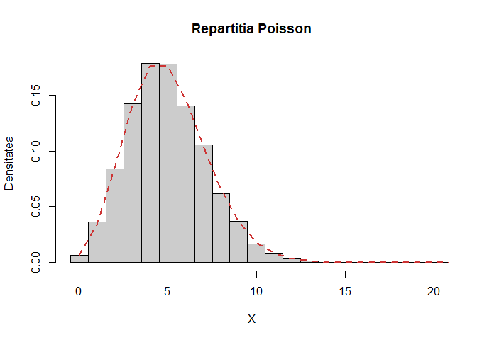

  b) Geometrică
  

```r
# Geometric
hist(GenerateDiscrete(10000, x = 0:100, 
                      p = dgeom(0:100, 0.3)), 
     probability = TRUE, 
     breaks = seq(-0.5,99.5, by = 1),
     xlim = c(-0.5, 20),
     col = "grey80",
     main = "Repartitia Geometrica",
     xlab = "X",
     ylab = "Densitatea")

lines(0:100,
      dgeom(0:100, 0.3), 
      type = "l", 
      col = "brown3", lty = 2, lwd = 2)
```

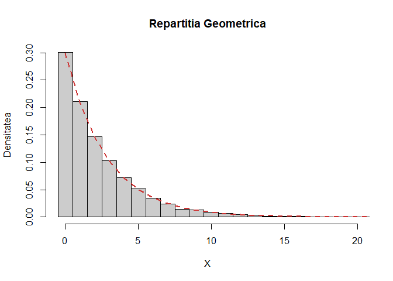

# Funcția de repartiție pentru variabile aleatoare

<div class="rmdexercise">
<p>Scrieți o funcție în <code>R</code> care să traseze graficul funcției de repartitie a unei distribuții date. Verificați și documentația funcției <code>ecdf</code>.</p>
</div>

Definim următoarea funcție:


```r
cdfPlot = function(dist, title, err = 1e-10){
  # dist - repartitia discreta (sau discretizata)
  lp = length(dist)
  
  if (abs(sum(dist)-1)>err | sum(dist>=0)!=lp){
    stop("Eroare: vectorul de probabilitati nu formeaza o repartitie")
  }else{
    x = 0:(lp-1) # ia valori in 1:lp
    cp = cumsum(dist)
    
    plot(x, cp, type = "s", lty = 3, 
         xlab = "x", 
         ylab = "F", 
         main = paste("Functia de repartitie:", title), 
         ylim = c(0,1), 
         col = "grey",
         bty = "n")
    abline(h = 0, lty = 2, col = "grey")
    abline(h = 1, lty = 2, col = "grey")
    for(i in 1:(lp-1)){
      lines(c(x[i], x[i+1]), c(cp[i], cp[i]), lwd = 2)
    }
    points(x,cp, col = "black", pch = 20, cex = 0.85)
  }
}
```

Pentru a testa această funcție să considerăm repartițiile discrete: 

  a) Binomiala: $\mathcal{B}(100, 0.3)$


```r
cdfPlot(dist = dbinom(0:100, 100, 0.3), title = "B(100,0.3)")
```

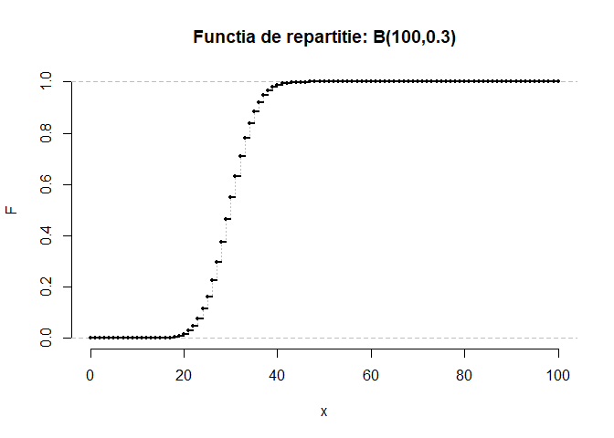

  b) Poisson: $Pois(0.3)$ și $Pois(5)$


```r
par(mfrow = c(1, 2))

cdfPlot(dist = dpois(0:20, 0.3), title = "Pois(0.3)")
cdfPlot(dist = dpois(0:50, 5), title = "Pois(5)")
```

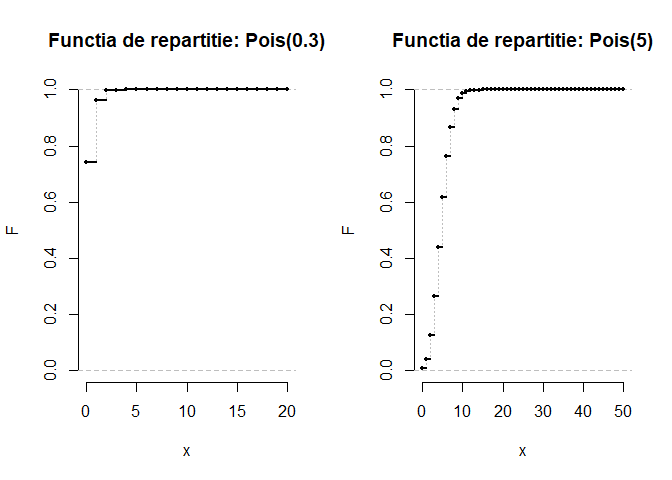

  c) Geometrica: $Geom(0.3)$


```r
par(mfrow = c(1,1))
cdfPlot(dist = dgeom(0:100, 0.3), title = "Geom(0.3)")
```

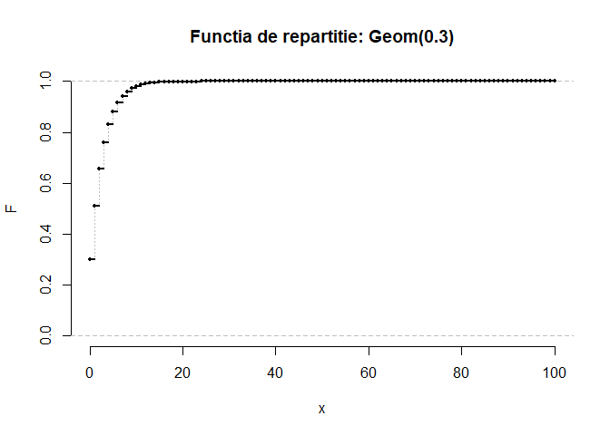

și repartiția continuă: 

  a) Normala: $\mathcal{N}(0,1)$


```r
cdfPlot(dist = dnorm(seq(-5,5,0.01))/100, title = "N(0,1)", err = 1e-1)
```

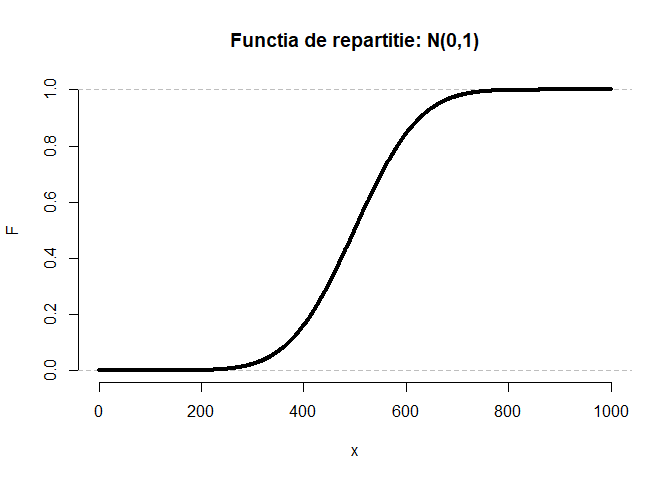

# Aproximarea Poisson și Normală a Binomialei

<div class="rmdexercise">
<p>Ilustrați grafic aproximarea Poisson și normală a repartiției binomiale.</p>
</div>

Scopul acestei probleme este de a ilustra grafic aproximarea legii binomile cu ajutorul repartiției Poisson și a a normalei. 

Pentru o v.a. $X$ repartizată binomial de parametrii $n$ și $p$ ($q = 1-p$) funcția de masă este 

$$
f_{n,p}(k)=\mathbb{P}(X=k)=\binom{n}{k}p^k(1-p)^{n-k}
$$ 

iar funcția de repartiție este 

$$
F_{n,p}(k) = \mathbb{P}(X\leq k) = \sum_{x=0}^{k}\binom{n}{x}p^x(1-p)^{n-x}.
$$ 

## Aproximarea Poisson

Dacă $n\to\infty$ ($n$ este mare) și $p\to 0$ ($p$ este mic, evenimentele sunt rare) așa încât $np\to\lambda$ atunci se poate verifica cu ușurință că 

$$
f_{n,p}(k)\approx f_{\lambda}(k)=e^{-\lambda}\frac{\lambda^k}{k!}.
$$

Mai exact, avem că dacă $k$ este mic în comparație cu $n$ atunci

\begin{align*}
  \binom{n}{k}p^k &= \frac{n(n-1)\cdots(n-k+1)}{k!}\left(\frac{\lambda}{n}\right)^k \\
                  &= 1\times\left(1-\frac{1}{n}\right)\times\cdots\times\left(1-\frac{k-1}{n}\right)\frac{\lambda^k}{k!}\\
                  &\approx \frac{\lambda^k}{k!}
\end{align*}

și 

$$
  \log(1-p)^{n-k} = (n-k)\log\left(1-\frac{\lambda}{n}\right)\approx n\left(-\frac{\lambda}{n}\right)
$$

ceea ce conduce la $(1-p)^{n-k}\approx e^{-\lambda}$. Combinând cele două aproximări obținem 

$$
  \binom{n}{k}p^k(1-p)^{n-k} \approx \frac{\lambda^k}{k!}e^{-\lambda}.
$$

Pentru a ilustra acuratețea acestei aproximări vom folosi instrucțiunile `R` `dbinom` și `dpois` care permit calcularea funcțiilor de masă $f_{n,p}(k)$ și $f_{\lambda}(k)$.  


```r
AppBP <- function(n,p,a,b){
    lambda <- n*p
    x<- matrix(numeric((b-a+1)*3),ncol=3,
               dimnames = list(a:b,c("Binomiala","Poisson","Eroarea Absoluta")))
    x[,1]<-dbinom(a:b,n,p)
    x[,2]<-dpois(a:b,lambda)
    x[,3]<-abs(x[,1]-x[,2])
    error <- max(abs(x[,3]))
    
    return(list(x = as.data.frame(x), error = error, param = c(n, p, lambda)))
}

# Functie care ilustreaza aproximarea Binomial vs. Poisson

pl <- function(n,p,a,b){
    clr<-c("#E69F00", "#56B4E9")# culori
    lambda <- n*p
    mx <- max(dbinom(a:b,n,p))
    plot(c(a:b,a:b), c(dbinom(a:b,n,p), dpois(a:b,lambda)), type="n", 
         main = paste("Approx. Poisson pentru binomiala\n n=", 
                      n, ", p = ", p, ", lambda = ",lambda), 
         ylab = "Probabilitatea", xlab="x",
         bty = "n")
    points((a:b)-.15, dbinom(a:b,n,p), type = "h",col = clr[1], lwd = 8)
    points((a:b)+.15, dpois(a:b,lambda), type = "h",col = clr[2], lwd = 8)
    legend(b-b/2, mx, legend = c(paste0("Binomiala(",n,",",p,")"),
                               paste0("Poisson(",lambda,")")), 
           fill = clr, bg="white",
           bty = "n")
}
```

Pentru setul de parametrii $n=20$ și $p=0.3$ avem următorul tabel și următoarea figură


Table: Aproximarea Poisson la binomiala n = 20 p = 0.3 lambda = 6 . Eroarea (Diferenta in valoare absoluta maxima) =  0.03102 .

 k     Binomiala     Poisson     Eroarea Absoluta 
----  -----------  -----------  ------------------
 1     0.0068393    0.0148725       0.0080332     
 2     0.0278459    0.0446175       0.0167717     
 3     0.0716037    0.0892351       0.0176314     
 4     0.1304210    0.1338526       0.0034316     
 5     0.1788631    0.1606231       0.0182399     
 6     0.1916390    0.1606231       0.0310158     
 7     0.1642620    0.1376770       0.0265850     
 8     0.1143967    0.1032577       0.0111390     
 9     0.0653696    0.0688385       0.0034689     
 10    0.0308171    0.0413031       0.0104860     
 11    0.0120067    0.0225290       0.0105223     
 12    0.0038593    0.0112645       0.0074052     
 13    0.0010178    0.0051990       0.0041812     
 14    0.0002181    0.0022281       0.0020100     
 15    0.0000374    0.0008913       0.0008539     

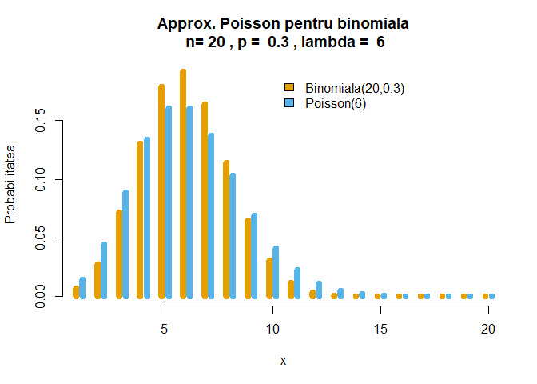

iar pentru parametrii $n=100$ și $p=0.01$ obținem


Table: Aproximarea Poisson la binomiala n = 100 p = 0.01 lambda = 1 . Eroarea (Diferenta in valoare absoluta maxima) =  0.00185 .

 k     Binomiala     Poisson     Eroarea Absoluta 
----  -----------  -----------  ------------------
 1     0.3697296    0.3678794       0.0018502     
 2     0.1848648    0.1839397       0.0009251     
 3     0.0609992    0.0613132       0.0003141     
 4     0.0149417    0.0153283       0.0003866     
 5     0.0028978    0.0030657       0.0001679     
 6     0.0004635    0.0005109       0.0000475     
 7     0.0000629    0.0000730       0.0000101     
 8     0.0000074    0.0000091       0.0000017     
 9     0.0000008    0.0000010       0.0000003     
 10    0.0000001    0.0000001       0.0000000     

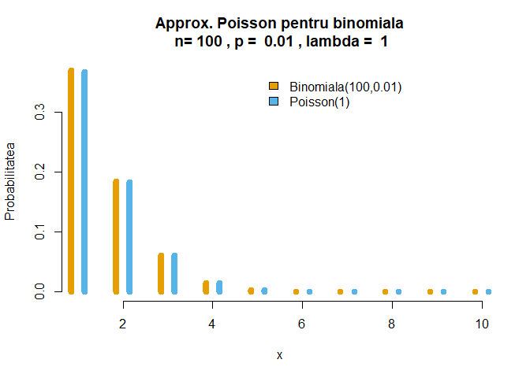

Pentru funcția de repartiție $F_{n,p}(k)$, folosidn aproximarea Poisson avem că

$$
F_{n,p}(k) \approx F_{\lambda}(k)=\sum_{x=0}^{k}e^{-\lambda}\frac{\lambda^x}{x!}.
$$

## Aproximarea Normală

Să considerăm repartiția binomială $\mathcal{B}(n, p)$ pentru $p = 0.3$ și $n\in\{20, 50, 100, 150, 200\}$ și să trasăm histogramele variabilelor aleatoare care au aceste repartiții ($X_n$) precum și a variabilelor standardizate $Z_n = \frac{X_n-np}{\sqrt{npq}}$.

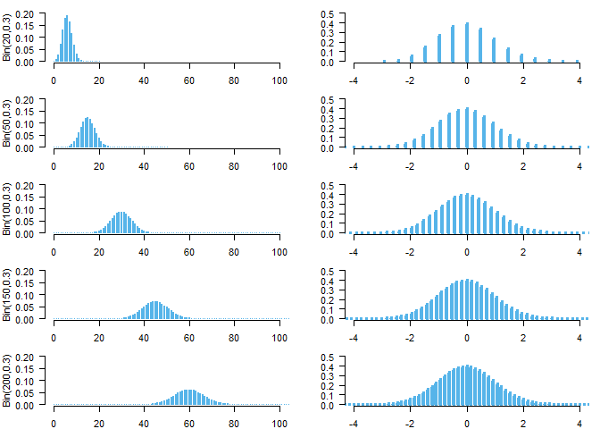

Observăm, pentru graficele din partea stângă, că valoarea maximă se atinge în jurul punctului $n\times 0.3$ pentru fiecare grafic în parte. De asemenea se observă că odată cu creșterea lui $n$ crește și gradul de împrăștiere, cu alte cuvinte crește și abaterea standard ($\sigma_n = \sqrt{npq}$).

Pe de altă parte putem remarca că figurile din partea dreaptă au o formă simetrică, de tip *clopot*, concentrate în jurul lui $0$, fiind translatate în origine și scalate pentru a avea o varianță egală cu $1$. [Abraham de Moivre](https://en.wikipedia.org/wiki/Abraham_de_Moivre)^[de Moivre, A. (1756). *The Doctrine of Chances: or, A Method of Calculating the Probabilities of Events in Play* (Third ed.). New York: Chelsea.] a justificat acest efect (pentru $p=0.5$) încă din 1756 observând că raportul 

$$
  \frac{f_{n,p}(k)}{f_{n,p}(k-1)} = \frac{\frac{n!}{k!(n-k)!}p^kq^{n-k}}{\frac{n!}{(k-1)!(n-k+1)!}p^{k+1}q^{n-k+1}} = \frac{(n-k+1)p}{kq}
$$

pentru $k = 1,2,\ldots,n$. Astfel $f_{n,p}(k)\geq f_{n,p}(k-1)$ dacă și numai dacă $(n+1)p\geq k$ de unde, pentru $n$ fixat, deducem că $f_{n,p}(k)$ atinge valoarea maximă pentru $k_{\max} = \lfloor{(n+1)p\rfloor}\approx np$ (acesta este motivul pentru care fiecare grafic din partea stângă are vârful în jurul punctului $np$). 

Să observăm ce se întâmplă în jurul lui $k_{\max}$. Avem 

$$
\frac{f_{n,p}(k_{\max}+i)}{f_{n,p}(k_{\max}+i-1)} = \frac{(n-k_{\max}-i+1)p}{(k_{\max}+i)q}\approx \frac{(nq-i)p}{(np+i)q} = \frac{1-\frac{i}{nq}}{1+\frac{i}{np}}
$$

și cum (folosind relația $\log(1+x)\approx x$, pentru $x$ în jurul lui $0$)

$$
\log\left(1-\frac{i}{nq}\right) - \log\left(1+\frac{i}{np}\right) \approx -\frac{i}{nq}-\frac{i}{np} = -\frac{i}{npq}
$$ 

deducem, pentru $m\geq 1$ și $k_{\max}+m\leq n$, că

\begin{align*}
  \log\frac{f_{n,p}(k_{\max}+m)}{f_{n,p}(k_{\max})} &= \log\left(\frac{f_{n,p}(k_{\max}+1)}{f_{n,p}(k_{\max})}\times \frac{f_{n,p}(k_{\max}+2)}{f_{n,p}(k_{\max}+1)}\times\cdots\times\frac{f_{n,p}(k_{\max}+m)}{f_{n,p}(k_{\max}+m-1)}\right)\\
  &= \log\frac{f_{n,p}(k_{\max}+1)}{f_{n,p}(k_{\max})}+ \log\frac{f_{n,p}(k_{\max}+2)}{f_{n,p}(k_{\max}+1)}+\cdots+\log\frac{f_{n,p}(k_{\max}+m)}{f_{n,p}(k_{\max}+m-1)}\\
  &\approx \frac{-1-2-\cdots-m}{npq} = -\frac{1}{2}\frac{m^2}{npq}.
\end{align*}

Sumarizând avem, pentru $m$ nu foarte mare, 

$$
  \mathbb{P}(X=k_{\max}+m)\approx f_{n,p}(k_{\max})e^{-\frac{1}{2}\frac{m^2}{npq}}.
$$

Folosind formula lui [Stirling](https://en.wikipedia.org/wiki/Stirling%27s_approximation)^[A se vedea cartea lui Feller, W. (1968). *An Introduction to Probability Theory and Its Applications* (third ed.), Volume 1. New York: Wiley. pag. 52-53 pentru o derivare a formulei lui Stirling.] 

$$
  n!\approx \sqrt{2\pi}n^{n+\frac{1}{2}}e^{-n}
$$

pentru $k = k_{\max}\approx np$, avem

$$
f_{n,p}(k)\approx \frac{1}{\sqrt{2\pi}}\frac{n^{n+\frac{1}{2}}}{(np)^{np+\frac{1}{2}}(nq)^{nq+\frac{1}{2}}}p^{np}q^{nq}= \frac{1}{\sqrt{2\pi npq}}.
$$

Astfel aproximarea de Moivre devine 

$$
  \mathbb{P}(X=k_{\max}+m)\approx \frac{1}{\sqrt{2\pi npq}}e^{-\frac{1}{2}\frac{m^2}{npq}}
$$

și scriind $k$ pentru $k_{\max}+m$ și înlocuind $k_{\max}$ cu $np$ obținem

$$
  \mathbb{P}(X=k)\approx \frac{1}{\sqrt{2\pi npq}}e^{-\frac{1}{2}\frac{(k-np)^2}{npq}} = \frac{1}{\sigma_n\sqrt{2\pi}}e^{-\frac{1}{2}\left(\frac{k-np}{\sigma_n}\right)^2}.
$$

Astfel $mathbb{P}(X=k)$ este aproximativ egală cu aria de sub curba 

$$
  f(x) = \frac{1}{\sigma_n\sqrt{2\pi}}e^{-\frac{1}{2}\left(\frac{x-np}{\sigma_n}\right)^2}
$$
pe intervalul $k-\frac{1}{2}\leq x\leq k+\frac{1}{2}$. 

În mod similar, pentru $0\leq a< b\leq n$, avem 

$$
  \mathbb{P}(a\leq X\leq b) = \sum_{k=a}^{b}f_{n,p}(k) \approx \sum_{k=a}^{k=b}\int_{k+\frac{1}{2}}^{k-\frac{1}{2}}f(x)\,dx = \int_{a}^{b}f(x)\,dx
$$

de unde prin schimbarea de variabilă $y = \frac{x-np}{\sigma_n}$ obținem

$$
  \mathbb{P}(a\leq X\leq b)\approx \frac{1}{\sqrt{2\pi}}\int_{\alpha}^{\beta}e^{-\frac{y^2}{2}}\,dy = \Phi(\beta) - \Phi(\alpha)
$$

unde $\alpha = \frac{a-np-\frac{1}{2}}{\sigma_n}$, $\beta =  = \frac{b-np+\frac{1}{2}}{\sigma_n}$ și $\Phi(x)=\frac{1}{\sqrt{2\pi}}\int_{-\infty}^{x}e^{-\frac{y^2}{2}}\,dy$.

Aplicând rezultatele de mai sus, în cele ce urmează vom considera două aproximări pentru funcția de repartiție $F_{n,p}(k)$: 

  a) aproximarea normală

$$
F_{n,p}(k) \approx \Phi\left(\frac{k-np}{\sqrt{np(1-p)}}\right).
$$

  b) aproximarea normală cu coeficient de corecție de continuitate 

$$
F_{n,p}(k) \approx \Phi\left(\frac{k+0.5-np}{\sqrt{np(1-p)}}\right).
$$

În practică această ultimă aproximare se aplică atunci când atât $np\geq 5$ cât și $n(1-p)\geq 5$.

Următorul cod crează o funcție care calculează cele trei aproximări pentru funcția de repartiție binomială


```r
appBNP <- function(n, p, R = 1000, k = 6) {
  trueval <- pbinom(k, n, p) # adevarata valoare a functiei de repartitie in k
  prob.zcc <- prob.zncc <- prob.pois <- NULL  # initializare
  q = 1-p
  for (i in 1:R) {# repetam procesul de R ori 
    x = rnorm(n, n * p, sqrt(n * p * q)) # generare n v.a. normale de medie np 
    z.cc = ((k + .5) - mean(x))/sd(x) # cu coeficient de corectie
    prob.zcc[i] = pnorm(z.cc)
    z.ncc = (k - mean(x))/sd(x) # fara coeficient de corectie
    prob.zncc[i] = pnorm(z.ncc)    
    y = rpois(n, n * p)
    prob.pois[i] = length(y[y <= k])/n # aproximate Poisson
  }
  list(prob.zcc = prob.zcc, prob.zncc = prob.zncc, 
       prob.pois = prob.pois, trueval = trueval)
}
```

Avem următoarea ilustrație grafică a diferitelor metode de aproximare


```r
# Plot
R <- 1000
set.seed(10)
out <- appBNP(n = 100, p = .01, k = 2, R = 1000)

plot(1:R, out$prob.pois, type = "l", col = "#E69F00", xlab = "Numar repetari", 
     main = expression(paste("Probabilitatile simulate: ", 
                             n==100, ", ", p==0.01, sep="")),
     ylab = "Probabilitatea", ylim = c(.7, .97),
     bty = "n")
abline(h = out$trueval, col="black", lty=2, lwd=2)
lines(1:R, out$prob.zcc, lty = 1, col = "#56B4E9")
lines(1:R, out$prob.zncc, lty = 1, col = "gray80")
legend("bottomleft", c("Poisson", "Normala (cu factor corectie)", 
                       "Normala (fara factor corectie)"),
       lty = c(1), col = c("#E69F00", "#56B4E9", "gray80"),
       bty = "n")
```

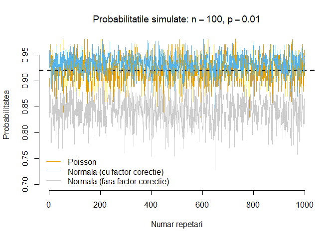

Avem și următorul `boxplot` (discuție ce reprezintă un boxplot) care ne permite să evidențiem care dintre aproximări este mai bună pentru valorile selectate


```r

# n = 200
set.seed(10)
out <- appBNP(n = 100, p = .01, k = 2, R = 1000)

boxplot(out$prob.pois, boxwex = 0.25, xlim = c(0.5, 1.5),
        col = "#E69F00",
        main = expression(paste("Aproximarea Binomialei: ", 
                                n==100, ", ", p==0.01, sep="")),
        ylab = "Probablitatea", 
        ylim = c(out$trueval - 0.1, out$trueval + 0.15), 
        bty = "n")
boxplot(out$prob.zcc, boxwex = 0.25, at = 1:1 - 0.2, add = T,
        col = "#56B4E9")
boxplot(out$prob.zncc, boxwex = 0.25, at = 1:1 + 0.2, add = T,
        col = "gray80" )
abline(h = out$trueval, col = "red", lty=2)
legend("topleft", c("Poisson", "Normala (cu factor corectie)", 
                    "Normala (fara factor corectie)"), 
       fill = c("#E69F00", "#56B4E9", "gray80"),
       bty = "n")
```

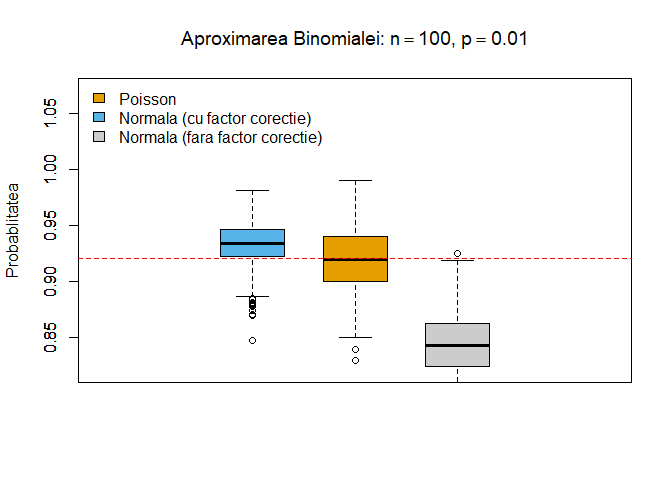


