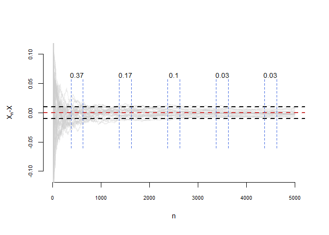
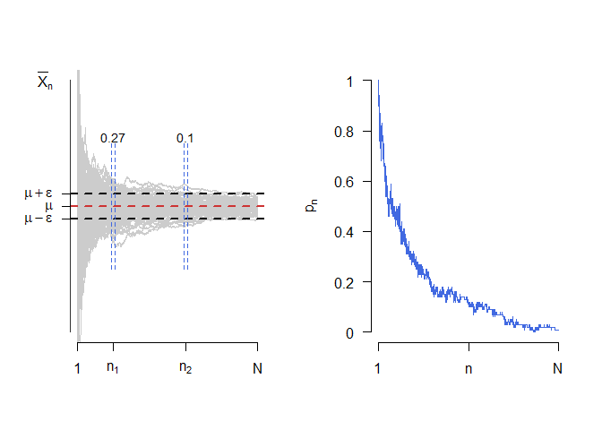
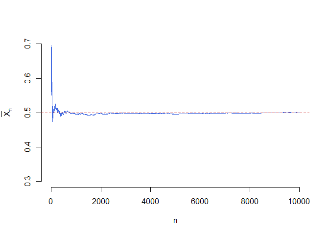
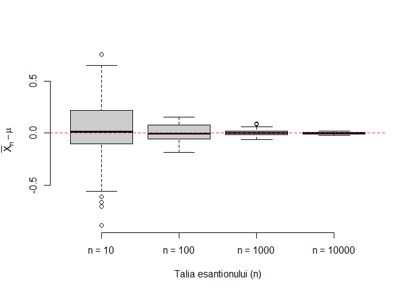
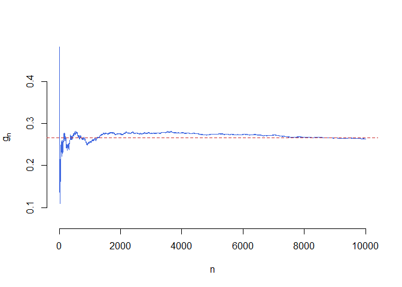
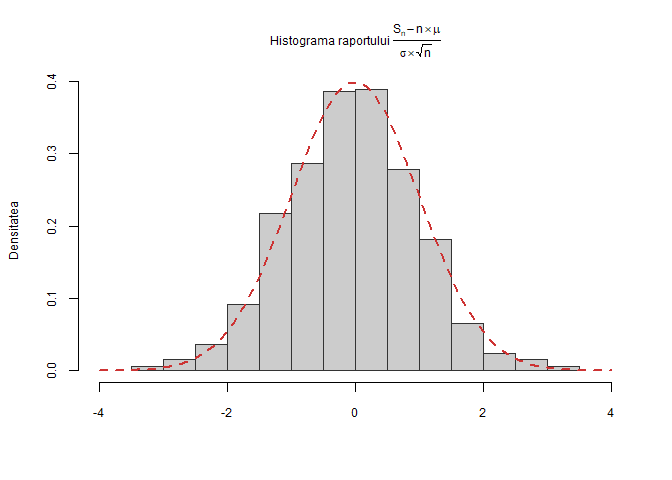

# Laborator 7

<script>
$(document).ready(function ()  {

    // move toc-ignore selectors from section div to header
    $('div.section.toc-ignore')
        .removeClass('toc-ignore')
        .children('h1,h2,h3,h4,h5').addClass('toc-ignore');

    // establish options
    var options = {
      selectors: "h1,h2,h3",
      theme: "bootstrap3",
      context: '.toc-content',
      hashGenerator: function (text) {
        return text.replace(/[.\\/?&!#<>]/g, '').replace(/\s/g, '_').toLowerCase();
      },
      ignoreSelector: ".toc-ignore",
      scrollTo: 60
    };
    options.showAndHide = false;
    options.smoothScroll = true;

    // tocify
    var toc = $("#TOC").tocify(options).data("toc-tocify");
});
</script>

Obiectivul acestui laborator este de a prezenta noțiunea de convergență în probabilitate și convergență în repartiție precum și a *Legii Numerelor Mari* (versiunea slabă) și a *Teoremei Limită Centrale*.


# Ilustrarea Legii Numerelor Mari

## Convergența în probabilitate

Fie $X_n, n\geq 1$ și $X$ variabile aleatoare definite pe câmpul de probabilitate $(\Omega, \mathcal{F}, \mathbb{P})$. Spunem că un șirul de variabile aleatoare $(X_n)_n$ converge în probabilitate la variabila aleatoare $X$, și notăm $X_n\overset{\mathbb{P}}{\to}X$, dacă pentru orice $\epsilon>0$ are loc 

$$
  \mathbb{P}\left(\left|X_{n} - X\right| > \epsilon\right) \overset{n\to\infty}{\longrightarrow} 0. 
$$

De asemenea putem observa că $X_n\overset{\mathbb{P}}{\to}X$ dacă și numai dacă $X_n-X\overset{\mathbb{P}}{\to}0$. Pentru a ilustra grafic acest tip de convergență^[Pentru alte moduri de convergență și ilustrarea lor grafică se poate consulta lucrarea: Pierre LAFAYE DE MICHEAUX și Benoit LIQUET *Understanding Convergence Concepts: A Visual-Minded and Graphical Simulation-Based Approach*, The American Statistician, Vol. 63, No. 2, 2009] vom aproxima probabilitatea $\mathbb{P}(A_n)$, unde $A_n = \{\omega\in\Omega\,|\,\left|X_{n}(\omega) - X(\omega)\right| > \epsilon\}$, folosind abordarea frecvenționistă. Aceasta presupune ca pentru $n$ dat să considerăm $\omega_1, \ldots,\omega_M\in\Omega$, $M$ realizări ale experimentului (repetat în condiții identice) și să folosim aproximarea

$$
  \mathbb{P}(A_n) \approx p_n(M) = \frac{\#\left\{j\in\{1,\ldots,M\}\,|\,\left|X_{n}(\omega_j) - X(\omega_j)\right| > \epsilon\right\}}{M}.
$$

Concret, în figura de mai jos, considerăm $M = 30$ de repetiții ale experimentului (avem $M$ curbe) cu $n = 5000$ de realizări ale unui șir de variabile aleatoare repartizate $\mathcal{U}[0,1]$, $X = 0.5$ și $\epsilon = 0.01$. Pentru $i\in\{500, 1500, 2500, 3500, 4500\}$ am calculat și afișat frecvența de realizarea a evenimentului $A_i$ (câte din cele $M$ curbe sunt în afara benzii $[-\epsilon, \epsilon]$ pentru $i$, fixat). Observăm că $p_{500}(30) = 0.37$ și $p_{3500}(30) = 0.03$, convergența lui $p_n(M)\underset{n\to \infty}{\longrightarrow} 0$ implicând convergența în probabilitate.



## Legea numerelor mari (versiunea slabă)

\BeginKnitrBlock{rmdinsight}<div class="rmdinsight">Fie $X_1, X_2, \ldots$ un șir de variabile aleatoare independente și indentic repartizate, de medie $\mathbb{E}[X_1] = \mu<\infty$ și varianță $Var(X_1) = \sigma^2<\infty$. Atunci $\forall \epsilon>0$ avem 

$$
  \mathbb{P}\left(\left|\frac{X_1+\cdots+X_n}{n} - \mu\right| > \epsilon\right) \overset{n\to\infty}{\longrightarrow} 0
$$
  
sau echivalent 

$$
  \mathbb{P}\left(\left|\frac{X_1+\cdots+X_n}{n} - \mu\right| \leq \epsilon\right) \overset{n\to\infty}{\longrightarrow} 1
$$

</div>\EndKnitrBlock{rmdinsight}

Notând $\bar{X}_n = \frac{X_1+\cdots X_n}{n}$, *Legea numerelor mari (versiunea slabă)* afirmă că $\bar{X}_n\overset{\mathbb{P}}{\to}\mu$.  Figura de mai jos ilustrează această convergență pentru $M = 100$ de traiectorii. În figura din dreapta este ilustrată evoluția probabilității $p_n$ pentru $n\in\{1,2,\ldots, N\}$. 



\BeginKnitrBlock{rmdexercise}<div class="rmdexercise">Să presupunem că primim o monedă și ni se spune că aceasta aterizează pe fața cap în $48\%$ din cazuri. Vrem să testăm această afirmație. Folosind *Legea numerelor mari* și știind că vrem să fim siguri în $95\%$ din cazuri, ne întrebăm de câte ori trebuie să aruncăm moneda pentru a verifica afirmația?

</div>\EndKnitrBlock{rmdexercise}

Să presupunem că aruncăm moneda, independent, de $n$ ori și fie $X_i$ rezultatul obținut la cea de-a $i$-a aruncare: $X_i=1$ dacă la a $i$-a aruncare am obținut cap și $X_i = 0$ dacă am obținut pajură. Avem că variabilele aleatoare $X_1, X_2, \ldots, X_n$ sunt independente și repartizare $\mathcal{B}(p)$, cu $p=0.48$ din ipoteză. 

De asemenea, observăm că $\mathbb{E}[X_1]= \mu = 0.48$ și $Var(X_1) = \sigma^2 = p(1-p) = 0.2496$. Pentru testarea monedei permitem o eroare $\epsilon = 0.02$ ceea ce înseamnă că probabilitatea ca moneda să aterizeze cap se află în intervalul $(0.46, 0.5)$. Din *Inegalitatea lui Cebîșev* avem că

$$
  \mathbb{P}\left(\left|\frac{X_1+\cdots+X_n}{n} - 0.48\right| >0.02\right)\leq \frac{Var(X_1)}{n\times(0.02)^2}, 
$$

de unde, având un grad de încredere de $95\%$, vrem să determinăm pe $n$ pentru care 

$$
  \frac{0.2496}{n\times(0.02)^2} = 0.05
$$

ceea ce implică $n = 12480$.

\BeginKnitrBlock{rmdexercise}<div class="rmdexercise">Fie $X_1,X_2,\dots,X_N$, $N$ v.a. i.i.d. de lege $\mathcal{U}([0,1])$. Pentru $1\leq n\leq N$, notăm cu $S_n=X_1+X_2+\cdots X_n$ șirul sumelor parțiale și $\mu$ media legii $\mathcal{U}([0,1])$. Trasați pe același grafic funcția $n\to \bar{X}_n=\frac{S_n}{n}$ pentru $n=1,\dots,N$ și dreapta de ecuație $y=\mu$. Faceți același lucru pentru legea normală $\mathcal{N}(2,1)$. 
</div>\EndKnitrBlock{rmdexercise}

În cazul în care v.a. $X_1,X_2,\dots,X_N$ sunt repartizate uniform $\mathcal{U}([0,1])$ (deci media este $\mu=\frac{1}{2}$) avem: 


```r
n = 10000

# Pentru legea uniforma folosim comanda runif
# Pentru calculul sumelor partiale putem folosi functia cumsum

y1 = cumsum(runif(n))
y1 = y1/(1:n)
mu1 = 1/2 # media uniformei pe [0,1]

# trasam graficul 
mar.default <- c(5,4,4,2) + 0.1
par(mar = mar.default + c(0, 0.3, 0, 0)) 
plot(1:n, y1, type = "l", 
     col= "royalblue", xlab = "n", 
     ylab = expression(bar(X)[n]), 
     bty = "n",
     ylim = c(0.3,0.7))
abline(h = mu1, col = "brown3", lty= "dashed") # adaugam linia orizontala
```




În cazul în care v.a. $X_1,X_2,\dots,X_N$ sunt normale de parametrii $\mathcal{N}(2,1)$ (deci media este $\mu=2$) avem:


```r
# Folosim acelasi numar de variabile n

# Pentru legea normala folosim comanda rnorm
# Pentru calculul sumelor partiale putem folosi functia cumsum
y2 = cumsum(rnorm(n, mean = 2, sd = 1))
y2 = y2/(1:n)
mu2 = 2 # media normalei N(2,1)

# facem graficul 
mar.default <- c(5,4,4,2) + 0.1
par(mar = mar.default + c(0, 0.3, 0, 0)) 
plot(1:n, y2, type = "l", 
     col= "royalblue", xlab = "n", 
     ylab = expression(bar(X)[n]),
     bty = "n",
     ylim = c(1.5, 2.5))
abline(h = mu2, col = "brown3", lty= "dashed") # adaugam linia orizontala
```


\BeginKnitrBlock{rmdexercise}<div class="rmdexercise">Construiți o funcție care să vă permită generarea a $m$ eșantioane de volum $n$ dintr-o populație normală de medie $\mu$ și varianță $\sigma^2$ dată. Ilustrați grafic cu ajutorul unui boxplot cum variază diferența dintre media aritmetică (media eșantionului $\bar{X}_n$) și media teoretică pentru $m = 100$ și diferite volume ale eșantionului $n\in\{10, 100, 1000, 10000\}$. Se consideră $\mu = 1$ și $\sigma^2 = 1$. 

</div>\EndKnitrBlock{rmdexercise}

Următoarea funcție verifică cerința din problemă (`normal.mean = $\mu$`, `normal.sd = $\sigma$`, `num.samp = m` și `samp.size = n`). Să observăm că am folosit funcția `rowMeans` pentru a calcula media fiecărui eșantion (media pe liniile matricii de observații).  


```r
normalSampleMean <- function(normal.mean, normal.sd, num.samp, samp.size) {
  # generam matricea de observatii 
    x = matrix(rnorm(n = num.samp * samp.size, mean = normal.mean, sd = normal.sd), 
        nrow = num.samp, ncol = samp.size)
    
  # calculam media esantionului pentru fiecare esantion
    x.mean = rowMeans(x)
    
    return(x.mean)
}
```

Pentru a ilustra grafic să considerăm o populație $\mathcal{N}(1,1)$ și pentru talie a eșantionului, $n\in\{10, 100, 1000, 10000\}$, să calculăm $\bar{X}_n$ corespunzător (aici am folosit funcția `sapply` - a se vedea laboratorul 3).


```r
# date de intrare
normal.mean = 1
normal.sd = 1
true.mean = normal.mean

# marimea esantioanelor
samp.sizes = c(10, 100, 1000, 10000)

names(samp.sizes) = paste0("n = ", samp.sizes)

# numarul de esantioane
num.samp = 100

# calculul mediei de selectie pentru fiecare esantion
x.mean = sapply(samp.sizes, normalSampleMean, num.samp = num.samp, 
                normal.mean = normal.mean, normal.sd = normal.sd)

# ilustrarea grafica
mar.default <- c(5,4,4,2) + 0.1
par(mar = mar.default + c(0, 0.2, 0, 0), bty = "n") 
boxplot(x.mean - true.mean, 
        xlab = "Talia esantionului (n)", 
        ylab = expression(bar(X)[n] - mu),
        col = "gray80",
        bty = "n")

abline(h = 0, lty = 2, col = "brown3")
```



Din boxplot-ul de mai sus observăm că pe măsură ce creștem talia eșantionului media boxplot-ului se duce spre 0 ceea ce justifică enunțul *Legii Numerelor Mari*, și anume că media eșantionului converge la media populației (media teoretică). De asemenea putem observa că și varianța scade (gradul de împrăștiere scade) odată cu creșterea numărului de observații.

\BeginKnitrBlock{rmdexercise}<div class="rmdexercise">Utilizați *Legea Numerelor Mari* pentru a aproxima integrala următoare

$$
  I = \int_{0}^{1}e^{x}sin(2x)cos(2x)dx.
$$

Calculați de asemenea valoarea exactă $I$ a acesteia și comparați-o cu aproximarea găsită.

</div>\EndKnitrBlock{rmdexercise}

Fie $U_1,U_2,\dots,U_n$ un șir de v.a. i.i.d. repartizare uniform pe $[0,1]$. Cum $g$ este o funcție continuă atunci $g(U_1), g(U_2),\ldots, g(U_n)$ sunt variabile aleatoare i.i.d. și aplicând *Legea Numerelor Mari* obținem

$$
  g_n=\frac{1}{n}\sum_{i=1}^{n}g(U_{i}) \overset{\mathbb{P}}{\to} \mathbb{E}[g(U_1)] = \int_{0}^{1}g(x)dx.
$$

Pentru a calcula integrala numeric vom folosi funcția `integrate` (trebuie observat că această integrală se poate calcula ușor și exact prin integrare prin părți). Următorul script ne dă valoare numerică și aproximarea obținută cu ajutorul metodei Monte Carlo pentru integrale $\int_{0}^{1}g(x)dx$:


```r
myfun=function(x){
  y = exp(x)*sin(2*x)*cos(2*x);
  return(y);
}

# calculul integralei cu metode numerice
I = integrate(myfun,0,1) # raspunsul este o lista si oprim prima valoare
I = I[[1]]

# calculul integralei cu ajutorul metodei Monte Carlo
n = 10000 

u = runif(n) # generarea sirului U_n
z = myfun(u) # calcularea sirului g_n

I2 = sum(z)/n # aproximarea MC
```

Obținem că valoarea numerică a lui $I$ este 0.2662 iar cea obținută cu ajutorul metodei Monte Carlo este 0.2673. 

Avem următoarea ilustrare grafică a convergenței metodei Monte Carlo:


```r
# graficul
gn = myfun(runif(n)) 
gn = cumsum(gn)/(1:n) # calculul lui g_n

plot(1:n, gn, type = "l", 
     col = "royalblue", xlab = "n", 
     ylab = expression(g[n]),
     bty = "n",
     ylim = c(I-0.2, I+0.2))
abline(h = I, lty = "dashed", col = "brown3")
```



# Ilustrarea Teoremei Limită Centrală

\BeginKnitrBlock{rmdinsight}<div class="rmdinsight">Fie $X_1, X_2, \ldots$ un șir de variabile aleatoare independente și indentic repartizate, de medie $\mathbb{E}[X_1] = \mu<\infty$ și varianță $Var(X_1) = \sigma^2<\infty$. Atunci, notând $S_n = X_1 + \cdots + X_n$, avem

$$
  \mathbb{P}\left(\frac{S_n - \mathbb{E}[S_n]}{\sqrt{Var(S_n)}}\leq x\right) = \mathbb{P}\left(\frac{S_n - n\mu}{\sigma\sqrt{n}}\leq x\right) \overset{n\to\infty}{\longrightarrow} \Phi(x) = \frac{1}{\sqrt{2\pi}}\int_{-\infty}^{x}e^{-\frac{t^2}{2}}\,dt, \quad \forall x\in\mathbb{R}.
$$
  
Echivalent, dacă notăm media eșantionului cu $\bar{X}_n = \frac{S_n}{n}$, atunci  

$$
  \mathbb{P}\left(\sqrt{n}\frac{\bar{X}_n - \mu}{\sigma}\leq x\right) \overset{n\to\infty}{\longrightarrow} \Phi(x) = \frac{1}{\sqrt{2\pi}}\int_{-\infty}^{x}e^{-\frac{t^2}{2}}\,dt, \quad \forall x\in\mathbb{R}.
$$

</div>\EndKnitrBlock{rmdinsight}

\BeginKnitrBlock{rmdexercise}<div class="rmdexercise">Să presupunem că primim o monedă și ni se spune că aceasta aterizează pe fața cap în $48\%$ din cazuri. Vrem să testăm această afirmație. Folosind *Teorema Limită Centrală* și știind că vrem să fim siguri în $95\%$ din cazuri, ne întrebăm de câte ori trebuie să aruncăm moneda pentru a verifica afirmația? Comparați răspunsul cu cel din exercițiul în care am folosit *LNM*, de mai sus.

</div>\EndKnitrBlock{rmdexercise}

Folosind aceleași notații ca și în exercițiul din secțiunea de mai sus și notând în plus $S_n = X_1+\cdots+X_n$, avem 

\begin{align*}
  \mathbb{P}\left(\frac{S_n}{n}<0.5\right) &= \mathbb{P}\left(\frac{S_n - n\mu}{\sigma\sqrt{n}}<\frac{(0.5-\mu)\sqrt{n}}{\sigma}\right)= \mathbb{P}\left(\frac{S_n - n\mu}{\sigma\sqrt{n}}<\frac{0.02\sqrt{n}}{\sqrt{0.2496}}\right) \\
  &= \mathbb{P}\left(\frac{S_n - n\mu}{\sigma\sqrt{n}}<0.04\sqrt{n}\right) \approx\Phi(0.04\sqrt{n})\geq 0.95
\end{align*}

Prin urmare, $(0.04\sqrt{n}\geq 1.645$ de unde $n = 1692$. Putem observa că rezultatul obținut prin aplicarea *Teoremei Limită Centrală* este mai precis decât cel obținut prin aplicarea *Legii numerelor mari*.


\BeginKnitrBlock{rmdexercise}<div class="rmdexercise">
Fie $(X_n)_{n\geq1}$ un șir de v.a. i.i.d. de lege $\mathcal{E}(1)$. Pentru toți $n$, notăm cu $S_n=X_1+X_2+\cdots X_n$ șirul sumelor parțiale, $\mu$ și $\sigma^2$ reprezentând media și respectiv varianța legii $\mathcal{E}(1)$. *Teorema Limită Centrală* afirmă că dacă $n$ este mare atunci v.a. 

$$
\frac{S_n-n\mu}{\sqrt{n}\sigma}
$$

are aproximativ aceeași distribuție ca și legea normală $\mathcal{N}(0,1)$. Ilustrați această convergență în distribuție cu ajutorul unei histograme. Suprapuneți peste această histogramă densitatea legii $\mathcal{N}(0,1)$.
</div>\EndKnitrBlock{rmdexercise}

Știm că media unei v.a. distribuite exponențial de parametru $\lambda$, $\mathcal{E}(\lambda)$ este $\mu=\frac{1}{\lambda}$ iar varianța acesteia este $\sigma^2=\frac{1}{\lambda^2}$. Pentru fiecare valoare a lui $i$ de la $1$ la $N$ calculăm raportul $\frac{S_n-n\mu}{\sigma\sqrt{n}}$ (cu alte cuvinte repetăm experimentul de $N$ ori): 


```r
N = 1000 # alegem numarul de repetitii ale experimentului
n = 1000 # alegem n pentru care folosim aproximarea normala

lambda = 1 # parametrul legii E(1)

mu = 1/lambda # media
sigma = 1/lambda # abaterea standard 

s = rep(0,N) # initializam sirul sumelor partiale

for (i in 1:N){
  x = rexp(n, rate = lambda) # generam variabilele exponentiale
  s[i] = (sum(x)-n*mu)/(sigma*sqrt(n)) # calculam raportul 
  
}
```

Continuăm prin trasarea histogramei cerute și adăugăm la grafic densitatea legii normale $\mathcal{N}(0,1)$:


```r
# trasam histograma
# pentru mai multe optiuni latex: ?plotmath 
hist(s, main = expression(paste("Histograma raportului ",
                                frac(S[n]-n%*%mu,sigma%*%sqrt(n)))),
     prob = TRUE, 
     col = "grey80", # Culoarea de umplere
     border = "grey20",
     xlim = c(-4,4), 
     cex.main=0.75, 
     cex.lab = 0.75, 
     cex.axis = 0.75, 
     xlab = "", 
     ylab = "Densitatea")

# adaugam densitatea normalei N(0,1) 
x1 = seq(-4,4,by=0.1)
y1 = dnorm(x1, mean = 0, sd = 1)
lines(x1, y1, col = "brown3", lwd = 2, lty = 2)
```




