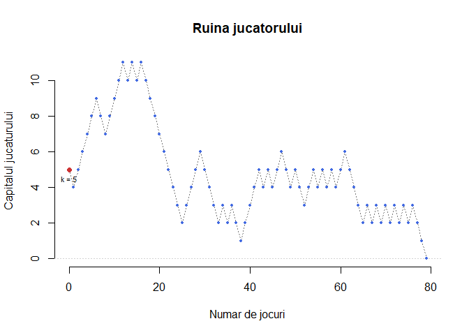
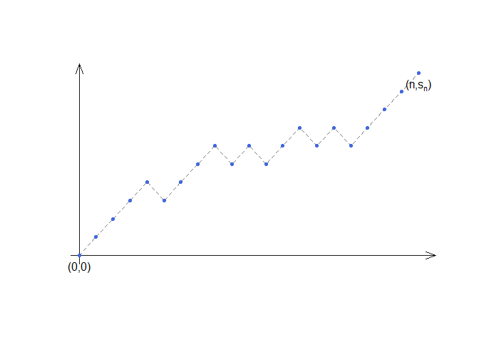
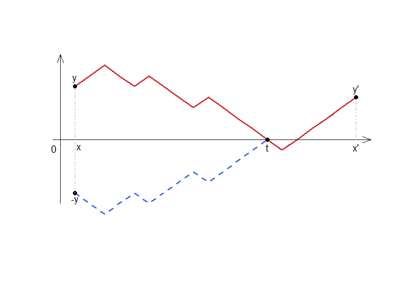
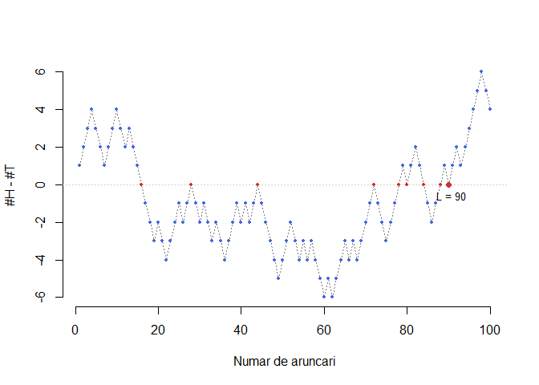
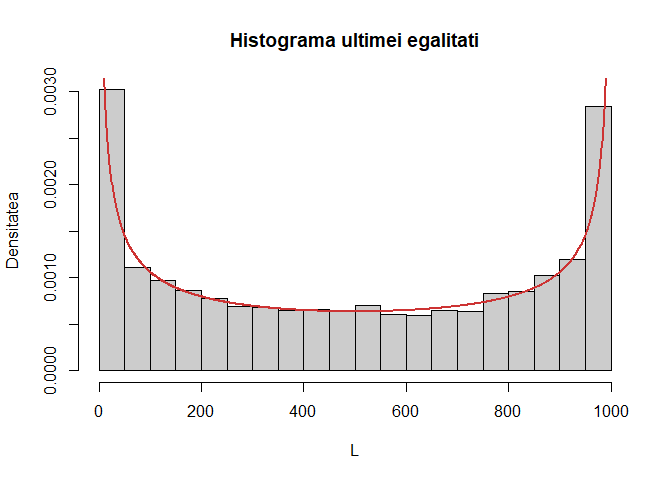

# Laborator Suplimentar

<script>
$(document).ready(function ()  {

    // move toc-ignore selectors from section div to header
    $('div.section.toc-ignore')
        .removeClass('toc-ignore')
        .children('h1,h2,h3,h4,h5').addClass('toc-ignore');

    // establish options
    var options = {
      selectors: "h1,h2,h3",
      theme: "bootstrap3",
      context: '.toc-content',
      hashGenerator: function (text) {
        return text.replace(/[.\\/?&!#<>]/g, '').replace(/\s/g, '_').toLowerCase();
      },
      ignoreSelector: ".toc-ignore",
      scrollTo: 60
    };
    options.showAndHide = false;
    options.smoothScroll = true;

    // tocify
    var toc = $("#TOC").tocify(options).data("toc-tocify");
});
</script>

Obiectivul acestui laborator este de a rezolva câteva probleme ce țin de mersul la întâmplare simplu cu ajutorul limbajului R.  


# Ruina jucătorului 

<div class="rmdexercise">
<p>Un bărbat vrea să își cumpere un obiect (de exemplu o mașină sau o casă) care costă <span class="math inline"><em>N</em></span> unități monetare. Să presupunem că el are economisit un capital de <span class="math inline">0 &lt; <em>k</em> &lt; <em>N</em></span> unități monetare și încearcă să câștige restul jucând un joc de noroc cu managerul unei bănci. Jocul este următorul: bărbatul aruncă o monedă echilibrată în mod repetatș dacă moneda pică cap (<span class="math inline"><em>H</em></span>) atunci managerul îi dă o unitate monetară, în caz contrar bărbatul plătește o unitate monetară bancii. Jocul continuă până când unul din două evenimente se realizează: sau câștigă suma necesară și își cumpără obiectul dorit sau pierde banii și ajunge la faliment. Ne întrebăm care este probabilitatea să ajungă la faliment?</p>
</div>

Fie $A$ evenimentul ca bărbatul să ajungă la ruină și $B$ evenimentul ca la prima aruncare moneda a picat cap. Atunci din formula probabilității totale avem 

$$
  \mathbb{P}_k(A) = \mathbb{P}_k(A|B)\mathbb{P}(B)+\mathbb{P}_k(A|B^c)\mathbb{P}(B^c)
$$

unde $\mathbb{P}_k$ este probabilitatea calculată în funcție de valoarea $k$ a capitalului inițial al jucătorului. Să observăm că $\mathbb{P}_k(A|B)$ devine $\mathbb{P}_{k+1}(A)$ deoarece dacă la prima aruncare avem cap atunci capitalul inițial a crescut la $k+1$. În mod similar, dacă la prima aruncare am obținut coadă atunci $\mathbb{P}_k(A|B^c) = \mathbb{P}_{k-1}(A)$. Notând cu $p_k = \mathbb{P}_k(A|B)$ obținem următoarea ecuație 

$$
  p_k = \frac{1}{2}p_{k+1} + \frac{1}{2}p_{k-1},
$$

cu valorile inițiale $p_0=1$ (dacă jucătorul a pornit cu un capital inițial nul atunci el este în faliment) și respectiv $p_N=0$ (dacă jucătorul are din start suma necesară pentru a achiziționa obiectul dorit atunci nu mai are loc jocul). 

O simulare a jocului pentru $N = 50$ și $k = 5$ este prezentată de următoarea funcție: 


```r
ruina = function(N, k){
  flag = TRUE

  joc = 0
  capital = k
  y = capital
  
  while(flag){
    x = 2*rbinom(1,1,0.5)-1
    
    capital = capital + x
    y = c(y, capital)
    
    joc = joc + 1
    
    if (capital == 0 || capital == N){
      flag = FALSE
    }
  }
  
  return(y) # daca am 0 este ruina altfel este succes
}
```



Dacă definim $b_k = p_k - p_{k-1}$ pentru $k\geq 1$ atunci $b_k = b_{k-1}$, $\forall k\geq2$. Prin urmare $b_k = b_1$ și $p_k = b_1+p_{k-1} = kb_1+p_0$. Observând că $b_1+\cdots+b_N=p_N-p_0=-1$ deducem că $b_1=-\frac{1}{N}$ iar $p_k=1-\frac{k}{N}$.

Dorim să repetăm experimentul de $M = 1000$ de ori (pentru valorile inițiale $N = 50$ și $k = 5$) și ne interesăm de câte ori jucătorul a ajuns la faliment. 


```r
N = 50
k = 5
M = 1000
# Obs. - rezultatul functiei ruina trebuie modificat
joc = replicate(M, ruina(N, k)) # repeta functia de M ori 

proba_ruina = sum(joc == 0)/M 
```

Am obținut că probabilitatea empirică de faliment este 0.9 iar cea teoretică este 0.9. 

# Aruncatul cu banul 

<div class="rmdexercise">
<p>O monedă are probabilitatea să pice cap <span class="math inline"><em>p</em></span> și să pice coadă <span class="math inline"><em>q</em></span> astfel ca <span class="math inline"><em>p</em> + <em>q</em> = 1</span>. Moneda este aruncată succesiv și independent până când evenimentul <span class="math inline"><em>A</em></span>, am obținut două capete unul după altul sau două cozi una după alta, s-a realizat. Determinați numărul mediu de aruncări necesare realizării evenimentului <span class="math inline"><em>A</em></span>.</p>
</div>

Vom prezenta două soluții pentru acest exercițiu. În prima soluție vom începe prin a calcula funcția de masă pentru variabila care descrie experimentul și apoi vom calcula media. În cea de-a doua soluție vom calcula media cu ajutorul condiționării. 

Fie $X$ variabila aleatoare care reprezintă numărul de aruncări necesare pentru ca evenimentul $A$ să se realizeze (numărul de aruncări necesare obținerii a $2$ capete unul după altul sau a $2$ cozi una după alta) și $X_i\in\{H,T\}$ variabila aleatoare care descrie rezultatul obținut la cea de-a i-a aruncare. Evenimentul $\{X=n\}$ poate fi exprimat ca reuniunea dintre $A_n$ și $B_n$, unde $A_n$ reprezintă evenimentul să obținem două capete consecutive pentru prima oară la cea de-a $n$-a aruncare iar $B_n$ este evenimentul să obținem două cozi consecutive la a $n$-a aruncare. 

Se poate observa cu ușurință că un eveniment elementar din $A_n$ are forma $\omega = \underbrace{\cdots}_{n-2} HH$ și se poate determina în întregime datorită faptului că în primele $n-2$ aruncări nu putem avea două realizări consecutive. În plus dacă $n = 2k+1$ atunci 

$$
  \mathbb{P}(A_{2k+1}) = \mathbb{P}(X_1 = T, X_2 = H, \cdots, X_{2k-1}=T, X_{2k} = H, X_{2k+1} = H) \overset{indep.}{=} (pq)^kp 
$$   
iar dacă $n=2k+2$ atunci 

$$
  \mathbb{P}(A_{2k+2}) = \mathbb{P}(X_1 = H, X_2 = T, \cdots, X_{2k}=T, X_{2k+1} = H, X_{2k+2} = H) \overset{indep.}{=} (pq)^kp^2 
$$

În mod similar se poate calcula probabilitatea evenimentului $B_n$ pentru $n=2k+1$

$$
  \mathbb{P}(B_{2k+1}) = \mathbb{P}(X_1 = H, X_2 = T, \cdots, X_{2k-1} = H, X_{2k} = T, X_{2k+1} = T) \overset{indep.}{=} (pq)^kq 
$$

și respectiv $n=2k+2$

$$
  \mathbb{P}(B_{2k+2}) = \mathbb{P}(X_1 = T, X_2 = H, \cdots, X_{2k} = H, X_{2k+1} = T, X_{2k+2} = T) \overset{indep.}{=} (pq)^kq^2 
$$

Cum $\mathbb{P}(X=n) = \mathbb{P}(A_n) + \mathbb{P}(B_n)$ deducem că

$$
  \mathbb{P}(X=n) =\left\{\begin{array}{ll}
      (pq)^{\frac{n-1}{2}}, & \text{$n$ impar}\\
      (pq)^{\frac{n-2}{2}}(p^2+q^2), & \text{$n$ par}
  \end{array}\right.
$$

Următoarea funcție simulează evenimentul din enunțul problemei:


```r
flip_coins = function(p){
  
  flip = sample(c("H", "T"), 1, prob = c(p, 1-p))
  
  nflips = 1
  flag = TRUE
  
  while(flag){
    x = sample(c("H", "T"), 1, prob = c(p, 1-p))
    
    nflips = nflips + 1
    
    if (flip == x){
      flag = FALSE
    }
    
    flip = x
  }
  
  return(nflips)
}

flip_coins(0.2)
[1] 3
```

Înainte de a calcula media ne propunem să repetăm de $N = 10000$ de ori experimentul (pentru $p=0.3$) și să comparăm rezultatul empiric cu cel teoretic.


```r
N = 10000
p = 0.3

rez_flips = replicate(N, flip_coins(p))
```

Rezultatele sunt incluse în tabelul de mai jos:


 n     Empiric    Teoretic 
----  ---------  ----------
 2     0.5760     0.58000  
 3     0.2110     0.21000  
 4     0.1245     0.12180  
 5     0.0434     0.04410  
 6     0.0255     0.02558  
 7     0.0100     0.00926  
 8     0.0059     0.00537  
 9     0.0016     0.00194  
 10    0.0014     0.00113  
 11    0.0004     0.00041  
 12    0.0002     0.00024  
 13    0.0001     0.00009  

Pentru a calcula media avem 

$$
  \mathbb{E}[X] = \sum_{n=2}^{\infty}n\mathbb{P}(X=n) 
$$ 

iar dacă seriile $\sum_{k=1}^{\infty}(2k+1)\mathbb{P}(X=2k+1)$ și $\sum_{k=0}^{\infty}(2k+2)\mathbb{P}(X=2k+2)$ sunt convergente atunci putem scrie

$$
  \mathbb{E}[X] = \sum_{n=2}^{\infty}n\mathbb{P}(X=n) = \sum_{k=1}^{\infty}(2k+1)\mathbb{P}(X=2k+1) + \sum_{k=0}^{\infty}(2k+2)\mathbb{P}(X=2k+2).
$$

Se poate arăta cu ușurință că 

$$
  \sum_{k=1}^{\infty}(2k+1)\mathbb{P}(X=2k+1) = 2\sum_{k=1}^{\infty}(k+1)(pq)^k - \sum_{k=1}^{\infty}(pq)^k = \frac{pq(3-pq)}{(1-pq)^2}
$$

și 

$$
  \sum_{k=0}^{\infty}(2k+2)\mathbb{P}(X=2k+2) = 2(p^2+q^2)\sum_{k=0}^{\infty}(k+1)(pq)^k = \frac{2(p^2+q^2)}{(1-pq)^2}
$$

de unde concluzionăm că $\mathbb{E}[X] = \frac{pq(3-pq)}{(1-pq)^2} + \frac{2(p^2+q^2)}{(1-pq)^2} = \frac{2+pq}{1-pq}$.

O a doua soluție pentru determinarea mediei este bazată pe condiționare. Fie $H_k$ și respectiv $T_k$ evenimentele prin care capul respectiv coada a apărut la cea de-a $k$-a aruncare și $\mathbb{P}(H_k) = p$ iar $\mathbb{P}(T_k) = q$. Din formula probabilității totale, avem că 

$$
  \mathbb{E}[X] = \mathbb{E}[X|H_1]\mathbb{P}(H_1) + \mathbb{E}[X|T_1]\mathbb{P}(T_1) = p\mathbb{E}[X|H_1] + q\mathbb{E}[X|T_1].
$$

Mai mult, 

$$
  \mathbb{E}[X|H_1] = p\mathbb{E}[X|H_1\cap H_2] + q\mathbb{E}[X|H_1\cap T_2]
$$

și cum $\mathbb{E}[X|H_1\cap H_2] = 2$ (evenimentul $A$ s-a realizat la a doua aruncare) iar $\mathbb{E}[X|H_1\cap T_2] = 1 + \mathbb{E}[X|T_1]$ (dacă jocul nu este gata doar ultima aruncare este importantă) obținem că 

$$
  \mathbb{E}[X|H_1] = 2p + q(1+\mathbb{E}[X|T_1]).
$$

În mod similar găsim $\mathbb{E}[X|T_1] = 2q + p(1+\mathbb{E}[X|H_1])$. Rezolvând sistemul de două ecuații cu două necunoscute obținem soluțiile $\mathbb{E}[X|H_1] = \frac{2+q^2}{1-pq}$ și $\mathbb{E}[X|T_1] = \frac{2+p^2}{1-pq}$ de unde media este $\mathbb{E}[X] = \frac{2+pq}{1-pq}$.

Putem verifica numeric dacă formula pe care am gasit-o este corectă. Pentru aceasta vom repeta experimentul ($p = 0.3$) de $N = 10000$ de ori. 


Obținem că media empirică este 2.807 iar cea teoretică este 2.797.

# Principiul reflexiei și problema scrutinului 

Să presupunem că avem $n$ elemente $\epsilon_1, \ldots, \epsilon_n\in\{-1,+1\}$ astfel încât $p$ dintre ele iau valori de $+1$ și $q$ dintre ele iau valori de $-1$ ($n = p + q$). Sumele parțiale $s_k = \epsilon_1+\epsilon_2+\cdots+\epsilon_k$ reprezintă diferența dintre numărul de elemente de $+1$ și de elemente de $-1$ în primele $k$ elemente. Observăm că 

$$
  s_k-s_{k-1}=\epsilon_k=\pm 1,\quad s_0 = 0,\quad s_n = p-q.
$$

Din punct de vedere geometric, $n$-uplul $(\epsilon_1,\ldots,\epsilon_n)$ poate fi reprezentat cu ajutorul unei linii poligonale ce pleacă din origine și ajunge în punctul de coordonate $(n,s_n)$, panta fiecărui segment de lungime $1$ este dată de $\epsilon_k$ ($+1$ NE și $-1$ SE). Linia poligonală $(s_1,\ldots,s_n)$ are al $k$-lea punct de abscisă $k$ și ordonată $s_k$. 



Dacă $n$ și $x$ sunt numere naturale nenule astfel ca $n = p+q$ și $x = p-q$, $p, q\in\mathbb{N}$ atunci numărul de linii poligonale (în sensul de mai sus) din origine către punctul $(n,x)$ este dat de 

$$
  N_{n,x} = \binom{p+q}{p}.
$$

<div class="rmdexercise">
<p>Să presupunem că în turul doi al alegerilor prezidențiale din 2019 participă doi candidați, <span class="math inline"><em>P</em></span> și <span class="math inline"><em>Q</em></span>. Dacă voturile sunt date de manieră independentă cu probabilitatea de <span class="math inline">$\frac{1}{2}$</span> pentru fiecare candidat și candidatul <span class="math inline"><em>P</em></span> primește <span class="math inline"><em>p</em></span> voturi iar candidatul <span class="math inline"><em>Q</em></span> primește <span class="math inline"><em>q</em></span> voturi astfel ca <span class="math inline"><em>P</em></span> să câștige (<span class="math inline"><em>p</em> &gt; <em>q</em></span>), atunci să se calculeze probabilitatea ca pe tot parcursul numărării voturilor candidatul <span class="math inline"><em>P</em></span> să fi avut mai multe voturi decât candidatul <span class="math inline"><em>Q</em></span>.</p>
</div>

Problema scrutinului (propusă și rezolvată de Whitworth în 1878^[Soluția a fost publicată în cartea [Choice and chance](https://ia902307.us.archive.org/21/items/choicechance00whitrich/choicechance00whitrich.pdf) în 1886. În 1887 [Joseph Bertrand](http://webspace.ship.edu/msrenault/ballotproblem/French%20Bertrand.pdf) a propus o formă mai generală a problemei care a fost rezolvată de către [Désiré André](http://webspace.ship.edu/msrenault/ballotproblem/French%20Andre.pdf) cu ajutorul principiului reflexiei.]) poate fi interpretată geometric prin intermediul unei linii poligonale de lungime $p+q$ în care pantele fiecărui segment reprezintă opțiunea votului pentru unul din cei doi candidați: $\epsilon_k = +1$ dacă al $k$-lea vot a fost pentru candidatul $P$ și  $\epsilon_k = -1$ dacă al $k$-lea vot a fost pentru candidatul $Q$. În mod similar, dată fiind o linie poligonală care pleacă din origine și ajunge în punctul $(p+q, p-q)$, aceasta poate reprezenta parcursul unui scrutin în care cei doi candidați vor avea la final $p$ și respectiv $q$ voturi. 

Conform notațiilor precedente, putem observa că $s_k$ reprezintă numărul voturilor cu care candidatul $P$ conduce (sau este în urmă) imediat după cel de-al $k$-lea vot. Astfel cerința problemei se poate traduce în modul următor: candidatul $P$ conduce pe tot parcursul procesului de votare dacă și numai dacă $s_1>0, s_2>0,\ldots, s_n>0$ (linia poligonală se află tot timpul deasupra axei absciselor). 

Soluția problemei se bazează pe următorul rezultat, numit *principiul reflexiei*. Acesta spune că numărul de traiectorii (linii poligonale în sensul descris mai sus) de la punctul de coordonate $(x,y)$ la punctul de coordonate $(x',y')$, cu $x'>x\geq0$, $y>0$ și $y'>0$, care intersectează axa absciselor este egal cu numărul de traiectorii de la punctul de coordonate $(x,-y)$ la punctul de coordonate $(x',y')$. 


Pentru a verifica această afirmație, fie $(s_x = y, s_{x+1},\ldots,s_{x'} = y')$ o linie poligonală ($s_k-s_{k-1}=\pm 1$, $k\in\{x,x+1,\ldots, x'\}$) de la punctul $(x,y)$ la punctul $(x',y')$ care să intersecteze axa absciselor și fie $t$ abscisa primului punct de intersecție (alegem $t$ astfel încât $s_x>0,\ldots,s_{t-1}>0$ și $s_t = 0$ - a se vedea figura). Prin urmare $(-s_x = -y, -s_{x+1},\ldots,-s_{t-1},0,s_{t+1},\ldots,s_{x'} = y')$ este o linie poligonală de la punctul $(x,-y)$ la punctul $(x',y')$ care intersectează axa absciselor pentru prima oară în punctul $(t,0)$. Cum secțiunea $(s_x, s_{x+1},\ldots,s_{t-1},0)$ este reflexia secțiunii $(-s_x, -s_{x+1},\ldots,-s_{t-1},0)$, deducem că putem construi o bijecție de la mulțimea liniilor poligonale dintre $(x,y)$ și $(x',y')$ la mulțimea liniilor poligonale dintre $(x,-y)$ și $(x',y')$.

Vom arăta că numărul de linii poligonale care pleacă din origine și ajung în punctul de coordonate $(p+q,p-q)$ verificând $s_1>0, s_2>0,\ldots, s_n>0$ este dat de formula:

$$
  N = \frac{p-q}{p+q}\binom{p+q}{p}.
$$

Pentru a verifica această formulă să observăm că numărul de linii poligonale de la punctul $(0,0)$ la punctul $(n,x)$ ($n = p+q$ și $x = p-q$) care verifică $s_1>0, s_2>0,\ldots, s_n>0$ coincide cu numărul de traiectorii de la $(1,1)$ la $(n,x)$. Acest număr reprezintă diferența dintre numărul de traiectorii din origine la punctul $(n-1,x-1)$ (translatăm toate punctele spre stânga și în jos cu o unitate), $N_{n-1,x-1}$, mai puțin acele traiectorii care intersectează axa absciselor. Folosind principiul reflexiei, numărul de traiectorii care pornesc din $(1,1)$ și ajung în $(n,x)$ intersectând axa absciselor este egal cu numărul de traiectorii care pleacă din $(1,-1)$ și ajung în $(n,x)$, care este egal cu $N_{n-1,x+1}$ (translatăm spre stânga și în sus cu o unitate). Prin urmare avem 

$$
  N = N_{n-1,x-1} - N_{n-1,x+1} = \binom{p+q-1}{p-1} - \binom{p+q-1}{p} = \frac{p-q}{p+q}\binom{p+q}{p}.
$$

Probabilitatea căutată devine astfel $\frac{N_{n-1,x-1} - N_{n-1,x+1}}{N_{n,x}} = \frac{p-q}{p+q}$.

Pentru a verifica numeric rezultatul obținut să considerăm următoarea funcție care simulează scrutin-ul pentru cei doi candidați:


```r
scrutin = function(sd){
  set.seed(sd)
  # generam voturile
  vectscrutin = sample(c(rep("P",p),rep("Q",q)))
  # transformam in +-1 
  vectscrutin = 2*(vectscrutin == "P") - 1
  # calculam s_k
  s = cumsum(vectscrutin)
  # returnam daca avem sau nu indeplinita conditia
  sum(s>0) == p+q
}
```


Considerând $p = 50$ și $q = 35$ și repetând experimentul de $M = 100000$ de ori obținem că probabilitatea empirică este 0.1769 iar cea teoretică este 0.1765.  

# Legea arcsinus-ului

<div class="rmdexercise">
<p>Să presupunem că aruncăm cu banul de <span class="math inline">100</span> de ori și că înregistrăm la fiecare aruncare numărul de capete și numărul de cozi. Definim <em>ultima egalitate</em> ca fiind ultima aruncare în care numărul de capete este egal cu numărul de cozi (deci ia valori de la <span class="math inline">0</span> la <span class="math inline">100</span>). Ne propunem să scriem un program care să determine locația ultimei egalități în jocul de noroc descris.</p>
</div>

Vom începe prin a transpune problema în limbaj matematic^[Această problemă este preluată din cartea lui W. Feller *Introduction to probability and its applications*, vol I, 1968, capitolul III.]. Fie $(X_n)_n$ un șir de variabile aleatoare independente ce iau valori în mulțimea $\{+1,-1\}$ cu probabilitatea $p = \frac{1}{2}$ (aruncăm cu banul și ne deplasăm la dreapta sau la stânga în funcție de rezultatul aruncării) și fie $S_n = X_1 + \cdots + X_n$. Putem interpreta șirul $S_1,S_2,\ldots,S_n$ geometric, ca și în cazul problemei scrutinului, cu ajutorul unei linii poligonale cu segmentele $(k-1, S_{k-1})\to(k, S_k)$. Fie $L_{2n}$ variabila aleatoare care ne dă timpul ultimei întoarceri în origine a unui mers la întâmplare de lungime $2n$ (de ce avem $2n$?), cu alte cuvinte 

$$
  L_{2n} = \sup\{m\leq 2n\,|\,S_m = 0\}.
$$

Variabila $L_{2n}$ este variabila care descrie *ultima egalitate* din enunțul problemei și ne propunem să găsim repartiția acestei variabile aleatoare. Observăm că 

\begin{align*}
  \mathbb{P}(L_{2n} = 2k) &= \mathbb{P}(S_{2k} = 0, S_{2k+1}\neq 0, \ldots, S_{2n}\neq 0)\\
                          &= \mathbb{P}(S_{2k} = 0)\mathbb{P}(S_{2k+1}\neq 0, \ldots, S_{2n}\neq 0|S_{2k} = 0).
\end{align*}

O realizare a variabilei $L_{100}$, în contextul problemei atunci când $n = 50$ este ilustrată în figura următoare.



Am văzut, în problema scrutinnului, că $\mathbb{P}(S_n=m)$ este $\frac{N_{n,m}}{2^n}$ (numărul de linii poligonale din origine până în punctul $(n,m)$ supra numărul total de linii poligonale cu $n$ puncte) de unde 

$$
  \mathbb{P}(S_n=m) = \binom{n}{\frac{n+m}{2}}2^{-n},
$$
unde folosim convenția că $\binom{n}{\frac{n+m}{2}} = 0$ dacă $\frac{n+m}{2}$ nu este un întreg între $0$ și $n$. Astfel deducem că $\mathbb{P}(S_{2n} = 0) = \binom{2n}{n}2^{-2n}$.

Vom arăta că pentru un mers la întâmplare care începe din origine are loc relația 

$$
  \mathbb{P}(S_1\neq 0, S_2\neq 0, \ldots, S_{2n}\neq 0) = \mathbb{P}(S_{2n}=0)
$$

și cum $X_i$ sunt independente (fiecare aruncare se face de manieră independentă) atunci probabilitatea condiționată $\mathbb{P}(S_{2k+1}\neq 0, \ldots, S_{2n}\neq 0|S_{2k} = 0)$ este egală cu probabilitatea ca un mers la întâmplare de lungime $2n-2k$, care pornește din origine, să nu mai viziteze niciodată originea în cei $2n-2k$ pași sau 

$$
  \mathbb{P}(S_{2k+1}\neq 0, \ldots, S_{2n}\neq 0|S_{2k} = 0) = \mathbb{P}(S_{2n-2k}=0).
$$

Prin urmare avem relația $\mathbb{P}(L_{2n} = 2k) = \mathbb{P}(S_{2k}=0)\mathbb{P}(S_{2n-2k}=0)$. Pentru ca demonstrația să fie completă rămâne să verificăm că 

$$
  \mathbb{P}(S_1\neq 0, S_2\neq 0, \ldots, S_{2n}\neq 0) = \mathbb{P}(S_{2n}=0).
$$

Cum originea nu mai este vizitată în cei $2n$ pași atunci sau $S_j>0$ sau $S_j<0$ pentru toți $j\in\{1,2,\ldots,n\}$. Din simetrie, aceste alternative au aceeași probabilitate deci 

$$
  \mathbb{P}(S_1\neq 0, S_2\neq 0, \ldots, S_{2n}\neq 0) = 2 \mathbb{P}(S_1> 0, S_2> 0, \ldots, S_{2n}> 0)
$$

și aplicând problema scrutinului (linia poligonală se afla deasupra axei absciselor) avem 

\begin{align*}
  \mathbb{P}(S_1> 0, S_2> 0, \ldots, S_{2n}> 0) &= \sum_{k = 1}^{n}\mathbb{P}(S_1> 0, S_2> 0, \ldots, S_{2n}> 0, S_{2n} = 2k)\\
          &= \sum_{k = 1}^{n}\frac{1}{2^{2n}}(N_{2n-1, 2k-1} - N_{2n-1, 2k+1})\\
          &= \frac{1}{2^{2n}}N_{2n-1, 1} = 2^{-2n}\binom{2n-1}{n} = 2^{-2n-1}\binom{2n}{n} \\
          &= \frac{1}{2}\mathbb{P}(S_{2n}=0),
\end{align*}

de unde deducem concluzia. 

Se poate verifica cu ușurință că $\mathbb{P}(S_{2m}=0) \approx \frac{1}{\sqrt{\pi m}}$^[Din formula lui Stirling avem că $n!\approx \sqrt{2\pi}n^{n+\frac{1}{2}}e^{-n}$ prin urmare $\binom{2n}{n}2^{-2n}\approx\frac{\sqrt{2\pi}(2n)^{2n+\frac{1}{2}}e^{-2n}}{\left(\sqrt{2\pi}n^{n+\frac{1}{2}}e^{-n}\right)^2}2^{-2n} = \frac{1}{\sqrt{\pi n}}$] pentru $m$ suficient de mare, astfel 

$$
 \mathbb{P}(L_{2n} = 2k) = \mathbb{P}(S_{2k}=0)\mathbb{P}(S_{2n-2k}=0) \approx \frac{1}{\sqrt{\pi n}}\times\frac{1}{\sqrt{\pi(n-k)}} = \frac{1}{\pi\sqrt{k(n-k)}}.
$$

Observăm că pentru $\frac{k}{n}\to x$ avem $n\mathbb{P}(L_{2n} = 2k)\to \frac{1}{\pi\sqrt{x(1-x)}}$. Dacă $0<a<b<1$ și considerăm $2na_n$ cel mai mic întreg par mai mare decât $2na$ și respectiv $2nb_n$ cel mai mare întreg par mai mic decât $2nb$ atunci

\begin{align*}
  \mathbb{P}\left(a < \frac{L_{2n}}{2n} < b\right) &= \sum_{k = na_n}{nb_n}\mathbb{P}(L_{2n} = 2k) \\
                  &\approx \sum_{k = na_n}{nb_n}\frac{1}{\pi\sqrt{k(n-k)}} \approx \frac{1}{\pi}\int_{na}^{nb}\frac{1}{\sqrt{x(n-x)}}\,dx \\
                  &\overset{y=nx}{=} \frac{1}{\pi}\int_{a}^{b}\frac{1}{\sqrt{y(1-y)}}\,dy.
\end{align*}

În concluzie am obținut că

$$
  n\mathbb{P}(L_{2n} = 2k) \to \frac{1}{\pi\sqrt{x(1-x)}}
$$

și 

$$
  \mathbb{P}\left(a < \frac{L_{2n}}{2n} < b\right)\approx \frac{1}{\pi}\int_{a}^{b}\frac{1}{\sqrt{y(1-y)}}\,dy = \frac{2}{\pi}(\arcsin{\sqrt{b}} - \arcsin{\sqrt{a}}).
$$

Următoarea histogramă, pentru care am considerat că experimentul constă din $n=1000$ de aruncări cu banul și pe care l-am repetat de $M = 10000$ de ori, ilustrează grafic *legea arcsinusului* pentru problema noastră:



