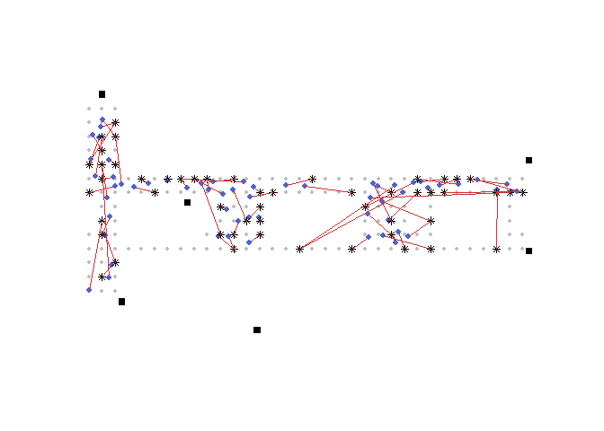
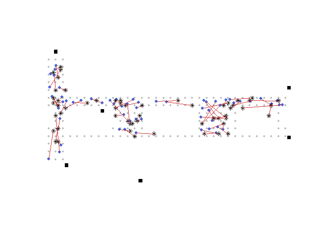

# Laborator Suplimentar

<script>
$(document).ready(function ()  {

    // move toc-ignore selectors from section div to header
    $('div.section.toc-ignore')
        .removeClass('toc-ignore')
        .children('h1,h2,h3,h4,h5').addClass('toc-ignore');

    // establish options
    var options = {
      selectors: "h1,h2,h3",
      theme: "bootstrap3",
      context: '.toc-content',
      hashGenerator: function (text) {
        return text.replace(/[.\\/?&!#<>]/g, '').replace(/\s/g, '_').toLowerCase();
      },
      ignoreSelector: ".toc-ignore",
      scrollTo: 60
    };
    options.showAndHide = false;
    options.smoothScroll = true;

    // tocify
    var toc = $("#TOC").tocify(options).data("toc-tocify");
});
</script>

Obiectivul acestui laborator suplimentar este de a prezenta în limbajul R soluția unei probleme de predicție a locației într-un sistem de poziționare interior^[Acest laborator este inspirat din lucrarea lui Thomas King, Stephan Kopf, Thomas Haenselmann, Christian Lubberger și Wolfgang Effelsberg *COMPASS: A probabilistic indoor positioning system based on 802.11 and digital compasses*, In Proceedings of the 1st international workshop on Wireless network testbeds, experimental evaluation characterization (September 2006), pp. 34-40 și reproduce parte din capitolul *Predicting location via Indoor Positioning Systems* din cartea lui Deborah Nolan și Duncan T. Lang *Data Science in R*, CRC Press, 2015].


# Contextul problemei

Scopul acestui exemplu este de a construi un sistem de localizare a poziției unei persoane în interiorul unei clădiri (IPS - Indoor Positioning System) pe baza intensității semnalelor WiFi detectate de la diferite puncte de acces la rețea fixe (access points). Pentru a construi un astfel de sistem avem nevoie de un set de date de referință care să conțină informații despre intensitatea semnalului, măsurat în diferite locații predefinite din interiorul clădirii, dintre un device mobil (de exemplu un telefon mobil sau un laptop) și diferite puncte de acces fixe (de exemplu routere). Având aceste date încercăm să construim un model de localizare a device-ului mobil ca funcție de intensitatea semnalului dintre acesta și fiecare punct de acces care să permită apoi prezicerea locației unui nou semnal.

Datele provin din două fișiere .txt, numite [*offline*](lab_IPS_data/offline.final.trace.txt) și [*online*](lab_IPS_data/online.final.trace.txt), care se găsesc pe site-ul [CRAWDAD](https://crawdad.org/mannheim/compass/20080411/) (A Community Resource for Archiving Wireless Data At Dartmouth). Setul de date *offline* conține măsurători ale intensității semnalului folosind un laptop IBM Thinkpad R51 pe un grid de 166 de puncte distanțate la un metru fiecare și distribuite pe o suprafață de aproximativ 312 $m^2$ aparținând holului unui birou construit în campusul Universității din Mannheim (suprafața totală $15\times 32$ - vezi planul de mai jos în care cerculețele gri reprezintă locațiile măsurătorilor offline și pătratele negre sunt locațiile punctelor de acces - 6). 


În plus față de coordonatele $(x,y)$ ale device-ului mobil ne sunt furnizate și orientările acestuia. Intensitatea semnalelor a fost înregistrată pentru 8 orientări diferite (0, 45, 90, 135, 180, 225, 270, 315), înregistrându-se un total de 110 măsurători pentru fiecare punct de acces și fiecare combinație de locație-orientare. 

Al doilea set de date, numit *online*, conține 110 înregistrări ale intensității semnalului măsurate pentru fiecare punct de acces și pentru 60 de locații și orientări alese aleator. Acest set de date va fi folosit pentru prezicerea poziției unui device mobil.  

În ambele seturi de date, *offline* și *online*, o parte din cele 110 intensități de semnale nu au fost înregistrate și în plus pot apărea și măsurători de la alte device-uri din vecinătatea unității experimentale (e.g. de la alte laptop-uri sau telefoane). 

# Descrierea și curățarea datelor 

În această etapă vom preprocesa datele din formatul raw (neprelucrat) și le vom explora în vederea analizei ulterioare. Dacă deschidem fișierul *offline.final.trace.txt* cu ajutorul unui editor de text (de exemplu [Notepad++](https://notepad-plus-plus.org/)) putem vedea forma generală a înregistrărilor pentru a ne face o imagine preliminară asupra acestora. O primă intrare este de forma:


```
 [1] "# timestamp=2006-02-11 08:31:58"   
 [2] "# usec=250"                        
 [3] "# minReadings=110"                 
 [4] "t=1139643118358"                   
 [5] "id=00:02:2D:21:0F:33"              
 [6] "pos=0.0,0.0,0.0"                   
 [7] "degree=0.0"                        
 [8] "00:14:bf:b1:97:8a=-38,2437000000,3"
 [9] "00:14:bf:b1:97:90=-56,2427000000,3"
[10] "00:0f:a3:39:e1:c0=-53,2462000000,3"
[11] "00:14:bf:b1:97:8d=-65,2442000000,3"
[12] "00:14:bf:b1:97:81=-65,2422000000,3"
[13] "00:14:bf:3b:c7:c6=-66,2432000000,3"
[14] "00:0f:a3:39:dd:cd=-75,2412000000,3"
[15] "00:0f:a3:39:e0:4b=-78,2462000000,3"
[16] "00:0f:a3:39:e2:10=-87,2437000000,3"
[17] "02:64:fb:68:52:e6=-88,2447000000,1"
[18] "02:00:42:55:31:00=-84,2457000000,1"
```

Tabelul de mai jos prezintă descrierea variabilelor care apar în seturile de date *offline* și *online*:

| Variabila | Scurtă descriere |
|:------|:----------------------------------------------|
| t | timestamp-ul calculată în milisecunde de la miezul nopții zilei de 1 Ianuarie 1970 |
| id | adresa MAC a device-ului cu care s-a scanat |
| pos | poziția fizică a device-ului cu care s-a scanat |
| degree | unghiul de orientare a device-ului cu care s-a scanat |
| MAC | adresa MAC a unui device respondent cu valoarea intensității semnalului în dBm, frecvența canalului și tipul acestuia (punct de acces = 3 și device adhoc = 1) |

Deoarece datele nu vin într-un format bine definit le vom citi fișierul *offline.final.trace.txt* cu ajutorul funcției `readLines()` și apoi ne vom uita la numărul de linii care încep cu $\#$:


```r
doc = readLines("lab_IPS_data/offline.final.trace.txt")
sum(substr(doc,1,1) == "#") # nr de linii care incep cu "#"
[1] 5312
length(doc) # cate linii are documentul
[1] 151392

# cate linii avem de fapt 
# coincide cu nr pe care ne asteptam sa-l avem 
length(doc) - sum(substr(doc,1,1) == "#") 
[1] 146080
# ne asteptam la 
166*8*110 
[1] 146080
```

## Preprocesarea datelor 

În această secțiune vrem să scriem o funcție care să permită transformarea datelor din formatul brut într-un format tabelar (un data.frame) care să aibă drept coloane variabile precum timpul (time), id-ul adresei MAC a device-ului cu care am scanat (mac-id), locația device-ului (coordonatele $x,y,z$), orientarea device-ului, adresa MAC a emitentului semnalului, intensitatea semnalului, frecvența canalului de transmitere precum și tipul de emitent (punct de acces sau device adhoc). 

Dacă ne uităm la prima intrare din setul de date *offline* care nu este un comentariu (nu începe cu $\#$) atunci observăm că numele variabilei este separat de valoarea acesteia prin semnul $=$ iar în situații precum poziția valorile sunt separate prin $,$:


```r
strsplit(doc[4], ";")[[1]]
 [1] "t=1139643118358"                   
 [2] "id=00:02:2D:21:0F:33"              
 [3] "pos=0.0,0.0,0.0"                   
 [4] "degree=0.0"                        
 [5] "00:14:bf:b1:97:8a=-38,2437000000,3"
 [6] "00:14:bf:b1:97:90=-56,2427000000,3"
 [7] "00:0f:a3:39:e1:c0=-53,2462000000,3"
 [8] "00:14:bf:b1:97:8d=-65,2442000000,3"
 [9] "00:14:bf:b1:97:81=-65,2422000000,3"
[10] "00:14:bf:3b:c7:c6=-66,2432000000,3"
[11] "00:0f:a3:39:dd:cd=-75,2412000000,3"
[12] "00:0f:a3:39:e0:4b=-78,2462000000,3"
[13] "00:0f:a3:39:e2:10=-87,2437000000,3"
[14] "02:64:fb:68:52:e6=-88,2447000000,1"
[15] "02:00:42:55:31:00=-84,2457000000,1"
```

Pentru a separa șirul de caractere `doc[4]` în funcție de $;$, $=$ sau $,$ folosim expresia regulată `[;=,]` ca argument a funcției `strsplit()`:


```r
tokens = strsplit(doc[4], "[;=,]")[[1]]
tokens[c(2,4,6:8, 10)] # doar valorile primelor 6 variabile
[1] "1139643118358"     "00:02:2D:21:0F:33" "0.0"              
[4] "0.0"               "0.0"               "0.0"              

# pt celelalte 4 variabile: MAC, signal, channel, device type
tokens[-(1:10)]
 [1] "00:14:bf:b1:97:8a" "-38"               "2437000000"       
 [4] "3"                 "00:14:bf:b1:97:90" "-56"              
 [7] "2427000000"        "3"                 "00:0f:a3:39:e1:c0"
[10] "-53"               "2462000000"        "3"                
[13] "00:14:bf:b1:97:8d" "-65"               "2442000000"       
[16] "3"                 "00:14:bf:b1:97:81" "-65"              
[19] "2422000000"        "3"                 "00:14:bf:3b:c7:c6"
[22] "-66"               "2432000000"        "3"                
[25] "00:0f:a3:39:dd:cd" "-75"               "2412000000"       
[28] "3"                 "00:0f:a3:39:e0:4b" "-78"              
[31] "2462000000"        "3"                 "00:0f:a3:39:e2:10"
[34] "-87"               "2437000000"        "3"                
[37] "02:64:fb:68:52:e6" "-88"               "2447000000"       
[40] "1"                 "02:00:42:55:31:00" "-84"              
[43] "2457000000"        "1"                
```

Valorile din `tokens[-(1:10)]` pot fi văzute ca o matrice cu 4 coloane și câte un rând pentru fiecare adresă de MAC emitentă. Următoarea funcție înglobează aceste operații în vederea aplicârii ei pe întreg setul de date (mai exact pentru fiecare rând din setul de date *offline*). Ea conține de asemenea și cazul în care sunt intrări în setul de date care nu au niciun semnal:


```r
processLine = function(x){
  # x este linia documentului 
  # luam in considerare liniile mai scurte - cele care au mai 
  # putin de 10 variabile (nu avem observatii de semnal)
  tokens = strsplit(x, "[;=,]")[[1]]
  # pt obs care au 10 obs
  if (length(tokens) == 10){
    return(NULL)
  }
  
  tmp = matrix(tokens[-(1:10)], ncol = 4, byrow = TRUE)
  cbind(matrix(tokens[c(2,4,6:8, 10)], 
               nrow = nrow(tmp), ncol = 6, byrow = TRUE),tmp)
}
```

Apelăm această funcție pe întreg setul de date:


```r
# stergem liniile cu # din setul de date
lines = doc[substr(doc, 1, 1) != "#"]

tmp = lapply(lines, processLine) # procesam fiecare linie din doc

# combina data intr-un data.frame 
# uneste toate matricele din lista obtinuta folosind do.call()
offline = as.data.frame(do.call("rbind", tmp), 
                        stringsAsFactors = FALSE)

str(offline)
'data.frame':	1181628 obs. of  10 variables:
 $ V1 : chr  "1139643118358" "1139643118358" "1139643118358" "1139643118358" ...
 $ V2 : chr  "00:02:2D:21:0F:33" "00:02:2D:21:0F:33" "00:02:2D:21:0F:33" "00:02:2D:21:0F:33" ...
 $ V3 : chr  "0.0" "0.0" "0.0" "0.0" ...
 $ V4 : chr  "0.0" "0.0" "0.0" "0.0" ...
 $ V5 : chr  "0.0" "0.0" "0.0" "0.0" ...
 $ V6 : chr  "0.0" "0.0" "0.0" "0.0" ...
 $ V7 : chr  "00:14:bf:b1:97:8a" "00:14:bf:b1:97:90" "00:0f:a3:39:e1:c0" "00:14:bf:b1:97:8d" ...
 $ V8 : chr  "-38" "-56" "-53" "-65" ...
 $ V9 : chr  "2437000000" "2427000000" "2462000000" "2442000000" ...
 $ V10: chr  "3" "3" "3" "3" ...
```

Cum data.frame-ul obținut conține numai variabile de tip `character` următorul pas constă în transformarea acestora după tipul corespunzător, e.g. intensitatea semnalului să devină `numeric`. 


```r
# dam nume variabilelor
names(offline) = c("time","scanMac", "posX", "posY", "posZ", 
                   "orientation", "mac", "signal", "channel", "type")

# convertim variabilele numerice
numVars = c("time", "posX", "posY", "posZ", "orientation",  "signal")
offline[numVars] = lapply(offline[numVars], as.numeric)
```

Cum suntem interasați doar de semnale care provin de la punctele de acces putem să eliminăm înregistrările care conțin adrese de la device-uri adhoc (`type = 3`). 


```r
offline = offline[offline$type == "3", ]

# stergem variabila type
offline = offline[ , names(offline) != "type"] 
dim(offline)
[1] 978443      9
```

Dacă ne uităm la variabila `time` și ținem cont de descrierea din tabelul de mai sus putem să o transformăm în formatul `POSIXt` pentru a putea ulterior să efectuăm operații cu ea în R (să remarcăm totuși că timpul în setul de date este măsurat în milisecunde față de data de referință 01.01.1970 iar în formatul amintit timpul este măsurat față de aceeași dată de referință numai că în secunde, deci se impune o transformare):


```r
offline$rawTime = offline$time
# transformam timpul din millisecunde in secunde
offline$time = offline$time/1000  
class(offline$time) = c("POSIXt", "POSIXct")
```

Vrem să verificăm cum arată fiecare variabilă din setul de date aplicând funcția `summary` (pentru variabile de tip caracter trebuie să le transformăm în prealabil în date de tip `factor` pentru a putea aplica funcția `summary` și în acest caz obținem câte observații avem din fiecare valoarea unică a variabilelor calitative avem): 


```r
# variabilele numerice
summary(offline[, numVars])
      time                          posX            posY       
 Min.   :2006-02-11 09:31:58   Min.   : 0.00   Min.   : 0.000  
 1st Qu.:2006-02-11 15:21:27   1st Qu.: 2.00   1st Qu.: 3.000  
 Median :2006-02-11 21:57:58   Median :12.00   Median : 6.000  
 Mean   :2006-02-16 16:57:37   Mean   :13.52   Mean   : 5.897  
 3rd Qu.:2006-02-19 16:52:40   3rd Qu.:23.00   3rd Qu.: 8.000  
 Max.   :2006-03-09 22:41:10   Max.   :33.00   Max.   :13.000  
      posZ    orientation        signal     
 Min.   :0   Min.   :  0.0   Min.   :-99.0  
 1st Qu.:0   1st Qu.: 90.0   1st Qu.:-69.0  
 Median :0   Median :180.0   Median :-60.0  
 Mean   :0   Mean   :167.2   Mean   :-61.7  
 3rd Qu.:0   3rd Qu.:270.0   3rd Qu.:-53.0  
 Max.   :0   Max.   :359.9   Max.   :-25.0  

# variabilele calitative - trebuie transformate in factor
summary(sapply(offline[, c("mac", "channel", "scanMac")], 
               as.factor))
                mac               channel                    scanMac      
 00:0f:a3:39:e1:c0:145862   2462000000:189774   00:02:2D:21:0F:33:978443  
 00:0f:a3:39:dd:cd:145619   2437000000:152124                             
 00:14:bf:b1:97:8a:132962   2412000000:145619                             
 00:14:bf:3b:c7:c6:126529   2432000000:126529                             
 00:14:bf:b1:97:90:122315   2427000000:122315                             
 00:14:bf:b1:97:8d:121325   2442000000:121325                             
 (Other)          :183831   (Other)   :120757                             
```

Uitându-ne la rezultatele obținute mai sus remarcăm că variabila `scanMac` are o singură valoarea ceea ce ne spune că datele au fost culese cu un singur aparat și prin urmare putem să renunțăm la această variabilă. De asemenea variabila `posZ` este constantă $0$ ceea ce înseamnă că toate măsurătorile au fost luate de la același nivel și putem renunța și la această variabilă. 


```r
offline = offline[, !names(offline) %in% c("scanMac", "posZ")]
```

## Să explorăm orientările

În această secțiune ne oprim să studiem un pic orientările device-ului mobil care a înregistrat datele. Conform documentației, ne așteptăm ca setul de date să conțină 8 orientări (0, 45, 90, 135, 180, 225, 270, 315) numai că găsim 


```r
length(unique(offline$orientation))
[1] 203
```

iar funția de repartiție empirică a acestora este 


ceea ce arată că observațiile sunt aglomerate în jurul celor 8 valori de orientare. Următoarea funcție permite transformarea unghiurilor din setul de date în unghiurile corespunzătoare orientăriilor celor mai apropiate (e.g. $47.5$ se duce în $45$ și $358.2$ se duce în $0$)


```r
roundOrientation = function(angles){
  refs = seq(0,360, by = 45)
  q = sapply(angles, function(x){
        which.min(abs(x-refs))
      })# indicii minimului 
  a = c(refs[1:8], 0)# schimba 360 in 0 
  return(a[q])
}
```

Schimbând orientările obținem rezultatul așteptat


```r
offline$angle = roundOrientation(offline$orientation)
```


## Să explorăm adresele MAC emitente

Dacă ne uităm la datele sumarizate ale adreselor MAC emitente (ale punctelor de acces) și ale frecvenței canalelor de emisie am putea concluziona că există o bijecție între acestea: 


```
                mac               channel      
 00:0f:a3:39:e1:c0:145862   2462000000:189774  
 00:0f:a3:39:dd:cd:145619   2437000000:152124  
 00:14:bf:b1:97:8a:132962   2412000000:145619  
 00:14:bf:3b:c7:c6:126529   2432000000:126529  
 00:14:bf:b1:97:90:122315   2427000000:122315  
 00:14:bf:b1:97:8d:121325   2442000000:121325  
 (Other)          :183831   (Other)   :120757  
```

Dacă ne uităm la câte observații din fiecare adresă MAC avem, obținem că sunt trei adrese cu un număr foarte mic de observații în comparație cu celelalte ceea ce implică că aceste device-uri nu au fost aria de test (poate au provenit de la un alt etaj) sau nu au fost active pe toată durata testului. 


```r
table(offline$mac)

00:04:0e:5c:23:fc 00:0f:a3:39:dd:cd 00:0f:a3:39:e0:4b 00:0f:a3:39:e1:c0 
              418            145619             43508            145862 
00:0f:a3:39:e2:10 00:14:bf:3b:c7:c6 00:14:bf:b1:97:81 00:14:bf:b1:97:8a 
            19162            126529            120339            132962 
00:14:bf:b1:97:8d 00:14:bf:b1:97:90 00:30:bd:f8:7f:c5 00:e0:63:82:8b:a9 
           121325            122315               301               103 
```

Conform documentației setului de date știm că punctele de acces consistă din 5 routere Linksys/Cisco și un router Lancom L-54g. Accesând pagina [http://coffer.com/mac_find/](http://coffer.com/mac_find/) găsim că adresele care încep cu `00:14:bf` aparțin producătorului Linksys/Cisco dar nu găsim o corespondență cu routerul Lancom L-54g și prin urmare vom păstra primele 7 adrese după numărul de observații. 


```r
subMacs = names(sort(table(offline$mac), decreasing = TRUE))[1:7]

# stergem observatiile canu nu se MAC-ul corespunzator
offline = offline[offline$mac %in% subMacs, ]

# verificam daca avem corespondenta bijectiva
table(offline[c("mac", "channel")])
                   channel
mac                 2412000000 2422000000 2427000000 2432000000 2437000000
  00:0f:a3:39:dd:cd     145619          0          0          0          0
  00:0f:a3:39:e1:c0          0          0          0          0          0
  00:14:bf:3b:c7:c6          0          0          0     126529          0
  00:14:bf:b1:97:81          0     120339          0          0          0
  00:14:bf:b1:97:8a          0          0          0          0     132962
  00:14:bf:b1:97:8d          0          0          0          0          0
  00:14:bf:b1:97:90          0          0     122315          0          0
                   channel
mac                 2442000000 2462000000
  00:0f:a3:39:dd:cd          0          0
  00:0f:a3:39:e1:c0          0     145862
  00:14:bf:3b:c7:c6          0          0
  00:14:bf:b1:97:81          0          0
  00:14:bf:b1:97:8a          0          0
  00:14:bf:b1:97:8d     121325          0
  00:14:bf:b1:97:90          0          0
```

Cum avem o corespondență bijectivă între adresele MAC emitente și frecvența canalelor de emisie putem elimina variabila `channel` din setul de date:


```r
# stergem variabila channel
offline = offline[, names(offline)!="channel"]
```

## Să explorăm poziția device-ului mobil

Investigăm care sunt locațiile diferite în care s-au înregistrat datele și pentru aceasta apelăm funcția `by()`. 


```r
# functia by() verifica toate pereichile posibile
# aplica o functie la un data.frame impartiti dupa diverse categorii
locDF = with(offline, by(offline, list(posX, posY), 
                         function(x) x))
length(locDF) # marimea listei
[1] 476
```

Conform documentației ne așteptăm să avem $166$ de locații dar găsim că avem 476, diferența reiese din faptul că multe din pozițiile rezultate aplicând funcția `by()` sunt nule, mai exact avem 


```r
sum(sapply(locDF, is.null))
[1] 310

# eliminam elementele nule
locDF = locDF[!sapply(locDF, is.null)]
```

Pentru a determina câte observații avem pentru fiecare locație în parte și a reprezenta grafic aceste date avem:


```r
# pastram si pozitia
locCounts = sapply(locDF, function(df){
  # fiecare element din locDF este un data.frame cu 8 coloane 
  c(df[1, c("posX","posY")], count = nrow(df))
})

locCounts[, 1:8]
      [,1] [,2] [,3] [,4] [,5] [,6] [,7] [,8]
posX  0    1    2    0    1    2    0    1   
posY  0    0    0    1    1    1    2    2   
count 5505 5505 5506 5524 5543 5558 5503 5564

# pentru grafic 
locCounts = t(locCounts) # transpunem 
```


```
Graficul cu coordonatele locatiilor
```


```
Graficul cu numarul de observatii din fiecare locatie
```


Pentru reproductibilitate, sumarizăm toate operațiile efectuate până acum într-o singură funcție `readData()`:


```r
# Corpul functiei readData()
#----------------------------

readData = 
  function(filename = 'lab_IPS_data/offline.final.trace.txt', 
                   subMacs = c("00:0f:a3:39:e1:c0", 
                               "00:0f:a3:39:dd:cd", 
                               "00:14:bf:b1:97:8a",
                               "00:14:bf:3b:c7:c6", 
                               "00:14:bf:b1:97:90", 
                               "00:14:bf:b1:97:8d",
                               "00:14:bf:b1:97:81"))
  {
    # functia care citeste si curata datele  
    
    doc = readLines(filename)# citeste data 
    doc = doc[substr(doc,1,1)!="#"]# sterge comment-urile 
    
    tmp = lapply(doc, processLine) # proceseaza documentul
    offline = as.data.frame(do.call("rbind", tmp), 
                            stringsAsFactors = FALSE)# in data.frame
    
    # numele variabilelor  
    names(offline) = c("time","scanMac", "posX", "posY", 
                       "posZ", "orientation", "mac", 
                       "signal", "channel", "type")
    
    # pastram semnale de la punctele de acces
    offline = offline[ offline$type == "3", ]
    
    # eliminam var scanMac, posZ, channel, si type - 
    #contin informatie redundanta
    dropVars = c("scanMac", "posZ", "channel", "type")
    offline = offline[ , !( names(offline) %in% dropVars ) ]
    
    # eliminam punctele de acces care nu prezinta interes
    offline = offline[ offline$mac %in% subMacs, ]
    
    # transform variabilele in numeric 
    numVars = c("time", "posX", "posY", "orientation", "signal")
    offline[numVars] = lapply(offline[numVars], as.numeric)
    
    # pastram timpul raw
    offline$rawTime = offline$time
    offline$time = offline$time/1000 # ms in s
    class(offline$time) = c("POSIXt", "POSIXct")
    
    # rotunjim orientarile la 45 
    offline$angle = roundOrientation(offline$orientation)
    
    return(offline)
    
    # fct de procesare 
    processLine = function(x){
      # x este linia documentului 
      # luam in considerare liniile mai scurte - cele care au mai 
      # putin de 10 variabile (nu avem observatii de semnal)
      tokens = strsplit(x, "[;=,]")[[1]]
      # pt obs care au 10 obs
     
      if (length(tokens) == 10){
        return(NULL)
      }
      
      tmp = matrix(tokens[-(1:10)], ncol = 4, byrow = TRUE)
      cbind(matrix(tokens[c(2,4,6:8, 10)], nrow = nrow(tmp), 
                   ncol = 6, byrow = TRUE),tmp)
    }
    
    # Functia de rotunjire a orientarilor 
    roundOrientation = function(angles){
      refs = seq(0,360, by = 45)
      q = sapply(angles, function(x){
        which.min(abs(x-refs))
      })
      a = c(refs[1:8], 0)# 360 -> 0 
      return(a[q])
    }
  }
```

Apelăm funcția 


```r
offline = readData()
```


# Analiza intensității semnalului 

În această secțiune ne propunem să investigăm care este comportamentul variabilei intensitatea semnalului și să investigăm cum locația, orientarea și punctul de acces poate influența repartiția intensității semnalului. 

## Repartiția intensității semnalului 

Ne propunem să comparăm cum este repartizată intensitatea semnalului în funcție de diferite unghiuri de orientare și diferite puncte de acces. Fixând o locație (e.g. $(x,y)=(22,4)$) ne uităm cum variază intensitatea semnalului odată cu schimbarea orientării:


Să ne reamintim că intensitatea semnalului se măsoară în valori negative cu valori mici de tipul $-98$ însemnând semnale slabe și valori mar de tipul $-25$ însemnând intensitate puternică. Repartiția intensității semnalului pentru locația centrală $(x,y)=(12,5)$ în funcție de fiecare orientare și adresă MAC este 


Dacă am vrea să investigăm repartiția semnalului după toate cele 166 de poziții, 8 orientări și 6 puncte de acces ar trebui să facem mii de grafice și cum acest lucru este practic imposibil putem să sumarizăm datele așa încât pentru fiecare pereche locație-orientare-punct de acces să avem o valoare medie, mediană, o abatere standard și un interval între cuartile IQR. 

Începem prin a crea o nouă variabilă care conține toate perechile de puncte $(x,y)$ și apoi creăm o listă de data.frame-uri pentru fiecare combinație $(x,y)$, unghi și punct de acces:


```r
offline$posXY = paste(offline$posX, offline$posY, sep = "-")

byLocAngleAP = with(offline, 
                    by(offline, list(posXY, angle, mac), 
                       function(x) x))
length(byLocAngleAP) # cate data.frame-uri avem 166*8*7
[1] 9296
```

și continuăm prin calculul statisticilor de sumarizare 


```r
signalSummary = lapply(byLocAngleAP, function(oneLoc){
  # creaza o data.frame care are aceleasi campuri ca cea originala
  ans = oneLoc[1, ] 
  ans$medSignal = median(oneLoc$signal)
  ans$avgSignal = mean(oneLoc$signal)
  ans$num = length(oneLoc$signal)
  ans$sdSignal = sd(oneLoc$signal)
  ans$irqSignal = IQR(oneLoc$signal)
  return(ans)
})

# cream un data.frame din variabilele sumarizate
offlineSummary = do.call("rbind", signalSummary) 
```

Ne uităm dacă abaterile standard variază în funcție de intensitatea medie a semnalului recepționat și constatăm că semnalele slabe au o abatere standard mai mică și aceasta crește odată cu creșterea intensității semnalului.


## Cum influențează distanța semnalul ?

Pentru a vedea cum este influențat semnalul în funcție de distanță vom trasa o hartă topografică (un heat map) folosind pachetul `fields` care o folosește o metodă de tip spline pentru a potrivi (fit) o suprafață în locațiile date după valorile intensității semnalului recepționat. Funcția `Tps()` (Thin plate spline regression) necesită pentru fiecare pereche de puncte $(x,y)$ o unică valoare $z$ și prin urmare vom folosi setul de date *offlineSummary*:


```r
# functia care traseaza pentru o adresa MAC si un unghi 
# heat map-ul necesar
surfaceSS = function(data, mac, angle = 45, ...){
  require(fields) # avem nevoie de acest pachet
  
  # subsectionam data
  oneAPAngle = data[data$mac == mac & data$angle == angle, ] 
  
  # construim suprafata prin regresie spline
  smoothSS = Tps(oneAPAngle[, c("posX","posY")], oneAPAngle$avgSignal)
  
  # transforma functia fitata intr-o suprafata plotabila
  vizSmooth = predictSurface(smoothSS)
  plot.surface(vizSmooth, type = "C", 
               xlab = "", ylab = "", xaxt = "n", yaxt = "n", 
               bty = "n", ...)
  
  points(oneAPAngle$posX, oneAPAngle$posY, pch=19, cex = 0.5)
}
```


```
Graficul pentru adresa MAC  00:0f:a3:39:e1:c0 
```


```
Graficul pentru adresa MAC  00:0f:a3:39:dd:cd 
```


```
Graficul pentru adresa MAC  00:14:bf:b1:97:8a 
```


```
Graficul pentru adresa MAC  00:14:bf:3b:c7:c6 
```


```
Graficul pentru adresa MAC  00:14:bf:b1:97:90 
```


```
Graficul pentru adresa MAC  00:14:bf:b1:97:8d 
```


```
Graficul pentru adresa MAC  00:14:bf:b1:97:81 
```


Graficele de mai sus ne spun și unde se află locațiile punctelor de acces pe plan. Putem să creăm o matrice cu pozițiile și numele celor 6 puncte de acces:


```r
AP = matrix(c(7.5, 6.3, 2.5, -.8, 12.8, -2.8, 
              1, 14, 33.5, 9.3, 33.5, 2.8), 
            ncol = 2, byrow = TRUE, 
            dimnames = list(subMacs[-2], c("x", "y")))
AP
                     x    y
00:0f:a3:39:e1:c0  7.5  6.3
00:14:bf:b1:97:8a  2.5 -0.8
00:14:bf:3b:c7:c6 12.8 -2.8
00:14:bf:b1:97:90  1.0 14.0
00:14:bf:b1:97:8d 33.5  9.3
00:14:bf:b1:97:81 33.5  2.8
```


Pentru a vedea ce relație există între intensitatea semnalului și distanța de la punctul de acces putem să calculăm distanțele de la locația device-ului până la punctele de acces (distanța Euclidiană)


```r
offlineSummary = subset(offlineSummary, mac != subMacs[2])

# calculam diferenta de pozitie x si y dintre 
# locatie si punctul de acces
diffs = offlineSummary[, c("posX", "posY")] - 
  AP[offlineSummary$mac, ]

# dist Euclidiana
offlineSummary$dist = sqrt(diffs[ ,1]^2 + diffs[, 2]^2)
```


# Metodă de prezicere a locației bazată pe cei mai apropiați vecini

Pentru a putea estima locația unei noi observații pe baza intensității semnalului dintre un device mobil aflat în acea locație și câteva puncte de acces fixate, vom folosi metoda celor mai apropiați $k$ vecini ($k$-nearest neighbors sau $k-NN$). Idea din spatele acestei metode este următoarea: avem un set de date de antrenament (training data) în care intensitatea semnalului către cele 6 puncte de acces fixe este măsurată din diferite poziții cunoscute din interiorul clădirii în care se desfășoară experimentul; atunci când avem o observație nouă, ceea ce înseamnă că avem un nou set de măsurători a intensității semnalului efectuate din locația necunoscută către punctele de acces, găsim $k$ observații din setul de date de antrenament care sunt cele mai *similare* de noua observație. Prin *similare* înțelegem că intensitatea semnalelor înregistrate între punctele de acces și noua observație a cărei locație este necunoscută este apropiată de intensitatea semnalelor înregistrate între punctele de acces și cele $k$ observații. Estimăm poziția observației noi prin agregarea poziției celor $k$ observații din datele de antrenament. 

Vom măsura distanța dintre două seturi de intensități de semnale cu ajutorul metricii Euclidiene^[Binențeles se pot alege și alte metrici pentru a calcula similaritatea dintre două observații, e.g. metrica [Mahalanobis](https://en.wikipedia.org/wiki/Mahalanobis_distance) sau [Minkowski](https://en.wikipedia.org/wiki/Minkowski_distance), distanța Euclidiană este un caz particular de Minkowski ($p=2$).], anume având date două observații $o1$ și $o2$, acestea sunt caracterizate fiecare de un 6-tuplu de intensități de semnale $(S_1^i,S_3^i, S_3^i,S_4^i, S_5^i, S_6^i)$, $i\in\{1,2\}$ către cele 6 puncte de acces și 

$$
  d_E(o1,o2) = \sqrt{(S_1^2-S_1^2)^2 + (S_2^2-S_2^2)^2 + (S_3^2-S_3^2)^2 + (S_4^2-S_4^2)^2 + (S_5^2-S_5^2)^2 + (S_6^2-S_6^2)^2}
$$

## Pregătirea setului de date online

Setul de date de test este setul de date *online* (acestea sunt noile observații a căror locație vrem să o estimăm). Vom folosi funcția `readData()` pentru a preprocesa (curăța și aduce la forma dorită pentru analiză) acest set de date. 


```r
# valorile adreselor mac pt cele 6 puncte de acces
macs = unique(offlineSummary$mac)
online = readData(filename = "lab_IPS_data/online.final.trace.txt",
                  subMacs = macs)
```

Pentru a ne face o impresie preliminară asupra acestui set de date, vrem să ilustrăm câte observații avem pentru fiecare pereche *locație - unghi orientare* 


```r
# cream o noua variabila prin unirea perechii x-y
online$posXY = paste(online$posX, online$posY, sep = "-")

# cate noi locatii avem?
length(unique(online$posXY))
[1] 60

tabonlineXYA = table(online$posXY, online$angle)
head(tabonlineXYA, 10)
            
               0  45  90 135 180 225 270 315
  0-0.05       0   0   0 593   0   0   0   0
  0.15-9.42    0   0 606   0   0   0   0   0
  0.31-11.09   0   0   0   0   0 573   0   0
  0.47-8.2   590   0   0   0   0   0   0   0
  0.78-10.94 586   0   0   0   0   0   0   0
  0.93-11.69   0   0   0   0 583   0   0   0
  1.08-12.19   0   0   0   0   0 630   0   0
  1.24-3.93    0   0   0   0   0   0 574   0
  1.39-6.61    0   0   0 595   0   0   0   0
  1.52-9.32  583   0   0   0   0   0   0   0
```

Tabelul de mai sus ne arată că pentru fiecare locație au fost înregistrate intensitățile semnalelor pentru o singură orientare și nu pentru 8 orientări ca și în cazul setului de date *offline*.

Vrem să organizăm datele *online* pentru analiză într-un data.frame care să conțină informații sumarizate pe câte o coloană pentru fiecare dintre cele 6 puncte de acces în care să se înregistreze valoarea intensității semnalului corespunzător (este diferit față de organizarea datelor *offline* întrucât în această situație știm în prealabil câte punte de acces emit semnal - 6). Păstrăm în setul de date doar acele informații care permit estimarea pozițiilor: poziția, orientarea și intensitatea semnalului pentru fiecare din cele 6 puncte de acces.


```r
# ce variabile pastram
keepVars = c("posXY", "posX", "posY", "orientation", "angle")

# sumarizam observatiile - dupa medie
byLoc = with(online, by(online, list(posXY), function(x) {
  ans = x[1,keepVars]
  avgSS = tapply(x$signal, x$mac, mean)
  y = matrix(avgSS, nrow = 1, ncol = 6, dimnames = list(ans$posXY, names(avgSS)))
  cbind(ans, y)
}))

# datele sumarizate
onlineSummary = do.call("rbind", byLoc)


dim(onlineSummary)
[1] 60 11
names(onlineSummary)
 [1] "posXY"             "posX"              "posY"             
 [4] "orientation"       "angle"             "00:0f:a3:39:e1:c0"
 [7] "00:14:bf:3b:c7:c6" "00:14:bf:b1:97:81" "00:14:bf:b1:97:8a"
[10] "00:14:bf:b1:97:8d" "00:14:bf:b1:97:90"
```

Deoarece în modelul bazat pe cei mai apropiați vecini dorim să comparăm observațiile noi cu cele din setul de date *offline* în vederea găsirii acelor observații care sunt cele mai apropiate în sensul intensității semnalelor măsurate față de cele 6 puncte de acces, ar trebui ca acestea din urmă să prezinte caracteristici similare cu cele cu care le comparăm, de exemplu am vrea să comparăm observații care au orientare similară cu cele noi. Pentru aceasta vom considera toate observațiile care au orientarea într-un interval specificat. De exemplu dacă dorim doar o orientare atunci alegem din setul de date *offline* doar pe acelea care au aceeași orientare (după rotunjire) cu cea a noii observații (tot după rotunjire la unghi de 45 de grade). Dacă în schimb dorim două orientări atunci le alegem orientările (multiplii de 45 de grade) care mărginesc orientarea observației noi. 


```r
# pentru numarul de orientari m
m = 3

# unghiul noii observatii
angleNewObs = 230

# determinam cel mai apropiat unghi de 45
refs = seq(0, by = 45, length = 8)
nearestAngle = roundOrientation(angleNewObs)

# dupa cum m este par sau impar
if (m %% 2 == 1){
  angles = seq(-45*(m-1)/2, 45*(m-1)/2, length = m)
}else{
  m = m+1
  angles = seq(-45*(m-1)/2, 45*(m-1)/2, length = m)
  if (sign(angleNewObs - nearestAngle)>-1){
    angles = angles[-1]
  }else{
    angles = angles[-m]
  }
}
# transformam unghiurile si le ajustam 
# e.g. -45 -> 315 si 405 -> 45
angles = angles + nearestAngle
angles[angles<0] = angles[angles<0] + 360
angles[angles>360] = angles[angles>360] - 360

# alegem observatiile cu unghiurile corespunzatoarea
offlineSubset = offlineSummary[offlineSummary$angle %in% angles, ]
```

Transformăm setul de date ales (cel de antrenament) în același format cu cel pentru datele de test `onlineSummary` cu ajutorul unei funcții:


```r
reshapeSS = function(data, varSignal = "signal", 
                     keepVars = c("posXY", "posX", "posY")){
  byLocation = with(data, by(data, list(posXY), function(x){
    ans = x[1,keepVars]
    avgSS = tapply(x[,varSignal], x$mac, mean)
    y = matrix(avgSS, nrow = 1, ncol = 6, 
               dimnames = list(ans$posXY, names(avgSS)))
    cbind(ans, y)
  }))
  newDataSS = do.call("rbind", byLocation)
  return(newDataSS)
}

# sumarizam setul de date de antrenament 
trainSS = reshapeSS(offlineSubset, varSignal = "avgSignal")
```

Creăm o funcție care să automatizeze acest proces: selecție de unghiuri de orientare și transformare de date pentru antrenament. Funcția `selectTrain()` calculează media intensității semnalelor ce corespund la diferite orientări pentru a produce un singur 6-tuplu de intensități de semnele pentru fiecare din cele 166 de locații.


```r
# numim functia selectTrain()
selectTrain = function(angleNewObs, signals = NULL, m = 1){
  refs = seq(0, by = 45, length = 8)
  nearestAngle = roundOrientation(angleNewObs)
  
  if (m %% 2 == 1){
    angles = seq(-45*(m-1)/2, 45*(m-1)/2, length = m)
  }else{
    m = m+1
    angles = seq(-45*(m-1)/2, 45*(m-1)/2, length = m)
    if (sign(angleNewObs - nearestAngle)>-1){
      angles = angles[-1]
    }else{
      angles = angles[-m]
    }
  }
  # transformam unghiurile si le ajustam 
  # e.g. -45 -> 315 si 405 -> 45
  angles = angles + nearestAngle
  angles[angles<0] = angles[angles<0] + 360
  angles[angles>360] = angles[angles>360] - 360
  angles = sort(angles) 
  
  offlineSubset = signals[signals$angle %in% angles, ]
  reshapeSS(offlineSubset, varSignal = "avgSignal")
}

# testam pentru unghiul 130 si m = 3
train130 = selectTrain(130, offlineSummary, 3)
head(train130)
     posXY posX posY 00:0f:a3:39:e1:c0 00:14:bf:3b:c7:c6 00:14:bf:b1:97:81
0-0    0-0    0    0         -52.37243         -66.13039         -63.19262
0-1    0-1    0    1         -52.98182         -65.37177         -63.72941
0-10  0-10    0   10         -56.34184         -65.67238         -69.16041
0-11  0-11    0   11         -54.73420         -67.17593         -70.34538
0-12  0-12    0   12         -56.03030         -70.46493         -72.28758
0-13  0-13    0   13         -54.55152         -71.19211         -72.58496
     00:14:bf:b1:97:8a 00:14:bf:b1:97:8d 00:14:bf:b1:97:90
0-0          -35.58063         -64.25411         -55.33780
0-1          -39.37649         -65.44867         -59.15328
0-10         -44.71545         -66.85781         -50.45502
0-11         -48.34689         -66.78383         -54.93054
0-12         -45.17264         -66.72696         -50.49886
0-13         -43.32784         -68.72616         -54.48160
```

## Să găsim cei mai apropiați vecini

În această secțiune construim funcția `findNN()` care permite găsirea celor mai apropiați $k$ vecini de noua observație din setul de date de test. Funcția primește ca date de intrare un vector numeric de lungime 6 ce corespunde intensității semnalelor pentru noua observație și datele de antrenament rezultate din aplicarea funcției `selectTrain()`. Ca date de ieșire funcția întoarce locațiile observațiilor din setul de date de antrenament în funcție de apropierea de observația nouă, de test.


```r
# functia findNN
findNN = function(newSignal, trainSubset){
  # aplicam functia x-newSignal liniilor 
  diffs = apply(trainSubset[, 4:9], 1, function(x) x-newSignal)
  
  # aplicam functia coloanelor 
  dists = apply(diffs, 2, function(x) sqrt(sum(x^2)))
  
  # ordonam observatiile
  closest = order(dists)
  
  # intoarcem pozitiile obs ordonate
  return(trainSubset[closest, 1:3])
}
```

Estimam pozitiile noilor puncte cu ajutorul funcției `predXY()` care calculează media aritmetică a locațiilor celor mai apropiate $k$ puncte (aici puteți să dați o metodă alternativă de calcul a locațiilor):


```r
# functia predXY
predXY = function(newSignals, newAngles, trainData, 
                  numAngles = 1, k = 3){
  
  closeXY = list(length = nrow(newSignals))
  
  for (i in 1:nrow(newSignals)){
    trainSS = selectTrain(newAngles[i], trainData, m = numAngles)
    closeXY[[i]] = findNN(newSignal = as.numeric(newSignals[i,]), trainSS)
  }
  # estimam locatia 
  estXY = lapply(closeXY, function(x) sapply(x[, 2:3], 
                                             function(x) mean(x[1:k])))
  estXY = do.call("rbind", estXY)
  return(estXY)
}
```

Vom testa rezultatele pentru două modele, unul în care considerăm trei vecini și trei orientări și un altul în care considerăm un vecin și trei orientări. Funcția `calcError()` determină eroarea în sensul sumei celor mai mici pătrate. 


```r
# testam 

estXYk3 = predXY(newSignals = onlineSummary[, 6:11], 
                 newAngles = onlineSummary[, 4], 
                 offlineSummary, numAngles = 3, k = 3)
estXYk1 = predXY(newSignals = onlineSummary[, 6:11], 
                 newAngles = onlineSummary[, 4], 
                 offlineSummary, numAngles = 3, k = 1)

# eroarea
calcError = function(estXY, actualXY){
  sum(rowSums((estXY-actualXY)^2))
}

actualXY = onlineSummary[, c("posX", "posY")]
sapply(list(estXYk1, estXYk3), calcError, actualXY)
[1] 659.4003 306.7025
```

Putem constata că atunci când alegem metoda celor mai mici pătrate cu 3 vecini rezultatele sunt mai bune. Putem observa și grafic acest lucru din figurile de mai jos în care segmentele roșii arată cum locațiile de test (punctele albastre) se conectează cu locațiile prezise (asterix). 


```
Graficul care ilustreaza metoda celor mai apropiati vecini pentru k = 1
```



```
Graficul care ilustreaza metoda celor mai apropiati vecini pentru k = 3
```




