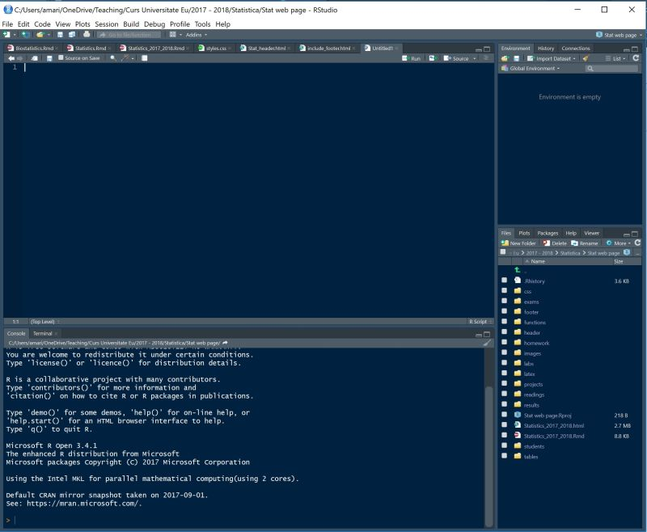

<script>
$(document).ready(function ()  {

    // move toc-ignore selectors from section div to header
    $('div.section.toc-ignore')
        .removeClass('toc-ignore')
        .children('h1,h2,h3,h4,h5').addClass('toc-ignore');

    // establish options
    var options = {
      selectors: "h1,h2,h3",
      theme: "bootstrap3",
      context: '.toc-content',
      hashGenerator: function (text) {
        return text.replace(/[.\\/?&!#<>]/g, '').replace(/\s/g, '_').toLowerCase();
      },
      ignoreSelector: ".toc-ignore",
      scrollTo: 60
    };
    options.showAndHide = false;
    options.smoothScroll = true;

    // tocify
    var toc = $("#TOC").tocify(options).data("toc-tocify");
});
</script>

Obiectivul acestui laborator este de a prezenta o scurtă introducere în programul [R](https://cran.r-project.org/) (cu ajutorul interfeței grafice [RStudio](https://www.rstudio.com/)). O descriere detaliată a acestui program precum și versiunile disponibile pentru descărcat se găsesc pe site-ul [`www.r-project.org`](http://www.r-project.org).

```{r, echo=FALSE}
library(knitr)

source("functions/figureNumber.R")
source("functions/tableNumber.R")
```

# Introducere 

Programul `R` este un program **gratuit** destinat, cu precădere, analizei statistice și prezintă o serie de avantaje:

  * rulează aproape pe toate platformele și sistemele de operare 
  * permite folosirea metodelor statistice clasice cu ajutorul unor funcții predefinite
  * este adoptat ca limbaj de analiză statistică în majoritatea domeniilor aplicate
  * prezintă capabilități grafice deosebite
  * permite utilizarea tehnicilor statistice de ultimă oră prin intermediul pachetelor dezvoltate de comunitate (în prezent sunt mai mult de 10000 de pachete) 
  * are o comunitate foarte activă și în continuă creștere 
  
```{r, echo=FALSE, message=FALSE, fig.align='center', fig.cap=fn("Numarul de pachete din R"), fig.width=5}
library(ggplot2)
library(ggrepel)

pkgs = read.csv("dataOut/pkgsNr.csv", stringsAsFactors = FALSE)

# Extract major release information
pkgs$version = as.character(pkgs$version)
pkgs$date = as.Date(pkgs$date, format = "%Y-%m-%d")

major_releases <- pkgs[-grep("\\.", pkgs$version), ]
# major_releases$date = as.Date(major_releases$date, format = "%Y-%m-%d")

#
p = ggplot(pkgs, aes(x = date, y = pkgs)) + 
  geom_smooth(fill = "#9FB6CD", colour = "#6C7B8B") +
  geom_point(size = 2, colour = "brown3") + 
  # geom_rug(colour = "grey50") +
  geom_vline(data = major_releases, 
             aes(xintercept = as.numeric(date)), 
             colour = "#6C7B8B", linetype = 2) +
  geom_text(data = major_releases, 
            aes(label = paste("Versiunea", version), y = 8000), 
            angle = 90, 
            colour = "grey20",
            hjust = 1, vjust = -1) +
  geom_text_repel(data = pkgs[which(pkgs$version %in% c("2", "2.11", "3", "3.3")), ], 
                  aes(x = date, y = pkgs, label = pkgs), 
                  colour = "grey20") +
  theme_minimal() +
  ggtitle("Numarul de pachete in functie de versiunea de R") +
  xlab(NULL) +
  ylab(NULL)

suppressMessages(p)
```

## Interfața `RStudio`

Interfața RStudio (vezi Figura 1) este compusă din patru ferestre:

  - *Fereastra de editare* (stânga sus): în această fereastră apar fișierele, de tip `script`, în care utilizatorul dezvoltă propriile funcții ori script-uri.  
  - *Fereastra de comandă* sau *consola* (stânga jos): în această fereastră sunt executate comenzile R
  - *Fereastra cu spațiul de lucru/istoricul* (dreapta sus): conține obiectele definite în memorie și istoricul comenzilor folosite
  - *Fereastra de explorare* (dreapta jos): în această fereastră ne putem deplasa în interiorul repertoriului (tab-ul *Files*), putem vedea graficele trasate (tab-ul *Plots*) dar și pachetele instalate (tab-ul *Packages*). De asemenea, tot în această fereastră putem să și căutăm documentația despre diferite funcții, folosind fereastra de ajutor (tab-ul *Help*).
  
```{r echo=FALSE, fig.align='center', fig.cap=fn("Interfata RStudio")}

```

## Pachetele ajutătoare

Pe lângă diferitele pachete conținute în versiunea de bază a programului `R` se mai pot instala și pachete suplimentare. Pentru a instala un pachet suplimentar se apelează comanda:

```{r, eval=FALSE}
install.packages("nume pachet")
```

Odată ce pachetul este instalat, pentru a încărca pachetul, și prin urmare funcțiile disponibile în acesta, se apelează comanda:

```{r, eval=FALSE}
library("nume pachet")
```

Instalarea unui pachet se face o singură dată dar încărcarea acestuia trebuie făcută de fiecare dată când lansăm o sesiune nouă.

# Primele comenzi în `R`

## Calcul elementar 

Programul `R` poate fi folosit și pe post de calculator (mai avansat). De exemplu putem face calcule elementare 

```{r}
5 - 1 + 10
7 * 10 / 2
exp(-2.19)
pi
sin(2 * pi/3)
```

De asemenea, rezultatele pot fi stocate într-o variabilă 

```{r}
a = (1+sqrt(5)/2)/2
```

păstrată în memorie (`a` apare în fereastra de lucru -  `Environment`) și care poate fi reutilizată ulterior

```{r}
asq = sqrt(a)
asq
```

Pentru a șterge toate variabilele din memorie trebuie să folosim comanda următoare (funcția `ls()` listează numele obiectelor din memorie iar comanda `rm()` șterge obiectele; de asemenea se poate folosi și comanda `ls.str()` pentru a lista obiectele împreună cu o scurtă descriere a lor)

```{r, eval=FALSE}
ls.str()
rm(list = ls())
```

## Folosirea documentației

Funcția `help()` și operatorul de ajutor `?` ne permite accesul la paginile de documentația pentru funcțiile, seturile de date și alte obiecte din R. Pentru a accesa documentația pentru funcția standard `mean()` putem să folosim comanda `help(mean)` sau `?mean` în consolă. Pentru a accesa documentația unei funcții dintr-un pachet care nu este în prezent încărcat (dar este instalat) trebuie să adăugăm în plus numele pachetului, de exemplu `help(rlm, package = "MASS")` iar pentru a accesa documentația întregului pachet putem folosi comanda `help(package = "MASS")`. 

O altă funcție de căutare des utilizată, în special în situația în care nu știm cu exactitate numele obiectului pe care îl căutăm, este funcția `apropos()`. Aceasta permite căutarea obiectelor (inclusiv funcții), disponibile în pachetele încărcate în sesiunea curentă, după un șir de caractere specificat (se pot folosi și expresii regulate). De exemplu dacă apelăm `apropos("mean")` vom obține toate funcțiile care conțin șirul de caractere *mean*. 

```{r}
apropos("mean") # functii care contin mean

apropos("^mean") # functii care incep cu mean
```

Următorul tabel prezintă funcțiile de ajutor, cel mai des utilizate:

| Funcție | Acțiune |
|:-------------------|:------------------------|
| `help.start()`     | Modul de ajutor general |
| `help("nume")` sau `?nume` | Documentație privind funcția *nume* (ghilimelele sunt opționale) |
| `help.search(nume)` sau `??nume` | Caută sistemul de documentație pentru instanțe în care apare șirul de caractere *nume* |
| `example("nume")` | Exemple de utilizare ale funcției *nume* |
| `RSiteSearch("nume")` | Caută șirul de caractere *nume* în manualele online și în arhivă |
| `apropos("nume", mode = "functions")` | Listează toate funcțiile care conțin șirul *nume* în numele lor |
| `data()` | Listează toate seturile de date disponibile în pachetele încărcate |
| `vignette()` | Listează toate vinietele disponibile |
| `vignette("nume")` | Afișează vinietele corespunzătoare topicului *nume* |

Table: `r tn("Functii folosite pentru ajutor")`

# Tipuri și structuri de date 

`R` are cinci tipuri de date principale (atomi), după cum urmează:

* **character**: `"a"`, `"swc"`
* **numeric**: `2`, `15.5`
* **integer**: `2L` (sufix-ul `L` îi spune R-ului să stocheze numărul ca pe un întreg)
* **logical**: `TRUE`, `FALSE`
* **complex**: `1+4i` (numere complexe)

R pune la dispoziție mai multe funcții cu ajutorul cărora se pot examina trăsăturile vectorilor sau a altor obiecte, cum ar fi de exemplu

* `class()` - ce tip de obiect este 
* `typeof()` - care este tipul de date al obiectului 
* `length()` - care este lungimea obiectului 
* `attributes()` - care sunt atributele obiectului (metadata)


```{r}
# Exemplu
x <- "curs probabilitati si statistica"
typeof(x)
attributes(x)

y <- 1:10
y
typeof(y)
length(y)

z <- as.numeric(y)
z
typeof(z)
```

În limbajul `R` regăsim mai multe __structuri de date__. Printre acestea enumerăm

* vectorii (structuri atomice)
* listele
* matricele
* data frame
* factori

## Scalari și vectori 

Cel mai de bază tip de obiect în R este vectorul. Una dintre regulile principale ale vectorilor este că aceștia pot conține numai obiecte de același tip, cu alte cuvinte putem avea doar vectori de tip caracter, numeric, logic, etc.. În cazul în care încercăm să combinăm diferite tipuri de date, acestea vor fi forțate la tipul cel mai flexibil. Tipurile de la cel mai puțin la cele mai flexibile sunt: logice, întregi, numerice și caractere.

### Metode de construcție a vectorilor

Putem crea vectori fără elemente (empty) cu ajutorul funcției `vector()`, modul default este *logical* dar acesta se poate schimba în funcție de necesitate.

```{r}
vector() # vector logic gol
vector("character", length = 5) # vector de caractere cu 5 elemente
character(5) # acelasi lucru dar in mod direct
numeric(5)   # vector numeric cu 5 elemente
logical(5)   # vector logic cu 5 elemente
```

Putem crea vectori specificând în mod direct conținutul acestora. Pentru aceasta folosim funcția `c()` de concatenare:

```{r}
x <- c(0.5, 0.6)       ## numeric
x <- c(TRUE, FALSE)    ## logical
x <- c(T, F)           ## logical
x <- c("a", "b", "c")  ## character
x <- 9:29              ## integer
x <- c(1+0i, 2+4i)     ## complex
```

Funcția poate fi folosită de asemenea și pentru (combinarea) adăugarea de elemente la un vector 

```{r}
z <- c("Sandra", "Traian", "Ionel")
z <- c(z, "Ana")
z
z <- c("George", z)
z
```

O altă funcție des folosită în crearea vectorilor, în special a celor care au repetiții, este funcția `rep()`. Pentru a vedea documentația acestei funcții apelați `help(rep)`. De exemplu, pentru a crea un vector de lungime `5` cu elemente de `0` este suficient să scriem 

```{r}
rep(0, 5)
```

Dacă în plus vrem să creăm vectorul `r rep(c(1,2,3), 5)` sau `r rep(c(1,2,3), each = 5)` atunci 

```{r}
rep(c(1,2,3), 5)

rep(c(1,2,3), each = 5)
```

Ce se întâmplă dacă apelăm `rep(c(1,2,3), 1:3)` ?

În cazul în care vrem să creăm un vector care are elementele egal depărtate între ele, de exemplu `r seq(1.3, 5.3, 1)`, atunci putem folosi funcția `seq()`:

```{r}
seq(1, 10, 1)
1:10 # acelasi rezultat

seq(1, 10, length.out = 15)
```

### Operații cu vectori 

Operațiile elementare pe care le puteam face cu scalari (adunarea `+`, scăderea `-`, înmulțirea `*`, împărțirea `/` și ridicarea la putere `^`) putem să le facem și cu vectori (între vectori sau între vectori și scalari).  

```{r}
a = 1:4
b = c(5,5,6,7)

a+b  # adunarea 
a+10 # adunarea cu scalari

a-b  # scaderea
a-15 # scaderea cu scalari

a*b # inmultirea
a*3 # inmultirea cu scalari

a/b # impartirea
a/100 # impartirea la scalari

a^b # ridicarea la putere
a^7 # ridicarea la putere cu scalari
```

Observăm că atunci când facem o operație cu scalar, se aplică scalarul la fiecare element al vectorului. 

Funcțiile elementare, `exp()`, `log()`, `sin()`, `cos()`, `tan()`, `asin()`, `acos()`, `atan()`, etc. sunt funcții vectoriale în R, prin urmare pot fi aplicate unor vectori.

```{r}
x = seq(0, 2*pi, length.out = 20)

exp(x)
sin(x)
tan(x)
atan(x)
```

Alte funcții utile des întâlnite în manipularea vectorilor numerici sunt: `min()`, `max()`, `sum()`, `mean()`, `sd()`, `length()`, `round()`, `ceiling()`, `floor()`, `%%` (operația modulo), `%/%` (div), `table()`, `unique()`. Pentru mai multe informații privind modul lor de întrebuințare apelați `help(nume_functie)` sau `?nume_functie`.

```{r}
length(x)
min(x)
sum(x)
mean(x)

round(x, digits = 4)

y =  c("M", "M", "F", "F", "F", "M", "F", "M", "F")
unique(y)
table(y)
```

### Metode de indexare a vectorilor

Sunt multe situațiile în care nu vrem să efectuăm operații pe întreg vectorul ci pe o submulțime de valori ale lui selecționate în funcție de anumite proprietăți. Putem, de exemplu, să ne dorim să accesăm al 2-lea element al vectorului sau toate elementele mai mari decât o anumită valoare. Pentru aceasta vom folosi operația de *indexare* folosind parantezele pătrate `[]`. 

În general, sunt două tehnici principale de indexare: indexarea numerică și indexarea logică. 

Atunci când folosim indexarea numerică, inserăm între parantezele pătrate un vector numeric ce corespunde elementelor pe care vrem să le accesăm sub forma `x[index]` (`x` este vectorul inițial iar `index` este vectorul de indici):  

```{r}
x = seq(1, 10, length.out = 21) # vectorul initial 

x[1] # accesam primul element
x[c(2,5,9)] # accesam elementul de pe pozitia 2, 5 si 9
x[4:10] # accesam toate elementele deintre pozitiile 4 si 9
```

Putem folosi orice vector de indici atât timp cât el conține numere întregi. Putem să accesăm elementele vectorului `x` și de mai multe ori:

```{r}
x[c(1,1,2,2)]
```

De asemenea dacă vrem să afișăm toate elementele mai puțin elementul de pe poziția `i` atunci putem folosi indexare cu numere negative (această metodă este folositoare și în cazul în care vrem să ștergem un element al vectorului):

```{r}
x[-5] # toate elementele mai putin cel de pe pozitia 5 
x[-(1:3)] # toate elementele mai putin primele 3
x = x[-10] # vectorul x fara elementul de pe pozitia a 10-a
```

A doua modilitate de indexare este cu ajutorul vectorilor logici. Atunci când indexăm cu un vector logic acesta trebuie să aibă aceeași lungime ca și vectorul pe care vrem să îl indexăm. 

Să presupunem că vrem să extragem din vectorul `x` doar elementele care verifică o anumită proprietate, spre exemplu sunt mai mari decât 3, atunci:

```{r}
x>3 # un vector logic care ne arata care elemente sunt mai mari decat 3
x[x>3] # elementele din x care sunt mai mari decat 3
```

Pentru a determina care sunt toate elementele din `x` cuprinse între 5 și 19 putem să folosim operații cu operatori logici:

```{r}
x[(x>5)&(x<19)]
```

O listă a operatorilor logici din R se găsește în tabelul următor:

| Operator | Descriere |
|:----------------|:----------------|
| `==` | Egal  |
| `!=` | Diferit |
| `<` | Mai mic |
| `<=` | Mai mic sau egal  |
| `>` | Mai mare |
| `>=` | Mai mare sau egal |
| `|` sau `||` | Sau (primul are valori vectoriale al doilea scalare) |
| `&` sau `&&` | Și (primul are valori vectoriale al doilea scalare) |
| `!` | Negație |
| `%in%` |  În mulțimea |

Table: `r tn("Operatori logici")`

```{r}
x = seq(1,10,length.out = 8)
x == 3
x != 3
x <= 8.6
(x<8) & (x>2)
(x<8) && (x>2)
(x<7) | (x>3)
(x<7) || (x>3)
x %in% c(1,9)
```

> Să presupunem că am înregistrat în fiecare zi, pe parcursul a 4 săptămâni (de Luni până Duminică), numărul de minute petrecute la telefonul mobil (convorbiri + utilizare) și am obținut următoarele valori: `r rpois(28, 120)`. Ne întrebăm: care sunt zilele din săptămână în care am vorbit cel mai mult? dar cel mai puțin? dar zilele în care am vorbit mai mult de 120 de minute?


## Matrice

Matricele sunt structuri de date care extind vectorii și sunt folosite la representarea datelor de același tip în două dimensiuni. Matricele sunt similare tablourilor din Excel și pot fi văzute ca vectori cu două atribute suplimentare: numărul de linii (*rows*) și numărul de coloane (*columns*).


```{r, fig.cap = fn("Scalari, Vectori, Matrice"), fig.align='center', echo = FALSE}
# scalar v vector v matrix

par(mar = rep(1, 4))
plot(1, xlim = c(0, 10), ylim = c(-.5, 5),
     xlab = "", ylab = "",
     xaxt = "n", yaxt = "n",
     bty = "n", type = "n")

# scalar
rect(rep(0, 1), rep(0, 1), rep(1, 1), rep(1, 1))
text(.5, -.5, "Scalar")

# Vector
rect(rep(2, 5), 0:4, rep(3, 5), 1:5)
text(2.5, -.5, "Vector")

# Matrix
rect(rep(4:8, each = 5),
     rep(0:4, times = 5),
     rep(5:9, each = 5),
     rep(1:5, times = 5))
text(6.5, -.5, "Matrice"
     )
```

Indexarea liniilor și a coloanelor pentru o matrice începe cu 1. De exemplu, elementul din colțul din stânga sus al unei matrice este notat cu `x[1,1]`. De asemenea este important de menționat că stocarea (internă) a metricelor se face pe coloane în sensul că prima oară este stocată coloana 1, apoi coloana 2, etc..

Există mai multe moduri de creare a unei matrici în R. Funcțiile cele mai uzuale sunt prezentate în tabelul de mai jos. Cum matricele sunt combinații de vectori, fiecare funcție primește ca argument unul sau mai mulți vectori (toți de același tip) și ne întoarce o matrice.

| Funcție| Descriere| Exemple |
|:-------------|:-------------------|:------------------------------|
|     `cbind(a, b, c)`| Combină vectorii ca și coloane într-o matrice |`cbind(1:5, 6:10, 11:15)`     |
|     `rbind(a, b, c)`| Combină vectorii ca și linii într-o matrice|`rbind(1:5, 6:10, 11:15)`    |
|     `matrix(x, nrow, ncol, byrow)`| Crează o matrice dintr-un vector `x`   | `matrix(x = 1:12, nrow = 3, ncol = 4)` |

Table: `r tn("Functii care permit crearea matricelor")`

Pentru a vedea ce obținem atunci când folosim funcțiile `cbind()` și `rbind()` să considerăm exemplele următoare:

```{r}
x <- 1:5
y <- 6:10
z <- 11:15

# Cream o matrice cu x, y si z ca si coloane
cbind(x, y, z)

# Cream o matrice in care x, y si z sunt linii
rbind(x, y, z)
```

Funcția `matrix()` crează o matrice plecând de la un singur vector. Funcția are patru valori de intrare: `data` -- un vector cu date, `nrow` -- numărul de linii pe care le vrem în matrice, `ncol` -- numărul de coloane pe care să le aibe matricea și `byrow` -- o valoare logică care permite crearea matricei pe linii (nu pe coloane cum este default-ul).

```{r}
# matrice cu 5 linii si 2 coloane
matrix(data = 1:10,
       nrow = 5,
       ncol = 2)

# matrice cu 2 linii si 5 coloane
matrix(data = 1:10,
       nrow = 2,
       ncol = 5)

# aceeasi matrice cu 2 linii si 5 coloane, umpluta pe linii 
matrix(data = 1:10,
       nrow = 2,
       ncol = 5,
       byrow = TRUE)
```

Operațiile uzuale cu vectori se aplică și matricelor. Pe lângă acestea avem la dispoziție și operații de algebră liniară clasice, cum ar fi determinarea dimensiunii acestora, transpunerea matricelor sau înmulțirea lor: 

```{r}
m = matrix(data = 1:10,
       nrow = 2,
       ncol = 5)
m

dim(m) # dimensiunea matricei
nrow(m) # numarul de linii
ncol(m) # numarul de coloane

tpm = t(m) # transpusa
tpm

m %*% tpm # inmultirea matricelor
```

Metodele de indexare discutate pentru vectori se aplică și în cazul matricelor (`[,]`) numai că acum în loc să folosim un vector să indexăm putem să folosim doi vectori. Sintaxa are structura generală `m[linii, coloane]` unde `linii` și `coloane` sunt vectori cu valori întregi.

```{r}
m = matrix(1:20, nrow = 4, byrow = TRUE)

# Linia 1
m[1, ]

# Coloana 5
m[, 5]

# Liniile 2, 3 si coloanele 3, 4
m[2:3, 3:4]

# Elementele din coloana 3 care corespund liniilor pentru care elementele de pe prima coloana sunt > 3
m[m[,1]>3, 3]
```

## Liste 

Spre deosebire de vectori în care toate elementele trebuie să aibă același tip de dată, structura de dată din R de tip listă (*list*) permite combinarea obiectelor de mai multe tipuri. Cu alte cuvinte, o listă poate avea primul element un scalar, al doilea un vector, al treilea o matrice iar cel de-al patrulea element poate fi o altă listă. Tehnic listele sunt tot vectori, vectorii pe care i-am văzut anterior se numesc *vectori atomici*, deoarece elementele lor nu se pot diviza, pe când listele se numesc *vectori recursivi*. 

Ca un prim exemplu să considerăm cazul unei baze de date de angajați. Pentru fiecare angajat, ne dorim să stocăm numele angajatului (șir de caractere), salariul (valoare numerică) și o valoare de tip logic care poate reprezenta apartenența într-o asociație. Pentru crearea listei folosim funcția `list()`:

```{r}
a = list(nume = "Ionel", salariu = 1500, apartenenta = T)
a
str(a) # structura listei
names(a) # numele listei
```

Numele componentelor listei `a` (nume, salariu, apartenenta) nu sunt obligatorii dar cu toate acestea pentru claritate sunt indicate:

```{r}
a2 = list("Ionel", 1500, T)
a2
```

Deoarece listele sunt vectori ele pot fi create și prin intermediul funcției `vector()`:

```{r}
z <- vector(mode="list")
z
z[["a"]] = 3
z
```

### Indexarea listelor 

Elementele unei liste pot fi accesate în diferite moduri. Dacă dorim să extragem primul element al listei atunci vom folosi indexarea care folosește o singură pereche de paranteze pătrate `[]`

```{r}
a[1]
a[2]

# ce obtinem cand extragem un element al listei a ?
str(a[1]) 
```

În cazul în care vrem să accesăm structura de date corespunzătoare elementului i al listei vom folosi două perechi de paranteze pătrate `[[]]` sau în cazul în care lista are nume operatorul `$` urmat de numele elementului i.

```{r}
a[[1]]
a[[2]]

a$nume
a[["nume"]]
```

Operațiile de adăugare, respectiv ștergere, a elementelor unei liste sunt des întâlnite. 

Putem adăuga elemente după ce o listă a fost creată folosind numele componentei

```{r}
z = list(a = "abc", b = 111, c = c(TRUE, FALSE))
z
z$d = "un nou element"
z
```

sau indexare vectorială

```{r}
z[[5]] = 200
z[6:7] = c("unu", "doi")
z
```

Putem șterge o componentă a listei atribuindu-i valoarea `NULL`:

```{r}
z[4] = NULL
z
```

Putem de asemenea să concatenăm două liste folosind funcția `c()` și să determinăm lungimea noii liste cu funcția `length()`.

```{r}
l1 = list(1:10, matrix(1:6, ncol = 3), c(T, F))
l2 = list(c("Ionel", "Maria"), seq(1,10,2))

l3 = c(l1, l2)
length(l3)
str(l3)
```

## Data frame-uri

La nivel intuitiv, o structură de date de tip *data frame* este ca o matrice, având o structură bidimensională cu linii și coloane. Cu toate acestea ea diferă de structura de date de tip matrice prin faptul că fiecare coloană poate avea tipuri de date diferite. Spre exemplu, o coloană poate să conțină valori numerice pe când o alta, valori de tip caracter sau logic. Din punct de vedere tehnic, o structură de tip data frame este o listă a cărei componente sunt vectori (atomici) de lungimi egale.

Pentru a crea un dataframe din vectori putem folosi funcția `data.frame()`. Această funcție funcționează similar cu funcția `list()` sau `cbind()`, diferența față de `cbind()` este că avem posibilitatea să dăm nume coloanelor atunci când le unim. Dată fiind flexibilitatea acestei structuri de date, majoritatea seturilor de date din R sunt stocate sub formă de dataframe (această structură de date este și cea mai des întâlnită în analiza statistică). 

Să creăm un dataframe simplu numit `survey` folosind funcția `data.frame()`:

```{r}
survey <- data.frame("index" = c(1, 2, 3, 4, 5),
                     "sex" = c("m", "m", "m", "f", "f"),
                     "age" = c(99, 46, 23, 54, 23))
survey
```

Funcția `data.frame()` prezintă un argument specific numit `stringsAsFactors` care permite convertirea coloanelor ce conțin elemente de tip caracter într-un tip de obiect numit **factor**. Un factor este o variabilă nominală care poate lua un număr bine definit de valori. De exemplu, putem crea o variabilă de tip factor *sex* care poate lua doar două valori: *masculin* și *feminin*. Comportamentul implicit al funcției `data.frame()` (`stringAsFactors = TRUE`) transformă automat coloanele de tip caracter în factor, motiv pentru care trebuie să includem argumentul `stringsAsFactors = FALSE`.

```{r}
# Structura initiala
str(survey)

survey <- data.frame("index" = c(1, 2, 3, 4, 5),
                     "sex" = c("m", "m", "m", "f", "f"),
                     "age" = c(99, 46, 23, 54, 23),
                     stringsAsFactors = FALSE)

# Structura de dupa 
str(survey)
```

R are mai multe funcții care permit vizualizarea structurilor de tip dataframe. Table de mai jos include câteva astfel de funcții:

| Funcție | Descriere | 
|:------------------------|:-----------------------------------------|
| `head(x), tail(x)` | Printarea primelor linii (sau ultimelor linii). | 
| `View(x)` | Vizualizarea obiectului într-o fereastră nouă, tabelară. | 
| `nrow(x), ncol(x), dim(x)` | Numărul de linii și de coloane.  | 
| `rownames(), colnames(), names()` | Numele liniilor sau coloanelor.  | 
| `str(x)` | Structura dataframe-ului | 

Table: `r tn("Exemple de functii necesare pentru intelegerea structurii dataframe-ului")`

```{r}
data() # vedem ce seturi de date exista

# Alegem setul de date mtcars
?mtcars
str(mtcars) # structura setului de date
head(mtcars)
tail(mtcars)

rownames(mtcars)
names(mtcars)

View(mtcars) 
```


### Metode de indexare 

Indexarea structurilor de tip dataframe se face la fel ca și indexarea listelor.

```{r}
mtcars[1,1:4]
mtcars[c(1,2),2]
mtcars$mpg
```

La fel ca vectorii, dataframe-urile (dar și listele) pot fi indexate logic

```{r}
mtcars[mtcars$mpg > 25, ]
mtcars[(mtcars$mpg > 25) & (mtcars$wt < 1.8), ]
```

O altă metodă de indexare este prin folosirea funcției `subset()`.

| Argument| Descriere| 
|:------------------------|:-----------------------------|
|     `x`| Un dataframe| 
|     `subset`| Un vector logic care indică liniile pe care le vrem  | 
|     `select`| Coloanele pe care vrem să le păstrăm | 

Table: `r tn("Principalele argumente ale functiei subset()")`

```{r}
subset(x = mtcars,
      subset = mpg < 12 &
               cyl > 6,
      select = c(disp, wt))
```


