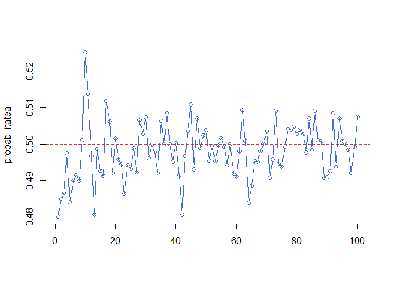
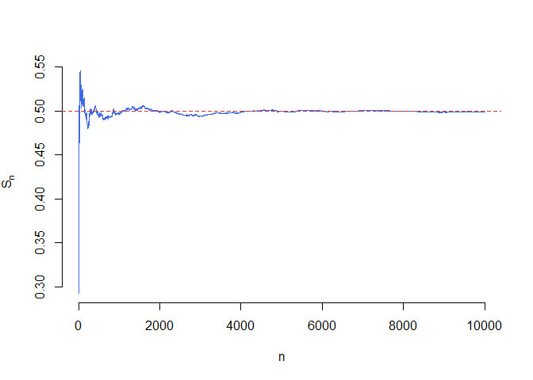
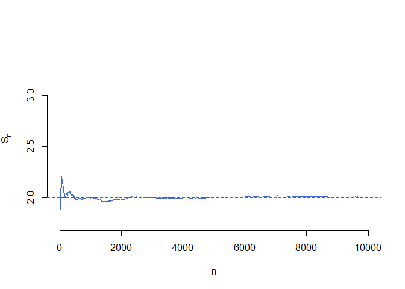
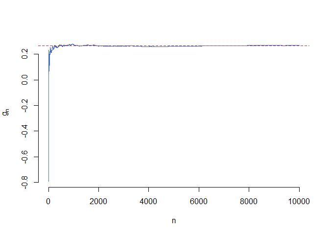
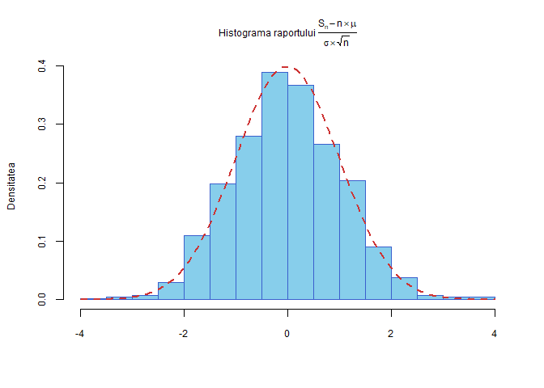

# Laborator 3

<script>
$(document).ready(function ()  {

    // move toc-ignore selectors from section div to header
    $('div.section.toc-ignore')
        .removeClass('toc-ignore')
        .children('h1,h2,h3,h4,h5').addClass('toc-ignore');

    // establish options
    var options = {
      selectors: "h1,h2,h3",
      theme: "bootstrap3",
      context: '.toc-content',
      hashGenerator: function (text) {
        return text.replace(/[.\\/?&!#<>]/g, '').replace(/\s/g, '_').toLowerCase();
      },
      ignoreSelector: ".toc-ignore",
      scrollTo: 60
    };
    options.showAndHide = false;
    options.smoothScroll = true;

    // tocify
    var toc = $("#TOC").tocify(options).data("toc-tocify");
});
</script>

Obiectivul acestui laborator este de a prezenta succint câteva funcții utile teoriei probabilităților din programul [R](https://cran.r-project.org/), care este structura lor și cum le putem aplica. De asemenea, tot în acest laborator vom prezenta și câteva probleme de simulare punând accent pe rezultatele de bază din teoria probabilităților și anume *Legea Numerelor Mari* și *Teorema Limită Centrală*. 


# Familia de funcții `apply`


Pe lângă buclele `for` și `while`, în R există și un set de funcții care permit scrierea și rularea într-o manieră mai compactă a codului dar și aplicarea de funcții unor grupuri de date.  

- `lapply()`: Evaluează o funcție pentru fiecare element al unei liste

- `sapply()`: La fel ca `lapply` numai că încearcă să simplifice rezultatul

- `apply()`: Aplică o funcție după fiecare dimensiune a unui `array`

- `tapply()`: Aplică o funcție pe submulțimi ale unui vector

- `mapply()`: Varianta multivariată a funcției `lapply`

- `split`: Împarte un vector în grupuri definite de o variabilă de tip factor. 

## `lapply()`

Funcția `lapply()` efectuează următoarele operații:

1. buclează după o listă, iterând după fiecare element din acea listă
2. aplică o *funcție* fiecărui element al listei (o funcție pe care o specificăm)
3. întoarce ca rezultat tot o listă (prefixul `l` vine de la listă). 

Această funcție primește următoarele trei argument: (1) o listă `X`; (2) o funcție `FUN`; (3) alte argumente via `...`. Dacă `X` nu este o listă atunci aceasta va fi transformată într-una folosind comanda `as.list()`.

Considerăm următorul exemplu în care vrem să aplicăm funcția `mean()` tuturor elementelor unei liste


```r
set.seed(222)
x <- list(a = 1:5, b = rnorm(10), c = rnorm(20, 1), d = rnorm(100, 5))
lapply(x, mean)
$a
[1] 3

$b
[1] 0.1996044

$c
[1] 0.7881026

$d
[1] 5.064188
```

Putem să folosim funcția `lapply()` pentru a evalua o funcție în moduri repetate. Mai jos avem un exemplu în care folosim funcția `runif()` (permite generarea observațiilor uniform repartizate) de patru ori, de fiecare dată generăm un număr diferit de valori aleatoare. Mai mult, argumentele $min=0$ și $max=3$ sunt atribuite, prin intermediul argumentului `...`, funcției `runif`.  


```r
x <- 1:4
lapply(x, runif, min = 0, max = 3)
[[1]]
[1] 0.03443616

[[2]]
[1] 1.267361 1.365441

[[3]]
[1] 1.8084700 2.1902665 0.4139585

[[4]]
[1] 1.5924650 0.7355067 2.1483841 1.6082945
```

## `sapply()`

Funcția `sapply()` are un comportament similar cu `lapply()` prin faptul că funcția `sapply()` apelează intern `lapply()` pentru valorile de input, după care evaluează:

- dacă rezultatul este o listă în care fiecare element este de lungime 1, atunci întoarce un vector

- dacă rezultatul este o listă în care fiecare element este un vector de aceeași lungime (>1), se întoarce o matrice

- în caz contrar se întoarce o listă.

Considerăm exemplul de mai sus


```r
set.seed(222)
x <- list(a = 1:4, b = rnorm(10), c = rnorm(20, 1), d = rnorm(100, 5))
sapply(x, mean)
        a         b         c         d 
2.5000000 0.1996044 0.7881026 5.0641876 
```


## `split()`

Funcția `split()` primește ca argument un vector sau o listă (sau un data.frame) și împarte datele în grupuri determinate de o variabilă de tip factor (sau o listă de factor).

Argumentele aceste funcții sunt 


```r
str(split)
function (x, f, drop = FALSE, ...)  
```

unde

- `x` este un vector, o listă sau un data.frame
- `f` este un factor sau o listă de factori

Considerăm următorul exemplu în care generăm un vector de date și îl împărțim după o variabilă de tip factor creată cu ajutorul funcției `gl()` (*generate levels*).


```r
x <- c(rnorm(10), runif(10), rnorm(10, 1))
f <- gl(3, 10)
split(x, f)
$`1`
 [1] -2.27414224 -0.11266780  0.61308167  0.07733545  0.57137727
 [6]  0.11672493 -0.95685256 -1.90008460 -1.48972089  0.55925676

$`2`
 [1] 0.91159086 0.03291829 0.78368939 0.11852882 0.64443831 0.78790988
 [7] 0.82451477 0.05642366 0.65075027 0.95426854

$`3`
 [1]  2.6666242  2.6634334  1.8106280 -0.7837308  1.6575684  0.1546575
 [7]  0.4930056 -0.9031544  2.4042311  1.4106863
```

Putem folosi funcția `split` și în conjuncție cu funcția `lapply` (atunci când vrem să aplicăm o funcție `FUN` pe grupuri de date).


```r
lapply(split(x, f), mean)
$`1`
[1] -0.4795692

$`2`
[1] 0.5765033

$`3`
[1] 1.157395
```

## `tapply()`

Funcția `tapply()` este folosită pentru aplicarea unei funcții `FUN` pe submulțimile unui vector și poate fi văzută ca o combinație între `split()` și `sapply()`, dar doar pentru vectori. 


```r
str(tapply)
function (X, INDEX, FUN = NULL, ..., default = NA, simplify = TRUE)  
```

Argumentele acestei funcții sunt date de următorul tabel:

| Argument | Descriere |
|:------------------|:---------------------|
| `X` | un vector |
| `INDEX` | este o variabilă de tip factor sau o listă de factori |
| `FUN` | o funcție ce urmează să fie aplicată |
| `...` | argumente ce vor fi atribuite funcției `FUN` |
| `simplify` | dacă vrem să simplificăm rezultatul |

Table: Tabelul 1. Argumentele functiei tapply

Următorul exemplu calculează media după fiecare grupă determinată de o variabilă de tip factor a unui vector numeric.


```r
x <- c(rnorm(10), runif(10), rnorm(10, 1))
f <- gl(3, 10)   
f
 [1] 1 1 1 1 1 1 1 1 1 1 2 2 2 2 2 2 2 2 2 2 3 3 3 3 3 3 3 3 3 3
Levels: 1 2 3
tapply(x, f, mean)
            1             2             3 
-0.0007774025  0.3736457792  0.5789436983 
```

Putem să aplicăm și funcții care întorc mai mult de un rezultat. În această situație rezultatul nu poate fi simplificat:


```r
tapply(x, f, range)
$`1`
[1] -2.1904113  0.9249901

$`2`
[1] 0.004445296 0.998309704

$`3`
[1] -0.3379675  1.9327099
```

## `apply()`


Funcția `apply()` este folosită cu precădere pentru a aplica o funcție liniilor și coloanelor unei matrice (care este un `array` bidimensional). Cu toate acestea poate fi folosită pe tablouri multidimensionale (`array`) în general. Folosirea funcției `apply()` nu este mai rapidă decât scrierea unei bucle `for`, dar este mai compactă.


```r
str(apply)
function (X, MARGIN, FUN, ...)  
```

Argumentele funcției `apply()` sunt

- `X` un tablou multidimensional
- `MARGIN` este un vector numeric care indică dimensiunea sau dimensiunile după care se va aplica funcția 
- `FUN` este o funcție ce urmează să fie aplicată
- `...` alte argumente penru funcția`FUN`

Considerăm următorul exemplu în care calculăm media pe coloane într-o matrice


```r
x <- matrix(rnorm(200), 20, 10)
apply(x, 2, mean)  ## media fiecarei coloane
 [1]  3.745002e-02  1.857656e-01 -2.413659e-01 -2.093141e-01 -2.562272e-01
 [6]  8.986712e-05  7.444137e-02 -7.460941e-03  6.275282e-02  9.801550e-02
```

precum și media după fiecare linie


```r
apply(x, 1, sum)   ## media fiecarei linii
 [1]  2.76179139  2.53107681  0.87923177  1.80480589  0.98225832
 [6] -3.06148753 -1.40358820 -0.65969812 -1.63717046 -0.29330726
[11] -2.41486442 -3.15698523  2.27126822 -3.88290287 -3.15595194
[16]  5.41211963  2.32985530 -3.05330574 -0.02110926 -1.34909559
```

# Repartiții și elemente aleatoare în R

R pune la disploziție majoritatea repartițiilor uzuale. Tabelul de mai jos prezintă numele și parametrii acestora:

| Repartiția | Nume | Parametrii | Valori prestabilite |
|:--------------------------|:------------------------|:----------------------|:-----------------------------|
| Beta | `beta` | `shape1`, `shape2` |  |
| Binomial | `binom` | `size`, `prob` |  |
| Cauchy | `cauchy` | `location`, `scale` | `location = 0`, `scale = 1` |
| Chi-Squared | `chisq` | `df` |  |
| Exponential | `exp`  | `rate` (=1/mean) |  `rate = 1`  |
| Fisher | `f`  | `df1`, `df2` |  |
| Gamma | `gamma` | `shape`, `rate` (=1/scale) | `rate = 1` |
| Hypergeometric | `hyper` | `m`, `n`, `k` |  |
| Log-Normal | `lnorm` | `mean`, `sd` | `mean = 0`, `sd = 1` | 
| Logistic | `logis` | `location`, `scale` | `location = 0`, `scale = 1` |
| Normal | `norm` | `mean`, `sd` | `mean = 0`, `sd = 1` | 
| Poisson | `pois` | `lambda` |  |
| Student | `t` | `df` |  |
| Uniform | `unif` | `min`, `max` | `min = 0`, `max = 1` |
| Weibull | `weibull` | `shape` |  |

Table: Tabelul 2. Numele si parametrii repartitiilor uzuale in R

Pentru fiecare repartiție, există patru comenzi în R prefixate cu literele `d`, `p`, `q` și `r` și urmate de numele repartiției (coloana a 2-a). De exemplu `dnorm`, `pnorm`, `qnorm` și `rnorm` sunt comenzile corespunzătoare repartiției normale pe când `dunif`, `punif`, `qunif` și `runif` sunt cele corespunzătoare repartiției uniforme.

  * `dname`: calculează densitatea atunci când vorbim de o variabilă continue sau funcția de masă atunci când avem o repartiție discretă ($\mathbb{P}(X=k)$)
  
  * `pname`: calculează funcția de repartiție, i.e. $F(x)=\mathbb{P}(X\leq x)$
  
  * `qname`: reprezintă funcția cuantilă, cu alte cuvinte valoarea pentru care funcția de repartiție are o anumită probabilitate; în cazul continuu, dacă `pname(x) = p` atunci `qname(p) = x` iar în cazul discret întoarce cel mai mic întreg $u$ pentru care $\mathbb{P}(X\leq u)\geq p$. 
  
  * `rname`: generează observații independente din repartiția dată 
  
Avem următoarele exemple:


```r
qnorm(0.975)
[1] 1.959964
pnorm(1.96)
[1] 0.9750021
rnorm(5)
[1] 0.4304737 0.8405027 1.9550682 1.6208507 2.1059503

x = seq(-1, 1, 0.25)
dnorm(x)
[1] 0.2419707 0.3011374 0.3520653 0.3866681 0.3989423 0.3866681 0.3520653
[8] 0.3011374 0.2419707
rnorm(3, 5, 0.5)
[1] 5.327249 4.728878 5.773167

dunif(x)
[1] 0 0 0 0 1 1 1 1 1
runif(3)
[1] 0.6353840 0.8470974 0.0672359
```


# Exerciții propuse

## Aruncarea cu banul 

În acest exemplu vrem să simulăm aruncarea unei monede (echilibrate) folosind funcția `sample()`. Această funcție permite extragerea, cu sau fără întoarcere (`replace = TRUE` sau `replace = FALSE` - aceasta este valoarea prestabilită), a unui eșantion de volum dat (`size`) dintr-o mulțime de elemente `x`. 

Spre exemplu dacă vrem să simulăm $10$ aruncări cu banul atunci apelăm:


```r
sample(c("H", "T"), 10, replace = TRUE)
 [1] "T" "T" "T" "T" "T" "T" "T" "H" "H" "T"
```

Pentru a estima probabilitatea de apariției a stemei (`H`) repetăm aruncarea cu banul de $10000$ de ori și calculăm raportul dintre numărul de apariții ale evenimentului $A=\{H\}$ și numărul total de aruncări:


```r
# atunci cand moneda este echilibrata
a = sample(c("H","T"), 10000, replace = TRUE)
p = sum(a == "H")/length(a)
p
[1] 0.5073
```

și pentru cazul în care moneda nu este echilibrată


```r
a = sample(c("H","T"), 10000, replace = TRUE, prob = c(0.2, 0.8))
p = sum(a == "H")/length(a)
p
[1] 0.2012
```

Putem vedea cum evoluează această probabilitatea în funcție de numărul de repetări


```r
y = rep(0,100)

for (i in 1:100){
  a = sample(c("H","T"), i*100, replace = TRUE)
  y[i] = sum(a == "H")/length(a)
}

plot(1:100, y, type = "o", col = "royalblue", bty = "n",
     xlab ="", ylab = "probabilitatea")
abline(h = 0.5, lty = 2, col = "brown3")
```



## Jocul de loto 

<div class="rmdexercise">
<p>Construiți în R o funcție care să simuleze jocul de loto <span class="math inline">6/49</span>. Acest joc consistă din extragerea aleatoare a <span class="math inline">6</span> numere dintr-o urnă cu <span class="math inline">49</span> de numere posibile, fără întoarcere. Fiecare extragere se face de manieră uniformă din numerele rămase în urnă (la a i-a extragere fiecare bilă din urnă are aceeași șansă să fie extrasă). De exemplu putem avea următorul rezultat: <span class="math inline">10, 27, 3, 45, 12, 24</span>.</p>
<p><strong>Notă</strong>: Funcția <code>sample()</code> poate face această operație, ceea ce se cere este de a crea voi o funcție care să implementeze jocul fără a folosi funcția <em>sample</em>. Binențeles că puteți folosi funcții precum: <code>runif</code> , <code>floor</code>, <code>choose</code>, etc.</p>
</div>


Începem prin a construi o funcție care ne permite generarea unei variabile aleatoare uniform repartizate pe mulțimea $\{1,2,\dots,n\}$ (această funcție este cea care simulează procesul de extragere de la fiecare pas):


```r
myintunif = function(n){
  # dunctia care genereaza un numar uniform intre 1 si n
  r = n*runif(1)
  u = floor(r)+1
  return(u)
}
```

Funcția care realizează extragerea fără întoarcere a $k$ numere aleatoare din $n$, este:


```r
myrandsample=function(n,k){
  # 
  x = 1:n
  q = rep(0,k)
  
  for(i in 1:k){
    l = length(x)
    u = myintunif(l)
    q[i] = x[u]
    x = x[x!=q[i]]
  }
  return(q)
}
```

Pentru a vedea ce face această funcție putem scrie:


```r
n = 49
k = 6

myrandsample(n,k)
[1]  3 16 12 48 23 32
```

## Ilustrarea Legii Numerelor Mari

<div class="rmdexercise">
<ol style="list-style-type: lower-alpha">
<li><p>Fie <span class="math inline"><em>X</em><sub>1</sub>, <em>X</em><sub>2</sub>, …, <em>X</em><sub><em>N</em></sub></span>, <span class="math inline"><em>N</em></span> v.a. i.i.d. de lege <span class="math inline">𝒰([0, 1])</span>. Pentru <span class="math inline">1 ≤ <em>n</em> ≤ <em>N</em></span>, notăm cu <span class="math inline"><em>S</em><sub><em>n</em></sub> = <em>X</em><sub>1</sub> + <em>X</em><sub>2</sub> + ⋯<em>X</em><sub><em>n</em></sub></span> șirul sumelor parțiale și <span class="math inline"><em>μ</em></span> media legii <span class="math inline">𝒰([0, 1])</span>. Trasați pe același grafic funcția <span class="math inline">$n\to \frac{S_n}{n}$</span> pentru <span class="math inline"><em>n</em> = 1, …, <em>N</em></span> și dreapta de ecuație <span class="math inline"><em>y</em> = <em>μ</em></span>. Faceți același lucru pentru legea normală <span class="math inline">𝒩(2, 1)</span>.</p></li>
<li><p>Utilizați <em>Legea Numerelor Mari</em> pentru a aproxima integrala următoarez</p></li>
</ol>
<p><br /><span class="math display"><em>I</em> = ∫<sub>0</sub><sup>1</sup><em>e</em><sup><em>x</em></sup><em>s</em><em>i</em><em>n</em>(2<em>x</em>)<em>c</em><em>o</em><em>s</em>(2<em>x</em>)<em>d</em><em>x</em>.</span><br /></p>
<p>Calculați de asemenea valoarea exactă <span class="math inline"><em>I</em></span> a acesteia și comparați-o cu aproximarea găsită.</p>
</div>

  a) În cazul în care v.a. $X_1,X_2,\dots,X_N$ sunt repartizate uniform $\mathcal{U}([0,1])$ (deci media este $\mu=\frac{1}{2}$) avem: 


```r
n = 10000

# Pentru legea uniforma folosim comanda runif
# Pentru calculul sumelor partiale putem folosi functia cumsum

y1 = cumsum(runif(n))
y1 = y1/(1:n)
mu1 = 1/2 # media uniformei pe [0,1]

# trasam graficul 
plot(1:n, y1, type = "l", 
     col= "royalblue", xlab = "n", 
     ylab = expression(S[n]), 
     bty = "n")
abline(h = mu1, col = "brown3", lty= "dashed") # adaugam linia orizontala
```

<div class="figure" style="text-align: center">

<p class="caption">Ilustrarea legii numerelor mari: v.a. uniforme</p>
</div>

În cazul în care v.a. $X_1,X_2,\dots,X_N$ sunt normale de parametrii $\mathcal{N}(2,1)$ (deci media este $\mu=2$) avem:


```r
# Folosim acelasi numar de variabile n

# Pentru legea normala folosim comanda rnorm
# Pentru calculul sumelor partiale putem folosi functia cumsum
y2 = cumsum(rnorm(n, mean = 2, sd = 1))
y2 = y2/(1:n)
mu2 = 2 # media normalei N(2,1)

# facem graficul 
plot(1:n, y2, type = "l", 
     col= "royalblue", xlab = "n", 
     ylab = expression(S[n]),
     bty = "n")
abline(h = mu2, col = "brown3", lty= "dashed") # adaugam linia orizontala
```

<div class="figure" style="text-align: center">

<p class="caption">Ilustrarea legii numerelor mari: v.a. normale</p>
</div>

  b) Fie $U_1,U_2,\dots,U_n$ un șir de v.a. i.i.d. repartizare uniform pe $[0,1]$. Cum $g$ este o funcție continuă, aplicând *Legea Numerelor Mari* obținem

$$
  g_n=\frac{1}{n}\sum_{i=1}^{n}g(U_{i}) \overset{a.s.}{\to} \mathbb{E}[g(U_1)] = \int_{0}^{1}g(x)dx.
$$

Pentru a calcula integrala numeric vom folosi funcția `integrate` (trebuie observat că această integrală se poate calcula ușor și exact prin integrare prin părți). Următorul script ne dă valoare numerică și aproximarea obținută cu ajutorul metodei Monte Carlo pentru integrale $\int_{0}^{1}g(x)dx$:


```r
myfun=function(x){
  y = exp(x)*sin(2*x)*cos(2*x);
  return(y);
}

# calculul integralei cu metode numerice
I = integrate(myfun,0,1) # raspunsul este o lista si oprim prima valoare
I = I[1]

# calculul integralei cu ajutorul metodei Monte Carlo
n = 10000 

u = runif(n) # generarea sirului U_n
z = myfun(u) # calcularea sirului g_n

I2 = sum(z)/n # aproximarea MC
```

Obținem că valoarea numerică a lui $I$ este 0.2662 iar cea obținută cu ajutorul metodei Monte Carlo este 0.2591. 

Avem următoarea ilustrare grafică a convergenței metodei Monte Carlo:


```r
# graficul
gn = myfun(runif(n)) 
gn = cumsum(gn)/(1:n) # calculul lui g_n

plot(1:n, gn, type = "l", 
     col = "royalblue", xlab = "n", 
     ylab = expression(g[n]),
     bty = "n")
abline(h = I, lty = "dashed", col = "brown3")
```

<div class="figure" style="text-align: center">

<p class="caption">Convergenta metodei Monte Carlo (pentru g)</p>
</div>

## Ilustrarea Teoremei Limită Centrală (I)

<div class="rmdexercise">
<p>Fie <span class="math inline">(<em>X</em><sub><em>n</em></sub>)<sub><em>n</em> ≥ 1</sub></span> un șir de v.a. i.i.d. de lege <span class="math inline">ℰ(1)</span>. Pentru toți <span class="math inline"><em>n</em></span>, notăm cu <span class="math inline"><em>S</em><sub><em>n</em></sub> = <em>X</em><sub>1</sub> + <em>X</em><sub>2</sub> + ⋯<em>X</em><sub><em>n</em></sub></span> șirul sumelor parțiale, <span class="math inline"><em>μ</em></span> și <span class="math inline"><em>σ</em><sup>2</sup></span> reprezentând media și respectiv varianța legii <span class="math inline">ℰ(1)</span>. <em>Teorema Limită Centrală</em> afirmă că dacă <span class="math inline"><em>n</em></span> este mare atunci v.a.</p>
<p><br /><span class="math display">$$
\frac{S_n-n\mu}{\sqrt{n}\sigma}
$$</span><br /></p>
<p>are aproximativ aceeași distribuție ca și legea normală <span class="math inline">𝒩(0, 1)</span>. Ilustrați această convergență în distribuție cu ajutorul unei histograme (i.e. simulând un număr mare de realizări independente ale v.a. <span class="math inline">$\frac{S_n-n\mu}{\sqrt{n}\sigma}$</span>). Suprapuneți peste această histogramă densitatea legii <span class="math inline">𝒩(0, 1)</span>.</p>
</div>

Știm că media unei v.a. distribuite exponențial de parametru $\lambda$, $\mathcal{E}(\lambda)$ este $\mu=\frac{1}{\lambda}$ iar varianța acesteia este $\sigma^2=\frac{1}{\lambda^2}$. Pentru fiecare valoare a lui $i$ de la $1$ la $N$ calculăm raportul $\frac{S_n-n\mu}{\sigma\sqrt{n}}$ (cu alte cuvinte repetăm experimentul de $N$ ori): 


```r
N = 1000 # alegem numarul de repetitii ale experimentului
n = 1000 # alegem n pentru care folosim aproximarea normala

lambda = 1 # parametrul legii E(1)

mu = 1/lambda # media
sigma = 1/lambda # abaterea standard 

s = rep(0,N) # initializam sirul sumelor partiale

for (i in 1:N){
  x = rexp(n, rate = lambda) # generam variabilele exponentiale
  s[i] = (sum(x)-n*mu)/(sigma*sqrt(n)) # calculam raportul 
  
}
```

Continuăm prin trasarea histogramei cerute și adăugăm la grafic densitatea legii normale $\mathcal{N}(0,1)$:


```r
# trasam histograma
# pentru mai multe optiuni latex: ?plotmath 
hist(s, main = expression(paste("Histograma raportului ",frac(S[n]-n%*%mu,sigma%*%sqrt(n)))),
     prob = TRUE, 
     col = "skyblue", # Culoarea de umplere
     border = "royalblue3",
     xlim = c(-4,4), 
     cex.main=0.75, 
     cex.lab = 0.75, 
     cex.axis = 0.75, 
     xlab = "", 
     ylab = "Densitatea")

# adaugam densitatea normalei N(0,1) 
x1 = seq(-4,4,by=0.1)
y1 = dnorm(x1, mean = 0, sd = 1)
lines(x1, y1, col = "brown3", lwd = 2, lty = 2)
```

<div class="figure" style="text-align: center">

<p class="caption">Ilustrarea Teoremei Limita Centrala</p>
</div>

## Ilustrarea Teormei Limită Centrală (II)


<div class="rmdexercise">
<p>Fie <span class="math inline"><em>X</em><sub>1</sub>, <em>X</em><sub>2</sub>, …, <em>X</em><sub>1000</sub></span> v.a. i.i.d. de lege <span class="math inline">$\mathcal{B}(\frac{1}{2})$</span> (Bernoulli de parametru <span class="math inline">$\frac{1}{2}$</span>). Dați un interval de incredere bilateral <span class="math inline">ℐ</span> de nivel <span class="math inline">99%</span> pentru <span class="math inline"><em>S</em><sub>1000</sub> = <em>X</em><sub>1</sub> + <em>X</em><sub>2</sub> + ⋯<em>X</em><sub>1000</sub></span>. Fie <span class="math inline">(<em>Y</em><sub><em>n</em></sub>)<sub><em>n</em> ≥ 1</sub></span> un șir de v.a. i.i.d. de aceeași lega ca și <span class="math inline"><em>S</em><sub>1000</sub></span>. Luând:</p>
<p><br /><span class="math display"><em>T</em> = inf{<em>n</em> ≥ 1,  <em>Y</em><sub><em>n</em></sub> ∉ ℐ}</span><br /></p>
<p>afișați mai multe rezultate ale v.a. <span class="math inline"><em>T</em></span> și <span class="math inline"><em>Y</em><sub><em>T</em></sub></span>. Analizați aceste rezultate.</p>
</div>

Prin aplicarea *Teoremei Limită Centrală* avem că un interval de încredere $\mathcal{I}$ de nivel $99\%$ pentru v.a. $S_n$, este dat de formula 

$$
  \mathcal{I} = \left[n\mu-2.58\times\sqrt{n\sigma^2}, n\mu-2.58\times\sqrt{n\sigma^2}\right]
$$

Următorul cod permite construirea acestui interval:


```r
n = 1000 
p = 1/2 # parametrul v.a. Bernoulli

mu = p # ,edia 
sigma = sqrt(p*(1-p)) # abaterea standard

# determinarea intervalului I 
z = 0.99

Imin = n*mu + qnorm((1-z)/2)*sqrt(n)*sigma
Imax = n*mu - qnorm((1-z)/2)*sqrt(n)*sigma
```

Obținem astfel că intervalul de încredere este I = [459, 541]. 

Funcția care generează realizările v.a. $T$ și $Y_T$ plecând de la intervalul găsit $\mathcal{I}$ este dată de codul următor:


```r
# functia care genereaza v.a. T si Y_T
gen_T = function(n,p,Imin,Imax){
  t = 1
  y = rbinom(1,n,p)
  
  while (Imin<=y & y<=Imax){
    y = rbinom(1,n,p)
    t = t+1
  }
  
  out = c(t,y)
  return(out)
  
}
```

Următorul cod ne dă $10$ realizări ale v.a. $T$ și $Y_T$:


```r
# realizari ale v.a. T si Y_T
iter = 10
v = c()
for (i in 1:iter){
  v = rbind(v,gen_T(1000,0.5,Imin,Imax))
}

v = data.frame(v)
names(v) = c("T", "Y_T")

print(v)
     T Y_T
1  113 456
2    6 546
3  400 544
4   15 446
5   68 439
6    1 448
7  331 445
8   29 548
9   62 544
10   1 541
```

Putem observa cu ușurință că v.a. $T$ este o v.a. geometrică de parametru $p=\mathbb{P}(Y_1\not\in\mathcal{I})=0.01$, deoarece pentru $k\geq1$

$$
\begin{aligned}
  \mathbb{P}(T=k) &= \mathbb{P}(Y_1\in\mathcal{I},Y_2\in\mathcal{I},\dots,Y_{k-1}\in\mathcal{I},Y_k\not\in\mathcal{I})\\
                  &\overset{indep.}{=} \mathbb{P}(Y_1\in\mathcal{I})\mathbb{P}(Y_2\in\mathcal{I})\cdots\mathbb{P}(Y_{k-1}\in\mathcal{I})\mathbb{P}(Y_k\not\in\mathcal{I})\\
                  &= \mathbb{P}(Y_1\in\mathcal{I})^{k-1}\mathbb{P}(Y_1\not\in\mathcal{I}) = (1-p)^{k-1}p.
\end{aligned}
$$

Prin urmarea găsim că media lui $T$ este egală cu $\mathbb{E}[T]=\frac{1}{p}=100$ și când comparăm cu rezultatul numeric avem:


```r
iter = 1000 # nr de iteratii
v = c()
for (i in 1:iter){
  v = rbind(v,gen_T(1000,0.5,Imin,Imax))
}
```

Astfel, media empirică a lui $T$ este 102.578, pentru 1000 iterații, iar cea teoretică este $100$.

De asemenea avem că 

$$
\mathbb{E}[Y_T] = \sum_{k\geq1}\mathbb{E}[Y_k]\mathbb{P}(T=k) = \mathbb{E}[Y_1]\sum_{k\geq1}\mathbb{P}(T=k) = \mathbb{E}[Y_1]
$$

și verificăm această afirmație prin simulări numerice. Media empirică a lui $Y_T$ este 501.936, pentru 1000 iterații, iar cea teoretică este $500$.

