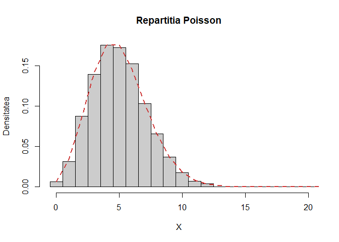
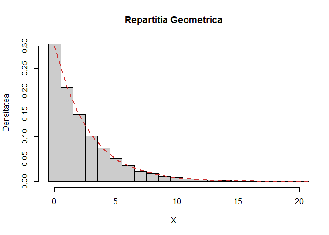
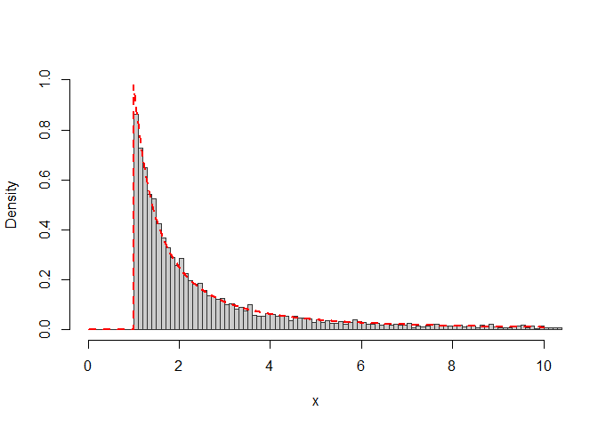
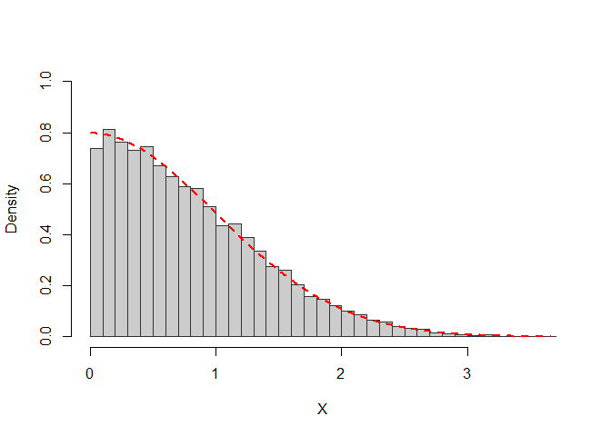
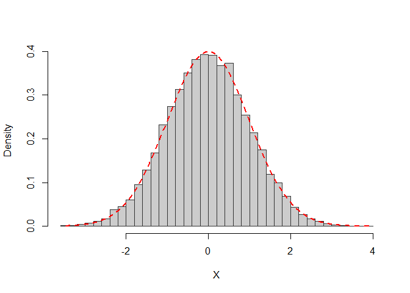
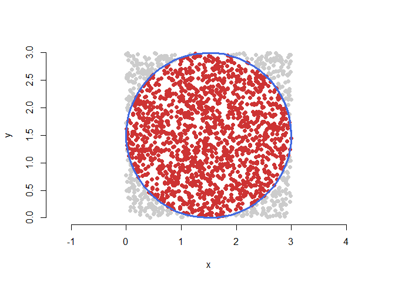
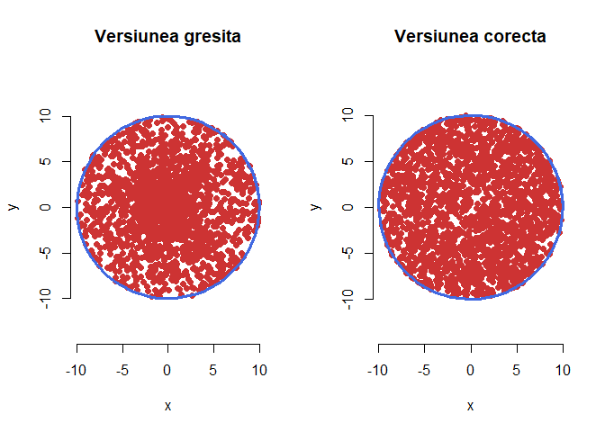

# Laborator 4

<script>
$(document).ready(function ()  {

    // move toc-ignore selectors from section div to header
    $('div.section.toc-ignore')
        .removeClass('toc-ignore')
        .children('h1,h2,h3,h4,h5').addClass('toc-ignore');

    // establish options
    var options = {
      selectors: "h1,h2,h3",
      theme: "bootstrap3",
      context: '.toc-content',
      hashGenerator: function (text) {
        return text.replace(/[.\\/?&!#<>]/g, '').replace(/\s/g, '_').toLowerCase();
      },
      ignoreSelector: ".toc-ignore",
      scrollTo: 60
    };
    options.showAndHide = false;
    options.smoothScroll = true;

    // tocify
    var toc = $("#TOC").tocify(options).data("toc-tocify");
});
</script>

Obiectivul acestui laborator este de a prezenta câteva probleme de simulare folosind noțiunile și metodele învățate la curs. 


# Generarea variabilelor aleatoare discrete

<div class="rmdexercise">
<p>În acest exercițiu ne propunem să definim o funcție <code>rand_sample(n,x,p)</code> care permite generarea a <span class="math inline"><em>n</em></span> observații dintr-o mulțime <span class="math inline"><em>x</em></span> (vector numeric sau de caractere) cu probabilitatea <span class="math inline"><em>p</em></span> pe <span class="math inline"><em>x</em></span> (un vector de aceeași lungime ca <span class="math inline"><em>x</em></span>).</p>
</div>

Funcția se poate construi sub forma următoare:


```r
rand_sample = function(n,x,p){
  # n - numarul de observatii
  # x - multimea de valori
  # p - vectorul de probabilitati
  
  out = c()
  
  ind = 1:length(x)
  cs = cumsum(p) 
  
  if (length(x)!=length(p)){
    return(print('Cei doi vectori ar trebui sa fie de aceeasi lungime !'))
  }
  
  for (i in 1:n){
    r = runif(1)
    
    m = min(ind[r<=cs])
    out = c(out,x[m])
  }
  
  return(out)
}
```

Pentru a testa această funcție să considerăm două exemple: 

  1. în acest caz: $n=10$, $x=[1,2,3]$ și $p=[0.2,0.3,0.5]$
  

```r
rand_sample(10,c(1,2,3),c(0.2,0.3,0.5))
 [1] 3 3 3 2 3 3 3 2 2 3
```

  2. în acest caz: $n=15$, $x=[a,b,c,d]$ și $p=[0.15,0.35,0.15,0.45]$
  

```r
rand_sample(15,c('a','b','c','d'),c(0.15,0.35,0.15,0.45))
 [1] "d" "d" "b" "b" "d" "b" "b" "b" "d" "c" "b" "d" "c" "b" "a"
```

O funcție un pic mai generală este:


```r
GenerateDiscrete = function(n = 1, x, p, err = 1e-15){
  # n numarul de observatii
  # x multimea de valori
  # p vectorul de probabilitati
  
  lp = length(p)
  lx = length(x)
  
  # verificarea conditiilor de aplicare 
  if(abs(sum(p)-1)>err | sum(p>=0)!=lp){
    
    stop("Suma probabilitatilor nu este egala cu 1!")
    
  }else if(lx!=lp){
    
    stop("x si p trebuie sa aiba aceeasi marime!")
    
  }else{
    out = rep(0, n)
    
    indOrderProb = order(p, decreasing = TRUE) # index
    pOrdered = p[indOrderProb] # rearanjam valorile probabilitatilor
    xOrdered = x[indOrderProb] # rearanjam valorile lui x
    
    pOrderedCS = cumsum(pOrdered)
    
    for (i in 1:n){
      u = runif(1)
      
      k = min(which(u<=pOrderedCS))
      out[i] = xOrdered[k]
    }
  }
  
  return(out)
}
```

și pentru a o putea testa să considerăm cazul repartițiilor Poisson și Geometrică:

  a) Poisson 
  

```r
# Poisson
hist(GenerateDiscrete(10000, x = 0:50, 
                      p = dpois(0:50, 5)), 
     probability = TRUE, 
     breaks = seq(-0.5,49.5, by = 1), 
     xlim = c(-0.5, 20),
     col = "grey80",
     main = "Repartitia Poisson",
     xlab = "X",
     ylab = "Densitatea")

lines(0:50,
      dpois(0:50, 5), 
      type = "l", 
      col = "brown3", lty = 2, lwd = 2)
```



  b) Geometrică
  

```r
# Geometric
hist(GenerateDiscrete(10000, x = 0:100, 
                      p = dgeom(0:100, 0.3)), 
     probability = TRUE, 
     breaks = seq(-0.5,99.5, by = 1),
     xlim = c(-0.5, 20),
     col = "grey80",
     main = "Repartitia Geometrica",
     xlab = "X",
     ylab = "Densitatea")

lines(0:100,
      dgeom(0:100, 0.3), 
      type = "l", 
      col = "brown3", lty = 2, lwd = 2)
```



# Generarea unei variabile aleatoare folosind metoda inversă

<div class="rmdexercise">
<p>Scrieți un program care să folosească metoda transformării inverse pentru a genera <span class="math inline"><em>n</em></span> observații din densitatea</p>
<p><br /><span class="math display">$$
  f(x) = \left\{\begin{array}{ll}
        \frac{1}{x^2}, &amp; x\geq 1\\
        0, &amp; \text{altfel}
  \end{array}\right.
$$</span><br /></p>
<p>Testați programul trasând o histogramă a <span class="math inline">10000</span> de observații aleatoare împreună cu densitatea teoretică <span class="math inline"><em>f</em></span>.</p>
</div>

Primul pas este să determinăm funcția de repartiție $F$ corespunzătoare acestei densități. Pentru $x<1$ avem că $f(x)=0$ deci $F(x)=0$ iar pentru $x\geq 1$ avem 

$$
  F(x) = \int_{1}^{x}\frac{1}{t^2}\, dt = 1 - \frac{1}{x}.
$$
Cum $F$ este continuă putem să determinăm $F^{-1}$ rezolvând ecuația $F(x)=u$. Un calcul direct conduce la $F^{-1}(u)=\frac{1}{1-u}$ iar conform rezultatului văzut la curs concluzionăm că $X = \frac{1}{1-U}$ cu $U\sim \mathcal{U}([0,1])$. 

Astfel putem simula un eșantion de talie $n$ din populația $f$ construind funcția 


```r
GenerateSampleX = function(n){
  u = runif(n)
  return(1/(1-u))
}
```

Pentru a testa comparăm valorile simulate cu densitatea teoretică


```r
# simulate
x = GenerateSampleX(10000)
hist(x, freq=FALSE, breaks=seq(0, max(x)+1, 0.1),
     xlim=c(0,10), ylim=c(0,1),
     main=NULL, col="gray80", border="gray20")

# densitatea teoretica
y <- seq(0, 10, 0.01)
f <- ifelse(y <= 1, 0, 1/y^2)
lines(y, f, col = "red", lty = 2, lwd = 2)
```



# Generarea unei repartiții normale 

<div class="rmdexercise">
<p>Plecând cu o propunere de tip <span class="math inline"><em>E</em><em>x</em><em>p</em>(<em>λ</em>)</span> vrem să generăm, cu ajutorul metodei acceptării-respingerii, un eșantion din următoarea densitate (jumătate de normală):</p>
<p><br /><span class="math display">$$
  f(x) = \left\{\begin{array}{ll}
    \frac{2}{\sqrt{2\pi}}e^{-\frac{x^2}{2}}, &amp; \mbox{dacă $x\geq0$}\\
    0, &amp; \mbox{altfel}\\           
  \end{array}\right.
$$</span><br /></p>
</div>

Fie $g$ densitatea repartiției exponențiale de parametru $\lambda$,

$$
    g(x) = \left\{\begin{array}{ll}
        \lambda e^{-\lambda x}, & \mbox{dacă $x\geq0$}\\
        0, & \mbox{altfel}\\           
  \end{array}\right.
$$

Pentru a aplica algoritmul de acceptare-respingere trebuie să găsim valoarea lui $c>0$ pentru care $f(x)\leq c g(x)$ pentru toate valorile $x\in \mathbb{R}$. Pentru $x\geq0$ avem

$$
  \frac{f(x)}{g(x)}=\frac{2}{\lambda\sqrt{2\pi}}e^{-\frac{x^2}{2}+\lambda x}
$$

și cum funcția $-\frac{x^2}{2}+\lambda x$ își atinge valoarea maximă în punctul $x=\lambda$ rezultă că 

$$
    \frac{f(x)}{g(x)}\leq c^*, \,\,\forall x \geq0
$$

unde 

$$
  c^*=\sqrt{\frac{2}{\pi\lambda^2}}e^{\lambda^2/2}.
$$

Astfel algoritmul devine: 

- pentru $n=1,2,\dots$ 

- generează $X_n\sim Exp(\lambda)$

- generează $U_n\sim\mathcal{U}[0,1]$

- dacă $U_n\leq\exp\left(-\frac{1}{2}(X_n-\lambda)^2\right)$ atunci

- intoarceți $X_n$

Avem funcția:


```r
# generarea puntelor din densitatea f

f <- function(x) {
  return((x> 0) * 2 * dnorm(x,0,1))
}

g <- function(x) { return(dexp(x,1)) }

c <- sqrt(2 * exp(1) / pi)

rhalfnormal <- function(n) {
  res <- numeric(length=n)
  i <- 0
  while (i<n) {
    U <- runif(1, 0, 1)
    X <- rexp(1, 1)
    if (c * g(X) * U <= f(X)) {
      i <- i+1
      res[i] <- X;
    }
  }
  return(res)
}
```

Testăm


```r
X <- rhalfnormal(10000)

hist(X, 
     breaks=50, 
     prob=TRUE, 
     ylim=c(0,1),
     main=NULL, 
     col="gray80", 
     border="gray20")

curve(f, min(X), max(X), n=500, col = "red", lty = 2, lwd = 2, add=TRUE)
```




<div class="rmdexercise">
<p>Modificați codul de la exercițiul precedent pentru a simula un eșantion dintr-o normală standard.</p>
</div>

Cum $f$ (din problema 1) este densitatea unei normale standard $X\sim\mathcal{N}(0,1)$ condiționată la $X>0$ și cum densitatea normală este simetrică față de medie (0 în acest caz) algoritmul se modifică acceptând $x_n$ și $-X_n$ cu probabilitatea de $0.5$. 

Astfel avem funcția:


```r
f2 <- function(x) {
  return(dnorm(x,0,1))
}

normal1 <- function(n) {
  res <- numeric(length=n)
  i <- 0
  while (i<n) {
    U <- runif(1, 0, 1)
    X <- rexp(1, 1)
    if (c * g(X) * U <= f(X)) {
      i <- i+1
      
      res[i] <- ifelse(runif(1) <= 0.5, X, -X);
    }
  }
  return(res)
}
```

si testul


```r
X <- normal1(10000)

hist(X, breaks=50, 
     prob=TRUE, 
     main=NULL, 
     col="gray80", border="gray20")

curve(f2, min(X), max(X), n=500,col = "red", lty = 2, lwd = 2, add=TRUE)
```



# Simularea unei uniforme pe disc 

<div class="rmdexercise">
<p>Considerăm pătratul <span class="math inline"><em>C</em> = [0, <em>L</em>]<sup>2</sup></span> și discul <span class="math inline"><em>D</em></span> de centru <span class="math inline">$(\frac{L}{2},\frac{L}{2})$</span> și rază <span class="math inline">$\frac{L}{2}$</span>. Considerăm șirul de v.a. <span class="math inline">(<em>Y</em><sub><em>n</em></sub>)<sub><em>n</em> ≥ 1</sub></span> pe <span class="math inline">ℝ<sup>2</sup></span> i.i.d. repartizate uniform pe pătratul <span class="math inline"><em>C</em></span>.</p>
<ol style="list-style-type: decimal">
<li><p>Aproximați valoarea lui <span class="math inline"><em>π</em></span> prin ajutorul numărului de puncte <span class="math inline"><em>Y</em><sub><em>n</em></sub></span> care cad în interiorul discului <span class="math inline"><em>D</em></span> (Metoda respingerii)</p></li>
<li><p>Simulați <span class="math inline"><em>n</em></span> puncte uniforme pe disc.</p></li>
</ol>
</div>

1. Definim v.a. $X_n=\mathbf{1}_{\{Y_n\in D\}}$, $n\geq1$, care formează un șir de v.a. i.i.d. de lege $\mathcal{B}(\mathbb{P}(Y_n\in D))$, deoarece $\left(Y_n\right)_{n\geq1}$ este un șir de v.a. i.i.d. repartizate uniform pe $C$, $\mathcal{U}(C)$. Din *Legea Numerelor Mari* avem că 
  
$$
  \displaystyle\frac{1}{n}\sum_{i=1}^{n}X_{i} \overset{a.s.}{\to} \mathbb{E}[X_1] = \mathbb{P}(Y_1\in D),
$$

prin urmare trebuie să calculăm probabilitatea $\mathbb{P}(Y_1\in D)$. Știm că densitatea v.a. $Y_1$ este dată de  $f_{Y_1}(x,y)=\frac{1}{\mathcal{A}(C)}\mathbf{1}_{C}(x,y)$ de unde

$$
\begin{aligned}
  \mathbb{P}(Y_1\in D) &= \iint_{D}f_{Y_1}(x,y)\,dxdy = \iint \mathbf{1}_{D}(x,y)\mathbf{1}_{C}(x,y)\,dxdy\\
                       &= \frac{1}{\mathcal{A}(C)}\iint \mathbf{1}_{D}(x,y)\,dxdy = \frac{\mathcal{A}(D)}{\mathcal{A}(C)} = \frac{\pi \frac{L^2}{4}}{L^2} = \frac{\pi}{4}.
\end{aligned}
$$

Astfel, putem estima valoarea lui $\pi$ prin $\displaystyle\frac{4}{n}\sum_{i=1}^{n}X_{i}$ pentru valori mari ale lui $n$.


```r
# Estimam valoarea lui pi

L = 3 # lungimea laturii patratului 
R = L/2 # raza cercului inscris

n = 2000 # numarul de puncte din patratul C
# generam puncte uniforme in C
x = L*runif(n)
y = L*runif(n)

# metoda respingerii (rejectiei)
l = (x-R)^2+(y-R)^2 # distanta dintre centrul cercului si punct
ind = l<=(R)^2 # indicii pentru care distanta este mai mica sau egala cu R

xc = x[ind] # coordonatele punctelor din interiorul cercului  
yc = y[ind] 

estimate_pi = 4*sum(ind)/n # estimarea lui pi
err = abs(estimate_pi-pi) # eroarea absoluta
```

Aplicând acest procedeu obținem că valoarea estimată a lui $\pi$ prin generarea a $n=$ 2000 puncte este 3.14 iar eroarea absoluta este 0.001593.

2. Una dintre metodele prin care putem simula puncte uniform repartizate pe suprafața discului $D$ este *Metoda respingerii*. Această metodă consistă în generarea de v.a. $Y_n$ repartizate uniform pe suprafața pătratului $C$, urmând ca apoi să testăm dacă $Y_n$ aparține discului $D$ (deoarece $D\subset C$). Dacă da, atunci le păstrăm dacă nu atunci mai generăm. Următoarea figură ilustrează această metodă:
  

```r
# figura 
theta = seq(0, 2*pi+1, by = 0.1)
xd = R+R*cos(theta)
yd = R+R*sin(theta)

plot(x, y, 
     col = "grey80", pch = 16,
     asp = 1, 
     xlim = c(0,3), ylim = c(0,3),
     bty = "n")

points(xc, yc, col = "brown3", pch = 16)
lines(xd, yd, col = "royalblue", lwd = 3)
```



Vom da mai jos o altă metodă de simulare a punctelor distribuite uniform pe discul $D$ de rază $L$. O primă idee ar fi să generăm cuplul de v.a. $(X_1,Y_1)$ așa încât $X_1,Y_1\sim\mathcal{U}([0,L])$ și ele să fie independente (ceea ce nu este adevărat în realitate). Vom vedea (printr-o ilustrație grafică) că această abordare este greșită (punctele sunt concentrate în centrul cercului). 

O altă abordare este următoarea. Căutăm să simulăm un cuplu de v.a. $(X,Y)$ care este uniform distribuit pe suprafața discului $D$, i.e. densitatea cuplului este dată de $f_{(X,Y)}(x,y)=\frac{1}{\pi L^2}\mathbf{1}_{D}(x,y)$. Considerăm schimbarea de variablile în coordonate polare: $x=r\cos(\theta)$ și $y=r\sin(\theta)$. Obiectivul este de a găsi densitatea variabilelor $R$ și $\Theta$. 

Fie $g(x,y)=\left(\sqrt{x^2+y^2},\arctan(y/x)\right)=(r,\theta)$, transformarea pentru care avem $(R,\Theta)=g(X,Y)$. Știm că inversa acestei transformări este $g^{-1}(r,\theta)=(r\cos(\theta),r\sin(\theta))$, prin urmare

$$
\begin{aligned}
  f_{(R,\Theta)}(r,\theta) &= f_{(X,Y)}\left(g^{-1}(r,\theta)\right)|\det(J_{g^{-1}}(r,\theta))|\\
                &= \frac{1}{\pi L^2}\mathbf{1}_{D}(r\cos(\theta),r\sin(\theta))\left|\begin{array}{cc}
                    \cos(\theta) & \sin(\theta)\\
                    r\sin(\theta) & -r\cos(\theta)
                \end{array}\right|\\
                &= \frac{1}{\pi L^2} \mathbf{1}_{[0,L]}(r)\mathbf{1}_{[0,2\pi]}(\theta)r.
\end{aligned}
$$

Observăm că densitatea (marginală) v.a. $\Theta$ este 

$$
\begin{aligned}
  f_{\Theta}(\theta) &= \int f_{(R,\Theta)}(r,\theta)\,dr = \mathbf{1}_{[0,2\pi]}(\theta)\int \frac{r}{\pi L^2} \mathbf{1}_{[0,L]}(r)\,d\theta\\
                     &= \frac{1}{\pi L^2} \mathbf{1}_{[0,2\pi]}(\theta) \frac{L^2}{2} = \frac{1}{2\pi} \mathbf{1}_{[0,2\pi]}(\theta),
\end{aligned}
$$

iar densitatea v.a. $R$ este 

$$
\begin{aligned}
  f_{R}(r) &= \int f_{(R,\Theta)}(r,\theta)\,d\theta = \frac{r}{\pi L^2} \mathbf{1}_{[0,L]}(r)\int_{0}^{2\pi}\,d\theta\\
                     &= \frac{r}{\pi L^2} \mathbf{1}_{[0,L]}(r)2\pi = \frac{2r}{L^2} \mathbf{1}_{[0,L]}(r).
\end{aligned}
$$

Din expresiile de mai sus putem observa că $\Theta$ este o v.a. repartizată uniform pe $[0,2\pi]$ și putem verifica ușor că legea v.a. $R$ este aceeași cu cea a v.a. $L\sqrt{U}$ unde $U\sim\mathcal{U}([0,1])$. 

Astfel pentru simularea unui punct $(X,Y)$ uniform pe $D$ este suficient să simulăm o v.a. $\Theta$ uniform pe $[0,2\pi]$ și o v.a. $U$ uniformă pe $[0,1]$ și să luăm $X=L\sqrt{U}\cos(\Theta)$ și $Y=L\sqrt{U}\sin(\Theta)$.

Următorul cod ne ilustrează cele două proceduri prezentate:


```r
rm(list=ls())

n = 2000;# numarul de puncte

R = 10;# raza cercului 

theta = 2*pi*runif(n);# theta este uniforma pe [0,2*pi]

# versiunea gresita - r este uniforme pe [0,R]
r1 = R*runif(n);

x1 = r1*cos(theta);# coordonate polare
y1 = r1*sin(theta);

# versiunea corecta
r2 = R*sqrt(runif(n));

x2 = r2*cos(theta);# coordonate polare
y2 = r2*sin(theta);

# schimbarea de variabila in coordonate polare: cercul
theta2 = seq(0,2*pi+1,by=0.1) 
xc = R*cos(theta2);
yc = R*sin(theta2);

# graficul

par(mfrow = c(1,2))

plot(x1, y1,
     ylim = c(-11, 11),
     col = "brown3", pch = 16,
     main = "Versiunea gresita", xlab = "x", ylab = "y", asp = 1, bty = "n")
lines(xc, yc, lwd = 3, col = "royalblue")

plot(x2, y2,
     ylim = c(-11, 11),
     col = "brown3", pch = 16,
     main = "Versiunea corecta", xlab = "x", ylab = "y", asp = 1, bty = "n")
lines(xc, yc, lwd = 3, col = "royalblue")
```


