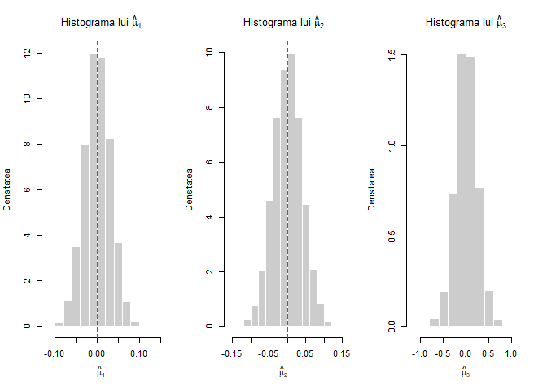
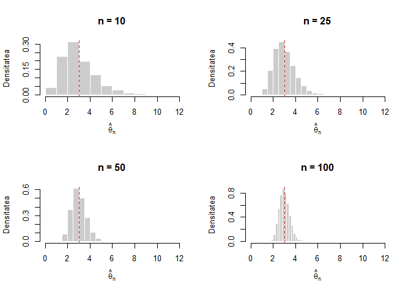
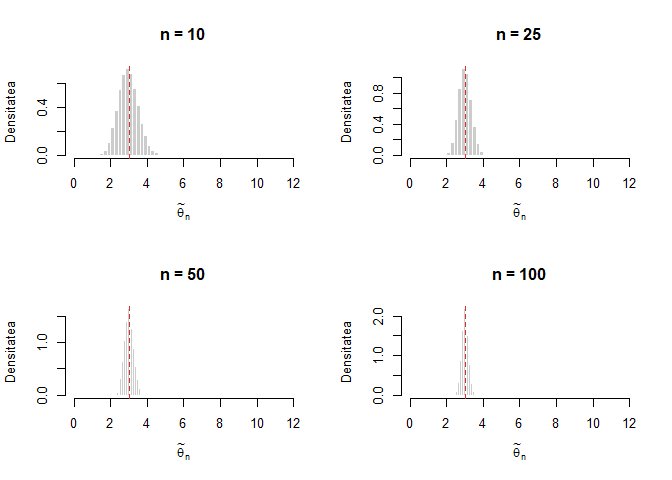
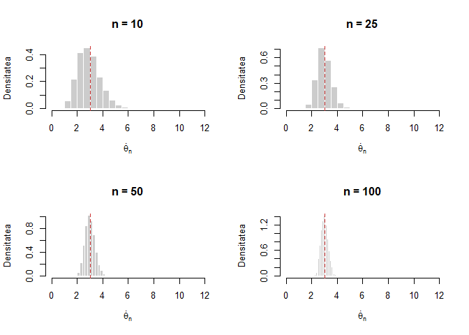
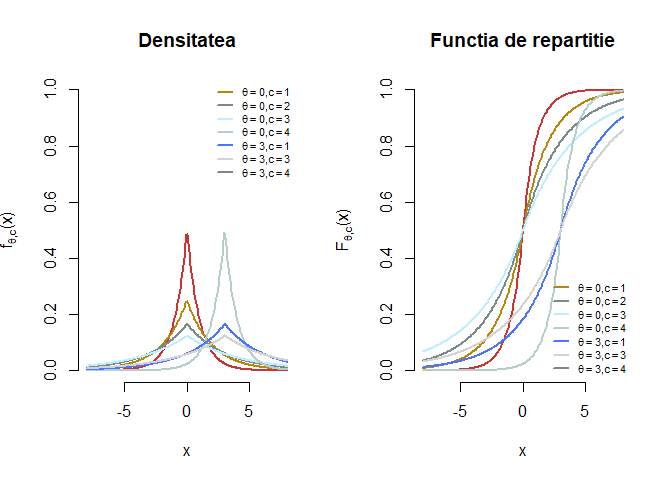
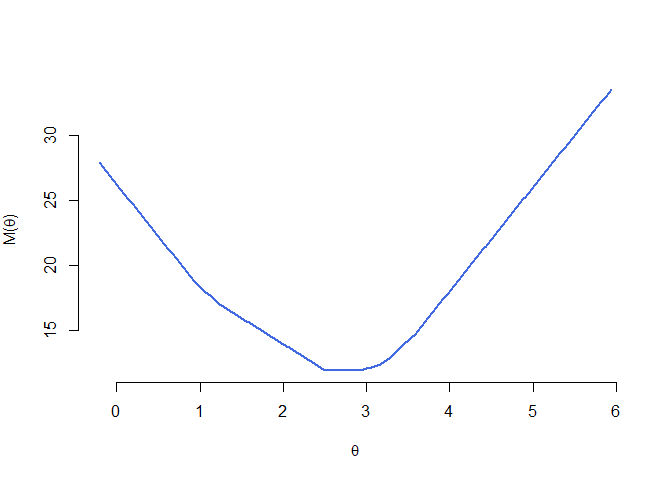
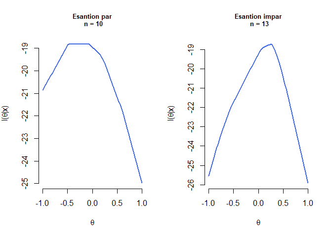
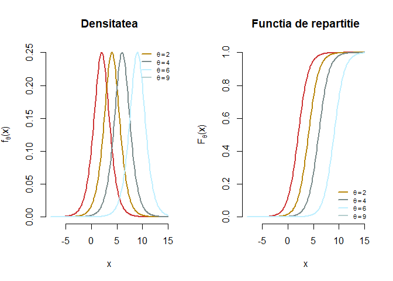
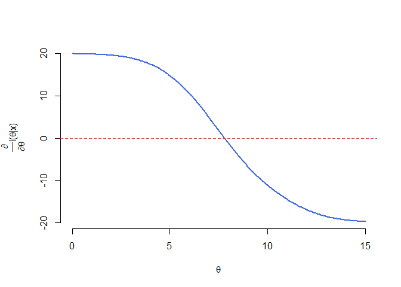

# Laborator 6

<script>
$(document).ready(function ()  {

    // move toc-ignore selectors from section div to header
    $('div.section.toc-ignore')
        .removeClass('toc-ignore')
        .children('h1,h2,h3,h4,h5').addClass('toc-ignore');

    // establish options
    var options = {
      selectors: "h1,h2,h3",
      theme: "bootstrap3",
      context: '.toc-content',
      hashGenerator: function (text) {
        return text.replace(/[.\\/?&!#<>]/g, '').replace(/\s/g, '_').toLowerCase();
      },
      ignoreSelector: ".toc-ignore",
      scrollTo: 60
    };
    options.showAndHide = false;
    options.smoothScroll = true;

    // tocify
    var toc = $("#TOC").tocify(options).data("toc-tocify");
});
</script>

Obiectivul acestui laborator este de a ilustra noțiunea de consistență a unui estimator precum și de a compara mai mulți estimatori. 


# Proprietăți ale estimatorilor

## Exemplu de comparare a trei estimatori

\BeginKnitrBlock{rmdexercise}<div class="rmdexercise">Fie $X_1,X_2,\ldots,X_n$ un eșantion de talie $n$ dintr-o populație normală de medie $\mu$ și varianță $\sigma^2$. Atunci 

$$
  \hat{\mu}_1 = \frac{1}{n}\sum_{i=1}^{n}X_i, \quad \hat{\mu}_2 = M_n\,(\text{mediana}\,), \quad \hat{\mu}_3 = \frac{X_{(1)} + X_{(n)}}{2}
$$

sunt trei estimatori punctuali pentru $\mu$. Creați o funcție care să ilustreze cum sunt repartizați cei trei estimatori. Începeți cu $n = 10$, $\mu = 0$ și $\sigma^2 = 1$ și trasați histogramele pentru a-i compara. Ce se întâmplă dacă schimbați $n$, $\mu$ sau $\sigma^2$ ?

</div>\EndKnitrBlock{rmdexercise}

Vom crea o funcție numită `norm_estimators` care va construi repartițiile celor trei estimatori:


```r
norm_estimators = function(n, mu, sigma, S){
  # Initializam
  mu1 = numeric(S)
  mu2 = numeric(S)
  mu3 = numeric(S)
  
  # repetam experimentul de S ori
  for (i in 1:S){
    x = rnorm(n, mean = mu, sd = sigma)
    
    # calculam estimatorii
    mu1[i] = mean(x)
    mu2[i] = median(x)
    mu3[i] = (min(x)+max(x))/2
  }
  
  # afisam variantele estimatorilor 
  print(cbind(var_mu1 = var(mu1), var_mu2 = var(mu2), var_mu3 = var(mu3)))
  
 return(cbind(mu1 = mu1, mu2 = mu2, mu3 = mu3))
  
}
```

Pentru a ilustra grafic histogramele celor trei estimatori, considerăm $\mu = 0$ și $\sigma^2 = 1$ și avem:


```
          var_mu1     var_mu2    var_mu3
[1,] 0.0009895037 0.001555501 0.05988433
```



## Ilustrarea consistenței unui estimator

\BeginKnitrBlock{rmdexercise}<div class="rmdexercise">Fie $X_1,X_2,\ldots,X_n$ un eșantion de talie $n$ dintr-o populație $Pois(\theta)$. Ilustrați grafic consistența estimatorului $\hat{\theta}_n = S_n^2$ trasând histograma repartiției lui $\hat{\theta}_n$ pentru $n\in\{10,25,50,100\}$. Ce observați?

</div>\EndKnitrBlock{rmdexercise}

Considerăm funcția `pois_est` care pentru $\theta$ fixat simulează repartiția estimatorului $\hat{\theta}_n$: 


```r
pois_est1 = function(n, theta, S){
  # initializare
  sigma1 = numeric(S)
  
  for (i in 1:S){
    x = rpois(n, theta)
    sigma1[i] = var(x)
  }
  # afisam varianta estimatorului
  print(paste0("Pentru n = ", n," varianta estimatorului este ", var(sigma1)))
  return(sigma1)
}
```

Considerând $\theta = 3$ și $n\in\{10,25,50,100\}$ avem: 


```
[1] "Pentru n = 10 varianta estimatorului este 2.33328956900126"
[1] "Pentru n = 25 varianta estimatorului este 0.877372644158976"
[1] "Pentru n = 50 varianta estimatorului este 0.429876069856572"
[1] "Pentru n = 100 varianta estimatorului este 0.212482691783541"
```




Ce se întâmplă dacă în loc de $\hat{\theta}_n$ considerăm estimatorul $\tilde{\theta}_n = \bar{X}_n$ sau estimatorul $\dot{\theta}_n = \sqrt{\bar{X}_n S_n^2}$ ?

Pentru $\tilde{\theta}_n$ avem 


```
[1] "Pentru n = 10 varianta estimatorului este 0.300710874617492"
[1] "Pentru n = 25 varianta estimatorului este 0.120221906579572"
[1] "Pentru n = 50 varianta estimatorului este 0.0600843943277266"
[1] "Pentru n = 100 varianta estimatorului este 0.0303514571091022"
```



iar pentru $\dot{\theta}_n$ avem 


```
[1] "Pentru n = 10 varianta estimatorului este 0.772648617940444"
[1] "Pentru n = 25 varianta estimatorului este 0.302032109076335"
[1] "Pentru n = 50 varianta estimatorului este 0.147689412338205"
[1] "Pentru n = 100 varianta estimatorului este 0.0754852924900279"
```



# Estimare prin metoda verosimilității maxime

## Exemplu: EVM nu este întotdeauna media eșantionului chiar dacă $\mathbb{E}_{\theta}[\hat{\theta}_n] = \theta$

\BeginKnitrBlock{rmdexercise}<div class="rmdexercise">Fie $X_1,X_2,\ldots,X_n$ un eșantion de talie $n$ dintr-o populație Laplace $L(\theta, c)$ a cărei densitate este dată de formula 

$$
  f_{\theta, c}(x) = \frac{1}{2c}e^{-\frac{|x-\theta|}{c}}, \quad -\infty<x<\infty
$$
  
  a) Ilustrați grafic densitatea și funcția de repartiție a repartiției Laplace pentru diferite valori ale parametrilor $\theta$ (de locație) și $c$ (de scală), e.g. $\theta\in\{0, 3\}$ și $c\in\{1,2,3,4\}$. 

  b) Determinați estimatorul de verosimilitate maximă $\hat{\theta}_n$ pentru $\theta$.
</div>\EndKnitrBlock{rmdexercise}


  a) Se poate arăta cu ușurință că funcția de repartiție a repartiției Laplace $L(\theta, c)$ este 
  
$$
  F_{\theta, c}(x) = \frac{1}{2} + \frac{1}{2}\operatorname{sgn}(x-\theta)\left(1-e^{-\frac{|x-\theta|}{c}}\right) = \left\{\begin{array}{ll}
    \frac{1}{2}e^{-\frac{|x-\theta|}{c}}, & x<\theta\\
    1-\frac{1}{2}e^{-\frac{|x-\theta|}{c}}, & x\geq\theta
  \end{array}\right.
$$
  
Ilustrarea grafică a densității și a funcției de repartiție pentru repartiția Laplace:



  b) Pentru a determina estimatorul de verosimilitate maximă să observăm că funcția de verosimilitate este
  
$$
L(\theta|\mathbf{X}) = \prod_{i=1}^{n}\left(\frac{1}{2c}e^{-\frac{|X_i-\theta|}{c}}\right) = \frac{1}{(2c)^n}e^{-\sum_{i=1}^{n}\frac{|X_i-\theta|}{c}}
$$

și acesta ia valoarea maximă pentru toate valorile lui $\theta$ care minimizează funcția de la exponent

$$
  M(\theta) = \sum_{i=1}^{n}|X_i-\theta| = \sum_{i=1}^{n}|X_{(i)}-\theta|,
$$

unde $x_{(i)}$ este statistica de ordine de rang $i$. Se poate vedea că funcția $M(\theta)$ este continuă și afină pe porțiuni din figura de mai jos (pentru un eșantion de talie $10$ dintr-o populație $L(3,1)$ - creați o funcție care vă permite să generați observații repartizate Laplace). 



Observăm că dacă $\theta$ se află între statistica de ordine de rang $m$ și cea de rang $m+1$, i.e. $X_{(m)}\leq \theta\leq X_{(m+1)}$, atunci am avea că $X_{(i)} \leq X_{(m)} \leq \theta$ dacă $i\leq m$ și $\theta\leq X_{(m+1)}\leq X_{(i)}$ dacă $m+1\leq i\leq n$, prin urmare

$$
M(\theta) = \sum_{i=1}^{n}|X_{(i)}-\theta| = \sum_{i=1}^{m}(\theta - X_{(i)}) + \sum_{i=m+1}^{n}(X_{(i)}-\theta)
$$

deci dacă $X_{(m)}< \theta< X_{(m+1)}$ atunci 

$$
\frac{d}{d\theta}M(\theta) = m - (n-m) = 2m-n.
$$

Astfel, $M'(\theta)<0$ (și $M(\theta)$ este descrescătoare) dacă $m<\frac{n}{2}$ și $M'(\theta)>0$ (și $M(\theta)$ este crescătoare) dacă $m>\frac{n}{2}$. Dacă $n = 2k+1$ este impar, atunci $\frac{n}{2} = k +\frac{1}{2}$ iar $M(\theta)$ este strict descrescătoare dacă $\theta<X_{(k+1)}$ și strict crescătoare dacă $\theta>X_{(k+1)}$ de unde deducem că minimul se atinge pentru $\theta = X_{(k+1)}$.  

Dacă $n = 2k$ este par atunci, raționând asemănător, deducem că $M(\theta)$ este minimizată pentru orice punct din intervalul $(X_{(k)}, X_{(k+1)})$, deci orice punct din acest interval va maximiza și funcția de verosimilitate. Prin convenție alegem estimatorul de verosimilitate maximă să fie mijlocul acestui interval, i.e. $\theta = \frac{X_{(k)} + X_{(k+1)}}{2}$. 

Prin urmare am găsit că estimatorul de verosimilitate maximă este mediana eșantionului

$$
\hat{\theta}_n = \left\{\begin{array}{ll}
  X_{\left(\frac{n+1}{2}\right)}, & \text{$n$ impar}\\
  \frac{X_{\left(\frac{n}{2}\right)} + X_{\left(\frac{n}{2}+1\right)}}{2}, & \text{$n$ par}\\
\end{array}\right.
$$

Mai jos avem ilustrat logaritmul funcției de verosimilitate pentru un eșantion de volum par (stânga) și unul de volum impar (dreapta):




## Exemplu de EVM determinat prin soluții numerice

\BeginKnitrBlock{rmdexercise}<div class="rmdexercise">Fie $X_1,X_2,\ldots,X_n$ un eșantion de talie $n$ dintr-o populație logistică a cărei densitate este dată de formula 

$$
  f_{\theta}(x) = \frac{e^{-(x-\theta)}}{\left(1+e^{-(x-\theta)}\right)^2}, \quad x\in\mathbb{R},\, \theta\in\mathbb{R} 
$$
  
Determinați estimatorul de verosimilitate maximă $\hat{\theta}_n$ pentru $\theta$.
</div>\EndKnitrBlock{rmdexercise}

Densitatea de repartiție și funcția de repartiție a repartiției logistice sunt ilustrate mai jos (în R se folosesc funcțiile: `rlogis`, `dlogis`, `plogis` și respectiv `qlogis`):




Observăm că funcția de verosimilitate este dată de 

$$
L(\theta|\mathbf{x}) = \prod_{i=1}^{n}f_{\theta}(x_i) = \prod_{i=1}^{n}\frac{e^{-(x_i-\theta)}}{\left(1+e^{-(x_i-\theta)}\right)^2}
$$

iar logaritmul funcției de verosimilitate este 

$$
l(\theta|\mathbf{x}) = \sum_{i=1}^{n}\log{f_{\theta}(x_i)} = n\theta - n\bar{x}_n - 2\sum_{i=1}^{n}\log{\left(1+e^{-(x_i-\theta)}\right)}.
$$

Pentru a găsi valoarea lui $\theta$ care maximizează logaritmul funcției de verosimilitate și prin urmare a funcției de verosimilitate trebuie să rezolvăm ecuația $l'(\theta|\mathbf{x}) = 0$, unde derivata lui $l(\theta|\mathbf{x})$ este

$$
l'(\theta|\mathbf{x}) = n - 2\sum_{i = 1}^{n}\frac{e^{-(x_i-\theta)}}{1+e^{-(x_i-\theta)}}
$$

ceea ce conduce la ecuația 

$$
  \sum_{i = 1}^{n}\frac{e^{-(x_i-\theta)}}{1+e^{-(x_i-\theta)}} = \frac{n}{2} \tag{$\star$}
$$

Chiar dacă această ecuație nu se simplifică, se poate arăta că această ecuația admite soluție unică. Observăm că derivata parțiala a membrului drept în ($\star$) devine 

$$
\frac{\partial }{\partial \theta}\sum_{i = 1}^{n}\frac{e^{-(x_i-\theta)}}{1+e^{-(x_i-\theta)}} = \sum_{i = 1}^{n}\frac{e^{-(x_i-\theta)}}{\left(1+e^{-(x_i-\theta)}\right)^2}>0
$$

ceea ce arată că membrul stâng este o funcție strict crescătoare în $\theta$. Cum membrul stâng în ($\star$) tinde spre $0$ atunci când $\theta\to-\infty$ și spre $n$ pentru $\theta\to\infty$ deducem că ecuația ($\star$) admite soluție unică (vezi graficul de mai jos).



Cum nu putem găsi o soluție a ecuației $l'(\theta|\mathbb{x}) = 0$ sub formă compactă, este necesar să apelăm la metode numerice. O astfel de metodă numerică este binecunoscuta [metodă a lui Newton-Raphson](https://en.wikipedia.org/wiki/Newton%27s_method). Metoda presupune să începem cu o valoare (soluție) inițială $\hat{\theta}^{(0)}$ și să alegem, plecând de la aceasta, o nouă valoare $\hat{\theta}^{(1)}$ definită prin 

$$
  \hat{\theta}^{(1)} = \hat{\theta}^{(0)} - \frac{l'\left(\hat{\theta}^{(0)}\right)}{l''\left(\hat{\theta}^{(0)}\right)},
$$

adică $\hat{\theta}^{(1)}$ este intersecția cu axa absciselor a tangentei în punctul $\left(\hat{\theta}^{(0)}, l'\left(\hat{\theta}^{(0)}\right)\right)$ la graficul funcției $l'(\theta)$. Ideea este de a itera procesul până când soluția converge, cu alte cuvinte pornind de la o valoare *rezonabilă* de start $\hat{\theta}^{(0)}$ la pasul $k+1$ avem 

$$
  \hat{\theta}^{(k+1)} = \hat{\theta}^{(k)} - \frac{l'\left(\hat{\theta}^{(k)}\right)}{l''\left(\hat{\theta}^{(k)}\right)}
$$

și oprim procesul atunco când $k$ este suficient de mare și/sau $\left|\hat{\theta}^{(k+1)} - \hat{\theta}^{(k)}\right|$ este suficient de mic. Următorul grafic ilustrează grafic algoritmul lui Newton:


**Obs:** Singurul lucru care se schimbă atunci când trecem de la scalar la vector, este funcția $l(\theta)$ care acum este o funcție de $p>1$ variabile, $\theta = (\theta_1, \theta_2, \ldots, \theta_p)^{\intercal}\in\mathbb{R}^p$. În acest context $l'(\theta)$ este un vector de derivate parțiale iar $l''(\theta)$ este o matrice de derivate parțiale de ordin doi. Prin urmare itarațiile din metoda lui Newton sunt 

$$
  \hat{\theta}^{(k+1)} = \hat{\theta}^{(k)} - \left[l''\left(\hat{\theta}^{(k)}\right)\right]^{-1}l'\left(\hat{\theta}^{(k)}\right)
$$
unde $[\cdot]^{-1}$ este [pseudoinversa](https://en.wikipedia.org/wiki/Moore%E2%80%93Penrose_inverse) unei matrici. 

Funcția de mai jos implementează metoada lui Newton pentru cazul multidimensional:


```r
# Metoda lui Newton

newton <- function(f, df, x0, eps=1e-08, maxiter=1000, ...) {
  # in caz ca nu e incarcat pachetul sa putem accesa pseudoinversa
  if(!exists("ginv")) library(MASS) 
  
  x <- x0
  k <- 0
  
  repeat {
    k <- k + 1
    
    x.new <- x - as.numeric(ginv(df(x, ...)) %*% f(x, ...))
    
    if(mean(abs(x.new - x)) < eps | k >= maxiter) {
      if(k >= maxiter) warning("S-a atins numarul maxim de iteratii!")
      break
    }
    x <- x.new
  }
  out <- list(solution = x.new, value = f(x.new, ...), iter = k)
  
  return(out)
}
```

Să presupunem că am observat următorul eșantion de talie $20$ din repartiția logistică:


```
 [1]  6.996304  9.970107 12.304991 11.259549  6.326912  5.378941  4.299639
 [8]  8.484635  5.601117  7.094335  6.324731  6.868456  9.753360  8.042095
[15]  8.227830 10.977982  7.743096  7.722159  8.562884  6.968356
```


și aplicănd metoda lui Newton găsim estimatorul de verosimilitate maximă $\hat{\theta}_n=$ 7.7933 după numai 3 iterații (datele au fost simulate folosin $\theta = 7.5$). 


