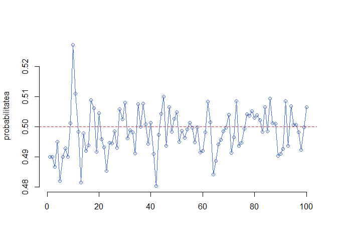
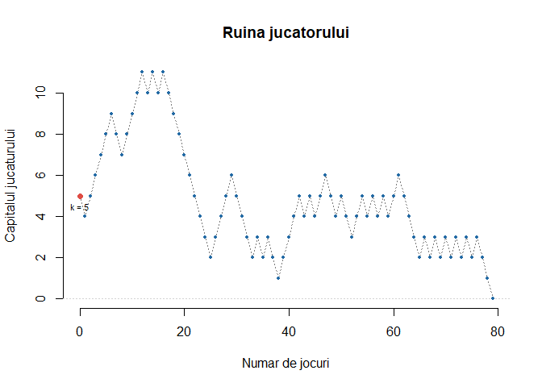

<script>
$(document).ready(function ()  {

    // move toc-ignore selectors from section div to header
    $('div.section.toc-ignore')
        .removeClass('toc-ignore')
        .children('h1,h2,h3,h4,h5').addClass('toc-ignore');

    // establish options
    var options = {
      selectors: "h1,h2,h3",
      theme: "bootstrap3",
      context: '.toc-content',
      hashGenerator: function (text) {
        return text.replace(/[.\\/?&!#<>]/g, '').replace(/\s/g, '_').toLowerCase();
      },
      ignoreSelector: ".toc-ignore",
      scrollTo: 60
    };
    options.showAndHide = false;
    options.smoothScroll = true;

    // tocify
    var toc = $("#TOC").tocify(options).data("toc-tocify");
});
</script>

Obiectivul acestui laborator este de a prezenta succint câteva funcții utile teoriei probabilităților din programul [R](https://cran.r-project.org/), care este structura lor și cum le putem aplica. De asemenea, tot în acest laborator vom prezenta și câteva probleme ce se pot rezolva cu ajutorul algoritmilor aleatori. 


# Familia de funcții `apply`

Pe lângă buclele `for` și `while`, în R există și un set de funcții care permit scrierea și rularea într-o manieră mai compactă a codului dar și aplicarea de funcții unor grupuri de date.  

- `lapply()`: Evaluează o funcție pentru fiecare element al unei liste

- `sapply()`: La fel ca `lapply` numai că încearcă să simplifice rezultatul

- `apply()`: Aplică o funcție după fiecare dimensiune a unui `array`

- `tapply()`: Aplică o funcție pe submulțimi ale unui vector

- `mapply()`: Varianta multivariată a funcției `lapply`

- `split`: Împarte un vector în grupuri definite de o variabilă de tip factor. 

## `lapply()`

Funcția `lapply()` efectuează următoarele operații:

1. buclează după o listă, iterând după fiecare element din acea listă
2. aplică o *funcție* fiecărui element al listei (o funcție pe care o specificăm)
3. întoarce ca rezultat tot o listă (prefixul `l` vine de la listă). 

Această funcție primește următoarele trei argument: (1) o listă `X`; (2) o funcție `FUN`; (3) alte argumente via `...`. Dacă `X` nu este o listă atunci aceasta va fi transformată într-una folosind comanda `as.list()`.

Considerăm următorul exemplu în care vrem să aplicăm funcția `mean()` tuturor elementelor unei liste


```r
set.seed(222)
x <- list(a = 1:5, b = rnorm(10), c = rnorm(20, 1), d = rnorm(100, 5))
lapply(x, mean)
$a
[1] 3

$b
[1] 0.1996044

$c
[1] 0.7881026

$d
[1] 5.064188
```

Putem să folosim funcția `lapply()` pentru a evalua o funcție în moduri repetate. Mai jos avem un exemplu în care folosim funcția `runif()` (permite generarea observațiilor uniform repartizate) de patru ori, de fiecare dată generăm un număr diferit de valori aleatoare. Mai mult, argumentele $min=0$ și $max=3$ sunt atribuite, prin intermediul argumentului `...`, funcției `runif`.  


```r
x <- 1:4
lapply(x, runif, min = 0, max = 3)
[[1]]
[1] 0.03443616

[[2]]
[1] 1.267361 1.365441

[[3]]
[1] 1.8084700 2.1902665 0.4139585

[[4]]
[1] 1.5924650 0.7355067 2.1483841 1.6082945
```

## `sapply()`

Funcția `sapply()` are un comportament similar cu `lapply()` prin faptul că funcția `sapply()` apelează intern `lapply()` pentru valorile de input, după care evaluează:

- dacă rezultatul este o listă în care fiecare element este de lungime 1, atunci întoarce un vector

- dacă rezultatul este o listă în care fiecare element este un vector de aceeași lungime (>1), se întoarce o matrice

- în caz contrar se întoarce o listă.

Considerăm exemplul de mai sus


```r
set.seed(222)
x <- list(a = 1:4, b = rnorm(10), c = rnorm(20, 1), d = rnorm(100, 5))
sapply(x, mean)
        a         b         c         d 
2.5000000 0.1996044 0.7881026 5.0641876 
```


## `split()`

Funcția `split()` primește ca argument un vector sau o listă (sau un data.frame) și împarte datele în grupuri determinate de o variabilă de tip factor (sau o listă de factor).

Argumentele aceste funcții sunt 


```r
str(split)
function (x, f, drop = FALSE, ...)  
```

unde

- `x` este un vector, o listă sau un data.frame
- `f` este un factor sau o listă de factori

Considerăm următorul exemplu în care generăm un vector de date și îl împărțim după o variabilă de tip factor creată cu ajutorul funcției `gl()` (*generate levels*).


```r
x <- c(rnorm(10), runif(10), rnorm(10, 1))
f <- gl(3, 10)
split(x, f)
$`1`
 [1] -2.27414224 -0.11266780  0.61308167  0.07733545  0.57137727
 [6]  0.11672493 -0.95685256 -1.90008460 -1.48972089  0.55925676

$`2`
 [1] 0.91159086 0.03291829 0.78368939 0.11852882 0.64443831 0.78790988
 [7] 0.82451477 0.05642366 0.65075027 0.95426854

$`3`
 [1]  2.6666242  2.6634334  1.8106280 -0.7837308  1.6575684  0.1546575
 [7]  0.4930056 -0.9031544  2.4042311  1.4106863
```

Putem folosi funcția `split` și în conjuncție cu funcția `lapply` (atunci când vrem să aplicăm o funcție `FUN` pe grupuri de date).


```r
lapply(split(x, f), mean)
$`1`
[1] -0.4795692

$`2`
[1] 0.5765033

$`3`
[1] 1.157395
```

## `tapply()`

Funcția `tapply()` este folosită pentru aplicarea unei funcții `FUN` pe submulțimile unui vector și poate fi văzută ca o combinație între `split()` și `sapply()`, dar doar pentru vectori. 


```r
str(tapply)
function (X, INDEX, FUN = NULL, ..., default = NA, simplify = TRUE)  
```

Argumentele acestei funcții sunt date de următorul tabel:

| Argument | Descriere |
|:------------------|:---------------------|
| `X` | un vector |
| `INDEX` | este o variabilă de tip factor sau o listă de factori |
| `FUN` | o funcție ce urmează să fie aplicată |
| `...` | argumente ce vor fi atribuite funcției `FUN` |
| `simplify` | dacă vrem să simplificăm rezultatul |

Table: Tabelul 1. Argumentele functiei tapply

Următorul exemplu calculează media după fiecare grupă determinată de o variabilă de tip factor a unui vector numeric.


```r
x <- c(rnorm(10), runif(10), rnorm(10, 1))
f <- gl(3, 10)   
f
 [1] 1 1 1 1 1 1 1 1 1 1 2 2 2 2 2 2 2 2 2 2 3 3 3 3 3 3 3 3 3 3
Levels: 1 2 3
tapply(x, f, mean)
            1             2             3 
-0.0007774025  0.3736457792  0.5789436983 
```

Putem să aplicăm și funcții care întorc mai mult de un rezultat. În această situație rezultatul nu poate fi simplificat:


```r
tapply(x, f, range)
$`1`
[1] -2.1904113  0.9249901

$`2`
[1] 0.004445296 0.998309704

$`3`
[1] -0.3379675  1.9327099
```

## `apply()`


Funcția `apply()` este folosită cu precădere pentru a aplica o funcție liniilor și coloanelor unei matrice (care este un `array` bidimensional). Cu toate acestea poate fi folosită pe tablouri multidimensionale (`array`) în general. Folosirea funcției `apply()` nu este mai rapidă decât scrierea unei bucle `for`, dar este mai compactă.


```r
str(apply)
function (X, MARGIN, FUN, ...)  
```

Argumentele funcției `apply()` sunt

- `X` un tablou multidimensional
- `MARGIN` este un vector numeric care indică dimensiunea sau dimensiunile după care se va aplica funcția 
- `FUN` este o funcție ce urmează să fie aplicată
- `...` alte argumente penru funcția`FUN`

Considerăm următorul exemplu în care calculăm media pe coloane într-o matrice


```r
x <- matrix(rnorm(200), 20, 10)
apply(x, 2, mean)  ## media fiecarei coloane
 [1]  3.745002e-02  1.857656e-01 -2.413659e-01 -2.093141e-01 -2.562272e-01
 [6]  8.986712e-05  7.444137e-02 -7.460941e-03  6.275282e-02  9.801550e-02
```

precum și media după fiecare linie


```r
apply(x, 1, sum)   ## media fiecarei linii
 [1]  2.76179139  2.53107681  0.87923177  1.80480589  0.98225832
 [6] -3.06148753 -1.40358820 -0.65969812 -1.63717046 -0.29330726
[11] -2.41486442 -3.15698523  2.27126822 -3.88290287 -3.15595194
[16]  5.41211963  2.32985530 -3.05330574 -0.02110926 -1.34909559
```


# Exerciții pregătitoare

## Aruncarea cu banul 

În acest exemplu vrem să simulăm aruncarea unei monede (echilibrate) folosind funcția `sample()`. Această funcție permite extragerea, cu sau fără întoarcere (`replace = TRUE` sau `replace = FALSE` - aceasta este valoarea prestabilită), a unui eșantion de volum dat (`size`) dintr-o mulțime de elemente `x`. 

Spre exemplu dacă vrem să simulăm $10$ aruncări cu banul atunci apelăm:


```r
sample(c("H", "T"), 10, replace = TRUE)
 [1] "T" "H" "T" "T" "T" "T" "T" "H" "T" "T"
```

Pentru a estima probabilitatea de apariției a stemei (`H`) repetăm aruncarea cu banul de $10000$ de ori și calculăm raportul dintre numărul de apariții ale evenimentului $A=\{H\}$ și numărul total de aruncări:


```r
# atunci cand moneda este echilibrata
a = sample(c("H","T"), 10000, replace = TRUE)
p = sum(a == "H")/length(a)
p
[1] 0.5066
```

și pentru cazul în care moneda nu este echilibrată


```r
a = sample(c("H","T"), 10000, replace = TRUE, prob = c(0.2, 0.8))
p = sum(a == "H")/length(a)
p
[1] 0.2012
```

Putem vedea cum evoluează această probabilitatea în funcție de numărul de repetări


```r
y = rep(0,100)

for (i in 1:100){
  a = sample(c("H","T"), i*100, replace = TRUE)
  y[i] = sum(a == "H")/length(a)
}

plot(1:100, y, type = "o", col = "royalblue", bty = "n",
     xlab ="", ylab = "probabilitatea")
abline(h = 0.5, lty = 2, col = "brown3")
```



## Numărul de băieți dintr-o familie cu doi copii 

<div class="rmdexercise">
<p>O familie are doi copii. Care este probabilitatea ca ambii copii să fie băieți știind că cel puțin unul dintre copii este băiat ? Care este probabilitatea ca ambii copii să fie băieți știind că cel mai tânăr este băiat ?</p>
</div>

Pentru a răspunde la cele două întrebări să observăm că cei doi copii (copilul mai mare și cel mai mic) pot fi ambii de sex masculin sau feminin, prin urmare avem patru combinații de sexe, pe care le presupunem egal probabile. Putem reprezenta spațiul stărilor prin 

$$
\Omega = \{BB,BF,FB,FF\}
$$

unde $\mathbb{P}(BB)=\mathbb{P}(BF)=\mathbb{P}(FB)=\mathbb{P}(FF)=\frac{1}{4}$. 

Pentru a răspunde la prima întrebare avem:

$$
\begin{aligned}
  \mathbb{P}\left(BB\,|\,\text{cel puțin unul este băiat}\right) &= \mathbb{P}\left(BB\,|\,BF\cup FB\cup BB\right)\\
    &= \frac{\mathbb{P}\left(BB\cap (BF\cup FB\cup BB)\right)}{\mathbb{P}\left(BF\cup FB\cup BB\right)} = \frac{\mathbb{P}\left(BB\right)}{\mathbb{P}\left(BF\cup FB\cup BB\right)} = \frac{1}{3}.
\end{aligned}
$$

Iar pentru cea de-a doua întrebare:


$$
\begin{aligned}
  \mathbb{P}\left(BB\,|\,\text{cel mai tânăr este băiat}\right) &= \mathbb{P}\left(BB\,|\,FB\cup BB\right)\\
    &= \frac{\mathbb{P}\left(BB\cap (FB\cup BB)\right)}{\mathbb{P}\left(FB\cup BB\right)} = \frac{\mathbb{P}\left(BB\right)}{\mathbb{P}\left(FB\cup BB\right)} = \frac{1}{2}.
\end{aligned}
$$

Vom încerca să răspundem la aceste întrebări și cu ajutorul limbajului R, prin simulare. Din abordarea *frecvenționistă* am văzut că prin repetarea de $N$ ori a unui experiment în condiții identice, 

$$
  \mathbb{P}(A|B)\approx \frac{N(A\cap B)}{N(B)}
$$

unde $N(A\cap B)$ este numărul de realizări (din $N$) a evenimentului $A\cap B$ iar $N(B)$ este numărul de realizări a evenimentului $B$. Să considerăm $N = 10^5$ și fie 


```r
N = 10^5

copil1 = sample(c("baiat", "fata"), N, replace = TRUE)
copil2 = sample(c("baiat", "fata"), N, replace = TRUE)
```

Aici `copil1` este un vector de lungime `N` care reprezintă sexul primului copil și în mod similar `copil2` reprezintă sexul celui de-al doilea copil. 

Fie $A$ evenimentul ca ambii copii să fie băieți și $B$ evenimentul prin care cel mai tânăr este băiat. 


```r
nB = sum(copil2 == "baiat")
nAB = sum(copil1 == "baiat" & copil2 == "baiat")

p2 = nAB/nB
```

Prin urmare probabilitatea (simulată) ca familia să aibă cei doi copii băieți știind că cel tânăr este băiat este 0.4991515. 

Considerând acum $C$ evenimentul prin care familia are cel puțin un copil băiat, avem 


```r
nC = sum(copil1 == "baiat" | copil2 == "baiat")

p1 = nAB/nC
```

de unde probabilitatea ca familia să aibă doar băieți știind că cel puțin unul este băiat este 0.3339566.


## Monty Hall 

<div class="rmdexercise">
<p>Sunteți participant într-un joc televizat în care gazda vă prezintă trei uși închise. Acesta vă spune că în spatele unei uși se află o mașină iar în spatele celorlalte două se află câte o capră. Jocul decurge în felul următor: trebuie să alegeți una dintre cele trei uși; gazda, care știe în spatele cărei uși se află mașina, deschide una dintre celelalte două uși, în spatele căreia se află o capră apoi vă întreabă dacă vreți să rămâneți la alegerea inițială sau vreți să alegeți cealaltă ușă rămasă închisă. Presupunând că vreți să câștigați o mașină, ce alegere preferați ?</p>
</div>


Considerăm evenimentele $C_1$, $C_2$ și $C_3$ ca indicând ușa în spatele căreia se află mașina. Aceste evenimente au probabilitatea de $1/3$ fiecare. 

Evenimentul prin care jucătorul alege ușa cu numărul 1 este notat cu $X_1$ și evenimentul prin care gazda deschide ușa cu numărul 3 este notat cu $H_3$. Avem că $\mathbb{P}(C_i|X_1) = 1/3$ iar $\mathbb{P}(H_3|C_1,X_1) = 1/2$, $\mathbb{P}(H_3|C_2,X_1) = 1$ si $\mathbb{P}(H_3|C_3,X_1) = 0$.

Avem că probabilitatea ca jucătorul să câștige adoptând schimbarea ușilor este (în condițiile în care a ales inițial poarta 1 și gazda a deschis poarta 3)

$$
\begin{aligned}
  \mathbb{P}(C_2|H_3,X_1) &= \frac{\mathbb{P}(H_3|C_2,X_1)\mathbb{P}(C_2\cap X_1)}{\mathbb{P}(H_3\cap X_1)}\\
  &=\frac{\mathbb{P}(H_3|C_2,X_1)\mathbb{P}(C_2\cap X_1)}{\mathbb{P}(H_3|C_1,X_1)\mathbb{P}(C_1\cap X_1)+\mathbb{P}(H_3|C_2,X_1)\mathbb{P}(C_2\cap X_1)+\mathbb{P}(H_3|C_3,X_1)\mathbb{P}(C_3\cap X_1)}\\
  &= \frac{\mathbb{P}(H_3|C_2,X_1)}{\mathbb{P}(H_3|C_1,X_1)+\mathbb{P}(H_3|C_2,X_1)+\mathbb{P}(H_3|C_3,X_1)} = \frac{1}{1/2+1+0} = \frac{2}{3}
\end{aligned}
$$

Intuiție (să presupunem că ne aflăm în situația în care am ales ușa cu numărul 1):


\begin{center}
\begin{table}[ht]
\centering
  \begin{tabular}{c|c|c|c|c}
  \toprule
    Ușa 1 & Ușa 2 & Ușa 3 & Nu schimbăm & Schimbăm\\
  \midrule
    Mașină & Capră & Capră & \cmark & \xmark\\
    Capră & Mașină & Capră & \xmark & \cmark\\
    Capră & Capră & Mașină & \xmark & \cmark\\
  \bottomrule
    
  \end{tabular}
\end{table}

\end{center}

Vom încerca să simulăm jocul descris de problema noastră:


```r
monty = function(random = TRUE) {
  doors = 1:3
  
  if (random){
    # alege aleator unde se afla masina
    cardoor <- sample(doors,1)
  }else{
    print("Scrieti numarul usii in spatele careia se afla masina:")
    cardoor = scan(what = integer(), nlines = 1, quiet = TRUE)
  }
  
  # Monty ii spune jucatorului sa aleaga usa 
  print("Monty Hall spune ‘Alege o usa, orice usa!’")
  
  # alegerea jucatorului (1,2 sau 3)
  chosen = scan(what = integer(), nlines = 1, quiet = TRUE)
  
  # Monty intoarce o usa cu capra (nu poate fi usa aleasa 
  # de jucator si nici usa cu masina)
  if (chosen != cardoor){
     montydoor = doors[-c(chosen, cardoor)]
  }else{
    montydoor = sample(doors[-chosen],1)
  } 
  
  # jucatorul schimba sau...
  print(paste("Monty deschide usa ", montydoor, "!", sep=""))
  print("Doresti sa schimbi usa (y/n)?")
  
  reply = scan(what = character(), nlines = 1, quiet = TRUE)
  
  # ce incepe cu "y" este da
  if (substr(reply,1,1) == "y"){
    chosen = doors[-c(chosen,montydoor)]
  } 
  
  # Rezultatul jocului
  if (chosen == cardoor){
    print("Bravo! Ai castigat !")
  }else{
    print("Pacat! Ai pierdut!")
  } 
}
```


## Jocul de loto 

<div class="rmdexercise">
<p>Construiți în R o funcție care să simuleze jocul de loto <span class="math inline">\(6/49\)</span>. Acest joc consistă din extragerea aleatoare a <span class="math inline">\(6\)</span> numere dintr-o urnă cu <span class="math inline">\(49\)</span> de numere posibile, fără întoarcere. Fiecare extragere se face de manieră uniformă din numerele rămase în urnă (la a i-a extragere fiecare bilă din urnă are aceeași șansă să fie extrasă). De exemplu putem avea următorul rezultat: <span class="math inline">\(10, 27, 3, 45, 12, 24\)</span>.</p>
<p><strong>Notă</strong>: Funcția <code>sample()</code> poate face această operație, ceea ce se cere este de a crea voi o funcție care să implementeze jocul fără a folosi funcția <em>sample</em>. Binențeles că puteți folosi funcții precum: <code>runif</code> , <code>floor</code>, <code>choose</code>, etc.</p>
</div>


Începem prin a construi o funcție care ne permite generarea unei variabile aleatoare uniform repartizate pe mulțimea $\{1,2,\dots,n\}$ (această funcție este cea care simulează procesul de extragere de la fiecare pas):


```r
myintunif = function(n){
  # dunctia care genereaza un numar uniform intre 1 si n
  r = n*runif(1)
  u = floor(r)+1
  return(u)
}
```

Funcția care realizează extragerea fără întoarcere a $k$ numere aleatoare din $n$, este:


```r
myrandsample = function(n,k){
  # 
  x = 1:n
  q = rep(0,k)
  
  for(i in 1:k){
    l = length(x)
    u = myintunif(l)
    q[i] = x[u]
    x = x[x!=q[i]]
  }
  return(q)
}
```

Pentru a vedea ce face această funcție putem scrie:


```r
n = 49
k = 6

myrandsample(n,k)
[1] 28 19 43  1 41 39
```

<div class="rmdexercise">
<p>Să presupunem acum că la extragerea loto de Duminică seara au fost alese numerele: <code>r set.seed(1223); myrandsample(49, 6)</code> și că toți cei <span class="math inline">\(100000\)</span> de locuitori ai unui orășel și-au cumpărat un bilet. Care este probabilitate ca o persoană care poate completa o singură grilă să piardă ? (o persoană pierde dacă a nimerit cel mult două numere din cele extrase) Comparați rezultatul teoretic cu cel empiric.</p>
</div>

Pentru $0\leq k \leq 6$, fie $A_k$ evenimentul ca jucătorul să fi nimerit exact $k$ numere din cele câștigătoare. Atunci, cum putem alege cele $k$ numere din cele $6$ în $\binom{6}{k}$ moduri iar pe celelalte $6 - k$ în $\binom{43}{6-k}$ moduri, găsim că 

$$
  \mathbb{P}(A_k) = \frac{\binom{6}{k}\binom{43}{6-k}}{\binom{49}{6}}.
$$

Prin urmare probabilitatea ca jucătorul să piardă este 

$$
  \mathbb{P}(A_0) + \mathbb{P}(A_1) + \mathbb{P}(A_2) = \frac{\binom{6}{0}\binom{43}{6} + \binom{6}{1}\binom{43}{5} +\binom{6}{2}\binom{43}{4}}{\binom{49}{6}}
$$

adică $\mathbb{P}(A_0) + \mathbb{P}(A_1) + \mathbb{P}(A_2)\approx$ 0.9813625.

Să testăm rezultatul empiric


```r
a = c(31, 7, 17, 15, 10, 42)

n = 100000
u = replicate(n, sum(myrandsample(49, 6) %in% a))

# rezultatul
res = table(u)/n

# probabilitatea empirica de pierdere
sum(res[c("0", "1", "2")])
[1] 0.98168
```

## Problema potrivirilor

<div class="rmdexercise">
<p>Să ne imaginăm că <span class="math inline">\(20\)</span> de persoane merg la operă și că fiecare persoană poartă o pălărie. În momentul în care ajung la intrare își lasă pălăria la garderobă. Pe parcursul reprezentării artistice, persoana responsabilă cu garderoba se încurcă, pierde lista cu numerele locațiilor și returnează în mod aleator pălăriile persoanelor la plecare. Care este probabilitatea ca cel puțin o persoană să fi primit pălăria cu care a venit?</p>
</div>

Să presupunem că persoanele și pălărie sunt numerotate de la $1$ la $n = 20$ și inițial persoana $i$ a venit cu pălăria $i$. Fie $\Omega = S_n$ mulțimea permutărilor cu $n$ elemente, $\mathcal{F} = \mathcal{P}(\Omega)$ și $\mathbb{P}$ echiprobabilitatea pe $(\Omega, \mathcal{F})$. Să notăm cu $E_i$ evenimentul prin care a $i$-a persoană primește pălăria cu numărul $i$, adică primește pălăria cu care a venit. Evenimentul $A$ prin care cel puțin o persoană a primit pălăria cu care a venit este 

$$
  A = E_1 \cup E_2 \cup\cdots\cup E_n.
$$

Cum $E_i$ reprezintă mulțimea permutărilor $\sigma\in\S_n = \Omega$ pentru care $\sigma(i) = i$ avem că 

$$
  \mathbb{P}(E_i) = \frac{(n-1)!}{n!} = \frac{1}{n}
$$

deoarece $|\Omega| = n!$ iar cele $n-1$ valori diferite de $i$ pot fi așezate în $(n-1)!$ moduri. În mod similar, 

$$
  \mathbb{P}(E_i\cap E_j) = \frac{(n-2)!}{n!}
$$

și în general 

$$
  \mathbb{P}(E_{i_1}\cap E_{i_2}\cap\cdots\cap E_{i_k}) = \frac{(n-k)!}{n!}.
$$

Formula lui Poincare permite calcularea probabilității dorite 

$$
  \mathbb{P}(A) = \mathbb{P}(E_1 \cup E_2 \cup\cdots\cup E_n) = \sum_{k = 1}^{n} (-1)^{k-1} \sum_{1\leq i_1<\cdots<i_k\leq n}\mathbb{P}(E_{i_1}\cap E_{i_2}\cap\cdots\cap E_{i_k})
$$

de unde 

$$
  \mathbb{P}(A) = \sum_{k = 1}^{n} (-1)^{k-1} \binom{n}{k}\frac{(n-k)!}{n!} = \sum_{k = 1}^{n} \frac{(-1)^{k-1}}{k!} \to 1 - \frac{1}{e} \approx 0.63212
$$

Să vedem că același rezultat îl obținem și prin simulare: 


```r
# repetam experimentul de un nr mare de ori
m = 10000

# nr de persoane 
n = 20

n.potriviri = rep(0, m)

persoane = 1:n

for (i in 1:m){
  palarii = sample(1:n, n)
  n.potriviri[i] = sum(palarii == persoane)
}

# proportia persoanelor cu cel putin o potrivire 
sum(n.potriviri > 0) / m
[1] 0.6366
```


## Ruina jucătorului 

<div class="rmdexercise">
<p>Un bărbat vrea să își cumpere un obiect (de exemplu o mașină sau o casă) care costă <span class="math inline">\(N\)</span> unități monetare. Să presupunem că el are economisit un capital de <span class="math inline">\(0 &lt; k &lt; N\)</span> unități monetare și încearcă să câștige restul jucând un joc de noroc cu managerul unei bănci. Jocul este următorul: bărbatul aruncă o monedă echilibrată în mod repetatș dacă moneda pică cap (<span class="math inline">\(H\)</span>) atunci managerul îi dă o unitate monetară, în caz contrar bărbatul plătește o unitate monetară bancii. Jocul continuă până când unul din două evenimente se realizează: sau câștigă suma necesară și își cumpără obiectul dorit sau pierde banii și ajunge la faliment. Ne întrebăm care este probabilitatea să ajungă la faliment?</p>
</div>

Fie $A$ evenimentul ca bărbatul să ajungă la ruină și $B$ evenimentul ca la prima aruncare moneda a picat cap. Atunci din formula probabilității totale avem 

$$
  \mathbb{P}_k(A) = \mathbb{P}_k(A|B)\mathbb{P}(B)+\mathbb{P}_k(A|B^c)\mathbb{P}(B^c)
$$

unde $\mathbb{P}_k$ este probabilitatea calculată în funcție de valoarea $k$ a capitalului inițial al jucătorului. Să observăm că $\mathbb{P}_k(A|B)$ devine $\mathbb{P}_{k+1}(A)$ deoarece dacă la prima aruncare avem cap atunci capitalul inițial a crescut la $k+1$. În mod similar, dacă la prima aruncare am obținut coadă atunci $\mathbb{P}_k(A|B^c) = \mathbb{P}_{k-1}(A)$. Notând cu $p_k = \mathbb{P}_k(A|B)$ obținem următoarea ecuație 

$$
  p_k = \frac{1}{2}p_{k+1} + \frac{1}{2}p_{k-1},
$$

cu valorile inițiale $p_0=1$ (dacă jucătorul a pornit cu un capital inițial nul atunci el este în faliment) și respectiv $p_N=0$ (dacă jucătorul are din start suma necesară pentru a achiziționa obiectul dorit atunci nu mai are loc jocul). 

O simulare a jocului pentru $N = 50$ și $k = 5$ este prezentată de următoarea funcție: 


```r
ruina = function(N, k){
  flag = TRUE

  joc = 0
  capital = k
  y = capital
  
  while(flag){
    x = 2*rbinom(1,1,0.5)-1
    
    capital = capital + x
    y = c(y, capital)
    
    joc = joc + 1
    
    if (capital == 0 || capital == N){
      flag = FALSE
    }
  }
  
  return(y) # daca am 0 este ruina altfel este succes
}
```

Putem ilustra grafic jocul după cum urmează:


```r
N = 50
k = 5

set.seed(1234)

y = ruina(N, k)
joc = length(y) - 1 # nr de jocuri

plot(0:joc, y, type = "l",
     main = "Ruina jucatorului",
     xlab = "Numar de jocuri",
     ylab = "Capitalul jucaturului",
     bty = "n",
     lty = 3, col = "grey50")
abline(h = c(0,N), col = "lightgrey", lty = 3)
points(0:joc, y, col = myblue,
       pch = 16,
       cex = 0.5)
points(0, k, col = myred, pch = 16)
text(0, k, labels = paste0("k = ", k), pos = 1, cex = 0.7)
```



Dacă definim $b_k = p_k - p_{k-1}$ pentru $k\geq 1$ atunci $b_k = b_{k-1}$, $\forall k\geq2$. Prin urmare $b_k = b_1$ și $p_k = b_1+p_{k-1} = kb_1+p_0$. Observând că $b_1+\cdots+b_N=p_N-p_0=-1$ deducem că $b_1=-\frac{1}{N}$ iar $p_k=1-\frac{k}{N}$.

Dorim să repetăm experimentul de $M = 1000$ de ori (pentru valorile inițiale $N = 50$ și $k = 5$) și ne interesăm de câte ori jucătorul a ajuns la faliment. 


```r
N = 50
k = 5
M = 1000
# Obs. - rezultatul functiei ruina trebuie modificat
joc = replicate(M, ruina(N, k)) # repeta functia de M ori 

proba_ruina = sum(joc == 0)/M 
```

Am obținut că probabilitatea empirică de faliment este 0.9 iar cea teoretică este 0.9. 


# Aplicația 1: Verificarea egalității a două polinoame

În această secțiune ne propunem să abordăm următoarea problemă:

<div class="rmdexercise">
<p>Având date două polinoame <span class="math inline">\(F(x)\)</span> și <span class="math inline">\(G(x)\)</span>, cu <span class="math inline">\(F(x)=\prod_{i=1}^d(x-a_i)\)</span> și <span class="math inline">\(G(x)\)</span> dat sub forma canonică (<span class="math inline">\(\sum_{i=0}^d c_ix^i\)</span>), vrem să verificăm dacă are loc identitatea</p>
<p><span class="math display">\[
  F(x) \overset{?}{\equiv} G(x).
\]</span></p>
</div>

Știm că două polinoame sunt egale atunci când coeficienții lor în descompunerea canonică sunt egali. Observăm că dacă am transforma polinonum $F(x)$ la forma sa canonică prin înmulțirea consecutivă a monomului $i$ cu produsul primelor $i-1$ monoame atunci am avea nevoie de $\Theta(d^2)$ operații. În cele ce urmează presupunem că fiecare operație de înmulțire se poate face în timp constant, ceea ce nu corespunde în totalitate cu realitatea în special în cazurile în care vrem să înmulțim coeficienți mari. 

Ne propunem să construim un algoritm randomizat care să verifice această egalitate într-un număr mai mic de operații ($O(d)$ operații). Să presupunem că $d$ este gradul maxim al lui $x$ (exponentul cel mai mare) în $F(x)$ și $G(x)$. Algoritmul poate fi descris astfel: alegem uniform un număr $r$ din mulțimea $\{1,2,\ldots,100d\}$ (prin uniform înțelegem că cele $100d$ numere au aceeași șansă să fie alese) și calculăm valorile lui $F(r)$ și $G(r)$. Dacă $F(r)\neq G(r)$ atunci algoritmul întoarce că cele două polinoame nu sunt egale iar dacă $F(r)=G(r)$ atunci algoritmul întoarce că cele două polinoame sunt egale. Algoritmul poate greși doar dacă cele două polinoame nu sunt egale dar $F(r)=G(r)$. Vrem să evaluăm această probabilitate.

Experimentul nostru poate fi modelat cu ajutorul tripletului $(\Omega, \mathcal{F}, \mathbb{P})$ unde $\Omega = \{1,2,\ldots,100d\}$, $\mathcal{F}=\mathcal{P}(\Omega)$ iar $\mathbb{P}$ este echirepartiția pe $\Omega$. Fie $E$ evenimentul că algoritmul greșește, acest eveniment se realizează doar dacă numărul aleator $r$ este o rădăcină a polinomului $F(x)-G(x)$, de grad cel mult $d$. Cum din *Teorema Fundamentală a Algebrei* acest polinom nu poate avea mai mult de $d$ rădăcini rezultă că 

$$
  \mathbb{P}(\text{algoritmul greseste}) = \mathbb{P}(E) \leq \frac{d}{100d} = \frac{1}{100}.
$$

Putem să îmbunătățim această probabilitate? O variantă ar fi să mărim spațiul stărilor la $\Omega = \{1,2,\ldots,1000d\}$ și atunci șansa ca algoritmul să greșească ar fi de $\frac{1}{1000}$. O altă variantă ar fi să repetăm procedeul de mai multe ori, iar în această situație algoritmul ar fi eronat doar dacă ar întoarce că cele două polinoame sunt egale când în realitate ele nu sunt. Atunci când repetăm procesul, alegerea numărului aleator $r$ se poate face în două moduri diferite: cu întoarcere (nu ținem cont de numerele ieșite) sau fără întoarcere (ținem cont de numerele ieșite). 

Dacă luăm $E_i$ evenimentul prin care la a i-a rulare a algoritmului am extras o rădăcină $r_i$ astfel încât $F(r_i)=G(r_i)$, atunci probabilitatea ca algoritmul să întoarcă un răspuns greșit după $k$ repetări, este 

$$
  \mathbb{P}(E_1\cap E_2\cap \cdots\cap E_k).
$$

În cazul în care alegerea se face cu întoarcere (evenimentele sunt independente) obținem 

$$
  \mathbb{P}(E_1\cap E_2\cap \cdots\cap E_k) = \prod_{i=1}^{k}\mathbb{P}(E_i)\leq\prod_{i=1}^{k}\frac{d}{100d} = \left(\frac{1}{100}\right)^k,
$$

iar dacă extragerea s-a făcut fără întoarcere (evenimentele nu mai sunt independente), atunci folosind regula de multiplicare avem

\begin{align*}
  \mathbb{P}(E_1\cap E_2\cap \cdots\cap E_k) &= \mathbb{P}(E_1)\mathbb{P}(E_2|E_1)\cdots\mathbb{P}(E_k|E_1\cap\cdots\cap E_{k-1})\\
                    &\leq \prod_{i=1}^{k}\frac{d - (i-1)}{100d - (i-1)} \leq \left(\frac{1}{100}\right)^k.
\end{align*}


```r
Fx = function(x){
  return((x+1)*(x-2)*(x+3)*(x-4)*(x+5)*(x-6))
}

Gx = function(x){
  return(x^6 - 7*x^3 + 25)
}

Gx2 = function(x){
  return(x^6 - 3*x^5 - 41*x^4 + 87*x^3 + 400*x^2 - 444*x - 720)
}

comparePols = function(Fx, Gx){
  k = 3 # repetam algoritmul de 3 ori
  d = 6 # gradul polinomului 
  
  for (i in 1:k){
    r = floor(100*d*runif(1)) + 1
    
    f1 = Fx(r)
    g1 = Gx(r)
    
    if (f1!=g1){
      return(cat("Cele doua polinoame sunt diferite ! \nPentru r =", 
                         r, "avem ca F(r)!=G(r) (", f1, "!=", g1, ")"))
    }
    
  }
  
  return(cat("Polinoamele sunt egale. Eroarea este de", 100^(-k)))
}

comparePols(Fx, Gx)
Cele doua polinoame sunt diferite ! 
Pentru r = 438 avem ca F(r)!=G(r) ( 7.010787e+15 != 7.060649e+15 )

comparePols(Fx, Gx2)
Polinoamele sunt egale. Eroarea este de 1e-06
```

# Aplicația 2: Verificarea produsului a două matrice

În cele ce urmează vom prezenta o altă aplicație în care algoritmul randomizat este mult mai eficient decât orice algoritm determinist cunoscut până în acest moment. 

<div class="rmdexercise">
<p>Să presupunem că avem trei matrice pătratice <span class="math inline">\(\bf{A}\)</span>, <span class="math inline">\(\bf{B}\)</span> și <span class="math inline">\(\bf{C}\)</span> de dimensiune <span class="math inline">\(n \times n\)</span>. Pentru simplitate considerăm că avem de-a face cu matrice cu elemente de <span class="math inline">\(0\)</span> și <span class="math inline">\(1\)</span> iar operațiile se fac <span class="math inline">\(\mod2\)</span>. Vrem să construim un algoritm randomizat care să verifice egalitatea: <span class="math display">\[
  \bf{A}\cdot\bf{B}=\bf{C} \qquad (\text{mod 2}).
\]</span></p>
</div>

O modalitate ar fi să calculăm elementele matricii $\bf{C}'=\bf{A}\cdot\bf{B}$, folosind relația $C'_{i,j} = \sum_{k=1}^{n}A_{i,k}B_{k,j}$, și să le comparăm cu elementele matricii $\bf{C}$. Metoda *naivă* de multiplicare a celor două matrice necesită cel mult $O(n^3)$ operații. Știm că există algoritmi (netriviali) care permit multiplicarea matricelor într-un număr mai mic de operații, ca de exemplu:

<div class="rmdinsight">
<p>(Strassen 1969) Este posibil să înmulțim două matrice în aproape <span class="math inline">\(n^{\log_27}\approx n^{2.81}\)</span> operații.</p>
</div>

iar o versiune îmbunătățită a algoritmului lui Strassen (și cea care deținea recordul până în 2014^[Actualul record este $O(n^{2.3728})$ dat de [Vassilevska Williams](http://theory.stanford.edu/~virgi/matrixmult-f.pdf)])

<div class="rmdinsight">
<p>(Coppersmith-Winograd 1987) Este posibil să înmulțim două matrice în aproape <span class="math inline">\(n^{2.376}\)</span> operații.</p>
</div>

Noi nu vom vorbi despre algoritmi de multiplicare a două matrice, ci de algoritmi de verificare a acestei operații. Pentru aceasta vom considera un algoritm randomizat care verifică înmulțirea în aproximativ $n^2$ operații ($O(n^2)$) cu precizarea că acest algoritm poate conduce la un răspuns eronat.

<div class="rmdinsight">
<p>(Freivalds 1979) Există un algoritm probabilist care poate verifica dacă <span class="math inline">\(\bf{A}\cdot\bf{B}=\bf{C} \quad (\text{mod 2})\)</span> în <span class="math inline">\(O(n^2)\)</span> operații și având o eroare de <span class="math inline">\(2^{-200}\)</span>.</p>
</div>

Algoritmul lui de bază a lui Freivalds este următorul:

  1. Alegem uniform un vector $\bf{r}=(r_1,r_2,\ldots,r_n)\in\{0,1\}^n$ (unde prin ales uniform înțelegem că fiecare $r_i$ este ales de manieră independentă cu probabilitatea de $0.5$ să ia valoarea $0$ sau $1$^[Putem să ne imaginăm că aruncăm cu un ban echilibrat de $n$ ori și convertim capul în $1$ și pajura în $0$.])
  
  2. Calculăm $y = \bf{A}\bf{B}\bf{r}$ și $z = \bf{C}\bf{r}$. Dacă $y = z$ atunci algoritmul întoarce *multiplicarea este corectă* altfel *multiplicarea matricelor este eronată*.

Observăm că acest algoritm necesită trei operații de multiplicare între o matrice și un vector, prin urmare acesta necesită $O(n^2)$ pași. De asemenea, remarcăm că algoritmul întoarce un răspuns eronat atunci când $\bf{A}\cdot\bf{B}\neq\bf{C}$ dar $\bf{A}\bf{B}\bf{r} = \bf{C}\bf{r}$. Probabilitatea ca algoritmul să întoarcă un raspuns eronat verifică

$$
  \mathbb{P}(\text{algoritmul intoarce raspuns gresit}) = \mathbb{P}(\bf{A}\bf{B}\bf{r} = \bf{C}\bf{r}) \leq \frac{1}{2}.
$$

Pentru a verifica acest rezultat, fie $\bf{D} = \bf{A}\cdot\bf{B}-\bf{C} \neq 0$. Evenimentul $\{\bf{A}\bf{B}\bf{r} = \bf{C}\bf{r}\}$ implică $\bf{D}\bf{r}=0$ și cum $\bf{D}\neq 0$ putem presupune că elementul $d_{1,1}\neq 0$. Deoarece $\bf{D}\bf{r}=0$ rezultă că $\sum_{j=1}^{n}d_{1,j}r_j=0$ sau, echivalent

$$
  r_1 = -\frac{\sum_{j=2}^{n}d_{1,j}r_j}{d_{1,1}}.
$$
Avem 

\begin{align*}
  \mathbb{P}(\bf{A}\bf{B}\bf{r} = \bf{C}\bf{r}) &= \sum_{(x_2,\cdots, x_n)\in\{0,1\}^n}\mathbb{P}\left(\{\bf{A}\bf{B}\bf{r} = \bf{C}\bf{r}\}\cap \{(r_2,\cdots, r_n) = (x_2,\cdots, x_n)\}\right)\\
      &\leq \sum_{(x_2,\cdots, x_n)\in\{0,1\}^n}\mathbb{P}\left(\left\{r_1 = -\frac{\sum_{j=2}^{n}d_{1,j}r_j}{d_{1,1}}\right\}\cap \{(r_2,\cdots, r_n) = (x_2,\cdots, x_n)\}\right)\\
      &\leq \sum_{(x_2,\cdots, x_n)\in\{0,1\}^n}\mathbb{P}\left(\left\{r_1 = -\frac{\sum_{j=2}^{n}d_{1,j}r_j}{d_{1,1}}\right\}\right)\mathbb{P}\left(\{(r_2,\cdots, r_n) = (x_2,\cdots, x_n)\}\right)\\
      &\leq \sum_{(x_2,\cdots, x_n)\in\{0,1\}^n}\frac{1}{2}\mathbb{P}\left(\{(r_2,\cdots, r_n) = (x_2,\cdots, x_n)\}\right)\\
      &= \frac{1}{2}.
\end{align*}

În relațiile de mai sus am folosit faptul că $r_1$ și $(r_2,\cdots, r_n)$ sunt independente.

Pentru a îmbunătății eroarea algoritmului putem să repetăm procedeul de $k$ ori^[Algoritmul lui Freivalds presupune $k = 200$.] și în acest caz probabilitatea de eroare devine $2^{-k}$ iar numărul de operații $O(kn^2)$. 


```r

FreivaldsAlg = function(A, B, C){
  # Algoritmul Freivalds
  n = dim(A)[1] # dimensiunea matricelor
  
  k = ceiling(log(n)) # numarul de repetari ale algoritmului
  
  for (i in 1:k){
    r = rbinom(n, 1, prob = 0.5)
    
    y = B%*%r
    y = A%*%y
    y = y%%2
    
    z = C%*%r
    z = z%%2
    
    if (any(y != z)){
      return(print("Multiplicarea matricelor este incorecta!"))
    }
    
  }
  
  return(cat("Multiplicarea matricelor este corecta!
             \nProbabilitatea de eroare a algoritmului este", 2^{-k}))
}

# Exemplul 1
set.seed(1234)
A = matrix(rbinom(225, 1, 0.5), nrow = 15)
B = matrix(rbinom(225, 1, 0.5), nrow = 15)

C = A%*%B
C = C%%2

FreivaldsAlg(A, B, C)
Multiplicarea matricelor este corecta!
             
Probabilitatea de eroare a algoritmului este 0.125

# Exemplul 2
set.seed(5678)
A1 = matrix(rbinom(625, 1, 0.5), nrow = 25)
B1 = matrix(rbinom(625, 1, 0.5), nrow = 25)

C1 = A1%*%t(B1)
C1 = C1%%2

C2 = A1%*%B1
C2 = C2%%2

FreivaldsAlg(A1, B1, C1)
[1] "Multiplicarea matricelor este incorecta!"
FreivaldsAlg(A1, B1, C2)
Multiplicarea matricelor este corecta!
             
Probabilitatea de eroare a algoritmului este 0.0625

# Exemplul 3
set.seed(5678910)
A3 = matrix(rbinom(1000000, 1, 0.5), nrow = 1000)
B3 = matrix(rbinom(1000000, 1, 0.5), nrow = 1000)

C3 = A3%*%B3
C3 = C3%%2

FreivaldsAlg(A3, B3, C3)
Multiplicarea matricelor este corecta!
             
Probabilitatea de eroare a algoritmului este 0.0078125
```


