<script>
$(document).ready(function ()  {

    // move toc-ignore selectors from section div to header
    $('div.section.toc-ignore')
        .removeClass('toc-ignore')
        .children('h1,h2,h3,h4,h5').addClass('toc-ignore');

    // establish options
    var options = {
      selectors: "h1,h2,h3",
      theme: "bootstrap3",
      context: '.toc-content',
      hashGenerator: function (text) {
        return text.replace(/[.\\/?&!#<>]/g, '').replace(/\s/g, '_').toLowerCase();
      },
      ignoreSelector: ".toc-ignore",
      scrollTo: 60
    };
    options.showAndHide = false;
    options.smoothScroll = true;

    // tocify
    var toc = $("#TOC").tocify(options).data("toc-tocify");
});
</script>

Obiectivul acestui laborator este de a prezenta succint câteva funcții utile teoriei probabilităților din programul [R](https://cran.r-project.org/), care este structura lor și cum le putem aplica. De asemenea, tot în acest laborator vom prezenta și câteva probleme ce se pot rezolva cu ajutorul algoritmilor aleatori. 


Obiectivul acestui laborator este de a introduce variabilele discrete cu ajutorul limbajului R. 

# Repartiții și elemente aleatoare în R

R pune la disploziție majoritatea repartițiilor uzuale. Tabelul de mai jos prezintă numele și parametrii acestora:

| Repartiția | Nume | Parametrii | Valori prestabilite |
|:--------------------------|:------------------------|:----------------------|:-----------------------------|
| Beta | `beta` | `shape1`, `shape2` |  |
| Binomial | `binom` | `size`, `prob` |  |
| Cauchy | `cauchy` | `location`, `scale` | `location = 0`, `scale = 1` |
| Chi-Squared | `chisq` | `df` |  |
| Exponential | `exp`  | `rate` (=1/mean) |  `rate = 1`  |
| Fisher | `f`  | `df1`, `df2` |  |
| Gamma | `gamma` | `shape`, `rate` (=1/scale) | `rate = 1` |
| Hypergeometric | `hyper` | `m`, `n`, `k` |  |
| Log-Normal | `lnorm` | `mean`, `sd` | `mean = 0`, `sd = 1` | 
| Logistic | `logis` | `location`, `scale` | `location = 0`, `scale = 1` |
| Normal | `norm` | `mean`, `sd` | `mean = 0`, `sd = 1` | 
| Poisson | `pois` | `lambda` |  |
| Student | `t` | `df` |  |
| Uniform | `unif` | `min`, `max` | `min = 0`, `max = 1` |
| Weibull | `weibull` | `shape` |  |

Table: Tabelul 1. Numele si parametrii repartitiilor uzuale in R

Pentru fiecare repartiție, există patru comenzi în R prefixate cu literele `d`, `p`, `q` și `r` și urmate de numele repartiției (coloana a 2-a). De exemplu `dbinom`, `pbinom`, `qbinom` și `rbinom` sunt comenzile corespunzătoare repartiției binomiale pe când `dgeom`, `pgeom`, `qgeom` și `rgeom` sunt cele corespunzătoare repartiției geometrice.

  * `dname`: calculează densitatea atunci când vorbim de o variabilă continue sau funcția de masă atunci când avem o repartiție discretă ($\mathbb{P}(X=k)$)
  
  * `pname`: calculează funcția de repartiție, i.e. $F(x)=\mathbb{P}(X\leq x)$
  
  * `qname`: reprezintă funcția cuantilă, cu alte cuvinte valoarea pentru care funcția de repartiție are o anumită probabilitate; în cazul continuu, dacă `pname(x) = p` atunci `qname(p) = x` iar în cazul discret întoarce cel mai mic întreg $u$ pentru care $\mathbb{P}(X\leq u)\geq p$. 
  
  * `rname`: generează observații independente din repartiția dată 
  
Avem următoarele exemple:


```r
# Functia de repartitie pentru binomiala
pbinom(c(3,5), size = 10, prob = 0.5)
[1] 0.1718750 0.6230469

# Genereaza observatii din repartitia binomiala
rbinom(5, size = 10, prob = 0.5)
[1] 3 5 6 5 4

# Calculeaza functia de masa in diferite puncte
dbinom(0:7, size = 10, prob = 0.3)
[1] 0.028247525 0.121060821 0.233474440 0.266827932 0.200120949 0.102919345
[7] 0.036756909 0.009001692

# pentru repartitia Poisson
dpois(1:5, lambda = 3)
[1] 0.1493612 0.2240418 0.2240418 0.1680314 0.1008188
rpois(10, lambda = 3)
 [1] 4 2 0 3 2 1 2 2 4 2
```

## Repartiția uniformă discretă

O variabilă aleatoare $X$ este repartizată *uniform* pe mulțimea $\{a, a+1, \ldots, b\}$, și se notează $X\sim\mathcal{U}(\{a, a+1, \ldots, b\})$, are funcția de masă (*PMF - probability mass function*) dată de 

$$
  \mathbb{P}(X = k) = \frac{1}{b - a + 1},\quad k\in\{a, a+1, \ldots, b\}
$$


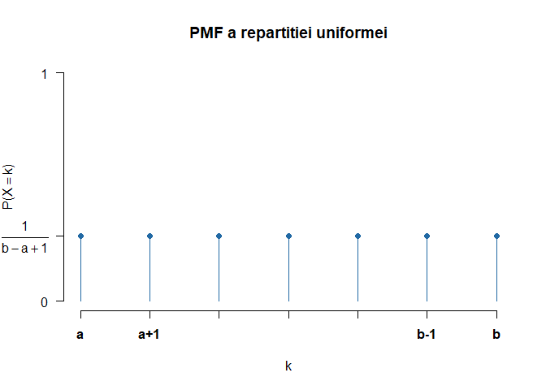

Funcția de repartiție a repartiției uniforme $\mathcal{U}(\{a, a+1, \ldots, b\})$ este dată de 

$$
  F_{X}(x) = \mathbb{P}(X \leq x) = \frac{\lfloor x\rfloor - a + 1}{b - a + 1}, \quad x\in[a,b]. 
$$


## Repartiția binomială $\mathcal{B}(n, p)$

Spunem că variabila aleatoare $X$ este repartizată binomial de parametrii $n\geq 1$ și $p\in[0,1]$, și se notează cu $X\sim\mathcal{B}(n,p)$, dacă funcția de masă este 

$$
  \mathbb{P}(X = k) = \binom{n}{k}p^k (1-p)^{n-k}, \quad k\in\{0,1,\ldots,n\}
$$

Pentru a ilustra funcția de masă vom considera repartițiile $\mathcal{B}(20, 0.5)$ și $\mathcal{B}(40, 0.3)$:

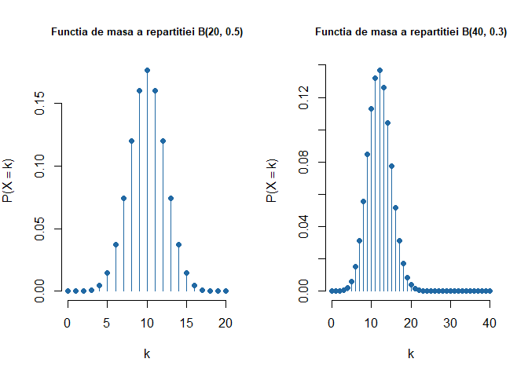

Funcția de repartiție a repartiției binomiale $\mathcal{B}(n,p)$ este dată de 

$$
  F_{X}(x) = \mathbb{P}(X \leq x) = \sum_{k = 0}^{\lfloor x\rfloor} \binom{n}{k}p^k (1-p)^{n-k}
$$

care în cazul celor două exemple date devine 

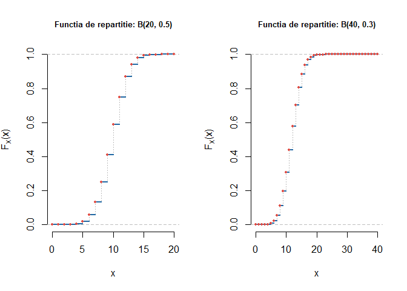


## Repartiția geometrică $Geom(p)$

Variabila aleatoare $X$ repartizată geometric de parametru $p\in(0,1)$, $X\sim Geom(p)$, are funcția de masă 


$$
  \mathbb{P}(X = k) = (1-p)^{k-1}p, \quad k\in\{1,2,\ldots\}
$$
Pentru $p = 0.2$ și respectiv $p = 0.7$ avem

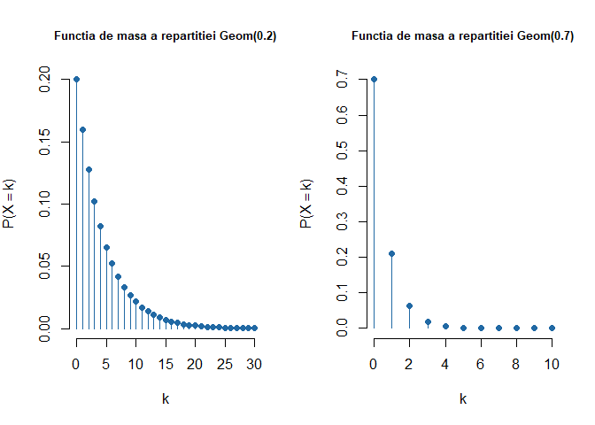

Funcția de repartiție a variabilei $X\sim Geom(p)$ este egală cu 

$$
  F_{X}(k) = \mathbb{P}(X \leq k) = 1 - (1-p)^k
$$

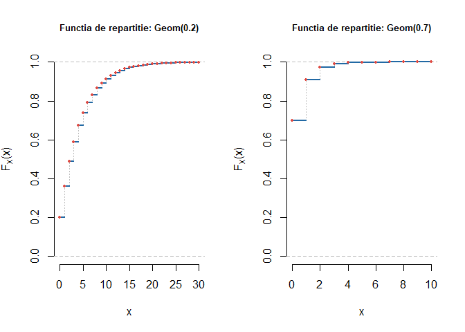


## Repartiția Poisson $Pois(p)$

O variabilă aleatoare $X$ repartizată Poisson de parametru $\lambda>0$, $X\sim Pois(\lambda)$, are funcția de masă dată de

$$
  \mathbb{P}(X = k) = e^{-\lambda}\frac{\lambda^k}{k!}, \quad k\geq 0.
$$

Pentru $\lambda = 4$ și $\lambda = 10$ avem 

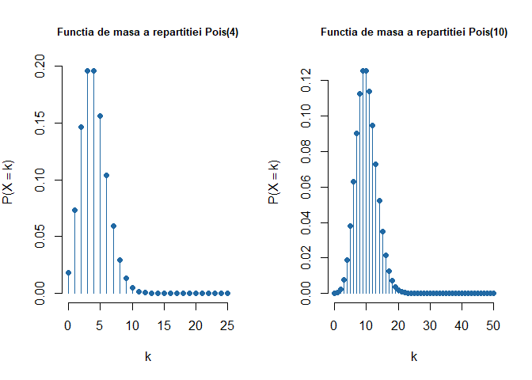

Funcția de repartiție a lui $X\sim Pois(\lambda)$ este 

$$
  F_{X}(x) = \mathbb{P}(X \leq x) = e^{-\lambda}\sum_{k = 0}^{\lfloor x\rfloor} \frac{\lambda^k}{k!}
$$

care în cazul exemplelor considerate mai sus devine

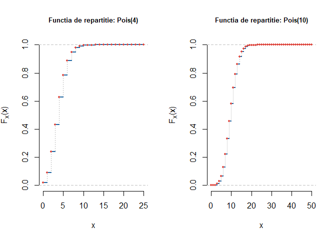

# Generarea unei variabile aleatoare discrete

\BeginKnitrBlock{rmdexercise}<div class="rmdexercise">Definiți o funcție care să genereze un eșantion de talie $n$ dintr-o distribuție discretă definită pe mulțimea $\{x_1,\dots,x_N\}$ cu probabilitățile $\{p_1,\dots,p_N\}$. Pentru început încercați cu v.a. de tip Bernoulli.

</div>\EndKnitrBlock{rmdexercise}


Avem următoarea funcție:


```r
GenerateDiscrete = function(n = 1, x, p, err = 1e-15){
  # talia esantionului
  # x alfabetul 
  # p probabilitatile
  lp = length(p)
  lx = length(x)
  
  # verify if x and p have the same size 
  if(abs(sum(p)-1)>err | sum(p>=0)!=lp){
    
    stop("suma probabilitatilor nu este 1 sau probabilitatile sunt mai mici decat 0")
    
  }else if(lx!=lp){
    
    stop("x si p ar trebui sa aiba aceeasi marime")
    
  }else{
    out = rep(0, n)
    
    indOrderProb = order(p, decreasing = TRUE) # index
    pOrdered = p[indOrderProb] # rearrange the values of the probabilities 
    xOrdered = x[indOrderProb] # rearramnge the values of x
    
    # u = runif(n) # generate n uniforms
    pOrderedCS = cumsum(pOrdered)
    
    for (i in 1:n){
      u = runif(1)
      
      k = min(which(u<=pOrderedCS))
      out[i] = xOrdered[k]
    }
  }
  
  return(out)
}
```

Pentru a testa această funcție să considerăm următoarele două exemple: 

  1. Ne propunem să generăm observații din $X\sim\begin{pmatrix}1 & 2 & 3\\ 0.2 & 0.3 & 0.5\end{pmatrix}$, în acest caz: $x=[1,2,3]$ și $p=[0.2,0.3,0.5]$. Începem prin generarea a $n = 10$ observații din repartiția lui $X$
  

```r
GenerateDiscrete(10, c(1,2,3), c(0.2,0.3,0.5))
 [1] 3 3 3 1 1 3 3 3 2 3
```

Plecând de la un eșantion de $n = 10000$  de observații vrem să comparăm, cu ajutorul *diagramei cu bare verticale* (`barplot`), repartiția eșantionului cu cea teoretică :


```r
n = 10000
x = GenerateDiscrete(n, c(1,2,3), c(0.2,0.3,0.5))

# cate observatii din fiecare valoare unica a lui x
pX = table(x)/n

pT = c(0.2,0.3,0.5)
indX = c(1,2,3)

barplot(rbind(pX, pT), 
        beside = T,
        space = c(0.1, 1),
        col = c(myblue, myred),
        names.arg = indX, 
        cex.axis = 0.7, 
        legend.text = c("Repartitia Esantionului", "Repartitia teoretica"), 
        args.legend =  list(x = "topleft", bty = "n"))
```

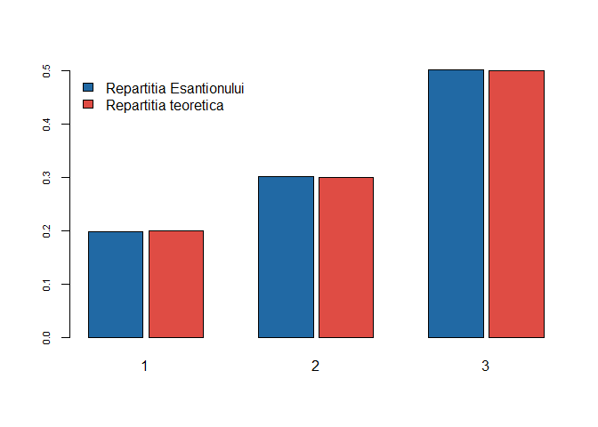


  2. În acest caz considerăm variabila aleatoare $X\sim\begin{pmatrix}a & b & c & d\\ 0.15 & 0.25 & 0.15 & 0.45\end{pmatrix}$, deci $x=[a,b,c,d]$ și $p=[0.15,0.25,0.15,0.45]$. Mai jos generăm $n = 15$ observații din repartiția variabilei aleatoare $X$:
  

```r
GenerateDiscrete(15, c('a','b','c','d'), c(0.15,0.25,0.15,0.45))
 [1] "b" "d" "d" "d" "d" "d" "d" "d" "a" "d" "d" "a" "d" "d" "b"
```

Ca și în cazul primului exemplu, vom compara repartiția teoretică cu cea a unui eșantion de $n = 10000$ de observații:


```r
n = 10000
x = GenerateDiscrete(n, c('a','b','c','d'), c(0.15,0.25,0.15,0.45))

# cate observatii din fiecare valoare unica a lui x
pX = table(x)/n

pT = c(0.15,0.25,0.15,0.45)
indX = c('a','b','c','d')

barplot(rbind(pX, pT), 
        beside = T,
        space = c(0.1, 1),
        col = c(myblue, myred),
        names.arg = indX, 
        cex.axis = 0.7, 
        legend.text = c("Repartitia Esantionului", "Repartitia teoretica"), 
        args.legend =  list(x = "topleft", bty = "n"))
```

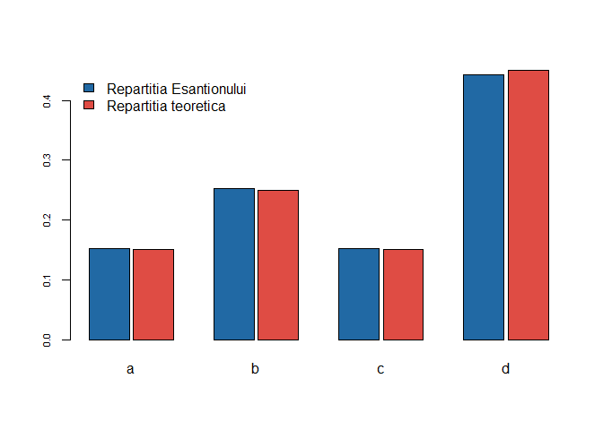

Vom testa funcția și pentru repartițiile discrete de bază:

  a) Uniformă 
  

```r
# Uniforma
n = 10000

pX = table(GenerateDiscrete(n, x = 1:7, 
                      p = rep(1/7, 7)))/n
pT = rep(1/7, 7)
indX = names(pX)

par(mar=c(5.15, 4.15, 4.15, 8.15), xpd=TRUE)

barplot(rbind(pX, pT), 
        beside = T,
        # space = c(0.1, 1),
        col = c(myblue, myred),
        names.arg = indX, 
        cex.axis = 0.7, 
        main = "Repartitia Uniforma",
        xlab = "k",
        ylab = "PMF",
        legend.text = c("Repartitia Esantionului", "Repartitia teoretica"), 
        args.legend =  list(x = "topright", bty = "n", 
                            inset=c(-0.35,0), cex = 0.9))
```

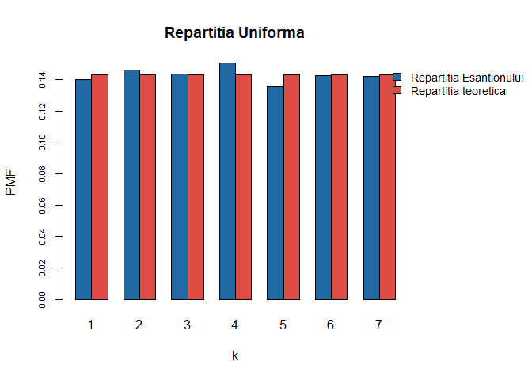

  b) Binomiala
  

```r
# Binomiala
n = 10000

pX = table(GenerateDiscrete(n, x = 0:10, 
                      p = dbinom(0:10, 10, 0.3)))/n
pT = dbinom(as.numeric(names(pX)), 10, 0.3)
indX = names(pX)


barplot(rbind(pX, pT), 
        beside = T,
        # space = c(0.1, 1),
        col = c(myblue, myred),
        names.arg = indX, 
        cex.axis = 0.7, 
        main = "Repartitia Binomiala: B(10, 0.3)",
        xlab = "k",
        ylab = "PMF",
        legend.text = c("Repartitia Esantionului", "Repartitia teoretica"), 
        args.legend =  list(x = "topright", bty = "n"))
```

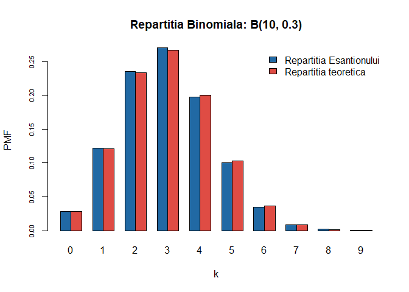
  
  c) Geometrică
  

```r
# Geometrica
n = 10000

pX = table(GenerateDiscrete(n, x = 0:100, 
                      p = dgeom(0:100, 0.3)))/n
pT = dgeom(as.numeric(names(pX)), 0.3)
indX = names(pX)


barplot(rbind(pX, pT), 
        beside = T,
        # space = c(0.1, 1),
        col = c(myblue, myred),
        names.arg = indX, 
        cex.axis = 0.7, 
        main = "Repartitia Geometrica: Geom(0.3)",
        xlab = "k",
        ylab = "PMF",
        legend.text = c("Repartitia Esantionului", "Repartitia teoretica"), 
        args.legend =  list(x = "topright", bty = "n"))
```

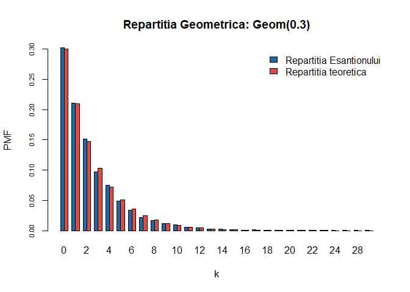

  d) Hipergeometrică
  

```r
# Hipergeometrica
n = 10000

M = 20  # nr de bile albe
N = 30  # nr de bile negre
K = 15  # nr de bile extrase

pX = table(GenerateDiscrete(n, x = 0:15, 
                      p = dhyper(0:15, M, N, K)))/n
pT = dhyper(as.numeric(names(pX)), M, N, K)
indX = names(pX)


barplot(rbind(pX, pT), 
        beside = T,
        # space = c(0.1, 1),
        col = c(myblue, myred),
        names.arg = indX, 
        cex.axis = 0.7, 
        main = "Repartitia Hipergeometrica: HG(20, 30, 15)",
        xlab = "k",
        ylab = "PMF",
        legend.text = c("Repartitia Esantionului", "Repartitia teoretica"), 
        args.legend =  list(x = "topright", bty = "n"))
```


  e) Poisson  
  

```r
# Poisson
n = 10000

pX = table(GenerateDiscrete(n, x = 0:50, 
                      p = dpois(0:50, 5)))/n

pT = dpois(as.numeric(names(pX)), 5)
indX = names(pX)

barplot(rbind(pX, pT), 
        beside = T,
        # space = c(0.1, 1),
        col = c(myblue, myred),
        names.arg = indX, 
        cex.axis = 0.7, 
        main = "Repartitia Poisson: Pois(5)",
        xlab = "k",
        ylab = "PMF",
        legend.text = c("Repartitia Esantionului", "Repartitia teoretica"), 
        args.legend =  list(x = "topright", bty = "n"))
```

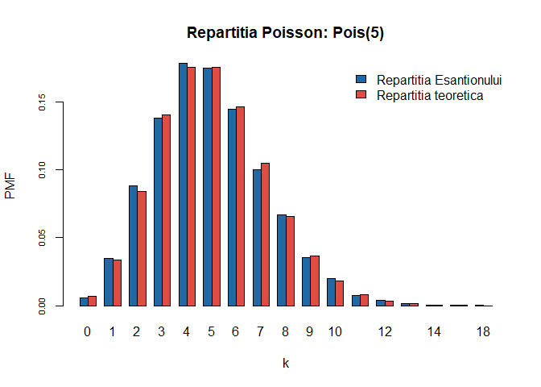

# Funcția de repartiție pentru variabile aleatoare

\BeginKnitrBlock{rmdexercise}<div class="rmdexercise">Scrieți o funcție în `R` care să traseze graficul funcției de repartitie a unei distribuții date. Verificați și documentația funcției `ecdf`. 

</div>\EndKnitrBlock{rmdexercise}

Definim următoarea funcție:


```r
cdfPlot = function(dist, title, err = 1e-10){
  # dist - repartitia discreta (sau discretizata)
  lp = length(dist)
  
  if (abs(sum(dist)-1)>err | sum(dist>=0)!=lp){
    stop("Eroare: vectorul de probabilitati nu formeaza o repartitie")
  }else{
    x = 0:(lp-1) # ia valori in 1:lp
    cp = cumsum(dist)
    
    plot(x, cp, type = "s", lty = 3, 
         xlab = "x", 
         ylab = "F", 
         main = paste("Functia de repartitie:", title), 
         ylim = c(0,1), 
         col = "grey",
         bty = "n")
    abline(h = 0, lty = 2, col = "grey")
    abline(h = 1, lty = 2, col = "grey")
    for(i in 1:(lp-1)){
      lines(c(x[i], x[i+1]), c(cp[i], cp[i]), 
            col = myblue,
            lwd = 2)
    }
    points(x,cp, col = myred, pch = 20, cex = 0.85)
  }
}
```

Pentru a testa această funcție să considerăm repartițiile discrete: 

  a) Binomiala: $\mathcal{B}(100, 0.3)$


```r
cdfPlot(dist = dbinom(0:100, 100, 0.3), title = "B(100,0.3)")
```

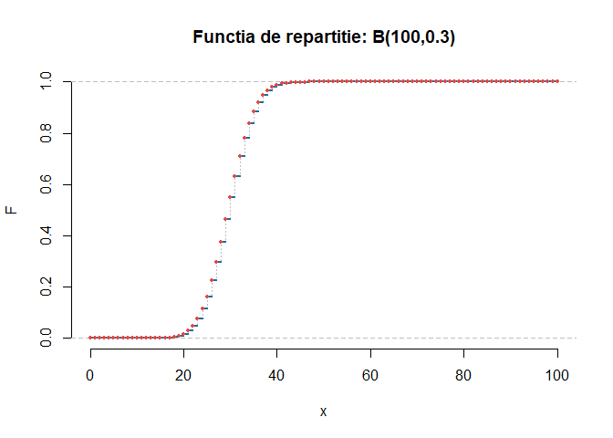

  b) Geometrică: $Geom(0.3)$


```r
cdfPlot(dist = dgeom(0:100, 0.3), title = "Geom(0.3)")
```

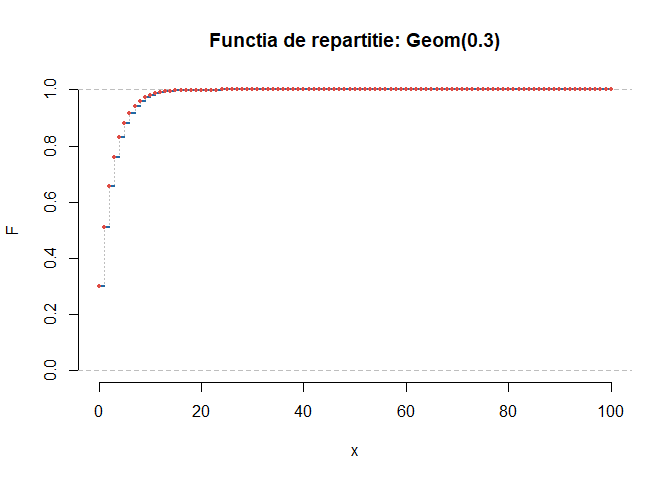

  c) Hipergeometrică: $HG(20, 30, 15)$
  

```r
cdfPlot(dist = dhyper(0:15, 20, 30, 15), title = "HG(20, 30, 15)")
```

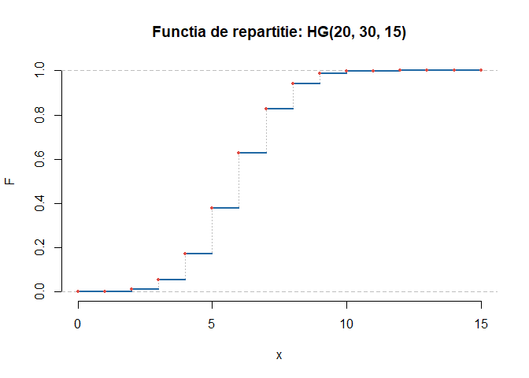
  
  d) Poisson: $Pois(0.3)$ și $Pois(5)$


```r
par(mfrow = c(1, 2))

cdfPlot(dist = dpois(0:20, 0.3), title = "Pois(0.3)")
cdfPlot(dist = dpois(0:50, 5), title = "Pois(5)")
```

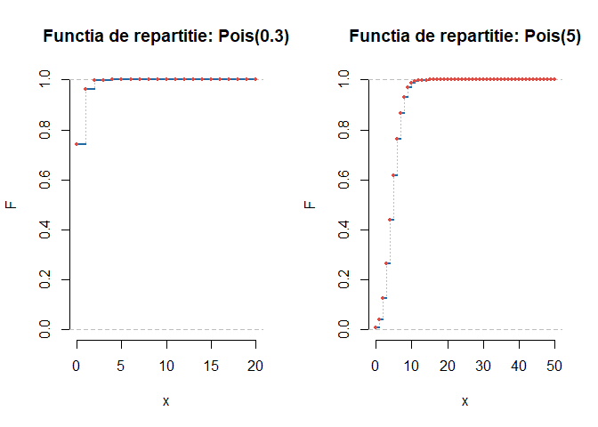


# Aproximarea Poisson și Normală a Binomialei

\BeginKnitrBlock{rmdexercise}<div class="rmdexercise">Ilustrați grafic aproximarea Poisson și normală a repartiției binomiale. 

</div>\EndKnitrBlock{rmdexercise}

Scopul acestei probleme este de a ilustra grafic aproximarea legii binomile cu ajutorul repartiției Poisson și a a normalei. 

Pentru o v.a. $X$ repartizată binomial de parametrii $n$ și $p$ ($q = 1-p$) funcția de masă este 

$$
f_{n,p}(k)=\mathbb{P}(X=k)=\binom{n}{k}p^k(1-p)^{n-k}
$$ 

iar funcția de repartiție este 

$$
F_{n,p}(k) = \mathbb{P}(X\leq k) = \sum_{x=0}^{k}\binom{n}{x}p^x(1-p)^{n-x}.
$$ 

## Aproximarea Poisson

Dacă $n\to\infty$ ($n$ este mare) și $p\to 0$ ($p$ este mic, evenimentele sunt rare) așa încât $np\to\lambda$ atunci se poate verifica cu ușurință că 

$$
f_{n,p}(k)\approx f_{\lambda}(k)=e^{-\lambda}\frac{\lambda^k}{k!}.
$$

Mai exact, avem că dacă $k$ este mic în comparație cu $n$ atunci

\begin{align*}
  \binom{n}{k}p^k &= \frac{n(n-1)\cdots(n-k+1)}{k!}\left(\frac{\lambda}{n}\right)^k \\
                  &= 1\times\left(1-\frac{1}{n}\right)\times\cdots\times\left(1-\frac{k-1}{n}\right)\frac{\lambda^k}{k!}\\
                  &\approx \frac{\lambda^k}{k!}
\end{align*}

și 

$$
  \log(1-p)^{n-k} = (n-k)\log\left(1-\frac{\lambda}{n}\right)\approx n\left(-\frac{\lambda}{n}\right)
$$

ceea ce conduce la $(1-p)^{n-k}\approx e^{-\lambda}$. Combinând cele două aproximări obținem 

$$
  \binom{n}{k}p^k(1-p)^{n-k} \approx \frac{\lambda^k}{k!}e^{-\lambda}.
$$

Pentru a ilustra acuratețea acestei aproximări vom folosi instrucțiunile `R` `dbinom` și `dpois` care permit calcularea funcțiilor de masă $f_{n,p}(k)$ și $f_{\lambda}(k)$.  


```r
AppBP = function(n,p,a,b){
    lambda = n*p
    x = matrix(numeric((b-a+1)*3),ncol=3,
               dimnames = list(a:b,c("Binomiala","Poisson","Eroarea Absoluta")))
    x[,1] = dbinom(a:b,n,p)
    x[,2] = dpois(a:b,lambda)
    x[,3] = abs(x[,1]-x[,2])
    error = max(abs(x[,3]))
    
    return(list(x = as.data.frame(x), error = error, param = c(n, p, lambda)))
}

# Functie care ilustreaza aproximarea Binomial vs. Poisson

pl = function(n,p,a,b){
    clr = c(myblue, myred)# culori
    lambda = n*p
    mx = max(dbinom(a:b,n,p))
    
    plot(c(a:b,a:b), c(dbinom(a:b,n,p), dpois(a:b,lambda)), type="n", 
         main = paste("Approx. Poisson pentru binomiala\n n=", 
                      n, ", p = ", p, ", lambda = ",lambda), 
         ylab = "Probabilitatea", xlab="x",
         bty = "n")
    
    points((a:b)-.15, dbinom(a:b,n,p), type = "h",
           col = clr[1], lwd = 8)
    points((a:b)+.15, dpois(a:b,lambda), type = "h",
           col = clr[2], lwd = 8)
    
    legend(b-b/2, mx, legend = c(paste0("Binomiala(",n,",",p,")"),
                               paste0("Poisson(",lambda,")")), 
           fill = clr, bg="white",
           bty = "n")
}
```

Pentru setul de parametrii $n=10$ și $p=0.1$ avem următorul tabel și următoarea figură

<table class="table table-striped table-hover" style="margin-left: auto; margin-right: auto;">
<caption>Aproximarea Poisson la binomiala n = 10 p = 0.1 lambda = 1 . Eroarea (Diferenta in valoare absoluta maxima) =  0.01954 .</caption>
 <thead>
  <tr>
   <th style="text-align:center;"> k </th>
   <th style="text-align:center;"> Binomiala </th>
   <th style="text-align:center;"> Poisson </th>
   <th style="text-align:center;"> Eroarea Absoluta </th>
  </tr>
 </thead>
<tbody>
  <tr>
   <td style="text-align:center;"> 1 </td>
   <td style="text-align:center;"> 0.3874205 </td>
   <td style="text-align:center;"> 0.3678794 </td>
   <td style="text-align:center;"> 0.0195410 </td>
  </tr>
  <tr>
   <td style="text-align:center;"> 2 </td>
   <td style="text-align:center;"> 0.1937102 </td>
   <td style="text-align:center;"> 0.1839397 </td>
   <td style="text-align:center;"> 0.0097705 </td>
  </tr>
  <tr>
   <td style="text-align:center;"> 3 </td>
   <td style="text-align:center;"> 0.0573956 </td>
   <td style="text-align:center;"> 0.0613132 </td>
   <td style="text-align:center;"> 0.0039176 </td>
  </tr>
  <tr>
   <td style="text-align:center;"> 4 </td>
   <td style="text-align:center;"> 0.0111603 </td>
   <td style="text-align:center;"> 0.0153283 </td>
   <td style="text-align:center;"> 0.0041680 </td>
  </tr>
  <tr>
   <td style="text-align:center;"> 5 </td>
   <td style="text-align:center;"> 0.0014880 </td>
   <td style="text-align:center;"> 0.0030657 </td>
   <td style="text-align:center;"> 0.0015776 </td>
  </tr>
  <tr>
   <td style="text-align:center;"> 6 </td>
   <td style="text-align:center;"> 0.0001378 </td>
   <td style="text-align:center;"> 0.0005109 </td>
   <td style="text-align:center;"> 0.0003732 </td>
  </tr>
  <tr>
   <td style="text-align:center;"> 7 </td>
   <td style="text-align:center;"> 0.0000087 </td>
   <td style="text-align:center;"> 0.0000730 </td>
   <td style="text-align:center;"> 0.0000642 </td>
  </tr>
  <tr>
   <td style="text-align:center;"> 8 </td>
   <td style="text-align:center;"> 0.0000004 </td>
   <td style="text-align:center;"> 0.0000091 </td>
   <td style="text-align:center;"> 0.0000088 </td>
  </tr>
  <tr>
   <td style="text-align:center;"> 9 </td>
   <td style="text-align:center;"> 0.0000000 </td>
   <td style="text-align:center;"> 0.0000010 </td>
   <td style="text-align:center;"> 0.0000010 </td>
  </tr>
  <tr>
   <td style="text-align:center;"> 10 </td>
   <td style="text-align:center;"> 0.0000000 </td>
   <td style="text-align:center;"> 0.0000001 </td>
   <td style="text-align:center;"> 0.0000001 </td>
  </tr>
</tbody>
</table>


```r
# pentru n = 10, p = 0.1
pl(10,.1,1,10)
```

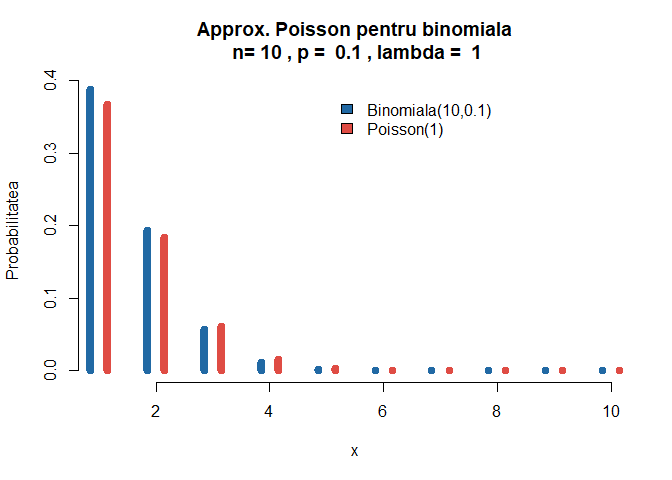

iar pentru parametrii $n=100$ și $p=0.01$ obținem

<table class="table table-striped table-hover" style="margin-left: auto; margin-right: auto;">
<caption>Aproximarea Poisson la binomiala n = 100 p = 0.01 lambda = 1 . Eroarea (Diferenta in valoare absoluta maxima) =  0.00185 .</caption>
 <thead>
  <tr>
   <th style="text-align:center;"> k </th>
   <th style="text-align:center;"> Binomiala </th>
   <th style="text-align:center;"> Poisson </th>
   <th style="text-align:center;"> Eroarea Absoluta </th>
  </tr>
 </thead>
<tbody>
  <tr>
   <td style="text-align:center;"> 1 </td>
   <td style="text-align:center;"> 0.3697296 </td>
   <td style="text-align:center;"> 0.3678794 </td>
   <td style="text-align:center;"> 0.0018502 </td>
  </tr>
  <tr>
   <td style="text-align:center;"> 2 </td>
   <td style="text-align:center;"> 0.1848648 </td>
   <td style="text-align:center;"> 0.1839397 </td>
   <td style="text-align:center;"> 0.0009251 </td>
  </tr>
  <tr>
   <td style="text-align:center;"> 3 </td>
   <td style="text-align:center;"> 0.0609992 </td>
   <td style="text-align:center;"> 0.0613132 </td>
   <td style="text-align:center;"> 0.0003141 </td>
  </tr>
  <tr>
   <td style="text-align:center;"> 4 </td>
   <td style="text-align:center;"> 0.0149417 </td>
   <td style="text-align:center;"> 0.0153283 </td>
   <td style="text-align:center;"> 0.0003866 </td>
  </tr>
  <tr>
   <td style="text-align:center;"> 5 </td>
   <td style="text-align:center;"> 0.0028978 </td>
   <td style="text-align:center;"> 0.0030657 </td>
   <td style="text-align:center;"> 0.0001679 </td>
  </tr>
  <tr>
   <td style="text-align:center;"> 6 </td>
   <td style="text-align:center;"> 0.0004635 </td>
   <td style="text-align:center;"> 0.0005109 </td>
   <td style="text-align:center;"> 0.0000475 </td>
  </tr>
  <tr>
   <td style="text-align:center;"> 7 </td>
   <td style="text-align:center;"> 0.0000629 </td>
   <td style="text-align:center;"> 0.0000730 </td>
   <td style="text-align:center;"> 0.0000101 </td>
  </tr>
  <tr>
   <td style="text-align:center;"> 8 </td>
   <td style="text-align:center;"> 0.0000074 </td>
   <td style="text-align:center;"> 0.0000091 </td>
   <td style="text-align:center;"> 0.0000017 </td>
  </tr>
  <tr>
   <td style="text-align:center;"> 9 </td>
   <td style="text-align:center;"> 0.0000008 </td>
   <td style="text-align:center;"> 0.0000010 </td>
   <td style="text-align:center;"> 0.0000003 </td>
  </tr>
  <tr>
   <td style="text-align:center;"> 10 </td>
   <td style="text-align:center;"> 0.0000001 </td>
   <td style="text-align:center;"> 0.0000001 </td>
   <td style="text-align:center;"> 0.0000000 </td>
  </tr>
</tbody>
</table>


```r
# pentru n = 100, p = 0.01
pl(100,.01,1,10)
```

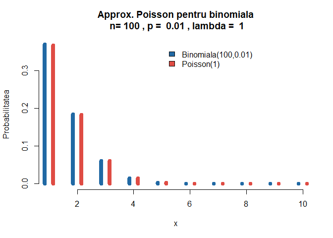

Pentru funcția de repartiție $F_{n,p}(k)$, folosidn aproximarea Poisson avem că

$$
F_{n,p}(k) \approx F_{\lambda}(k)=\sum_{x=0}^{k}e^{-\lambda}\frac{\lambda^x}{x!}.
$$

## Aproximarea Normală

Să considerăm repartiția binomială $\mathcal{B}(n, p)$ pentru $p = 0.3$ și $n\in\{20, 50, 100, 150, 200\}$ și să trasăm histogramele variabilelor aleatoare care au aceste repartiții ($X_n$) precum și a variabilelor standardizate $Z_n = \frac{X_n-np}{\sqrt{npq}}$.

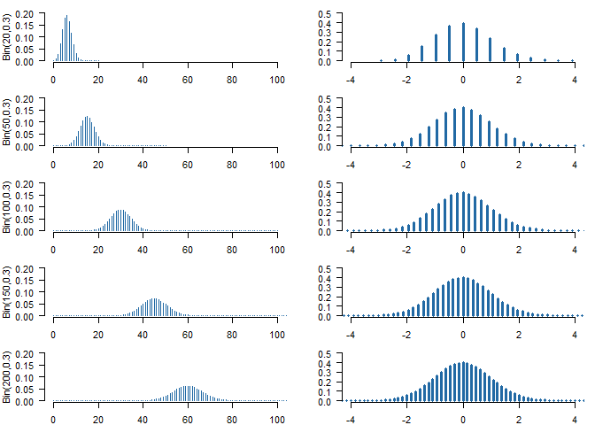

Observăm, pentru graficele din partea stângă, că valoarea maximă se atinge în jurul punctului $n\times 0.3$ pentru fiecare grafic în parte. De asemenea se observă că odată cu creșterea lui $n$ crește și gradul de împrăștiere, cu alte cuvinte crește și abaterea standard ($\sigma_n = \sqrt{npq}$).

Pe de altă parte putem remarca că figurile din partea dreaptă au o formă simetrică, de tip *clopot*, concentrate în jurul lui $0$, fiind translatate în origine și scalate pentru a avea o varianță egală cu $1$. [Abraham de Moivre](https://en.wikipedia.org/wiki/Abraham_de_Moivre)^[de Moivre, A. (1756). *The Doctrine of Chances: or, A Method of Calculating the Probabilities of Events in Play* (Third ed.). New York: Chelsea.] a justificat acest efect (pentru $p=0.5$) încă din 1756 observând că raportul 

$$
  \frac{f_{n,p}(k)}{f_{n,p}(k-1)} = \frac{\frac{n!}{k!(n-k)!}p^kq^{n-k}}{\frac{n!}{(k-1)!(n-k+1)!}p^{k+1}q^{n-k+1}} = \frac{(n-k+1)p}{kq}
$$

pentru $k = 1,2,\ldots,n$. Astfel $f_{n,p}(k)\geq f_{n,p}(k-1)$ dacă și numai dacă $(n+1)p\geq k$ de unde, pentru $n$ fixat, deducem că $f_{n,p}(k)$ atinge valoarea maximă pentru $k_{\max} = \lfloor{(n+1)p\rfloor}\approx np$ (acesta este motivul pentru care fiecare grafic din partea stângă are vârful în jurul punctului $np$). 

Să observăm ce se întâmplă în jurul lui $k_{\max}$. Avem 

$$
\frac{f_{n,p}(k_{\max}+i)}{f_{n,p}(k_{\max}+i-1)} = \frac{(n-k_{\max}-i+1)p}{(k_{\max}+i)q}\approx \frac{(nq-i)p}{(np+i)q} = \frac{1-\frac{i}{nq}}{1+\frac{i}{np}}
$$

și cum (folosind relația $\log(1+x)\approx x$, pentru $x$ în jurul lui $0$)

$$
\log\left(1-\frac{i}{nq}\right) - \log\left(1+\frac{i}{np}\right) \approx -\frac{i}{nq}-\frac{i}{np} = -\frac{i}{npq}
$$ 

deducem, pentru $m\geq 1$ și $k_{\max}+m\leq n$, că

\begin{align*}
  \log\frac{f_{n,p}(k_{\max}+m)}{f_{n,p}(k_{\max})} &= \log\left(\frac{f_{n,p}(k_{\max}+1)}{f_{n,p}(k_{\max})}\times \frac{f_{n,p}(k_{\max}+2)}{f_{n,p}(k_{\max}+1)}\times\cdots\times\frac{f_{n,p}(k_{\max}+m)}{f_{n,p}(k_{\max}+m-1)}\right)\\
  &= \log\frac{f_{n,p}(k_{\max}+1)}{f_{n,p}(k_{\max})}+ \log\frac{f_{n,p}(k_{\max}+2)}{f_{n,p}(k_{\max}+1)}+\cdots+\log\frac{f_{n,p}(k_{\max}+m)}{f_{n,p}(k_{\max}+m-1)}\\
  &\approx \frac{-1-2-\cdots-m}{npq} = -\frac{1}{2}\frac{m^2}{npq}.
\end{align*}

Sumarizând avem, pentru $m$ nu foarte mare, 

$$
  \mathbb{P}(X=k_{\max}+m)\approx f_{n,p}(k_{\max})e^{-\frac{1}{2}\frac{m^2}{npq}}.
$$

Folosind formula lui [Stirling](https://en.wikipedia.org/wiki/Stirling%27s_approximation)^[A se vedea cartea lui Feller, W. (1968). *An Introduction to Probability Theory and Its Applications* (third ed.), Volume 1. New York: Wiley. pag. 52-53 pentru o derivare a formulei lui Stirling.] 

$$
  n!\approx \sqrt{2\pi}n^{n+\frac{1}{2}}e^{-n}
$$

pentru $k = k_{\max}\approx np$, avem

$$
f_{n,p}(k)\approx \frac{1}{\sqrt{2\pi}}\frac{n^{n+\frac{1}{2}}}{(np)^{np+\frac{1}{2}}(nq)^{nq+\frac{1}{2}}}p^{np}q^{nq}= \frac{1}{\sqrt{2\pi npq}}.
$$

Astfel aproximarea de Moivre devine 

$$
  \mathbb{P}(X=k_{\max}+m)\approx \frac{1}{\sqrt{2\pi npq}}e^{-\frac{1}{2}\frac{m^2}{npq}}
$$

și scriind $k$ pentru $k_{\max}+m$ și înlocuind $k_{\max}$ cu $np$ obținem

$$
  \mathbb{P}(X=k)\approx \frac{1}{\sqrt{2\pi npq}}e^{-\frac{1}{2}\frac{(k-np)^2}{npq}} = \frac{1}{\sigma_n\sqrt{2\pi}}e^{-\frac{1}{2}\left(\frac{k-np}{\sigma_n}\right)^2}.
$$

Astfel $mathbb{P}(X=k)$ este aproximativ egală cu aria de sub curba 

$$
  f(x) = \frac{1}{\sigma_n\sqrt{2\pi}}e^{-\frac{1}{2}\left(\frac{x-np}{\sigma_n}\right)^2}
$$
pe intervalul $k-\frac{1}{2}\leq x\leq k+\frac{1}{2}$. 

În mod similar, pentru $0\leq a< b\leq n$, avem 

$$
  \mathbb{P}(a\leq X\leq b) = \sum_{k=a}^{b}f_{n,p}(k) \approx \sum_{k=a}^{k=b}\int_{k+\frac{1}{2}}^{k-\frac{1}{2}}f(x)\,dx = \int_{a}^{b}f(x)\,dx
$$

de unde prin schimbarea de variabilă $y = \frac{x-np}{\sigma_n}$ obținem

$$
  \mathbb{P}(a\leq X\leq b)\approx \frac{1}{\sqrt{2\pi}}\int_{\alpha}^{\beta}e^{-\frac{y^2}{2}}\,dy = \Phi(\beta) - \Phi(\alpha)
$$

unde $\alpha = \frac{a-np-\frac{1}{2}}{\sigma_n}$, $\beta =  = \frac{b-np+\frac{1}{2}}{\sigma_n}$ și $\Phi(x)=\frac{1}{\sqrt{2\pi}}\int_{-\infty}^{x}e^{-\frac{y^2}{2}}\,dy$.

Aplicând rezultatele de mai sus, în cele ce urmează vom considera două aproximări pentru funcția de repartiție $F_{n,p}(k)$: 

  a) aproximarea normală

$$
F_{n,p}(k) \approx \Phi\left(\frac{k-np}{\sqrt{np(1-p)}}\right).
$$

  b) aproximarea normală cu coeficient de corecție de continuitate 

$$
F_{n,p}(k) \approx \Phi\left(\frac{k+0.5-np}{\sqrt{np(1-p)}}\right).
$$

În practică această ultimă aproximare se aplică atunci când atât $np\geq 5$ cât și $n(1-p)\geq 5$.

Următorul cod crează o funcție care calculează cele trei aproximări pentru funcția de repartiție binomială


```r
appBNP = function(n, p, R = 1000, k = 6) {
  trueval = pbinom(k, n, p) # adevarata valoare a functiei de repartitie in k
  prob.zcc <- prob.zncc <- prob.pois <- NULL  # initializare
  q = 1-p
  for (i in 1:R) {# repetam procesul de R ori 
    x = rnorm(n, n * p, sqrt(n * p * q)) # generare n v.a. normale de medie np 
    z.cc = ((k + .5) - mean(x))/sd(x) # cu coeficient de corectie
    prob.zcc[i] = pnorm(z.cc)
    z.ncc = (k - mean(x))/sd(x) # fara coeficient de corectie
    prob.zncc[i] = pnorm(z.ncc)    
    y = rpois(n, n * p)
    prob.pois[i] = length(y[y <= k])/n # aproximate Poisson
  }
  list(prob.zcc = prob.zcc, prob.zncc = prob.zncc, 
       prob.pois = prob.pois, trueval = trueval)
}
```

Avem următoarea ilustrație grafică a diferitelor metode de aproximare


```r
# Plot
R = 1000
set.seed(10)
out = appBNP(n = 100, p = .01, k = 2, R = 1000)

plot(1:R, out$prob.pois, type = "l", col = myblue, xlab = "Numar repetari", 
     main = expression(paste("Probabilitatile simulate: ", 
                             n==100, ", ", p==0.01, sep="")),
     ylab = "Probabilitatea", ylim = c(.7, .97),
     bty = "n")
abline(h = out$trueval, col="black", lty=2, lwd=2)
lines(1:R, out$prob.zcc, lty = 1, col = myred)
lines(1:R, out$prob.zncc, lty = 1, col = mybrown)
legend("bottomleft", c("Poisson", "Normala (cu factor corectie)", 
                       "Normala (fara factor corectie)"),
       lty = c(1), col = c(myblue, myred, mybrown),
       bty = "n")
```

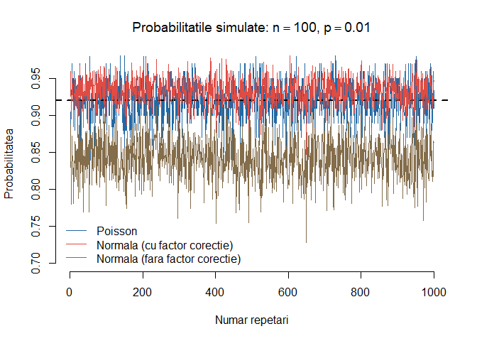

Avem și următorul `boxplot` (discuție ce reprezintă un boxplot) care ne permite să evidențiem care dintre aproximări este mai bună pentru valorile selectate


```r
# n = 200
set.seed(10)
out = appBNP(n = 100, p = .01, k = 2, R = 1000)

par(bty = "n")
boxplot(out$prob.pois, boxwex = 0.25, xlim = c(0.5, 1.5),
        ylim = c(0.7, 1.15),
        col = myblue,
        main = expression(paste("Aproximarea Binomialei: ", 
                                n==100, ", ", p==0.01, sep="")),
        ylab = "Probablitatea", 
        ylim = c(out$trueval - 0.1, out$trueval + 0.15), 
        bty = "n")
boxplot(out$prob.zcc, boxwex = 0.25, at = 1:1 - 0.2, add = T,
        col = myred)
boxplot(out$prob.zncc, boxwex = 0.25, at = 1:1 + 0.2, add = T,
        col = mybrown)
abline(h = out$trueval, col = "red", lty=2)
legend("topleft", c("Poisson", "Normala (cu factor corectie)", 
                    "Normala (fara factor corectie)"), 
       fill = c(myblue, myred, mybrown),
       bty = "n")
```

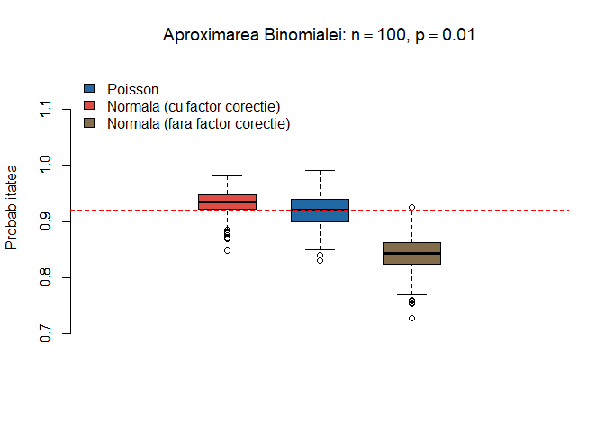


