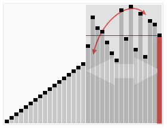

<script>
$(document).ready(function ()  {

    // move toc-ignore selectors from section div to header
    $('div.section.toc-ignore')
        .removeClass('toc-ignore')
        .children('h1,h2,h3,h4,h5').addClass('toc-ignore');

    // establish options
    var options = {
      selectors: "h1,h2,h3",
      theme: "bootstrap3",
      context: '.toc-content',
      hashGenerator: function (text) {
        return text.replace(/[.\\/?&!#<>]/g, '').replace(/\s/g, '_').toLowerCase();
      },
      ignoreSelector: ".toc-ignore",
      scrollTo: 60
    };
    options.showAndHide = false;
    options.smoothScroll = true;

    // tocify
    var toc = $("#TOC").tocify(options).data("toc-tocify");
});
</script>

Obiectivul acestui laborator este de prezenta algoritmul randomizat QuickSort și de a determina timpul mediu de execuție a acestuia.

```{r, echo=FALSE}
library(knitr)
library(kableExtra) # new table styles
library(latex2exp)
# library(ExtDist) # pentru repartitia Laplace

knitr::opts_chunk$set(comment = NA, prompt = FALSE, collapse = TRUE, error = TRUE, fig.align = 'center',
                      warning = FALSE, message = FALSE)

source("functions/getOutputFormat.R")

if (getOutputFormat() == "pdf_document"){
  source("functions/figureNumber_tex.R")
  source("functions/tableNumber_tex.R")
  options(knitr.table.format = "latex") # add format latex 
  dimplot = "70%"
  dimplot2 = "80%"
  engine_block = "block"
}else{
  source("functions/figureNumber.R")
  source("functions/tableNumber.R")
  options(knitr.table.format = "html") # add format html 
  dimplot = "80%"
  dimplot2 = "90%"
  engine_block = "block2"
}
```

```{r, echo = FALSE}
# Setup colors and other
myred = "#df4c44"
myblue = "#2169a4"
mybrown = "#846d4b"
myfreen = "forestgreen"
```


# Timpul mediu de execuție al algoritmului Quicksort

În practică, algoritmul *Quicksort* este unul din cei mai rapizi și mai populari algoritmi de sortare. Unul dintre motivele acestui fapt este că algoritmul nu necesită memorie de stocare suplimentară. Cu toate acestea, algoritmul *Quicksort* este un algoritm destul de slab atunci când luăm în calcul scenariile teoretice de tipul *cel mai rău caz*. Vom vedea, în cele ce urmează, că versiunea randomizată a acestui algoritm are, în medie, o performanță foarte bună. 

Algoritmul primește ca input o listă $S = \{x_1,\ldots, x_n\}$ de $n$ numere care, pentru ușurință, vor fi presupuse diferite. Pseudocodul algoritmului este: 

```{r, type = "rmdinsight", engine = engine_block} 
**Input:** O listă $S = \{x_1,\ldots, x_n\}$ de $n$ elemente distincte pe o mulțime total ordonată.

**Output:** Elementele listei $S$ sortate crescător.

  1. Dacă $S$ nu are niciun element sau are un element atunci întoarce $S$. Altfel continuă.
  2. Alege un element din $S$ ca pivot; să-l numim $x$
  3. Compară toate elementele din $S$ cu $x$ pentru a împărți lista în două subliste:
    a) $S_1$ conține toate elementele din $S$ mai mici decât $x$.
    b) $S_2$ conține toate elementele din $S$ mai mari decât $x$.
  4. Folosește recursiv Quicksort pentru a sorta crescător sublistele $S_1$ și $S_2$.
  5. Întoarce lista $\{S_1, x, S_2\}$


```

Următoarea animație este ilustrativă (doar în versiunea HTML):

```{r, echo=FALSE, fig.align='center', out.width=dimplot2}
if (getOutputFormat() == "pdf_document"){
  
}else{
  knitr::include_graphics("sorting_quicksort_anim.gif")
}

```

Să observăm că există situații (de tipul *cel mai rău caz*) în care algoritmul Quicksort necesită $\Omega(n)$^[A se vedea pagina de wikipedia [Big_O_notation](https://en.wikipedia.org/wiki/Big_O_notation)] operații de comparare. De exemplu să presupunem că lista de input este $S = \{x_1=n,x_2=n-1,\ldots,x_n=1\}$ și să presupunem că pentru alegerea pivotului adoptăm regula ca acesta să fie primul element din listă. Prin urmare primul pivot ales este $n$ și algoritmul necesită $n-1$ comparații. În urma diviziunii, rezultă două subliste, una de lungime $0$ (care nu necesită nicio operație suplimentară) și una de lungime $n-1$ (ce elementele $n-1, n-2, \ldots, 1$). La pasul doi, următorul pivot ales este $n-1$ iar algoritmul necesită $n-2$ comparații și întoarce sublista cu elemente $n-2, \ldots, 1$. Continuând procedeul deducem că algoritmul Quicksort efectuează 

$$
  (n-1) + (n-2) + \cdots + 1 = \frac{n(n-1)}{2} \quad \text{operații}.
$$

Din exemplul de mai sus, este clar că alegerea pivotului influențează puternic numărul de operații pe care le efectuează algoritmul. O alegere mai bună a pivotului ar consta în determinarea unui element, la fiecare pas, care să împartă lista în două subliste cam de aceeași mărime ($\lceil n/2\rceil$ elemente). 

Întrebarea care se pune este cum putem garanta că algoritmul alege un pivot bun suficient de des ? O modalitate ar fi să alegem pivotul aleator, de manieră uniformă între elementele disponibile. Această abordare face ca algoritmul Quicksort să devină randomizat.  


```{r, type = "rmdexercise", engine = engine_block}
Să presupunem că ori de câte ori un pivot este ales pentru algoritmul *Quicksort randomizat*, acesta este ales independent și uniform din mulțimea elementelor posibile. Arătați că numărul mediu de comparări ale algoritmului este de $2n\log(n)+O(n)$. Scrieți o funcție care implementează algoritmul *Quicksort randomizat* cu pivot ales uniform. 
```

Fie $y_1,\ldots, y_n$ elementele $x_1,\ldots, x_n$ ordonate crescător. Pentru $i<j$, fie $X_{ij}$ variabila aleatoare care ia valoarea $1$ dacă elementele $y_i$ și $y_j$ au fost comparate pe parcursul rulării algoritmului și valoarea $0$ altfel. Atunci numărul total de comparări $X$ satisface relația 

$$
  X = \sum_{i = 1}^{n-1}\sum_{j = i+1}^{n}X_{ij}
$$

și din proprietatea de liniaritate a mediei

$$
  \mathbb{E}[X] = \mathbb{E}\left[\sum_{i = 1}^{n-1}\sum_{j = i+1}^{n}X_{ij}\right] = \sum_{i = 1}^{n-1}\sum_{j = i+1}^{n}\mathbb{E}[X_{ij}].
$$

Cum $X_{ij}$ este o variabilă aleatoare de tip Bernoulli care ia doar valoarea $0$ și $1$, $\mathbb{E}[X_{ij}]=\mathbb{P}(X_{ij}=1)$ prin urmare trebuie să determinăm probabilitatea ca elementele $y_i$ și $y_j$ să fie comparate pe parcursul algoritmului. Să observăm că elementele $y_i$ și $y_j$ sunt comparate dacă și numai dacă oricare dintre cele două elemente sunt alese ca pivot din mulțimea $A_{ij} = \{y_i,y_{i+1},\ldots, y_j\}$. Acest lucru se datorează faptului că dacă $y_i$ (sau $y_j$) a fost primul pivot ales din mulțimea $A_{ij}$ atunci elementele $y_i$ și $y_j$ rămân în aceeași sublistă, deci vor fi comparate ulterior. În mod similar, dacă niciunul din elementele $y_i$ și $y_j$ nu este primul pivot ales din mulțimea $A_{ij}$ atunci cele două elemente vor face parte din subliste separate și nu vor mai fi comparate. 

Cum pivoții sunt aleși de manieră independentă și uniform din fiecare sublistă de elemente, prima dată când un pivot este ales din mulțimea $A_{ij}$ acesta are aceeași șansă să fie oricare element. Prin urmare probabilitatea ca $y_i$ sau $y_j$ să fie primul pivot ales este $\frac{2}{j-i+1}$. Astfel obținem 

\begin{align*}
  \mathbb{E}[X] &= \sum_{i = 1}^{n-1}\sum_{j = i+1}^{n}\mathbb{E}[X_{ij}] = \sum_{i = 1}^{n-1}\sum_{j = i+1}^{n}\frac{2}{j-i+1} \\
         &= \sum_{i = 1}^{n-1}\sum_{k = 2}^{n-i+1}\frac{2}{k} = \sum_{k = 2}^{n}\sum_{i = 1}^{n+1-k}\frac{2}{k} \\
         &= \sum_{k = 2}^{n}(n+1-k)\frac{2}{k} = (2n+2)\sum_{k = 1}^{n}\frac{1}{k} - 4n.
\end{align*}

Prin urmare $\mathbb{E}[X] = 2(n+1)H_n - 4n = 2n\log(n) + O(n)$ (am folosit faptul că $H_n = \log(n)+O(1)$^[A se vedea pagina de wikipedia [armonic_number](https://en.wikipedia.org/wiki/Harmonic_number)]). 

Următorul cod implementează algoritmul *Quicksort randomizat*:

```{r}
quickSort <- function(vect) {
  # Args:
  #  vect: Vector numeric
  
  # daca lungimea este <= 1 stop
  if (length(vect) <= 1) {
    return(vect)
  }
  
  # alege pivotul
  ide = sample(1:length(vect),1)
  element = vect[ide]
  partition = vect[-ide]
  
  # Imparte elementele in doua subliste (< pivot si >= pivot)
  v1 = partition[partition < element]
  v2 = partition[partition >= element]
  
  # Aplica recursiv algoritmul
  v1 = quickSort(v1)
  v2 = quickSort(v2)
  return(c(v1, element, v2))
}

n = 25
S = sample(1:n, n, replace = FALSE)
# lista neordonata
S
# lista ordonata
quickSort(S)
```

Numărul mediu de comparații pe care le efectuează algoritmul *Quicksort randomizat*, versiunea empirică versus cea teoretică de mai sus, este ilustrat în figura următoare:

```{r, echo = FALSE, out.width=dimplot2}
countQuickSort <- function(vect) {
  # Args:
  #  vect: Vector numeric
  
  # daca lungimea este <= 1 stop
  if (length(vect) <= 1) {
    return(vect)
  }
  
  count <<- count + length(vect) - 1 # imi intoarce numarul de comaparatii efectuate
  
  # alege pivotul
  ide = sample(1:length(vect),1)
  element = vect[ide]
  partition = vect[-ide]
  
  # Imparte elementele in doua subliste (< pivot si >= pivot)
  v1 = partition[partition < element]
  v2 = partition[partition >= element]
  
  # Aplica recursiv algoritmul
  v1 = countQuickSort(v1)
  v2 = countQuickSort(v2)
  return(c(v1, element, v2))
}

N = 1000
y = rep(0, N)

for (i in 1:N){
  S = sample(1:i, i, replace = FALSE)
  
  count = 0
  S_sort = countQuickSort(S)
  
  y[i] = count
}

# Functia care calculeaza numarul de operatii teoretice
T_n = function(n){
  return(2*(n+1)*sum(1/(1:n))-4*n)
}

theo_T = sapply(1:N, function(x){T_n(x)})

# Graficul
plot(1:N, y, type = "l", 
     col = "grey80",
     bty = "n", 
     main = "Algoritmul Quicksort",
     xlab = "Numar de elemente de comparat",
     ylab = "Numar de comparatii",
     lty = 3,
     lwd = 0.5)
points(1:N, y, 
       col = myblue, 
       pch = 16,
       cex = 0.6)
lines(1:N, theo_T, col = myred, lwd = 3, lty = 2)
legend('bottomright', 
       legend = c("Empiric", "Teoretic"), 
       fill = c(myblue, myred),
       bty = "n")
```

Pentru a reproduce figura de mai sus trebuie modificat codul funcției `quickSort` pentru a returna și numărul de comparații efectuate:

```{r, eval = FALSE}
countQuickSort <- function(vect) {
  # Args:
  #  vect: Vector numeric
  
  # daca lungimea este <= 1 stop
  if (length(vect) <= 1) {
    return(vect)
  }
  
  # intoarce numarul de comaparatii efectuate
  count <<- count + length(vect) - 1 
  
  # alege pivotul
  ide = sample(1:length(vect),1)
  element = vect[ide]
  partition = vect[-ide]
  
  # Imparte elementele in doua subliste (< pivot si >= pivot)
  v1 = partition[partition < element]
  v2 = partition[partition >= element]
  
  # Aplica recursiv algoritmul
  v1 = countQuickSort(v1)
  v2 = countQuickSort(v2)
  return(c(v1, element, v2))
}

N = 1000
y = rep(0, N)

for (i in 1:N){
  S = sample(1:i, i, replace = FALSE)
  
  count = 0
  S_sort = countQuickSort(S)
  
  y[i] = count
}
```

iar graficul se realizează apelând următorul cod:

```{r, eval=FALSE}
# Graficul
plot(1:N, y, type = "l", 
     col = "grey80",
     bty = "n", 
     main = "Algoritmul Quicksort",
     xlab = "Numar de elemente de comparat",
     ylab = "Numar de comparatii",
     lty = 3,
     lwd = 0.5)
points(1:N, y, 
       col = "royalblue", 
       pch = 16,
       cex = 0.6)
lines(1:N, theo_T, col = "brown3", lwd = 3, lty = 2)
legend('bottomright', 
       legend = c("Empiric", "Teoretic"), 
       fill = c("royalblue", "brown3"),
       bty = "n")
```


