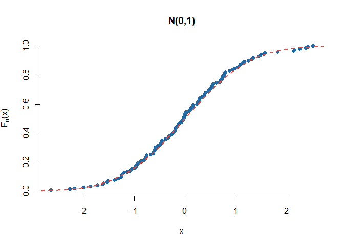
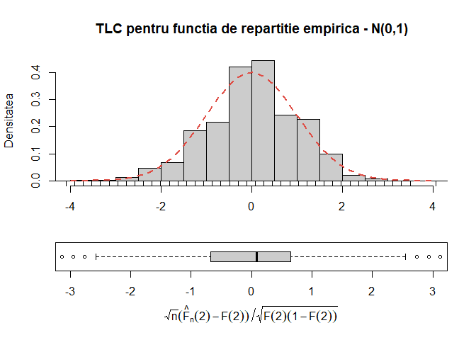
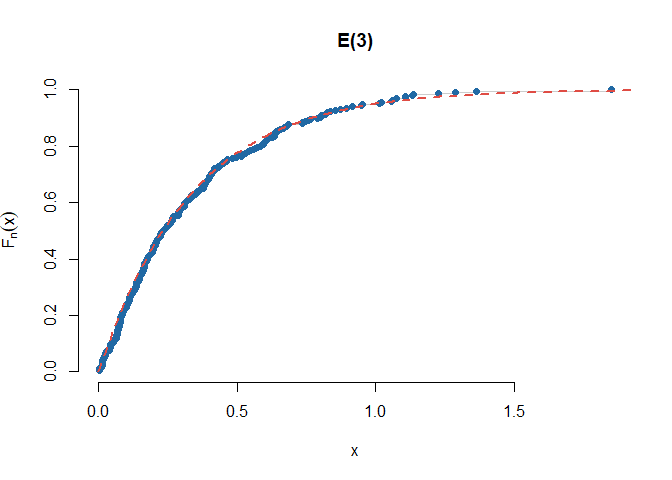
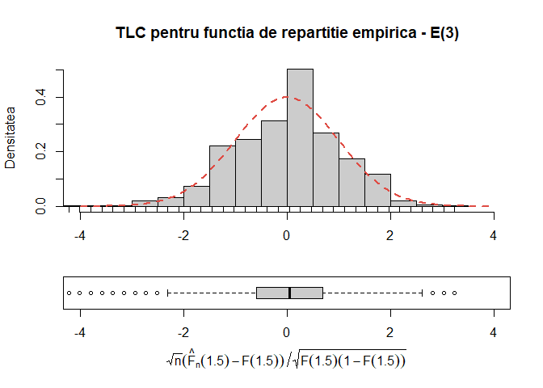
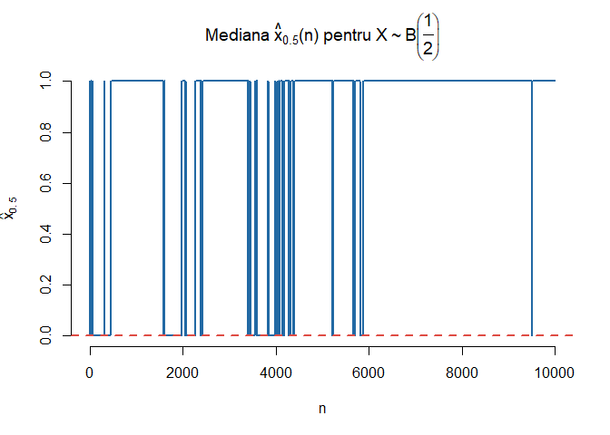
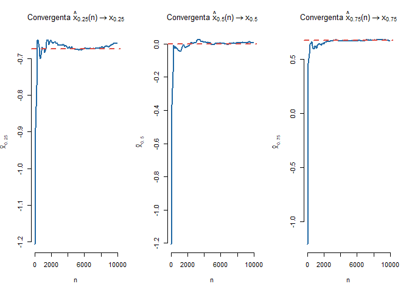
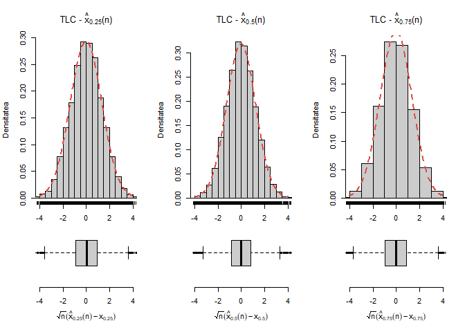
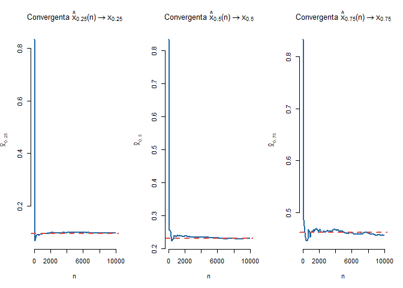
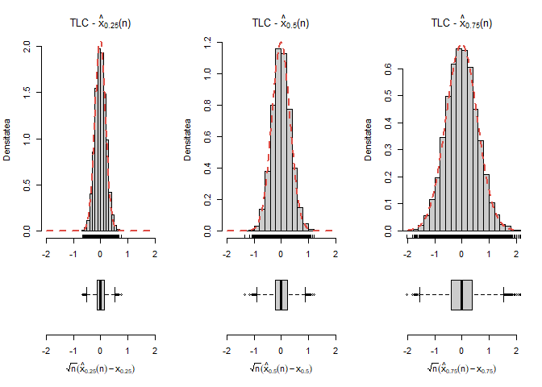
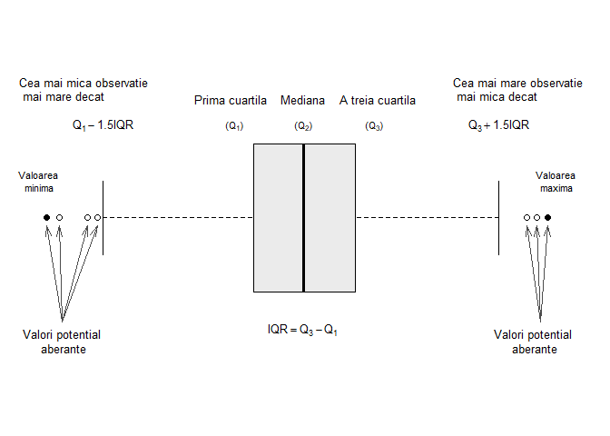

Obiectivul acestui laborator este de a ilustra noțiunea de funcție de repartiție empirică și de cuantile empirice și de a verifica câteva proprietăți asimptotice ale acestora. 

# Funcția de repartiție empirică 

Fie $X_1,X_2,\ldots,X_n$ un eșantion de talie $n$ dintr-o populație a cărei funcție de repartiție este $F$. Funcția de repartiție empirică este definită, pentru toate valorile $x\in\mathbb{R}$, prin 

$$
  \hat{F}_n(x) = \frac{1}{n}\sum_{i = 1}^{n}\mathbf{1}_{(-\infty, x]}(X_i) = \frac{1}{n}\sum_{i = 1}^{n}\mathbf{1}_{(-\infty, x]}(X_{(i)})
$$

unde $X_{(1)}, X_{(2)}, \ldots, X_{(n)}$ reprezintă statisticile de ordine. Observăm că, notând $X_{(n+1)} = +\infty$, avem

$$
  \hat{F}_n(x) = \sum_{i = 1}^{n}\frac{i}{n}\mathbf{1}_{\left[X_{(i)}, X_{(i+1)}\right)}(x).
$$

\BeginKnitrBlock{rmdexercise}
Dacă $\hat{F}_n(x)$ este funcția de repartiție empirică asociată unui eșantion de talie $n$, dintr-o populație a cărei funcție de repartiție este $F$, atunci, pentru $x\in\mathbb{R}$:
  
  - variabila aleatoare $n\hat{F}_n(x)$ este repartizată binomial $\mathcal{B}(n, F(x))$
  - are loc convergența (LNM): $\hat{F}_n(x)\overset{a.s.}{\to} F(x)$
  - are loc proprietatea de normalitate asimptotică (TLC): $\sqrt{n}(\hat{F}_n(x) - F(x))\overset{d}{\to}\mathcal{N}(0,F(x)(1-F(x)))$. 
  
Ilustrați grafic rezultatele de mai sus pentru o populație repartizată $\mathcal{N}(0,1)$ și respectiv $\mathcal{E}(3)$. Pentru proprietatea de normalitate considerați $x_0 = 2$ și respectiv $x_0 = 1.5$. 

\EndKnitrBlock{rmdexercise}

Fie $x\in\mathbb{R}$ fixat și definim variabilele aleatoare $Y_i = \mathbf{1}_{(-\infty, x]}(X_i)$, $1\leq i\leq n$. Cum $X_1,X_2,\ldots,X_n$ sunt i.i.d. deducem că $Y_1,Y_2,\ldots,Y_n$ sunt i.i.d. și în plus $Y_i\sim \mathcal{B}(p)$ cu $p = \mathbb{P}(Y_1 = 1) = F(x)$.

Din definiția funcției de repartiție empirică avem 

$$
  \hat{F}_n(x) = \frac{1}{n}\sum_{i = 1}^{n}\mathbf{1}_{(-\infty, x]}(X_i) = \frac{1}{n}\sum_{i = 1}^{n}Y_i
$$

și aplicând *Legea Tare a Numerelor Mari* obținem

$$
  \hat{F}_n(x) = \frac{1}{n}\sum_{i = 1}^{n}Y_i \overset{a.s.}{\underset{n\to\infty}\longrightarrow} \mathbb{E}[Y_1] = F(x).
$$

În mod similar aplicând *Teorema Limită Centrală* deducem 

$$
  \sqrt{n}(\hat{F}_n(x) - F(x))\overset{d}{\underset{n\to\infty}\longrightarrow}\mathcal{N}(0,Var(Y_1)) = \mathcal{N}(0,F(x)(1-F(x))).
$$

Pentru ilustrare, în cazul $\mathcal{N}(0,1)$ avem convergența

și proprietatea de normalitate (TLC)

Pentru repartiția $\mathcal{E}(3)$ avem  

și rezultatul de normalitate asimptotică

Conform rezultatului anterior putem spune că $\hat{F}_n(x)$ este un estimator *rezonabil* pentru funcția de repartiție $F(x)$ dat fiind o valoare $x\in\mathbb{R}$ fixată. Întrebarea care se pune este dacă $\hat{F}_n(x)$ este un estimator *rezonabil* pentru întreaga funcție de repartiție $F(x)$ ? Răspunsul la această întrebare este dat de *Teorema Glivenko-Cantelli*^[Pentru o demonstrație a acestei teoreme se poate consulta, spre exemplu, cartea lui Sidney Resnick *A probability path*, Springer, 1998 (pag 224)] de mai jos:

\BeginKnitrBlock{rmdinsight}
**Teorema Glivenko-Cantelli**. Fie $(X_n)_n$ un șir de variabile aleatoare independent și identic repartizate, cu funcția de repartiție comună $F$. Atunci are loc

$$
  \sup_{x\in\mathbb{R}}\left|\hat{F}_n(x) - F(x)\right| \overset{a.s.}{\underset{n\to\infty}\longrightarrow} 0.
$$

\EndKnitrBlock{rmdinsight}

# Cuantile empirice

Reamintim că dată fiind o funcție de repartiție $F$, funcția *cuantilă* (inversa generalizată) asociată lui $F$, $F^{-1}:(0,1)\to\mathbb{R}$ este definită prin 

$$
  F^{-1}(u) = \inf\{x\in\mathbb{R}\,|\,F(x)\geq u\}, \quad \forall u\in(0,1)
$$
unde folosim convențiile $\inf\mathbb{R} = -\infty$ și $\inf\emptyset = +\infty$.

\BeginKnitrBlock{rmdinsight}
Funcția cuantilă $F^{-1}$ verifică următoarele proprietăți:

  1) Valoarea în $0$: $F^{-1}(0) = -\infty$
  2) Monotonie: $F^{-1}$ este crescătoare
  3) Continuitate: $F^{-1}$ este continuă la stânga
  4) Echivalență: pentru $\forall u\in[0,1]$ avem $F(x)\geq u \iff x\geq F^{-1}(u)$
  5) Inversabilitate: $\forall u\in[0,1]$ avem $(F\circ F^{-1})(u)\geq u$. În plus
    a) dacă $F$ este continuă atunci $F\circ F^{-1} = Id$ dar dacă nu este injectivă atunci există $x_0$ așa încât $(F^{-1}\circ F)(x_0)<x_0$
    b) dacă $F$ este injectivă atunci $F^{-1}\circ F = Id$ dar dacă nu este continuă atunci există $u_0$ astfel că $(F\circ F^{-1})(u_0)>u_0$

\EndKnitrBlock{rmdinsight}

Pentru a exemplifica punctul 5a, putem considera variabila aleatoare $X\sim\mathcal{U}[0,1]$ a cărei funcție de repartiție $F$ este continuă dar nu injectivă și în plus $(F^{-1}\circ F)(2) = F^{-1}(1) = 1 < 2$. Pentru punctul 5b să considerăm variabilele aleatoare $Y\sim\mathcal{N}(0,1)$ și $B\sim\mathcal{B}(0.5)$ independente și să definim $X = BY$. Atunci funcția de repartiție a lui $X$ verifică $F(0-) = \frac{1}{4}$ și $F(0) = \frac{3}{4}$, este injectivă dar nu și continuă în $0$ și în plus avem $(F\circ F^{-1})(1/2) = F(0) = \frac{3}{4}>\frac{1}{2}$.

Se numește *cuantilă* de ordin $p\in(0,1)$ (sau $p$-cuantilă) asociată lui $F$ valoarea

$$
  x_p = F^{-1}(p) = \inf\{x\in\mathbb{R}\,|\,F(x)\geq p\}.
$$

Cuantila de ordin $0.5$, $x_{\frac{1}{2}}$ se numește mediana lui $F$ și se notează cu $M$ sau $Q_2$, iar cuantilele de ordin $\frac{1}{4}$ și respectiv $\frac{3}{4}$ se numesc prima și respectiv a treia cuartilă și se notează cu $Q_1$ și respectiv $Q_3$.

Fie acum $X_1,X_2,\ldots,X_n$ un eșantion de talie $n$ dintr-o populație a cărei funcție de repartiție este $F$ și fie $\hat{F}_n$ funcția de repartiție empirică asociată. Pentru $p\in(0,1)$ definim cuantila empirică de ordin $p$ și o notăm $\hat{x}_p = \hat{x}_p(n)$ valoarea

$$
  \hat{x}_p = \hat{F}_n^{-1}(p) = \inf\{x\in\mathbb{R}\,|\,\hat{F}_n(x)\geq p\}.
$$

Folosind convenția $X_{(0)}=-\infty$, cunatila empirică de ordin $p$ coincide cu una dintre statisticile de ordine:

$$
  \hat{x}_p = X_{(i)} \iff np\leq i< np+1 \iff \hat{x}_p = X_{(\lceil np \rceil)},
$$

unde $\lceil x \rceil$ reprezintă cea mai mică valoare întreagă mai mare sau egală cu $x$.

Are loc următorul rezultat^[O demonstrație a acestui rezultat care nu necesită funcții caracteristice se regăsește în articolul lui Jan Wretman *A Simple Derivation of the Asymptotic Distribution of a Sample Quantile*, Scand. J. Statist., 5(2): 123-124, 1978.]:

\BeginKnitrBlock{rmdinsight}
Fie $X_1,X_2,\ldots,X_n$ un eșantion de talie $n$ dintr-o populație cu funcția de repartiție $F$, $p\in(0,1)$ fixat, $x_p$ cuantila de ordin $p$ asociată lui $F$ și $\hat{x}_p(n)$ cuantila empirică de ordin $p$. Atunci 
  
  1) Convergența: dacă $F$ este strict crescătoare în $x_p$ are loc

$$
  \hat{x}_p(n) \overset{a.s.}{\underset{n\to\infty}\longrightarrow} x_p
$$
  
  2) Normalitatea asiptotică: dacă $F$ este derivabilă în $x_p$ cu derivata $f(x_p)>0$, atunci 

$$
  \sqrt{n}(\hat{x}_p(n) - x_p)\overset{d}{\underset{n\to\infty}\longrightarrow}\mathcal{N}\left(0,\frac{p(1-p)}{f(x_p)^2}\right).
$$
\EndKnitrBlock{rmdinsight}

Pentru a ilustra importanța condiției de la primul punct ($F$ este strict crescătoare în $x_p$) să considerăm $X\sim\mathcal{B}(\frac{1}{2})$. Atunci mediana sa este $x_{\frac{1}{2}} = 0$ pe când mediana empirică $\hat{x}_{\frac{1}{2}}(n)$ va oscila mereu (dar neregulat) între valorile $0$ și $1$.

\BeginKnitrBlock{rmdexercise}
Ilustrați grafic în R proprietatea de convergență și de normalitate asiptotică (din rezultatul precedent) pentru o populație repartizată $\mathcal{N}(0,1)$ și respectiv $\mathcal{E}(3)$ și pentru $p\in\left\{\frac{1}{4}, \frac{1}{2}, \frac{3}{4} \right\}$. 

\EndKnitrBlock{rmdexercise}

În cazul $\mathcal{N}(0,1)$ avem proprietatea de convergență a cuantilelor

și proprietatea de normalitate asimptotică

În cazul $\mathcal{E}(3)$ avem proprietatea de convergență a cuantilelor

și proprietatea de normalitate asimptotică

# Metoda grafică: Boxplot 

Una dintre metodele grafice des întâlnite în vizualizarea datelor (cantitative) unidimensionale este *boxplot*-ul (eng. *box and whisker plot* - cutia cu mustăți). Această metodă grafică descriptivă este folosită în principal pentru a investiga forma repartiției (simetrică sau asimetrică) datelor dar și variabilitatea acestora precum și pentru detectarea și ilustrarea schimbărilor de locație și variație între diferitele grupuri de date. 

După cum putem vedea și în figura de mai jos, cutia este definită, de la stânga la dreapta (sau de jos în sus în funcție de cum este reprezentat boxplot-ul: orizontal sau vertical), de prima cuartilă $Q_1$ și de a treia curatilă $Q_3$ ceea ce înseamnă că $50\%$ dintre observații se află în interiorul cutiei. Linia din interiorul cutiei este determinată de mediană sau a doua cuartilă $Q_2$. 

Mustățile care pornesc de o parte și de alta a cutiei sunt determinate astfel (vom folosi conveția folosită de John Tukey^[A se consulta pag. 40-56 din cartea lui John Tukey *Exploratory data analysis*, Addison-Wesley Publishing Company, 1977]): mustața din stânga este determinată de cea mai mică observație mai mare decât $Q_1-1.5 IQR$ iar cea din dreapta de cea mai mare observație din setul de date mai mică decât $Q_3+1.5IQR$, unde $IQR = Q_3-Q_1$ este distanța dintre cuartile (*interquartile range*). 

Valorile observațiilor din setul de date care sunt sau prea mici sau prea mari se numesc valori aberante (*outliers*) și conform lui Tukey sunt definite astfel: *valori strict aberante* care se află la $3IQR$ deasupra celei de-a treia curtilă $Q_3$ sau la $3IQR$ sub prima cuartilă ($x<Q_1-3IQR$ sau $x>Q_3+3IQR$) și *valori potențial aberante* care se află la $1.5IQR$ deasupra celei de-a treia curtilă $Q_3$ sau la $1.5IQR$ sub prima cuartilă ($x<Q_1-1.5IQR$ sau $x>Q_3+1.5IQR$). 

În R metoda grafică boxplot se poate trasa cu ajutorul funcției `boxplot()`. Aceasta primește ca argumente sau un vector de observații numerice `x` atunci când dorim să ilustrăm repartiția unei variabile sau o formulă de tipul `y~grup`, unde `y` este un vector numeric care va fi împărțit în funcție de variabila discretă `grup`, atunci când vrem să comparăm aceeași variabilă numerică în funcție de una discretă (calitatăvă). Pentru mai multe informații tastați `?boxplot`.

\BeginKnitrBlock{rmdexercise}
Considerați setul de date `mtcars`. Investigați cu ajutorul unui boxplot cum variază greutatea mașinilor, variabila `wt`, în funcție de numărul de cilindrii `cyl`. Afișați numele mașinilor care prezintă potențiale valori aberante. Aceeași cerință pentru perechile `mpg` - `cyl`, `hp` - `cyl` și `hp` - `am`. 
\EndKnitrBlock{rmdexercise}

Numele mașinilor care au o greutate potențial aberantă este Cadillac Fleetwood, Lincoln Continental, Chrysler Imperial.

