<script>
$(document).ready(function ()  {

    // move toc-ignore selectors from section div to header
    $('div.section.toc-ignore')
        .removeClass('toc-ignore')
        .children('h1,h2,h3,h4,h5').addClass('toc-ignore');

    // establish options
    var options = {
      selectors: "h1,h2,h3",
      theme: "bootstrap3",
      context: '.toc-content',
      hashGenerator: function (text) {
        return text.replace(/[.\\/?&!#<>]/g, '').replace(/\s/g, '_').toLowerCase();
      },
      ignoreSelector: ".toc-ignore",
      scrollTo: 60
    };
    options.showAndHide = false;
    options.smoothScroll = true;

    // tocify
    var toc = $("#TOC").tocify(options).data("toc-tocify");
});
</script>

Obiectivul acestui laborator este de a prezenta o parte din cele mai cunoscute repartiții continue^[Pentru mai multe informații, se poate consulta monografia Johnson, N., Kotz, S. și Balakrishnan, N. *Continuous Univariate Distributions*, (Volumul 1, Ediția a 2-a), John Wiley & Sons, New York (1994), 756 pp., ISBN 0-471-58495-9] și de a rezolva câteva probleme cu ajutorul lor.


R pune la disploziție majoritatea repartițiilor uzuale. Tabelul de mai jos prezintă numele și parametrii acestora:

| Repartiția | Nume | Parametrii | Valori prestabilite |
|:--------------------------|:------------------------|:----------------------|:-----------------------------|
| Uniformă | `unif` | `min`, `max` | `min = 0`, `max = 1` |
| Normală | `norm` | `mean`, `sd` | `mean = 0`, `sd = 1` | 
| Log-Normală | `lnorm` | `mean`, `sd` | `mean = 0`, `sd = 1` | 
| Exponențială | `exp`  | `rate` (=1/mean) |  `rate = 1`  |
| Cauchy | `cauchy` | `location`, `scale` | `location = 0`, `scale = 1` |
| Gamma | `gamma` | `shape`, `rate` (=1/scale) | `rate = 1` |
| Beta | `beta` | `shape1`, `shape2` |  |
| Student | `t` | `df` |  |
| Chi-Squared | `chisq` | `df` |  |
| Fisher | `f`  | `df1`, `df2` |  |
| Weibull | `weibull` | `shape` |  |

Table: Tabelul 1. Numele si parametrii repartitiilor uzuale in R

Pentru fiecare repartiție, există patru comenzi în R prefixate cu literele `d`, `p`, `q` și `r` și urmate de numele repartiției (coloana a 2-a). De exemplu `dnorm`, `pnorm`, `qnorm` și `rnorm` sunt comenzile corespunzătoare repartiției normale pe când `dunif`, `punif`, `qunif` și `runif` sunt cele corespunzătoare repartiției uniforme.

  * `dnume`: calculează densitatea atunci când vorbim de o variabilă continuă sau funcția de masă atunci când avem o repartiție discretă ($\mathbb{P}(X=k)$)
  
  * `pnume`: calculează funcția de repartiție, i.e. $F(x)=\mathbb{P}(X\leq x)$
  
  * `qnume`: reprezintă funcția cuantilă, cu alte cuvinte valoarea pentru care funcția de repartiție are o anumită probabilitate; în cazul continuu, dacă `pnume(x) = p` atunci `qnume(p) = x` iar în cazul discret întoarce cel mai mic întreg $u$ pentru care $\mathbb{P}(X\leq u)\geq p$. 
  
  * `rnume`: generează observații independente din repartiția dată 

# Repartiția Uniformă

O variabilă aleatoare $X$ repartizată *uniform* pe intervalul $[a,b]$, notată $X\sim \mathcal{U}[a,b]$, are densitatea dată de

$$
  f_X(x) = \left\{\begin{array}{ll}
    \frac{1}{b-a}, & x\in[a,b]\\
    0, & \text{altfel}
  \end{array}\right.
$$

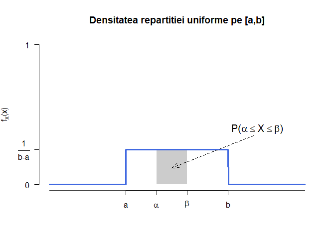

Funcția de repartiție a repartiției uniforme este 

$$
  F_X(x) =\int_{-\infty}^{x}f_X(t)\,dt = \left\{\begin{array}{ll}
    0, & x\leq a\\
    \frac{x-a}{b-a}, & x\in(a,b)\\
    1, & x\geq b
  \end{array}\right.
$$

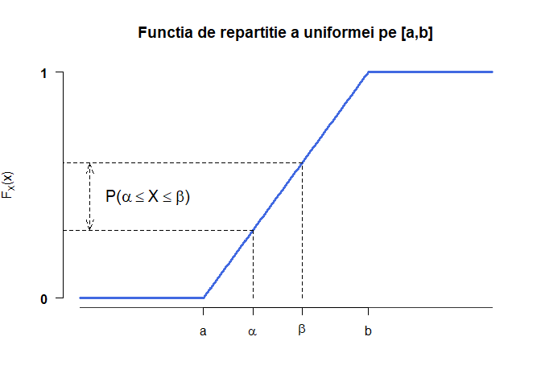

Media și varianța variabilei aleatoare $X$ repartizate uniform pe $[a,b]$ sunt egale cu 

$$
  \mathbb{E}[X] = \frac{a+b}{2},\qquad Var(X) = \frac{(a-b)^2}{12}. 
$$

Variabilele aleatoare repartizate uniform joacă un rol important în teoria simulării variabilelor aleatoare datorită următorului rezultat datorat lui Paul Levy și numit *teorema de universalitate a repartiției uniforme*:

\BeginKnitrBlock{rmdinsight}<div class="rmdinsight">Fie $X$ o variabilă aleatoare reală cu funcția de repartiție $F$, $U$ o variabilă aleatoare repartizată uniform pe $[0,1]$ și fie funcția *cuantilă* (inversa generalizată) asociată lui $F$, $F^{-1}:(0,1)\to\mathbb{R}$ definită prin 

$$
  F^{-1}(u) = \inf\{x\in\mathbb{R}\,|\,F(x)\geq u\}, \quad \forall u\in(0,1).
$$
Atunci $X$ și $F^{-1}(U)$ sunt repartizate la fel.

</div>\EndKnitrBlock{rmdinsight}

În R putem să

  - generăm observații independente din repartiția $\mathcal{U}([a, b])$ (e.g. $a = 3$ și $b = 5$)
  

```r
runif(10, 3, 5)
 [1] 4.066545 3.281540 4.273723 3.512039 4.998460 3.766781 3.470538 4.466706
 [9] 3.435142 4.868910
```

  - calculăm densitatea unei variabile aleatoare repartizate uniform pe $[a, b]$ în diferite puncte
  

```r
dunif(c(3.1, 3.7, 3.95, 4.86), 3, 5)
[1] 0.5 0.5 0.5 0.5
```

  - calculăm funcția de repartiție a unei variabile repartizate uniform pe $[a,b]$ pentru diferite valori
  

```r
punif(c(3.1, 3.7, 3.95, 4.86), 3, 5)
[1] 0.050 0.350 0.475 0.930
```

<div class="rmdexercise">
<p>Fie <span class="math inline">\(X\)</span> o variabilă aleatoare repartizată uniform pe <span class="math inline">\([2,7]\)</span>. Determinați:</p>

</div>

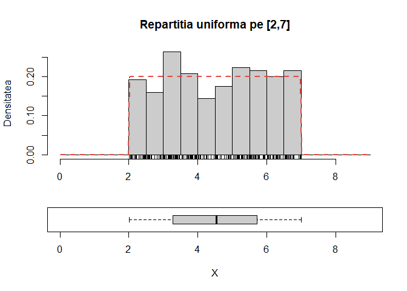

<div class="rmdexercise">
<p>Dacă <span class="math inline">\(X\)</span> o variabilă aleatoare repartizată uniform pe <span class="math inline">\([a,b]\)</span> și <span class="math inline">\([c,d]\subset [a,b]\)</span> este un subinterval, atunci repartiția condiționată a lui <span class="math inline">\(X\)</span> la <span class="math inline">\(X\in [c,d]\)</span> este <span class="math inline">\(\mathcal{U}[c,d]\)</span>.</p>
</div>

# Repartiția Normală

Spunem că o variabilă aleatoare $X$ este repartizată *normal* sau *Gaussian* de medie $\mu$ și varianță $\sigma^2$, și se notează cu $X\sim\mathcal{N}(\mu, \sigma^2)$, dacă densitatea ei are forma 

$$
  f_X(x) \left(\overset{not}{=} \varphi(x)\right) = \frac{1}{\sqrt{2\pi}\sigma}e^{-\frac{(x-\mu)^2}{2\sigma^2}}, \quad x\in\mathbb{R}.
$$

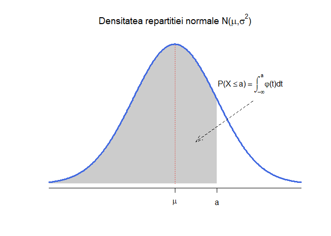

Funcția de repartiție a unei variabile $X\sim\mathcal{N}(\mu, \sigma^2)$ este dată de 

$$
  F_X(x) \left(\overset{not}{=} \Phi(x)\right) = \int_{-\infty}^{x}\varphi(t)\,dt = \frac{1}{\sqrt{2\pi}\sigma}\int_{-\infty}^{x}e^{-\frac{(t-\mu)^2}{2\sigma^2}}\,dt.
$$

Pentru funcția de repartiție nu avem o formulă explicită de calcul, ea poate fi aproximată cu ajutorul descompunerii în serie. În cazul variabilelor *normale standard* ($X\sim\mathcal{N}(0,1)$) avem proprietățile

  a) $\Phi(x) = 1-\Phi(-x)$ pentru toate valorile $x\in\mathbb{R}$
  b) $1-\Phi(a)\leq\frac{1}{2}e^{-\frac{a^2}{2}}$ pentru $a>0$^[Pentru mai multe astfel de inegalități se poate consulta cartea (capitolul 2): Lin, Z. și Bai, Z. *Probability Inequalities*, Springer, 2010.]


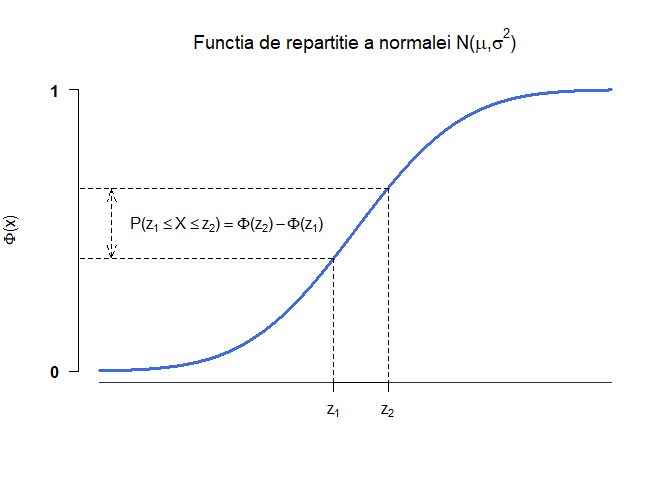

Media și varianța variabilei aleatoare $X$ repartizate normal de parametrii $\mathcal{N}(\mu, \sigma^2)$ sunt egale cu 

$$
  \mathbb{E}[X] = \mu,\quad Var(X) = \sigma^2. 
$$
Mai mult, momentele de ordin se pot calcula cu ușurință și avem că 

$$
  \mathbb{E}[X^k] = \left\{\begin{array}{ll}
      \sigma^k (k-1)!!, & \text{$k$ este par} \\
      0, & \text{$k$ este impar}.
  \end{array}\right.
$$

Pentru o variabilă aleatoare repartizată normal, avem următoarea regulă numită și regula $68-95-99.7\%$:

\BeginKnitrBlock{rmdinsight}<div class="rmdinsight">Fie $X$ o variabilă aleatoare repartizată $\mathcal{N}(\mu, \sigma^2)$. Atunci 

\begin{align*}
  \mathbb{P}(|X-\mu|<\sigma) &\approx 0.68\\
  \mathbb{P}(|X-\mu|<2\sigma) &\approx 0.95\\
  \mathbb{P}(|X-\mu|<3\sigma) &\approx 0.997
\end{align*}

</div>\EndKnitrBlock{rmdinsight}

În R putem să

  - generăm observații independente din repartiția $\mathcal{N}(\mu, \sigma^2)$ (e.g. $\mu = 0$ și $\sigma^2 = 2$ - în R funcțiile `rnorm`, `dnorm`, `pnorm` și `qnorm` primesc ca parametrii media și abaterea standard, $\sigma$ **nu** varianța $\sigma^2$)
  

```r
rnorm(10, mean = 0, sd = sqrt(2))
 [1]  0.38301532 -2.11729942 -1.71027840 -0.09829150  0.15389390  0.57477949
 [7]  0.23143789 -0.49874029  0.64150915  0.01635087
```

  - calculăm densitatea unei variabile aleatoare repartizate normal $\mathcal{N}(\mu, \sigma^2)$ în diferite puncte
  

```r
dnorm(seq(-2, 2, length.out = 15), mean = 3, sd = 5)
 [1] 0.04839414 0.05115647 0.05390019 0.05660592 0.05925368 0.06182308
 [7] 0.06429362 0.06664492 0.06885700 0.07091058 0.07278734 0.07447021
[13] 0.07594361 0.07719368 0.07820854
```

  - calculăm funcția de repartiție a unei variabile repartizate normal $\mathcal{N}(\mu, \sigma^2)$ pentru diferite valori
  

```r
pnorm(seq(-1, 1, length.out = 15), mean = 3, sd = 1)
 [1] 3.167124e-05 5.736006e-05 1.018892e-04 1.775197e-04 3.033834e-04
 [6] 5.086207e-04 8.365374e-04 1.349898e-03 2.137367e-03 3.320943e-03
[11] 5.063995e-03 7.579219e-03 1.113549e-02 1.606229e-02 2.275013e-02
```

  - calculăm cuantilele de ordin $\alpha\in(0,1)$ (i.e. valoarea $z_{\alpha}$ pentru care $\Phi(z_{\alpha}) = \alpha$ sau altfel spus $z_{\alpha} = \Phi^{-1}(\alpha)$)
  

```r
qnorm(c(0.01, 0.025, 0.05, 0.25, 0.5, 0.75, 0.95, 0.975, 0.99), mean = 0, sd = 1)
[1] -2.3263479 -1.9599640 -1.6448536 -0.6744898  0.0000000  0.6744898  1.6448536
[8]  1.9599640  2.3263479
```

\BeginKnitrBlock{rmdexercise}<div class="rmdexercise">Fie $X$ o variabilă aleatoare repartizată $\mathcal{N}(\mu, \sigma^2)$. Atunci pentru $\mu = 1$ și $\sigma = 3$ calculați:

\begin{itemize}
  \item[1)] $\mathbb{P}(\text{$X$ este par})$
  \item[2)] $\mathbb{P}(X<3.4)$ și $\mathbb{P}(X>1.3)$
  \item[3)] $\mathbb{P}(1<X<4)$ 
  \item[4)] $\mathbb{P}(X\in [2,3]\cup[3.5,5])$
  \item[5)] $\mathbb{P}(|X-3|>6)$
\end{itemize}
</div>\EndKnitrBlock{rmdexercise}

\BeginKnitrBlock{rmdexercise}<div class="rmdexercise">Fie $X$ o variabilă aleatoare repartizată $\mathcal{N}(\mu, \sigma^2)$. Pentru $\mu = 0$ și $\sigma^2 \in \{0.2, 0.5, 1.5, 5\}$ trasați pe același grafic densitățile repartițiilor normale cu parametrii $\mathcal{N}(\mu, \sigma^2)$. Adăugați legendele corespunzătoare. Aceeași cerință pentru funcțiile de repartiție.

</div>\EndKnitrBlock{rmdexercise}

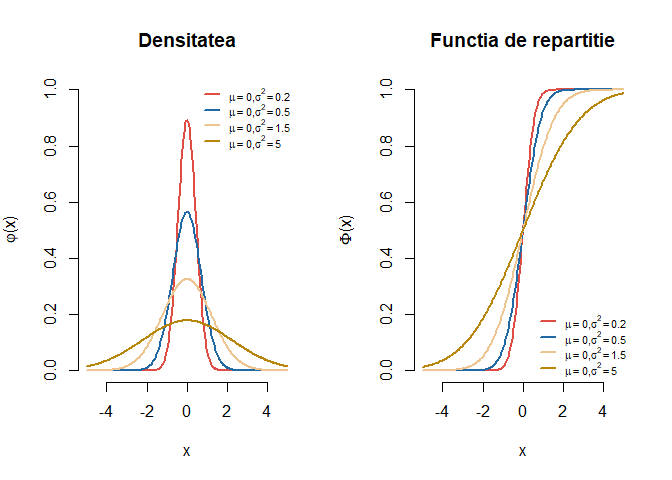


\BeginKnitrBlock{rmdexercise}<div class="rmdexercise">Generați $250$ de observații din repartiția $\mathcal{N}(0, 2)$, trasați histograma acestora și suprapuneți densitatea repartiției date (vezi figura de mai jos).

</div>\EndKnitrBlock{rmdexercise}


\BeginKnitrBlock{rmdexercise}<div class="rmdexercise">Fie $X$ o variabilă aleatoare repartizată normal de parametrii $\mu$ și $\sigma^2$. Ilustrați grafic pentru $\mu = 0$ și $\sigma = 1$ că are loc următoarea inegalitate: 

$$
  \left(\frac{1}{x}-\frac{1}{x^3}\right)\phi(x)<1-\Phi(x)<\frac{1}{x}\phi(x), \quad x>0.
$$
</div>\EndKnitrBlock{rmdexercise}

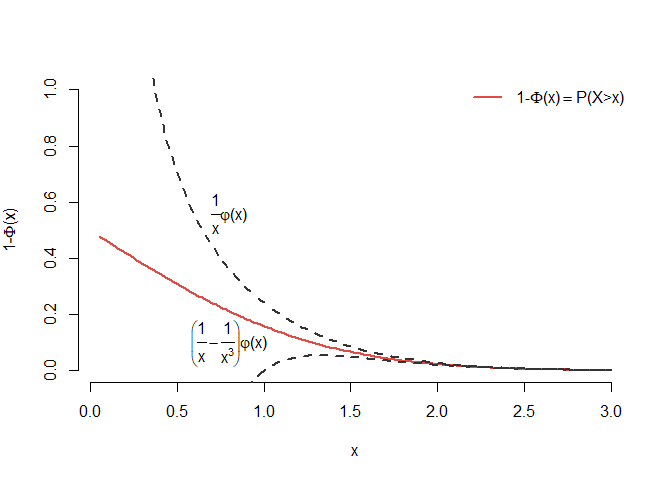


# Repartiția Log-Normală

Spune că o variabilă aleatoare $X$ este repartizată log-normal de parametrii $\mu$ și $\sigma^2$, și notăm $X\sim LN(\mu, \sigma^2)$, dacă $\ln(X)$ este repartizată normal de parametrii $\mu$ și $\sigma^2$. Cu alte cuvinte dacă $Y\sim \mathcal{N}(\mu, \sigma^2)$ atunci $X=e^Y\sim LN(\mu, \sigma^2)$. Densitatea repartiției log-normale $LN(\mu, \sigma^2)$ este 

$$
    f_X(x) = \frac{1}{x\sigma\sqrt{2\pi}}e^{-\frac{(\ln(x)-\mu)^2}{2\sigma^2}}, \quad x\in (0, +\infty).
$$

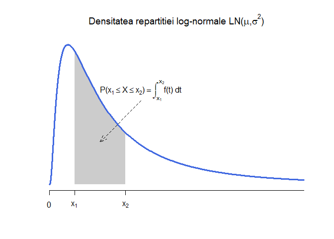

Funcția de repartiție a unei variabile aleatoare $X\sim LN(\mu, \sigma^2)$ este dată de 

$$
  F_{X}(x) = \int_{-\infty}^{x}f_X(t)\,dt = \frac{1}{\sqrt{2\pi}\sigma}\int_{-\infty}^{x}\frac{1}{t}e^{-\frac{(\ln(t)-\mu)^2}{2\sigma^2}}\,dt
$$

și, ca și în cazul repartiției normale, nu are o formulă explicită de calcul. 


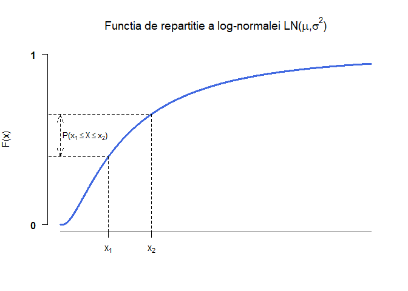

Media și varianța variabilei aleatoare $X$ repartizate log-normal de parametrii $LN(\mu, \sigma^2)$ sunt egale cu

$$
  \mathbb{E}[X] = e^{\mu+\frac{\sigma^2}{2}},\quad Var(X) = \left(e^{\sigma^2}-1\right)e^{2\mu+\sigma^2}. 
$$

\BeginKnitrBlock{rmdexercise}<div class="rmdexercise">Arătați că media și varianța unei variabile aleatoare repartizate log-normal de parametrii $\mu$ și $\sigma^2$ sunt egale cu

$$
  \mathbb{E}[X] = e^{\mu+\frac{\sigma^2}{2}},\quad Var(X) = \left(e^{\sigma^2}-1\right)e^{2\mu+\sigma^2}. 
$$

</div>\EndKnitrBlock{rmdexercise}

În R putem să

  - generăm observații independente din repartiția $LN(\mu, \sigma^2)$ (e.g. $\mu = 0$ și $\sigma^2 = 3$ - ca și în cazul repartiției normale, funcțiile `rlnorm`, `dlnorm`, `plnorm` și `qlnorm` primesc ca parametrii media și abaterea standard, $\sigma$ pentru $\ln(X)$ - variabila normală)
  

```r
rlnorm(15, meanlog = 0, sdlog = sqrt(3))
 [1]  2.13141475  6.27258447  2.18850080  3.15407005  0.13970018  0.52638598
 [7] 12.91237780  0.12004802  1.56359485  2.01674623  5.42024453  0.54647199
[13]  1.31619806  0.04716763  1.79762358
```

  - calculăm densitatea unei variabile aleatoare repartizate log-normal $LN(\mu, \sigma^2)$ în diferite puncte
  

```r
dlnorm(seq(0, 5, length.out = 20), meanlog = 3, sdlog = 5)
 [1] 0.00000000 0.20820751 0.11627647 0.08196427 0.06370023 0.05226715
 [7] 0.04440086 0.03864103 0.03423291 0.03074580 0.02791546 0.02557044
[13] 0.02359456 0.02190618 0.02044622 0.01917084 0.01804680 0.01704845
[19] 0.01615564 0.01535234
```

  - calculăm funcția de repartiție a unei variabile repartizate log-normal $LN(\mu, \sigma^2)$ pentru diferite valori
  

```r
plnorm(seq(0, 15, length.out = 25), meanlog = 3, sdlog = 1)
 [1] 0.0000000000 0.0002602257 0.0027443707 0.0088606283 0.0185933103
 [6] 0.0314027650 0.0466497221 0.0637426806 0.0821791298 0.1015482283
[11] 0.1215206945 0.1418356830 0.1622882185 0.1827183180 0.2030019832
[16] 0.2230439002 0.2427715876 0.2621307274 0.2810814477 0.2995953616
[21] 0.3176532076 0.3352429649 0.3523583472 0.3689975944 0.3851625036
```

  - calculăm cuantilele de ordin $\alpha\in(0,1)$ 
  

```r
qlnorm(c(0.01, 0.025, 0.05, 0.25, 0.5, 0.75, 0.95, 0.975, 0.99), meanlog = 0, sdlog = 1)
[1]  0.09765173  0.14086349  0.19304082  0.50941628  1.00000000  1.96303108
[7]  5.18025160  7.09907138 10.24047366
```


\BeginKnitrBlock{rmdexercise}<div class="rmdexercise">Fie $X$ o variabilă aleatoare repartizată $LN(\mu, \sigma^2)$. Pentru $\mu = 0$ și $\sigma \in \{0.25, 0.5, 1.5, 5\}$ trasați pe același grafic densitățile repartițiilor log-normale cu parametrii $LN(\mu, \sigma^2)$. Adăugați legendele corespunzătoare. Aceeași cerință pentru funcțiile de repartiție.

</div>\EndKnitrBlock{rmdexercise}

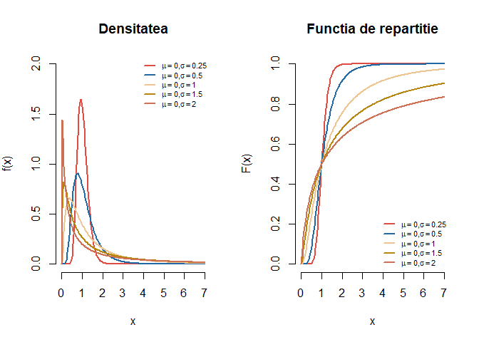


\BeginKnitrBlock{rmdexercise}<div class="rmdexercise">Generați $500$ de observații din repartiția $LN(0, 2)$, trasați histograma acestora și suprapuneți densitatea repartiției date (vezi figura de mai jos).

</div>\EndKnitrBlock{rmdexercise}

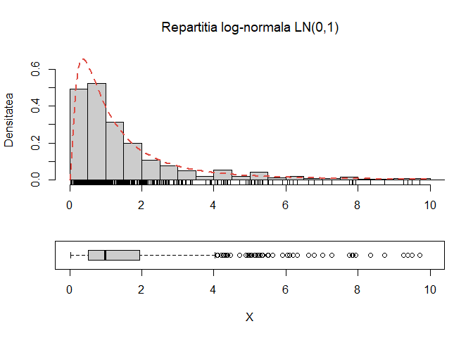

Printre fenomenele care pot fi modelate cu ajutorul repartiției log-normale se numără: cantitatea de lapte produsă de vaci, cantitatea de ploaie dintr-o perioadă dată, repartiția mărimii picăturilor de ploaie, volumul de gaz dintr-o rezervă petrolieră, etc. Pentru mai multe aplicații se poate consulta lucrarea lui Limpert, E., Stajel, W. și Abbt, M. [Log-normal Distributions across the Sciences: Keys and Clues](http://stat.ethz.ch/~stahel/lognormal/bioscience.pdf), *BioScience*, Vol. 51, Nr. 5, 2001. 

# Repartiția Exponențială

Spunem că o variabilă aleatoare $X$ este repartizată *exponențial* de parametru $\lambda$, și se notează cu $X\sim\mathcal{E}(\lambda)$, dacă densitatea ei are forma 

$$
  f_X(x) = \lambda e^{-\lambda x}\mathbb{1}_{\mathbb{R}_+}(x),\quad \forall x\in\mathbb{R}.
$$

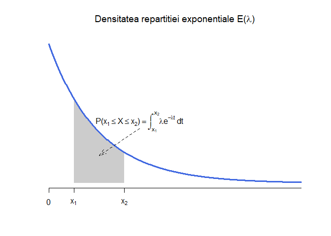

Funcția de repartiție a unei variabile aleatoare $X\sim \mathcal{E}(\lambda)$ este dată de 

$$
  F_{X}(x) = 1 - e^{-\lambda x}\mathbb{1}_{\mathbb{R}_+}(x), \quad x\in \mathbb{R}.
$$

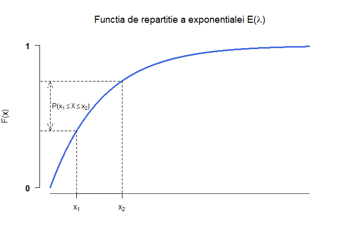

Media și varianța variabilei aleatoare $X$ repartizate exponențial de parametru $\lambda$ sunt egale cu

$$
  \mathbb{E}[X] = \frac{1}{\lambda},\quad Var(X) =  \frac{1}{\lambda^2}. 
$$

\BeginKnitrBlock{rmdexercise}<div class="rmdexercise">Arătați că momentul de ordin $k$, $k\geq 1$, al unei variabile aleatoare repartizate exponențial $X\sim\mathcal{E}(\lambda)$ este egal cu

$$
  \mathbb{E}[X^k] = \frac{k!}{\lambda^k}. 
$$

</div>\EndKnitrBlock{rmdexercise}

\BeginKnitrBlock{rmdinsight}<div class="rmdinsight">Fie $X$ o variabilă repartizată exponențial de parametru $\lambda$. Atunci are loc următoarea proprietate numită și *lipsa de memorie*: 

$$
      \mathbb{P}(X>s+t|X>s) = \mathbb{P}(X>t),\quad \forall s,t \geq 0. 
$$
  
Mai mult, dacă o variabilă aleatoare continuă^[Pentru cazul discret avem variabila repartizată Geometric.] $X$ verifică proprietatea de mai sus atunci ea este repartizată exponențial.


</div>\EndKnitrBlock{rmdinsight}

Variabilele aleatoare repartizate exponențial sunt utilizate în modelarea fenomenelor care se desfășoară în timp continuu și care satisfac (aproximativ) proprietatea lipsei de memorie: de exemplu timpul de așteptare la un ghișeu, durata de viață a unui bec sau timpul până la următoarea convorbire telefonică.

În R putem să

  - generăm observații independente din repartiția $\mathcal{E}(\lambda)$ (e.g. $\lambda = 5$)
  

```r
rexp(15, rate = 5)
 [1] 0.13505357 0.15392539 0.25036131 0.15351051 0.00878456 0.07362396
 [7] 0.07543271 0.18981181 0.05540771 0.05649451 0.15878039 0.39847262
[13] 0.05191221 0.07776034 0.22483594
```

  - calculăm densitatea unei variabile aleatoare repartizate exponențial $\mathcal{E}(\lambda)$ în diferite puncte
  

```r
dexp(seq(0, 5, length.out = 20), rate = 5)
 [1] 5.000000e+00 1.341312e+00 3.598237e-01 9.652719e-02 2.589462e-02
 [6] 6.946555e-03 1.863500e-03 4.999070e-04 1.341063e-04 3.597568e-05
[11] 9.650925e-06 2.588981e-06 6.945263e-07 1.863153e-07 4.998141e-08
[16] 1.340814e-08 3.596899e-09 9.649130e-10 2.588499e-10 6.943972e-11
```

  - calculăm funcția de repartiție a unei variabile repartizate exponențial $\mathcal{E}(\lambda)$ pentru diferite valori
  

```r
pexp(seq(0, 5, length.out = 15), rate = 5)
 [1] 0.0000000 0.8323228 0.9718843 0.9952856 0.9992095 0.9998675 0.9999778
 [8] 0.9999963 0.9999994 0.9999999 1.0000000 1.0000000 1.0000000 1.0000000
[15] 1.0000000
```

  - calculăm cuantilele de ordin $\alpha\in(0,1)$ 
  

```r
qexp(c(0.01, 0.025, 0.05, 0.25, 0.5, 0.75, 0.95, 0.975, 0.99), rate = 5)
[1] 0.002010067 0.005063562 0.010258659 0.057536414 0.138629436 0.277258872
[7] 0.599146455 0.737775891 0.921034037
```

\BeginKnitrBlock{rmdexercise}<div class="rmdexercise">Fie $X$ o variabilă aleatoare repartizată $\mathcal{E}(\lambda)$. Pentru $\lambda \in \{0.5, 1.5, 5\}$ trasați pe același grafic densitățile repartițiilor exponențiale de parametru $\lambda$. Adăugați legendele corespunzătoare. Aceeași cerință pentru funcțiile de repartiție.

</div>\EndKnitrBlock{rmdexercise}

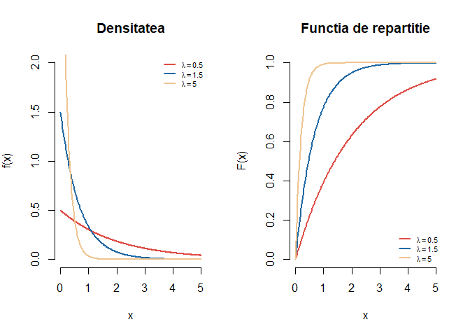

\BeginKnitrBlock{rmdexercise}<div class="rmdexercise">Folosind rezultatul de universalitate de la repartiția uniformă, descrieți o procedură prin care puteți simula o variabilă aleatoare repartizată exponențial $\mathcal{E}(\lambda)$ și construiți o funcție care permite generarea de $n$ observații independente dintr-o variabilă repartizată $X\sim \mathcal{E}(\lambda)$. 
</div>\EndKnitrBlock{rmdexercise}


\BeginKnitrBlock{rmdexercise}<div class="rmdexercise">Generați $250$ de observații din repartiția $\mathcal{E}(3)$, trasați histograma acestora și suprapuneți densitatea repartiției date (vezi figura de mai jos).

</div>\EndKnitrBlock{rmdexercise}

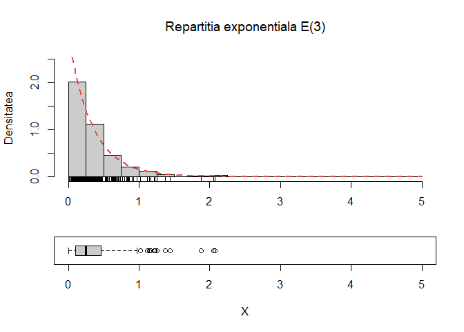


# Repartiția Cauchy

Spunem că o variabilă aleatoare $X$ este repartizată *Cauchy* de parametrii $(0, 1)$, și se notează cu $X\sim C(0,1)$, dacă densitatea ei are forma 

$$
  f_X(x) = \frac{1}{\pi} \frac{1}{1+x^2},\quad \forall x\in\mathbb{R}.
$$

Observăm că graficul densității repartiției Cauchy este asemănător cu cel al repartiției normale. Parametrul $M = 0$ reprezintă mediana (de fapt $\mathbb{P}(X\leq 0) = \mathbb{P}(X\geq 0) = \frac{1}{2}$) variabilei aleatoare $X$ și nu media iar prima și a treia cuartilă sunt $Q_1 = -1$ și respectiv $Q_3=1$ (avem $\mathbb{P}(X\leq -1) = \mathbb{P}(X\geq 1) = \frac{1}{4}$).  

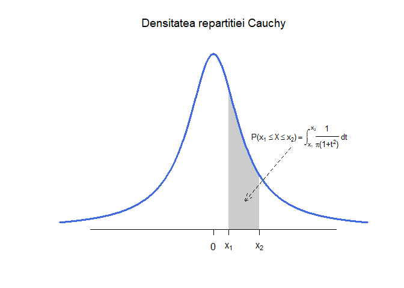

Funcția de repartiție a unei variabile aleatoare $X\sim C(0,1)$ este dată de 

$$
  F_{X}(x) = \frac{1}{2} + \frac{1}{\pi}\arctan(x), \quad x\in \mathbb{R}.
$$

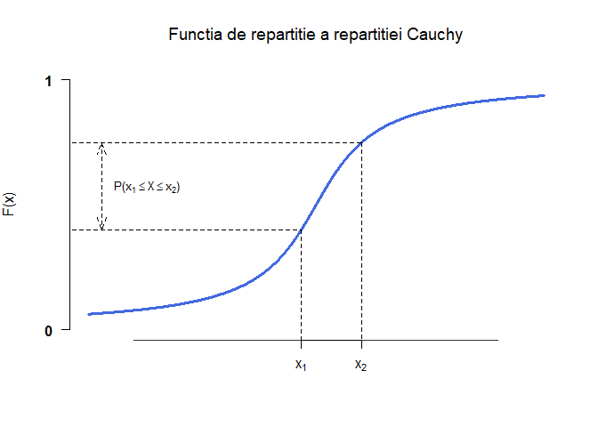

Media și varianța variabilei aleatoare $X\sim C(0,1)$ **nu există**. 

\BeginKnitrBlock{rmdexercise}<div class="rmdexercise">Arătați că o variabilă aleatoare repartizată Cauchy $C(0,1)$ nu are medie.  

</div>\EndKnitrBlock{rmdexercise}

Fie $Y\sim C(0,1)$ și $\alpha, \beta\in\mathbb{R}$ cu $\beta>0$. Spunem că variabila aleatoare $X = \alpha + \beta Y$ este repartizată Cauchy de parametrii $(\alpha, \beta)$, $X\sim C(\alpha, \beta)$. Densitatea ei este 

$$
  f_X(x) = \frac{1}{\pi\beta} \frac{1}{1+\left(\frac{x-\alpha}{\beta}\right)^2},\quad \forall x\in\mathbb{R}.
$$

Parametrii $\alpha$ și $\beta$ se interpretează în modul următor: $M = \alpha$ este mediana lui $X$ iar $Q_1 = \alpha-\beta$ și $Q_3 = \alpha + \beta$ reprezintă prima și a treia cuartilă.  

În R putem să

  - generăm observații independente din repartiția Cauchy $C(\alpha, \beta)$ (e.g. $\alpha = 0$, $\beta = 2$)
  

```r
rcauchy(15, location = 0, scale = 2)
 [1] -0.5966228  3.7627987  0.6864597 -0.4316018  1.4524446  0.3427032
 [7]  8.4285326  3.6056089  2.3506764 -3.5453329 -1.6137218 10.4304800
[13] -0.4449169  2.3005176 -3.6644199
```

  - calculăm densitatea unei variabile aleatoare repartizate Cauchy $C(\alpha, \beta)$ în diferite puncte
  

```r
dcauchy(seq(-5, 5, length.out = 20), location = 1, scale = 3)
 [1] 0.02122066 0.02450975 0.02852541 0.03345265 0.03951056 0.04693392
 [7] 0.05591721 0.06648594 0.07825871 0.09012539 0.10006665 0.10558334
[13] 0.10494052 0.09835367 0.08782920 0.07584810 0.06425529 0.05399054
[19] 0.04532934 0.03819719
```

  - calculăm funcția de repartiție a unei variabile repartizate Cauchy $C(\alpha, \beta)$ pentru diferite valori
  

```r
pcauchy(seq(-5, 5, length.out = 15), location = 1, scale = 3)
 [1] 0.1475836 0.1643213 0.1848605 0.2104166 0.2425988 0.2833834 0.3347507
 [8] 0.3975836 0.4697759 0.5451672 0.6158581 0.6764416 0.7255627 0.7644587
[15] 0.7951672
```

  - calculăm cuantilele de ordin $p\in(0,1)$ 
  

```r
qcauchy(c(0.01, 0.025, 0.05, 0.25, 0.5, 0.75, 0.95, 0.975, 0.99), location = 1, scale = 3)
[1] -94.46155 -37.11861 -17.94125  -2.00000   1.00000   4.00000  19.94125
[8]  39.11861  96.46155
```

\BeginKnitrBlock{rmdexercise}<div class="rmdexercise">Generați $2500$ de observații din repartiția Cauchy, trasați histograma acestora și suprapuneți densitatea repartiției date pentru intervalul $[-5,5]$ (vezi figura de mai jos).

</div>\EndKnitrBlock{rmdexercise}

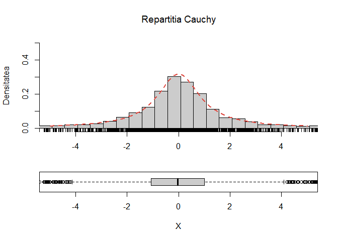

\BeginKnitrBlock{rmdexercise}<div class="rmdexercise">Fie $X$ și $Y$ două variabile aleatoare independente repartizate $\mathcal{N}(0,1)$. Arătați că variabila aleatoare $\frac{X}{Y}$ este repartizată Cauchy $C(0,1)$.

</div>\EndKnitrBlock{rmdexercise}

\BeginKnitrBlock{rmdexercise}<div class="rmdexercise">Fie $X$ o variabilă aleatoare repartizată Cauchy $C(\alpha, \beta)$. Pentru fiecare pereche de parametrii $(\alpha, \beta)$ din mulțimea $\{(0,0.5), (0, 1), (0, 2), (-1, 1.5), (-2, 1)\}$ trasați pe același grafic densitățile repartițiilor Cauchy cu parametrii $(\alpha, \beta)$. Adăugați legendele corespunzătoare. Aceeași cerință pentru funcțiile de repartiție.

</div>\EndKnitrBlock{rmdexercise}

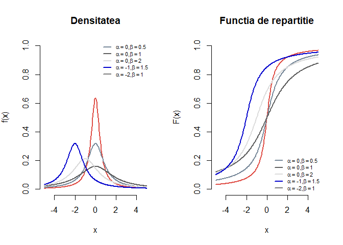

\BeginKnitrBlock{rmdexercise}<div class="rmdexercise">Folosind rezultatul de universalitate de la repartiția uniformă, descrieți o procedură prin care puteți simula o variabilă aleatoare repartizată Cauchy $C(0,1)$ și construiți o funcție care permite generarea de $n$ observații independente dintr-o variabilă repartizată $X\sim C(\alpha, \beta)$. Verificați pentru parametrii $\alpha = 3$ și $\beta = 5$ (a se vedea figura de mai jos).

</div>\EndKnitrBlock{rmdexercise}

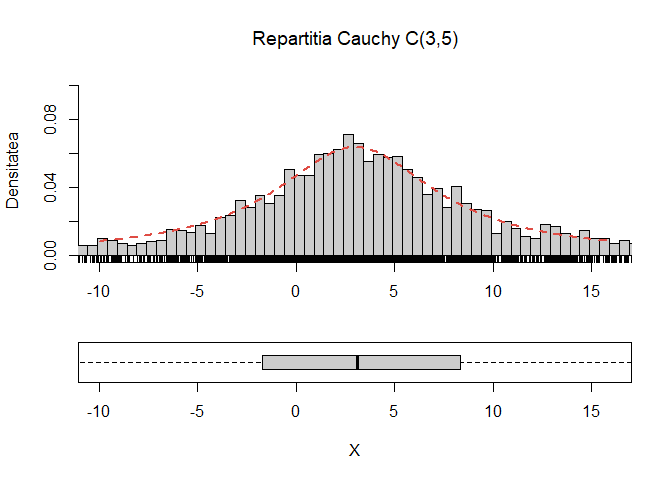

# Repartiția Gama

Spunem că o variabilă aleatoare $X$ este repartizată *Gama* de parametrii $(\alpha, \beta)$, cu $\alpha, \beta > 0$, și se notează cu $X\sim \Gamma(\alpha,\beta)$, dacă densitatea ei are forma 

$$
  f_X(x) = \frac{\beta^{\alpha}}{\Gamma(\alpha)} x^{\alpha-1} e^{-\beta x},\quad \forall x>0.
$$

unde $\Gamma(\alpha)$ este funcția (Gama, numită și integrală Euler de al doilea tip) definită prin 

$$
  \Gamma(\alpha) = \int_{0}^{\infty}x^{\alpha-1} e^{- x}\,dx,\quad \forall \alpha>0.
$$

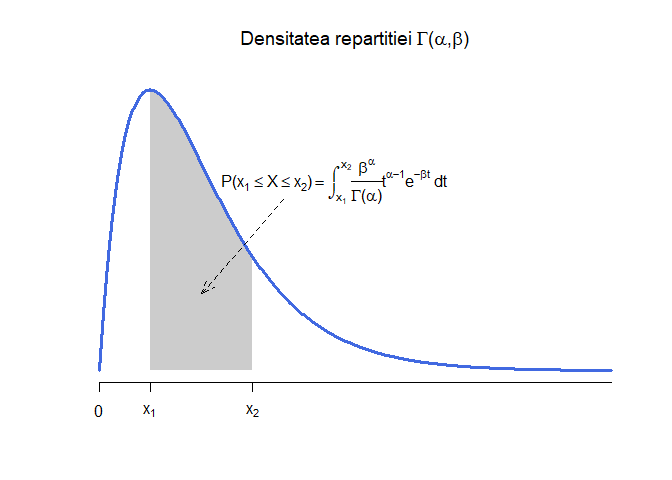


\BeginKnitrBlock{rmdexercise}<div class="rmdexercise">Arătați că funcția $\Gamma(\alpha)$ verifică^[Pentru mai multe proprietăți puteți consulta lucrarea lui E. Artin [The Gamma Function](http://plouffe.fr/simon/math/Artin%20E.%20The%20Gamma%20Function%20(1931)(23s).pdf)]:

\begin{itemize}
  \item[1)] $\Gamma(1)=1$
  \item[2)] $\Gamma(\alpha+1) = \alpha\Gamma(\alpha), \quad \forall \alpha>0$
  \item[3)] $\Gamma(\alpha) = \beta^{\alpha}\int_{0}^{\infty}x^{\alpha-1} e^{- \beta x}\,dx,\quad \forall \alpha, \beta>0$
  \item[4)] $\Gamma(n) = (n-1)!,\quad n = 1,2,\cdots$
  \item[5)] $\Gamma(1/2) = \sqrt{\pi}$
\end{itemize}

</div>\EndKnitrBlock{rmdexercise}

Funcția de repartiție a unei variabile aleatoare $X\sim \Gamma(\alpha, \beta)$ este dată de 

$$
  F_{X}(x) = \int_{-\infty}^{x}f_X(t)\,dt = \frac{\beta^{\alpha}}{\Gamma(\alpha)}\int_{-\infty}^{x} t^{\alpha-1} e^{-\beta t}\,dt
$$

și nu are o formulă explicită de calcul. 

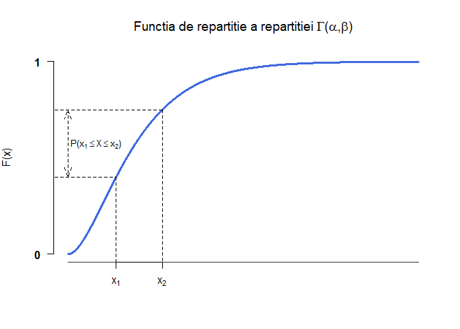

Observăm că repartiția $\Gamma(1, \lambda)$ coincide cu repartiția $\mathcal{E}(\lambda)$. 

Media și varianța variabilei aleatoare $X$ repartizate Gama de parametrii $\Gamma(\alpha, \beta)$ sunt egale cu

$$
  \mathbb{E}[X] = \frac{\alpha}{\beta},\quad Var(X) = \frac{\alpha}{\beta^2}.
$$


\BeginKnitrBlock{rmdexercise}<div class="rmdexercise">Arătați că media și varianța unei variabile aleatoare repartizate Gama de parametrii $\alpha$ și $\beta$ sunt egale cu

$$
  \mathbb{E}[X] = \frac{\alpha}{\beta},\quad Var(X) = \frac{\alpha}{\beta^2}. 
$$

</div>\EndKnitrBlock{rmdexercise}

În R putem să

  - generăm observații independente din repartiția $\Gamma(\alpha, \beta)$ (e.g. $\alpha = 2$, $\beta = 2$)
  

```r
rgamma(15, shape = 2, rate = 2)
 [1] 0.6207897 1.6546379 0.4210210 0.8476985 0.2928765 0.6798413 1.1393160
 [8] 1.0763898 1.4411221 0.9500644 0.7387296 0.4159926 0.8942659 0.8366199
[15] 0.9733579
```

  - calculăm densitatea unei variabile aleatoare repartizate $\Gamma(\alpha, \beta)$ în diferite puncte
  

```r
dgamma(seq(0, 5, length.out = 20), shape = 1, rate = 3)
 [1] 3.000000e+00 1.362251e+00 6.185761e-01 2.808853e-01 1.275455e-01
 [6] 5.791632e-02 2.629886e-02 1.194188e-02 5.422615e-03 2.462321e-03
[11] 1.118100e-03 5.077110e-04 2.305433e-04 1.046860e-04 4.753619e-05
[16] 2.158541e-05 9.801583e-06 4.450739e-06 2.021008e-06 9.177070e-07
```

  - calculăm funcția de repartiție a unei variabile repartizate $\Gamma(\alpha, \beta)$ pentru diferite valori
  

```r
pgamma(seq(0, 5, length.out = 15), shape = 1, rate = 3)
 [1] 0.0000000 0.6574811 0.8826808 0.9598160 0.9862362 0.9952856 0.9983852
 [8] 0.9994469 0.9998106 0.9999351 0.9999778 0.9999924 0.9999974 0.9999991
[15] 0.9999997
```

  - calculăm cuantilele de ordin $p\in(0,1)$ 
  

```r
qgamma(c(0.01, 0.025, 0.05, 0.25, 0.5, 0.75, 0.95, 0.975, 0.99), shape = 1, rate = 3)
[1] 0.003350112 0.008439269 0.017097765 0.095894024 0.231049060 0.462098120
[7] 0.998577425 1.229626485 1.535056729
```

\BeginKnitrBlock{rmdexercise}<div class="rmdexercise">Fie $X$ o variabilă aleatoare repartizată $\Gamma(\alpha, \beta)$. Pentru fiecare pereche de parametrii $(\alpha, \beta)$ din mulțimea $\{(1,0.5), (2, 0.5), (3, 0.5), (5, 1), (9, 0.5), (7.5, 1), (0.5, 1) \}$ trasați pe același grafic densitățile repartițiilor Gama cu parametrii $(\alpha, \beta)$. Adăugați legendele corespunzătoare. Aceeași cerință pentru funcțiile de repartiție.

</div>\EndKnitrBlock{rmdexercise}

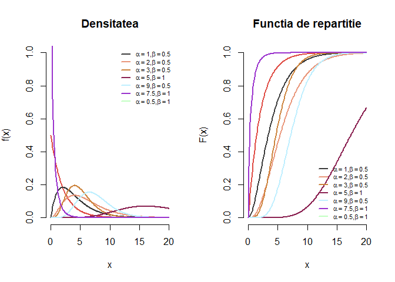

\BeginKnitrBlock{rmdexercise}<div class="rmdexercise">Generați $250$ de observații din repartiția $\Gamma(9,2)$, trasați histograma acestora și suprapuneți densitatea repartiției date (vezi figura de mai jos).

</div>\EndKnitrBlock{rmdexercise}

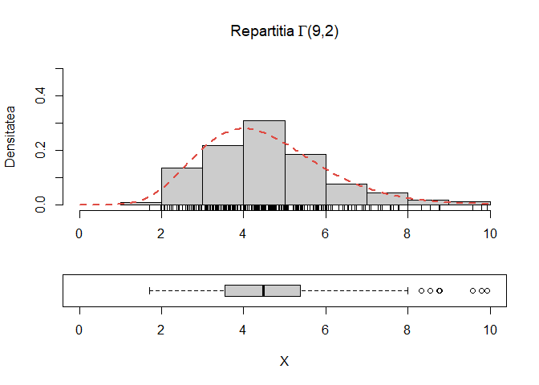

# Repartiția Beta

Spunem că o variabilă aleatoare $X$ este repartizată *Beta* de parametrii $(\alpha, \beta)$, cu $\alpha, \beta > 0$, și se notează cu $X\sim B(\alpha,\beta)$, dacă densitatea ei are forma 

$$
  f_X(x) = \frac{1}{B(\alpha, \beta)} x^{\alpha-1} (1-x)^{\beta-1},\quad 0\leq x\leq 1.
$$
unde $B(\alpha, \beta)$ este funcția (Beta, numită și integrală Euler de primul tip) definită prin 

$$
  B(\alpha, \beta) = \int_{0}^{\infty}x^{\alpha-1} (1-x)^{\beta-1}\,dx,\quad \forall \alpha, \beta >0.
$$

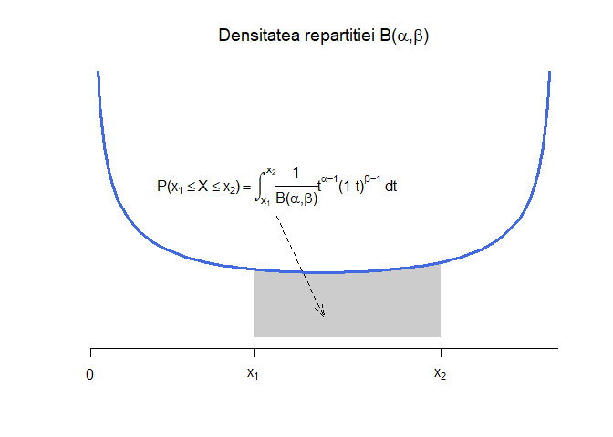

\BeginKnitrBlock{rmdexercise}<div class="rmdexercise">Arătați că funcția Beta $B(\alpha, \beta)$ verifică următoarele proprietăți:

  1) $B(\alpha, \beta) = \frac{\Gamma(\alpha)\Gamma(\beta)}{\Gamma(\alpha+\beta)}$
  2) $B(\alpha, \beta) = B(\beta, \alpha)$
  3) $B(\alpha, \beta) = B(\alpha, \beta+1) + B(\alpha+1, \beta)$
  4) $B(\alpha + 1, \beta) = B(\alpha, \beta) \frac{\alpha}{\alpha+\beta}$ și $B(\alpha, \beta + 1) = B(\alpha, \beta) \frac{\beta}{\alpha+\beta}$.

</div>\EndKnitrBlock{rmdexercise}

Funcția de repartiție a unei variabile aleatoare $X\sim B(\alpha, \beta)$ este dată de 

$$
  F_{X}(x) = \int_{-\infty}^{x}f_X(t)\,dt = \frac{1}{B(\alpha, \beta)} \int_{-\infty}^{x} t^{\alpha-1} (1-t)^{\beta-1}\,dt
$$

și nu are o formulă explicită de calcul. 

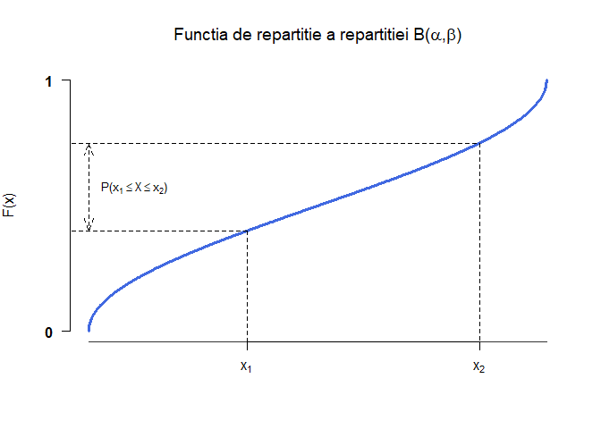

Observăm că repartiția $B(1, 1)$ coincide cu repartiția $\mathcal{U}([0,1])$. 

Media și varianța variabilei aleatoare $X$ repartizate Gamma de parametrii $B(\alpha, \beta)$ sunt egale cu

$$
  \mathbb{E}[X] = \frac{\alpha}{\alpha+\beta},\quad Var(X) = \frac{\alpha\beta}{(\alpha+\beta)^2(\alpha+\beta+1)}.
$$

Observăm că $Var(X)\leq\mathbb{E}[X](1-\mathbb{E}[X])$.

\BeginKnitrBlock{rmdexercise}<div class="rmdexercise">Arătați că media și varianța unei variabile aleatoare repartizate Beta de parametrii $\alpha$ și $\beta$ sunt egale cu

$$
  \mathbb{E}[X] = \frac{\alpha}{\alpha+\beta},\quad Var(X) = \frac{\alpha\beta}{(\alpha+\beta)^2(\alpha+\beta+1)}. 
$$

</div>\EndKnitrBlock{rmdexercise}

În R putem să

  - generăm observații independente din repartiția $B(\alpha, \beta)$ (e.g. $\alpha = 2.5$, $\beta = 1$)
  

```r
rbeta(15, shape1 = 2.5, shape2 = 1)
 [1] 0.7945436 0.7609136 0.9265073 0.9309420 0.5621874 0.3664261 0.9694945
 [8] 0.5804873 0.9504669 0.9115169 0.8457509 0.6717780 0.7213322 0.9738473
[15] 0.9791769
```

  - calculăm densitatea unei variabile aleatoare repartizate $B(\alpha, \beta)$ în diferite puncte
  

```r
dbeta(seq(0, 1, length.out = 20), shape1 = 1, shape2 = 3)
 [1] 3.000000000 2.692520776 2.401662050 2.127423823 1.869806094 1.628808864
 [7] 1.404432133 1.196675900 1.005540166 0.831024931 0.673130194 0.531855956
[13] 0.407202216 0.299168975 0.207756233 0.132963989 0.074792244 0.033240997
[19] 0.008310249 0.000000000
```

  - calculăm funcția de repartiție a unei variabile repartizate $B(\alpha, \beta)$ pentru diferite valori
  

```r
pbeta(seq(0, 1, length.out = 15), shape1 = 1, shape2 = 3)
 [1] 0.0000000 0.1993440 0.3702624 0.5149417 0.6355685 0.7343294 0.8134111
 [8] 0.8750000 0.9212828 0.9544461 0.9766764 0.9901603 0.9970845 0.9996356
[15] 1.0000000
```

  - calculăm cuantilele de ordin $p\in(0,1)$ 
  

```r
qbeta(c(0.01, 0.025, 0.05, 0.25, 0.5, 0.75, 0.95, 0.975, 0.99), shape1 = 1, shape2 = 3)
[1] 0.003344507 0.008403759 0.016952428 0.091439704 0.206299474 0.370039475
[7] 0.631596850 0.707598226 0.784556531
```

\BeginKnitrBlock{rmdexercise}<div class="rmdexercise">Fie $X$ o variabilă aleatoare repartizată $B(\alpha, \beta)$. Pentru fiecare pereche de parametrii $(\alpha, \beta)$ din mulțimea $\{(0.5,0.5), (1, 3), (5, 1), (2, 2), (2, 5)\}$ trasați pe același grafic densitățile repartițiilor Beta cu parametrii $(\alpha, \beta)$. Adăugați legendele corespunzătoare. Aceeași cerință pentru funcțiile de repartiție.

</div>\EndKnitrBlock{rmdexercise}

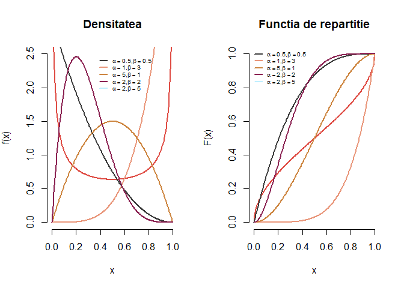

\BeginKnitrBlock{rmdexercise}<div class="rmdexercise">Generați $250$ de observații din repartiția $B(3,3)$, trasați histograma acestora și suprapuneți densitatea repartiției date (vezi figura de mai jos).

</div>\EndKnitrBlock{rmdexercise}

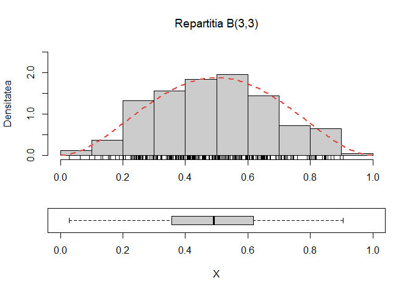


