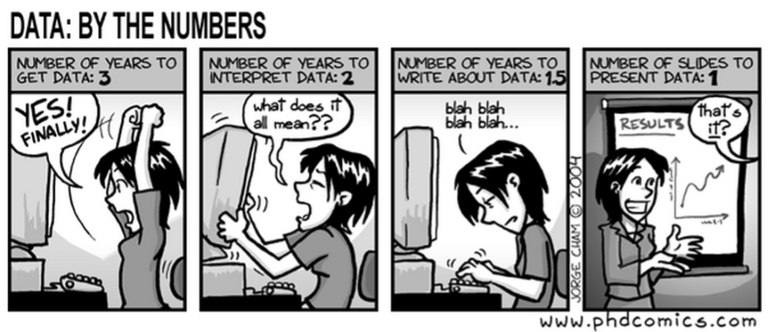

<script>
$(document).ready(function ()  {

    // move toc-ignore selectors from section div to header
    $('div.section.toc-ignore')
        .removeClass('toc-ignore')
        .children('h1,h2,h3,h4,h5').addClass('toc-ignore');

    // establish options
    var options = {
      selectors: "h1,h2,h3",
      theme: "bootstrap3",
      context: '.toc-content',
      hashGenerator: function (text) {
        return text.replace(/[.\\/?&!#<>]/g, '').replace(/\s/g, '_').toLowerCase();
      },
      ignoreSelector: ".toc-ignore",
      scrollTo: 155
    };
    options.showAndHide = false;
    options.smoothScroll = true;

    // tocify
    var toc = $("#TOC").tocify(options).data("toc-tocify");
});
</script>

<script type="text/javascript">
	$(document).ready(function(){
		$("#myModal").modal('show');
	});
</script>

```{r setup, include=FALSE}
knitr::opts_chunk$set(echo = TRUE)
```

```{r echo=FALSE, include=FALSE}
library(knitr)
library(kableExtra)
library(DT)
library(tidyverse)
```

## Informații generale
***

Acest curs reprezintă o introducere în modelele de regresie.  

```{r, fig.align='center', out.width="80%", echo=FALSE}

```

## Informații de contact 
***

### Curs 

 *  _Instructor_ : [Alexandru Amărioarei](https://alexamarioarei.github.io/)

 *  _Email_ : alexandru [dot] amarioarei [at] fmi [dot] unibuc [dot] ro


### Seminar/Laborator

 *  _Instructori_ : [Alexandru Amărioarei](https://alexamarioarei.github.io/) și Simona Cojocea

 *  _Email_ : alexandru [dot] amarioarei [at] fmi [dot] unibuc [dot] ro
 
## Note de curs 
***

Mai jos veți regăsiți o parte din notele de curs: 


```{r echo = FALSE}
curs1 = "[HTML](Notite curs/IntroSimpleReg.html)"
pdf_curs1 = "[PDF](Notite curs/IntroSimpleReg.pdf)"

curs2 = "[HTML](Notite curs/IntroMultipleReg_web.html)"
pdf_curs2 = "[PDF](Notite curs/IntroMultipleReg.pdf)"


tabLab = data.frame(Nr = c(1, 2),
                    Lab = c("Regresia liniara simpla", "Regresia liniara multipla"),
                    Htmls = c(curs1, curs2),
                    Pdfs = c(pdf_curs1, pdf_curs2))


kableExtra::kable(tabLab, 
      col.names = c("Nr", "Note de curs", "HTML", "PDFs"),
      align = "clcc", 
      booktabs = TRUE) %>% 
  kable_styling(bootstrap_options = c("striped", "hover", "condensed", "responsive"))
```


## Note de laborator 
***

Mai jos regăsiți o parte din laboratoarele cursului: 


```{r echo = FALSE}
lab1 = "[HTML](Laboratoare/Intro_R.html)"
pdf_lab1 = "[PDF](Laboratoare/Intro_R_tex.pdf)"

lab2 = "[HTML](Laboratoare/Intro_Tidyverse.html)"
pdf_lab2 = "[PDF](Laboratoare/Intro_Tidyverse.pdf)"

lab3 = "[HTML](Laboratoare/Intro_ggplot.html)"
pdf_lab3 = "[PDF](Laboratoare/Intro_ggplot.pdf)"

lab4 = "[HTML](Laboratoare/LabSimpleReg.html)"
pdf_lab4 = "[PDF](Laboratoare/LabSimpleReg.pdf)"

tabLab = data.frame(Nr = c(1,
                           2,
                           3,
                           4),
                    Lab = c("Introducere in R", 
                            "Laborator manipulare date", 
                            "Laborator vizualizare date",
                            "Laborator regresie liniara simpla"),
                    Htmls = c(lab1, 
                              lab2, 
                              lab3,
                              lab4),
                    Pdfs = c(pdf_lab1, 
                             pdf_lab2,
                             pdf_lab3,
                             pdf_lab4))


kableExtra::kable(tabLab, 
      col.names = c("Nr", "Laborator", "HTML", "PDFs"),
      align = "clcc", 
      booktabs = TRUE) %>% 
  kable_styling(bootstrap_options = c("striped", "hover", "condensed", "responsive"))
```

## Notarea și promovarea
***

Notarea se va face prin prezentarea unui proiect final care să dovedească însușirea noțiunilor prezentate la curs. 

## Bibliografie
***

  1. George Seber, Alan Lee - *Linear Regression Analysis*, Wiley, 2003
  2. Ashish Sen, Muni Srivastava - *Regression Analysis -  Theory, methods and applications*, Springer, 1990
  3. Virgil Craiu - *Statistică Matematică*, Ed. Univ. Buc., 1997
  4. Monica Dumitrescu, Anton Batatorescu - *Applied statistics using the R system*, Ed. Univ. Buc., 2006
  5. George Casella, Roger Berger - *Statistical Inference*, Duxbury, 2002
  6. George Roussas - *A Course in Mathematical Statistics*, Academic Press, 1997

## Link-uri utile
***

### R
  1. Programul R - [CRAN](https://cran.r-project.org/)
  2. Interfața grafică [RStudio](https://www.rstudio.com/)
  3. Documentație R (în engleză) - [R-Intro](https://cran.r-project.org/doc/manuals/r-release/R-intro.pdf)
  4. Documentație R (în română) - [R pentru începători ](ftp://cran.r-project.org/pub/R/doc/contrib/Paradis-rdebuts_RO.pdf)
  5. Documentație R (în română) - [Inițiere în R pentru persoane cu pregătire matematică ](http://www.edumanager.ro/community/documente/initiere_in_r.pdf)
  
### Latex
  1. Introducere în Latex (în romană) - [Manual Wikibooks](https://ro.wikibooks.org/wiki/LaTeX_(carte))
  2. Introducere în Latex (în engleză) - [Wikibooks Latex Manual](https://en.wikibooks.org/wiki/LaTeX) în special secțiunile de [matematică](https://en.wikibooks.org/wiki/LaTeX/Mathematics), [liste](https://en.wikibooks.org/wiki/LaTeX/List_Structures), [grafice](https://en.wikibooks.org/wiki/LaTeX/Importing_Graphics) și [figuri](https://en.wikibooks.org/wiki/LaTeX/Floats,_Figures_and_Captions)
  3. Tutoriale Latex (în engleză) - [video](https://www.youtube.com/playlist?list=PLDD406480D35CE390)
  4. Editoarele: [Texmaker](http://www.xm1math.net/texmaker/download.html) și [TeXnicCenter](http://www.texniccenter.org/) 
  5. Mediul latex [MiKTeX](https://miktex.org/)

### Rmarkdown
  1. Pachetul [Rmarkdown](http://rmarkdown.rstudio.com/index.html) pentru documente reproductibile
