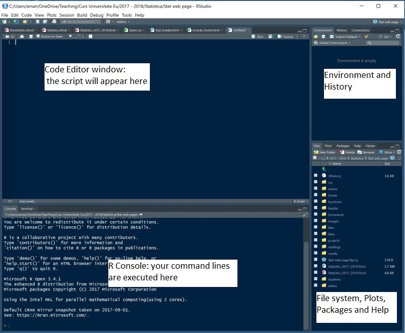
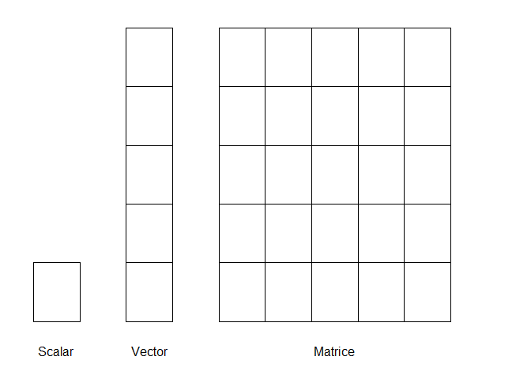

<script>
$(document).ready(function ()  {

    // move toc-ignore selectors from section div to header
    $('div.section.toc-ignore')
        .removeClass('toc-ignore')
        .children('h1,h2,h3,h4,h5').addClass('toc-ignore');

    // establish options
    var options = {
      selectors: "h1,h2,h3",
      theme: "bootstrap3",
      context: '.toc-content',
      hashGenerator: function (text) {
        return text.replace(/[.\\/?&!#<>]/g, '').replace(/\s/g, '_').toLowerCase();
      },
      ignoreSelector: ".toc-ignore",
      scrollTo: 60
    };
    options.showAndHide = false;
    options.smoothScroll = true;

    // tocify
    var toc = $("#TOC").tocify(options).data("toc-tocify");
});
</script>

Obiectivul acestui laborator este de a prezenta o scurtă introducere în programul [R](https://cran.r-project.org/) (cu ajutorul interfeței grafice [RStudio](https://www.rstudio.com/)). O descriere detaliată a acestui program precum și versiunile disponibile pentru descărcat se găsesc pe site-ul [`www.r-project.org`](http://www.r-project.org). Pentru mai multe detalii se pot consulta [@Davies2016, @Matloff2011].


# Introducere 

Programul `R` este un program **gratuit** destinat, cu precădere, analizei statistice și prezintă o serie de avantaje:

  * rulează aproape pe toate platformele și sistemele de operare 
  * permite folosirea metodelor statistice clasice cu ajutorul unor funcții predefinite
  * este adoptat ca limbaj de analiză statistică în majoritatea domeniilor aplicate
  * prezintă capabilități grafice deosebite
  * permite utilizarea tehnicilor statistice de ultimă oră prin intermediul pachetelor dezvoltate de comunitate (în prezent sunt mai mult de 10000 de pachete) 
  * are o comunitate foarte activă și în continuă creștere 
  
<div class="figure" style="text-align: center">

<p class="caption">Figura 1. Numarul de pachete din R</p>
</div>

## Interfața `RStudio`

Interfața RStudio (vezi Figura 1) este compusă din patru ferestre:

  - *Fereastra de editare* (stânga sus): în această fereastră apar fișierele, de tip `script`, în care utilizatorul dezvoltă propriile funcții ori script-uri.  
  - *Fereastra de comandă* sau *consola* (stânga jos): în această fereastră sunt executate comenzile R
  - *Fereastra cu spațiul de lucru/istoricul* (dreapta sus): conține obiectele definite în memorie și istoricul comenzilor folosite
  - *Fereastra de explorare* (dreapta jos): în această fereastră ne putem deplasa în interiorul repertoriului (tab-ul *Files*), putem vedea graficele trasate (tab-ul *Plots*) dar și pachetele instalate (tab-ul *Packages*). De asemenea, tot în această fereastră putem să și căutăm documentația despre diferite funcții, folosind fereastra de ajutor (tab-ul *Help*).
  
<div class="figure" style="text-align: center">

<p class="caption">Figura 2. Interfata RStudio</p>
</div>

## Pachetele ajutătoare

Pe lângă diferitele pachete conținute în versiunea de bază a programului `R` se mai pot instala și pachete suplimentare. Pentru a instala un pachet suplimentar se apelează comanda:


```r
install.packages("nume pachet")
```

Odată ce pachetul este instalat, pentru a încărca pachetul, și prin urmare funcțiile disponibile în acesta, se apelează comanda:


```r
library("nume pachet")
```

Instalarea unui pachet se face o singură dată dar încărcarea acestuia trebuie făcută de fiecare dată când lansăm o sesiune nouă.

# Primele comenzi în `R`

## Calcul elementar 

Programul `R` poate fi folosit și pe post de calculator (mai avansat). De exemplu putem face calcule elementare 


```r
5 - 1 + 10
[1] 14
7 * 10 / 2
[1] 35
exp(-2.19)
[1] 0.1119167
pi
[1] 3.141593
sin(2 * pi/3)
[1] 0.8660254
```

De asemenea, rezultatele pot fi stocate într-o variabilă 


```r
a = (1+sqrt(5)/2)/2
```

păstrată în memorie (`a` apare în fereastra de lucru -  `Environment`) și care poate fi reutilizată ulterior


```r
asq = sqrt(a)
asq
[1] 1.029086
```

Operațiile binare în `R` sunt date în tabelul de mai jos:


| Operatorul | Descriere |
|:-------------------|:---------------------------------------------|
| `+` | Adunare |
| `-` | Scădere |
| `*` | Înmulțire |
| `/` | Împărțire |
| `^` or `**` | Exponențiere |
| `%/%` | Câtul împărțirii |
| `%%` | Restul împărțirii | 

Table: Tabelul 1. Operatii binare in R

Pentru a șterge toate variabilele din memorie trebuie să folosim comanda următoare (funcția `ls()` listează numele obiectelor din memorie iar comanda `rm()` șterge obiectele; de asemenea se poate folosi și comanda `ls.str()` pentru a lista obiectele împreună cu o scurtă descriere a lor)


```r
ls.str()
rm(list = ls())
```

## Folosirea documentației

Funcția `help()` și operatorul de ajutor `?` ne permite accesul la paginile de documentația pentru funcțiile, seturile de date și alte obiecte din R. Pentru a accesa documentația pentru funcția standard `mean()` putem să folosim comanda `help(mean)` sau `?mean` în consolă. Pentru a accesa documentația unei funcții dintr-un pachet care nu este în prezent încărcat (dar este instalat) trebuie să adăugăm în plus numele pachetului, de exemplu `help(rlm, package = "MASS")` iar pentru a accesa documentația întregului pachet putem folosi comanda `help(package = "MASS")`. 

O altă funcție de căutare des utilizată, în special în situația în care nu știm cu exactitate numele obiectului pe care îl căutăm, este funcția `apropos()`. Aceasta permite căutarea obiectelor (inclusiv funcții), disponibile în pachetele încărcate în sesiunea curentă, după un șir de caractere specificat (se pot folosi și expresii regulate). De exemplu dacă apelăm `apropos("mean")` vom obține toate funcțiile care conțin șirul de caractere *mean*. 


```r
apropos("mean") # functii care contin mean
 [1] ".colMeans"      ".rowMeans"      "colMeans"       "kmeans"        
 [5] "mean"           "mean.Date"      "mean.default"   "mean.difftime" 
 [9] "mean.POSIXct"   "mean.POSIXlt"   "mean_cl_boot"   "mean_cl_normal"
[13] "mean_sdl"       "mean_se"        "rowMeans"       "weighted.mean" 

apropos("^mean") # functii care incep cu mean
 [1] "mean"           "mean.Date"      "mean.default"   "mean.difftime" 
 [5] "mean.POSIXct"   "mean.POSIXlt"   "mean_cl_boot"   "mean_cl_normal"
 [9] "mean_sdl"       "mean_se"       
```

Următorul tabel prezintă funcțiile de ajutor, cel mai des utilizate:

| Funcție | Acțiune |
|:-------------------|:------------------------|
| `help.start()`     | Modul de ajutor general |
| `help("nume")` sau `?nume` | Documentație privind funcția *nume* (ghilimelele sunt opționale) |
| `help.search(nume)` sau `??nume` | Caută sistemul de documentație pentru instanțe în care apare șirul de caractere *nume* |
| `example("nume")` | Exemple de utilizare ale funcției *nume* |
| `RSiteSearch("nume")` | Caută șirul de caractere *nume* în manualele online și în arhivă |
| `apropos("nume", mode = "functions")` | Listează toate funcțiile care conțin șirul *nume* în numele lor |
| `data()` | Listează toate seturile de date disponibile în pachetele încărcate |
| `vignette()` | Listează toate vinietele disponibile |
| `vignette("nume")` | Afișează vinietele corespunzătoare topicului *nume* |

Table: Tabelul 2. Functii folosite pentru ajutor


Documentații online:

| CheatSheet| Link|
|:------------------------|:------------------------------------------------|
| R de bază | [https://cran.r-project.org/doc/contrib/Short-refcard.pdf](https://cran.r-project.org/doc/contrib/Short-refcard.pdf)|
| Noțiuni de R avansat | [https://www.rstudio.com/wp-content/uploads/2016/02/advancedR.pdf](https://www.rstudio.com/wp-content/uploads/2016/02/advancedR.pdf)|
| Noțiuni de R de bază |  http://github.com/rstudio/cheatsheets/raw/master/base-r.pdf|
| Manipularea șirurilor de caractere |  https://github.com/rstudio/cheatsheets/raw/master/strings.pdf|
| Importarea datelor |  https://github.com/rstudio/cheatsheets/raw/master/data-import.pdf|
| Transformarea datelor | https://github.com/rstudio/cheatsheets/raw/master/data-import.pdf |
|RStudio| https://github.com/rstudio/cheatsheets/raw/master/rstudio-ide.pdf|
| Pachetul ggplot2 | https://github.com/rstudio/cheatsheets/raw/master/data-visualization-2.1.pdf|
| Pachetul RMarkdown| https://www.rstudio.com/wp-content/uploads/2015/03/rmarkdown-reference.pdf|

Table: Tabelul 3. O serie de link-uri utile

# Tipuri și structuri de date 

`R` are cinci tipuri de date principale (atomi), după cum urmează:

* **character**: `"a"`, `"swc"`
* **numeric**: `2`, `15.5`
* **integer**: `2L` (sufix-ul `L` îi spune R-ului să stocheze numărul ca pe un întreg)
* **logical**: `TRUE`, `FALSE`
* **complex**: `1+4i` (numere complexe)

R pune la dispoziție mai multe funcții cu ajutorul cărora se pot examina trăsăturile vectorilor sau a altor obiecte, cum ar fi de exemplu

* `class()` - ce tip de obiect este 
* `typeof()` - care este tipul de date al obiectului 
* `length()` - care este lungimea obiectului 
* `attributes()` - care sunt atributele obiectului (metadata)


```r
# Exemplu
x <- "curs probabilitati si statistica"
typeof(x)
[1] "character"
attributes(x)
NULL

y <- 1:10
y
 [1]  1  2  3  4  5  6  7  8  9 10
typeof(y)
[1] "integer"
length(y)
[1] 10

z <- as.numeric(y)
z
 [1]  1  2  3  4  5  6  7  8  9 10
typeof(z)
[1] "double"
```

În limbajul `R` regăsim mai multe __structuri de date__. Printre acestea enumerăm

* vectorii (structuri atomice)
* listele
* matricele
* data frame
* factori

## Scalari și vectori 

Cel mai de bază tip de obiect în R este vectorul. Una dintre regulile principale ale vectorilor este că aceștia pot conține numai obiecte de același tip, cu alte cuvinte putem avea doar vectori de tip caracter, numeric, logic, etc.. În cazul în care încercăm să combinăm diferite tipuri de date, acestea vor fi forțate la tipul cel mai flexibil. Tipurile de la cel mai puțin la cele mai flexibile sunt: logice, întregi, numerice și caractere.

### Metode de construcție a vectorilor

Putem crea vectori fără elemente (empty) cu ajutorul funcției `vector()`, modul default este *logical* dar acesta se poate schimba în funcție de necesitate.


```r
vector() # vector logic gol
logical(0)
vector("character", length = 5) # vector de caractere cu 5 elemente
[1] "" "" "" "" ""
character(5) # acelasi lucru dar in mod direct
[1] "" "" "" "" ""
numeric(5)   # vector numeric cu 5 elemente
[1] 0 0 0 0 0
logical(5)   # vector logic cu 5 elemente
[1] FALSE FALSE FALSE FALSE FALSE
```

Putem crea vectori specificând în mod direct conținutul acestora. Pentru aceasta folosim funcția `c()` de concatenare:


```r
x <- c(0.5, 0.6)       ## numeric
x <- c(TRUE, FALSE)    ## logical
x <- c(T, F)           ## logical
x <- c("a", "b", "c")  ## character
x <- 9:29              ## integer
x <- c(1+0i, 2+4i)     ## complex
```

Funcția poate fi folosită de asemenea și pentru (combinarea) adăugarea de elemente la un vector 


```r
z <- c("Sandra", "Traian", "Ionel")
z <- c(z, "Ana")
z
[1] "Sandra" "Traian" "Ionel"  "Ana"   
z <- c("George", z)
z
[1] "George" "Sandra" "Traian" "Ionel"  "Ana"   
```

O altă funcție des folosită în crearea vectorilor, în special a celor care au repetiții, este funcția `rep()`. Pentru a vedea documentația acestei funcții apelați `help(rep)`. De exemplu, pentru a crea un vector de lungime `5` cu elemente de `0` este suficient să scriem 


```r
rep(0, 5)
[1] 0 0 0 0 0
```

Dacă în plus vrem să creăm vectorul 1, 2, 3, 1, 2, 3, 1, 2, 3, 1, 2, 3, 1, 2, 3 sau 1, 1, 1, 1, 1, 2, 2, 2, 2, 2, 3, 3, 3, 3, 3 atunci 


```r
rep(c(1,2,3), 5)
 [1] 1 2 3 1 2 3 1 2 3 1 2 3 1 2 3

rep(c(1,2,3), each = 5)
 [1] 1 1 1 1 1 2 2 2 2 2 3 3 3 3 3
```

Ce se întâmplă dacă apelăm `rep(c(1,2,3), 1:3)` ?

În cazul în care vrem să creăm un vector care are elementele egal depărtate între ele, de exemplu 1.3, 2.3, 3.3, 4.3, 5.3, atunci putem folosi funcția `seq()`:


```r
seq(1, 10, 1)
 [1]  1  2  3  4  5  6  7  8  9 10
1:10 # acelasi rezultat
 [1]  1  2  3  4  5  6  7  8  9 10

seq(1, 10, length.out = 15)
 [1]  1.000000  1.642857  2.285714  2.928571  3.571429  4.214286  4.857143
 [8]  5.500000  6.142857  6.785714  7.428571  8.071429  8.714286  9.357143
[15] 10.000000
```


| Function| Example|Result |
|:-------------------------|:-----------------------------|:----------|
|     `c(a, b, ...)`|    `c(1, 5, 9)` |1, 5, 9     |
|     `a:b`|    `1:5`|1, 2, 3, 4, 5    |
|     `seq(from, to, by, length.out)`|    `seq(from = 0, to = 6, by = 2)`|0, 2, 4, 6     |
|     `rep(x, times, each, length.out)`|    `rep(c(7, 8), times = 2, each = 2)`|7, 7, 8, 8, 7, 7, 8, 8     |

Table: Tabelul 4. Functii utile pentru crearea unui vector

### Operații cu vectori 

Operațiile elementare pe care le puteam face cu scalari (adunarea `+`, scăderea `-`, înmulțirea `*`, împărțirea `/` și ridicarea la putere `^`) putem să le facem și cu vectori (între vectori sau între vectori și scalari).  


```r
a = 1:4
b = c(5,5,6,7)

a+b  # adunarea 
[1]  6  7  9 11
a+10 # adunarea cu scalari
[1] 11 12 13 14

a-b  # scaderea
[1] -4 -3 -3 -3
a-15 # scaderea cu scalari
[1] -14 -13 -12 -11

a*b # inmultirea
[1]  5 10 18 28
a*3 # inmultirea cu scalari
[1]  3  6  9 12

a/b # impartirea
[1] 0.2000000 0.4000000 0.5000000 0.5714286
a/100 # impartirea la scalari
[1] 0.01 0.02 0.03 0.04

a^b # ridicarea la putere
[1]     1    32   729 16384
a^7 # ridicarea la putere cu scalari
[1]     1   128  2187 16384
```

Observăm că atunci când facem o operație cu scalar, se aplică scalarul la fiecare element al vectorului. 

Funcțiile elementare, `exp()`, `log()`, `sin()`, `cos()`, `tan()`, `asin()`, `acos()`, `atan()`, etc. sunt funcții vectoriale în R, prin urmare pot fi aplicate unor vectori.


```r
x = seq(0, 2*pi, length.out = 20)

exp(x)
 [1]   1.000000   1.391934   1.937480   2.696843   3.753827   5.225078
 [7]   7.272963  10.123483  14.091217  19.614041  27.301445  38.001803
[13]  52.895992  73.627716 102.484902 142.652193 198.562402 276.385707
[19] 384.710592 535.491656
sin(x)
 [1]  0.000000e+00  3.246995e-01  6.142127e-01  8.371665e-01  9.694003e-01
 [6]  9.965845e-01  9.157733e-01  7.357239e-01  4.759474e-01  1.645946e-01
[11] -1.645946e-01 -4.759474e-01 -7.357239e-01 -9.157733e-01 -9.965845e-01
[16] -9.694003e-01 -8.371665e-01 -6.142127e-01 -3.246995e-01 -2.449213e-16
tan(x)
 [1]  0.000000e+00  3.433004e-01  7.783312e-01  1.530614e+00  3.948911e+00
 [6] -1.206821e+01 -2.279770e+00 -1.086290e+00 -5.411729e-01 -1.668705e-01
[11]  1.668705e-01  5.411729e-01  1.086290e+00  2.279770e+00  1.206821e+01
[16] -3.948911e+00 -1.530614e+00 -7.783312e-01 -3.433004e-01 -2.449294e-16
atan(x)
 [1] 0.0000000 0.3193732 0.5843392 0.7814234 0.9234752 1.0268631 1.1039613
 [8] 1.1630183 1.2094043 1.2466533 1.2771443 1.3025194 1.3239406 1.3422495
[15] 1.3580684 1.3718664 1.3840031 1.3947585 1.4043537 1.4129651
```

Alte funcții utile des întâlnite în manipularea vectorilor numerici sunt: `min()`, `max()`, `sum()`, `mean()`, `sd()`, `length()`, `round()`, `ceiling()`, `floor()`, `%%` (operația modulo), `%/%` (div), `table()`, `unique()`. Pentru mai multe informații privind modul lor de întrebuințare apelați `help(nume_functie)` sau `?nume_functie`.


```r
length(x)
[1] 20
min(x)
[1] 0
sum(x)
[1] 62.83185
mean(x)
[1] 3.141593

round(x, digits = 4)
 [1] 0.0000 0.3307 0.6614 0.9921 1.3228 1.6535 1.9842 2.3149 2.6456 2.9762
[11] 3.3069 3.6376 3.9683 4.2990 4.6297 4.9604 5.2911 5.6218 5.9525 6.2832

y =  c("M", "M", "F", "F", "F", "M", "F", "M", "F")
unique(y)
[1] "M" "F"
table(y)
y
F M 
5 4 
```

### Metode de indexare a vectorilor

Sunt multe situațiile în care nu vrem să efectuăm operații pe întreg vectorul ci pe o submulțime de valori ale lui selecționate în funcție de anumite proprietăți. Putem, de exemplu, să ne dorim să accesăm al 2-lea element al vectorului sau toate elementele mai mari decât o anumită valoare. Pentru aceasta vom folosi operația de *indexare* folosind parantezele pătrate `[]`. 

În general, sunt două tehnici principale de indexare: indexarea numerică și indexarea logică. 

Atunci când folosim indexarea numerică, inserăm între parantezele pătrate un vector numeric ce corespunde elementelor pe care vrem să le accesăm sub forma `x[index]` (`x` este vectorul inițial iar `index` este vectorul de indici):  


```r
x = seq(1, 10, length.out = 21) # vectorul initial 

x[1] # accesam primul element
[1] 1
x[c(2,5,9)] # accesam elementul de pe pozitia 2, 5 si 9
[1] 1.45 2.80 4.60
x[4:10] # accesam toate elementele deintre pozitiile 4 si 9
[1] 2.35 2.80 3.25 3.70 4.15 4.60 5.05
```

Putem folosi orice vector de indici atât timp cât el conține numere întregi. Putem să accesăm elementele vectorului `x` și de mai multe ori:


```r
x[c(1,1,2,2)]
[1] 1.00 1.00 1.45 1.45
```

De asemenea dacă vrem să afișăm toate elementele mai puțin elementul de pe poziția `i` atunci putem folosi indexare cu numere negative (această metodă este folositoare și în cazul în care vrem să ștergem un element al vectorului):


```r
x[-5] # toate elementele mai putin cel de pe pozitia 5 
 [1]  1.00  1.45  1.90  2.35  3.25  3.70  4.15  4.60  5.05  5.50  5.95
[12]  6.40  6.85  7.30  7.75  8.20  8.65  9.10  9.55 10.00
x[-(1:3)] # toate elementele mai putin primele 3
 [1]  2.35  2.80  3.25  3.70  4.15  4.60  5.05  5.50  5.95  6.40  6.85
[12]  7.30  7.75  8.20  8.65  9.10  9.55 10.00
x = x[-10] # vectorul x fara elementul de pe pozitia a 10-a
```

A doua modilitate de indexare este cu ajutorul vectorilor logici. Atunci când indexăm cu un vector logic acesta trebuie să aibă aceeași lungime ca și vectorul pe care vrem să îl indexăm. 

Să presupunem că vrem să extragem din vectorul `x` doar elementele care verifică o anumită proprietate, spre exemplu sunt mai mari decât 3, atunci:


```r
x>3 # un vector logic care ne arata care elemente sunt mai mari decat 3
 [1] FALSE FALSE FALSE FALSE FALSE  TRUE  TRUE  TRUE  TRUE  TRUE  TRUE
[12]  TRUE  TRUE  TRUE  TRUE  TRUE  TRUE  TRUE  TRUE  TRUE
x[x>3] # elementele din x care sunt mai mari decat 3
 [1]  3.25  3.70  4.15  4.60  5.50  5.95  6.40  6.85  7.30  7.75  8.20
[12]  8.65  9.10  9.55 10.00
```

Pentru a determina care sunt toate elementele din `x` cuprinse între 5 și 19 putem să folosim operații cu operatori logici:


```r
x[(x>5)&(x<19)]
 [1]  5.50  5.95  6.40  6.85  7.30  7.75  8.20  8.65  9.10  9.55 10.00
```

O listă a operatorilor logici din R se găsește în tabelul următor:

| Operator | Descriere |
|:----------------|:----------------|
| `==` | Egal  |
| `!=` | Diferit |
| `<` | Mai mic |
| `<=` | Mai mic sau egal  |
| `>` | Mai mare |
| `>=` | Mai mare sau egal |
| `|` sau `||` | Sau (primul are valori vectoriale al doilea scalare) |
| `&` sau `&&` | Și (primul are valori vectoriale al doilea scalare) |
| `!` | Negație |
| `%in%` |  În mulțimea |

Table: Tabelul 5. Operatori logici


```r
x = seq(1,10,length.out = 8)
x == 3
[1] FALSE FALSE FALSE FALSE FALSE FALSE FALSE FALSE
x != 3
[1] TRUE TRUE TRUE TRUE TRUE TRUE TRUE TRUE
x <= 8.6
[1]  TRUE  TRUE  TRUE  TRUE  TRUE  TRUE FALSE FALSE
(x<8) & (x>2)
[1] FALSE  TRUE  TRUE  TRUE  TRUE  TRUE FALSE FALSE
(x<8) && (x>2)
[1] FALSE
(x<7) | (x>3)
[1] TRUE TRUE TRUE TRUE TRUE TRUE TRUE TRUE
(x<7) || (x>3)
[1] TRUE
x %in% c(1,9)
[1]  TRUE FALSE FALSE FALSE FALSE FALSE FALSE FALSE
```


\BeginKnitrBlock{rmdexercise}<div class="rmdexercise">Să presupunem că am înregistrat în fiecare zi, pe parcursul a 4 săptămâni (de Luni până Duminică), numărul de minute petrecute la telefonul mobil (convorbiri + utilizare) și am obținut următoarele valori: 106, 123, 123, 111, 125, 113, 130, 113, 114, 100, 120, 130, 118, 114, 127, 112, 121, 114, 120, 119, 127, 114, 108, 127, 131, 157, 102, 133. Ne întrebăm: care sunt zilele din săptămână în care am vorbit cel mai mult? dar cel mai puțin? dar zilele în care am vorbit mai mult de 120 de minute?
</div>\EndKnitrBlock{rmdexercise}


## Matrice

Matricele sunt structuri de date care extind vectorii și sunt folosite la representarea datelor de același tip în două dimensiuni. Matricele sunt similare tablourilor din Excel și pot fi văzute ca vectori cu două atribute suplimentare: numărul de linii (*rows*) și numărul de coloane (*columns*).


<div class="figure" style="text-align: center">

<p class="caption">Figura 3. Scalari, Vectori, Matrice</p>
</div>

Indexarea liniilor și a coloanelor pentru o matrice începe cu 1. De exemplu, elementul din colțul din stânga sus al unei matrice este notat cu `x[1,1]`. De asemenea este important de menționat că stocarea (internă) a metricelor se face pe coloane în sensul că prima oară este stocată coloana 1, apoi coloana 2, etc..

Există mai multe moduri de creare a unei matrici în R. Funcțiile cele mai uzuale sunt prezentate în tabelul de mai jos. Cum matricele sunt combinații de vectori, fiecare funcție primește ca argument unul sau mai mulți vectori (toți de același tip) și ne întoarce o matrice.

| Funcție| Descriere| Exemple |
|:-------------|:-------------------|:------------------------------|
|     `cbind(a, b, c)`| Combină vectorii ca și coloane într-o matrice |`cbind(1:5, 6:10, 11:15)`     |
|     `rbind(a, b, c)`| Combină vectorii ca și linii într-o matrice|`rbind(1:5, 6:10, 11:15)`    |
|     `matrix(x, nrow, ncol, byrow)`| Crează o matrice dintr-un vector `x`   | `matrix(x = 1:12, nrow = 3, ncol = 4)` |

Table: Tabelul 6. Functii care permit crearea matricelor

Pentru a vedea ce obținem atunci când folosim funcțiile `cbind()` și `rbind()` să considerăm exemplele următoare:

\newpage


```r
x <- 1:5
y <- 6:10
z <- 11:15

# Cream o matrice cu x, y si z ca si coloane
cbind(x, y, z)
     x  y  z
[1,] 1  6 11
[2,] 2  7 12
[3,] 3  8 13
[4,] 4  9 14
[5,] 5 10 15

# Cream o matrice in care x, y si z sunt linii
rbind(x, y, z)
  [,1] [,2] [,3] [,4] [,5]
x    1    2    3    4    5
y    6    7    8    9   10
z   11   12   13   14   15
```


Funcția `matrix()` crează o matrice plecând de la un singur vector. Funcția are patru valori de intrare: `data` -- un vector cu date, `nrow` -- numărul de linii pe care le vrem în matrice, `ncol` -- numărul de coloane pe care să le aibe matricea și `byrow` -- o valoare logică care permite crearea matricei pe linii (nu pe coloane cum este default-ul).


```r
# matrice cu 5 linii si 2 coloane
matrix(data = 1:10,
       nrow = 5,
       ncol = 2)
     [,1] [,2]
[1,]    1    6
[2,]    2    7
[3,]    3    8
[4,]    4    9
[5,]    5   10

# matrice cu 2 linii si 5 coloane
matrix(data = 1:10,
       nrow = 2,
       ncol = 5)
     [,1] [,2] [,3] [,4] [,5]
[1,]    1    3    5    7    9
[2,]    2    4    6    8   10

# aceeasi matrice cu 2 linii si 5 coloane, umpluta pe linii 
matrix(data = 1:10,
       nrow = 2,
       ncol = 5,
       byrow = TRUE)
     [,1] [,2] [,3] [,4] [,5]
[1,]    1    2    3    4    5
[2,]    6    7    8    9   10
```

Operațiile uzuale cu vectori se aplică și matricelor. Pe lângă acestea avem la dispoziție și operații de algebră liniară clasice, cum ar fi determinarea dimensiunii acestora, transpunerea matricelor sau înmulțirea lor: 


```r
diag(M) # Diagonala matricei M
dim(M) # Dimensiunile matricei M
nrow(M) # Numarul de linii ale matricei M
ncol(M) # Numarul de coloane ale matricei M
t(M) # Transpusa
colSums(M), rowSums(M) # Suma pe coloane si suma pe linii
```

De exemplu:


```r
m = matrix(data = 1:10,
       nrow = 2,
       ncol = 5)
m
     [,1] [,2] [,3] [,4] [,5]
[1,]    1    3    5    7    9
[2,]    2    4    6    8   10

dim(m) # dimensiunea matricei
[1] 2 5
nrow(m) # numarul de linii
[1] 2
ncol(m) # numarul de coloane
[1] 5
```

Adunarea și scăderea matricelor se face pe componenete:


```r
A = matrix(c(1, 3, 2, 2, 2, 1, 3, 1, 3), ncol = 3)
B = matrix(c(4, 6, 4, 5, 5, 6, 6, 4, 5), ncol = 3)
a = 2

A + a
     [,1] [,2] [,3]
[1,]    3    4    5
[2,]    5    4    3
[3,]    4    3    5
A + B
     [,1] [,2] [,3]
[1,]    5    7    9
[2,]    9    7    5
[3,]    6    7    8
A - B
     [,1] [,2] [,3]
[1,]   -3   -3   -3
[2,]   -3   -3   -3
[3,]   -2   -5   -2
```

Înmulțirea și împărțirea se face tot pe componenete


```r
A * a
     [,1] [,2] [,3]
[1,]    2    4    6
[2,]    6    4    2
[3,]    4    2    6
A * B
     [,1] [,2] [,3]
[1,]    4   10   18
[2,]   18   10    4
[3,]    8    6   15
A / B
     [,1]      [,2] [,3]
[1,] 0.25 0.4000000 0.50
[2,] 0.50 0.4000000 0.25
[3,] 0.50 0.1666667 0.60
```

Transpusa unei matrice ($A^\intercal$) se obține cu ajutorul funcției `t()`


```r
t(A)
     [,1] [,2] [,3]
[1,]    1    3    2
[2,]    2    2    1
[3,]    3    1    3
```

iar inversa ($A^{-1}$) cu ajutorul funcției `solve()`


```r
solve(A)
            [,1]  [,2]       [,3]
[1,] -0.41666667  0.25  0.3333333
[2,]  0.58333333  0.25 -0.6666667
[3,]  0.08333333 -0.25  0.3333333
```

Înmulțirea (uzuală) a matricelor se face folosind operatorul `%*%`


```r
A %*% B # inmultirea matricelor
     [,1] [,2] [,3]
[1,]   28   33   29
[2,]   28   31   31
[3,]   26   33   31
```

iar funcția `crossprod()` calculează produsul $A^\intercal B$ (mai repede decât folosind instrucțiunea `t(A) %*% B`)


```r
crossprod(A, B)
     [,1] [,2] [,3]
[1,]   30   32   28
[2,]   24   26   25
[3,]   30   38   37
```

Determinantul și urma unei matrice se obțin folosind funcțiile `det()` și respectiv `sum(diag())`


```r
det(A) # determinantul
[1] -12
sum(diag(A)) # urma matricei A
[1] 6
```

Metodele de indexare discutate pentru vectori se aplică și în cazul matricelor (`[,]`) numai că acum în loc să folosim un vector să indexăm putem să folosim doi vectori. Sintaxa are structura generală `m[linii, coloane]` unde `linii` și `coloane` sunt vectori cu valori întregi.


```r
m = matrix(1:20, nrow = 4, byrow = TRUE)

# Linia 1
m[1, ]
[1] 1 2 3 4 5

# Coloana 5
m[, 5]
[1]  5 10 15 20

# Liniile 2, 3 si coloanele 3, 4
m[2:3, 3:4]
     [,1] [,2]
[1,]    8    9
[2,]   13   14

# Elementele din coloana 3 care corespund liniilor pentru care elementele 
# de pe prima coloana sunt > 3
m[m[,1]>3, 3]
[1]  8 13 18
```

## Liste 

Spre deosebire de vectori în care toate elementele trebuie să aibă același tip de dată, structura de dată din R de tip listă (*list*) permite combinarea obiectelor de mai multe tipuri. Cu alte cuvinte, o listă poate avea primul element un scalar, al doilea un vector, al treilea o matrice iar cel de-al patrulea element poate fi o altă listă. Tehnic listele sunt tot vectori, vectorii pe care i-am văzut anterior se numesc *vectori atomici*, deoarece elementele lor nu se pot diviza, pe când listele se numesc *vectori recursivi*. 

Ca un prim exemplu să considerăm cazul unei baze de date de angajați. Pentru fiecare angajat, ne dorim să stocăm numele angajatului (șir de caractere), salariul (valoare numerică) și o valoare de tip logic care poate reprezenta apartenența într-o asociație. Pentru crearea listei folosim funcția `list()`:


```r
a = list(nume = "Ionel", salariu = 1500, apartenenta = T)
a
$nume
[1] "Ionel"

$salariu
[1] 1500

$apartenenta
[1] TRUE
str(a) # structura listei
List of 3
 $ nume       : chr "Ionel"
 $ salariu    : num 1500
 $ apartenenta: logi TRUE
names(a) # numele listei
[1] "nume"        "salariu"     "apartenenta"
```

Numele componentelor listei `a` (nume, salariu, apartenenta) nu sunt obligatorii dar cu toate acestea pentru claritate sunt indicate:


```r
a2 = list("Ionel", 1500, T)
a2
[[1]]
[1] "Ionel"

[[2]]
[1] 1500

[[3]]
[1] TRUE
```

Deoarece listele sunt vectori ele pot fi create și prin intermediul funcției `vector()`:


```r
z <- vector(mode="list")
z
list()
z[["a"]] = 3
z
$a
[1] 3
```

### Indexarea listelor 

Elementele unei liste pot fi accesate în diferite moduri. Dacă dorim să extragem primul element al listei atunci vom folosi indexarea care folosește o singură pereche de paranteze pătrate `[]`


```r
a[1]
$nume
[1] "Ionel"
a[2]
$salariu
[1] 1500

# ce obtinem cand extragem un element al listei a ?
str(a[1]) 
List of 1
 $ nume: chr "Ionel"
```

În cazul în care vrem să accesăm structura de date corespunzătoare elementului i al listei vom folosi două perechi de paranteze pătrate `[[]]` sau în cazul în care lista are nume operatorul `$` urmat de numele elementului i.


```r
a[[1]]
[1] "Ionel"
a[[2]]
[1] 1500

a$nume
[1] "Ionel"
a[["nume"]]
[1] "Ionel"
```

Operațiile de adăugare, respectiv ștergere, a elementelor unei liste sunt des întâlnite. 

Putem adăuga elemente după ce o listă a fost creată folosind numele componentei


```r
z = list(a = "abc", b = 111, c = c(TRUE, FALSE))
z
$a
[1] "abc"

$b
[1] 111

$c
[1]  TRUE FALSE
z$d = "un nou element"
z
$a
[1] "abc"

$b
[1] 111

$c
[1]  TRUE FALSE

$d
[1] "un nou element"
```

sau indexare vectorială


```r
z[[5]] = 200
z[6:7] = c("unu", "doi")
z
$a
[1] "abc"

$b
[1] 111

$c
[1]  TRUE FALSE

$d
[1] "un nou element"

[[5]]
[1] 200

[[6]]
[1] "unu"

[[7]]
[1] "doi"
```

Putem șterge o componentă a listei atribuindu-i valoarea `NULL`:


```r
z[4] = NULL
z
$a
[1] "abc"

$b
[1] 111

$c
[1]  TRUE FALSE

[[4]]
[1] 200

[[5]]
[1] "unu"

[[6]]
[1] "doi"
```

Putem de asemenea să concatenăm două liste folosind funcția `c()` și să determinăm lungimea noii liste cu funcția `length()`.


```r
l1 = list(1:10, matrix(1:6, ncol = 3), c(T, F))
l2 = list(c("Ionel", "Maria"), seq(1,10,2))

l3 = c(l1, l2)
length(l3)
[1] 5
str(l3)
List of 5
 $ : int [1:10] 1 2 3 4 5 6 7 8 9 10
 $ : int [1:2, 1:3] 1 2 3 4 5 6
 $ : logi [1:2] TRUE FALSE
 $ : chr [1:2] "Ionel" "Maria"
 $ : num [1:5] 1 3 5 7 9
```

## Data frame-uri

La nivel intuitiv, o structură de date de tip *data frame* este ca o matrice, având o structură bidimensională cu linii și coloane. Cu toate acestea ea diferă de structura de date de tip matrice prin faptul că fiecare coloană poate avea tipuri de date diferite. Spre exemplu, o coloană poate să conțină valori numerice pe când o alta, valori de tip caracter sau logic. Din punct de vedere tehnic, o structură de tip data frame este o listă a cărei componente sunt vectori (atomici) de lungimi egale.

Pentru a crea un dataframe din vectori putem folosi funcția `data.frame()`. Această funcție funcționează similar cu funcția `list()` sau `cbind()`, diferența față de `cbind()` este că avem posibilitatea să dăm nume coloanelor atunci când le unim. Dată fiind flexibilitatea acestei structuri de date, majoritatea seturilor de date din R sunt stocate sub formă de dataframe (această structură de date este și cea mai des întâlnită în analiza statistică). 

Să creăm un dataframe simplu numit `survey` folosind funcția `data.frame()`:


```r
survey <- data.frame("index" = c(1, 2, 3, 4, 5),
                     "sex" = c("m", "m", "m", "f", "f"),
                     "age" = c(99, 46, 23, 54, 23))
survey
  index sex age
1     1   m  99
2     2   m  46
3     3   m  23
4     4   f  54
5     5   f  23
```

Funcția `data.frame()` prezintă un argument specific numit `stringsAsFactors` care permite convertirea coloanelor ce conțin elemente de tip caracter într-un tip de obiect numit **factor**. Un factor este o variabilă nominală care poate lua un număr bine definit de valori. De exemplu, putem crea o variabilă de tip factor *sex* care poate lua doar două valori: *masculin* și *feminin*. Comportamentul implicit al funcției `data.frame()` (`stringAsFactors = TRUE`) transformă automat coloanele de tip caracter în factor, motiv pentru care trebuie să includem argumentul `stringsAsFactors = FALSE`.


```r
# Structura initiala
str(survey)
'data.frame':	5 obs. of  3 variables:
 $ index: num  1 2 3 4 5
 $ sex  : Factor w/ 2 levels "f","m": 2 2 2 1 1
 $ age  : num  99 46 23 54 23

survey <- data.frame("index" = c(1, 2, 3, 4, 5),
                     "sex" = c("m", "m", "m", "f", "f"),
                     "age" = c(99, 46, 23, 54, 23),
                     stringsAsFactors = FALSE)

# Structura de dupa 
str(survey)
'data.frame':	5 obs. of  3 variables:
 $ index: num  1 2 3 4 5
 $ sex  : chr  "m" "m" "m" "f" ...
 $ age  : num  99 46 23 54 23
```

R are mai multe funcții care permit vizualizarea structurilor de tip dataframe. Tabelul de mai jos include câteva astfel de funcții:

| Funcție | Descriere | 
|:------------------------|:-----------------------------------------|
| `head(x), tail(x)` | Printarea primelor linii (sau ultimelor linii). | 
| `View(x)` | Vizualizarea obiectului într-o fereastră nouă, tabelară. | 
| `nrow(x), ncol(x), dim(x)` | Numărul de linii și de coloane.  | 
| `rownames(), colnames(), names()` | Numele liniilor sau coloanelor.  | 
| `str(x)` | Structura dataframe-ului | 

Table: Tabelul 7. Exemple de functii necesare pentru intelegerea structurii dataframe-ului


```r
data() # vedem ce seturi de date exista
```


```r
# Alegem setul de date mtcars
?mtcars
str(mtcars) # structura setului de date
'data.frame':	32 obs. of  11 variables:
 $ mpg : num  21 21 22.8 21.4 18.7 18.1 14.3 24.4 22.8 19.2 ...
 $ cyl : num  6 6 4 6 8 6 8 4 4 6 ...
 $ disp: num  160 160 108 258 360 ...
 $ hp  : num  110 110 93 110 175 105 245 62 95 123 ...
 $ drat: num  3.9 3.9 3.85 3.08 3.15 2.76 3.21 3.69 3.92 3.92 ...
 $ wt  : num  2.62 2.88 2.32 3.21 3.44 ...
 $ qsec: num  16.5 17 18.6 19.4 17 ...
 $ vs  : num  0 0 1 1 0 1 0 1 1 1 ...
 $ am  : num  1 1 1 0 0 0 0 0 0 0 ...
 $ gear: num  4 4 4 3 3 3 3 4 4 4 ...
 $ carb: num  4 4 1 1 2 1 4 2 2 4 ...
head(mtcars)
                   mpg cyl disp  hp drat    wt  qsec vs am gear carb
Mazda RX4         21.0   6  160 110 3.90 2.620 16.46  0  1    4    4
Mazda RX4 Wag     21.0   6  160 110 3.90 2.875 17.02  0  1    4    4
Datsun 710        22.8   4  108  93 3.85 2.320 18.61  1  1    4    1
Hornet 4 Drive    21.4   6  258 110 3.08 3.215 19.44  1  0    3    1
Hornet Sportabout 18.7   8  360 175 3.15 3.440 17.02  0  0    3    2
Valiant           18.1   6  225 105 2.76 3.460 20.22  1  0    3    1
tail(mtcars)
                mpg cyl  disp  hp drat    wt qsec vs am gear carb
Porsche 914-2  26.0   4 120.3  91 4.43 2.140 16.7  0  1    5    2
Lotus Europa   30.4   4  95.1 113 3.77 1.513 16.9  1  1    5    2
Ford Pantera L 15.8   8 351.0 264 4.22 3.170 14.5  0  1    5    4
Ferrari Dino   19.7   6 145.0 175 3.62 2.770 15.5  0  1    5    6
Maserati Bora  15.0   8 301.0 335 3.54 3.570 14.6  0  1    5    8
Volvo 142E     21.4   4 121.0 109 4.11 2.780 18.6  1  1    4    2

rownames(mtcars)
 [1] "Mazda RX4"           "Mazda RX4 Wag"       "Datsun 710"         
 [4] "Hornet 4 Drive"      "Hornet Sportabout"   "Valiant"            
 [7] "Duster 360"          "Merc 240D"           "Merc 230"           
[10] "Merc 280"            "Merc 280C"           "Merc 450SE"         
[13] "Merc 450SL"          "Merc 450SLC"         "Cadillac Fleetwood" 
[16] "Lincoln Continental" "Chrysler Imperial"   "Fiat 128"           
[19] "Honda Civic"         "Toyota Corolla"      "Toyota Corona"      
[22] "Dodge Challenger"    "AMC Javelin"         "Camaro Z28"         
[25] "Pontiac Firebird"    "Fiat X1-9"           "Porsche 914-2"      
[28] "Lotus Europa"        "Ford Pantera L"      "Ferrari Dino"       
[31] "Maserati Bora"       "Volvo 142E"         
names(mtcars)
 [1] "mpg"  "cyl"  "disp" "hp"   "drat" "wt"   "qsec" "vs"   "am"   "gear"
[11] "carb"
```


```r
View(mtcars) 
```


### Metode de indexare 

Indexarea structurilor de tip dataframe se face la fel ca și indexarea listelor.


```r
mtcars[1,1:4]
          mpg cyl disp  hp
Mazda RX4  21   6  160 110
mtcars[c(1,2),2]
[1] 6 6
mtcars$mpg
 [1] 21.0 21.0 22.8 21.4 18.7 18.1 14.3 24.4 22.8 19.2 17.8 16.4 17.3 15.2
[15] 10.4 10.4 14.7 32.4 30.4 33.9 21.5 15.5 15.2 13.3 19.2 27.3 26.0 30.4
[29] 15.8 19.7 15.0 21.4
```

La fel ca vectorii, dataframe-urile (dar și listele) pot fi indexate logic


```r
mtcars[mtcars$mpg > 25, ]
                mpg cyl  disp  hp drat    wt  qsec vs am gear carb
Fiat 128       32.4   4  78.7  66 4.08 2.200 19.47  1  1    4    1
Honda Civic    30.4   4  75.7  52 4.93 1.615 18.52  1  1    4    2
Toyota Corolla 33.9   4  71.1  65 4.22 1.835 19.90  1  1    4    1
Fiat X1-9      27.3   4  79.0  66 4.08 1.935 18.90  1  1    4    1
Porsche 914-2  26.0   4 120.3  91 4.43 2.140 16.70  0  1    5    2
Lotus Europa   30.4   4  95.1 113 3.77 1.513 16.90  1  1    5    2
mtcars[(mtcars$mpg > 25) & (mtcars$wt < 1.8), ]
              mpg cyl disp  hp drat    wt  qsec vs am gear carb
Honda Civic  30.4   4 75.7  52 4.93 1.615 18.52  1  1    4    2
Lotus Europa 30.4   4 95.1 113 3.77 1.513 16.90  1  1    5    2
```

O altă metodă de indexare este prin folosirea funcției `subset()`.

| Argument| Descriere| 
|:------------------------|:-----------------------------|
|     `x`| Un dataframe| 
|     `subset`| Un vector logic care indică liniile pe care le vrem  | 
|     `select`| Coloanele pe care vrem să le păstrăm | 

Table: Tabelul 8. Principalele argumente ale functiei subset()


```r
subset(x = mtcars,
      subset = mpg < 12 &
               cyl > 6,
      select = c(disp, wt))
                    disp    wt
Cadillac Fleetwood   472 5.250
Lincoln Continental  460 5.424
```


### Metode de manipulare 

În această secțiune vom prezenta câteva metode mai avansate de manipulare a seturilor de date (a data frame-urilor). 

Vom începe prin introducerea comenzii `order()` care permite sortarea liniilor unui data.frame în funcție de valorile coloanei de interes. De exemplu să considerăm cazul setului de date `mtcars`. Vrem să afisăm primele 10 mașini în funcție de greutatea lor (crescător și descrescător):


```r
cars_increasing = rownames(mtcars[order(mtcars$wt),])
# afisarea celor mai usoare 10 masini
cars_increasing[1:10]
 [1] "Lotus Europa"   "Honda Civic"    "Toyota Corolla" "Fiat X1-9"     
 [5] "Porsche 914-2"  "Fiat 128"       "Datsun 710"     "Toyota Corona" 
 [9] "Mazda RX4"      "Ferrari Dino"  

cars_decreasing = rownames(mtcars[order(mtcars$wt, decreasing = TRUE),])
# afisarea celor mai grele 10 masini
cars_decreasing[1:10]
 [1] "Lincoln Continental" "Chrysler Imperial"   "Cadillac Fleetwood" 
 [4] "Merc 450SE"          "Pontiac Firebird"    "Camaro Z28"         
 [7] "Merc 450SLC"         "Merc 450SL"          "Duster 360"         
[10] "Maserati Bora"      
```

Funcția `order()` permite ordonarea după mai mult de o coloană, de exemplu dacă vrem să ordonăm mașinile după numărul de cilindrii și după greutate atunci apelăm 


```r
mtcars[order(mtcars$cyl, mtcars$wt), 1:6]
                     mpg cyl  disp  hp drat    wt
Lotus Europa        30.4   4  95.1 113 3.77 1.513
Honda Civic         30.4   4  75.7  52 4.93 1.615
Toyota Corolla      33.9   4  71.1  65 4.22 1.835
Fiat X1-9           27.3   4  79.0  66 4.08 1.935
Porsche 914-2       26.0   4 120.3  91 4.43 2.140
Fiat 128            32.4   4  78.7  66 4.08 2.200
Datsun 710          22.8   4 108.0  93 3.85 2.320
Toyota Corona       21.5   4 120.1  97 3.70 2.465
Volvo 142E          21.4   4 121.0 109 4.11 2.780
Merc 230            22.8   4 140.8  95 3.92 3.150
Merc 240D           24.4   4 146.7  62 3.69 3.190
Mazda RX4           21.0   6 160.0 110 3.90 2.620
Ferrari Dino        19.7   6 145.0 175 3.62 2.770
Mazda RX4 Wag       21.0   6 160.0 110 3.90 2.875
Hornet 4 Drive      21.4   6 258.0 110 3.08 3.215
Merc 280            19.2   6 167.6 123 3.92 3.440
Merc 280C           17.8   6 167.6 123 3.92 3.440
Valiant             18.1   6 225.0 105 2.76 3.460
Ford Pantera L      15.8   8 351.0 264 4.22 3.170
AMC Javelin         15.2   8 304.0 150 3.15 3.435
Hornet Sportabout   18.7   8 360.0 175 3.15 3.440
Dodge Challenger    15.5   8 318.0 150 2.76 3.520
Duster 360          14.3   8 360.0 245 3.21 3.570
Maserati Bora       15.0   8 301.0 335 3.54 3.570
Merc 450SL          17.3   8 275.8 180 3.07 3.730
Merc 450SLC         15.2   8 275.8 180 3.07 3.780
Camaro Z28          13.3   8 350.0 245 3.73 3.840
Pontiac Firebird    19.2   8 400.0 175 3.08 3.845
Merc 450SE          16.4   8 275.8 180 3.07 4.070
Cadillac Fleetwood  10.4   8 472.0 205 2.93 5.250
Chrysler Imperial   14.7   8 440.0 230 3.23 5.345
Lincoln Continental 10.4   8 460.0 215 3.00 5.424
```

Sunt multe situațiile în care avem la dispoziție două sau mai multe seturi de date și am vrea să construim un nou set de date care să combine informațiile din acestea. Pentru aceasta vom folosi funcția `merge()`. Principalele argumente ale acestei funcții se regăsesc în tabelul de mai jos:

| Argument| Descriere| 
|:------------|:-------------------------------------------------|
|`x, y`| Două data frame-uri ce urmează a fi unite|
|`by`| Un vector de caractere ce reprezintă una sau mai multe coloane după care se va face lipirea. De exemplu `by = "id"` va combina coloanele care au valori care se potrivesc într-o coloană care se numește `"id"`. `by = c("last.name", "first.name")` va combina coloanele care au valori care se potrivesc în ambele coloane `"last.name"` și `"first.name"`|
|`all`| Un vector logic care indică dacă vrem să includem sau nu liniile care nu se potrivesc conform argumentului `by`. |

Table: Tabelul 9. Argumentele functiei merge

Să presupunem că avem la dispoziție un set de date în care apar 5 studenți și notele pe care le-au obținut la examenul de statistică:


```r
stat_course = data.frame(student = c("Ionel", "Maria", "Gigel", "Vasile", "Ana"),
                         note_stat = c(9, 8, 5, 7, 9)) 
```

și să presupunem că avem notele acestor studenți la examenul de algebră


```r
alg_course = data.frame(student = c("Maria", "Ana" , "Gigel", "Ionel", "Vasile"),
                         note_alg = c(10, 8, 9, 7, 9)) 
```

Scopul nostru este să creăm un singur tabel în care să regăsim notele la ambele materii:


```r
combined_courses = merge(x = stat_course, 
                         y = alg_course,
                         by = "student")
combined_courses
  student note_stat note_alg
1     Ana         9        8
2   Gigel         5        9
3   Ionel         9        7
4   Maria         8       10
5  Vasile         7        9
```

O a treia funcție care joacă un rol important în manipularea data frame-urilor este funcția `aggregate()` care, după cum îi spune și numele, permite calcularea de funcții pe grupe de date din setul initial. Argumentele principale ale acestei funcții sunt date în tabelul de mai jos:

| Argument| Descriere| 
|:------------|:-------------------------------------------------|
|`formula`| O formulă de tipul `y ~ x1 + x2 + ...` unde y este variabila dependentă iar x1, x2, ... sunt variabilele independente. De exemplu, `salary ~ sex + age` va agrega o coloană `salary` la fiecare combinație unică de `sex` și `age`|
|`FUN`| O funcție pe care vrem să o aplicăm lui y la fiecare nivel al variabilelor independente. E.g. `mean` sau `max`.|
|`data`| Data frame-ul care conține variabilele din `formula`|
|`subset`| O submulțime din `data` pe care vrem să le analizăm. De exemplu, `subset(sex == "f" & age > 20)` va restrânge analiza la femei mai învârstă de 20 de ani.|

Table: Tabelul 10. Argumentele functiei aggregate

Structura generală a funcției `aggregate()` este 


```r
aggregate(formula = dv ~ iv, # dv este data, iv este grupul 
          FUN = fun, # Functia pe care vrem sa o aplicam
          data = df) # setul de date care contine coloanele dv si iv
```

Să considerăm setul de date `ChickWeight` și să ne propunem să calculăm pentru fiecare tip de dietă greutatea medie:


```r
# Fara functia aggregate
mean(ChickWeight$weight[ChickWeight$Diet == 2])
[1] 122.6167
mean(ChickWeight$weight[ChickWeight$Diet == 3])
[1] 142.95
mean(ChickWeight$weight[ChickWeight$Diet == 4])
[1] 135.2627

# Cu ajutorul functiei aggregate
aggregate(formula = weight ~ Diet,  # DV este weight, IV este Diet
          FUN = mean,               # calculeaza media pentru fiecare grup
          data = ChickWeight)       # dataframe este ChickWeight
  Diet   weight
1    1 102.6455
2    2 122.6167
3    3 142.9500
4    4 135.2627
```

Funcția `aggregate()` a întors un data.frame cu o coloană pentru variabila independentă `Diet` și o coloană pentru greutatea medie.

Dacă vrem să calculăm greutățile medii în funcție de dietă pentru găinile care au mai puțin de 10 săptămâni de viață atunci folosim opțiunea `subset`:


```r
aggregate(formula = weight ~ Diet,  # DV este weight, IV este Diet
          FUN = mean,               # calculeaza media pentru fiecare grup
          subset = Time < 10,       # gainile care au mai putin de 10 saptamani
          data = ChickWeight)       # dataframe este ChickWeight
  Diet   weight
1    1 58.03093
2    2 63.40000
3    3 65.94000
4    4 69.36000
```

Putem să includem de asemenea mai multe variabile independente în formula funcției `aggregate()`. De exemplu putem să calculăm greutatea medie a găinilor atât pentru fiecare tip de dietă cât și pentru numărul de săptămâni de la naștere:


```r
aggregate(formula = weight ~ Diet + Time,  # DV este weight, IV sunt Diet și Time
          FUN = mean,               # calculeaza media pentru fiecare grup
          data = ChickWeight)       # dataframe este ChickWeight
   Diet Time    weight
1     1    0  41.40000
2     2    0  40.70000
3     3    0  40.80000
4     4    0  41.00000
5     1    2  47.25000
6     2    2  49.40000
7     3    2  50.40000
8     4    2  51.80000
9     1    4  56.47368
10    2    4  59.80000
11    3    4  62.20000
12    4    4  64.50000
13    1    6  66.78947
14    2    6  75.40000
15    3    6  77.90000
16    4    6  83.90000
17    1    8  79.68421
18    2    8  91.70000
19    3    8  98.40000
20    4    8 105.60000
21    1   10  93.05263
22    2   10 108.50000
23    3   10 117.10000
24    4   10 126.00000
25    1   12 108.52632
26    2   12 131.30000
27    3   12 144.40000
28    4   12 151.40000
29    1   14 123.38889
30    2   14 141.90000
31    3   14 164.50000
32    4   14 161.80000
33    1   16 144.64706
34    2   16 164.70000
35    3   16 197.40000
36    4   16 182.00000
37    1   18 158.94118
38    2   18 187.70000
39    3   18 233.10000
40    4   18 202.90000
41    1   20 170.41176
42    2   20 205.60000
43    3   20 258.90000
44    4   20 233.88889
45    1   21 177.75000
46    2   21 214.70000
47    3   21 270.30000
48    4   21 238.55556
```

\BeginKnitrBlock{rmdexercise}<div class="rmdexercise">Considerați setul de date `mtcars`. Calculați:

  a) Greutatea medie în funcție de tipul de transmisie
  
  b) Greutatea medie în funcție de numărul de cilindrii
  
  c) Consumul mediu în funcție de numărul de cilindrii și tipul de transmisie
</div>\EndKnitrBlock{rmdexercise}

# Referințe
