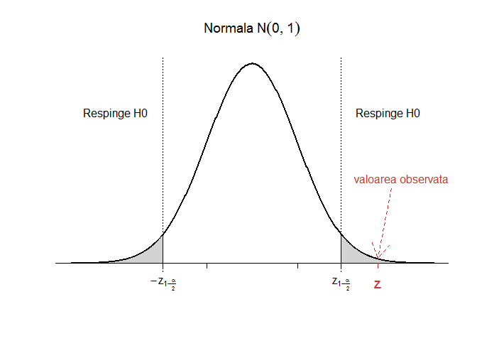
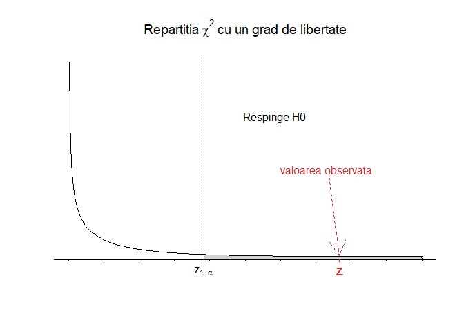
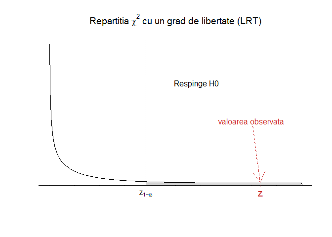
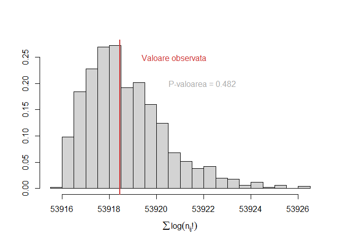

# Curs Biostatistică 2017 - Laborator 3 & 4
<style type="text/css">
.table {
    margin: auto;
    width: 40%;

}

.tocify{
  border: 0px solid;
}

.list-group-item.active{
  background-color: rgba(64, 64, 64, 0.72);
}

.list-group-item.active:hover{
  background-color: rgba(64, 64, 64, 0.72);
}
</style>

# Compararea proporțiilor, tabele de contingență $2\times2$
***


## Aproximarea normală
***

> Un studiu clinic a investigat efectele metodelor contraceptive orale (OC) asupra bolilor de inimă la femeile cu vârste între 40 și 44 de ani. Cercetătorii au găsit că printre 5000 de femei care utilizau metode contraceptive orale la momentul studiului (cazuri), 13 dintre acestea au dezvoltat un infarct miocardic (MI) (pe o perioadă de 3 ani) pe când printre 10000 de femei care nu au folosit niciodată OC (grupul de control) doar 7 au dezvoltat MI (pe aceeași perioadă). Vrem să vedem dacă există vreo asociere între consumul de anticoncepționale pe cale orală și incidența infarctului miocardic (pe această perioadă). 

Dacă notăm cu $p_1=\mathbb{P}(MI\,|\,OC)$ și $p_2=\mathbb{P}(MI\,|\,non-OC)$ atunci vrem să testăm:

$$
  \begin{array}{ll}
    H_0:\,\,p_1=p_2\\
    H_1:\,\,p_1\neq p_2
  \end{array}
$$


```r
n1 = 5000 # nr total cazuri OC
n11 = 13 # nr cazuri cu MI

n2 = 10000 # nr total control non-OC
n21 = 7 # nr control cu MI

p1 = n11/n1
p2 = n21/n2

p = (n11+n21)/(n1+n2) # proportia comuna - pooled p

# Verificam daca putem aplica aproximarea normala 
n1*p*(1-p)>5
```

```
## [1] TRUE
```

```r
n2*p*(1-p)>5
```

```
## [1] TRUE
```

```r
# Calculam statistica de test cu corectia de continuitate
z = (abs(p1-p2)-0.5*(1/n1+1/n2))/sqrt(p*(1-p)*(1/n1+1/n2))
z
```

```
## [1] 2.768839
```

```r
# Calcul de p-valoare: test bilateral
pval = min(2*(1-pnorm(z)),1)
pval
```

```
## [1] 0.005625635
```

```r
# Intervalul de incredere

cat("Intervalul de incredere pentru p1-p2 la pragul de semnificatie 95% este ","IC = [", p1-p2 - qnorm(0.975) *sqrt(p*(1-p)*(1/n1+1/n2)), ",", p1-p2 + qnorm(0.9755) *sqrt(p*(1-p)*(1/n1+1/n2)),"]")
```

```
## Intervalul de incredere pentru p1-p2 la pragul de semnificatie 95% este  IC = [ 0.0006612366 , 0.003144216 ]
```

```r
# Intervalul de incredere Agresti & Caffo 2000

p1b = (n11+1)/(n1+2)
p2b = (n21+1)/(n2+2)

cat("Intervalul de incredere (Agresti-Caffo) pentru p1-p2 la pragul de semnificatie 95% este ","IC = [", p1b-p2b - qnorm(0.975) *sqrt(p1b*(1-p1b)/(n1+2)+p2b*(1-p2b)/(n2+2)), ",", p1b-p2b + qnorm(0.975) *sqrt(p1b*(1-p1b)/(n1+2)+p2b*(1-p2b)/(n2+2)),"]")
```

```
## Intervalul de incredere (Agresti-Caffo) pentru p1-p2 la pragul de semnificatie 95% este  IC = [ 0.0004336558 , 0.003564425 ]
```



Concluzionăm că folosirea de anticoncepționale pe cale orală este semnificativ asociat cu incidența crescută de cazuri de MI pe perioada de 3 ani. 
Puteți crea o funcție care să automatizeze procesul ?

## Pearson $\chi^2$
***

Considerăm aceeași problemă de mai sus dar o scriem sub formă de tabel de contingență $2\times2$ (tabelul observat):


          MI    non-MI    Total 
-------  ----  --------  -------
OC        13     4987     5000  
non-OC    7      9993     10000 
Total     20    14980     15000 

Calculul tabelului de pe care ne așteptăm să-l observăm ($E_{ij}=\frac{n_{i\cdot}n_{\cdot j}}{n}$):


```r
# Observat
n11 = 13
n1o = 5000
n12 = n1o-n11

n21 = 7
n2o = 10000
n22 = n2o-n21

no1 = n11+n21
no2 = n12+n22

n = n1o+n2o

#Asteptat
e11 = n1o*no1/n
e12 = n1o*no2/n
e21 = n2o*no1/n
e22 = n2o*no2/n

Mobs = matrix(c(n11,n12,n21,n22),ncol = 2, byrow = T, dimnames = list(c("OC","non-OC"), c("MI", "non-MI")))

Mexp = matrix(c(e11,e12,e21,e22),ncol = 2, byrow = T, dimnames = list(c("OC","non-OC"), c("MI", "non-MI")))
Mexp
```

```
##               MI   non-MI
## OC      6.666667 4993.333
## non-OC 13.333333 9986.667
```


             MI         non-MI  
-------  -----------  ----------
OC        6.666667     4993.333 
non-OC    13.333333    9986.667 

Calculul statisticii de test cu corecția lui Yates:

$$
  X^2 = \sum_{i=1}^{2}\sum_{j=1}^{2}\frac{\left(|O_{ij}-E_{ij}|-0.5\right)^2}{E_{ij}}\sim_{H_0}\chi_1^2
$$


```r
X2 = (abs(n11-e11)-0.5)^2/e11 + (abs(n12-e12)-0.5)^2/e12 + (abs(n21-e21)-0.5)^2/e21 + (abs(n22-e22)-0.5)^2/e22
X2
```

```
## [1] 7.666472
```

```r
pval = 1-pchisq(X2,1) #df = 1
pval
```

```
## [1] 0.005625635
```

Sau folosind testul lui Pearson cu corecția lui Yates `chisq.test` avem:


```r
chisq.test(Mobs)
```

```
## 
## 	Pearson's Chi-squared test with Yates' continuity correction
## 
## data:  Mobs
## X-squared = 7.6665, df = 1, p-value = 0.005626
```



Același rezultat se obține și dacă folosim testul `prop.test`, acesta fiind un caz particular al testului hi-pătrat: 


```r
prop.test(Mobs)
```

```
## 
## 	2-sample test for equality of proportions with continuity
## 	correction
## 
## data:  Mobs
## X-squared = 7.6665, df = 1, p-value = 0.005626
## alternative hypothesis: two.sided
## 95 percent confidence interval:
##  0.0002463116 0.0035536884
## sample estimates:
## prop 1 prop 2 
## 0.0026 0.0007
```

## Raportul de verosimilitate maximă
***

În contextul exemplului de mai sus vrem să vedem testul bazat pe raportul de verosimilitate. Considerând modelul multinomial $(n_{11},n_{12},n_{21},n_{22})\sim \mathcal{M}(n;p_{11},p_{12},p_{21},p_{22})$, obținem raportul de verosimilitate

$$
  \Lambda(x)=\frac{\sup_{\theta\in\Theta_0}L(\theta|x)}{\sup_{\theta\in\Theta}L(\theta|x)}=\prod_{i=1}^{2}\prod_{j=1}^{2}\left(\frac{n_{i\cdot}\times n_{\cdot j}}{n\times n_{ij}}\right)^{n_{ij}}
$$
și din teorema lui Wilks (cazul multidimensional) avem $-2\log\Lambda\to\chi^2(d-d_0)$ unde $d=\dim(\Theta)$ și $d_0=\dim(\Theta_0)$. În cazul nostru

$$
  \begin{array}{ll}
    \Theta = \left\{(p_{11},p_{12},p_{21},p_{22})\,|\,p_{ij}\in(0,1),\,\sum_{i=1}^{2}\sum_{j=1}^{2}p_{ij}=1\right\}\\
    \Theta_0 = \left\{(p_{1}q_1,p_{1}q_2,p_{2}q_1,p_{2}q_2)\,|\,p_{i},q_j\in(0,1),\,\sum_{i=1}^{2}p_{i}=1,\,\sum_{j=1}^{2}q_j=1\right\}
  \end{array}
$$
unde $p_i$ și $q_j$ sunt repartițiile marginale. Obținem că $\dim(\Theta)=4-1$ iar $\dim(\Theta_0)=4-2$, deci $-2\log\Lambda\to\chi^2(1)$.


```r
# Observat
n11 = 13
n1o = 5000
n12 = n1o-n11

n21 = 7
n2o = 10000
n22 = n2o-n21

no1 = n11+n21
no2 = n12+n22

LRT = n11*log((n1o*no1)/(n*n11)) + n12*log((n1o*no2)/(n*n12)) + n21*log((n2o*no1)/(n*n21)) + n22*log((n2o*no2)/(n*n22))
LRT = -2*LRT
LRT
```

```
## [1] 8.354617
```

```r
pval = 1-pchisq(LRT,1) #df = 1
pval
```

```
## [1] 0.003847085
```



Să creăm o funcție care automatizează procesul:


```r
LRT1 = function(dat){
  # dat este sub forma de matrice 
  rs = rowSums(dat) # apply(dat, 1, sum)
  cs = colSums(dat) # apply(dat, 2, sum)
  
  n = sum(dat)
  
  expected <- outer(rs,cs,"*")/n
  
  lrt <- -2*sum(dat * log(expected/dat)) 
  
  dm = dim(dat) # dimensiunea tabloului pentru a calcula gradele de libertate
  pval = 1-pchisq(lrt,(dm[1]-1)*(dm[2]-1))
  
  cat("Statistica LRT este ", lrt, "\n")
  cat("P-valoarea testului bazat pe raportul de verosimilitate este ", pval)
  
  return(list(statistic = lrt, pvalue = pval))
}

Mobs = matrix(c(n11,n12,n21,n22),ncol = 2, byrow = T, dimnames = list(c("OC","non-OC"), c("MI", "non-MI")))

LRT1(Mobs) 
```

```
## Statistica LRT este  8.354617 
## P-valoarea testului bazat pe raportul de verosimilitate este  0.003847085
```

```
## $statistic
## [1] 8.354617
## 
## $pvalue
## [1] 0.003847085
```


## Testul exact al lui Fisher 
***

> Să presupunem că vrem să investigăm legătura dintre regimul bogat în sare și decesul datorat unei boli cardiovasculare (CVD). Să presupunem că suntem în contextul unui studiu retrospectiv efectuat pe un grup de bărbați cu vârste cuprinse între 50 și 54 de ani dintr-o anumită regiune geografică care au decedat pe parcursul unui luni. S-a încercat introducerea în studiu a unui grup cât mai omogen (s-a încercat includerea în studiu a unui număr egal de persoane care au decedat din cauză de CVD și care au decedat din alte cauze). S-a obținut următorul tabel:


           Ridicat Sare    Scazut Sare    Total 
--------  --------------  -------------  -------
non-CVD         2              23          25   
CVD             5              30          35   
Total           7              53          60   

Tabelul pe care ne așteptam să-l obținem ($H_0$) este:


```r
# Observat
n11 = 2
n1o = 25
n12 = n1o-n11

n21 = 5
n2o = 35
n22 = n2o-n21

no1 = n11+n21
no2 = n12+n22

n = n1o+n2o

#Asteptat
e11 = n1o*no1/n
e12 = n1o*no2/n
e21 = n2o*no1/n
e22 = n2o*no2/n

MobsF = matrix(c(n11,n12,n21,n22),ncol = 2, byrow = T, dimnames = list(c("non-CVD", "CVD"), c("Ridicat Sare", "Scazut Sare")))

MexpF = matrix(c(e11,e12,e21,e22),ncol = 2, byrow = T, dimnames = list(c("non-CVD", "CVD"), c("Ridicat Sare", "Scazut Sare")))
MexpF
```

```
##         Ridicat Sare Scazut Sare
## non-CVD     2.916667    22.08333
## CVD         4.083333    30.91667
```


           Ridicat Sare    Scazut Sare 
--------  --------------  -------------
non-CVD      2.916667       22.08333   
CVD          4.083333       30.91667   

Observăm că avem două celule în tabelul așteptat care conțin mai puțin de 5 observații prin urmare nu putem folosi metodele de mai sus (aproximarea normală, testul lui Pearson sau testul bazat pe raportul de verosimilitate). Dacă am încerca am obține:


```r
# Testul lui Pearson (Hi patrat)

chisq.test(MobsF)
```

```
## Warning in chisq.test(MobsF): Chi-squared approximation may be incorrect
```

```
## 
## 	Pearson's Chi-squared test with Yates' continuity correction
## 
## data:  MobsF
## X-squared = 0.11552, df = 1, p-value = 0.7339
```

```r
# Testul bazat pe raportul de verosimilitate

LRT1(MobsF)
```

```
## Statistica LRT este  0.5810517 
## P-valoarea testului bazat pe raportul de verosimilitate este  0.4459004
```

```
## $statistic
## [1] 0.5810517
## 
## $pvalue
## [1] 0.4459004
```

Enumerăm tabelele și probabilitățile lor de apariție:


```r
# Fixez marginalele

n1o = 25
n2o = 35
  
no1 = 7
no2 = 53

for (i in 0:7){
  cat("-------------------------------------\n")
  cat("Tabelul ", i+1, " :\n")
  
  # calculez valorile din tabel
  n11 = i
  n12 = n1o - n11
  n21 = no1 - n11
  n22 = no2 - n12
  
  MobsF1 = matrix(c(n11,n12,n21,n22),ncol = 2, byrow = T, dimnames = list(c("non-CVD", "CVD"), c("Ridicat Sare", "Scazut Sare")))
  
  print(MobsF1)
  
  cat("Probabilitatea de a obtine tabelul ", i+1, " este ", dhyper(i, no1, no2, n1o), "\n")
  cat("-------------------------------------\n")
}
```

```
## -------------------------------------
## Tabelul  1  :
##         Ridicat Sare Scazut Sare
## non-CVD            0          25
## CVD                7          28
## Probabilitatea de a obtine tabelul  1  este  0.0174117 
## -------------------------------------
## -------------------------------------
## Tabelul  2  :
##         Ridicat Sare Scazut Sare
## non-CVD            1          24
## CVD                6          29
## Probabilitatea de a obtine tabelul  2  este  0.1050706 
## -------------------------------------
## -------------------------------------
## Tabelul  3  :
##         Ridicat Sare Scazut Sare
## non-CVD            2          23
## CVD                5          30
## Probabilitatea de a obtine tabelul  3  este  0.2521695 
## -------------------------------------
## -------------------------------------
## Tabelul  4  :
##         Ridicat Sare Scazut Sare
## non-CVD            3          22
## CVD                4          31
## Probabilitatea de a obtine tabelul  4  este  0.3118225 
## -------------------------------------
## -------------------------------------
## Tabelul  5  :
##         Ridicat Sare Scazut Sare
## non-CVD            4          21
## CVD                3          32
## Probabilitatea de a obtine tabelul  5  este  0.214378 
## -------------------------------------
## -------------------------------------
## Tabelul  6  :
##         Ridicat Sare Scazut Sare
## non-CVD            5          20
## CVD                2          33
## Probabilitatea de a obtine tabelul  6  este  0.0818534 
## -------------------------------------
## -------------------------------------
## Tabelul  7  :
##         Ridicat Sare Scazut Sare
## non-CVD            6          19
## CVD                1          34
## Probabilitatea de a obtine tabelul  7  este  0.01604969 
## -------------------------------------
## -------------------------------------
## Tabelul  8  :
##         Ridicat Sare Scazut Sare
## non-CVD            7          18
## CVD                0          35
## Probabilitatea de a obtine tabelul  8  este  0.00124467 
## -------------------------------------
```

Aplicăm testul exact al lui Fisher `fisher.test`:


```r
fisher.test(MobsF)
```

```
## 
## 	Fisher's Exact Test for Count Data
## 
## data:  MobsF
## p-value = 0.6882
## alternative hypothesis: true odds ratio is not equal to 1
## 95 percent confidence interval:
##  0.04625243 3.58478157
## sample estimates:
## odds ratio 
##   0.527113
```

P-valoarea în `R` este calculată după formula:

$$
  p_{value} = \sum_{\{i:\mathbb{P}(i)\leq \mathbb{P}(obs)\}}\mathbb{P}(i)
$$
care în cazul nostru devine 


```r
n1o = 25
n2o = 35
  
no1 = 7
no2 = 53

n11 = 2
  
ps = dhyper(0:no1, no1, no2, n1o)
pobs = dhyper(n11, no1, no2, n1o)

pval = sum(ps[ps<=pobs])
pval
```

```
## [1] 0.6881775
```

## Date pereche - Testul lui McNemar
***

> Ne propunem să comparăm două regimuri de chimioterapie pentru pacienții cu cancer la sân care au efectuat operația de mastectomie. Cele două grupuri de tratament investigate ar trebui să fie cât mai comparabile din punct de vedere al celorlalți factori. Presupunem că un studiu de potrivire (matched study) a fost pregătit așa încât din fiecare pereche (potrivită din punct de vedere al vârstei și a condițiilor clinice) s-a selectat aleator un membru căruia i-a fost administrat tratamentul A iar celuilalt membru tratamentul B. Pacienții au fost urmăriți pe o perioadă de 5 ani, iar variabila de interes a fost supraviețuirea în această perioadă. S-au obșinut următoarele date:


         Supravietuit    Decedat    Total 
------  --------------  ---------  -------
A            526           95        621  
B            515           106       621  
Total        1041          201      1242  

Observăm că nu putem folosi testul lui Pearson (cu corecția lui Yates) deoarece datele nu sunt *independente*. Dacă am folosi am obține:


```r
M1csq = matrix(c(526,95,515,106),ncol = 2, byrow = T)
chisq.test(M1csq)
```

```
## 
## 	Pearson's Chi-squared test with Yates' continuity correction
## 
## data:  M1csq
## X-squared = 0.59357, df = 1, p-value = 0.441
```

Construim următorul tabel, în care unitatea de analiză nu mai este *pacientul* ci *perechea* iar perechile sunt clasificate după cum membrii acelei perechi au supraviețuit sau nu o perioadă post-operatorie de 5 ani (liniile tabelului sunt rezultatele pacientului care a urmat tratamentul A iar coloanele sunt rezultatele pacientului care a urmat tratamentul B):


                Supravietuit    Decedat    Total 
-------------  --------------  ---------  -------
Supravietuit        510           16        526  
Decedat              5            90        95   
Total               515           106       621  

Observăm că 600 (510+90) de perechi au avut același rezultat (perechi concordante) și doar 21 de perechi au avut rezultate diferite (perechi neconcordante).

Aplicăm testul lui McNemar `mcnemar.test` :


```r
M1 = matrix(c(510,16,5,90),ncol = 2, byrow = T, 
           dimnames = list(c("Supravietuit", "Decedat"), c("Supravietuit", "Decedat")))
mcnemar.test(M1)
```

```
## 
## 	McNemar's Chi-squared test with continuity correction
## 
## data:  M1
## McNemar's chi-squared = 4.7619, df = 1, p-value = 0.0291
```

# Tabele de contingență $r\times c$
***

> Următorul tabel prezintă repartiția grupelor de sânge (A, B, AB și O) în trei eșantioane de cetățeni afro-americani care trăiesc în trei state diferite (Florida, Iowa și Missouri). Vrem să testăm la un nivel de semnificație $\alpha = 0.5$ dacă repartiția grupelor de sânge pentru cetățenii afro-americani diferă de-a lungul celor trei state. 


             A       B      AB      O      Total 
---------  ------  ------  -----  ------  -------
Florida     122     117     19     244      502  
Iowa        1781    1351    288    3301    6721  
Missouri    353     269     60     713     1395  
Total       2256    1737    367    4258    8618  

## Testul $\chi^2$ al lui Pearson 
***

Tabelul pe care ne așteptăm să-l observat atunci când ipoteza nulă este adevărată:


```r
  matAA_observed = rbind(c(122, 117, 19, 244),
           c(1781, 1351, 288, 3301),
           c(353, 269, 60, 713))

  rs = rowSums(matAA_observed) 
  cs = colSums(matAA_observed) 
  
  n = sum(matAA_observed)
  
  matAA_expected <- outer(rs,cs,"*")/n
```


                A            B           AB            O        Total 
---------  -----------  -----------  -----------  -----------  -------
Florida     131.4124     101.1806     21.37781     248.0292      502  
Iowa        1759.4078    1354.6504    286.21571    3320.7262    6721  
Missouri    365.1799     281.1691     59.40647     689.2446     1395  
Total       2256.0000    1737.0000    367.00000    4258.0000    8618  

Aplicând funcția `chisq.test` obținem:


```r
chisq.test(matAA_observed)
```

```
## 
## 	Pearson's Chi-squared test
## 
## data:  matAA_observed
## X-squared = 5.6382, df = 6, p-value = 0.4649
```

## Testul bazat pe raportul de verosimilitate
***

Aplicând funcția `LRT1` construită anterior obținem p-valoarea testului bazat pe raportul de verosimilitate: 


```r
LRT1(matAA_observed)
```

```
## Statistica LRT este  5.548169 
## P-valoarea testului bazat pe raportul de verosimilitate este  0.475654
```

```
## $statistic
## [1] 5.548169
## 
## $pvalue
## [1] 0.475654
```

## Testul aproximat al lui Fisher
***

Testul exact al lui Fisher poate fi aplicat și în cazul tabelelor de tip $r\times c$ (pentru o generalizare a testului prezentat la curs puteți consulta [http://mathworld.wolfram.com/FishersExactTest.html](http://mathworld.wolfram.com/FishersExactTest.html)) numai că numărul de tabele pe care trebuie să le generăm devine prohibitiv. În acest caz putem aproxima p-valoarea testului cu ajutorul metodelor de tip Monte-Carlo. 

Generalizând raționamentul din cazul $2 \times 2$ obținem că probabilitatea (condiționată) de a observa un tabel dat fiind marginalele (pe rânduri și pe coloane) este dată de:

$$
  \mathbb{P}(\,tabel\,) = \frac{\prod_{i=1}^{r}n_{i\cdot}!\prod_{j=1}^{c}n_{\cdot j}!}{n!\prod_{i=1}^{r}\prod_{j=1}^{c}n_{ij}!}\propto\frac{1}{\prod_{j=1}^{c}n_{ij}!}
$$


```r
fisher <- function(tab, n.sim=1000, return.all=FALSE, prnt=FALSE){
  bot0 <- sum(lgamma(tab+1))# lgamma - logaritm natural din gamma - logaritm din factorial

  bot <- 1:n.sim
  a <- list(rep(row(tab),tab), rep(col(tab),tab))
  for(i in 1:n.sim) {
    a[[1]] <- sample(a[[1]])
    bot[i] <- sum(lgamma(table(a)+1))
    if(prnt) { if(i == round(i/10)*10) cat(i,"\n") }
  }
  if(return.all) return(list(bot0, bot, mean(bot0 <= bot)))
  cat("P-valoarea aproximata cu Monte Carlo este ", mean(bot0 <= bot))
}

set.seed(5)
fisher(matAA_observed)
```

```
## P-valoarea aproximata cu Monte Carlo este  0.482
```



Același rezultat îl obținem și dacă folosim funcția `fisher.test` (care este mai rapidă):


```r
fisher.test(matAA_observed, simulate.p.value = TRUE, B = 1000)
```

```
## 
## 	Fisher's Exact Test for Count Data with simulated p-value (based
## 	on 1000 replicates)
## 
## data:  matAA_observed
## p-value = 0.4975
## alternative hypothesis: two.sided
```


