# Curs Biostatistica 2017 - Laborator 5 & 6
<style type="text/css">
.table {
    margin: auto;
    width: 40%;

}

.tocify{
  border: 0px solid;
}

.list-group-item.active{
  background-color: rgba(64, 64, 64, 0.72);
}

.list-group-item.active:hover{
  background-color: rgba(64, 64, 64, 0.72);
}
</style>

# Analiză de varianță cu un factor (one-way ANOVA)
***
***

## Exemplul 1
***
> Vom analiza setul de date `Cushings` din pachetul `MASS`. Sindromul *Cushing* reprezintă o serie de semne și simptome ca urmare a expunerii organismului pentru o perioadă îndelungată de timp la o concentrație ridicată de cortizon (mai multe detalii [aici](http://www.csid.ro/boli-afectiuni/endocrinologie/sindromul-cushing-12821884/) și [aici](https://en.wikipedia.org/wiki/Cushing%27s_syndrome)). Pentru fiecare individ din eșantion, ratele de excreție urinară
a doi metaboliți steroizi sunt înregistrate: *Tetrahydrocortisone* și *Pregnanetriol*. Variabila *Type* arată tipul de sindrom Cushing, acesta putând lua una din următoarele patru categorii: *adenom* ([a](http://www.sfatulmedicului.ro/dictionar-medical/adenom_119)), *hiperplazia bilaterală* ([b](http://www.sfatulmedicului.ro/Afectiunile-suprarenalelor/hiperplazia-congenitala-a-glandelor-suprarenale_8123)), *carcinom* ([c](http://www.sfatulmedicului.ro/Cancer/ce-este-carcinomul_15473)) și *necunoscut* (u). Obiectivul este să investigăm dacă cele patru tipuri de sindrom sunt diferite în raport cu excreția urinară de *Tetrahydrocortisone*.

Începem prin a atașa setul de date `Cushings`:


```r
library(MASS)
data("Cushings")
attach(Cushings)
```


 Tetrahydrocortisone    Pregnanetriol    Type 
---------------------  ---------------  ------
         3.1                11.70         a   
         3.0                1.30          a   
         1.9                0.10          a   
         3.8                0.04          a   
         4.1                1.10          a   
         1.9                0.40          a   
         8.3                1.00          b   
         3.8                0.20          b   
         3.9                0.60          b   
         7.8                1.20          b   
         9.1                0.60          b   
        15.4                3.60          b   
         7.7                1.60          b   
         6.5                0.40          b   
         5.7                0.40          b   
        13.6                1.60          b   
        10.2                6.40          c   
         9.2                7.90          c   
         9.6                3.10          c   
        53.8                2.50          c   
        15.8                7.60          c   
         5.1                0.40          u   
        12.9                5.00          u   
        13.0                0.80          u   
         2.6                0.10          u   
        30.0                0.10          u   
        20.5                0.80          u   

Notăm cu $Y$ excreția urinară de *Tetrahydrocortisone* (variabila răspuns) și cu $X$ variabila *Type* (variabila factor), cu $X\in\{1,2,3,4\}$ după cum $Type\in\{a,b,c,u\}$. Astfel obiectivul este de a investiga dacă media variabilei răspuns $Y$ diferă pentru valori diferite ale nivelelor variabilei factor $X$. Dacă notăm observațiile individuale cu $y_{ij}$ (excreția urinară de *Tetrahydrocortisone* a individului $j$ cu tipul de sindrom $i$) atunci putem determina 

  * numărul de observații din fiecare grup ($n_i$)


```r
n = length(Cushings$Tetrahydrocortisone)

# varianta 1 - nr de observatii pe grup
ng = table(Cushings$Type)
ng
```

```
## 
##  a  b  c  u 
##  6 10  5  6
```

```r
# varianta 2 - nr de observatii pe grup
ng2 = tapply(Cushings$Tetrahydrocortisone, Cushings$Type, length)
ng2
```

```
##  a  b  c  u 
##  6 10  5  6
```

  * media fiecărui grup ($\bar{y}_i$)
  

```r
# media globala
my = mean(Cushings$Tetrahydrocortisone)

# varianta 1 - media pe grup 
myg = tapply(Cushings$Tetrahydrocortisone, Cushings$Type, mean)
myg
```

```
##         a         b         c         u 
##  2.966667  8.180000 19.720000 14.016667
```

```r
# varianta 2 - media pe grup 
myg2 = aggregate(Cushings$Tetrahydrocortisone, by = list(Cushings$Type), mean)
myg2
```

```
##   Group.1         x
## 1       a  2.966667
## 2       b  8.180000
## 3       c 19.720000
## 4       u 14.016667
```
  
  * deviația standard a fiecărui grup
  

```r
# varianta 1 - media pe grup 
syg = tapply(Cushings$Tetrahydrocortisone, Cushings$Type, sd)
syg
```

```
##          a          b          c          u 
##  0.9244818  3.7891072 19.2388149 10.0958242
```

```r
# varianta 2 - media pe grup 
syg2 = aggregate(Cushings$Tetrahydrocortisone, by = list(Cushings$Type), sd)
syg2
```

```
##   Group.1          x
## 1       a  0.9244818
## 2       b  3.7891072
## 3       c 19.2388149
## 4       u 10.0958242
```

Considerăm următorul grafic unde fiecare observație este reprezentată printr-un punct (gol în figura din stânga și plin în cea din dreapta) iar media globală este ilustrată printr-o linie punctată. În figura din stânga avem *boxplot*-ul pentru fiecare categorie a lui $X$ iar în figura din dreapta (*stripchart*) mediile eșantioanelor din fiecare grup sunt ilustrate cu o cruce de culoare neagră:

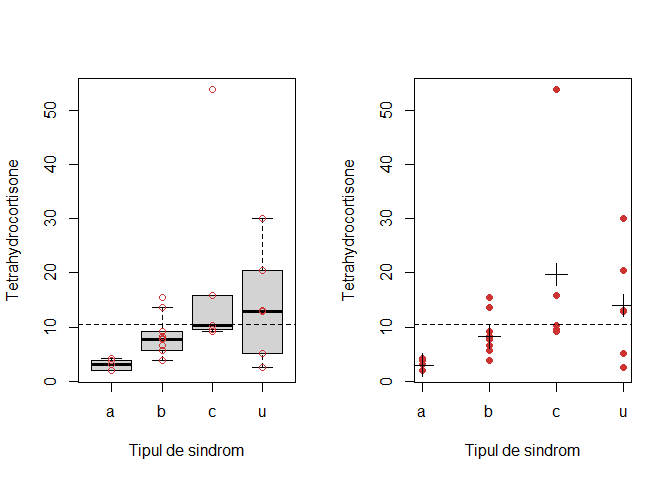

Din figura de mai sus putem observa că avem o variație considerabilă între mediile grupurilor de-a lungul celor 4 categorii de sindrom *Cushing*. De asemenea, în interiorul grupurilor, avem grade diferite de variație a observațiilor (vezi figura din stânga). Ambele surse de variabilitate contribuie la variabilitatea totală a observațiilor în jurul mediei globale (linia punctată). 

Calculăm **variabilitatea dintre grupuri** ($r$ este numărul de grupuri):

$$
  SS_{B}=\sum_{i=1}^{r}n_i(\bar{y}_i-\bar{y})^2
$$


```r
# avem ng nr de observatii din fiecare grup, myg media lui y 
# din fiecare grup si my media totala

SS_B = ng%*%(myg-my)^2 # unde %*% este produs de matrice
SS_B
```

```
##         [,1]
## [1,] 893.521
```

Calculăm **variabilitatea reziduală** (din grupuri):

$$
  SS_{W}=\sum_{i=1}^{r}\sum_{j = 1}^{n_i}(y_{ij}-\bar{y}_i)^2
$$


```r
y = Cushings$Tetrahydrocortisone # y_{ij}
ryi = rep(myg, ng)

SS_W = sum((y-ryi)^2)
SS_W
```

```
## [1] 2123.646
```

Calculăm **variabilitatea totală**:

$$
  SS_{T} = \sum_{i=1}^{r}\sum_{j = 1}^{n_i}(y_{ij}-\bar{y})^2 = SS_{B}+SS_{W}
$$


```r
# calculat cu SS_B+SS_W
SS_T = SS_B + SS_W
SS_T
```

```
##          [,1]
## [1,] 3017.167
```

```r
# calculat cu sume (verificam formula)
SS_T2 = sum((y-my)^2)
SS_T2
```

```
## [1] 3017.167
```

Observăm că *variabilitatea totală poate fi atribuită parțial variabilității dintre grupuri și parțial variabilității din interiorul grupurilor*. 

Considerăm ipoteza nulă:

$$
  H_0:\, \mu_1=\cdots=\mu_i=\mu
$$
unde $\mu$ este media populației $Y$ iar $\mu_1, \dots, \mu_i$ sunt mediile populațiilor din fiecare grup.

Statistica de test este:

$$
  F = \frac{\frac{SS_B}{r-1}}{\frac{SS_W}{n-r}}
$$

unde $\frac{SS_B}{r-1}$ și $\frac{SS_W}{n-r}$ sunt mediile pătrate pentru grupuri (mean square) și respectiv reziduri. Dacă condițiile *ANOVA* (datele din fiecare grup sunt i.i.d. și sunt normal distribuite) sunt satisfăcute și presupunând că $H_0$ este adevărată avem că $F\sim F(r-1, n-r)$. 

Avem modelul *ANOVA*:


```r
anova_model = aov(Tetrahydrocortisone~Type, data = Cushings)

summary(anova_model)
```

```
##             Df Sum Sq Mean Sq F value Pr(>F)  
## Type         3  893.5  297.84   3.226 0.0412 *
## Residuals   23 2123.6   92.33                 
## ---
## Signif. codes:  0 '***' 0.001 '**' 0.01 '*' 0.05 '.' 0.1 ' ' 1
```


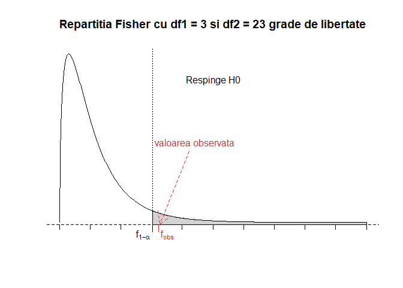

### Verificarea ipotezelor ANOVA {-}
***

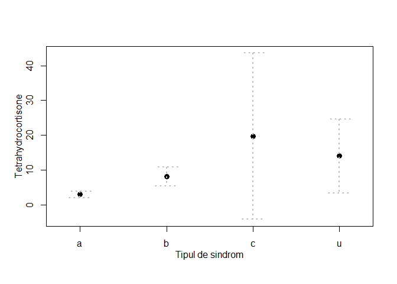

Aplicăm *testul lui Bartlett* pentru a testa homoscedasticitatea modelului (i.e. verificăm $H_0: \sigma_1=\cdots=\sigma_r$):


```r
bartlett.test(Tetrahydrocortisone~Type, data = Cushings)
```

```
## 
## 	Bartlett test of homogeneity of variances
## 
## data:  Tetrahydrocortisone by Type
## Bartlett's K-squared = 31.595, df = 3, p-value = 6.37e-07
```

Observăm că ipoteza de omogenitate este respinsă în favoarea alternativei prin urmare ipoteza de omogenitate din ANOVA este invalidată.

Transformăm variabila răspuns ($\log(Y)=\log(Tetrahydrocortisone)$):

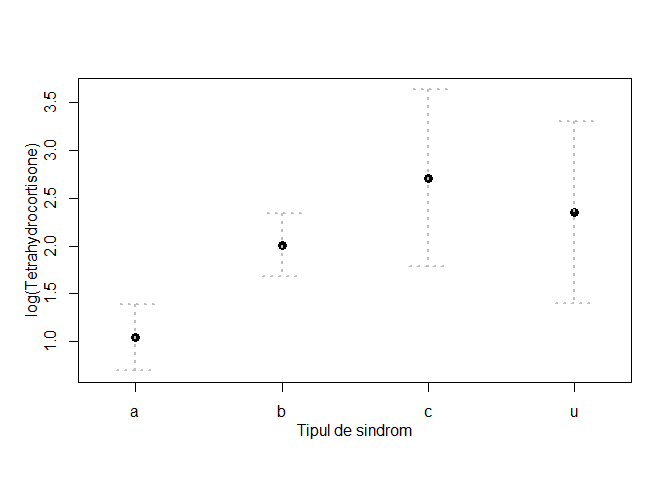

Verificăm ipoteza de omogenitate (homoscedasticitatea):


```r
bartlett.test(log(Tetrahydrocortisone)~Type, data = Cushings)
```

```
## 
## 	Bartlett test of homogeneity of variances
## 
## data:  log(Tetrahydrocortisone) by Type
## Bartlett's K-squared = 5.7249, df = 3, p-value = 0.1258
```

Testăm normalitatea modelului transformat (*testul lui Shapiro-Wilks* sau *Shapiro-Francia*):


```r
anova_model_tr = aov(log(Tetrahydrocortisone)~Type, data = Cushings)
shapiro.test(residuals(anova_model_tr))
```

```
## 
## 	Shapiro-Wilk normality test
## 
## data:  residuals(anova_model_tr)
## W = 0.97953, p-value = 0.8515
```

Verificăm normalitatea și grafic cu `Q-Q Plot`:

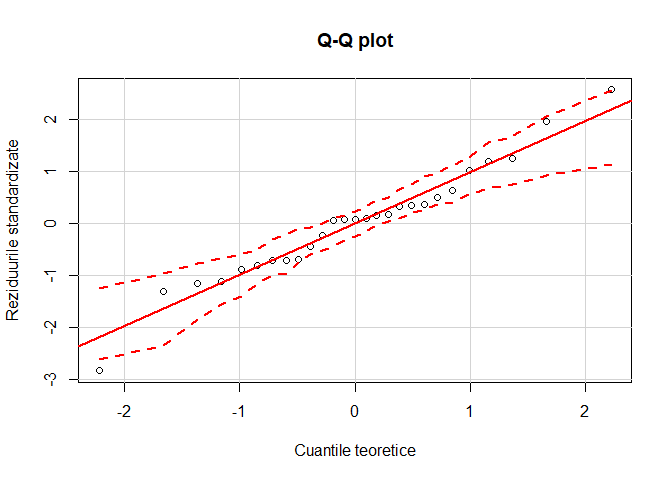

ANOVA pentru modelul transformat:


```r
summary(anova_model_tr)
```

```
##             Df Sum Sq Mean Sq F value  Pr(>F)   
## Type         3  8.766  2.9220   7.647 0.00102 **
## Residuals   23  8.789  0.3821                   
## ---
## Signif. codes:  0 '***' 0.001 '**' 0.01 '*' 0.05 '.' 0.1 ' ' 1
```

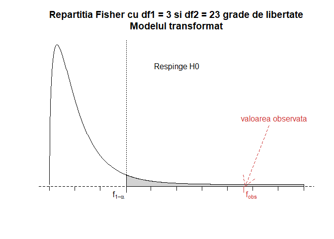

## Exemplul 2
***

> În acest exemplu vom folosi setul de date *Cholesterol* din pachetul `multcomp` (datele se pot descărca de [aici](data/cholesterol.csv)). Datele prezintă cu cât s-a redus nivelul de colesterol (variabila *response*) la 50 de pacienți ce au urmat 5 tratamente de reducere a colesterolului. Trei dintre tratamente au implicat același medicament administrat în moduri diferite: 20 mg o dată pe zi (*1time*), 10 mg de două ori pe zi (*2time*) sau 5 mg de patru ori pe zi (*4time*). Celelalte două tratamente au constat din medicamente alternative diferite (*drugD* și *drugE*). Care tratament a produs cea mai mare reducere a colesterolului ?

Începem prin a citi setul de date:


```r
cholesterol = read.csv("data/cholesterol.csv", stringsAsFactors = FALSE)
head(cholesterol)
```

```
##     trt response
## 1 1time   3.8612
## 2 1time  10.3868
## 3 1time   5.9059
## 4 1time   3.0609
## 5 1time   7.7204
## 6 1time   2.7139
```

Vedem câte observații avem pentru fiecare tratament:


```r
table(cholesterol$trt)
```

```
## 
##  1time 2times 4times  drugD  drugE 
##     10     10     10     10     10
```

Observăm că fiecare tratament a fost administrat la câte 10 pacienți (suntem în contextul unui *plan de experiență echilibrat*). 

Calculăm:

  * numărul total de observații ($n$) și numărul de observații din fiecare grup ($n_i$)


```r
n = length(cholesterol$trt) # nr total de observații

# nr de observatii pe grup
ng = table(cholesterol$trt)
```

  * media fiecărui grup ($\bar{y}_i$)
  

```r
# media globala
my = mean(cholesterol$response)

# media pe grup 
myg = tapply(cholesterol$response, cholesterol$trt, mean)
myg
```

```
##    1time   2times   4times    drugD    drugE 
##  5.78197  9.22497 12.37478 15.36117 20.94752
```

Se observă că drugE a produs (în medie) cea mai mare reducere a colesterolului pe când 1time a produs-o pe cea mai mică.
  
  * abaterea standard a fiecărui grup
  

```r
# sd pe grup 
syg = tapply(cholesterol$response, cholesterol$trt, sd)
syg
```

```
##    1time   2times   4times    drugD    drugE 
## 2.878113 3.483054 2.923119 3.454636 3.345003
```

Se observă că abaterile standard sunt relativ constante pentru cele 5 tratamente, luând valori între 2.9 și 3.5.


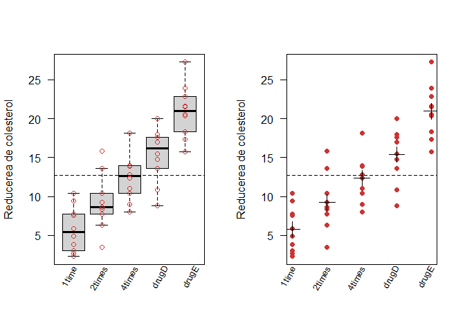

Avem tabelul *ANOVA*:


```r
anova_model = aov(response~trt, data = cholesterol)

summary(anova_model)
```

```
##             Df Sum Sq Mean Sq F value   Pr(>F)    
## trt          4 1351.4   337.8   32.43 9.82e-13 ***
## Residuals   45  468.8    10.4                     
## ---
## Signif. codes:  0 '***' 0.001 '**' 0.01 '*' 0.05 '.' 0.1 ' ' 1
```

Testul ANOVA (F) pentru tratament (trt) este semnificativ ($p<0.001$), ilustrând că cele 5 tratamente nu sunt la fel de eficiente.  

Reducerea medie de colesterol pentru cele 5 tratamente împreună cu intervalele de încredere de nivel de încredere de $95\%$ corespunzătoare:

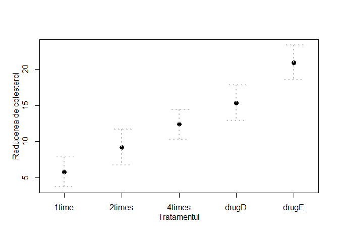

### Verificarea ipotezelor ANOVA {-}

În ANOVA cu un factor, se presupune că variabila răspuns este repartizată normal cu aceeași varianță în fiecare grup. Pentru testarea normalității putem folosi ca metodă grafică `Q-Q plot`-ul:

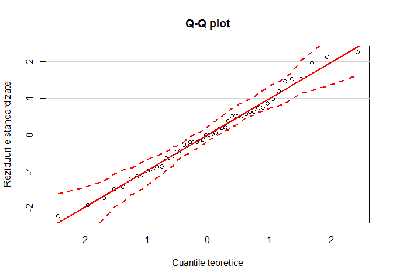

De asemenea ipoteza de normalitate poate fi testată și cu testul *Shapiro-Wilks* sau *Shapiro-Francia*:


```r
anova_model_chol = aov(response~trt, data = cholesterol)
shapiro.test(residuals(anova_model_chol))
```

```
## 
## 	Shapiro-Wilk normality test
## 
## data:  residuals(anova_model_chol)
## W = 0.98864, p-value = 0.9094
```

Pentru testarea ipotezei de homoscedasticitate aplicăm *testul lui Bartlett*(i.e. verificăm $H_0: \sigma_1=\cdots=\sigma_r$):


```r
bartlett.test(response~trt, data = cholesterol)
```

```
## 
## 	Bartlett test of homogeneity of variances
## 
## data:  response by trt
## Bartlett's K-squared = 0.57975, df = 4, p-value = 0.9653
```

Testul lui Bartlett ne indică faptul că varianțele în cele 5 grupuri nu diferă semnificativ ($p = 0.97$). Pentru testarea ipotezei de omogenitate se mai pot folosi și alte teste printre care includem *testul lui Fligner-Killeen* (`fligner.test`) și *testul Brown-Forsythe* (funcția `hov()` din pachetul `HH`). Ambele teste întorc același rezultat:


```r
fligner.test(response~as.factor(trt), data = cholesterol)
```

```
## 
## 	Fligner-Killeen test of homogeneity of variances
## 
## data:  response by as.factor(trt)
## Fligner-Killeen:med chi-squared = 0.74277, df = 4, p-value = 0.946
```


```r
hov(response~trt, data = cholesterol) # hov = homogeneity of variance
```

```
## 
## 	hov: Brown-Forsyth
## 
## data:  response
## F = 0.075477, df:trt = 4, df:Residuals = 45, p-value = 0.9893
## alternative hypothesis: variances are not identical
```


### Comparări multiple {-}


Testul F din ANOVA pentru tratamente ne spune că cele 5 tipuri de medicamente nu sunt la fel de eficiente, însă nu ne spune care dintre ele diferă față de celelalte. Pentru a răspunde la această întrebare vom folosi metodologia testării multiple. Ca exemplu vom folosi *Testul lui Tukey HSD* (Honestly Significant Difference), test care permite compararea tuturor perechilor de diferențe dintre mediile grupurilor: 


```r
TukeyHSD(anova_model_chol)
```

```
##   Tukey multiple comparisons of means
##     95% family-wise confidence level
## 
## Fit: aov(formula = response ~ trt, data = cholesterol)
## 
## $trt
##                   diff        lwr       upr     p adj
## 2times-1time   3.44300 -0.6582817  7.544282 0.1380949
## 4times-1time   6.59281  2.4915283 10.694092 0.0003542
## drugD-1time    9.57920  5.4779183 13.680482 0.0000003
## drugE-1time   15.16555 11.0642683 19.266832 0.0000000
## 4times-2times  3.14981 -0.9514717  7.251092 0.2050382
## drugD-2times   6.13620  2.0349183 10.237482 0.0009611
## drugE-2times  11.72255  7.6212683 15.823832 0.0000000
## drugD-4times   2.98639 -1.1148917  7.087672 0.2512446
## drugE-4times   8.57274  4.4714583 12.674022 0.0000037
## drugE-drugD    5.58635  1.4850683  9.687632 0.0030633
```

Observăm că reducerea medie a colesterolului pentru tratamentele *1time* și *2times* nu este semnificativă ($p=0.138$) pe când reducerea medie a colesterolului pentru tratamentele *1time* și *4times* este semnificativă ($p<0.001$). 

Aceste diferențe se pot observa și grafic:

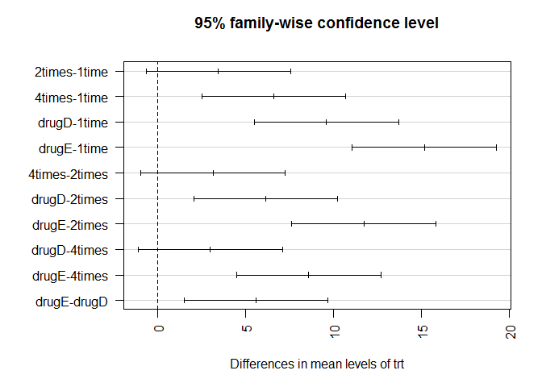

Trebuie menționat că sunt mai multe metode pentru comparări multiple: *metoda Bonferroni*, *metoda contrastelor liniare*, *metoda bazată pe statistici de rang*, *metoda Newman Keuls* etc.

# Analiză de varianță cu doi factori (two-way ANOVA)
***
***

Analiza de varianță cu doi factori poate fi văzută ca o generalizare a analizei de varianță cu un factor, în acest model subiecții fiind distribuiți în grupe rezultate din încrucișarea modalităților celor doi factori. 

Ca și în cazul one-way ANOVA, condițiile de aplicare rămân aceleași: populații normale de aceeași varianță și eșantioane independente.

## Exemplul 1
***

> În acest exemplu vom folosi setul de date [`ToothGrowth`](http://jn.nutrition.org/content/33/5/491.full.pdf) din pachetul de bază. Datele fac referire la 60 de porcușori de guinea care sunt repartizați aleator să primească unul din cele trei nivele de Vitamina C (0.5, 1 și 2 mg) prin una din cele două modalități propuse (suc de portocale - OJ sau o soluție apoasă de acid ascorbic - VC), cu restricția ca fiecare combinație de tratament să fie atribuită la 10 porcușori. Vrem să investigăm efectul Vitaminei C asupra creșterii dinților porcușorilor de guinea prin cele două metode de livrare. 

Atașăm setul de date `ToothGrowth`:


```r
data("ToothGrowth")
attach(ToothGrowth)

head(ToothGrowth)
```

```
##    len supp dose
## 1  4.2   VC  0.5
## 2 11.5   VC  0.5
## 3  7.3   VC  0.5
## 4  5.8   VC  0.5
## 5  6.4   VC  0.5
## 6 10.0   VC  0.5
```

Structura setului de date este:


```r
str(ToothGrowth)
```

```
## 'data.frame':	60 obs. of  3 variables:
##  $ len : num  4.2 11.5 7.3 5.8 6.4 10 11.2 11.2 5.2 7 ...
##  $ supp: Factor w/ 2 levels "OJ","VC": 2 2 2 2 2 2 2 2 2 2 ...
##  $ dose: num  0.5 0.5 0.5 0.5 0.5 0.5 0.5 0.5 0.5 0.5 ...
```

unde `len` este variabila dependentă (variabila răspuns) iar `supp` și `dose` sunt variabilele explicative (cei doi factori). 

Descompunerea erorii în modelul ANOVA cu doi factori este: 

$$
\begin{aligned}
  \underbrace{\sum_{i=1}^{r}\sum_{j=1}^{c}\sum_{k=1}^{s}(Y_{ijk}-\bar{Y}_{\cdot\cdot\cdot})^2}_{SS_T} &= \underbrace{sc\sum_{i=1}^{r}(\bar{Y}_{i\cdot\cdot}-\bar{Y}_{\cdot\cdot\cdot})^2}_{SS_A}+\underbrace{sr\sum_{j=1}^{c}(\bar{Y}_{\cdot j\cdot}-\bar{Y}_{\cdot\cdot\cdot})^2}_{SS_B}\\
  &\;\;\;\;\; + \underbrace{s\sum_{i=1}^{r}\sum_{j=1}^{c}(\bar{Y}_{i j\cdot}-\bar{Y}_{i\cdot\cdot}-\bar{Y}_{\cdot j\cdot}+\bar{Y}_{\cdot\cdot\cdot})^2}_{SS_{A\times B}} + \underbrace{\sum_{i=1}^{r}\sum_{j=1}^{c}\sum_{k=1}^{s}(Y_{ijk}-\bar{Y}_{i j\cdot})^2}_{SS_W}
\end{aligned}
$$

Tabelul ANOVA devine:


    Sursa            DF                SS                  MS                      F_test             
-------------  --------------  ------------------  ------------------  -------------------------------
     $A$           $r-1$             $SS_A$              $MS_A$              $\frac{MS_A}{MS_W}$      
     $B$           $c-1$             $SS_B$              $MS_B$              $\frac{MS_B}{MS_W}$      
 $A\times B$    $(r-1)(c-1)$    $SS_{A\times B}$    $MS_{A\times B}$    $\frac{MS_{A\times B}}{MS_W}$ 
     $W$         $rc(s-1)$           $SS_W$              $MS_W$                                       
   $Total$        $rcs-1$            $SS_T$                                                           

Pentru a calcula numărul de observații din fiecare încrucișare de categorii vom folosi funcția `table`:


```r
# nr de categorii pentru fiecare factor
r = 2
c = 3
s = 10

# nr de observatii pentru factorul A
n_i = table(supp)
n_i
```

```
## supp
## OJ VC 
## 30 30
```


```r
# nr de observatii pentru factorul B
n_j = table(dose)
n_j
```

```
## dose
## 0.5   1   2 
##  20  20  20
```


```r
# nr de observatii pentru fiecare incrucisare a factorilor A si B
n_ij = table(supp, dose)
n_ij
```

```
##     dose
## supp 0.5  1  2
##   OJ  10 10 10
##   VC  10 10 10
```

de unde observăm că suntem în contextul unui plan de experiență echilibrat ($r = 2$, $c = 3$ și $s = 10$).

Vom calcula mediile $\bar{Y}_{i j\cdot}$, $\bar{Y}_{i \cdot\cdot}$, $\bar{Y}_{\cdot j\cdot}$ și $\bar{Y}_{\cdot\cdot\cdot}$:

  * pentru $\bar{Y}_{\cdot\cdot\cdot}$
  

```r
m_T = mean(len)
m_T
```

```
## [1] 18.81333
```
  
  * pentru $\bar{Y}_{i \cdot\cdot}$
  

```r
m_i = tapply(len, supp, mean)
m_i
```

```
##       OJ       VC 
## 20.66333 16.96333
```
  
  * pentru $\bar{Y}_{\cdot j\cdot}$
  

```r
m_j = tapply(len, dose, mean)
m_j
```

```
##    0.5      1      2 
## 10.605 19.735 26.100
```
  
  * pentru $\bar{Y}_{i j\cdot}$
  

```r
m_ij = tapply(len, list(supp, dose), mean)
m_ij
```

```
##      0.5     1     2
## OJ 13.23 22.70 26.06
## VC  7.98 16.77 26.14
```

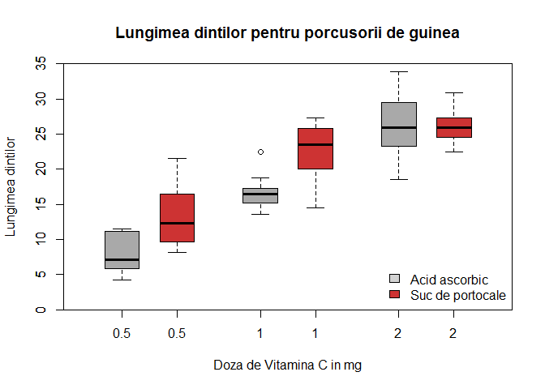

Calculăm $SS_W$, $df_W$ și $MS_W$:


```r
y = len

rep_ij = c(rep(m_ij["VC",], n_ij["VC",]), rep(m_ij["OJ",], n_ij["OJ",]))

SS_W = sum((y-rep_ij)^2)
cat("SS_W = ", SS_W,"\n")
```

```
## SS_W =  712.106
```

```r
df_W = r*c*(s-1)
cat("df_W = ", df_W,"\n")
```

```
## df_W =  54
```

```r
MS_W = SS_W/df_W
cat("MS_W = ", MS_W,"\n")
```

```
## MS_W =  13.18715
```

Calculăm $SS_A$, $df_A$ și $MS_A$:


```r
SS_A = s*c*sum((m_i-m_T)^2)
cat("SS_A = ", SS_A,"\n")
```

```
## SS_A =  205.35
```

```r
df_A = r-1
cat("df_A = ", df_A,"\n")
```

```
## df_A =  1
```

```r
MS_A = SS_A/df_A
cat("MS_A = ", MS_A,"\n")
```

```
## MS_A =  205.35
```

Calculăm $SS_B$, $df_B$ și $MS_B$:


```r
SS_B = s*r*sum((m_j-m_T)^2)
cat("SS_B = ", SS_B,"\n")
```

```
## SS_B =  2426.434
```

```r
df_B = c-1
cat("df_B = ", df_B,"\n")
```

```
## df_B =  2
```

```r
MS_B = SS_B/df_B
cat("MS_B = ", SS_B,"\n")
```

```
## MS_B =  2426.434
```

Calculăm $SS_{A\times B}$, $df_{A\times B}$ și $MS_{A\times B}$:


```r
v = m_ij - matrix(rep(m_i, c), ncol = c) - 
  matrix(rep(m_j, r), nrow = r, byrow = T) + m_T
SS_AB = s*sum(v^2)
cat("SS_AB = ", SS_AB,"\n")
```

```
## SS_AB =  108.319
```

```r
df_AB = (r-1)*(c-1)
cat("df_AB = ", df_AB,"\n")
```

```
## df_AB =  2
```

```r
MS_AB = SS_AB/df_AB
cat("MS_AB = ", SS_AB,"\n")
```

```
## MS_AB =  108.319
```

Calculăm $SS_T$:


```r
SS_T = SS_A + SS_B + SS_AB + SS_W
cat("SS_T = ", SS_T,"\n")
```

```
## SS_T =  3452.209
```

```r
# verificam prin formula
sum((y-m_T)^2)
```

```
## [1] 3452.209
```

Calculăm tabelul ANOVA cu funcția `aov`:


```r
ToothGrowth$dose = as.factor(ToothGrowth$dose)
ToothGrowth$supp = as.factor(ToothGrowth$supp)

model_anova_2w = aov(len~supp*dose, data = ToothGrowth)

summary(model_anova_2w)
```

```
##             Df Sum Sq Mean Sq F value   Pr(>F)    
## supp         1  205.4   205.4  15.572 0.000231 ***
## dose         2 2426.4  1213.2  92.000  < 2e-16 ***
## supp:dose    2  108.3    54.2   4.107 0.021860 *  
## Residuals   54  712.1    13.2                     
## ---
## Signif. codes:  0 '***' 0.001 '**' 0.01 '*' 0.05 '.' 0.1 ' ' 1
```

Tabelul ANOVA de mai sus ne arată că atât efectele principale (`supp` și `dose`) cât și interacția dintre cei doi factori (`supp:dose`) sunt semnificative. 

Pentru a vedea interacția dintre cei doi factori putem să folosim funcția `interaction.plot`:


```r
interaction.plot(dose, supp, len, type="b",
        col=c("brown3","darkgray"), pch=c(16, 18),
        main = "Interactia dintre doza de Vitamina C si tipul de suplement",
        xlab = "Doza de Vitamina C in mg",
        ylab = "Media lungimii dintilor")
```

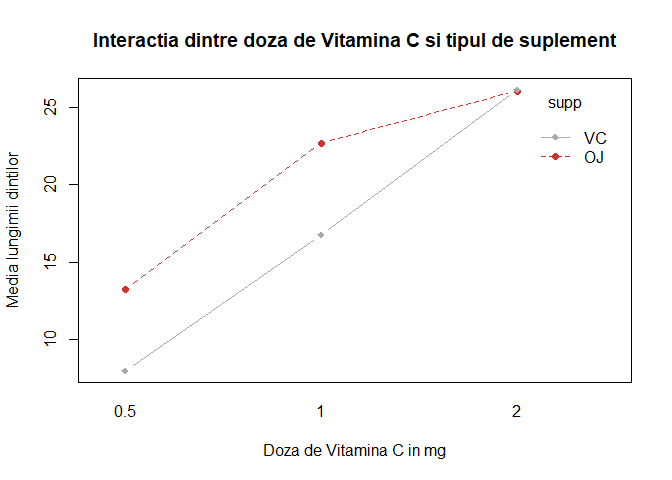

Dacă vrem să includem și intervalele de încredere atunci avem:


Graficele ne arată că dinții de la porcușorii de guinea cresc cu doza de Vitamina C atât pentru sucul de portocale cât și pentru soluția de acid ascorbic. Pentru dozele de 0.5 și 1 mg, sucul de portocale produce în medie o creștere mai mare a dinților decât soluția de acid ascorbic. Pentru doza de 2 mg, ambele metode produc aceeași creștere. 

### Verificarea ipotezelor ANOVA 
***

Vom începe prin a testa **condiția de normalitate** a observațiilor. Pentru aceasta vom folosi testul `Shapiro-Wilks` (funcția `shapiro.test`) și metoda grafică a *dreptei lui Henry* (Q-Q plot). Ca și în cazul ANOVA cu un factor, vom testa normalitatea datelor pentru toate datele și nu pentru fiecare eșantion în parte. În acest sens va trebui să calculăm reziduurile:

$$
  \hat{e}_{ijk} = y_{ijk}-\bar{y}_{ij\cdot}
$$

lucru care poate fi realizat sau prin calcul direct:


```r
res_model_direct = y-rep_ij
```

sau folosind funcția residuals:


```r
res_model = residuals(model_anova_2w)
```

Aplicăm testul Shapiro-Wilks pentru reziduuri și obținem:


```r
shapiro.test(res_model)
```

```
## 
## 	Shapiro-Wilk normality test
## 
## data:  res_model
## W = 0.98499, p-value = 0.6694
```

de unde concluzionăm că ipoteza de normalitate este satisfăcută. Aceeași concluzie o obținem și prin metoda grafică:


```r
qqPlot(lm(len~supp*dose, data = ToothGrowth), 
       simulate = TRUE,
       main = "Q-Q plot",
       xlab = "Cuantile teoretice", 
       ylab = "Reziduurile standardizate")
```

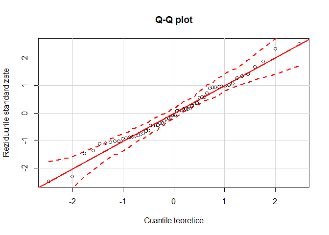<!-- -->

Trebuie menționat că în cazul în care ipoteza de normalitate era respinsă atunci puteam folosi testul neparametric `Kruskal-Wallis` (funcția `kruskal.test`) ca alternativă la ANOVA. 

Pentru a verifica **condiția de omogenitate** a datelor (homoscedasticitatea) pentru fiecare factor în parte folosim unul din testele următoare: *testul lui Bartlett* (funcția `bartlett.test`), *testul lui Fligner-Killeen* (funcția `fligner.test`), *testul lui Levene* (funcția `leveneTest` din pachetul `car`) sau *testul Brown-Forsythe* (funcția `leveneTest` din pachetul `car` sau funcția `hov()` din pachetul `HH`). Obținem:

  * testul lui Bartlett


```r
bartlett.test(len~supp, data = ToothGrowth)
```

```
## 
## 	Bartlett test of homogeneity of variances
## 
## data:  len by supp
## Bartlett's K-squared = 1.4217, df = 1, p-value = 0.2331
```

```r
bartlett.test(len~dose, data = ToothGrowth)
```

```
## 
## 	Bartlett test of homogeneity of variances
## 
## data:  len by dose
## Bartlett's K-squared = 0.66547, df = 2, p-value = 0.717
```

  * testul lui Fligner


```r
fligner.test(len~supp, data = ToothGrowth)
```

```
## 
## 	Fligner-Killeen test of homogeneity of variances
## 
## data:  len by supp
## Fligner-Killeen:med chi-squared = 0.97034, df = 1, p-value =
## 0.3246
```

```r
fligner.test(len~dose, data = ToothGrowth)
```

```
## 
## 	Fligner-Killeen test of homogeneity of variances
## 
## data:  len by dose
## Fligner-Killeen:med chi-squared = 1.3879, df = 2, p-value = 0.4996
```

  * testul lui Levene (clasic)


```r
leveneTest(len~supp, data = ToothGrowth, center = mean)
```

```
## Levene's Test for Homogeneity of Variance (center = mean)
##       Df F value Pr(>F)
## group  1  1.0973 0.2992
##       58
```

```r
leveneTest(len~dose, data = ToothGrowth, center = mean)
```

```
## Levene's Test for Homogeneity of Variance (center = mean)
##       Df F value Pr(>F)
## group  2  0.7328  0.485
##       57
```

  * testul lui Brown-Forsythe (similar cu testul lui Levene numai că folosește mediana în loc de medie și este mai robust)


```r
leveneTest(len~supp, data = ToothGrowth)
```

```
## Levene's Test for Homogeneity of Variance (center = median)
##       Df F value Pr(>F)
## group  1  1.2136 0.2752
##       58
```

```r
leveneTest(len~dose, data = ToothGrowth)
```

```
## Levene's Test for Homogeneity of Variance (center = median)
##       Df F value Pr(>F)
## group  2  0.6457 0.5281
##       57
```

### Comparări multiple
***

Am văzut din tabelul ANOVA cu doi factori că atât efectele principale (`supp` și `dose`) cât și interacția dintre cei doi factori (`supp:dose`) sunt semnificative. Pentru a vedea care interacțiune este semnificativă vom folosi metodologia testării multiple. Vom folosi *Testul lui Tukey HSD* (Honestly Significant Difference) deoarece suntem în situația unui plan de experiență echilibrat (în caz contrar am putea folosi *testul lui Scheffe*), test care permite compararea tuturor perechilor de diferențe dintre mediile grupurilor: 


```r
TukeyHSD(model_anova_2w)
```

```
##   Tukey multiple comparisons of means
##     95% family-wise confidence level
## 
## Fit: aov(formula = len ~ supp * dose, data = ToothGrowth)
## 
## $supp
##       diff       lwr       upr     p adj
## VC-OJ -3.7 -5.579828 -1.820172 0.0002312
## 
## $dose
##         diff       lwr       upr   p adj
## 1-0.5  9.130  6.362488 11.897512 0.0e+00
## 2-0.5 15.495 12.727488 18.262512 0.0e+00
## 2-1    6.365  3.597488  9.132512 2.7e-06
## 
## $`supp:dose`
##                diff        lwr        upr     p adj
## VC:0.5-OJ:0.5 -5.25 -10.048124 -0.4518762 0.0242521
## OJ:1-OJ:0.5    9.47   4.671876 14.2681238 0.0000046
## VC:1-OJ:0.5    3.54  -1.258124  8.3381238 0.2640208
## OJ:2-OJ:0.5   12.83   8.031876 17.6281238 0.0000000
## VC:2-OJ:0.5   12.91   8.111876 17.7081238 0.0000000
## OJ:1-VC:0.5   14.72   9.921876 19.5181238 0.0000000
## VC:1-VC:0.5    8.79   3.991876 13.5881238 0.0000210
## OJ:2-VC:0.5   18.08  13.281876 22.8781238 0.0000000
## VC:2-VC:0.5   18.16  13.361876 22.9581238 0.0000000
## VC:1-OJ:1     -5.93 -10.728124 -1.1318762 0.0073930
## OJ:2-OJ:1      3.36  -1.438124  8.1581238 0.3187361
## VC:2-OJ:1      3.44  -1.358124  8.2381238 0.2936430
## OJ:2-VC:1      9.29   4.491876 14.0881238 0.0000069
## VC:2-VC:1      9.37   4.571876 14.1681238 0.0000058
## VC:2-OJ:2      0.08  -4.718124  4.8781238 1.0000000
```

Observăm, de exemplu, că diferența dintre mediile lungimii dinților pentru porcușorii de gunineea care au primit o doză de 1 mg de Vitamina C prin suplementul de suc de portocale și prin suplementul de soluție de acid ascorbic este semnificativă (VC:1-OJ:1 $p=0.0073$) pe când diferența dintre mediile lungimii dinților pentru porcușorii de gunineea care au primit o doză  de 2 mg și una de 1 mg de Vitamina C prin suplementul de suc de portocale nu este semnificativă (OJ:2-OJ:1 $p = 0.318$). 

Aceste diferențe se pot observa și grafic:

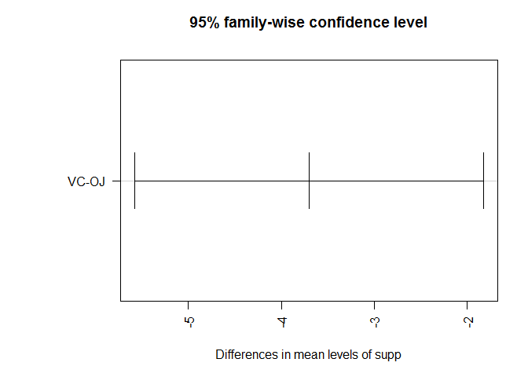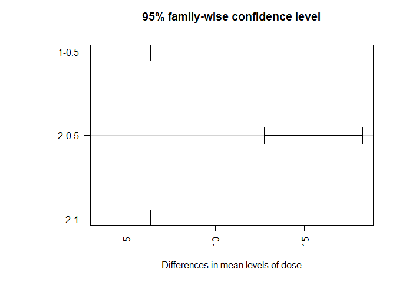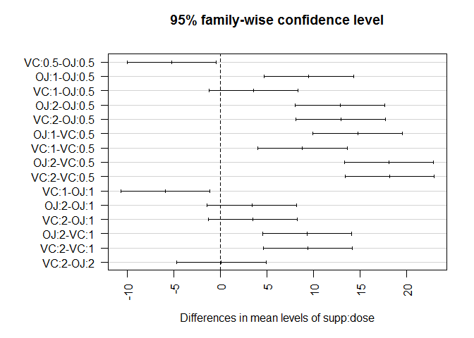


