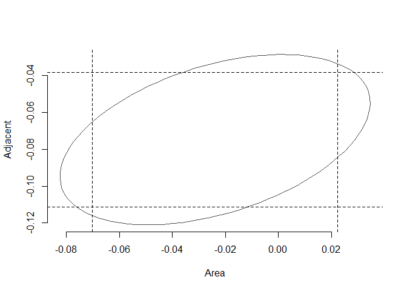

# Curs Biostatistica 2017 - Laborator 9 & 10
<style type="text/css">
.table {
    margin: auto;
    width: 40%;

}

.tocify{
  border: 0px solid;
}

.list-group-item.active{
  background-color: rgba(64, 64, 64, 0.72);
}

.list-group-item.active:hover{
  background-color: rgba(64, 64, 64, 0.72);
}
</style>

# Regresie liniară multiplă
***
***

## Introducere


Modelul de regresie liniară multiplă reprezintă o generalizare a modelului de regresie simplă. Dacă în regresia liniară simplă se folosea o singură variabilă predictor $X$ ca să explice variabila răspuns $Y$, în modelul de regresie liniară multiplă se folosesc mai multe variabile predictor $X_1,\ldots,X_k$ pentru a explica răspunsul $Y$:

$$
\mathbb{E}[Y|X_1 = x_1, \ldots, X_k=x_x]=\beta_0+\beta_1x_1+\beta_2x_2+\ldots+\beta_kx_k
$$
sau altfel scris

$$
Y = \beta_0 + \beta_1 X_1 + \ldots + \beta_k X_k + \varepsilon.
$$

Date fiind observațiile actuale, cu alte cuvinte dat fiind un eșantion $(X_{11},\ldots,X_{1k},Y_1),\ldots,(X_{n1},\ldots,X_{nk},Y_n)$ al lui $(X_1,\ldots,X_k,Y)$, unde $X_{ij}$ reprezintă a $i$-a observație a predictorului $X_j$, modelul se poate scrie 

$$
y_i = \beta_0+\beta_1x_{i1}+\beta_2x_{i2}+\ldots+\beta_kx_{ik}+\varepsilon_i, \quad i = 1,\ldots,n
$$

a cărui formă compactă (matriceală) este

$$
\mathbf{Y}=\mathbf{X}\boldsymbol\beta+\boldsymbol\varepsilon
$$

  - $\mathbf{X}$ este *matricea de design*
  
$$
\mathbf{X}=\begin{pmatrix}
1 & X_{11} & \cdots & X_{1k}\\
\vdots & \vdots & \ddots & \vdots\\
1 & X_{n1} & \cdots & X_{nk}
\end{pmatrix}_{n\times(k+1)}
$$

  - $\mathbf{Y}$ este *vectorul răspuns*, $\boldsymbol\beta$ este *vectorul coeficienților* iar $\boldsymbol\varepsilon$ este *vectorul eroare*
  
$$
\mathbf{Y}=\begin{pmatrix}
Y_1 \\
\vdots \\
Y_n
\end{pmatrix}_{n\times 1},\quad\boldsymbol\beta=\begin{pmatrix}
\beta_0 \\
\beta_1 \\
\vdots \\
\beta_k
\end{pmatrix}_{(k+1)\times 1}\text{ și }\quad
\boldsymbol\varepsilon=\begin{pmatrix}
\varepsilon_1 \\
\vdots \\
\varepsilon_n
\end{pmatrix}_{n\times 1}.
$$

\BeginKnitrBlock{rmdinsight}<div class="rmdinsight">Să observăm că pentru $k=1$ modelul se reduce la regresia liniară simplă. În acest caz:

$$
\mathbf{X}=\begin{pmatrix}
1 & X_{11}\\
\vdots & \vdots\\
1 & X_{n1}
\end{pmatrix}_{n\times2}\text{ și }\quad \beta=\begin{pmatrix}
\beta_0 \\
\beta_1 
\end{pmatrix}_{2\times 1}
$$</div>\EndKnitrBlock{rmdinsight}

*Suma abaterilor pătratice reziduale* pentru modelul de regresie liniară multiplă este 

$$
RSS(\boldsymbol\beta)=\sum_{i=1}^n(Y_i-\beta_0-\beta_1X_{i1}-\ldots-\beta_kX_{ik})^2=(\mathbf{Y}-\mathbf{X}\boldsymbol{\beta})^T(\mathbf{Y}-\mathbf{X}\boldsymbol{\beta})
$$

ceea ce conduce la *sistemul de ecuații normale* 

$$
\mathbf{X}^\intercal\mathbf{X}\hat{\boldsymbol{\beta}}=\mathbf{X}^\intercal\mathbf{Y}
$$

a cărui soluție, dat fiind că $\mathbf{X}^\intercal\mathbf{X}$ este inversabilă, este 

$$
\hat{\boldsymbol{\beta}}=(\mathbf{X}^\intercal\mathbf{X})^{-1}\mathbf{X}^\intercal\mathbf{Y}
$$

Odată ce avem estimatorul $\hat{\boldsymbol{\beta}}$ , putem defini:

- *valorile prognozate* (*fitted values*) $\hat Y_1,\ldots,\hat Y_n$ (valorile verticale pe hiperplanul de regresie), unde

$$
\hat Y_i=\hat\beta_0+\hat\beta_1X_{i1}+\cdots+\hat\beta_kX_{ik},\quad i=1,\ldots,n
$$

și sub formă matriceală 

$$
\hat{\mathbf{Y}}=\mathbf{X}\hat{\boldsymbol{\beta}}=\mathbf{X}(\mathbf{X}^\intercal\mathbf{X})^{-1}\mathbf{X}^\intercal\mathbf{Y}=\mathbf{H}\mathbf{Y}
$$

unde $\mathbf{H}=\mathbf{X}(\mathbf{X}^\intercal\mathbf{X})^{-1}\mathbf{X}^\intercal$ se numește *matricea căciulă* (*hat matrix*) și reprezintă proiecția ortogonală a lui $\mathbf{Y}$ în spațiul generat de $\mathbf{X}$.

- *reziduurile estimate* (*estimated residuals*) $\hat \varepsilon_1,\ldots,\hat \varepsilon_n$, unde

$$
\hat\varepsilon_i=Y_i-\hat Y_i,\quad i=1,\ldots,n
$$

și sub formă matriceală 

$$
\hat{\boldsymbol\varepsilon} = \boldsymbol Y - \hat{\boldsymbol Y} = (\boldsymbol I-\boldsymbol H)\boldsymbol Y
$$

<div class="figure" style="text-align: center">

<p class="caption">Planul de regresie (albastru) si relatia cu regresiile liniare simple (liniile verzi). Punctele rosii reprezinta un esantion pentru $(X_1,X_2,Y)$ iar punctele negre sunt subesantioane pentru $(X_1,X_2)$ (la baza), $(X_1,Y)$ (stanga) si $(X_2,Y)$ (dreapta).</p>
</div>

Ipotezele modelului sunt: 

i. **Linearitatea**: $\mathbb{E}[Y|X_1=x_1,\ldots,X_k=x_k]=\beta_0+\beta_1x_1+\ldots+\beta_kx_k$
ii. **Homoscedasticitatea**: $\mathbb{V}\text{ar}(\varepsilon_i)=\sigma^2$, cu $\sigma^2$ constantă pentru $i=1,\ldots,n$
iii. **Normalitatea**: $\varepsilon_i\sim\mathcal{N}(0,\sigma^2)$ pentru $i=1,\ldots,n$
iv. **Independența erorilor**: $\varepsilon_1,\ldots,\varepsilon_n$ sunt independente (sau necorelate, $\mathbb{E}[\varepsilon_i\varepsilon_j]=0$, $i\neq j$, deoarece sunt presupuse normale)

Altfel spus 

$$
Y|(X_1=x_1,\ldots,X_k=x_k)\sim \mathcal{N}(\beta_0+\beta_1x_1+\ldots+\beta_kx_k,\sigma^2)
$$

<div class="figure" style="text-align: center">

<p class="caption">Planul de regresie. Spatiul dintre cele doua plane galbene arata unde se afla 95% din observatii (dupa modelul ales).</p>
</div>

Estimatorul pentru $\sigma^2$ este 

$$
\hat{\sigma}^2 = \frac{RSS(\hat{\beta}_0,\hat{\beta}_1,\ldots, \hat{\beta}_k))}{n-(k+1)} = \frac{\hat{\boldsymbol \varepsilon}^\intercal\hat{\boldsymbol \varepsilon}}{n-(k+1)} = \frac{\sum_{i=1}^{n}\hat{\varepsilon}_i^2}{n-(k+1)}.
$$

## Exemplul 1

> Considerăm setul de date [`galapagos`](data/galapagos.csv) care conține informații despre numărul de specii de broaște țestoase din diferite insule din arhipelagul Galapagos (vezi [articol](http://science.sciencemag.org/content/179/4076/893.long)). Setul conține date din 30 de insule despre numărul de specii de țestoase (`Species`), numărul de specii endemice (`Endemics`), suprafața insulei (`Area`), înălțimea maximă a insulei (``Elevation`), distanța la cea mai apropiată insulă (`Nearest`), distanța față de insula Snata Cruz (`Scruz`) și suprafața insulei adiacente (`Adjacent`). Vrem să investigăm relația liniară dintre numărul de specii și celelalte variabile.

Începem prin a citi datele 


```r
# gala = read.csv("data/galapagos.csv")

data("gala") # este nevoie de libraria faraway
head(gala)
```

```
##              Species Endemics  Area Elevation Nearest Scruz Adjacent
## Baltra            58       23 25.09       346     0.6   0.6     1.84
## Bartolome         31       21  1.24       109     0.6  26.3   572.33
## Caldwell           3        3  0.21       114     2.8  58.7     0.78
## Champion          25        9  0.10        46     1.9  47.4     0.18
## Coamano            2        1  0.05        77     1.9   1.9   903.82
## Daphne.Major      18       11  0.34       119     8.0   8.0     1.84
```

Considerăm modelul de regresie liniară multiplă cu 5 predictori:


```r
gala_model = lm(Species ~ Area + Elevation + Nearest + Scruz + Adjacent, data=gala)

gala_model_summary = summary(gala_model)
gala_model_summary
```

```
## 
## Call:
## lm(formula = Species ~ Area + Elevation + Nearest + Scruz + Adjacent, 
##     data = gala)
## 
## Residuals:
##      Min       1Q   Median       3Q      Max 
## -111.679  -34.898   -7.862   33.460  182.584 
## 
## Coefficients:
##              Estimate Std. Error t value Pr(>|t|)    
## (Intercept)  7.068221  19.154198   0.369 0.715351    
## Area        -0.023938   0.022422  -1.068 0.296318    
## Elevation    0.319465   0.053663   5.953 3.82e-06 ***
## Nearest      0.009144   1.054136   0.009 0.993151    
## Scruz       -0.240524   0.215402  -1.117 0.275208    
## Adjacent    -0.074805   0.017700  -4.226 0.000297 ***
## ---
## Signif. codes:  0 '***' 0.001 '**' 0.01 '*' 0.05 '.' 0.1 ' ' 1
## 
## Residual standard error: 60.98 on 24 degrees of freedom
## Multiple R-squared:  0.7658,	Adjusted R-squared:  0.7171 
## F-statistic:  15.7 on 5 and 24 DF,  p-value: 6.838e-07
```

### Estimarea parametrilor

Pentru început extragem matricea de design $X$


```r
X = model.matrix( ~ Area + Elevation + Nearest + Scruz + Adjacent, 
    data = gala)

head(X)
```

```
##              (Intercept)  Area Elevation Nearest Scruz Adjacent
## Baltra                 1 25.09       346     0.6   0.6     1.84
## Bartolome              1  1.24       109     0.6  26.3   572.33
## Caldwell               1  0.21       114     2.8  58.7     0.78
## Champion               1  0.10        46     1.9  47.4     0.18
## Coamano                1  0.05        77     1.9   1.9   903.82
## Daphne.Major           1  0.34       119     8.0   8.0     1.84
```

și răspunsul $y$


```r
y = gala$Species
```

Vrem să găsim $\hat{\boldsymbol{\beta}}=(\mathbf{X}^\intercal\mathbf{X})^{-1}\mathbf{X}^\intercal\mathbf{Y}$


```r
# determinam (\mathbf{X}^\intercal\mathbf{X})^{-1}

xtxi = solve(t(X) %*% X) # t() - este transpusa
                         # %*% - produsul matriceal
                         # solve() - calculeaza pseudoinversa

bHat = xtxi %*% t(X) %*% y
bHat
```

```
##                     [,1]
## (Intercept)  7.068220709
## Area        -0.023938338
## Elevation    0.319464761
## Nearest      0.009143961
## Scruz       -0.240524230
## Adjacent    -0.074804832
```

```r
# sau alternativ folosind ecuatiile normale 
solve(crossprod(X,X), crossprod(X,y)) # crossprod calculeaza X^Ty
```

```
##                     [,1]
## (Intercept)  7.068220709
## Area        -0.023938338
## Elevation    0.319464761
## Nearest      0.009143961
## Scruz       -0.240524230
## Adjacent    -0.074804832
```

Estimatorul pentru $\sigma^2$ este dat de 


```r
sHat = sqrt(deviance(gala_model)/df.residual(gala_model))
sHat
```

```
## [1] 60.97519
```

```r
# sau inca

gala_model_summary$sigma
```

```
## [1] 60.97519
```

Dacă vrem să determinăm erorile standard ale coeficienților, i.e. $\hat{\mathrm{SE}}(\hat\beta_i)$, să observăm pentru început că acestea sunt date de următoarea formulă 

$$
\hat{\mathrm{SE}}(\hat\beta_{i-1}) = \hat{\sigma}\sqrt{(\mathbf{X}^\intercal\mathbf{X})^{-1}_{ii}}
$$

unde $(\mathbf{X}^\intercal\mathbf{X})^{-1}_{ii}$ reprezintă elementul $i$ de pe diagonala matricii $(\mathbf{X}^\intercal\mathbf{X})^{-1}$.


```r
seBHat = sHat*sqrt(diag(xtxi))
seBHat
```

```
## (Intercept)        Area   Elevation     Nearest       Scruz    Adjacent 
## 19.15419782  0.02242235  0.05366280  1.05413595  0.21540225  0.01770019
```

```r
# sau inca 

gala_model_summary$coefficients[, 2]
```

```
## (Intercept)        Area   Elevation     Nearest       Scruz    Adjacent 
## 19.15419782  0.02242235  0.05366280  1.05413595  0.21540225  0.01770019
```

### Inferență asupra parametrilor 

Având mai mulți predictori pentru o variabilă răspuns, ne întrebăm dacă avem nevoie de toți. Fie $\Theta$ spațiul parametrilor pentru un model mai mare și $\Theta_0$ spațiul parametrilor pentru un model mai mic ($\Theta_0\subset \Theta$). Dacă nu avem o diferență prea mare între concordanța celor două modele atunci îl preferăm pe cel mai simplu. Testul bazat pe raportul de verosimilități ($H_0: \theta\in \Theta_0$ vs $H_1: \theta\in\Theta$) conduce la respingerea ipotezei nule în cazul în care raportul 

$$
\frac{RSS_{\Theta_0}-RSS_{\Theta}}{RSS_{\Theta}}
$$

este suficient de mare. Dacă spațiul parametrilor $\Theta$ are dimensiunea $p$ (la noi $k+1$) iar spațiul parametrilor modelului redus $\Theta_0$ are dimensiunea $q$ atunci 

$$
F = \frac{\frac{RSS_{\Theta_0}-RSS_{\Theta}}{(p-q)}}{\frac{RSS_{\Theta}}{n-p}} = \frac{\frac{RSS_{\Theta_0}-RSS_{\Theta}}{(df_{\Theta_0}-df_{\Theta})}}{\frac{RSS_{\Theta}}{df_{\Theta}}} \sim F_{p-q,n-p}.
$$

unde $df_{\Theta_0}=n-q$ iar $df_{\Theta} = n-p$ (gradele de libertate sunt în general numărul de observații minus numărul de parametrii ai modelului).

  a) Test asupra tuturor predictorilor
  
Să presupunem că vrem să testăm ipoteza nulă 

$$
H_0: \beta_1 = \cdots = \beta_k = 0
$$
cu alte cuvinte vrem să răspundem la întrebarea dacă vreuna din variabilele explicative este folositoare în prezicerea răspunsului. În această situație modelul (complet $\Theta$) este $\boldsymbol y = \boldsymbol X\boldsymbol \beta+\boldsymbol\varepsilon$ și are $k+1$ parametrii ($k+1$ coeficienți $\beta_i$) iar modelul redus ($\Theta_0$) este $\boldsymbol y = \boldsymbol \mu+\boldsymbol\varepsilon$ și are $1$ parametru ($\beta_0$). Prin urmare avem statistica $F$ 

$$
F = \frac{\frac{RSS_{\Theta_0}-RSS_{\Theta}}{(k+1-1)}}{\frac{RSS_{\Theta}}{n-(k+1)}} = \frac{\frac{SS_{T}-RSS}{k}}{\frac{RSS}{n-(k+1)}}= \frac{\frac{SS_{reg}}{k}}{\frac{RSS}{n-(k+1)}}\sim F_{k,n-(k+1)}
$$

unde $RSS$ este suma abaterilor pătratice reziduale, $SS_T=(\boldsymbol y - \bar{\boldsymbol y})^\intercal(\boldsymbol y - \bar{\boldsymbol y})$ este suma abaterilor pătratice totale iar $SS_{reg}=SS_{T}-RSS$ este suma abaterilor de regresie, ceea ce conduce la tabelul ANOVA 

|  | Df | SS | MS | $F$ | $p$-value |
|--|------------|--------|---------|----------------|----------------|
| Regresie | $k$ | $SS_{reg}$ | $\frac{SS_{reg}}{k}$ | $F=\frac{SS_{reg}/k}{RSS/(n-(k+1))}$ | $p$ |
| Residuuri | $n - (k+1)$ | $RSS$ | $\frac{RSS}{n-(k+1)}$ | | |
| Total | $n-1$ | $SS_{T}$ | | | |

Chiar dacă ipoteza nulă a fost respinsă asta nu înseamnă că modelul dat de alternativă este cel mai bun (nu știm dacă toți predictorii sunt necesari în model sau doar o parte dintre ei). 

Pentru setul nostru de date să considerăm modelul nul (cel ce corespunde lui $\Theta_0$)


```r
gala_null_model = lm(Species ~ 1, data = gala)
```

Tabelul ANOVA este dat de 


```r
anova(gala_model, gala_null_model)
```

```
## Analysis of Variance Table
## 
## Model 1: Species ~ Area + Elevation + Nearest + Scruz + Adjacent
## Model 2: Species ~ 1
##   Res.Df    RSS Df Sum of Sq      F    Pr(>F)    
## 1     24  89231                                  
## 2     29 381081 -5   -291850 15.699 6.838e-07 ***
## ---
## Signif. codes:  0 '***' 0.001 '**' 0.01 '*' 0.05 '.' 0.1 ' ' 1
```

Observăm că ipoteza nulă este respinsă în acest caz în favoarea alternativei (p valoarea este aproximativ $6.8\times 10^{-7}$).

Putem calcula această p-valoare și fără a apela la ajutorul funcției `anova`:


```r
# pentru modelul redus 
RSS0 = deviance(gala_null_model)
df0 = df.residual(gala_null_model)

# pentru modelul intreg
RSS = deviance(gala_model)
df = df.residual(gala_model)

# statistica F

Fstat = ((RSS0 - RSS)/(df0 - df))/(RSS/df)

1-pf(Fstat, df0-df, df)
```

```
## [1] 6.837893e-07
```

  b) Test asupra unui predictor
  
Să presupunem acum că vrem să testăm dacă putem exclude din model un anumit predictor $i$ (fixat). Prin urmare vrem să testăm ipoteza nulă 

$$
H_0:\beta_i=0
$$

Considerăm modelul întreg $\Theta$ în care avem toți predictorii și modelul redus $\Theta_0$ în care avem toți predictorii mai puțin predictorul $i$ (în cazul problemei noastre o să testăm să vedem dacă putem exclude sau nu variabila explicativă `Area`):


```r
gala_Area_model = lm(Species ~ Elevation + Nearest + Scruz + Adjacent, 
    data = gala)

anova(gala_model, gala_Area_model)
```

```
## Analysis of Variance Table
## 
## Model 1: Species ~ Area + Elevation + Nearest + Scruz + Adjacent
## Model 2: Species ~ Elevation + Nearest + Scruz + Adjacent
##   Res.Df   RSS Df Sum of Sq      F Pr(>F)
## 1     24 89231                           
## 2     25 93469 -1   -4237.7 1.1398 0.2963
```

Observăm că nu putem respinge ipoteza nulă (p valoarea $>0.05$).

O abordare alternativă constă în folosirea statisticii de test 

$$
t_i = \frac{\hat\beta_i}{\hat{\mathrm{SE}}(\hat\beta_j)}\sim_{H_0} t_{n-k-1}
$$

care verifică relația $t_i^2 = F$. Putem vedea statistica student în output-ul funcției `summary`:


```r
gala_model_summary$coefficients
```

```
##                 Estimate  Std. Error      t value     Pr(>|t|)
## (Intercept)  7.068220709 19.15419782  0.369016796 7.153508e-01
## Area        -0.023938338  0.02242235 -1.067610554 2.963180e-01
## Elevation    0.319464761  0.05366280  5.953187968 3.823409e-06
## Nearest      0.009143961  1.05413595  0.008674366 9.931506e-01
## Scruz       -0.240524230  0.21540225 -1.116628222 2.752082e-01
## Adjacent    -0.074804832  0.01770019 -4.226216850 2.970655e-04
```

  c) Test pentru o pereche de predictori
  
Să presupunem că vrem să testăm dacă suprafața insulei curente sau a insulei adiacente au vreo relație relativ la variabila răspuns. Prin urmare vrem să testăm ipoteza nulă (**să ținem cont că trebuie să specificăm care sunt toți predictorii !**)

$$
H_0:\beta_i=\beta_j=0\quad(\beta_{Area}=\beta_{Adjacent}=0)
$$

Putem testa această ipoteză folosind procedura descrisă anterior:


```r
gala_Area_Adjacent_model = lm(Species ~ Elevation + Nearest + Scruz, 
    data = gala)

anova(gala_Area_Adjacent_model, gala_model)
```

```
## Analysis of Variance Table
## 
## Model 1: Species ~ Elevation + Nearest + Scruz
## Model 2: Species ~ Area + Elevation + Nearest + Scruz + Adjacent
##   Res.Df    RSS Df Sum of Sq      F  Pr(>F)   
## 1     26 158292                               
## 2     24  89231  2     69060 9.2874 0.00103 **
## ---
## Signif. codes:  0 '***' 0.001 '**' 0.01 '*' 0.05 '.' 0.1 ' ' 1
```

Observăm că ipoteza nulă este respinsă deoarece p-valoarea este mică (prin urmare excluderea celor doi predictori nu este justificată).

### Intervale de încredere pentru parametrii

Cum repartiția lui $\hat{\boldsymbol{\beta}}$ este:

$$
\hat{\boldsymbol{\beta}}\sim\mathcal{N}_{k+1}\left(\boldsymbol\beta,\sigma^2(\mathbf{X}^T\mathbf{X})^{-1}\right)
$$

atunci estimatorul $\hat\sigma^2$ pentru $\sigma^2$ obținem că

$$
\frac{\hat\beta_j-\beta_j}{\hat{\mathrm{SE}}(\hat\beta_j)}\sim t_{n-(k+1)}
$$

iar un interval de încredere de nivel $1-\alpha$ pentru parametrul $\beta_j$ este

$$
IC = \left(\hat\beta_j\pm\hat{\mathrm{SE}}(\hat\beta_j)t_{n-2;\alpha/2}\right)
$$

Putem construi intervale de încredere pentru parametrii folosind funcția `confint`:


```r
confint(gala_model)
```

```
##                   2.5 %      97.5 %
## (Intercept) -32.4641006 46.60054205
## Area         -0.0702158  0.02233912
## Elevation     0.2087102  0.43021935
## Nearest      -2.1664857  2.18477363
## Scruz        -0.6850926  0.20404416
## Adjacent     -0.1113362 -0.03827344
```

Dacă vrem să construim o regiune de încredere pentru mai mult de un parametru atunci putem să folosim relația:

$$
(\hat{\boldsymbol \beta} - \boldsymbol \beta)^\intercal\boldsymbol X^\intercal \boldsymbol X (\hat{\boldsymbol \beta} - \boldsymbol \beta)\leq (k+1)\hat{\boldsymbol \sigma}^2F_{k+1, n-(k+1)}^{1-\alpha}
$$

care reprezintă o regiune de încredere pentru $\boldsymbol \beta$.

De exemplu vrem să construim o regiune de încredere pentru perechea $(\beta_{Area},\beta_{Adjacent})$:


```r
plot(ellipse(gala_model, c(2,6)), type = "l", col = "grey30", 
     xlab = "Area", 
     ylab = "Adjacent", 
     bty = "n")
points(0, 0, pch = 18, col = "grey50")
abline(v = confint(gala_model)[2,], lty = 2)
abline(h = confint(gala_model)[6,], lty = 2)
```

<div class="figure" style="text-align: center">

<p class="caption">Regiune de incredere pentru Area si Adjacent</p>
</div>

Cum punctul $(0,0)$ nu aparține regiunii elipsoidale atunci putem respinge ipoteza nulă $H_0:\beta_{Area}=\beta_{Adjacent}=0$.


